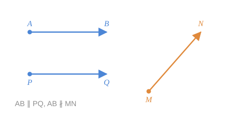
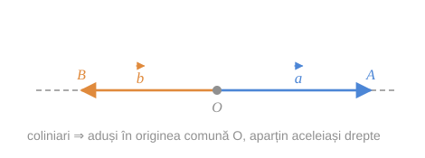
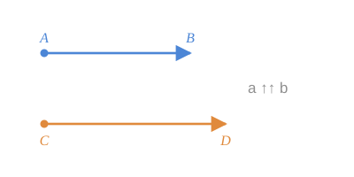
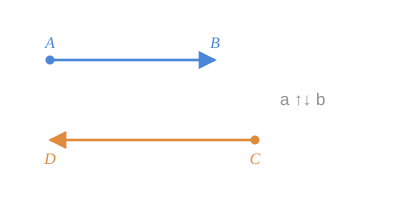

## 1. Vector paralel cu o dreaptă și cu un plan

> [!abstract] Definiție
> Vectorul $\vec{a}$ este **paralel cu dreapta** $d$ dacă un reprezentant al său (deci oricare) este paralel cu $d$ sau este situat pe $d$.

> [!note] Observație
> Dacă $\vec{a}$ este paralel cu dreapta $d$, atunci el este paralel cu **orice** dreaptă paralelă cu $d$. Proprietatea nu depinde de reprezentantul ales — toți reprezentanții sunt [[Echipolență|echipolenți]], deci au aceeași [[Direcție|direcție]].

> [!abstract] Definiție
> Vectorul $\vec{a}$ este **paralel cu planul** $\alpha$ dacă $\vec{a}$ este paralel cu o dreaptă situată în planul $\alpha$. Dacă $\vec{a} \parallel \alpha$, atunci $\vec{a}$ este paralel cu orice plan paralel cu $\alpha$.

## 2. Vectori coliniari

> [!abstract] Definiție
> Doi vectori $\vec{a}$ și $\vec{b}$ se numesc **coliniari** dacă există o dreaptă la care ei sunt paraleli.
> Se notează $\vec{a} \parallel \vec{b}$; dacă nu sunt coliniari, $\vec{a} \not\parallel \vec{b}$.

> [!note] Convenție
> **Vectorul nul este coliniar cu orice vector.** ($\vec{0}$ nu determină o direcție, deci este paralel cu orice dreaptă.)

*fig. 1 — $\vec{AB} \parallel \vec{PQ}$, dar $\vec{AB} \not\parallel \vec{MN}$*

### De ce se numesc „coliniari"

Fie $\vec{a}$ și $\vec{b}$ doi vectori coliniari. Îi depunem dintr-un punct arbitrar $O$: $\vec{OA} = \vec{a}$ și $\vec{OB} = \vec{b}$. Segmentele orientate $\overline{OA}$ și $\overline{OB}$ au **originea comună** și, fiind coliniare, aparțin **aceleiași drepte**.

*fig. 2 — doi vectori coliniari aduși la originea comună $O$*

> [!tip] Aceasta este explicația termenului
> „Coliniari" = *pot fi puși pe una și aceeași dreaptă*. Posibilitatea de a-i depune din același punct vine din [[Vectori#4. Existența și unicitatea reprezentantului cu origine dată|teorema reprezentantului unic]].

## 3. Vectori la fel orientați și opus orientați

Fie $\overline{AB}$ și $\overline{CD}$ reprezentanți ai vectorilor coliniari $\vec{a}$ și $\vec{b}$, adică $\overline{AB} \in \vec{a}$ și $\overline{CD} \in \vec{b}$. Conform definiției coliniarității, segmentele orientate $\overline{AB}$ și $\overline{CD}$ sunt paralele sau aparțin aceleiași drepte — deci are sens să comparăm orientarea lor.

> [!abstract] Definiție
> Vectorii $\vec{a}$ și $\vec{b}$ se numesc **la fel orientați** dacă la fel sunt orientate segmentele $\overline{AB}$ și $\overline{CD}$, și **opus orientați** dacă aceste segmente sunt opus orientate.
> Se notează $\vec{a} \uparrow\uparrow \vec{b}$, respectiv $\vec{a} \uparrow\downarrow \vec{b}$.

*fig. 3 — $\vec{a} \uparrow\uparrow \vec{b}$*

*fig. 4 — $\vec{a} \uparrow\downarrow \vec{b}$*

> [!warning] Definiția este corectă
> Proprietatea a doi vectori de a fi la fel orientați (sau opus orientați) **nu depinde de reprezentanții aleși**. Dacă am fi luat alți reprezentanți, aceștia ar fi echipolenți cu primii, deci la fel orientați cu ei — iar coorientarea este [[Orientarea semidreptelor. Direcție|tranzitivă]].

> [!example]- Pas cu pas — de ce definiția nu depinde de reprezentanți
> Definiția spune „$\vec{a} \uparrow\uparrow \vec{b}$ dacă $\overline{AB} \uparrow\uparrow \overline{CD}$" — dar $\vec{a}$ are o infinitate de reprezentanți. Ce ne asigură că nu obținem răspunsuri diferite alegând altele?
>
> **Pasul 1 — punem problema exact.** Fie $\overline{AB}$, $\overline{A'B'}$ doi reprezentanți ai lui $\vec{a}$ și $\overline{CD}$, $\overline{C'D'}$ doi reprezentanți ai lui $\vec{b}$. Presupunem $\overline{AB} \uparrow\uparrow \overline{CD}$. Trebuie arătat că și $\overline{A'B'} \uparrow\uparrow \overline{C'D'}$.
>
> **Pasul 2 — ce știm despre reprezentanți.** Fiind reprezentanți ai aceluiași vector, ei sunt echipolenți: $\overline{A'B'} \overset{\omega}{=} \overline{AB}$ și $\overline{C'D'} \overset{\omega}{=} \overline{CD}$.
>
> **Pasul 3 — echipolent ⇒ la fel orientat.** Prin definiția echipolenței, segmente echipolente sunt (printre altele) **la fel orientate**. Deci $\overline{A'B'} \uparrow\uparrow \overline{AB}$ și $\overline{CD} \uparrow\uparrow \overline{C'D'}$.
>
> **Pasul 4 — înlănțuim.**
> $$
> \overline{A'B'} \uparrow\uparrow \overline{AB} \uparrow\uparrow \overline{CD} \uparrow\uparrow \overline{C'D'}
> $$
> Prin **tranzitivitatea** coorientării, $\overline{A'B'} \uparrow\uparrow \overline{C'D'}$. $\blacksquare$
>
> **Ce ar fi mers prost fără tranzitivitate.** Pasul 4 e singurul loc unde se folosește, dar fără el întreaga definiție s-ar prăbuși: aceeași pereche de vectori ar putea ieși „la fel orientată" cu o alegere de desene și „opus orientată" cu alta.

> [!note] Convenția pentru vectorul nul
> $$
> \vec{0} \uparrow\uparrow \vec{a} \quad \text{pentru orice vector } \vec{a}.
> $$
> Vectorul nul se consideră **la fel orientat cu orice vector**. Convenția e una de comoditate — permite, de exemplu, ca definiția 5.1 să includă cazul $\alpha = 0$ fără excepție.
>
> **Atenție:** prin vectorul nul, coorientarea **nu** mai este tranzitivă: $\vec{a} \uparrow\uparrow \vec{0} \uparrow\uparrow -\vec{a}$, deși $\vec{a} \uparrow\downarrow -\vec{a}$. De aceea, în raționamentele care folosesc tranzitivitatea (ca în blocul „Pas cu pas" de mai sus), vectorii sunt presupuși **nenuli**; cazul vectorului nul se tratează separat.

## Întrebări de control

1. De ce definiția coliniarității nu cere ca vectorii să fie pe aceeași dreaptă, ci doar paraleli cu o dreaptă?
2. De ce vectorul nul se consideră coliniar cu orice vector și la fel orientat cu orice vector?
3. Doi vectori coliniari sunt neapărat egali? Dar doi vectori egali sunt neapărat coliniari?
4. Pot fi doi vectori simultan la fel orientați și opus orientați?

## Legături

- Anterior: [[Vectori]]
- Continuare: [[Modulul vectorului. Vectorul opus]]
- Concepte: [[Vectori coliniari]], [[Direcție]]
