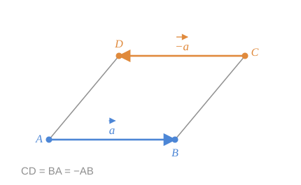

## 1. Vectorul opus

Fie $\vec{a}$ un vector arbitrar. Dintr-un punct oarecare $A$ depunem vectorul $\vec{AB} = \vec{a}$.

> [!abstract] Definiție
> Vectorul $\vec{BA}$ se numește **vectorul opus** vectorului $\vec{a}$ și se notează $-\vec{a}$.

*fig. 1 — paralelogramul $ABCD$: $\vec{CD}$ este opusul lui $\vec{AB}$, deoarece $\vec{CD} = \vec{BA}$*

### Proprietăți

1. $-(-\vec{a}) = \vec{a}$ — vectorul opus vectorului $\vec{BA}$ este chiar $\vec{AB}$.
2. $-\vec{0} = \vec{0}$ — vectorul opus vectorului nul este vectorul nul.
3. $\vec{a} \uparrow\downarrow (-\vec{a})$ și $|-\vec{a}| = |\vec{a}|$ — același modul, aceeași direcție, sens opus.

> [!note] Definiția nu depinde de punctul $A$
> Dacă am depune $\vec{a}$ din alt punct $A'$, obținând $\vec{A'B'} = \vec{a}$, atunci $\overline{AB} \overset{\omega}{=} \overline{A'B'}$ și, prin urmare, $\overline{BA} \overset{\omega}{=} \overline{B'A'}$ — deci $\vec{BA} = \vec{B'A'}$. Vectorul opus este bine definit.

## 2. Modulul vectorului

> [!abstract] Definiție
> Se numește **lungime a vectorului** (sau **modulul vectorului**) lungimea oricărui reprezentant al vectorului.
> Modulele vectorilor $\vec{a}$, $\vec{b}$, $\vec{CD}$ se notează $|\vec{a}|$, $|\vec{b}|$, $|\vec{CD}|$.

$$
|\vec{0}| = 0
$$

> [!warning] De ce definiția este corectă
> Toți reprezentanții unui vector sunt echipolenți, iar echipolența cere **lungimi egale**. Deci lungimea nu depinde de reprezentantul ales.

### Proprietăți de bază

| Proprietate | Formulare |
|---|---|
| Nenegativitate | $\lvert \vec{a} \rvert \ge 0$ |
| Anulare | $\lvert \vec{a} \rvert = 0 \iff \vec{a} = \vec{0}$ |
| Simetrie | $\lvert -\vec{a} \rvert = \lvert \vec{a} \rvert$ |

> [!info]- Completare — inegalitatea triunghiului
> $$
> \bigl| \lvert\vec{a}\rvert - \lvert\vec{b}\rvert \bigr| \le \lvert \vec{a} + \vec{b} \rvert \le \lvert \vec{a} \rvert + \lvert \vec{b} \rvert
> $$
> Egalitatea în dreapta are loc exact când $\vec{a} \uparrow\uparrow \vec{b}$. Rezultă direct din [[Adunarea vectorilor. Regula triunghiului și a poligonului|regula triunghiului]]: o latură a triunghiului nu depășește suma celorlalte două. Nu figurează încă în notițele de curs.

## 3. Vectorul liber — bilanț

Am menționat deja că **din orice punct al spațiului poate fi depus un vector egal cu vectorul dat**. Acest fapt ne permite, după necesitate:

- să aducem doi sau mai mulți vectori la **origine comună**;
- să efectuăm alte construcții cu vectori (adunare cap-la-cap, paralelogram etc.).

În sensul arătat, vectorul se consideră **liber**. Anume astfel de vectori se studiază în matematică; la ei se referă definițiile date și proprietățile stabilite mai sus, cât și operațiile ce urmează.

## Întrebări de control

1. De ce modulul unui vector este bine definit, deși vectorul are o infinitate de reprezentanți?
2. Arătați că $\vec{CD} = -\vec{AB}$ în paralelogramul $ABCD$.
3. Poate un vector nenul să fie egal cu opusul său?
4. Ce înseamnă, exact, că vectorul este „liber"?

## Legături

- Anterior: [[Coliniaritatea și orientarea vectorilor]]
- Continuare: [[Vectori aplicați, alunecători și liberi]]
- Concepte: [[Modulul vectorului]], [[Vector opus]], [[Vector liber]]
