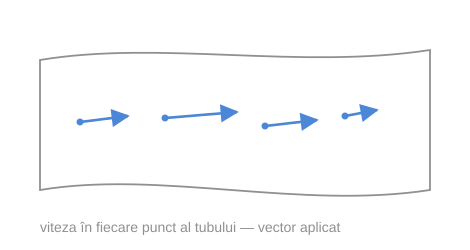
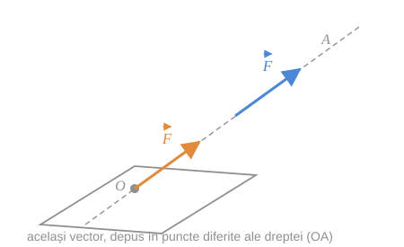
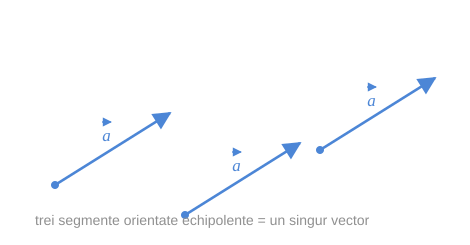

Menționăm că în fizică și în alte domenii se întâlnesc și **vectori de tip special**. Deosebirea dintre ei stă în *cât de mult poate fi mutat* un vector fără să-și schimbe sensul fizic.

## 1. Vectori aplicați (legați)

> [!abstract] Definiție
> Se numesc **vectori aplicați** vectorii caracterizați nu numai de lungime și direcție, dar **și de punctul în care se află originea**.

Ca exemplu avem vectorul vitezei particulelor de lichid ce curge printr-un tub neuniform. În fiecare punct din interiorul tubului, vectorul vitezei este un vector aplicat.

*fig. 1 — câmpul vitezelor într-un tub: fiecare săgeată e legată de punctul ei*

> [!warning] Egalitatea vectorilor aplicați
> Doi vectori aplicați sunt egali **numai** în cazul când ei coincid — adică au aceeași origine, aceeași direcție, același sens și aceeași lungime.

## 2. Vectori alunecători

> [!abstract] Definiție
> Se numesc **vectori alunecători** vectorii ce acționează pe una și aceeași dreaptă.

Ca exemplu avem vectorii forței ce acționează asupra unui corp solid. Dacă $O$ este centrul de greutate al corpului, iar $(OA)$ este direcția acțiunii forței $\vec{F}$, atunci vectorul $\vec{F}$ poate fi reprezentat cu originea în **orice punct al dreptei** $(OA)$ — efectul asupra corpului rigid este același.

*fig. 2 — forța poate „aluneca" de-a lungul dreptei ei de acțiune*

## 3. Vectori liberi

Ca vectori liberi în fizică avem vectorii vitezei mișcării particulelor unui corp solid ce se deplasează sub acțiunea unei forțe. Un astfel de vector poate fi reprezentat cu originea în **orice punct** al corpului dat.

*fig. 3 — un vector liber: toți reprezentanții echipolenți sunt „același" vector*

> [!tip] Vectorii din acest curs
> **În matematică se studiază vectorii liberi.** La ei se referă toate definițiile date și proprietățile stabilite până acum, cât și operațiile ce urmează.

### Comparație

| Tip | Ce îl determină | Unde poate fi mutat | Egalitate |
|---|---|---|---|
| Aplicat | origine + direcție + sens + lungime | nicăieri | doar dacă coincid complet |
| Alunecător | dreapta de acțiune + sens + lungime | pe dreapta sa | dacă au aceeași dreaptă-suport, același sens și aceeași lungime |
| **Liber** | direcție + sens + lungime | oriunde în spațiu | dacă sunt [[Echipolență\|echipolenți]] |

## 4. Mărimea vectorială

> [!abstract] Definiție
> **Mărimea caracterizată de măsura numerică și de direcția în care acționează se numește mărime vectorială.**

Astfel, segmentele orientate ne servesc pentru reprezentarea vectorilor, analogic cum numerele ne servesc pentru reprezentarea **mărimilor scalare**.

| | Mărime scalară | Mărime vectorială |
|---|---|---|
| Determinată de | un număr | număr + direcție + sens |
| Reprezentată prin | un număr | un [[Segment orientat\|segment orientat]] |
| Exemple | masă, temperatură, timp, lungime | forță, viteză, accelerație, deplasare |

## Întrebări de control

1. De ce vectorul forței aplicate unui corp rigid este alunecător, dar viteza unei particule de lichid este un vector aplicat?
2. Câți reprezentanți are un vector liber? Dar un vector aplicat?
3. De ce în matematică se preferă vectorii liberi?
4. Dați trei exemple de mărimi scalare și trei de mărimi vectoriale, altele decât cele din tabel.

## Legături

- Anterior: [[Modulul vectorului. Vectorul opus]]
- Continuare: [[Adunarea vectorilor. Regula triunghiului și a poligonului]]
- Concepte: [[Vector liber]]
