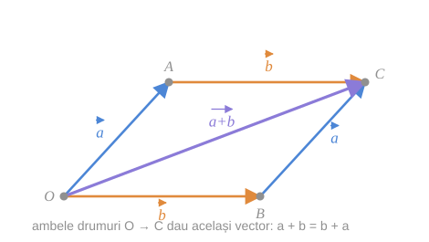
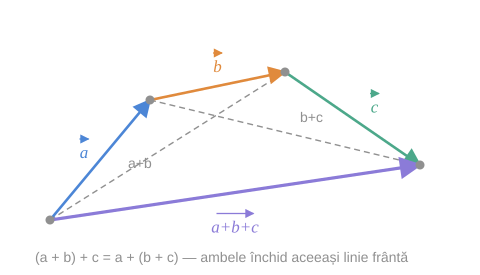

Adunarea vectorilor posedă următoarele proprietăți.

## 1. Comutativitatea

> [!tip] Proprietate
> Pentru orice doi vectori $\vec{a}$ și $\vec{b}$ are loc egalitatea
> $$
> \vec{a} + \vec{b} = \vec{b} + \vec{a} \tag{6}
> $$

*fig. 1 — ambele drumuri $O \to C$ dau același vector*

> [!info]- De ce — citirea figurii
> În paralelogramul $OACB$ există două drumuri de la $O$ la $C$:
> - $O \to A \to C$: parcurgem întâi $\vec{a}$, apoi $\vec{b}$ — deci $\vec{a} + \vec{b}$;
> - $O \to B \to C$: parcurgem întâi $\vec{b}$, apoi $\vec{a}$ — deci $\vec{b} + \vec{a}$.
>
> Ambele se termină în același punct $C$, deci ambele sume sunt $\vec{OC}$.

> [!example]- Cum se citește figura — comutativitatea
> **Pasul 1 — cei doi vectori din $O$.** $\vec{OA} = \vec{a}$ (albastru, spre stânga-sus) și $\vec{OB} = \vec{b}$ (portocaliu, pe orizontală).
>
> **Pasul 2 — laturile opuse.** Latura de sus $A \to C$ este tot portocalie — o copie a lui $\vec{b}$; latura din dreapta $B \to C$ este tot albastră — o copie a lui $\vec{a}$. Culoarea arată echipolența laturilor opuse.
>
> **Pasul 3 — cele două drumuri.** Pe sus, $O \to A \to C$: albastru apoi portocaliu, adică $\vec{a} + \vec{b}$. Pe jos, $O \to B \to C$: portocaliu apoi albastru, adică $\vec{b} + \vec{a}$.
>
> **Pasul 4 — concluzia (violet).** Ambele drumuri se opresc în $C$, deci ambele sume sunt diagonala $\vec{OC}$.
>
> **Pe ce se bazează:** [[Regula paralelogramului]] (existența lui $C$ și echipolența laturilor opuse); [[Adunarea vectorilor. Regula triunghiului și a poligonului#2. Regula triunghiului|regula triunghiului]], aplicată de două ori.
>
> **Ce să verificați singuri pe figură:** (1) cele două laturi portocalii sunt paralele și egale, la fel cele albastre; (2) pentru $\vec{a} \parallel \vec{b}$ paralelogramul dispare — comutativitatea se verifică atunci direct pe o dreaptă (întrebarea 1).

## 2. Asociativitatea

> [!tip] Proprietate
> Pentru orice trei vectori $\vec{a}$, $\vec{b}$ și $\vec{c}$ are loc egalitatea
> $$
> (\vec{a} + \vec{b}) + \vec{c} = \vec{a} + (\vec{b} + \vec{c}) \tag{7}
> $$

*fig. 2 — aceeași linie frântă, două moduri de a o grupa*

> [!info]- De ce — citirea figurii
> Construim linia frântă $A \to B \to C \to D$ cu $\vec{AB} = \vec{a}$, $\vec{BC} = \vec{b}$, $\vec{CD} = \vec{c}$.
> - $(\vec{a} + \vec{b}) + \vec{c} = \vec{AC} + \vec{CD} = \vec{AD}$;
> - $\vec{a} + (\vec{b} + \vec{c}) = \vec{AB} + \vec{BD} = \vec{AD}$.
>
> Gruparea schimbă doar **ordinea calculelor**, nu și punctul final $D$.

> [!example]- Cum se citește figura — asociativitatea
> **Pasul 1 — linia frântă.** $A \to B \to C \to D$: albastru $\vec{a}$, portocaliu $\vec{b}$, verde $\vec{c}$, cap la cap.
>
> **Pasul 2 — gruparea $(\vec{a} + \vec{b}) + \vec{c}$.** Linia gri punctată $A \to C$ (eticheta $a+b$) înlocuiește primele două săgeți; din $C$ continuăm cu verdele până în $D$.
>
> **Pasul 3 — gruparea $\vec{a} + (\vec{b} + \vec{c})$.** Linia gri punctată $B \to D$ (eticheta $b+c$) înlocuiește ultimele două săgeți; o adăugăm după albastrul $\vec{AB}$ și ajungem tot în $D$.
>
> **Pasul 4 — concluzia (violet).** Ambele grupări duc de la $A$ la $D$, deci ambele dau săgeata violet $\vec{AD}$.
>
> **Pe ce se bazează:** [[Adunarea vectorilor. Regula triunghiului și a poligonului#3. Relația lui Chasles|relația lui Chasles]] în triunghiurile $ABC$, $ACD$ (prima grupare) și $BCD$, $ABD$ (a doua).
>
> **Ce să verificați singuri pe figură:** (1) cele două linii gri se intersectează, dar fiecare aparține unei singure grupări; (2) pentru patru vectori ar apărea un al cincilea punct $E$ și cinci grupări posibile, toate cu aceeași săgeată finală $\vec{AE}$.

> [!note] Consecință practică
> Datorită proprietăților (6) și (7), într-o sumă de vectori **parantezele și ordinea termenilor nu contează** — exact ca la adunarea numerelor. De aceea scriem simplu $\vec{a}_1 + \vec{a}_2 + \dots + \vec{a}_n$ fără paranteze.

## 3. Elementul neutru și elementul opus

Din [[Adunarea vectorilor. Regula triunghiului și a poligonului#Consecința 1 — vectorul nul este element neutru|relația (3)]] și [[Adunarea vectorilor. Regula triunghiului și a poligonului#Consecința 2 — existența vectorului opus|relația (4)]]:

$$
\vec{a} + \vec{0} = \vec{0} + \vec{a} = \vec{a} \tag{3}
$$
$$
\vec{a} + (-\vec{a}) = -\vec{a} + \vec{a} = \vec{0} \tag{4}
$$

## Bilanț: ce structură am obținut

| # | Proprietate | Formulare |
|---|---|---|
| 1 | comutativitate | $\vec{a} + \vec{b} = \vec{b} + \vec{a}$ |
| 2 | asociativitate | $(\vec{a} + \vec{b}) + \vec{c} = \vec{a} + (\vec{b} + \vec{c})$ |
| 3 | element neutru | $\exists\, \vec{0}:\ \vec{a} + \vec{0} = \vec{a}$ |
| 4 | element opus | $\forall \vec{a}\ \exists\, (-\vec{a}):\ \vec{a} + (-\vec{a}) = \vec{0}$ |

> [!tip] Anticipare
> Aceste patru proprietăți spun că mulțimea vectorilor formează un **grup abelian** față de adunare. Împreună cu proprietățile [[Proprietățile înmulțirii vectorului cu un număr|înmulțirii cu un număr]], ele vor da structura de [[Spațiul vectorial al vectorilor liberi|spațiu vectorial]].

## Întrebări de control

1. Demonstrați (6) folosind regula paralelogramului. De ce demonstrația trebuie completată separat pentru vectori coliniari?
2. Câte moduri de a pune paranteze există la suma $\vec{a} + \vec{b} + \vec{c} + \vec{d}$? De ce toate dau același rezultat?
3. Există un vector $\vec{x}$ cu $\vec{a} + \vec{x} = \vec{a}$ pentru un singur $\vec{a}$, dar nu pentru toți?
4. Arătați că elementul opus este unic.

## Legături

- Anterior: [[Regula paralelogramului]]
- Continuare: [[Scăderea vectorilor]]
