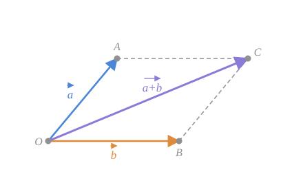

Din fizică se cunoaște **regula paralelogramului** de compunere a două forțe ce acționează sub un unghi una față de alta. După această regulă se pot aduna **numai doi vectori necoliniari**.

## Construcția

Fixăm doi vectori necoliniari $\vec{a}$ și $\vec{b}$. Luăm un punct arbitrar $O$ și construim vectorii $\vec{OA} = \vec{a}$ și $\vec{OB} = \vec{b}$. Construim apoi $(AC) \parallel (OB)$ și $(BC) \parallel (OA)$.

*fig. 1 — paralelogramul $OACB$ construit pe vectorii $\vec{a}$ și $\vec{b}$*

În rezultat obținem paralelogramul $OACB$. Deoarece $\vec{AC} = \vec{OB}$, după [[Adunarea vectorilor. Regula triunghiului și a poligonului|regula triunghiului]] obținem

$$
\vec{OC} = \vec{OA} + \vec{AC} = \vec{OA} + \vec{OB} = \vec{a} + \vec{b} \tag{5}
$$

> [!check] Regula paralelogramului
> $\vec{a} + \vec{b} = \vec{OC}$, unde $\vec{OC}$ este vectorul orientat după **diagonala paralelogramului** $OACB$, construit pe vectorii $\vec{a}$ și $\vec{b}$ aduși la **originea comună** $O$.

> [!example]- Cum se citește figura — regula paralelogramului
> **Pasul 1 — originea comună.** $\vec{OA} = \vec{a}$ (albastru) și $\vec{OB} = \vec{b}$ (portocaliu) pornesc din același punct $O$ — aici diferă de regula triunghiului.
>
> **Pasul 2 — construcția (gri punctat).** Prin $A$ paralela la $(OB)$, prin $B$ paralela la $(OA)$; ele se taie în $C$ și închid paralelogramul $OACB$.
>
> **Pasul 3 — mutarea lui $\vec{b}$.** Latura punctată $[AC]$ este paralelă, egală și la fel orientată cu $\overline{OB}$, deci $\vec{AC} = \vec{b}$: drumul $O \to A \to C$ înseamnă „întâi $\vec{a}$, apoi $\vec{b}$”, cap la cap.
>
> **Pasul 4 — concluzia (violet).** Regula triunghiului în triunghiul $OAC$ dă diagonala $\vec{OC} = \vec{a} + \vec{b}$.
>
> **Pe ce se bazează:** laturile opuse ale unui paralelogram sunt paralele și egale ⇒ [[Echipolență|echipolență]] (pasul 3); [[Adunarea vectorilor. Regula triunghiului și a poligonului#2. Regula triunghiului|regula triunghiului]] (pasul 4).
>
> **Ce să verificați singuri pe figură:** (1) diagonala violet pleacă din $O$, nu din $A$ sau $B$; (2) apropiați în gând $\vec{b}$ de dreapta lui $\vec{a}$: paralelogramul se turtește și dispare când vectorii devin coliniari — de aceea regula cere vectori necoliniari.

## Care regulă este mai generală?

> [!tip] Regula triunghiului este mai generală
> Regula paralelogramului (relația 5) **rezultă** din cea a triunghiului. Regula triunghiului este mai generală, deoarece include și adunarea vectorilor **coliniari**, pe când regula paralelogramului nu poate fi aplicată la adunarea unor astfel de vectori.

Motivul este simplu: dacă $\vec{a} \parallel \vec{b}$, atunci punctele $O$, $A$, $B$ sunt coliniare și **nu se formează niciun paralelogram**.

| | Regula triunghiului | Regula paralelogramului |
|---|---|---|
| Cum se așază vectorii | cap la cap | din origine comună |
| Vectori coliniari | **da** | nu |
| Mai mult de 2 vectori | da (regula poligonului) | nu direct |
| Suma este | latura de închidere | diagonala |

> [!info]- Completare — cealaltă diagonală
> În paralelogramul construit pe $\vec{a}$ și $\vec{b}$ din originea comună $O$:
> - diagonala **din $O$** reprezintă $\vec{a} + \vec{b}$;
> - cealaltă diagonală reprezintă $\vec{a} - \vec{b}$ (orientată de la extremitatea lui $\vec{b}$ spre extremitatea lui $\vec{a}$).
>
> Un singur desen conține deci și suma, și diferența. Vezi [[Scăderea vectorilor]].

## Întrebări de control

1. De ce regula paralelogramului nu funcționează pentru vectori coliniari?
2. Arătați că regula paralelogramului rezultă din regula triunghiului.
3. Când diagonala paralelogramului construit pe $\vec{a}$ și $\vec{b}$ are lungimea maximă posibilă?
4. Ce condiție trebuie să îndeplinească $\vec{a}$ și $\vec{b}$ pentru ca paralelogramul să fie romb? Ce devine atunci diagonala?

## Legături

- Anterior: [[Adunarea vectorilor. Regula triunghiului și a poligonului]]
- Continuare: [[Proprietățile adunării vectorilor]]
