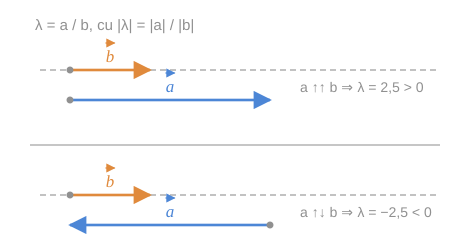
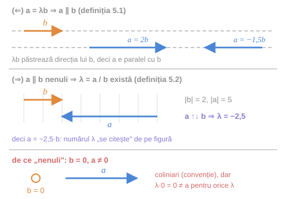

Pentru doi vectori **coliniari**, și numai pentru astfel de vectori, se dă următoarea definiție.

## 1. Definiția raportului

> [!abstract] Definiția 5.2
> Se numește **raport a doi vectori coliniari** $\vec{a}$ și $\vec{b} \ne \vec{0}$ numărul $\lambda = \dfrac{\vec{a}}{\vec{b}}$, astfel încât:
>
> a) $\lvert \lambda \rvert = \dfrac{\lvert \vec{a} \rvert}{\lvert \vec{b} \rvert}$;
>
> b) $\lambda > 0$ dacă $\vec{a} \uparrow\uparrow \vec{b}$ și $\lambda < 0$ dacă $\vec{a} \uparrow\downarrow \vec{b}$.

*fig. 1 — modulul lui $\lambda$ dă raportul lungimilor, semnul dă orientarea relativă*

> [!warning] Nu este o împărțire de vectori
> Notația $\dfrac{\vec{a}}{\vec{b}}$ **nu** definește o operație de împărțire între vectori oarecare. Ea are sens **numai** pentru vectori coliniari, cu $\vec{b} \ne \vec{0}$, iar rezultatul este un **număr**, nu un vector.

Evident, că din $\lambda = \dfrac{\vec{a}}{\vec{b}}$ rezultă $\vec{a} = \lambda\vec{b}$.

## 2. Reguli de calcul

Pentru orice număr real $\alpha \ne 0$:

$$
\frac{\alpha\vec{a}}{\alpha\vec{b}} = \frac{\vec{a}}{\vec{b}}
$$

Iar pentru $\vec{a} \parallel \vec{b} \parallel \vec{c} \ne \vec{0}$:

$$
\frac{\vec{a} \pm \vec{b}}{\vec{c}} = \frac{\vec{a}}{\vec{c}} \pm \frac{\vec{b}}{\vec{c}}
$$

> [!note] De ce funcționează
> Ambele reguli se verifică imediat scriind $\vec{a} = \lambda_1\vec{c}$, $\vec{b} = \lambda_2\vec{c}$ și folosind [[Proprietățile înmulțirii vectorului cu un număr#5. Distributivitatea față de scalari|distributivitatea (2)]]: $\vec{a} \pm \vec{b} = (\lambda_1 \pm \lambda_2)\vec{c}$.

## 3. Teorema 5.3 — criteriul de coliniaritate

> [!tip] Teorema 5.3
> Doi vectori nenuli $\vec{a}$ și $\vec{b}$ sunt **coliniari** atunci și numai atunci, când există așa un număr $\lambda$ încât
> $$
> \vec{a} = \lambda\vec{b}.
> $$

**Demonstrație.**

**Suficiența.** Fie că există așa un număr $\lambda$ încât $\vec{a} = \lambda\vec{b}$. Conform definiției 5.1, vectorul $\lambda\vec{b}$ are aceeași direcție ca $\vec{b}$, deci $\vec{a} \parallel \vec{b}$.

**Necesitatea.** Fie $\vec{a} \parallel \vec{b}$. Atunci putem determina, după definiția 5.2, numărul $\lambda = \dfrac{\vec{a}}{\vec{b}}$, pentru care $\vec{a} = \lambda\vec{b}$. $\blacksquare$

*fig. T1 — teorema 5.3: cele două implicații și rolul ipotezei „nenuli”*

> [!example]- Cum se citește figura — teorema 5.3
> **Pasul 1 — panoul de sus (suficiența).** Pornim de la $\vec{b}$ (portocaliu) și un număr $\lambda$. Săgețile albastre $2\vec{b}$ și $-1{,}5\vec{b}$ stau pe o dreaptă punctată paralelă cu cea a lui $\vec{b}$: oricare ar fi $\lambda$, direcția nu se schimbă.
>
> **Pasul 2 — panoul din mijloc (necesitatea).** Acum știm doar că $\vec{a} \parallel \vec{b}$. Grila gri servește de riglă: $\lvert \vec{b} \rvert = 2$ diviziuni, $\lvert \vec{a} \rvert = 5$ diviziuni, deci $\lvert \lambda \rvert = 5/2$.
>
> **Pasul 3 — semnul.** Săgețile au sensuri opuse ($\vec{a} \uparrow\downarrow \vec{b}$), deci $\lambda = -2{,}5$. Numărul a fost „citit” de pe figură — exact cum cere definiția 5.2.
>
> **Pasul 4 — panoul de jos (de ce „nenuli”).** Dacă $\vec{b} = \vec{0}$ (cercul gol), orice $\lambda\vec{b}$ rămâne cercul gol și nu poate deveni săgeata albastră $\vec{a} \ne \vec{0}$.
>
> **Pe ce se bazează:** [[Produsul vectorului la un număr#1. Definiția|definiția 5.1]] (pasul 1); [[#1. Definiția raportului|definiția 5.2]] (pașii 2–3); convenția că [[Coliniaritatea și orientarea vectorilor#2. Vectori coliniari|vectorul nul este coliniar cu orice vector]] (pasul 4).
>
> **Ce să verificați singuri pe figură:** (1) verificați $\vec{a} = \lambda\vec{b}$ în panoul din mijloc: $-2{,}5 \cdot 2 = -5$, adică $5$ diviziuni spre stânga; (2) citiți de pe aceeași figură raportul invers: $\vec{b}/\vec{a} = -2/5 = -0{,}4$.

> [!tip] De ce este teorema importantă
> Ea traduce o proprietate **geometrică** (coliniaritatea) într-o relație **algebrică** ($\vec{a} = \lambda\vec{b}$). Acesta este mecanismul central al geometriei analitice: figurile devin ecuații.
>
> Teorema va fi folosită direct la:
> - [[Coliniaritate, coplanaritate și dependență liniară#Teorema 6.10 — doi vectori|teorema 6.10]] — doi vectori sunt liniar dependenți ⟺ sunt coliniari;
> - [[Descompunerea unui vector după doi vectori necoliniari|teorema 6.9]] — descompunerea unui vector după o bază a planului.

> [!warning] Ipoteza „nenuli"
> Teorema cere $\vec{a}, \vec{b} \ne \vec{0}$. Dacă $\vec{b} = \vec{0}$ și $\vec{a} \ne \vec{0}$, cei doi sunt coliniari (prin convenție), dar **nu** există niciun $\lambda$ cu $\vec{a} = \lambda\vec{0} = \vec{0}$. Acesta e motivul pentru care în definiția 5.2 se cere $\vec{b} \ne \vec{0}$.

## Întrebări de control

1. De ce raportul se definește doar pentru vectori coliniari?
2. Calculați $\dfrac{\vec{a}}{\vec{b}}$ dacă $\lvert \vec{a} \rvert = 6$, $\lvert \vec{b} \rvert = 4$ și $\vec{a} \uparrow\downarrow \vec{b}$.
3. Ce relație există între $\dfrac{\vec{a}}{\vec{b}}$ și $\dfrac{\vec{b}}{\vec{a}}$?
4. Dacă $\vec{a} = \lambda\vec{b}$ cu $\lambda = 1$, ce putem spune despre $\vec{a}$ și $\vec{b}$?
5. Arătați, folosind teorema 5.3, că trei puncte $A$, $B$, $C$ sunt coliniare dacă și numai dacă există $\lambda$ cu $\vec{AC} = \lambda\vec{AB}$.

## Legături

- Anterior: [[Proprietățile înmulțirii vectorului cu un număr]]
- Continuare: [[Combinație liniară. Dependență și independență liniară]]
- Concepte: [[Vectori coliniari]]
