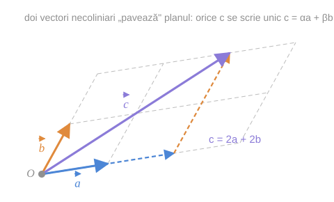
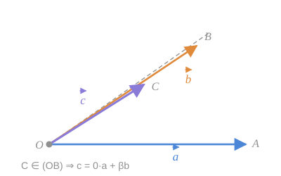
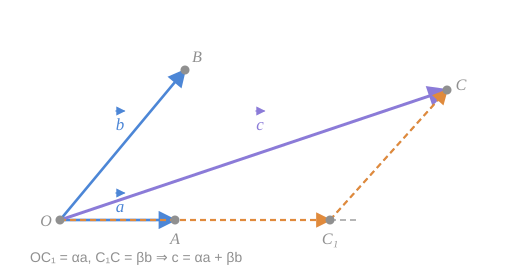
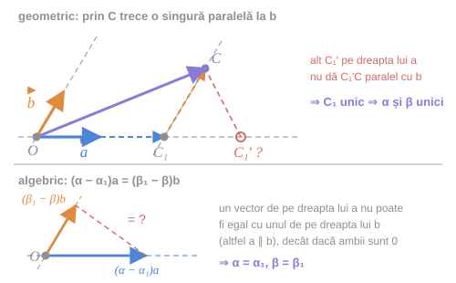

> [!tip] Teorema 6.9
> Dacă vectorii $\vec{a}$, $\vec{b}$ și $\vec{c}$ sunt **coplanari**, iar vectorii $\vec{a}$ și $\vec{b}$ **necoliniari**, atunci există **în mod univoc** numerele reale $\alpha$ și $\beta$, astfel încât
> $$
> \vec{c} = \alpha\vec{a} + \beta\vec{b} \tag{$*$}
> $$

> [!note] De ce este teorema centrală a capitolului
> Ea spune că doi vectori necoliniari formează o **bază a planului**: orice alt vector din plan se scrie prin ei, și într-un singur fel. Perechea $(\alpha, \beta)$ devine „adresa" lui $\vec{c}$ — primul pas către coordonate.

*fig. 1 — doi vectori necoliniari „pavează" planul; orice $\vec{c}$ are o singură pereche $(\alpha, \beta)$*

## Demonstrația — partea I: existența

Depunem dintr-un punct $O$ vectorii $\vec{OA} = \vec{a}$, $\vec{OB} = \vec{b}$ și $\vec{OC} = \vec{c}$. Acești vectori sunt coplanari și, prin urmare, punctele $O$, $A$, $B$ și $C$ aparțin aceluiași plan, iar punctele $O$, $A$ și $B$ **nu** aparțin unei drepte (vectorii $\vec{OA} = \vec{a}$ și $\vec{OB} = \vec{b}$ nu-s coliniari).

### Cazul 1 — $C$ aparține dreptei $(OB)$

*fig. 2 (fig. 31 din curs) — cazul degenerat $C \in (OB)$*

Atunci $\vec{OB} = \vec{b}$ și $\vec{OC} = \vec{c}$ sunt coliniari și, conform [[Raportul a doi vectori coliniari#3. Teorema 5.3 — criteriul de coliniaritate|teoremei despre vectorii coliniari]], există așa număr real $\beta$ astfel încât $\vec{c} = \beta\vec{b}$. Dar atunci

$$
\vec{c} = 0 \cdot \vec{a} + \beta\vec{b},
$$

deci în acest caz are loc egalitatea $(*)$, cu $\alpha = 0$.

În mod analogic ne convingem că are loc egalitatea $(*)$ în cazul când punctul $C$ aparține dreptei $(OA)$ (atunci $\beta = 0$).

### Cazul 2 — cazul general

*fig. 3 (fig. 32 din curs) — construcția paralelogramului de descompunere*

Să cercetăm cazul când punctul $C$ nu aparține nici dreptei $(OA)$, nici dreptei $(OB)$.

Construim dreapta $(CC_1)$ paralelă la dreapta $(OB)$, unde $C_1$ aparține dreptei $(OA)$. După regula triunghiului:

$$
\vec{OC} = \vec{OC_1} + \vec{C_1C}
$$

Deoarece $\vec{OC_1} \parallel \vec{OA}$ și $\vec{C_1C} \parallel \vec{OB}$, există așa numere reale $\alpha$ și $\beta$, încât $\vec{OC_1} = \alpha\vec{a}$ și $\vec{C_1C} = \beta\vec{b}$. Prin urmare

$$
\vec{OC} = \alpha\vec{a} + \beta\vec{b},
$$

adică și în acest caz are loc egalitatea $(*)$.

> [!example]- Pas cu pas — construcția din cazul general
> Ținta: să scriem $\vec{c}$ ca o sumă de doi vectori, unul pe direcția lui $\vec{a}$, celălalt pe direcția lui $\vec{b}$.
>
> **Pasul 1 — de ce o paralelă.** Vrem să „spargem" $\vec{OC}$ în două bucăți cu direcții impuse. Regula triunghiului spune că orice punct intermediar $X$ dă $\vec{OC} = \vec{OX} + \vec{XC}$. Trebuie deci ales $X$ **exact acolo unde** ambele bucăți cad pe direcțiile dorite.
>
> **Pasul 2 — găsim punctul.** Ducem prin $C$ paralela la $(OB)$. Ea taie dreapta $(OA)$ într-un punct — îl numim $C_1$. *(Se intersectează pentru că $(OA)$ și $(OB)$ nu-s paralele — aici se folosește ipoteza că $\vec{a}$ și $\vec{b}$ sunt necoliniari!)*
>
> **Pasul 3 — verificăm cele două bucăți.**
> - $\vec{OC_1}$ este pe dreapta $(OA)$, deci coliniar cu $\vec{a}$;
> - $\vec{C_1C}$ este pe paralela la $(OB)$, deci coliniar cu $\vec{b}$.
>
> **Pasul 4 — trecem la coeficienți.** Prin [[Raportul a doi vectori coliniari#3. Teorema 5.3 — criteriul de coliniaritate|teorema 5.3]], coliniaritatea înseamnă existența unor numere: $\vec{OC_1} = \alpha\vec{a}$ și $\vec{C_1C} = \beta\vec{b}$.
>
> **Pasul 5 — adunăm.** $\vec{c} = \vec{OC} = \vec{OC_1} + \vec{C_1C} = \alpha\vec{a} + \beta\vec{b}$. $\blacksquare$
>
> **Unde a fost folosită fiecare ipoteză:**
> - *coplanaritatea* — ca $O$, $A$, $B$, $C$ să fie în același plan, altfel paralela dusă prin $C$ nu ar întâlni dreapta $(OA)$;
> - *necoliniaritatea lui $\vec{a}$ și $\vec{b}$* — ca intersecția din pasul 2 să existe (și, mai târziu, pentru unicitate).

> [!warning] Greșeală de tipar în PDF-ul cursului
> În text apare scris „După regula triunghiului $\vec{OC_1} = \vec{OC} + \vec{CC_1}$". Corect este
> $$
> \vec{OC} = \vec{OC_1} + \vec{C_1C},
> $$
> așa cum se și folosește două rânduri mai jos, când se scrie $\vec{OC} = \alpha\vec{a} + \beta\vec{b}$.

> [!example]- Cum se citește figura — teorema 6.9, existența (fig. 2 și fig. 3)
> **Pasul 1 — datele comune.** $\vec{OA} = \vec{a}$ (albastru) și $\vec{OB} = \vec{b}$ (portocaliu) din $O$, necoliniari; $\vec{OC} = \vec{c}$ (violet) în același plan.
>
> **Pasul 2 — fig. 2, cazul particular.** $C$ cade pe dreapta punctată $(OB)$: violetul are direcția portocaliului, deci $\vec{c} = \beta\vec{b}$ și nu e nevoie de nicio construcție ($\alpha = 0$).
>
> **Pasul 3 — fig. 3, construcția.** Din $C$ coborâți pe linia portocalie punctată, paralelă cu $(OB)$, până întâlniți dreapta lui $\vec{a}$ în $C_1$.
>
> **Pasul 4 — fig. 3, cele două bucăți.** Albastrul punctat $\vec{OC_1}$ stă pe dreapta lui $\vec{a}$, deci $\vec{OC_1} = \alpha\vec{a}$; portocaliul punctat $\vec{C_1C}$ este paralel cu $\vec{b}$, deci $\vec{C_1C} = \beta\vec{b}$.
>
> **Pasul 5 — concluzia.** Drumul punctat $O \to C_1 \to C$ și violetul $O \to C$ au aceleași capete: $\vec{c} = \alpha\vec{a} + \beta\vec{b}$.
>
> **Pe ce se bazează:** [[Raportul a doi vectori coliniari#3. Teorema 5.3 — criteriul de coliniaritate|teorema 5.3]] (pașii 2 și 4); unicitatea paralelei și necoliniaritatea lui $\vec{a}$, $\vec{b}$ — existența lui $C_1$ ([[Paralelismul dreptelor, semidreptelor și planelor]], pasul 3); [[Adunarea vectorilor. Regula triunghiului și a poligonului#3. Relația lui Chasles|relația lui Chasles]] (pasul 5).
>
> **Ce să verificați singuri pe figură:** (1) în fig. 3 măsurați $OC_1 / OA$ — acesta este $\alpha$ — și $C_1C / OB$ — acesta este $\beta$; (2) linia punctată $C_1C$ nu trece prin $B$: ea trebuie doar să fie paralelă cu $(OB)$.

## Demonstrația — partea II: unicitatea

Să demonstrăm acum că numerele $\alpha$ și $\beta$ ce satisfac egalității $(*)$ se determină în mod unic.

Să presupunem că prin altă metodă determinăm astfel de numere reale $\alpha_1$ și $\beta_1$ încât $\vec{c} = \alpha_1\vec{a} + \beta_1\vec{b}$. Din ultima egalitate și din egalitatea $(*)$ rezultă:

$$
\alpha\vec{a} + \beta\vec{b} = \alpha_1\vec{a} + \beta_1\vec{b} \iff (\alpha - \alpha_1)\vec{a} + (\beta - \beta_1)\vec{b} = \vec{0}
$$

Dacă presupunem că $\alpha \ne \alpha_1$, atunci obținem

$$
\vec{a} = -\frac{\beta - \beta_1}{\alpha - \alpha_1}\vec{b}
$$

și deci vectorii $\vec{a}$ și $\vec{b}$ sunt coliniari. Analogic, dacă $\beta \ne \beta_1$, obținem

$$
\vec{b} = -\frac{\alpha - \alpha_1}{\beta - \beta_1}\vec{a}
$$

și iarăși vectorii $\vec{a}$ și $\vec{b}$ sunt coliniari. În ambele cazuri am obținut **contrazicere** cu faptul că vectorii $\vec{a}$ și $\vec{b}$ nu-s coliniari. Prin urmare, $\alpha = \alpha_1$ și $\beta = \beta_1$. $\blacksquare$

*fig. T1 — unicitatea descompunerii: geometric (sus) și algebric (jos)*

> [!example]- Cum se citește figura — teorema 6.9, unicitatea
> **Pasul 1 — sus, descompunerea găsită.** Violetul $\vec{OC}$ se descompune prin $C_1$: albastru punctat $2\vec{a}$, apoi portocaliu punctat $1{,}5\vec{b}$, pe paralela gri la $\vec{b}$ dusă prin $C$.
>
> **Pasul 2 — sus, o a doua descompunere (roșu).** Altă pereche $(\alpha_1, \beta_1)$ ar însemna alt punct $C_1'$ pe dreapta lui $\vec{a}$ cu $\vec{C_1'C} \parallel \vec{b}$. Linia roșie punctată arată că $C_1'C$ **nu** e paralelă cu $\vec{b}$: prin $C$ trece o singură paralelă la $\vec{b}$, iar ea taie dreapta lui $\vec{a}$ într-un singur punct.
>
> **Pasul 3 — jos, versiunea algebrică.** Scăzând cele două descompuneri: $(\alpha - \alpha_1)\vec{a} = (\beta_1 - \beta)\vec{b}$. Albastrul stă pe dreapta lui $\vec{a}$, portocaliul pe dreapta lui $\vec{b}$; linia roșie „$= ?$” întreabă dacă pot fi egali.
>
> **Pasul 4 — concluzia.** Două săgeți din $O$ pe drepte diferite coincid doar dacă ambele se reduc la punctul $O$: $\alpha - \alpha_1 = 0$ și $\beta_1 - \beta = 0$. Altfel, împărțind la un coeficient nenul, am obține $\vec{a} \parallel \vec{b}$ — contradicție.
>
> **Pe ce se bazează:** [[Raportul a doi vectori coliniari#3. Teorema 5.3 — criteriul de coliniaritate|teorema 5.3]] ($\vec{a} = \lambda\vec{b}$ înseamnă coliniaritate); [[Teoremele fundamentale ale dependenței liniare#Teorema 6.5 — caracterizarea dependenței|teorema 6.5]] (izolarea unui vector); unicitatea paralelei printr-un punct ([[Paralelismul dreptelor, semidreptelor și planelor]]).
>
> **Ce să verificați singuri pe figură:** (1) sus, numărați: $OC_1$ are $2$ lungimi de $\vec{a}$, iar $C_1C$ are $1{,}5$ lungimi de $\vec{b}$; (2) mutați în gând $C_1'$ pe dreapta lui $\vec{a}$ până când linia roșie devine paralelă cu $\vec{b}$ — se oprește exact în $C_1$.

> [!tip] Structura demonstrației de unicitate
> Este o **demonstrație prin reducere la absurd**, cu tiparul standard:
> 1. presupunem două descompuneri diferite;
> 2. le scădem — obținem o combinație liniară nulă cu coeficienți nu toți nuli;
> 3. de aici izolăm un vector prin celălalt ⇒ ar fi coliniari;
> 4. contrazice ipoteza.
>
> Pasul 2–3 este exact [[Teoremele fundamentale ale dependenței liniare#Teorema 6.5 — caracterizarea dependenței|teorema 6.5]] aplicată la doi vectori. Cu alte cuvinte: **unicitatea descompunerii ⟺ independența liniară a lui $\vec{a}$ și $\vec{b}$**.

> [!example]- Pas cu pas — unicitatea, cu numere
> Presupunem, prin absurd, că același vector $\vec{c}$ are două descompuneri:
> $$
> \vec{c} = 2\vec{a} + 5\vec{b} \qquad \text{și} \qquad \vec{c} = 7\vec{a} + 1\vec{b}
> $$
>
> **Pasul 1 — egalăm.** Fiind același $\vec{c}$: $\;2\vec{a} + 5\vec{b} = 7\vec{a} + \vec{b}$.
>
> **Pasul 2 — trecem totul într-o parte.** $\;(2 - 7)\vec{a} + (5 - 1)\vec{b} = \vec{0}$, adică $-5\vec{a} + 4\vec{b} = \vec{0}$.
>
> **Pasul 3 — izolăm.** Coeficientul lui $\vec{a}$ este $-5 \ne 0$, deci putem împărți:
> $$
> \vec{a} = \frac{4}{5}\vec{b}
> $$
>
> **Pasul 4 — contradicția.** Această egalitate spune (prin [[Raportul a doi vectori coliniari#3. Teorema 5.3 — criteriul de coliniaritate|teorema 5.3]]) că $\vec{a} \parallel \vec{b}$ — dar ipoteza era că sunt **necoliniari**. Contradicție.
>
> **Pasul 5 — concluzia.** Presupunerea „două descompuneri diferite" e falsă. Deci coeficienții coincid: $\alpha = \alpha_1$ și $\beta = \beta_1$.
>
> **Unde s-a folosit ipoteza.** Exact la pasul 3–4: împărțirea cere ca diferența coeficienților să fie nenulă, iar concluzia „ar fi coliniari" e cea care se ciocnește de ipoteză. Dacă $\vec{a}$ și $\vec{b}$ *ar fi* coliniari, pasul 4 n-ar fi o contradicție — și, într-adevăr, atunci unicitatea nu mai are loc.

## Ce se întâmplă dacă $\vec{a}$ și $\vec{b}$ sunt coliniari

Ipoteza „necoliniari" nu poate fi eliminată:

- dacă $\vec{a} \parallel \vec{b}$, toate combinațiile $\alpha\vec{a} + \beta\vec{b}$ rămân pe o singură dreaptă — deci majoritatea vectorilor din plan **nu** se pot scrie așa (existența cade);
- iar cei care se pot scrie, se scriu în **infinit de multe** feluri (unicitatea cade).

## Întrebări de control

1. De ce cazul $C \in (OB)$ trebuie tratat separat?
2. În fig. 3, ce reprezintă geometric numerele $\alpha$ și $\beta$?
3. Descompuneți diagonala $\vec{AC}$ a paralelogramului $ABCD$ după $\vec{AB}$ și $\vec{AD}$. Dar diagonala $\vec{BD}$?
4. Fie $M$ mijlocul laturii $[BC]$ a triunghiului $ABC$. Descompuneți $\vec{AM}$ după $\vec{AB}$ și $\vec{AC}$.
5. De ce unicitatea descompunerii ar cădea dacă $\vec{a}$ și $\vec{b}$ ar fi coliniari?

## Legături

- Anterior: [[Vectori coplanari]]
- Continuare: [[Coliniaritate, coplanaritate și dependență liniară]]
- Se sprijină pe: [[Raportul a doi vectori coliniari]]
