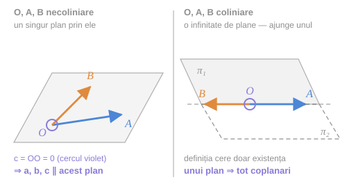
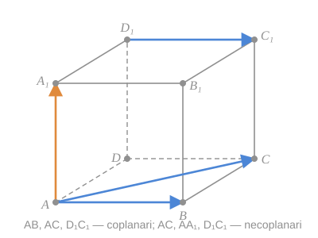
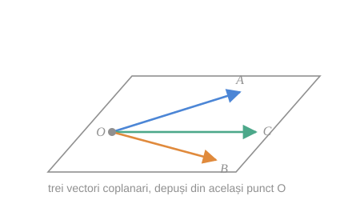

## 1. Vector paralel cu un plan

> [!abstract] Definiție
> Vom spune că **vectorul $\vec{a}$ este paralel la planul $\alpha$**, dacă vectorul $\vec{a}$ este paralel la o dreaptă situată în planul $\alpha$.

> [!note] Consecință
> Dacă vectorul $\vec{a}$ este paralel la planul $\alpha$, atunci el este paralel la **orice plan paralel** cu planul $\alpha$.

## 2. Definiția coplanarității

> [!abstract] Definiție
> Vectorii $\vec{a}$, $\vec{b}$ și $\vec{c}$ se numesc **coplanari**, dacă există un plan $\alpha$ astfel încât acești vectori să fie paraleli la planul $\alpha$.

> [!warning] Nu „în același plan", ci „paraleli cu același plan"
> Vectorii fiind [[Vector liber|liberi]], nu au o poziție fixă în spațiu. Definiția cere doar existența unei *direcții de plan* comune. Abia după ce îi depunem din același punct, ei ajung efectiv într-un plan (vezi §4 mai jos).

## 3. Cazul degenerat: vectorul nul

> [!check] Observație
> Dacă măcar unul din vectorii $\vec{a}$, $\vec{b}$ sau $\vec{c}$ este vector nul, atunci acești trei vectori **sunt coplanari**.

**Justificare.** Într-adevăr, fie de exemplu $\vec{c}$ un vector nul. Dintr-un punct oarecare $O$ al spațiului depunem vectorii $\vec{OA} = \vec{a}$, $\vec{OB} = \vec{b}$ și $\vec{OO} = \vec{c}$. Prin punctele $O$, $A$ și $B$ trece un plan la care vectorii $\vec{a}$, $\vec{b}$ și $\vec{c}$ sunt paraleli și, prin urmare, vectorii $\vec{a}$, $\vec{b}$ și $\vec{c}$ sunt coplanari. $\blacksquare$

> [!note] Unde se ascunde subtilitatea
> Dacă $O$, $A$, $B$ sunt coliniare, „un plan prin $O$, $A$, $B$" nu e unic — dar există, și asta ajunge. Definiția cere doar **existența** unui plan.

*fig. T1 — trei vectori dintre care unul nul: $O$, $A$, $B$ necoliniare (stânga) și coliniare (dreapta)*

> [!example]- Cum se citește figura — observația despre vectorul nul
> **Pasul 1 — stânga, datele.** $\vec{OA} = \vec{a}$ (albastru) și $\vec{OB} = \vec{b}$ (portocaliu) din $O$; al treilea vector, $\vec{c} = \vec{OO}$, este cercul violet gol din $O$.
>
> **Pasul 2 — stânga, planul.** $O$, $A$, $B$ necoliniare determină un singur plan (gri). $\vec{a}$ și $\vec{b}$ sunt în el; $\vec{0}$ nu are direcție, deci e paralel cu orice plan, inclusiv cu acesta.
>
> **Pasul 3 — dreapta, cazul subtil.** Dacă $\vec{a} \parallel \vec{b}$, punctele $O$, $A$, $B$ sunt pe o dreaptă. Prin ea trec o infinitate de plane; figura arată două, $\pi_1$ (plin) și $\pi_2$ (punctat).
>
> **Pasul 4 — concluzia.** Definiția coplanarității cere doar **un** plan paralel cu toți trei — oricare dintre $\pi_1$, $\pi_2$ convine. În ambele panouri $\vec{a}$, $\vec{b}$, $\vec{0}$ sunt coplanari.
>
> **Pe ce se bazează:** [[#2. Definiția coplanarității|definiția coplanarității]]; convenția că vectorul nul e paralel cu orice dreaptă ([[Coliniaritatea și orientarea vectorilor#2. Vectori coliniari|vectori coliniari]]); [[Vectori#4. Existența și unicitatea reprezentantului cu origine dată|depunerea din același punct]].
>
> **Ce să verificați singuri pe figură:** (1) cercul gol nu are săgeată, deci nu poate „ieși” din niciun plan; (2) în dreapta, rotiți în gând un plan în jurul dreptei punctate: $\vec{a}$ și $\vec{b}$ rămân în el la orice unghi.

## 4. Exemplu: paralelipipedul

*fig. 1 (fig. 29 din curs) — paralelipipedul $ABCDA_1B_1C_1D_1$*

În figura 29 este reprezentat un paralelipiped:

- vectorii $\vec{AB}$, $\vec{AC}$ și $\vec{D_1C_1}$ **sunt coplanari** — toți trei sunt paraleli cu planul bazei $(ABC)$;
- vectorii $\vec{AC}$, $\vec{AA_1}$ și $\vec{D_1C_1}$ **nu-s coplanari** — $\vec{AA_1}$ „iese" din planul celorlalți doi.

> [!tip] Cum se verifică rapid
> Căutați un plan cu care toți trei să fie paraleli. Dacă doi dintre ei determină un plan (fiind necoliniari), verificați dacă al treilea este paralel cu acel plan.

## 5. De ce se numesc „coplanari"

Fie $\vec{a}$, $\vec{b}$ și $\vec{c}$ trei vectori coplanari. Dintr-un punct oarecare $O$ al spațiului depunem vectorii $\vec{OA} = \vec{a}$, $\vec{OB} = \vec{b}$ și $\vec{OC} = \vec{c}$. Deoarece vectorii sunt coplanari, punctele $O$, $A$, $B$ și $C$ **aparțin aceluiași plan**.

*fig. 2 (fig. 30 din curs) — trei vectori coplanari, depuși din același punct*

Această proprietate lămurește noțiunea «vectori coplanari».

*fig. 3 — trei vectori necoplanari: $\vec{c}$ nu este paralel cu planul lui $\vec{a}$ și $\vec{b}$*

> [!tip] Paralela cu coliniaritatea
> Mecanismul e identic cu cel de la [[Coliniaritatea și orientarea vectorilor#De ce se numesc „coliniari"|vectorii coliniari]]:
> - **coliniari** — aduși la origine comună, aparțin aceleiași **drepte**;
> - **coplanari** — aduși la origine comună, aparțin aceluiași **plan**.

## Întrebări de control

1. Doi vectori sunt întotdeauna coplanari? Justificați.
2. Dacă $\vec{a}$ și $\vec{b}$ sunt coliniari, sunt $\vec{a}$, $\vec{b}$, $\vec{c}$ coplanari pentru orice $\vec{c}$?
3. În paralelipipedul din fig. 1, găsiți încă un triplet coplanar și încă unul necoplanar.
4. De ce trei vectori dintre care unul este $\vec{0}$ sunt întotdeauna coplanari?
5. Pot patru vectori nenuli, doi câte doi necoliniari, să fie coplanari?

## Legături

- Anterior: [[Teoremele fundamentale ale dependenței liniare]]
- Continuare: [[Descompunerea unui vector după doi vectori necoliniari]]
- Concepte: [[Coplanaritate]]
