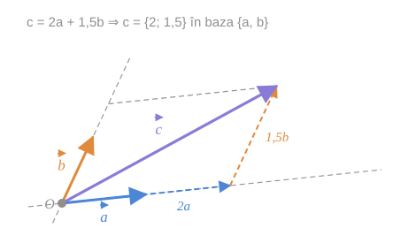

## 1. Baza

> [!abstract] Definiția 9.1
> Orice **pereche ordonată** $\{\vec{a}, \vec{b}\}$ de vectori liniar independenți (necoliniari) din $V_2$ se numește **bază** a acestui spațiu.

> [!note] „Liniar independenți" și „necoliniari" spun același lucru
> Pentru **doi** vectori, cele două condiții sunt echivalente — este exact [[Coliniaritate, coplanaritate și dependență liniară#Teorema 6.10 — doi vectori|teorema 6.10]]. Manualul le scrie pe amândouă ca să lege limbajul algebric (independență) de cel geometric (necoliniaritate).

> [!warning] Cuvântul „ordonată" contează
> $\{\vec{a}, \vec{b}\}$ și $\{\vec{b}, \vec{a}\}$ sunt **baze diferite**: primul vector al bazei dă prima coordonată, al doilea — a doua. Schimbând ordinea, se schimbă ordinea coordonatelor (vezi §3).

## 2. Coordonatele unui vector în bază

După cum s-a arătat în [[Descompunerea unui vector după doi vectori necoliniari|teorema 6.9]], pentru orice vector $\vec{c} \in V_2$ există descompunerea

$$
\vec{c} = \alpha\vec{a} + \beta\vec{b}
$$

a acestui vector după vectorii de bază, **și această descompunere este unică**.

> [!abstract] Definiție
> Numerele $\alpha$ și $\beta$ din descompunerea $\vec{c} = \alpha\vec{a} + \beta\vec{b}$ se numesc **coordonatele vectorului $\vec{c}$ în baza $\{\vec{a}, \vec{b}\}$** și se notează
> $$
> \vec{c} = \{\alpha;\ \beta\}_{\{\vec{a},\,\vec{b}\}}
> $$

*fig. 1 — parcurgem de 2 ori $\vec{a}$, apoi de 1,5 ori $\vec{b}$: ajungem la vârful lui $\vec{c}$, deci $\vec{c} = \{2;\ 1{,}5\}$*

> [!example]- Cum se citește figura — coordonatele în bază
> **Pasul 1 — baza.** Săgețile groase din $O$: albastră $\vec{a}$, portocalie $\vec{b}$. Liniile gri punctate prelungesc direcțiile lor — sunt „axele" bazei.
>
> **Pasul 2 — vectorul de exprimat.** Săgeata violetă $\vec{c}$, tot din $O$.
>
> **Pasul 3 — drumul pe direcția lui $\vec{a}$.** Săgeata albastră punctată merge pe prelungirea lui $\vec{a}$ până la paralela dusă prin vârful lui $\vec{c}$. Lungimea ei este de **2 ori** $\vec{a}$ ⇒ $\alpha = 2$.
>
> **Pasul 4 — drumul pe direcția lui $\vec{b}$.** Din acel punct, săgeata portocalie punctată, paralelă cu $\vec{b}$, urcă exact până la vârful lui $\vec{c}$. Lungimea ei este de **1,5 ori** $\vec{b}$ ⇒ $\beta = 1{,}5$.
>
> **Pasul 5 — închiderea.** Cele două săgeți punctate, cap la cap, ajung în vârful lui $\vec{c}$: $\vec{c} = 2\vec{a} + 1{,}5\vec{b}$.
>
> **Pe ce se bazează:** [[Descompunerea unui vector după doi vectori necoliniari|teorema 6.9]] — construcția de aici este exact construcția cu paralele din demonstrația ei; [[Adunarea vectorilor. Regula triunghiului și a poligonului#2. Regula triunghiului|regula triunghiului]] pentru pasul 5.
>
> **Ce să verificați singuri pe figură:** linia gri punctată de sus, prin vârful lui $\vec{c}$, este paralelă cu $\vec{a}$ — ea completează paralelogramul cu laturile $2\vec{a}$ și $1{,}5\vec{b}$.

> [!warning] Precizare față de textul manualului
> Manualul scrie „pentru orice vector $\vec{c} \in V$". Corect este $\vec{c} \in V_2$: descompunerea după **doi** vectori există doar pentru vectorii **coplanari** cu ei. Un vector din spațiu care iese din plan nu se poate scrie ca $\alpha\vec{a} + \beta\vec{b}$ (ar fi coplanar cu $\vec{a}$ și $\vec{b}$ — contradicție).

*fig. 2 (din §6) — baza „pavează" planul cu o rețea de paralelograme; coordonatele spun pe ce nod al rețelei (sau între ce noduri) cade vârful vectorului*

> [!example]- Pas cu pas — de ce e nevoie și de existență, și de unicitate
> Coordonatele trebuie să funcționeze ca o **adresă**: fiecare vector are o adresă și fiecare adresă aparține unui singur vector.
>
> **Pasul 1 — existența asigură că orice vector are adresă.** Dacă un vector $\vec{c} \in V_2$ n-ar putea fi scris ca $\alpha\vec{a} + \beta\vec{b}$, el n-ar avea coordonate. Teorema 6.9 exclude această situație.
>
> **Pasul 2 — unicitatea asigură că adresa nu e ambiguă.** Dacă $\vec{c} = 2\vec{a} + \vec{b}$ și, totodată, $\vec{c} = 5\vec{a} - \vec{b}$, am avea două „coordonate" pentru același vector și notația $\{\alpha; \beta\}$ n-ar mai însemna nimic precis. Tot teorema 6.9 exclude asta.
>
> **Pasul 3 — și invers: o pereche de numere determină un singur vector.** Dat $\{\alpha; \beta\}$, vectorul $\alpha\vec{a} + \beta\vec{b}$ e unic determinat (operațiile cu vectori au rezultat unic).
>
> **Pasul 4 — concluzia.** Între vectorii din $V_2$ și perechile ordonate de numere reale există o **corespondență biunivocă**, odată ce baza e fixată:
> $$
> \vec{c} \in V_2 \quad \longleftrightarrow \quad (\alpha, \beta) \in \mathbb{R} \times \mathbb{R}
> $$
>
> **Unde s-a folosit fiecare ipoteză.** Necoliniaritatea bazei este cea care dă unicitatea (vezi demonstrația teoremei 6.9). Cu o „bază" de doi vectori coliniari, aproape niciun vector n-ar avea coordonate, iar cei care ar avea — ar avea o infinitate.

## 3. Coordonatele depind de bază

> [!info]- Completare — același vector, baze diferite
> Coordonatele **nu** sunt o proprietate a vectorului singur, ci a vectorului *în raport cu o bază*.
>
> - Vectorii bazei înșiși: $\vec{a} = 1 \cdot \vec{a} + 0 \cdot \vec{b} = \{1;\ 0\}_{\{\vec{a},\vec{b}\}}$ și $\vec{b} = \{0;\ 1\}_{\{\vec{a},\vec{b}\}}$.
> - Vectorul nul: $\vec{0} = \{0;\ 0\}$ în **orice** bază.
> - Schimbând ordinea bazei: dacă $\vec{c} = \{\alpha;\ \beta\}_{\{\vec{a},\vec{b}\}}$, atunci $\vec{c} = \{\beta;\ \alpha\}_{\{\vec{b},\vec{a}\}}$.
> - Înlocuind un vector al bazei cu dublul lui: dacă $\vec{c} = \alpha\vec{a} + \beta\vec{b}$, atunci $\vec{c} = \tfrac{\alpha}{2}(2\vec{a}) + \beta\vec{b}$, adică $\vec{c} = \{\tfrac{\alpha}{2};\ \beta\}_{\{2\vec{a},\vec{b}\}}$.
>
> De aceea indicele $\{\vec{a}, \vec{b}\}$ din notație nu e decorativ: fără el, coordonatele nu au sens.

## Întrebări de control

1. De ce o bază a lui $V_2$ are exact doi vectori — nici unul, nici trei?
2. Pot $\vec{a}$ și $2\vec{a}$ forma o bază? Dar $\vec{a}$ și $\vec{a} + \vec{b}$, dacă $\{\vec{a}, \vec{b}\}$ e bază?
3. Ce coordonate are $\vec{a} - 3\vec{b}$ în baza $\{\vec{a}, \vec{b}\}$? Dar în baza $\{\vec{b}, \vec{a}\}$?
4. Explicați de ce în definiția coordonatelor e esențial cuvântul „unică".
5. Arătați că $\vec{c} = \vec{0}$ dacă și numai dacă ambele coordonate ale lui sunt nule.

## Legături

- Anterior: [[Spațiul V2. Vectori coplanari și dimensiunea planului]]
- Continuare: [[Reperul afin în plan. Tipuri de repere]]
- Se sprijină pe: [[Descompunerea unui vector după doi vectori necoliniari]]
- Concepte: [[Bază]], [[Combinație liniară]]
