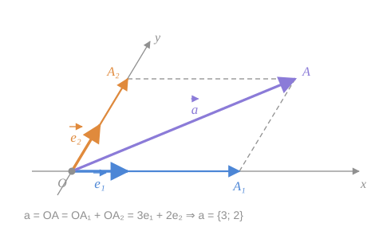
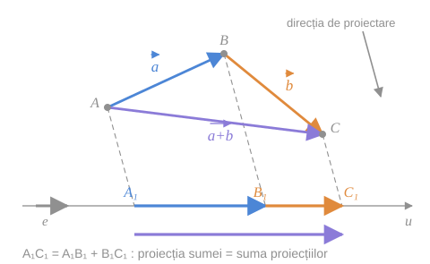

## 1. Descompunerea vectorului după axe

Fie pe planul de coordonate un vector $\vec{a}$. Îl translăm cu originea în originea de coordonate: $\vec{a} = \vec{OA}$. Descompunem acest vector după vectorii de bază ai reperului $R$:

$$
\vec{a} = \vec{OA} = \vec{OA_1} + \vec{OA_2} = x\,\vec{e}_1 + y\,\vec{e}_2 \tag{1}
$$

Reprezentarea (1) se mai numește **descompunerea vectorului $\vec{a}$ după axele de coordonate** ale sistemului $(xOy)$, iar $x$, $y$ se numesc **coordonatele vectorului $\vec{a}$ în raport cu acest sistem** și se notează $\vec{a} = \{x;\ y\}$.

*fig. 1 (după fig. 44 din manual) — $\vec{OA}$ este diagonala paralelogramului $OA_1AA_2$, cu laturile pe axe*

> [!example]- Cum se citește figura — descompunerea după axe
> **Pasul 1 — vectorul de descompus.** Săgeata violetă $\vec{a} = \vec{OA}$ pleacă din origine. Dacă $\vec{a}$ ar fi desenat altundeva, primul gest este să-l mutați cu originea în $O$.
>
> **Pasul 2 — liniile punctate.** Din vârful $A$ se duc **paralele la axe**: paralela la $(Oy)$ taie $(Ox)$ în $A_1$; paralela la $(Ox)$ taie $(Oy)$ în $A_2$. Se formează paralelogramul $OA_1AA_2$.
>
> **Pasul 3 — cele două componente.** Săgeata albastră $\vec{OA_1}$ stă pe $(Ox)$; săgeata portocalie $\vec{OA_2}$ stă pe $(Oy)$. Prin [[Regula paralelogramului|regula paralelogramului]], $\vec{OA} = \vec{OA_1} + \vec{OA_2}$.
>
> **Pasul 4 — numărați unitățile.** Pe $(Ox)$, $\vec{OA_1}$ cuprinde de **3** ori vectorul scurt $\vec{e}_1$; pe $(Oy)$, $\vec{OA_2}$ cuprinde de **2** ori $\vec{e}_2$. Deci $\vec{a} = 3\vec{e}_1 + 2\vec{e}_2 = \{3;\ 2\}$.
>
> **Pe ce se bazează:** [[Descompunerea unui vector după doi vectori necoliniari|teorema 6.9]] (existența și unicitatea descompunerii — construcția ei este exact paralelogramul de aici) și [[Raportul a doi vectori coliniari#3. Teorema 5.3 — criteriul de coliniaritate|teorema 5.3]] ($\vec{OA_1} \parallel \vec{e}_1 \Rightarrow \vec{OA_1} = x\vec{e}_1$).
>
> **Ce să verificați singuri pe figură:** măsurați cu rigla $\lvert\vec{OA_1}\rvert$ și $\lvert\vec{e}_1\rvert$ — raportul lor trebuie să fie $3$.

## 2. Proiecțiile geometrice

> [!abstract] Definiția 10.2
> Vectorii $\vec{OA_1}$ și $\vec{OA_2}$ se numesc **proiecții geometrice** ale vectorului $\vec{OA} = \vec{a}$ pe axele $(Ox)$ și, respectiv, $(Oy)$. Se notează
> $$
> \vec{OA_1} = P_{(Ox)}\,\vec{OA}, \qquad \vec{OA_2} = P_{(Oy)}\,\vec{OA}
> $$

> [!warning] Proiecția pe o axă se face paralel cu **cealaltă** axă
> Într-un sistem afin, proiecția pe $(Ox)$ **nu** este perpendiculara coborâtă pe $(Ox)$, ci paralela la $(Oy)$. Proiecția „perpendiculară" (ortogonală) coincide cu aceasta **numai** când axele sunt perpendiculare (reper rectangular). Aceasta este cea mai frecventă greșeală la începutul capitolului.

## 3. Proiecțiile algebrice

Evident, coordonatele $x$ și $y$ ale vectorului $\vec{a}$ în raport cu $(xOy)$ se pot determina astfel:

$$
x = \frac{\vec{OA_1}}{\vec{e}_1} = \frac{P_{(Ox)}\,\vec{OA}}{\vec{e}_1}, \qquad y = \frac{\vec{OA_2}}{\vec{e}_2} = \frac{P_{(Oy)}\,\vec{OA}}{\vec{e}_2} \tag{2}
$$

> [!note] Ce este fracția dintre doi vectori
> $\dfrac{\vec{OA_1}}{\vec{e}_1}$ este [[Raportul a doi vectori coliniari|raportul a doi vectori coliniari]] (definiția 5.2): un **număr** al cărui modul arată de câte ori e mai lung $\vec{OA_1}$ decât $\vec{e}_1$, iar semnul — dacă au același sens ($+$) sau sensuri opuse ($-$).

> [!abstract] Definiția 10.3
> Coordonatele $x$ și $y$ ale vectorului $\vec{a}$ se mai numesc **proiecții algebrice** ale acestui vector pe axele de coordonate $(Ox)$ și $(Oy)$. Se notează
> $$
> x = \operatorname{pr}_{(Ox)}\vec{a}, \qquad y = \operatorname{pr}_{(Oy)}\vec{a}
> $$

| | Proiecția **geometrică** $P_{(Ox)}\vec{a}$ | Proiecția **algebrică** $\operatorname{pr}_{(Ox)}\vec{a}$ |
|---|---|---|
| Ce este | un **vector** (situat pe axă) | un **număr** |
| Legătura | $P_{(Ox)}\vec{a} = x\,\vec{e}_1$ | $x = \dfrac{P_{(Ox)}\vec{a}}{\vec{e}_1}$ |
| Exemplu (fig. 1) | $\vec{OA_1} = 3\vec{e}_1$ | $3$ |

## 4. Teorema 10.4 — proiecția sumei

> [!tip] Teorema 10.4
> Proiecția sumei a doi vectori $\vec{a}$ și $\vec{b}$ pe axa dată $u$ este egală cu suma proiecțiilor, **indiferent de tipul proiecției** (geometrică sau algebrică).

**Demonstrație.** Fie $u$ o axă cu originea în punctul $O$ și vectorul unitar $\vec{e}$. Fixăm un punct arbitrar $A$ și construim vectorii $\vec{AB} = \vec{a}$ și $\vec{BC} = \vec{b}$. Atunci $\vec{AC} = \vec{a} + \vec{b}$.

Proiectăm punctele $A$, $B$ și $C$ pe axă **paralel unei direcții** (în cazul axelor $(Ox)$ și $(Oy)$, proiectarea pe o axă se face paralel celeilalte). Pentru punctele obținute $A_1$, $B_1$ și $C_1$ avem $\vec{A_1C_1} = \vec{A_1B_1} + \vec{B_1C_1}$, deci

$$
P_u(\vec{a} + \vec{b}) = P_u\,\vec{a} + P_u\,\vec{b} \tag{3}
$$

După (2) și (3) avem:

$$
\operatorname{pr}_u(\vec{a} + \vec{b}) = \frac{P_u(\vec{a} + \vec{b})}{\vec{e}} = \frac{P_u\,\vec{a} + P_u\,\vec{b}}{\vec{e}} = \operatorname{pr}_u\vec{a} + \operatorname{pr}_u\vec{b} \tag{4}
$$

$\blacksquare$

*fig. 2 — triunghiul $ABC$ se proiectează pe axa $u$ paralel cu o direcție fixată*

> [!example]- Cum se citește figura — teorema 10.4
> **Pasul 1 — triunghiul de sus.** Săgețile $\vec{AB} = \vec{a}$ (albastru) și $\vec{BC} = \vec{b}$ (portocaliu) sunt puse **cap la cap**; săgeata violetă $\vec{AC}$ închide triunghiul, deci $\vec{AC} = \vec{a} + \vec{b}$ (regula triunghiului).
>
> **Pasul 2 — direcția de proiectare.** Săgeata gri din colțul dreapta-sus arată direcția fixată. Toate cele trei linii punctate $AA_1$, $BB_1$, $CC_1$ sunt **paralele cu ea**.
>
> **Pasul 3 — umbrele de pe axă.** Fiecare vârf „cade" pe axa $u$: $A \to A_1$, $B \to B_1$, $C \to C_1$. Pe axă apar tot o săgeată albastră $\vec{A_1B_1}$ și una portocalie $\vec{B_1C_1}$, cap la cap.
>
> **Pasul 4 — suma de pe axă.** Săgeata violetă de sub axă, $\vec{A_1C_1}$, pornește din $A_1$ și se termină în $C_1$ — exact acolo unde se termină cele două săgeți puse cap la cap. Deci $\vec{A_1C_1} = \vec{A_1B_1} + \vec{B_1C_1}$: **relația (3)**.
>
> **Pasul 5 — de la vectori la numere.** Împărțind fiecare săgeată de pe axă la vectorul unitar $\vec{e}$, lungimile cu semn se adună la fel — **relația (4)**.
>
> **Pe ce se bazează:**
> - pasul 1 — [[Adunarea vectorilor. Regula triunghiului și a poligonului#2. Regula triunghiului|regula triunghiului]];
> - pasul 4 — [[Adunarea vectorilor. Regula triunghiului și a poligonului#3. Relația lui Chasles|relația lui Chasles]] aplicată punctelor $A_1$, $B_1$, $C_1$ de pe axă — valabilă și pentru puncte coliniare;
> - pasul 5 — [[Raportul a doi vectori coliniari#2. Reguli de calcul|regula de calcul]] $\dfrac{\vec{p} + \vec{q}}{\vec{e}} = \dfrac{\vec{p}}{\vec{e}} + \dfrac{\vec{q}}{\vec{e}}$ pentru vectori coliniari.
>
> **Ce să verificați singuri pe figură:** schimbați mental direcția de proiectare (înclinați liniile punctate altfel). Punctele $A_1$, $B_1$, $C_1$ se mută, dar $C_1$ rămâne tot la capătul săgeților $\vec{A_1B_1}$ și $\vec{B_1C_1}$ — relația nu depinde de direcția aleasă.

> [!example]- Pas cu pas — de ce demonstrația e atât de scurtă
> **Pasul 1 — ideea-cheie.** Proiectarea transformă un triunghi „cap la cap" în trei puncte coliniare $A_1$, $B_1$, $C_1$ — și **păstrează** ordinea „cap la cap": capătul lui $\vec{A_1B_1}$ este începutul lui $\vec{B_1C_1}$.
>
> **Pasul 2 — Chasles nu cere triunghi.** Relația $\vec{A_1C_1} = \vec{A_1B_1} + \vec{B_1C_1}$ e adevărată pentru **orice** trei puncte, deci și pentru cele trei puncte coliniare de pe axă.
>
> **Pasul 3 — traducem.** $\vec{A_1C_1}$ este proiecția lui $\vec{AC} = \vec{a} + \vec{b}$; $\vec{A_1B_1}$ — a lui $\vec{a}$; $\vec{B_1C_1}$ — a lui $\vec{b}$. Obținem (3).
>
> **Pasul 4 — trecem la numere.** Toți vectorii din (3) sunt pe axa $u$, deci coliniari cu $\vec{e}$; împărțim fiecare termen la $\vec{e}$ și obținem (4).
>
> **Unde intervine „indiferent de tipul proiecției".** (3) e varianta pentru proiecția **geometrică** (vectori), (4) — pentru cea **algebrică** (numere). Teorema le acoperă pe amândouă.

> [!warning] Notație — precizare față de manual
> În manual, relația (3) și numărătorii din (4) sunt tipărite cu $\operatorname{pr}_u$. Pentru a respecta definițiile 10.2 și 10.3, am scris $P_u$ acolo unde este vorba de **vectori**: numai un vector poate fi împărțit la vectorul $\vec{e}$ (raport de vectori coliniari). Rezultatul matematic este același.

## Întrebări de control

1. De ce, pentru a găsi coordonatele unui vector, trebuie întâi adus cu originea în $O$?
2. În ce reper proiecția pe $(Ox)$ paralelă cu $(Oy)$ coincide cu proiecția perpendiculară?
3. Ce semn are $\operatorname{pr}_{(Ox)}\vec{a}$ dacă $P_{(Ox)}\vec{a}$ și $\vec{e}_1$ sunt opus orientate?
4. Generalizați teorema 10.4 la suma a trei vectori. Ce regulă de adunare folosiți?
5. Arătați că $\operatorname{pr}_u(-\vec{a}) = -\operatorname{pr}_u\vec{a}$.

## Legături

- Anterior: [[Orientarea planului, a poligoanelor și a unghiurilor]]
- Continuare: [[Operații cu vectori în coordonate]]
- Se sprijină pe: [[Raportul a doi vectori coliniari]], [[Descompunerea unui vector după doi vectori necoliniari]]
- Concepte: [[Proiecția unui vector]]
