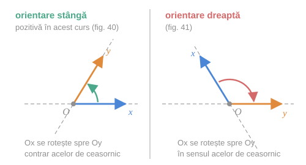
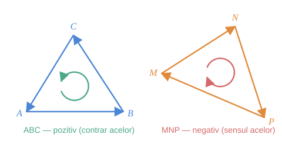
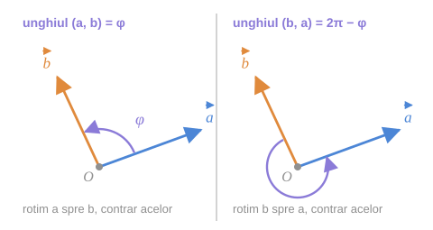

## 1. Orientarea sistemului de coordonate

Pentru a descrie cadranul I, axa $(Ox)$ se rotește spre $(Oy)$ în jurul punctului $O$. Sensul acestei rotații dă **orientarea** sistemului.

> [!abstract] Definiție
> - Dacă, pentru a descrie cadranul I, axa $(Ox)$ se rotește spre $(Oy)$ în jurul lui $O$ **în direcția opusă mișcării acelor de ceasornic**, sistemul $(xOy)$, cât și reperul corespunzător $R$, sunt de **orientare stângă** (fig. 40 din manual).
> - Dacă rotația se efectuează **în direcția mișcării acelor de ceasornic**, sistemul se numește de **orientare dreaptă** (fig. 41 din manual).

După orientarea sistemului se face și **numerotarea cadranelor** II, III și IV.

*fig. 1 — stânga: $Ox \to Oy$ contrar acelor (orientare stângă); dreapta: $Ox \to Oy$ în sensul acelor (orientare dreaptă)*

> [!example]- Cum se citește figura — orientarea unui sistem
> **Pasul 1 — găsiți axa $Ox$** (săgeata albastră) și axa $Oy$ (săgeata portocalie) în fiecare panou. Nu vă uitați la *poziția* lor pe hârtie — în panoul din dreapta $Ox$ e înclinată în sus, iar $Oy$ e orizontală.
>
> **Pasul 2 — găsiți cadranul I:** regiunea dintre cele două săgeți.
>
> **Pasul 3 — urmăriți arcul colorat.** El pornește de la $Ox$ și ajunge la $Oy$ **trecând prin cadranul I** (pe drumul cel scurt).
>
> **Pasul 4 — stabiliți sensul arcului.** Verde, contrar acelor ⇒ **stângă**. Roșu, în sensul acelor ⇒ **dreaptă**.
>
> **Pe ce se bazează:** doar pe definiția de mai sus; orientarea nu depinde de unghiul dintre axe, nici de lungimile lui $\vec{e}_1$, $\vec{e}_2$, ci **numai de ordinea** în care sunt date cele două axe.
>
> **Ce să verificați singuri pe figură:** schimbați între ele etichetele $x$ și $y$ dintr-un panou — orientarea se inversează. Deci $\{O, \vec{e}_1, \vec{e}_2\}$ și $\{O, \vec{e}_2, \vec{e}_1\}$ au orientări opuse.

> [!note] Convenția cursului
> N-are importanță care este orientarea sistemului de coordonate fixat; însă, pentru determinare, **ne vom folosi de sistemul stâng, care se va considera orientat pozitiv**.

> [!warning] Terminologia diferă între manuale
> În acest curs, *contrar acelor de ceasornic* = **orientare stângă** = pozitivă. În multe alte cărți același sistem se numește **drept** („regula mâinii drepte"). Conceptul e același — sensul pozitiv este cel trigonometric (contrar acelor); diferă doar numele. Rețineți **sensul rotației**, nu cuvântul.

## 2. Planul orientat

> [!abstract] Definiție
> Planul în care s-a fixat un sistem stâng de coordonate se va considera **orientat pozitiv**. În el:
> - orice rotație **contrară** mișcării acelor de ceasornic se consideră **pozitivă**;
> - rotația în sensul acelor de ceasornic — **negativă**.

## 3. Poligoane orientate

> [!abstract] Definiție
> În planul orientat, toate poligoanele sunt orientate **după direcția în care se enumeră vârfurile lor**. Orientarea este **pozitivă** dacă această enumerare se face în direcția opusă mișcării acelor de ceasornic.

Triunghiul $ABC$ este orientat pozitiv, iar triunghiul $MNP$ — negativ.

*fig. 2 (după fig. 42–43 din manual) — aceeași figură geometrică poate avea orientări diferite, în funcție de ordinea literelor*

> [!example]- Cum se citește figura — orientarea unui poligon
> **Pasul 1 — citiți numele poligonului, literă cu literă:** $A$, apoi $B$, apoi $C$.
>
> **Pasul 2 — urmăriți săgețile de pe laturi** în ordinea literelor: $A \to B \to C \to A$. Ele formează un circuit închis.
>
> **Pasul 3 — comparați circuitul cu arcul din interior.** La $ABC$, circuitul merge contrar acelor (arc verde) ⇒ **pozitiv**. La $MNP$, circuitul $M \to N \to P \to M$ merge în sensul acelor (arc roșu) ⇒ **negativ**.
>
> **Pe ce se bazează:** exclusiv pe *ordinea enumerării*; forma și mărimea triunghiului nu contează.
>
> **Ce să verificați singuri pe figură:** citiți același triunghi ca $ACB$. Săgețile se inversează ⇒ $ACB$ e orientat **negativ**, deși e *același* triunghi ca $ABC$.

> [!info]- Completare — ce schimbă și ce nu schimbă orientarea
> - **Permutare circulară** (mutarea primei litere la final): $ABC$, $BCA$, $CAB$ au **aceeași** orientare — circuitul e același, doar pornește din alt vârf.
> - **Schimbarea a două litere între ele**: $ABC \to ACB$ **inversează** orientarea.
>
> Rezultatul nu figurează explicit în manual; decurge direct din definiție.

## 4. Unghiul orientat dintre doi vectori

Pe planul orientat devin orientate și unghiurile.

> [!abstract] Definiție
> Prin **unghiul dintre doi vectori** $\vec{a}$ și $\vec{b}$ — notat $\widehat{(\vec{a}, \vec{b})}$ — cu originea comună $O$, vom înțelege unghiul după care trebuie rotit $\vec{a}$ în jurul punctului $O$ **contrar acelor de ceasornic**, pentru ca direcția lui să coincidă cu direcția vectorului $\vec{b}$.

*fig. 3 — ordinea vectorilor contează: $\widehat{(\vec{a}, \vec{b})} = \varphi$, dar $\widehat{(\vec{b}, \vec{a})} = 2\pi - \varphi$*

> [!example]- Cum se citește figura — unghiul orientat
> **Pasul 1 — aduceți vectorii la origine comună.** În ambele panouri, $\vec{a}$ și $\vec{b}$ pornesc din $O$. (Vectorii fiind liberi, putem face oricând acest lucru.)
>
> **Pasul 2 — identificați vectorul de pornire.** În $\widehat{(\vec{a}, \vec{b})}$ se pornește de la **primul** vector scris — $\vec{a}$ (panoul stâng). În $\widehat{(\vec{b}, \vec{a})}$ — de la $\vec{b}$ (panoul drept).
>
> **Pasul 3 — rotiți numai contrar acelor.** Urmăriți arcul violet: pleacă de la vectorul de pornire și se oprește când atinge direcția celui de-al doilea vector.
>
> **Pasul 4 — comparați arcele.** În stânga arcul e scurt ($\varphi$); în dreapta, fiind obligat tot contrar acelor, arcul face „ocolul lung" — $2\pi - \varphi$. Împreună, cele două arce fac un tur complet.
>
> **Pe ce se bazează:** pe definiția unghiului orientat și pe convenția că sensul pozitiv este contrar acelor (§2).
>
> **Ce să verificați singuri pe figură:** $\varphi + (2\pi - \varphi) = 2\pi$ — dacă puneți cap la cap cele două arce, obțineți un cerc întreg.

> [!info]- Completare — valori particulare
> Din definiție decurg imediat (nu sunt scrise explicit în manual):
> - $\widehat{(\vec{a}, \vec{b})} \in [0, 2\pi)$;
> - $\widehat{(\vec{a}, \vec{a})} = 0$; dacă $\vec{a} \uparrow\uparrow \vec{b}$, unghiul este $0$;
> - dacă $\vec{a} \uparrow\downarrow \vec{b}$, unghiul este $\pi$ (în ambele ordini);
> - pentru vectori necoliniari: $\widehat{(\vec{b}, \vec{a})} = 2\pi - \widehat{(\vec{a}, \vec{b})}$.

## Întrebări de control

1. Ce orientare are sistemul $(yOx)$, dacă $(xOy)$ are orientare stângă?
2. Triunghiul $ABC$ e orientat pozitiv. Ce orientare au $BAC$, $CAB$ și $CBA$?
3. Dacă $\widehat{(\vec{a}, \vec{b})} = \tfrac{\pi}{3}$, cât este $\widehat{(\vec{b}, \vec{a})}$? Dar $\widehat{(\vec{a}, -\vec{b})}$?
4. De ce unghiul orientat se definește doar pentru vectori aduși la origine comună?
5. Ce se schimbă în definiția unghiului orientat dacă am considera pozitivă orientarea dreaptă?

## Legături

- Anterior: [[Sistemul afin de coordonate. Axe și cadrane]]
- Continuare: [[Coordonatele vectorului. Proiecții geometrice și algebrice]]
- Concepte: [[Orientarea planului]]
