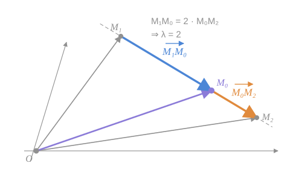
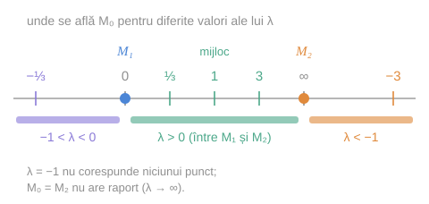
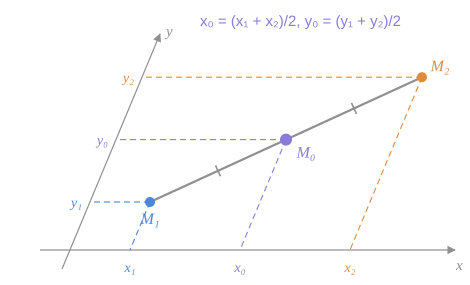

Fie $M_1(x_1;\ y_1)$ și $M_2(x_2;\ y_2)$ două puncte **distincte** din plan și $M_0(x_0;\ y_0)$ un punct de pe dreapta $M_1M_2$.

## 1. Definiția

> [!abstract] Definiția 10.8
> Vom spune că punctul $M_0$ **împarte segmentul $\overline{M_1M_2}$ în raportul $\lambda \ne -1$**, dacă
> $$
> \frac{\vec{M_1M_0}}{\vec{M_0M_2}} = \lambda \tag{6}
> $$

Din (6) rezultă că

$$
\vec{M_1M_0} = \lambda\,\vec{M_0M_2} \tag{7}
$$

*fig. 1 (după fig. 45 din manual) — $M_0$ e de două ori mai departe de $M_1$ decât de $M_2$, în același sens: $\lambda = 2$*

> [!note] Fracția din (6) este un raport de vectori coliniari
> $\vec{M_1M_0}$ și $\vec{M_0M_2}$ stau pe aceeași dreaptă, deci sunt coliniari, iar $\dfrac{\vec{M_1M_0}}{\vec{M_0M_2}}$ are sensul din [[Raportul a doi vectori coliniari|definiția 5.2]]: $\lvert\lambda\rvert$ e raportul lungimilor, **semnul** spune dacă cele două bucăți au același sens.

> [!example]- Cum se citește figura — raportul λ
> **Pasul 1 — dreapta și cele trei puncte.** Pe linia gri punctată sunt, în ordine, $M_1$, $M_0$ (violet), $M_2$.
>
> **Pasul 2 — prima bucată**, albastră: $\vec{M_1M_0}$ — **de la primul punct la punctul care împarte**.
>
> **Pasul 3 — a doua bucată**, portocalie: $\vec{M_0M_2}$ — **de la punctul care împarte la al doilea punct**. Atenție: ambele săgeți „curg" în același sens, de la $M_1$ spre $M_2$.
>
> **Pasul 4 — comparați.** Săgeata albastră e de 2 ori mai lungă decât cea portocalie și are același sens ⇒ $\lambda = +2$.
>
> **Pasul 5 — razele vectoare** (gri și violet, din $O$) nu intervin în definiție; ele sunt uneltele cu care, în secțiunea 3, trecem de la vectori la **coordonate**.
>
> **Pe ce se bazează:** [[Raportul a doi vectori coliniari|definiția 5.2]] (raportul vectorilor coliniari) și [[Coordonatele punctului. Raza vectoare#5. Coordonatele vectorului determinat de două puncte|formula (5)]].
>
> **Ce să verificați singuri pe figură:** schimbați rolurile lui $M_1$ și $M_2$ — noul raport devine $\tfrac{1}{2}$. Raportul depinde de **ordinea** capetelor.

## 2. Ce valori poate lua λ și de ce $\lambda \ne -1$

*fig. 2 — pozițiile lui $M_0$ pe dreaptă pentru diferite valori ale lui $\lambda$*

> [!example]- Cum se citește figura — semnul și mărimea lui λ
> **Pasul 1 — cele două capete.** Punctul albastru e $M_1$, cel portocaliu $M_2$.
>
> **Pasul 2 — zona verde (între capete).** Oriunde s-ar afla $M_0$ strict între $M_1$ și $M_2$, săgețile $\vec{M_1M_0}$ și $\vec{M_0M_2}$ au **același sens** ⇒ $\lambda > 0$. Pe liniuțele de deasupra: $\lambda = \tfrac{1}{3}$ aproape de $M_1$, $\lambda = 1$ la mijloc, $\lambda = 3$ aproape de $M_2$.
>
> **Pasul 3 — zonele din afară.** În afara segmentului, cele două săgeți au **sensuri opuse** ⇒ $\lambda < 0$.
> - dincolo de $M_2$ (portocaliu): prima săgeată e **mai lungă** ⇒ $\lvert\lambda\rvert > 1$, deci $\lambda < -1$;
> - dincolo de $M_1$ (violet): prima săgeată e **mai scurtă** ⇒ $\lvert\lambda\rvert < 1$, deci $-1 < \lambda < 0$.
>
> **Pasul 4 — cazurile de capăt.** $M_0 = M_1$ ⇒ prima săgeată e nulă ⇒ $\lambda = 0$. Când $M_0$ se apropie de $M_2$, a doua săgeată tinde la zero ⇒ $\lambda \to \infty$; în $M_2$ însuși raportul nu există.
>
> **Pasul 5 — valoarea care lipsește.** Nicio zonă nu conține $\lambda = -1$: el ar fi „granița" dintre $\lambda < -1$ și $-1 < \lambda < 0$, adică un punct „la infinit".
>
> **Pe ce se bazează:** semnul raportului din [[Raportul a doi vectori coliniari|definiția 5.2]] și argumentul de mai jos (manual, §8).
>
> **Ce să verificați singuri pe figură:** pentru $M_0$ la mijloc, săgețile sunt egale și de același sens ⇒ $\lambda = 1$ — cazul formulei (9).

> [!check] De ce se exclude $\lambda = -1$ (manual, §8, p. 37–38)
> Dacă ar fi $\lambda = -1$, atunci $\vec{M_1M_0} = -\vec{M_0M_2} = \vec{M_2M_0}$. Doi vectori egali cu **aceeași extremitate** $M_0$ au și aceeași origine, deci $M_1 = M_2$ — ceea ce contrazice condiția inițială (capete distincte).

| Poziția lui $M_0$ | Valoarea lui $\lambda$ |
|---|---|
| $M_0 = M_1$ | $\lambda = 0$ |
| strict între $M_1$ și $M_2$ | $\lambda > 0$ |
| mijlocul segmentului | $\lambda = 1$ |
| dincolo de $M_1$ | $-1 < \lambda < 0$ |
| dincolo de $M_2$ | $\lambda < -1$ |
| $M_0 = M_2$ | nu există ($\lambda \to \infty$) |
| — | $\lambda = -1$ nu corespunde niciunui punct |

## 3. Coordonatele punctului care împarte segmentul

Conform exprimării (5) și proprietății 4⁰, din (7) obținem:

$$
\begin{cases} x_0 - x_1 = \lambda\,(x_2 - x_0) \\ y_0 - y_1 = \lambda\,(y_2 - y_0) \end{cases}
$$

Ca și în cazul axei numerice (§8), vom avea:

$$
x_0 = \frac{x_1 + \lambda x_2}{1 + \lambda}, \qquad y_0 = \frac{y_1 + \lambda y_2}{1 + \lambda} \tag{8}
$$

> [!warning] Greșeală de tipar în manual (p. 48)
> În sistemul de mai sus, manualul tipărește $x_0 - x_1 = \lambda(x_2 - x_1)$ și $y_0 - y_1 = \lambda(y_2 - y_1)$. Corect este $\lambda(x_2 - \mathbf{x_0})$ și $\lambda(y_2 - \mathbf{y_0})$:
> - $\vec{M_0M_2}$ are coordonatele $\{x_2 - x_0;\ y_2 - y_0\}$ după formula (5);
> - numai varianta corectă duce la formula (8) — cea tipărită ar da $x_0 = x_1 + \lambda(x_2 - x_1)$, altceva;
> - în §8 (p. 38), aceeași deducție pe axa numerică apare scrisă corect: $x_0 - x_1 = \lambda(x_2 - x_0)$.

> [!example]- Pas cu pas — deducerea formulei (8)
> **Pasul 1 — scriem cele două bucăți în coordonate** (formula (5), „extremitate minus origine"):
> $$
> \vec{M_1M_0} = \{x_0 - x_1;\ y_0 - y_1\}, \qquad \vec{M_0M_2} = \{x_2 - x_0;\ y_2 - y_0\}
> $$
>
> **Pasul 2 — înmulțim a doua bucată cu $\lambda$** (proprietatea 3⁰):
> $$
> \lambda\,\vec{M_0M_2} = \{\lambda(x_2 - x_0);\ \lambda(y_2 - y_0)\}
> $$
>
> **Pasul 3 — egalăm coordonatele** (relația (7) și proprietatea 1⁰):
> $$
> x_0 - x_1 = \lambda x_2 - \lambda x_0
> $$
>
> **Pasul 4 — grupăm termenii cu $x_0$ în stânga:**
> $$
> x_0 + \lambda x_0 = x_1 + \lambda x_2 \quad\Longrightarrow\quad x_0\,(1 + \lambda) = x_1 + \lambda x_2
> $$
>
> **Pasul 5 — împărțim la $(1 + \lambda)$.** **Aici și numai aici** este nevoie de $\lambda \ne -1$: altfel am împărți la zero.
> $$
> x_0 = \frac{x_1 + \lambda x_2}{1 + \lambda}
> $$
>
> **Pasul 6 — pentru ordonată** se repetă identic pașii 3–5.
>
> **Morala.** Condiția $\lambda \ne -1$ din definiție nu e arbitrară: este exact ce trebuie ca formula (8) să aibă sens.

> [!info]- Completare — forma vectorială a formulei (8)
> Înlocuind coordonatele cu razele vectoare, formula (8) se scrie într-un singur rând:
> $$
> \vec{OM_0} = \frac{\vec{OM_1} + \lambda\,\vec{OM_2}}{1 + \lambda}
> $$
> Este aceeași formulă, dar independentă de coordonate: e valabilă în orice reper și se poate verifica direct cu relația lui Chasles.

> [!example]- Pas cu pas — două aplicații numerice
> **a) $M_1(1;\ -2)$, $M_2(7;\ 4)$, $\lambda = \tfrac{1}{2}$.**
> $$
> x_0 = \frac{1 + \tfrac{1}{2} \cdot 7}{1 + \tfrac{1}{2}} = \frac{4{,}5}{1{,}5} = 3, \qquad y_0 = \frac{-2 + \tfrac{1}{2} \cdot 4}{1{,}5} = \frac{0}{1{,}5} = 0
> $$
> Deci $M_0(3;\ 0)$. **Verificare:** $\vec{M_1M_0} = \{2;\ 2\}$, $\vec{M_0M_2} = \{4;\ 4\}$, iar $\{2; 2\} = \tfrac{1}{2}\{4; 4\}$. ✔ ($\lambda > 0$ ⇒ $M_0$ e între capete, mai aproape de $M_1$.)
>
> **b) Aceleași capete, $\lambda = -3$.**
> $$
> x_0 = \frac{1 + (-3) \cdot 7}{1 - 3} = \frac{-20}{-2} = 10, \qquad y_0 = \frac{-2 + (-3) \cdot 4}{-2} = \frac{-14}{-2} = 7
> $$
> Deci $M_0(10;\ 7)$. **Verificare:** $\vec{M_1M_0} = \{9;\ 9\}$, $\vec{M_0M_2} = \{-3;\ -3\}$, iar $\{9; 9\} = -3\{-3; -3\}$. ✔ ($\lambda < -1$ ⇒ $M_0$ e dincolo de $M_2$ — fig. 2.)

## 4. Folosirea formulelor „în sens invers"

Cu ajutorul formulei (8) se determină coordonatele punctului ce împarte segmentul în raportul dat. După ele putem determina și:

- coordonatele **oricăruia** dintre punctele $M_1$, $M_2$, $M_0$, dacă se cunosc $\lambda$ și coordonatele celorlalte două puncte;
- valoarea lui $\lambda$, după abscisele (sau ordonatele) celor trei puncte.

> [!info]- Completare — formula pentru λ
> Din pasul 4 al deducerii, $x_0 - x_1 = \lambda(x_2 - x_0)$. Dacă $x_2 \ne x_0$:
> $$
> \lambda = \frac{x_0 - x_1}{x_2 - x_0} \qquad \left(\text{sau } \lambda = \frac{y_0 - y_1}{y_2 - y_0} \text{ dacă } y_2 \ne y_0\right)
> $$
> Verificare pe aplicația a): $\lambda = \dfrac{3 - 1}{7 - 3} = \dfrac{1}{2}$. ✔
> Dacă segmentul e paralel cu $(Oy)$, abscisele sunt egale și se folosește formula cu ordonatele.

> [!note] Precizare față de manual
> Manualul scrie „Cu ajutorul **(4)** se determină coordonatele punctului…". În §10 este vorba de formula **(8)**; trimiterea la (4) provine din §8, unde formula pentru axa numerică poartă numărul (4).

## 5. Mijlocul segmentului

În particular, dacă $\lambda = 1$, punctul $M_0$ este **mijlocul** segmentului $\overline{M_1M_2}$ și, în acest caz:

$$
x_0 = \frac{x_1 + x_2}{2}, \qquad y_0 = \frac{y_1 + y_2}{2} \tag{9}
$$

*fig. 3 — proiecțiile mijlocului pe axe sunt mijloacele proiecțiilor capetelor*

> [!example]- Cum se citește figura — formula mijlocului
> **Pasul 1 — segmentul și mijlocul.** $M_1$ (albastru), $M_2$ (portocaliu) și, între ele, $M_0$ (violet). Liniuțele gri de pe segment arată că $M_1M_0 = M_0M_2$.
>
> **Pasul 2 — proiectați pe $(Ox)$.** Din fiecare punct coboară o linie punctată **paralelă cu $(Oy)$** (axa e oblică!) până pe $(Ox)$. Se obțin $x_1$, $x_0$, $x_2$.
>
> **Pasul 3 — observați așezarea pe axă.** $x_0$ cade exact la jumătatea distanței dintre $x_1$ și $x_2$: $x_0 = \dfrac{x_1 + x_2}{2}$.
>
> **Pasul 4 — la fel pe $(Oy)$**, cu paralele la $(Ox)$: $y_0$ e la mijlocul dintre $y_1$ și $y_2$.
>
> **Pe ce se bazează:** formula (8) cu $\lambda = 1$; geometric — **teorema lui Thales**: paralele echidistante tăiate de două secante determină segmente proporționale, deci proiecția paralelă păstrează mijlocul (și, în general, raportul $\lambda$). Aceasta e și explicația faptului că formula (8) funcționează în **orice** reper afin.
>
> **Ce să verificați singuri pe figură:** măsurați cu rigla distanțele $x_1 \to x_0$ și $x_0 \to x_2$ pe axa $Ox$ — sunt egale.

## Rezumat

| Formula | Enunț | Condiție |
|---|---|---|
| (5) | $\vec{M_1M_2} = \{x_2 - x_1;\ y_2 - y_1\}$ | — |
| (6)–(7) | $\vec{M_1M_0} = \lambda\,\vec{M_0M_2}$ | $\lambda \ne -1$ |
| (8) | $x_0 = \dfrac{x_1 + \lambda x_2}{1 + \lambda}$, $\ y_0 = \dfrac{y_1 + \lambda y_2}{1 + \lambda}$ | $\lambda \ne -1$ |
| (9) | $x_0 = \dfrac{x_1 + x_2}{2}$, $\ y_0 = \dfrac{y_1 + y_2}{2}$ | $\lambda = 1$ |

## Întrebări de control

1. Unde se află $M_0$ dacă $\lambda = -\tfrac{1}{2}$? Dar dacă $\lambda = -2$?
2. În ce raport împarte mijlocul segmentului $\overline{M_2M_1}$ (capetele luate invers)?
3. Arătați, cu formula (8), că $\lambda = 0$ dă $M_0 = M_1$.
4. De ce formula mijlocului (9) e valabilă și în reperele cu axe oblice?
5. Punctul $M_0$ împarte $\overline{M_1M_2}$ în raportul $\lambda$. În ce raport împarte $M_0$ segmentul $\overline{M_2M_1}$?

## Legături

- Anterior: [[Coordonatele punctului. Raza vectoare]]
- Se sprijină pe: [[Raportul a doi vectori coliniari]], [[Operații cu vectori în coordonate]]
- Concepte: [[Raportul de împărțire a segmentului]]
- Recapitulare: [[Recapitulare — baze și coordonate]]
