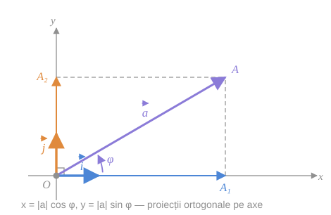
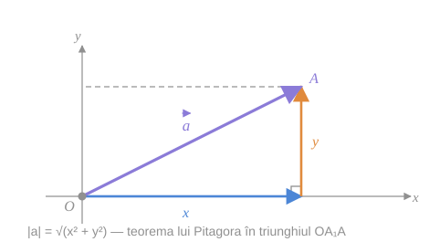

> [!tip] Despre ce este paragraful
> Până acum ([[Sistemul afin de coordonate. Axe și cadrane|§10]]) axele puteau fi oblice, iar unitățile de pe ele — diferite. Cu un asemenea sistem se pot calcula **rapoarte** și **coordonate**, dar **nu** lungimi și unghiuri: nu există nicio formulă care să dea $\lvert\vec a\rvert$ din $\{x;\ y\}$, fiindcă răspunsul ar depinde de cât de lungi sunt $\vec e_1, \vec e_2$ și de unghiul dintre ele.
>
> §11 elimină exact această lipsă: se cere ca axele să fie **perpendiculare**, iar unitățile de pe ele să fie **egale cu 1**. Din acest moment coordonatele nu mai sunt doar etichete — ele **măsoară**.

## 1. Reperul și sistemul

Fixăm pe plan un **reper rectangular cartezian** $R = \{O,\ \vec i,\ \vec j\}$, adică (vezi [[Reperul afin în plan. Tipuri de repere#2. Tipuri de repere|tipurile de repere]]):

$$
\lvert \vec i \rvert = \lvert \vec j \rvert = 1, \qquad \vec i \perp \vec j.
$$

> [!abstract] Sistemul rectangular cartezian
> Sistemul de coordonate $(xOy)$ determinat de reperul $R = \{O, \vec i, \vec j\}$ se numește **sistem rectangular cartezian**.

> [!tip] Ce se moștenește și ce se adaugă
> Sistemul rectangular cartezian este un **caz particular** al sistemului afin. De aceea **tot ce s-a dedus în §10 rămâne valabil fără nicio modificare**: coordonatele vectorilor și ale punctelor, formula $\vec{M_1M_2} = \{x_2 - x_1;\ y_2 - y_1\}$, mijlocul segmentului, împărțirea în raportul dat, condiția de coliniaritate.
>
> Ce se **adaugă** sunt *proprietățile metrice*: distanțe și mărimi unghiulare. Pentru ele avem nevoie de ipotezele noi ($\perp$ și lungime $1$).

> [!warning] Nu inversați implicația
> „Tot ce e adevărat în afin e adevărat și în rectangular cartezian" — **da**.
> „Tot ce e adevărat în rectangular cartezian e adevărat și în afin" — **nu**. Formulele (10), (11), (12) din acest paragraf sunt **false** într-un reper oblic sau cu unități inegale.
>
> *Exemplu.* Într-un reper cu $\vec e_1 \perp \vec e_2$, dar $\lvert\vec e_1\rvert = 1$ și $\lvert\vec e_2\rvert = 3$, vectorul $\vec a = \{1;\ 1\}$ are modulul $\sqrt{1^2 + 3^2} = \sqrt{10}$, nu $\sqrt{1^2 + 1^2} = \sqrt 2$.

## 2. Proprietatea 1⁰ — coordonatele ca proiecții ortogonale

Fie dat vectorul $\vec a = \{x;\ y\}$, adică $\vec a = x\vec i + y\vec j$. Îl depunem din origine: $\vec{OA} = \vec a$. Fie $\varphi$ măsura unghiului dintre $\vec i$ și $\vec a$. Atunci

$$
\vec{OA_1} = \lvert\vec{OA_1}\rvert \cdot \vec i = \lvert\vec{OA}\rvert\cos\varphi \cdot \vec i = \lvert\vec a\rvert\cos\varphi \cdot \vec i, \qquad \vec{OA_2} = \lvert\vec a\rvert\sin\varphi \cdot \vec j,
$$

de unde

$$
x = \frac{\vec{OA_1}}{\vec i} = \lvert\vec a\rvert\cos\varphi = \operatorname{pr}_{(Ox)}\vec a, \qquad y = \frac{\vec{OA_2}}{\vec j} = \lvert\vec a\rvert\sin\varphi = \operatorname{pr}_{(Oy)}\vec a \tag{10}
$$

*fig. 1 (după fig. 47 din manual) — vectorul $\vec a$ descompus pe axe perpendiculare; $\varphi$ este unghiul dintre $\vec i$ și $\vec a$*

> [!example]- Cum se citește figura — formula (10)
> **Pasul 1 — priviți întâi reperul.** Unghiul drept marcat în $O$ spune că $\vec i \perp \vec j$; săgețile groase albastră și portocalie au ambele lungimea $1$. Fără aceste două lucruri nimic din ce urmează nu funcționează.
>
> **Pasul 2 — vectorul dat.** Săgeata violet este $\vec{OA} = \vec a$. Unghiul $\varphi$ se măsoară **de la $\vec i$ spre $\vec a$**.
>
> **Pasul 3 — coborâți perpendicularele.** Liniile punctate din $A$ sunt perpendiculare pe axe (nu doar paralele cu ele, ca în cazul afin!). Ele taie axele în $A_1$ și $A_2$.
>
> **Pasul 4 — recunoașteți triunghiul dreptunghic $OA_1A$.** Ipotenuza este $OA = \lvert\vec a\rvert$, cateta alăturată unghiului $\varphi$ este $OA_1$, cateta opusă este $A_1A = OA_2$. Deci $OA_1 = \lvert\vec a\rvert\cos\varphi$ și $OA_2 = \lvert\vec a\rvert\sin\varphi$ — pur și simplu definițiile sinusului și cosinusului.
>
> **Pasul 5 — treceți de la lungimi la coordonate.** Coordonatele $x$ și $y$ sunt *proiecțiile algebrice*, adică raportul $\vec{OA_1}/\vec i$ — un număr **cu semn**. În figură $A_1$ e de partea lui $\vec i$, deci $x > 0$; dacă $\varphi$ ar depăși $90°$, $\cos\varphi$ ar deveni negativ și odată cu el și $x$. Semnul se ocupă singur de sine.
>
> **Pe ce se bazează:** [[Coordonatele vectorului. Proiecții geometrice și algebrice#3. Proiecțiile algebrice|proiecțiile algebrice]] din §10 și definițiile trigonometrice în triunghiul dreptunghic.
>
> **Ce să verificați singuri pe figură:** măsurați $OA_1$ și $OA$; raportul lor trebuie să fie $\cos\varphi$. Apoi verificați că $OA_2 = A_1A$ — dreptunghiul $OA_1AA_2$ garantează egalitatea.

> [!warning] Aici se vede diferența față de sistemul afin
> În sistemul afin, coordonatele erau proiecții **paralele cu cealaltă axă**. Fiind axele perpendiculare, „paralel cu cealaltă axă" devine automat „**perpendicular pe axa proprie**": proiecțiile devin **ortogonale**. Abia proiecția ortogonală se poate exprima prin $\cos\varphi$; cea oblică, nu.

### Forma trigonometrică a vectorului

Din (10), pentru vectorul $\vec a$ dat putem scrie

$$
\vec a = \{\lvert\vec a\rvert\cos\varphi;\ \ \lvert\vec a\rvert\sin\varphi\}.
$$

> [!check] Cazul vectorului unitar
> Dacă $\lvert\vec a\rvert = 1$, atunci $\vec a = \{\cos\varphi;\ \sin\varphi\}$.
>
> Așadar: **coordonatele unui vector unitar sunt chiar cosinusul și sinusul unghiului pe care îl face cu axa $(Ox)$.** De aici și identitatea $\cos^2\varphi + \sin^2\varphi = 1$ — nu e decât formula (11) de mai jos, aplicată unui vector de lungime $1$.

### Tangenta unghiului

Din (10), împărțind a doua relație la prima (pentru $x \neq 0$):

$$
\operatorname{tg}\varphi = \frac{y}{x}.
$$

Deci **raportul ordonatei la abscisă este egal cu tangenta unghiului** dintre axa $(Ox)$ și vectorul dat.

> [!warning] $\operatorname{tg}\varphi = y/x$ nu determină singur unghiul
> Tangenta are perioada $\pi$, nu $2\pi$. Vectorii $\{1;\ 1\}$ și $\{-1;\ -1\}$ au **același** raport $y/x = 1$, dar unghiuri diferite: $45°$ și $225°$. Ca să aflați $\varphi$ aveți nevoie și de **semnele** lui $x$ și $y$ (adică de cadran), nu doar de raportul lor. Perechea sigură este $\cos\varphi = x/\lvert\vec a\rvert$, $\sin\varphi = y/\lvert\vec a\rvert$.
>
> Pentru $x = 0$ tangenta nici nu există: $\varphi = 90°$ sau $\varphi = 270°$.

## 3. Proprietatea 2⁰ — modulul vectorului

Din (10) obținem de asemenea $x^2 + y^2 = \lvert\vec a\rvert^2$. Prin urmare

$$
\lvert\vec a\rvert = \sqrt{x^2 + y^2} \tag{11}
$$

Așa se calculează **modulul vectorului dat în sistemul rectangular cartezian $(xOy)$ după coordonatele lui**.

*fig. 2 — modulul ca ipotenuză: catetele sunt exact coordonatele*

> [!example]- Pas cu pas — de unde vine formula (11)
> **Pasul 1 — plecați de la (10).** $x = \lvert\vec a\rvert\cos\varphi$ și $y = \lvert\vec a\rvert\sin\varphi$.
>
> **Pasul 2 — ridicați la pătrat și adunați.**
> $$
> x^2 + y^2 = \lvert\vec a\rvert^2\cos^2\varphi + \lvert\vec a\rvert^2\sin^2\varphi = \lvert\vec a\rvert^2(\cos^2\varphi + \sin^2\varphi) = \lvert\vec a\rvert^2.
> $$
>
> **Pasul 3 — extrageți radicalul.** Cum $\lvert\vec a\rvert \geq 0$, se ia radicalul aritmetic: $\lvert\vec a\rvert = \sqrt{x^2+y^2}$.
>
> **Unde s-a folosit ipoteza.** Identitatea $\cos^2 + \sin^2 = 1$ este *teorema lui Pitagora deghizată*, iar Pitagora cere **unghi drept**. Aici intervine $\vec i \perp \vec j$. Lungimea $1$ a vectorilor de bază intervine mai devreme, în (10): fără ea, $\lvert\vec{OA_1}\rvert$ nu ar fi $\lvert x\rvert$, ci $\lvert x\rvert \cdot \lvert\vec i\rvert$.
>
> **Exemplu numeric.** $\vec a = \{3;\ -4\}$ ⇒ $\lvert\vec a\rvert = \sqrt{9 + 16} = 5$. Verificare prin (10): $\cos\varphi = 3/5$, $\sin\varphi = -4/5$, iar $(3/5)^2 + (-4/5)^2 = 1$. ✓

> [!example]- Cum se citește figura — formula (11)
> **Pasul 1 — cele trei săgeți.** Albastru: componenta orizontală, de lungime $\lvert x\rvert$. Portocaliu: componenta verticală, de lungime $\lvert y\rvert$, depusă **din vârful celei albastre**. Violet: vectorul $\vec a$ însuși.
>
> **Pasul 2 — observați că e regula triunghiului.** Albastru + portocaliu = violet, adică $\vec a = x\vec i + y\vec j$. Figura nu conține nimic nou față de §10 — doar că acum cele două componente sunt **perpendiculare**.
>
> **Pasul 3 — unghiul drept din $A_1$** este semnul că se poate aplica Pitagora în triunghiul $OA_1A$.
>
> **Pasul 4 — citiți concluzia.** Ipotenuza $OA$ este $\lvert\vec a\rvert$; catetele sunt $\lvert x\rvert$ și $\lvert y\rvert$. Pitagora dă direct (11). Pătratele fac ca semnele coordonatelor să nu conteze — și e firesc, modulul nu depinde de cadran.
>
> **Pe ce se bazează:** [[Modulul vectorului. Vectorul opus#2. Modulul vectorului|definiția modulului]], descompunerea $\vec a = x\vec i + y\vec j$ și teorema lui Pitagora.
>
> **Ce să verificați singuri pe figură:** luați $\vec a = \{4;\ 3\}$ și numărați pe desen — ipotenuza trebuie să iasă exact $5$ unități, nu $7$ (adică nu suma catetelor).

> [!check] De reținut din §11, partea 1
> | Mărime | Formulă | Cere reper rectangular cartezian? |
> |---|---|---|
> | coordonatele lui $\vec a$ | $\{x;\ y\}$ cu $\vec a = x\vec i + y\vec j$ | nu |
> | proiecții **ortogonale** | $x = \lvert\vec a\rvert\cos\varphi$, $y = \lvert\vec a\rvert\sin\varphi$ | **da** |
> | modulul | $\lvert\vec a\rvert = \sqrt{x^2+y^2}$ | **da** |
> | direcția | $\operatorname{tg}\varphi = y/x$ (+ cadranul) | **da** |

> [!note] Greșeală de tipar în manual
> La p. 50–51 sintagma apare de mai multe ori ca „sistemul rectangular cartezian **cartezian**" — cuvântul „cartezian" este repetat. Formularea corectă este „sistemul rectangular cartezian".

## Întrebări de control

1. De ce formula $\lvert\vec a\rvert = \sqrt{x^2+y^2}$ nu este valabilă într-un reper afin oarecare? Dați un contraexemplu numeric.
2. Vectorii $\vec u = \{2;\ 2\}$ și $\vec v = \{-2;\ -2\}$ au același raport $y/x$. Cum îi deosebiți prin unghiul $\varphi$?
3. Ce coordonate are un vector unitar care face $150°$ cu axa $(Ox)$?
4. Arătați că $\lvert\lambda\vec a\rvert = \lvert\lambda\rvert\cdot\lvert\vec a\rvert$ folosind numai formula (11).
5. În ce moment al deducerii formulei (10) se folosește faptul că $\lvert\vec i\rvert = 1$? Dar faptul că $\vec i \perp \vec j$?

## Legături

- Anterior: [[Împărțirea segmentului în raportul dat]]
- Continuare: [[Distanța dintre două puncte]]
- Se sprijină pe: [[Reperul afin în plan. Tipuri de repere]], [[Coordonatele vectorului. Proiecții geometrice și algebrice]], [[Modulul vectorului. Vectorul opus]]
- Concepte: [[Sistem rectangular cartezian]], [[Modulul vectorului]], [[Proiecția unui vector]]
