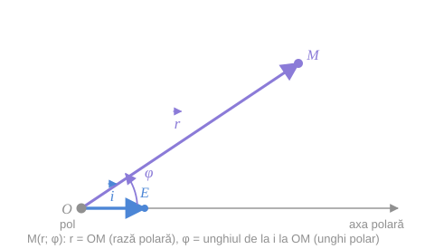
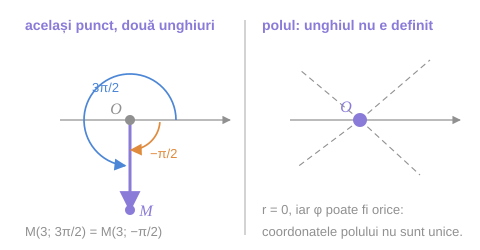

> [!tip] Despre ce este paragraful
> Până acum un punct era localizat prin **două deplasări** („mergi $x$ la dreapta, apoi $y$ în sus"). Sistemul polar îl localizează prin **o distanță și o direcție** („mergi $r$ unități în direcția care face unghiul $\varphi$ cu axa"). Este exact modul în care se orientează un radar, un marinar sau un observator de pe un turn.
>
> Nimic nou din punct de vedere logic: planul rămâne același, punctele rămân aceleași. Se schimbă doar **eticheta** pe care o punem pe fiecare punct.

## 1. Reperul polar

Să fixăm pe planul orientat un punct $O$ și vectorul unitar $\vec i = \vec{OE}$.

> [!abstract] Reperul polar
> Perechea $R = \{O,\ \vec i\}$ se numește **reper polar** și determină pe plan așa-numitul **sistem polar de coordonate**, ce constă din:
> - punctul $O$, numit **pol**;
> - semidreapta $[OE)$, pe care direcția pozitivă se determină de vectorul $\vec i$, numită **axă polară**.

> [!note] Un singur vector, nu doi
> Reperul afin are nevoie de **doi** vectori de bază; reperul polar are nevoie de **unul singur**. Diferența nu e magie: ceea ce înlocuiește al doilea vector este **orientarea planului** — faptul că știm în ce sens se măsoară unghiurile (vezi [[Orientarea planului, a poligoanelor și a unghiurilor]]). Fără orientare nu am ști dacă $\varphi$ se ia în sens trigonometric sau invers.

## 2. Coordonatele polare ale unui punct

Fie $M$ un punct arbitrar din plan, $\rho(O, M) = OM = r$, iar măsura unghiului dintre $\vec i$ și $\vec{OM}$ este $\varphi$.

> [!abstract] Definiție
> Numărul $r$ se numește **rază polară** a punctului $M$, iar $\varphi$ — **unghi polar** al acestui punct. Aceste numere se numesc **coordonate polare ale punctului $M$** și se notează $M(r;\ \varphi)$ sau $M(\varphi;\ r)$.

*fig. 1 (după fig. 49 din manual) — polul $O$, axa polară $[OE)$ și coordonatele polare ale punctului $M$*

> [!example]- Cum se citește figura — coordonatele polare
> **Pasul 1 — găsiți polul.** Punctul $O$ din stânga jos: originea tuturor măsurătorilor. Spre deosebire de reperul afin, din el pleacă **o singură** săgeată de bază.
>
> **Pasul 2 — găsiți axa polară.** Semidreapta orizontală care pleacă din $O$ prin $E$. Vectorul $\vec i = \vec{OE}$ are lungimea $1$ și fixează atât direcția, cât și **sensul pozitiv** al axei.
>
> **Pasul 3 — citiți raza polară.** Segmentul $OM$ (violet). Lungimea lui este $r$ — un număr **nenegativ**, niciodată cu semn.
>
> **Pasul 4 — citiți unghiul polar.** Arcul dintre axa polară și $OM$, măsurat **de la $\vec i$ spre $\vec{OM}$**, în sensul pozitiv al planului orientat. Acesta este $\varphi$.
>
> **Pasul 5 — puneți-le împreună.** Perechea $(r;\ \varphi)$ localizează complet punctul: $\varphi$ spune *pe ce rază* să mergeți, $r$ spune *cât de departe* pe ea.
>
> **Pe ce se bazează:** definiția de mai sus, [[Orientarea planului, a poligoanelor și a unghiurilor|orientarea planului]] (pentru sensul lui $\varphi$) și [[Distanța dintre două puncte|distanța]] $\rho(O,M)$.
>
> **Ce să verificați singuri pe figură:** acoperiți cu degetul raza polară și încercați să localizați $M$ știind doar $\varphi$ — veți găsi toată semidreapta, nu punctul. Apoi acoperiți unghiul și păstrați $r$ — veți găsi tot cercul de rază $r$. Punctul apare **doar la intersecția** lor.

## 3. Domeniul coordonatelor

Observăm că

$$
0 \leq r < \infty, \qquad 0 \leq \varphi < 2\pi.
$$

Deseori, pentru comoditate, se folosesc **unghiurile negative**. De exemplu $M\left(3;\ -\dfrac{\pi}{2}\right)$ în loc de $M\left(3;\ \dfrac{3\pi}{2}\right)$.

*fig. 2 — stânga: același punct descris prin două unghiuri diferite; dreapta: polul, unde unghiul nu este definit*

> [!example]- Cum se citește figura — unicitatea coordonatelor polare
> **Pasul 1 — panoul din stânga, unghiul pozitiv.** Arcul albastru pornește de la axa polară și parcurge $3\pi/2$ (trei sferturi de tur) în sens pozitiv. Ajunge pe verticala de jos.
>
> **Pasul 2 — același panou, unghiul negativ.** Arcul portocaliu pornește din același loc, dar merge **invers**, doar un sfert de tur: $-\pi/2$. Ajunge **în același loc**.
>
> **Pasul 3 — trageți concluzia.** $M(3;\ 3\pi/2)$ și $M(3;\ -\pi/2)$ sunt **același punct**. Restricția $0 \leq \varphi < 2\pi$ există tocmai ca să elimine această ambiguitate — dar în practică se renunță la ea când e mai comod.
>
> **Pasul 4 — panoul din dreapta, cazul polului.** Punctul desenat **este** polul $O$. Prin el trec toate semidreptele punctate: oricare dintre ele poate fi considerată „direcția" în care se află.
>
> **Pasul 5 — de ce polul e excepția.** Pentru $M = O$ avem $r = 0$, iar vectorul $\vec{OM} = \vec 0$ nu are direcție. Deci unghiul dintre $\vec i$ și $\vec{OM}$ nu se poate defini: $\varphi$ rămâne **nedeterminat**.
>
> **Pe ce se bazează:** faptul că unghiurile se măsoară modulo $2\pi$, și faptul că vectorul nul nu are direcție ([[Vectori]]).
>
> **Ce să verificați singuri pe figură:** găsiți un al treilea unghi care descrie același punct din panoul stâng (răspuns: $3\pi/2 + 2\pi = 7\pi/2$, și orice $3\pi/2 + 2k\pi$).

> [!check] Univocitatea
> Pentru **orice punct $M$ diferit de $O$**, coordonatele polare $(r;\ \varphi)$ se determină univoc și invers.
> Pentru **polul $O$** avem $r = 0$, iar $\varphi$ este **nedeterminat**.

> [!warning] Diferența majoră față de sistemul cartezian
> În sistemul afin sau rectangular cartezian corespondența punct ↔ pereche de numere este **biunivocă fără excepții** ([[Coordonatele punctului. Raza vectoare#4. Corespondența biunivocă puncte ↔ perechi de numere|§10]]). Originea are coordonatele $(0;\ 0)$ și nu e cu nimic specială.
>
> În sistemul polar, corespondența este biunivocă **numai pe $P \setminus \{O\}$**. Polul e un punct „defect": îi lipsește unghiul. Acesta este prețul plătit pentru comoditatea descrierii radiale — și motivul pentru care, în analiză, trecerea la coordonate polare cere de obicei tratarea separată a originii.

> [!note] Inconsecvență de notare în manual
> Pe aceeași pagină manualul scrie atât $0 \leq r < \infty$ (deci $r = 0$ este admis, pentru pol), cât și, la punctul a) de la p. 54, $r = \lvert\vec{OM}\rvert > 0$. A doua scriere este corectă doar pentru $M \neq O$. Reținem: $r \geq 0$ în general, $r > 0$ pentru orice punct diferit de pol.

## 4. Sistemul cartezian asociat

Pentru fiecare sistem polar de coordonate se poate introduce un sistem rectangular cartezian determinat de **reperul pozitiv** $R = \{O,\ \vec i,\ \vec j\}$, cu:

- originea în **polul** $O$;
- axa $(Ox)$ pe dreapta $(OE)$, cu vectorul unitar de pe ea chiar $\vec i$;
- vectorul $\vec j$ de pe axa $(Oy)$ ales astfel încât $\vec i \perp \vec j$ și $\lvert\vec i\rvert = \lvert\vec j\rvert = 1$.

> [!tip] De ce se face asta
> Pentru ca cele două descrieri să poată fi comparate. Odată reperele „lipite" unul de altul (același $O$, aceeași direcție inițială), un punct capătă *simultan* o pereche $(r;\varphi)$ și o pereche $(x;y)$ — iar formulele de trecere dintre ele sunt obiectul [[Trecerea între coordonate polare și carteziene|lecției următoare]].
>
> Cuvântul **pozitiv** din „reper pozitiv" nu e decorativ: el cere ca perechea $\{\vec i, \vec j\}$ să fie o bază **dreaptă**, adică $\vec j$ să fie la $+90°$ față de $\vec i$, nu la $-90°$. Altfel unghiul $\varphi$ măsurat în sistemul polar și cel citit în sistemul cartezian ar avea semne opuse.

## Întrebări de control

1. De ce reperul polar are nevoie de un singur vector, iar cel afin de doi? Ce compensează diferența?
2. Scrieți trei perechi diferite de coordonate polare care descriu același punct.
3. Ce mulțime de puncte descrie condiția $r = 3$? Dar condiția $\varphi = \pi/4$?
4. De ce unghiul polar al polului nu poate fi definit? Ce ar strica alegerea arbitrară $\varphi = 0$?
5. Dacă s-ar alege $\vec j$ la $-90°$ față de $\vec i$, ce s-ar schimba la unghiul polar al unui punct dat?

## Legături

- Anterior: [[Distanța dintre două puncte]]
- Continuare: [[Trecerea între coordonate polare și carteziene]]
- Se sprijină pe: [[Orientarea planului, a poligoanelor și a unghiurilor]], [[Reperul afin în plan. Tipuri de repere]]
- Concepte: [[Coordonate polare]], [[Sistem rectangular cartezian]]
