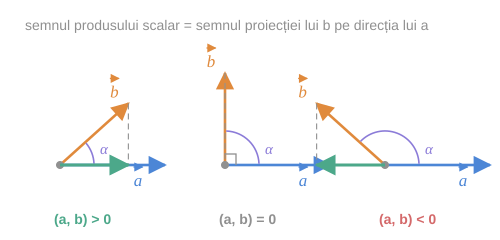
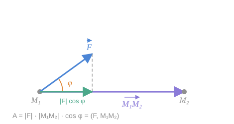

> [!tip] Despre ce este lecția
> Până acum am avut două operații cu vectori: adunarea (vector + vector = vector) și înmulțirea cu un număr (număr · vector = vector). Amândouă **produc vectori**.
>
> Produsul scalar este prima operație care ia doi vectori și produce **un număr**. Tocmai de aceea este atât de utilă: numărul rezultat conține simultan informație despre **lungimi** și despre **unghi** — adică exact mărimile metrice pe care §11 le-a făcut calculabile.

## 1. Definiția

> [!abstract] Definiția 13.1
> Se numește **produs scalar a doi vectori** numărul egal cu produsul lungimilor acestor vectori la cosinusul măsurii unghiului dintre ei. Produsul scalar a doi vectori $\vec a$ și $\vec b$ se notează prin $(\vec a, \vec b)$.

Conform definiției 13.1 avem:

$$
(\vec a, \vec b) = \lvert\vec a\rvert \cdot \lvert\vec b\rvert \cdot \cos\varphi \tag{1}
$$

unde $\varphi = \widehat{(\vec a, \vec b)}$.

> [!warning] Notația $(\vec a, \vec b)$ — atenție la confuzie
> Aceeași pereche de paranteze rotunde se folosește în curs pentru trei lucruri diferite:
> | Scriere | Ce este |
> |---|---|
> | $M(x;\ y)$ | coordonatele unui **punct** (cu punct-virgulă) |
> | $\widehat{(\vec a, \vec b)}$ | **unghiul** dintre doi vectori (cu accent circumflex) |
> | $(\vec a, \vec b)$ | **produsul scalar** — un număr |
>
> Alte manuale scriu produsul scalar $\vec a \cdot \vec b$ sau $\langle \vec a, \vec b\rangle$. Aici păstrăm notația manualului.

## 2. Ce citim din semnul produsului scalar

Modulele $\lvert\vec a\rvert$ și $\lvert\vec b\rvert$ sunt mereu pozitive (pentru vectori nenuli), deci **semnul produsului scalar este semnul lui $\cos\varphi$**.

*fig. 1 — cele trei situații: unghi ascuțit, drept și obtuz*

> [!example]- Cum se citește figura — semnul produsului scalar
> **Pasul 1 — priviți doar unghiul.** În toate trei panourile vectorul albastru $\vec a$ este același, orizontal. Se schimbă doar direcția lui $\vec b$ (portocaliu).
>
> **Pasul 2 — panoul stâng, unghi ascuțit.** $\alpha < 90°$ ⇒ $\cos\alpha > 0$ ⇒ $(\vec a, \vec b) > 0$. Urmăriți săgeata verde de pe axa orizontală: este proiecția lui $\vec b$ pe direcția lui $\vec a$, și arată **în același sens** cu $\vec a$.
>
> **Pasul 3 — panoul din mijloc, unghi drept.** $\alpha = 90°$ ⇒ $\cos\alpha = 0$ ⇒ $(\vec a, \vec b) = 0$. Proiecția verde s-a redus la un punct: $\vec b$ nu are nicio componentă pe direcția lui $\vec a$.
>
> **Pasul 4 — panoul drept, unghi obtuz.** $\alpha > 90°$ ⇒ $\cos\alpha < 0$ ⇒ $(\vec a, \vec b) < 0$. Proiecția verde arată acum **în sens opus** lui $\vec a$.
>
> **Pasul 5 — formulați regula.** $(\vec a, \vec b) = \lvert\vec a\rvert \cdot \big(\lvert\vec b\rvert\cos\alpha\big)$, iar paranteza este exact **proiecția algebrică a lui $\vec b$ pe direcția lui $\vec a$**. Produsul scalar măsoară *cât din $\vec b$ merge în direcția lui $\vec a$*, amplificat cu lungimea lui $\vec a$.
>
> **Pe ce se bazează:** formula (1), semnul funcției cosinus pe $[0;\ \pi]$ și [[Coordonatele vectorului. Proiecții geometrice și algebrice#3. Proiecțiile algebrice|proiecția algebrică]] din §10.
>
> **Ce să verificați singuri pe figură:** rotiți mental $\vec b$ continuu de la $0°$ la $180°$. Proiecția verde se scurtează, trece prin zero exact la $90°$, apoi crește în sens invers. Produsul scalar face același drum: de la $+\lvert\vec a\rvert\lvert\vec b\rvert$, prin $0$, la $-\lvert\vec a\rvert\lvert\vec b\rvert$.

> [!check] Criteriul de perpendicularitate
> Din formula (1) conchidem:
> $$
> (\vec a, \vec b) = 0 \iff \vec a \perp \vec b.
> $$
>
> Aceasta este proprietatea cea mai folosită a produsului scalar: **perpendicularitatea, o proprietate geometrică, devine o ecuație**.

> [!example]- Pas cu pas — de ce criteriul funcționează în ambele sensuri
> **Sensul „⇐".** Dacă $\vec a \perp \vec b$, atunci $\varphi = \pi/2$, deci $\cos\varphi = 0$, deci produsul (1) este nul. Convenția pentru vectorul nul face ca și cazul $\vec a = \vec 0$ să intre aici.
>
> **Sensul „⇒".** Fie $(\vec a, \vec b) = 0$, adică $\lvert\vec a\rvert\lvert\vec b\rvert\cos\varphi = 0$. Un produs de trei numere reale e nul doar dacă unul dintre ele e nul. Deci:
> - sau $\lvert\vec a\rvert = 0$, adică $\vec a = \vec 0$ — și atunci $\vec a \perp \vec b$ prin convenție;
> - sau $\lvert\vec b\rvert = 0$ — la fel;
> - sau $\cos\varphi = 0$, iar pe intervalul $[0;\ \pi]$ singura soluție este $\varphi = \pi/2$, adică $\vec a \perp \vec b$.
>
> **Unde intervine convenția.** Exact în primele două cazuri. Fără ea, criteriul ar fi trebuit enunțat: „$(\vec a, \vec b) = 0$ dacă și numai dacă $\vec a \perp \vec b$ **sau** unul dintre vectori este nul". Vedeți acum de ce convenția merită plătită.
>
> **Unde intervine restricția $\varphi \in [0;\pi]$.** Pe un interval mai larg, $\cos\varphi = 0$ ar avea și soluția $3\pi/2$. Unghiul dintre vectori fiind neorientat, acest caz nu apare.

## 3. Pătratul scalar

De asemenea, din formula (1) rezultă că

$$
(\vec a, \vec a) = \lvert\vec a\rvert^2,
$$

deoarece unghiul unui vector cu el însuși este $0$, iar $\cos 0 = 1$.

> [!abstract] Definiție
> Numărul $(\vec a, \vec a)$ se numește **pătratul scalar al vectorului $\vec a$** și se notează $\vec a^{\,2}$.

Prin urmare,

$$
\lvert\vec a\rvert = \sqrt{\vec a^{\,2}} \tag{2}
$$

> [!tip] De ce e importantă formula (2)
> Ea spune că **modulul se exprimă prin produsul scalar**. Altfel spus: dacă știi să calculezi produse scalare, știi să calculezi lungimi — și, prin formula (1), și unghiuri.
>
> Produsul scalar este deci **singura structură suplimentară** de care are nevoie un spațiu vectorial ca să devină „spațiu în care se pot măsura lucruri". Toată geometria metrică a planului încape în această unică operație.

> [!warning] $\vec a^{\,2}$ este un număr, nu un vector
> Notația $\vec a^{\,2}$ poate induce în eroare. Ea **nu** înseamnă „vectorul $\vec a$ înmulțit cu el însuși ca vector" — o asemenea operație nu a fost definită. Este pur și simplu o prescurtare pentru numărul $(\vec a, \vec a)$.
>
> Din același motiv, o scriere ca $\vec a^{\,3}$ **nu are sens**: $\vec a^{\,2}$ fiind un număr, nu se mai poate înmulți scalar cu $\vec a$.

## 4. Exemplul 13.2 — lucrul mecanic

Produsul scalar a doi vectori are o largă aplicație în diferite compartimente ale fizicii, în particular, în mecanică.

> [!example] Enunț
> Fie un punct material $M$ sub acțiunea unei forțe $\vec F$ s-a deplasat din punctul $M_1$ în punctul $M_2$ pe un drum rectiliniu. Din cursul de fizică se cunoaște că lucrul $A$ efectuat de către forța $\vec F$ la o astfel de deplasare se calculează după formula
> $$
> A = \lvert\vec F\rvert \cdot \lvert\vec{M_1M_2}\rvert \cdot \cos\varphi,
> $$
> unde $\varphi$ este măsura unghiului dintre vectorii $\vec{M_1M_2}$ și $\vec F$.

Din această formulă urmează că

$$
A = (\vec F,\ \vec{M_1M_2}).
$$

> [!check] Concluzie
> **Lucrul efectuat de o forță constantă $\vec F$, ce acționează asupra unui punct material la deplasarea rectilinie $\vec{M_1M_2}$, este egal cu produsul scalar al vectorilor $\vec F$ și $\vec{M_1M_2}$.**

*fig. 2 — forța $\vec F$, deplasarea $\vec{M_1M_2}$ și componenta utilă $\lvert\vec F\rvert\cos\varphi$*

> [!example]- Cum se citește figura — interpretarea fizică
> **Pasul 1 — deplasarea.** Săgeata violet orizontală, de la $M_1$ la $M_2$: drumul efectiv parcurs de punctul material.
>
> **Pasul 2 — forța.** Săgeata albastră oblică $\vec F$: ea trage punctul „pieziș", nu exact pe direcția de mers.
>
> **Pasul 3 — descompuneți forța.** Segmentul punctat vertical arată că $\vec F$ se poate descompune în două componente: una **de-a lungul** deplasării, de lungime $\lvert\vec F\rvert\cos\varphi$ (marcată verde), și una **perpendiculară** pe ea.
>
> **Pasul 4 — întrebați-vă care componentă lucrează.** Componenta perpendiculară nu deplasează punctul în direcția în care el chiar merge: contribuția ei la lucru este **zero**. Numai componenta verde contează.
>
> **Pasul 5 — citiți formula.** Lucrul = (componenta utilă a forței) × (distanța parcursă) $= \lvert\vec F\rvert\cos\varphi \cdot \lvert\vec{M_1M_2}\rvert$ — exact formula (1). Produsul scalar **este** lucrul mecanic.
>
> **Pe ce se bazează:** formula (1) și descompunerea unui vector în componente perpendiculare ([[Sistemul rectangular cartezian. Coordonatele și modulul unui vector#2. Proprietatea 1⁰ — coordonatele ca proiecții ortogonale|§11]]).
>
> **Ce să verificați singuri pe figură:** înclinați mental $\vec F$ până ajunge vertical, perpendicular pe deplasare. Componenta verde dispare ⇒ $A = 0$. Este cazul unui om care duce o valiză pe orizontală: forța cu care o ține este verticală, deci **nu efectuează lucru mecanic**, oricât de obosit ar fi.

> [!info]- Completare — de ce semnul lucrului are înțeles fizic
> Semnul produsului scalar, discutat abstract în secțiunea 2, capătă aici sens concret:
>
> | Unghi | $A$ | Situație fizică |
> |---|---|---|
> | $\varphi < 90°$ | $A > 0$ | forța **ajută** mișcarea (motorul unei mașini care accelerează) |
> | $\varphi = 90°$ | $A = 0$ | forța nu lucrează (forța centripetă pe o orbită circulară; portanța unei valize) |
> | $\varphi > 90°$ | $A < 0$ | forța **se opune** mișcării (frecarea, frâna) |
>
> Acesta este un bun test al intuiției: dacă un rezultat de produs scalar iese negativ, întrebați-vă „ce împinge invers?".

## Întrebări de control

1. De ce produsul scalar a doi vectori nu este un vector? Ce informație geometrică conține numărul obținut?
2. Cât este $(\vec a, \vec a)$ dacă $\lvert\vec a\rvert = 7$? Dar $(\vec a, -\vec a)$?
3. Are sens scrierea $\vec a^{\,3}$? Argumentați.
4. Doi vectori nenuli au produsul scalar $0$. Ce puteți spune despre ei? Dar dacă unul dintre ei este nul?
5. Un om urcă o ladă pe o rampă înclinată, trăgând cu o frânghie paralelă cu rampa. Care componentă a greutății efectuează lucru negativ?

## Legături

- Anterior: [[Unghiul dintre doi vectori. Perpendicularitate]]
- Continuare: [[Proprietățile produsului scalar. Expresia în coordonate]]
- Se sprijină pe: [[Modulul vectorului. Vectorul opus]], [[Coordonatele vectorului. Proiecții geometrice și algebrice]]
- Concepte: [[Produs scalar]], [[Pătrat scalar]], [[Unghiul dintre doi vectori]]
