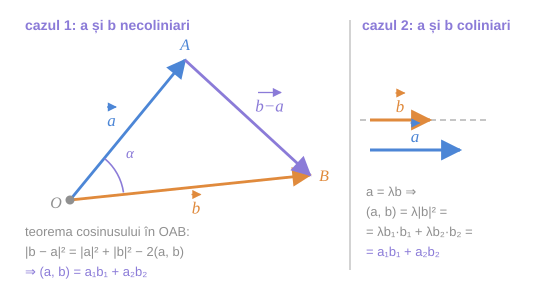
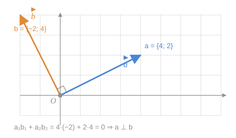

> [!tip] Despre ce este lecția
> Definiția (1) este geometrică: ca să calculezi $(\vec a, \vec b)$ trebuie să cunoști două lungimi și un unghi — adică să **măsori pe desen**. Lecția aceasta o înlocuiește cu o formulă aritmetică, $(\vec a, \vec b) = a_1b_1 + a_2b_2$, care cere doar cele patru coordonate.
>
> Este trecerea decisivă a întregului capitol: din acest moment unghiurile și perpendicularitățile se verifică **prin calcul**, nu prin desen.

## 1. Teorema 13.3 — proprietățile de bază

> [!tip] Teorema 13.3
> Pentru orice vectori $\vec a$, $\vec b$, $\vec c$ și orice număr real $\alpha$ sunt juste următoarele egalități:
>
> **1⁰.** $(\vec a, \vec b) = (\vec b, \vec a)$  *(comutativitate / simetrie)*
>
> **2⁰.** $(\alpha\vec a, \vec b) = \alpha(\vec a, \vec b)$ și $(\vec a, \alpha\vec b) = \alpha(\vec a, \vec b)$  *(omogenitate)*
>
> **3⁰.** $(\vec a + \vec b, \vec c) = (\vec a, \vec c) + (\vec b, \vec c)$  *(distributivitate față de adunare)*

**Demonstrație.** Fie într-o bază ortonormată sunt dați vectorii $\vec a = \{a_1;\ a_2\}$, $\vec b = \{b_1;\ b_2\}$ și $\vec c = \{c_1;\ c_2\}$.

Vom demonstra doar una din aceste egalități, de exemplu **3⁰**, celelalte se demonstrează în mod analogic.

Deoarece $\vec a + \vec b = \{a_1+b_1;\ a_2+b_2\}$, atunci

$$
(\vec a + \vec b, \vec c) = (a_1+b_1)c_1 + (a_2+b_2)c_2 = (a_1c_1 + a_2c_2) + (b_1c_1 + b_2c_2) = (\vec a, \vec c) + (\vec b, \vec c).
$$

Teorema 13.3 este demonstrată. $\blacksquare$

> [!note] O referință înainte — dar nu un cerc vicios
> Demonstrația de mai sus folosește formula $(\vec u, \vec v) = u_1v_1 + u_2v_2$, care este **teorema 13.5**, enunțată abia în secțiunea 3 a acestei lecții. O demonstrație care se sprijină pe un rezultat ulterior pare suspectă.
>
> **Nu este un cerc vicios**, și iată de ce: demonstrația teoremei 13.5 folosește doar
> - definiția 13.1 (formula (1)),
> - teorema cosinusului din geometria elementară,
> - formula modulului (11) din §11,
> - [[Raportul a doi vectori coliniari#3. Teorema 5.3 — criteriul de coliniaritate|teorema despre vectori coliniari]] din §5.
>
> Niciunul dintre aceste rezultate nu depinde de teorema 13.3. Lanțul logic real este deci: **13.5 → 13.3**, chiar dacă ordinea de prezentare din manual este inversă.
>
> **Cum ar trebui citit paragraful:** dacă vreți ordinea logică, citiți întâi secțiunea 3 (teorema 13.5), apoi reveniți la secțiunea 1.

> [!example]- Pas cu pas — demonstrația proprietății 3⁰, desfăcută
> **Pasul 1 — scrieți coordonatele sumei.** După [[Operații cu vectori în coordonate#2⁰. Suma și diferența|regula de adunare în coordonate]], $\vec a + \vec b = \{a_1+b_1;\ a_2+b_2\}$. Adunarea vectorilor se face coordonată cu coordonată.
>
> **Pasul 2 — aplicați formula (3).** Produsul scalar dintre $\vec a + \vec b$ și $\vec c$ este suma produselor coordonatelor corespunzătoare:
> $$
> (\vec a + \vec b, \vec c) = (a_1+b_1)c_1 + (a_2+b_2)c_2.
> $$
>
> **Pasul 3 — desfaceți parantezele.** $= a_1c_1 + b_1c_1 + a_2c_2 + b_2c_2$.
>
> **Pasul 4 — regrupați.** Puneți laolaltă termenii cu $a$ și, separat, cei cu $b$:
> $$
> = (a_1c_1 + a_2c_2) + (b_1c_1 + b_2c_2).
> $$
>
> **Pasul 5 — recunoașteți.** Prima paranteză este $(\vec a, \vec c)$, a doua este $(\vec b, \vec c)$. Gata.
>
> **Ce s-a folosit de fapt.** Doar **distributivitatea înmulțirii numerelor reale** față de adunare. Proprietatea 3⁰ a vectorilor nu e decât distributivitatea numerelor, transportată prin formula (3).
>
> **Exemplu numeric.** $\vec a = \{1; 2\}$, $\vec b = \{3; -1\}$, $\vec c = \{2; 4\}$.
> Stânga: $\vec a + \vec b = \{4; 1\}$, deci $(\vec a+\vec b, \vec c) = 4\cdot 2 + 1\cdot 4 = 12$.
> Dreapta: $(\vec a, \vec c) = 1\cdot 2 + 2\cdot 4 = 10$; $(\vec b, \vec c) = 3\cdot 2 + (-1)\cdot 4 = 2$; suma $= 12$. ✓

> [!warning] Ce **nu** spune teorema 13.3
> Lipsesc din listă două proprietăți la care v-ați putea aștepta prin analogie cu numerele:
> - **asociativitatea** $\big((\vec a, \vec b), \vec c\big) = \big(\vec a, (\vec b, \vec c)\big)$ — **falsă**, și nici măcar bine formulată;
> - **simplificarea** $(\vec a, \vec b) = 0,\ \vec a \neq \vec 0 \Rightarrow \vec b = \vec 0$ — **falsă**.
>
> Ambele sunt tratate în detaliu în [[Ce nu se transferă de la numere. Aplicații]].

> [!check] Consecința 13.4
> Pentru orice vectori $\vec a$, $\vec b$, $\vec c$ și $\vec d$ are loc egalitatea:
> $$
> (\vec a + \vec b,\ \vec c + \vec d) = (\vec a, \vec c) + (\vec a, \vec d) + (\vec b, \vec c) + (\vec b, \vec d).
> $$

> [!example]- Pas cu pas — deducerea consecinței 13.4
> **Pasul 1 — aplicați 3⁰ pe primul argument**, tratând $\vec c + \vec d$ ca un singur vector:
> $$
> (\vec a + \vec b,\ \vec c + \vec d) = (\vec a,\ \vec c + \vec d) + (\vec b,\ \vec c + \vec d).
> $$
>
> **Pasul 2 — pentru a desface al doilea argument, folosiți 1⁰.** Proprietatea 3⁰ e enunțată doar pentru primul argument; simetria permite mutarea:
> $$
> (\vec a,\ \vec c + \vec d) = (\vec c + \vec d,\ \vec a) = (\vec c, \vec a) + (\vec d, \vec a) = (\vec a, \vec c) + (\vec a, \vec d).
> $$
>
> **Pasul 3 — la fel pentru al doilea termen** și adunați. Rezultă cele patru produse.
>
> **Recunoașteți tiparul.** Este exact regula „fiecare cu fiecare" de la desfacerea parantezelor $(x+y)(z+t)$ din algebră. Produsul scalar se comportă, față de adunare, ca înmulțirea obișnuită.
>
> **Caz particular util.** Luând $\vec c = \vec a$ și $\vec d = \vec b$:
> $$
> \lvert\vec a + \vec b\rvert^2 = (\vec a+\vec b)^{\,2} = \vec a^{\,2} + 2(\vec a, \vec b) + \vec b^{\,2} = \lvert\vec a\rvert^2 + 2(\vec a, \vec b) + \lvert\vec b\rvert^2.
> $$
> Aceasta este **teorema cosinusului scrisă vectorial** — și, pentru $\vec a \perp \vec b$, chiar teorema lui Pitagora.

## 2. Teorema 13.5 — produsul scalar în coordonate

> [!tip] Teorema 13.5
> Fie într-o bază ortonormată sunt dați vectorii $\vec a = \{a_1;\ a_2\}$ și $\vec b = \{b_1;\ b_2\}$. Atunci
> $$
> (\vec a, \vec b) = a_1b_1 + a_2b_2 \tag{3}
> $$

> [!warning] Ipoteza „bază ortonormată" nu poate fi eliminată
> **Ortonormat** = vectorii bazei sunt perpendiculari și de lungime $1$ ($\vec i \perp \vec j$, $\lvert\vec i\rvert = \lvert\vec j\rvert = 1$).
>
> Într-o bază oarecare formula (3) este **falsă**. Exemplu: dacă $\widehat{(\vec e_1, \vec e_2)} = 60°$ și ambii sunt unitari, atunci pentru $\vec a = \vec e_1 = \{1; 0\}$ și $\vec b = \vec e_2 = \{0; 1\}$ formula (3) ar da $0$, deci $\vec a \perp \vec b$ — fals, unghiul lor este $60°$. Valoarea corectă este $(\vec e_1, \vec e_2) = 1\cdot 1\cdot\cos 60° = \frac12$.

**Demonstrație.** Dacă măcar unul din vectorii $\vec a$ sau $\vec b$ este nul, atunci justețea afirmației (3) este evidentă (ambele părți sunt $0$), și e suficient de cercetat doar cazul când $\vec a \neq \vec 0$ și $\vec b \neq \vec 0$. Considerăm două cazuri.

*fig. 1 — cele două cazuri ale demonstrației: vectori necoliniari (triunghiul $OAB$) și vectori coliniari*

### Cazul 1 — vectorii $\vec a$ și $\vec b$ nu-s coliniari

Dintr-un punct arbitrar $O$ depunem vectorii $\vec{OA} = \vec a$ și $\vec{OB} = \vec b$ și cercetăm triunghiul $OAB$. Din teorema cosinusului obținem

$$
\vec{AB}^{\,2} = \vec{OA}^{\,2} + \vec{OB}^{\,2} - 2\lvert\vec{OA}\rvert\cdot\lvert\vec{OB}\rvert\cos\alpha,
$$

unde $\alpha$ este măsura unghiului dintre vectorii $\vec a$ și $\vec b$. Deoarece $\vec{AB} = \vec{OB} - \vec{OA} = \vec b - \vec a$, atunci avem $\lvert\vec b - \vec a\rvert^2 = \lvert\vec a\rvert^2 + \lvert\vec b\rvert^2 - 2(\vec a, \vec b)$, sau

$$
(\vec a, \vec b) = \frac{1}{2}\left(\lvert\vec a\rvert^2 + \lvert\vec b\rvert^2 - \lvert\vec b - \vec a\rvert^2\right) \tag{4}
$$

Deoarece $\vec b - \vec a = \{b_1 - a_1;\ b_2 - a_2\}$, atunci

$$
\lvert\vec b - \vec a\rvert^2 = (b_1-a_1)^2 + (b_2-a_2)^2, \qquad \vec a^{\,2} = a_1^2 + a_2^2, \qquad \vec b^{\,2} = b_1^2 + b_2^2.
$$

Înlocuim ultimele egalități în (4) și obținem:

$$
(\vec a, \vec b) = \frac{1}{2}\left(a_1^2 + a_2^2 + b_1^2 + b_2^2 - b_1^2 + 2a_1b_1 - a_1^2 - b_2^2 + 2a_2b_2 - a_2^2\right) = a_1b_1 + a_2b_2.
$$

### Cazul 2 — vectorii $\vec a$ și $\vec b$ sunt coliniari

În baza teoremei despre vectori coliniari, există așa un număr $\lambda$ încât $\vec a = \lambda\vec b$. Prin urmare,

$$
a_1 = \lambda b_1 \quad\text{și}\quad a_2 = \lambda b_2 \tag{5}
$$

Conform definiției produsului scalar,

$$
(\vec a, \vec b) = (\lambda\vec b, \vec b) = \lvert\lambda\vec b\rvert\cdot\lvert\vec b\rvert\cdot\cos\widehat{(\lambda\vec b, \vec b)},
$$

adică pentru orice $\lambda$ avem: $(\vec a, \vec b) = \lambda\lvert\vec b\rvert^2$. Deoarece are loc (5) și $\vec b^{\,2} = b_1^2 + b_2^2$, obținem

$$
(\vec a, \vec b) = \lambda(b_1^2 + b_2^2) = \lambda b_1 \cdot b_1 + \lambda b_2 \cdot b_2 = a_1b_1 + a_2b_2.
$$

Teorema 13.5 este demonstrată. $\blacksquare$

> [!example]- Cum se citește figura — demonstrația teoremei 13.5
> **Pasul 1 — priviți întâi panoul din stânga (cazul necoliniar).** Vectorii $\vec a$ (albastru) și $\vec b$ (portocaliu) sunt depuși din $O$; unghiul dintre ei este $\alpha$. Cele două săgeți, împreună cu a treia, închid triunghiul $OAB$.
>
> **Pasul 2 — identificați a treia latură.** Săgeata violet de la $A$ la $B$ este $\vec b - \vec a$ — [[Scăderea vectorilor#2. Construcția diferenței|construcția diferenței]]: doi vectori din origine comună, iar segmentul care unește vârfurile, orientat *spre descăzut*.
>
> **Pasul 3 — de ce triunghiul e legitim.** Aici se folosește ipoteza „necoliniari": dacă $\vec a$ și $\vec b$ ar fi coliniari, punctele $O$, $A$, $B$ ar fi pe o dreaptă și nu ar exista niciun triunghi. De aceea cazul 2 trebuie tratat separat.
>
> **Pasul 4 — aplicați teorema cosinusului.** Laturile $OA = \lvert\vec a\rvert$, $OB = \lvert\vec b\rvert$, $AB = \lvert\vec b - \vec a\rvert$, cu unghiul $\alpha$ între primele două. Rezultă relația scrisă sub figură — și, izolând $\cos\alpha$, formula (4).
>
> **Pasul 5 — treceți la coordonate.** Toate cele trei module se calculează prin (11) din §11. Substituind și simplificând (pătratele lui $a_1, a_2, b_1, b_2$ se reduc două câte două), rămâne exact $a_1b_1 + a_2b_2$.
>
> **Pasul 6 — panoul din dreapta (cazul coliniar).** Vectorii sunt pe aceeași dreaptă (linia punctată), deci $\vec a = \lambda\vec b$. Nu mai e nevoie de triunghi: produsul scalar se calculează direct din definiție, iar coordonatele lui $\vec a$ se obțin înmulțind cu $\lambda$ pe cele ale lui $\vec b$.
>
> **Pe ce se bazează:** teorema cosinusului din geometria elementară, [[Sistemul rectangular cartezian. Coordonatele și modulul unui vector#3. Proprietatea 2⁰ — modulul vectorului|formula (11)]], și [[Raportul a doi vectori coliniari#3. Teorema 5.3 — criteriul de coliniaritate|criteriul de coliniaritate]].
>
> **Ce să verificați singuri pe figură:** în panoul stâng, verificați că săgețile portocalie și violet, puse cap la cap, dau săgeata albastră citită invers — adică $\vec a + (\vec b - \vec a) = \vec b$.

> [!tip] Formula (4) merită reținută separat
> $$
> (\vec a, \vec b) = \frac{1}{2}\left(\lvert\vec a\rvert^2 + \lvert\vec b\rvert^2 - \lvert\vec b - \vec a\rvert^2\right)
> $$
> Ea exprimă produsul scalar **numai prin lungimi** — niciun unghi, nicio coordonată. Spune un lucru remarcabil: dacă știi să măsori distanțe, produsul scalar este deja determinat. Unghiurile nu sunt o informație independentă de distanțe.
>
> *Exemplu de verificare.* $\vec a = \{3; 0\}$, $\vec b = \{0; 4\}$: $\lvert\vec a\rvert^2 = 9$, $\lvert\vec b\rvert^2 = 16$, $\vec b - \vec a = \{-3; 4\}$ deci $\lvert\vec b - \vec a\rvert^2 = 25$. Atunci $(\vec a, \vec b) = \frac12(9+16-25) = 0$ ✓ — și într-adevăr vectorii sunt perpendiculari.

## 3. Consecințele

> [!check] Consecința 13.6 — perpendicularitatea în coordonate
> Într-o bază ortonormată vectorii $\vec a = \{a_1;\ a_2\}$ și $\vec b = \{b_1;\ b_2\}$ sunt reciproc perpendiculari atunci și numai atunci, când
> $$
> a_1b_1 + a_2b_2 = 0 \tag{6}
> $$

*fig. 2 — $\vec a = \{4;\ 2\}$ și $\vec b = \{-2;\ 4\}$: suma produselor coordonatelor este $0$, iar unghiul chiar este drept*

> [!example]- Cum se citește figura — criteriul (6)
> **Pasul 1 — citiți coordonatele de pe rețea.** $\vec a$ merge $4$ la dreapta și $2$ în sus: $\{4;\ 2\}$. $\vec b$ merge $2$ la stânga și $4$ în sus: $\{-2;\ 4\}$.
>
> **Pasul 2 — faceți calculul.** $a_1b_1 + a_2b_2 = 4\cdot(-2) + 2\cdot 4 = -8 + 8 = 0$.
>
> **Pasul 3 — verificați pe desen.** Unghiul drept marcat în $O$ confirmă concluzia. Calculul aritmetic și desenul spun același lucru.
>
> **Pasul 4 — observați tiparul.** Din $\{4;\ 2\}$ se obține un vector perpendicular schimbând coordonatele între ele și schimbând semnul uneia: $\{-2;\ 4\}$. Regula generală: **$\{x;\ y\} \perp \{-y;\ x\}$**, oricare ar fi $x, y$. Verificare: $x(-y) + yx = 0$ ✓
>
> **Pasul 5 — trageți concluzia practică.** Ca să verificați perpendicularitatea nu mai aveți nevoie nici de raportor, nici de cosinus: patru înmulțiri și o adunare.
>
> **Pe ce se bazează:** teorema 13.5 (formula 3) combinată cu criteriul $(\vec a, \vec b) = 0 \iff \vec a \perp \vec b$ din [[Produsul scalar — definiție și interpretare#2. Ce citim din semnul produsului scalar|lecția precedentă]].
>
> **Ce să verificați singuri pe figură:** desenați $\vec c = \{-4;\ -2\}$ (opusul lui $\vec a$). Calculați $(\vec c, \vec b)$ — tot $0$. Perpendicularitatea nu se strică la schimbarea sensului.

> [!check] Consecința 13.7 — cosinusul unghiului în coordonate
> Cosinusul unghiului dintre doi vectori nenuli $\vec a = \{a_1;\ a_2\}$ și $\vec b = \{b_1;\ b_2\}$ într-o bază ortonormată se calculează după formula
> $$
> \cos\widehat{(\vec a, \vec b)} = \frac{a_1b_1 + a_2b_2}{\sqrt{a_1^2+a_2^2}\cdot\sqrt{b_1^2+b_2^2}} \tag{7}
> $$

**Demonstrație.** Din formula (1) avem $\cos\widehat{(\vec a, \vec b)} = \dfrac{(\vec a, \vec b)}{\lvert\vec a\rvert\cdot\lvert\vec b\rvert}$. Introducem în formula dată valorile lui $(\vec a, \vec b)$, $\lvert\vec a\rvert$ și $\lvert\vec b\rvert$ — date de (3) și respectiv (11). Vom obține formula (7). $\blacksquare$

> [!tip] Bilanțul paragrafului
> | Întrebare geometrică | Răspuns prin coordonate |
> |---|---|
> | Cât de lung este $\vec a$? | $\lvert\vec a\rvert = \sqrt{a_1^2+a_2^2}$ |
> | Cât de departe sunt $A$ și $B$? | $\rho(A,B) = \sqrt{(x_2-x_1)^2+(y_2-y_1)^2}$ |
> | Sunt $\vec a$ și $\vec b$ perpendiculari? | $a_1b_1 + a_2b_2 = 0$? |
> | Ce unghi formează $\vec a$ și $\vec b$? | formula (7) |
> | Sunt $\vec a$ și $\vec b$ coliniari? | $a_1b_2 - a_2b_1 = 0$? (din §10) |
>
> Toată geometria metrică a planului, în cinci rânduri de aritmetică.

> [!warning] Formula (7) cere vectori nenuli
> Dacă $\vec a = \vec 0$, numitorul se anulează. Firesc: unghiul dintre $\vec 0$ și $\vec b$ a fost *convenit* egal cu $\pi/2$, nu calculat — deci nu se poate obține dintr-o formulă.

## Întrebări de control

1. De ce demonstrația teoremei 13.5 tratează separat cazul vectorilor coliniari? Ce anume cade în cazul 1?
2. Verificați formula (4) pentru $\vec a = \{1;\ 2\}$ și $\vec b = \{3;\ 1\}$, calculând ambii membri.
3. Găsiți toți vectorii perpendiculari pe $\vec a = \{3;\ -5\}$. Câți sunt?
4. Arătați, pornind de la (7), că $\lvert(\vec a, \vec b)\rvert \leq \lvert\vec a\rvert\cdot\lvert\vec b\rvert$ pentru orice vectori. Când are loc egalitatea?
5. De ce ipoteza „bază ortonormată" apare în enunțul teoremei 13.5, dar nu apare în teorema 13.3?

## Legături

- Anterior: [[Produsul scalar — definiție și interpretare]]
- Continuare: [[Ce nu se transferă de la numere. Aplicații]]
- Se sprijină pe: [[Sistemul rectangular cartezian. Coordonatele și modulul unui vector]], [[Raportul a doi vectori coliniari]], [[Operații cu vectori în coordonate]]
- Concepte: [[Produs scalar]], [[Bază ortonormată]], [[Vectori perpendiculari]]
