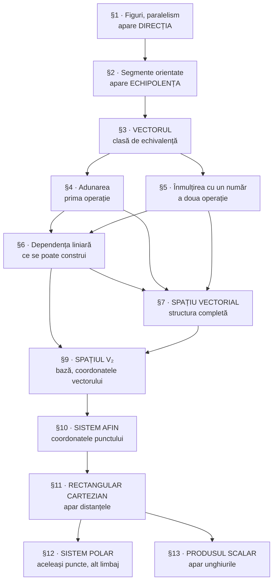

Notițe de curs, sistematizate pe **paragrafele cursului (§1–§7, §9–§13)**. Fiecare paragraf are folderul lui, cu lecțiile numerotate în ordinea predării și figurile alături.

> [!tip] Intrări rapide
> - **[[Recapitulare — vectori]]** — tot formularul §3–§7 pe o pagină
> - **[[Recapitulare — baze și coordonate]]** — tot formularul §9–§10 pe o pagină
> - **[[Recapitulare — metrica planului]]** — tot formularul §11–§13 pe o pagină
> - **[[Notații și simboluri]]** — ce înseamnă fiecare simbol
> - **[[#Firul logic al cursului]]** — de ce vine fiecare noțiune după cealaltă

## Capitole

### §1 — Figuri geometrice simple. Paralelism

| # | Lecția | Conținut |
|---|---|---|
| 1 | [[Figuri geometrice simple. Definiții și notare]] | figură geometrică, convenții de notare |
| 2 | [[Paralelismul dreptelor, semidreptelor și planelor]] | paralelism dreaptă–dreaptă, dreaptă–plan, plan–plan; criterii |
| 3 | [[Orientarea semidreptelor. Direcție]] | semidrepte coorientate / opus orientate, direcție |

### §2 — Segmente orientate. Echipolență

| # | Lecția | Conținut |
|---|---|---|
| 1 | [[Segmente orientate. Segmente echipolente]] | segment orientat, echipolență, criteriul de echipolență |

### §3 — Vectori

| # | Lecția | Conținut |
|---|---|---|
| 1 | [[Vectori]] | vectorul ca clasă de echivalență, reprezentant, teorema reprezentantului unic |
| 2 | [[Coliniaritatea și orientarea vectorilor]] | vectori coliniari, $\uparrow\uparrow$ și $\uparrow\downarrow$ |
| 3 | [[Modulul vectorului. Vectorul opus]] | $\lvert \vec{a} \rvert$, $-\vec{a}$, vectorul liber |
| 4 | [[Vectori aplicați, alunecători și liberi]] | tipuri de vectori, mărime vectorială |

### §4 — Adunarea și scăderea vectorilor

| # | Lecția | Conținut |
|---|---|---|
| 1 | [[Adunarea vectorilor. Regula triunghiului și a poligonului]] | linia frântă, relația lui Chasles |
| 2 | [[Regula paralelogramului]] | diagonala paralelogramului; comparație cu regula triunghiului |
| 3 | [[Proprietățile adunării vectorilor]] | comutativitate, asociativitate, $\vec{0}$, $-\vec{a}$ |
| 4 | [[Scăderea vectorilor]] | diferența ca operație inversă |

### §5 — Produsul vectorului la un număr

| # | Lecția | Conținut |
|---|---|---|
| 1 | [[Produsul vectorului la un număr]] | definiția 5.1, omotetia |
| 2 | [[Proprietățile înmulțirii vectorului cu un număr]] | proprietățile 4–6, cu demonstrații |
| 3 | [[Raportul a doi vectori coliniari]] | definiția 5.2, teorema 5.3 |

### §6 — Dependența și independența liniară

| # | Lecția | Conținut |
|---|---|---|
| 1 | [[Combinație liniară. Dependență și independență liniară]] | definițiile 6.1–6.4 |
| 2 | [[Teoremele fundamentale ale dependenței liniare]] | teoremele 6.5–6.7, corolarul 6.8 |
| 3 | [[Vectori coplanari]] | definiție, paralelipipedul |
| 4 | [[Descompunerea unui vector după doi vectori necoliniari]] | teorema 6.9 |
| 5 | [[Coliniaritate, coplanaritate și dependență liniară]] | teoremele 6.10 și 6.11 |

### §7 — Spații vectoriale

| # | Lecția | Conținut |
|---|---|---|
| 1 | [[Spațiul vectorial al vectorilor liberi]] | cele 8 proprietăți, subspații, $L(\vec{a}, \vec{b})$ |

### §8 — Axa numerică *(neconspectat)*

Manualul, p. 35–39. Din el se folosesc în §10 definiția raportului pe dreaptă și explicația pentru $\lambda \ne -1$ — rezumate în [[Împărțirea segmentului în raportul dat]].

### §9 — Spațiul V₂

| # | Lecția | Conținut |
|---|---|---|
| 1 | [[Spațiul V2. Vectori coplanari și dimensiunea planului]] | sistem de vectori coplanari, dimensiunea 2, exemplul 9.3 |
| 2 | [[Baza spațiului V2. Coordonatele vectorului]] | definiția 9.1, coordonatele în bază |
| 3 | [[Reperul afin în plan. Tipuri de repere]] | definiția 9.2; repere cartezian, rectangular, rectangular cartezian |

### §10 — Sistemul afin de coordonate în plan. Împărțirea segmentului în raportul dat

| # | Lecția | Conținut |
|---|---|---|
| 1 | [[Sistemul afin de coordonate. Axe și cadrane]] | axe, origine, definiția 10.1, cadrane |
| 2 | [[Orientarea planului, a poligoanelor și a unghiurilor]] | orientare stângă/dreaptă, poligoane și unghiuri orientate |
| 3 | [[Coordonatele vectorului. Proiecții geometrice și algebrice]] | definițiile 10.2–10.3, teorema 10.4 |
| 4 | [[Operații cu vectori în coordonate]] | proprietățile 1⁰–5⁰, concluzia 10.5 |
| 5 | [[Coordonatele punctului. Raza vectoare]] | definițiile 10.6–10.7, formula (5) |
| 6 | [[Împărțirea segmentului în raportul dat]] | definiția 10.8, formulele (6)–(9) |

### §11 — Sistemul de coordonate rectangular cartezian

| # | Lecția | Conținut |
|---|---|---|
| 1 | [[Sistemul rectangular cartezian. Coordonatele și modulul unui vector]] | proprietățile 1⁰–2⁰, formulele (10)–(11), $\operatorname{tg}\varphi = y/x$ |
| 2 | [[Distanța dintre două puncte]] | proprietatea 3⁰, formula (12), exemplul 11.1 |

### §12 — Sistemul polar de coordonate

| # | Lecția | Conținut |
|---|---|---|
| 1 | [[Reperul polar. Coordonate polare]] | pol, axă polară, rază polară, unghi polar |
| 2 | [[Trecerea între coordonate polare și carteziene]] | $x = r\cos\varphi$, $y = r\sin\varphi$ și invers; exemplul 12.1 |

### §13 — Produsul scalar a doi vectori

| # | Lecția | Conținut |
|---|---|---|
| 1 | [[Unghiul dintre doi vectori. Perpendicularitate]] | definiția unghiului, independența de $O$, $\vec a \perp \vec b$ |
| 2 | [[Produsul scalar — definiție și interpretare]] | definiția 13.1, formulele (1)–(2), exemplul 13.2 |
| 3 | [[Proprietățile produsului scalar. Expresia în coordonate]] | teoremele 13.3 și 13.5, consecințele 13.4, 13.6, 13.7 |
| 4 | [[Ce nu se transferă de la numere. Aplicații]] | cele trei capcane, exemplul 13.8 |

## Concepte

Fișe scurte de referință, în folderul `Concepte/`:

- **Figuri primare:** [[Punct]] · [[Dreaptă]] · [[Plan]] · [[Semiplan]] · [[Semidreaptă]] · [[Segment]]
- **Orientare:** [[Direcție]] · [[Segment orientat]] · [[Echipolență]]
- **Vectori:** [[Vector]] · [[Vector liber]] · [[Vector opus]] · [[Modulul vectorului]] · [[Vectori coliniari]] · [[Coplanaritate]]
- **Algebră liniară:** [[Combinație liniară]] · [[Dependență liniară]] · [[Spațiu vectorial]]
- **Transformări:** [[Omotetie]]
- **Coordonate:** [[Bază]] · [[Reper afin]] · [[Sistem afin de coordonate]] · [[Orientarea planului]] · [[Proiecția unui vector]] · [[Rază vectoare]] · [[Raportul de împărțire a segmentului]]
- **Metrică (§11–§13):** [[Sistem rectangular cartezian]] · [[Bază ortonormată]] · [[Distanța dintre două puncte (formulă)]] · [[Coordonate polare]] · [[Unghiul dintre doi vectori]] · [[Vectori perpendiculari]] · [[Produs scalar]] · [[Pătrat scalar]]

## Referință

- [[Recapitulare — vectori]] — formulele, teoremele și capcanele §3–§7
- [[Recapitulare — baze și coordonate]] — formulele §9–§10 și erorile găsite în manual
- [[Recapitulare — metrica planului]] — formulele §11–§13: distanțe, coordonate polare, produs scalar
- [[Probleme rezolvate — vectori]] — 7 aplicații clasice, rezolvate pas cu pas
- [[Notații și simboluri]] — toate simbolurile folosite în curs
- [[Surse originale]] — fotografiile caietului, PDF-ul lectorului, manualul, notițele brute

## Firul logic al cursului

Citit în cuvinte:

1. **§1 Notare și paralelism** — fixăm limbajul, apoi relația care permite compararea a două figuri îndepărtate. Paralelismul singur nu distinge sensul; semiplanele îl disting, și apare **direcția**.
2. **§2 Echipolență** — direcție + sens + lungime. Se dovedește că este o *relație de echivalență*.
3. **§3 Vectorul** — clasele de echivalență ale echipolenței. Teorema reprezentantului unic arată că un vector poate fi aplicat oriunde: e **liber**.
4. **§4 și §5 Operațiile** — adunarea (geometric: linia frântă) și înmulțirea cu un număr (geometric: omotetia).
5. **§6 Dependența liniară** — ce se poate și ce nu se poate obține din vectori dați. Rezultatul-cheie: *coliniar = dependent (2 vectori)*, *coplanar = dependent (3 vectori)*.
6. **§7 Spațiul vectorial** — cele opt proprietăți strânse la un loc dau structura abstractă.
7. **§9 Spațiul $V_2$** — în plan, doi vectori necoliniari formează o **bază**; fiecare vector primește o pereche unică de numere.
8. **§10 Sistemul afin** — adăugând o **origine**, și fiecare **punct** primește o pereche de numere. De aici, problemele de geometrie se rezolvă prin calcul.
9. **§11 Sistemul rectangular cartezian** — cerând axe perpendiculare și unități egale cu $1$, coordonatele încep să **măsoare**: apar modulul $\sqrt{x^2+y^2}$ și distanța dintre două puncte.
10. **§12 Sistemul polar** — același plan descris prin *distanță + direcție* în loc de *două deplasări*. Nimic logic nou; un limbaj mai potrivit pentru figurile radiale.
11. **§13 Produsul scalar** — prima operație care dă **un număr**. Cu ea, perpendicularitatea devine ecuația $a_1b_1 + a_2b_2 = 0$, iar unghiurile se calculează în loc să fie măsurate.

> [!tip] Ideea centrală a cursului
> Fiecare noțiune **geometrică** primește un echivalent **algebric**:
> | Geometrie | Algebră |
> |---|---|
> | săgeți echipolente | un vector |
> | coliniari | $\vec{a} = \lambda\vec{b}$ |
> | coplanari | $\vec{c} = \alpha\vec{a} + \beta\vec{b}$ |
> | „nimic în plus" | independență liniară |
> | un punct din plan | o pereche $(x;\ y)$ |
> | mijlocul unui segment | $\left(\tfrac{x_1+x_2}{2};\ \tfrac{y_1+y_2}{2}\right)$ |
> | distanța dintre două puncte | $\sqrt{(x_2-x_1)^2+(y_2-y_1)^2}$ |
> | perpendicularitate | $a_1b_1 + a_2b_2 = 0$ |
> | unghi | $\cos\widehat{(\vec a,\vec b)} = \dfrac{(\vec a,\vec b)}{\lvert\vec a\rvert\lvert\vec b\rvert}$ |
>
> Aceasta este **geometria analitică**: figurile devin ecuații.

## Cum se folosește vaultul

Notele de lecție conțin materia de curs. Blocurile pliate (cele cu `-` în titlu) se deschid la click:

| Bloc | Ce conține |
|---|---|
| `[!abstract] Definiție` | definiția, exact ca la curs |
| `[!tip] Teoremă` | enunțul principal |
| `[!check] Criteriu` | condiție de verificat în probleme |
| `[!example]- Pas cu pas` | **demonstrația sau construcția, desfăcută în pași**, cu exemple numerice |
| `[!example]- Cum se citește figura` | **ordinea în care se parcurge figura** unei teoreme, pe ce se bazează fiecare pas și ce puteți verifica singuri pe desen |
| `[!info]- Completare` | material adăugat, care **nu** figura în notițele originale |
| `[!warning]` | capcane, ipoteze care nu pot fi eliminate, greșeli de tipar în surse |

Fiecare lecție se încheie cu **Întrebări de control** și **Legături** (anterior / continuare / concepte).

Pentru note noi: folosiți șabloanele din `Șabloane/`. Materialele originale (fotografii, PDF-ul lectorului, manualul, notițele dactilografiate) sunt păstrate în `Surse/`.
