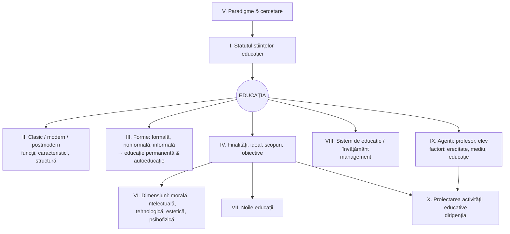

> [!info] Despre această notă
> Harta completă a manualului universitar [[Manual - Fundamentele științelor educației (2014)]] (Cojocaru-Borozan, Sadovei, Papuc, Ovcerenco, UPS „Ion Creangă”, Chișinău, 2014). Toate subcapitolele au conspecte detaliate (vezi mai jos).
> Numerele de pagină sunt cele **tipărite în manual**.

## Logica manualului

Manualul integrează două discipline mai vechi — *Fundamentele pedagogiei* și *Teoria educației* — și are ca reper epistemologic concepția lui **Sorin Cristea** (teoria generală a educației definește conceptele pedagogice de bază). Cele 10 module pot fi citite pe patru „etaje”:

| Etaj | Întrebarea | Module |
|---|---|---|
| **Epistemologic** | Ce este știința educației și cum cercetează? | [[Modulul 01 - Statutul științelor educației\|I]], [[Modulul 05 - Paradigmele pedagogiei și cercetarea pedagogică\|V]] |
| **Ontologic** (ce este educația) | Cum e structurată și cum evoluează educația? | [[Modulul 02 - Clasic, modern și postmodern în educație\|II]], [[Modulul 03 - Formele generale ale educației\|III]] |
| **Teleologic și de conținut** | Spre ce educăm și ce conținuturi? | [[Modulul 04 - Finalitățile educației\|IV]], [[Modulul 06 - Dimensiunile generale ale educației\|VI]], [[Modulul 07 - Noile educații\|VII]] |
| **Instituțional și practic** | Cine, în ce sistem, cum proiectăm? | [[Modulul 08 - Sistemul de educație și managementul educației\|VIII]], [[Modulul 09 - Agenții educației și factorii dezvoltării\|IX]], [[Modulul 10 - Proiectarea, realizarea și evaluarea activității educative\|X]] |

## Modulele

1. [[Modulul 01 - Statutul științelor educației]] — pedagogie vs. științe ale educației; evoluția pedagogiei ca știință; normativitate și principii; taxonomia științelor educației; pedagogia între științele socioumane. *(p. 10–53)*
2. [[Modulul 02 - Clasic, modern și postmodern în educație]] — tradiție/modernitate/postmodernitate; direcțiile modernizării; funcțiile, caracteristicile, structura educației. *(p. 54–78)*
3. [[Modulul 03 - Formele generale ale educației]] — educația formală, nonformală, informală și relația dintre ele; **educația permanentă și autoeducația**. *(p. 79–121)*
4. [[Modulul 04 - Finalitățile educației]] — ideal, scopuri, obiective; funcții și niveluri ale finalităților; taxonomia obiectivelor. *(p. 122–147)*
5. [[Modulul 05 - Paradigmele pedagogiei și cercetarea pedagogică]] — noțiunea de paradigmă (Kuhn); paradigme educaționale; tipuri și metode de cercetare. *(p. 148–174)*
6. [[Modulul 06 - Dimensiunile generale ale educației]] — educația integrală: morală, intelectuală, tehnologică, estetică, psihofizică; metodele educației. *(p. 175–217)*
7. [[Modulul 07 - Noile educații]] — răspunsuri UNESCO la problematica lumii contemporane; demersuri de integrare curriculară. *(p. 218–272)*
8. [[Modulul 08 - Sistemul de educație și managementul educației]] — sistem de educație / de învățământ / proces de învățământ; sistemul din R. Moldova; sisteme alternative; management și reformă. *(p. 273–306)*
9. [[Modulul 09 - Agenții educației și factorii dezvoltării]] — profesorul (roluri, competențe, stiluri), profesorul postmodern; elevul; ereditate–mediu–educație. *(p. 307–352)*
10. [[Modulul 10 - Proiectarea, realizarea și evaluarea activității educative]] — proiectare educațională; curriculum la dirigenție; dirigintele. *(p. 353–396)*

**Anexe** (p. 397–428): probe de autoevaluare, test docimologic, lucru individual, comentariu/rezumat, model de proiectare operațională, proiect educațional, evaluarea orei de dirigenție, managementul clasei, harta conceptuală, metoda simulării, subiecte pentru evaluarea finală. **Bibliografie** (p. 429 și urm., 249 titluri).

## Concepte transversale (apar în mai multe module)

- **Educație** — definită ca activitate psihosocială de formare-dezvoltare a personalității (I, II)
- **Funcția centrală a educației**: formarea-dezvoltarea personalității (II, III)
- **Paradigma curriculumului / proiectarea curriculară** — reperul „postmodern” al întregului manual (II, III, IV, X)
- **Educație permanentă & autoeducație** — principiu (I), direcție de evoluție (III), valorificare prin factorii dezvoltării (IX) → [[3.6 Educația permanentă și autoeducația]]
- **Finalități** (ideal → scop → obiective) (IV, VI, VII, X)
- **Codul Educației al R. Moldova (2014)** — cadru normativ invocat în I, IV, VIII

## Conspecte detaliate (toate subcapitolele ✅)

Fiecare conspect are: *Pe scurt* · Partea I (ce spune manualul, cu pagini) · Partea II (completări: autori, lucrări, Codul Educației RM) · comentariu critic · întrebări de autoverificare · surse.

| Modul | Conspecte |
|---|---|
| **I** | [[1.1 Științele educației - delimitări conceptuale\|1.1]] · [[1.2 Evoluția științelor educației\|1.2]] · [[1.3 Normativitatea activității educaționale\|1.3]] · [[1.4 Taxonomia științelor educației\|1.4]] · [[1.5 Pedagogia în sistemul științelor socioumane\|1.5]] |
| **II** | [[2.1 Clasic, modern și postmodern - delimitări conceptuale\|2.1]] · [[2.2 Direcțiile modernizării sistemului educațional\|2.2]] · [[2.3 Funcțiile generale ale educației\|2.3]] · [[2.4 Caracteristicile educației\|2.4]] · [[2.5 Structura și funcționarea educației\|2.5]] |
| **III** | [[3.1 Formele generale ale educației - delimitări conceptuale\|3.1]] · [[3.2 Educația formală\|3.2]] · [[3.3 Educația nonformală\|3.3]] · [[3.4 Educația informală\|3.4]] · [[3.5 Relația dintre formele educației\|3.5]] · [[3.6 Educația permanentă și autoeducația\|3.6]] |
| **IV** | [[4.1 Conceptul de finalitate educațională\|4.1]] · [[4.2 Problematica și funcțiile finalităților\|4.2]] · [[4.3 Niveluri și categorii de finalități\|4.3]] · [[4.4 Finalitățile macro- și microstructurale\|4.4]] · [[4.5 Ierarhizarea și clasificarea obiectivelor\|4.5]] |
| **V** | [[5.1 Noțiunea de paradigmă\|5.1]] · [[5.2 Tipologia paradigmelor educaționale\|5.2]] · [[5.3 Cercetarea pedagogică - noțiune și tipologie\|5.3]] · [[5.4 Metode de cercetare în pedagogie\|5.4]] |
| **VI** | [[6.1 Conținuturile generale ale educației\|6.1]] · [[6.2.1 Educația morală\|6.2.1]] · [[6.2.2 Educația intelectuală\|6.2.2]] · [[6.2.3 Educația tehnologică\|6.2.3]] · [[6.2.4 Educația estetică\|6.2.4]] · [[6.2.5 Educația psihofizică\|6.2.5]] · [[6.3 Metodele educației\|6.3]] |
| **VII** | [[7.1 Noile educații - delimitări conceptuale\|7.1]] · [[7.2.1 Educația pentru participare și democrație\|7.2.1]] · [[7.2.2 Educația pentru comunicare și mass-media\|7.2.2]] · [[7.2.3 Educația pentru dezvoltare emoțională\|7.2.3]] · [[7.2.4 Educația pentru pace și cooperare\|7.2.4]] · [[7.2.5 Educația pentru schimbare și dezvoltare\|7.2.5]] · [[7.2.6 Educația pentru timpul liber\|7.2.6]] · [[7.2.7 Educația relativă la mediu\|7.2.7]] · [[7.2.8 Educația pentru familie\|7.2.8]] · [[7.2.9 Educația pentru parentalitate\|7.2.9]] · [[7.3 Proiectarea curriculară a noilor educații\|7.3]] |
| **VIII** | [[8.1 Sistemul de educație și sistemul de învățământ\|8.1]] · [[8.2 Tendințele de organizare a sistemului de învățământ\|8.2]] · [[8.3 Sistemul de învățământ din Republica Moldova\|8.3]] · [[8.4 Sisteme alternative de organizare a instruirii\|8.4]] · [[8.5 Învățământul simultan\|8.5]] · [[8.6 Managementul educației și reforma\|8.6]] |
| **IX** | [[9.1 Profesorul școlar - roluri, competențe, stiluri\|9.1]] · [[9.2 Profesorul postmodernist - facilitator al cunoașterii\|9.2]] · [[9.3 Personalitatea elevului și comportamentul școlar\|9.3]] · [[9.4 Factorii dezvoltării personalității și factorii educativi\|9.4]] |
| **X** | [[10.1 Proiectarea activității educaționale\|10.1]] · [[10.2 Curriculum la dirigenție\|10.2]] · [[10.3 Activitatea educativă a dirigintelui\|10.3]] · [[10.4 Dirigintele - coordonatorul activității educative\|10.4]] · [[Anexe - instrumente de lucru\|Anexe]] |

## Aprofundări

- [[Autoeducația - teorii, autori și corelări]] — Vygotsky, Valsiner, Blömeke, SDT, autoreglare, identitate; matrice de corelare cu manualul
- [[Erori și actualizări ale manualului]] — erată consolidată: trimiteri greșite, date învechite, corecturi factuale

## Analiză comparată internațională

- [[00 Index - Analiza comparată internațională]] — cum sunt aplicate fundamentele în Singapore, Estonia, Finlanda, Regatul Unit, Japonia, Coreea de Sud, Canada, Europa, SUA *(în lucru)*

## De făcut (extinderi viitoare)

- [ ] Note de concept separate (Educație, Pedagogie, Curriculum, Finalitate, Paradigmă…)
- [ ] Note de autori (Cristea, Cucoș, Nicola, Văideanu, Paul Lengrand, R. H. Dave, Malcolm Knowles…)
