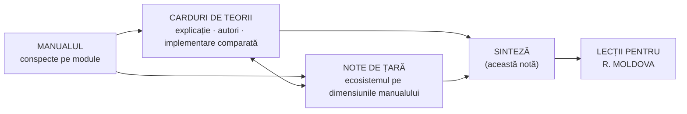

↑ [[00 MOC - Fundamentele științelor educației]]

> [!abstract] Pe scurt
> - Analiza arată cum conceptele manualului — **formele educației, finalitățile, dimensiunile, paradigmele, sistemul, agenții, proiectarea și evaluarea** — au fost transformate în **politici, instituții și practici** în nouă ecosisteme educaționale, în sec. XX–XXI.
> - Cazurile alese: **Singapore, Japonia, Coreea de Sud, Estonia** (performanță de vârf constantă), **Finlanda** (fost lider, azi în declin), **Canada** (vârf echitabil, descentralizat), **Regatul Unit** (patru politici diferite, cu rezultate divergente), **SUA** (principalul „exportator” de teorii) și **spațiul european** (UE și Consiliul Europei). **Republica Moldova** servește ca punct de raportare în toate notele.
> - Materialul are trei straturi: **9 note de țară** (ecosisteme), **20 de carduri de teorii** (explicație → autori → implementare comparată → dovezi) și această **sinteză**.
> - **Concluzia centrală**: sistemele de vârf nu au aceeași „rețetă pedagogică”. Au însă în comun **coerența** (finalități–curriculum–formarea profesorilor–evaluare), **calitatea și statutul profesorilor**, **stabilitatea** reformelor și **sprijinul timpuriu** pentru elevii care rămân în urmă. Diferă profund în privința **responsabilizării**, **autonomiei** și **separării pe filiere**.
> - **PISA 2025** (publicat pe 8 septembrie 2026) arată un **declin general** al mediei OCDE, la cel mai scăzut nivel din istoria testului, dar ierarhia de vârf rămâne stabilă: Asia de Est + Estonia.

---

## 1. Cum se folosește această secțiune

- **Dacă pornești de la un concept al manualului** (ex. evaluarea, profesorul, educația permanentă) → vezi **matricea din §5** → cardul de teorie → notele de țară.
- **Dacă pornești de la o țară** → nota de țară urmează aceeași grilă: date și PISA → cronologie → fundamentele pe dimensiunile manualului → teorii aplicate → ecosistemul extins → factori și limite → lecții pentru Moldova.
- **Dacă pornești de la o teorie** → cardul are un tabel de implementare pe toate cele 9 ecosisteme + Moldova.

---

## 2. Notele de țară

| Ecosistem | Formula în câteva cuvinte | Notă |
|---|---|---|
| 🇸🇬 **Singapore** | stat dezvoltaționist; coerența **minister – NIE – școli**; profesorul ca pârghie; de la eficiență la „școli care gândesc” | [[Singapore - ecosistemul educațional]] |
| 🇯🇵 **Japonia** | curriculum național + **lesson study** + educație holistă (**tokkatsu**); școală de 9 ani fără repartizare pe niveluri | [[Japonia - ecosistemul educațional]] |
| 🇰🇷 **Coreea de Sud** | capital uman, expansiune secvențială; egalitate în școală, competiție în **hagwon**; ideal fixat prin lege | [[Coreea de Sud - ecosistemul educațional]] |
| 🇪🇪 **Estonia** | școală de bază unitară, autonomie, profesori cu master, digitalizare timpurie, **echitate**; reformă pornită de profesori (1987) | [[Estonia - ecosistemul educațional]] |
| 🇫🇮 **Finlanda** | școală comprehensivă, profesori-cercetători, încredere în loc de inspecție, sprijin timpuriu — plus **declinul** și miturile | [[Finlanda - ecosistemul educațional]] |
| 🇨🇦 **Canada** | 13 sisteme provinciale; **Ontario** (reforma întregului sistem), integrarea imigranților, educație timpurie | [[Canada - ecosistemul educațional]] |
| 🇬🇧 **Regatul Unit** | Anglia: curriculum național + teste + Ofsted + piață + dovezi; Scoția și Țara Galilor: competențe și autonomie | [[Regatul Unit - ecosistemul educațional]] |
| 🇪🇺 **Europa** | locul de naștere al pedagogiei; UE coordonează prin ținte, cadre și finanțare; modele naționale foarte diferite | [[Europa - spațiul european al educației]] |
| 🇺🇸 **SUA** | federalism radical; laboratorul teoriilor sec. XX; responsabilizare prin teste, piață, inechitate; variație enormă între state | [[SUA - ecosistemul educațional]] |
| 🇲🇩🇷🇴 **R. Moldova și România** | aproape la egalitate în 2025 (RO ușor înainte la bază, MD înainte la domeniul digital); traiectorii opuse; echitate MD vs. excelență RO; notă specială despre competența digitală | [[Republica Moldova și România - analiză comparată PISA]] |

---

## 3. Tabloul PISA 2025 (citire / matematică / științe)

| Sistem | Citire | Matematică | Științe | Tendință și observații |
|---|---|---|---|---|
| **Media OCDE** | **461** | **463** | **482** | cel mai scăzut nivel din istoria PISA |
| Singapore | 535 | 563 | 560 | locul 1 la citire, 2 la matematică și științe (după B-S-J-Z) — *scoruri din surse secundare, de confirmat în Volumul I* |
| Japonia | 503 | 525 | 538 | **locul 1 în OCDE** la toate trei domeniile; crește ponderea elevilor slabi |
| Coreea de Sud | 501 | 522 | 526 | top OCDE la matematică și științe; citirea −14 |
| Estonia | 499 | 508 | 527 | primul loc în Europa; singura țară europeană în top 10 mondial la toate domeniile |
| Anglia (UK: 494 / 488 / 511) | 497 | 492 | 516 | stabilă din 2006; poziție relativă îmbunătățită |
| Canada | 490 | 485 | 510 | cele mai slabe scoruri canadiene; rate de răspuns sub prag (rezultate cu asterisc) |
| SUA | 490 | 463 | 502 | citirea −14; mare inechitate |
| Finlanda | 474 | 469 | 504 | declin continuu față de vârful din 2006 (C 547, M 548, Ș 563) |
| România | 413 | 419 | 425 | sub media OCDE |
| **Republica Moldova** | **404** | **410** | **422** | sub media OCDE; circa 39% dintre elevi sub nivelul 2 la toate domeniile |

*Surse*: OCDE, *PISA 2025 Results (Volume I)* — preluat în [[Europa - spațiul european al educației]]; rapoartele naționale citate în fiecare notă de țară (MEXT/NIER, DfE, CMEC, MOE Singapore etc.). Detaliile, seriile istorice și indicatorii de echitate sunt în notele de țară.

> [!warning] Cum (nu) se citesc cifrele PISA
> 1. **Corelație ≠ cauzalitate**: PISA nu poate demonstra că o politică anume a produs un scor. Cultura, economia, demografia și istoria contează masiv (Asia de Est: meditații, statutul învățării; Canada: imigrația selectivă).
> 2. **Decalaj temporal**: elevii testați la 15 ani au fost formați de politicile de acum 5–10 ani. Finlanda a urcat sub un sistem **mai centralizat** decât cel devenit celebru ulterior (Simola, Sahlgren).
> 3. **Diferențele mici** (3–5 puncte) sunt adesea nesemnificative statistic. Pozițiile depind de numărul participanților (32 în 2000, 91 în 2025).
> 4. **Scorurile nu măsoară toate finalitățile** manualului (dimensiunea morală, estetică, bunăstarea, cetățenia). Asia de Est plătește performanța cu stres, meditații și bunăstare scăzută.
> 5. Pentru unele valori (Singapore 2025, pozițiile din ciclurile vechi), notele marchează **„(de verificat)”**: site-ul OCDE a blocat accesul automat în momentul redactării.

---

## 4. Tipologia ecosistemelor

| Tip | Sisteme | Mecanism dominant de coordonare | Raportul cu fundamentele manualului |
|---|---|---|---|
| **Statul dezvoltaționist est-asiatic** | Singapore, Coreea, Japonia | stat puternic, curriculum național detaliat, examene cu mize mari, profesori de statut înalt; **educație paralelă privată** masivă | finalități explicite, fixate prin lege; educație integrală (tokkatsu, CCE); capital uman ca justificare; tensiune cronică între examen și „puterea de a trăi” |
| **Modelul nordic al încrederii** | Finlanda, (Estonia) | școală comprehensivă, profesori formați la master, autonomie, puține teste externe, servicii universale | tradiția Bildung/Didaktik; echitatea ca valoare; educație permanentă puternică (educația liberă a adulților, bibliotecile) |
| **Modelul post-sovietic reformat** | Estonia (reper pentru Moldova) | reformă de jos (profesorii, 1987), curriculum pe competențe, digitalizare, evaluare externă la final de ciclu, autonomie | trecerea explicită de la paradigma centrată pe materie la **paradigma curriculumului** — exact tranziția descrisă în Modulul II |
| **Anglo-american al responsabilizării și pieței** | Anglia, SUA (variabil), Alberta | standarde + teste + inspecție + alegere/charter/academii + infrastructură de dovezi | paradigma „tehnologică/rațională” (Modulul V); evaluarea sumativă ca instrument de guvernare; totodată, patria evaluării formative și a educației bazate pe dovezi |
| **Descentralizat, coerent pe provincii** | Canada (Ontario, BC, Quebec) | provincii cu strategii proprii, coordonare orizontală (CMEC), parteneriat cu sindicatele | teoria schimbării educaționale aplicată; incluziune și multiculturalism |
| **Coordonarea supranațională** | UE, Consiliul Europei | metoda deschisă de coordonare: ținte, indicatori, cadre (competențe-cheie, EQF), finanțare | fundamentele manualului devin **cadre de referință** (competențe-cheie = finalități; validare = educație permanentă; RFCDC = noile educații) |

---

## 5. Matricea: fundamentele manualului × ecosisteme

Celulele rezumă ideea dominantă. Detaliile sunt în notele de țară (secțiunea „Implementarea fundamentelor”) și în cardurile de teorii.

| Fundament (modul) | Singapore | Japonia | Coreea | Estonia | Finlanda | Canada | Regatul Unit | SUA | Europa (UE/CoE) |
|---|---|---|---|---|---|---|---|---|---|
| **Științele educației, cercetarea** (I, V) | NIE ca braț de cercetare al sistemului | NIER; lesson study ca cercetare la clasă | KEDI, KICE | Harno, universitățile Tartu și Tallinn | formarea profesorilor bazată pe cercetare | OISE; parteneriate cercetare–practică | EEF, researchED, UCL IOE | IES, What Works Clearinghouse, NAEP | Eurydice, JRC, CERI-OCDE |
| **Paradigme: clasic–modern–postmodern** (II) → [[Tradiția Bildung-Didaktik și tradiția Curriculum]] · [[Progresivismul și educația nouă]] | eficiență → „școli care gândesc” → centrare pe elev și valori | Meiji → Taishō → 1947 → *yutori* → sinteza din 2017 | tradiție confucianistă → curriculum pe competențe | sovietic → umanist, centrat pe elev (1987–) | Didaktik + comprehensivitate | progresivism (Hall-Dennis), apoi pe competențe | Plowden → ERA 1988 → *knowledge-rich* (Anglia) vs. competențe (Scoția, Țara Galilor) | pendul progresivism ↔ eficientism (Kliebard) | Bildung, educația nouă, Geneva; azi „învățificare” |
| **Formele educației, educația permanentă, autoeducația** (III) → [[Învățarea pe tot parcursul vieții și formele educației]] · [[Învățarea autoreglată, metacogniția și autoeducația]] | SkillsFuture; *self-directed learner* ca finalitate | *kōminkan*, *shakai kyōiku*; *juku* ca informal/paralel | Lifelong Education Act, ACBS, NILE, K-MOOC; *hagwon* | Strategia LLL; „învățăcel autodirijat” ca indicator; educație nonformală finanțată | *vapaa sivistystyö*, biblioteci; PIAAC 2023 locul 1 | colegii, CEGEP; rate terțiare foarte mari | FE, educația adulților; nonformal puternic | community colleges; piață de educație | Memorandumul LLL 2000, validarea 2012, ținte pentru adulți |
| **Finalități, ideal, competențe** (IV) → [[Taxonomiile obiectivelor și educația centrată pe competențe]] | *Desired Outcomes*, 21CC | idealul în Legea fundamentală (1947/2006), *ikiru chikara* | *Hongik Ingan* prin lege; competențe-cheie 2015/2022 | competențe generale (2011) | 7 competențe transversale (2014) | BC core competencies; Quebec 2000 | scopuri naționale; Țara Galilor „four purposes” | standarde (Common Core, NGSS) fără ideal național | competențe-cheie 2018, Learning Compass OCDE |
| **Dimensiunile educației** (VI) → [[Învățarea socio-emoțională și educația caracterului]] · [[Constructionismul și educația digitală]] | CCE (morală/cetățenie), SEL, EdTech Masterplan | educație morală ca disciplină (2018), tokkatsu, *kyūshoku* | legea educației caracterului (2015); AI în manuale | ProgeTiiger, digital; arte și sport puternice | arte și meșteșuguri obligatorii; programul „Școli în mișcare” (*Liikkuva koulu*); restricții pentru telefoane (2025) | competențe personale și sociale | PSHE/RSHE, Computing 2014 | SEL (CASEL), dezbateri politice | DigComp, LifeComp, GreenComp |
| **„Noile educații”** (VII) → [[Pedagogia critică și educația pentru cetățenie]] | National Education, sănătate mintală în CCE | educație pentru dezastre, mediu | educație civică și digitală (teme transversale) | teme transversale; educație civică | educație media, sustenabilitate | reconciliere cu popoarele indigene, multiculturalism | citizenship (Crick 1998) | civics (controverse) | RFCDC 2018, EDC/HRE 2010, ESD |
| **Sistem, management, echitate** (VIII) → [[Echitatea și școala comprehensivă]] · [[Responsabilizare, piață și încredere în guvernarea educației]] · [[Teoria schimbării educaționale și leadershipul]] | centralizat; streaming eliminat treptat → Full SBB (2024) | centralizat, finanțare egală, fără tracking până la 15 ani | egalizarea liceelor (1974); CSAT | autonomie; școală unitară de 9 ani | descentralizare (1994), fără inspecție | provincii; Ontario — reforma întregului sistem | Ofsted, academii, clasamente publice | districte, charter, NCLB → ESSA | metoda deschisă de coordonare; tracking de la 10 la 16 ani |
| **Agenții: profesorul** (IX) → [[Profesionalismul cadrului didactic]] | selecție din treimea superioară, NIE, 3 trasee de carieră | lesson study, rotație între școli, ore de muncă foarte multe | selecție foarte competitivă, statut înalt | master obligatoriu, deficit și îmbătrânire | master din 1979, selecție, autonomie | licențiere provincială, sindicate puternice | QTS, Teach First, ECF 2021, criza retenției | licențiere pe stat, TFA, valoare adăugată | recomandări, Erasmus+ Teacher Academies |
| **Proiectare și evaluare** (X, IV) → [[Evaluarea formativă]] · [[Știința cognitivă a învățării]] · [[Învățarea deplină (mastery learning)]] | PSLE reformat (2021), eliminarea examenelor de mijloc de an; Singapore Math (CPA) | curriculum la ~10 ani, examene de admitere | CSAT, *Free Semester* | evaluare formativă și descriptivă în curriculum; examene la final de ciclu | evaluare de către profesor; doar examenul de maturitate | *Growing Success* (Ontario), EQAO | AfL (Black & Wiliam), mastery (NCETM), EIF 2019 | testare standardizată, știința citirii (Mississippi) | EQF, rezultate ale învățării |
| **Educația timpurie** (IX) | ECDA, KidSTART | *yōchien*, *hoikuen*, *kodomoen* | curriculum Nuri (2012) | sistem integrat de îngrijire și educație | *varhaiskasvatus*, învățare prin joc | Quebec 1997, Ontario FDK | EYFS, ore gratuite | Head Start, pre-K pe state | ținta 96% |
| **Incluziunea** → [[Educația incluzivă]] | Enabling Masterplan; GEP reformat | educație specială separată + integrare | educație specială | integrare, sprijin | educație specială part-time (1 elev din 4); reforma 2025 | New Brunswick; *Learning for All* | SEND/EHCP în criză | IDEA, UDL | Salamanca, CRPD |

---

## 6. Catalogul teoriilor

### Teorii ale învățării și ale predării
- [[Behaviorismul și instruirea directă]]
- [[Constructivismul cognitiv (Piaget, Bruner)]]
- [[Socioconstructivismul și teoria activității (Vygotsky)]]
- [[Știința cognitivă a învățării]]
- [[Învățarea deplină (mastery learning)]]
- [[Învățarea autoreglată, metacogniția și autoeducația]] (vezi și [[Autoeducația - teorii, autori și corelări]])

### Tradiții curriculare și finalități
- [[Tradiția Bildung-Didaktik și tradiția Curriculum]]
- [[Progresivismul și educația nouă]]
- [[Taxonomiile obiectivelor și educația centrată pe competențe]]
- [[Evaluarea formativă]]

### Dimensiuni și „noi educații”
- [[Învățarea socio-emoțională și educația caracterului]]
- [[Pedagogia critică și educația pentru cetățenie]]
- [[Constructionismul și educația digitală]]
- [[Educația incluzivă]]

### Sistem, guvernare, politici
- [[Capitalul uman și economia educației]]
- [[Echitatea și școala comprehensivă]]
- [[Responsabilizare, piață și încredere în guvernarea educației]]
- [[Teoria schimbării educaționale și leadershipul]]
- [[Profesionalismul cadrului didactic]]
- [[Învățarea pe tot parcursul vieții și formele educației]]

---

## 7. Sinteza: ce au în comun și prin ce diferă sistemele de vârf

### 7.1 Convergențe (apar în aproape toate sistemele performante)

| # | Factor | Unde se vede | Fundament din manual |
|---|---|---|---|
| 1 | **Coerența sistemică**: finalități ↔ curriculum ↔ formarea profesorilor ↔ evaluare | Singapore (MOE–NIE–școli), Japonia, Ontario, Estonia | proiectarea curriculară (X), finalitățile (IV) |
| 2 | **Profesori selectați, bine formați, cu statut** și dezvoltare profesională încorporată în muncă | Finlanda, Singapore, Japonia, Coreea, Estonia | agenții educației (IX) |
| 3 | **Stabilitatea** reformelor pe termen lung și consens politic larg | Estonia, Finlanda, Singapore, Japonia (revizuiri la ~10 ani) | managementul și reforma (VIII) |
| 4 | **Sprijin timpuriu** pentru elevii care rămân în urmă, **înainte** de eșec | Finlanda (educație specială part-time), Japonia, Estonia, Mississippi | educația incluzivă, principiul corelației educație–autoeducație |
| 5 | **Amânarea separării pe filiere** și școală de bază unitară | Finlanda, Estonia, Japonia, Coreea (egalizare), Polonia; Singapore trece la Full SBB | echitatea; formele educației |
| 6 | **Curriculum clar**, cu așteptări înalte și secvențiere a cunoștințelor | Japonia, Singapore, Anglia după 2014, Estonia | dimensiunea intelectuală (VI) |
| 7 | **Educația integrală instituționalizată**, nu doar declarată | Japonia (tokkatsu), Singapore (CCE), Finlanda (servicii universale) | dimensiunile educației (VI) |

### 7.2 Divergențe (drumuri diferite spre rezultate înalte)

| Dimensiune | Un pol | Celălalt pol | Comentariu |
|---|---|---|---|
| **Responsabilizare** | teste + inspecție + clasamente (Anglia, SUA, Singapore parțial) | încredere + autoevaluare (Finlanda, Estonia) | ambele pot funcționa; încrederea presupune **capacitate profesională construită anterior** |
| **Autonomia școlii** | mare (Estonia, Finlanda, Anglia — academii) | redusă, cu standarde naționale detaliate (Japonia, Coreea, Singapore) | autonomia fără capacitate nu produce calitate (Finlanda, lecția cronologiei) |
| **Examenele cu mize mari** | centrale (Coreea — CSAT, Japonia, Singapore — PSLE) | minime (Finlanda — doar maturitatea) | Asia de Est plătește cu meditații, stres și inechitate. Singapore și Coreea încearcă să reducă presiunea |
| **Pedagogia la clasă** | predare explicită, frontal-interactivă (Asia de Est, Anglia recentă) | activă, centrată pe proiecte și competențe (Finlanda 2014, Scoția, Țara Galilor, BC) | dovezile favorizează **instruirea explicită pentru baze** și **investigația ghidată** după ce baza există. Declinul Scoției și al Finlandei alimentează dezbaterea, dar **nu o tranșează cauzal** |
| **Rolul pieței** | alegerea școlii, charter, academii (SUA, Anglia, Alberta, Suedia) | școală publică de cartier (Finlanda, Estonia, Japonia) | efectele pieței sunt eterogene; riscuri pentru echitate |

### 7.3 Tendințe comune ale anilor 2020

- **Declinul post-2012**, accentuat de pandemie și, după mai mulți cercetători, de **distragerea digitală** (PISA 2022: telefoanele și rezultatele) → restricții pentru telefoane (Finlanda 2025, alte țări).
- **Bunăstarea și sănătatea mintală** au intrat în finalitățile oficiale (Singapore CCE 2021, Coreea, Anglia).
- **Deficitul de profesori** e aproape universal (Japonia, Coreea, Finlanda, Estonia, Anglia, SUA).
- **Inteligența artificială**: de la entuziasm (manualele cu AI din Coreea, 2025) la prudență (retrogradarea lor la materiale opționale, același an).
- **Revenirea la bazele alfabetizării** (știința citirii, Mississippi, Anglia) și la **educația timpurie**.

---

## 8. Lecții pentru Republica Moldova (sinteză din toate notele)

> [!tip] Ce se poate prelua
> 1. **Estonia ca reper principal**: același punct de plecare sovietic, o minoritate rusofonă, resurse limitate. Esențiale au fost **consecvența**, calitatea profesorilor și încrederea construită treptat.
> 2. **Profesorul în centrul reformei**: selecție, formare practică, mentorat la debut (ECF Anglia, Ontario), carieră cu trasee (Singapore), dezvoltare profesională colaborativă (**lesson study** — Japonia).
> 3. **Coerența dintre curriculum și evaluare**: descriptorii și evaluarea formativă (deja introduse în Moldova) trebuie sprijiniți de **formare** și de **examene aliniate**.
> 4. **Sprijin timpuriu și alfabetizare de bază**: modelul Mississippi (formarea profesorilor în știința citirii, depistare, materiale de calitate) și educația specială part-time din Finlanda.
> 5. **Amânarea separării pe filiere și echitatea rural–urban**: exemplele Poloniei (1999) și Estoniei.
> 6. **Infrastructură de dovezi**: o unitate independentă care sintetizează cercetarea pentru profesori (tip EEF sau WWC, la scară mică).
> 7. **Educația permanentă aplicată**: validarea competențelor (Ordinul 885/2022) extinsă dincolo de calificările profesionale, după modelul SkillsFuture sau al conturilor individuale de învățare din UE.

> [!warning] Ce nu se poate prelua sau e riscant
> - **Contextul cultural și economic** din Asia de Est (statutul învățării, cheltuielile familiilor pentru meditații).
> - **Autonomia fără capacitate**: încrederea finlandeză vine după decenii de construcție profesională.
> - **Responsabilizarea cu mize mari** și clasamentele punitive (efectele secundare din SUA și Anglia).
> - **Importul de „metode-vedetă”** fără sistemul care le susține: Singapore Math are efecte mici în afara Singaporelui; lesson study are nevoie de timp și cultură colaborativă.

---

## 9. Precauții și incertitudini

- Notele au fost redactate în septembrie 2026. Cercetarea web a fost limitată în timpul redactării, iar pentru unele valori (îndeosebi Singapore PISA 2025, pozițiile vechi în clasamente, unele date TALIS) notele marchează explicit **„(de verificat)”**.
- Explicațiile cauzale ale performanței sunt **ipoteze** susținute de literatura comparată, nu certitudini. Fiecare notă separă faptele de interpretări.
- **Actualizări de urmărit**: volumele PISA 2025 II–V (2027: echitate, bunăstare, învățarea autoreglată, învățarea în lumea digitală), TALIS 2024 (publicat), PIAAC 2023, reformele SEC (Singapore 2027), curriculumul englez post-2025, Education Department (SUA).

## 10. Întrebări de reflecție

1. De ce sisteme cu filozofii opuse (Japonia și Finlanda) au atins simultan vârful PISA la începutul anilor 2000?
2. Ce anume din „coerența sistemică” poate fi construit într-un stat mic, cu resurse limitate, precum Moldova?
3. Este declinul finlandez un argument împotriva pedagogiei centrate pe competențe? Ce ar trebui să știm ca să răspundem?
4. Cum se raportează „cetatea educativă” din Raportul Faure la SkillsFuture (Singapore) și la educația liberă a adulților (Finlanda)?
5. Care dintre finalitățile manualului lipsesc din măsurătorile PISA și cum ar putea fi evaluate?
