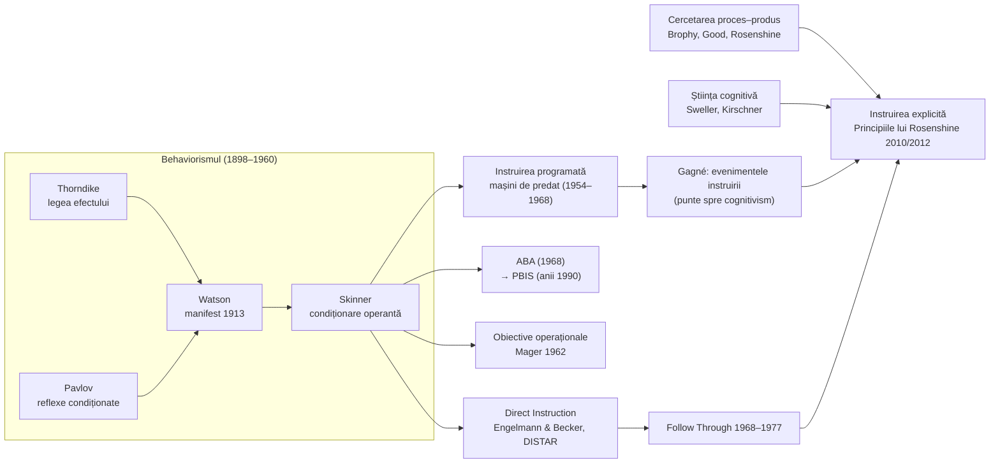

↑ [[00 Index - Analiza comparată internațională]]

> [!abstract] Pe scurt
> 1. **Behaviorismul** explică învățarea ca **schimbare observabilă a comportamentului** produsă de asocieri și de **consecințe** (întărire, pedeapsă, extincție): Thorndike (legea efectului), Pavlov (reflexele condiționate), Watson (manifestul din 1913), Skinner (condiționarea operantă).
> 2. În educație, a produs **instruirea programată** și **mașinile de predat** (Skinner, 1954–1968): pași mici, răspuns activ, feedback imediat, ritm propriu; obiectivele comportamentale (Mager) și **analiza comportamentală aplicată** (ABA).
> 3. **Instruirea directă** are două sensuri: ***Direct Instruction* (DI)** — programele scriptate ale lui **Engelmann și Becker** (DISTAR), validate în **Project Follow Through** — și ***direct/explicit instruction*** în sens larg — predarea clară, ghidată și secvențiată descrisă de cercetarea proces–produs și de **Rosenshine**.
> 4. Instruirea explicită contemporană nu mai este strict behavioristă: combină ingredientele behavioriste (pași mici, practică, feedback) cu **știința cognitivă** (memoria de lucru, recuperare). Gagné (evenimentele instruirii) este puntea istorică.
> 5. Dovezile sunt **printre cele mai solide din educație** pentru abilitățile de bază: Follow Through (1977), meta-analiza **Stockard et al. (2018)** — 328 de studii, 1966–2016, efecte pozitive semnificative în toate domeniile academice; Hattie (2009): DI ≈ 0,59; superioritatea ghidajului față de descoperirea neasistată (Alfieri et al., 2011).
> 6. Implementări-cheie: SUA (Follow Through, DISTAR, *Reading Mastery*, PBIS), **Anglia** (Strategiile naționale 1998–1999, fonetica sistematică, Rosenshine în cultura profesională și EIF 2019), **Asia de Est** (predare frontală interactivă, exersare), Canada (*Right to Read*, JUMP Math).
> 7. Critici: îngustarea scopurilor, deprofesionalizarea prin scripturi, motivația extrinsecă (Deci; Kohn), neglijarea gândirii de ordin superior; rezistența ideologică a comunității pedagogice față de DI este ea însăși un caz clasic (Carnine, 2000).

---

## 1. Explicația teoriei

### 1.1 Întrebarea la care răspunde

- **Behaviorismul**: *prin ce mecanisme se schimbă comportamentul și cum putem controla aceste mecanisme?* Răspuns: prin **asocierea** stimulilor și prin **consecințele** comportamentului; mediul, nu „mintea” inobservabilă, este variabila explicativă.
- **Instruirea directă/explicită**: *care este cea mai eficientă cale de a-i face pe toți elevii, mai ales pe cei rămași în urmă, să stăpânească cunoștințe și abilități definite?* Răspuns: **design riguros al conținutului** + **predare clară, ghidată, cu practică și feedback**, până la automatizare.

### 1.2 Ideile centrale

1. **Comportamentul observabil** este obiectul științei și al instruirii; obiectivele se formulează ca performanțe (Mager, 1962; [[4.5 Ierarhizarea și clasificarea obiectivelor]]).
2. **Legea efectului**: comportamentele urmate de consecințe satisfăcătoare se întăresc (Thorndike).
3. **Întărirea** pozitivă/negativă, **pedeapsa**, **extincția**, **modelarea** prin aproximări succesive (*shaping*), **generalizarea** și **discriminarea** stimulilor (Skinner).
4. **Pași mici și răspuns activ**: elevul trebuie să răspundă frecvent și să primească feedback imediat.
5. **Secvențierea**: abilitățile complexe se descompun în componente, predate în ordine (analiza sarcinii).
6. **Design fără ambiguități** (Engelmann): exemplele și contraexemplele sunt alese astfel încât să permită o singură interpretare logică.
7. **Practică până la stăpânire și fluență**, apoi recapitulare cumulativă.
8. **Profesorul conduce**: modelează („eu fac”), ghidează („facem împreună”), apoi retrage sprijinul („faci tu”).

### 1.3 Concepte-cheie

| Concept | Definiție |
|---|---|
| **Reflex condiționat** (Pavlov) | răspuns declanșat de un stimul inițial neutru după asocieri repetate cu un stimul necondiționat |
| **Legea efectului** (Thorndike, 1898/1911) | legătura stimul–răspuns se întărește când răspunsul e urmat de satisfacție și slăbește când e urmat de disconfort |
| **Legea exercițiului** (Thorndike) | legăturile se întăresc prin repetare (reformulată ulterior de Thorndike însuși) |
| **Condiționarea operantă** (Skinner) | comportamentul este modelat de consecințele sale: întărire pozitivă (adăugarea unui stimul plăcut), negativă (retragerea unui stimul neplăcut), pedeapsă, extincție |
| ***Shaping*** (modelare) | întărirea aproximărilor succesive ale comportamentului-țintă |
| **Instruirea programată** | material împărțit în „cadre” mici, fiecare cu răspuns activ și confirmare imediată; **liniară** (Skinner) sau **ramificată** (Crowder) |
| **Mașina de predat** | dispozitiv care prezintă cadrele și verifică răspunsul (Pressey, anii 1920; Skinner, 1954) |
| **Obiectivul operațional** (Mager) | comportament observabil + condiții + criteriu de performanță |
| **Evenimentele instruirii** (Gagné) | nouă etape: captarea atenției, informarea asupra obiectivului, reactualizarea cunoștințelor anterioare, prezentarea conținutului, ghidarea învățării, obținerea performanței, feedback, evaluarea performanței, asigurarea retenției și transferului |
| ***Direct Instruction* (DI)** | sistem Engelmann–Becker: curriculum scriptat, secvențe logice, grupare pe niveluri, răspunsuri la unison, corectare imediată a erorilor, ritm alert, stăpânire înainte de avansare |
| **Instruire directă/explicită** (sens larg) | predare structurată, condusă de profesor: obiective clare, prezentare în pași mici, modelare, practică ghidată, verificarea înțelegerii, practică independentă, recapitulare |
| **„Eu fac – facem – faci tu”** (*I do – we do – you do*) | eliberarea graduală a responsabilității (Pearson & Gallagher, 1983) |
| **Principiile instruirii** (Rosenshine, 2010/2012) | zece principii: recapitulare zilnică; material nou în pași mici; multe întrebări; modele; practică ghidată; verificarea înțelegerii; rată ridicată de succes; eșafodaj; practică independentă monitorizată; recapitulări săptămânale și lunare |
| **Analiza comportamentală aplicată** (ABA) | aplicarea sistematică a principiilor învățării la comportamente socialmente semnificative, cu măsurare continuă (Baer, Wolf & Risley, 1968) |
| **PBIS / SWPBIS** | sprijin comportamental pozitiv la nivelul școlii: reguli puține, predate explicit, întărirea comportamentelor dorite, date despre incidente, trei niveluri de intervenție |
| ***Precision teaching*** (Lindsley) | măsurarea zilnică a fluenței (răspunsuri corecte pe minut) pe grafice standardizate |

### 1.4 Ce presupune despre elev, profesor, cunoaștere, școală

| Despre… | Presupoziție |
|---|---|
| **elev** | orice elev poate învăța dacă instruirea e bine proiectată; eșecul e în primul rând **eșecul instruirii**, nu al elevului (principiul lui Engelmann: „dacă elevul n-a învățat, profesorul n-a predat”) |
| **profesor** | expert în transmiterea eficientă, conducător al lecției; în DI, executant fidel al unui program testat |
| **cunoaștere** | ansamblu de concepte, reguli și abilități care pot fi analizate, secvențiate și exersate până la automatizare |
| **școală** | mediu care trebuie proiectat pentru a produce învățare și comportament dezirabil, cu măsurare și feedback |

---

## 2. Geneza și evoluția

**Precursori.** Asociaționismul britanic (Locke, Hume); psihologia experimentală (Wundt, Ebbinghaus — curba uitării, 1885); Herbart (psihologia reprezentărilor ca bază a instruirii).

**Formularea (1898–1938).**
- **Edward L. Thorndike**: teza *Animal Intelligence* (1898; carte în 1911) cu experimentele „cutiilor-problemă”; *Educational Psychology* (1903; 3 vol. 1913–1914). Cu **Woodworth** (1901), arată că transferul e limitat, subminând doctrina „disciplinei formale”. Construiește scale de măsurare a achizițiilor.
- **Ivan P. Pavlov**: cercetările asupra reflexelor condiționate (din 1903; *Conditioned Reflexes*, ed. engl. 1927); premiul Nobel (1904) pentru fiziologia digestiei.
- **John B. Watson**: „Psychology as the Behaviorist Views It” (*Psychological Review*, 1913) — psihologia ca știință obiectivă a comportamentului; experimentul „micul Albert” (Watson & Rayner, 1920), azi exemplu de problemă etică.
- **B. F. Skinner**: *The Behavior of Organisms* (1938), distincția comportament operant vs. reflex.

**Aplicarea educațională (1950–1975).** Skinner, după o vizită în clasa fiicei sale, publică „The Science of Learning and the Art of Teaching” (1954) și „Teaching Machines” (*Science*, 1958); *The Technology of Teaching* (1968). Sidney Pressey construise mașini de testare încă din anii 1920. Norman Crowder propune **programarea ramificată** (1960). Valul instruirii programate atinge și **URSS** (algoritmizarea instruirii la L. N. Landa, programarea la N. F. Talîzina — titluri și ani de verificat) și **România/RSS Moldovenească**, unde intră în manualele de didactică ([[1.5 Pedagogia în sistemul științelor socioumane]], [[6.3 Metodele educației]]). **Robert Mager** (*Preparing Instructional Objectives*, 1962) și taxonomiile ([[Taxonomiile obiectivelor și educația centrată pe competențe]]) operaționalizează obiectivele. **Robert Gagné** (*The Conditions of Learning*, 1965; cu Briggs, *Principles of Instructional Design*, 1974) construiește designul instrucțional pe tipuri de rezultate și pe **nouă evenimente**, trecând treptat spre modelul procesării informației. **Fred Keller** dezvoltă *Personalized System of Instruction* (1968; vezi [[Învățarea deplină (mastery learning)]]). **Baer, Wolf & Risley** (1968) definesc ABA.

**Direct Instruction (1964–1995).** La Universitatea din Illinois, **Carl Bereiter și Siegfried Engelmann** creează o grădiniță intensivă pentru copii dezavantajați (*Teaching Disadvantaged Children in the Preschool*, 1966). Cu **Wesley Becker**, Engelmann dezvoltă programele **DISTAR** (citire, aritmetică, limbaj; sfârșitul anilor 1960) și modelul care intră în **Project Follow Through** (1968–1977). Evaluarea Abt (1977) plasează DI pe primul loc la abilitățile de bază, cognitive și afective. *Theory of Instruction* (Engelmann & Carnine, 1982) formalizează designul logic al secvențelor.

**Revoluția cognitivă și eclipsa (1960–1990).** Recenzia lui **Chomsky** la *Verbal Behavior* (1959) și psihologia cognitivă (Miller, Neisser) marginalizează behaviorismul în psihologia academică ([[5.1 Noțiunea de paradigmă]]). În educație, constructivismul devine discursul dominant. DI rămâne o **nișă** (educația specială, școli cu elevi dezavantajați), deși **cercetarea proces–produs** (Brophy & Good, 1986; Rosenshine & Stevens, 1986) confirmă că predarea explicită, activă, cu mult timp de învățare efectivă, se asociază cu progresul elevilor.

**Renașterea „instruirii explicite” (2000–prezent).** *National Reading Panel* (SUA, 2000) și raportul **Rose** (Anglia, 2006) susțin fonetica sistematică. **Kirschner, Sweller & Clark** (2006) argumentează cognitiv împotriva ghidajului minimal. **Rosenshine** publică *Principles of Instruction* (IAE, 2010; *American Educator*, 2012), care devine, prin mișcarea **researchED** (2013) și prin ECF (2019), probabil textul cel mai citit de profesorii englezi. **Stockard et al.** (2018) consolidează dovezile DI. În managementul comportamentului, **PBIS** se extinde în SUA la peste 9.000 de școli (Bradshaw et al., 2010, citând datele vremii; azi mult mai multe), iar Anglia lansează *Behaviour Hubs* (2021).

---

## 3. Autori, reprezentanți, cercetători

| Autor | Lucrare(ări), an | Aportul concret |
|---|---|---|
| **Edward L. Thorndike** | *Animal Intelligence* (1898/1911); *Educational Psychology* (1903; 1913–1914); cu Woodworth (1901) | legea efectului și a exercițiului; limitele transferului; măsurarea educațională |
| **Ivan P. Pavlov** | cercetări din 1903; *Conditioned Reflexes* (ed. engl. 1927) | reflexul condiționat; fundamentul fiziologic al asociaționismului; influență mare în psihologia sovietică |
| **John B. Watson** | „Psychology as the Behaviorist Views It” (1913); *Behaviorism* (1924) | programul behaviorist; mediul ca determinant al comportamentului |
| **Sidney L. Pressey** | mașina de testare-predare (1926) | primele dispozitive de autoinstruire cu feedback imediat |
| **B. F. Skinner** | *The Behavior of Organisms* (1938); „The Science of Learning and the Art of Teaching” (1954); „Teaching Machines” (1958); *The Technology of Teaching* (1968) | condiționarea operantă, *shaping*, instruirea programată liniară, critica pedepsei ca metodă școlară |
| **Norman Crowder** | programarea ramificată (1960) | adaptarea secvenței la răspunsurile elevului — strămoșul învățării adaptive |
| **Robert F. Mager** | *Preparing Instructional Objectives* (1962) | obiectivul operațional (comportament, condiții, criteriu) |
| **Robert M. Gagné** | *The Conditions of Learning* (1965); cu L. Briggs, *Principles of Instructional Design* (1974) | ierarhiile de învățare, cinci categorii de rezultate, nouă evenimente ale instruirii |
| **Donald Baer, Montrose Wolf, Todd Risley** | „Some Current Dimensions of Applied Behavior Analysis” (*JABA*, 1968) | definirea ABA; baza intervențiilor comportamentale în educația specială |
| **Barrish, Saunders & Wolf** | *Good Behavior Game* (*JABA*, 1969) | joc de echipă cu reguli și întărire de grup pentru reducerea comportamentului perturbator |
| **Siegfried Engelmann** | cu Bereiter, *Teaching Disadvantaged Children in the Preschool* (1966); DISTAR; cu Carnine, *Theory of Instruction* (1982) | Direct Instruction: design logic al secvențelor, scripturi, răspuns la unison, corectarea erorilor |
| **Wesley C. Becker** | DISTAR, modelul DI în Follow Through; cu Gersten, studiul de urmărire (*AERJ*, 1982) | codirector al modelului Oregon; urmărirea efectelor pe termen lung (unele menținute în clasele V–VI) |
| **Douglas Carnine** | *Why Education Experts Resist Effective Practices* (Fordham, 2000) | analiza rezistenței ideologice la DI după Follow Through |
| **Jere Brophy & Thomas Good** | „Teacher Behavior and Student Achievement” (în *Handbook of Research on Teaching*, ed. 3, 1986) | sinteza cercetării proces–produs: timpul de învățare, ritmul, întrebările, feedbackul |
| **Barak Rosenshine** | cu R. Stevens, „Teaching Functions” (1986); *Principles of Instruction* (IAE, Educational Practices Series 21, 2010; *American Educator*, 2012) | cele zece principii, sinteză între cercetarea proces–produs, știința cognitivă și practica profesorilor experți |
| **John Sweller; Paul Kirschner; Richard Clark** | teoria încărcării cognitive (1988); „Why Minimal Guidance During Instruction Does Not Work” (2006) | justificarea cognitivă a instruirii explicite pentru novici |
| **Anita Archer & Charles Hughes** | *Explicit Instruction: Effective and Efficient Teaching* (2011) | operaționalizarea practică a instruirii explicite |
| **George Sugai & Robert Horner** | PBIS (Centrul OSEP pentru PBIS, din 1998) | cadrul SWPBIS pe trei niveluri |
| **Catherine Bradshaw et al.** | RCT SWPBIS, 37 de școli primare din Maryland (*JPBI*, 2010) | reduceri ale suspendărilor și ale trimiterilor disciplinare |
| **Jean Stockard et al.** | „The Effectiveness of Direct Instruction Curricula: A Meta-Analysis of a Half Century of Research” (*RER*, 2018) | 328 de studii, 413 designuri, aproape 4.000 de efecte (1966–2016); efecte pozitive semnificative; efecte mai mari la expunere mai lungă, declin mic la urmărire |
| **John Hattie** | *Visible Learning* (2009) | DI: efect mediu ≈ 0,59 pe baza a patru meta-analize (304 studii) |
| **David Reynolds & Shaun Farrell** | *Worlds Apart?* (Ofsted, 1996) | comparația Anglia–Asia de Est: „predarea interactivă cu întreaga clasă” ca explicație a performanței; influență asupra NNS |
| **Tom Bennett** | *Creating a Culture* (DfE, 2017) | revizuirea independentă a comportamentului în școlile engleze; *Behaviour Hubs* (2021); fondatorul researchED |
| **John Mighton** | JUMP Math (Toronto, din 2001) | matematică în pași mici, ghidată, cu verificare continuă; RCT în Ontario (Solomon et al., 2019) |
| **Clermont Gauthier, Steve Bissonnette** (Québec) | lucrări despre *enseignement explicite* (anii 2000–2010; titluri și ani — de verificat) | difuzarea instruirii explicite în spațiul francofon |
| **Critici** | Noam Chomsky (recenzie la *Verbal Behavior*, 1959); Alfie Kohn (*Punished by Rewards*, 1993); Deci, Koestner & Ryan (*Psychological Bulletin*, 1999); House et al. (1978); Lepper, Greene & Nisbett (1973) | limitele explicației behavioriste a limbajului; efectul de subminare a motivației intrinseci; critica metodologică a Follow Through; deprofesionalizarea prin scripturi |

---

## 4. Legătura cu manualul și cu vaultul

| Unde | Ce spune manualul / conspectul | Evaluare |
|---|---|---|
| [[1.5 Pedagogia în sistemul științelor socioumane]] · [[Modulul 01 - Statutul științelor educației]] | cibernetica (Wiener) și **instruirea programată** (Skinner) ca aport al altor științe | corect istoric, dar **datat**: nu menționează evoluția spre instruirea explicită și învățarea adaptivă |
| [[1.2 Evoluția științelor educației]] | „învățământul programat” printre direcțiile pedagogiei sec. XX | enumerare, fără evaluare |
| [[6.3 Metodele educației]] · [[Modulul 06 - Dimensiunile generale ale educației]] | premierea, pedeapsa, condiționarea operantă, instruirea programată; conspectul adaugă efectul de suprajustificare și **PBIS** | manualul tratează recompensele și pedepsele **moralizator**, fără dovezile behavioriste; conspectul completează |
| [[5.1 Noțiunea de paradigmă]] | behaviorism → cognitivism ca exemplu de schimbare de paradigmă | corect ca exemplu; în practica educațională cele două **coexistă** (instruirea explicită le combină) |
| [[4.4 Finalitățile macro- și microstructurale]] · [[4.5 Ierarhizarea și clasificarea obiectivelor]] | obiectivul ca schimbare comportamentală observabilă (Mager); Gagné | conspectul identifică corect originea behavioristă a operaționalizării |
| [[10.1 Proiectarea activității educaționale]] · [[10.3 Activitatea educativă a dirigintelui]] | evenimentele instruirii (Gagné) vs. ERR; scenariul lecției | conspectul arată că manualul pune comunicarea obiectivelor prea târziu față de Gagné |
| [[9.2 Profesorul postmodernist - facilitator al cunoașterii]] | profesorul facilitator; critica Kirschner–Sweller–Clark | manualul **opune** implicit „tradiționalul” (instruirea directă) „postmodernului”; dovezile nu susțin această ierarhie |
| [[5.2 Tipologia paradigmelor educaționale]] · [[2.1 Clasic, modern și postmodern - delimitări conceptuale]] | tehnocentrismul (Tyler, Bloom); paradigma clasică vs. modernă (Wurtz) | instruirea directă e asimilată greșit „paradigmei clasice” magistrocentrice; DI este o construcție **empirică modernă** |
| [[9.3 Personalitatea elevului și comportamentul școlar]] | comportamentul școlar, expectanțele profesorului | lipsește perspectiva ABA/PBIS asupra comportamentului ca **învățat și modificabil** prin mediu |

> [!note] Unde manualul e incomplet
> Manualul confundă adesea **instruirea directă** cu „predarea tradițională, magistrocentrică”. Distincția esențială: **predarea frontală pasivă** (prelegere, elevi care ascultă) nu este DI. Instruirea explicită cere **răspunsuri active foarte frecvente**, verificarea înțelegerii tuturor elevilor, practică ghidată și corectarea imediată a erorilor. Manualul nu prezintă nici Follow Through, nici Rosenshine.

---

## 5. Implementare comparată

| Sistem | Cum a fost implementată (politică / program / instituție) | Când | Scară / intensitate | Dovezi sau rezultate |
|---|---|---|---|---|
| **Singapore** | nu ca doctrină, ci ca **practică dominantă**: predare frontală, fișe de exersare, pregătire intensivă pentru examen (mai ales P5–P6, Sec 3–4); cărți cu teste; sprijin LSP în grup mic | din anii 1960–1970 până azi | **centrală** (practică) | programul CRPP *Core* a documentat predominanța predării didactice; performanță ridicată la teste standardizate, reformele (TLLM) încearcă echilibrarea ([[Singapore - ecosistemul educațional]]) |
| **Estonia** | practica de clasă **structurată** (moștenire didactică), fără politică declarată de DI | post-1991 | **medie** (practică) | TALIS 2018: 86% din timpul lecției dedicat predării-învățării (OCDE: 78%), autoevaluarea elevilor rară ([[Estonia - ecosistemul educațional]]) |
| **Finlanda** | predare frontală, condusă de profesor, în perioada 1970–2000; reorientare pragmatică spre competențe de bază în 2023–2025 | 1970–2000; 2023– | **redusă** azi; **medie** istoric | Sahlgren (2015): predarea tradițională ca ingredient al succesului, ipoteză plauzibilă dar necuantificată ([[Finlanda - ecosistemul educațional]]) |
| **Regatul Unit** | Anglia: **NLS (1998) și NNS (1999)** cu „ora de literație/numerație” și predare interactivă cu întreaga clasă; **fonetica sistematică sintetică** (Rose 2006, Phonics Screening Check 2012); Rosenshine prin researchED, ECF (2019) și cultura EIF (2019); *Behaviour Hubs* (2021), școli „stricte” (Michaela, 2014) | 1998–prezent | **centrală** (Anglia); **redusă** (Scoția, Țara Galilor) | phonics: 58% (2012) → 82% (2019) la check; Machin et al. (2018) — efecte persistente la elevii dezavantajați; PIRLS 2021 locul 4; EEF *Good Behaviour Game* (2018): efect nul la citire (0,03) ([[Regatul Unit - ecosistemul educațional]]) |
| **Japonia** | exersarea incrementală în *juku* și *yobikō*, **Kumon** (1958), *hyakumasu keisan*; în școală, lecția de rezolvare structurată a problemelor (nu DI); Ichikawa: „mai întâi predă, apoi pune-i să gândească” | din anii 1950–1970 | **medie** (sector paralel mare) | participare la *juku* 35,6% (cl. V) și 62,5% (cl. IX) în 2003 (MEXT); efect cauzal greu de izolat ([[Japonia - ecosistemul educațional]]) |
| **Coreea de Sud** | **practică dominantă**: predare frontală structurată, exersarea itemilor CSAT, teste dese, prelegeri video **EBS**, cursuri online de *hagwon* | anii 1970–prezent | **centrală** (practică) | climat disciplinar excelent, eficiență; critici OCDE privind creativitatea și motivația extrinsecă ([[Coreea de Sud - ecosistemul educațional]]) |
| **Canada** | *Right to Read* (Ontario, 2022): renunțarea la *three-cueing*, predare explicită a fonicii; curricula de matematică 2020 cu fapte numerice; **JUMP Math**; instruirea explicită în Québec (*enseignement explicite*) | 2001–prezent | **medie**, în creștere | RCT JUMP Math (Solomon et al., 2019): 41 de școli, progres egal sau superior grupului de control la toate măsurile ([[Canada - ecosistemul educațional]]) |
| **Europa (UE / Consiliul Europei)** | instruirea programată în Est (anii 1960–1970); modelul **EDI** (*Explicit Direct Instruction*) răspândit în Țările de Jos și Flandra (amploare — de verificat); *enseignement explicite* francofon; Consiliul Europei: accent pe drepturile copilului în disciplina școlară | anii 1960–1970; 2010– | **redusă–medie** | receptare slabă comparativ cu SUA și Anglia; dezbateri „pedagogi vs. republicani” în Franța ([[Europa - spațiul european al educației]]) |
| **SUA** | behaviorismul academic (Thorndike, Skinner); instruirea programată; **Follow Through** (1968–1977; ≈ 352.000 de copii, 178 de proiecte, ≈ 20 de modele); **DISTAR** / *Reading Mastery*, *Corrective Reading*; *Reading First* (NCLB); **PBIS** (din 1998, mii de școli); ABA în educația specială | 1898–prezent | **centrală** în cercetare și educația specială; **medie** în practica generală | Abt (1977): DI primul loc; Stockard et al. (2018); Bradshaw et al. (2010): reduceri ale suspendărilor și trimiterilor disciplinare ([[SUA - ecosistemul educațional]]) |
| **Republica Moldova** | moștenirea **predării frontale** sovietice; instruirea programată în manualele de didactică; normativ, instruirea directă este **dezavantajată** de discursul „tehnologiilor interactive” și al centrării pe elev; nicio politică de fonetică sistematică sau de management comportamental pozitiv la nivel de școală; Codul Educației interzice pedepsele degradante | 1960–1990; post-1990 | **redusă** (declarat); **medie** (practică frontală neexplicită) | lipsesc evaluări; vezi [[6.3 Metodele educației]], [[9.2 Profesorul postmodernist - facilitator al cunoașterii]] |

### 5.1 Studiu de caz: SUA — Project Follow Through și soarta DI

**Project Follow Through** (1968–1977; programul a continuat până în 1995) a fost conceput ca extindere a *Head Start* în primele clase ale școlii primare și transformat într-o **„variație planificată”**: comunitățile alegeau unul dintre ≈ 20 de modele sponsorizate. Modelele se grupau în trei familii: **abilități de bază** (Direct Instruction — Universitatea din Oregon; analiza comportamentală — Universitatea din Kansas), **cognitiv-conceptuale** (High/Scope, Tucson Early Education Model) și **afectiv-cognitive** (Bank Street, *open education*). La vârf, programul a cuprins ≈ 352.000 de copii (inclusiv grupurile de comparație) în 178 de proiecte.

Evaluarea **Abt Associates** (1977) a arătat că **DI** a obținut cele mai mari câștiguri în toate cele trei domenii: abilități de bază, abilități cognitive (rezolvarea problemelor) și **abilități afective** (stima de sine) — contrazicând ipoteza că predarea structurată ar sacrifica dezvoltarea emoțională. Modelele centrate pe copil au obținut adesea rezultate **sub** grupurile de comparație. **House et al.** (1978) au contestat metodologia (neechivalența grupurilor, obiectivele înguste). Becker & Gersten (1982) au găsit câștiguri menținute în clasele V–VI la unele măsuri, dar cu scădere față de norme la altele.

Consecința politică a fost paradoxală: guvernul federal a continuat să finanțeze **toate** modelele, iar comunitatea pedagogică nu a promovat DI — caz analizat de **Carnine** (2000) ca rezistență ideologică la dovezi. DI a supraviețuit în educația specială și în școli cu elevi dezavantajați; meta-analiza **Stockard et al.** (2018) a readus-o în dezbatere. Vezi [[SUA - ecosistemul educațional]] și [[Progresivismul și educația nouă]].

### 5.2 Studiu de caz: Anglia — de la Strategiile naționale la „Rosenshine în fiecare cancelarie”

Anglia este sistemul care a transformat instruirea explicită în **politică și cultură profesională**. Raportul Ofsted ***Worlds Apart?*** (Reynolds & Farrell, 1996) a atribuit o parte din performanța Asiei de Est **predării interactive cu întreaga clasă**. Guvernul laburist a lansat **National Literacy Strategy** (1998) și **National Numeracy Strategy** (1999): ore zilnice structurate, cu o parte substanțială de predare directă cu întreaga clasă, materiale detaliate și formare în cascadă — cea mai amplă reformă pedagogică dirijată central din lume la acel moment.

Al doilea val a fost **fonetica sistematică sintetică**: studiul Clackmannanshire (Scoția, 2005), raportul Rose (2006), *Phonics Screening Check* (2012). Rata de promovare a crescut de la 58% (2012) la 82% (2019), iar Machin, McNally & Viarengo (2018) au găsit efecte persistente la 11 ani pentru elevii dezavantajați și pentru cei cu engleza ca limbă nematernă. Al treilea val, „de jos în sus”, a fost **researchED** (2013) și popularizarea **principiilor lui Rosenshine**, integrate în *Early Career Framework* (2019) și în cultura inspecției după EIF 2019, al cărei *overview of research* citează literatura proces–produs (Rosenshine & Stevens). Pe comportament: revizuirea Bennett (2017), *Behaviour Hubs* (2021), școlile „stricte”.

Critici: „mutații letale” (quiz-uri mecanice), riscul ca un cadru de inspecție să impună o pedagogie, bunăstarea scăzută a elevilor englezi, controversele privind excluderile. Evaluarea EEF a *Good Behaviour Game* (2018) nu a găsit efect la citire (0,03) și nici efect mediu asupra comportamentului — o lecție despre transferul programelor americane. Vezi [[Regatul Unit - ecosistemul educațional]].

### 5.3 Studiu de caz: Asia de Est — predarea frontală interactivă

În Singapore, Coreea, Japonia și Shanghai, predarea condusă de profesor a fost **practica normală**, nu o doctrină importată. Cercetările comparative (Stevenson & Stigler, *The Learning Gap*, 1992; TIMSS Video, 1999) au arătat că lecția est-asiatică este **frontală, dar foarte interactivă**: profesorul pune multe întrebări, elevii explică la tablă, erorile sunt discutate public, lecția are o structură coerentă și un scop unic. „Paradoxul elevului chinez” (Watkins & Biggs, 1996): repetiția nu înseamnă învățare superficială, ci poate fi o cale spre înțelegere.

Diferențele sunt importante: Japonia folosește **rezolvarea structurată a problemelor** (problemă înaintea explicației, *neriage*), mai apropiată de descoperirea ghidată; Coreea și Singapore folosesc intens exersarea orientată spre examen; **Kumon** și *hyakumasu keisan* sunt aproape pur behavioriste (pași mici, fluență, progres individual). Costurile: stres, dependența de meditații plătite (inechitate), motivație extrinsecă. Reformele din toate aceste țări (TLLM, curricula coreene centrate pe elev, *yutori*) au încercat să **echilibreze** predarea dirijată, adesea cu succes limitat în anii de examen. Vezi [[Singapore - ecosistemul educațional]], [[Coreea de Sud - ecosistemul educațional]], [[Japonia - ecosistemul educațional]].

### 5.4 Studiu de caz: managementul comportamentului — PBIS

**PBIS** (*Positive Behavioral Interventions and Supports*) este aplicarea la nivel de școală a ABA. Principii: 3–5 reguli formulate pozitiv, **predate explicit** ca un curriculum; întărirea sistematică a comportamentelor dorite; consecințe predictibile pentru încălcări; colectarea datelor despre incidente; trei niveluri (universal, grupuri-țintă, intervenții individuale). A fost promovat de Centrul OSEP pentru PBIS (din 1998) după amendamentele IDEA din 1997.

Studiul randomizat al lui **Bradshaw, Mitchell & Leaf** (2010), în 37 de școli primare din Maryland, pe cinci ani, a arătat reduceri ale **suspendărilor** și ale **trimiterilor disciplinare** în școlile PBIS; efectele asupra rezultatelor academice au fost neconcludente. Limite: fidelitatea implementării variază; sistemele de puncte pot deveni mecanice; criticii din perspectiva autodeterminării (Kohn) și a justiției restaurative cer atenție la **relații** și la cauzele comportamentului. Pentru R. Moldova, unde manualul discută recompensele și pedepsele în termeni morali ([[6.3 Metodele educației]]), PBIS oferă o alternativă **nonpunitivă și bazată pe date**, compatibilă cu interdicția pedepselor degradante din Codul Educației.

---

## 6. Dovezi empirice și critici

**Studii și meta-analize-cheie.**
- **Follow Through** (Abt, 1977): DI primul loc la abilități de bază, cognitive și afective; critică metodologică House et al. (1978).
- **Stockard, Wood, Coughlin & Rasplica Khoury** (*Review of Educational Research*, 2018): 328 de studii, 413 designuri, aproape 4.000 de efecte (1966–2016); toate efectele estimate pozitive și semnificative (cu excepția metaregresiilor pentru rezultatele afective); efecte moderate spre mari la citire, matematică, limbaj, ortografie; efecte mai mari la expunere mai lungă și declin mic în fazele de urmărire. Valorile numerice exacte pe domenii — de verificat în articol.
- **Hattie** (2009): DI ≈ 0,59 (patru meta-analize, 304 studii), similar pentru elevii din educația generală, specială și cu performanțe scăzute.
- **Cercetarea proces–produs** (Brophy & Good, 1986; Rosenshine & Stevens, 1986): corelații robuste între comportamentele de predare explicită și progresul elevilor, mai ales în abilitățile de bază.
- **Alfieri et al.** (2011): instruirea explicită superioară descoperirii neasistate; descoperirea asistată superioară altor forme.
- **Fonetica sistematică**: *National Reading Panel* (2000); Machin et al. (2018) pentru Anglia.
- **JUMP Math** (Solomon et al., *PLoS One*, 2019): RCT pe clustere, 41 de școli, clasele a II-a și a V-a, doi ani: progres egal sau semnificativ superior abordării bazate pe probleme.
- **PBIS**: Bradshaw et al. (2010) — efecte disciplinare pozitive; EEF *Good Behaviour Game* (2018) — efect nul la citire (0,03), indicii pozitive doar pentru băieții cu risc de tulburări de conduită.
- **Recompensele**: Deci, Koestner & Ryan (1999) — recompensele tangibile, anticipate, condiționate de sarcină **subminează** motivația intrinsecă pentru activitățile deja interesante; feedbackul verbal informativ nu.

**Critici.**
- **Scopuri înguste**: DI e mai bine documentată pentru abilitățile de bază decât pentru gândirea de ordin superior, creativitate, argumentare.
- **Deprofesionalizare**: scripturile reduc judecata profesorului; rezistența profesorilor e o problemă reală de implementare.
- **Motivație**: behaviorismul radical riscă dependența de recompense externe (Kohn; SDT).
- **Teoria**: behaviorismul nu explică limbajul și cogniția complexă (Chomsky); instruirea explicită actuală s-a mutat pe fundamente **cognitive**.
- **Transfer de context**: programe eficiente în SUA pot avea efect nul în alt sistem (EEF GBG); DI cere formare și supervizare intense.
- **Etică**: ABA în autism este contestată de o parte a comunității autiste (critica intervențiilor intensive centrate pe „normalizare”).

> [!warning] Condiții și limite
> - **Funcționează cel mai bine**: pentru **novici**, abilități de bază și conținut bine structurat (citire inițială, calcul, vocabular, reguli), elevi dezavantajați sau cu dificultăți, când programul e implementat **fidel** și pe durată lungă.
> - **Funcționează mai slab**: ca unică abordare pentru elevi avansați (efectul inversării expertizei), pentru obiective deschise (creativitate, investigație), când scripturile sunt aplicate mecanic, fără verificarea înțelegerii.
> - **Nu confundați** predarea frontală pasivă (prelegere) cu instruirea explicită (interacțiune intensă, practică ghidată, feedback).
> - **Recompensele** trebuie folosite cu prudență: întărirea socială și feedbackul informativ sunt preferabile recompenselor materiale anticipate.
> - Mărimile exacte ale efectelor din Stockard et al. (2018) și amploarea EDI în Țările de Jos rămân de verificat.

---

## 7. Implicații practice

> [!tip] Pentru profesor la clasă
> - **Structura unei lecții explicite** (Rosenshine + Gagné): recapitulare de 5 minute → obiectiv clar → prezentare în pași mici cu exemple rezolvate → întrebări adresate **tuturor** (tăblițe, carduri, răspuns la unison) → practică ghidată → verificarea înțelegerii (≈ 80% răspunsuri corecte înainte de a merge mai departe) → practică independentă monitorizată → recapitulări săptămânale și lunare.
> - **„Eu fac – facem – faci tu”**: modelați gândirea cu voce tare, rezolvați împreună, apoi retrageți sprijinul.
> - **Corectați erorile imediat și precis**, fără umilire; reluați exemplul și verificați din nou.
> - **Comportament**: predați regulile ca pe un conținut, lăudați specific comportamentul dorit (raport de cel puțin 4:1 laude/corecții este o recomandare frecventă din literatura PBIS — de verificat sursa), folosiți consecințe previzibile și proporționale, înregistrați incidentele.
> - **Combinați**: instruirea explicită pentru fundamente; sarcini deschise și proiecte după ce elevii au cunoștințele necesare.

> [!tip] Pentru politica educațională din R. Moldova
> 1. **Reabilitați instruirea explicită în documentele normative**: standardele profesionale (2016) și ghidurile curriculare să nu o asimileze „învățământului tradițional”; includeți principiile lui Rosenshine în formarea inițială și continuă.
> 2. **Fonetica sistematică** în clasa I pentru limba română și pentru limbile minorităților, cu materiale decodabile și un **screening** simplu la sfârșitul clasei I (modelul englez, adaptat), cu atenție la riscul predării pentru test.
> 3. **Programe explicite de recuperare** pentru elevii rămași în urmă (citire, matematică), cu materiale structurate și grupuri mici — modelul DI/JUMP poate fi pilotat și evaluat.
> 4. **Management comportamental pozitiv la nivel de școală** (tip PBIS), cu reguli puține, predate, date despre incidente și sprijin psihologic — alternativă la sancțiunile moralizatoare, compatibilă cu Codul Educației.
> 5. **Evaluați înainte de generalizare**: transferul EEF al GBG arată că programele americane pot avea efect nul; pilotați cu design comparativ.

---

## 8. Legături cu alte teorii din catalog

- [[Știința cognitivă a învățării]] — fundamentul actual al instruirii explicite (încărcarea cognitivă, recuperarea, repetiția spațiată); a înlocuit behaviorismul ca justificare teoretică.
- [[Învățarea deplină (mastery learning)]] — Keller (PSI) este behaviorist; Bloom preia pașii mici, criteriul de stăpânire și feedbackul corectiv.
- [[Progresivismul și educația nouă]] — antiteza istorică; Follow Through a fost confruntarea empirică.
- [[Constructivismul cognitiv (Piaget, Bruner)]] — alternativa teoretică; dezbaterea „explicit vs. descoperire” (Kirschner et al., 2006; Alfieri et al., 2011).
- [[Taxonomiile obiectivelor și educația centrată pe competențe]] — obiectivele operaționale (Mager) și taxonomiile provin din climatul behaviorist.
- [[Evaluarea formativă]] — verificarea înțelegerii și feedbackul imediat sunt comune; evaluarea formativă adaugă implicarea elevului.
- [[Constructionismul și educația digitală]] — instruirea programată e strămoșul tutorilor inteligenți și al platformelor adaptive; Papert s-a definit în opoziție cu „calculatorul care programează copilul”.
- [[Educația incluzivă]] — ABA și DI au o tradiție puternică în educația specială; PBIS e folosit pentru incluziunea elevilor cu dificultăți de comportament.
- [[Învățarea socio-emoțională și educația caracterului]] — PBIS și SEL sunt adesea combinate; tensiune între controlul extern și autoreglare.
- Educația bazată pe dovezi — DI și Follow Through sunt cazul clasic al decalajului dintre dovezi și adoptare.

---

## 9. Întrebări de reflecție

1. Care este diferența dintre o prelegere frontală și o lecție de instruire explicită în sensul lui Rosenshine? Ilustrați cu o lecție din disciplina voastră.
2. De ce DI nu a fost adoptată pe scară largă după Follow Through, deși a obținut cele mai bune rezultate? Ce spune asta despre relația dintre dovezi și valori în educație?
3. În ce condiții recompensele subminează motivația intrinsecă și în ce condiții o susțin? Cum ați reformula recomandările manualului despre premiere?
4. Instruirea explicită contemporană mai este „behavioristă”? Ce a preluat din behaviorism și ce din știința cognitivă?
5. De ce un program eficient în SUA (Good Behavior Game) poate avea efect nul în Anglia? Ce implicații are pentru importul de programe în R. Moldova?
6. Cum ar putea fi combinată instruirea explicită cu cerința curriculumului moldovenesc de formare a competențelor și de „strategii interactive”?

---

## 10. Surse

**Behaviorismul și instruirea programată**
- Thorndike, E. L. (1911). *Animal Intelligence: Experimental Studies*. New York: Macmillan.
- Thorndike, E. L., Woodworth, R. S. (1901). The influence of improvement in one mental function upon the efficiency of other functions. *Psychological Review*, 8, 247–261.
- Pavlov, I. P. (1927). *Conditioned Reflexes* (trad. G. V. Anrep). Oxford: Oxford University Press.
- Watson, J. B. (1913). Psychology as the Behaviorist Views It. *Psychological Review*, 20, 158–177.
- Skinner, B. F. (1954). The Science of Learning and the Art of Teaching. *Harvard Educational Review*, 24(2), 86–97.
- Skinner, B. F. (1958). Teaching Machines. *Science*, 128(3330), 969–977.
- Skinner, B. F. (1968). *The Technology of Teaching*. New York: Appleton-Century-Crofts.
- Mager, R. F. (1962). *Preparing Instructional Objectives*. Palo Alto: Fearon.
- Gagné, R. M. (1965). *The Conditions of Learning*. New York: Holt, Rinehart & Winston.
- Gagné, R. M., Briggs, L. J. (1974). *Principles of Instructional Design*. New York: Holt, Rinehart & Winston.
- Baer, D. M., Wolf, M. M., Risley, T. R. (1968). Some current dimensions of applied behavior analysis. *Journal of Applied Behavior Analysis*, 1(1), 91–97.
- Chomsky, N. (1959). A Review of B. F. Skinner's *Verbal Behavior*. *Language*, 35(1), 26–58.

**Direct Instruction și instruirea explicită**
- Bereiter, C., Engelmann, S. (1966). *Teaching Disadvantaged Children in the Preschool*. Englewood Cliffs: Prentice-Hall.
- Engelmann, S., Carnine, D. (1982). *Theory of Instruction: Principles and Applications*. New York: Irvington.
- Stebbins, L. B., St. Pierre, R. G., Proper, E. C., Anderson, R. B., Cerva, T. R. (1977). *Education as Experimentation: A Planned Variation Model* (vol. IV-A). Cambridge, MA: Abt Associates.
- House, E. R., Glass, G. V., McLean, L. D., Walker, D. F. (1978). No simple answer: Critique of the Follow Through evaluation. *Harvard Educational Review*, 48(2), 128–160.
- Becker, W. C., Gersten, R. (1982). A follow-up of Follow Through. *American Educational Research Journal*, 19(1), 75–92.
- Carnine, D. (2000). *Why Education Experts Resist Effective Practices (And What It Would Take to Make Education More Like Medicine)*. Washington, DC: Thomas B. Fordham Foundation.
- Stockard, J., Wood, T. W., Coughlin, C., Rasplica Khoury, C. (2018). The Effectiveness of Direct Instruction Curricula: A Meta-Analysis of a Half Century of Research. *Review of Educational Research*, 88(4), 479–507. https://doi.org/10.3102/0034654317751919 · ERIC: https://eric.ed.gov/?id=EJ1185486
- Brophy, J., Good, T. (1986). Teacher behavior and student achievement. În M. Wittrock (coord.), *Handbook of Research on Teaching* (ed. 3). New York: Macmillan.
- Rosenshine, B., Stevens, R. (1986). Teaching functions. În M. Wittrock (coord.), *Handbook of Research on Teaching* (ed. 3). New York: Macmillan.
- Rosenshine, B. (2010). *Principles of Instruction* (Educational Practices Series, 21). Geneva: International Academy of Education / IBE-UNESCO.
- Rosenshine, B. (2012). Principles of Instruction: Research-Based Strategies That All Teachers Should Know. *American Educator*, 36(1), 12–19, 39. https://www.aft.org/sites/default/files/Rosenshine.pdf
- Archer, A. L., Hughes, C. A. (2011). *Explicit Instruction: Effective and Efficient Teaching*. New York: Guilford.
- Kirschner, P. A., Sweller, J., Clark, R. E. (2006). Why minimal guidance during instruction does not work. *Educational Psychologist*, 41(2), 75–86.
- Alfieri, L., Brooks, P. J., Aldrich, N. J., Tenenbaum, H. R. (2011). Does discovery-based instruction enhance learning? *Journal of Educational Psychology*, 103(1), 1–18.
- Hattie, J. (2009). *Visible Learning*. London: Routledge.
- Solomon, T., Dupuis, A., O'Hara, A. et al. (2019). A cluster-randomized controlled trial of the effectiveness of the JUMP Math program of math instruction for improving elementary math achievement. *PLoS One*, 14(10), e0223049. https://pubmed.ncbi.nlm.nih.gov/31665143/

**Comportament**
- Barrish, H. H., Saunders, M., Wolf, M. M. (1969). Good behavior game. *Journal of Applied Behavior Analysis*, 2(2), 119–124.
- Bradshaw, C. P., Mitchell, M. M., Leaf, P. J. (2010). Examining the effects of schoolwide positive behavioral interventions and supports on student outcomes. *Journal of Positive Behavior Interventions*, 12(3), 133–148. https://doi.org/10.1177/1098300709334798
- Humphrey, N., Hennessey, A., Ashworth, E. et al. (2018). *Good Behaviour Game: Evaluation Report and Executive Summary*. London: EEF. https://files.eric.ed.gov/fulltext/ED617332.pdf
- Bennett, T. (2017). *Creating a Culture: How School Leaders Can Optimise Behaviour*. London: DfE.
- Deci, E. L., Koestner, R., Ryan, R. M. (1999). A meta-analytic review of experiments examining the effects of extrinsic rewards on intrinsic motivation. *Psychological Bulletin*, 125(6), 627–668.
- Kohn, A. (1993). *Punished by Rewards*. Boston: Houghton Mifflin.

**Comparații și politici**
- Reynolds, D., Farrell, S. (1996). *Worlds Apart? A Review of International Surveys of Educational Achievement Involving England*. London: HMSO/Ofsted.
- Stevenson, H. W., Stigler, J. W. (1992). *The Learning Gap*. New York: Summit Books.
- Watkins, D. A., Biggs, J. B. (coord.) (1996). *The Chinese Learner: Cultural, Psychological and Contextual Influences*. Hong Kong: CERC / ACER.
- Machin, S., McNally, S., Viarengo, M. (2018). Changing how literacy is taught: Evidence on synthetic phonics. *American Economic Journal: Economic Policy*, 10(2), 217–241.
- Ofsted (2019). *Education inspection framework: overview of research*. https://assets.publishing.service.gov.uk/government/uploads/system/uploads/attachment_data/file/771000/Research_for_education_inspection_framework_140119.pdf
- National Reading Panel (2000). *Teaching Children to Read*. Washington, DC: NICHD.
- Ontario Human Rights Commission (2022). *Right to Read: Public Inquiry Report*. Toronto.
- Notele de țară din vault: [[SUA - ecosistemul educațional]], [[Regatul Unit - ecosistemul educațional]], [[Singapore - ecosistemul educațional]], [[Coreea de Sud - ecosistemul educațional]], [[Japonia - ecosistemul educațional]], [[Canada - ecosistemul educațional]].
