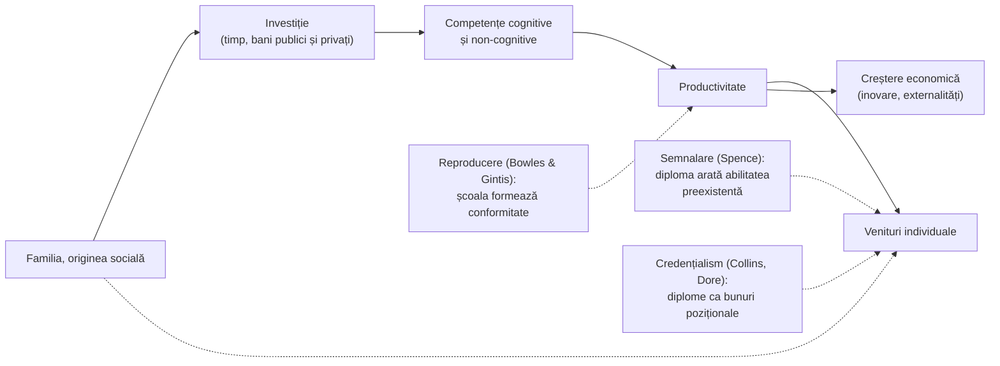

↑ [[00 Index - Analiza comparată internațională]]

> [!abstract] Pe scurt
> - **Teoria capitalului uman** (*human capital theory*) tratează educația ca **investiție**: cunoștințele și competențele cresc productivitatea, veniturile individuale și creșterea economică. Cheltuiala educațională nu mai e „consum”, ci formare de capital (Schultz, 1961; Becker, 1964).
> - Instrumentul empiric central este **ecuația câștigurilor a lui Mincer** (1974): fiecare an de școală în plus se asociază cu un **randament salarial** mediu de circa **9%** la nivel mondial (Psacharopoulos & Patrinos, 2018).
> - Teoria are **rivali serioși**: **semnalarea** (Spence, 1973) — diploma arată cine era deja productiv; **credențialismul** (Collins, 1979; Dore, 1976) — inflația diplomelor fără creșterea competențelor; **reproducerea socială** (Bowles & Gintis, 1976).
> - Cotitura din ultimele două decenii: nu **anii de școală**, ci **competențele măsurate** (PISA, TIMSS) explică creșterea economică (Hanushek & Woessmann, *The Knowledge Capital of Nations*, 2015). De aici **„sărăcia învățării”** (Banca Mondială): școlarizare fără învățare.
> - **Heckman** mută accentul spre **abilitățile non-cognitive** și **investițiile timpurii**; **Chetty** arată că **profesorii** cu valoare adăugată mare schimbă veniturile adulte ale elevilor.
> - Comparativ: **Coreea** și **Singapore** sunt exemplele clasice de expansiune educațională planificată în funcție de nevoile economiei; **Irlanda** și **Finlanda** au folosit educația ca strategie de ieșire din criză; **OCDE/PISA** a transformat teoria în instrument global de guvernare.
> - Pentru **R. Moldova**, teoria are o formă paradoxală: statul investește în capital uman care **emigrează**; randamentul educației se realizează parțial în străinătate, iar migrația reduce stimulentele pentru educație de calitate acasă.

---

## 1. Explicația teoriei

### 1.1 Întrebarea la care răspunde

*De ce investesc indivizii, familiile și statele în educație, ce câștigă din asta și cum trebuie alocate resursele educaționale?* Teoria răspunde în termeni de **cost–beneficiu**: educația are costuri (taxe, venituri pierdute în timpul studiilor, cheltuieli publice) și beneficii (venituri mai mari, sănătate, participare civică, inovare, creștere economică).

### 1.2 Ideile centrale

1. **Educația ca investiție.** Schultz (1961) a observat că creșterea economică a SUA nu putea fi explicată doar prin capitalul fizic și munca brută; „reziduul” ținea de **calitatea forței de muncă**. Denison (1962) a estimat ce parte din creștere revine educației.
2. **Decizia individuală rațională** (Becker, 1964): omul investește în educație până când beneficiul marginal egalează costul marginal. Capitalul uman poate fi **general** (transferabil între angajatori, plătit de individ) sau **specific** (util unei firme, finanțat parțial de ea).
3. **Ecuația câștigurilor** (Mincer, 1974): logaritmul salariului depinde de anii de școală și de experiență. Coeficientul anilor de școală = **randamentul educației**.
4. **Externalități**: educația are beneficii sociale dincolo de individ (inovare, sănătate publică, criminalitate mai mică, democrație). Teoriile **creșterii endogene** (Lucas, 1988; Romer, 1990) fac din capitalul uman motorul progresului tehnologic.
5. **Calitatea > cantitatea**: nu anii de școlarizare, ci **competențele cognitive** (măsurate prin teste internaționale) prezic creșterea pe termen lung (Hanushek & Woessmann, 2008, 2015).
6. **Formarea competențelor e cumulativă** (Heckman): „competențele generează competențe”; investițiile timpurii au randamente mai mari, iar abilitățile **non-cognitive** (perseverență, autocontrol, conștiinciozitate) contează la fel de mult ca IQ-ul.

### 1.3 Concepte-cheie

| Concept | Definiție |
|---|---|
| **Capital uman** | stocul de cunoștințe, competențe, sănătate și atribute personale care cresc productivitatea |
| **Randamentul educației** (*rate of return*) | câștigul procentual (privat sau social) al unui an ori al unui nivel suplimentar de educație |
| **Ecuația lui Mincer** | ln(salariu) = a + b·(ani de școală) + c·experiență − d·experiență²; *b* = randamentul |
| **Cost de oportunitate** | veniturile la care renunți cât timp înveți |
| **Capital general / specific** | competențe transferabile / utile unui singur angajator (Becker) |
| **Semnalare** (*signaling*) | diploma e un semnal costisitor care dezvăluie productivitatea preexistentă (Spence, 1973) |
| **Filtru / screening** | școala sortează indivizii după abilitate (Arrow, 1973; Stiglitz, 1975) |
| **Credențialism** | competiția pentru diplome ca bunuri poziționale, independent de competențe (Collins, 1979) |
| **„Boala diplomei”** | inflația cerințelor de diplomă, mai ales în țările în dezvoltare (Dore, 1976) |
| **Capitalul cunoașterii** (*knowledge capital*) | competențele cognitive medii ale populației, măsurate prin teste (Hanushek & Woessmann) |
| **Sărăcia învățării** (*learning poverty*) | proporția copiilor de 10 ani care nu pot citi și înțelege un text simplu (Banca Mondială, 2019) |
| **Valoarea adăugată a profesorului** | contribuția unui profesor la progresul măsurat al elevilor (Chetty, Friedman & Rockoff, 2014) |
| **Curba Heckman** | randamentul investiției scade odată cu vârsta la care se face |
| **Indicele capitalului uman** (HCI) | productivitatea viitoare a unui copil, raportată la educație completă și sănătate deplină (Banca Mondială, 2018) |
| **Bun pozițional** | valoarea diplomei depinde de rangul relativ, nu de conținutul absolut |

### 1.4 Ce presupune teoria despre actorii educației

| Actor | Teoria capitalului uman | Critica umanistă / sociologică |
|---|---|---|
| **Elevul** | investitor rațional în propriul viitor; „purtător” de competențe | persoană cu scopuri proprii; membru al unei clase sociale |
| **Profesorul** | factor de producție cu valoare adăugată măsurabilă | profesionist moral și cultural |
| **Cunoașterea** | competențe cu valoare pe piața muncii | bun cultural, instrument de emancipare |
| **Școala** | întreprindere care produce capital uman; evaluată prin eficiență | instituție publică, spațiu democratic, instrument de reproducere |
| **Statul** | investitor care corectează eșecurile pieței (externalități, credit) | garant al dreptului la educație |

---

## 2. Geneza și evoluția

| Perioadă | Etapă | Repere |
|---|---|---|
| sec. XVIII–XIX | **Precursori** | Adam Smith (*Avuția națiunilor*, 1776): talentele dobândite prin educație sunt „capital fixat” în persoană; J. S. Mill; Friedrich List (educația ca forță productivă națională) |
| 1958–1964 | **Formularea** | Mincer (1958); Schultz, discursul prezidențial la American Economic Association (1960), publicat în 1961; Denison (1962); Becker, *Human Capital* (1964) |
| 1960–1975 | **Planificarea educației** | OCDE: *Mediterranean Regional Project* și *Investment in Education* (Irlanda, 1965); UNESCO și Banca Mondială finanțează expansiunea școlară în țările în dezvoltare; „planificarea forței de muncă” (*manpower planning*) |
| 1973–1980 | **Contestarea** | Spence (semnalarea, 1973); Arrow (filtrul, 1973); Dore (1976); Bowles & Gintis (1976); Collins (1979); Mincer, *Schooling, Experience, and Earnings* (1974) |
| 1980–2000 | **Creștere endogenă și dovezi cauzale** | Lucas (1988); Romer (1990); Barro (1991); Mankiw, Romer & Weil (1992); experimente naturale: Angrist & Krueger (1991), Card (1999), Duflo (2001, Indonezia); Banca Mondială, *The East Asian Miracle* (1993); Pritchett (2001): „unde s-a dus toată educația?” |
| 2000–2015 | **Calitatea și competențele** | PISA (2000); Strategia de la Lisabona (2000); Heckman (2006, *Science*); Hanushek & Woessmann (2008, 2015); Chetty et al. (2011, 2014); Goldin & Katz, *The Race between Education and Technology* (2008) |
| 2018–2026 | **Capitalul uman ca agendă globală** | Banca Mondială: *World Development Report 2018: Learning*; Human Capital Project și HCI (2018); „sărăcia învățării” (2019; estimată la circa 70% în țările cu venituri mici și medii după pandemie, 2022); Psacharopoulos & Patrinos (2018); PIAAC 2023; *Union of Skills* (UE, 2025) |

> [!note] Comentariu — de la „mai mulți ani” la „mai multă învățare”
> Evoluția teoriei are un pivot: în anii 1960–1990, politica urmărea **accesul** (ani de școlarizare, rate de cuprindere). După 2000, datele PISA și ale Băncii Mondiale au arătat că mulți copii **merg la școală, dar nu învață**. Pritchett a numit asta „criza învățării”. De aici vine accentul actual pe **calitate, evaluare și profesori**.

---

## 3. Autori, reprezentanți, cercetători

| Autor | Lucrare(ări), an | Aportul concret |
|---|---|---|
| **Theodore W. Schultz** (Nobel 1979) | „Investment in Human Capital”, *American Economic Review*, 51(1) (1961) | educația ca investiție; explicarea „reziduului” creșterii prin calitatea muncii |
| **Gary S. Becker** (Nobel 1992) | *Human Capital* (NBER, 1964; ed. 3, 1993) | teoria investiției individuale; capital general vs. specific; modelul familiei care investește în copii |
| **Jacob Mincer** | „Investment in Human Capital and Personal Income Distribution”, *JPE* (1958); *Schooling, Experience, and Earnings* (1974) | ecuația câștigurilor; baza a mii de estimări ale randamentului |
| **Edward F. Denison** | *The Sources of Economic Growth in the United States* (1962) | contabilitatea creșterii: ponderea educației în creșterea SUA |
| **Michael Spence** (Nobel 2001) | „Job Market Signaling”, *Quarterly Journal of Economics*, 87(3) (1973) | **teoria semnalării**: diploma poate fi valoroasă chiar dacă nu crește productivitatea |
| **Kenneth Arrow**; **Joseph Stiglitz** | „Higher Education as a Filter” (1973); „The Theory of Screening” (1975) | școala ca **filtru** al abilităților |
| **Randall Collins** | *The Credential Society* (1979) | **credențialismul**: inflația diplomelor ca luptă de statut între grupuri |
| **Ronald Dore** | *The Diploma Disease* (1976) | escaladarea cerințelor de diplomă în Japonia, Sri Lanka, Kenya; critica școlarizării orientate spre examen |
| **Samuel Bowles & Herbert Gintis** | *Schooling in Capitalist America* (1976) | **principiul corespondenței**: școala reproduce ierarhiile muncii prin atitudini (punctualitate, conformare), nu prin competențe cognitive |
| **Simon Marginson** | „Limitations of human capital theory”, *Studies in Higher Education*, 44(2) (2019) | critica sistematică: teoria nu poate explica educația ca formare a persoanei și ignoră structurile sociale |
| **Alison Wolf** | *Does Education Matter?* (2002); *Review of Vocational Education* (Anglia, 2011) | scepticism față de legătura automată educație–creștere; critica calificărilor profesionale fără valoare pe piața muncii |
| **Bryan Caplan** | *The Case Against Education* (2018) | poziție radicală de tip semnalare (majoritatea randamentului ar fi semnal); foarte contestată |
| **Lant Pritchett** | „Where Has All the Education Gone?”, *World Bank Economic Review* (2001); *The Rebirth of Education* (2013) | expansiunea școlarizării nu s-a tradus în creștere; „școlarizare fără învățare” |
| **Robert Lucas**; **Paul Romer** (Nobel 2018) | Lucas, *Journal of Monetary Economics* (1988); Romer, *JPE* (1990) | creștere endogenă: capitalul uman și ideile ca motor al progresului |
| **David Card**; **Joshua Angrist & Alan Krueger**; **Esther Duflo** | Card (1999, *Handbook of Labor Economics*); Angrist & Krueger (1991, *QJE*); Duflo (2001, *AER*) | dovezi **cauzale** ale randamentului (experimente naturale: trimestrul nașterii, construcția de școli în Indonezia) |
| **Eric Hanushek & Ludger Woessmann** | „The role of cognitive skills in economic development”, *JEL* (2008); *The Knowledge Capital of Nations* (MIT Press, 2015) | **competențele cognitive** (nu anii de școală) explică diferențele de creștere dintre țări; costul economic al rezultatelor slabe |
| **Hanushek, Schwerdt, Woessmann & Zhang** | *Journal of Human Resources* (2017) | educația profesională specifică dă avantaj la început, dar reduce adaptabilitatea la vârste înaintate |
| **James Heckman** (Nobel 2000) | „Skill formation and the economics of investing in disadvantaged children”, *Science* (2006); Heckman, Stixrud & Urzua (2006); Heckman et al. (2010), Perry Preschool | abilitățile **non-cognitive**; **curba Heckman**; randamente de circa 7–10% pe an pentru Perry Preschool |
| **Raj Chetty, John Friedman & Jonah Rockoff** | două articole în *American Economic Review*, 104(9) (2014) | profesorii cu valoare adăugată mare cresc probabilitatea de a merge la facultate și veniturile adulte; înlocuirea unui profesor din ultimii 5% cu unul mediu ar crește veniturile cumulate ale unei clase cu circa 250 000 USD |
| **George Psacharopoulos & Harry Patrinos** | „Returns to investment in education: a decennial review of the global literature”, *Education Economics*, 26(5) (2018) | randamentul privat mediu global: circa **9% pe an de școlarizare**; randamente mai mari în țările cu venituri mici și pentru femei; terțiarul are randamente private ridicate |
| **Claudia Goldin & Lawrence Katz** (Goldin, Nobel 2023) | *The Race between Education and Technology* (2008) | inegalitatea salarială crește când oferta de educație rămâne în urma cererii tehnologice de competențe |
| **Banca Mondială** | *The East Asian Miracle* (1993); *WDR 2018: Learning to Realize Education's Promise*; Human Capital Index (2018, 2020); *The State of Global Learning Poverty* (2022) | capitalul uman ca motor al „miracolului” est-asiatic; criza învățării; indicatori globali |
| **OCDE (Andreas Schleicher)** | PISA (2000–); *Education at a Glance*; PIAAC; *The High Cost of Low Educational Performance* (2010, cu Hanushek & Woessmann) | transformarea competențelor în indicatori comparabili și în argument de competitivitate |
| **Martha Nussbaum**; **Amartya Sen** | *Not for Profit* (2010); *Development as Freedom* (1999) | **abordarea capabilităților** ca alternativă: educația extinde libertățile reale, nu doar productivitatea |

---

## 4. Legătura cu manualul și cu vaultul

- **[[2.3 Funcțiile generale ale educației]]** — manualul (după S. Cristea) numește **funcția economică** a educației alături de cea culturală și civică. Teoria capitalului uman este fundamentarea științifică a acestei funcții; manualul o prezintă **corect, dar descriptiv**, fără dezbaterea semnalare/credențialism și fără date despre randamente.
- **[[Modulul 04 - Finalitățile educației]]** și [[4.1 Conceptul de finalitate educațională]] — tensiunea dintre finalitățile economice (angajabilitate, competitivitate) și cele umaniste (idealul educațional, personalitatea integrală). Codul Educației al R. Moldova combină ambele.
- **[[6.2.3 Educația tehnologică]]** — orientarea și formarea profesională; argumentul „pragmatic” pentru educația tehnologică este un argument de capital uman.
- **[[8.1 Sistemul de educație și sistemul de învățământ]]** și [[8.6 Managementul educației și reforma]] — finanțarea per elev, eficiența, planificarea rețelei.
- **[[7.2.5 Educația pentru schimbare și dezvoltare]]** — educația ca factor de dezvoltare socială.
- **[[3.6 Educația permanentă și autoeducația]]** — critica lui Biesta (învățarea ca datorie de adaptare economică) se aplică direct teoriei capitalului uman.
- **[[9.4 Factorii dezvoltării personalității și factorii educativi]]** — abilitățile non-cognitive (Heckman) și investițiile timpurii completează discuția despre ereditate–mediu–educație.
- **Unde manualul e incomplet**: nu există o secțiune despre **economia educației** (costuri, randamente, eficiență, finanțare bazată pe dovezi), deși deciziile de politică din R. Moldova (optimizarea rețelei, finanțarea per elev) sunt argumentate economic.

---

## 5. Implementare comparată

### 5.1 Tabel

| Sistem | Cum a fost implementată | Când | Scară / intensitate | Dovezi sau rezultate |
|---|---|---|---|---|
| **Singapore** | educația ca „investiție socială” în faza supraviețuirii; educație tehnică pentru industrializare; **Raportul Goh** (abandonul ca „risipă”); ITE și politehnici; **SkillsFuture** (credite individuale pentru adulți) | 1959–1978; Raportul Goh 1979; SkillsFuture 2015 (credit din 2016); Level-Up 2024 | **centrală** (logica fondatoare) | creștere rapidă însoțită de performanță PISA/TIMSS de vârf; cauzalitate greu de izolat (comerț, investiții străine, stabilitate); PIAAC 2023: literație 255, numerație 274 (OCDE: 260/263) — contrast cu elevii de top |
| **Estonia** | *Learning Estonia* (1998): educația ca principală resursă națională; sistemul **OSKA** de prognoză a competențelor; **obligația de a învăța până la 18 ani** | 1998; OSKA din 2015; obligația din 2025/26 | **medie spre centrală** | PIAAC 2023: 276/281 (peste media OCDE); obligația de a învăța estimată să aducă 1 300 de tineri calificați în plus anual; randament salarial mic al calificărilor profesionale |
| **Finlanda** | ieșirea din recesiunea anilor 1990 prin cercetare-dezvoltare și educație (Nokia); universitățile de științe aplicate; reforma VET (2018); **obligativitatea până la 18 ani** justificată prin ocupare | 1991–1996; 2018; 2021 | **medie** | PIAAC 2023: **locul 1** (296/294); Sahlgren: posibil „efect de bogăție” asupra culturii efortului (ipoteză) |
| **Regatul Unit** | discursul **Callaghan** la Ruskin (1976): școala și economia; *Leitch Review* (2006); *Wolf Review* (2011) despre calificările profesionale; ucenicii (taxa din 2017); **T Levels** (2020); *Skills England* (2024) | 1976–2024 | **medie** | IFS: randamente mari dar foarte diferite pe discipline și universități; critica Wolf: multe calificări profesionale fără valoare pe piață; PIAAC 2023 (Anglia): 272/268 |
| **Japonia** | modernizarea Meiji ca proiect de capital uman (1872); expansiunea postbelică a liceului și a terțiarului; *kōsen* (colegii tehnice); pregătirea în firmă (capital specific, angajare pe viață) | 1872; 1950–1975 | **centrală istoric** | exemplu clasic de creștere prin educație; Dore: „boala diplomei”, *juku* și examene; PIAAC 2023: 289/291 (locul 2) |
| **Coreea de Sud** | **expansiune secvențială** (primar → gimnaziu → liceu → terțiar) corelată cu planurile cincinale de dezvoltare; KEDI (1972) pentru planificare; licee profesionale masive; școli *Meister* (2010) | 1962–2000; KEDI 1972; Meister 2010 | **centrală** | *The East Asian Miracle* (1993); rata cea mai mare de absolvire terțiară din OCDE (~70% la 25–34 ani); costuri: educația ca bun pozițional, meditații de 27,5 trilioane woni (2025), supracalificare; **PIAAC 2023: 249/253, sub media OCDE**, cu scădere de 23 de puncte la literație față de ciclul anterior |
| **Canada** | imigrația pe puncte ca import de capital uman; colegii comunitare și CEGEP; argumentul economic pentru îngrijirea copiilor (Quebec, 10 $/zi la nivel federal) | 1967; CEGEP 1967; CPE 1997; 2021 | **medie** | PIAAC 2023: 271/271; Fortin et al. (2012): programul de îngrijire a copiilor din Quebec se autofinanțează prin creșterea ocupării mamelor |
| **Europa** (UE) | **Strategia de la Lisabona** („cea mai competitivă economie bazată pe cunoaștere”); Europa 2020; ținte de părăsire timpurie și terțiar; sistemul dual (Germania, Austria, Elveția); ***Union of Skills*** | 2000; 2010; 2025 | **centrală în discurs** (competență de sprijin) | țintele Lisabona 2010 ratate în mare parte; critica „guvernării prin cifre” (Grek, Lawn); raportul Draghi (2024) leagă competitivitatea de competențe |
| **SUA** | *GI Bill* (1944); *NDEA* după Sputnik (1958); ***A Nation at Risk*** (1983): mediocritatea educației ca amenințare economică; standarde, NCLB; evaluarea profesorilor pe valoare adăugată; argumentul economic pentru pre-K | 1944–2016 | **centrală în discurs** | Chetty et al. (2014); Heckman (Perry Preschool); Goldin & Katz (2008); critici: instabilitatea VAM (ASA, 2014), îngustarea curriculumului; PIAAC 2023: 258/249 |
| **Republica Moldova** | Codul Educației (2014) și „Educația 2030” leagă educația de piața muncii; finanțarea per elev; **optimizarea rețelei școlare**; învățământul dual (VET); Cadrul Național al Calificărilor | 2013–2014; HG 114/2023 | **medie** în documente, **redusă** ca eficacitate | HCI (Banca Mondială, 2020): **0,58** (un copil va fi 58% cât de productiv ar putea fi); remitențe de circa **12% din PIB** (2023); emigrare masivă a populației de vârstă activă; PISA 2025: 39% sub nivelul 2 la toate domeniile; 3 340 de elevi în învățământul dual (ETF, 2025); părăsire timpurie 16,4% (2024) |

*Surse*: notele de țară din vault; CSO Irlanda pentru PIAAC 2023 (medii OCDE 260/263/251); Banca Mondială (HCI 2020); TheGlobalEconomy/Banca Mondială (remitențe).

### 5.2 Studiu de caz: Coreea de Sud — expansiunea secvențială

→ [[Coreea de Sud - ecosistemul educațional]]

În 1945 doar circa 22% dintre adulți erau alfabetizați. Coreea a atins **90% cuprindere** în primar în 1964, în gimnaziu în 1979 și în liceu în 1993 (Sorensen, 1994, preluat de Jones, OCDE 2013). Fiecare treaptă a furnizat forța de muncă pentru o etapă a industrializării: industrii intensive în muncă (anii 1960), industrii grele și chimice (1970–1980), economia cunoașterii (1990–2000).

**Mecanismul de politică.** Statul a finanțat mai ales **baza** (primar, gimnaziu) și a lăsat liceul și universitatea în mare parte pe seama **familiilor și a sectorului privat**. KEDI (1972) a planificat resursele umane. Liceele profesionale au cuprins aproape jumătate dintre elevii de liceu în anii 1970.

**Ce arată cazul.**
- **Pentru** teorie: una dintre cele mai rapide creșteri ale capitalului uman din istorie a însoțit una dintre cele mai rapide creșteri economice.
- **Contra**: cauzalitatea e **bidirecțională** (creșterea veniturilor a permis familiilor să plătească educația; cererea de educație a precedat politicile, cf. Seth, 2002). Educația a devenit **bun pozițional**: contează rangul universității, nu doar competențele (argumentul lui Collins). Rezultatul: meditații uriașe, supracalificare, stres, fertilitate record de mică.
- **Contrastul PISA–PIAAC**: elevii coreeni sunt în topul PISA, dar adulții coreeni sunt **sub media OCDE** în PIAAC 2023. Explicații posibile (de verificat în raportul OCDE): efecte de cohortă, lipsa învățării după școală, competențe „pentru examen” care se depreciază. Pentru teoria capitalului uman, e un avertisment: **competențele măsurate la 15 ani nu sunt stocul de capital al economiei**.

### 5.3 Studiu de caz: Singapore — capital uman planificat pe cicluri de viață

→ [[Singapore - ecosistemul educațional]]

Singapore nu are resurse naturale; guvernul a formulat din 1959 educația ca **infrastructură economică**. Fazele politicii (supraviețuire → eficiență → abilități și aspirații → centrare pe elev → *Learn for Life*) urmează nevoile economiei: alfabetizare și bilingvism pentru investițiile străine, educație tehnică pentru industrie, gândire și inovare pentru economia cunoașterii, **recalificare continuă** pentru automatizare.

**SkillsFuture** (2015) extinde logica la adulți: credit de 500 S$ pentru toți cetățenii de peste 25 de ani, plus 4 000 S$ pentru cei de peste 40 (2024). Este aplicarea directă a ideii lui Becker despre investiția individuală, cu stat care **subvenționează** și **ghidează** (catalog de cursuri aprobate, calificări WSQ).

**Critici**: (1) finalitățile holistice declarate coexistă cu stimulente reale academice și meritocratice (Kwek et al., 2023); (2) „parentocrația”: familiile bogate transformă meritocrația în transmitere de avantaj; (3) creditele individuale sunt folosite mai mult de cei deja educați (efectul Matei); (4) PIAAC 2023 arată adulți la nivelul mediu OCDE la literație, deși elevii sunt primii în PISA.

### 5.4 Studiu de caz: Irlanda — *Investment in Education* (1965)

→ [[Europa - spațiul european al educației]]

Irlanda oferă cazul clasic european de politică educațională construită explicit pe teoria capitalului uman. Raportul ***Investment in Education*** (1965, publicat în 1966), realizat de o echipă irlandeză în cooperare cu **OCDE**, a documentat inegalitățile de acces și pierderile de talent și a legat educația de planificarea economică. Au urmat **gratuitatea învățământului secundar** (anunțată de ministrul Donogh O'Malley în 1966, aplicată din 1967), transportul școlar gratuit și **colegiile tehnice regionale** (din 1970).

Pe termen lung, Irlanda a devenit o economie deschisă, bazată pe investiții străine în sectoare intensive în cunoaștere, iar în PISA 2025 are cel mai bun scor la citire din Europa (500) și un gradient social sub media OCDE. **Prudență**: creșterea irlandeză (inclusiv „Tigrul celtic”) are și explicații fiscale, europene și demografice. Cazul arată însă ordinea politicii: **diagnostic statistic → acces gratuit → diversificarea traseelor tehnice → investiții pe termen lung** (detaliile cronologice: de verificat în istoriile educației irlandeze).

### 5.5 Studiu de caz: OCDE și PISA — capitalul uman ca instrument global de guvernare

PISA (2000) a operaționalizat noțiunea de **capital al cunoașterii**: competențe aplicate la 15 ani, comparabile între țări. Raportul OCDE *The High Cost of Low Educational Performance* (2010, cu Hanushek & Woessmann) a estimat câștigurile economice uriașe ale creșterii scorurilor PISA. „Șocurile PISA” (Germania 2001, Japonia 2004) au declanșat reforme. Sotiria Grek (2009) a numit fenomenul **„guvernare prin cifre”**: PISA a devenit mai influent decât tratatele. **Critica**: reducerea finalităților educației la competențe testabile și la competitivitate (Biesta, Marginson); **contra-critica**: fără date comparabile, inegalitățile rămân invizibile.

---

## 6. Dovezi empirice și critici

### 6.1 Dovezi-cheie

| Întrebare | Dovezi | Concluzie prudentă |
|---|---|---|
| **Crește educația veniturile individuale?** | Psacharopoulos & Patrinos (2018): circa 9% pe an; experimente naturale (Angrist & Krueger, Card, Duflo) confirmă efecte cauzale de ordin similar | **da**, robust, dar cu variație mare pe țări, niveluri, discipline |
| **Cât din randament e semnalare?** | estimările variază mult; studiile despre „efectul diplomei” (*sheepskin effect*) arată salturi la obținerea diplomei; Caplan susține o pondere mare a semnalării | **ambele** mecanisme există; ponderea lor e disputată |
| **Crește educația creșterea economică?** | Barro (1991), Mankiw et al. (1992): da; Pritchett (2001): nu pentru anii de școală; Hanushek & Woessmann (2015): **competențele** cognitive prezic puternic creșterea | relația trece prin **calitatea învățării**, nu prin cantitatea școlarizării; cauzalitatea la nivel de țară rămâne contestată metodologic |
| **Investițiile timpurii au randament mare?** | Perry Preschool (Heckman et al., 2010: 7–10% anual); Abecedarian; Head Start (efecte pe termen lung, dar *fade-out* la teste) | randament mare pentru programe **de calitate**, pentru copii dezavantajați; transferul la scară e dificil (Tennessee pre-K) |
| **Contează profesorii?** | Chetty, Friedman & Rockoff (2014); Rivkin, Hanushek & Kain (2005) | **da**, efectul profesorului e cel mai mare factor școlar; VAM instabil la nivel individual (ASA, 2014) |
| **Contează banii?** | Hanushek (1986, 2003): relație slabă; Jackson, Johnson & Persico (2016): +10% cheltuieli pe 12 ani → +0,3 ani de școală și +7% salarii pentru copiii săraci | banii contează **când sunt țintiți și bine folosiți** |
| **VET vs. educație generală** | Hanushek et al. (2017) | VET specific: avantaj la tinerețe, dezavantaj de adaptabilitate mai târziu |

> [!warning] Critică — limite, controverse, condiții
> 1. **Semnalarea și credențialismul**: dacă o parte mare a randamentului e semnal, **expansiunea** educației produce inflație de diplome, nu productivitate (Coreea, Japonia, Moldova: numeroase universități, diplome slab corelate cu competențele).
> 2. **Reducționismul economic**: educația nu e doar producție de forță de muncă (Nussbaum, Biesta, Marginson). Manualul și Codul Educației al R. Moldova păstrează **idealul educațional** al personalității integrale — un corectiv legitim.
> 3. **Reproducerea socială** (Bowles & Gintis; Bourdieu): randamentele sunt distribuite inegal; originea socială influențează atât accesul, cât și valoarea diplomei pe piață (vezi [[Echitatea și școala comprehensivă]]).
> 4. **Cauzalitate la nivel de țară**: corelațiile PISA–creștere pot reflecta instituții, cultură sau cauzalitate inversă.
> 5. **Metrici instabile**: modelele de valoare adăugată folosite pentru decizii individuale au produs erori și conflicte (SUA 2009–2016).
> 6. **Capitalul uman mobil**: în țările de emigrare, investiția publică în educație poate „subvenționa” economiile de destinație (*brain drain*); pe de altă parte, perspectiva migrației poate crește stimulentele pentru educație (*brain gain*, Beine, Docquier & Rapoport, 2001; efectul net: dezbătut).
> 7. **Condiții în care funcționează**: calitate reală a învățării, piață a muncii care absoarbe competențele, instituții stabile, echitate în acces. **Nu funcționează** când școlarizarea e fără învățare, diplomele sunt vândute sau inflaționate, iar economia nu creează locuri de muncă pentru cei educați.

---

## 7. Implicații practice

> [!tip] Pentru profesor la clasă
> - Efectul profesorului asupra traiectoriei de viață a elevilor e **printre cele mai robuste constatări** ale economiei educației (Chetty). Asta justifică atenția pentru **elevii slabi**: câștigurile marginale sunt cele mai mari acolo.
> - Abilitățile **non-cognitive** (perseverență, organizare, autocontrol) pot fi cultivate prin rutine, feedback și relații (vezi [[Învățarea socio-emoțională și educația caracterului]]).
> - Discutați cu elevii **randamentul real** al traseelor educaționale (profesional, liceu, universitate) cu date, nu doar cu prestigiu; folosiți orientarea în carieră din „Dezvoltare personală”.
> - Păstrați echilibrul: pregătirea pentru piața muncii nu înlocuiește finalitățile culturale și civice ale educației.

> [!tip] Pentru politica educațională din R. Moldova
> 1. **Calitatea înainte de cantitate**: cu 39% dintre elevi sub nivelul 2 în PISA 2025, prioritatea de capital uman este **alfabetizarea funcțională** (citire, matematică) în primar și gimnaziu, mai ales rural. Anii suplimentari de școală fără învățare nu cresc capitalul cunoașterii.
> 2. **Investiții timpurii**: educația timpurie de calitate pentru copiii din familii sărace și din familii cu părinți emigrați are, conform curbei Heckman, cel mai mare randament.
> 3. **Profesorii**: salarii competitive pentru a atrage și păstra profesori buni în școlile rurale; formare pe baza cunoașterii pedagogice a conținutului.
> 4. **Migrația ca parametru de politică, nu doar ca problemă**: recunoașterea competențelor dobândite în străinătate (validare, [[Învățarea pe tot parcursul vieții și formele educației]]), programe pentru migranții care revin, colaborare cu diaspora; evaluarea randamentului educației **acasă** (date despre salarii pe niveluri și domenii, de verificat disponibilitatea în BNS).
> 5. **VET relevant**: învățământ dual cu angajatori reali; eliminarea calificărilor fără valoare pe piață (lecția Wolf, Anglia).
> 6. **Date pentru decizii**: participarea la PIAAC sau la o anchetă comparabilă a competențelor adulților; monitorizarea traseelor absolvenților; analize cost–beneficiu publice pentru optimizarea rețelei școlare.
> 7. **Evitarea credențialismului**: acreditare riguroasă a programelor universitare, legarea finanțării de calitate și de inserția absolvenților.

---

## 8. Legături cu alte teorii din catalog

- Educația timpurie — curba Heckman este principalul argument economic pentru investiția timpurie.
- [[Echitatea și școala comprehensivă]] — critica reproducerii (Bowles & Gintis, Bourdieu) și dezbaterea eficiență–echitate (tracking-ul).
- [[Responsabilizare, piață și încredere în guvernarea educației]] — Friedman (vouchere), evaluarea pe valoare adăugată și „guvernarea prin cifre” derivă din logica economică.
- [[Profesionalismul cadrului didactic]] — valoarea adăugată a profesorului (Chetty) versus profesionalismul ca judecată autonomă.
- Educația bazată pe dovezi — economia educației a adus metodele cauzale (experimente naturale, RCT) în cercetarea educațională.
- [[Taxonomiile obiectivelor și educația centrată pe competențe]] — competențele-cheie (DeSeCo, UE) sunt parțial o traducere a capitalului uman în curriculum.
- [[Învățarea pe tot parcursul vieții și formele educației]] — recalificarea adulților (SkillsFuture, conturi individuale de învățare) ca investiție continuă.
- [[Pedagogia critică și educația pentru cetățenie]] — alternativa emancipatoare la educația ca producție de forță de muncă.
- [[Tradiția Bildung-Didaktik și tradiția Curriculum]] — *Bildung* ca formare a persoanei se opune reducerii educației la competențe economice.
- [[Constructionismul și educația digitală]] — argumentul „competențelor viitorului” pentru informatică și competențe digitale.
- [[Învățarea socio-emoțională și educația caracterului]] — abilitățile non-cognitive în varianta pedagogică.

---

## 9. Întrebări de reflecție

1. Explicați diferența dintre **teoria capitalului uman** și **teoria semnalării** folosind exemplul diplomei de licență în R. Moldova. Ce date ar trebui colectate pentru a decide care explică mai bine situația?
2. De ce Hanushek & Woessmann susțin că **anii de școală** contează mai puțin decât **competențele**? Ce implicații are asta pentru extinderea obligativității (Estonia, Finlanda până la 18 ani) versus îmbunătățirea calității?
3. Coreea are elevi în topul PISA și adulți sub media PIAAC. Ce ne spune acest contrast despre măsurarea capitalului uman?
4. Pentru o țară de emigrare precum R. Moldova, este investiția publică în educație o „pierdere” sau un câștig? Argumentați folosind conceptele de *brain drain*, *brain gain* și remitențe.
5. Formulați o critică umanistă a teoriei capitalului uman pornind de la idealul educațional din [[Modulul 04 - Finalitățile educației]]. Poate fi reconciliată cu argumentul economic?
6. Dacă profesorii au efecte atât de mari asupra veniturilor adulte ale elevilor (Chetty), ce politici de salarizare și repartizare a profesorilor ar fi justificate în R. Moldova?

---

## 10. Surse

### Lucrări fundamentale
- Schultz, T. W. (1961). Investment in human capital. *American Economic Review*, 51(1), 1–17.
- Becker, G. S. (1964/1993). *Human Capital: A Theoretical and Empirical Analysis, with Special Reference to Education*. NBER / University of Chicago Press.
- Mincer, J. (1958). Investment in human capital and personal income distribution. *Journal of Political Economy*, 66(4); (1974). *Schooling, Experience, and Earnings*. NBER.
- Denison, E. F. (1962). *The Sources of Economic Growth in the United States and the Alternatives Before Us*. Committee for Economic Development.
- Spence, M. (1973). Job market signaling. *Quarterly Journal of Economics*, 87(3), 355–374.
- Arrow, K. J. (1973). Higher education as a filter. *Journal of Public Economics*, 2(3), 193–216.
- Collins, R. (1979). *The Credential Society*. Academic Press.
- Dore, R. (1976). *The Diploma Disease*. University of California Press.
- Bowles, S., & Gintis, H. (1976). *Schooling in Capitalist America*. Basic Books.
- Lucas, R. E. (1988). On the mechanics of economic development. *Journal of Monetary Economics*, 22(1); Romer, P. M. (1990). Endogenous technological change. *Journal of Political Economy*, 98(5).

### Dovezi empirice
- Psacharopoulos, G., & Patrinos, H. A. (2018). Returns to investment in education: A decennial review of the global literature. *Education Economics*, 26(5), 445–458. https://doi.org/10.1080/09645292.2018.1484426
- Card, D. (1999). The causal effect of education on earnings. În *Handbook of Labor Economics*, vol. 3A. Elsevier.
- Duflo, E. (2001). Schooling and labor market consequences of school construction in Indonesia. *American Economic Review*, 91(4), 795–813.
- Pritchett, L. (2001). Where has all the education gone? *World Bank Economic Review*, 15(3), 367–391.
- Hanushek, E. A., & Woessmann, L. (2008). The role of cognitive skills in economic development. *Journal of Economic Literature*, 46(3), 607–668.
- Hanushek, E. A., & Woessmann, L. (2015). *The Knowledge Capital of Nations: Education and the Economics of Growth*. MIT Press.
- Hanushek, E. A., Schwerdt, G., Woessmann, L., & Zhang, L. (2017). General education, vocational education, and labor-market outcomes over the life-cycle. *Journal of Human Resources*, 52(1), 48–87.
- Heckman, J. J. (2006). Skill formation and the economics of investing in disadvantaged children. *Science*, 312(5782), 1900–1902.
- Heckman, J. J., Moon, S. H., Pinto, R., Savelyev, P., & Yavitz, A. (2010). The rate of return to the HighScope Perry Preschool Program. *Journal of Public Economics*, 94(1–2), 114–128.
- Chetty, R., Friedman, J. N., & Rockoff, J. E. (2014). Measuring the impacts of teachers I & II. *American Economic Review*, 104(9), 2593–2679.
- Jackson, C. K., Johnson, R. C., & Persico, C. (2016). The effects of school spending on educational and economic outcomes. *Quarterly Journal of Economics*, 131(1), 157–218.
- Goldin, C., & Katz, L. F. (2008). *The Race between Education and Technology*. Harvard University Press.
- Beine, M., Docquier, F., & Rapoport, H. (2001). Brain drain and economic growth: theory and evidence. *Journal of Development Economics*, 64(1), 275–289.

### Critici
- Marginson, S. (2019). Limitations of human capital theory. *Studies in Higher Education*, 44(2), 287–301. https://doi.org/10.1080/03075079.2017.1359823
- Wolf, A. (2002). *Does Education Matter? Myths about Education and Economic Growth*. Penguin; (2011). *Review of Vocational Education – The Wolf Report*. DfE.
- Caplan, B. (2018). *The Case Against Education*. Princeton University Press.
- Nussbaum, M. (2010). *Not for Profit: Why Democracy Needs the Humanities*. Princeton University Press.
- Grek, S. (2009). Governing by numbers: the PISA 'effect' in Europe. *Journal of Education Policy*, 24(1), 23–37.

### Rapoarte internaționale
- World Bank (1993). *The East Asian Miracle: Economic Growth and Public Policy*. Oxford University Press.
- World Bank (2018). *World Development Report 2018: Learning to Realize Education's Promise*. https://www.worldbank.org/en/publication/wdr2018
- World Bank (2020). *Human Capital Index 2020: Moldova* (fișa de țară). https://databankfiles.worldbank.org/public/ddpext_download/hci/HCI_2pager_MDA.pdf
- World Bank, UNESCO et al. (2022). *The State of Global Learning Poverty: 2022 Update*.
- OECD (2010). *The High Cost of Low Educational Performance*. https://doi.org/10.1787/9789264077485-en
- OECD (2024). *Do Adults Have the Skills They Need to Thrive in a Changing World? Survey of Adult Skills 2023*. https://www.oecd.org/en/publications/2024/12/do-adults-have-the-skills-they-need-to-thrive-in-a-changing-world_4396f1f1.html
- Central Statistics Office (Irlanda) (2024). *PIAAC 2023 — International Comparison* (tabelele de medii pe țări). https://www.cso.ie/en/releasesandpublications/ep/p-piaac/programmefortheinternationalassessmentofadultcompetenciespiaac2023/internationalcomparison
- Jones, R. S. (2013). *Education Reform in Korea*. OECD Economics Department Working Papers, No. 1067.
- Department of Education (Irlanda) & OECD (1966). *Investment in Education: Report of the Survey Team appointed by the Minister for Education in October 1962*. Dublin: Stationery Office.

### Surse de țară
- Notele din vault: [[Coreea de Sud - ecosistemul educațional]], [[Singapore - ecosistemul educațional]], [[Estonia - ecosistemul educațional]], [[Finlanda - ecosistemul educațional]], [[Regatul Unit - ecosistemul educațional]], [[Japonia - ecosistemul educațional]], [[Canada - ecosistemul educațional]], [[SUA - ecosistemul educațional]], [[Europa - spațiul european al educației]].
- Sorensen, C. W. (1994). Success and education in South Korea. *Comparative Education Review*, 38(1).
- Kwek, D., Ho, J., & Wong, H. M. (2023). *Singapore's Education System: Balancing Excellence and Equity* (Brookings, raport de țară; titlul exact: de verificat în nota de țară).
- Fortin, P., Godbout, L., & St-Cerny, S. (2012). *Impact of Quebec's Universal Low Fee Childcare Program on Female Labour Force Participation, Domestic Income, and Government Budgets*. Université de Sherbrooke.
- Guvernul R. Moldova (2023). *Strategia de dezvoltare „Educația 2030”* (HG nr. 114/2023); European Training Foundation (2025). *Moldova — Education, Training and Employment Developments*.
- TheGlobalEconomy.com (după Banca Mondială). *Moldova: Remittances, percent of GDP*. https://www.theglobaleconomy.com/Moldova/remittances_percent_GDP/
