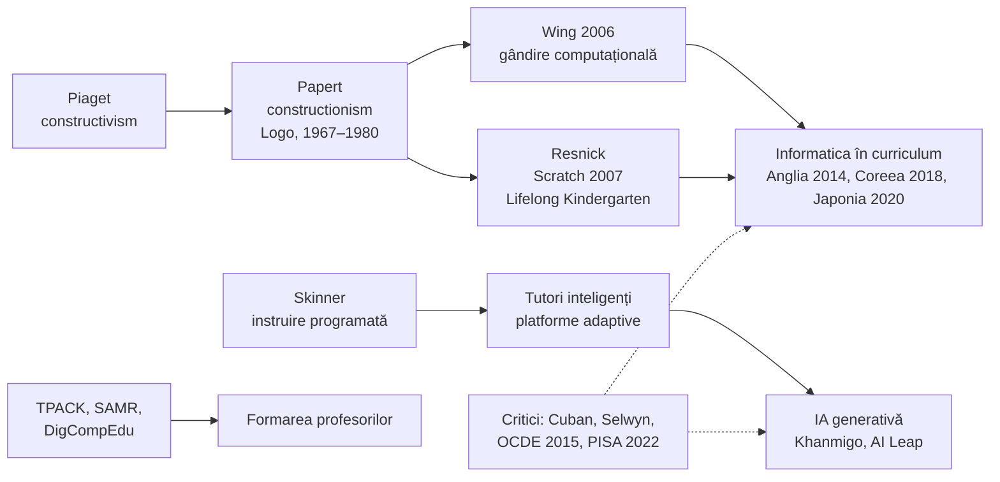

↑ [[00 Index - Analiza comparată internațională]]

> [!abstract] Pe scurt
> - **Constructionismul** (*constructionism*, Seymour Papert) spune că se învață cel mai bine **construind artefacte care au sens** pentru cel care învață și pot fi împărtășite: un program, un robot, un joc, un model. Calculatorul e un **material de construcție pentru gândire**, nu o „mașină de predat”.
> - „Educația digitală” reunește azi **trei proiecte diferite**, adesea confundate: (1) **a învăța cu tehnologia** (dispozitive, platforme, tutori adaptivi, IA); (2) **a învăța despre tehnologie** (informatică, gândire computațională, competență digitală); (3) **a trăi sănătos cu tehnologia** (atenție, ecrane, date, siguranță).
> - Cadrele de politică (**TPACK**, **SAMR**, **DigComp/DigCompEdu**) au mutat accentul de la echipamente la **competențele profesorului** și ale elevului.
> - **Dovezile sunt mixte**: tutoratul software bine proiectat și programele structurate au efecte pozitive, dar **distribuirea masivă de dispozitive** fără pedagogie are efecte nule sau negative (OCDE, *Students, Computers and Learning*, 2015). PISA 2022 asociază **distragerea digitală** cu scoruri mai mici.
> - După 2023, **IA generativă** a relansat promisiunea tutorelui personal (Khanmigo, AI Leap), dar studiile arată că, **fără ghidaj**, IA poate **reduce** învățarea (elevii delegă gândirea).
> - Comparativ: **Estonia** și **Singapore** au cea mai lungă și coerentă politică digitală; **Coreea** ilustrează eșecul unei inovații rapide și de sus în jos (manualele cu IA, 2025); **Finlanda, Țările nordice, Canada, SUA** trec prin „corecția ecranelor” (restricții de telefoane).
> - Pentru **R. Moldova**: informatica e obligatorie abia din gimnaziul superior, iar în primar există modulul „Educație digitală”; lecția comparată e să investească în **profesori și pedagogie**, nu întâi în dispozitive.

---

## 1. Explicația teoriei

### 1.1 Întrebarea la care răspunde

- **Constructionismul**: *Ce fel de activitate produce învățare profundă și ce rol poate avea calculatorul în ea?* Răspuns: construcția publică de artefacte în „micro-lumi” (*microworlds*) care permit explorarea ideilor puternice (*powerful ideas*).
- **Educația digitală ca politică**: *Cum ar trebui un sistem educațional să folosească, să predea și să reglementeze tehnologia digitală, astfel încât să crească învățarea și echitatea, nu doar consumul de ecrane?*

### 1.2 Ideile centrale

1. **Construcționism ≠ constructivism.** Papert pornește de la Piaget (a lucrat la Geneva, 1958–1963): cunoașterea se **construiește** în mintea celui care învață. Adaugă însă că această construcție este **cea mai eficientă atunci când elevul construiește ceva în lume**, un obiect extern pe care îl poate arăta, discuta și corecta (Harel & Papert, *Constructionism*, 1991).
2. **Calculatorul ca obiect-de-gândit-cu** (*object-to-think-with*). Țestoasa Logo îl lasă pe copil să „devină” țestoasa și să transfere cunoașterea corporală (mersul, întoarcerea) în geometrie și algoritmi.
3. **Eroarea ca informație** (*debugging*): programul care nu merge devine prilej de reflecție, nu motiv de sancțiune.
4. **„Prag jos, plafon înalt”** (*low floor, high ceiling*, Papert), la care Resnick adaugă **„pereți largi”** (*wide walls*): mediul trebuie să fie ușor de început, să permită complexitate mare și să admită proiecte foarte diverse.
5. **Critica „instrucționismului”**: Papert (*The Children's Machine*, 1993) opune constructionismul folosirii calculatorului pentru a livra lecții și exerciții (paradigma instruirii programate, vezi [[Behaviorismul și instruirea directă]]).
6. **Tehnologia ca amplificator, nu ca substitut.** Formula lui Kentaro Toyama (*Geek Heresy*, 2015): tehnologia **amplifică** capacitatea pedagogică existentă. Unde capacitatea e slabă, amplifică slăbiciunea.

### 1.3 Concepte-cheie

| Concept | Definiție |
|---|---|
| **Constructionism** | teoria învățării prin construcția de artefacte semnificative și împărtășite (Papert, Harel) |
| **Micro-lume** (*microworld*) | mediu digital restrâns, cu reguli explorabile (ex. geometria țestoasei Logo) |
| **Idei puternice** (*powerful ideas*) | concepte care dau acces la domenii întregi (recursivitate, variabilă, feedback) |
| **Gândire computațională** (*computational thinking*) | descompunere, abstractizare, recunoașterea tiparelor, algoritmi, aplicabile dincolo de informatică (Wing, 2006) |
| **Spirala învățării creative** | imaginează → creează → joacă → împărtășește → reflectează → imaginează (Resnick, 2017) |
| **Cele 4 P** | *projects, passion, peers, play*: proiecte, pasiune, colegi, joc (Resnick) |
| **Conectivism** (*connectivism*) | învățarea ca formare de conexiuni în rețele de oameni și resurse (Siemens, Downes, 2005) |
| **SAMR** | patru niveluri de integrare a tehnologiei: substituție, augmentare, modificare, redefinire (Puentedura) |
| **TPACK** | cunoașterea tehnologică-pedagogică-de conținut: intersecția a trei tipuri de cunoaștere ale profesorului (Mishra & Koehler, 2006) |
| **DigComp / DigCompEdu** | cadrele UE ale competenței digitale a cetățenilor (5 arii) și a educatorilor (6 arii, 22 de competențe) |
| **Unu-la-unu** (*one-to-one*) | politica „un dispozitiv per elev” |
| **Sistem tutorial inteligent** (*ITS*) | software care adaptează sarcinile și feedbackul la modelul elevului |
| **IA generativă** | modele care produc text, cod, imagini (ChatGPT, Claude etc.), folosite ca tutori, asistenți sau „scurtături” |
| **Distragere digitală** | întreruperea atenției la oră prin dispozitive proprii sau ale colegilor (indicator PISA 2022) |

### 1.4 Ce presupune teoria despre actorii educației

| Actor | Constructionism (Papert, Resnick) | Educația digitală „instrucționistă” (platforme, tutori) |
|---|---|---|
| **Elevul** | constructor, explorator, autor | utilizator care parcurge conținut adaptat |
| **Profesorul** | co-învățăcel, mentor de proiect, „inginer al mediului” | curator, analist de date, facilitator |
| **Cunoașterea** | construită, situată, legată de interese | segmentată în unități, măsurabilă |
| **Școala** | atelier, laborator, comunitate (*Lifelong Kindergarten*) | nod de platforme; potențial „fără ziduri” |
| **Tehnologia** | material expresiv | canal de livrare și de monitorizare |

---

## 2. Geneza și evoluția

| Perioadă | Etapă | Repere |
|---|---|---|
| 1920–1960 | **Precursori** | Pressey (mașini de testare, anii 1920); Skinner (*teaching machines*, 1954–1958); Piaget; Dewey (învățarea prin activitate) |
| 1967–1980 | **Formularea** | Logo (Papert, Wally Feurzeig, Cynthia Solomon, BBN și MIT, 1967); *Mindstorms: Children, Computers, and Powerful Ideas* (1980) |
| 1980–1995 | **Primul val școlar** | Logo în mii de școli; microcalculatoare (BBC Micro, Juku în Estonia); studiul Pea & Kurland (1984) arată transfer slab; *LEGO/Logo* (1987); *The Children's Machine* (1993) |
| 1995–2010 | **Internet și dispozitive** | Tiigrihüpe (Estonia, 1996); ICT Masterplan (Singapore, 1997); Maine (primul program *one-to-one* la nivel de stat, 2002); *One Laptop per Child* (2005); Scratch (2007); Siemens și Downes: conectivismul (2005); TPACK (2006); Wing (2006) |
| 2010–2019 | **Codul în curriculum și platformele** | Khan Academy (2008); MOOC (2012); Smart Education (Coreea, 2011); Computing (Anglia, 2014); ProgeTiiger (Estonia, 2012); OCDE (2015): investițiile nu au dus la progres; DigCompEdu (2017); GIGA (Japonia, 2019) |
| 2020–2022 | **Șocul pandemic** | învățare la distanță generalizată; dispozitive distribuite în masă (ESSER în SUA; PLD în Singapore); pierderi de învățare mai mari unde școlile au fost închise mult |
| 2023–2026 | **IA generativă și „corecția ecranelor”** | ghidul UNESCO pentru IA generativă (2023); Khanmigo (2023); PISA 2022 despre distragere; restricții de telefoane (Țările de Jos, Finlanda, multe state SUA, provincii canadiene); AI Leap (Estonia, 2025); manualele cu IA retrogradate (Coreea, august 2025); AI Act al UE (educația ca domeniu cu risc ridicat) |

> [!note] Comentariu — un paradox istoric
> Papert a imaginat calculatorul ca instrument al **autonomiei** copilului. Istoria reală a școlii a folosit mai des tehnologia în sensul opus: pentru **livrare, exersare și control** (platforme, teste adaptive, monitorizare). Larry Cuban (*Teachers and Machines*, 1986; *Oversold and Underused*, 2001) a arătat că fiecare val tehnologic (radio, film, TV, calculator) a promis revoluția și a fost „domesticit” de **gramatica școlii**.

---

## 3. Autori, reprezentanți, cercetători

| Autor | Lucrare(ări), an | Aportul concret |
|---|---|---|
| **Seymour Papert** (1928–2016) | *Mindstorms* (1980); *The Children's Machine* (1993); cu Idit Harel, *Constructionism* (1991) | a creat constructionismul, Logo și micro-lumile; critica „instrucționismului” |
| **Cynthia Solomon**, **Wally Feurzeig** | Logo (1967); Solomon, *Computer Environments for Children* (1986) | coautori ai limbajului Logo; primele experimente cu copii |
| **Mitchel Resnick** (MIT Media Lab) | Scratch (2007); *Lifelong Kindergarten* (2017) | programarea vizuală cu blocuri, comunitatea online Scratch; spirala învățării creative; cele 4 P; „pereți largi” |
| **Yasmin Kafai** | *Connected Code* (cu Burke, 2014) | programarea ca practică socială și creativă; e-textile; gen și programare |
| **Jeannette Wing** | „Computational Thinking”, *Communications of the ACM* (2006) | gândirea computațională ca alfabetizare pentru toți; argumentul pentru informatică în școală |
| **George Siemens**, **Stephen Downes** | Siemens, „Connectivism: A Learning Theory for the Digital Age” (2005); Downes, *Connectivism and Connective Knowledge* (2012) | învățarea ca rețea de conexiuni; primul MOOC „conectivist” (CCK08, 2008) |
| **Pløn Verhagen**; **Rita Kop & Adrian Hill** | Verhagen (2006); Kop & Hill, *IRRODL* (2008) | **critici** ale conectivismului: e mai degrabă o perspectivă pedagogică decât o teorie a învățării, cu bază empirică slabă |
| **Ruben Puentedura** | modelul SAMR (prezentări, ~2006–2010) | tipologia integrării tehnologiei; foarte popular, dar **nepublicat în reviste cu recenzie**; criticat de Hamilton, Rosenberg & Akcaoglu (*TechTrends*, 2016) pentru ierarhie rigidă și lipsa contextului |
| **Punya Mishra & Joan (Judith) Koehler** | „Technological Pedagogical Content Knowledge”, *Teachers College Record*, 108(6) (2006) | TPACK, extinderea PCK a lui Shulman; cadrul dominant în formarea profesorilor |
| **Anusca Ferrari**; **Christine Redecker** (JRC) | *DigComp* (2013; 2.2 în 2022; 3.0 în 2025); Redecker, *DigCompEdu* (2017) | cadrele europene ale competenței digitale; baza pentru SELFIE și autoevaluări naționale |
| **Larry Cuban** | *Teachers and Machines* (1986); *Oversold and Underused* (2001) | istoria eșecurilor tehnologiei la clasă; persistența practicilor |
| **Neil Selwyn** | *Education and Technology* (2011); *Distrusting Educational Technology* (2014); *Should Robots Replace Teachers?* (2019) | **critica sociologică a EdTech**: interese comerciale, datificare, promisiuni „solutioniste” |
| **Roy Pea & D. Midian Kurland** | „On the cognitive effects of learning computer programming” (1984) | primele dovezi de **transfer slab** al programării Logo la gândirea generală |
| **Ronny Scherer, Fazilat Siddiq, Bárbara Sánchez Viveros** | meta-analiză despre transferul programării, *Journal of Educational Psychology* (2019) | efecte de transfer moderate, mai mari pentru transferul apropiat decât pentru cel îndepărtat (mărimea exactă: de verificat) |
| **Kurt VanLehn** | *Educational Psychologist* (2011) | sistemele tutoriale inteligente bine proiectate se apropie de eficacitatea tutoratului uman |
| **Maya Escueta, Vincent Quan, Andre Joshua Nickow, Philip Oreopoulos** | „Upgrading Education with Technology”, *Journal of Economic Literature* (2020) | sinteza studiilor experimentale: **învățarea asistată de calculator** adaptivă are efecte pozitive; simpla **distribuire de calculatoare** nu îmbunătățește rezultatele |
| **Ofer Malamud & Cristian Pop-Eleches** | *Quarterly Journal of Economics* (2011) | vouchere pentru calculatoare acasă în **România**: note școlare **mai mici**, dar competențe digitale mai mari — un rezultat relevant regional pentru Moldova |
| **Robert Fairlie & Jonathan Robinson** | *American Economic Journal: Applied* (2013) | RCT în California: calculatoare acasă gratuite, **fără efect** asupra rezultatelor școlare |
| **Julián Cristia et al.** | *AEJ: Applied* (2017) | *One Laptop per Child* în Peru: acces crescut, **fără câștiguri** la matematică și citire |
| **OCDE (Francesco Avvisati, Andreas Schleicher et al.)** | *Students, Computers and Learning* (2015); *PISA 2022 Results*, Vol. II (2023); *Managing Screen Time* (2024) | țările care au investit masiv nu au înregistrat progrese la citire, matematică și științe; distragerea digitală e asociată cu scoruri mai mici |
| **Louis-Philippe Beland & Richard Murphy** | „Ill Communication”, *Labour Economics* (2016) | interdicția telefoanelor în școlile engleze asociată cu câștiguri, mai mari la elevii slabi; studii ulterioare (ex. Suedia) nu au găsit efecte — **dovezi mixte** |
| **Hamsa Bastani et al.** | „Generative AI without guardrails can harm learning”, *PNAS* (2025; preprint 2024) | experiment în liceele din Turcia: accesul liber la GPT-4 a crescut performanța la exerciții, dar a **scăzut-o la testul fără IA**; un „tutor” cu reguli a atenuat efectul |
| **Martín De Simone et al.** (Banca Mondială) | studiu în Nigeria (2025) | tutorat după școală cu IA generativă, ghidat de profesori: câștiguri la limba engleză într-un program de câteva săptămâni (mărimea: de verificat) |
| **Sal Khan** | Khan Academy (2008); Khanmigo (2023); *Brave New Words* (2024) | platformă gratuită de lecții și exersare; tutore IA socratic; promotorul „tutorelui pentru fiecare copil” |
| **UNESCO (Fengchun Miao, Wayne Holmes)** | *Guidance for Generative AI in Education and Research* (2023); cadrele de competențe IA pentru elevi și profesori (2024) | abordare centrată pe om, protecția datelor, validarea instrumentelor; vârstă minimă recomandată de 13 ani pentru folosirea independentă |
| **UNESCO, GEM Report** | *Technology in Education: A Tool on Whose Terms?* (2023) | dovezi slabe despre valoarea adăugată a EdTech; recomandă ca tehnologia să fie adoptată doar când e **adecvată, echitabilă, scalabilă și sustenabilă** |
| **Mart Laanpere** (Tallinn) | cercetări despre competența digitală a profesorilor | instrumente de evaluare; implementarea DigCompEdu în Estonia |
| **Marlene Scardamalia & Carl Bereiter** (Toronto) | CSILE (1986) → Knowledge Forum | construirea colectivă a cunoașterii în medii digitale, o variantă socială a constructionismului |

---

## 4. Legătura cu manualul și cu vaultul

- **[[6.2.3 Educația tehnologică]]** — manualul tratează dimensiunea tehnologică prin „conștiința tehnologică” și formula lui Văideanu despre „a doua alfabetizare” (comunicarea cu calculatorul). Conspectul completează deja cu Papert, Wing și DigComp. **Manualul e incomplet**: lipsesc gândirea computațională, competența digitală, rețelele sociale și IA; nu există o teorie a învățării cu tehnologia.
- **[[7.2.2 Educația pentru comunicare și mass-media]]** și [[Modulul 07 - Noile educații]] — educația media e locul natural pentru „a trăi cu tehnologia” (dezinformare, atenție, date).
- **[[3.4 Educația informală]]** și [[3.5 Relația dintre formele educației]] — internetul și IA sunt cea mai mare sursă de învățare informală; manualul discută mass-media „greu controlabile pedagogic”, dar în termenii anilor 1990 (casete, televizor).
- **[[3.6 Educația permanentă și autoeducația]]** — platformele, MOOC-urile și IA multiplică posibilitățile de autodidaxie, dar cer **autoreglare** (vezi [[Învățarea autoreglată, metacogniția și autoeducația]]).
- **[[Modulul 02 - Clasic, modern și postmodern în educație]]** și [[5.2 Tipologia paradigmelor educaționale]] — constructionismul aparține paradigmei centrate pe elev; platformele adaptive reiau, sub formă nouă, logica instruirii programate.
- **[[9.2 Profesorul postmodernist - facilitator al cunoașterii]]** — rolul profesorului ca facilitator este exact rolul cerut de constructionism; TPACK arată însă că facilitarea cu tehnologie cere **cunoaștere specifică**, nu doar o schimbare de atitudine.
- **[[8.6 Managementul educației și reforma]]** — digitalizarea ca direcție a strategiei „Educația 2030”.

---

## 5. Implementare comparată

### 5.1 Tabel

| Sistem | Cum a fost implementată | Când | Scară / intensitate | Dovezi sau rezultate |
|---|---|---|---|---|
| **Singapore** | patru *ICT Masterplans*; platforma națională **Student Learning Space** (SLS); **dispozitiv personal de învățare** (PLD) pentru toți elevii de secundar; *Code for Fun*; *EdTech Masterplan 2030*; abordarea IA „a învăța despre, cu, și dincolo de IA” | 1997–2020; SLS 2018; PLD 2021; EdTech 2030 din 2023 | **centrală** | TALIS 2024: 75% dintre profesori folosesc IA (OCDE: 36%); PISA 2022: 27% distrași digital (OCDE: 30%); fără evaluări cauzale publicate ale PLD |
| **Estonia** | **Tiigrihüpe** (calculatoare și internet în școli); **eKool**; **ProgeTiiger** (programare și robotică); competența digitală în curriculum; **AI Leap / TI-Hüpe** (instrumente IA pentru liceeni și profesori, cu OpenAI și Anthropic) | 1996–97; eKool 2002; ProgeTiiger 2012; curriculum 2014; AI Leap sept. 2025 | **centrală** | 20 000 de elevi și 3 000 de profesori în prima etapă (extindere anunțată la 38 000 și 2 000); PISA 2025: 58% folosesc săptămânal chatboți, cu scoruri **mai mici** la științe pentru anumite utilizări (corelație); fără evaluare independentă AI Leap |
| **Finlanda** | competența transversală T5 (TIC); programare integrată în matematică din clasele mici; profesori-tutori digitali; **examen de maturitate digital**; **restricționarea telefoanelor** prin lege | curriculum 2014 (aplicat 2016); examen digital 2016–2019; legea telefoanelor aug. 2025 | **medie** | PISA 2022: **41%** distrași de dispozitive la matematică (OCDE: 30%) → motivul legii din 2025; legătura digitalizare–declin PISA nedemonstrată cauzal |
| **Regatul Unit** (Anglia; Scoția, Țara Galilor) | **Computing** în locul ICT (programare de la KS1); NCCE (2018); BBC micro:bit (2016); Raspberry Pi; Oak National Academy; ghid pentru telefoane (2024); Curriculum for Wales cu competență digitală transversală | 2014 (Anglia); NCCE 2018; ghid telefoane feb. 2024 | **medie** | Royal Society, *After the Reboot* (2017): deficit de profesori calificați, participare mică a fetelor la GCSE Computer Science; efectele Computing asupra competențelor: puțin evaluate |
| **Japonia** | **GIGA School**: un dispozitiv per elev + rețea; programare obligatorie în primar; manuale digitale; ghiduri pentru IA generativă | dec. 2019, accelerat 2020; programare 2020; ghid IA 2023 (revizuit 2024) | **centrală** (din 2020) | PISA 2025 (după nota de țară din vault): utilizare școlară peste media OCDE, distragere foarte mică (7%), cea mai rară utilizare a IA din OCDE; legătura GIGA → performanță nedemonstrată |
| **Coreea de Sud** | KERIS (1999); **Smart Education** (manuale digitale, cloud); educația software obligatorie; informatica dublată în curriculumul 2022; **manuale digitale cu IA (AIDT)** | 2011; SW 2018; AIDT martie 2025, **retrogradate prin lege** la 4 aug. 2025 | **centrală**, dar instabilă | AIDT: buget ≥ 533 mld. woni (2024), adoptate de ~30% dintre școli, lansate fără dovezi de eficacitate; scor ridicat la domeniul digital inovator din PISA 2025 (538, după presa coreeană; denumirea domeniului: de verificat) |
| **Canada** | Knowledge Forum (Toronto); programare în curriculumul de matematică (Ontario 2020); ADST în British Columbia; e-learning obligatoriu anunțat în Ontario; interdicții de telefoane (Ontario 2019, extinse 2024; alte provincii 2024) | 1986 (CSILE); 2019–2024 | **medie**, descentralizată pe provincii | PISA 2025: 32% distrași în orele de științe, fără asociere semnificativă cu performanța în Canada; școli cu interdicția telefonului: 37% (2022: 10%) |
| **Europa** (UE / Consiliul Europei) | DigComp; **DigCompEdu**; instrumentul **SELFIE**; *Digital Education Action Plan 2021–2027*; recomandările Consiliului privind educația și competențele digitale (2023); **AI Act** (sisteme IA din educație = risc ridicat) | 2013–2025 | **medie** (competență de sprijin, dar cadre influente) | ICILS 2023: **42,5%** dintre elevii de clasa a VIII-a sub pragul minim de competență digitală, față de ținta UE de sub 15% până în 2030 |
| **SUA** | Logo în anii 1980; **Maine** (primul program *one-to-one* statal); Khan Academy; Code.org; *CS for All*; dispozitive 1:1 din fondurile ESSER; **Khanmigo**; restricții de telefoane în numeroase state | 1980; 2002; 2008; 2013–2016; 2020–2024; 2023–2025 | **mare, fragmentată** | Fairlie & Robinson (2013): calculatoarele acasă fără efect; Escueta et al. (2020): efecte pozitive ale software-ului adaptiv; OLPC — eșec internațional; PISA 2025: peste 3 ore/zi de ecrane recreative asociate cu rezultate slabe |
| **Republica Moldova** | modulul **„Educație digitală”** în disciplina *Educație tehnologică* (ciclul primar); **Informatica** obligatorie în gimnaziu (1 oră/săptămână în clasele VII–IX conform planului-cadru 2026–2027) și liceu; opționale de **Informatică** (cl. II–VI) și **Robotică** (cl. III–IV, VII–IX); digitalizarea ca direcție a Strategiei **„Educația 2030”**; învățarea la distanță în pandemie | curriculum reconceptualizat 2018; planurile-cadru 2019–2027; HG 114/2023 | **redusă spre medie** | nu există evaluări de impact publicate; decalajul rural–urban PISA 2025 (56 de puncte la științe) sugerează că infrastructura și profesorii rurali sunt constrângerea principală; datele PISA despre utilizarea digitală pentru Moldova: de verificat |

*Surse*: notele de țară din vault; planul-cadru MEC 2026–2027; OCDE; HTM (Estonia); UNESCO. Clasa în care modulul „Educație digitală” e obligatoriu diferă între surse (clasa I sau a II-a) — **de verificat** în curriculumul în vigoare.

### 5.2 Studiu de caz: Estonia — de la Tiigrihüpe la AI Leap

→ [[Estonia - ecosistemul educațional]]

**Traseul.** Estonia a pornit dintr-un program sovietic târziu de calculatoare școlare (circa 3 000 de *Juku*, nefiabile). În 1996, președintele Lennart Meri a anunțat **Tiigrihüpe** („Saltul Tigrului”): între 1996 și 1998, raportul elevi/calculator a scăzut de la 50 la 20, iar până în 2003–2004 toate școlile erau conectate. Au urmat **eKool** (2002, jurnal electronic școală–familie), **ProgeTiiger** (2012, programare și robotică), fuziunea agențiilor în HITSA (2013), apoi Harno (2020) și **AI Leap** (2025).

**Ce explică succesul relativ.** (1) Digitalizarea a fost parte a unui **proiect național de stat digital**, nu doar școlar. (2) A existat **continuitate instituțională** pe trei decenii. (3) Accentul a trecut treptat de la echipamente la **competențele profesorilor** (Laanpere, DigCompEdu). (4) Școlile au **autonomie** în alegerea instrumentelor.

**Ce nu explică.** Mitul „Estonia e în topul PISA datorită digitalizării” e **nesusținut** ca explicație principală (vezi nota de țară, §7). Runnel, Pruulmann-Vengerfeldt & Reinsalu (2009) au documentat decalajul dintre retorica și practica Tiger Leap. Datele PISA 2025 arată că utilizarea IA pentru anumite sarcini **se asociază** cu scoruri mai mici.

> [!question] Întrebarea deschisă a AI Leap
> AI Leap este primul program național care dă liceenilor acces gratuit, organizat, la instrumente IA de top, cu formare prealabilă a profesorilor. Este un experiment de mare interes internațional, dar e implementat în **parteneriat cu companii private** și **fără un design de evaluare cauzală public** (de verificat dacă a fost anunțat unul). Rezultatele Bastani et al. (2025) sugerează că efectul va depinde de **reguli pedagogice** (IA ca tutor socratic, nu ca furnizor de răspunsuri).

### 5.3 Studiu de caz: Coreea de Sud — manualele cu IA (2025)

→ [[Coreea de Sud - ecosistemul educațional]]

**Contextul.** Coreea are infrastructură digitală de vârf (KERIS, EduNet, EBS online) și elevi foarte competenți digital. Planul de inovare educațională digitală (februarie 2023) a propus **manuale digitale cu IA** (AIDT), adaptive, pentru engleză, matematică și informatică.

**Ce s-a întâmplat.** AIDT au fost introduse în martie 2025 în clasele III–IV (primar) și în anumite clase de gimnaziu și liceu. Adopția a rămas la circa 30% dintre școli. Au existat îngrijorări ale părinților și profesorilor (timp pe ecran, protecția datelor, costuri, calitatea conținutului). După alternanța politică, legea din **4 august 2025** a restrâns definiția manualului la cărți tipărite și e-book-uri: AIDT au devenit **materiale opționale**, fără finanțare dedicată.

**Lecția teoretică.** Cazul confirmă simultan **Cuban** (inovațiile impuse de sus sunt „domesticite” sau respinse), **Selwyn** (interese comerciale și promisiuni solutioniste) și [[Teoria schimbării educaționale și leadershipul]] (Fullan: fără asumarea profesorilor, reforma nu rezistă). Nu arată că IA „nu funcționează”: arată că **ritmul, dovezile și consensul** contează la fel de mult ca tehnologia.

### 5.4 Studiu de caz: Anglia — Computing (2014) și constructionismul „fără Papert”

→ [[Regatul Unit - ecosistemul educațional]]

În 2011–2012, după critici din industrie (discursul lui Eric Schmidt din 2011) și raportul Royal Society *Shut Down or Restart?* (2012), guvernul a renunțat la programa ICT (centrată pe utilizarea aplicațiilor de birou) și a introdus **Computing** (2014): algoritmi și programare de la 5 ani, informatica ca disciplină științifică. Ecosistemul (BBC micro:bit, Raspberry Pi, Scratch, NCCE) are un aer constructionist evident.

**Rezultatele** sunt însă limitate de **capacitatea profesorilor**: *After the Reboot* (Royal Society, 2017) a constatat că mulți profesori nu se simțeau pregătiți, iar participarea la GCSE Computer Science a rămas mică și dezechilibrată pe gen. În același timp, curriculumul „bogat în cunoaștere” și [[Știința cognitivă a învățării]] au împins programarea spre **predare explicită**, nu spre proiecte deschise. Anglia ilustrează că **„a învăța despre tehnologie”** se poate implementa fără filozofia constructionistă a lui Papert.

### 5.5 Studiu de caz: Singapore și Japonia — dispozitive pentru toți, cu reguli

→ [[Singapore - ecosistemul educațional]] · [[Japonia - ecosistemul educațional]]

Ambele sisteme au dat **un dispozitiv fiecărui elev** (Japonia prin GIGA, Singapore prin PLD), dar în ecosisteme cu **control curricular puternic**, platforme publice (SLS) și profesori bine formați. Japonia combină utilizarea școlară frecventă cu **distragere minimă**, ceea ce sugerează că problema nu e dispozitivul în sine, ci **normele de clasă** și utilizarea recreativă. Singapore are cea mai mare utilizare a IA de către profesori (TALIS 2024), dar **nicio evaluare cauzală publicată**: politica e „informată de benchmarking”, nu de experimente.

---

## 6. Dovezi empirice și critici

### 6.1 Ce știm (sinteză)

| Tip de intervenție | Dovezi | Concluzie prudentă |
|---|---|---|
| **Distribuirea de dispozitive** (acasă sau 1:1) | RCT-uri în SUA (Fairlie & Robinson, 2013), Peru (Cristia et al., 2017); România (Malamud & Pop-Eleches, 2011) | **efect nul** asupra rezultatelor academice; uneori negativ (timp de joc); crește competența digitală |
| **Învățarea asistată de calculator adaptivă** (matematică, citire) | Escueta et al. (2020); VanLehn (2011); Kulik & Fletcher (2016) | **efecte pozitive**, uneori mari, mai ales când completează timpul de instruire |
| **Programarea și gândirea computațională** | Pea & Kurland (1984); Scherer et al. (2019) | se învață programare; **transferul** la alte domenii există, dar e mai mic și depinde de proiectarea explicită |
| **Utilizarea la școală (PISA)** | OCDE (2015); PISA 2022 | relație în **U inversat**: utilizarea moderată (până la ~1 oră/zi pentru învățare) se asociază cu scoruri mai mari (+14 puncte la matematică în PISA 2022), utilizarea intensă cu scoruri mai mici |
| **Distragerea digitală** | PISA 2022: elevii distrași de dispozitive la majoritatea orelor au cu **15 puncte** mai puțin la matematică; 65% dintre elevi raportează distragere cel puțin la unele ore (media OCDE) | corelație robustă; direcția cauzală nu e stabilită |
| **Interdicția telefoanelor** | Beland & Murphy (2016): efecte pozitive; studii ulterioare (Suedia, Spania, Norvegia): rezultate mixte | efect probabil **mic spre moderat**, mai mare la elevii slabi, dependent de aplicare |
| **IA generativă** | Bastani et al. (2025); De Simone et al. (2025); studii universitare cu tutori IA | **„fără balustrade”** IA poate crește performanța imediată și reduce învățarea; ca tutor ghidat de profesor poate avea efecte pozitive. Baza de dovezi e **foarte recentă** |

> [!warning] Critică — limite, controverse, condiții
> 1. **Iluzia echipamentului**: tehnologia amplifică pedagogia existentă (Toyama). Unde profesorii nu au TPACK, dispozitivele devin „tabla neagră digitală” (nivelul S din SAMR) sau sursă de distragere.
> 2. **Constructionismul la scară** e fragil: proiectele deschise cer timp, profesori pricepuți și evaluare adecvată. Criticii din [[Știința cognitivă a învățării]] (Kirschner, Sweller & Clark, 2006) avertizează că **ghidarea minimală** dezavantajează novicii.
> 3. **SAMR** e o scară normativă nevalidată empiric. „Redefinirea” nu e automat mai bună decât „substituția” (o fișă digitală bună poate fi mai eficientă decât un proiect multimedia confuz).
> 4. **Conectivismul** e o descriere a învățării în rețea, nu o teorie testabilă; a inspirat MOOC-uri cu rate de finalizare foarte mici, mai ales pentru cei fără studii (efectul Matei).
> 5. **Critica EdTech (Selwyn)**: datificarea elevilor, dependența de platforme private, externalizarea deciziilor pedagogice spre algoritmi, inegalitatea „a doua fractură digitală” (cum folosești, nu doar dacă ai acces).
> 6. **Echitatea**: accesul la dispozitive s-a egalizat, dar **utilizarea productivă** rămâne legată de capitalul cultural al familiei (vezi [[Echitatea și școala comprehensivă]]).
> 7. **Riscul de „corecție excesivă”**: restricțiile de telefoane sunt justificate de datele despre distragere, dar nu înlocuiesc educația pentru **autoreglarea** utilizării (OCDE, *Managing Screen Time*, 2024).
> 8. **Unde funcționează**: obiective clare de învățare, software adaptiv bine proiectat, profesori formați, timp de instruire suplimentar, reguli de clasă, evaluare independentă. **Unde nu funcționează**: dispozitive fără pedagogie, lansări rapide fără pilotare, platforme care înlocuiesc relația profesor–elev.

---

## 7. Implicații practice

> [!tip] Pentru profesor la clasă
> - Folosiți tehnologia unde are **valoare adăugată clară**: simulări și modelare (științe), exersare adaptivă cu feedback imediat (matematică), producție și publicare (proiecte). Întrebați-vă: *ce pot face elevii cu instrumentul și nu pot face fără el?*
> - Pentru programare, începeți **ghidat** (exemple lucrate, programe de modificat — „folosește, modifică, creează”), apoi deschideți spre proiecte proprii în spirit Papert–Resnick (Scratch, micro:bit, robotică).
> - Stabiliți **reguli explicite** pentru telefoane și pentru IA: când e permisă, pentru ce (explicații, verificare, idei), când e interzisă (evaluarea competenței proprii). Cereți **urma procesului** (schițe, versiuni, reflecție), nu doar produsul final.
> - Predați IA ca **obiect de gândire critică**: halucinații, surse, prejudecăți, date personale (legătură cu educația media, [[7.2.2 Educația pentru comunicare și mass-media]]).
> - Autoevaluați-vă competența digitală cu **SELFIEforTEACHERS** / DigCompEdu (gratuit, disponibil și în română).

> [!tip] Pentru politica educațională din R. Moldova
> 1. **Profesori înainte de dispozitive**: formare TPACK practică, pe discipline, cu mentori; profesori de informatică în școlile rurale (inclusiv partajați între școli).
> 2. **Infrastructură minimă echitabilă**: conectivitate și laboratoare funcționale în gimnaziile rurale, unde decalajul PISA e cel mai mare; nu programe masive de laptopuri acasă (dovezile din România, SUA și Peru arată efecte nule).
> 3. **Gândirea computațională mai devreme**, integrată în matematică și în „Educație digitală” din primar, cu materiale gata de folosit (Scratch în română, micro:bit, sarcini „unplugged” pentru școlile fără echipamente).
> 4. **Politică națională pentru IA în școală** după ghidul UNESCO: vârste, protecția datelor (conform standardelor UE, relevant pentru aderare), utilizare în evaluare, formarea profesorilor; **pilotare cu evaluare** înainte de extindere (lecția coreeană).
> 5. **Reguli pentru telefoane** la nivel de școală, însoțite de educație pentru autoreglare, nu doar interdicții.
> 6. **Evaluare independentă** a oricărui program digital finanțat din bani publici sau de donatori, cu date publice.

---

## 8. Legături cu alte teorii din catalog

- [[Constructivismul cognitiv (Piaget, Bruner)]] — rădăcina directă: Papert a transformat constructivismul lui Piaget într-o teorie a construcției externe.
- [[Socioconstructivismul și teoria activității (Vygotsky)]] — Resnick și Kafai (comunitatea Scratch) și Scardamalia & Bereiter (Knowledge Forum) adaugă dimensiunea socială.
- [[Behaviorismul și instruirea directă]] — platformele adaptive continuă logica „mașinilor de predat” ale lui Skinner; constructionismul s-a definit împotriva ei.
- [[Știința cognitivă a învățării]] — contrapunctul: încărcarea cognitivă, riscul ghidării minimale, efectele distragerii asupra atenției și memoriei.
- Învățarea prin proiecte, investigație și fenomene — constructionismul este o variantă tehnologică a învățării prin proiecte.
- [[Învățarea autoreglată, metacogniția și autoeducația]] — învățarea digitală autonomă și folosirea IA depind de autoreglare; PISA 2025 va publica date despre învățarea autodirijată în lumea digitală (2027).
- [[Profesionalismul cadrului didactic]] — TPACK și DigCompEdu sunt cadre de competență profesională.
- [[Teoria schimbării educaționale și leadershipul]] — eșecurile digitale (OLPC, AIDT) sunt cazuri clasice de schimbare de sus în jos.
- [[Echitatea și școala comprehensivă]] — fractura digitală de acces și de utilizare.
- Educația bazată pe dovezi — EdTech e unul dintre domeniile cu cele mai multe promisiuni și cele mai puține evaluări riguroase.
- [[Capitalul uman și economia educației]] — argumentul economic pentru informatică și competențe digitale („competențele viitorului”).
- [[Învățarea pe tot parcursul vieții și formele educației]] — MOOC-uri, micro-certificate, platforme de învățare a adulților.

---

## 9. Întrebări de reflecție

1. Prin ce diferă **constructionismul** lui Papert de folosirea calculatorului pentru exerciții adaptive? Dați câte un exemplu din practica școlii moldovenești pentru fiecare.
2. De ce distribuirea gratuită de calculatoare (România, Peru, California) nu a îmbunătățit rezultatele școlare, în timp ce unele programe de software adaptiv au reușit? Ce spune asta despre relația tehnologie–pedagogie?
3. Analizați eșecul manualelor cu IA din Coreea (2025) cu ajutorul teoriei schimbării educaționale. Ce ar trebui să facă diferit R. Moldova dacă ar introduce instrumente IA?
4. Este restricționarea telefoanelor în școli o măsură pedagogică, una de disciplină sau una de sănătate publică? Construiți argumente pentru și împotriva, folosind datele PISA 2022.
5. Plasați trei activități digitale pe care le-ați observat la practica pedagogică pe scara SAMR și în modelul TPACK. Ce limite are fiecare cadru?
6. Cum ar trebui evaluată o temă pentru acasă într-o lume în care IA generativă poate scrie eseul? Propuneți o regulă de clasă și justificați-o teoretic.

---

## 10. Surse

### Lucrări fundamentale
- Papert, S. (1980). *Mindstorms: Children, Computers, and Powerful Ideas*. New York: Basic Books.
- Papert, S. (1993). *The Children's Machine: Rethinking School in the Age of the Computer*. New York: Basic Books.
- Harel, I., & Papert, S. (eds.) (1991). *Constructionism*. Norwood, NJ: Ablex.
- Resnick, M. (2017). *Lifelong Kindergarten: Cultivating Creativity through Projects, Passion, Peers, and Play*. Cambridge, MA: MIT Press.
- Resnick, M. et al. (2009). Scratch: Programming for all. *Communications of the ACM*, 52(11), 60–67.
- Wing, J. M. (2006). Computational thinking. *Communications of the ACM*, 49(3), 33–35. https://doi.org/10.1145/1118178.1118215
- Kafai, Y., & Burke, Q. (2014). *Connected Code*. MIT Press.
- Siemens, G. (2005). Connectivism: A learning theory for the digital age. *International Journal of Instructional Technology and Distance Learning*, 2(1).
- Downes, S. (2012). *Connectivism and Connective Knowledge*. National Research Council Canada (e-book).
- Kop, R., & Hill, A. (2008). Connectivism: Learning theory of the future or vestige of the past? *IRRODL*, 9(3).
- Mishra, P., & Koehler, J. H. (2006). Technological pedagogical content knowledge: A framework for teacher knowledge. *Teachers College Record*, 108(6), 1017–1054.
- Hamilton, E. R., Rosenberg, J. M., & Akcaoglu, M. (2016). The Substitution Augmentation Modification Redefinition (SAMR) model: A critical review and suggestions for its use. *TechTrends*, 60, 433–441.
- Redecker, C. (2017). *European Framework for the Digital Competence of Educators: DigCompEdu*. Publications Office of the EU. https://doi.org/10.2760/159770
- Vuorikari, R., Kluzer, S., & Punie, Y. (2022). *DigComp 2.2*. JRC. https://doi.org/10.2760/115376

### Critici și sinteze
- Cuban, L. (1986). *Teachers and Machines*; (2001). *Oversold and Underused: Computers in the Classroom*. Harvard University Press.
- Selwyn, N. (2011). *Education and Technology: Key Issues and Debates*; (2014). *Distrusting Educational Technology*; (2019). *Should Robots Replace Teachers?* Polity/Routledge.
- Toyama, K. (2015). *Geek Heresy*. PublicAffairs.
- Pea, R. D., & Kurland, D. M. (1984). On the cognitive effects of learning computer programming. *New Ideas in Psychology*, 2(2), 137–168.
- Scherer, R., Siddiq, F., & Sánchez Viveros, B. (2019). The cognitive benefits of learning computer programming: A meta-analysis of transfer effects. *Journal of Educational Psychology*, 111(5), 764–792.
- VanLehn, K. (2011). The relative effectiveness of human tutoring, intelligent tutoring systems, and other tutoring systems. *Educational Psychologist*, 46(4), 197–221.
- Escueta, M., Nickow, A. J., Oreopoulos, P., & Quan, V. (2020). Upgrading education with technology: Insights from experimental research. *Journal of Economic Literature*, 58(4), 897–996.
- Malamud, O., & Pop-Eleches, C. (2011). Home computer use and the development of human capital. *Quarterly Journal of Economics*, 126(2), 987–1027.
- Fairlie, R. W., & Robinson, J. (2013). Experimental evidence on the effects of home computers on academic achievement among schoolchildren. *AEJ: Applied Economics*, 5(3), 211–240.
- Cristia, J., Ibarrarán, P., Cueto, S., Santiago, A., & Severín, E. (2017). Technology and child development: Evidence from the One Laptop per Child program. *AEJ: Applied Economics*, 9(3), 295–320.
- Beland, L.-P., & Murphy, R. (2016). Ill communication: Technology, distraction & student performance. *Labour Economics*, 41, 61–76.
- Bastani, H., Bastani, O., Sungu, A., Ge, H., Kabakcı, Ö., & Mariman, R. (2025). Generative AI without guardrails can harm learning. *Proceedings of the National Academy of Sciences* (volumul și numărul: de verificat; preprint SSRN 2024).
- Kirschner, P. A., Sweller, J., & Clark, R. E. (2006). Why minimal guidance during instruction does not work. *Educational Psychologist*, 41(2), 75–86.

### Rapoarte internaționale
- OECD (2015). *Students, Computers and Learning: Making the Connection*. https://doi.org/10.1787/9789264239555-en
- OECD (2023). *PISA 2022 Results (Volume II): Learning During – and From – Disruption*. https://doi.org/10.1787/a97db61c-en
- OECD (2024). *Managing Screen Time: How to Protect and Equip Students against Distraction*. https://www.oecd.org/content/dam/oecd/en/publications/reports/2024/05/managing-screen-time_023f2390/7c225af4-en.pdf
- UNESCO (2023). *Global Education Monitoring Report 2023: Technology in Education – A Tool on Whose Terms?* https://doi.org/10.54676/UZQV8501
- UNESCO – Miao, F., & Holmes, W. (2023). *Guidance for Generative AI in Education and Research*. https://doi.org/10.54675/EWZM9535
- IEA (2024). *ICILS 2023 International Report*; Comisia Europeană (2025). *Education and Training Monitor 2025*.
- Royal Society (2012). *Shut Down or Restart?*; (2017). *After the Reboot: Computing Education in UK Schools*. https://royalsociety.org/topics-policy/projects/computing-education/

### Surse de țară
- Notele din vault: [[Estonia - ecosistemul educațional]], [[Singapore - ecosistemul educațional]], [[Coreea de Sud - ecosistemul educațional]], [[Japonia - ecosistemul educațional]], [[Finlanda - ecosistemul educațional]], [[Regatul Unit - ecosistemul educațional]], [[Canada - ecosistemul educațional]], [[SUA - ecosistemul educațional]], [[Europa - spațiul european al educației]].
- Ministry of Education and Research of Estonia (2025). *Estonia announces a groundbreaking national initiative: AI Leap programme*. https://www.hm.ee/en/news/estonia-announces-groundbreaking-national-initiative-ai-leap-programme-bring-ai-tools-all
- Runnel, P., Pruulmann-Vengerfeldt, P., & Reinsalu, K. (2009). The Estonian Tiger Leap from post-communism to the information society. *Journal of Baltic Studies*, 40(1).
- Ministerul Educației și Cercetării al R. Moldova (2026). *Planul-cadru pentru învățământul primar, gimnazial și liceal, anul de studii 2026–2027*. https://mec.gov.md/sites/default/files/plan_cadru_26-27.pdf
- Guvernul R. Moldova (2023). *Strategia de dezvoltare „Educația 2030”* (HG nr. 114 din 07.03.2023).
- Diez.md (2018). „Educația pentru societate”, „Dezvoltarea personală” și „Educația digitală” ar putea apărea în sistemul național de educație. https://diez.md/2018/07/03/educatia-pentru-societate-dezvoltarea-personala-si-educatia-digitala-ar-putea-aparea-sistemul-national-de-educatie/
