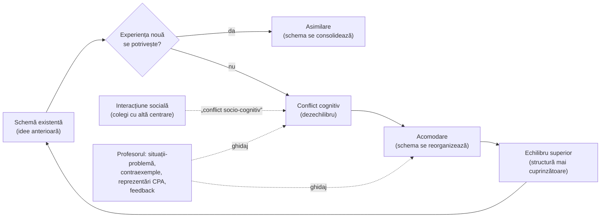

↑ [[00 Index - Analiza comparată internațională]]

> [!abstract] Pe scurt
> 1. **Ideea de bază**: cunoașterea nu se „transmite” gata făcută, ci este **construită activ** de subiect, care își reorganizează structurile mintale când acțiunea și experiența nu mai încap în ele. Elevul nu e un vas gol, ci un **teoretician care are deja idei**, uneori greșite.
> 2. **Jean Piaget** (epistemologia genetică) descrie **mecanismul** (asimilare, acomodare, echilibrare, **conflict cognitiv**) și **stadiile** dezvoltării inteligenței. **Jerome Bruner** traduce teoria în **didactică și curriculum**: structura disciplinei, **curriculumul în spirală**, cele trei moduri de reprezentare (**enactiv – iconic – simbolic**) și **învățarea prin descoperire**.
> 3. Școala de la Geneva (**Doise & Mugny, Perret-Clermont**) a arătat că **interacțiunea socială** declanșează conflictul cognitiv (conflictul **socio-cognitiv**). Aceasta este puntea spre [[Socioconstructivismul și teoria activității (Vygotsky)]].
> 4. Constructivismul este o **teorie a învățării și a cunoașterii**, **nu o metodă de predare**. Confuzia dintre „elevul construiește” și „profesorul nu explică” a produs cele mai multe eșecuri de implementare („new math”, *discovery math*, anii ’90 în Estonia).
> 5. **Implementarea cea mai consecventă și mai eficientă**: **Singapore** (abordarea concret–pictural–abstract și metoda modelului, derivate din Bruner), cu manuale coerente și profesori bine formați. **Japonia** combină problema deschisă cu o orchestrare puternică a lecției de către profesor.
> 6. **Dovezi**: descoperirea **neasistată** este inferioară instruirii explicite (d = −0,38), iar descoperirea **ghidată** (feedback, exemple rezolvate, eșafodaj, explicații cerute elevului) îi este superioară (d = 0,30) (Alfieri et al., 2011). Formula care rămâne în picioare este **„activitate cognitivă ghidată”**, nu „activitate fizică liberă”.
> 7. În **R. Moldova**, constructivismul a devenit discursul oficial prin programele de după 1994 (Pas cu Pas, RWCT), prin curriculumul pe competențe (2010, 2019) și prin standardele profesionale (2016). Manualul îl prezintă (9.2) amestecat cu postmodernismul și fără limitele lui empirice.

---

## 1. Ce explică teoria

### 1.1 Întrebarea la care răspunde

**Cum ajunge un om să știe ceva nou, pe care nu îl avea înainte și care nu i-a fost „turnat” din afară?** Piaget pune întrebarea ca **epistemolog**: cum crește cunoașterea (la copil și în istoria științei)? Bruner o reformulează ca **pedagog**: cum trebuie organizate curriculumul și instruirea ca elevul să înțeleagă **structura** unei discipline, nu doar fapte izolate?

### 1.2 Ideile centrale

1. **Cunoașterea este acțiune interiorizată.** Copilul cunoaște lumea acționând asupra ei. Operațiile logice (clasificare, seriere, conservare, reversibilitate) sunt acțiuni devenite mintale și coordonate în sisteme.
2. **Structurile cognitive se construiesc prin autoreglare.** Noul este **asimilat** schemelor existente. Când nu încape, schemele se **acomodează** (se modifică). Starea de dezechilibru rezolvată printr-o structură mai cuprinzătoare este **echilibrarea**, motorul dezvoltării.
3. **Dezvoltarea are stadii** calitativ diferite, într-o ordine invariantă. Vârstele sunt însă doar orientative.
4. **Conflictul cognitiv** (contradicția dintre așteptare și rezultat, sau între două idei proprii) este condiția schimbării. Fără perturbare nu există reconstrucție.
5. **A înțelege înseamnă a inventa sau a reconstrui prin reinventare** (formulă piagetiană citată de manual, vezi [[9.2 Profesorul postmodernist - facilitator al cunoașterii]]).
6. (Bruner) **Orice disciplină are o structură** (idei fundamentale), care poate fi predată **într-o formă onestă intelectual** la orice vârstă, dacă e tradusă în modul de reprezentare potrivit (parafrază a ipotezei din *The Process of Education*, 1960). Curriculumul **revine în spirală** asupra acelorași idei, la niveluri tot mai abstracte.
7. (Bruner) **Descoperirea** (a găsi singur o regularitate) produce cunoaștere mai bine organizată, mai ușor de transferat și motivație intrinsecă. Bruner vorbea însă și de descoperire **ghidată** și, mai târziu, și-a nuanțat poziția spre dimensiunea culturală (*The Culture of Education*, 1996).

### 1.3 Concepte-cheie

| Concept | Definiție |
|---|---|
| **Epistemologie genetică** (*épistémologie génétique*) | studiul formării cunoașterii prin geneza ei (ontogeneză și istoria științei); programul lui Piaget |
| **Schemă** | structura organizată a unei acțiuni, care se poate generaliza și aplica la situații noi |
| **Asimilare / acomodare** | integrarea noului în scheme existente / modificarea schemelor când noul nu încape |
| **Echilibrare** (*équilibration*) | procesul de autoreglare prin care dezechilibrele produse de contradicții sunt compensate prin structuri mai stabile |
| **Conflict cognitiv** | dezechilibru între anticipare și rezultat sau între două scheme; declanșator al restructurării |
| **Abstracție reflectivă** | extragerea proprietăților din coordonarea propriilor acțiuni (nu din obiecte); sursa gândirii logico-matematice |
| **Conservare** | înțelegerea faptului că o cantitate rămâne aceeași când se schimbă forma (sarcinile clasice cu lichid, plastilină, lungimi) |
| **Stadii** | senzorio-motor (0–2 ani), preoperațional (2–7), operații concrete (7–11/12), operații formale (de la 11/12) |
| **Decentrare** | trecerea de la un singur punct de vedere (egocentrism cognitiv) la coordonarea mai multor perspective |
| **Structura disciplinei** (Bruner) | ideile fundamentale și relațiile dintre ele, care fac detaliile inteligibile și transferabile |
| **Curriculum în spirală** (*spiral curriculum*) | reluarea acelorași idei-cheie de mai multe ori în școlaritate, cu grad crescând de formalizare |
| **Moduri de reprezentare** (Bruner) | **enactiv** (prin acțiune), **iconic** (prin imagini, scheme), **simbolic** (prin limbaj, notații) |
| **CPA** (*concrete–pictorial–abstract*) | transpunerea didactică a modurilor lui Bruner la matematică: obiecte → desene / bare → simboluri |
| **Învățarea prin descoperire** (*discovery learning*) | elevul identifică singur principiul sau regula din exemple, experimente, probleme |
| **Conflict socio-cognitiv** | conflictul cognitiv produs de confruntarea cu punctul de vedere diferit al altuia (Doise & Mugny) |
| **Schimbare conceptuală** (*conceptual change*) | înlocuirea sau restructurarea concepțiilor intuitive greșite ale elevilor (Posner et al., 1982) |
| **Constructivism radical** | poziția lui von Glasersfeld: cunoașterea nu reflectă realitatea, ci este **viabilă** (funcționează) |

### 1.4 Ce presupune despre actorii educației

| Element | Presupoziția constructivistă |
|---|---|
| **Elevul** | agent activ, cu idei anterioare (inclusiv concepții greșite) care filtrează orice informație nouă; dezvoltarea sa impune limite și posibilități |
| **Profesorul** | proiectant de situații care produc dezechilibru productiv; diagnostician al ideilor elevilor; nu „livrator”, dar nici spectator |
| **Cunoașterea** | construcție structurată, nu colecție de fapte; înțelegerea = rețea de relații (cf. Skemp: înțelegere **relațională** vs. **instrumentală**) |
| **Școala / curriculumul** | organizat pe idei mari, în spirală, cu materiale manipulabile și probleme; evaluarea caută **înțelegerea**, nu doar reproducerea |

---

## 2. Geneza și evoluția

| Perioadă | Moment | Semnificație |
|---|---|---|
| **Precursori** | Vico (*verum ipsum factum*); Kant (categoriile ca activitate a minții); Rousseau și Pestalozzi (educația prin experiență și intuiție); **James Mark Baldwin** (psihologia genetică, începutul sec. XX); **Édouard Claparède** (educația funcțională; Institutul Jean-Jacques Rousseau, Geneva, 1912); **Dewey** (*learning by doing*) | ideea că mintea construiește și că educația trebuie să urmeze dezvoltarea |
| **1920–1940** | Piaget, *Le langage et la pensée chez l'enfant* (1923); *La naissance de l'intelligence chez l'enfant* (1936); *La construction du réel chez l'enfant* (1937) | observațiile asupra propriilor copii; logica acțiunii senzorio-motorii |
| 1929–1968 | Piaget director al **Biroului Internațional al Educației** (Geneva) | influență asupra educației comparate și a politicilor UNESCO |
| **1940–1960** | *La psychologie de l'intelligence* (1947); Inhelder & Piaget, *De la logique de l'enfant à la logique de l'adolescent* (1955); **Centrul Internațional de Epistemologie Genetică** (1955); **Hans Aebli**, *Didactique psychologique* (1951) | teoria stadiilor e completă; prima didactică „operatorie” |
| **1957–1960** | Șocul Sputnik; conferința de la **Woods Hole** (1959); Bruner, ***The Process of Education*** (1960) | reforma curriculară americană pe baza structurii disciplinelor |
| 1960–1975 | Bruner, *The Act of Discovery* (1961), *Toward a Theory of Instruction* (1966); curricula NSF (PSSC, BSCS, SMSG → „new math”); **MACOS** (anii 1960–1970); în Anglia, **Raportul Plowden** (1967) și proiectele Nuffield | apogeul „învățării prin descoperire”; primele eșecuri de implementare |
| **1969–1980** | Piaget, *Psychologie et pédagogie* (1969), *L'épistémologie génétique* (1970); Inhelder, Sinclair & Bovet, *Apprentissage et structures de la connaissance* (1974); **Perret-Clermont** (1979), **Doise & Mugny** (1981) | studiile de învățare ale școlii geneveze; dimensiunea socială a conflictului |
| **1978–1995** | **Margaret Donaldson**, *Children's Minds* (1978) — copiii reușesc mai devreme când sarcina are sens uman; **neopiagetienii** (Pascual-Leone, Case, Fischer); **schimbarea conceptuală** (Posner, Strike, Hewson & Gertzog, 1982; Driver et al., 1985); constructivismul matematic (Kamii, Cobb, Steffe); **standardele NCTM** (1989); **Brooks & Brooks** (1993); **von Glasersfeld** (1995) | revizuirea stadiilor; constructivismul devine ideologie de reformă în anii ’90 |
| **1990–2010** | reformele curriculare „centrate pe elev” din Estonia, Finlanda (1994), Coreea (1997), Quebec (2000), România (1998), Moldova; „*math wars*” în SUA; Mayer (2004); **Kirschner, Sweller & Clark (2006)** | globalizarea discursului constructivist și reacția științei cognitive |
| **2010–azi** | meta-analiza **Alfieri et al.** (2011); PISA 2015 despre investigație; revenirea instruirii explicite (Anglia, NSW); *discovery math* contestat în Canada de vest; în paralel, **CPA și mastery** exportate din Singapore și Shanghai | **sinteza actuală**: constructivismul rămâne teoria dominantă a *înțelegerii*, dar pedagogia lui trebuie să fie **puternic ghidată** pentru novici |

---

## 3. Autori, reprezentanți, cercetători

| Autor | Lucrare(ări), an | Aportul concret |
|---|---|---|
| **Jean Piaget** (1896–1980) | *La naissance de l'intelligence chez l'enfant* (1936); *La psychologie de l'intelligence* (1947); *Psychologie et pédagogie* (1969); *L'épistémologie génétique* (1970); *Où va l'éducation* (1971–1972) | epistemologia genetică; stadiile; asimilare–acomodare–echilibrare; sarcinile de conservare; principiul „a înțelege înseamnă a inventa”; pledoaria pentru **metodele active** |
| **Bärbel Inhelder** (1913–1997) | cu Piaget, *De la logique de l'enfant à la logique de l'adolescent* (1955); cu Sinclair & Bovet, *Apprentissage et structures de la connaissance* (1974) | gândirea formală (experimentele cu pendulul, balanța); **studii de învățare** care arată că progresul apare când sarcina produce conflict și coordonare de scheme |
| **Hans Aebli** (1923–1990) | *Didactique psychologique* (1951); *Zwölf Grundformen des Lehrens* (1983) | transpunerea didactică a lui Piaget: operațiile se construiesc prin **acțiuni** de rezolvare a problemelor; influent în Elveția și Germania |
| **Jerome S. Bruner** (1915–2016) | *The Process of Education* (1960); „The Act of Discovery”, *Harvard Educational Review* (1961); *Toward a Theory of Instruction* (1966); *Studies in Cognitive Growth* (cu Olver & Greenfield, 1966); *Acts of Meaning* (1990); *The Culture of Education* (1996) | structura disciplinei; **curriculum în spirală**; moduri **enactiv–iconic–simbolic**; învățarea prin descoperire; cu Wood & Ross (1976), conceptul de **eșafodaj**; mai târziu, cotitura culturală spre Vygotsky |
| **Zoltán P. Dienes** (1916–2014) | *Building Up Mathematics* (1960) | principiul **variabilității perceptive și matematice**; blocurile multibază; explorare înainte de formalizare |
| **Richard R. Skemp** (1919–1995) | „Relational Understanding and Instrumental Understanding”, *Mathematics Teaching* (1976) | distincția înțelegere **relațională** (de ce) / **instrumentală** (cum) |
| **Anne-Nelly Perret-Clermont** | *La construction de l'intelligence dans l'interaction sociale* (1979) | experimente de conservare în perechi: copiii progresează după confruntări cu colegi |
| **Willem Doise & Gabriel Mugny** | *Le développement social de l'intelligence* (1981) | **conflictul socio-cognitiv**: progresul apare când centrările diferite trebuie coordonate; complezența („cedez ca să scap”) nu produce progres |
| **Ernst von Glasersfeld** (1917–2010) | *Radical Constructivism: A Way of Knowing and Learning* (1995) | **constructivismul radical**: cunoașterea e **viabilă**, nu „adevărată”; influent în didactica matematicii (Steffe, Cobb) |
| **Jacqueline Grennon Brooks & Martin G. Brooks** | *In Search of Understanding: The Case for Constructivist Classrooms* (ASCD, 1993; ed. rev. 1999) | cele **12 comportamente** ale profesorului constructivist; sursa necitată a definiției din manual (p. 333) |
| **George Posner, Kenneth Strike, Peter Hewson, William Gertzog** | „Accommodation of a Scientific Conception”, *Science Education* (1982) | modelul **schimbării conceptuale**: nemulțumire față de ideea veche + idee nouă inteligibilă, plauzibilă, fecundă |
| **Rosalind Driver** | *Children's Ideas in Science* (cu Guesne & Tiberghien, 1985) | cartografierea **concepțiilor alternative** ale elevilor în științe |
| **Constance Kamii** | *Young Children Reinvent Arithmetic* (1985) | aritmetica fără algoritmi predați timpuriu; poziție controversată |
| **Eleanor Duckworth** | *The Having of Wonderful Ideas* (1987) | pedagogia „ideilor minunate”, fostă colaboratoare a lui Piaget, Harvard |
| **Catherine Twomey Fosnot** (ed.) | *Constructivism: Theory, Perspectives, and Practice* (1996) | sinteza constructivismului pedagogic |
| **Margaret Donaldson** | *Children's Minds* (1978) | critica metodologică: sarcinile piagetiene subestimează copiii |
| **Robbie Case; Juan Pascual-Leone; Kurt Fischer** | Case, *Intellectual Development* (1985) | **neopiagetienii**: stadiile explicate prin capacitatea memoriei de lucru și prin domenii specifice |
| **Robert Siegler** | *Emerging Minds* (1996) | modelul „valurilor suprapuse”: strategiile coexistă, nu se succed în stadii rigide |
| **Philip Adey & Michael Shayer** | *Really Raising Standards* (1994) | programul **CASE** (*Cognitive Acceleration through Science Education*, King's College London): conflict cognitiv + metacogniție + transfer |
| **Denis C. Phillips** | „The Good, the Bad, and the Ugly: The Many Faces of Constructivism”, *Educational Researcher* (1995) | clarifică diferențele dintre constructivismul **psihologic**, **social** și **epistemologic** |
| **Richard E. Mayer** (critic) | „Should There Be a Three-Strikes Rule Against Pure Discovery Learning?”, *American Psychologist* (2004) | descoperirea **pură** eșuează repetat; descoperirea **ghidată** funcționează; „activitatea cognitivă” ≠ „activitatea comportamentală” |
| **Paul Kirschner, John Sweller, Richard Clark** (critici) | „Why Minimal Guidance During Instruction Does Not Work”, *Educational Psychologist*, 41(2) (2006) | ghidajul minim supraîncarcă memoria de lucru a novicilor; efectul exemplelor rezolvate |
| **David Klahr & Milena Nigam** (critici) | „The Equivalence of Learning Paths in Early Science Instruction”, *Psychological Science* (2004) | predarea directă a strategiei de control al variabilelor a produs mai mulți „stăpâni” ai strategiei decât descoperirea, cu transfer comparabil |
| **Louis Alfieri et al.** | „Does Discovery-Based Instruction Enhance Learning?”, *Journal of Educational Psychology*, 103(1) (2011) | meta-analiză pe 164 de studii: d = −0,38 pentru descoperirea neasistată; d = +0,30 pentru descoperirea asistată |
| **Cindy Hmelo-Silver, Ravit Duncan, Clark Chinn** (replica) | *Educational Psychologist*, 42(2) (2007) | învățarea prin probleme și investigație **nu** e „ghidaj minim”; include eșafodaj puternic |
| **Hatano Giyoo & Inagaki Kayoko**; **Itakura Kiyonobu** (Japonia) | Itakura, *Kasetsu Jikken Jugyō* (1963); Hatano & Inagaki (1986) | instruirea prin **ipoteză–experiment** (conflict cognitiv organizat în clasă); expertiza **adaptivă** vs. rutinieră |
| **Kho Tek Hong** și echipa CDIS (Singapore) | *Primary Mathematics Project* (anii 1980) | **metoda modelului** (barele), reprezentarea picturală a relațiilor cantitative |

---

## 4. Legătura cu manualul și cu vaultul

| Unde | Ce spune / ce face manualul | Evaluare |
|---|---|---|
| [[9.2 Profesorul postmodernist - facilitator al cunoașterii]] (p. 326–335) | sociogeneza și psihogeneza cunoașterii (Perret-Clermont, Doise & Mugny); evitarea complezenței; principiul metodelor active al lui Piaget; „profesorul constructivist” | **corect în nucleu** (conflictul socio-cognitiv e bine redat), dar: (1) constructivismul e confundat cu **postmodernismul**; (2) definiția profesorului constructivist e preluată din **Brooks & Brooks (1993)** fără citare; (3) lipsesc limitele descoperirii neghidate (vezi [[Erori și actualizări ale manualului]]) |
| [[6.2.2 Educația intelectuală]] | metode active: exercițiul, **descoperirea**, **problematizarea**; operațiile gândirii | **incomplet**: nu prezintă teoriile dezvoltării cognitive (Piaget, Bruner), deși le presupune |
| [[6.3 Metodele educației]] | dialogul problematizator, conversația euristică, metodele bazate pe acțiune | metodele sunt constructiviste „de facto”, dar fără fundamentarea teoretică |
| [[1.3 Normativitatea activității educaționale]] | Piaget ca reper al perspectivei **psihocognitive**; principiul accesibilității | legătură corectă, dar schematică |
| [[9.4 Factorii dezvoltării personalității și factorii educativi]] | factorii dezvoltării; interacționismul | stadiile lui Piaget lipsesc din periodizarea manualului (semnalat în conspect) |
| [[5.1 Noțiunea de paradigmă]] și [[5.2 Tipologia paradigmelor educaționale]] | trecerea de la „transmitere” la „construcția cunoașterii”; afirmația că paradigmele constructiviste „nu au influență suficientă” (p. 172) | afirmația despre influența slabă e **nesusținută**: curricula moldovenești se declară explicit constructiviste |
| [[7.3 Proiectarea curriculară a noilor educații]] | transdisciplinaritatea (termen lansat de Piaget la Nisa, 1970) | corect |
| [[2.5 Structura și funcționarea educației]] | modelul lui Cristea: educatul devine subiect al propriului proiect | compatibil cu ideea de construcție activă |
| [[Modulul 09 - Agenții educației și factorii dezvoltării]] · [[Modulul 02 - Clasic, modern și postmodern în educație]] · [[Modulul 05 - Paradigmele pedagogiei și cercetarea pedagogică]] | cadrul modular în care teoria apare | — |

> [!note] Ce trebuie corectat la examen
> - **Constructivismul nu este postmodern**: Piaget și Bruner sunt autori **moderni** (științifici, structuraliști). Postmodernismul (Lyotard, 1979) este o orientare filosofică.
> - **„Nu există o singură soluție corectă”** este valabil pentru probleme deschise, nu pentru aritmetică sau legile fizicii.
> - **Constructivismul descrie cum învață elevul**, inclusiv dintr-o explicație bună. El **nu interzice** predarea explicită.

---

## 5. Implementare comparată

| Sistem | Cum a fost implementată (politică / program / instituție) | Când | Scară / intensitate | Dovezi sau rezultate |
|---|---|---|---|---|
| **Singapore** | *Primary Mathematics Project* (CDIS, MOE): **metoda modelului**, abordarea **CPA** (după Bruner), curriculum în spirală, euristici Pólya; cadrul de matematică centrat pe rezolvarea de probleme și metacogniție | anii 1980; cadrul din 1990; revizii succesive | **centrală** la matematică | TIMSS/PISA de top; RCT-uri în alte țări cu programe derivate: *Math in Focus* (SUA) 0,11–0,15 DS (Jaciw et al., 2016); *Mathematics Mastery* (Anglia) ≈ 0,07 cumulat. Efectele exportate sunt **mici** fără ecosistemul de formare |
| **Estonia** | *Fundamentele curriculumului național* (echipa Ruus): **constructivismul** ca teorie oficială a învățării; curriculum școlar propriu | 1994–1996 | **medie** (declarativă puternică, practică inegală) | Krull & Trasberg (2006): în „anarhia” de la începutul anilor ’90, ideile constructiviste adoptate fără materiale și formare au coincis cu o **scădere la matematică și științe**; ulterior, structura curriculară a fost consolidată |
| **Finlanda** | curriculum-cadru din 1994 cu **concepție constructivistă** declarată; didactica științelor centrată pe schimbarea conceptuală (Merenluoto, Lehtinen) | 1994; 2004 | **medie** | nu există evaluare cauzală; Sahlgren (2015) leagă declinul PISA de pedagogiile centrate pe elev, interpretare **disputată** |
| **Regatul Unit** | **Plowden** (1967, descoperire în primar); proiectele **Nuffield** (științe); **CASE** (Adey & Shayer); după 2014, *teaching for mastery* cu reprezentări **CPA** (NCETM, Maths Hubs) | 1967–1980; 1990–2000; 2014– | **medie**, în pendul | ORACLE (1980): puține clase erau cu adevărat „progresiviste”; CASE a raportat câștiguri la GCSE (Adey & Shayer), dar un trial EEF ulterior al programului *Let's Think Secondary Science* nu a găsit efecte (de verificat); mastery: efecte mici pozitive |
| **Japonia** | *structured problem solving* (problemă deschisă → strategii ale elevilor → *neriage* → sinteză pe tablă, *bansho*); *Kasetsu Jikken Jugyō* (Itakura); corecția „predă întâi, apoi pune-i să gândească” (Ichikawa) | anii 1960–azi | **centrală** în primar la matematică și științe | coerența lecțiilor e documentată de TIMSS Video (Stigler & Hernandez, 1999); cauzalitatea e greu de separat de *juku*, familie, curriculum |
| **Coreea de Sud** | curriculumul 7 (1997) „centrat pe elev”; 2015–2022: idei mari, investigație, participare | 1997– | **medie declarativă**, redusă în liceu | predarea rămâne frontală, eficientă, dominată de pregătirea pentru CSAT; nu există legătură cauzală demonstrată cu scorurile |
| **Canada** | Quebec: PFEQ (2000–2005, fundament socioconstructivist); standardele NCTM preluate de protocolul provinciilor vestice (WNCP) la matematică; „*discovery math*” | 2000–2015 | **medie** | Quebec rămâne lider canadian la matematică; în Canada de vest, scăderi PISA la matematică și petiții ale părinților (Alberta, 2014) au dus la reintroducerea algoritmilor standard și a faptelor numerice (detalii de verificat) |
| **Europa (UE / Consiliul Europei)** | tradiția geneveză (Piaget, BIE); didactica franceză (Brousseau — *teoria situațiilor didactice*; Vergnaud); **Realistic Mathematics Education** (Freudenthal, Țările de Jos); Raportul Rocard (2007) pentru investigație | 1950–azi | **medie**, eterogenă | influență academică foarte mare; efecte de sistem greu de izolat |
| **SUA** | Woods Hole (1959) și *The Process of Education*; curricula NSF (PSSC, BSCS, SMSG/„new math”); **MACOS**; standardele NCTM (1989); *Everyday Mathematics*, *Investigations*; *Common Core* (2010) cu practici matematice | 1959–azi | **centrală în discurs**, pendulară în practică | „new math” eșuat în implementare → *back to basics*; MACOS atacat politic (1975); „*math wars*” (California, anii 1990); National Mathematics Advisory Panel (2008) cere echilibru |
| **Republica Moldova** | programul **Pas cu Pas** (1994, preșcolar–primar, centrat pe copil); **RWCT** (ERR, Pro Didactica); curriculum pe obiective (sfârșitul anilor ’90), apoi **pe competențe** (2010; *Cadrul de referință* 2017; curricula 2018–2019); **Standardele profesionale** (2016); manualele universitare (9.2) | 1994–azi | **medie** (discurs oficial puternic, practică mixtă) | nu există evaluări cauzale publice; evoluția PISA (2009+ → 2022) nu poate fi atribuită curriculumului (cauze multiple; cifrele exacte: de verificat); practica de clasă rămâne predominant frontală (observație frecventă în rapoarte, de verificat sistematic) |

### 5.1 Studiu de caz: Singapore Math — Bruner transformat în manual

→ [[Singapore - ecosistemul educațional]]

- **Ce s-a făcut.** În anii 1980, echipa *Primary Mathematics Project* (CDIS, MOE), condusă de Kho Tek Hong, a reconstruit manualele de matematică pentru primar. Literatura despre istoria curriculumului arată inspirația din **Bruner** (moduri de reprezentare, spirală), **Skemp**, **Dienes** și **Pólya**, plus documentele NCTM (1980) și Raportul Cockcroft (1982). Influența directă, documentată în arhivă, a lui Dienes și Skemp este **de verificat**.
- **Transpunerea didactică.** **CPA**: elevul manipulează obiecte (enactiv), reprezintă relația prin **bare** (iconic), apoi scrie ecuația (simbolic). **Metoda modelului** transformă problemele verbale în diagrame care arată relații parte–întreg și comparații.
- **De ce contează comparativ.** Singapore **nu** a aplicat „descoperirea liberă”. A pus ideea constructivistă (înțelegerea relațională construită prin reprezentări) într-un **sistem foarte ghidat**: manuale coerente, secvențe fine, exersare, profesori formați la NIE, examene aliniate. Constructivismul cognitiv funcționează aici ca **teorie a secvenței reprezentărilor**, nu ca pedagogie a non-intervenției.
- **Limite.** Ng & Lee (2009) arată eficiența metodei modelului în aritmetică, dar și dificultăți la trecerea spre algebră. RCT-urile din SUA și Anglia arată efecte **mici** atunci când se exportă manualul fără formare.

### 5.2 Studiu de caz: SUA — Woods Hole, „new math” și MACOS

→ [[SUA - ecosistemul educațional]]

- **1959–1960.** După Sputnik, National Academy of Sciences a reunit la **Woods Hole** oameni de știință și psihologi. Raportul lui Bruner (*The Process of Education*) a legitimat curricula construite de cercetători pe **structura disciplinelor**.
- **Implementare.** NSF a finanțat PSSC Physics, BSCS Biology, Chem Study și **SMSG**, de unde a apărut „**new math**” (mulțimi, baze de numerație). **MACOS** (*Man: A Course of Study*), un curs de științe sociale bazat pe antropologie, conceput în jurul întrebărilor lui Bruner despre ce e uman în om, a intrat în școli la începutul anilor 1970.
- **Eșec și reacție.** Profesorii nu au fost formați, părinții nu înțelegeau conținutul (Morris Kline, *Why Johnny Can't Add*, 1973), iar MACOS a devenit în 1975 ținta unei campanii conservatoare în Congres (valori, relativism cultural). NSF s-a retras din dezvoltarea curriculară, iar mișcarea *back to basics* a urmat.
- **Lecția.** O teorie solidă despre **ce** merită învățat (structura) a fost compromisă de lipsa capacității profesorilor și de conflictul **valoric** cu comunitățile. Ciclul s-a repetat cu standardele NCTM (1989) și „*math wars*”.

### 5.3 Studiu de caz: Estonia și Quebec — constructivism declarat, implementare riscantă

→ [[Estonia - ecosistemul educațional]] · [[Canada - ecosistemul educațional]]

- **Estonia (1994–1996).** Echipa Viive-Riina Ruus a ales constructivismul drept teorie oficială a învățării, iar din ea a derivat standardul pe competențe. Krull & Trasberg (2006) descriu însă o fază de **„anarhie”** la începutul anilor ’90: curriculumul oficial era ignorat, ideile noi erau adoptate fără pregătire, iar rezultatele la matematică și științe au scăzut (Krull, 2000). Sistemul și-a revenit prin **structură** (curriculum-cadru clar, manuale, formare), nu prin renunțarea la ideea de elev activ. Azi Estonia este lider european PISA.
- **Quebec (2000–2005).** Reforma PFEQ, de inspirație socioconstructivistă (Jonnaert, Perrenoud, Tardif), a fost generalizată **fără pilotare**, cu limbaj abstract și buletine fără note (reintroduse în 2007). Evaluarea longitudinală de la Université Laval (2014, de verificat) nu a găsit efecte pozitive semnificative. Paradoxal, Quebec a rămas lider canadian la matematică, ceea ce arată că **profesorii și tradiția didactică** contează mai mult decât eticheta reformei.

### 5.4 Studiu de caz: Republica Moldova și România după 1990

- **Moldova.** Ruptura cu pedagogia sovietică normativă a venit mai întâi prin **ONG-uri și donatori**: *Pas cu Pas* (lansat în 1994 cu 12 grupe în 5 grădinițe, recunoscut de minister în 1996 și extins treptat), apoi RWCT (cadrul **Evocare – Realizarea sensului – Reflecție**, promovat de Pro Didactica; vezi [[10.1 Proiectarea activității educaționale]]). Curriculumul pe obiective (Guțu, *Ghid metodologic al curriculumului gimnazial*, 2000) a fost urmat de curriculumul **pe competențe** (2010), de *Cadrul de referință al Curriculumului Național* (2017) și de curricula din 2018–2019. Standardele profesionale (2016) cer „strategii și tehnologii didactice interactive, cooperante și socializante”.
- **România.** *Curriculumul Național pentru învățământul obligatoriu. Cadru de referință* (1998) a introdus centrarea pe elev și „învățarea activă”. Literatura pedagogică (Cucoș, Bocoș, Cerghit, traducerea lui Siebert, *Pedagogie constructivistă*, 2001) a devenit sursa directă a manualelor moldovenești, inclusiv a celui conspectat aici.
- **Diagnostic comparativ.** În ambele țări, constructivismul a intrat **ca discurs și ca listă de „metode interactive”**, mai puțin ca **didactică a disciplinei** (secvențe de reprezentări, diagnosticul concepțiilor greșite, probleme bine alese). Riscul identificat în Estonia (idei noi fără materiale și formare) și în SUA („new math”) este cel mai relevant pentru Moldova.

---

## 6. Dovezi empirice și critici

### 6.1 Ce susțin dovezile

| Studiu / sinteză | Ce arată | Mărime / calitate |
|---|---|---|
| **Alfieri, Brooks, Aldrich & Tenenbaum (2011)** | 164 de studii; descoperirea **neasistată** vs. instruirea explicită | **d = −0,38** (580 de comparații) |
| idem | descoperirea **asistată** (feedback, exemple rezolvate, eșafodaj, explicații cerute) vs. alte forme | **d = +0,30** (360 de comparații) |
| **Mayer (2004)** | trei domenii (strategii de rezolvare, conservare, programare): descoperirea pură eșuează repetat | sinteză narativă |
| **Klahr & Nigam (2004)** | strategia de control al variabilelor, clasele III–IV: predarea directă produce mai mulți elevi care stăpânesc strategia; cei care o stăpânesc o transferă la fel de bine | experiment |
| **Kirschner, Sweller & Clark (2006)** | ghidajul minim ignoră arhitectura cognitivă; efectul exemplelor rezolvate; efectul inversării expertizei | articol teoretic foarte citat |
| **Hmelo-Silver, Duncan & Chinn (2007)** | abordările bazate pe probleme și investigație, cu eșafodaj, au efecte comparabile sau superioare | replică |
| **Studiile de schimbare conceptuală** (Posner et al., 1982; Vosniadou) | concepțiile greșite sunt rezistente; simpla explicație nu le înlătură; confruntarea explicită ajută | literatură amplă, eterogenă |
| **Programe CPA / Singapore** (Jaciw et al., 2016; Jerrim & Vignoles, 2015) | efecte pozitive mici la scară | 0,07–0,15 DS |
| **Cercetările post-Piaget** (Donaldson, Baillargeon, Siegler) | competențe mai timpurii decât prezicea Piaget; dezvoltarea e mai graduală și mai dependentă de domeniu | consens în psihologia dezvoltării |

> [!warning] Critici, limite, controverse
> 1. **Confuzia teorie a învățării / metodă de predare.** Faptul că elevul construiește sens nu implică faptul că profesorul trebuie să tacă. Un elev construiește foarte bine și dintr-o explicație clară urmată de exersare. Mayer numește eroarea „**falacia constructivistă a predării**”: confundarea activității comportamentale (manipulare, lucru în grup) cu activitatea cognitivă (selectare, organizare, integrare).
> 2. **Novici vs. experți.** Descoperirea suprasolicită memoria de lucru a începătorilor (vezi [[Știința cognitivă a învățării]]). Pentru elevii avansați, ghidajul excesiv poate deveni redundant (efectul inversării expertizei).
> 3. **Stadiile piagetiene** sunt prea rigide: copiii mici reușesc sarcini „formale” în contexte familiare; adulții nu ating universal operațiile formale. Folosirea stadiilor ca **plafon** („e prea mic pentru asta”) contrazice ipoteza lui Bruner și datele actuale.
> 4. **Constructivismul radical** (von Glasersfeld) a fost criticat de filosofi ai științei (Matthews, Phillips) pentru **relativism epistemic**. Pedagogic, e util ca amintire că elevul are propriile modele. Transformat în „toate răspunsurile sunt la fel de valabile”, devine dăunător.
> 5. **Echitate.** Pedagogiile slab ghidate avantajează elevii care vin de acasă cu cunoștințe și limbaj academic. Criticile venite din Anglia (Christodoulou) și din Finlanda (Sahlgren) insistă pe acest punct. Legătura cauzală cu declinurile naționale rămâne însă **nedemonstrată**.
> 6. **Implementare.** Eșecurile („new math”, MACOS, Estonia 1990–1993, Quebec) nu infirmă teoria. Ele arată că **reformele constructiviste sunt cele mai exigente față de profesori**: cer cunoaștere profundă a disciplinei, diagnosticarea ideilor elevilor și gestionarea discuției.
>
> **Condiții în care funcționează**: sarcini cu structură clară și obiectiv de învățare explicit; elevi cu cunoștințe de bază suficiente; ghidaj (întrebări, reprezentări, feedback, exemple); sinteză explicită la final; profesori care stăpânesc disciplina. **Nu funcționează**: descoperire lăsată la voia întâmplării, grupuri fără responsabilitate individuală, conținuturi procedurale de bază (decodare, fapte numerice) predate prin ghicire.

---

## 7. Implicații practice

> [!tip] Pentru profesor, la clasă
> 1. **Începe cu ideile elevilor.** O întrebare de predicție, un test diagnostic scurt sau o problemă-capcană scot la iveală concepțiile greșite (ex.: „obiectele mai grele cad mai repede”, „înmulțirea mărește întotdeauna”).
> 2. **Provoacă un conflict cognitiv productiv, apoi rezolvă-l explicit.** Formula *predicție → observație → explicație*, după modelul lui Itakura: elevii aleg o ipoteză, o argumentează, experimentul decide, iar profesorul **sintetizează** principiul.
> 3. **Folosește secvența CPA** la matematică, dar **retrage** treptat materialele concrete. Obiectivul este simbolul înțeles, nu manipularea în sine.
> 4. **Organizează grupurile pentru conflict socio-cognitiv real**: elevi cu soluții diferite, obligația de a ajunge la un răspuns argumentat, roluri care previn complezența (Doise & Mugny; vezi [[9.2 Profesorul postmodernist - facilitator al cunoașterii]]).
> 5. **Ghidaj invers proporțional cu expertiza**: exemple rezolvate și explicații pentru începători, probleme deschise pentru cei care au baza.
> 6. **Spirala e reală doar dacă revii**: planifică revenirea la aceleași idei-cheie peste luni și ani, cu grad crescut de abstractizare.

> [!tip] Pentru politica educațională din R. Moldova
> 1. **De la discurs la didactica disciplinelor.** Documentele curriculare sunt deja constructiviste. Lipsesc **resursele** care fac teoria operațională: secvențe de lecții, bănci de probleme diagnostice, ghiduri de concepții greșite pe discipline.
> 2. **Manuale coerente, după modelul Singapore**: puține teme, în profunzime, cu reprezentări consecvente de la o clasă la alta. Manualele de matematică pentru primar ar trebui să aibă un sistem unitar de reprezentări (bare, axa numerelor).
> 3. **Formare continuă centrată pe conținut** (cunoașterea didactică a disciplinei), nu doar pe „metode interactive” generice.
> 4. **Pilotare și evaluare** înainte de generalizare. Lecțiile Quebecului și Estoniei arată costul generalizării bruște.
> 5. **Corectarea formării inițiale**: cursurile universitare (inclusiv cel bazat pe acest manual) trebuie să predea constructivismul **împreună cu** critica științei cognitive, nu ca opoziție ideologică.

---

## 8. Legături cu alte teorii din catalog

- [[Socioconstructivismul și teoria activității (Vygotsky)]] — continuă ideea de construcție, dar mută accentul de pe echilibrarea individuală pe **medierea socială și culturală**. Conflictul socio-cognitiv al școlii geneveze este puntea dintre cele două.
- [[Știința cognitivă a învățării]] — principalul **critic** al pedagogiei constructiviste slab ghidate. Împarte însă cu ea ideea că **cunoștințele anterioare** determină învățarea (schemele).
- [[Progresivismul și educația nouă]] — rădăcina pedagogică (Dewey, Claparède, școala activă). Constructivismul i-a dat o bază psihologică.
- Învățarea prin proiecte, investigație și fenomene — aplicația curriculară cea mai răspândită a ideii de descoperire. Moștenește atât forța, cât și riscurile ghidajului minim.
- [[Behaviorismul și instruirea directă]] — polul opus istoric. Sinteza actuală (instruire explicită + reprezentări care produc înțelegere) le combină.
- [[Învățarea deplină (mastery learning)]] — *teaching for mastery* combină secvențierea bloomiană cu reprezentările CPA bruneriene.
- [[Constructionismul și educația digitală]] — Papert, elev al lui Piaget, adaugă ideea că învățarea e mai puternică atunci când elevul **construiește artefacte**.
- [[Taxonomiile obiectivelor și educația centrată pe competențe]] — curricula pe competențe din Quebec, Estonia și Moldova se declară constructiviste.
- [[Învățarea autoreglată, metacogniția și autoeducația]] — trecerea de la heteronomie la autonomie (Piaget) și programele de accelerare cognitivă (CASE) care combină conflictul cu metacogniția.
- Diferențierea, inteligențele multiple și designul universal — ideea că elevii au scheme diferite susține adaptarea instruirii.
- [[Evaluarea formativă]] — diagnosticarea ideilor elevilor este condiția practică a predării constructiviste.

---

## 9. Întrebări de reflecție

1. De ce spun cercetătorii că „constructivismul este o teorie a învățării, nu o metodă de predare”? Ce consecințe are distincția pentru proiectarea unei lecții?
2. Comparați **descoperirea pură** și **descoperirea ghidată** folosind rezultatele lui Alfieri et al. (2011). Dați câte un exemplu din disciplina voastră.
3. Singapore și SUA au pornit amândouă de la Bruner. De ce rezultatele implementării au fost atât de diferite?
4. Analizați definiția „profesorului constructivist” din manual (p. 333) comparând-o cu cele 12 comportamente ale lui Brooks & Brooks. Ce lipsește din perspectiva criticii lui Kirschner, Sweller & Clark?
5. În ce condiții munca în grup produce un **conflict socio-cognitiv** real și în ce condiții produce doar **complezență**?
6. Ce lecții din Estonia (1990–1993) și Quebec (2000–2005) ar trebui să învețe Moldova înaintea unei noi reforme curriculare?

---

## 10. Surse

**Lucrări fundamentale**
- Piaget, J. (1936). *La naissance de l'intelligence chez l'enfant*. Neuchâtel: Delachaux et Niestlé.
- Piaget, J. (1947). *La psychologie de l'intelligence*. Paris: Armand Colin.
- Piaget, J. (1969). *Psychologie et pédagogie*. Paris: Denoël.
- Piaget, J. (1970). *L'épistémologie génétique*. Paris: PUF.
- Inhelder, B., Piaget, J. (1955). *De la logique de l'enfant à la logique de l'adolescent*. Paris: PUF.
- Inhelder, B., Sinclair, H., Bovet, M. (1974). *Apprentissage et structures de la connaissance*. Paris: PUF.
- Aebli, H. (1951). *Didactique psychologique*. Neuchâtel: Delachaux et Niestlé.
- Bruner, J. S. (1960). *The Process of Education*. Cambridge, MA: Harvard University Press.
- Bruner, J. S. (1961). The act of discovery. *Harvard Educational Review*, 31(1), 21–32.
- Bruner, J. S. (1966). *Toward a Theory of Instruction*. Cambridge, MA: Belknap Press.
- Bruner, J. S. (1996). *The Culture of Education*. Cambridge, MA: Harvard University Press.
- Wood, D., Bruner, J. S., Ross, G. (1976). The role of tutoring in problem solving. *Journal of Child Psychology and Psychiatry*, 17(2), 89–100.
- Perret-Clermont, A.-N. (1979). *La construction de l'intelligence dans l'interaction sociale*. Berne: Peter Lang.
- Doise, W., Mugny, G. (1981). *Le développement social de l'intelligence*. Paris: InterÉditions.
- von Glasersfeld, E. (1995). *Radical Constructivism: A Way of Knowing and Learning*. London: Falmer.
- Brooks, J. G., Brooks, M. G. (1993). *In Search of Understanding: The Case for Constructivist Classrooms*. Alexandria, VA: ASCD.
- Skemp, R. R. (1976). Relational understanding and instrumental understanding. *Mathematics Teaching*, 77, 20–26.
- Posner, G. J., Strike, K. A., Hewson, P. W., Gertzog, W. A. (1982). Accommodation of a scientific conception. *Science Education*, 66(2), 211–227.
- Donaldson, M. (1978). *Children's Minds*. London: Fontana.
- Phillips, D. C. (1995). The good, the bad, and the ugly: The many faces of constructivism. *Educational Researcher*, 24(7), 5–12.
- Adey, P., Shayer, M. (1994). *Really Raising Standards: Cognitive Intervention and Academic Achievement*. London: Routledge.
- Siebert, H. (2001). *Pedagogie constructivistă*. Iași: Institutul European.

**Critici și dovezi**
- Mayer, R. E. (2004). Should there be a three-strikes rule against pure discovery learning? *American Psychologist*, 59(1), 14–19.
- Klahr, D., Nigam, M. (2004). The equivalence of learning paths in early science instruction. *Psychological Science*, 15(10), 661–667.
- Kirschner, P. A., Sweller, J., Clark, R. E. (2006). Why minimal guidance during instruction does not work. *Educational Psychologist*, 41(2), 75–86.
- Hmelo-Silver, C. E., Duncan, R. G., Chinn, C. A. (2007). Scaffolding and achievement in problem-based and inquiry learning. *Educational Psychologist*, 42(2), 99–107.
- Alfieri, L., Brooks, P. J., Aldrich, N. J., Tenenbaum, H. R. (2011). Does discovery-based instruction enhance learning? *Journal of Educational Psychology*, 103(1), 1–18. https://eric.ed.gov/?id=EJ933606
- Tobias, S., Duffy, T. M. (eds.) (2009). *Constructivist Instruction: Success or Failure?* New York: Routledge.
- Jaciw, A. P. et al. (2016). Assessing impacts of *Math in Focus*, a "Singapore Math" program. *Journal of Research on Educational Effectiveness*, 9(4). https://eric.ed.gov/?id=EJ1115242
- Jerrim, J., Vignoles, A. (2015). *Mathematics Mastery: Evaluation Report*. Education Endowment Foundation.
- Stigler, J. W., Hernandez, P. (1999). *The Teaching Gap*. New York: Free Press.
- Krull, E., Trasberg, K. (2006). *Changes in Estonian General Education from the Collapse of the Soviet Union to EU Entry* (citat după [[Estonia - ecosistemul educațional]]).
- Kline, M. (1973). *Why Johnny Can't Add: The Failure of the New Math*. New York: St. Martin's Press.

**Implementare și context**
- Pas cu Pas — *Despre noi*. https://pascupas.md/ro/despre-noi/
- Ministerul Educației (RM) (2017). *Cadrul de referință al Curriculumului Național*. Chișinău.
- Ministerul Educației (România) (1998). *Curriculum Național pentru învățământul obligatoriu. Cadru de referință*. București: CNC.
- Notele de țară din vault: [[Singapore - ecosistemul educațional]], [[SUA - ecosistemul educațional]], [[Estonia - ecosistemul educațional]], [[Canada - ecosistemul educațional]], [[Finlanda - ecosistemul educațional]], [[Japonia - ecosistemul educațional]], [[Coreea de Sud - ecosistemul educațional]], [[Regatul Unit - ecosistemul educațional]], [[Europa - spațiul european al educației]].
