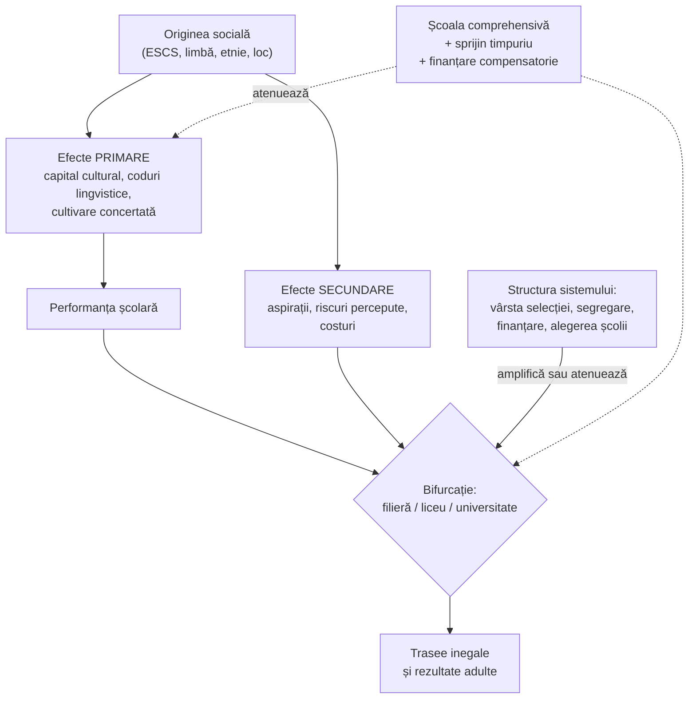

↑ [[00 Index - Analiza comparată internațională]]

> [!abstract] Pe scurt
> - **Echitatea în educație** înseamnă că rezultatele elevilor nu depind de factori pe care nu îi controlează (originea socială, etnia, limba, genul, locul nașterii) și că toți ating un **prag minim** de competență. OCDE distinge două componente: **corectitudinea** (*fairness*) și **incluziunea** (*inclusion*).
> - **Școala comprehensivă** (*comprehensive school*) este răspunsul structural: o **școală comună** pentru toți copiii până la 15–16 ani, fără selecție pe filiere după abilitate (*tracking*), cu curriculum comun ambițios și sprijin compensatoriu.
> - Sociologia a arătat că școala tinde să **reproducă** inegalitățile: prin familie și compoziția socială (Coleman, 1966), prin **capitalul cultural** (Bourdieu & Passeron), prin **codurile lingvistice** (Bernstein), prin **deciziile** diferite ale familiilor la momentele de bifurcație (Boudon), prin stilurile parentale (Lareau).
> - Economia comparată a arătat că **selecția timpurie crește inegalitatea** fără câștig clar de performanță medie (Hanushek & Woessmann, 2006); reformele comprehensive din **Suedia**, **Finlanda** și **Polonia** au crescut mobilitatea sau rezultatele elevilor dezavantajați.
> - **Comprehensivitatea formală nu garantează echitatea**: segregarea rezidențială, alegerea școlii, meditațiile și admiterea competitivă reintroduc selecția pe alte căi (Franța, Coreea, SUA, România).
> - Comparativ: **Finlanda, Estonia, Canada, Japonia** combină echitate și performanță; **Germania** e cazul clasic al selecției timpurii cu gradient social abrupt; **Singapore** trece de la *streaming* la clase mixte (2024); **Anglia** rămâne un hibrid.
> - Pentru **R. Moldova**: structura (gimnaziu comun până la clasa a IX-a) e comprehensivă, dar **decalajul rural–urban** (56 de puncte la științe în PISA 2025, aproape doi ani de școlarizare) și calitatea inegală a școlilor fac din echitatea teritorială problema principală.

---

## 1. Explicația teoriei

### 1.1 Întrebarea la care răspunde

*De ce elevii din familii diferite obțin rezultate diferite și ce poate face școala pentru a reduce aceste diferențe fără a sacrifica excelența?* În particular: *la ce vârstă și cum trebuie diferențiați elevii?*

### 1.2 Ideile centrale

1. **Egalitatea de șanse are mai multe sensuri.** Coleman (1968) a distins egalitatea de **acces**, de **resurse** și de **rezultate**. Politica modernă urmărește ca rezultatele să nu depindă de origine, nu ca toți să aibă aceleași rezultate.
2. **Școala nu e neutră.** Ea valorizează un anumit tip de limbaj, cultură și comportament, mai apropiat de cel al claselor mijlocii și superioare (Bourdieu, Bernstein). Ce pare „merit” e parțial moștenire.
3. **Momentele de bifurcație amplifică inegalitatea.** La fiecare alegere (tip de școală, filieră, liceu, universitate), familiile dezavantajate aleg mai prudent chiar la aceleași rezultate (efectele **secundare** ale lui Boudon).
4. **Selecția timpurie cristalizează inegalitățile.** La 10–11 ani, performanța reflectă mai ales mediul familial; separarea elevilor transformă diferențele sociale în trasee instituționale greu reversibile.
5. **Efectele de compoziție** (*peer effects*): elevii dezavantajați câștigă din școli socio-economic mixte; concentrarea sărăciei produce „școli-capcană”.
6. **Echitate și calitate nu sunt opuse.** OCDE (2012) arată că sistemele cele mai performante sunt, în general, și cele mai echitabile.
7. **Universalism + țintire** (*proportionate universalism*): servicii universale (masă, transport, educație timpurie), plus sprijin suplimentar proporțional cu nevoia.

### 1.3 Concepte-cheie

| Concept | Definiție |
|---|---|
| **Echitate** (*equity*) | rezultatele nu depind de circumstanțe personale sau sociale; toți ating un minim de competență (OCDE, 2012) |
| **Egalitate** (*equality*) | tratament sau resurse identice; poate fi inechitabilă când nevoile diferă |
| **Școală comprehensivă** | școală comună, neselectivă, pentru toți elevii dintr-o zonă, până la finalul secundarului inferior |
| ***Tracking* / *streaming*** | separarea elevilor în școli sau filiere diferite după abilitate/performanță (între școli) |
| ***Setting* / *ability grouping*** | gruparea pe niveluri **pe discipline**, în aceeași școală |
| **Gradient socio-economic** | panta relației dintre statutul socio-economic (ESCS în PISA) și scor; și proporția variației explicate |
| **Reziliență academică** | proporția elevilor dezavantajați care ajung în sfertul de top al performanței |
| **Capital cultural** | cunoștințe, gusturi, limbaj și diplome moștenite, valorizate de școală (Bourdieu) |
| **Coduri lingvistice** | codul **restrâns** (implicit, legat de context) vs. codul **elaborat** (explicit, universalist), cerut de școală (Bernstein) |
| **Efecte primare / secundare** | diferențe de performanță după origine / diferențe de alegere la aceeași performanță (Boudon) |
| **Cultivare concertată** (*concerted cultivation*) | stil parental al clasei mijlocii: activități organizate, negociere verbală, raport activ cu instituțiile, opus „creșterii naturale” (Lareau) |
| **Efecte de compoziție** | influența mediului socio-economic al colegilor asupra rezultatelor individuale |
| **Segregare școlară** | concentrarea elevilor cu anumite caracteristici (sociale, etnice, lingvistice) în anumite școli |
| **Inegalitate menținută la maxim / eficient** (MMI / EMI) | expansiunea unui nivel reduce inegalitatea doar după saturarea grupurilor privilegiate; apoi inegalitatea se mută în **calitatea** traseului (Raftery & Hout, 1993; Lucas, 2001) |

### 1.4 Ce presupune teoria despre actorii educației

| Actor | Poziția școlii selective | Poziția școlii comprehensive |
|---|---|---|
| **Elevul** | are o abilitate relativ stabilă, care poate fi identificată devreme | are potențial de dezvoltare; abilitatea depinde de oportunități |
| **Profesorul** | predă unui grup omogen | predă clase eterogene; diferențiază în clasă |
| **Cunoașterea** | curricula diferite pentru „destine” diferite | un curriculum comun, ambițios, pentru toți |
| **Școala** | sortează și pregătește pentru poziții sociale | integrează, compensează, amână orientarea |
| **Familia** | alege și investește | e sprijinită, dar nu poate cumpăra avantaj structural |

---

## 2. Geneza și evoluția

| Perioadă | Etapă | Repere |
|---|---|---|
| sec. XVII–XIX | **Precursori** | Comenius: „toți pe toți despre toate”; Condorcet: instrucțiune publică egală; **Horace Mann** (*common school*, SUA, anii 1840); școala populară nordică; Cygnaeus (Finlanda) |
| 1900–1945 | **Școala unică ca proiect politic** | *Einheitsschule* (Germania, Austria); *École unique* (Compagnons de l'Université nouvelle, Franța, 1918); dezbaterea britanică despre sistemul tripartit (Norwood, 1943; Butler Act, 1944) |
| 1945–1975 | **Valul comprehensiv** | experimentele suedeze (1949–1962) și *grundskola* (1962); Norvegia (1969); Italia (*scuola media unica*, 1962); **Anglia: Circular 10/65**; **Scoția** (1965); **Finlanda: legea din 1968, *peruskoulu* 1972–1977**; Franța: *collège unique* (1975); Husén și IEA (1958) |
| 1964–1980 | **Sociologia reproducerii** | **Raportul Coleman** (1966); Bourdieu & Passeron, *Les Héritiers* (1964), *La Reproduction* (1970); Bernstein, *Class, Codes and Control* (1971); Jencks, *Inequality* (1972); Boudon, *L'inégalité des chances* (1973); Bowles & Gintis (1976); Coreea: **egalizarea liceelor** (1974) |
| 1980–2000 | **Reacții și diversificare** | Black Papers și critica neoliberală; alegerea școlii (Anglia 1988, Suedia 1992); Oakes, *Keeping Track* (1985); abolirea grupării pe niveluri în Finlanda (1985); Spania LOGSE (1990); **Polonia: *gimnazjum* (1999)** |
| 2000–2015 | **Cotitura comparativ-empirică** | PISA (2000) face vizibil gradientul social („șocul PISA” german, 2001); **Hanushek & Woessmann (2006)**; Pfeffer (2008); Lareau, *Unequal Childhoods* (2003); **OCDE, *Equity and Quality in Education* (2012)**; pupil premium (Anglia, 2011); Reardon (2011) |
| 2015–2026 | **Echitate în criză multiplă** | imigrație și segregare; pandemia adâncește decalajele; Singapore: **Full SBB** (2024); Ontario: renunțarea la filiere în clasa a 9-a (2021–2022); Polonia desființează *gimnazjum* (2017–2019); PISA 2025: gradiente mici în Estonia, Finlanda, Canada; mari în Germania, România |

---

## 3. Autori, reprezentanți, cercetători

| Autor | Lucrare(ări), an | Aportul concret |
|---|---|---|
| **James S. Coleman** | *Equality of Educational Opportunity* (1966); „The Concept of Equality of Educational Opportunity” (1968) | studiul pe circa 600 000 de elevi: resursele școlii explică puțin față de **familie** și **compoziția socială**; argument pentru integrare; analiza conceptului de egalitate |
| **Christopher Jencks et al.** | *Inequality: A Reassessment of the Effect of Family and Schooling in America* (1972) | reformele școlare singure au efecte mici asupra inegalității de venit; rolul norocului și al factorilor extrașcolari |
| **Pierre Bourdieu & Jean-Claude Passeron** | *Les Héritiers* (1964); *La Reproduction* (1970) | **capitalul cultural**; școala transformă privilegiile sociale în „merit” și „talent”; „violența simbolică” |
| **Basil Bernstein** | *Class, Codes and Control*, vol. I (1971) | **codul restrâns vs. elaborat**; școala cere codul elaborat, familiar clasei mijlocii; ulterior „clasificare și încadrare” |
| **Raymond Boudon** | *L'inégalité des chances* (1973; trad. engl. 1974) | **efectele primare și secundare** ale originii sociale; modelul alegerii raționale la bifurcații |
| **Richard Breen & John Goldthorpe** | „Explaining Educational Differentials”, *Rationality and Society* (1997) | teoria **evitării relative a riscului** (*relative risk aversion*): familiile vor să evite declasarea |
| **Annette Lareau** | *Unequal Childhoods: Class, Race, and Family Life* (2003; ed. 2, 2011) | **cultivarea concertată** vs. **creșterea naturală**; mecanismul cotidian al transmiterii avantajului |
| **Torsten Husén** | evaluarea reformei comprehensive suedeze; cofondator IEA (1958) | primele dovezi comparative că amânarea selecției nu scade performanța medie |
| **Jeannie Oakes** | *Keeping Track: How Schools Structure Inequality* (1985) | tracking-ul intern din SUA reproduce inegalitățile rasiale și de clasă; curriculum mai sărac în filierele inferioare |
| **Eric Hanushek & Ludger Woessmann** | „Does Educational Tracking Affect Performance and Inequality? Differences-in-Differences Evidence across Countries”, *Economic Journal*, 116 (2006) | compară inegalitatea din primar (PIRLS) cu cea de la 15 ani (PISA): **tracking-ul timpuriu crește inegalitatea** și tinde să reducă performanța medie |
| **Fabian T. Pfeffer** | „Persistent Inequality in Educational Attainment and its Institutional Context”, *European Sociological Review*, 24(5) (2008) | sistemele cu **structuri stratificate și „fundături”** au transmitere intergenerațională mai mare a educației |
| **Herman van de Werfhorst & Jonathan Mijs** | *Annual Review of Sociology* (2010) | sinteză: stratificarea instituțională crește inegalitatea de rezultate; standardizarea poate o reduce |
| **Anna K. Chmielewski** | „The Global Increase in the Socioeconomic Achievement Gap, 1964 to 2015”, *American Sociological Review* (2019) | decalajele socio-economice de performanță au **crescut** în multe țări, pe 100 de țări și 50 de ani de date |
| **Sean Reardon** | „The Widening Academic Achievement Gap Between the Rich and the Poor” (2011) | în SUA, decalajul după venit a crescut cu 30–40% între cohortele 1975 și 2001, depășind decalajul rasial |
| **Costas Meghir & Mårten Palme** | „Educational Reform, Ability, and Family Background”, *American Economic Review* (2005) | reforma comprehensivă suedeză a crescut educația și veniturile copiilor din familii cu tați slab educați |
| **Tuomas Pekkarinen, Roope Uusitalo & Sari Kerr** | *Journal of Public Economics* (2009) | implementarea graduală a *peruskoulu* ca experiment natural: reforma a **redus elasticitatea intergenerațională a veniturilor** (mărimea exactă: de verificat) |
| **Maciej Jakubowski, Harry Patrinos, Emilio Porta & Jerzy Wiśniewski** | OECD Working Paper nr. 49 (2010); *Education Economics*, 24(6) (2016) | reforma poloneză din 1999 (amânarea selecției cu un an) a adus câștiguri mari la elevii care altfel ar fi mers în școli profesionale |
| **OCDE (Beatriz Pont, Simon Field, Małgorzata Kuczera)** | *No More Failures: Ten Steps to Equity in Education* (2007); ***Equity and Quality in Education*** (2012) | cinci recomandări: eliminarea repetenției, **evitarea selecției timpurii**, gestionarea alegerii școlii, finanțare după nevoi, trasee echivalente în secundarul superior; plus sprijin pentru școlile dezavantajate |
| **Pasi Sahlberg** | *Finnish Lessons* (2011) | școala comprehensivă ca **filosofie** a educației finlandeze |
| **Andy Green, John Preston & Jan Germ Janmaat** | *Education, Equality and Social Cohesion* (2006) | legătura dintre egalitatea educațională și coeziunea socială, comparativ |
| **François Dubet** | *L'école des chances* (2004) | limitele meritocrației școlare; echitatea ca prag comun garantat |
| **Diane Reay** | *Miseducation: Inequality, Education and the Working Classes* (2017) | experiența clasei muncitoare în școala engleză |
| **Kariya Takehiko** | *Education Reform and Social Class in Japan* (2013) | egalitarismul resurselor din Japonia a **ascuns** inegalitatea de clasă; „decalajul de motivație” |
| **Rucker Johnson** | *Children of the Dream* (2019) | desegregarea din SUA a avut efecte pozitive pe termen lung pentru copiii afro-americani, fără efecte negative pentru albi |

---

## 4. Legătura cu manualul și cu vaultul

- **[[8.2 Tendințele de organizare a sistemului de învățământ]]** — manualul discută democratizarea, prelungirea obligativității și flexibilizarea structurilor; **nu** discută explicit dilema tracking–comprehensivitate și dovezile comparative.
- **[[8.3 Sistemul de învățământ din Republica Moldova]]** — structura 4 + 5 + 3, gimnaziul obligatoriu fără concurs, liceul cu admitere prin concurs: selecția formală apare la 15–16 ani, ca în sistemele nordice. Manualul descrie structura, dar nu evaluează efectele ei asupra echității.
- **[[8.4 Sisteme alternative de organizare a instruirii]]** și [[8.5 Învățământul simultan]] — clasele simultane din școlile rurale mici sunt o problemă de echitate teritorială.
- **[[9.4 Factorii dezvoltării personalității și factorii educativi]]** — mediul social și familia ca factori ai dezvoltării; manualul are cadrul, dar îi lipsește sociologia reproducerii (Bourdieu, Bernstein, Boudon).
- **[[7.2.1 Educația pentru participare și democrație]]** — școala comună ca spațiu al coeziunii democratice.
- **[[2.3 Funcțiile generale ale educației]]** — funcția socială: integrare vs. selecție; tensiunea nu e problematizată în manual.
- **[[Modulul 09 - Agenții educației și factorii dezvoltării]]** — familia ca agent educativ și ca sursă de inegalitate (capital cultural, cultivare concertată).
- **[[Educația incluzivă]]** (card înrudit) tratează echitatea din perspectiva elevilor cu CES; cardul de față se ocupă de inegalitatea socială și structurală.

---

## 5. Implementare comparată

### 5.1 Tabel

| Sistem | Cum a fost implementată | Când | Scară / intensitate | Dovezi sau rezultate |
|---|---|---|---|---|
| **Singapore** | *streaming* în primar și secundar după Raportul Goh; eliminarea streamingului în primar și *Subject-Based Banding* (2008); **Full SBB**: clase mixte, discipline la niveluri G1–G3; certificat unic SEC; FAS, Edusave, UPLIFT, sprijin pentru 157 de școli | 1980; 2008; **2024**; SEC 2027 | **medie** (de la selecție puternică spre comprehensivitate parțială) | gradient ESCS stabil 2012–2022 (decalaj de 112 puncte în 2022); selecția prin PSLE la 12 ani rămâne; efectele Full SBB neevaluate independent; „parentocrație” |
| **Estonia** | **școala de bază unitară** de 9 ani (*põhikool*), fără tracking până la 15–16 ani; repetenție rară; prânz și manuale gratuite; finanțare per clasă pentru școlile rurale; Rajaleidja; tranziția școlilor rusofone la estonă | 1992–2010; prânz 2006/2014; tranziția 2024–2033 | **centrală** | ESCS explică 6,2% din variația la citire (2018) și ~10% la științe (2025); decalaj avantajați–dezavantajați de 68 de puncte (2025); **decalaj estonă–rusă 31–40 de puncte**; decalajul la matematică a crescut 2012–2022 |
| **Finlanda** | legea din 1968; ***peruskoulu*** implementată de la nord la sud; abolirea grupării pe niveluri (1985); servicii universale; sprijin timpuriu; obligativitate și gratuitate până la 18 ani | 1972–1977; 1985; 2021 | **centrală** | experiment natural: creșterea mobilității intergeneraționale (Pekkarinen et al.); variație între școli printre cele mai mici din lume; dar gradientul a crescut, decalaj foarte mare pentru imigranți (−88 de puncte la științe, 2025), clase cu profil și segregare urbană |
| **Regatul Unit** | **Circular 10/65** (Anglia); comprehensivizare aproape totală în **Scoția**; *grammar schools* păstrate în unele zone; selecția la 11 ani în **Irlanda de Nord**; *pupil premium*; *Pupil Equity Funding* (Scoția) | 1965–1980; 2011; 2017 | **medie** (hibrid) | ESCS explică 11% (2022) și 8,5% (2025) — sub media OCDE; decalajul de dezavantaj la GCSE s-a redus modest până în 2019, apoi s-a lărgit; școlile private (circa 6% dintre elevi) domină elitele |
| **Japonia** | școală obligatorie de 9 ani fără tracking și fără repetenție; **norme naționale de personal** (1958) și cofinanțarea salariilor; rotația profesorilor; selecția prin examen la 15 ani (ierarhia *hensachi*) | 1947; 1958 | **centrală** în obligatoriu, **selectivă** după 15 ani | echitate peste media OCDE (8% din variație explicată de ESCS în 2025); inegalitatea se mută în *juku* și în stratificarea liceelor (Kariya, Bjork) |
| **Coreea de Sud** | desființarea examenelor de admitere în gimnaziu (1969) și **egalizarea liceelor** prin loterie pe districte (1974); rotația profesorilor; gratuitatea gimnaziului și liceului | 1969; **1974**; 2002–2004; 2019–2021 | **centrală**, cu oscilații (licee autonome) | ESCS la nivelul mediei OCDE (13% în 2022), nu excepțional; decalaj lărgit în anii 2000 (Byun & Kim, 2010); competiția mutată în meditații și piața imobiliară |
| **Canada** | trunchi comun până la 15–16 ani; integrarea imigranților în școli obișnuite cu sprijin lingvistic; **Ontario renunță la filiere** în clasa a 9-a | tradițional; de-streaming 2021–2022 | **centrală** | ESCS explică **6%** din variația la științe (2025; OCDE 12%); imigranții fără dezavantaj (parțial efect de selecție a imigrației); unul dintre cele 7 sisteme cu excelență + echitate + incluziune (OCDE, 2026) |
| **Europa** (UE; modele naționale) | valul comprehensiv (Suedia, Norvegia, Italia, Franța, Spania); **Polonia: *gimnazjum*** (1999–2017); sistemul german cu selecție la 10 ani; recomandarea *Pathways to School Success* (2022); Garanția pentru copii (2021) | 1962–1990; 1999; 2021–2022 | **variabilă** | PISA 2025: ESCS 19% în Germania (decalaj 125 de puncte), 21,7% în România; 9–10% în Estonia și Finlanda; Polonia: câștiguri după 1999 (Jakubowski et al.) |
| **SUA** | *common schools* (Mann); ***Brown v. Board*** (1954) și desegregarea; Title I (1965); **Raportul Coleman**; liceul comprehensiv cu tracking intern; litigii și formule de finanțare compensatorie | 1840; 1954; 1965–1966; 1971–2019 | **medie** și fragmentată | desegregare reală 1968–1988, apoi resegregare; efecte pozitive ale desegregării (Johnson, 2019) și ale finanțării (Jackson et al., 2016); gradient ESCS peste media OCDE; decalajul după venit în creștere (Reardon) |
| **Republica Moldova** | gimnaziu obligatoriu comun (cl. V–IX), admitere în liceu prin concurs; **reforma rețelei** (licee teoretice separate de gimnazii, școli de circumscripție); finanțare per elev (2013); școli cu predare în română și în rusă; educație incluzivă (2011–2020) | Codul Educației 2014; optimizarea rețelei 2010–prezent | **medie** structural, **redusă** ca eficacitate compensatorie | PISA 2025: ESCS explică **13,4%** din variația la științe (OCDE 11,6%); decalaj avantajați–dezavantajați 84 de puncte; **decalaj rural–urban 56 de puncte la științe și 55 la citire** (51 și 57 în 2022); decalajul dintre școlile cu predare în română și în rusă: de verificat în raportul ANCE |

*Surse*: notele de țară din vault; OCDE, *PISA 2025 Results (Volume I)*, tab. I.2 (prin nota Europa); ANCE / Realitatea.md pentru decalajul rural–urban din R. Moldova.

### 5.2 Studiu de caz: Finlanda — *peruskoulu* ca experiment natural

→ [[Finlanda - ecosistemul educațional]]

**Reforma.** Până în anii 1970, copiii finlandezi erau separați la 10–11 ani între școala populară (*kansakoulu*) și școala gramaticală (*oppikoulu*), adesea privată și cu taxe. Legea din 1968 a creat o **școală comună de 9 ani**, municipală. Implementarea a fost **graduală, de la nord (Laponia) la sud (Helsinki)**, între 1972 și 1977, însoțită de formarea obligatorie a tuturor profesorilor și de un curriculum național. Gruparea pe niveluri la matematică și limbi a fost abolită în 1985.

**Dovada cauzală.** Pentru că regiunile au trecut la noul sistem în ani diferiți, cohortele vecine au fost expuse diferit. Pekkarinen, Uusitalo & Kerr (2009) au folosit acest calendar ca **experiment natural** și au arătat că reforma a **redus corelația dintre veniturile părinților și cele ale copiilor**, fără efecte negative asupra rezultatelor medii la testele armatei.

**Limite.** (1) Creșterea rezultatelor finlandeze a început înainte ca reforma să-și producă toate efectele, iar factorii culturali au contat (Sahlgren, 2015). (2) După 2012, gradientul social a crescut, iar segregarea urbană și clasele cu profil reintroduc selecția informală. (3) Decalajul pentru elevii imigranți e unul dintre cele mai mari din Europa. **Lecția**: structura comprehensivă e **necesară, dar nu suficientă**; ea trebuie întreținută prin politici de locuire, alegere a școlii și sprijin lingvistic.

### 5.3 Studiu de caz: Polonia — amânarea selecției cu un an (1999)

→ [[Europa - spațiul european al educației]]

**Reforma.** În 1999, Polonia a înlocuit școala primară de 8 ani urmată de selecție (licee generale vs. școli profesionale de bază) cu structura **6 + 3 + 3**: școală primară de 6 ani, ***gimnazjum*** comun de 3 ani și abia apoi separarea. Selecția a fost astfel **amânată cu un an** (de la 15 la 16 ani), iar elevii au primit un an în plus de curriculum academic comun. Reforma a inclus și examene externe standardizate și o nouă curriculă.

**Dovezile.** Polonia a urcat semnificativ în PISA între 2000 și 2012 (la citire, de la sub media OCDE la peste). Jakubowski et al. (2010, 2016) au comparat elevii din cohortele dinainte și de după reformă și au arătat câștiguri mari tocmai la **elevii care, în sistemul vechi, ar fi fost orientați spre școlile profesionale**. În PISA 2025, Polonia rămâne peste media OCDE (495 la științe), cu un gradient apropiat de medie (11,3%).

**Controversa.** Reforma a fost **desființată** în 2017 (cu eliminarea gimnaziilor până în 2019) de un guvern care a revenit la structura 8 + 4. Efectele revenirii sunt încă în curs de evaluare. Cazul arată atât **forța dovezilor** (o schimbare de structură relativ mică a avut efecte mari), cât și **fragilitatea politică** a reformelor de echitate.

### 5.4 Studiu de caz: Singapore — de la *streaming* la Full SBB

→ [[Singapore - ecosistemul educațional]]

**Contextul.** Raportul Goh (1979) a diagnosticat abandon masiv și a introdus **streaming-ul** (1980): elevii erau împărțiți din primar în fluxuri după ritmul „potrivit abilității”. Abandonul a scăzut, dar fluxurile inferioare (Normal Technical) au concentrat elevi din familii sărace și din anumite grupuri etnice, cu **etichetare** și aspirații reduse.

**Trecerea graduală.** 2008: fără streaming în primar, *Subject-Based Banding* la P5–P6. 2014–2020: pilotarea SBB în secundar. **2024: Full SBB** — fluxurile Express/Normal dispar; elevii învață în **clase mixte** la formă, CCE, arte, sport și urmează fiecare disciplină la un nivel (G1, G2, G3), cu mobilitate ascendentă. 2027: certificat unic.

**Evaluare.** Full SBB este o corecție importantă, dar **nu comprehensivizare nordică**: gruparea pe discipline rămâne grupare pe abilități, iar PSLE la 12 ani distribuie elevii în școli de prestigiu diferit. Singapore ilustrează drumul unui sistem **eficient-selectiv** spre echitate, cu păstrarea mizei meritocratice.

### 5.5 Studiu de caz: SUA — de la *Brown v. Board* la Raportul Coleman

→ [[SUA - ecosistemul educațional]]

***Brown v. Board of Education*** (1954) a declarat neconstituțională segregarea rasială „separată, dar egală”. *Civil Rights Act* (1964) a cerut un studiu despre inegalitatea oportunităților: rezultatul a fost **Raportul Coleman** (1966), care a surprins: diferențele de resurse între școli explicau puțin din rezultate, comparativ cu familia și **compoziția socială** a școlii. A fost citit greșit ca „școala nu contează” și corect ca argument pentru **integrare**.

Desegregarea a progresat între 1968 și 1988, apoi *Milliken v. Bradley* (1974) a blocat soluțiile care treceau granițele districtelor, iar „*white flight*” și segregarea rezidențială au readus segregarea școlară. Finanțarea prin impozitul local pe proprietate leagă resursele de valoarea cartierului; litigiile statale au produs formule compensatorii, cu efecte pozitive dovedite (Jackson, Johnson & Persico, 2016). SUA arată că **o școală formal comună poate fi profund inechitabilă** dacă segregarea teritorială și finanțarea locală nu sunt corectate.

---

## 6. Dovezi empirice și critici

### 6.1 Dovezi-cheie

| Întrebare | Dovezi | Concluzie prudentă |
|---|---|---|
| **Crește selecția timpurie inegalitatea?** | Hanushek & Woessmann (2006); Pfeffer (2008); Van de Werfhorst & Mijs (2010); PISA 2025 (Germania, Austria, Slovacia, Ungaria vs. țările nordice și baltice) | **da**, dovezi convergente, cvasi-experimentale |
| **Scade comprehensivitatea performanța medie?** | Hanushek & Woessmann (2006): efect negativ al tracking-ului timpuriu asupra mediei, dar mai puțin robust; Polonia, Suedia, Finlanda | **nu** există dovezi că ar scădea media; unele reforme au crescut-o |
| **Beneficiază elevii dezavantajați?** | Meghir & Palme (2005); Pekkarinen et al. (2009); Jakubowski et al. (2016) | **da**, câștigurile se concentrează la elevii din familii slab educate |
| **Gruparea pe niveluri în aceeași școală** | meta-analize (Hattie; Steenbergen-Hu et al., 2016): efecte mici în medie, **negative** pentru grupele inferioare dacă primesc curriculum mai sărac | contează **ce se predă** în grupe, nu doar gruparea |
| **Efectele de compoziție** | Coleman (1966); studii ulterioare cu rezultate variabile | efecte reale, dar greu de separat de selecție |
| **Contează banii pentru echitate?** | Jackson et al. (2016); pupil premium (efecte modeste) | da, dacă sunt țintiți și cheltuiți pe profesori și timp de instruire |
| **Alegerea școlii** | Suedia (Böhlmark & Lindahl, 2015): efecte mici pozitive, segregare mai mare; Chile, Coreea (licee autonome) | tinde să **crească segregarea** fără câștiguri mari de performanță |
| **Tendința globală** | Chmielewski (2019): decalajul socio-economic a crescut în multe țări | echitatea nu e un câștig permanent, trebuie reconstruită |

> [!warning] Critică — limite, controverse, condiții
> 1. **Comprehensivitate formală vs. reală**: Franța are *collège unique*, dar un gradient abrupt (13,5%; 100 de puncte) din cauza segregării rezidențiale și a traseelor informale. România are trunchi comun până la clasa a VIII-a, dar cel mai abrupt gradient din UE (21,7%) prin segregare teritorială și admiterea competitivă.
> 2. **„Nivelare în jos”**: criticii conservatori (Black Papers; unele analize despre Scoția și Țara Galilor) susțin că echitatea poate fi obținută prin scăderea elevilor buni. PISA 2025 arată că în Finlanda și Canada o parte din reducerea decalajelor vine din **scăderea elevilor avantajați** — un avertisment real.
> 3. **Diferențierea în clasa eterogenă** e dificilă; fără profesori pregătiți și sprijin (profesori de sprijin, grupuri mici), clasele mixte pot dezavantaja atât elevii slabi, cât și pe cei avansați.
> 4. **Excelența și elevii dotați**: sistemele comprehensive trebuie să ofere provocare pentru performerii de top (Singapore 2026: programe școlare pentru elevii dotați în locul GEP centralizat).
> 5. **Reproducerea e mai profundă decât structura** (Bourdieu, Lareau): capitalul cultural se transmite prin familie, meditații, activități extrașcolare, rețele. Structura atenuează, nu anulează.
> 6. **Educația profesională**: sistemele duale (Germania, Elveția) au tranziție bună spre muncă; echitatea depinde de **permeabilitatea** traseelor și de absența „fundăturilor” (Pfeffer).
> 7. **Condiții în care funcționează**: curriculum comun ambițios, profesori bine formați în diferențiere, sprijin timpuriu, finanțare compensatorie, control al segregării, trasee secundare echivalente. **Nu funcționează** când școala comună e subfinanțată, iar familiile avantajate ies din sistem (privat, meditații, mutare).

---

## 7. Implicații practice

> [!tip] Pentru profesor la clasă
> - **Așteptări înalte pentru toți**: evitați „profeția autoîmplinită” a etichetării (efectul Pygmalion; clasele „slabe”). Gruparea flexibilă, temporară, pe sarcini, e preferabilă grupelor fixe.
> - **Faceți explicit codul elaborat** (Bernstein): predați vocabularul academic, criteriile de reușită, modul de a scrie o argumentare; nu presupuneți că elevii „știu de acasă”.
> - **Compensați capitalul cultural**: lecturi, vizite, proiecte, acces la resurse în școală pentru elevii care nu le au acasă.
> - **Sprijin timpuriu** la citire și matematică în primele clase; monitorizarea elevilor care rămân în urmă, înainte de a se acumula decalajul.
> - **Orientare școlară activă** la bifurcații (clasa a IX-a): informați familiile dezavantajate despre toate traseele și despre randamentul lor (efectele secundare ale lui Boudon).
> - Relația cu familia: comunicare adaptată familiilor care nu practică „cultivarea concertată”, inclusiv celor cu părinți plecați peste hotare.

> [!tip] Pentru politica educațională din R. Moldova
> 1. **Echitatea teritorială ca prioritate numărul unu**: decalajul rural–urban de 55–56 de puncte (aproape doi ani de școlarizare după convenția PISA) cere **profesori calificați în școlile rurale** (salarii diferențiate, locuințe, transport, mentorat), nu doar optimizarea rețelei.
> 2. **Finanțare compensatorie** în formula per elev: coeficienți pentru sărăcie, pentru copiii cu părinți emigrați, pentru școlile mici izolate (modelul estonian „per clasă”).
> 3. **Gimnaziul ca școală comprehensivă de calitate**: curriculum comun ambițios până în clasa a IX-a; evitarea concentrării elevilor buni în „licee de elită” încă din gimnaziu.
> 4. **Admiterea în liceu**: monitorizarea profilului social al admișilor; trasee echivalente și permeabile între liceu și învățământul profesional tehnic, fără „fundături”.
> 5. **Școlile cu predare în limba rusă și minoritățile**: date publice despre decalaje; întărirea predării limbii române ca limbă a doua și a predării integrate conținut–limbă, **fără** a transfera mecanic modelul estonian (vezi nota de țară).
> 6. **Educație timpurie universală** pentru copiii din mediul rural și din familii vulnerabile (efecte primare).
> 7. **Controlul meditațiilor și al segregării**: evaluări naționale diagnostice care să nu stimuleze clasamente și presiune comercială.

---

## 8. Legături cu alte teorii din catalog

- [[Educația incluzivă]] — echitatea pentru elevii cu CES și minorități; aceeași logică a școlii comune care se adaptează.
- Diferențierea, inteligențele multiple și designul universal — condiția pedagogică a școlii comprehensive: diferențierea în clasa eterogenă, nu separarea.
- [[Capitalul uman și economia educației]] — dezbaterea eficiență–echitate; Hanushek & Woessmann arată că echitatea și performanța nu sunt opuse.
- Educația timpurie — cea mai eficientă intervenție asupra efectelor primare ale originii sociale.
- [[Responsabilizare, piață și încredere în guvernarea educației]] — alegerea școlii și piața tind să crească segregarea; responsabilizarea poate face vizibile decalajele.
- [[Pedagogia critică și educația pentru cetățenie]] — Freire și sociologia critică împărtășesc diagnosticul reproducerii.
- [[Învățarea deplină (mastery learning)]] — ideea că aproape toți elevii pot atinge standarde înalte cu timp și sprijin adecvat e fundamentul pedagogic al școlii comprehensive.
- [[Profesionalismul cadrului didactic]] — distribuția profesorilor buni între școli e un mecanism central al echității (rotația din Japonia și Coreea).
- [[Tradiția Bildung-Didaktik și tradiția Curriculum]] — *Einheitsschule* și *Bildung* pentru toți, în tensiune cu selecția germană.
- [[Constructionismul și educația digitală]] — fractura digitală de acces și de utilizare.
- [[Învățarea pe tot parcursul vieții și formele educației]] — efectul Matei în educația adulților prelungește inegalitățile școlare.

---

## 9. Întrebări de reflecție

1. Explicați diferența dintre **efectele primare** și **secundare** ale originii sociale (Boudon) cu un exemplu din admiterea la liceu în R. Moldova. Ce politică ar acționa asupra fiecărui tip?
2. De ce Raportul Coleman a fost interpretat ca „școala nu contează”? Este corectă această interpretare? Ce a arătat cercetarea ulterioară (Chetty, Jackson)?
3. Polonia a obținut câștiguri amânând selecția cu un singur an. De ce ar putea un an de curriculum comun să conteze atât de mult pentru elevii orientați spre școlile profesionale?
4. R. Moldova are o structură comprehensivă până la clasa a IX-a, dar un decalaj rural–urban de aproape doi ani de școlarizare. Este sistemul moldovenesc „comprehensiv” în sens real? Argumentați folosind cazurile Franței și României.
5. Cum ar arăta o clasă „comprehensivă” bine condusă? Descrieți trei practici de diferențiere care evită etichetarea elevilor.
6. Full SBB (Singapore) și de-streaming (Ontario) sunt reforme recente. Ce indicatori ați folosi pentru a le evalua peste cinci ani?

---

## 10. Surse

### Lucrări fundamentale
- Coleman, J. S., et al. (1966). *Equality of Educational Opportunity*. Washington, DC: U.S. Government Printing Office.
- Coleman, J. S. (1968). The concept of equality of educational opportunity. *Harvard Educational Review*, 38(1), 7–22.
- Jencks, C., et al. (1972). *Inequality: A Reassessment of the Effect of Family and Schooling in America*. Basic Books.
- Bourdieu, P., & Passeron, J.-C. (1964). *Les Héritiers: les étudiants et la culture*. Minuit; (1970). *La Reproduction*. Minuit.
- Bernstein, B. (1971). *Class, Codes and Control, Vol. 1*. Routledge & Kegan Paul.
- Boudon, R. (1973). *L'inégalité des chances*. Armand Colin (engl. *Education, Opportunity, and Social Inequality*, Wiley, 1974).
- Breen, R., & Goldthorpe, J. H. (1997). Explaining educational differentials: Towards a formal rational action theory. *Rationality and Society*, 9(3), 275–305.
- Lareau, A. (2003/2011). *Unequal Childhoods: Class, Race, and Family Life*. University of California Press.
- Oakes, J. (1985/2005). *Keeping Track: How Schools Structure Inequality*. Yale University Press.
- Raftery, A. E., & Hout, M. (1993). Maximally maintained inequality. *Sociology of Education*, 66(1); Lucas, S. R. (2001). Effectively maintained inequality. *American Journal of Sociology*, 106(6).

### Dovezi comparative și cauzale
- Hanushek, E. A., & Woessmann, L. (2006). Does educational tracking affect performance and inequality? Differences-in-differences evidence across countries. *Economic Journal*, 116(510), C63–C76.
- Pfeffer, F. T. (2008). Persistent inequality in educational attainment and its institutional context. *European Sociological Review*, 24(5), 543–565.
- Van de Werfhorst, H. G., & Mijs, J. J. B. (2010). Achievement inequality and the institutional structure of educational systems. *Annual Review of Sociology*, 36, 407–428.
- Chmielewski, A. K. (2019). The global increase in the socioeconomic achievement gap, 1964 to 2015. *American Sociological Review*, 84(3), 517–544.
- Meghir, C., & Palme, M. (2005). Educational reform, ability, and family background. *American Economic Review*, 95(1), 414–424.
- Pekkarinen, T., Uusitalo, R., & Kerr, S. (2009). School tracking and intergenerational income mobility: Evidence from the Finnish comprehensive school reform. *Journal of Public Economics*, 93(7–8), 965–973.
- Jakubowski, M., Patrinos, H. A., Porta, E. E., & Wiśniewski, J. (2016). The effects of delaying tracking in secondary school: Evidence from the 1999 education reform in Poland. *Education Economics*, 24(6), 557–572.
- Reardon, S. F. (2011). The widening academic achievement gap between the rich and the poor. În G. Duncan & R. Murnane (eds.), *Whither Opportunity?* Russell Sage.
- Jackson, C. K., Johnson, R. C., & Persico, C. (2016). The effects of school spending on educational and economic outcomes. *Quarterly Journal of Economics*, 131(1), 157–218.
- Johnson, R. C. (2019). *Children of the Dream: Why School Integration Works*. Basic Books.
- Böhlmark, A., & Lindahl, M. (2015). Independent schools and long-run educational outcomes: Evidence from Sweden's large-scale voucher reform. *Economica*, 82(327), 508–551.
- Byun, S., & Kim, K. (2010). Educational inequality in South Korea: The widening socioeconomic gap in student achievement. *Research in the Sociology of Education*, 17, 155–182.

### Rapoarte internaționale
- OECD (2007). *No More Failures: Ten Steps to Equity in Education*. https://doi.org/10.1787/9789264032606-en
- OECD (2012). *Equity and Quality in Education: Supporting Disadvantaged Students and Schools*. https://doi.org/10.1787/9789264130852-en
- OECD (2026). *PISA 2025 Results (Volume I)*; OECD (2023). *PISA 2022 Results (Volume I)*. https://doi.org/10.1787/53f23881-en
- Council of the EU (2022). *Council Recommendation on Pathways to School Success* (2022/C 469/01).
- Green, A., Preston, J., & Janmaat, J. G. (2006). *Education, Equality and Social Cohesion*. Palgrave Macmillan.
- Sahlberg, P. (2011/2021). *Finnish Lessons*. Teachers College Press.
- Kariya, T. (2013). *Education Reform and Social Class in Japan*. Routledge.
- Reay, D. (2017). *Miseducation: Inequality, Education and the Working Classes*. Policy Press.

### Surse de țară
- Notele din vault: [[Finlanda - ecosistemul educațional]], [[Estonia - ecosistemul educațional]], [[Singapore - ecosistemul educațional]], [[Coreea de Sud - ecosistemul educațional]], [[Japonia - ecosistemul educațional]], [[Regatul Unit - ecosistemul educațional]], [[Canada - ecosistemul educațional]], [[SUA - ecosistemul educațional]], [[Europa - spațiul european al educației]].
- Agenția Națională pentru Curriculum și Evaluare (ANCE) (2023). *Republica Moldova în testarea PISA 2022*. https://ance.gov.md/sites/default/files/raport_pisa_2022_1.pdf
- Realitatea.md (2026). *PISA 2025: Elevii din mediul rural, cu până la 56 de puncte în urma celor din orașe*. https://realitatea.md/pisa-2025-elevii-din-mediul-rural-cu-pana-la-56-de-puncte-in-urma-celor-din-orase/
- Codul Educației al Republicii Moldova nr. 152/2014.
