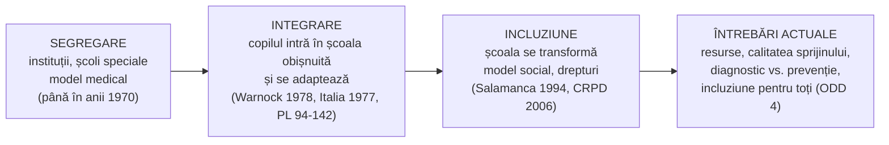
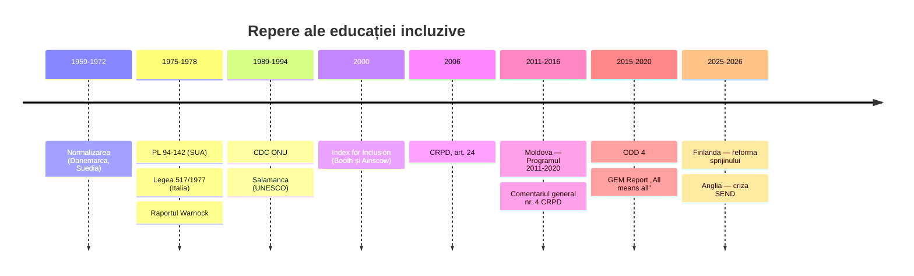

↑ [[00 Index - Analiza comparată internațională]] · [[00 MOC - Fundamentele științelor educației]]

> [!abstract] Pe scurt
> 1. **Educația incluzivă** (*inclusive education*) este principiul și practica prin care **toți copiii** învață împreună în școala comunității, iar **școala se schimbă** ca să răspundă diversității. Nu copilul trebuie „pregătit” pentru școală.
> 2. Istoric s-au succedat trei paradigme: **segregare** (instituții și școli speciale) → **integrare** (copilul intră în clasa obișnuită, dar trebuie să se adapteze) → **incluziune** (sistemul se transformă: curriculum, pedagogie, evaluare, clădiri, atitudini).
> 3. Reperele normative sunt **Raportul Warnock** (1978, conceptul de *special educational needs*), **Declarația de la Salamanca** (UNESCO, 1994), **Convenția ONU privind drepturile persoanelor cu dizabilități** (CRPD, 2006, **art. 24**) și **ODD 4** (2015).
> 4. Fundamentul teoretic este **modelul social al dizabilității** (Oliver): dizabilitatea este produsă de **barierele** mediului, nu doar de deficiența individuală. Continuatorii sunt Ainscow și Booth (*Index for Inclusion*), Florian (pedagogia incluzivă) și Slee (critica „școlii neregulate”).
> 5. Implementările diferă mult. **Italia** a desființat clasele speciale încă din 1977. **New Brunswick** (Canada) practică incluziunea completă. **Finlanda** prevede **educație specială cu normă parțială** fără diagnostic. **Anglia** și **SUA** au sisteme **juridic-individuale** (EHCP, IEP), costisitoare și litigioase. **Japonia** și **Coreea** păstrează un sector special mare.
> 6. **Dovezile** arată efecte **neutre spre ușor pozitive** asupra colegilor fără CES (Szumski et al., 2017: **d = 0,12**) și efecte în general pozitive pentru elevii cu CES. Efectele depind de **resurse, pregătirea profesorilor și tipul nevoilor**.
> 7. Principalul risc, semnalat peste tot, este **„incluziunea fără resurse”**: plasarea fizică în clasă, fără sprijin real.
> 8. **R. Moldova** a trecut de la un sistem rezidențial masiv la un sistem cu **cadre didactice de sprijin**, **centre de resurse**, **SAP** și **CRAP**, pe baza Programului 2011–2020 și a **Codului Educației (art. 32–35, 129)**. Problemele actuale sunt finanțarea (≈ 2% din bugetul raional al educației) și calitatea sprijinului.

---

## 1. Explicația teoriei

### 1.1 Întrebarea la care răspunde

**Cine are dreptul să învețe în școala comună și cine trebuie să se adapteze: copilul sau școala?** Educația incluzivă răspunde: **fiecare copil**, iar **școala** e cea care se adaptează. Întrebările derivate sunt:
- Cum organizăm predarea ca să fie accesibilă tuturor **din start**, nu prin excepții?
- Ce sprijin suplimentar e necesar, cine îl oferă și unde (în clasă sau în afara ei)?
- Cum împăcăm **dreptul la educație în mediul comun** cu **dreptul la educație adecvată**?

### 1.2 Ideile centrale

1. **Educația ca drept al omului**, nu ca favoare sau serviciu medical (CRPD, art. 24).
2. **Diversitatea este normalitatea**. Clasa „omogenă” e o ficțiune, iar variația e punctul de plecare al proiectării didactice.
3. **Mutarea problemei de la copil la sistem**: dificultățile de învățare apar din **interacțiunea** dintre copil și un curriculum, o pedagogie și un mediu rigide.
4. **Incluziunea nu se reduce la dizabilitate**. În sens larg, privește toți elevii expuși riscului de marginalizare: săraci, minorități etnice (romi), migranți, copii cu altă limbă maternă, copii rămași fără îngrijire părintească.
5. **Proces, nu stare finală**. Ainscow o descrie ca o căutare continuă a modalităților de a răspunde diversității.
6. **Participare + prezență + reușită**. Nu ajunge ca elevul să fie **prezent** fizic; el trebuie să **participe** și să **progreseze** (Ainscow, Booth și Dyson, 2006).

### 1.3 Concepte-cheie

| Concept | Definiție |
|---|---|
| **Segregare** | educația copiilor cu dizabilități în instituții separate (școli speciale, internate, școli auxiliare), cu curriculum propriu |
| **Integrare** (*mainstreaming*, *integrazione*) | plasarea copilului cu CES în școala obișnuită, cu sprijin, fără schimbarea fundamentală a școlii; copilul se adaptează |
| **Incluziune** | transformarea culturii, politicilor și practicilor școlii pentru a răspunde tuturor elevilor |
| **Cerințe educaționale speciale (CES)** (*special educational needs*) | nevoi de sprijin suplimentar în învățare, definite **educațional**, nu medical (Warnock, 1978); în R. Moldova, termen legal din Codul Educației |
| **Modelul medical al dizabilității** | dizabilitatea = deficiență individuală care trebuie diagnosticată, tratată și „corectată” |
| **Modelul social al dizabilității** | dizabilitatea = rezultatul **barierelor** fizice, instituționale și atitudinale care exclud persoanele cu deficiențe |
| **Mediul cel mai puțin restrictiv** (*least restrictive environment*, LRE) | principiul american: copilul învață cât mai mult posibil alături de colegii fără dizabilități |
| **Adaptare rezonabilă** (*reasonable accommodation*) | modificări necesare și potrivite, fără sarcină disproporționată, pentru exercitarea drepturilor (CRPD, art. 2) |
| **Plan educațional individualizat** (PEI; engl. IEP) | document care stabilește obiectivele, adaptările și serviciile pentru un elev |
| **Cadru didactic de sprijin** | specialist care acordă asistență psihopedagogică elevilor cu CES în școala generală (Codul Educației, art. 3 și art. 33 alin. 7) |
| **Sprijin pe niveluri** (*tiered support*, RTI/MTSS) | sprijin **gradual**: general pentru toți → intensificat pentru grupuri → individual/special |
| **Designul universal pentru învățare** (UDL) | proiectarea lecției cu **mijloace multiple** de reprezentare, acțiune și implicare, ca să reducă nevoia de adaptări ulterioare → Diferențierea, inteligențele multiple și designul universal |
| **Dilema diferenței** (*dilemma of difference*, Norwich; Minow) | a trata elevul **la fel** riscă să-i ignore nevoile, iar a-l trata **diferit** riscă să-l stigmatizeze |
| **Pedagogia incluzivă** (Florian) | extinderea a ceea ce e **disponibil în mod obișnuit** pentru toți, în loc de a oferi ceva „diferit” doar unora |

### 1.4 Ce presupune despre elev, profesor, cunoaștere și școală

| Dimensiune | Presupoziția incluzivă |
|---|---|
| **Elevul** | fiecare copil este **educabil** (vezi [[9.4 Factorii dezvoltării personalității și factorii educativi]]); diferențele sunt **resurse**; capacitatea de învățare **nu e fixă** (Florian: respingerea „abilității fixe”) |
| **Profesorul** | responsabil pentru **toți** elevii din clasă, nu doar pentru „majoritatea medie”; colaborează cu specialiști; se formează continuu |
| **Cunoașterea** | curriculumul are **niveluri multiple de acces**; evaluarea măsoară progresul individual, nu doar poziția față de normă |
| **Școala** | comunitate care învață; se evaluează după **barierele** pe care le elimină (*Index for Inclusion*: culturi, politici, practici) |

> [!note] Distincția integrare / incluziune
> În limbajul curent (inclusiv în R. Moldova), cele două se confundă adesea. **Integrarea** păstrează școala neschimbată și „inserează” copilul. **Incluziunea** cere schimbarea școlii. O clasă cu un copil cu CES care stă în ultima bancă, cu o fișă separată și fără contact cu colegii, este **integrare fizică**, nu incluziune.

---

## 2. Geneza și evoluția

### 2.1 Precursori (sec. XVIII–XIX)

- **Charles-Michel de l'Épée** (Paris, anii 1760) — prima școală publică pentru surzi, cu limbajul semnelor.
- **Valentin Haüy** (Paris, 1784) — Institutul pentru tineri nevăzători; aici a studiat **Louis Braille** (alfabetul Braille, 1829).
- **Jean Itard** — educarea lui Victor din Aveyron (1801); **Édouard Séguin** — educația copiilor cu dizabilitate intelectuală (1846).
- **Maria Montessori** și-a început activitatea cu copii cu dizabilități intelectuale la Roma (în jurul anului 1900), înainte de *Casa dei Bambini* (→ [[8.4 Sisteme alternative de organizare a instruirii]]).
- Sec. XIX–XX: expansiunea **instituțiilor rezidențiale** și a școlilor speciale. Au adus acces la educație, dar și izolare. În prima jumătate a sec. XX, eugenia a legitimat în multe țări excluderea și chiar sterilizarea persoanelor cu dizabilități.

### 2.2 De la segregare la integrare (1950–1990)

- **Principiul normalizării** — Niels Erik Bank-Mikkelsen (Danemarca, legea din 1959), Bengt Nirje (Suedia, 1969), Wolf Wolfensberger (SUA/Canada, 1972): viața persoanelor cu dizabilități să fie cât mai apropiată de condițiile obișnuite.
- **Mișcarea părinților și a drepturilor civile** (SUA): *PARC v. Pennsylvania* (1971), *Mills v. Board of Education* (1972) → **PL 94-142** (*Education for All Handicapped Children Act*, 1975): educație publică gratuită și adecvată, IEP, LRE (→ [[SUA - ecosistemul educațional]]).
- **Italia**: Legea 118/1971 și **Legea 517/1977**, care desființează clasele diferențiale și introduce integrarea tuturor elevilor cu dizabilități în școala obișnuită, cu **profesor de sprijin** (*insegnante di sostegno*). Legea-cadru **104/1992** consolidează sistemul.
- **Anglia**: **Raportul Warnock** (*Special Educational Needs*, 1978) înlocuiește categoriile medicale (ex. „handicapat educațional sever”) cu conceptul **educațional** de CES. Estimează că până la **20%** dintre copii pot avea CES într-un moment al școlarității. Urmează **Education Act 1981** („statements”) (→ [[Regatul Unit - ecosistemul educațional]]).
- **Mișcarea persoanelor cu dizabilități** (Marea Britanie): UPIAS, *Fundamental Principles of Disability* (1976) — distincția **deficiență** (*impairment*) / **dizabilitate** (*disability*), baza modelului social.
- **Convenția ONU cu privire la drepturile copilului** (1989), art. 23 (copilul cu dizabilități) și art. 28–29 (dreptul la educație).

### 2.3 Formularea paradigmei incluzive (1990–2006)

- **Jomtien** (1990): *Educație pentru toți*.
- **Declarația și Cadrul de acțiune de la Salamanca** (UNESCO și guvernul Spaniei, iunie 1994), adoptate de reprezentanți a **92 de guverne** și **25 de organizații internaționale**. Teza centrală, parafrazată: școlile obișnuite **cu orientare incluzivă** sunt cel mai eficient mijloc de a combate atitudinile discriminatorii, de a construi o societate incluzivă și de a oferi educație pentru toți, eficient și la costuri rezonabile.
- **Norvegia** închide majoritatea școlilor speciale de stat (1992). **New Brunswick** (Canada) elimină treptat clasele separate (Legea 85, 1986 — de verificat anul).
- **Booth și Ainscow**, *Index for Inclusion* (2000; ediții revizuite 2002 și 2011) — instrument de autoevaluare a școlii.
- **Dakar** (2000): Cadrul de acțiune *Educație pentru toți*.
- **CRPD** (adoptată de Adunarea Generală ONU la 13 decembrie 2006, în vigoare din 2008). **Art. 24** obligă statele să asigure un **sistem de educație incluziv la toate nivelurile**, fără excluderea din învățământul general pe motiv de dizabilitate, cu adaptări rezonabile și sprijin individualizat „în medii care maximizează dezvoltarea academică și socială”.

### 2.4 Dezvoltări recente (2007–2026)

- **Comentariul general nr. 4** al Comitetului CRPD (2016) clarifică faptul că **integrarea nu este incluziune** și că menținerea a două sisteme paralele (general și special) e **incompatibilă** cu art. 24.
- **ODD 4** (Agenda 2030, 2015): „educație de calitate, **incluzivă** și echitabilă”; Declarația de la Incheon (2015).
- **UNESCO, GEM Report 2020**: *Inclusion and education: All means all* — incluziunea extinsă la **toți** elevii marginalizați.
- **Agenția Europeană pentru Nevoi Speciale și Educație Incluzivă** (1996) colectează date comparative (EASIE). **Portugalia**, Decretul-lege 54/2018: model unic de sprijin pentru toți elevii, fără categorii medicale.
- **Tendința „fără etichetă”**: sprijin fără diagnostic prealabil (Finlanda, Portugalia) și **MTSS/RTI** (SUA).
- **Criza de sustenabilitate** a sistemelor bazate pe drepturi individuale (Anglia, SUA): creșterea explozivă a cererii, deficite, litigii.
- **Contra-mișcarea**: reevaluări critice ale „incluziunii totale”, inclusiv de către **Mary Warnock** însăși (*Special Educational Needs: A New Look*, 2005), care a considerat că incluziunea devenise o „moștenire dezastruoasă” pentru unii copii (formulare parafrazată).

---

## 3. Autori, reprezentanți, cercetători

| Autor | Lucrare(ări), an | Aportul concret |
|---|---|---|
| **Bengt Nirje** / **Wolf Wolfensberger** | *The Normalization Principle* (1969); *The Principle of Normalization in Human Services* (1972) | principiul **normalizării**; teoria „valorizării rolului social” — precursori ai integrării |
| **Mary Warnock** (comitetul) | *Special Educational Needs* (Cmnd 7212, 1978); *Special Educational Needs: A New Look* (2005) | conceptul **educațional** de CES; continuumul nevoilor; ulterior critică a incluziunii ca dogmă |
| **Michael Oliver** | *Social Work with Disabled People* (1983); *The Politics of Disablement* (1990) | formularea **modelului social al dizabilității**: dizabilitatea ca opresiune socială, nu ca tragedie personală |
| **Tom Shakespeare** | *Disability Rights and Wrongs* (2006) | critică din interiorul studiilor despre dizabilitate: modelul social ignoră realitatea deficienței; propune o abordare **interacționistă** |
| **Mel Ainscow** (Manchester) | *Understanding the Development of Inclusive Schools* (1999); cu Booth și Dyson, *Improving Schools, Developing Inclusion* (2006) | incluziunea ca **proces** de identificare și eliminare a barierelor; triada **prezență–participare–reușită**; rețele de școli |
| **Tony Booth și Mel Ainscow** | *Index for Inclusion* (2000; 2002; ed. a III-a 2011) | instrument de autoevaluare pe trei dimensiuni: **culturi**, **politici**, **practici** incluzive; tradus în zeci de limbi |
| **Lani Florian** (Edinburgh) | Florian și Black-Hawkins, „Exploring inclusive pedagogy” (*British Educational Research Journal*, 2011); Florian și Spratt (2013) | **abordarea pedagogică incluzivă**: extinderea a ceea ce e disponibil pentru toți, respingerea ideii de **abilitate fixă**, profesorul care lucrează **prin și cu** alți adulți |
| **Roger Slee** | *The Irregular School* (2011); *Inclusive Education Isn't Dead, It Just Smells Funny* (2018) | critică **sociologică**: educația specială „tradițională” s-a reambalat sub eticheta incluziunii; școala competitivă produce excludere |
| **Brahm Norwich** (Exeter) | *Dilemmas of Difference, Inclusion and Disability* (2008) | **dilema diferenței** — analiză comparată (Anglia, SUA, Țările de Jos) a tensiunilor dintre identificare și stigmatizare |
| **Alan Dyson** | Dyson și Millward, *Schools and Special Needs* (2000) | incluziunea ca **echitate** în context de sărăcie; critica „pieței” școlare |
| **Andrea Canevaro** (Bologna) | lucrări despre pedagogia specială integrativă (anii 1970–2000) | fundamentul pedagogic al modelului italian |
| **James M. Kauffman** | Kauffman și Hallahan (eds.), *The Illusion of Full Inclusion* (1995; ed. 2005) | critică: **incluziunea totală** poate sacrifica instruirea intensivă și specializată de care au nevoie unii elevi |
| **Gordon L. Porter** | Porter și AuCoin, *Strengthening Inclusion, Strengthening Schools* (New Brunswick, 2012) | arhitectul modelului **New Brunswick**; profesorul-metodist de sprijin |
| **Joel Kivirauma și Kari Ruoho** | articol în *International Review of Education* (2007; titlu de verificat) | educația specială **cu normă parțială** ca parte a explicației succesului finlandez în PISA |
| **Markku Jahnukainen** | comparații Finlanda–Alberta (anii 2010) | modele diferite de finanțare și identificare a CES |
| **Ruijs și Peetsma** | „Effects of inclusion on students with and without SEN reviewed” (*Educational Research Review*, 2009) | sinteză: efecte **neutre sau pozitive** asupra colegilor |
| **Grzegorz Szumski, Joanna Smogorzewska, Maciej Karwowski** | *Educational Research Review*, 21, 33–54 (2017) | meta-analiză pe **47 de studii** (≈ 4,8 mil. elevi): efect pozitiv mic (**d = 0,12**) asupra rezultatelor colegilor fără CES; pozitiv la dizabilități ușoare, neutru la cele severe |
| **Thomas Hehir et al.** | *A Summary of the Evidence on Inclusive Education* (Abt Associates, 2016) | sinteză pentru factorii de decizie: beneficii sociale și academice, dacă există sprijin |
| **Geoff Lindsay** | „Educational psychology and the effectiveness of inclusive education/mainstreaming” (*British Journal of Educational Psychology*, 2007) | dovezile sunt **modest pozitive** și metodologic slabe; întrebarea corectă e **cum**, nu **dacă** |
| **Chris Forlin, Umesh Sharma** | cercetări despre formarea profesorilor pentru incluziune (anii 2000–2020) | atitudinile, autoeficacitatea și îngrijorările profesorilor prezic practicile incluzive |

---

## 4. Legătura cu manualul și cu vaultul

| Unde | Ce spune manualul / conspectul | Evaluare |
|---|---|---|
| [[9.3 Personalitatea elevului și comportamentul școlar]] | comentariul critic notează că **lipsesc** cerințele educaționale speciale și educația incluzivă, deși sunt prevăzute în Codul Educației | **lacună majoră** a manualului; cardul de față o acoperă |
| [[8.3 Sistemul de învățământ din Republica Moldova]] | structura sistemului; învățământul **special** ca parte a învățământului general; principiul **incluziunii** din art. 7 al Codului, absent din lista manualului | manualul reflectă legislația anilor '90; incluziunea apare doar în Cod |
| [[8.2 Tendințele de organizare a sistemului de învățământ]] | lipsesc tendințele 2000–2020, inclusiv **educația incluzivă** și ODD 4 | incomplet |
| [[2.3 Funcțiile generale ale educației]] | art. 5 lit. d) din Cod — **incluziunea socială** ca misiune a educației; funcția „de asistență psihopedagogică” | atinsă doar enumerativ |
| [[9.4 Factorii dezvoltării personalității și factorii educativi]] | **educabilitatea**; studiile BEIP/ERA pe copiii instituționalizați din România | fundament empiric pentru **dezinstituționalizare** |
| [[8.4 Sisteme alternative de organizare a instruirii]] | *Step by Step* (1994) a contribuit la educația centrată pe copil și la incluziune; Montessori | legătură istorică |
| [[Modulul 08 - Sistemul de educație și managementul educației]] · [[Modulul 09 - Agenții educației și factorii dezvoltării]] | sistemul de învățământ; agenții educației | cadrul în care se plasează serviciile de sprijin (SAP, CRAP, cadru didactic de sprijin) |
| [[3.2 Educația formală]] | inteligențele multiple (redate greșit în manual); curriculumul ascuns | legătură cu diferențierea și cu barierele invizibile |

> [!note] Ce lipsește din manual
> Manualul (2014) nu tratează nici **modelul social al dizabilității**, nici **Salamanca** și **CRPD**, nici instrumentele practice (PEI, cadrul didactic de sprijin, centrul de resurse). Pentru examen, reperele minime sunt: **Warnock 1978 → Salamanca 1994 → CRPD 2006 (art. 24) → ODD 4 (2015)** și, pentru R. Moldova, **Programul 2011–2020 (HG nr. 523/2011)** și **Codul Educației, cap. VI (art. 32–35)** și **art. 129**.

---

## 5. Implementare comparată

### 5.1 Tabel-sinteză

| Sistem | Cum a fost implementată (politică / program / instituție) | Când | Scară / intensitate | Dovezi sau rezultate |
|---|---|---|---|---|
| **Singapore** | *Enabling Masterplans* (2007–2011, 2012–2016, 2017–2021; **EMP 2030**); **Allied Educators** pentru sprijin în învățare și comportament; obligativitatea școlară extinsă la copiii cu CES moderate–severe (**cohorta din 2019**); școli speciale (SPED) finanțate de stat, administrate de organizații sociale | 2004–prezent | **medie** — sistem dublu explicit: ≈ **80%** dintre elevii cu CES în școli obișnuite, ≈ 20% în **SPED** (MOE; ≈ 24 de școli SPED, extindere planificată) | nu există evaluări de impact publice ale modelului; critica: incluziune „pragmatică”, într-un sistem competitiv, cu miză mare la examene |
| **Estonia** | legea școlilor de bază și a liceelor (2010): sprijin pe trepte (general, intensificat, special); centrele **Rajaleidja** (2014) pentru evaluare și consiliere; reorganizarea rețelei școlilor speciale | 2010–prezent | **medie** | Strategia 2021–2035 admite că lipsește o abordare cuprinzătoare a CES și că sistemul de sprijin nu e suficient de eficient; incluziunea lingvistică a elevilor rusofoni e disputată |
| **Finlanda** | profesor de educație specială **în fiecare școală**; **educație specială cu normă parțială** fără diagnostic (≈ **un elev din patru** într-un an); sprijin pe trei niveluri (2011), înlocuit în **2025** cu sprijin **de grup** și **individual** | anii 1970 (școala comprehensivă) – 2025 | **centrală** (prevenție timpurie), deși o parte a elevilor rămâne în grupuri separate | intervenția timpurie explică plauzibil ponderea mică a elevilor slabi în anii 2000; azi: creșterea cererii (≈ 26% cu sprijin intensificat sau special în 2024), birocratizare, clase tot mai eterogene fără resurse proporționale |
| **Regatul Unit (Anglia)** | Warnock (1978) → *Education Act 1981* („statements”) → *Children and Families Act 2014*, **SEND Code of Practice** (2014/2015), **EHCP** (planuri 0–25 de ani); SEN support | 1978–prezent | **centrală ca drept**, dar **în criză** | 2025/26: **6,0%** dintre elevi cu EHCP (538.500, +11,6% într-un an) și **14,8%** cu *SEN support* (DfE, iunie 2026); deficite ale autorităților locale; litigii; școli speciale private scumpe; reforma sistemului în dezbatere (detaliile — de verificat) |
| **Japonia** | *Tokubetsu shien kyōiku* (educație pentru nevoi speciale, **2007**), clase speciale în școlile obișnuite, școli speciale, servicii „de trecere” (*tsūkyū*); CRPD ratificată în 2014 | 2007–prezent | **redusă–medie** (modelul „sistem incluziv cu opțiuni multiple”) | creștere rapidă a numărului de elevi în **clasele speciale**; Comitetul CRPD (2022) a cerut abandonarea educației segregate; MEXT menține opțiunile multiple — tensiune nerezolvată |
| **Coreea de Sud** | *Legea educației speciale pentru persoanele cu dizabilități* (2007, în vigoare din 2008): educație gratuită de la 3 la 17 ani, clase speciale în școli obișnuite, centre de sprijin; incluziunea elevilor multiculturali | 2007–prezent | **redusă–medie** | acces extins; **stigmat** persistent; conflicte locale la deschiderea școlilor speciale; rolul dominant al examenelor limitează adaptarea |
| **Canada** | **New Brunswick**: eliminarea claselor separate (anii 1980), **Politica 322** (2013); **Ontario**: *Learning for All K–12* (2013), UDL și diferențiere | 1986–prezent | **centrală** (NB) / **medie** (Ontario) | model lăudat internațional; **nu** există dovezi că incluziunea explică rezultatele PISA slabe din NB (provincie mai săracă, rurală, bilingvă); PISA 2025: 44% dintre elevi în școli cu lipsă de asistenți (OCDE: 39%) |
| **Europa (UE / Consiliul Europei)** | **Italia** (Legea 517/1977, 104/1992); Norvegia (1992); **Portugalia** (DL 54/2018); **Agenția Europeană** (1996); CRPD ratificată de UE (2010); Recomandarea Consiliului privind valorile comune și educația incluzivă (2018); Strategia UE pentru drepturile persoanelor cu dizabilități 2021–2030 | 1977–prezent | **variabilă**: centrală (Italia, Portugalia) ↔ sistem dublu mare (Germania, Belgia, Țările de Jos) | în Italia peste 95% dintre elevii cu dizabilități învață în școli obișnuite (cifră de verificat), dar calitatea sprijinului e inegală; în Est, riscul „incluziunii fără resurse” |
| **SUA** | **PL 94-142** (1975) → **IDEA** (1990; reautorizată **2004**, cu *Response to Intervention*); FAPE, **IEP**, **LRE**; Secțiunea 504 (1973); ADA (1990); *Endrew F.* (2017) | 1975–prezent | **centrală ca drept**; ≈ **7,5 mil.** elevi deserviți (≈ 15%) | acces universal, dar finanțarea federală promisă (40% din costuri) n-a fost atinsă niciodată; supra-reprezentarea elevilor afro-americani în unele categorii; litigii care avantajează familiile bogate; deficit de profesori |
| **Republica Moldova** | **Programul de dezvoltare a educației incluzive 2011–2020** (HG nr. 523 din 11.07.2011); reforma sistemului rezidențial (după 2007); **Codul Educației** (2014): cap. VI, art. 32–35; **CRAP** și **SAP** (art. 129); **cadre didactice de sprijin** (art. 33 alin. 7); **centre de resurse** în școli; PEI; unități de educație incluzivă pentru dizabilități severe (art. 33 alin. 4¹) | 2007/2011–prezent | **medie, în creștere**; ≈ 2% din bugetul raional al educației | reducerea cu **62%** a numărului de copii separați de familie în 2007–2012 (IPP); BNS (2025): ≈ **14.000** de elevi cu CES și dizabilități în învățământul primar și secundar general, **95,8%** în școli generale (cifre de verificat în publicația BNS); Strategia „Educația 2030”: finanțare nelegată de nevoile individuale, metodologii neadaptate (autism, dizabilități senzoriale), servicii psihologice și logopedice insuficiente |

### 5.2 Studiu de caz 1 — Italia: integrarea „de la început”, fără sistem paralel

→ [[Europa - spațiul european al educației]]

**Contextul.** În anii 1970, mișcarea antipsihiatrică (Franco Basaglia, care a dus la Legea 180/1978 privind închiderea azilurilor) și mișcările sociale de stânga au creat un climat favorabil desființării instituțiilor segregate.

**Politica.** Legea 118/1971 permite înscrierea copiilor cu dizabilități în clasele obișnuite. **Legea 517/1977** desființează clasele diferențiale și prevede **profesorul de sprijin**. **Legea 104/1992** stabilește diagnosticul funcțional, profilul dinamic funcțional și **planul educațional individualizat** (PEI). Clasele cu un elev cu dizabilitate au efective reduse.

**Ce a produs.** Italia este un caz aproape unic: **nu mai are un sector de școli speciale** semnificativ. Incluziunea e o normă culturală și juridică.

**Limite.** Mulți profesori de sprijin nu au specializare. Există rotație mare și dependență de contracte temporare. Uneori, profesorul de sprijin devine singurul responsabil de elevul cu dizabilitate (**„delegare”**), iar profesorul clasei se retrage. Dovezile despre rezultatele academice ale elevilor sunt limitate. Cazul arată că **legea poate precede cultura profesională**, dar nu o poate înlocui.

### 5.3 Studiu de caz 2 — Finlanda: prevenție fără etichetă

→ [[Finlanda - ecosistemul educațional]] · [[Echitatea și școala comprehensivă]]

**Logica.** Finlanda a construit incluziunea **în jurul prevenției**, nu în jurul drepturilor individuale. Fiecare școală are un **profesor de educație specială** care lucrează cu grupuri mici sau în clasă, pentru perioade scurte, **fără diagnostic formal**. Aproximativ **un elev din patru** primește într-un an o formă de educație specială cu normă parțială. În acest fel, dificultatea de citire sau de matematică e tratată **înainte** să devină eșec școlar.

**Evoluție.** Reforma din 2010 (în vigoare din 2011) a introdus **sprijinul pe trei niveluri** (general, intensificat, special), inspirat de modelele RTI. Cu timpul, documentația a devenit **birocratică**, iar ponderea elevilor cu sprijin intensificat sau special a crescut la ≈ **26%** (2024). Din **2025**, nivelurile au fost înlocuite de măsuri de sprijin **de grup** și **individuale**, iar guvernul a anunțat angajarea de profesori suplimentari.

**Lecția.** Sprijinul **timpuriu, ușor accesibil și nestigmatizant** e probabil mai eficient decât sprijinul intens, dar tardiv. OCDE (2010) nota însă că ≈ 8% dintre copii aveau CES formale, iar **jumătate** dintre ei învățau în grupuri sau clase separate. Finlanda nu este un model de „incluziune totală”, ci un model de **prevenție**.

### 5.4 Studiu de caz 3 — Anglia și SUA: incluziunea ca drept juridic individual și costurile ei

→ [[Regatul Unit - ecosistemul educațional]] · [[SUA - ecosistemul educațional]]

**Modelul.** Ambele sisteme au transformat nevoia educațională într-un **drept opozabil**: IEP (SUA) sau EHCP (Anglia) sunt documente cu forță juridică, contestabile în instanță sau în tribunale specializate.

**Avantaje.** Garanții puternice, părinți cu putere de negociere, vizibilitatea nevoilor, date bogate.

**Probleme comune:**
- **Inflația cererii**: în Anglia, ponderea elevilor cu EHCP a crescut la 6,0% în 2025/26, iar totalul elevilor cu CES identificate depășește **20%** — exact estimarea lui Warnock din 1978, dar cu costuri mult mai mari.
- **Inechitate**: familiile cu resurse obțin planuri și servicii mai generoase (efectul „avocatului”).
- **Deficite financiare**: în Anglia, deficitele fondurilor pentru nevoi mari ale autorităților locale au fost acoperite temporar printr-o derogare contabilă (*statutory override*, detaliile — de verificat).
- **Plasamente scumpe** în școli speciale independente, contrar spiritului incluziunii.
- **SUA**: supra-identificarea în unele categorii a elevilor din minorități; finanțarea federală sub promisiunea din 1975.

**Lecția.** Un sistem bazat pe **diagnostic → drept → resursă** creează stimulente pentru **etichetare** și poate slăbi sprijinul universal din clasă. De aici, interesul recent pentru modelele de prevenție (Finlanda, Portugalia) și pentru **UDL/MTSS**.

### 5.5 Studiu de caz 4 — Republica Moldova: de la internat la școala comunității

**Punctul de plecare.** Moștenirea sovietică era **defectologia**: copiii cu dizabilități erau diagnosticați de comisii medico-psiho-pedagogice și plasați în **școli auxiliare** și **internate**, adesea departe de familie. Sărăcia și migrația de după 1990 au adăugat mulți copii „orfani sociali” în instituții rezidențiale.

**Reforma** a avut mai multe etape:
1. **Reforma sistemului rezidențial** (strategia și planul de acțiuni din 2007): închiderea sau transformarea internatelor, cu sprijinul UNICEF, Lumos, CCF/HHC și al altor organizații. IPP raportează o reducere de **62%** a numărului de copii separați de familie în 2007–2012.
2. **CRPD** ratificată în **2010**; Strategia de incluziune socială a persoanelor cu dizabilități (Legea nr. 169/2010).
3. **Programul de dezvoltare a educației incluzive 2011–2020** (HG nr. 523/2011). A creat structurile de sprijin: **Centrul Republican de Asistență Psihopedagogică** (CRAP, nivel național), **Serviciile de asistență psihopedagogică** (SAP, nivel raional), **centrele de resurse pentru educație incluzivă** (CREI) și **comisiile multidisciplinare intrașcolare**. În 2013–2014, ≈ 3.500 de elevi cu CES învățau în ≈ 400 de școli generale, iar 2.920 aveau PEI (IPP).
4. **Codul Educației** (Legea nr. 152/2014, versiunea consolidată cu modificările până în 2025):
   - **art. 3** definește educația incluzivă ca proces care răspunde diversității copiilor și oferă șanse egale „în medii comune de învățare”; definește și **cadrul didactic de sprijin**;
   - **art. 7**: **incluziunea** printre principiile educației;
   - **art. 32**: învățământul pentru copiii cu CES este **parte integrantă** a sistemului și vizează educarea, reabilitarea și **incluziunea educațională, socială și profesională**;
   - **art. 33**: gratuitate; organizare în școli generale, speciale sau la domiciliu; evaluare complexă și stabilirea formei de incluziune **în prezența părinților**; adaptări (Braille, limbaj mimico-gestual); **cadre didactice de sprijin** în școlile generale; posibilitatea unor **unități de educație incluzivă** pentru copiii cu dizabilități severe (alin. 4¹);
   - **art. 34**: învățământul special (instituții pentru deficiențe senzoriale; **școli auxiliare** pentru dificultăți severe);
   - **art. 35**: învățământul la domiciliu;
   - **art. 129**: atribuțiile CRAP și ale serviciilor locale de asistență psihopedagogică (evaluare complexă, identificare timpurie, servicii mobile, formare continuă, monitorizarea resurselor).
5. **Strategia „Educația 2030”** (HG nr. 114/2023) are un obiectiv intitulat „Educație incluzivă pentru o societate incluzivă”.

> [!warning] Diagnosticul oficial al problemelor (proiectul Strategiei „Educația 2030”, 2022)
> - bugetul raional pentru educația incluzivă (≈ **2%** din bugetul educației) **nu e calculat pe baza nevoilor individuale** și se consumă mai ales pe salariile cadrelor didactice de sprijin;
> - **accesibilitate fizică redusă** a clădirilor;
> - servicii psihologice, psihopedagogice și logopedice **insuficiente**;
> - metodologii **neadaptate** pentru dizabilități intelectuale și senzoriale, autism, tulburări de comportament;
> - cooperare intersectorială (educație–sănătate–protecție socială) slabă;
> - tranziție ineficientă spre învățământul profesional și piața muncii.
>
> Riscul numit explicit în document este **re-segregarea** sau educația la domiciliu folosită inadecvat.

**Evaluare.** R. Moldova a făcut un salt **structural** rapid, cu finanțare externă importantă. A rămas însă cu un **model de integrare** mai degrabă decât de incluziune: cadrul didactic de sprijin lucrează adesea separat cu copilul, iar profesorul clasei nu se simte responsabil. Formarea inițială a profesorilor include puțină pedagogie incluzivă, iar în mediul rural serviciile specializate lipsesc.

---

## 6. Dovezi empirice și critici

### 6.1 Ce arată cercetarea

| Întrebare | Studii-cheie | Rezultat |
|---|---|---|
| Efectul asupra **colegilor fără CES** | **Szumski, Smogorzewska și Karwowski** (2017), meta-analiză, 47 de studii; Ruijs și Peetsma (2009); Kalambouka et al. (2007, *Educational Research*) | efect **pozitiv mic** (**d = 0,12**); pozitiv cu elevi cu dizabilități **ușoare**, **neutru** cu dizabilități **severe**; teama că incluziunea „trage în jos” clasa **nu e susținută** în medie |
| Efectul asupra **elevilor cu CES** | Lindsay (2007); Hehir et al. (2016); studii longitudinale din SUA (NLTS2) | în general **pozitiv** (rezultate academice, abilități sociale, tranziția spre muncă), dar dovezile sunt **corelaționale** și afectate de **selecție** (copiii plasați în clase obișnuite diferă de cei plasați separat) |
| Rolul **tipului de nevoie** | studii econometrice despre colegii cu probleme **emoționale și comportamentale** (ex. Fletcher, 2010, SUA; referințe de verificat) | câteva studii găsesc **efecte negative mici** asupra colegilor când nevoile comportamentale nu sunt sprijinite |
| **Atitudinile profesorilor** | de Boer, Pijl și Minnaert (2011, *International Journal of Inclusive Education*); Forlin și Sharma | profesorii sunt în medie **neutri sau ușor negativi**, mai reticenți față de dizabilitățile **intelectuale** și **comportamentale**; formarea și experiența le îmbunătățesc atitudinea |
| **Asistenții / educatorii auxiliari** | studiul **DISS** (Blatchford, Webster et al., Anglia, 2009) | elevii sprijiniți intens de asistenți au progresat **mai puțin**: asistenții îi separau de profesor și de colegi. Contează **cum** e folosit sprijinul |
| **Sistemele de prevenție** | evaluările modelelor RTI/MTSS (ex. IES, 2015, evaluarea RTI în SUA — rezultate mixte) | ideea e solidă, dar implementarea la scară dă efecte **inegale** |

### 6.2 Critici

> [!warning] Critici, limite, controverse
> 1. **„Incluziunea fără resurse”** — critica cea mai răspândită (Europa de Est, Anglia, Canada, R. Moldova). Plasarea fizică fără profesori pregătiți și fără sprijin poate produce **excludere în interiorul clasei**.
> 2. **Critica „incluziunii totale”** (Kauffman, Warnock 2005): unii copii (surzi care au nevoie de o comunitate lingvistică a limbajului semnelor; copii cu autism sever; tulburări comportamentale grave) pot fi mai bine serviți în medii specializate. Comunitatea surzilor a apărat adesea **școlile speciale** ca spații culturale.
> 3. **Critica sociologică** (Slee, Tomlinson): incluziunea e **incompatibilă** cu o școală organizată pe **competiție**, clasamente și examene cu miză mare. Retorica incluzivă ascunde persistența selecției.
> 4. **Dilema etichetării** (Norwich): diagnosticul aduce resurse, dar și stigmat și așteptări scăzute. Sistemele fără etichetă riscă, invers, **invizibilitatea** nevoilor.
> 5. **Inflația diagnosticelor** și efectele perverse ale finanțării pe caz (Anglia, SUA).
> 6. **Dovezi metodologic slabe**: studiile randomizate sunt aproape imposibile din motive etice. Majoritatea comparațiilor suferă de **selecție**.
> 7. **Modelul social** însuși e criticat (Shakespeare) pentru că neglijează experiența deficienței (durere, oboseală, limite reale).
> 8. **Interpretarea CRPD** e contestată: Comitetul ONU cere desființarea sistemelor paralele, dar multe state (Japonia, Germania, Singapore) apără „alegerea părinților” și opțiunile multiple.
>
> **Condiții în care incluziunea funcționează**: sprijin **în clasă**, nu în afara ei; **timp de colaborare** între profesor și specialist; formare inițială și continuă; **clase de dimensiuni rezonabile**; leadership școlar angajat; evaluare formativă; UDL; finanțare **predictibilă** și legată de nevoi; implicarea **părinților**.
> **Condiții în care eșuează**: presiunea examenelor, clase supraaglomerate, asistenți fără pregătire folosiți ca substitut al profesorului, finanțare pe etichete, rezistență atitudinală.

---

## 7. Implicații practice

> [!tip] Pentru profesorul de la clasă
> - **Proiectează pentru toți din start** (UDL): sarcini cu mai multe niveluri de intrare, suporturi vizuale, instrucțiuni scurte și segmentate, alegere în modul de a demonstra învățarea.
> - **Evită „ultima bancă cu fișă separată”**: elevul cu CES participă la **aceeași** activitate, cu adaptări (pedagogia incluzivă a lui Florian).
> - **Lucrează cu cadrul didactic de sprijin**, nu îi „delega” elevul. Planificați împreună, măcar pe scurt, săptămânal. Sprijinul să fie cât mai mult **în clasă**.
> - **PEI-ul să fie viu**: 2–4 obiective clare, monitorizate, discutate cu părinții. Nu un document de arhivă.
> - **Folosește colegii**: învățare prin cooperare, tutorat între egali, roluri rotative (vezi *tokkatsu* în [[Învățarea socio-emoțională și educația caracterului]]).
> - **Evaluare formativă** și feedback pe progresul individual (→ [[Evaluarea formativă]]).
> - **Climatul**: combate explicit etichetele și bullyingul; explică clasei, cu acordul familiei, ce înseamnă adaptările („echitate nu înseamnă a primi toți același lucru”).
> - **Cunoaște-ți limitele**: dificultățile severe (autism sever, tulburări grave de comportament) cer specialiști. Solicită evaluare la **SAP**.

> [!tip] Pentru politica educațională din R. Moldova
> 1. **Finanțare pe nevoi, nu pe cap de copil cu CES**, cu o componentă universală de prevenție (ca în Finlanda) care să nu depindă de diagnostic.
> 2. **Educație specială cu normă parțială** pentru dificultățile de citire și matematică din clasele primare, înainte de etichetare.
> 3. **Formare inițială obligatorie** în pedagogie incluzivă pentru toți viitorii profesori, nu doar pentru psihopedagogi. Formare continuă pentru **echipe** (profesor + cadru didactic de sprijin + director).
> 4. **SAP-uri consolidate** și **servicii mobile** în rural (logopezi, psihologi), cu cooperare educație–sănătate–protecție socială.
> 5. **Accesibilitate fizică** a școlilor, legată de programele de optimizare a rețelei școlare.
> 6. **Date și evaluare**: monitorizarea **rezultatelor** elevilor cu CES (progres, tranziție spre profesional și muncă), nu doar a numărului lor. Evaluarea independentă a Programului 2011–2020.
> 7. **Evitarea capcanelor anglo-americane**: nu transforma PEI-ul într-un instrument juridic-birocratic care să stimuleze etichetarea.
> 8. **Unitățile de educație incluzivă** pentru dizabilități severe (art. 33 alin. 4¹) să fie în școlile generale, cu timp comun cu colegii, pentru a nu deveni **segregare sub alt nume**.

---

## 8. Legături cu alte teorii din catalog

- [[Echitatea și școala comprehensivă]] — incluziunea este extensia logică a școlii comprehensive: după eliminarea separării pe filiere, se elimină separarea pe criterii de dizabilitate.
- Diferențierea, inteligențele multiple și designul universal — UDL și instruirea diferențiată sunt **instrumentele didactice** ale incluziunii; UDL reduce nevoia adaptărilor individuale.
- [[Învățarea deplină (mastery learning)]] — ideea lui Bloom că aproape toți elevii pot atinge standardele cu timp și sprijin suficient stă la baza sprijinului pe niveluri (RTI/MTSS).
- [[Evaluarea formativă]] — sprijinul timpuriu cere depistarea continuă a dificultăților; evaluarea criterială și a progresului individual e condiție a incluziunii.
- [[Socioconstructivismul și teoria activității (Vygotsky)]] — Vygotsky a criticat defectologia centrată pe deficit și a subliniat **compensarea socială** și zona proximei dezvoltări: un fundament istoric pentru incluziune, relevant chiar în spațiul post-sovietic.
- [[Învățarea socio-emoțională și educația caracterului]] — climatul de acceptare, empatia și prevenirea bullyingului sunt condiții ale participării reale.
- Educația timpurie — intervenția timpurie (0–6 ani) are cel mai mare potențial de a preveni CES și excluderea.
- [[Profesionalismul cadrului didactic]] — incluziunea cere profesori care își asumă responsabilitatea pentru toți elevii și colaborează.
- [[Responsabilizare, piață și încredere în guvernarea educației]] — clasamentele și testele cu miză mare pot descuraja școlile să primească elevi cu CES (critica lui Slee).
- Educația bazată pe dovezi — dovezile despre incluziune sunt greu de produs experimental; dezbaterea arată limitele RCT-urilor în domeniile bazate pe drepturi.
- [[Pedagogia critică și educația pentru cetățenie]] — modelul social al dizabilității provine din aceeași tradiție critică a analizei puterii și excluderii.

---

## 9. Întrebări de reflecție

1. Prin ce diferă **integrarea** de **incluziune**? Descrieți o situație dintr-o școală din R. Moldova și stabiliți pe care dintre ele o ilustrează.
2. Comparați **modelul medical** și **modelul social** al dizabilității. Ce schimbă fiecare în munca profesorului? Care sunt limitele modelului social (Shakespeare)?
3. De ce modelul finlandez **fără etichetă** și modelul englez **bazat pe drept individual** au ajuns ambele, pe căi diferite, la creșterea cererii de sprijin? Ce ar trebui să învețe R. Moldova din ambele?
4. Meta-analiza lui Szumski et al. (2017) arată un efect pozitiv mic asupra colegilor. Cum ați folosi acest rezultat într-o discuție cu părinții îngrijorați dintr-o clasă cu un elev cu CES? Ce limite ale studiului ați menționa?
5. Este compatibilă incluziunea cu o școală organizată pe **examene cu miză mare** și clasamente (Singapore, Coreea, BAC-ul din R. Moldova)?
6. Comitetul CRPD cere desființarea sistemelor paralele. Ar trebui R. Moldova să închidă **toate** școlile speciale și auxiliare? Argumentați pentru copiii surzi, pentru cei cu autism sever și pentru cei cu dificultăți ușoare de învățare.

---

## 10. Surse

### Documente internaționale
- UNESCO și Ministerul Educației și Științei din Spania (1994). *The Salamanca Statement and Framework for Action on Special Needs Education*. Paris: UNESCO. https://unesdoc.unesco.org/ark:/48223/pf0000098427
- ONU (2006). *Convention on the Rights of Persons with Disabilities*, art. 24. https://www.un.org/development/desa/disabilities/convention-on-the-rights-of-persons-with-disabilities.html
- Committee on the Rights of Persons with Disabilities (2016). *General Comment No. 4 on the right to inclusive education* (CRPD/C/GC/4).
- UNESCO (2020). *Global Education Monitoring Report 2020: Inclusion and education — All means all*.
- ONU (2015). *Transforming our world: the 2030 Agenda for Sustainable Development* (ODD 4).
- European Agency for Special Needs and Inclusive Education — date EASIE. https://www.european-agency.org

### Țări
- Warnock, M. (1978). *Special Educational Needs: Report of the Committee of Enquiry into the Education of Handicapped Children and Young People* (Cmnd 7212). London: HMSO.
- Warnock, M. (2005). *Special Educational Needs: A New Look*. London: Philosophy of Education Society of Great Britain.
- DfE (2026). *Special educational needs in England, 2025/26*. https://explore-education-statistics.service.gov.uk/find-statistics/special-educational-needs-in-england
- DfE și DoH (2015). *SEND Code of Practice: 0 to 25 years*.
- *Individuals with Disabilities Education Act* (IDEA), 2004; *Endrew F. v. Douglas County School District* (2017).
- MOE Singapore (2024). *Steps taken to build more inclusive community for students with special educational needs*. https://www.moe.gov.sg/news/forum-letter-replies/20240603-steps-taken-to-build-more-inclusive-community-for-students-with-special-educational-needs
- MSF Singapore. *Enabling Masterplan 2030*. https://www.msf.gov.sg/what-we-do/enabling-masterplans
- Porter, G. L. și AuCoin, A. (2012). *Strengthening Inclusion, Strengthening Schools*. Fredericton: Government of New Brunswick.
- Legea italiană nr. 517/1977 și Legea-cadru nr. 104/1992.

### Republica Moldova
- Codul Educației al Republicii Moldova, Legea nr. 152 din 17.07.2014 (versiune consolidată, modificată inclusiv prin LP200 din 10.07.2025), art. 3, 7, 13, 32–35, 129. https://www.legis.md/cautare/getResults?doc_id=143290
- Hotărârea Guvernului nr. 523 din 11.07.2011 cu privire la aprobarea *Programului de dezvoltare a educației incluzive în Republica Moldova pentru anii 2011–2020*. MO nr. 114–116/589 din 15.07.2011. https://natlex.ilo.org/dyn/natlex2/natlex2/files/download/116020/MDA-116020.pdf
- Hotărârea Guvernului nr. 114 din 07.03.2023, *Strategia de dezvoltare „Educația 2030”*; proiectul din 2022: https://ipp.md/wp-content/uploads/2022/02/Strategia_Versiunea_03_2022-02-08.pdf
- Institutul de Politici Publice (2016). *Implementarea educației incluzive în Republica Moldova*. https://ipp.md/2016-02/implementarea-educatiei-incluzive-in-republica-moldova/
- Centrul Republican de Asistență Psihopedagogică — *Cadre didactice de sprijin*. https://incluziune.edu.gov.md/ro/content/cadre-didactice-de-sprijin
- Biroul Național de Statistică (2026). *Situația copiilor în Republica Moldova în anul 2025*. https://statistica.gov.md/ro/situatia-copiilor-in-republica-moldova-in-anul-2025-9578_62470.html

### Lucrări academice
- Ainscow, M. (1999). *Understanding the Development of Inclusive Schools*. London: Falmer.
- Ainscow, M., Booth, T. și Dyson, A. (2006). *Improving Schools, Developing Inclusion*. London: Routledge.
- Booth, T. și Ainscow, M. (2011). *Index for Inclusion: Developing Learning and Participation in Schools* (ed. a III-a). Bristol: CSIE.
- Blatchford, P., Russell, A. și Webster, R. (2012). *Reassessing the Impact of Teaching Assistants*. London: Routledge.
- de Boer, A., Pijl, S. J. și Minnaert, A. (2011). Regular primary schoolteachers' attitudes towards inclusive education: a review of the literature. *International Journal of Inclusive Education*, 15(3), 331–353.
- Florian, L. și Black-Hawkins, K. (2011). Exploring inclusive pedagogy. *British Educational Research Journal*, 37(5), 813–828.
- Hehir, T. et al. (2016). *A Summary of the Evidence on Inclusive Education*. Abt Associates / Instituto Alana.
- Kauffman, J. M. și Hallahan, D. P. (eds.) (2005). *The Illusion of Full Inclusion* (ed. a II-a). Austin: Pro-Ed.
- Lindsay, G. (2007). Educational psychology and the effectiveness of inclusive education/mainstreaming. *British Journal of Educational Psychology*, 77(1), 1–24.
- Norwich, B. (2008). *Dilemmas of Difference, Inclusion and Disability*. London: Routledge.
- Oliver, M. (1990). *The Politics of Disablement*. Basingstoke: Macmillan.
- Ruijs, N. M. și Peetsma, T. T. D. (2009). Effects of inclusion on students with and without special educational needs reviewed. *Educational Research Review*, 4(2), 67–79.
- Shakespeare, T. (2006). *Disability Rights and Wrongs*. London: Routledge.
- Slee, R. (2011). *The Irregular School: Exclusion, Schooling and Inclusive Education*. London: Routledge.
- Szumski, G., Smogorzewska, J. și Karwowski, M. (2017). Academic achievement of students without special educational needs in inclusive classrooms: A meta-analysis. *Educational Research Review*, 21, 33–54. https://www.sciencedirect.com/science/article/abs/pii/S1747938X17300131
- Note de țară din vault: [[Finlanda - ecosistemul educațional]] (§6.6), [[Canada - ecosistemul educațional]] (§5.10), [[SUA - ecosistemul educațional]] (§5.13), [[Europa - spațiul european al educației]] (§6.8), [[Estonia - ecosistemul educațional]] (§5.18), [[Japonia - ecosistemul educațional]] (§5.10), [[Coreea de Sud - ecosistemul educațional]] (§6.18), [[Singapore - ecosistemul educațional]], [[Regatul Unit - ecosistemul educațional]].
