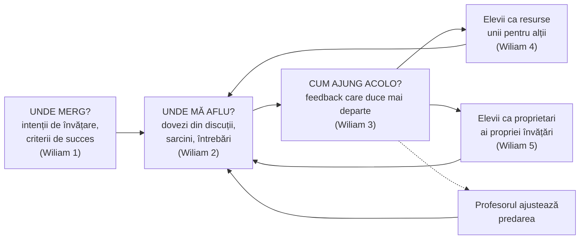

↑ [[00 Index - Analiza comparată internațională]] · Manual: [[Modulul 10 - Proiectarea, realizarea și evaluarea activității educative]] · [[4.5 Ierarhizarea și clasificarea obiectivelor]]

> [!abstract] Pe scurt
> 1. **Evaluarea formativă** (*formative assessment*) este evaluarea ale cărei informații sunt **folosite** pentru a ajusta predarea și învățarea **cât timp învățarea încă are loc**. Nu tipul de instrument o face formativă, ci **funcția** informației.
> 2. **Scriven** (1967) a introdus distincția formativ/sumativ pentru evaluarea programelor. **Bloom** (1968–1971) a mutat-o la clasă, în *mastery learning*. **Sadler** (1989) a formulat mecanismul: elevul trebuie să știe **ținta**, să-și compare nivelul actual cu ea și să acționeze pentru a **închide distanța**.
> 3. **Black & Wiliam** (1998, *Inside the Black Box*) au transformat ideea într-o mișcare internațională, prin sinteza a circa 250 de studii. **Assessment Reform Group** a numit-o *Assessment for Learning*. **Wiliam** a sintetizat-o în **cinci strategii-cheie**.
> 4. **Feedbackul** e nucleul: **Kluger & DeNisi** (1996) au arătat că efectul mediu e pozitiv, dar **peste o treime** dintre intervenții **scad** performanța. **Hattie & Timperley** (2007) explică de ce: feedbackul despre **sarcină, proces și autoreglare** ajută, cel despre **persoană** („ești deștept”) nu.
> 5. Aproape toate sistemele analizate au adoptat-o: **Scoția** (*Assessment is for Learning*), **Anglia** (*AfL Strategy* 2008), **Ontario** (*Growing Success* 2010), **Singapore** (evaluare holistică, eliminarea examenelor în primele clase), **Estonia și Finlanda** (evaluare descriptivă în primar), **R. Moldova** (evaluare criterială prin **descriptori**, fără note în clasele primare, din 2015–2016).
> 6. **Dovezile** sunt pozitive, dar **mai modeste** decât se afirma: **Kingston & Nash** (2011) estimează un efect mediu de circa **0,20**, iar **Bennett** (2011) arată confuzia conceptuală. Efectul depinde de **calitatea implementării**.
> 7. **Riscul tipic**: transformarea ei în **ritualuri** (semafoare, obiective pe tablă, fișe de bifat) sau în **teste frecvente pentru management**. Cel mai bine prosperă unde **miza sumativă e mică**.

---

## 1. Explicația teoriei

### 1.1 Întrebarea la care răspunde

Evaluarea școlară servește mai multe scopuri: certificare, selecție, responsabilizare, **ameliorarea învățării**. Teoria evaluării formative răspunde la întrebarea: **cum poate evaluarea să producă învățare, nu doar să o constate?** Mai precis:

1. Ce informații despre învățare trebuie colectate **în timpul** predării?
2. Cum trebuie formulat **feedbackul** pentru ca elevul să-l poată folosi?
3. Cum devin **elevii** evaluatori ai propriei învățări și ai colegilor?
4. Cum se leagă evaluarea la clasă de **examenele** și **notele** sistemului?

### 1.2 Ideile centrale

- **Funcția, nu instrumentul.** Același test poate fi sumativ (notă în catalog) sau formativ (profesorul își schimbă planul, elevul își corectează strategia). Wiliam: evaluarea e formativă în măsura în care dovezile sunt **obținute, interpretate și folosite** pentru decizii despre pașii următori.
- **Bucla lui Sadler.** Pentru a se ameliora, elevul trebuie (1) să aibă o **concepție a standardului** vizat, (2) să-și **compare** performanța actuală cu standardul, (3) să **acționeze** pentru a reduce distanța. Feedbackul profesorului e util doar dacă ajută la aceste trei operații. Scopul final e ca elevul să ajungă să le facă **singur**.
- **Elevul ca actor.** Evaluarea formativă nu e ceva ce profesorul face **elevilor**, ci ceva ce face **împreună cu ei**: criterii de succes împărtășite, autoevaluare, evaluare între colegi.
- **Feedbackul poate dăuna.** Feedbackul care atrage atenția asupra **eului** (laude generale, comparații, note) deviază efortul spre protejarea imaginii de sine.
- **Predarea se ajustează.** Evaluarea formativă e și o informație pentru **profesor**: îi arată ce trebuie repredat, cui și cum.
- **Continuum formativ–sumativ.** Distincția e de **utilizare**. Sistemele încearcă să le coordoneze (Christodoulou, 2017) sau să le separe (Harlen).

### 1.3 Concepte-cheie

| Concept | Definiție |
|---|---|
| **Evaluare sumativă** (*summative*) | evaluare la finalul unei secvențe, pentru a **constata** și certifica nivelul atins |
| **Evaluare formativă** (*formative*) | evaluare în timpul învățării, ale cărei dovezi sunt **folosite** pentru a ajusta predarea și învățarea |
| **Evaluare diagnostică / inițială** | evaluare la începutul unei secvențe, pentru a identifica cunoștințele anterioare și lacunele |
| **Evaluarea pentru învățare** (*Assessment for Learning*, AfL) | termenul Assessment Reform Group (1999, 2002): căutarea și interpretarea dovezilor de către elevi și profesori pentru a decide unde se află elevii, unde trebuie să ajungă și cum ajung acolo |
| **Evaluarea ca învățare** (*assessment as learning*) | elevul își monitorizează singur învățarea; evaluarea e un proces **metacognitiv** (Earl, 2003) |
| **Evaluarea a învățării** (*assessment of learning*) | echivalentul sumativului în triada lui Earl |
| **Feedback** | informație despre performanță, oferită de un agent (profesor, coleg, instrument, sine), cu scopul de a reduce distanța față de țintă |
| **Intenții de învățare și criterii de succes** | ce vor învăța elevii și cum vor ști că au reușit, formulate înainte de sarcină |
| **Evaluare criterială** | raportarea performanței la **criterii** fixe, nu la performanța celorlalți (normativă) |
| **Evaluare descriptivă** | aprecierea prin **descrieri calitative** ale nivelului atins, fără notă numerică |
| **Descriptor** | enunț care descrie un **nivel de performanță** pentru un criteriu (ex. „rezolvă independent / cu sprijin”) |
| **Rubrică** | grilă criterii × niveluri, cu descriptori pentru fiecare celulă |
| **Autoevaluare / evaluare între colegi** | elevul își judecă propria lucrare sau pe a colegilor, după criterii comune |
| **Reglare** (*régulation*) | în tradiția francofonă (Allal, Perrenoud), ajustarea continuă a învățării prin informații de evaluare: interactivă, retroactivă, proactivă |
| **Washback** | efectul evaluării cu miză mare asupra predării și învățării |

### 1.4 Modelul integrator: Sadler + Hattie & Timperley + Wiliam

**Cele cinci strategii-cheie** (Leahy, Lyon, Thompson & Wiliam, 2005; Wiliam, 2011):

| Strategie | Exemple de tehnici |
|---|---|
| 1. Clarificarea și împărtășirea **intențiilor de învățare și a criteriilor de succes** | exemple de lucrări bune și slabe; co-construirea criteriilor cu elevii |
| 2. Organizarea de **discuții, întrebări și sarcini** care produc dovezi despre învățare | întrebări-diagnostic cu variante care relevă concepții greșite; „fără mâna ridicată”; tăblițe individuale; bilețele de ieșire |
| 3. **Feedback** care duce învățarea mai departe | comentarii fără notă; „două stele și o dorință”; sarcini care cer revizuirea lucrării |
| 4. Activarea elevilor ca **resurse unii pentru alții** | evaluare între colegi după criterii; predare reciprocă |
| 5. Activarea elevilor ca **proprietari ai propriei învățări** | autoevaluare; jurnale de învățare; stabilirea de scopuri |

**Cele patru niveluri ale feedbackului** (Hattie & Timperley, 2007):

| Nivel | Exemplu | Eficiență |
|---|---|---|
| **Sarcină** (*task*) | „Ai omis unitatea de măsură la rezultat.” | eficient, mai ales la novici |
| **Proces** (*process*) | „Verifică dacă ai aplicat regula de acord în fiecare propoziție.” | foarte eficient pentru învățare profundă |
| **Autoreglare** (*self-regulation*) | „Ce strategie ai putea folosi ca să-ți verifici singur calculul?” | foarte eficient; construiește autonomia |
| **Sine** (*self*) | „Bravo, ești foarte deștept!” | **ineficient** pentru învățare; poate dăuna |

Cele trei întrebări ale lui Hattie & Timperley — **Unde merg? Cum merg? Ce urmează?** — reformulează bucla lui Sadler.

> [!note] Ce presupune teoria despre actorii educației
> - **Elevul**: poate învăța să judece calitatea propriei lucrări; motivația crește când evaluarea e informativă și nu îl clasează.
> - **Profesorul**: e un **„inginer” al situațiilor** care produc dovezi și un decident care își ajustează planul. Are nevoie de **cunoaștere pedagogică a conținutului** ca să interpreteze erorile.
> - **Cunoașterea**: are **progresii** descriptibile (de la concepții naive la expertiză). Feedbackul cere o hartă a acestor progresii.
> - **Școala**: are nevoie de o **cultură a evaluării** în care erorile sunt informații, iar notele nu domină.

---

## 2. Geneza și evoluția

| Etapă | Perioadă | Repere |
|---|---|---|
| **Precursori** | 1930–1960 | Tyler: evaluarea ca verificare a obiectivelor și ca informație pentru revizuirea curriculumului; psihologia behavioristă: **feedback imediat** în instruirea programată (Skinner) |
| **Formularea** | 1967–1971 | **Scriven**, *The Methodology of Evaluation* (1967): evaluare **formativă** vs. **sumativă** a programelor; **Bloom** (1968, *Learning for Mastery*; 1969) — teste formative în unități de învățare; **Bloom, Hastings & Madaus**, *Handbook on Formative and Summative Evaluation of Student Learning* (1971) |
| **Tradiția francofonă** | 1970–1990 | pedagogia prin obiective și docimologia (De Landsheere); **Linda Allal** (Geneva) — reglarea interactivă, retroactivă, proactivă (1979); **Perrenoud** — *évaluation formative* și pedagogia diferențiată; **Nunziati** — *évaluation formatrice* (autoevaluarea elevului) |
| **Mecanismul feedbackului** | 1983–1996 | **Crooks** (1988) — impactul practicilor de evaluare la clasă; **Natriello** (1987); **Butler** (1988) — comentariile fără note produc mai mult progres și interes decât notele; **Sadler** (1989) — bucla standard–comparare–acțiune; **Kluger & DeNisi** (1996) — meta-analiza efectelor feedbackului |
| **Mișcarea AfL** | 1998–2010 | **Black & Wiliam** (1998) — revizuire și broșura *Inside the Black Box*; **Assessment Reform Group** — *Beyond the Black Box* (1999), *10 principii* (2002); proiectul KMOFAP (2003); OCDE, *Formative Assessment* (2005); Scoția AifL (2002–); Anglia AfL Strategy (2008) |
| **Extinderi** | 2000–2011 | **Shepard** (2000) — evaluarea într-o cultură a învățării; **Stiggins** (2002) — *assessment for learning* în SUA; **Earl** (2003) — evaluarea **ca** învățare; **Hattie & Timperley** (2007); **Brookhart** (2008); **Wiliam** (2011) — cinci strategii; **Black & Wiliam** (2009) — teoria evaluării formative |
| **Critica dovezilor** | 2011–prezent | **Bennett** (2011) — critică conceptuală și metodologică; **Kingston & Nash** (2011) — efecte medii mult mai mici; dezbaterea despre mărimile efectului în *Educational Measurement: Issues and Practice* (2012) |
| **Stadiul actual** | 2015–prezent | feedbackul reevaluat: **Wisniewski, Zierer & Hattie** (2020) — meta-analiză cu efect mediu moderat și variabilitate mare; evaluare formativă digitală și cu IA; **judecata comparativă** (Christodoulou, *No More Marking*); politici de raportare bazate pe competențe (BC, 2023); revizuirea evaluării descriptive în R. Moldova (proiect 2025) |

---

## 3. Autori, reprezentanți, cercetători

| Autor | Lucrare(ări), an | Aportul concret |
|---|---|---|
| **Michael Scriven** | „The methodology of evaluation” (în Tyler, Gagné & Scriven, *Perspectives of Curriculum Evaluation*, 1967) | a introdus termenii **formativ** și **sumativ**, inițial pentru **evaluarea programelor** și a curriculumului |
| **Benjamin S. Bloom** (cu J. T. Hastings, G. Madaus) | *Learning for Mastery* (1968); *Handbook on Formative and Summative Evaluation of Student Learning* (1971) | a aplicat distincția la **învățarea elevilor**: teste formative după fiecare unitate, urmate de **corectare** și **îmbogățire** |
| **Linda Allal** | „Stratégies d'évaluation formative” (1979); lucrări despre **reglarea învățării** | tipologia reglării (interactivă, retroactivă, proactivă); legătura cu autoreglarea |
| **Philippe Perrenoud** | *L'évaluation des élèves* (1998) | evaluarea formativă ca parte a **pedagogiei diferențiate**; critica „fabricării excelenței” prin note |
| **Ruth Butler** | „Enhancing and undermining intrinsic motivation” (*British Journal of Educational Psychology*, 1988) | experiment: **comentariile** au crescut performanța și interesul; **notele** și **notele + comentarii** nu (efectul notei „anulează” comentariul) |
| **Terence Crooks** | „The impact of classroom evaluation practices on students” (*Review of Educational Research*, 1988) | sinteză timpurie: evaluarea la clasă influențează **ce** și **cum** învață elevii |
| **D. Royce Sadler** | „Formative assessment and the design of instructional systems” (*Instructional Science*, 1989) | **bucla** standard–comparare–acțiune; scopul e dezvoltarea **judecății evaluative** a elevului |
| **Avraham Kluger & Angelo DeNisi** | „The effects of feedback interventions on performance” (*Psychological Bulletin*, 1996) | meta-analiză pe peste 600 de efecte (607): efect mediu **d ≈ 0,41**, dar **peste o treime** negative; feedbackul care mută atenția spre **sine** e dăunător (teoria intervenției prin feedback) |
| **Paul Black & Dylan Wiliam** | „Assessment and classroom learning” (*Assessment in Education*, 1998); *Inside the Black Box* (1998); „Developing the theory of formative assessment” (2009) | sinteza a circa 250 de studii; afirmația, larg citată, a unor efecte de **0,4–0,7**; teoria evaluării formative ca **reglare** a învățării |
| **Assessment Reform Group** (Black, Broadfoot, Gipps, Harlen, James, Stobart ș.a.) | *Assessment for Learning: Beyond the Black Box* (1999); *Assessment for Learning: 10 Principles* (2002) | termenul **Assessment for Learning** și definiția sa; cele 10 principii (parte a planificării, centrare pe cum învață elevii, sensibilitate la efectele emoționale, dezvoltarea capacității de autoevaluare etc.) |
| **Black, Harrison, Lee, Marshall & Wiliam** | *Assessment for Learning: Putting It into Practice* (2003) | proiectul **KMOFAP** (King's–Medway–Oxfordshire): profesori care au implementat tehnicile AfL, cu câștiguri raportate |
| **Dylan Wiliam** | *Embedded Formative Assessment* (2011; ed. a 2-a 2018); Leahy, Lyon, Thompson & Wiliam (2005) | **cinci strategii-cheie**; pachetul de formare *Embedding Formative Assessment* (cu S. Leahy), evaluat de EEF |
| **Wynne Harlen** | *Assessment of Learning* (2007) | relația dintre evaluarea formativă și cea sumativă realizată de profesor; fiabilitatea judecății profesorului |
| **Lorrie Shepard** | „The role of assessment in a learning culture” (*Educational Researcher*, 2000) | integrarea evaluării în perspectiva socioconstructivistă a învățării |
| **Rick Stiggins** | „Assessment crisis: The absence of assessment FOR learning” (*Phi Delta Kappan*, 2002) | promovarea AfL în SUA; **alfabetizarea în evaluare** (*assessment literacy*) a profesorilor |
| **Lorna Earl** | *Assessment as Learning* (2003) | triada **a / pentru / ca** învățare; preluată în WNCP (2006) și *Growing Success* (Ontario, 2010) |
| **John Hattie & Helen Timperley** | „The power of feedback” (*Review of Educational Research*, 2007) | trei întrebări (Unde merg? Cum merg? Ce urmează?) și **patru niveluri** ale feedbackului |
| **Valerie Shute** | „Focus on formative feedback” (*Review of Educational Research*, 2008) | recomandări: feedback specific, clar, legat de sarcină, temporizat în funcție de sarcină și de nivelul elevului |
| **Susan M. Brookhart** | *How to Give Effective Feedback to Your Students* (2008; ed. a 2-a 2017) | ghid practic: momentul, cantitatea, modul, audiența feedbackului; conținut descriptiv, nu evaluativ |
| **Margaret Heritage** | *Formative Assessment: Making It Happen in the Classroom* (2010) | progresiile învățării ca bază pentru interpretarea dovezilor |
| **Randy E. Bennett** (critic) | „Formative assessment: a critical review” (*Assessment in Education*, 2011) | definițiile sunt vagi; mărimile efectului din 1998 nu sunt robust fundamentate; eficiența depinde de **domeniu** și de competența profesorului |
| **Neal Kingston & Brooke Nash** (critici) | „Formative assessment: A meta-analysis and a call for research” (*Educational Measurement: Issues and Practice*, 2011) | din studiile care au trecut criteriile de calitate, efect mediu ponderat în jur de **0,20**; mai mare la limba engleză/arte ale limbajului decât la matematică și științe |
| **Daisy Christodoulou** | *Making Good Progress? The Future of Assessment for Learning* (2017) | separarea clară a evaluării formative (sarcini specifice, frecvente) de cea sumativă (comparabilă, rară); **judecata comparativă** |
| **Benedikt Wisniewski, Klaus Zierer, John Hattie** | „The power of feedback revisited” (*Frontiers in Psychology*, 2020) | meta-analiză pe 435 de studii: efect mediu **moderat** (în jur de 0,48), foarte variabil; feedbackul informativ bogat e cel mai eficient |

---

## 4. Legătura cu manualul și cu vaultul

- **[[Modulul 10 - Proiectarea, realizarea și evaluarea activității educative]]** este locul firesc al temei. Funcțiile evaluării și distincția inițială / continuă / sumativă apar în tradiția docimologică românească (I. T. Radu), dar manualul **nu** prezintă literatura internațională a evaluării formative.
- **[[4.5 Ierarhizarea și clasificarea obiectivelor]]**: funcția obiectivului „de organizare/evaluare”. Obiectivele operaționale cu **criteriu** (Mager) sunt, de fapt, **criterii de succes** în sensul AfL.
- **[[Autoeducația - teorii, autori și corelări]]**: autoevaluarea e o metodă a autoeducației (p. 114–115 din manual). Nota corelează Black & Wiliam și Boud cu fazele modelului Zimmerman (§8.1, §9, §15). Evaluarea **ca** învățare (Earl) este instrumentul școlar al autoeducației.
- **[[3.6 Educația permanentă și autoeducația]]**: manualul spune că profesorul îi pune pe elevi în situații de autoevaluare (p. 108), dar nu arată **cum**.
- **[[10.2 Curriculum la dirigenție]]** §9: disciplina *Dezvoltare personală* se evaluează **criterial, prin descriptori**; clasele absolvente primesc „admis/respins”.
- **[[8.3 Sistemul de învățământ din Republica Moldova]]**: în primar, evaluarea criterială prin descriptori și testarea națională.
- **[[5.3 Cercetarea pedagogică - noțiune și tipologie]]** și **[[5.4 Metode de cercetare în pedagogie]]**: mărimile efectului și interpretarea meta-analizelor, necesare pentru a citi critic dovezile.
- **[[9.2 Profesorul postmodernist - facilitator al cunoașterii]]**: profesorul-facilitator presupune evaluare formativă, dar manualul nu o operaționalizează.

> [!warning] Unde manualul e incomplet
> 1. Manualul tratează evaluarea mai ales ca **măsurare** și **notare**, nu ca **feedback**. Lipsesc Scriven, Sadler, Black & Wiliam, Hattie & Timperley.
> 2. Nu apare riscul **feedbackului dăunător** (Kluger & DeNisi) și nici cel al **notelor care anulează comentariile** (Butler).
> 3. Manualul (2014) nu putea include **evaluarea criterială prin descriptori** din R. Moldova (2015–2016), dar studenții o vor aplica în practică. Cardul de față și [[8.3 Sistemul de învățământ din Republica Moldova]] completează lacuna.

---

## 5. Implementare comparată

| Sistem | Cum a fost implementată (politică / program / instituție) | Când | Scară / intensitate | Dovezi sau rezultate |
|---|---|---|---|---|
| **Singapore** | **PERI** — evaluare holistică în P1–P2; **eliminarea examenelor** în P1–P2 și a clasamentelor din carnete (*Learn for Life*); **PSLE pe benzi AL1–AL8** (criterial); eliminarea **examenelor de mijloc de an**; *assessment literacy* în formarea profesorilor | 2009; 2018–2019; 2021; 2023 | **medie**, în creștere | schimbări reale, dar **cultura examenului** persistă; profesorii practică evaluarea formativă „în umbra” examenelor sumative (Wong, Kwek & Tan, 2020) |
| **Estonia** | curriculumul național (§ 19–22) definește evaluarea formativă: comparație cu rezultatele anterioare ale elevului, feedback despre puncte tari și pași următori, autoevaluare, evaluare între colegi, portofoliu; **evaluare descriptivă** permisă în clasele 1–6; teste diagnostice digitale | 2011; strategia LLL 2014–2020 | **medie** | **decalaj politică–practică**: doar 28% dintre profesori folosesc des autoevaluarea elevilor (OCDE: 41%, TALIS 2018); Strategia 2021–2035 recunoaște că sistemul care sprijină învățarea nu e implementat sistemic |
| **Finlanda** | evaluarea la clasă e responsabilitatea profesorului; curriculumul 2014 are un capitol despre **cultura evaluării** (autoevaluare din clasa I, discuții de evaluare cu elevul și părinții); în clasele 1–3, aprecieri **verbale sau numerice** (decizia furnizorului); din clasa a 4-a, **note** 4–10; evaluări naționale doar pe eșantion | 2014 (în vigoare 2016); criterii naționale 2020–2021 | **centrală** în școala de bază | multe date formative și diagnostice la clasă (OCDE, 2010); **inflația și variația notelor** între școli au dus la criterii naționale de evaluare finală |
| **Regatul Unit** | **Anglia**: KMOFAP; *Assessing Pupils' Progress*; ***AfL Strategy*** (circa 150 mil. £); eliminarea „nivelurilor” (2014); **Scoția**: ***Assessment is for Learning*** (AifL); Țara Galilor și Irlanda de Nord: AfL integrat în curricula | 1998–2003; 2008; 2002– | Anglia **centrală** (2003–2010), apoi **medie**; Scoția **centrală** | implementarea engleză adesea birocratică, „litera, nu spiritul” (Marshall & Drummond, 2006); EEF: feedback **+6 luni** în *Toolkit*; trialul *Embedding Formative Assessment* — efect pozitiv mic la GCSE (Speckesser et al., 2018) |
| **Japonia** | fără vocabularul AfL, dar cu **evaluare formativă integrată** în lecție: *kikan shidō* (profesorul observă strategiile elevilor și alege ce se discută), *neriage*, *furikaeri* (reflecția elevilor); principiul „unității dintre predare și evaluare”; evaluare **criterială** din 2002; morala — evaluare descriptivă, fără note (2018/2019) | 2002; 2017; tradiție de lecție mai veche | **medie–centrală** (implicită) | coerență documentată de TIMSS Video; tensiuni între evaluarea criterială și selecția la admitere (*naishin*) |
| **Coreea de Sud** | **evaluare centrată pe proces** (*gwajeong jungsim pyeongga*): sarcini de performanță, observații, portofolii; **Free Semester** fără teste creion-hârtie; curriculumul 2022: evaluare „**pentru** și **ca** învățare” | 2015; 2013–2016; 2022 | **medie**, inegală pe niveluri | prosperă unde miza e mică (primar, *Free Semester*) și slăbește în liceu, sub presiunea **notelor relative** și a CSAT |
| **Canada** | **Lorna Earl**: evaluarea a / pentru / ca învățare; protocolul WNCP (2006); **Ontario — *Growing Success*** (criterii de succes comunicate, autoevaluare și evaluare între colegi, abilitățile de învățare separate de nota academică); **BC** — politica de raportare K–12 (scala *Emerging–Developing–Proficient–Extending* în K–9; autoevaluarea competențelor esențiale) | 2003–2006; 2010; 2023/2024 | **centrală** în Ontario și BC | bază empirică internațională solidă, implementare inegală; controverse despre politicile „fără zero” |
| **Europa (UE / Consiliul Europei)** | OCDE, *Formative Assessment: Improving Learning in Secondary Classrooms* (2005); tradiția francofonă a reglării (Allal, Perrenoud); evaluare descriptivă în primar în **România** (din 1998) și **R. Moldova**; *Review on Evaluation and Assessment* (OCDE, 2013) | 1998–2013 | **medie**, fără normă UE obligatorie | efecte mari în sinteze, mai modeste în studii riguroase recente; critica „guvernării prin cifre” |
| **SUA** | Shepard, Stiggins, Heritage; resursele formative ale consorțiului **Smarter Balanced**; rețeaua CCSSO FAST SCASS; **teste interim** (MAP, i-Ready) vândute adesea ca „formative”; *grading for equity* și notarea bazată pe standarde | 2000–; 2010–2015 | **medie**, fragmentată | **Kingston & Nash** (2011): efect ≈ 0,20; riscul **comercializării** formativului ca produs-test, nu ca practică la clasă |
| **Republica Moldova** | **evaluarea criterială prin descriptori** (ECD) în primar: clasa I din 2015 (Ordin nr. 862 din 7.09.2015), clasa a II-a din 2016 (Ordin nr. 623 din 28.06.2016); **fără note** în clasele primare, cu calificative (FB, B, S) și descriptori; metodologia pentru clasele I–IV (Ordin MECC nr. 1468 din 13.11.2019); **studiu de evaluare a eficienței** (Ordin MEC nr. 1490 din 23.10.2024); **proiect de metodologie nouă (2025)** | 2015–2016; 2019; 2024–2025 | **centrală** în primar; **redusă–medie** în gimnaziu și liceu (note 10–1) | primul instrument sistemic de evaluare aliniat competențelor; proiectul 2025 invocă „vulnerabilități” din 2019–2024 și propune un nivel „avansat”, calificativul „excelent” și **note din clasa a IV-a** la disciplinele de bază (statut de adoptare — de verificat) |

> [!info] Noua Zeelandă (sistem din afara grilei de țări, dar esențial pentru teorie)
> Noua Zeelandă a fost unul dintre primele sisteme care au construit politica națională de evaluare la clasă pe principiile AfL. **John Hattie** și **Helen Timperley** au lucrat la Universitatea din Auckland, iar sinteza lor despre feedback (2007) s-a hrănit din proiectele neozeelandeze. Repere: instrumentul diagnostic **asTTle** (dezvoltat la Auckland pentru minister, începutul anilor 2000), programul de dezvoltare profesională ***Assess to Learn*** (anii 2000; datele exacte — de verificat), raportul *Directions for Assessment in New Zealand* (Absolum et al., 2009). Episodul **National Standards** (2010, abandonate de noul guvern în 2017–2018) arată aceeași tensiune ca în Anglia: judecata profesorului, gândită formativ, a fost folosită pentru raportare publică și responsabilizare.

### 5.1 Studiu de caz: Anglia și Scoția — aceeași teorie, două implementări

→ [[Regatul Unit - ecosistemul educațional]]

- **Originea.** Teoria s-a născut la **King's College London** (Black & Wiliam) și în **Assessment Reform Group**. Proiectul KMOFAP (1999–2001) a lucrat cu profesori din Medway și Oxfordshire la tehnici concrete (întrebări, feedback fără note, autoevaluare) și a raportat câștiguri la testele naționale.
- **Anglia.** Guvernul a preluat ideea în **Strategia națională** (*Assessing Pupils' Progress*; *AfL Strategy*, 2008, circa 150 mil. £). AfL a fost însă legată de **urmărirea datelor pentru management**: „niveluri” raportate de câteva ori pe an, cu ținte de progres. **Marshall & Drummond** (2006) au descris rezultatul ca „litera, nu spiritul” AfL: tehnici vizibile (obiective pe tablă, semafoare, bețișoare cu nume) fără schimbarea relației elev–învățare. **Wiliam** a regretat folosirea cuvântului *assessment*, care a atras logica testării.
- **Scoția.** Programul ***Assessment is for Learning*** (din 2002) a mizat pe **rețele de profesori** și dezvoltare profesională, fără legătură cu responsabilizarea prin date. Evaluările programului au fost în general favorabile privind practica profesorilor. Tensiunea a apărut ulterior între **CfE** și **examenele din „senior phase”** (OCDE, 2021; Hayward, 2023).
- **După 2014.** Anglia a eliminat „nivelurile”. **Christodoulou** (2017) a propus separarea formativului (sarcini frecvente, specifice) de sumativ (rar, comparabil, eventual prin judecată comparativă). **EEF** a finanțat trialul *Embedding Formative Assessment* (pachetul Wiliam–Leahy): efect pozitiv mic la GCSE.
- **Lecția.** Evaluarea formativă este o **practică profesională**, nu o **tehnologie de raportare**. Legată de responsabilizare, degenerează în conformitate.

### 5.2 Studiu de caz: Singapore — reducerea mizei sumative ca politică formativă

→ [[Singapore - ecosistemul educațional]]

- **Pașii.** (1) Raportul **PERI** (2009): evaluare holistică și feedback descriptiv în P1–P2. (2) ***Learn for Life*** (2018–2019): **fără examene** în P1–P2, fără clasamente în carnete. (3) **PSLE pe benzi AL1–AL8** (2021): nota depinde de performanța proprie (criterial), nu de cohortă. (4) Eliminarea **examenelor de mijloc de an** în toate clasele (2023), pentru mai mult timp de învățare profundă și evaluare continuă.
- **Logica.** Singapore nu a început prin a forma profesorii în tehnici AfL, ci prin a **reduce presiunea sumativă** care bloca feedbackul. Este o aplicare la nivel de sistem a observației lui Butler: nota „anulează” comentariul.
- **Rezultate și limite.** Schimbările sunt reale, dar **cultura examenului** persistă: competiția s-a mutat spre alegerea școlilor de elită și spre meditații (Kwek et al., 2023). Profesorii practică evaluarea formativă „în umbra” PSLE.
- **Lecția pentru R. Moldova.** Eliminarea notelor în primar (2015–2016) seamănă cu primii pași ai Singaporelui. Efectul depinde însă de ce se întâmplă în **clasele cu miză** (gimnaziu, examene de absolvire) și în **familie**.

### 5.3 Studiu de caz: Ontario — *Growing Success* și evaluarea „ca” învățare

→ [[Canada - ecosistemul educațional]]

- **Fundamentul.** **Lorna Earl** (OISE) a propus în *Assessment as Learning* (2003) triada **a / pentru / ca** învățare. În evaluarea **ca** învățare, elevul își monitorizează singur învățarea prin **metacogniție**. Triada a trecut în protocolul provinciilor vestice (WNCP, 2006).
- **Politica.** ***Growing Success*** (2010) stabilește principii comune pentru clasele 1–12: evaluarea **pentru** și **ca** învățare predomină în timpul unității; evaluarea **a** învățării vine la final; **intenții de învățare și criterii de succes** comunicate elevilor; autoevaluare și evaluare între colegi. Politica separă **abilitățile de învățare** (responsabilitate, organizare, colaborare, autoreglare) de **nota academică**.
- **Practică și dovezi.** Implementarea e inegală între consilii și profesori. Au existat controverse despre notarea „fără zero” și despre responsabilitatea elevilor. Nu există o evaluare cauzală a politicii ca întreg.
- **Lecția.** Ontario arată cum evaluarea formativă poate fi **normă de sistem** fără a fi legată de clasamente. Separarea abilităților de învățare de nota academică e o soluție utilă și pentru R. Moldova, unde comportamentul contaminează adesea nota.

### 5.4 Studiu de caz: Republica Moldova — evaluarea criterială prin descriptori (2015–2025)

- **Ce s-a introdus.** Din anul școlar **2015–2016**, în clasa I, apoi treptat în clasele II–IV, notele au fost înlocuite de **evaluarea criterială prin descriptori** (ECD). Profesorul evaluează **produse** ale învățării (ex. lectura expresivă, rezolvarea de probleme) după **criterii de succes** și **descriptori** de nivel („independent”, „ghidat”, „cu sprijin”), iar pentru evaluările sumative acordă **calificative** (Foarte bine, Bine, Suficient). Metodologiile au fost aprobate în 2015 (clasa I), 2016 (clasa a II-a), revizuite în 2017 și unificate pentru clasele I–IV în **2019**.
- **Tipologia formativă** din metodologie distinge (terminologia din proiectul 2025): **evaluare formativă interactivă** (feedback la fiecare lecție, fără instrument), **punctuală** (probe scurte, pe una–două unități de competență) și **în etape** (cumulativă, pe unitatea de învățare), plus **autoevaluare** planificată după fiecare probă.
- **Revizuirea.** Un **studiu de evaluare a eficienței** metodologiei (aprobat prin Ordinul MEC nr. 1490 din 23.10.2024) a stat la baza unui **proiect de metodologie nouă** (2025), care propune: un nivel de performanță **avansat** și calificativul **Excelent**, **note în clasa a IV-a** la disciplinele de bază, pentru tranziția spre gimnaziu, unificarea înregistrărilor în catalog. Documentul își propune explicit să „intensifice impactul evaluării pentru autonomia școlarului mic”.
- **Interpretare comparată.** R. Moldova a făcut un pas asemănător **Singaporelui** (fără note în primele clase) și **Estoniei/Finlandei** (evaluare descriptivă în primar). Reintroducerea notelor în clasa a IV-a ar apropia sistemul de **modelul finlandez** (verbal în clasele 1–3, numeric din clasa a 4-a).
- **Riscuri documentate internațional**, relevante aici: (1) **birocratizarea** descriptorilor (fișe, tabele de performanță) în locul feedbackului; (2) presiunea părinților pentru **transparență numerică** (ca în Coreea); (3) **ruptura** la intrarea în gimnaziu, unde notele 10–1 domină; (4) **formarea insuficientă** a profesorilor pentru feedback de proces și autoreglare (Hattie & Timperley).
- **Ce lipsește** (după sursele consultate): o evaluare **independentă, publică** a efectelor ECD asupra rezultatelor elevilor (testarea națională la clasa a IV-a ar permite o analiză înainte/după) — de verificat conținutul studiului din 2024.

---

## 6. Dovezi empirice și critici

### 6.1 Studiile-cheie

| Studiu | Design | Rezultat | Observații |
|---|---|---|---|
| **Butler** (1988) | experiment, elevi de 11 ani | comentariile au crescut performanța și interesul; notele și notele + comentarii nu | studiu mic, dar foarte citat; baza practicii „feedback fără notă” |
| **Kluger & DeNisi** (1996) | meta-analiză, 131 de studii, 607 efecte | d ≈ **0,41** în medie; **peste o treime** dintre efecte **negative** | nu doar școlar; arată că feedbackul nu e automat benefic |
| **Black & Wiliam** (1998) | revizuire narativă a circa 250 de studii | efecte citate de **0,4–0,7** | **nu** o meta-analiză formală; cifrele au fost ulterior contestate |
| **Hattie & Timperley** (2007) | sinteză de meta-analize | feedback d ≈ 0,79 (medie din meta-analize, după Hattie) | cifra e o medie a unor meta-analize eterogene (critica lui Simpson, 2017, asupra comparării mărimilor efectului) |
| **Kingston & Nash** (2011) | meta-analiză, 13 studii (42 de efecte) după criterii stricte | efect mediu ponderat ≈ **0,20**; mai mare la limbă și literatură decât la matematică și științe; mai mare cu formare profesională și sisteme computerizate | puține studii de calitate; interval de încredere larg |
| **Bennett** (2011) | revizuire critică | definiții vagi; baza empirică a afirmațiilor din 1998 slabă; importanța cunoașterii de domeniu | nu respinge ideea, cere teorie și cercetare mai bune |
| **Wisniewski, Zierer & Hattie** (2020) | meta-analiză, 435 de studii | efect mediu în jur de **0,48**; feedbackul **informativ bogat** (sarcină + proces + autoreglare) mai eficient decât recompensele sau pedepsele | variabilitate mare; multe studii de laborator |
| **EEF Teaching and Learning Toolkit** | sinteză de meta-analize | **feedback +6 luni** de progres, cost redus | „lunile” sunt o convenție de comunicare, nu o măsură precisă |
| **Speckesser et al.** (2018), EEF | RCT pe clustere, școli secundare din Anglia (numărul exact — de verificat) | *Embedding Formative Assessment*: efect pozitiv mic la Attainment 8 (circa 2 luni) | unul dintre puținele RCT-uri la scară mare |
| **Lee, Chung, Zhang, Abedi & Warschauer** (2020) | meta-analiză, SUA K–12 | efect mediu mic spre moderat (în jur de 0,29 — de verificat) | efect mai mare când elevii sunt implicați activ (autoevaluare) |

> [!warning] Limite, controverse, condiții
> 1. **Cifrele populare sunt umflate.** Afirmația „evaluarea formativă dublează viteza învățării” (efecte 0,4–0,7) provine dintr-o revizuire narativă. Studiile riguroase dau efecte **mici spre moderate** (0,2–0,3). Efectul e totuși **cost-eficient**, pentru că intervenția e ieftină.
> 2. **Conceptul e prea larg.** „Evaluare formativă” acoperă tehnici foarte diferite. Unele au dovezi bune (feedback specific de proces, întrebări-diagnostic), altele aproape deloc (semafoarele de culori, obiectivele scrise pe tablă ca ritual).
> 3. **Feedbackul poate dăuna** (Kluger & DeNisi): când mută atenția spre **persoană**, când e vag, când vine cu o notă care îl eclipsează.
> 4. **Depinde de cunoașterea profesorului.** Pentru a da feedback de proces, profesorul trebuie să înțeleagă **de ce** greșește elevul. De aici efectele mai mici la matematică și științe (Kingston & Nash).
> 5. **Miza sumativă o sufocă.** Coreea (liceu), Singapore (PSLE), Estonia (examene la clasele 9 și 12) arată același tipar: formativul supraviețuiește acolo unde miza e mică.
> 6. **Birocratizarea.** Anglia (niveluri și ținte), Finlanda (documente de sprijin) și riscul moldovenesc al tabelelor de descriptori: evaluarea formativă transformată în **raportare**.
> 7. **Autoevaluarea e dificilă pentru novici.** Elevii își supraestimează adesea competența (Kruger & Dunning, 1999). Autoevaluarea cere **exemple de lucrări** și **antrenament**, nu doar o fișă.
> 8. **Condiții de funcționare**: criterii de succes clare și exemple; sarcini care relevă gândirea; timp alocat pentru **folosirea** feedbackului (revizuirea lucrării); formare profesională prelungită (comunități de învățare ale profesorilor, cum recomandă Wiliam); miză sumativă redusă sau separată.

---

## 7. Implicații practice

> [!tip] Pentru profesorul de la clasă
> - **Formulează criteriile de succes înainte de sarcină** și arată **exemple** de lucrări la niveluri diferite. Descriptorii din curriculum sunt un punct de plecare, nu un înlocuitor al exemplelor.
> - **Pune întrebări care relevă gândirea**, nu doar răspunsul: întrebări cu variante care corespund unor greșeli tipice; tăblițe individuale; bilețele de ieșire. Decide pe loc ce repredai.
> - **Dă feedback de proces și de autoreglare**, nu de persoană. Formulă utilă: *ce ai făcut bine (concret) → ce anume trebuie îmbunătățit → ce faci acum*.
> - **Cere folosirea feedbackului**: o parte din lecția următoare pentru revizuirea lucrării. Feedbackul nefolosit e timp pierdut.
> - **Separă comentariul de calificativ/notă** când vrei ca elevul să citească comentariul (Butler).
> - **Antrenează autoevaluarea treptat**: întâi evaluarea unor lucrări anonime după criterii, apoi evaluare între colegi, apoi autoevaluare. Legătură directă cu [[Autoeducația - teorii, autori și corelări]] §15.
> - **Nu transforma descriptorii în birocrație**: câteva criterii esențiale, bine înțelese de elevi, valorează mai mult decât tabele complete.

> [!tip] Pentru politica educațională din R. Moldova
> 1. **Publicarea studiului de eficiență** a evaluării criteriale prin descriptori (2024) și o evaluare independentă a efectelor, folosind datele testării naționale din clasa a IV-a.
> 2. **Continuitatea formativului în gimnaziu.** Evaluarea formativă nu ar trebui să se oprească în clasa a IV-a. Modelul *Growing Success* (principii comune 1–12, abilitățile de învățare separate de notă) e transferabil.
> 3. **Formare profesională prin comunități de învățare** (modelul Wiliam–Leahy), nu doar prin seminarii despre metodologie.
> 4. **Bănci de exemple de lucrări** (*exemplars*) pe niveluri, pentru fiecare disciplină din primar, publicate de minister.
> 5. **Reducerea *washback*-ului** examenelor de absolvire a gimnaziului, prin itemi de aplicare și argumentare.
> 6. **Comunicarea cu părinții**: explicarea sensului descriptorilor, ca să nu fie percepuți ca „note ascunse” (lecția coreeană și singaporeză).

---

## 8. Legături cu alte teorii din catalog

- [[Învățarea deplină (mastery learning)]] — Bloom a folosit testele formative și corectările ca motor al stăpânirii. Evaluarea formativă e componenta de feedback a învățării depline.
- [[Taxonomiile obiectivelor și educația centrată pe competențe]] — criteriile de succes sunt obiective operaționale în limbajul elevului. Alinierea constructivă (Biggs) cere evaluare coerentă cu competențele.
- [[Învățarea autoreglată, metacogniția și autoeducația]] — evaluarea **ca** învățare și strategia 5 a lui Wiliam (elevii ca proprietari ai învățării) sunt forme ale autoreglării. Feedbackul de nivel „autoreglare” (Hattie & Timperley) face legătura.
- Diferențierea, inteligențele multiple și designul universal — datele formative arată **cui** și **cum** trebuie adaptată predarea. Pedagogia diferențiată francofonă (Perrenoud) și evaluarea formativă s-au dezvoltat împreună.
- [[Socioconstructivismul și teoria activității (Vygotsky)]] — feedbackul ca **eșafodaj** în zona proximei dezvoltări; evaluarea între colegi ca mediere socială.
- [[Știința cognitivă a învățării]] — practica recuperării (*retrieval practice*) prin chestionare cu miză mică e simultan tehnică formativă și strategie de consolidare a memoriei.
- [[Responsabilizare, piață și încredere în guvernarea educației]] — conflictul dintre evaluarea formativă și testarea cu miză mare; cazul englez al AfL legat de date manageriale.
- Educația bazată pe dovezi — evaluarea formativă e cazul-școală al **mărimilor efectului umflate** și al corectării lor prin studii riguroase.
- [[Behaviorismul și instruirea directă]] — feedbackul imediat din instruirea programată e un precursor. Instruirea directă include „verificarea înțelegerii” (Rosenshine), o tehnică formativă.
- [[Profesionalismul cadrului didactic]] — evaluarea formativă cere judecată profesională și comunități de învățare ale profesorilor.
- [[Învățarea socio-emoțională și educația caracterului]] — efectele emoționale ale evaluării (principiul ARG) și mentalitatea de creștere.

---

## 9. Întrebări de reflecție

1. De ce un test poate fi simultan formativ și sumativ? Dați un exemplu din practica voastră de stagiu în care aceeași probă a avut ambele funcții.
2. Reformulați trei feedbackuri tipice („Bine!”, „Mai lucrează!”, „Nota 7”) în feedback de **sarcină**, **proces** și **autoreglare** (Hattie & Timperley).
3. Kluger & DeNisi arată că peste o treime dintre intervențiile prin feedback scad performanța. Ce condiții din școala moldovenească pot face feedbackul dăunător?
4. Comparați evaluarea criterială prin descriptori din R. Moldova cu evaluarea descriptivă din Estonia și Finlanda. Ce ar însemna reintroducerea notelor în clasa a IV-a?
5. De ce evaluarea formativă prosperă în primar și slăbește în liceu (Coreea, Singapore, Estonia)? Ce ar putea face politica pentru a reduce acest efect în R. Moldova?
6. Kingston & Nash estimează un efect de circa 0,20. Merită, totuși, investiția? Argumentați folosind costul, comparația cu alte intervenții și condițiile de implementare.

---

## 10. Surse

**Fundamente teoretice**
- Allal, L. (1979). Stratégies d'évaluation formative: conceptions psychopédagogiques et modalités d'application. În L. Allal, J. Cardinet, P. Perrenoud (eds.), *L'évaluation formative dans un enseignement différencié*. Berne: Peter Lang.
- Assessment Reform Group (1999). *Assessment for Learning: Beyond the Black Box*. Cambridge: University of Cambridge School of Education.
- Assessment Reform Group (2002). *Assessment for Learning: 10 Principles*.
- Black, P., Wiliam, D. (1998). Assessment and classroom learning. *Assessment in Education*, 5(1), 7–74.
- Black, P., Wiliam, D. (1998). Inside the black box: Raising standards through classroom assessment. *Phi Delta Kappan*, 80(2), 139–148.
- Black, P., Wiliam, D. (2009). Developing the theory of formative assessment. *Educational Assessment, Evaluation and Accountability*, 21(1), 5–31.
- Black, P., Harrison, C., Lee, C., Marshall, B., Wiliam, D. (2003). *Assessment for Learning: Putting It into Practice*. Maidenhead: Open University Press.
- Bloom, B. S., Hastings, J. T., Madaus, G. F. (1971). *Handbook on Formative and Summative Evaluation of Student Learning*. New York: McGraw-Hill.
- Brookhart, S. M. (2008). *How to Give Effective Feedback to Your Students*. Alexandria, VA: ASCD.
- Butler, R. (1988). Enhancing and undermining intrinsic motivation. *British Journal of Educational Psychology*, 58(1), 1–14.
- Christodoulou, D. (2017). *Making Good Progress? The Future of Assessment for Learning*. Oxford: Oxford University Press.
- Crooks, T. J. (1988). The impact of classroom evaluation practices on students. *Review of Educational Research*, 58(4), 438–481.
- Earl, L. (2003). *Assessment as Learning: Using Classroom Assessment to Maximize Student Learning*. Thousand Oaks: Corwin.
- Hattie, J., Timperley, H. (2007). The power of feedback. *Review of Educational Research*, 77(1), 81–112.
- Heritage, M. (2010). *Formative Assessment: Making It Happen in the Classroom*. Thousand Oaks: Corwin.
- Leahy, S., Lyon, C., Thompson, M., Wiliam, D. (2005). Classroom assessment, minute by minute, day by day. *Educational Leadership*, 63(3), 18–24.
- Perrenoud, P. (1998). *L'évaluation des élèves*. Bruxelles: De Boeck.
- Sadler, D. R. (1989). Formative assessment and the design of instructional systems. *Instructional Science*, 18(2), 119–144.
- Scriven, M. (1967). The methodology of evaluation. În R. W. Tyler, R. M. Gagné, M. Scriven, *Perspectives of Curriculum Evaluation* (AERA Monograph Series on Curriculum Evaluation, 1). Chicago: Rand McNally.
- Shepard, L. A. (2000). The role of assessment in a learning culture. *Educational Researcher*, 29(7), 4–14.
- Shute, V. J. (2008). Focus on formative feedback. *Review of Educational Research*, 78(1), 153–189.
- Stiggins, R. (2002). Assessment crisis: The absence of assessment FOR learning. *Phi Delta Kappan*, 83(10), 758–765.
- Wiliam, D. (2011). *Embedded Formative Assessment*. Bloomington: Solution Tree.

**Dovezi și critici**
- Bennett, R. E. (2011). Formative assessment: a critical review. *Assessment in Education*, 18(1), 5–25.
- Kingston, N., Nash, B. (2011). Formative assessment: A meta-analysis and a call for research. *Educational Measurement: Issues and Practice*, 30(4), 28–37.
- Kluger, A. N., DeNisi, A. (1996). The effects of feedback interventions on performance. *Psychological Bulletin*, 119(2), 254–284.
- Kruger, J., Dunning, D. (1999). Unskilled and unaware of it. *Journal of Personality and Social Psychology*, 77(6), 1121–1134.
- Lee, H., Chung, H. Q., Zhang, Y., Abedi, J., Warschauer, M. (2020). The effectiveness and features of formative assessment in US K-12 education: A systematic review. *Applied Measurement in Education*, 33(2), 124–140 (datele exacte — de verificat).
- Marshall, B., Drummond, M. J. (2006). How teachers engage with Assessment for Learning: lessons from the classroom. *Research Papers in Education*, 21(2), 133–149.
- Simpson, A. (2017). The misdirection of public policy: comparing and combining standardised effect sizes. *Journal of Education Policy*, 32(4), 450–466.
- Speckesser, S. et al. (2018). *Embedding Formative Assessment: Evaluation Report and Executive Summary*. London: EEF.
- Wisniewski, B., Zierer, K., Hattie, J. (2020). The power of feedback revisited: A meta-analysis of educational feedback research. *Frontiers in Psychology*, 10, 3087.
- Education Endowment Foundation. *Teaching and Learning Toolkit — Feedback*. https://teachingandlearningtoolkit.org.uk/

**Politici și implementări**
- Ontario Ministry of Education (2010). *Growing Success: Assessment, Evaluation, and Reporting in Ontario Schools*. Toronto.
- WNCP (2006). *Rethinking Classroom Assessment with Purpose in Mind*. Manitoba Education.
- OECD (2005). *Formative Assessment: Improving Learning in Secondary Classrooms*. Paris: OECD.
- OECD (2013). *Synergies for Better Learning: An International Perspective on Evaluation and Assessment*. Paris: OECD.
- Wong, H. M., Kwek, D., Tan, K. (2020). Changing assessments and the examination culture in Singapore. *Asia Pacific Journal of Education*, 40(4), 433–457 (paginația de verificat).
- Finnish National Agency for Education / Eurydice. *Assessment in single-structure education — Finland*. https://eurydice.eacea.ec.europa.eu/national-education-systems/finland/assessment-single-structure-education
- MECC R. Moldova (2019). *Metodologia privind evaluarea criterială prin descriptori în învățământul primar, clasele I–IV* (Ordinul nr. 1468 din 13.11.2019). https://mecc.gov.md/sites/default/files/mecd_1-4_15.11.2019_site.pdf
- ME R. Moldova / IȘE. *Metodologia privind implementarea evaluării criteriale prin descriptori, clasele I–II*. https://www.edu.gov.md/sites/default/files/metodologia_privind_implementarea_evaluarii_criteriale_prin_descriptori._clasele_i-ii.pdf
- MEC R. Moldova (2025). *Metodologia privind evaluarea rezultatelor învățării în clasele primare* (proiect, supus consultării publice). https://particip.gov.md/ru/download_attachment/27815
- Note de țară din vault: [[Singapore - ecosistemul educațional]], [[Estonia - ecosistemul educațional]], [[Finlanda - ecosistemul educațional]], [[Regatul Unit - ecosistemul educațional]], [[Japonia - ecosistemul educațional]], [[Coreea de Sud - ecosistemul educațional]], [[Canada - ecosistemul educațional]], [[Europa - spațiul european al educației]], [[SUA - ecosistemul educațional]].
