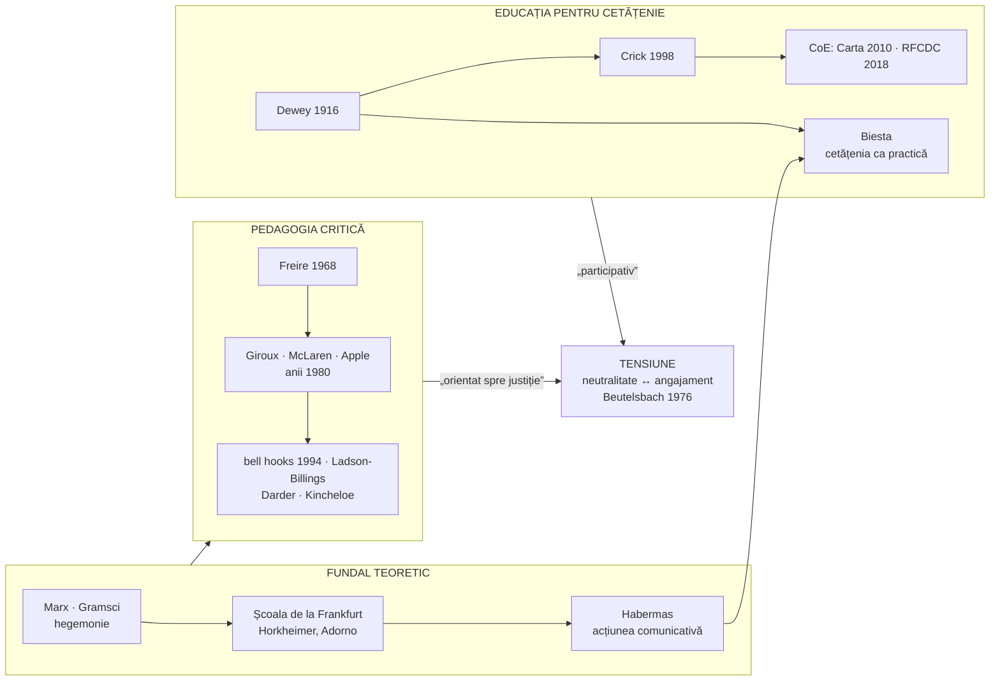
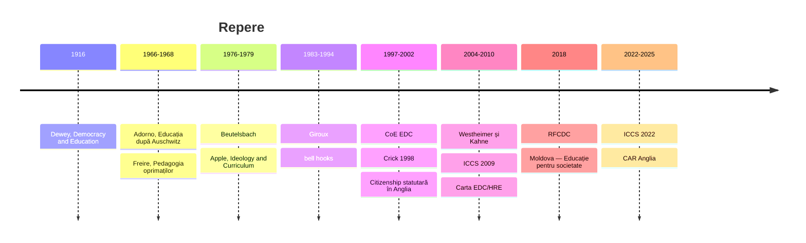

↑ [[00 Index - Analiza comparată internațională]] · [[00 MOC - Fundamentele științelor educației]] · Conspect-sursă: [[7.2.1 Educația pentru participare și democrație]]

> [!abstract] Pe scurt
> 1. Cardul unește două familii înrudite. **Pedagogia critică** (*critical pedagogy*) arată că educația **nu e neutră**: reproduce sau contestă relații de putere, iar scopul ei trebuie să fie **emanciparea** (Freire, Giroux, McLaren, Apple, bell hooks). **Educația pentru cetățenie democratică** (*education for democratic citizenship*) urmărește să formeze cetățeni informați, capabili de **judecată** și **participare** (Dewey, Crick, Consiliul Europei, Biesta).
> 2. **Freire** (*Pedagogia oprimaților*, 1968/1970) respinge **„educația bancară”** (profesorul „depune” cunoștințe în elevi pasivi) în favoarea **dialogului** și a **conștientizării** (*conscientização*). Fundalul teoretic larg include **Școala de la Frankfurt**, **Gramsci** și **Habermas**.
> 3. Educația pentru cetățenie a fost **instituționalizată** prin: **Raportul Crick** (Anglia, 1998; disciplină statutară din 2002), **Carta EDC/HRE** a Consiliului Europei (2010), **RFCDC** (2018, 20 de competențe) și studiile IEA **ICCS** (2009, 2016, 2022).
> 4. **Tensiunea centrală** este **neutralitate vs. angajament**. Poate școala să formeze valori democratice fără să îndoctrineze? Răspunsul german clasic este **Consensul de la Beutelsbach** (1976): interdicția îndoctrinării, prezentarea controversată a ce e controversat, orientarea spre interesele elevului.
> 5. **Westheimer și Kahne** (2004) disting trei tipuri de cetățeni: **personal responsabil**, **participativ** și **orientat spre justiție**. Sistemele aleg diferit: Singapore și Japonia accentuează primul tip, pedagogia critică americană pe al treilea, Consiliul Europei pe al doilea.
> 6. **Dovezile ICCS**: **climatul deschis de discuție** în clasă se asociază cu cunoștințe civice mai bune și cu intenția de participare. **Estonia**, **Finlanda** și **Suedia** sunt constant peste media europeană. În ICCS 2022, primele locuri au fost ocupate de Taiwan (583) și Suedia (565).
> 7. Controversele sunt vii: **SUA** (legi restrictive după 2021, războaie culturale), **Coreea** (polarizare ideologică), **Japonia** (neutralitatea strictă a profesorilor), **Singapore** (coeziune vs. critică).
> 8. **R. Moldova**: disciplina **Educație pentru societate** (clasele V–XII, introdusă din septembrie 2018 în clasele a V-a și a X-a) a înlocuit „Educația civică” și e construită pe **RFCDC**, cu sprijinul Consiliului Europei.

---

## 1. Explicația teoriei

### 1.1 Întrebările la care răspunde

- **Pedagogia critică**: *În interesul cui funcționează școala?* Ce cunoaștere e considerată „oficială” și cine decide? Cum poate educația să ajute oprimații să-și înțeleagă și să-și transforme situația?
- **Educația pentru cetățenie**: *Ce fel de cetățeni are nevoie o democrație și cum îi formează școala?* Ce cunoștințe, abilități, atitudini și valori? Prin ce: disciplină separată, abordare transversală, viața democratică a școlii?
- **Întrebarea comună**: *Cum educi pentru libertate fără să impui o doctrină?*

### 1.2 Ideile centrale ale pedagogiei critice

1. **Educația e un act politic**: a pretinde neutralitatea înseamnă a sprijini tacit ordinea existentă (Freire).
2. **Critica „educației bancare”**: elevul ca recipient pasiv. Alternativa este **educația problematizantă** (*problem-posing education*), în care profesorul și elevii investighează împreună realitatea.
3. **Conștientizarea** (*conscientização*): trecerea de la o conștiință „magică” sau „naivă” la una **critică**, care înțelege cauzele sociale ale situației proprii.
4. **Praxis**: unitatea dintre **reflecție** și **acțiune** transformatoare.
5. **Dialogul** ca relație orizontală: „nimeni nu educă pe nimeni, nimeni nu se educă singur; oamenii se educă împreună, mediați de lume” (idee parafrazată din Freire; → [[3.6 Educația permanentă și autoeducația]]).
6. **Curriculumul ascuns** și **cunoașterea oficială** (Apple): conținuturile și rutinele școlare transmit ierarhii de clasă, rasă și gen.
7. **Profesorul ca intelectual transformativ** (Giroux), nu ca tehnician care aplică programe.
8. **Reproducere și rezistență**: școala reproduce inegalitățile (Bourdieu și Passeron; Bowles și Gintis), dar elevii și profesorii pot rezista (Willis, Giroux).

### 1.3 Ideile centrale ale educației pentru cetățenie democratică

1. **Democrația ca mod de viață**, nu doar ca formă de guvernare (Dewey, 1916). Școala trebuie să fie ea însăși o **comunitate democratică**.
2. **Trei componente** (Crick, 1998): **responsabilitate socială și morală**, **implicare în comunitate**, **alfabetizare politică** (*political literacy*).
3. **Cetățenia ca set de competențe**: valori, atitudini, abilități, cunoaștere și înțelegere critică (RFCDC).
4. **Învățare despre, prin și pentru democrație**: cunoștințe despre instituții; participare la viața școlii; dispoziții pentru acțiune civică.
5. **Controversele** ca materie de studiu: discutarea problemelor disputate e esențială pentru democrație (Hess, 2009).
6. **Cetățenia ca practică** (Biesta): democrația nu e un rezultat al învățării pe care elevul îl „posedă”, ci ceva ce se **exersează** și se reinventează.

### 1.4 Concepte-cheie

| Concept | Definiție |
|---|---|
| **Educație bancară** (*educação bancária*) | model în care profesorul depune informații în elevi pasivi; produce adaptare, nu gândire critică (Freire) |
| **Conștientizare** (*conscientização*) | dezvoltarea conștiinței critice asupra contradicțiilor sociale și a capacității de a acționa asupra lor |
| **Teme generative** | teme din viața reală a celor care învață, identificate prin cercetare participativă, de la care pornește alfabetizarea (Freire) |
| **Praxis** | reflecție + acțiune pentru transformarea lumii |
| **Hegemonie** (Gramsci) | dominația obținută prin consimțământ cultural, nu doar prin forță; școala e un loc al producerii consimțământului |
| **Curriculum ascuns** (*hidden curriculum*; Jackson, 1968) | normele, valorile și ierarhiile transmise implicit prin organizarea școlii (→ [[3.2 Educația formală]]) |
| **Cunoaștere oficială** (Apple) | cunoașterea selectată ca legitimă în curriculum, rezultat al unor lupte politice și culturale |
| **Intelectual transformativ** (Giroux) | profesorul care reflectează critic asupra scopurilor educației și acționează pentru democrație |
| **Pedagogie angajată** (*engaged pedagogy*, bell hooks) | predare care implică întreaga persoană (minte, corp, spirit) și leagă învățarea de libertate |
| **Deșcolarizare** (*deschooling*, Illich) | critica monopolului instituțional al școlii; propunerea „rețelelor de învățare” |
| **Alfabetizare politică** (Crick) | cunoștințe, abilități și valori pentru a fi eficient în viața publică |
| **Carta EDC/HRE** (CoE, 2010) | distincția **educație pentru cetățenie democratică** (drepturi, responsabilități, participare) / **educație pentru drepturile omului** |
| **RFCDC** (CoE, 2018) | modelul „fluture” cu **20 de competențe**: 3 valori, 6 atitudini, 8 abilități, 3 tipuri de cunoaștere și înțelegere critică |
| **Climatul deschis de discuție** (*open classroom climate*) | măsura ICCS: elevii simt că își pot exprima opiniile, inclusiv în dezacord cu profesorul și colegii |
| **Consensul de la Beutelsbach** (1976) | (1) interdicția copleșirii/îndoctrinării (*Überwältigungsverbot*); (2) ce e controversat în știință și politică apare controversat și la clasă (*Kontroversitätsgebot*); (3) elevul trebuie să-și poată analiza situația și interesele |
| **Trei tipuri de cetățeni** (Westheimer și Kahne, 2004) | **personal responsabil** (respectă legea, donează, face voluntariat); **participativ** (organizează, se implică în instituții); **orientat spre justiție** (analizează cauzele structurale, urmărește schimbarea sistemică) |
| **Scara participării** (Hart, 1992) | 8 trepte, de la manipulare și tokenism la inițiative ale copiilor cu decizii împreună cu adulții (→ [[7.2.1 Educația pentru participare și democrație]]) |
| **Subiectivare** (Biesta) | a treia funcție a educației, alături de calificare și socializare: apariția elevului ca **subiect** independent, nu doar ca exemplar al ordinii existente |

### 1.5 Ce presupune despre elev, profesor, cunoaștere și școală

| Dimensiune | Pedagogia critică | Educația pentru cetățenie democratică |
|---|---|---|
| **Elevul** | subiect istoric, capabil să-și „citească lumea” și să o transforme | cetățean în formare, cu drepturi prezente (CDC ONU, art. 12), nu doar viitoare |
| **Profesorul** | intelectual transformativ, partener de dialog, nu neutru | facilitator al discuției, model de comportament democratic; **echilibrat** în chestiunile controversate |
| **Cunoașterea** | construită social, legată de putere; se pornește de la experiența celor care învață | cunoaștere despre instituții, drepturi, istorie, plus competențe de deliberare și gândire critică |
| **Școala** | loc al reproducerii și al rezistenței | „mini-polis”: consilii ale elevilor, reguli negociate, proiecte în comunitate |

---

## 2. Geneza și evoluția

### 2.1 Rădăcini

- **Antichitatea**: *paideia* civică (Pericle, Aristotel: omul ca „animal politic”). Educația cetățeanului ca finalitate a *polis*-ului.
- **Rousseau**, *Contractul social* (1762) și *Considerații asupra guvernării Poloniei* (1772): educația națională a cetățeanului. **Condorcet**, *Cinci memorii despre instrucțiunea publică* (1791–1792): instrucțiunea publică trebuie să formeze cetățeni **liberi**, nu să predea dogme politice — o formulare timpurie a tensiunii neutralitate–angajament.
- **Sec. XIX**: educația civică **națională** (Franța, Republica a III-a: *instruction morale et civique*, legile Ferry din 1881–1882); **Durkheim**: educația morală laică.
- **Dewey**, *Democracy and Education* (1916): democrația ca mod de viață asociată; școala ca **societate embrionară**.
- **Marx** și **Gramsci** (*Caietele din închisoare*, 1929–1935): hegemonia culturală și rolul intelectualilor.
- **Școala de la Frankfurt**: Horkheimer, „Teorie tradițională și teorie critică” (1937); **Adorno**, „Educația după Auschwitz” (conferință radio, 1966): prima cerință a educației este ca Auschwitz să nu se mai repete, deci educația pentru **autonomie** și **împotrivirea** la conformism.
- **George Counts**, *Dare the School Build a New Social Order?* (1932) — reconstrucționismul social american.

### 2.2 Formularea pedagogiei critice (1960–1990)

- **Paulo Freire**: campania de alfabetizare de la **Angicos** (Brazilia, 1963), exilul după lovitura de stat din 1964, *Educação como prática da liberdade* (1967), ***Pedagogia do oprimido*** (scrisă în Chile în 1968; ediția engleză, New York, 1970; ediția portugheză în Brazilia, 1974). A lucrat la Consiliul Mondial al Bisericilor, Geneva, în anii 1970, și a colaborat cu programe de alfabetizare în Guineea-Bissau.
- **Ivan Illich**, *Deschooling Society* (1971); **Everett Reimer**, *School Is Dead* (1971).
- **Mollenhauer**, *Erziehung und Emanzipation* (1968) — **Kritische Erziehungswissenschaft** în Germania.
- **Teoriile reproducerii**: Bourdieu și Passeron, *La Reproduction* (1970); Bowles și Gintis, *Schooling in Capitalist America* (1976); Paul Willis, *Learning to Labour* (1977).
- **Michael Apple**, *Ideology and Curriculum* (1979). **Henry Giroux**, *Theory and Resistance in Education* (1983), care introduce termenul **critical pedagogy** în uz larg. **Peter McLaren**, *Life in Schools* (1989).
- **Habermas**, *Teoria acțiunii comunicative* (1981) — fundament pentru deliberare și pentru *Kritische Erziehungswissenschaft*.
- **Germania**: **Consensul de la Beutelsbach** (conferința din 1976 a Centrului pentru educație politică din Baden-Württemberg; formulat de Hans-Georg Wehling în 1977), după conflictele ideologice ale anilor 1970 privind educația politică.
- **Critica feministă** din interior: Elizabeth Ellsworth, „Why Doesn't This Feel Empowering?” (*Harvard Educational Review*, 1989).

### 2.3 Instituționalizarea educației pentru cetățenie (1990–2010)

- După **1989**: democratizarea Europei Centrale și de Est; **Consiliul Europei** lansează proiectul **EDC** (1997). În fostele state sovietice, „educația comunistă” e înlocuită de „educație civică”.
- **bell hooks**, *Teaching to Transgress* (1994); **Gloria Ladson-Billings**, pedagogia relevantă cultural (1995).
- **Freire**, *Pedagogia autonomiei* (1996), ultima carte; moare în 1997.
- **IEA CIVED** (1999): studiu în 28 de țări (Torney-Purta et al., 2001).
- **Raportul Crick** (1998) → **Citizenship** statutară în Anglia, în KS3–4, din **august 2002**. **Raportul Ajegbo** (2007) adaugă dimensiunea „identitate și diversitate”.
- **Westheimer și Kahne**, „What kind of citizen?” (*American Educational Research Journal*, 2004).
- **Biesta**, *Beyond Learning* (2006); *Good Education in an Age of Measurement* (2010).
- **Anul european al cetățeniei prin educație** (2005).
- **ICCS 2009** (38 de țări). **Carta EDC/HRE**, Recomandarea CM/Rec(2010)7 (11 mai 2010).

### 2.4 Stadiul actual (2011–2026)

- **Declarația de la Paris** (2015), după atentatele teroriste: educația pentru valori comune, gândire critică și alfabetizare media. **Recomandarea Consiliului UE privind valorile comune și educația incluzivă** (2018).
- **RFCDC** (CoE, model din 2016; cadru complet în 3 volume, 2018; coordonator științific Martyn Barrett).
- **UNESCO — Global Citizenship Education** (2015); **ODD 4.7**.
- **ICCS 2016** (24 de țări) și **ICCS 2022** (24 de țări, predominant europene): scăderea cunoștințelor civice în mai multe țări și îngrijorări privind încrederea în democrație.
- **Hess și McAvoy**, *The Political Classroom* (2015): cum predau profesorii probleme controversate în contexte polarizate.
- **Populism și polarizare**: educația pentru cetățenie devine front politic (SUA: legi despre „concepte divizive” după 2021; Ungaria, Polonia 2015–2023; Rusia: militarizarea educației patriotice).
- **Războiul din Ucraina** (2022–): educația pentru reziliență democratică, contra dezinformării, relevantă direct pentru R. Moldova.
- **Anglia**: *Curriculum and Assessment Review* (2025) recomandă cetățenia statutară **din KS1**, cu alfabetizare financiară și media.

---

## 3. Autori, reprezentanți, cercetători

| Autor | Lucrare(ări), an | Aportul concret |
|---|---|---|
| **John Dewey** | *Democracy and Education* (1916); *The Public and Its Problems* (1927) | democrația ca mod de viață; școala ca comunitate democratică; învățarea prin experiență socială |
| **Antonio Gramsci** | *Caiete din închisoare* (1929–1935) | **hegemonia** culturală; intelectualii „organici”; școala unitară umanistă |
| **Max Horkheimer, Theodor W. Adorno** | „Teorie tradițională și teorie critică” (1937); *Dialectica luminilor* (1944/1947); Adorno, *Erziehung zur Mündigkeit* (1971, conferințe radio) | teoria critică; educația pentru **autonomie** (*Mündigkeit*) și împotriva conformismului autoritar |
| **Jürgen Habermas** | *Cunoaștere și interes* (1968); *Teoria acțiunii comunicative* (1981) | interesul **emancipator** al cunoașterii; rațiunea comunicativă și deliberarea — fundament al democrației deliberative în educație |
| **Paulo Freire** | *Educação como prática da liberdade* (1967); *Pedagogia do oprimido* (1968/1970); *Pedagogia da esperança* (1992); *Pedagogia da autonomia* (1996) | educația bancară vs. problematizantă; conștientizare; dialog; teme generative; alfabetizarea adulților ca act politic |
| **Ivan Illich** | *Deschooling Society* (1971) | critica monopolului școlii; „rețele de învățare” (→ [[3.6 Educația permanentă și autoeducația]]) |
| **Klaus Mollenhauer** | *Erziehung und Emanzipation* (1968) | știința critică a educației în Germania; emanciparea ca finalitate |
| **Samuel Bowles și Herbert Gintis** | *Schooling in Capitalist America* (1976) | **teoria corespondenței**: relațiile sociale din școală reproduc ierarhiile muncii |
| **Pierre Bourdieu și Jean-Claude Passeron** | *La Reproduction* (1970) | **capitalul cultural** și violența simbolică |
| **Michael W. Apple** | *Ideology and Curriculum* (1979); *Official Knowledge* (1993); *Educating the „Right” Way* (2001) | curriculumul ca selecție ideologică; „cunoașterea oficială”; analiza alianței conservatoare (neoliberali + neoconservatori) în educație |
| **Henry A. Giroux** | *Theory and Resistance in Education* (1983); *Teachers as Intellectuals* (1988) | teoria **rezistenței**; profesorul ca **intelectual transformativ**; popularizarea termenului *critical pedagogy* |
| **Peter McLaren** | *Schooling as a Ritual Performance* (1986); *Life in Schools* (1989) | etnografia ritualurilor școlare; pedagogia critică marxistă „revoluționară” |
| **bell hooks** (Gloria Jean Watkins) | *Teaching to Transgress* (1994); *Teaching Community* (2003) | **pedagogia angajată**; intersecția rasă–gen–clasă; clasa ca loc al libertății |
| **Gloria Ladson-Billings** | „Toward a theory of culturally relevant pedagogy” (*AERJ*, 1995) | succes academic + competență culturală + conștiință sociopolitică |
| **Elizabeth Ellsworth** | „Why doesn't this feel empowering?” (*Harvard Educational Review*, 1989) | critică internă: „împuternicirea” și dialogul pot reproduce autoritatea profesorului |
| **Bernard Crick** | *Education for Citizenship and the Teaching of Democracy in Schools* (QCA, 1998); *In Defence of Politics* (1962) | cele trei componente ale cetățeniei; **alfabetizarea politică**; baza disciplinei statutare din Anglia |
| **Hans-Georg Wehling** | formularea **Consensului de la Beutelsbach** (1977) | cele trei principii ale educației politice germane |
| **Judith Torney-Purta** | coordonatoare IEA CIVED (Torney-Purta et al., *Citizenship and Education in Twenty-Eight Countries*, 2001) | primul mare studiu comparat despre cunoștințele și atitudinile civice ale elevilor; importanța climatului deschis |
| **Wolfram Schulz, John Ainley, Julian Fraillon et al.** | rapoartele internaționale ICCS (2010, 2018, 2023/2024) | cadrul de evaluare și rezultatele ICCS; asocierea dintre climatul deschis și cunoștințele civice |
| **Joel Westheimer și Joseph Kahne** | „What kind of citizen? The politics of educating for democracy” (*AERJ*, 2004); Westheimer, *What Kind of Citizen?* (2015) | cele **trei tipuri de cetățeni**; programele de cetățenie au consecințe politice diferite |
| **Diana Hess** / **Hess și Paula McAvoy** | *Controversy in the Classroom* (2009); *The Political Classroom* (2015) | predarea problemelor controversate; când profesorul își dezvăluie opiniile |
| **Gert Biesta** | *Beyond Learning* (2006); *Good Education in an Age of Measurement* (2010); *Learning Democracy in School and Society* (2011); *The Beautiful Risk of Education* (2013) | **calificare, socializare, subiectivare**; critica „învățării” ca limbaj depolitizat; cetățenia ca **practică** |
| **Martyn Barrett** (Surrey) | *Reference Framework of Competences for Democratic Culture* (CoE, 2018) | arhitectul modelului celor **20 de competențe** |
| **Audrey Osler și Hugh Starkey** | *Changing Citizenship* (2005); *Teachers and Human Rights Education* (2010) | cetățenia **cosmopolită** și educația pentru drepturile omului |
| **Critici din alte direcții**: **E. D. Hirsch**; **Michael Young**; **Chester Finn** | Hirsch, *Cultural Literacy* (1987); Young, *Bringing Knowledge Back In* (2008) | pedagogia critică neglijează **cunoașterea puternică** pe care elevii dezavantajați nu o primesc acasă; riscul politizării școlii |

---

## 4. Legătura cu manualul și cu vaultul

| Unde | Ce spune manualul / conspectul | Evaluare |
|---|---|---|
| [[7.2.1 Educația pentru participare și democrație]] | educația pentru participare și democrație; voluntariatul (6 pagini); dimensiunea „conativă” | **dezechilibru**: democrația are o pagină, voluntariatul șase; lipsesc instituțiile democratice, drepturile omului, participarea școlară; confuzie conativ/conotație; conspectul adaugă Carta EDC/HRE, RFCDC, Hart |
| [[6.2.1 Educația morală]] | educația **moral-civică** (conținut preponderent social, democratic); după Cristea lipsește **educația politică** | în curriculum, educația moral-civică = **Educație pentru societate**; art. 7 lit. e) și art. 135 lit. n) din Cod: neutralitate politică și religioasă |
| [[7.2.4 Educația pentru pace și cooperare]] | educația pentru pace | conspectul îl include pe Freire (conștientizare, dialog) printre surse; legătură cu ODD 4.7 |
| [[7.3 Proiectarea curriculară a noilor educații]] | modalități de integrare curriculară (disciplină, modul, infuzie) | Educație pentru societate = varianta **disciplinară** |
| [[2.5 Structura și funcționarea educației]] | transformarea obiectului educației în subiect | Freire: dialogul face din educator și educat subiecți |
| [[3.2 Educația formală]] | curriculumul ascuns | concept central al pedagogiei critice |
| [[3.3 Educația nonformală]] · [[3.6 Educația permanentă și autoeducația]] | educația populară; Illich; Freire | Freire e sursa pedagogiei conștientizării în educația adulților |
| [[5.2 Tipologia paradigmelor educaționale]] | paradigma **critică / transformativă** în cercetare (Habermas, Freire, Carr și Kemmis); curriculumul ca praxis | corelare directă |
| [[4.4 Finalitățile macro- și microstructurale]] · [[Modulul 04 - Finalitățile educației]] | idealul educațional (art. 6 din Cod) | întrebarea „ce fel de cetățean” e o întrebare despre finalități |
| [[Modulul 07 - Noile educații]] | educația pentru democrație ca „nouă educație” | Consiliul Europei a operaționalizat-o prin cadre de competențe |

> [!note] Ce lipsește din manual
> Manualul tratează democrația **normativ și sumar**. Nu prezintă nici pedagogia critică, nici tensiunea **neutralitate–angajament**, nici instrumentele europene. Pentru examen: **Freire** (educația bancară, conștientizarea), **Crick** (trei componente), **Carta EDC/HRE 2010**, **RFCDC 2018**, **Beutelsbach** (trei principii), **Westheimer și Kahne** (trei tipuri de cetățeni) și, pentru R. Moldova, **Educație pentru societate** (2018).

---

## 5. Implementare comparată

### 5.1 Tabel-sinteză

| Sistem | Cum a fost implementată (politică / program / instituție) | Când | Scară / intensitate | Dovezi sau rezultate |
|---|---|---|---|---|
| **Singapore** | ***National Education*** (1997); **CCE** (2014, 2021) cu componenta civică; *Values in Action*; *Total Defence*; discuții despre probleme contemporane (CCE 2021); disciplina *Social Studies* în secundar | 1997–prezent | **centrală**, dar orientată spre **coeziune și loialitate** | nu participă la ICCS; literatura critică: model dominant „personal responsabil” și al armoniei; spațiu limitat pentru critica politicilor publice; tensiune cu gândirea critică proclamată în 21CC |
| **Estonia** | *ühiskonnaõpetus* (studii sociale / civică) în gimnaziu și liceu; tema transversală „inițiativă civică și antreprenoriat”; școala ca model de societate democratică (legea din 2010, § 7); consilii ale elevilor; profesorii ca agenți ai emancipării naționale (1987–1991) | 1991–prezent | **medie–centrală** | **ICCS 2009, 2016, 2022 peste media UE**; ICCS 2022: **545** de puncte (locul 4); tensiuni privind minoritatea rusofonă și închiderea școlilor în limba rusă |
| **Finlanda** | *yhteiskuntaoppi* (studii sociale) disciplină separată și în clasele 4–6 (curriculum 2014); competența transversală **T7** (participare, implicare, construirea unui viitor sustenabil); consilii ale elevilor; parlamentul copiilor și tinerilor | 1970–prezent | **medie** | **ICCS 2009** (locul 1 la cunoștințe civice, alături de Danemarca) și **ICCS 2016**: **577** de puncte (locul 4); participarea la ICCS 2022 — de verificat; interes relativ scăzut pentru participarea convențională în rândul tinerilor; pedagogia critică apare mai ales ca **critică** a influenței OCDE (Simola) |
| **Regatul Unit** | **Anglia**: Raportul **Crick** (1998) → *Citizenship* **statutară în KS3–4 din 2002**; *Fundamental British values* (2014, în contextul *Prevent*); CAR 2025 recomandă cetățenia statutară din KS1. **Scoția**: CfE — *responsible citizens*; disciplina ***Modern Studies***; vot de la 16 ani la alegerile scoțiene (din 2015–2016). **Țara Galilor**: *ethical, informed citizens*; vot de la 16 ani (din 2020). **Irlanda de Nord**: *integrated education* | 1998–prezent | **medie** (Anglia: în declin după 2010) / **medie–centrală** (Scoția) | **CELS** (studiul longitudinal NFER, 2001–2010): efecte pozitive când cetățenia e predată de specialiști și are timp dedicat; Ofsted (2013) și Comisia Camerei Lorzilor (2018) au criticat **marginalizarea** disciplinei; *Prevent* criticat pentru **securitizarea** educației |
| **Japonia** | disciplina ***Kōkyō*** („Public”, liceu, **2022**); **educația cetățeanului-suveran** (*shukensha kyōiku*) după coborârea vârstei de vot la 18 ani (2016); consiliul clasei și al elevilor în *tokkatsu*; tradiția ***seikatsu tsuzurikata*** (scrierea despre propria viață, anii 1930) și a educației pentru pace; procesele lui **Ienaga Saburō** privind manualele de istorie (1965–1997) | 1947/2016–prezent | **medie** (participare în școală) / **redusă** (dezbatere politică) | nu participă la ICCS; **neutralitatea politică strictă** a profesorilor (Legea fundamentală a educației, art. 14) limitează discutarea problemelor controversate; participare electorală scăzută a tinerilor |
| **Coreea de Sud** | tema transversală **„cetățenie democratică”** și **drepturile omului** (curriculum 2022); disciplina studii sociale; sindicatul profesorilor **KTU** (1989, legalizat în 1999, „educație adevărată”); **ordonanțele privind drepturile elevilor** (Gyeonggi 2010, Seoul 2012; contestate politic după 2023 — de verificat stadiul) | 1987–prezent | **redusă–medie** | ICCS 2009 și 2016 (Coreea a participat; scoruri peste media internațională — de verificat); **polarizare ideologică** puternică a educației civice și a manualelor de istorie; dezbaterea despre autoritatea profesorului după 2023 |
| **Canada** | disciplinele provinciale de *social studies*; **Ontario**: cursul obligatoriu *Civics and Citizenship* (clasa a 10-a, jumătate de credit, din anii 1999–2000); ***CIVIX Student Vote*** (alegeri simulate în școli, din 2003); educația pentru **reconciliere** cu popoarele indigene (după Comisia pentru Adevăr și Reconciliere, 2015) | 1999–prezent | **medie** | nu participă la ICCS (de verificat); evaluările cursului din Ontario arată efecte **modeste** asupra implicării; decolonizarea curriculumului e o formă contemporană de pedagogie critică instituționalizată |
| **Europa (UE / Consiliul Europei)** | **CoE**: proiectul EDC (1997–), **Carta EDC/HRE** (2010), **RFCDC** (2018); **UE**: Declarația de la Paris (2015), recomandarea privind valorile comune (2018), Eurydice *Citizenship Education at School in Europe* (2017); **Germania**: *politische Bildung* și **Beutelsbach** (1976), centrele federale și ale landurilor pentru educație politică; **Franța**: *enseignement moral et civique* (2015) | 1976/1997–prezent | **centrală** ca cadru normativ; **variabilă** în statele membre | **ICCS**: țările nordice și baltice în frunte; asocieri solide între **climatul deschis de discuție** și cunoștințele civice; ICCS 2022: scăderi ale cunoștințelor în mai multe țări |
| **SUA** | *civics* și *social studies* în statele federale; cerințe de absolvire (în multe state, **testul de cetățenie** al serviciului de imigrare); *service learning*; ***action civics***; *Educating for American Democracy* (2021); *ethnic studies* (California); pedagogia critică în facultățile de educație | 1916 (*The Social Studies in Secondary Education*) – prezent | **medie**, foarte variabilă | **NAEP Civics 2022** (clasa a VIII-a): prima **scădere** a scorului mediu, ≈ 22% la nivel *proficient*; Dee și Penner (2017): *ethnic studies* în San Francisco au crescut prezența și creditele; după 2021, **legi restrictive** privind „conceptele divizive” în numeroase state, conflicte asupra cărților — educația civică ca **front al războaielor culturale** |
| **Republica Moldova** | **Educație civică** (anii 1990–2018) → ***Educație pentru societate*** (clasele V–XII), curriculum aprobat prin **Ordinul MECC nr. 1124/2018**, introdus în **septembrie 2018** în clasele a V-a și a X-a, apoi extins; competențe preluate din **RFCDC**; ghiduri pentru profesori elaborate cu **Consiliul Europei**; module de cetățenie democratică, drepturile omului, integritate, educație interculturală; opționalul **Dezbateri**; consilii ale elevilor; **Legea voluntariatului nr. 326/2025** | 2018–prezent | **medie** (o oră pe săptămână; în consolidare) | nu a participat la ICCS (de verificat); nu există evaluări de impact publicate; provocări: formarea profesorilor (mulți predau disciplina fără specializare), dezinformarea, polarizarea geopolitică, neutralitatea politică cerută de Cod (art. 7, art. 135) |

### 5.2 Studiu de caz 1 — Anglia și Scoția: cetățenia ca disciplină și ca finalitate

→ [[Regatul Unit - ecosistemul educațional]]

**Anglia: ascensiunea și declinul unei discipline.** Raportul **Crick** (1998), comandat de guvernul laburist, a definit trei componente (responsabilitate socială și morală, implicare în comunitate, alfabetizare politică) și a avertizat că democrația britanică suferă de **apatie**. *Citizenship* a devenit **statutară** în secundar în 2002, cu GCSE opțional. Studiul longitudinal **CELS** (NFER, 2001–2010) a arătat efecte pozitive asupra cunoștințelor și intenției de participare **acolo unde** disciplina era predată regulat, de profesori formați, cu timp dedicat. În multe școli însă a fost „infuzată” sau lipită de PSHE, cu efecte slabe.

După 2010, curriculumul național din 2014 a simplificat programa. Academiile nu sunt obligate să o urmeze, iar formarea profesorilor specialiști s-a redus. În paralel, strategia ***Prevent*** și obligația de a promova ***Fundamental British values*** (2014) au mutat accentul de la **alfabetizarea politică** la **securitate** și **loialitate** — o schimbare criticată ca instrumentalizare. CAR 2025 propune relansarea cetățeniei statutare încă din primar.

**Scoția: cetățenia ca finalitate, nu ca disciplină.** CfE o plasează printre **cele patru capacități** (*responsible citizens*). Disciplina ***Modern Studies*** (politică, societate, relații internaționale, cu examene naționale) oferă o bază de alfabetizare politică neobișnuit de solidă. Coborârea vârstei de vot la 16 ani (referendumul din 2014, alegerile scoțiene din 2016) a creat un **stimulent real** pentru dezbatere la clasă.

**Lecția.** Educația pentru cetățenie funcționează când are **timp, profesori specialiști și un scop politic real** (votul la 16 ani). Declarațiile generale în curriculum nu sunt suficiente.

### 5.3 Studiu de caz 2 — Germania: politische Bildung și Consensul de la Beutelsbach

→ [[Europa - spațiul european al educației]]

**Contextul.** După 1945, educația politică a fost gândită ca **„reeducare”** democratică, după experiența nazistă. În anii 1970, disputele dintre didacticieni de stânga (inspirați de teoria critică) și conservatori au amenințat să transforme disciplina într-un câmp de luptă partinic.

**Consensul.** La o conferință din 1976 la Beutelsbach, didacticieni cu orientări politice diferite au convenit, în formularea lui Wehling (1977), trei principii:
1. **Interdicția copleșirii** (*Überwältigungsverbot*): profesorul nu are voie să impună elevului o opinie și să-l împiedice să-și formeze o judecată proprie.
2. **Cerința controversei** (*Kontroversitätsgebot*): ce e controversat în știință și politică trebuie să apară controversat și la clasă.
3. **Orientarea spre elev**: elevul trebuie să fie capabil să-și analizeze situația politică și propriile interese și să caute mijloace de a le influența.

**Instituționalizare.** Consensul a devenit **normă profesională** nescrisă. Există centre federale (*Bundeszentrale für politische Bildung*) și ale landurilor pentru educație politică.

**Dezbateri actuale.** Beutelsbach **nu înseamnă neutralitate valorică absolută**. Profesorii sunt legați de ordinea constituțională liberal-democratică, deci pozițiile care neagă demnitatea umană nu sunt tratate ca „o opinie printre altele”. Ascensiunea partidului AfD a readus întrebarea: poate profesorul critica un partid parlamentar extremist fără să încalce interdicția copleșirii?

**Lecția pentru R. Moldova.** Codul Educației (art. 7 lit. e și art. 135 lit. n) interzice propaganda politică în școală. Beutelsbach oferă un model mai fin decât „tăcerea”: **controversă echilibrată + angajament pentru valorile constituționale**.

### 5.4 Studiu de caz 3 — Singapore și Japonia: cetățenia pentru coeziune

→ [[Singapore - ecosistemul educațional]] · [[Japonia - ecosistemul educațional]]

**Singapore.** *National Education* (1997) a fost lansat după constatarea că tinerii nu cunoșteau istoria independenței și a tensiunilor etnice din anii 1960. Scopul era **identitatea națională**, **armonia rasială și religioasă** și **reziliența** în fața vulnerabilității statului mic. CCE 2014/2021 integrează dimensiunea civică cu valorile și SEL, iar CCE 2021 introduce discuții despre probleme contemporane (rasă, religie, diversitate, mediul online). În tipologia Westheimer–Kahne, modelul dominant este **cetățeanul personal responsabil** și, parțial, **participativ** (*Values in Action*). Dimensiunea **orientată spre justiție** și critica politicilor publice sunt limitate.

**Japonia.** Constituția și Legea fundamentală a educației (1947) au făcut din educație un instrument de democratizare, iar sindicatul **Nikkyōso** a apărat educația pentru pace. Revizuirea Legii fundamentale (2006) a introdus „dragostea de țară”. **Neutralitatea politică** strictă a profesorilor a produs o educație civică **procedurală** (instituții, reguli, vot) mai degrabă decât deliberativă. Coborârea vârstei de vot la 18 ani (2016) și noua disciplină *Kōkyō* (2022) încearcă să introducă **dezbaterea** și rezolvarea problemelor publice.

**Lecția comparată.** Sistemele asiatice cu performanțe academice ridicate ilustrează **tensiunea dintre educația pentru coeziune și cea pentru emancipare**. Educația civică nu e o tehnică neutră, ci o **alegere politică** despre ce fel de cetățean dorește societatea.

### 5.5 Studiu de caz 4 — Republica Moldova: de la „Educația civică” la RFCDC

**Moștenirea.** În RSS Moldovenească, educația civică însemna **educație comunistă și patriotică** (ateism științific, organizațiile de pionieri și comsomol, colectivul lui Makarenko). După 1991, disciplina **Educație civică** a fost introdusă în gimnaziu și liceu, cu manuale centrate pe **cunoștințe** despre stat, Constituție și drepturi.

**Reforma din 2018.** Cu sprijinul **Consiliului Europei** (proiectul „Educație pentru democrație în Republica Moldova”), MECC a elaborat disciplina ***Educație pentru societate***:
- competențele sunt construite pe **RFCDC** (20 de valori, atitudini, abilități, cunoaștere și înțelegere critică);
- a fost introdusă în **septembrie 2018** în clasele a V-a și a X-a, apoi generalizată în V–XII;
- curriculumul (Ordinul MECC nr. 1124/2018) și ghidurile pentru profesori pe clase au fost elaborate cu experți ai CoE;
- modulele includ cetățenie democratică, drepturile omului, integritate și anticorupție, educație interculturală, educație financiară și media (lista exactă — de verificat în curriculum);
- accentul metodologic cade pe **proiecte**, **dezbateri** și **învățare prin acțiune**.

**Contextul favorabil.** Codul Educației (art. 6) include în idealul educațional **cetățenia activă**. Noua Lege a voluntariatului (nr. 326/2025) certifică competențele dobândite prin voluntariat. Parcursul european (statutul de țară candidată din 2022) oferă un orizont politic clar.

**Provocări:**
1. **Profesorii**: disciplina e predată adesea de profesori de istorie, geografie sau alte discipline, cu formare scurtă. Metodele participative cer schimbarea rolului profesorului.
2. **Neutralitatea în context polarizat**: geopolitica (UE–Rusia), limba, identitatea și **dezinformarea** fac din clasa de Educație pentru societate un teren sensibil. Codul interzice propaganda politică, dar nu oferă un ghid de tip Beutelsbach despre predarea controverselor.
3. **Evaluarea**: nu există evaluări de impact publicate și nici participare la ICCS (de verificat), deci efectul reformei e necunoscut.
4. **Curriculumul ascuns**: consiliile elevilor sunt adesea **decorative** (treptele 2–3 pe scara lui Hart), iar cultura școlară rămâne ierarhică. Discursul democratic la clasă concurează cu practica autoritară a școlii.

---

## 6. Dovezi empirice și critici

### 6.1 Ce arată cercetarea

| Întrebare | Studii | Rezultat |
|---|---|---|
| Ce se asociază cu cunoștințele civice? | **ICCS 2009, 2016, 2022** (Schulz et al.); **CIVED** (Torney-Purta et al., 2001) | statutul socio-economic și resursele culturale ale familiei (puternic); **climatul deschis de discuție** (pozitiv, consistent în aproape toate țările); interesul pentru politică; discuțiile cu părinții |
| Cum arată clasamentul? | ICCS 2016: Danemarca 586, Taiwan 581, Suedia 579, Finlanda 577; ICCS 2022: Taiwan 583, Suedia 565, Polonia 554, Estonia 545 | țările nordice și baltice în frunte; relația cu **calitatea democrației** și cu nivelul general de competențe e strânsă (corelație, nu cauzalitate) |
| Contează predarea explicită? | **CELS** (Anglia, NFER, 2001–2010); Campbell (2008, *Political Behavior*) | cursurile regulate, cu profesori formați, cresc cunoștințele și intenția de participare; **climatul deschis** crește în special cunoștințele elevilor dezavantajați |
| Funcționează *service learning* și *action civics*? | sinteze CIRCLE (SUA); Celio, Durlak și Dymnicki (2011, meta-analiză *service learning*) | efecte pozitive **mici–moderate** asupra atitudinilor, abilităților sociale și implicării civice, dacă activitatea are **reflecție** structurată |
| Funcționează pedagogia relevantă cultural / *ethnic studies*? | **Dee și Penner** (2017, *AERJ*), design de discontinuitate, San Francisco | cursurile au crescut prezența (+21 puncte procentuale), creditele și nota medie la elevii în risc |
| Vârsta de vot la 16 ani mobilizează? | studii austriece (vot la 16 din 2007) și scoțiene (Eichhorn, 2018) | tinerii de 16–17 ani votează **mai mult** decât cei de 18–20 când sunt încă la școală și acasă; educația civică amplifică efectul |
| Ce spun evaluările pedagogiei critice propriu-zise? | literatura e predominant **teoretică și calitativă** | puține evaluări sistematice ale efectelor; rezultatele cele mai solide provin din programele de alfabetizare a adulților și din cercetarea-acțiune participativă |

### 6.2 Critici

> [!warning] Critici, limite, controverse
> 1. **Neutralitate vs. angajament**: pedagogia critică e acuzată de **îndoctrinare de stânga**, iar educația civică „oficială” e acuzată de **îndoctrinare de stat** (Singapore, Rusia, Ungaria). Beutelsbach și Hess și McAvoy propun criterii: ce e **empiric și moral stabilit** (Holocaustul a avut loc, sclavia e rea) nu se predă ca „controversă”; ce e **disputat legitim** (politica fiscală, imigrația) se predă echilibrat.
> 2. **Obscuritate și elitism**: limbajul lui Giroux și McLaren e criticat ca inaccesibil profesorilor și elevilor pe care pretinde să-i emancipeze.
> 3. **Autoritatea ascunsă** (Ellsworth, 1989): „dialogul” în care profesorul știe deja concluzia corectă (conștiința critică) reproduce paternalismul.
> 4. **Critica cunoașterii** (Young, Hirsch): accentul pe experiența elevilor și pe critică poate lipsi elevii săraci de **cunoașterea disciplinară** (→ [[Tradiția Bildung-Didaktik și tradiția Curriculum]]). Freire însuși insista asupra rigorii.
> 5. **Lipsa dovezilor**: pedagogia critică a produs puține evaluări empirice. Educația pentru cetățenie are date corelaționale bogate (ICCS), dar puține dovezi cauzale.
> 6. **Competențele „depolitizează”** (Biesta): transformarea cetățeniei în **rezultate ale învățării** măsurabile ignoră faptul că democrația presupune **conflict**, pluralitate și acțiune, nu doar competențe individuale.
> 7. **Securitizarea** (Anglia, *Prevent*): educația pentru valori devine instrument antiterorist și suspiciune față de elevii musulmani.
> 8. **Curriculumul ascuns autoritar**: lecțiile despre democrație într-o școală fără participare reală produc **cinism**.
> 9. **Războaie culturale**: în SUA, după 2021, legi care restrâng discutarea rasei și genului; la stânga, riscul unei noi ortodoxii. În ambele cazuri, profesorii se autocenzurează.
> 10. **Transfer post-totalitar**: în Est, cadrele europene (RFCDC) sunt adoptate formal, dar pot fi percepute ca **import** și intră în conflict cu tradiții de conformism și cu mistrustul față de politică.
>
> **Condiții în care funcționează**: timp dedicat și profesori formați; **climat deschis** și discutarea problemelor reale; participare **autentică** în școală (consilii cu putere reală); legătură cu comunitatea (proiecte, voluntariat cu reflecție); alfabetizare media; norme clare despre predarea controverselor.
> **Condiții în care eșuează**: cunoștințe instituționale memorate; moralizare patriotică; consilii decorative; frică de „politică” în școală; polarizare fără reguli profesionale.

---

## 7. Implicații practice

> [!tip] Pentru profesorul de la clasă (Educație pentru societate, istorie, dirigenție)
> - **Creează un climat deschis**: elevii trebuie să poată exprima dezacordul, inclusiv față de tine. Stabilește reguli ale dezbaterii (ascultare, argumente, respect pentru persoană).
> - **Aplică principiile Beutelsbach**: nu impune opinii; prezintă **mai multe perspective** la problemele controversate; ajută elevii să-și formuleze propriile interese și argumente.
> - **Distinge controversatul de stabilit**: drepturile omului, egalitatea în demnitate și faptele istorice documentate nu sunt „păreri”. Politicile publice, da.
> - **Pornește de la teme generative** (Freire): problemele reale ale comunității (drumul spre școală, migrația părinților, gunoiul din sat, corupția mică) → investigație → propunere → acțiune.
> - **Folosește metode participative**: dezbateri, simulări (alegeri, parlament, proces), studii de caz, proiecte cu autoritățile locale, voluntariat **cu reflecție**.
> - **Alfabetizare media**: verificarea surselor, recunoașterea manipulării și a dezinformării — esențială în contextul informațional al R. Moldova.
> - **Fă consiliul clasei real**: decizii efective asupra unor aspecte ale vieții clasei; verifică treapta pe scara lui Hart.
> - **Reflectă asupra curriculumului ascuns**: cine vorbește în clasă? Cine e ascultat? Ce mesaje transmit regulile și sancțiunile?

> [!tip] Pentru politica educațională din R. Moldova
> 1. **Evaluarea disciplinei Educație pentru societate** (2018–2026) și **participarea la ICCS** (următorul ciclu), pentru date comparabile despre cunoștințe, atitudini și climatul de discuție.
> 2. **Ghid național pentru predarea problemelor controversate**, inspirat de Beutelsbach și de materialele CoE (*Teaching Controversial Issues*, 2015), care să explice art. 7 și art. 135 din Cod: neutralitate partinică, dar nu neutralitate față de valorile constituționale.
> 3. **Specializarea profesorilor**: formare inițială dedicată (modul sau masterat) și formare continuă obligatorie pentru cei care predau disciplina.
> 4. **Democrația școlară reală**: consilii ale elevilor cu atribuții și buget; participarea elevilor la evaluarea instituțională.
> 5. **Alfabetizare media și reziliență la dezinformare** ca prioritate transversală, nu doar ca modul.
> 6. **Legătura cu voluntariatul** (Legea nr. 326/2025): recunoașterea competențelor civice dobândite nonformal.
> 7. **Evitarea capcanei „patriotismului declarativ”**: educația pentru identitate națională să fie compatibilă cu gândirea critică și cu respectul pentru minorități (lecția Estoniei).

---

## 8. Legături cu alte teorii din catalog

- [[Progresivismul și educația nouă]] — Dewey e părintele comun: școala ca comunitate democratică și învățarea prin experiență socială.
- [[Învățarea socio-emoțională și educația caracterului]] — caracterul și SEL formează cetățeanul **personal responsabil**; pedagogia critică cere și dimensiunea **orientată spre justiție**. SEL transformativă e o punte.
- [[Echitatea și școala comprehensivă]] — teoriile reproducerii (Bourdieu, Bowles și Gintis) sunt fundamentul critic al politicilor de echitate.
- [[Educația incluzivă]] — modelul social al dizabilității aplică analiza critică a puterii și a excluderii.
- [[Învățarea pe tot parcursul vieții și formele educației]] — Freire și Illich au influențat educația adulților, educația populară și ideea învățării în afara școlii.
- Învățarea prin proiecte, investigație și fenomene — proiectele în comunitate și *action civics* sunt forma didactică a educației pentru participare.
- [[Socioconstructivismul și teoria activității (Vygotsky)]] — cunoașterea construită social și mediată cultural; Freire și Vygotsky converg asupra dialogului.
- [[Responsabilizare, piață și încredere în guvernarea educației]] — Apple, Biesta și Ball critică guvernarea prin cifre ca depolitizare a educației.
- [[Capitalul uman și economia educației]] — pedagogia critică și Biesta contestă reducerea educației la funcția economică.
- [[Tradiția Bildung-Didaktik și tradiția Curriculum]] — Klafki (autodeterminare, codeterminare, solidaritate) oferă o variantă europeană a educației pentru cetățenie, iar critica „cunoașterii puternice” vine din tradiția curriculumului.
- [[Taxonomiile obiectivelor și educația centrată pe competențe]] — RFCDC e un cadru de competențe; Biesta îi critică logica.

---

## 9. Întrebări de reflecție

1. Explicați diferența dintre **educația bancară** și **educația problematizantă** (Freire). Analizați o lecție obișnuită dintr-o școală din R. Moldova și stabiliți ce elemente „bancare” conține.
2. Aplicați tipologia **Westheimer și Kahne** la curriculumul *Educație pentru societate*. Ce tip de cetățean formează în principal? Dar *National Education* din Singapore?
3. Codul Educației interzice propaganda politică în școală. Cum ați preda, respectând principiile **Beutelsbach**, o temă controversată precum integrarea europeană, limba de stat sau drepturile minorităților?
4. ICCS arată că **climatul deschis de discuție** se asociază cu cunoștințe civice mai bune. De ce ar putea fi această relație **necauzală**? Ce design de cercetare ar testa cauzalitatea?
5. Critica lui **Ellsworth** și a lui **Young**: poate pedagogia critică deveni o nouă formă de autoritate sau să lipsească elevii de cunoaștere? Cum ar răspunde Freire?
6. În ce măsură sunt consiliile elevilor din școala voastră **participare autentică** sau **tokenism** (scara lui Hart)? Ce ar schimba situația?

---

## 10. Surse

### Documente și rapoarte
- Qualifications and Curriculum Authority (1998). *Education for Citizenship and the Teaching of Democracy in Schools: Final Report of the Advisory Group on Citizenship* (Raportul Crick). London: QCA.
- Consiliul Europei (2010). *Charter on Education for Democratic Citizenship and Human Rights Education*, Recommendation CM/Rec(2010)7.
- Consiliul Europei (2018). *Reference Framework of Competences for Democratic Culture*, vol. 1–3. Strasbourg.
- Consiliul Europei (2015). *Teaching Controversial Issues: Developing Effective Training for Teachers and School Leaders*. Strasbourg.
- Oficiul Consiliului Europei la Chișinău. *Educație pentru democrație în Republica Moldova*. https://www.coe.int/ro/web/chisinau/education-for-democracy
- MECC (2018). *Educație pentru societate. Curriculumul disciplinar. Ghidul de implementare* (gimnaziu). https://mecc.gov.md/sites/default/files/eps_gimnaziu_2018-08-14_curriculum_ghid.pdf
- MECC și Consiliul Europei. *Educație pentru societate. Ghidul profesorului*, clasele VI, VII, X, XI. https://rm.coe.int/0900001680a5b00b
- Eurydice (2017). *Citizenship Education at School in Europe — 2017*. Luxembourg: Publications Office of the EU.
- Schulz, W., Ainley, J., Fraillon, J., Losito, B., Agrusti, G. și Friedman, T. (2018). *Becoming Citizens in a Changing World: IEA ICCS 2016 International Report*. Cham: Springer.
- Schulz, W. et al. (2024). *Education for Citizenship in Times of Global Challenge: IEA ICCS 2022 International Report*. Amsterdam/Cham: IEA/Springer. https://www.iea.nl/studies/iea/iccs/2022
- IBE PIB (2023). *ICCS 2022. Results of the International Civic and Citizenship Education Survey*. https://www.ibe.edu.pl/index.php/en/news/2224-iccs-2022-results-of-the-international-civic-and-citizenship-education-survey
- Torney-Purta, J., Lehmann, R., Oswald, H. și Schulz, W. (2001). *Citizenship and Education in Twenty-Eight Countries: Civic Knowledge and Engagement at Age Fourteen*. Amsterdam: IEA.
- Keating, A., Kerr, D., Benton, T., Mundy, E. și Lopes, J. (2010). *Citizenship Education in England 2001–2010: Young People's Practices and Prospects for the Future* (CELS, raport final). DfE Research Report RR059.
- Wehling, H.-G. (1977). Konsens à la Beutelsbach? În S. Schiele și H. Schneider (eds.), *Das Konsensproblem in der politischen Bildung*. Stuttgart: Klett.
- Codul Educației al Republicii Moldova, Legea nr. 152/2014, art. 6, 7, 135. Legea voluntariatului nr. 326/2025.

### Lucrări academice
- Adorno, T. W. (1971). *Erziehung zur Mündigkeit*. Frankfurt am Main: Suhrkamp.
- Apple, M. W. (1979). *Ideology and Curriculum*. London: Routledge & Kegan Paul.
- Biesta, G. (2006). *Beyond Learning: Democratic Education for a Human Future*. Boulder: Paradigm.
- Biesta, G. (2011). *Learning Democracy in School and Society*. Rotterdam: Sense.
- Bowles, S. și Gintis, H. (1976). *Schooling in Capitalist America*. New York: Basic Books.
- Campbell, D. E. (2008). Voice in the classroom: How an open classroom climate fosters political engagement among adolescents. *Political Behavior*, 30(4), 437–454.
- Dee, T. S. și Penner, E. K. (2017). The causal effects of cultural relevance: Evidence from an ethnic studies curriculum. *American Educational Research Journal*, 54(1), 127–166.
- Dewey, J. (1916). *Democracy and Education*. New York: Macmillan.
- Ellsworth, E. (1989). Why doesn't this feel empowering? Working through the repressive myths of critical pedagogy. *Harvard Educational Review*, 59(3), 297–324.
- Freire, P. (1970). *Pedagogy of the Oppressed*. New York: Herder and Herder (orig. *Pedagogia do oprimido*, 1968).
- Freire, P. (1996). *Pedagogia da autonomia*. São Paulo: Paz e Terra.
- Giroux, H. A. (1983). *Theory and Resistance in Education*. South Hadley: Bergin & Garvey.
- Giroux, H. A. (1988). *Teachers as Intellectuals: Toward a Critical Pedagogy of Learning*. Granby: Bergin & Garvey.
- Habermas, J. (1981). *Theorie des kommunikativen Handelns*. Frankfurt am Main: Suhrkamp.
- Hart, R. (1992). *Children's Participation: From Tokenism to Citizenship*. Florence: UNICEF.
- Hess, D. E. (2009). *Controversy in the Classroom: The Democratic Power of Discussion*. New York: Routledge.
- Hess, D. E. și McAvoy, P. (2015). *The Political Classroom: Evidence and Ethics in Democratic Education*. New York: Routledge.
- hooks, b. (1994). *Teaching to Transgress: Education as the Practice of Freedom*. New York: Routledge.
- Illich, I. (1971). *Deschooling Society*. New York: Harper & Row.
- Ladson-Billings, G. (1995). Toward a theory of culturally relevant pedagogy. *American Educational Research Journal*, 32(3), 465–491.
- McLaren, P. (1989). *Life in Schools: An Introduction to Critical Pedagogy in the Foundations of Education*. New York: Longman.
- Mollenhauer, K. (1968). *Erziehung und Emanzipation*. München: Juventa.
- Osler, A. și Starkey, H. (2005). *Changing Citizenship: Democracy and Inclusion in Education*. Maidenhead: Open University Press.
- Westheimer, J. și Kahne, J. (2004). What kind of citizen? The politics of educating for democracy. *American Educational Research Journal*, 41(2), 237–269.
- Young, M. (2008). *Bringing Knowledge Back In*. London: Routledge.
- Note de țară din vault: [[Europa - spațiul european al educației]] (§5.6, §6.9), [[SUA - ecosistemul educațional]] (§5.15), [[Singapore - ecosistemul educațional]] (§5.12), [[Japonia - ecosistemul educațional]] (§4.6, §5.3), [[Coreea de Sud - ecosistemul educațional]] (§5.6, §6.18), [[Estonia - ecosistemul educațional]] (§5.20), [[Finlanda - ecosistemul educațional]] (§6.21), [[Regatul Unit - ecosistemul educațional]] (§5.6), [[Canada - ecosistemul educațional]].
