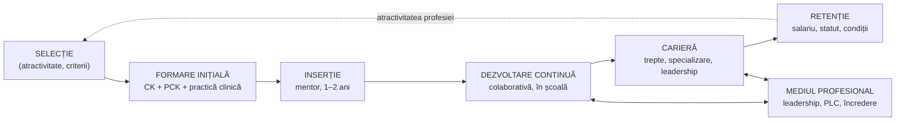

↑ [[00 Index - Analiza comparată internațională]] · Conspecte-sursă: [[9.1 Profesorul școlar - roluri, competențe, stiluri]] · [[9.2 Profesorul postmodernist - facilitator al cunoașterii]] · Aprofundare: [[Autoeducația - teorii, autori și corelări]]

> [!abstract] Pe scurt
> - **Întrebarea**: este predarea o **profesie** propriu-zisă, cu un corp specific de cunoștințe, formare îndelungată, standarde și autonomie de judecată? Și ce politici fac profesorii mai eficienți?
> - **Nucleul epistemic** e **cunoașterea pedagogică a conținutului** (*pedagogical content knowledge*, PCK; Shulman, 1986–1987). Nu e suma „specialitate + pedagogie”, ci știința de a face o anumită materie **înțeleasă** de anumiți elevi. COACTIV (Baumert & Kunter) arată că PCK prezice calitatea predării și progresul elevilor.
> - **Profesorul** e cel mai important factor **școlar** pentru rezultatele elevilor (Rivkin, Hanushek & Kain, 2005; Chetty et al., 2014). Diferențele dintre profesori sunt mari, iar **calificările formale le explică slab**.
> - **Profesionalismul** nu e doar individual. Hargreaves & Fullan (2012) îl definesc ca **capital profesional** = capital **uman** + **social** (colaborare) + **decizional** (judecată formată prin experiență). Profesorii se îmbunătățesc mai mult în școli cu **medii profesionale bune** (Kraft & Papay, 2014).
> - **Dezvoltarea profesională** eficientă e centrată pe conținut și pe învățarea elevilor, **susținută în timp**, **colaborativă** și legată de practica din clasă. Coachingul are efecte robuste (Kraft, Blazar & Hogan, 2018). Cursurile scurte și generice au efecte slabe (Kennedy, 2016).
> - **Modelele naționale** diferă: **Finlanda** (master din 1979, selecție, autonomie), **Singapore** (un singur institut, NIE, și trei trasee de carieră), **Japonia** (*lesson study*, rotație), **Coreea** (selecție din vârful promoției, salarii competitive), **Anglia** (rute multiple, ECF 2021), **SUA** (licențiere pe stat, rute alternative, valoare adăugată).
> - **Tensiunea centrală** este între **profesionalism ocupațional** (autonomie, încredere, etică) și **profesionalism organizațional** (standarde, indicatori, performativitate; Ball, Evetts).
> - **R. Moldova**: standarde profesionale oficiale (2016; versiune nouă în 2025), formare inițială prin licență + modul psihopedagogic, deficit de cadre (1.365 de posturi vacante declarate pentru 2026–2027), stimulente pentru tinerii specialiști. Moldova **nu participă la TALIS**.

---

## 1. Explicația teoriei

### 1.1 Întrebarea la care răspunde

Sociologia profesiilor clasică (Flexner, 1915; Parsons; Etzioni, 1969) a descris profesorii ca „**semi-profesie**”. Motivele invocate: formare mai scurtă decât medicina sau dreptul, bază de cunoaștere neclară, autonomie mică, control birocratic și feminizare. Teoria profesionalismului cadrului didactic răspunde la trei întrebări:

1. **Epistemică**: există o **cunoaștere specifică** a predării, care nu se reduce la cunoașterea disciplinei plus „bun-simț”?
2. **Empirică**: ce caracteristici ale profesorilor și ce politici (selecție, formare, carieră, dezvoltare profesională) **cresc învățarea elevilor**?
3. **Normativă și politică**: cine controlează profesia — statul, piața, organismele profesionale sau profesorii înșiși — și **ce fel de profesionalism** e dezirabil?

### 1.2 Ideile centrale

1. **Predarea are o bază de cunoaștere proprie.** Shulman (1987) distinge șapte categorii: cunoașterea conținutului, cunoașterea pedagogică generală, cunoașterea curriculumului, **PCK**, cunoașterea elevilor, a contextelor educaționale și a scopurilor și valorilor educației. PCK e categoria **specifică** profesiei.
2. **Competența profesională e multidimensională.** Modelul COACTIV (Baumert & Kunter, 2006) include **cunoștințe profesionale** (CK, PCK, cunoștințe pedagogice-psihologice), **convingeri și valori**, **orientări motivaționale** și **autoreglare**. Blömeke, Gustafsson & Shavelson (2015) văd competența ca **continuum**: dispoziții → abilități situaționale (percepție, interpretare, decizie) → performanță observabilă.
3. **Predarea e o practică reflexivă.** Schön (1983) distinge reflecția **în** acțiune și **asupra** acțiunii. Korthagen (2001) propune modelul ALACT și formarea „realistă”, pornind de la situațiile concrete ale studenților.
4. **Profesorii noi reproduc ce au văzut.** Lortie (1975): „ucenicia prin observație” (*apprenticeship of observation*). Viitorul profesor a petrecut peste 12 ani privind profesori, dar fără a vedea gândirea din spatele predării. De aici **conservatorismul**, **individualismul** și **prezentismul** culturii profesionale.
5. **Profesorii diferă enorm în eficiență**, iar diferențele se văd pe termen lung (câștiguri la venituri, la accesul în facultate). Certificările, diplomele și vechimea peste primii ani **explică puțin** din aceste diferențe.
6. **Profesionalismul e colectiv.** Capitalul social (colaborarea, încrederea, rețelele) multiplică efectul capitalului uman. Sistemele performante investesc în **„profesia”**, nu doar în **„profesori-vedetă”** (Hargreaves & Fullan, 2012).
7. **Dezvoltarea profesională trebuie să schimbe practica**, nu doar cunoștințele. E eficientă când e centrată pe conținut și pe gândirea elevilor, e activă, susținută în timp, colaborativă și coerentă cu curriculumul (Desimone, 2009; Timperley et al., 2007; Kennedy, 2016; Sims et al., 2021).
8. **Profesionalismul e contestat politic.** Hargreaves (2000) descrie patru „epoci”: preprofesională, a profesionalismului **autonom**, a profesionalismului **colegial** și cea **postprofesională** (sau postmodernă), cu riscul deprofesionalizării prin piață și standardizare.

### 1.3 Concepte-cheie

| Concept | Definiție |
|---|---|
| **Profesionalism** (*professionalism*) | Calitatea practicii și a conduitei profesorilor: cunoaștere specializată, judecată, etică, responsabilitate față de elevi |
| **Profesionalizare** (*professionalisation*) | Procesul social și politic prin care o ocupație dobândește statut, autonomie și control asupra formării și admiterii |
| **PCK** — cunoașterea pedagogică a conținutului | „Amalgamul” de conținut și pedagogie: reprezentări, analogii, exemple, concepții greșite tipice ale elevilor, secvențiere (Shulman, 1986) |
| **MKT** — cunoștințe matematice pentru predare | Operaționalizarea PCK la matematică: cunoștințe comune și specializate de conținut, cunoașterea conținutului și a elevilor, a conținutului și a predării (Ball, Thames & Phelps, 2008) |
| **Raționament pedagogic** | Ciclul lui Shulman (1987): înțelegere → transformare → instruire → evaluare → reflecție → nouă înțelegere |
| **Practician reflexiv** | Profesionistul care își examinează practica în timpul acțiunii și după ea (Schön, 1983) |
| **ALACT** | *Action – Looking back – Awareness of essential aspects – Creating alternatives – Trial*: ciclul reflecției (Korthagen) |
| **Ucenicia prin observație** | Cunoașterea intuitivă a predării, dobândită ca elev, care conservă practicile tradiționale (Lortie, 1975) |
| **Capital profesional** | Capital uman + capital social + capital decizional (Hargreaves & Fullan, 2012) |
| **Competența ca continuum** | Legătura dintre dispoziții, abilitățile situaționale (percepție–interpretare–decizie) și performanță (Blömeke et al., 2015) |
| **Standard profesional / referențial** | Descrierea normativă a competențelor așteptate, pe domenii și niveluri (Danielson, 1996; Paquay, 1994; standardele naționale) |
| **Inducție** (*induction*) | Programul structurat de sprijin al debutanților: mentorat, reducerea sarcinilor, formare (Ingersoll & Strong, 2011) |
| **Lesson study** (*jugyō kenkyū*) | Ciclu colaborativ: studiul curriculumului → plan de lecție cu răspunsuri anticipate → lecție de cercetare observată → discuție → revizuire (Lewis; Stigler & Hiebert) |
| **Coaching instrucțional** | Sprijin individualizat și repetat al unui profesor de către un expert, cu observare și feedback pe practici concrete (Kraft, Blazar & Hogan, 2018) |
| **Valoare adăugată** (*value-added*, VAM) | Estimarea contribuției unui profesor la progresul elevilor pe teste standardizate, controlând rezultatele anterioare |
| **Eficacitate colectivă** (*collective teacher efficacy*) | Convingerea comună a profesorilor unei școli că pot influența învățarea elevilor (Goddard; popularizată de Hattie) |
| **Profesionalism ocupațional vs. organizațional** | Control colegial, încredere și etică proprie vs. control managerial prin standarde, ținte și indicatori (Evetts, 2009) |
| **Performativitate** | Cultura în care identitatea profesională e redusă la producerea de indicatori (Ball, 2003) |

### 1.4 Ce presupune teoria despre actori

| Actor | Presupoziție |
|---|---|
| **Elevul** | Învățarea lui depinde puternic de **calitatea predării** efective, nu doar de resurse sau structuri. Pentru elevii dezavantajați, un profesor bun contează **mai mult** |
| **Profesorul** | Un profesionist care **învață toată viața**. Expertiza nu vine automat din vechime: fără feedback și colaborare, progresul se oprește după primii ani |
| **Cunoașterea** | Include cunoaștere **teoretică** (cercetare), **practică** (situațională, tacită) și **morală**. Nici știința singură, nici experiența singură nu fac un profesor bun |
| **Școala** | **Mediu de învățare** pentru profesori, nu doar pentru elevi. Colegialitatea și leadershipul determină dacă profesorii se dezvoltă sau stagnează |
| **Statul** | Garantul calității (standarde, acreditarea formării), dar și al **atractivității** (salarii, statut, condiții). Excesul de control birocratic erodează profesionalismul pe care vrea să-l producă |

---

## 2. Geneza și evoluția

| Perioadă | Etapă | Repere |
|---|---|---|
| **sec. XVII–XIX** | **Precursori** | Comenius — profesorul ca „meșter” al didacticii; primele seminarii pedagogice (La Salle, 1685; Francke, Halle; Forselius, Estonia, 1684); școlile normale (Franța, după 1794 și 1833; Horace Mann, SUA, 1839); Herbart — pedagogia ca știință a profesorului; seminariile lui Cygnaeus (Jyväskylä, 1863) |
| **1900–1960** | **Profesia de masă, statut de „semi-profesie”** | Formarea în colegii normale; sindicalizarea (NEA, 1857; AFT, 1916; Nikkyōso, 1947); Recomandarea **UNESCO/OIM privind statutul cadrelor didactice** (1966) — primul standard internațional; sociologia profesiilor (Etzioni, *The Semi-Professions*, 1969) |
| **anii 1970–1980** | **Descoperirea „cutiei negre” a predării** | Lortie, *Schoolteacher* (1975); cercetarea proces–produs (Brophy, Rosenshine); Stenhouse — profesorul-cercetător (1975); Schön (1983); Shulman — PCK (1986, 1987); rapoartele Carnegie *A Nation Prepared* și Holmes Group (1986) → NBPTS (1987); universitarizarea formării (Finlanda, 1971–1979) |
| **anii 1990** | **Standarde și reflecție** | Danielson, *Framework for Teaching* (1996); Paquay (1994) și Perrenoud — referențialele de competențe; Darling-Hammond, *Doing What Matters Most* (1996); InTASC (1992); Hargreaves, *Changing Teachers, Changing Times* (1994); dezbaterea britanică despre cercetare (D. Hargreaves, 1996); Stigler & Hiebert, *The Teaching Gap* (1999) — lesson study |
| **2000–2010** | **Eficiența profesorului și politicile comparate** | Darling-Hammond (2000) despre calitatea profesorilor; Rivkin, Hanushek & Kain (2005); OCDE, *Teachers Matter* (2005); Barber & Mourshed (McKinsey, 2007); **TALIS** (2008); **TEDS-M** (IEA, 2008); **COACTIV** (anii 2000); Timperley et al. (2007); Korthagen (2001, 2004); Ball, Thames & Phelps (2008); Ingersoll (2001) — fluctuația; recomandările UE (2007) |
| **2010–2020** | **Capital profesional și dezvoltare profesională eficientă** | Hargreaves & Fullan (2012); Chetty, Friedman & Rockoff (2014); Kraft & Papay (2014); Blömeke et al. (2015); Kennedy (2016); Darling-Hammond et al., *Empowered Educators* (2017); Kraft, Blazar & Hogan (2018); standardele profesionale naționale (R. Moldova, 2016; Estonia, 2013); Chartered College of Teaching (Anglia, 2017) |
| **2020–2026** | **Stadiul actual** | Criza globală de profesori (UNESCO, *Global Report on Teachers*, 2024); ECF în Anglia (2021); Sims et al. (EEF, 2021) — mecanismele DP eficiente; TALIS 2024 (publicat în 2025): volum de muncă, stres, IA; reforme salariale (Japonia — legea Kyūtoku, 2025); noile standarde din R. Moldova (2025) |

---

## 3. Autori, reprezentanți, cercetători

| Autor | Lucrare(ări), an | Aportul concret |
|---|---|---|
| **Lee S. Shulman** (SUA, Stanford; Carnegie Foundation) | *Those Who Understand: Knowledge Growth in Teaching* (*Educational Researcher*, 1986); *Knowledge and Teaching: Foundations of the New Reform* (*Harvard Educational Review*, 1987) | **PCK**; cele șapte categorii ale cunoașterii profesorului; modelul raționamentului pedagogic; „paradigma lipsă” a cercetării despre predare. Inspirația pentru NBPTS |
| **Linda Darling-Hammond** (SUA, Stanford; Learning Policy Institute) | *Teacher Quality and Student Achievement* (EPAA, 2000); *Powerful Teacher Education* (2006); *The Flat World and Education* (2010); cu Burns, Campbell et al., *Empowered Educators* (2017); cu Hyler & Gardner, *Effective Teacher Professional Development* (LPI, 2017) | Argumentul pentru investiția sistemică în formare: practică clinică legată de teorie, mentorat, carieră. Comparații internaționale (Finlanda, Singapore, Ontario, Shanghai, Australia). Critica rutelor alternative scurte |
| **Donald A. Schön** (SUA, MIT) | *The Reflective Practitioner* (1983); *Educating the Reflective Practitioner* (1987) | Critica „raționalității tehnice”; reflecția **în** și **asupra** acțiunii; practica profesională ca „artă” în situații incerte |
| **Dan C. Lortie** (SUA, Chicago) | *Schoolteacher: A Sociological Study* (1975) | **Ucenicia prin observație**; conservatorismul, individualismul și prezentismul culturii profesorilor; „cariera plată” (fără trepte) |
| **Andy Hargreaves & Michael Fullan** | *Professional Capital: Transforming Teaching in Every School* (2012) | **Capitalul profesional** (uman, social, decizional); critica abordării „capitalului de afaceri” (profesori ieftini, rapid înlocuibili); Hargreaves (2000), cele patru epoci ale profesionalismului |
| **John Hattie** (Noua Zeelandă → Australia) | *Visible Learning* (2009); *Visible Learning for Teachers* (2012) | „Ce fac profesorii” contează mai mult decât structurile. Profesorul ca **evaluator al propriului impact**. Clasamentul factorilor după mărimea efectului (critici metodologice: vezi Educația bazată pe dovezi) |
| **Sigrid Blömeke** (Germania → Norvegia) | Coordonatoare germană TEDS-M (IEA, 2008); Blömeke, Gustafsson & Shavelson, *Beyond Dichotomies: Competence Viewed as a Continuum* (*Zeitschrift für Psychologie*, 2015) | **TEDS-M**: primul studiu comparativ al cunoștințelor viitorilor profesori de matematică (17 țări); Taiwan și Singapore în vârf. Modelul **competenței ca continuum** |
| **Jürgen Baumert & Mareike Kunter** (Germania, MPI Berlin) | Baumert & Kunter (2006); Baumert et al., *Teachers' Mathematical Knowledge, Cognitive Activation in the Classroom, and Student Progress* (*AERJ*, 2010); Kunter et al. (2013) | **COACTIV**: PCK prezice **mai bine** decât CK calitatea predării (activarea cognitivă, sprijinul individual) și progresul elevilor. Efectul trece prin **calitatea instruirii**. Modelul competenței profesionale include autoreglarea profesorului |
| **Fred Korthagen** (Țările de Jos) | *Linking Practice and Theory: The Pedagogy of Realistic Teacher Education* (2001); *In Search of the Essence of a Good Teacher* (*Teaching and Teacher Education*, 2004) | **ALACT**; **modelul „cepei”** (mediu → comportament → competențe → convingeri → identitate → misiune); reflecția de profunzime (*core reflection*) |
| **Helen Timperley** (Noua Zeelandă) | Timperley, Wilson, Barrar & Fung, *Teacher Professional Learning and Development: Best Evidence Synthesis Iteration* (2007); *Teacher Professional Learning and Development* (IAE, *Educational Practices* 18, 2008) | Ciclul **investigației și construirii cunoașterii** centrat pe nevoile elevilor; condițiile DP eficiente (timp extins, expertiză externă, provocarea convingerilor, sprijin din partea liderilor) |
| **Mary M. Kennedy** (SUA, Michigan State) | *How Does Professional Development Improve Teaching?* (*Review of Educational Research*, 2016); *Inside Teaching* (2005) | Recenzie critică a studiilor riguroase: DP care oferă **strategii** și dezvoltă **înțelegerea** (*insight*) e mai eficientă decât cea care prescrie rețete sau transmite doar conținut. „Problema persistentă a promulgării” (*enactment*) |
| **Matthew A. Kraft & John P. Papay** (SUA, Brown/Harvard) | *Can Professional Environments in Schools Promote Teacher Development?* (*EEPA*, 2014); Papay & Kraft (2015) | Profesorii din școli cu mediu profesional **susținător** își îmbunătățesc eficiența mult mai mult în timp decât cei din medii slabe (ordin de mărime: cu aproximativ o treime mai mult după 10 ani; de verificat). Progresul **continuă** și după primii ani |
| **Kraft, Blazar & Hogan** | *The Effect of Teacher Coaching on Instruction and Achievement: A Meta-Analysis of the Causal Evidence* (*Review of Educational Research*, 2018) | 60 de studii cauzale: efect mediu de ≈ **0,49 SD** asupra practicii de predare și ≈ **0,18 SD** asupra rezultatelor elevilor. Efectele scad în programele mari (problema scalării) |
| **Laura Desimone** (SUA) | *Improving Impact Studies of Teachers' Professional Development* (*Educational Researcher*, 2009) | Cele cinci „trăsături-nucleu” ale DP: focus pe conținut, învățare activă, coerență, durată, participare colectivă (modelul „consensului”, criticat ulterior) |
| **Sam Sims, Harry Fletcher-Wood et al.** (Marea Britanie) | Sims & Fletcher-Wood, *Identifying the Characteristics of Effective Teacher PD: A Critical Review* (2021); Sims et al., *What Are the Characteristics of Effective Teacher PD?* (EEF, 2021) | Critica „consensului” Desimone. Meta-analiză EEF: 14 **mecanisme** grupate în patru funcții (dezvoltarea înțelegerii, motivarea, dezvoltarea tehnicilor, încorporarea practicii) |
| **Catherine Lewis** (SUA) | *Lesson Study: A Handbook of Teacher-Led Instructional Change* (2002); Lewis & Perry, RCT în *JRME* (2017) | Documentarea lesson study japonez; **RCT** în SUA cu lesson study sprijinit de materiale despre fracții: câștiguri semnificative la elevi și profesori |
| **James Stigler** (SUA) | Stevenson & Stigler, *The Learning Gap* (1992); Stigler & Hiebert, *The Teaching Gap* (1999) | TIMSS Video Study: predarea ca **activitate culturală**; recomandarea lesson study ca mecanism de ameliorare lentă și cumulativă |
| **Deborah Loewenberg Ball** (SUA, Michigan) | Hill, Rowan & Ball (*AERJ*, 2005); Ball, Thames & Phelps (*JTE*, 2008) | **MKT** măsurabil și predictiv pentru câștigurile elevilor; „practici-nucleu” (*high-leverage practices*) în formarea inițială |
| **Raj Chetty, John Friedman & Jonah Rockoff** (SUA) | *Measuring the Impacts of Teachers I & II* (*American Economic Review*, 2014) | Profesorii cu valoare adăugată mare cresc și rezultatele pe termen lung ale elevilor (acces la facultate, venituri, reducerea sarcinilor în adolescență). Argumentul economic pentru calitatea profesorilor |
| **Steven Rivkin, Eric Hanushek & John Kain** | *Teachers, Schools, and Academic Achievement* (*Econometrica*, 2005) | Variație mare a eficienței profesorilor în aceeași școală; experiența contează doar în primii ani; diplomele de master nu prezic eficiența |
| **Richard Ingersoll** (SUA) | *Teacher Turnover and Teacher Shortages* (*AERJ*, 2001); Ingersoll & Strong (*RER*, 2011) | Deficitul e în mare parte o problemă de **fluctuație** („ușa rotativă”). Inducția structurată reduce plecările |
| **Lawrence Stenhouse** (Marea Britanie) | *An Introduction to Curriculum Research and Development* (1975) | **Profesorul-cercetător**; curriculumul ca ipoteză testată în clasă |
| **Stephen J. Ball** (Marea Britanie, critic) | *The Teacher's Soul and the Terrors of Performativity* (*Journal of Education Policy*, 2003) | Performativitatea ca formă de reglare care transformă sensul muncii profesorului |
| **Julia Evetts** (Marea Britanie, sociologie) | *New Professionalism and New Public Management* (*Comparative Sociology*, 2009) | Profesionalism **ocupațional** vs. **organizațional** |
| **Léopold Paquay** (Belgia) | *Vers un référentiel des compétences professionnelles de l'enseignant ?* (1994); Paquay, Altet, Charlier & Perrenoud (coord.), *Former des enseignants professionnels* (1996) | Cele **șase paradigme** ale profesorului (instruit, tehnician, practician-artizan, practician reflexiv, actor social, persoană), preluate de manual prin Negură, Papuc & Pâslaru (2000) |
| **OCDE — TALIS** | *Teaching and Learning International Survey* (2008, 2013, 2018, 2024) | Date comparative despre condițiile de muncă, DP, practici, autoeficacitate, statutul perceput. TALIS 2024 include și utilizarea IA |
| **Barber & Mourshed** (McKinsey) | *How the World's Best-Performing School Systems Come Out on Top* (2007) | Teza „calitatea sistemului nu poate depăși calitatea profesorilor”. Trei pârghii: oamenii potriviți devin profesori, dezvoltarea lor ca instructori eficienți, predare bună pentru fiecare elev |

---

## 4. Legătura cu manualul și cu vaultul

| Unde | Ce spune manualul | Evaluare |
|---|---|---|
| [[9.1 Profesorul școlar - roluri, competențe, stiluri]] (p. 307–326) | 8 roluri ale profesorului; **referențialul** profesional; **6 paradigme** (instruit, tehnician, artizan, practician reflexiv, actor social, persoană); competențe general-umane și profesionale; stiluri educaționale; calitățile profesorului (vocație, tact, măiestrie); formare și perfecționare | **Parțial corect, depășit.** Cele 6 paradigme sunt ale lui **Paquay (1994)**, iar Zeichner are 4, nu „Zechner”. „Competențele general-umane” reproduc **Covey (1989)**. Lipsesc **PCK**, cercetarea de eficiență, **standardele oficiale** (2016), TALIS. Discursul despre „vocație” și „tact” e normativ-moralizator, fără bază empirică |
| [[9.2 Profesorul postmodernist - facilitator al cunoașterii]] | Profesorul ca facilitator, constructivist, practician reflexiv | Profilul „profesorului constructivist” vine din Brooks & Brooks (1993), necitați. Idealul e **compatibil** cu Schön și Korthagen, dar nu discută **condițiile instituționale** |
| [[8.6 Managementul educației și reforma]] | Formarea inițială „la un singur nivel, universitar”; perfecționarea „o dată la 5 ani” | **Depășit**: Codul (art. 133–134) prevede stagii de formare **cel puțin o dată la 3 ani** și credite de dezvoltare profesională; colegiile pedagogice formează educatori |
| [[Autoeducația - teorii, autori și corelări]] | Matricea de corelare, rândul 13: „profesorul care nu învață el însuși e o absurditate” (Noica, p. 104) | Leagă autoeducația profesorului de Blömeke (continuum), COACTIV (autoreglare), Korthagen, Timperley, Ericsson |
| [[3.6 Educația permanentă și autoeducația]] | Educația permanentă și autoeducația | Formarea continuă a profesorului e cazul-școală al educației permanente profesionale |
| [[5.3 Cercetarea pedagogică - noțiune și tipologie]] | Cercetarea pedagogică și tipurile ei | Stenhouse (profesorul-cercetător) și cercetarea-acțiune sunt forme ale profesionalismului **investigativ** |
| [[Erori și actualizări ale manualului]] | Standardele profesionale absente; nume deformate (Zechner, Golderhead, Paquai) | Corecturi consolidate |

> [!note] Comentariu
> Manualul pleacă din tradiția **francofonă a referențialelor** (Paquay, Perrenoud) și din tradiția **est-europeană a „personalității profesorului”** (vocație, aptitudine pedagogică, tact). Ambele sunt legitime, dar lasă deoparte **revoluția empirică** de după 1986: PCK, studiile de eficiență și cercetarea asupra DP. Paradigma „practicianului reflexiv” e prezentă, dar ca **etichetă**, fără instrumentele care o fac operațională (ALACT, lesson study, coaching, PLC).

---

## 5. Implementare comparată

### 5.1 Tabel-sinteză

| Sistem | Cum a fost implementată (politică / program / instituție) | Când | Scară / intensitate | Dovezi sau rezultate |
|---|---|---|---|---|
| **Singapore** | **NIE** — un singur institut universitar pentru formarea inițială, continuă și de leadership (1991); selecție din treimea superioară, cu interviu; salariu în timpul formării; TE21 și V³SK (2009); competențele absolventului (GTCF); ***Singapore Teaching Practice***; **trei trasee** de carieră: predare, leadership, specialist; evaluare anuală (EPMS); dreptul la **până la 100 de ore** de DP pe an (formularea actuală: de verificat); PLC cu timp în orar (2009); *Academy of Singapore Teachers* (2010) | 1991–prezent | **centrală** | TEDS-M 2008: Singapore printre primele țări la cunoștințele viitorilor profesori. TALIS 2024: **71%** consideră profesia valorizată social (OCDE 22%), 47 h/săptămână (OCDE 41), stres 27% (OCDE 19%). Critica „performativității” evaluării legate de bonusuri |
| **Estonia** | **Master** (300 ECTS) pentru profesorii din școala de bază și liceu; **standarde profesionale** (2013) pe patru niveluri; an de inserție cu mentor; **Noored Kooli** (tip Teach First, 2006); autonomie metodologică; model de carieră în patru trepte (anunțat pentru 2026) | anii 1990–prezent | **medie–centrală** | Profesori foarte calificați și autonomi, dar **îmbătrâniți** (54% au peste 50 de ani, TALIS 2018), **12%** ieșiri pe an, salarii sub alte profesii cu studii superioare, **65%** dintre elevi în școli cu deficit de personal (PISA 2025) |
| **Finlanda** | Formarea mutată în universități (legea din 1971); **master obligatoriu din 1979**, inclusiv pentru învățători; teză de cercetare; **selecție în două etape** (≈ 10% admiși la formarea învățătorilor, 2010); practică în școli de aplicație (*normaalikoulut*); autonomie în metode și manuale; examen comun de admitere VAKAVA (din 2020) | 1971–prezent | **centrală** | Consens OCDE/McKinsey că selecția și formarea sunt factori centrali. **Critica cronologică** (Sahlgren, 2015): profesorii formați după 1979 nu erau majoritari când s-au format elevii testați în 2000. Recent: penurie (23% dintre elevi în școli cu lipsă de personal, 2022), DP inegală între municipalități |
| **Regatul Unit** | **Anglia**: QTS; rute multiple (PGCE, SCITT, *School Direct*, ucenicie); **Teach First** (2002/2003); *Teachers' Standards* (2012); ***Early Career Framework*** (2021) — inducție de 2 ani cu mentor și curriculum bazat pe dovezi; NPQ-uri; **Chartered College of Teaching** (2017); ITT Market Review (2021). **Scoția**: GTCS (1965), an de inducție garantat (2002), acordul McCrone | 2002–prezent | **centrală** | Teach First: creșteri mici ale rezultatelor GCSE în școlile partenere, retenție mai slabă (Allen & Allnutt). ECF: volum mare de muncă pentru mentori (evaluări finale: de verificat). **Criză de retenție** și ținte de recrutare ratate. Scoția: model de inducție apreciat internațional |
| **Japonia** | Formare „deschisă” (*kaihōsei*) în universități; **examen prefectural de angajare** (scris, interviu, lecție demonstrativă); stagiu de un an pentru debutanți (din 1989); **lesson study** (*jugyō kenkyū*) cvasiuniversal în primar; **rotația** între școli; reînnoirea licenței la 10 ani (2009–2022, abolită); platforma Plant (2024); **legea Kyūtoku** (2025): sporul salarial de la 4% la 10% | postbelic–prezent | **centrală** | RCT Lewis & Perry (SUA, 2017): pozitiv. EEF (Anglia, 2017): lesson study transferat fără ecosistem, **efect nul**. TALIS: cel mai lung timp de lucru (≈ 52–55 h în 2024). **80%** dintre elevi în școli cu lipsă de profesori (PISA 2025). Raportul candidați/post în primar a scăzut spre 2:1 |
| **Coreea de Sud** | **Selecție** din vârful promoției în 13 instituții pentru învățători (KNUE, 1985); **examen de angajare** competitiv (*imyong sihum*); funcționari publici; **rotație obligatorie**; salarii competitive, cu o grilă abruptă ce recompensează rămânerea în profesie; formare continuă obligatorie; profesori principali (*suseok gyosa*) | anii 1980–prezent | **centrală** | McKinsey (2007): viitorii învățători din primele 5%. Școlile defavorizate nu au mai puțini profesori calificați (efectul rotației). **Supraofertă** la secundar (≈ 1 din 5 absolvenți devine profesor). **Criza autorității** (2023) și lipsă de personal (51% dintre elevi, PISA 2022) |
| **Canada** | Licențiere **provincială**; B.Ed. de 2 ani în Ontario (din 2015); **Ontario College of Teachers** (1997); ***New Teacher Induction Program*** (Ontario, 2006); **TLLP** (2007–2020) — proiecte de învățare concepute de profesori, cogestionate cu sindicatul; AISI (Alberta, 1999–2013); *Teaching Quality Standard* (Alberta, 2018); sindicate puternice | 1997–prezent | **medie–centrală** | Salarii peste media OCDE, profesie respectată. TLLP: efecte asupra practicii și a partajării cunoașterii (Campbell et al.). Lipsă de personal în 2024–2026 (38% dintre elevi, PISA 2025); conflicte de muncă |
| **Europa (UE / CoE)** | Concluziile Consiliului privind profesorii (2007, 2014, 2020); *Supporting Teacher Competence Development* (Comisia, 2013); **Academiile Erasmus+ ale profesorilor** (2022); eTwinning (2005); **DigCompEdu** (JRC, 2017); Eurydice, *Teachers in Europe* (2021); orientări europene pentru cadrele naționale de carieră (de verificat) | 2007–prezent | **redusă–medie** (competență de sprijin) | Convergență spre formare universitară (Bologna) și inducție. COACTIV: PCK prezice calitatea predării. „Masterizarea” singură nu garantează calitatea (Franța). Criză de atractivitate generală |
| **SUA** | **Licențiere pe stat** (teste Praxis, practică); **NBPTS** (1987) — certificare avansată voluntară; InTASC (1992/2011); rute alternative (**Teach For America**, 1990; *residencies*); edTPA (2013); evaluarea profesorilor prin observare (Danielson) și **valoare adăugată** (Race to the Top, 2009–2016); *Measures of Effective Teaching* (Gates) | 1987–prezent | **medie** (fragmentată) | Chetty et al. (2014): profesorii cu VA mare au efecte pe termen lung. Certificarea formală prezice slab eficiența. TFA: efecte egale sau ușor pozitive la matematică (Mathematica). *Intensive Partnerships* (RAND, 2018): fără îmbunătățiri semnificative. „Penalizarea salarială” și fluctuația (Ingersoll) |
| **Republica Moldova** | Codul Educației (2014): cerințe de calificare (licență + **modul psihopedagogic**), **formare continuă obligatorie** cu credite, stagii cel puțin o dată la 3 ani; **Codul de etică** (2015); ***Standardele de competență profesională*** (Ordinul nr. 623/2016; 5 domenii); **versiune nouă** (Ordinul MEC nr. 1657/2025); grade didactice (II, I, superior); evaluarea cadrelor didactice (metodologie din 2020–2021; de verificat); UPS „Ion Creangă” a absorbit IȘE și Institutul de Formare Continuă (HG nr. 485/2022); **indemnizații pentru tinerii specialiști** (până la 300.000 de lei); majorări salariale | 2014–2026 | **medie** (cadru normativ modern; atractivitate și capacitate de formare slabe) | Posturi vacante declarate: **1.833** (2024–2025) → **1.540** (2025–2026) → **1.365** (2026–2027) (MEC). Tineri specialiști angajați: 296 (2022) → **426** (2025). Salariile au rămas sub inflația cumulată din 2022–2023 (ETF, 2024). **Nu participă la TALIS**, deci nu există date comparabile despre practici și DP. Mai mult de jumătate dintre cadre au peste 20 de ani de vechime (date raportate de presă; de verificat) |

### 5.2 Studiu de caz 1 — Finlanda: profesionalismul academic și limitele lui explicative

→ [[Finlanda - ecosistemul educațional]]

**Construcția.** Legea din 1971 a mutat formarea profesorilor din seminarii în **universități**, iar din **1979** masterul a devenit calificarea de bază, inclusiv pentru învățători. Formarea combină trei elemente:
- **didactica disciplinei** (PCK, în termenii lui Shulman);
- o **teză bazată pe cercetare**, adică profesorul format ca „consumator critic” și producător de cunoaștere;
- **practica** în școli de aplicație universitare, în cicluri de planificare–acțiune–reflecție.

Selecția are două etape: note și realizări, apoi test scris, activitate observată și interviu despre motivație. În 2010, circa 10% dintre candidați erau admiși la formarea învățătorilor. **Autonomia** (metode, manuale, evaluare la clasă, curriculum local) și absența inspecției după anii 1990 au completat modelul.

**Interpretarea standard** (OCDE, 2010; Sahlberg, 2011; Darling-Hammond, 2010): calitatea profesorilor e un factor central al succesului PISA din anii 2000.

> [!warning] Nuanțe critice
> - **Cronologia** (Sahlgren, 2015): profesorii formați după 1979 nu constituiau majoritatea corpului profesoral al elevilor testați în 2000. Creșterea rezultatelor s-a produs în mare parte **sub sistemul vechi**.
> - **Declinul** după 2006 (≈ −70 de puncte la citire până în 2025) a avut loc **cu aceeași formare**. Deci formarea de master **nu e suficientă** pentru a explica nici succesul, nici eșecul.
> - **Mitul „top 10%”**: rata de admitere mică la programele de învățători nu înseamnă că toți profesorii provin din primii 10% ai promoției.
> - **Presiuni recente**: penurie de personal, DP inegală între municipalități, creșterea sarcinilor (incluziune, bunăstare, digitalizare).
>
> Lectura echilibrată: profesionalismul academic e o **condiție** a unui sistem bazat pe încredere. Funcționează doar împreună cu echitatea structurală, sprijinul timpuriu și acceptarea socială a școlii.

### 5.3 Studiu de caz 2 — Singapore: lanțul complet al profesionalizării

→ [[Singapore - ecosistemul educațional]]

Singapore e cel mai complet exemplu de **politică integrată** a profesiei. Fiecare verigă a lanțului e proiectată:
1. **Selecție** — candidați din treimea superioară, cu interviu și verificarea motivației. Viitorii profesori sunt angajați MOE și primesc **salariu în timpul formării**.
2. **Formare** — un singur furnizor (NIE), cu modelul TE21 (2009), valorile V³SK și competențele absolventului pe trei dimensiuni: practică profesională, dezvoltare personală, **leadership și agenție**.
3. **Inducție** — mentorat în toate școlile.
4. **Dezvoltare** — PLC-uri cu timp în orar, rețele între școli, *Academy of Singapore Teachers* cu *Master Teachers*, *Singapore Teaching Practice* ca limbaj comun al predării.
5. **Carieră** — trei trasee cu mobilitate laterală (predare, leadership, specialist), evaluare anuală a performanței și a potențialului.
6. **Leadership** — directori selectați din traseul de leadership, formați la NIE, **rotiți** între școli.

**Rezultate.** TALIS 2024: statut social perceput excepțional (71% față de 22% în OCDE), mentorat și feedback între colegi peste medie. TEDS-M 2008: viitorii profesori de matematică din Singapore au obținut unele dintre cele mai bune scoruri de cunoștințe.

**Costuri.** 47 de ore pe săptămână (doar 18 de predare), stres peste medie. Evaluarea anuală legată de bonusuri a fost criticată ca **performativă**. Agenția profesorului e exercitată în limite fixate central.

### 5.4 Studiu de caz 3 — Japonia și exportul lesson study: profesionalism colectiv și dependența de context

→ [[Japonia - ecosistemul educațional]]

În Japonia, profesionalismul e **colectiv și practic**, nu academic. Formarea inițială are practică scurtă, dar dezvoltarea în școală e intensă:
- **tema de cercetare** anuală a școlii;
- ***kyōzai kenkyū*** (studiul aprofundat al materialului didactic);
- lecții de cercetare **observate de colegi**, cu atenția pe **elevi**, nu pe profesor;
- un **comentator extern** (*kōshi*);
- lecții publice naționale la școlile-anexă universitare.

**Rotația** distribuie expertiza între școli, iar curriculumul național comun face ca toți profesorii să discute **aceeași** lecție.

**Exportul** s-a făcut prin *The Teaching Gap* (1999) și prin JICA în zeci de țări. Dovezile sunt contradictorii:
- **Lewis & Perry (2017)**, RCT în SUA cu lesson study **sprijinit de materiale matematice solide**: câștiguri semnificative.
- **EEF (2017)**, Anglia, program de doi ani: **efect nul** la matematică și citire. Explicația frecventă: s-a transferat **forma** (observarea colegilor), fără *kyōzai kenkyū*, fără expert extern și fără tema de cercetare pe termen lung.

În Japonia însăși, suprasolicitarea (cel mai lung timp de lucru din TALIS) riscă să ritualizeze practica.

> [!tip] Lecție teoretică
> Profesionalismul colectiv nu e o **tehnică**, ci un **ecosistem**: curriculum comun, materiale bune, timp protejat, expertiză externă, o cultură a lecției publice. Concluzia confirmă modelul capitalului profesional: capitalul **social** nu se poate importa separat de condițiile care îl produc.

### 5.5 Studiu de caz 4 — SUA și Anglia: piața muncii didactice, rute alternative și valoarea adăugată

→ [[SUA - ecosistemul educațional]] · [[Regatul Unit - ecosistemul educațional]]

Sistemele anglo-saxone au explorat o **altă teorie a calității profesorilor**: dacă bariera formării lungi reduce oferta, atunci **deschide intrarea** (rute alternative), **măsoară rezultatele** (valoare adăugată) și **recompensează sau elimină** în funcție de ele.

- **Rute alternative.** *Teach For America* (1990) și *Teach First* (2002/2003) au atras absolvenți de top în școli defavorizate. Efectele asupra elevilor sunt **egale sau ușor pozitive** față de profesorii din aceleași școli. Critica lui Darling-Hammond: comparația se face cu profesori slabi, iar fluctuația mare costă sistemul. Estonia (Noored Kooli) a preluat modelul la scară mică.
- **Valoarea adăugată.** Chetty, Friedman & Rockoff (2014) arată că profesorii cu VA mare au efecte reale pe termen lung. Folosirea VA pentru **decizii individuale cu miză mare** (Race to the Top) a fost însă criticată: estimări instabile de la un an la altul, erori mari pentru clase mici, riscul de *gaming*. Declarația **American Statistical Association (2014)** avertizează că VAM măsoară corelații, nu cauzalitate individuală. Proiectul Gates *Intensive Partnerships* (575 mil. USD) nu a produs îmbunătățiri semnificative (RAND, 2018).
- **Corecția engleză: ECF (2021).** Anglia a trecut de la piață la un **curriculum național al formării**: 2 ani de inducție, mentor, conținut bazat pe dovezi (comportament, predare, evaluare, instruire adaptivă). E o formă de profesionalism **organizațional**, criticată pentru standardizare (ITT Market Review), dar construită pe dovezi despre DP eficientă.

---

## 6. Dovezi empirice și critici

### 6.1 Studii-cheie

| Studiu | Design | Rezultat |
|---|---|---|
| **Rivkin, Hanushek & Kain** (2005) | Date administrative, Texas | Variație mare a eficienței profesorilor; experiența contează în primii ani; masterul nu prezice eficiența |
| **Chetty, Friedman & Rockoff** (2014) | Date longitudinale, circa 1 milion de elevi | Profesorii cu VA mare cresc accesul la facultate și veniturile la vârsta adultă |
| **Baumert et al. / COACTIV** (2010) | Studiu longitudinal, Germania, clasele a IX-a–a X-a | PCK prezice activarea cognitivă și progresul elevilor mai bine decât CK |
| **Hill, Rowan & Ball** (2005) | Studiu longitudinal, SUA | MKT prezice câștigurile la matematică din clasele I și a III-a |
| **TEDS-M** (Tatto et al., 2012; Blömeke) | Comparație internațională, 17 țări | Diferențe mari între țări în cunoștințele viitorilor profesori; asociate cu selecția și cu oportunitățile de învățare din formare |
| **Kraft, Blazar & Hogan** (2018) | Meta-analiză, 60 de studii cauzale | Coaching: ≈ 0,49 SD asupra practicii, ≈ 0,18 SD asupra rezultatelor; efecte mai mici la scară |
| **Kennedy** (2016) | Recenzie a 28 de studii experimentale sau cvasiexperimentale | DP care dezvoltă strategii și înțelegere > DP prescriptivă; durata **nu** prezice singură efectul |
| **Sims et al.** (EEF, 2021) | Meta-analiză | DP cu mecanisme din toate cele patru funcții are efecte mai mari |
| **Kraft & Papay** (2014) | Date longitudinale, Charlotte-Mecklenburg | Mediul profesional (colaborare, leadership, feedback) accelerează dezvoltarea profesorilor |
| **Ingersoll & Strong** (2011) | Recenzie a 15 studii | Inducția (mentor, colaborare) reduce fluctuația și îmbunătățește practica |
| **Lewis & Perry** (2017) vs. **EEF lesson study** (2017) | RCT-uri | Pozitiv în SUA (cu materiale), nul în Anglia (fără ecosistem) |
| **Darling-Hammond et al.** (2017) | Studii de caz comparative | Sistemele performante investesc coerent pe tot lanțul selecție–formare–carieră |

### 6.2 Critici și controverse

> [!warning] Critică
> 1. **„Calitatea profesorului” e greu de definit și de măsurat.** Scorurile la teste (VA) captează o parte îngustă a educației. Observările la clasă sunt influențate de compoziția clasei. Credențialele prezic slab.
> 2. **Teza McKinsey** („calitatea sistemului nu poate depăși calitatea profesorilor”) e un **truism** folosit ca justificare pentru reforme foarte diferite (selecție elitistă, rute alternative, VA). Nu spune **cum** se obține calitatea.
> 3. **Cauzalitate la nivel de sistem.** Legătura dintre modelele naționale de formare (master, selecție) și PISA e **corelațională** și confundată cu cultura, statutul social, salariile și compoziția populației (critica lui Sahlgren pentru Finlanda).
> 4. **Masterul și prelungirea formării** nu garantează calitatea (Franța a „masterizat” formarea în 2010, iar rezultatele au scăzut). Pot **reduce oferta** într-o criză de personal (Estonia).
> 5. **Standardele profesionale** pot deveni **liste de bifat** și instrumente de control managerial, adică profesionalism „organizațional” în sensul lui Evetts, nu „ocupațional”.
> 6. **Performativitatea** (Ball, 2003): evaluările legate de bonusuri și clasamente transformă sensul muncii, cu costuri pentru bunăstare și retenție (Singapore, Anglia).
> 7. **Consensul despre DP** (Desimone) a fost contestat: trăsăturile „nucleu” (durată, colaborare) nu prezic consecvent efectele în studiile riguroase (Kennedy, 2016; Sims & Fletcher-Wood, 2021). Contează **mecanismele**, nu formatul.
> 8. **Hattie și „eficacitatea colectivă”**: mărimea efectului foarte mare (≈ 1,57) raportată pentru eficacitatea colectivă provine din puține studii corelaționale. Nu trebuie citită ca efect cauzal (de verificat sursele primare).
> 9. **Retorica „vocației”** (prezentă și în manual) poate justifica **salarii mici** și sarcini nelimitate: profesia ca sacrificiu, nu ca muncă profesională remunerată.

### 6.3 Condiții în care profesionalizarea funcționează

| Funcționează când… | Nu funcționează când… |
|---|---|
| profesia e **atractivă** (salariu competitiv cu alte profesii cu studii superioare, statut, condiții) | cerințele cresc fără atractivitate: deficitul se agravează |
| formarea inițială leagă **teoria, PCK și practica supervizată** | formarea e teoretică, iar practica scurtă și nesupervizată |
| inducția e **structurată** (mentor format, timp, reducerea sarcinilor) | debutantul primește cele mai grele clase fără sprijin |
| DP e **în școală**, colaborativă, legată de curriculum și de lucrările elevilor | DP e punctuală, generică, „pentru credite” |
| cariera recompensează **expertiza și mentoratul** | cariera recompensează doar vechimea și dosarele |
| evaluarea e **formativă** și profesională | evaluarea e punitivă, bazată pe un singur indicator |

---

## 7. Implicații practice

> [!tip] Pentru profesor la clasă
> - Construiește-ți deliberat **PCK**: pentru fiecare temă importantă, notează concepțiile greșite tipice ale elevilor, 2–3 reprezentări alternative și exemplele care „merg”. E un portofoliu profesional mai util decât un dosar de certificate.
> - Aplică **ALACT** după lecțiile problematice: ce s-a întâmplat → ce era esențial → ce alternative am → ce încerc data viitoare.
> - Cere și oferă **observare între colegi centrată pe elevi** (ce au înțeles, unde s-au blocat), nu pe „prestația” profesorului. Este nucleul lesson study.
> - Dacă ești debutant, caută un **mentor** și cere feedback frecvent. Progresul cel mai rapid are loc în primii 3–5 ani, dar continuă doar dacă există feedback.
> - Tratează standardele profesionale (2016/2025) ca **instrument de autoevaluare** și de plan de dezvoltare, nu ca listă birocratică. Aceasta e legătura directă cu [[Autoeducația - teorii, autori și corelări]].

> [!tip] Pentru politica educațională din R. Moldova
> 1. **Atractivitatea înaintea exigenței.** Selecția la intrare (după modelul Finlandei sau al Singaporelui) nu e posibilă fără salarii competitive. Direcția corectă a stimulentelor pentru tinerii specialiști (426 de angajați în 2025) trebuie completată cu o **grilă care recompensează rămânerea** în profesie (lecția coreeană), nu doar intrarea.
> 2. **Inducție structurată de 1–2 ani** pentru toți debutanții, cu mentori formați și remunerați (modelul scoțian sau ECF), ca principal instrument anti-fluctuație.
> 3. **Formarea inițială clinică.** Rețele de **școli de aplicație** afiliate UPS „Ion Creangă” și universităților regionale, cu practică extinsă și supervizată. În modulul psihopedagogic, **didactica disciplinei (PCK)** trebuie să primeze asupra teoriei generale.
> 4. **DP în școală, nu doar la cursuri.** Creditele de dezvoltare profesională ar trebui acordate și pentru **cicluri de lesson study**, coaching și PLC documentate, nu doar pentru stagii externe. Anunțul ministerului după PISA 2025 (formare obligatorie pentru profesorii „cu dificultăți”) riscă să fie perceput punitiv dacă nu e construit ca **coaching**.
> 5. **Standardele ca limbaj comun.** Standardele din 2025 pot deveni referința unică pentru formarea inițială, inducție, atestare și evaluare, cu **descriptori observabili** și exemple video de practică (modelul *Singapore Teaching Practice* sau Danielson).
> 6. **Trasee de carieră diferențiate** (predare / mentorat-specialist / leadership), legate de gradele didactice, care să recompenseze **mentoratul** și **leadershipul pedagogic**.
> 7. **Date.** Participarea la **TALIS** (sau o anchetă națională echivalentă) ar oferi date despre practici, DP, timp de lucru și stres, fără de care politicile se construiesc „pe orb”.
> 8. **Evitați** folosirea rezultatelor la examene (BAC, evaluările naționale) pentru decizii individuale cu miză mare asupra profesorilor: lecția valorii adăugate din SUA.

---

## 8. Legături cu alte teorii din catalog

- [[Teoria schimbării educaționale și leadershipul]] — capitalul profesional e **motorul** reformei întregului sistem. Directorul care se implică în învățarea profesorilor are cel mai mare efect (Robinson, 2008).
- [[Responsabilizare, piață și încredere în guvernarea educației]] — modelul de guvernare determină **tipul** de profesionalism: ocupațional (încredere, Finlanda) sau organizațional (standarde, indicatori, Anglia, SUA).
- Educația bazată pe dovezi — profesorul ca **consumator critic și producător** de dovezi (Stenhouse, D. Hargreaves). ECF și EEF traduc cercetarea în formare.
- [[Învățarea autoreglată, metacogniția și autoeducația]] — COACTIV include **autoreglarea** profesorului ca fațetă a competenței. Profesorul-învățăcel modelează autoreglarea pentru elevi.
- [[Socioconstructivismul și teoria activității (Vygotsky)]] — lesson study, PLC și coachingul sunt **învățare profesională mediată social**. ZPD se aplică și profesorilor.
- [[Știința cognitivă a învățării]] — ECF și formarea „bazată pe dovezi” din Anglia fac din științele cognitive o componentă a **cunoașterii profesionale** a profesorului.
- [[Evaluarea formativă]] — cere un **PCK** avansat (anticiparea concepțiilor greșite, întrebări diagnostice). Implementarea la scară depinde de DP colaborativă (comunitățile de învățare ale lui Wiliam).
- [[Tradiția Bildung-Didaktik și tradiția Curriculum]] — tradiția *Didaktik* vede profesorul ca **interpret autonom** al conținutului. Tradiția *Curriculum* îl vede mai curând ca implementator al unui program; de aici modele diferite de profesionalism.
- [[Capitalul uman și economia educației]] — furnizează dovezile de **eficiență a profesorilor** (VA, efecte pe termen lung) și argumentul economic pentru salarii.
- [[Echitatea și școala comprehensivă]] — distribuția profesorilor buni între școli (rotația din Japonia și Coreea) e o pârghie de echitate.

---

## 9. Întrebări de reflecție

1. Manualul pune accent pe **vocație, tact și măiestrie**; cercetarea contemporană, pe **PCK și practică deliberată**. Sunt perspective incompatibile sau complementare? Argumentați cu un exemplu din propria experiență de elev.
2. De ce ar putea o formare inițială mai lungă (master obligatoriu) să **agraveze** calitatea predării într-un sistem cu deficit de cadre? În ce condiții ar îmbunătăți-o?
3. Comparați lesson study din Japonia cu comisiile metodice din școlile moldovenești. Ce elemente lipsesc pentru ca acestea să devină comunități profesionale de învățare?
4. Standardele profesionale: instrument de dezvoltare sau de control? Ce ar trebui să conțină o fișă de autoevaluare construită pe standardele din 2025 ca să servească dezvoltării?
5. Este corectă evaluarea profesorilor după rezultatele elevilor la examene? Discutați argumentele lui Chetty et al. și avertismentele privind valoarea adăugată.
6. Ce ar însemna, concret, **capitalul social** și **capitalul decizional** (Hargreaves & Fullan) într-o școală rurală mică din R. Moldova, cu un singur profesor pe disciplină?

---

## 10. Surse

**Lucrări fundamentale**
- Ball, D. L., Thames, M. H., Phelps, G. (2008). Content Knowledge for Teaching: What Makes It Special? *Journal of Teacher Education*, 59(5), 389–407.
- Ball, S. J. (2003). The Teacher's Soul and the Terrors of Performativity. *Journal of Education Policy*, 18(2), 215–228.
- Baumert, J. et al. (2010). Teachers' Mathematical Knowledge, Cognitive Activation in the Classroom, and Student Progress. *American Educational Research Journal*, 47(1), 133–180.
- Baumert, J., Kunter, M. (2006). Stichwort: Professionelle Kompetenz von Lehrkräften. *Zeitschrift für Erziehungswissenschaft*, 9(4), 469–520.
- Blömeke, S., Gustafsson, J.-E., Shavelson, R. J. (2015). Beyond Dichotomies: Competence Viewed as a Continuum. *Zeitschrift für Psychologie*, 223(1), 3–13.
- Chetty, R., Friedman, J. N., Rockoff, J. E. (2014). Measuring the Impacts of Teachers I & II. *American Economic Review*, 104(9), 2593–2679.
- Darling-Hammond, L. (2000). Teacher Quality and Student Achievement: A Review of State Policy Evidence. *Education Policy Analysis Archives*, 8(1).
- Darling-Hammond, L., Burns, D., Campbell, C., Goodwin, A. L., Hammerness, K., Low, E. L., McIntyre, A., Sato, M., Zeichner, K. (2017). *Empowered Educators: How High-Performing Systems Shape Teaching Quality Around the World*. San Francisco: Jossey-Bass.
- Darling-Hammond, L., Hyler, M. E., Gardner, M. (2017). *Effective Teacher Professional Development*. Palo Alto: Learning Policy Institute. https://learningpolicyinstitute.org/product/effective-teacher-professional-development-report
- Desimone, L. M. (2009). Improving Impact Studies of Teachers' Professional Development. *Educational Researcher*, 38(3), 181–199.
- Evetts, J. (2009). New Professionalism and New Public Management: Changes, Continuities and Consequences. *Comparative Sociology*, 8(2), 247–266.
- Hargreaves, A. (2000). Four Ages of Professionalism and Professional Learning. *Teachers and Teaching*, 6(2), 151–182.
- Hargreaves, A., Fullan, M. (2012). *Professional Capital: Transforming Teaching in Every School*. New York: Teachers College Press.
- Hattie, J. (2009). *Visible Learning*. London: Routledge.
- Hill, H. C., Rowan, B., Ball, D. L. (2005). Effects of Teachers' Mathematical Knowledge for Teaching on Student Achievement. *American Educational Research Journal*, 42(2), 371–406.
- Ingersoll, R. M. (2001). Teacher Turnover and Teacher Shortages: An Organizational Analysis. *American Educational Research Journal*, 38(3), 499–534.
- Ingersoll, R. M., Strong, M. (2011). The Impact of Induction and Mentoring Programs for Beginning Teachers. *Review of Educational Research*, 81(2), 201–233.
- Kennedy, M. M. (2016). How Does Professional Development Improve Teaching? *Review of Educational Research*, 86(4), 945–980.
- Korthagen, F. A. J. (2001). *Linking Practice and Theory: The Pedagogy of Realistic Teacher Education*. Mahwah: Erlbaum.
- Korthagen, F. A. J. (2004). In Search of the Essence of a Good Teacher. *Teaching and Teacher Education*, 20(1), 77–97.
- Kraft, M. A., Papay, J. P. (2014). Can Professional Environments in Schools Promote Teacher Development? *Educational Evaluation and Policy Analysis*, 36(4), 476–500.
- Kraft, M. A., Blazar, D., Hogan, D. (2018). The Effect of Teacher Coaching on Instruction and Achievement: A Meta-Analysis of the Causal Evidence. *Review of Educational Research*, 88(4), 547–588.
- Kunter, M., Baumert, J., Blum, W., Klusmann, U., Krauss, S., Neubrand, M. (eds.) (2013). *Cognitive Activation in the Mathematics Classroom and Professional Competence of Teachers: Results from the COACTIV Project*. New York: Springer.
- Lewis, C. (2002). *Lesson Study: A Handbook of Teacher-Led Instructional Change*. Philadelphia: Research for Better Schools.
- Lewis, C., Perry, R. (2017). Lesson Study to Scale Up Research-Based Knowledge: A Randomized, Controlled Trial of Fractions Learning. *Journal for Research in Mathematics Education*, 48(3), 261–299.
- Lortie, D. C. (1975). *Schoolteacher: A Sociological Study*. Chicago: University of Chicago Press.
- Paquay, L. (1994). Vers un référentiel des compétences professionnelles de l'enseignant ? *Recherche et formation*, 16, 7–38.
- Rivkin, S. G., Hanushek, E. A., Kain, J. F. (2005). Teachers, Schools, and Academic Achievement. *Econometrica*, 73(2), 417–458.
- Schön, D. A. (1983). *The Reflective Practitioner: How Professionals Think in Action*. New York: Basic Books.
- Shulman, L. S. (1986). Those Who Understand: Knowledge Growth in Teaching. *Educational Researcher*, 15(2), 4–14.
- Shulman, L. S. (1987). Knowledge and Teaching: Foundations of the New Reform. *Harvard Educational Review*, 57(1), 1–22.
- Sims, S., Fletcher-Wood, H., O'Mara-Eves, A., Cottingham, S., Stansfield, C., Van Herwegen, J., Anders, J. (2021). *What Are the Characteristics of Effective Teacher Professional Development? A Systematic Review and Meta-Analysis*. London: Education Endowment Foundation.
- Stenhouse, L. (1975). *An Introduction to Curriculum Research and Development*. London: Heinemann.
- Stigler, J. W., Hiebert, J. (1999). *The Teaching Gap*. New York: Free Press.
- Timperley, H., Wilson, A., Barrar, H., Fung, I. (2007). *Teacher Professional Learning and Development: Best Evidence Synthesis Iteration*. Wellington: Ministry of Education.

**Rapoarte internaționale**
- Barber, M., Mourshed, M. (2007). *How the World's Best-Performing School Systems Come Out on Top*. McKinsey & Company.
- European Commission (2013). *Supporting Teacher Competence Development for Better Learning Outcomes*. Brussels.
- European Commission / EACEA / Eurydice (2021). *Teachers in Europe: Careers, Development and Well-being*. Luxembourg: Publications Office of the EU.
- OECD (2005). *Teachers Matter: Attracting, Developing and Retaining Effective Teachers*. Paris: OECD.
- OECD (2010). *Strong Performers and Successful Reformers in Education: Lessons from PISA for the United States*. Paris: OECD.
- OECD (2025). *TALIS 2024 Results*. Paris: OECD. https://www.oecd.org/en/about/programmes/talis.html
- Tatto, M. T. et al. (2012). *Policy, Practice, and Readiness to Teach Primary and Secondary Mathematics in 17 Countries: Findings from the IEA TEDS-M*. Amsterdam: IEA.
- UNESCO (2024). *Global Report on Teachers: Addressing Teacher Shortages and Transforming the Profession*. Paris: UNESCO. https://www.unesco.org/en/articles/global-report-teachers-addressing-teacher-shortages-and-transforming-profession
- Sahlgren, G. H. (2015). *Real Finnish Lessons: The True Story of an Education Superpower*. London: Centre for Policy Studies.
- American Statistical Association (2014). *ASA Statement on Using Value-Added Models for Educational Assessment*.

**R. Moldova**
- Codul Educației al Republicii Moldova nr. 152/2014, art. 53, 132–135.
- Ministerul Educației (2016). *Standardele de competență profesională ale cadrelor didactice din învățământul general* (Ordinul nr. 623 din 28.06.2016).
- Ministerul Educației și Cercetării (2025). Ordinul nr. 1657 din 22.09.2025 (standardele profesionale, versiunea nouă; structura: de verificat).
- Ministerul Educației (2015). *Codul de etică al cadrului didactic* (Ordinul nr. 861 din 07.09.2015).
- Hotărârea Guvernului nr. 485 din 13.07.2022 privind reorganizarea prin fuziune (absorbție) a unor instituții din domeniile educației, cercetării și inovării.
- Ministerul Educației și Cercetării (2026). *Deficitul de cadre didactice, în descreștere pentru anul de studii 2026–2027*. https://www.mec.gov.md/ro/content/deficitul-de-cadre-didactice-descrestere-anul-de-studii-2026-2027
- European Training Foundation (2025). *2024 Key Policy Developments in Education, Training and Employment — Moldova*. https://www.etf.europa.eu/sites/default/files/2025-01/Country%20Fiche_Moldova_2024_EN_web.pdf
- **diez** (2024). *Statistici despre învățământul general: câți elevi, profesori și școli sunt în Moldova*. https://diez.md/2024/12/28/statistici-despre-invatamantul-general-cati-elevi-profesori-si-scoli-sunt-in-moldova/

**Note de țară din vault**: [[Finlanda - ecosistemul educațional]] (§5.8, §6.3), [[Singapore - ecosistemul educațional]] (§4.8.1, §5.15), [[Japonia - ecosistemul educațional]] (§4.8, §5.2), [[Coreea de Sud - ecosistemul educațional]] (§5.8, §6.5), [[Estonia - ecosistemul educațional]] (§4.8, §5.11), [[Canada - ecosistemul educațional]] (§4.8, §5.2), [[Regatul Unit - ecosistemul educațional]] (§5.8, §6.10), [[SUA - ecosistemul educațional]] (§4.8, §5.21), [[Europa - spațiul european al educației]] (§5.8, §6.10).
