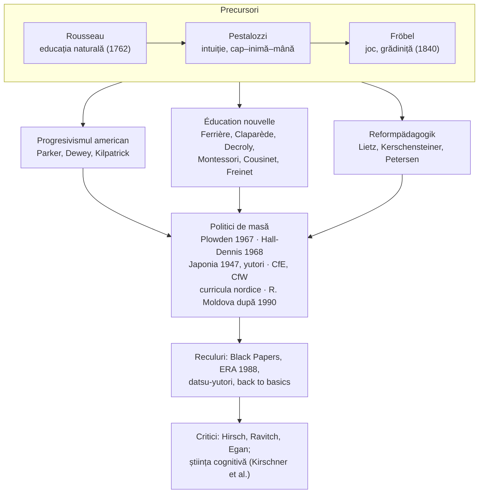

↑ [[00 Index - Analiza comparată internațională]]

> [!abstract] Pe scurt
> 1. **Progresivismul** (SUA), **educația nouă** (*Éducation nouvelle*, spațiul francofon) și ***Reformpädagogik*** (spațiul german) sunt variante ale aceleiași mișcări internaționale (cca 1890–1940): educația trebuie să pornească de la **copil** — interesele, activitatea, ritmul și experiența sa — nu de la programă și magistru.
> 2. Precursori: **Rousseau** (educația naturală, 1762), **Pestalozzi** (intuiția, cap–inimă–mână), **Fröbel** (jocul, grădinița). Teoreticianul central: **John Dewey** — educația ca **reconstrucție continuă a experienței** și școala ca **comunitate democratică**.
> 3. Mișcarea a produs **școli-laborator** și metode care au intrat în didactica de masă: metoda proiectelor (Kilpatrick), centrele de interes (Decroly), mediul pregătit (Montessori), tehnicile Freinet, munca pe grupe (Cousinet), Jena-Plan (Petersen), școala muncii (Kerschensteiner).
> 4. Politici de masă de inspirație progresistă: **Plowden** (Anglia, 1967), **Hall-Dennis** (Ontario, 1968), curriculumul japonez din 1947 și reforma ***yutori***, curricula nordice (Finlanda 1994/2014), **Curriculum for Excellence** (Scoția), **Curriculum for Wales**; în R. Moldova, **pedagogia centrată pe elev** după 1990 (Step by Step, 1994; ERR/gândire critică; curricula pe competențe).
> 5. Tiparul istoric recurent: **retorica progresistă** e mai puternică decât **practica** (Cuban), iar reformele de masă provoacă **reculuri** („înapoi la baze”: Anglia după 1976/1988, Japonia *datsu-yutori*, Canada, SUA).
> 6. Dovezile sunt **mixte**: Eight-Year Study și Montessori (Randolph et al., 2023: g ≈ 0,24 academic) sunt favorabile; descoperirea **neghidată** e inferioară instruirii explicite (Alfieri et al., 2011; Kirschner, Sweller & Clark, 2006), iar modelele „open education” din Follow Through au avut rezultate slabe.
> 7. Criticii (Hirsch, Ravitch, Egan, Christodoulou) susțin că progresivismul **dezavantajează elevii săraci** prin neglijarea cunoașterii; apărătorii răspund că problema e **implementarea superficială**, nu ideea — Dewey însuși a criticat pedocentrismul fără structură (1938).

---

## 1. Explicația teoriei

### 1.1 Întrebarea la care răspunde

Progresivismul răspunde la întrebarea: **cum trebuie să arate școala dacă luăm în serios natura copilului și exigențele unei societăți democratice și în schimbare?** Reacția este îndreptată împotriva școlii „tradiționale” de la sfârșitul sec. XIX: magistrocentrică, verbalistă, bazată pe memorare, pe disciplină exterioară și pe treptele formale herbartiene aplicate mecanic.

### 1.2 Ideile centrale

1. **Pedocentrismul** („revoluția copernicană” în educație, formulă atribuită lui Claparède și Dewey): copilul, nu programa, este centrul în jurul căruia se organizează școala.
2. **Activitatea proprie** (*Selbsttätigkeit*, *l'école active*): se învață făcând, explorând, rezolvând probleme reale.
3. **Interesul** ca motor: învățarea autentică pornește de la trebuințele și interesele copilului (Claparède: educația funcțională; Decroly: centrele de interes).
4. **Experiența și gândirea reflexivă** (Dewey): situația problematică declanșează ipoteze, verificare, reconstrucția experienței.
5. **Integrarea** conținuturilor în jurul temelor, proiectelor sau ocupațiilor, nu pe discipline izolate.
6. **Democrația școlară**: școala ca micro-societate, cooperare, autoguvernare (consilii, cooperative).
7. **Individualizarea** ritmului (Dalton, Winnetka, Montessori) și **respectul pentru stadiile dezvoltării**.
8. **Educația integrală**: intelect, afect, corp, muncă manuală, artă.

### 1.3 Concepte-cheie

| Concept | Definiție |
|---|---|
| **Educația negativă** (Rousseau) | protejarea dezvoltării naturale a copilului de influențele sociale premature; învățarea din consecințele naturale |
| **Intuiția / metoda elementară** (Pestalozzi) | pornirea de la percepția directă (formă, număr, cuvânt) și formarea armonioasă a „capului, inimii și mâinii” |
| **Darurile și ocupațiile** (Fröbel) | materiale de joc structurate prin care copilul exprimă și descoperă ordinea lumii; grădinița (*Kindergarten*) |
| **Reconstrucția experienței** (Dewey) | educația nu pregătește pentru viață, ci **este** viață; fiecare experiență bună modifică și îmbogățește experiențele următoare (principiile continuității și interacțiunii) |
| **Gândirea reflexivă** (Dewey, *How We Think*, 1910) | secvența dificultate → definirea problemei → ipoteze → raționament → verificare |
| **Metoda proiectelor** (Kilpatrick, 1918) | „actul intenționat, făcut din tot sufletul” ca unitate a instruirii: intenție, plan, execuție, judecată |
| **Educația funcțională** (Claparède) | activitatea școlară trebuie să răspundă unei trebuințe reale a copilului; interesul ca lege a comportamentului |
| **Centrele de interes / globalizarea** (Decroly) | organizarea conținuturilor în jurul trebuințelor fundamentale (hrană, adăpost, apărare, activitate), prin observație–asociere–exprimare; citirea globală |
| **Mediul pregătit / autoeducația** (Montessori) | ambient ordonat, materiale autocorective, perioade senzitive, libertate în limite; educatorul observă |
| **Tehnicile Freinet** | textul liber, tipografia școlară, corespondența interșcolară, fișele autocorective, planul de muncă, cooperativa clasei |
| **Munca liberă pe grupe** (Cousinet) | grupuri autoorganizate de elevi care își aleg sarcina; profesorul ca consultant |
| **Școala muncii** (*Arbeitsschule*, Kerschensteiner) | formarea caracterului civic prin muncă productivă și practică; rădăcina sistemului dual german |
| **Jena-Plan** (Petersen) | grupe de bază cu elevi de vârste diferite; ritm săptămânal: conversație, joc, muncă, sărbătoare |
| **Clasa deschisă / învățarea prin descoperire** | organizarea spațiului pe centre de activitate, lucru individual sau în grupe, integrare tematică (Plowden, *open classroom* american) |
| **Pedagogia centrată pe elev** | formula contemporană, adesea combinată cu constructivismul și competențele; în R. Moldova: „centrarea pe elev”, „tehnologii interactive” |

### 1.4 Ce presupune despre elev, profesor, cunoaștere, școală

| Despre… | Presupoziție |
|---|---|
| **elev** | activ, curios, bun prin natură; are propriile trebuințe și stadii; capabil de autoreglare dacă mediul e bine construit |
| **profesor** | ghid, observator, organizator al mediului și al situațiilor, „facilitator” (vocabular ulterior, Rogers) |
| **cunoaștere** | instrument pentru rezolvarea problemelor (pragmatism, Dewey); se construiește în experiență, nu se transmite ca produs gata făcut |
| **școală** | comunitate democratică în miniatură, legată de viața socială; laborator pedagogic |

---

## 2. Geneza și evoluția

**Precursori (1762–1850).** **Jean-Jacques Rousseau**, *Emil sau despre educație* (1762): copilul nu e un adult în miniatură; educația urmează natura și stadiile. **Johann Heinrich Pestalozzi** aplică ideile în institute (Burgdorf, 1800; Yverdon, 1805–1825) și în *Cum își învață Gertruda copiii* (1801). **Friedrich Fröbel** (*Die Menschenerziehung*, 1826) creează grădinița (Bad Blankenburg, 1840); grădinițele au fost interzise în Prusia între 1851 și 1860. În Finlanda, **Uno Cygnaeus** introduce munca manuală după Pestalozzi și Fröbel în școala populară (1866) ([[Finlanda - ecosistemul educațional]]).

**Formularea (1875–1920).**
- SUA: **Francis W. Parker** reformează școlile din Quincy (1875–1880); **John Dewey** deschide **Laboratory School** la Universitatea din Chicago (1896–1904), scrie *My Pedagogic Creed* (1897), *The School and Society* (1899), *The Child and the Curriculum* (1902), *Democracy and Education* (1916). **Kilpatrick** publică *The Project Method* (1918). *Progressive Education Association* (1919).
- Europa: **Cecil Reddie** (Abbotsholme, 1889) și **Hermann Lietz** (*Landerziehungsheime*, 1898) creează școli-internat „noi”; **Adolphe Ferrière** fondează Biroul internațional al școlilor noi (1899, Geneva). **Decroly** (*École de l'Ermitage*, Bruxelles, 1907), **Montessori** (*Casa dei Bambini*, Roma, 1907), **Claparède** (Institutul J.-J. Rousseau, Geneva, 1912), **Kerschensteiner** (*Begriff der Arbeitsschule*, 1912), **Ellen Key** (*Secolul copilului*, 1900).

**Apogeul internațional (1920–1940).** **Liga Internațională pentru Educație Nouă** (Calais, 1921) reunește Ferrière, Claparède, Decroly, Montessori, Cousinet, Freinet ș.a. **Freinet** începe la Bar-sur-Loup (1920), **Petersen** lansează Jena-Plan (1924/1927), **Parkhurst** planul Dalton (1919–1920), **Washburne** sistemul Winnetka (1919). **Steiner** deschide prima școală Waldorf (Stuttgart, 1919). **Neill** fondează Summerhill (1921). În Japonia: **mișcarea educației libere Taishō** (Seijō, 1917; Jiyū Gakuen, 1921). În Estonia: **Johannes Käis** (anii 1920–1930). În SUA: **Eight-Year Study** (1933–1941). Dewey avertizează în *Experience and Education* (1938) împotriva progresiștilor care resping orice structură.

**Declin, instrumentalizare și recul (1940–1965).** Regimurile totalitare desființează sau deturnează școlile noi; în URSS, experimentele pedologice și metoda complexelor/proiectelor sunt condamnate (hotărârea CC al PC(b) al URSS din 1936 împotriva pedologiei; metoda proiectelor fusese deja condamnată în 1931). În SUA, versiunea diluată „**life adjustment**” e atacată de Bestor (1953), iar **Sputnik** (1957) mută accentul pe rigoare disciplinară. În Japonia, curriculumul progresist din 1947 este corectat în 1958.

**A doua val (1965–1985).** Anglia: **Plowden Report** (1967) oficializează pedagogia centrată pe copil în primar; Ontario: **Hall-Dennis** (1968); SUA: **open classrooms**, *free schools*; Franța: mișcarea Freinet (ICEM) și, mai târziu, legea Jospin (1989). Contraofensivă: **Black Papers** (1969–1977), afacerea William Tyndale (1975–1976), discursul lui **Callaghan** la Ruskin College (1976), **ERA 1988**.

**Al treilea val și sinteze (1990–prezent).** Progresivismul se reîntoarce sub numele **constructivism**, **competențe**, **învățare prin proiecte și fenomene**, **pedagogie centrată pe elev**: curricula nordice (Finlanda 1994, 2014), *yutori* (Japonia, 1998/2002), *Teach Less, Learn More* (Singapore, 2005), CfE (Scoția, 2010), CfW (2022), programele Step by Step și „Lectură și scriere pentru dezvoltarea gândirii critice” în Europa de Est. Criticile cognitiviste (Kirschner, Sweller & Clark, 2006) și rezultatele PISA alimentează un nou recul „bogat în cunoaștere” (Anglia, Canada, Finlanda post-2023).

---

## 3. Autori, reprezentanți, cercetători

| Autor | Lucrare(ări), an | Aportul concret |
|---|---|---|
| **Jean-Jacques Rousseau** | *Emil sau despre educație* (1762) | descoperirea copilăriei ca vârstă proprie; educația naturală și negativă; învățarea prin experiență și consecințe |
| **Johann Heinrich Pestalozzi** | *Leonard și Gertruda* (1781–1787); *Cum își învață Gertruda copiii* (1801) | intuiția, metoda elementară, educația cap–inimă–mână; institutele de la Burgdorf și Yverdon; model pentru formarea învățătorilor |
| **Friedrich Fröbel** | *Die Menschenerziehung* (1826) | jocul ca activitate formativă; darurile; grădinița (1840) |
| **Francis W. Parker** | reforma din Quincy (1875–1880); *Talks on Pedagogics* (1894) | observație, lucru manual, integrarea disciplinelor; numit de Dewey „părintele” educației progresiste |
| **John Dewey** | *My Pedagogic Creed* (1897); *The School and Society* (1899); *The Child and the Curriculum* (1902); *How We Think* (1910); *Democracy and Education* (1916); *Experience and Education* (1938) | Laboratory School; educația ca reconstrucție a experienței; gândirea reflexivă; școala democratică; critica ambelor extreme (tradiționalism și pedocentrism fără structură) |
| **William H. Kilpatrick** | „The Project Method” (*Teachers College Record*, 1918) | metoda proiectelor; difuzarea progresivismului prin formarea a zeci de mii de profesori la Teachers College |
| **Helen Parkhurst; Carleton Washburne** | *Education on the Dalton Plan* (1922); sistemul Winnetka (din 1919) | individualizarea prin contracte și laboratoare (Dalton); materiale autocorective + activități de grup (Winnetka) |
| **George S. Counts** | *Dare the School Build a New Social Order?* (1932) | aripa reconstrucționistă: școala ca agent al schimbării sociale |
| **Adolphe Ferrière** | *L'École active* (1922); Biroul internațional al școlilor noi (1899) | sistematizarea principiilor școlii noi; animatorul Ligii Internaționale (1921) |
| **Édouard Claparède** | *Psychologie de l'enfant et pédagogie expérimentale* (1905); *L'éducation fonctionnelle* (1931) | educația funcțională, legea interesului; Institutul J.-J. Rousseau (1912), unde se formează Piaget |
| **Ovide Decroly** | *École de l'Ermitage* (1907) | centrele de interes, globalizarea, metoda globală a citirii; școala „pentru viață, prin viață” |
| **Maria Montessori** | *Il metodo della pedagogia scientifica* (1909); *Casa dei Bambini* (1907) | mediul pregătit, materiale autocorective, perioade senzitive, autoeducația; rețea mondială (AMI, 1929) |
| **Roger Cousinet** | *Une méthode de travail libre par groupes* (1945) | munca liberă pe grupe; mișcarea „La Nouvelle Éducation” |
| **Célestin Freinet** | *L'École moderne française* (1946); ICEM (1947) | tipografia școlară, textul liber, corespondența, cooperativa; pedagogia muncii și a cooperării |
| **Georg Kerschensteiner** | *Begriff der Arbeitsschule* (1912) | școala muncii, școlile de continuare din München, educația civică prin muncă |
| **Hermann Lietz** | *Landerziehungsheime* (din 1898) | școlile-internat rurale ca comunități de viață |
| **Peter Petersen** | *Der kleine Jena-Plan* (1927) | grupe de bază mixte ca vârstă, ritm săptămânal, școala-comunitate (controverse privind atitudinea sa în perioada nazistă — de verificat detaliile) |
| **Herman Nohl** | *Die pädagogische Bewegung in Deutschland und ihre Theorie* (1933/1935) | teoretizarea *Reformpädagogik* din interiorul pedagogiei germane |
| **A. S. Neill; Susan Isaacs** | Summerhill (1921); Malting House (1924–1927) | libertatea radicală (Neill); observația științifică a copiilor (Isaacs) |
| **Lady Bridget Plowden** (comitetul) | *Children and their Primary Schools* (1967) | oficializarea pedagogiei centrate pe copil în primarul englez; *Educational Priority Areas* |
| **Emmett Hall & Lloyd Dennis** | *Living and Learning* (Ontario, 1968) | școala flexibilă, centrată pe copil, bazată pe investigație |
| **Sawayanagi Masatarō; Hani Motoko; Obara Kuniyoshi** | Seijō (1917); Jiyū Gakuen (1921); Tamagawa Gakuen (1929) | mișcarea educației libere Taishō în Japonia |
| **Johannes Käis** | articolul din *Kasvatus* (1928) | școala activă și planurile individuale de învățare în Estonia |
| **Oh Cheon-seok** | Mișcarea Noii Educații (Coreea, după 1945) | transpunerea lui Dewey în Coreea (detalii biografice — de verificat) |
| **Graham Donaldson** | *Successful Futures* (2015) | fundamentul Curriculum for Wales |
| **Continuatori contemporani** | Deborah Meier (*The Power of Their Ideas*, 1995); Ted Sizer (*Horace's Compromise*, 1984); Linda Darling-Hammond; Satō Manabu | școli-comunitate, *Coalition of Essential Schools*, *deeper learning*; comunitățile de învățare în Japonia |
| **Istorici și analiști** | Lawrence Cremin (*The Transformation of the School*, 1961); Larry Cuban (*How Teachers Taught*, 1984/1993); David Labaree (*Progressivism, Schools and Schools of Education: An American Romance*, 2005) | Cuban: practica s-a schimbat mult mai puțin decât retorica; Labaree: progresivismul **administrativ** (eficientist) a câștigat în instituții, cel **pedagogic** în facultățile de educație |
| **Critici** | Arthur Bestor (*Educational Wastelands*, 1953); E. D. Hirsch Jr. (*The Schools We Need and Why We Don't Have Them*, 1996); Diane Ravitch (*Left Back: A Century of Failed School Reforms*, 2000); Kieran Egan (*Getting It Wrong from the Beginning*, 2002); Jeanne Chall (*The Academic Achievement Challenge*, 2000); Daisy Christodoulou (*Seven Myths about Education*, 2014) | progresivismul a subminat curriculumul academic și a dezavantajat copiii săraci (Hirsch, Ravitch); Egan: fundamentele psihologice (Spencer, Piaget) sunt greșite; Chall: sinteza cercetărilor favorizează abordările centrate pe profesor pentru elevii dezavantajați |
| **Critici din știința cognitivă** | Kirschner, Sweller & Clark (*Educational Psychologist*, 2006); Mayer (*American Psychologist*, 2004); Alfieri et al. (*Journal of Educational Psychology*, 2011) | ghidajul minimal nu funcționează pentru novici; descoperirea **asistată** e superioară celei neasistate |

---

## 4. Legătura cu manualul și cu vaultul

| Unde | Ce spune manualul / conspectul | Evaluare |
|---|---|---|
| [[2.1 Clasic, modern și postmodern - delimitări conceptuale]] · [[Modulul 02 - Clasic, modern și postmodern în educație]] | **psihocentrismul** („educația nouă”, pedocentrism): Rousseau precursor, Key, Montessori; Dewey ca inițiator al „paradigmei curriculumului” | **corect în linii mari**; manualul îl separă pe Dewey de educația nouă, deși Dewey este figura centrală a progresivismului; lipsesc criticile și dovezile |
| [[8.4 Sisteme alternative de organizare a instruirii]] · [[Modulul 08 - Sistemul de educație și managementul educației]] | Dalton, Winnetka, Montessori, Decroly, Freinet, Cousinet, Jena, Waldorf, Summerhill | **cel mai bogat loc**, dar manualul conține **multe erori** de nume și date (Freinet cu anii lui Cousinet, Winnetka „după al doilea război”), corectate în conspect |
| [[1.3 Normativitatea activității educaționale]] | metoda centrelor de interes (Decroly); principiul legării teoriei de practică (Dewey) | corect, fragmentar |
| [[3.6 Educația permanentă și autoeducația]] · [[Autoeducația - teorii, autori și corelări]] | Rousseau, Pestalozzi, Montessori (autoeducația), Freinet | legătură directă: Montessori folosește explicit termenul *autoeducazione* |
| [[3.3 Educația nonformală]] | Dewey — *learning by doing*; Kolb | corect |
| [[9.2 Profesorul postmodernist - facilitator al cunoașterii]] · [[Modulul 09 - Agenții educației și factorii dezvoltării]] | profesorul facilitator; orientarea constructivistă oficializată în R. Moldova (curriculum 2010, revizuit 2018–2019; standardele profesionale 2016) | conspectul adaugă critica Kirschner–Sweller–Clark: rolul de facilitator **nu exclude** ghidajul puternic |
| [[4.2 Problematica și funcțiile finalităților]] · [[4.1 Conceptul de finalitate educațională]] | Rousseau, Pestalozzi — idealuri; Dewey — scopurile apar din activitate | corect |
| [[5.2 Tipologia paradigmelor educaționale]] | Wurtz: paradigma clasică vs. modernă; paradigmele constructiviste ca paradigme contemporane | prezentare **normativă**: modernul/centrat pe elev e implicit superior; manualul nu discută reculurile și dovezile |
| [[1.4 Taxonomia științelor educației]] | pedagogia alternativelor educaționale (Codul Educației, art. 3) | corect |
| [[6.2.4 Educația estetică]] | Dewey, *Art as Experience* (1934) | corect |

> [!note] Unde manualul e incomplet
> Manualul prezintă educația nouă **istoric și descriptiv**, ca pe o etapă „modernă” depășită doar de postmodernism. Lipsesc: (1) **dovezile empirice** (Eight-Year Study, Follow Through, Montessori, meta-analizele despre descoperire); (2) **ciclurile de recul** din țările care au aplicat-o la scară; (3) distincția lui Dewey între **experiențe educative și noneducative** — adică avertismentul că activismul nu e automat învățare.

---

## 5. Implementare comparată

| Sistem | Cum a fost implementată (politică / program / instituție) | Când | Scară / intensitate | Dovezi sau rezultate |
|---|---|---|---|---|
| **Singapore** | retorica *Thinking Schools, Learning Nation* (1997) și ***Teach Less, Learn More*** (2005): curiozitate, investigație, reducerea conținutului; *Applied Learning Programmes*; educația timpurie centrată pe joc | 1997, 2005, 2011– | **redusă** (practică) / medie (discurs) | NIE (Kwek et al., 2018, 2023): investigația e prezentă în clasele mici, dar dispare în anii de examen ([[Singapore - ecosistemul educațional]]) |
| **Estonia** | Käis și școala activă (1920–1930); congresul din 1987 (curriculum umanist, centrat pe elev); **Step by Step** (din 1994), rețele Soros; curriculum pe competențe | 1928–1940; 1987–1996; 1994– | **medie** | continuitatea cu Käis e mai ales narațiune identitară; TALIS arată practici preponderent structurate ([[Estonia - ecosistemul educațional]]) |
| **Finlanda** | Cygnaeus (munca manuală, 1866); comisia din 1945 (școală umanistă, centrată pe copil); curriculum constructivist 1994; **2014**: competențe transversale și module multidisciplinare anuale („învățare prin fenomene”) | 1866; 1945; 1994; 2014/2016 | **medie** | discursul progresist mai puternic decât practica (Simola; Sahlgren); declinul PISA după 2006 face obiectul unei dispute cauzale ([[Finlanda - ecosistemul educațional]]) |
| **Regatul Unit** | Summerhill, Malting House; **Plowden** (1967) în primarul englez; recul: Black Papers, Ruskin (1976), **ERA 1988**, raportul „celor trei înțelepți” (1992), Strategiile naționale (1998); Scoția: **CfE** (2010); Țara Galilor: **CfW** (2022) | 1921; 1967–1988; 2010; 2022 | Anglia: **medie** istoric, **redusă** azi; Scoția și Țara Galilor: **centrală** în documente | ORACLE (1980): puține clase realmente progresiste; OCDE (2021): CfE cu implementare incoerentă; declinul PISA scoțian, cauzalitate disputată ([[Regatul Unit - ecosistemul educațional]]) |
| **Japonia** | mișcarea educației libere **Taishō** (Seijō 1917, Jiyū Gakuen 1921); **Course of Study (Tentative) 1947** de inspirație deweyană, studii sociale, mișcarea *core curriculum*; corectat în 1958; ***yutori*** (1977, 1989, 1998/2002): –30% conținut, Timpul pentru studii integrate; recul *datsu-yutori* (2008–2011) | 1912–1926; 1947–1958; 1977–2011 | **medie** (fluctuantă) | scăderea PISA 2003/2006 atribuită *yutori* cu cauzalitate discutabilă; Kariya: „decalajul de motivație”; moștenire pozitivă: învățarea prin investigație extinsă la liceu (2022) ([[Japonia - ecosistemul educațional]]) |
| **Coreea de Sud** | **Mișcarea Noii Educații** (după 1945, Oh Cheon-seok); curriculumul 7 (1997) centrat pe elev; școli de inovare (Gyeonggi, 2009); Nuri 2019 centrat pe joc | 1945–1960; 1997; 2009– | **redusă** | clase de 60–80 de elevi și presiunea examenelor au transformat progresivismul în retorică ([[Coreea de Sud - ecosistemul educațional]]) |
| **Canada** | **Hall-Dennis** (*Living and Learning*, Ontario, 1968): clase deschise, descoperire, predare în echipă; BC 2016 (curriculum pe competențe); învățarea prin joc la grădiniță (Ontario, full-day kindergarten) | 1968–1980; 2010– | **medie** | acuzat de relaxarea standardelor; pendul spre „înapoi la baze” (Harris 1995; *Right to Read* 2022) ([[Canada - ecosistemul educațional]]) |
| **Europa (UE / Consiliul Europei)** | leagănul educației noi: Liga Internațională (1921); mii de școli **Montessori** și **Waldorf**; **Jena-Plan** (Țările de Jos); **Freinet** (Franța, Belgia); **Reggio Emilia** (Italia); legea Jospin (Franța, 1989); competențele-cheie UE (2006, 2018) cu vocabular centrat pe elev | 1899–prezent | **medie–centrală** (istoric); alternative: **redusă** ca pondere | dovezi Montessori pozitive; dezbaterea franceză „pedagogi vs. republicani” ([[Europa - spațiul european al educației]]) |
| **SUA** | Parker, **Laboratory School** (1896), PEA (1919), **Eight-Year Study** (1933–1941), *life adjustment*; *open classrooms* (anii 1960–1970); modelele „afectiv-cognitive” din Follow Through; *Coalition of Essential Schools* (1984), High Tech High, *Deeper Learning* | 1875–prezent | **medie** (discurs mare, practică limitată) | Eight-Year Study favorabil; Follow Through nefavorabil modelelor deschise; Cuban: schimbare practică redusă ([[SUA - ecosistemul educațional]]) |
| **Republica Moldova** | după 1990: **pedagogia centrată pe elev** ca normă declarată; **Step by Step** (din 1994); programul **„Lectură și scriere pentru dezvoltarea gândirii critice”** (cadrul ERR, anii 1990–2000); curricula 2010 și 2018–2019 pe competențe; **standardele profesionale** (2016: „strategii interactive, cooperante și socializante”); alternative educaționale recunoscute (Codul Educației, art. 3) | 1994–prezent | **medie** (discurs centrat pe elev dominant); practică **redusă–medie** | lipsesc evaluări cauzale naționale; PISA 2015–2022 fără salt; practica rămâne frecvent frontală sub vocabular interactiv (observație din literatura de specialitate, necuantificată) — vezi [[8.3 Sistemul de învățământ din Republica Moldova]], [[9.2 Profesorul postmodernist - facilitator al cunoașterii]] |

### 5.1 Studiu de caz: SUA — Laboratory School și Eight-Year Study

**Laboratory School** (Chicago, 1896–1904) a fost laboratorul ideilor lui Dewey: copiii învățau știință, istorie și matematică prin **ocupații** (gătit, țesut, grădinărit, tâmplărie), organizate ca activități sociale. Dewey nu a propus o școală fără conținut: ocupațiile erau **punți** spre disciplinele organizate, iar profesorii erau specialiști. După plecarea lui Dewey la Columbia, ideile au fost transmise mai ales prin **Kilpatrick**, într-o formă mai pedocentrică.

**Eight-Year Study** (1933–1941), organizat de *Progressive Education Association*, a eliberat 30 de licee de cerințele de admitere la facultate. Evaluarea, condusă de **Ralph Tyler**, a comparat **1.475 de perechi** de absolvenți: cei din școlile experimentale au avut la facultate rezultate **similare sau puțin mai bune**, cu avantaje la curiozitate, inițiativă și implicare civică; avantajul era mai mare pentru școlile cele mai inovatoare. Publicarea în 1942 (Aikin, *The Story of the Eight-Year Study*) a fost eclipsată de război. Contrastul vine din **Project Follow Through** (1968–1977): modelele „afectiv-cognitive” și *open education* (Bank Street, EDC) au obținut rezultate mai slabe decât Direct Instruction la abilitățile de bază **și** la cele afective (evaluarea Abt, 1977; metodologia contestată de House et al., 1978). Lecția americană: progresivismul **structurat**, cu profesori foarte bine pregătiți, poate funcționa; progresivismul **difuz**, aplicat la scară cu elevi dezavantajați, riscă să eșueze. Vezi [[SUA - ecosistemul educațional]] și [[Behaviorismul și instruirea directă]].

### 5.2 Studiu de caz: Marea Britanie — Plowden, reculul și divergența națiunilor

**Plowden** (1967) a declarat copilul inima procesului educațional și a recomandat învățarea prin descoperire, integrarea tematică, gruparea flexibilă și *Educational Priority Areas*. Influența asupra discursului a fost enormă; asupra practicii, mai mică: studiul **ORACLE** (Galton, Simon & Croll, 1980) a găsit **puține clase** realmente progresiste, iar lucrul individual predomina fără interacțiune cognitivă bogată. **Neville Bennett** (*Teaching Styles and Pupil Progress*, 1976) a asociat stilurile formale cu progres mai bun (reanaliza ulterioară a nuanțat concluziile).

Reculul a fost politic: *Black Papers* (1969–1977), afacerea **William Tyndale** (școală din Londra, 1975–1976), discursul lui **Callaghan** la Ruskin (1976) și, decisiv, **ERA 1988** (National Curriculum, teste). Raportul „celor trei înțelepți” (Alexander, Rose, Woodhead, 1992) a criticat predarea pe teme și lucrul individual excesiv. Strategiile naționale (1998–1999) au impus **predare interactivă cu întreaga clasă**. După devoluție, națiunile au divergat: **Anglia** a mers spre curriculum bogat în cunoaștere și instruire explicită; **Scoția** (CfE, 2010) și **Țara Galilor** (CfW, 2022) au adoptat curricula pe capacități, cu școlile ca autori de curriculum. OCDE (2021) a apreciat viziunea CfE, dar a criticat implementarea incoerentă și lipsa de claritate asupra cunoașterii; declinul PISA scoțian **coincide** temporal cu CfE, fără cauzalitate stabilită. Vezi [[Regatul Unit - ecosistemul educațional]].

### 5.3 Studiu de caz: Japonia — de la Taishō la *yutori* și înapoi

Japonia oferă cel mai lung **ciclu pendular**. În **perioada Taishō** (1912–1926), școli private și anexe ale școlilor normale au experimentat educația liberă: **Seijō** (Sawayanagi Masatarō, 1917), **Jiyū Gakuen** (Hani Motoko, 1921), planul Dalton. Militarismul anilor 1930 a înăbușit mișcarea. După 1945, sub ocupația americană, **Course of Study (Tentative)** din 1947 a introdus studiile sociale și unități centrate pe experiență; mișcarea *core curriculum* (planuri locale) a înflorit. Critica „scăderii nivelului academic” a dus, în **1958**, la un curriculum sistematic, cu forță juridică obligatorie.

**Yutori kyōiku** (curricula 1977, 1989, 1998) a redus conținutul și orele ca reacție la „educația Shinkansen” și la problemele școlare din anii 1970–1980; curriculumul din 1998, aplicat din 2002, a tăiat cca 30% din conținut, a introdus săptămâna de cinci zile și **Timpul pentru studii integrate**. Scăderea la PISA 2003/2006 a fost **atribuită public** reformei, deși cohortele testate fuseseră expuse doar parțial, iar Kariya a documentat un „decalaj de motivație” social. Reculul *datsu-yutori* (2008–2011) a crescut orele și conținutul, dar a **păstrat** studiile integrate, extinse în 2022 la liceu ca „timp pentru investigație”. Bjork (*High-Stakes Schooling*) arată că examenele și *juku* au neutralizat reducerea presiunii. Lecția: o reformă progresivă **top-down**, fără investiții proporționale în capacitatea profesorilor, produce reacție politică; elementele integrate într-un curriculum solid (investigația) supraviețuiesc. Vezi [[Japonia - ecosistemul educațional]].

### 5.4 Studiu de caz: Finlanda 2014 — progresivism în sistem de mare capacitate

Finlanda are rădăcini progresive vechi (Cygnaeus, comisia din 1945), dar practica de clasă a fost mult timp **frontală și structurată** (Simola). Curriculumul din 1994 a adoptat explicit o concepție constructivistă; cel din 2014 (aplicat din 2016) a introdus **competențele transversale** (T1–T7) și obligația ca fiecare școală să organizeze anual cel puțin un **modul multidisciplinar** — mediatizat internațional, în mod exagerat, ca „abolirea disciplinelor” și „învățare prin fenomene”. Disciplinele au rămas.

Dezbaterea cauzală este deschisă: **Sahlgren** (2015) leagă declinul PISA de după 2006 de trecerea la metode centrate pe elev și de erodarea autorității profesorului; contraargumentele invocă declinul general nordic și OCDE, factorii extrașcolari (lectură, ecrane) și faptul că declinul **precede** curriculumul din 2014. Guvernul a reorientat în 2023–2025 accentul spre **competențele de bază**, mai multe ore de literație și restricționarea telefoanelor. Vezi [[Finlanda - ecosistemul educațional]] și Învățarea prin proiecte, investigație și fenomene.

---

## 6. Dovezi empirice și critici

**Studii și meta-analize-cheie.**
- **Eight-Year Study** (Aikin, 1942; Chamberlin et al., 1942): 1.475 de perechi; rezultate universitare egale sau ușor superioare pentru absolvenții școlilor experimentale. Limită: școli selectate, perioadă specială.
- **Project Follow Through** (Abt Associates, 1977): modelele *open education* și afectiv-cognitive sub modelele de abilități de bază, inclusiv la stima de sine. Critici metodologice: House et al. (1978).
- **Montessori**: Lillard & Else-Quest (*Science*, 2006), loterie de admitere, avantaje la 5 și 12 ani (eșantioane mici); Lillard et al. (2017), studiu longitudinal; **Randolph et al. (Campbell Systematic Reviews, 2023)**: 32 de studii, efect compus **g ≈ 0,24** la rezultatele academice (limbă 0,17; matematică 0,22) și 0,23–0,41 la rezultate nonacademice, cu efecte mai mari în studiile randomizate și în primar.
- **Descoperirea**: **Alfieri, Brooks, Aldrich & Tenenbaum (2011)**, două meta-analize: descoperirea **neasistată** este inferioară instruirii explicite (d ≈ –0,38), dar descoperirea **asistată** (ghidaj, explicații cerute elevului, feedback) este superioară altor forme de instruire (d ≈ 0,30). Mayer (2004): „regula celor trei eșecuri” pentru descoperirea pură.
- **Kirschner, Sweller & Clark (2006)**: ghidajul minimal ignoră arhitectura cognitivă umană; efectul inversării expertizei explică de ce novicii au nevoie de ghidaj, iar experții nu.
- **PISA 2015**: frecvența raportată a **predării științelor prin investigație** se asociază **negativ** cu scorurile în majoritatea sistemelor, iar **instruirea dirijată de profesor** pozitiv (OCDE, 2016; analize secundare pe mai multe țări). Atenție: date **corelaționale**, auto-raportate; McKinsey (2017) sugerează că **combinația** (predare dirijată în majoritatea lecțiilor + investigație în unele) e optimă.
- **Practica reală**: Cuban (1984/1993) și ORACLE (1980) — schimbarea de practică a fost mult mai mică decât retorica.
- **Proiecte recente cu RCT** (PBL bine structurat în științe și studii sociale, 2021–2023) arată efecte pozitive moderate — detaliate în Învățarea prin proiecte, investigație și fenomene.

**Critici.**
- **Echitate**: Hirsch, Ravitch, Chall — abordările centrate pe copil presupun capital cultural de acasă; elevii dezavantajați pierd cel mai mult.
- **Fundamente**: Egan — ideea că copilul trebuie să pornească de la „concret și apropiat” e contrazisă de puterea imaginativă a copiilor (mituri, povești).
- **Implementare**: formele (grupe, proiecte, clase deschise) se copiază fără substanță (Dewey, 1938; Labaree).
- **Contra-critică**: progresiștii răspund că testele standardizate nu măsoară ce urmăresc ei (autonomie, cooperare, cetățenie) și că eșecurile provin din implementări superficiale; bunăstarea scăzută în sistemele „stricte” arată costuri.

> [!warning] Când funcționează și când nu
> - **Funcționează** mai bine: cu profesori foarte bine pregătiți; cu **structură** și ghidaj (descoperire asistată, proiecte cu obiective clare); pentru elevi care au deja cunoștințe de bază; în educația timpurie de calitate (Montessori riguros, joc ghidat); pentru obiective nonacademice (implicare, atitudini).
> - **Nu funcționează**: ca descoperire **neghidată** pentru novici; ca înlocuire a predării explicite a abilităților de bază (citire, calcul); implementat **top-down**, rapid, fără formare (yutori, CfE în parte); când examenele cu miză mare contrazic discursul (Coreea, Singapore).
> - **Atenție la cauzalitate**: nici declinurile (Scoția, Finlanda, Japonia 2003) nici succesele (Eight-Year Study) nu pot fi atribuite **exclusiv** pedagogiei progresive.
> - Unele detalii istorice (Petersen, Oh Cheon-seok, datarea exactă a principiilor lui Ferrière) sunt marcate „de verificat”.

---

## 7. Implicații practice

> [!tip] Pentru profesor la clasă
> - **Păstrați ce e valid**: pornirea de la o **problemă reală sau o întrebare** care creează nevoia de cunoaștere, activitatea elevului, cooperarea, legătura cu viața — dar **nu renunțați la explicația clară**.
> - **Descoperire asistată, nu descoperire pură**: dați exemple rezolvate, întrebări-ghid, cereți elevilor să-și explice raționamentul, oferiți feedback prompt (Alfieri et al., 2011).
> - **Secvența potrivită**: pentru novici — instruire explicită, apoi aplicare în sarcini deschise; pentru elevii avansați — investigație și proiecte cu mai multă autonomie (efectul inversării expertizei).
> - **Proiectul ca vehicul al cunoașterii**: fiecare proiect să aibă obiective disciplinare clare, verificate prin evaluare; evitați activismul fără învățare („experiențe noneducative”, Dewey).
> - **ERR bine făcut** (Evocare – Realizarea sensului – Reflecție) este compatibil cu dovezile dacă faza de „realizare a sensului” conține **predare și text substanțial**, nu doar discuție.

> [!tip] Pentru politica educațională din R. Moldova
> 1. **Reechilibrați discursul normativ**: standardele profesionale și ghidurile metodologice să recomande **predare explicită + metode active**, nu metode interactive ca scop în sine; formarea continuă să includă dovezile despre ghidaj (Kirschner et al.; Rosenshine).
> 2. **Evitați reformele pendulare**: lecția Japoniei, Scoției și Angliei este că schimbările bruște de paradigmă, fără formare și fără date, produc recul. Pilotați și evaluați (ex. module integrate, proiecte) înainte de generalizare.
> 3. **Alternativele educaționale** (Step by Step, Montessori, Waldorf) — sprijiniți-le ca **laboratoare** evaluate independent, nu ca soluții de sistem.
> 4. **Echitate**: în școlile rurale și cu elevi dezavantajați, prioritatea este asigurarea **cunoștințelor și abilităților de bază** prin predare clară; componentele progresive (proiecte, cooperare) se adaugă, nu se substituie.
> 5. **Aliniați evaluarea**: dacă se cer investigație și proiecte, examenele naționale trebuie să le valorizeze; altfel se repetă tiparul coreean/singaporez (discurs progresist, practică de examen).

---

## 8. Legături cu alte teorii din catalog

- [[Constructivismul cognitiv (Piaget, Bruner)]] — fundamentul psihologic ulterior al progresivismului; Piaget s-a format la Institutul Rousseau al lui Claparède.
- [[Socioconstructivismul și teoria activității (Vygotsky)]] — completează dimensiunea socială a lui Dewey; pedologia sovietică a fost desființată în 1936, ca și experimentele progresiste.
- Învățarea prin proiecte, investigație și fenomene — moștenitoarea directă a metodei proiectelor (Kilpatrick) și a centrelor de interes, cu dovezi recente mai riguroase.
- [[Behaviorismul și instruirea directă]] — antiteza istorică; Follow Through a fost confruntarea empirică directă.
- [[Știința cognitivă a învățării]] — principala sursă a criticii contemporane (ghidaj, cunoștințe de fond).
- [[Tradiția Bildung-Didaktik și tradiția Curriculum]] — *Reformpädagogik* a fost teoretizată de Nohl în tradiția *Didaktik*; Dewey a criticat curriculumul eficientist.
- Educația timpurie — Fröbel, Montessori, Reggio Emilia: domeniul în care ideile progresiste au cea mai solidă implantare și dovezi.
- Diferențierea, inteligențele multiple și designul universal — Dalton, Winnetka și Montessori sunt precursorii individualizării.
- [[Pedagogia critică și educația pentru cetățenie]] — aripa reconstrucționistă (Counts) și școala democratică (Dewey, Freinet) duc spre Freire și educația civică.
- [[Învățarea autoreglată, metacogniția și autoeducația]] — autoeducația montessoriană și planurile de muncă Freinet anticipă autoreglarea.
- [[Taxonomiile obiectivelor și educația centrată pe competențe]] — curricula pe competențe (CfE, Finlanda 2014, R. Moldova) poartă adesea retorica progresistă.

---

## 9. Întrebări de reflecție

1. Dewey a criticat în 1938 atât școala tradițională, cât și progresiștii radicali. Ce anume din critica sa rămâne valabil pentru „pedagogia centrată pe elev” din R. Moldova?
2. De ce practica de clasă s-a schimbat mult mai puțin decât retorica (Cuban)? Ce mecanisme instituționale (examene, manuale, formare) explică acest decalaj?
3. Comparați Eight-Year Study și Follow Through. Ce condiții diferite pot explica rezultatele opuse pentru abordările progresiste?
4. Este legitim să atribuim declinul PISA din Scoția sau Finlanda curriculumului progresist? Ce ar trebui să știm pentru a stabili cauzalitatea?
5. Cum ați transforma o lecție bazată pe descoperire neghidată într-una bazată pe **descoperire asistată**, păstrând activitatea elevilor?
6. Ce lecții oferă ciclul japonez Taishō → 1947 → 1958 → *yutori* → *datsu-yutori* pentru o reformă curriculară în R. Moldova?

---

## 10. Surse

**Precursori și clasici**
- Rousseau, J.-J. (1762). *Émile, ou De l'éducation*. Amsterdam: Néaulme.
- Pestalozzi, J. H. (1801). *Wie Gertrud ihre Kinder lehrt*. Bern/Zürich: Gessner.
- Fröbel, F. (1826). *Die Menschenerziehung*. Keilhau.
- Dewey, J. (1897). My Pedagogic Creed. *School Journal*, 54, 77–80.
- Dewey, J. (1899). *The School and Society*. Chicago: University of Chicago Press.
- Dewey, J. (1902). *The Child and the Curriculum*. Chicago: University of Chicago Press.
- Dewey, J. (1910). *How We Think*. Boston: D. C. Heath.
- Dewey, J. (1916). *Democracy and Education*. New York: Macmillan.
- Dewey, J. (1938). *Experience and Education*. New York: Kappa Delta Pi / Macmillan.
- Kilpatrick, W. H. (1918). The Project Method. *Teachers College Record*, 19(4), 319–335.
- Parkhurst, H. (1922). *Education on the Dalton Plan*. New York: Dutton.
- Counts, G. S. (1932). *Dare the School Build a New Social Order?* New York: John Day.
- Ferrière, A. (1922). *L'École active*. Neuchâtel/Genève: Forum.
- Claparède, É. (1931). *L'éducation fonctionnelle*. Neuchâtel: Delachaux & Niestlé.
- Montessori, M. (1909). *Il metodo della pedagogia scientifica applicato all'educazione infantile nelle Case dei Bambini*. Città di Castello: Lapi.
- Cousinet, R. (1945). *Une méthode de travail libre par groupes*. Paris: Cerf.
- Freinet, C. (1946). *L'École moderne française*. Gap: Ophrys.
- Kerschensteiner, G. (1912). *Begriff der Arbeitsschule*. Leipzig: Teubner.
- Petersen, P. (1927). *Der kleine Jena-Plan*. Langensalza: Beltz.
- Nohl, H. (1935). *Die pädagogische Bewegung in Deutschland und ihre Theorie*. Frankfurt/M.: Schulte-Bulmke.

**Politici și implementări**
- Aikin, W. M. (1942). *The Story of the Eight-Year Study*. New York: Harper.
- Central Advisory Council for Education (England) (1967). *Children and their Primary Schools* (Plowden Report). London: HMSO. https://education-uk.org/documents/plowden/
- Provincial Committee on Aims and Objectives of Education in the Schools of Ontario (1968). *Living and Learning* (Hall-Dennis Report). Toronto.
- Galton, M., Simon, B., Croll, P. (1980). *Inside the Primary Classroom* (ORACLE). London: Routledge & Kegan Paul.
- Bennett, N. (1976). *Teaching Styles and Pupil Progress*. London: Open Books.
- Alexander, R., Rose, J., Woodhead, C. (1992). *Curriculum Organisation and Classroom Practice in Primary Schools*. London: DES.
- OECD (2021). *Scotland's Curriculum for Excellence: Into the Future*. Paris: OECD Publishing. https://doi.org/10.1787/bf624417-en
- Donaldson, G. (2015). *Successful Futures*. Cardiff: Welsh Government.
- Bjork, C. (2016). *High-Stakes Schooling: What We Can Learn from Japan's Experiences*. Chicago: University of Chicago Press.
- Kariya, T. (2013). *Education Reform and Social Class in Japan*. London: Routledge.
- Opetushallitus (2014). *Perusopetuksen opetussuunnitelman perusteet 2014*. Helsinki.
- Sahlgren, G. H. (2015). *Real Finnish Lessons*. London: Centre for Policy Studies.
- Programul Educațional Pas cu Pas (Step by Step) Moldova. https://pascupas.md/en/about-us/

**Istorie, analiză, critici**
- Cremin, L. A. (1961). *The Transformation of the School: Progressivism in American Education, 1876–1957*. New York: Knopf.
- Cuban, L. (1993). *How Teachers Taught: Constancy and Change in American Classrooms, 1890–1990* (ed. 2). New York: Teachers College Press.
- Labaree, D. F. (2005). Progressivism, schools and schools of education: An American romance. *Paedagogica Historica*, 41(1–2), 275–288.
- Bestor, A. (1953). *Educational Wastelands*. Urbana: University of Illinois Press.
- Hirsch, E. D., Jr. (1996). *The Schools We Need and Why We Don't Have Them*. New York: Doubleday.
- Ravitch, D. (2000). *Left Back: A Century of Failed School Reforms*. New York: Simon & Schuster.
- Egan, K. (2002). *Getting It Wrong from the Beginning*. New Haven: Yale University Press.
- Chall, J. S. (2000). *The Academic Achievement Challenge*. New York: Guilford.
- Christodoulou, D. (2014). *Seven Myths about Education*. London: Routledge.

**Dovezi empirice**
- Stebbins, L. B. et al. (1977). *Education as Experimentation: A Planned Variation Model* (Follow Through, vol. IV). Cambridge, MA: Abt Associates.
- House, E. R., Glass, G. V., McLean, L. D., Walker, D. F. (1978). No simple answer: Critique of the Follow Through evaluation. *Harvard Educational Review*, 48(2), 128–160.
- Lillard, A., Else-Quest, N. (2006). Evaluating Montessori education. *Science*, 313(5795), 1893–1894.
- Lillard, A. S. et al. (2017). Montessori preschool elevates and equalizes child outcomes: A longitudinal study. *Frontiers in Psychology*, 8, 1783.
- Randolph, J. J., Bryson, A., Menon, L. et al. (2023). Montessori education's impact on academic and nonacademic outcomes: A systematic review. *Campbell Systematic Reviews*, 19(3), e1330. https://doi.org/10.1002/cl2.1330
- Mayer, R. E. (2004). Should there be a three-strikes rule against pure discovery learning? *American Psychologist*, 59(1), 14–19.
- Kirschner, P. A., Sweller, J., Clark, R. E. (2006). Why minimal guidance during instruction does not work. *Educational Psychologist*, 41(2), 75–86.
- Alfieri, L., Brooks, P. J., Aldrich, N. J., Tenenbaum, H. R. (2011). Does discovery-based instruction enhance learning? *Journal of Educational Psychology*, 103(1), 1–18.
- OECD (2016). *PISA 2015 Results (Volume II): Policies and Practices for Successful Schools*. Paris: OECD Publishing.
- Mourshed, M., Krawitz, M., Dorn, E. (2017). *How to Improve Student Educational Outcomes: New Insights from Data Analytics*. McKinsey & Company.
- Notele de țară din vault: [[SUA - ecosistemul educațional]], [[Regatul Unit - ecosistemul educațional]], [[Japonia - ecosistemul educațional]], [[Finlanda - ecosistemul educațional]], [[Europa - spațiul european al educației]], [[Canada - ecosistemul educațional]].
