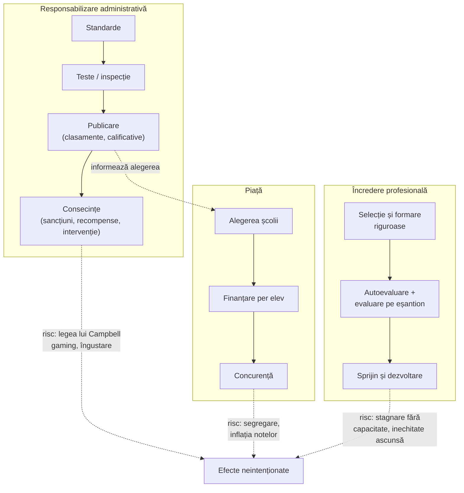

↑ [[00 Index - Analiza comparată internațională]] · Conspecte-sursă: [[8.6 Managementul educației și reforma]] · [[8.3 Sistemul de învățământ din Republica Moldova]] · Modul: [[Modulul 08 - Sistemul de educație și managementul educației]]

> [!abstract] Pe scurt
> - **Întrebarea**: cum se asigură statul (și societatea) că școlile finanțate public **fac ce trebuie**? Prin **reguli** (birocrație), **rezultate măsurate și consecințe** (responsabilizare administrativă), **concurență și alegere** (piață) sau **încredere în profesioniști** (responsabilitate profesională)?
> - **Logica pieței** (Friedman, 1955; Chubb & Moe, 1990): banii urmează elevul, familiile aleg, școlile concurează, iar calitatea crește. **Logica responsabilizării** (New Public Management, teoria principal–agent): standarde, teste, inspecție și clasamente aliniază comportamentul școlilor cu scopurile publice.
> - **Dovezile sunt mixte, nu nule.** Responsabilizarea cu consecințe produce **câștiguri reale, dar înguste** (NCLB la matematică: Dee & Jacob, 2011). Abolirea clasamentelor în Țara Galilor a **redus** performanța (Burgess et al., 2013). Charter-urile urbane „no excuses” au efecte mari (loterii), dar voucherele recente au rezultate slabe. Suedia și Chile arată **segregare** și **inflația notelor**.
> - **Costurile** sunt sistematice: **legea lui Campbell** (indicatorii cu miză se corup), inflația scorurilor (Koretz), îngustarea curriculumului, fraudă, *gaming*, **performativitate** (Ball) și stres.
> - **Alternativa „încrederii”** (Finlanda; Estonia, parțial) are responsabilitate profesională, autoevaluare, evaluare pe eșantion și fără clasamente. **Dar** încrederea a funcționat pentru că exista deja **capacitate profesională** (Sahlgren).
> - Majoritatea sistemelor sunt **hibride**: Singapore (control central + autoevaluare + examene cu miză mare), Japonia (evaluare națională fără clasamente), Ontario (date publice cu mize mici), Estonia (examene + autoevaluare).
> - **R. Moldova** are un sistem **hibrid în construcție**: examene cu miză mare (BAC, cu măsuri anti-fraudă după 2013–2014), evaluare externă a școlilor prin **ANACEC** (2018), fișe de performanță (din 2013), finanțare per elev (2013). Riscul e un regim de **control fără capacitate de sprijin**.

---

## 1. Explicația teoriei

### 1.1 Întrebarea la care răspunde

Orice sistem public de educație are o problemă de **delegare**. Cetățenii (prin stat) finanțează școli, dar nu pot observa direct ce se întâmplă în clasă. Profesorii și directorii au mai multă informație și interese proprii. Teoriile guvernării educației răspund diferit la aceleași întrebări:

1. **Cine** trage la răspundere pe cine (statul, părinții ca „clienți”, comunitatea, colegii de profesie)?
2. **Pentru ce**: respectarea regulilor, rezultatele la teste, satisfacția familiilor, echitatea, bunăstarea?
3. **Cum**: reglementare, inspecție, clasamente, concurență, sancțiuni și recompense, autoevaluare, încredere?
4. **Cu ce efecte**, inclusiv neintenționate?

### 1.2 Cele patru logici de guvernare

| Logica | Mecanism | Cine controlează | Autori-cheie | Exemple |
|---|---|---|---|---|
| **Birocratică** | reguli, proceduri, inspecție a conformității | ierarhia administrativă | Weber | modelul sovietic; Franța clasică; manualul: „modelul birocratic” |
| **Administrativă, de rezultate** (*test-based accountability*, NPM) | standarde → măsurare → publicare → consecințe | statul ca „principal” | Hood (NPM); teoria principal–agent; Hanushek | NCLB (SUA); Ofsted și clasamentele (Anglia); NAEA (Coreea) |
| **De piață** (*market accountability*) | alegere, finanțare per elev, concurență, intrarea furnizorilor | familiile ca „clienți” | Friedman; Chubb & Moe; Hirschman („exit”) | vouchere (Milwaukee, Chile 1981); charter (SUA); *friskolor* (Suedia 1992); academii (Anglia) |
| **Profesională, bazată pe încredere** (*professional / intelligent accountability*) | selecția și formarea profesorilor, norme profesionale, autoevaluare, evaluare pe eșantion pentru dezvoltare | profesia și comunitatea | Sahlberg; O'Neill; Hargreaves & Shirley; Darling-Hammond | Finlanda; Estonia (parțial); Scoția; Japonia (parțial) |

### 1.3 Ideile centrale

1. **Problema principal–agent.** Principalul (statul, părinții) nu poate observa efortul agentului (școala, profesorul). Informația (teste, inspecții) și stimulentele (consecințe) reduc asimetria. Formularea economică vine de la Jensen & Meckling (1976). În educație, sarcinile sunt **multiple și greu de măsurat**, deci stimulentele pe un singur indicator distorsionează efortul: problema „multi-sarcină” (Holmström & Milgrom, 1991).
2. **New Public Management** (Hood, 1991): administrația publică adoptă logica afacerilor — ținte, indicatori de performanță, autonomie managerială în schimbul responsabilității pentru rezultate, contractare, cvasi-piețe (Le Grand).
3. **Argumentul pieței.** Friedman (1955): statul să **finanțeze** educația (efecte externe pozitive), dar nu neapărat să o și **administreze**; voucherele permit alegerea. Chubb & Moe (1990): controlul democratic-birocratic sufocă autonomia școlilor. Piața ar produce organizații mai eficiente. Hirschman (1970): „ieșirea” (*exit*) și „vocea” (*voice*) ca mecanisme de corecție.
4. **Legea lui Campbell** (1976): cu cât un indicator cantitativ e folosit mai mult pentru decizii sociale, cu atât e mai expus coruperii și cu atât distorsionează procesele pe care trebuia să le monitorizeze. Legea lui Goodhart spune același lucru în economie.
5. **Inflația scorurilor** (Koretz, 2008, 2017): sub miză mare, scorurile la testul oficial cresc mai repede decât competențele reale (măsurate prin teste independente precum NAEP). Explicațiile sunt predarea pentru test, îngustarea curriculumului, concentrarea pe „elevii de la limită” (*bubble kids*) și frauda.
6. **Performativitatea** (Ball, 2003): măsurătorile nu doar descriu munca, ci o **reconstituie**. Profesorii ajung să „fabrice” performanța pentru indicatori și își pierd sensul profesional.
7. **Guvernarea prin cifre** (Ozga, Grek, Lawn): datele comparative (PISA, clasamentele) devin instrumente de guvernare mai puternice decât legile, prin „șocuri” și „modele de referință”.
8. **GERM** (Sahlberg, 2006, 2011): *Global Educational Reform Movement* — standardizare, concentrare pe disciplinele de bază, responsabilizare prin teste, piață și alegere, soluții „împrumutate” din management. Alternativa este **„calea finlandeză”**: încredere, profesionalism, echitate.
9. **Regimuri de responsabilizare** (Hopmann, 2008): trecerea de la „managementul locurilor” (*management of placements*: resurse, reguli, input) la „managementul așteptărilor” (*management of expectations*: rezultate măsurate). Tradițiile *Didaktik* și *Curriculum* reacționează diferit la această trecere.
10. **Responsabilizarea „inteligentă”** (O'Neill, 2002; Crooks, 2003): încrederea nu înseamnă lipsa controlului, ci un control **proporțional, profesional și orientat spre îmbunătățire**, în locul suspiciunii și al supraauditului.

### 1.4 Concepte-cheie

| Concept | Definiție |
|---|---|
| **Responsabilizare** (*accountability*) | Obligația de a da socoteală pentru rezultate sau procese, față de o autoritate care poate aplica consecințe |
| **Responsabilitate** (*responsibility*) | Asumarea internă, profesională și morală a obligațiilor. Hargreaves & Shirley: „responsabilitate înaintea responsabilizării” |
| **Miză mare / mică** (*high / low stakes*) | Gradul în care rezultatele unui indicator produc consecințe pentru elevi, profesori sau școli |
| **Responsabilizare consecventă** (*consequential accountability*) | Rezultatele produc consecințe (sancțiuni, intervenție, recompense), nu doar publicare (Hanushek & Raymond, 2005) |
| **Clasamente** (*league tables*, *performance tables*) | Publicarea comparativă a rezultatelor școlilor |
| **Valoare adăugată / progres** (*value-added*, *Progress 8*) | Măsurarea progresului elevilor, controlând nivelul de plecare, pentru a nu penaliza școlile cu elevi dezavantajați |
| **Inspecție școlară** | Evaluare externă a școlii prin vizite, observare, analiza documentelor și a datelor (Ofsted, Estyn, Inspectoratul olandez) |
| **Autoevaluarea școlii** (*school self-evaluation*) | Analiza internă, sistematică, a calității, adesea validată extern (SEM în Singapore; autoevaluarea obligatorie în Estonia și Japonia) |
| **Evaluare pe eșantion** | Monitorizarea sistemului fără rezultate pe școli (Finlanda — FINEEC; NAEP în SUA) |
| **Voucher** | Cupon finanțat public, folosit de familie la o școală aleasă, publică sau privată |
| **Școală charter** | Școală publică autonomă, administrată independent pe baza unui contract (charter), responsabilă pentru rezultate |
| **Academie / free school** (Anglia) | Școli finanțate direct de stat, autonome față de autoritatea locală, adesea în lanțuri (*Multi-Academy Trusts*) |
| ***Friskolor*** (Suedia) | Școli independente (inclusiv cu profit) finanțate prin voucher din 1992 |
| **Cvasi-piață** | Piață cu finanțare publică și furnizori concurenți, dar fără prețuri plătite de utilizatori (Le Grand) |
| **Crema sau „cream-skimming”** | Selecția informală a elevilor mai ușor de educat de către școlile în concurență |
| ***Gaming*** | Manipularea indicatorilor fără schimbarea calității (excluderea elevilor slabi, înscrierea la calificări „ușoare”, *off-rolling*) |
| **Inflația notelor** | Creșterea notelor fără creșterea competențelor, mai ales când notele sunt folosite pentru alegere sau admitere |

### 1.5 Ce presupune fiecare logică despre actori

| Actor | Piață / NPM | Încredere profesională |
|---|---|---|
| **Elevul** | beneficiar al serviciului; familia ca „client” informat | persoană în formare; dreptul la o școală bună **aproape de casă** |
| **Profesorul** | agent care răspunde la stimulente; tentat să-și reducă efortul fără monitorizare | profesionist motivat intrinsec; controlul excesiv îi erodează motivația |
| **Cunoașterea** | măsurabilă prin rezultate standardizate | include dimensiuni greu măsurabile (caracter, cetățenie, creativitate) |
| **Școala** | unitate de producție autonomă, în concurență | comunitate profesională în rețea cu alte școli |
| **Statul** | cumpărător, reglementator, auditor | garant al capacității, echității și încrederii |

---

## 2. Geneza și evoluția

| Perioadă | Etapă | Repere |
|---|---|---|
| **sec. XIX–1950** | **Precursori** | *Payment by results* în Anglia (Codul Revizuit, 1862, Robert Lowe): finanțarea școlilor după examinarea elevilor, prototipul responsabilizării prin teste, criticat de Matthew Arnold ca inspector școlar; inspecția școlară (HMI, 1839); psihometria (Thorndike, Terman) |
| **1955–1980** | **Formularea teoretică** | Friedman, *The Role of Government in Education* (1955); Coleman Report (1966) — trecerea de la input la output; Hirschman, *Exit, Voice, and Loyalty* (1970); Campbell (1976); Jencks — experimentul cu vouchere de la Alum Rock (1972) |
| **1980–1995** | **Neoliberalismul și piețele** | Chile: vouchere universale (1981); *A Nation at Risk* (SUA, 1983); **Education Reform Act** (Anglia, 1988): alegere, finanțare per elev, teste naționale; Chubb & Moe (1990); Milwaukee (1990); charter (Minnesota, 1991); Suedia: municipalizare (1991) și *friskolor* (1992); **Ofsted** (1992) și clasamentele publice; Hood (1991) — NPM |
| **1995–2010** | **Responsabilizarea prin teste la apogeu** | Reforma 5.31 în Coreea (1995); „miracolul din Texas”; **NCLB** (2002); PISA (2000) și guvernarea prin cifre; academiile Labour (2002); Koretz, *Measuring Up* (2008); Sahlberg (GERM, 2006); Ball (2003); O'Neill, *A Question of Trust* (2002); Ravitch se desparte public de mișcarea pe care o susținuse (*The Death and Life of the Great American School System*, 2010) |
| **2010–2020** | **Dovezi cauzale și recul** | Race to the Top (2009); Dee & Jacob (2011); Academies Act (2010); CREDO (2009, 2013); Burgess, Wilson & Worth (2013); Singapore renunță la clasamentele pe benzi ale școlilor (2012); **ESSA** (2015) redă flexibilitatea statelor; Hopmann (2008); Ozga (2009), Grek (2009); Koretz, *The Testing Charade* (2017); Suedia: dezbaterea despre inflația notelor și segregare; Eyles & Machin (2019) |
| **2020–2026** | **Stadiul actual** | Pandemia suspendă testele cu miză; Ofsted renunță la calificativele de un cuvânt după moartea directoarei Ruth Perry (2024) și introduce *report cards* (2025); Massachusetts elimină MCAS ca cerință de absolvire (referendum, 2024); valul **conturilor de economii educaționale** universale în SUA (2022–2025); CREDO (2023); R. Moldova — evaluarea externă a școlilor prin ANACEC, BAC fără fraudă raportată (2026) |

---

## 3. Autori, reprezentanți, cercetători

| Autor | Lucrare(ări), an | Aportul concret |
|---|---|---|
| **Milton Friedman** (SUA, Chicago) | *The Role of Government in Education* (în R. Solo, ed., *Economics and the Public Interest*, 1955); *Capitalism and Freedom* (1962) | Separarea **finanțării** publice de **administrarea** publică a școlilor; **voucherul**. Fundamentul intelectual al pieței școlare (Chile 1981, Suedia 1992, SUA) |
| **John Chubb & Terry Moe** (SUA) | *Politics, Markets, and America's Schools* (Brookings, 1990) | Controlul democratic-birocratic produce școli ineficiente. Autonomia prin piață e condiția organizațiilor eficace. Critici: date corelaționale, autoselecție |
| **Christopher Hood** (Marea Britanie) | *A Public Management for All Seasons?* (*Public Administration*, 1991) | Definirea **New Public Management**: management profesional, standarde explicite, controlul outputurilor, dezagregare, concurență, stilul privat |
| **Albert O. Hirschman** | *Exit, Voice, and Loyalty* (1970) | Ieșirea (alegerea altei școli) și vocea (participarea) ca mecanisme de corecție. Piața întărește ieșirea și poate slăbi vocea |
| **Julian Le Grand** (Marea Britanie) | *Quasi-Markets and Social Policy* (*Economic Journal*, 1991); *The Other Invisible Hand* (2007) | **Cvasi-piețele** în serviciile publice; condițiile lor de succes: informație, costuri de tranzacție mici, evitarea selecției adverse |
| **Donald T. Campbell** (SUA) | *Assessing the Impact of Planned Social Change* (1976; publicat în *Evaluation and Program Planning*, 1979) | **Legea lui Campbell** despre coruperea indicatorilor cu miză |
| **Daniel Koretz** (SUA, Harvard) | *Measuring Up* (2008); *The Testing Charade: Pretending to Make Schools Better* (2017) | **Inflația scorurilor** documentată empiric (decalajul teste de stat–NAEP); critica tehnică a testelor cu miză mare ca instrument de responsabilizare |
| **Diane Ravitch** (SUA) | *The Death and Life of the Great American School System: How Testing and Choice Are Undermining Education* (2010); *Reign of Error* (2013) | Fostă susținătoare a standardelor și a alegerii (asistentă a secretarului educației, 1991–1993), devenită principala critică publică a NCLB, a charter-urilor și a privatizării |
| **Pasi Sahlberg** (Finlanda) | *Education Reform for Raising Economic Competitiveness* (*Journal of Educational Change*, 2006); *Finnish Lessons* (2011; ed. 2015, 2021) | Conceptul **GERM**; „cultura încrederii” finlandeză ca alternativă |
| **Stephen J. Ball** (Marea Britanie) | *The Teacher's Soul and the Terrors of Performativity* (2003); *Education Plc* (2007); *The Education Debate* (2008/2017) | **Performativitatea**; privatizarea „endogenă” și „exogenă” a educației publice |
| **Jenny Ozga** (Marea Britanie) | *Governing Education through Data in England: From Regulation to Self-Evaluation* (*Journal of Education Policy*, 2009); coord., *Fabricating Quality in Education* (2011) | **Guvernarea prin date**; autoevaluarea permanentă ca formă de control interiorizat |
| **Sotiria Grek** (Marea Britanie) | *Governing by Numbers: The PISA „Effect” in Europe* (*Journal of Education Policy*, 2009); cu Lawn, *Europeanizing Education* (2012) | PISA ca **instrument de guvernare** transnațional prin comparație, șocuri și modele |
| **Stefan T. Hopmann** (Austria) | *No Child, No School, No State Left Behind: Schooling in the Age of Accountability* (*Journal of Curriculum Studies*, 2008) | **Regimurile de responsabilizare** și trecerea la „managementul așteptărilor”; variația națională a regimurilor |
| **Onora O'Neill** (Marea Britanie, filosofie) | *A Question of Trust* (BBC Boyer Lectures, 2002) | Critica „culturii auditului”: controlul excesiv **nu** produce încredere. Propunerea unei responsabilizări „inteligente” |
| **Eric Hanushek & Margaret Raymond** (SUA) | *Does School Accountability Lead to Improved Student Performance?* (*Journal of Policy Analysis and Management*, 2005) | Statele cu responsabilizare **consecventă** (nu doar raportare) au avut câștiguri NAEP mai mari înainte de NCLB |
| **Thomas Dee & Brian Jacob** (SUA) | *The Impact of No Child Left Behind on Student Achievement* (*JPAM*, 2011) | NCLB: câștiguri la matematică (mai ales în clasa a IV-a și la elevii dezavantajați), fără efect la citire |
| **Brian Jacob & Steven Levitt** | *Rotten Apples* (*Quarterly Journal of Economics*, 2003) | Frauda profesorilor la teste în Chicago, identificată statistic (≈ 4–5% dintre clase anual; de verificat) |
| **Derek Neal & Diane Whitmore Schanzenbach** | *Left Behind by Design* (*Review of Economics and Statistics*, 2010) | Concentrarea efortului pe elevii aflați aproape de pragul de competență (*bubble kids*) |
| **Simon Burgess, Deborah Wilson & Jack Worth** (Marea Britanie) | *A Natural Experiment in School Accountability: The Impact of School Performance Information on Pupil Progress* (*Journal of Public Economics*, 2013) | Abolirea clasamentelor în Țara Galilor (2001) a **redus** eficiența școlilor galeze față de Anglia (echivalentul a aproape 2 note GCSE per elev pe școală), mai ales în școlile slabe și sărace |
| **Andrew Eyles & Stephen Machin** | *The Introduction of Academy Schools to England's Education* (*Journal of the European Economic Association*, 2019) | Academiile sponsorizate timpurii (2002–2009) au crescut rezultatele. Pentru academiile ulterioare, dovezile sunt neutre sau mixte |
| **CREDO** (Stanford; Margaret Raymond) | *Multiple Choice* (2009); *National Charter School Study* (2013); *As a Matter of Fact* (2023) | Charter-uri: rezultate mixte (2009), apoi tendință pozitivă (2023: ≈ 16 zile de învățare în plus la citire și ≈ 6 la matematică pe an), cu efecte mari în rețelele urbane |
| **Atila Abdulkadiroğlu, Joshua Angrist et al.** | *Accountability and Flexibility in Public Schools: Evidence from Boston's Charters and Pilots* (*QJE*, 2011) | Studii pe **loterii**: efecte mari ale charter-urilor urbane „no excuses” din Boston |
| **Chang-Tai Hsieh & Miguel Urquiola** | *The Effects of Generalized School Choice on Achievement and Stratification: Evidence from Chile's Voucher Program* (*Journal of Public Economics*, 2006) | Chile după 1981: **fără dovezi** de îmbunătățire medie; **creșterea sortării** sociale (clasa de mijloc a plecat spre școlile private subvenționate) |
| **Anders Böhlmark & Mikael Lindahl** | *Independent Schools and Long-run Educational Outcomes: Evidence from Sweden's Large-scale Voucher Reform* (*Economica*, 2015) | Suedia: efecte pozitive **mici** ale concurenței la nivel de municipalitate. Alte studii: segregare și inflația notelor |
| **Ludger Wößmann** (Germania) | *Schooling Resources, Educational Institutions and Student Performance* (2003); studii despre examenele externe centralizate | Examenele externe centralizate și autonomia **însoțită de responsabilizare** se asociază cu performanță mai mare în comparațiile internaționale (corelațional) |
| **Andy Hargreaves & Dennis Shirley** | *The Fourth Way* (2009) | Critica „căii a doua” (piața) și a „căii a treia” (țintele). Propunerea: **responsabilitate înaintea responsabilizării**, rezultate folosite pe eșantion |
| **Melanie Ehren** (Țările de Jos / Marea Britanie) | Ehren, Altrichter, McNamara & O'Hara, *Impact of School Inspections on Improvement of Schools* (*Educational Assessment, Evaluation and Accountability*, 2013) | Mecanismele prin care inspecția produce (sau nu) îmbunătățire: standarde, feedback, acceptarea de către părțile interesate, efecte secundare |
| **Gabriel Heller Sahlgren** (Suedia / Marea Britanie) | *Real Finnish Lessons* (2015) | Contraargument: succesul Finlandei s-a construit în perioada **centralizată**; încrederea e consecință a capacității, nu cauza ei |
| **David Berliner & Bruce Biddle** | *The Manufactured Crisis* (1995) | Contestarea narațiunii de criză din *A Nation at Risk* |

---

## 4. Legătura cu manualul și cu vaultul

| Unde | Ce spune manualul | Evaluare |
|---|---|---|
| [[8.6 Managementul educației și reforma]] (p. 298–306) | Modelele de conducere **birocratic** (Weber), **tehnocratic** (Bell) și **managerial**; riscurile modelului tehnocratic: inegalizarea șanselor, precipitarea orientării, **supramotivarea externă prin competiție**, reducerea educației la conținuturi intelectuale, structuri elitiste | **Apropiere interesantă**: critica tehnocrației din manual anticipează critica GERM și a performativității. **Lipsesc** însă piața, responsabilizarea prin teste, inspecția, asigurarea calității (ANACEC) și dovezile empirice. „Modelul managerial” e prezentat ca superior, fără a discuta NPM, adică varianta sa reală de piață și indicatori |
| [[8.3 Sistemul de învățământ din Republica Moldova]] | Structura sistemului, principiile | Codul (art. 7) include **descentralizarea**, **autonomia** și **responsabilitatea publică**. Manualul le enumeră fără a le operaționaliza |
| [[8.1 Sistemul de educație și sistemul de învățământ]] | Sistemul de învățământ ca subsistem social | Guvernarea e dimensiunea care leagă cele două planuri |
| [[Modulul 10 - Proiectarea, realizarea și evaluarea activității educative]] | Evaluarea sumativă, examenele | Examenele cu miză mare au funcție **de guvernare**, nu doar pedagogică |
| [[5.4 Metode de cercetare în pedagogie]] | Testele ca instrumente | Legea lui Campbell: același instrument își schimbă validitatea când devine instrument de control |
| [[Erori și actualizări ale manualului]] | Lipsa referirilor la ANACEC, descentralizare, autonomie | Corecturi consolidate |

> [!note] Comentariu
> Critica manualului la adresa „modelului tehnocratic” (după S. Cristea: competiția ca supramotivare externă, structuri elitiste, orientare precipitată) se potrivește surprinzător de bine cu dovezile despre **efectele secundare** ale responsabilizării cu miză mare și ale piețelor școlare. Manualul nu face însă legătura cu **instrumentele concrete** (clasamente, vouchere, inspecție) și nu discută alternativa **profesională**.

---

## 5. Implementare comparată

### 5.1 Tabel-sinteză

| Sistem | Cum a fost implementată (politică / program / instituție) | Când | Scară / intensitate | Dovezi sau rezultate |
|---|---|---|---|---|
| **Singapore** | Școli **independente** (1988) și **autonome** (1994); clasamente și benzi publicate (abandonate din 2012); **alegerea școlii** după PSLE și admiterea directă (DSA) → cvasi-piață; ***School Excellence Model*** (2000): **autoevaluare** validată extern în locul inspecției clasice; **EPMS** — evaluarea anuală a performanței profesorilor, cu bonusuri; *Every School a Good School* (2012) | 1988–prezent | **medie–centrală** (hibrid) | Nu se încadrează în dihotomia încredere–responsabilizare: control central puternic + examene cu miză mare + încredere în profesori, **fără sancțiuni publice punitive** pentru școli. Critici: stres, meditații, performativitatea EPMS |
| **Estonia** | **Hibrid înclinat spre încredere**: fără inspectori de rutină; **autoevaluarea obligatorie** a școlii (raport pe ciclul planului de dezvoltare); teste standardizate la clasele a III-a și a VI-a (pe eșantion obligatoriu, folosite voluntar de multe școli); examene cu miză la clasele a IX-a și a XII-a; sondaje de bunăstare cu rapoarte pe școli; supraveghere de stat tematică; voucherele propuse în anii 2000 au fost respinse | 1997–prezent | **medie** | Performanță PISA înaltă și echitate bună. Strategia 2021–2035: evaluarea externă și cea internă **nu sunt coerente**; folosirea datelor în școli e slabă. „Autonomia fără sprijin poate duce la stagnare” |
| **Finlanda** | **Abolirea inspecției** și a aprobării manualelor (începutul anilor 1990); fără clasamente și fără teste standardizate cu miză în școala de bază; **FINEEC** (2014): evaluări pe eșantion, cu rol de dezvoltare; autoevaluarea furnizorilor; examenul de maturitate ca singur test cu miză mare | anii 1990–prezent | **centrală** (model de încredere) | Emblema „anti-GERM” (Sahlberg). **Critica cronologică** (Sahlgren, 2015): creșterea s-a produs sub sistemul vechi, iar declinul după descentralizare. Corelație, nu cauzalitate. Lipsa datelor pe școli îngreunează identificarea școlilor care rămân în urmă |
| **Regatul Unit** | **Anglia**: ERA 1988 (alegere, finanțare per elev, teste naționale); **Ofsted** (1992); clasamente (din 1992); ținte New Labour; **academii** (2002/2010) și *Multi-Academy Trusts*; **Progress 8** (2016); calificativele de un cuvânt abandonate (2024), *report cards* (2025). **Țara Galilor**: abolirea clasamentelor (2001) și a testelor KS. **Scoția**: fără piață și fără clasamente | 1988–prezent | **centrală** (Anglia); redusă (Scoția, Țara Galilor) | **Burgess et al. (2013)**: abolirea clasamentelor în Țara Galilor a redus performanța. **Eyles & Machin (2019)**: academiile sponsorizate timpurii — pozitiv. Costuri: *gaming*, *off-rolling*, stres, plecarea profesorilor, cazul Ruth Perry. Bunăstarea elevilor printre cele mai scăzute din OCDE |
| **Japonia** | **Evaluarea națională a performanței** (2007) la clasele a VI-a și a IX-a, **fără clasamente oficiale** ale școlilor (unele prefecturi, precum Osaka, au publicat rezultate); **autoevaluarea** obligatorie (2007); fără inspecție de tip Ofsted (consilierii de curriculum au rol de sprijin); alegerea școlii introdusă experimental (Shinagawa, 2000), apoi limitată; **piață enormă în afara școlii** (*juku*) | 2007–prezent | **redusă–medie** | Model de încredere profesională + standarde naționale + date de sistem. Piața „în umbra” sistemului produce inechitate. Dezbateri aprinse când rezultatele au fost publicate local |
| **Coreea de Sud** | **Reforma 5.31** (1995): „educația centrată pe consumator”, autonomie, diversitate, evaluare; **publicarea NAEA** pe școli (2008); diversificarea liceelor (2008); informații publice despre universități; oscilații **egalizare ↔ diversificare** cu fiecare guvern; limitarea orelor de *hagwon* (Seoul, până la ora 22) | 1995–prezent | **medie** | Evaluarea națională de tip recensământ a fost apoi restrânsă la eșantion, după critici privind predarea pentru test (anul: de verificat). OCDE (Jones, 2013): mai multă autonomie, dar cu protecții pentru familiile sărace. Piața meditațiilor: 29,2 trilioane de woni (2024) |
| **Canada** | **Ontario**: EQAO (1996), teste la clasele a III-a, a VI-a și a IX-a plus testul de literație (OSSLT), date publice, **mize mici**, fără sancțiuni; datele folosite pentru **sprijin** (OFIP). **Alberta**: PAT și examene de diplomă (miză mai mare), **singurele charter-uri din Canada** (1994), alegere largă (Edmonton), *Accountability Pillar*. **Fraser Institute**: clasamente neoficiale (din 1998) | 1994–prezent | **medie** | Alberta: cele mai bune scoruri PISA din Canada, dar și decalaje mari; charter-urile (≈ 1–2% dintre elevi) nu explică performanța. Ontario: progres EQAO, stagnare PISA. Sindicatele critică costul EQAO și îngustarea evaluării |
| **Europa (UE / CoE)** | Metoda deschisă de coordonare (2000) = **guvernare prin ținte și date**; ET 2020 și EEA 2030 cu repere cantitative; Semestrul european; diversitate națională: Țările de Jos (libertatea educației, 1917; inspecție puternică), Suedia (*friskolor*, 1992), Germania (*Outputsteuerung* după 2001), Franța (LOLF, 2001); agenții de asigurare a calității în Est (ARACIP în România; ANACEC în R. Moldova) | 2000–prezent | **medie** | Examenele externe standardizate au efecte pozitive modeste (Wößmann). **Suedia**: efecte pozitive mici ale concurenței (Böhlmark & Lindahl, 2015), dar segregare crescută și **inflația notelor** documentată (detaliile studiilor: de verificat). Critica „guvernării prin cifre” (Grek, Ozga, Lawn) și deficitul democratic |
| **SUA** | Standarde de stat (anii 1990); **NCLB** (2002): teste anuale III–VIII, „progres anual adecvat”, sancțiuni progresive; derogări (2011–2015) cu evaluarea profesorilor pe scoruri; **ESSA** (2015): statele își aleg indicatorii; **charter** (1991; ≈ 3,7 mil. elevi în 2021); **vouchere** (Milwaukee 1990; *Zelman*, 2002); **conturi de economii educaționale** universale (Arizona 2022, apoi alte state); credit fiscal federal pentru bursele școlare (2025) | 1990–prezent | **centrală** | Dee & Jacob (2011): matematică + în primar, citire 0. Hanushek & Raymond (2005): responsabilizarea consecventă > raportarea. **Koretz**: inflația scorurilor; fraude (Atlanta). CREDO (2023): charter ușor pozitive; loterii Boston: efecte mari. Voucherele recente (Louisiana, Indiana, Ohio): efecte negative inițiale la matematică. ESA universale: dovezi insuficiente |
| **Republica Moldova** | **Examene cu miză mare**: BAC și examenele de absolvire a gimnaziului; **măsuri anti-fraudă** (camere video, codificarea testelor, controlul accesului, din 2013–2014); evaluări naționale în primar (ANCE). **Finanțare per elev** (generalizată în 2013); **fișe de performanță ale școlilor** și SIME (din 2013). **Inspectoratul Școlar Național** (HG nr. 898/2014), absorbit în 2018 de **ANACEC** (HG nr. 201/2018), împreună cu CNAA; programe anuale de **evaluare externă** a instituțiilor de învățământ general (cel puțin din 2022–2023); evaluarea cadrelor didactice; școli private reduse ca pondere | 2012–2026 | **medie** (control extern în creștere; piață nesemnificativă; autoevaluare slabă) | BAC: rata de promovare a scăzut abrupt după introducerea supravegherii (≈ 88% în 2012 → ≈ 56% în 2014), apoi a crescut treptat (≈ 72% în 2025; **75,4% în 2026, fără cazuri de fraudă** raportate). ETF (2024): ANACEC competentă, dar **subdimensionată**; **procesele de autoevaluare a școlilor nu sunt încă stabilite** |

### 5.2 Studiu de caz 1 — Anglia: „autonomie înaltă + responsabilizare înaltă”

→ [[Regatul Unit - ecosistemul educațional]]

**Arhitectura.** Începând cu *Education Reform Act* (1988), Anglia a construit cel mai complet regim de **cvasi-piață + responsabilizare administrativă** din Europa:
- **alegerea școlii** de către părinți și **finanțarea per elev**;
- **National Curriculum** și **teste naționale** (KS1–KS3; azi KS2);
- **Ofsted** (1992): inspecții publice cu calificative;
- **clasamente** (din 1992), apoi măsuri de progres (**Progress 8**, 2016);
- **academii**: întâi școli eșuate preluate de sponsori (Labour, 2002), apoi academizare în masă (Academies Act, 2010), în lanțuri (MAT).

**Dovezile pozitive.**
- **Experimentul natural galez** (Burgess, Wilson & Worth, 2013). În 2001, Țara Galilor a abolit clasamentele, iar Anglia le-a păstrat. Diferența de progres ulterioară a fost echivalentă cu aproape 2 note GCSE per elev pe școală în defavoarea Țării Galilor, concentrată în școlile slabe și sărace. E una dintre cele mai solide dovezi că **informația publică cu presiune reputațională** are efecte.
- **Academiile sponsorizate timpurii** (Eyles & Machin, 2019): efecte pozitive în școlile preluate.

**Costurile.**
- ***Gaming***: înainte de 2014, înscrierea elevilor la calificări „echivalente” pentru a urca în clasamente; *off-rolling* (scoaterea elevilor slabi din evidențe înainte de examene).
- **Îngustarea curriculumului**: declinul artelor și limbilor străine, EBacc.
- **Performativitate și stres** (Ball): plecări masive ale profesorilor, criză de retenție.
- **Cazul Ruth Perry** (2023): moartea unei directoare după o inspecție care i-a retrogradat școala a dus la renunțarea la calificativele de un cuvânt (2024).
- **Segregare** prin alegere și prin prețul locuințelor; **fragmentare** instituțională (peste 2.000 de *trusts*).

> [!note] Interpretare
> Anglia confirmă **ambele** părți ale teoriei: responsabilizarea publică **produce** efecte măsurabile asupra rezultatelor la examene și, **simultan**, costuri umane și distorsiuni. Direcția recentă (2024–2025: *report cards* pe mai multe arii, eliminarea EBacc propusă) e o **recalibrare**, nu o abandonare.

### 5.3 Studiu de caz 2 — Finlanda: încrederea ca politică și ca rezultat al capacității

→ [[Finlanda - ecosistemul educațional]]

**Modelul.** La începutul anilor 1990, în plină criză economică, Finlanda a abolit **inspecția școlară** și **aprobarea națională a manualelor**. A trecut la curriculum-cadru (1994) cu curricula locale și a renunțat la orice test standardizat cu miză în școala de bază. Controlul vine din **selecția și formarea profesorilor**, **responsabilitatea colectivă** a școlii, **autoevaluarea** furnizorilor, **evaluările pe eșantion** ale FINEEC (fără rezultate publice pe școli) și examenul de maturitate la final.

**Interpretarea lui Sahlberg.** Cultura încrederii e o alternativă la GERM. Reduce costurile controlului, crește atractivitatea profesiei și permite inovația.

**Contraargumentul lui Sahlgren (2015).** Datele disponibile sugerează că cea mai mare parte a creșterii rezultatelor s-a produs **înainte** de descentralizare, sub un sistem **centralizat, cu inspecție și manuale aprobate**. Declinul a început **după**. Aceasta e o **corelație temporală**, nu o dovadă cauzală, dar invalidează povestea simplă „încrederea a produs succesul”.

> [!tip] Sinteza care reconciliază interpretările
> **Ordinea contează**: întâi **capacitate** (profesori formați academic, curriculum coerent, sprijin timpuriu), apoi **autonomie și încredere**. Încrederea fără capacitate poate produce stagnare. Controlul fără încredere produce performativitate. Pentru sistemele post-sovietice, lecția e că abolirea bruscă a controlului **nu** e o scurtătură spre modelul finlandez.

### 5.4 Studiu de caz 3 — Suedia și Chile: piața școlară generalizată

→ [[Europa - spațiul european al educației]]

**Chile (1981).** Regimul Pinochet a introdus un sistem de **vouchere universale**, sub influența „Chicago boys”. Școlile private subvenționate au concurat cu cele municipale. Hsieh & Urquiola (2006) nu găsesc îmbunătățiri ale rezultatelor medii la nivel de municipalitate, dar găsesc **creșterea sortării sociale**: familiile de clasă mijlocie au plecat spre școlile private subvenționate, care puteau selecta și percepe taxe suplimentare. Reformele din 2008 (subvenție preferențială pentru elevii vulnerabili) și **Legea incluziunii școlare** (2015: interzicerea selecției, a profitului și a taxelor suplimentare în școlile subvenționate) au fost răspunsuri la aceste efecte (detaliile de implementare: de verificat).

**Suedia (1991–1992).** Un sistem egalitarist, social-democrat, a introdus **municipalizarea** și **școlile independente** (*friskolor*), finanțate prin voucher, **inclusiv cu profit**, în concurență cu școlile municipale. Rezultatele:
- efecte pozitive **mici** ale concurenței asupra rezultatelor pe termen lung (Böhlmark & Lindahl, 2015);
- **creșterea segregării** școlare după origine socială și etnică;
- **inflația notelor**: notele sunt folosite la admitere, iar școlile concurează pentru elevi. Reevaluările externe ale lucrărilor au arătat notare mai generoasă, mai ales în școlile independente (studiile: de verificat);
- declinul PISA între 2000 și 2012, urmat de o revenire parțială. Legătura cauzală cu piața e **dezbătută**.

> [!warning] Lecție
> Piața școlară **nu** e neutră față de echitate. Efectele ei depind de reglementare: dacă școlile pot selecta, percepe taxe și face profit, dacă informația e bună, dacă notele sunt moderate extern. În lipsa acestor protecții, concurența se mută de pe **calitate** pe **selecția elevilor** și pe **semnale** (note).

### 5.5 Studiu de caz 4 — SUA: de la NCLB la „alegerea universală”

→ [[SUA - ecosistemul educațional]]

SUA au testat **toate** variantele, la scară mare:
1. **Responsabilizare administrativă federală** (NCLB, 2002): teste anuale, ținte pentru toate subgrupurile, sancțiuni progresive. Efecte **reale, dar înguste** (Dee & Jacob, 2011). Raportarea pe subgrupuri a făcut vizibile inechitățile ascunse, argumentul organizațiilor pentru drepturi civile. Costuri: îngustarea curriculumului, *bubble kids*, fraude (Atlanta, 2009–2015), inflația scorurilor (Koretz). Ținta „100% competență până în 2014” a fost imposibilă, iar ESSA (2015) a relaxat regimul.
2. **Evaluarea profesorilor pe scoruri** (2009–2016): fără efecte clare (IES, 2016; RAND, 2018).
3. **Charter-uri**: de la rezultate mixte (CREDO, 2009) la ușor pozitive (2023), cu efecte **mari** în rețelele urbane studiate prin loterii (Boston). Variația între charter-uri e mai mare decât diferența medie față de școlile tradiționale.
4. **Vouchere și ESA**: programele mari recente au arătat efecte **negative** inițiale la matematică. Pentru ESA universale, dovezile sunt insuficiente, iar o parte importantă din fonduri ajunge la familii ai căror copii erau deja în școli private (de verificat pe state).
5. **Recul democratic**: Massachusetts, statul cel mai performant la NAEP, a eliminat prin referendum (2024) testul MCAS ca cerință de absolvire.

---

## 6. Dovezi empirice și critici

### 6.1 Sinteza dovezilor

| Instrument | Dovezi pozitive | Dovezi negative / efecte secundare | Grad de certitudine |
|---|---|---|---|
| **Responsabilizare cu consecințe pe teste** | Hanushek & Raymond (2005); Dee & Jacob (2011); Deming et al. (Texas, efecte pe termen lung mixte în funcție de elevi; de verificat) | Koretz (inflația scorurilor); Jacob & Levitt (fraudă); Neal & Schanzenbach (*bubble kids*); îngustarea curriculumului | **moderat**: efecte reale la matematică și în primar; transfer slab |
| **Informație publică / clasamente** | Burgess, Wilson & Worth (2013); Allen & Burgess (clasamentele ajută alegerea) | segregare prin alegere; stres; *gaming* | **moderat–ridicat** (experiment natural) |
| **Inspecția** | Hussain (2015): școlile cu calificativ „nesatisfăcător” se îmbunătățesc ulterior (Anglia); Ehren et al. (2013): mecanisme de îmbunătățire | stres, conformare de fațadă, pregătire pentru inspecție; efecte mai slabe în școlile bune | **moderat** |
| **Examene externe centralizate la final de ciclu** | Wößmann, Bishop: asocieri pozitive cu performanța | miză mare pentru elevi, meditații (Coreea, R. Moldova), stres | **corelațional** |
| **Charter-uri** | loterii Boston și New York; CREDO (2023) urban | variație mare; închideri; efecte slabe în charter-urile online | **moderat**, dependent de reglementare |
| **Vouchere** | unele efecte la absolvire și înscrierea la facultate (Washington D.C., Milwaukee) | Louisiana, Indiana, Ohio: efecte negative inițiale la scoruri; Chile: sortare | **mixt** |
| **Piață generalizată** (Suedia, Chile) | efecte mici la nivel agregat (Suedia) | segregare, inflația notelor, sortare | **mixt–negativ** pentru echitate |
| **Încredere și evaluare pe eșantion** (Finlanda) | performanță și echitate ridicate în anii 2000; costuri de control mici | cronologie problematică (Sahlgren); inechități invizibile fără date pe școli | **interpretativ** |

### 6.2 Critici și controverse

> [!warning] Critică
> 1. **Legea lui Campbell** se aplică tuturor regimurilor cu miză: orice indicator cu consecințe tinde să se corupă. Soluțiile parțiale sunt **indicatori multipli**, măsurători de **progres**, **audit** independent și **teste de verificare** fără miză (tip NAEP).
> 2. **Problema „multi-sarcină”**: educația are scopuri multiple (cognitive, morale, civice, bunăstare). Stimulentele puse pe ce se măsoară **deturnează** efortul de la ce nu se măsoară, exact riscul „reducerii educației la conținuturile intelectuale” semnalat de manual.
> 3. **Dihotomia „Finlanda vs. Anglia” e simplistă.** Majoritatea sistemelor performante sunt **hibride** (Singapore, Estonia, Japonia, Ontario). Varianta finlandeză „pură” a fost precedată de o perioadă de control centralizat.
> 4. **Critica GERM** (Sahlberg, Ravitch) e mai puternică **normativ** decât **empiric**. Unele instrumente GERM (informația publică, standarde clare) au dovezi pozitive. Contra-critica: **fără date, inechitățile rămân invizibile** (raportarea pe subgrupuri NCLB; gradientul social german descoperit prin PISA).
> 5. **Piața și echitatea.** Chubb & Moe presupun familii la fel de informate și de mobile. În realitate, familiile avantajate folosesc mai bine alegerea, iar școlile selectează. În zonele rurale, cu o singură școală accesibilă, piața e **iluzorie**.
> 6. **Guvernarea prin cifre** (Grek, Ozga) mută deciziile de la deliberarea democratică la experți și organizații internaționale (OCDE). Politica devine reacție la „șocuri PISA”.
> 7. **Performativitatea și bunăstarea profesorilor**: regimurile cu miză mare se asociază cu plecări din profesie și cu erodarea motivației intrinseci. Cauzalitatea e plauzibilă, iar cazurile extreme (Ruth Perry) sunt documentate.
> 8. **Contextul post-sovietic**: controlul birocratic moștenit poate supraviețui sub eticheta de „asigurare a calității”: dosare, rapoarte, verificări documentare. Aceasta nu e nici încredere, nici responsabilizare pe rezultate.

### 6.3 Condiții de funcționare

| Responsabilizarea funcționează mai bine când… | …și produce efecte perverse când… |
|---|---|
| măsoară **progresul**, nu doar nivelul | compară școli cu populații foarte diferite fără context |
| folosește **indicatori multipli** (inclusiv bunăstare, parcurs) | se bazează pe un singur test cu miză mare |
| consecințele sunt **sprijin și intervenție** graduală | consecințele sunt punitive, publice și rapide |
| e combinată cu **capacitate** (formare, consilieri) | cere rezultate fără a oferi mijloace |
| testele sunt **securizate** și verificate independent | lipsesc auditul și testele de verificare |
| piața (dacă există) e **reglementată** (fără selecție, fără taxe suplimentare) | școlile pot selecta elevii și concurează prin note |

---

## 7. Implicații practice

> [!tip] Pentru profesor la clasă
> - Distinge **pregătirea pentru examen** (familiarizarea cu formatul, legitimă și limitată) de **predarea pentru test** (reducerea curriculumului la itemi). A doua produce inflația scorurilor, nu competențe.
> - Folosește datele externe (evaluări naționale, BAC) **diagnostic**: ce tipuri de itemi au greșit elevii, ce concepte lipsesc. Nu le folosi doar pentru ierarhii.
> - Nu neglija **elevii foarte slabi** și pe cei **foarte buni** în favoarea celor „de la limită” (*bubble kids*).
> - Participă la **autoevaluarea școlii** ca proces profesional real (analiza lucrărilor elevilor, observări reciproce), nu ca redactare de rapoarte.
> - Notarea corectă e o chestiune de **etică profesională**: inflația notelor sau „ajutorul” la examene subminează încrederea publică în profesie.

> [!tip] Pentru politica educațională din R. Moldova
> 1. **Păstrați câștigul de integritate al BAC.** Reforma anti-fraudă (2013–2014) a restabilit **validitatea** examenului, o precondiție a oricărei responsabilizări. Rata de promovare de 75,4% fără fraude raportate (2026) e un rezultat de consolidat.
> 2. **Separați funcțiile datelor.** Examenele cu miză pentru elevi (BAC, gimnaziu) nu ar trebui transformate automat în **clasamente punitive** ale școlilor. Pentru monitorizarea sistemului: **evaluări pe eșantion** fără miză (după modelul FINEEC sau NAEP), care verifică independent tendințele.
> 3. **Contextualizați.** Orice publicare a rezultatelor pe școli (fișele de performanță) trebuie să arate **progresul** și **compoziția socială** (școli rurale mici vs. licee urbane). Altfel, clasamentele măsoară geografia, nu calitatea.
> 4. **De la control la sprijin.** ANACEC și organele locale ar trebui să combine evaluarea externă cu **planuri de îmbunătățire sprijinite** (echipe de consilieri, formare țintită), după modelul OFIP (Ontario) și al consilierilor London Challenge, nu cu verificarea documentelor.
> 5. **Construiți autoevaluarea reală.** ETF (2024) constată că procesele de autoevaluare a școlilor nu sunt stabilite. Varianta estonă (autoevaluare legată de planul de dezvoltare, sondaje de bunăstare cu rapoarte pe școală) e realistă și ieftină.
> 6. **Piața: prudență.** Într-un sistem cu multe școli rurale mici și declin demografic, alegerea școlii e reală doar în orașe. Stimulentul de 1.000 de lei pentru transferul copiilor din școli sub 50 de elevi (2026) e o formă de **alegere dirijată** spre școlile mari. Efectele asupra echității și asupra comunităților rurale trebuie **evaluate**.
> 7. **Capacitate înaintea autonomiei, încredere ca obiectiv.** Lecția finlandeză reinterpretată: nu abolirea controlului, ci construirea capacității profesionale care face controlul intensiv **inutil** în timp.

---

## 8. Legături cu alte teorii din catalog

- [[Teoria schimbării educaționale și leadershipul]] — NCLB și *deliverology* sunt **teorii ale schimbării prin stimulente**. Fullan le numește „driveri greșiți” când nu sunt însoțite de capacitate.
- [[Profesionalismul cadrului didactic]] — regimul de guvernare determină tipul de profesionalism: **ocupațional** (încredere) sau **organizațional** (indicatori). Ball descrie costul identitar al performativității.
- Educația bazată pe dovezi — cele mai solide dovezi despre responsabilizare vin din experimente naturale și loterii. Tot EBE e criticată pentru aceeași logică a măsurării („ce funcționează” = ce se măsoară).
- [[Capitalul uman și economia educației]] — Friedman, Hanushek și Wößmann aduc argumentele economice pentru piață, examene externe și eficiența cheltuielilor.
- [[Echitatea și școala comprehensivă]] — piețele școlare și selecția tind să **crească segregarea** (Chile, Suedia). Raportarea pe subgrupuri poate face vizibilă inechitatea.
- [[Evaluarea formativă]] — tensiunea dintre evaluarea **pentru** învățare și evaluarea **pentru** responsabilizare. Testele cu miză mare pot marginaliza feedbackul formativ.
- [[Tradiția Bildung-Didaktik și tradiția Curriculum]] — Hopmann arată că țările din tradiția *Didaktik* au absorbit mai greu regimurile de responsabilizare pe rezultate decât cele din tradiția *Curriculum*.
- [[Pedagogia critică și educația pentru cetățenie]] — critica neoliberalismului în educație (Apple, Ball) și întrebarea democratică: cine decide scopurile după care e trasă la răspundere școala?
- [[Taxonomiile obiectivelor și educația centrată pe competențe]] — standardele și competențele devin **criterii de responsabilizare**. Ce nu intră în standarde riscă să dispară din practică.

---

## 9. Întrebări de reflecție

1. Manualul critică modelul tehnocratic pentru „supramotivarea externă a învățării prin competiție”. Se aplică această critică și clasamentelor școlilor? Dar concurenței dintre elevi la BAC?
2. Experimentul natural galez arată că abolirea clasamentelor a redus performanța. Cum se împacă acest rezultat cu succesul Finlandei, care nu are clasamente?
3. Ce indicatori ați include într-o fișă de performanță a unei școli din R. Moldova, astfel încât să fie **corectă** față de o școală rurală mică și **utilă** pentru îmbunătățire?
4. Legea lui Campbell: dați un exemplu din experiența voastră școlară în care un indicator (notă, procent de promovare, număr de olimpici) a fost „corupt” de miza lui.
5. Poate exista **încredere** într-un sistem cu fraudă la examene documentată istoric? Ce ordine a pașilor ar recomanda Sahlgren, dar Sahlberg?
6. În ce condiții alegerea școlii ar putea îmbunătăți calitatea în R. Moldova și în ce condiții ar accelera închiderea școlilor rurale și segregarea?

---

## 10. Surse

**Lucrări teoretice**
- Ball, S. J. (2003). The Teacher's Soul and the Terrors of Performativity. *Journal of Education Policy*, 18(2), 215–228.
- Campbell, D. T. (1979). Assessing the Impact of Planned Social Change. *Evaluation and Program Planning*, 2(1), 67–90.
- Chubb, J. E., Moe, T. M. (1990). *Politics, Markets, and America's Schools*. Washington, DC: Brookings Institution.
- Friedman, M. (1955). The Role of Government in Education. În R. A. Solo (ed.), *Economics and the Public Interest*. New Brunswick: Rutgers University Press.
- Grek, S. (2009). Governing by Numbers: The PISA „Effect” in Europe. *Journal of Education Policy*, 24(1), 23–37.
- Hargreaves, A., Shirley, D. (2009). *The Fourth Way*. Thousand Oaks: Corwin.
- Hirschman, A. O. (1970). *Exit, Voice, and Loyalty*. Cambridge, MA: Harvard University Press.
- Holmström, B., Milgrom, P. (1991). Multitask Principal–Agent Analyses. *Journal of Law, Economics, & Organization*, 7, 24–52.
- Hood, C. (1991). A Public Management for All Seasons? *Public Administration*, 69(1), 3–19.
- Hopmann, S. T. (2008). No Child, No School, No State Left Behind: Schooling in the Age of Accountability. *Journal of Curriculum Studies*, 40(4), 417–456.
- Jensen, M. C., Meckling, W. H. (1976). Theory of the Firm: Managerial Behavior, Agency Costs and Ownership Structure. *Journal of Financial Economics*, 3(4), 305–360.
- Koretz, D. (2008). *Measuring Up: What Educational Testing Really Tells Us*. Cambridge, MA: Harvard University Press.
- Koretz, D. (2017). *The Testing Charade: Pretending to Make Schools Better*. Chicago: University of Chicago Press.
- Le Grand, J. (1991). Quasi-Markets and Social Policy. *The Economic Journal*, 101(408), 1256–1267.
- O'Neill, O. (2002). *A Question of Trust*. Cambridge: Cambridge University Press.
- Ozga, J. (2009). Governing Education through Data in England: From Regulation to Self-Evaluation. *Journal of Education Policy*, 24(2), 149–162.
- Ravitch, D. (2010). *The Death and Life of the Great American School System: How Testing and Choice Are Undermining Education*. New York: Basic Books.
- Sahlberg, P. (2006). Education Reform for Raising Economic Competitiveness. *Journal of Educational Change*, 7(4), 259–287.
- Sahlberg, P. (2011). *Finnish Lessons: What Can the World Learn from Educational Change in Finland?* New York: Teachers College Press.
- Sahlgren, G. H. (2015). *Real Finnish Lessons: The True Story of an Education Superpower*. London: Centre for Policy Studies.

**Studii empirice**
- Abdulkadiroğlu, A., Angrist, J. D., Dynarski, S. M., Kane, T. J., Pathak, P. A. (2011). Accountability and Flexibility in Public Schools: Evidence from Boston's Charters and Pilots. *Quarterly Journal of Economics*, 126(2), 699–748.
- Böhlmark, A., Lindahl, M. (2015). Independent Schools and Long-run Educational Outcomes: Evidence from Sweden's Large-scale Voucher Reform. *Economica*, 82(327), 508–551.
- Burgess, S., Wilson, D., Worth, J. (2013). A Natural Experiment in School Accountability: The Impact of School Performance Information on Pupil Progress. *Journal of Public Economics*, 106, 57–67.
- CREDO (2023). *As a Matter of Fact: The National Charter School Study III*. Stanford: Center for Research on Education Outcomes. https://ncss3.stanford.edu/
- Dee, T. S., Jacob, B. (2011). The Impact of No Child Left Behind on Student Achievement. *Journal of Policy Analysis and Management*, 30(3), 418–446.
- Ehren, M. C. M., Altrichter, H., McNamara, G., O'Hara, J. (2013). Impact of School Inspections on Improvement of Schools. *Educational Assessment, Evaluation and Accountability*, 25(1), 3–43.
- Eyles, A., Machin, S. (2019). The Introduction of Academy Schools to England's Education. *Journal of the European Economic Association*, 17(4), 1107–1146.
- Hanushek, E. A., Raymond, M. E. (2005). Does School Accountability Lead to Improved Student Performance? *Journal of Policy Analysis and Management*, 24(2), 297–327.
- Hsieh, C.-T., Urquiola, M. (2006). The Effects of Generalized School Choice on Achievement and Stratification: Evidence from Chile's Voucher Program. *Journal of Public Economics*, 90(8–9), 1477–1503.
- Hussain, I. (2015). Subjective Performance Evaluation in the Public Sector: Evidence from School Inspections. *Journal of Human Resources*, 50(1), 189–221.
- Jacob, B. A., Levitt, S. D. (2003). Rotten Apples: An Investigation of the Prevalence and Predictors of Teacher Cheating. *Quarterly Journal of Economics*, 118(3), 843–877.
- Neal, D., Schanzenbach, D. W. (2010). Left Behind by Design: Proficiency Counts and Test-Based Accountability. *Review of Economics and Statistics*, 92(2), 263–283.
- Wößmann, L. (2003). Schooling Resources, Educational Institutions and Student Performance: The International Evidence. *Oxford Bulletin of Economics and Statistics*, 65(2), 117–170.
- Jones, R. S. (2013). *Education Reform in Korea*. OECD Economics Department Working Papers No. 1067. Paris: OECD.
- OECD (2013). *PISA 2012 Results: What Makes Schools Successful? (Volume IV)*. Paris: OECD.

**R. Moldova**
- Codul Educației al Republicii Moldova nr. 152/2014, art. 7, 18.
- Hotărârea Guvernului nr. 898 din 27.10.2014 cu privire la Inspectoratul Școlar Național.
- Hotărârea Guvernului nr. 201 din 28.02.2018 privind organizarea și funcționarea ANACEC. https://www.legis.md/cautare/getResults?lang=ro&doc_id=119171
- ANACEC. *Despre*. https://www.anacec.md/ro/content/despre
- ANACEC. *Lista instituțiilor din Programul de evaluare externă a instituțiilor de învățământ general pentru anul de studii 2022–2023*. https://anacec.md/ro/news/lista-institu%C8%9Biilor-din-programul-de-evaluare-extern%C4%83-institu%C8%9Biilor-de-%C3%AEnv%C4%83%C8%9B%C4%83m%C3%A2nt-general-1
- Europa Liberă Moldova (27.06.2013). *Bacalaureatul — o oglindă reală în fața elevilor și a învățământului moldovenesc*. https://www.europalibera.md/a/25030228.html
- IPN (2026). *Rata de promovare la BAC a ajuns la 75,4%: record de elevi cu media 10 și zero cazuri de fraudă*. https://ipn.md/rata-de-promovare-la-bac-a-ajuns-la-754-cu-record-de-elevi-cu-media-10-si-zero-cazuri-de-frauda/
- World Bank Blogs. *Why students in Moldova are performing better*. https://blogs.worldbank.org/en/education/why-students-moldova-are-performing-better
- European Training Foundation (2025). *2024 Key Policy Developments in Education, Training and Employment — Moldova*. https://www.etf.europa.eu/sites/default/files/2025-01/Country%20Fiche_Moldova_2024_EN_web.pdf

**Note de țară din vault**: [[SUA - ecosistemul educațional]] (§4.7, §5.4, §5.19), [[Regatul Unit - ecosistemul educațional]] (§5.7, §6.7), [[Finlanda - ecosistemul educațional]] (§5.7, §6.4), [[Singapore - ecosistemul educațional]] (§4.7, §5.16), [[Estonia - ecosistemul educațional]] (§4.7, §5.12), [[Japonia - ecosistemul educațional]] (§4.7), [[Coreea de Sud - ecosistemul educațional]] (§5.7, §6.7), [[Canada - ecosistemul educațional]] (§4.7, §5.3), [[Europa - spațiul european al educației]] (§5.7, §6.11).
