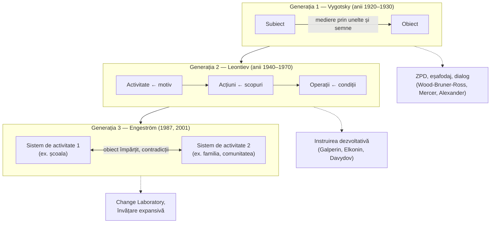

↑ [[00 Index - Analiza comparată internațională]]

> [!abstract] Pe scurt
> 1. **Ideea de bază**: funcțiile psihice superioare (atenția voluntară, memoria logică, gândirea în concepte, autocontrolul) apar **mai întâi între oameni**, în activitatea comună mediată de **unelte și semne** (limbajul în primul rând), și abia apoi devin **interioare**. Învățarea nu așteaptă dezvoltarea, ci o **conduce**.
> 2. **Zona proximei dezvoltări (ZPD)** este distanța dintre ce poate elevul singur și ce poate cu ajutorul unui adult sau al unui coleg mai competent. Instruirea bună lucrează **în această zonă**. **Eșafodajul** (Wood, Bruner & Ross, 1976) este o formă concretă, dar nu identică, a acestei idei.
> 3. Școala sovietică a dezvoltat teoria în **teoria activității** (Leontiev), **formarea pe etape a acțiunilor mintale** (Galperin) și **instruirea dezvoltativă** (Elkonin & Davydov). Occidentul a preluat-o ca **învățare situată** (Lave & Wenger), **ucenicie cognitivă** (Rogoff), **învățare expansivă** (Engeström) și **pedagogie dialogică** (Mercer, Alexander).
> 4. **Implementarea cea mai consecventă ca sistem didactic**: **Rusia** (sistemul Elkonin–Davydov, recunoscut ca sistem de stat în 1996). Ca **reformă a școlii și a profesorilor**: **Japonia** (școala ca comunitate de învățare, Satō Manabu; *lesson study*), preluată în **Coreea** (școlile *hyeoksin*). Ca **intervenție evaluată prin RCT**: **Anglia** (*Dialogic Teaching*, EEF 2017: +2 luni la engleză și științe).
> 5. **Finlanda** este centrul mondial al teoriei activității de generația a treia (**Engeström**, CRADLE, *Change Laboratory*), dar cu impact mai mare asupra organizațiilor și formării decât asupra lecției obișnuite.
> 6. **Dovezi**: solide pentru **predarea reciprocă** și pentru **dialogul de calitate** în clasă. Mixte pentru programele preșcolare vygotskiene (*Tools of the Mind*). Rare și necauzale pentru reformele sistemice declarate „socioconstructiviste” (Quebec).
> 7. **R. Moldova** a moștenit tradiția prin psihologia pedagogică sovietică: ZPD apare în principiul accesibilității, iar profesorul este descris ca **mediator**. Lipsesc însă **didactica dialogică** operațională și cercetarea proprie.

---

## 1. Ce explică teoria

### 1.1 Întrebarea la care răspunde

**Cum devine cultura unei societăți gândire individuală?** Vygotsky se întreabă cum se transformă procesele psihice „naturale” (percepția, memoria spontană) în procese **culturale**, voluntare și conștiente, și ce rol au în această transformare **limbajul, instrumentele și ceilalți oameni**. Pentru educație, întrebarea devine: **ce fel de interacțiune și ce fel de activitate** produc dezvoltarea, nu doar acumularea?

### 1.2 Ideile centrale

1. **Medierea.** Omul nu acționează direct asupra lumii, ci prin **unelte** (orientate spre obiect) și **semne** (orientate spre propria minte și spre ceilalți: cuvinte, numere, hărți, diagrame).
2. **Legea genetică generală a dezvoltării culturale.** Orice funcție apare de două ori: întâi pe plan **social** (interpsihic), apoi pe plan **individual** (intrapsihic). Exemplu: vorbirea adresată altora devine vorbire egocentrică, apoi **vorbire interioară** reglatoare.
3. **Interiorizarea** nu este copiere, ci **transformare**. Ce era dialog devine structură a gândirii.
4. **Învățarea precede dezvoltarea.** Școala nu trebuie să aștepte maturizarea (poziție polemică față de Piaget), ci să lucreze cu funcțiile **în curs de maturizare**.
5. **Conceptele științifice vs. cotidiene.** Conceptele învățate sistematic la școală (definite, legate în sistem) și conceptele spontane (din experiență) se dezvoltă în direcții opuse și se întâlnesc. Școala introduce **conștientizarea și controlul voluntar** al gândirii.
6. **Activitatea** (Leontiev) este unitatea de analiză: activitate ← **motiv**; acțiune ← **scop**; operație ← **condiții**. Fiecare vârstă are o **activitate dominantă** (joc la preșcolar, învățare la școlar mic, comunicare intimă la adolescent — după Elkonin).
7. **Contradicțiile** dintr-un sistem de activitate (Engeström) sunt sursa **învățării expansive**: participanții reconstruiesc obiectul și regulile activității lor.

### 1.3 Concepte-cheie

| Concept | Definiție |
|---|---|
| **Funcții psihice superioare** | procese voluntare, mediate prin semne, de origine socială (memoria logică, atenția voluntară, gândirea verbală) |
| **Mediere** (*oposredovanie*) | folosirea uneltelor și a semnelor ca intermediari între subiect și obiect |
| **Interiorizare** (*interiorizatsiya*) | transformarea acțiunilor externe și sociale în acțiuni mintale |
| **Zona proximei dezvoltări** (*zona blizhaishego razvitiya*, ZPD) | distanța dintre nivelul actual (rezolvare independentă) și nivelul potențial (rezolvare cu ajutor) |
| **Eșafodaj** (*scaffolding*) | sprijin temporar, ajustat și retras treptat, al unui expert pentru un novice (Wood, Bruner & Ross, 1976) |
| **Vorbire interioară** | limbaj condensat, folosit pentru planificarea și reglarea propriului comportament |
| **Concepte științifice / spontane** | concepte sistematice, conștiente, predate / concepte din experiența cotidiană |
| **Activitate dominantă** (*vedushchaya deyatelnost*) | activitatea care produce principalele transformări psihice la o anumită vârstă (Leontiev, Elkonin) |
| **Formarea pe etape a acțiunilor mintale** (Galperin) | orientare → acțiune materială/materializată → vorbire cu voce tare → vorbire „pentru sine” → acțiune mintală automatizată |
| **Baza de orientare a acțiunii** (Galperin) | sistemul de repere pe care elevul îl folosește pentru a executa corect o acțiune; tipul III (general, construit de elev) dă cel mai bun transfer |
| **Activitate de învățare** (*uchebnaya deyatelnost*, Elkonin–Davydov) | activitate specială, în care elevul transformă un material ca să descopere relația generală care îl explică |
| **Generalizare teoretică / ascensiune de la abstract la concret** (Davydov) | pornirea de la relația-germen (ex. relația mărime–unitate de măsură) și derivarea cazurilor particulare din ea |
| **Participare periferică legitimă** (Lave & Wenger) | intrarea novicelui într-o **comunitate de practică** prin sarcini reale, marginale la început |
| **Apropriere participativă** (Rogoff) | transformarea individului prin participarea la activități culturale comune |
| **Sistem de activitate** (Engeström) | subiect – unelte – obiect – reguli – comunitate – diviziunea muncii |
| **Învățare expansivă** (Engeström) | ciclu colectiv: chestionare → analiză → model nou → testare → implementare → reflecție → consolidare |
| **Dublă stimulare** | subiectul folosește un al doilea stimul (un artefact) ca să rezolve o problemă; baza metodologică a *Change Laboratory* |
| **Discuție exploratorie** (*exploratory talk*, Mercer) | discuție în care elevii contestă și justifică ideile, raționamentul fiind vizibil |
| **Predare dialogică** (*dialogic teaching*, Alexander) | predare care folosește discuția pentru a stimula și extinde gândirea: colectivă, reciprocă, susținătoare, cumulativă, cu scop |
| **Zona mișcării libere / zona acțiunii promovate** (Valsiner) | limitele în care copilul poate acționa și direcțiile în care adultul îl încurajează |

### 1.4 Ce presupune despre actorii educației

| Element | Presupoziția socioconstructivistă |
|---|---|
| **Elevul** | participant la activități culturale; potențialul său nu se vede în testul individual, ci în **ce poate face cu ajutor** |
| **Profesorul** | **mediator** și organizator al activității comune; dozează ajutorul în ZPD; modelează limbajul disciplinei |
| **Cunoașterea** | instrument cultural, încorporat în semne și practici; învățarea înseamnă **apropriere**, nu doar construcție individuală |
| **Școala** | comunitate de învățare și de practică, în care dialogul, colaborarea și sarcinile reale sunt principalele mijloace |

---

## 2. Geneza și evoluția

| Perioadă | Moment | Semnificație |
|---|---|---|
| **Precursori** | Hegel și Marx (munca și uneltele ca mediere istorică); Pierre Janet (interiorizarea relațiilor sociale); psihologia gestaltistă; Durkheim; James Mark Baldwin | originea socială a minții; activitatea ca categorie |
| **1924–1934** | L. S. Vygotsky la Moscova, cu **A. R. Luria** și **A. N. Leontiev** („troica”); *Psihologia pedagogică* (1926); *Sensul istoric al crizei psihologiei* (1927, publicat 1982); *Istoria dezvoltării funcțiilor psihice superioare* (1931, publicat 1960); ***Gândire și limbaj*** (1934) | formularea programului cultural-istoric, a ZPD și a teoriei conceptelor |
| 1931–1932 | expedițiile lui Luria în Uzbekistan | primele dovezi despre efectul școlarizării asupra gândirii (publicate abia în 1974) |
| **1936–1956** | decretul împotriva **pedologiei** (1936); opera lui Vygotsky marginalizată; școala de la **Harkov** (Leontiev, Galperin, Zaporojeț) dezvoltă teoria activității | supraviețuirea programului sub altă etichetă |
| **1956–1980** | reeditarea lui Vygotsky (1956); Leontiev, *Probleme ale dezvoltării psihicului* (1959), *Activitate, conștiință, personalitate* (1975); Galperin, formarea pe etape (anii 1950–1960); **Zankov** (experiment din 1957); **Elkonin & Davydov**: școala experimentală nr. 91 din Moscova (de la sfârșitul anilor 1950), Davydov, *Tipuri de generalizare în instruire* (1972); Elkonin, periodizarea (1971) și *Psihologia jocului* (1978) | **instruirea dezvoltativă** ca alternativă sovietică la didactica transmisivă |
| **1962–1985** | traducerea engleză *Thought and Language* (1962); ***Mind in Society*** (Cole, John-Steiner, Scribner & Souberman, eds., 1978); Wood, Bruner & Ross (1976); **Palincsar & Brown** (1984), predarea reciprocă; Wertsch (1985) | receptarea occidentală; nașterea „teoriei socioculturale” |
| **1987–2000** | **Engeström**, *Learning by Expanding* (1987); **Rogoff**, *Apprenticeship in Thinking* (1990); **Lave & Wenger**, *Situated Learning* (1991); van der Veer & **Valsiner**, *Understanding Vygotsky* (1991); **Mercer**, *The Guided Construction of Knowledge* (1995); Bodrova & Leong, *Tools of the Mind* (1996); recunoașterea oficială a sistemului Elkonin–Davydov în Rusia (1996); **Alexander**, *Culture and Pedagogy* (2000) | explozia aplicațiilor: comunități de practică, dialog, preșcolar, organizații |
| **2000–2015** | Engeström (2001), generația a treia; *Change Laboratory* (CRADLE, Helsinki, de la mijlocul anilor 1990); Alexander, *Towards Dialogic Teaching* (2004); **Satō Manabu**: școala ca comunitate de învățare (Hamanogo, 1998 →); Quebec (PFEQ, 2000) și Estonia (2011) își declară curricula socioconstructiviste; Diamond et al. (*Science*, 2007) | teoria devine cadru de politici și de reformă școlară |
| **2015–azi** | „revoluția revizionistă” în studiile despre Vygotsky (Yasnitsky & van der Veer, 2016) pune în discuție textele editate sovietic; EEF *Dialogic Teaching* (2017); Howe et al. (2019) despre dialogul profesor–elev și rezultate; *oracy* în Anglia; RCT-uri mixte pentru *Tools of the Mind*; Sannino & Engeström, **agenția transformativă** | maturizare empirică: se testează **ce anume** din tradiție produce efecte |

---

## 3. Autori, reprezentanți, cercetători

| Autor | Lucrare(ări), an | Aportul concret |
|---|---|---|
| **Lev S. Vygotsky** (1896–1934) | *Psihologia pedagogică* (1926); *Istoria dezvoltării funcțiilor psihice superioare* (1931); *Gândire și limbaj* (1934); *Mind in Society* (antologie, 1978) | teoria cultural-istorică; medierea prin semne; legea genetică generală; ZPD; conceptele științifice vs. spontane; vorbirea interioară; jocul ca sursă a dezvoltării |
| **Alexander R. Luria** (1902–1977) | *Cognitive Development: Its Cultural and Social Foundations* (1974/1976) | expedițiile din Uzbekistan: școlarizarea schimbă formele de raționament (clasificare, silogisme); reglarea verbală a comportamentului |
| **Aleksei N. Leontiev** (1903–1979) | *Probleme ale dezvoltării psihicului* (1959); *Activitate, conștiință, personalitate* (1975) | **teoria activității** (activitate–acțiune–operație; motiv–scop–condiții); activitatea dominantă; sensul personal |
| **Piotr Ia. Galperin** (1902–1988) | lucrări despre formarea pe etape a acțiunilor mintale (anii 1950–1970) | **formarea pe etape** a acțiunilor mintale; tipurile bazei de orientare; aplicații în instruirea programată (cu **N. F. Talîzina**) |
| **Daniil B. Elkonin** (1904–1984) | articolul despre periodizarea dezvoltării (1971); *Psihologia jocului* (1978) | periodizarea pe activități dominante; jocul de rol ca activitate dominantă a preșcolarului; coautor al sistemului de instruire dezvoltativă și al metodei de alfabetizare prin analiza sonoră a cuvântului |
| **Vasili V. Davydov** (1930–1998) | *Tipuri de generalizare în instruire* (1972; engl. 1990); *Probleme ale instruirii dezvoltative* (1986; engl. 2008) | **generalizarea teoretică**; ascensiunea de la abstract la concret; **activitatea de învățare** (sarcină de învățare, modelare, transformare, control, evaluare); curriculumul de matematică pornind de la mărimi și relații |
| **Leonid V. Zankov** (1901–1977) | *Didactica și viața* (1968) | sistem dezvoltativ alternativ: ritm rapid, dificultate ridicată, rolul cunoștințelor teoretice, conștientizarea procesului |
| **David Wood, Jerome Bruner, Gail Ross** | „The Role of Tutoring in Problem Solving”, *Journal of Child Psychology and Psychiatry* (1976) | termenul **eșafodaj** și cele șase funcții ale tutorelui (recrutare, reducerea gradelor de libertate, menținerea direcției, marcarea trăsăturilor critice, controlul frustrării, demonstrare) |
| **Michael Cole** | coeditor *Mind in Society* (1978); *Cultural Psychology* (1996) | introducerea lui Vygotsky în SUA; psihologia culturală; programul extrașcolar *Fifth Dimension* |
| **James V. Wertsch** | *Vygotsky and the Social Formation of Mind* (1985); *Voices of the Mind* (1991) | acțiunea mediată; legătura cu Bahtin (dialogismul) |
| **Barbara Rogoff** | *Apprenticeship in Thinking* (1990); *The Cultural Nature of Human Development* (2003) | **ucenicia cognitivă**; aproprierea participativă; studii comparate (comunități maya, SUA); învățarea prin observare și participare (LOPI) |
| **Jean Lave & Etienne Wenger** | *Situated Learning: Legitimate Peripheral Participation* (1991); Wenger, *Communities of Practice* (1998) | învățarea situată; **comunitățile de practică**; baza pentru comunitățile profesionale de învățare |
| **Annemarie Palincsar & Aurelia Sullivan Marie Brown** | „Reciprocal Teaching of Comprehension-Fostering and Comprehension-Monitoring Activities”, *Cognition and Instruction* (1984) | **predarea reciprocă**: elevii preiau treptat rolul profesorului în patru strategii (rezumare, întrebări, clarificare, predicție) |
| **Yrjö Engeström** (n. 1948) | *Learning by Expanding* (1987); „Expansive Learning at Work”, *Journal of Education and Work* (2001); cu Virkkunen et al., metoda *Change Laboratory* | **generația a treia** a teoriei activității; **învățarea expansivă**; *Change Laboratory*; director CRADLE (Universitatea din Helsinki) |
| **Annalisa Sannino** | Sannino, Engeström & Lemos, „Formative interventions for expansive learning and transformative agency” (2016) | **agenția transformativă** prin dublă stimulare |
| **Jaakko Virkkunen & Denise Newnham** | *The Change Laboratory* (2013) | manualul metodei |
| **Neil Mercer** (1946–2022) | *The Guided Construction of Knowledge* (1995); *Words and Minds* (2000); cu Littleton, *Dialogue and the Development of Children's Thinking* (2007) | tipologia discuției: **disputațională, cumulativă, exploratorie**; programul ***Thinking Together*** (cu Dawes și Wegerif); centrul *Oracy Cambridge* |
| **Robin Alexander** | *Culture and Pedagogy* (2000); *Towards Dialogic Teaching* (2004; ed. succesive); *A Dialogic Teaching Companion* (2020) | studiul comparat al pedagogiei în **Anglia, Franța, India, Rusia și SUA**; **predarea dialogică**; programul evaluat de EEF (2017) |
| **Christine Howe et al.** | „Teacher–Student Dialogue During Classroom Teaching: Does It Really Impact on Student Outcomes?”, *Journal of the Learning Sciences* (2019) | în 72 de clase, elaborarea ideilor și contestarea lor, cu participare largă, se asociază cu rezultate mai bune |
| **Sarah Michaels, Catherine O'Connor, Lauren Resnick** | „Deliberative Discourse Idealized and Realized: Accountable Talk” (2008) | ***Accountable Talk*** — mișcări discursive ale profesorului (reformulare, „cine e de acord și de ce?”) |
| **Jaan Valsiner** (n. 1951) | cu van der Veer, *Understanding Vygotsky* (1991); *Culture and Human Development* (2000) | **co-constructivismul**; zona mișcării libere / zona acțiunii promovate; psiholog estonian, format la Tartu |
| **Peeter Tulviste** (1945–2017) | *The Cultural-Historical Development of Verbal Thinking* (1991) | elev al lui Luria; traducătorul lui Vygotsky în estonă; rector al Universității din Tartu |
| **Elena Bodrova & Deborah J. Leong** | *Tools of the Mind: The Vygotskian Approach to Early Childhood Education* (1996; ed. 2, 2007) | programul preșcolar ***Tools of the Mind***: joc de rol planificat, mediatori externi, autoreglare |
| **Satō Manabu** (n. 1951) | *Kyōshi to iu aporia* (1997); *Gakkō kaikaku no tetsugaku* (2012) | **școala ca comunitate de învățare** (*manabi no kyōdōtai*): grupuri de 4, ascultare reciprocă, sarcini de „săritură” în ZPD, *lesson study* deschis |
| **Marlene Scardamalia & Carl Bereiter** | „Knowledge Building” (2006) | **construirea cunoașterii**: clasa ca comunitate care îmbunătățește idei; Knowledge Forum |
| **Philippe Jonnaert** | *Compétences et socioconstructivisme* (2002) | fundamentarea socioconstructivistă a curriculumului pe competențe (Quebec, Africa francofonă) |
| **Seth Chaiklin** (critic, clarificator) | „The Zone of Proximal Development in Vygotsky's Analysis of Learning and Instruction” (2003) | ZPD e un concept despre **perioade de dezvoltare**, nu orice „ajutor pentru o sarcină”; critică la adresa folosirii vagi |
| **Anton Yasnitsky & René van der Veer** (eds.) | *Revisionist Revolution in Vygotsky Studies* (2016) | textele lui Vygotsky au fost editate și uneori denaturate; imaginea „canonică” trebuie revizuită |

---

## 4. Legătura cu manualul și cu vaultul

| Unde | Ce spune / ce face manualul | Evaluare |
|---|---|---|
| [[9.2 Profesorul postmodernist - facilitator al cunoașterii]] | sociogeneza cunoașterii; profesorul facilitator; munca în echipă; complezența | teoria socială a învățării este prezentată prin școala geneveză, nu prin Vygotsky; conspectul completează cu ZPD, eșafodaj și modele de cooperare (Kagan, Johnson & Johnson, Slavin) |
| [[1.3 Normativitatea activității educaționale]] | principiul accesibilității (sarcini la nivelul posibilităților, dar stimulative); perspectiva **sociocognitivă** (Vygotsky) | **corect, dar reductiv**: ZPD e mai mult decât „accesibilitate”; e un argument pentru sarcini **peste** nivelul actual, cu sprijin |
| [[6.2.2 Educația intelectuală]] | profesorul ca mediator (Momanu) | conspectul adaugă Vygotsky și eșafodajul, absente din text |
| [[2.5 Structura și funcționarea educației]] | „repertoriul comun” educator–educat (Cristea) | ideea anticipează ZPD (comentariu în conspect) |
| [[3.4 Educația informală]] | învățarea de la cei mai competenți (familie, colegi) | legătură corectă cu ZPD și ucenicia (Rogoff) |
| [[3.6 Educația permanentă și autoeducația]] · [[Autoeducația - teorii, autori și corelări]] | trecerea de la educație la autoeducație | Vygotsky, Luria și Galperin explică **mecanismul** (interiorizarea reglării externe); Valsiner este tratat detaliat în nota de aprofundare |
| [[5.1 Noțiunea de paradigmă]] | trecerea de la transmitere la construcție (Piaget, „Vîgotski”) | corect |
| [[9.1 Profesorul școlar - roluri, competențe, stiluri]] | standardele profesionale; strategii „cooperante și socializante” | limbaj socioconstructivist fără operaționalizare dialogică |
| [[10.1 Proiectarea activității educaționale]] | cadrul ERR (RWCT) | ERR are elemente dialogice (evocare, reflecție) și e cel mai răspândit instrument de acest tip în Moldova |
| [[Modulul 09 - Agenții educației și factorii dezvoltării]] · [[Modulul 05 - Paradigmele pedagogiei și cercetarea pedagogică]] | cadrul modular | — |

> [!note] Ce lipsește din manual
> - **Teoria activității** (Leontiev), **instruirea dezvoltativă** (Elkonin–Davydov) și **Galperin**, deși aparțin tradiției din care vine și pedagogia moldovenească.
> - **Pedagogia dialogică**: manualul vorbește de „dialog profesor–elev și elev–elev”, dar nu descrie **ce fel de discuție** produce învățare (exploratorie vs. cumulativă vs. disputațională).
> - Distincția dintre **ZPD** (concept teoretic despre dezvoltare) și **eșafodaj** (tehnică de tutorat).

---

## 5. Implementare comparată

| Sistem | Cum a fost implementată (politică / program / instituție) | Când | Scară / intensitate | Dovezi sau rezultate |
|---|---|---|---|---|
| **Singapore** | comunități profesionale de învățare (PLC) în școli (PERI, 2009); *lesson study* și predare colaborativă; eșafodaj în secvența CPA; Knowledge Forum în unele școli; modelul TE21 al NIE | 2009– | **medie** | PLC-urile sunt generalizate formal; Kwek, Ho & Wong (2023) arată că investigația colaborativă a profesorilor e adesea „bifată”, nu reflexivă |
| **Estonia** | tradiția cultural-istorică (Tulviste, Valsiner, Toomela); **teoria învățării socioconstructivistă** în curriculumul național din 2011 (§ 5) | anii 1970–azi; 2011 | **medie** (intelectuală și curriculară) | nu există evaluare care să izoleze efectul; practica de clasă rămâne mai tradițională (TALIS 2018) |
| **Finlanda** | **Engeström** și CRADLE (Universitatea din Helsinki): *Change Laboratory* (de la mijlocul anilor 1990) în organizații, spitale, școli, formarea profesorilor; învățarea colaborativă și *progressive inquiry* (Hakkarainen); jocul narativ vygotskian (P. Hakkarainen, Oulu) | 1987–azi | **medie** (academică foarte mare, practică difuză) | studii de caz și intervenții formative; impact asupra lecției obișnuite **greu de cuantificat** |
| **Regatul Unit** | ***Thinking Together*** (Mercer, Dawes, Wegerif, Cambridge/Open University); ***Dialogic Teaching*** (Alexander), evaluat de EEF; *oracy* (Voice 21, School 21; *Oracy Education Commission*, 2024) | 1990–azi; RCT 2015–2017 | **medie**, în creștere prin *oracy* | EEF (2017): 38 de școli de intervenție (2 492 de elevi) vs. 38 de control: **+2 luni** la engleză și științe, **+1 lună** la matematică; +2 luni la toate trei pentru elevii FSM; securitate de 3 lacăte |
| **Japonia** | ***Neriage*** (discuția colectivă a strategiilor); ***lesson study*** (*jugyō kenkyū*) ca învățare profesională comunitară; **școala ca comunitate de învățare** (Satō; Hamanogo, 1998 →); învățarea „interactivă” în curriculumul din 2017 | anii 1960–azi; 1998–; 2017– | **centrală** | TIMSS Video documentează lecția colectivă; pentru comunitățile de învățare: studii de caz (climat, absenteism); evaluări cauzale lipsesc |
| **Coreea de Sud** | școlile ***hyeoksin*** (inovative), inițiate de oficiul educațional Gyeonggi (2009); profesorii activiști au preluat modelul comunității de învățare al lui Satō; Institutul Coreean al Comunității de Învățare (Son Woo-jung) | 2009–azi | **medie** (regională, dependentă de oficiile progresiste) | literatură în *Journal of Educational Change* (2018, 2021, 2023): efecte asupra bunăstării și culturii școlare; efecte academice discutate |
| **Canada** | **Quebec**: PFEQ, fundament declarat socioconstructivist (Jonnaert, Perrenoud, Tardif); **Ontario/Toronto**: construirea cunoașterii (Scardamalia & Bereiter, CSILE/Knowledge Forum); imersiunea lingvistică (învățarea limbii prin conținut) | 1986–; 2000–2009 | **medie** (Quebec: centrală în document) | Quebec: reformă contestată, evaluarea Laval (2014, de verificat) fără efecte pozitive semnificative; Knowledge Forum: studii de caz promițătoare, scară limitată |
| **Europa (UE / Consiliul Europei)** | Engeström (Finlanda), Mercer și Alexander (Anglia), Perret-Clermont (Elveția), Dysthe (predarea dialogică, Norvegia); instruirea dezvoltativă în Est (Rusia, Ucraina, statele baltice); *CEFR Companion Volume* (2018/2020) introduce **medierea** ca activitate de comunicare (legătura explicită cu socioconstructivismul: de verificat) | 1970–azi | **medie**, eterogenă | influență academică mare; nicio politică UE dedicată |
| **SUA** | predarea reciprocă (Palincsar & Brown); *Accountable Talk* (Resnick, Pittsburgh); comunitățile profesionale de învățare (*PLC*, DuFour); ***Tools of the Mind*** (Bodrova & Leong) în districte; *Fifth Dimension* (Cole) | 1984–azi | **medie** | Rosenshine & Meister (1994): efecte pozitive ale predării reciproce (mari pe teste construite de cercetători, mai modeste pe teste standardizate); *Tools*: Diamond et al. (2007) pozitiv; Wilson & Farran (2015) nul în anul 1; RCT la grădiniță pozitiv (Diamond et al., *PLoS ONE*, 2019) |
| **Republica Moldova** | moștenirea psihologiei pedagogice sovietice (Vygotsky, Leontiev, Galperin, Davydov) în formarea profesorilor; ZPD în principiul accesibilității; profesorul „mediator” în manuale; metode interactive și ERR (RWCT); experimente cu sistemele Zankov sau Elkonin–Davydov în RSSM (de verificat) | anii 1960–azi | **redusă spre medie** (prezentă ca referință teoretică, slab operaționalizată) | nu există evaluări publice; dialogul de clasă nu este obiect de politică sau de formare sistematică |

### 5.1 Studiu de caz: Rusia/URSS — sistemul Elkonin–Davydov și ce a rămas în Moldova

→ [[Europa - spațiul european al educației]]

- **Ce este.** Un sistem complet de **instruire dezvoltativă** pentru ciclul primar, elaborat de D. B. Elkonin și V. V. Davydov începând cu școala experimentală nr. 91 din Moscova (sfârșitul anilor 1950), cu un centru important la Harkov (V. V. Repkin). Elevii nu învață întâi numere și operații, ci **relații între mărimi** (mai mare, egal, mai mic), notate cu litere, apoi numărul ca **raport** între o mărime și unitatea de măsură. La limbă, pornesc de la modelarea structurii sonore a cuvântului.
- **Logica vygotskiană.** Școala trebuie să formeze **gândirea teoretică** (concepte științifice), nu doar deprinderi empirice. Elevul trece prin **activitatea de învățare**: sarcină de învățare → transformarea situației → **modelare** (scheme, formule) → aplicare la cazuri particulare → control și evaluare, adesea în discuție colectivă.
- **Statut.** În 1996, Ministerul Educației din Rusia a recunoscut sistemul Elkonin–Davydov ca unul dintre **cele trei sisteme de stat** pentru primar, alături de sistemul tradițional și de sistemul Zankov. Sistemul s-a răspândit și în Ucraina, statele baltice și în unele școli occidentale (studii ale lui Jean Schmittau în SUA).
- **Dovezi.** Cercetările rusești raportează avantaje la **reflecție, planificare și analiză teoretică**. Designul lor este însă în mare parte cvasiexperimental, fără RCT-uri la scară. Articolele recente din *Cultural-Historical Psychology* (2024) discută „oportunități și limite”, inclusiv dificultatea formării profesorilor.
- **Moldova.** Tradiția a intrat mai ales **ca teorie** în cursurile de psihologie pedagogică. Formulele din manual („profesorul mediator”, „accesibilitate stimulativă”) sunt urmele ei. Nu am identificat o implementare documentată a sistemului în școlile moldovenești după 1991 (de verificat).

### 5.2 Studiu de caz: Finlanda — Engeström și *Change Laboratory*

→ [[Finlanda - ecosistemul educațional]]

- **Instituția.** Engeström a publicat *Learning by Expanding* în 1987 (Helsinki, Orienta-Konsultit). La mijlocul anilor 1990, cercetătorii grupului său de la Universitatea din Helsinki (azi **CRADLE**, *Center for Research on Activity, Development and Learning*) au creat metoda ***Change Laboratory***.
- **Cum funcționează.** Un grup de practicieni (de exemplu, profesorii unei școli) se întâlnește în 6–12 sesiuni, cu un cercetător-intervenționist. Pe peretele de lucru se afișează **„oglinda”** (date din propria practică: înregistrări, reclamații, rezultate), **modele** ale sistemului de activitate și **idei/unelte** noi. Participanții identifică **contradicțiile** (de ex., între obiectul „învățării” și regulile „orarului”), construiesc un model nou și îl testează. Este aplicarea **dublei stimulări** la nivel organizațional.
- **Aplicații școlare.** Integrarea tehnologiei în școli; colaborarea formare inițială–școală; un *Change Laboratory* cu elevii de clasa a VIII-a la școala Pitäjänmäki din Helsinki (2020).
- **Lecția comparativă.** Finlanda arată că teoria poate funcționa ca **metodologie de schimbare școlară condusă de profesori**, nu doar ca teorie a lecției. Efectele sunt documentate prin studii de caz, fără dovezi cauzale asupra rezultatelor elevilor.

### 5.3 Studiu de caz: Japonia și Coreea — școala ca comunitate de învățare

→ [[Japonia - ecosistemul educațional]] · [[Coreea de Sud - ecosistemul educațional]]

- **Japonia.** Satō Manabu (Universitatea din Tokyo) a reinterpretat Dewey și Vygotsky ca răspuns la „fuga de învățare” a elevilor japonezi din anii 1990. Școala-pilot **Hamanogo** (Chigasaki, 1998) a devenit model: grupuri mixte de 4 elevi, **ascultare reciprocă**, o **sarcină de „săritură”** (peste nivelul curent, de rezolvat împreună, adică în ZPD), clase **deschise** tuturor colegilor și *lesson study* centrat pe **ce învață elevii**, nu pe performanța profesorului. Rețeaua are mii de școli și s-a extins în China, Indonezia, Vietnam și Mexic.
- **Coreea.** Din 2009, oficiul educațional Gyeonggi a lansat **școlile *hyeoksin*** (autonomie, învățare creativă și autodirijată, comunicare). În gimnazii și licee, profesorii activiști au adoptat explicit **teoria comunității de învățare a lui Satō**. Son Woo-jung, doctorandă a lui Satō, a contribuit la dezvoltarea a circa 300 de școli inovative.
- **Dovezi și limite.** Literatura raportează climat mai bun, absenteism redus și participare. Evaluările cauzale ale efectelor academice lipsesc, iar receptarea a fost polarizată politic (în Japonia, prin pozițiile publice ale lui Satō; în Coreea, prin asocierea cu oficiile progresiste).
- **De ce contează.** Este singurul model socioconstructivist care s-a răspândit **transnațional de jos în sus**, prin rețele de profesori, fără suport legislativ central.

### 5.4 Studiu de caz: Anglia — predarea dialogică testată prin RCT

→ [[Regatul Unit - ecosistemul educațional]]

- **Fundamente.** Mercer a arătat că discuțiile elevilor sunt de obicei **disputaționale** („ba da, ba nu”) sau **cumulative** (acord necritic). Discuția **exploratorie** trebuie **predată explicit**, prin reguli de grup elaborate cu elevii (*ground rules*). Alexander a comparat pedagogia a cinci țări (*Culture and Pedagogy*, 2000) și a observat că în clasele engleze și americane domină **recitarea** (întrebare închisă – răspuns scurt – evaluare), iar în cele rusești și franceze discursul era mai extins, dar la fel de controlat.
- **Intervenția.** Programul *Dialogic Teaching* (Alexander, cu Universitatea din York și Communities Inspiring Learning) a durat 20 de săptămâni: formarea profesorilor de clasa a V-a, mentorat în școală, analiza înregistrărilor video.
- **Rezultate (EEF, 2017).** Comparație între 38 de școli de intervenție (2 492 de elevi) și 38 de școli de control (2 466 de elevi): **+2 luni de progres** la engleză și științe, **+1 lună** la matematică; elevii eligibili pentru mese gratuite: **+2 luni** la toate trei. Securitate moderată (3 lacăte din 5). Un trial de eficacitate la scară mai mare a urmat (rezultate: de verificat).
- **Politica.** Anglia post-2010 a mizat pe instruirea explicită și știința cognitivă, dar dialogul și *oracy* au rămas complementare, inclusiv în noul cadru al formării profesorilor (ITTECF, 2024, cu secțiune despre limbajul oral).

---

## 6. Dovezi empirice și critici

| Studiu / sinteză | Ce arată | Mărime / calitate |
|---|---|---|
| **Palincsar & Brown (1984)**; **Rosenshine & Meister (1994)** | predarea reciprocă îmbunătățește înțelegerea textului | efecte mediane mari pe teste construite de cercetători, mai mici pe teste standardizate (valorile exacte: de verificat) |
| **EEF *Dialogic Teaching* (Jay et al., 2017)** | +2 luni la engleză și științe, +1 lună la matematică (clasa a V-a) | RCT, 76 de școli, securitate moderată |
| **Mercer, Wegerif & Dawes (1999)** | *Thinking Together* îmbunătățește raționamentul individual (teste de tip Raven) și rezolvarea de probleme | cvasiexperimente mici |
| **Howe et al. (2019)** | elaborarea și contestarea ideilor, cu participare largă, se asociază cu rezultate și atitudini mai bune | corelațional, 72 de clase |
| ***Tools of the Mind*** | Diamond et al. (*Science*, 2007): funcții executive mai bune; Blair & Raver (*PLoS ONE*, 2014): efecte pozitive la grădiniță; Wilson & Farran (2015): **rezultate nule** la preșcolar (Tennessee, Carolina de Nord), cu probleme de măsurare; Diamond et al. (*PLoS ONE*, 2019): efecte pozitive la grădiniță | **dovezi mixte**, dependente de implementare și de măsuri |
| **Instruirea dezvoltativă (Davydov)** | avantaje la gândirea teoretică și reflecție | cvasiexperimente, mai ales în Rusia; lipsesc RCT-uri |
| **Comunitățile de învățare (Satō) și *hyeoksin*** | climat, participare, bunăstare | studii de caz, comparații nealeatorii |
| **Reformele „socioconstructiviste” de sistem (Quebec)** | fără efecte pozitive demonstrate; confuzie la implementare | evaluări observaționale |
| **Învățarea prin cooperare** (Slavin; Johnson & Johnson) | efecte pozitive când există scopuri de grup + responsabilitate individuală | meta-analize (vezi [[9.2 Profesorul postmodernist - facilitator al cunoașterii]]) |

> [!warning] Critici, limite, controverse
> 1. **ZPD folosit ca slogan.** ZPD a devenit sinonim cu „orice ajutor dozat”. Chaiklin (2003) arată că Vygotsky se referea la **funcțiile în curs de maturizare** specifice unei perioade de vârstă, nu la orice sarcină. Termenul e greu de măsurat: cum stabilești nivelul potențial?
> 2. **Eșafodajul nu este ZPD.** Wood, Bruner & Ross (1976) nu îl citau pe Vygotsky. Asocierea ulterioară e utilă, dar eșafodajul poate deveni **directiv** (profesorul face sarcina în locul elevului) dacă retragerea sprijinului nu e planificată.
> 3. **Problema textelor.** Multe traduceri occidentale (inclusiv *Mind in Society*) sunt **compilații editate**. „Revoluția revizionistă” (Yasnitsky & van der Veer, 2016) arată că imaginea standard a lui Vygotsky e parțial o construcție a editorilor sovietici și americani.
> 4. **Vagul „social”.** Dacă totul e mediat social, teoria riscă să nu mai prezică nimic. Știința cognitivă îi reproșează neglijarea **arhitecturii memoriei** și a exersării individuale (vezi [[Știința cognitivă a învățării]]). Răspunsul socioculturaliștilor: interiorizarea cere tocmai exersare, dar într-o activitate cu sens.
> 5. **Lucrul în grup nu e automat dialog.** Fără reguli explicite de discuție, grupurile produc discuție cumulativă sau disputațională, cu dominarea elevilor puternici (Mercer; manualul: complezența).
> 6. **Dovezi de sistem slabe.** Reformele care și-au declarat în documente fundamentul „socioconstructivist” (Quebec) nu au produs efecte demonstrabile. Intervențiile **precise** (predarea reciprocă, dialogul explicit, *Thinking Together*) au dovezi mai bune decât programele generale.
> 7. **Dependența de profesor.** Dialogul productiv și instruirea dezvoltativă cer cunoaștere foarte bună a disciplinei și abilități discursive. Sunt **greu de scalat** (Davydov în Rusia, *Tools* în SUA).
>
> **Condiții de succes**: norme explicite de discuție; sarcini care chiar au nevoie de colaborare; responsabilitate individuală; profesor care modelează limbajul raționamentului; retragere planificată a sprijinului; timp și formare pentru profesori (comunități profesionale).

---

## 7. Implicații practice

> [!tip] Pentru profesor, la clasă
> 1. **Diagnostichează nivelul „cu ajutor”, nu doar nivelul „singur”.** Dă o sarcină puțin peste nivelul actual și observă ce indiciu minim îl deblochează pe elev. Acesta e nivelul la care trebuie lucrat.
> 2. **Predă explicit regulile discuției exploratorii**: fiecare își spune ideea, fiecare argumentează („pentru că…”), ascultăm și întrebăm („de ce crezi?”), căutăm acordul, dar îl justificăm (Mercer, *Thinking Together*).
> 3. **Schimbă tiparul întrebare–răspuns–evaluare**: întrebări cu mai multe răspunsuri posibile, timp de gândire, reformulare, „cine poate adăuga / contrazice?”, legarea răspunsurilor între ele (Alexander; *Accountable Talk*).
> 4. **Folosește predarea reciprocă** la lectură: rezumare, întrebări, clarificare, predicție; profesorul modelează, apoi elevii preiau rolurile.
> 5. **Mediatori externi** pentru copiii mici și pentru elevii cu dificultăți: fișe-reper, scheme, „vorbirea cu voce tare”, apoi retragerea lor (Galperin; *Tools of the Mind*).
> 6. **Planifică retragerea eșafodajului**: model → practică ghidată → practică independentă, cu indicii din ce în ce mai rare.
> 7. **Deschide-ți lecția colegilor** (*lesson study*) și discutați **învățarea elevilor**, nu stilul profesorului.

> [!tip] Pentru politica educațională din R. Moldova
> 1. **Un program-pilot de predare dialogică**, evaluat riguros (după modelul EEF), în clasele primare, în limba română și științe. Moldova are deja cadrul ERR și rețeaua RWCT ca punct de plecare.
> 2. ***Lesson study* și comunități de învățare** în formarea continuă obligatorie (la 3 ani), în locul cursurilor exclusiv teoretice. Modelele japonez și coreean arată că reforma poate porni de la profesori.
> 3. **Valorificarea critică a tradiției proprii**: Galperin, Elkonin și Davydov sunt accesibili în limba rusă profesorilor mai în vârstă. Materialele de instruire dezvoltativă pentru matematica din primar pot fi traduse și testate.
> 4. **Oralitatea (*oracy*) ca finalitate** în curriculumul de limbă și comunicare: argumentare, ascultare, discuție în grup, cu descriptori de evaluare.
> 5. **Evitarea capcanei Quebec**: nu e suficient ca documentele să se declare „socioconstructiviste”. Sunt necesare instrumente de clasă, pilotare și formare.

---

## 8. Legături cu alte teorii din catalog

- [[Constructivismul cognitiv (Piaget, Bruner)]] — ambele consideră cunoașterea construită. Piaget pune accentul pe echilibrarea individuală, Vygotsky pe medierea culturală. Bruner face trecerea (eșafodaj, *The Culture of Education*).
- [[Învățarea autoreglată, metacogniția și autoeducația]] — autoreglarea e **reglare socială interiorizată** (Vygotsky, Luria, Galperin); modelul hetero → co → autoreglare (Hadwin, Järvelä & Miller).
- Educația timpurie — jocul de rol ca activitate dominantă (Elkonin); *Tools of the Mind*; pedagogia jocului narativ din Finlanda.
- [[Profesionalismul cadrului didactic]] — comunitățile de practică (Lave & Wenger), *lesson study*, *Change Laboratory*.
- [[Teoria schimbării educaționale și leadershipul]] — învățarea expansivă și comunitățile de învățare ca teorii ale schimbării școlare de jos în sus.
- [[Taxonomiile obiectivelor și educația centrată pe competențe]] — curricula pe competențe din Quebec și Estonia se sprijină explicit pe socioconstructivism.
- [[Știința cognitivă a învățării]] — critic al lucrului în grup slab structurat, dar complementar: dialogul funcționează ca **practică de recuperare și elaborare**.
- [[Evaluarea formativă]] — dialogul de clasă e principala sursă de dovezi despre înțelegere; evaluarea „dinamică” măsoară chiar ZPD.
- [[Pedagogia critică și educația pentru cetățenie]] — Freire și Vygotsky împart ideea dialogului și a conștientizării; Satō leagă comunitatea de învățare de democrație.
- Învățarea prin proiecte, investigație și fenomene — proiectele sunt activități colective cu obiect comun; *knowledge building* și *progressive inquiry* sunt forme socioculturale ale investigației.
- [[Educația incluzivă]] — Vygotsky (defectologia): dizabilitatea ca problemă a medierii sociale, nu doar biologică.

---

## 9. Întrebări de reflecție

1. Explicați diferența dintre **zona proximei dezvoltări** și **eșafodaj**. De ce contează distincția pentru evaluarea elevilor?
2. De ce rezultatele EEF pentru *Dialogic Teaching* sunt mai convingătoare decât afirmațiile despre reforma „socioconstructivistă” din Quebec? Ce tip de dovadă lipsește în al doilea caz?
3. Comparați sistemul Elkonin–Davydov cu abordarea CPA din Singapore. Ce au în comun (modelarea) și prin ce diferă (punctul de plecare: relația generală vs. obiectul concret)?
4. Cum ar arăta un *Change Laboratory* într-o școală din Moldova care se confruntă cu abandonul școlar? Ce contradicții ar putea apărea în sistemul de activitate?
5. În ce condiții lucrul în grup produce **discuție exploratorie** și în ce condiții produce doar **complezență** sau dominare?
6. Tradiția cultural-istorică este „a noastră” (sovietică) și totuși a revenit în Moldova mai ales prin literatura occidentală. Cum explicați acest paradox?

---

## 10. Surse

**Lucrări fundamentale**
- Vygotsky, L. S. (1934). *Myshlenie i rech'* (*Gândire și limbaj*). Moscova–Leningrad; engl. *Thought and Language* (1962); *Thinking and Speech* (1987).
- Vygotsky, L. S. (1978). *Mind in Society: The Development of Higher Psychological Processes* (M. Cole, V. John-Steiner, S. Scribner, E. Souberman, eds.). Cambridge, MA: Harvard University Press.
- Leontiev, A. N. (1975). *Deyatel'nost'. Soznanie. Lichnost'* (*Activitate, conștiință, personalitate*). Moscova: Politizdat.
- Luria, A. R. (1976). *Cognitive Development: Its Cultural and Social Foundations*. Cambridge, MA: Harvard University Press.
- Galperin, P. Ia. — lucrări despre formarea pe etape a acțiunilor mintale (anii 1950–1970); vezi Haenen, J. (1993). *Piotr Gal'perin: Psychologist in Vygotsky's Footsteps*. New York: Nova Science.
- Elkonin, D. B. (1978). *Psikhologiya igry* (*Psihologia jocului*). Moscova: Pedagogika.
- Davydov, V. V. (1972). *Vidy obobshcheniya v obuchenii*; engl. *Types of Generalization in Instruction* (1990). Reston, VA: NCTM.
- Davydov, V. V. (2008). *Problems of Developmental Instruction*. New York: Nova Science.
- Wood, D., Bruner, J. S., Ross, G. (1976). The role of tutoring in problem solving. *Journal of Child Psychology and Psychiatry*, 17(2), 89–100.
- Wertsch, J. V. (1985). *Vygotsky and the Social Formation of Mind*. Cambridge, MA: Harvard University Press.
- Rogoff, B. (1990). *Apprenticeship in Thinking*. New York: Oxford University Press.
- Lave, J., Wenger, E. (1991). *Situated Learning: Legitimate Peripheral Participation*. Cambridge: Cambridge University Press.
- van der Veer, R., Valsiner, J. (1991). *Understanding Vygotsky: A Quest for Synthesis*. Oxford: Blackwell.
- Engeström, Y. (1987). *Learning by Expanding*. Helsinki: Orienta-Konsultit.
- Engeström, Y. (2001). Expansive learning at work. *Journal of Education and Work*, 14(1), 133–156.
- Virkkunen, J., Newnham, D. S. (2013). *The Change Laboratory*. Rotterdam: Sense.
- Palincsar, A. S., Brown, A. M. (1984). Reciprocal teaching of comprehension-fostering and comprehension-monitoring activities. *Cognition and Instruction*, 1(2), 117–175.
- Mercer, N. (2000). *Words and Minds: How We Use Language to Think Together*. London: Routledge.
- Mercer, N., Littleton, K. (2007). *Dialogue and the Development of Children's Thinking*. London: Routledge.
- Alexander, R. (2000). *Culture and Pedagogy: International Comparisons in Primary Education*. Oxford: Blackwell.
- Alexander, R. (2020). *A Dialogic Teaching Companion*. London: Routledge.
- Bodrova, E., Leong, D. J. (2007). *Tools of the Mind* (2nd ed.). Upper Saddle River, NJ: Pearson.
- Chaiklin, S. (2003). The zone of proximal development in Vygotsky's analysis of learning and instruction. În Kozulin et al. (eds.), *Vygotsky's Educational Theory in Cultural Context*. Cambridge: Cambridge University Press.
- Yasnitsky, A., van der Veer, R. (eds.) (2016). *Revisionist Revolution in Vygotsky Studies*. London: Routledge.

**Dovezi și implementare**
- Jay, T. et al. (2017). *Dialogic Teaching: Evaluation Report and Executive Summary*. Education Endowment Foundation. https://files.eric.ed.gov/fulltext/ED581114.pdf
- EEF — *Dialogic Teaching* (pagina proiectului). https://educationendowmentfoundation.org.uk/projects-and-evaluation/projects/dialogic-teaching
- Howe, C., Hennessy, S., Mercer, N., Vrikki, M., Wheatley, L. (2019). Teacher–student dialogue during classroom teaching: Does it really impact on student outcomes? *Journal of the Learning Sciences*, 28(4–5), 462–512.
- Rosenshine, B., Meister, C. (1994). Reciprocal teaching: A review of the research. *Review of Educational Research*, 64(4), 479–530.
- Diamond, A., Barnett, W. S., Thomas, J., Munro, S. (2007). Preschool program improves cognitive control. *Science*, 318, 1387–1388.
- Diamond, A. et al. (2019). Randomized control trial of Tools of the Mind: Marked benefits to kindergarten children and their teachers. *PLoS ONE*, 14(9). https://journals.plos.org/plosone/article?id=10.1371/journal.pone.0222447
- Wilson, S. J., Farran, D. C. (2015). *Experimental Evaluation of the Tools of the Mind Pre-K Curriculum*. Peabody Research Institute. https://eric.ed.gov/?id=ED574842
- Rubtsov, V. V. et al. (2024). School of D. B. Elkonin – V. V. Davydov: from research history to research perspectives. *Cultural-Historical Psychology*, 20(1). https://psyjournals.ru/en/journals/chp/archive/2024_n1/Rubtsov_Elkonin_et_al
- CRADLE, University of Helsinki. https://www.helsinki.fi/en/researchgroups/learning-culture-and-interventions/research/research-centers-and-groups
- *Journal of Educational Change* — studii despre școlile Hyukshin (2021): https://link.springer.com/article/10.1007/s10833-021-09423-5 ; (2023): https://link.springer.com/article/10.1007/s10833-023-09497-3
- Notele de țară din vault: [[Finlanda - ecosistemul educațional]], [[Japonia - ecosistemul educațional]], [[Coreea de Sud - ecosistemul educațional]], [[Regatul Unit - ecosistemul educațional]], [[Estonia - ecosistemul educațional]], [[Canada - ecosistemul educațional]], [[SUA - ecosistemul educațional]], [[Singapore - ecosistemul educațional]], [[Europa - spațiul european al educației]].
