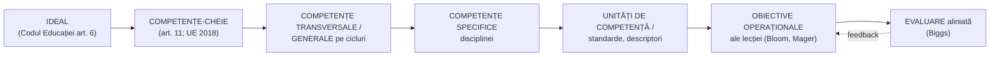

↑ [[00 Index - Analiza comparată internațională]] · Manual: [[4.5 Ierarhizarea și clasificarea obiectivelor]] · [[Modulul 04 - Finalitățile educației]]

> [!abstract] Pe scurt
> 1. Teoria răspunde la întrebarea: **cum formulăm ce trebuie să învețe elevii**, astfel încât predarea și evaluarea să fie coerente? Există două răspunsuri istorice succesive: **obiectivele** (rezultate observabile, ierarhizate în **taxonomii**) și **competențele** (capacități integrate de a mobiliza resurse în situații).
> 2. **Tyler** (1949) a formulat logica „scop → experiențe → organizare → evaluare”. **Bloom** (1956), **Krathwohl** (1964) și **Simpson/Harrow** (1966–1972) au clasificat obiectivele pe domeniile **cognitiv, afectiv, psihomotor**. **Anderson & Krathwohl** (2001) au revizuit taxonomia cognitivă într-o matrice proces × tip de cunoștințe.
> 3. **Biggs** (SOLO, 1982; **alinierea constructivă**, 1996) și **Marzano** (2001/2007) au mutat accentul de la listele de verbe la **calitatea înțelegerii** și la **sistemul metacognitiv și motivațional**.
> 4. **Mișcarea competențelor** (anii 1990–2020): **DeSeCo** (OCDE, 2003/2005), **competențele-cheie UE** (2006/2018), **P21** (SUA), **OECD Learning Compass 2030** (2019). Definiția de referință a lui **Weinert** (2001) include cunoștințe, abilități **și** disponibilitate motivațională, volitivă și socială.
> 5. În spațiul francofon, **Perrenoud** și **Roegiers** (pedagogia integrării) au dat competenței forma „mobilizării resurselor într-o familie de situații”. Această formă a influențat direct literatura și documentele curriculare din **R. Moldova**.
> 6. Aproape toate sistemele analizate au adoptat un cadru de competențe. **Diferența reală nu stă în liste, ci în coerența verticală**: Japonia și Coreea leagă competențele de standarde, manuale și evaluare; Scoția, Quebec și (parțial) R. Moldova arată riscul „reformei pe hârtie”.
> 7. **Critica principală** (M. Young, Biesta, Wheelahan): competențele generice pot **goli curriculumul de cunoaștere disciplinară** și pot dezavantaja elevii fără capital cultural. Răspunsul echilibrat: competența se construiește **prin** cunoaștere, nu în locul ei.

---

## 1. Explicația teoriei

### 1.1 Întrebarea la care răspunde

Orice sistem educațional trebuie să traducă **idealul** (ce fel de om formăm) în **ținte verificabile la clasă**. Manualul descrie această traducere ca trecere de la **obiective generale** la **specifice** și **operaționale** ([[4.5 Ierarhizarea și clasificarea obiectivelor]]). Teoria taxonomiilor și a competențelor răspunde la trei întrebări concrete:

1. **Ce tipuri de rezultate ale învățării există** și cum le ordonăm (de la simplu la complex)?
2. **Cum aliniem** obiectivele, activitățile de învățare și evaluarea, astfel încât să evaluăm ce am declarat că urmărim?
3. **Ce unitate de proiectare** e cea mai potrivită: comportamentul observabil izolat (obiectivul) sau capacitatea integrată de a acționa în situații (competența)?

### 1.2 Ideile centrale

- **Rezultatele învățării sunt clasificabile.** Ele diferă ca **domeniu** (cognitiv, afectiv, psihomotor) și ca **nivel de complexitate** (a-și aminti → a crea). O taxonomie e un instrument de **proiectare** și de **construire a itemilor**, nu o teorie psihologică a învățării.
- **Ierarhia este cumulativă (ipoteza lui Bloom).** Nivelurile superioare le presupun pe cele inferioare. Ipoteza a fost doar parțial confirmată empiric, de aceea revizuirea din 2001 o slăbește.
- **Coerența contează mai mult decât formularea.** Biggs arată că elevii învață ce le cere **evaluarea** („backwash”). Un obiectiv de nivel „a analiza” evaluat cu itemi de reproducere produce reproducere.
- **Competența integrează.** O competență nu e suma unor obiective, ci **mobilizarea** coordonată a cunoștințelor, abilităților, atitudinilor și valorilor pentru a rezolva o **familie de situații** (Perrenoud, Roegiers).
- **Competența are și o componentă motivațional-volitivă** (Weinert): a ști și a putea nu ajunge fără **a vrea** și **a te angaja**.
- **Competențele-cheie sunt transversale.** Ele traversează disciplinele (a învăța să înveți, digitală, civică) și servesc drept **finalități de sistem**, echivalentul contemporan al „scopurilor” din manual.

### 1.3 Concepte-cheie

| Concept | Definiție |
|---|---|
| **Obiectiv educațional** (*educational objective*) | enunț despre schimbarea așteptată la elev, formulat ca **rezultat**, nu ca activitate a profesorului |
| **Obiectiv operațional** | obiectiv formulat ca **comportament observabil**, cu **condiții** și **criteriu** de reușită (Mager, 1962) |
| **Taxonomie** | clasificare **ierarhică** a rezultatelor învățării după complexitate, într-un domeniu |
| **Domeniul cognitiv / afectiv / psihomotor** | rezultate intelectuale / valori, atitudini, interese / abilități motrice (Bloom, Krathwohl, Simpson, Harrow) |
| **Matricea Anderson–Krathwohl** | tabel **6 procese cognitive × 4 tipuri de cunoștințe** (factuale, conceptuale, procedurale, metacognitive) |
| **SOLO** (*Structure of the Observed Learning Outcome*) | cinci niveluri ale **calității răspunsului**: prestructural, unistructural, multistructural, relațional, abstract extins (Biggs & Collis, 1982) |
| **Aliniere constructivă** (*constructive alignment*) | proiectare în care rezultatele vizate, activitățile de învățare și sarcinile de evaluare sunt **coerente**, iar elevul își construiește sensul prin activitate (Biggs, 1996) |
| **Proiectare inversă** (*backward design*) | pornești de la rezultatele dorite, apoi dovezile de evaluare, apoi activitățile (Wiggins & McTighe, 1998) |
| **Competență** | capacitate integrată de a mobiliza cunoștințe, abilități, atitudini și valori pentru a acționa eficient într-o familie de situații |
| **Competență-cheie** | competență necesară tuturor pentru împlinire personală, cetățenie, incluziune și ocupare (UE, 2006/2018) |
| **Competență transversală / generală** | competență care nu aparține unei singure discipline (ex. T1–T7 în Finlanda) |
| **Familie de situații** | clasă de situații-problemă de complexitate comparabilă, în care se manifestă aceeași competență (Roegiers) |
| **Situație de integrare** | sarcină complexă, semnificativă, în care elevul trebuie să combine achiziții anterioare (pedagogia integrării) |
| **Descriptor / standard de performanță** | enunț despre **nivelul** la care trebuie manifestată o competență (ex. *achievement standards* în Coreea) |
| **Agenție a elevului** (*student agency*) | capacitatea de a stabili scopuri, de a reflecta și de a acționa responsabil pentru schimbare (OECD Learning Compass 2030) |
| **Cunoaștere puternică** (*powerful knowledge*) | cunoaștere disciplinară, sistematică, independentă de context, la care școala trebuie să dea acces tuturor (M. Young) |

### 1.4 Cele două paradigme în comparație

| | Pedagogia prin obiective | Educația centrată pe competențe |
|---|---|---|
| Unitatea de proiectare | obiectivul (comportament) | competența (capacitate integrată) |
| Imaginea cunoașterii | fragmentabilă în elemente | resursă de mobilizat în situații |
| Elevul | executant al unor performanțe definite | agent care rezolvă probleme și își reglează învățarea |
| Profesorul | operaționalizează și verifică | proiectează situații, ghidează integrarea |
| Evaluarea | itemi pe obiective, adesea atomizată | sarcini complexe, rubrici, descriptori de nivel |
| Riscul tipic | atomizare, „ce e ușor de măsurat” | vagitate, golirea de conținut, dificultatea evaluării |
| Documentul emblematic | Bloom (1956), Mager (1962) | DeSeCo (2003), Recomandarea UE (2006/2018) |

> [!note] Ce presupune teoria despre actorii educației
> - **Elevul**: poate atinge rezultate definite dacă primește sarcini și feedback aliniate; în versiunea „competențe”, e un **agent** care transferă învățarea în situații noi.
> - **Profesorul**: e **proiectant** (derivă obiective din competențe) și **evaluator criterial**. Taxonomia îi dă un limbaj comun.
> - **Cunoașterea**: în versiunea Bloom, e ierarhizabilă și măsurabilă; în versiunea competențelor, e **instrumentală** față de acțiune. De aici critica lui Young.
> - **Școala**: e o organizație care produce **rezultate verificabile**. Tradiția e tipic anglo-americană (*Curriculum*), în contrast cu tradiția *Bildung–Didaktik* (→ [[Tradiția Bildung-Didaktik și tradiția Curriculum]]).

---

## 2. Geneza și evoluția

| Etapă | Perioadă | Repere |
|---|---|---|
| **Precursori: eficientismul** | 1911–1930 | Taylor (managementul științific, 1911); **Bobbitt**, *The Curriculum* (1918) — obiective derivate din analiza activităților adulților; **Charters**, *Curriculum Construction* (1923) |
| **Raționamentul Tyler** | 1934–1949 | Tyler conduce evaluarea *Eight-Year Study* (1933–1941); *Basic Principles of Curriculum and Instruction* (1949): 4 întrebări și obiective cu două dimensiuni (comportament × conținut) |
| **Taxonomiile clasice** | 1948–1972 | grupul examinatorilor universitari (Bloom, Engelhart, Furst, Hill, Krathwohl) → *Handbook I: Cognitive* (1956); *Handbook II: Affective* (Krathwohl, Bloom, Masia, 1964); domeniul psihomotor: **Simpson** (1966/1972), **Dave** (1970), **Harrow** (1972) |
| **Operaționalizarea** | 1962–1975 | **Mager** (1962); Gronlund (1970); Popham; **De Landsheere** (1975); **D'Hainaut** (1977) în spațiul francofon; Gagné — tipuri de rezultate (1965) |
| **Critica pedagogiei prin obiective** | 1969–1975 | **Eisner** (obiective expresive, 1969); **Stenhouse** (modelul procesual, 1975); Kliebard (critica raționamentului Tyler, 1970) |
| **Calitatea înțelegerii și alinierea** | 1982–2007 | **Biggs & Collis**, SOLO (1982); **Biggs**, alinierea constructivă (1996); Wiggins & McTighe (1998); **Anderson & Krathwohl** (2001); **Marzano** (2001) și **Marzano & Kendall** (2007) |
| **Competențele în formarea profesională** | anii 1970–1990 | *competency-based education and training* (SUA, Marea Britanie — NVQ, Australia); critici privind îngustarea la sarcini de muncă |
| **Competențele în școală (francofonie)** | 1994–2000 | **Perrenoud**, *Construire des compétences dès l'école* (1997); **Roegiers**, *Une pédagogie de l'intégration* (2000); reformele din Belgia (*socles de compétences*, 1999), Quebec (PFEQ, 2000–) |
| **Competențele-cheie internaționale** | 1997–2006 | **DeSeCo** (OCDE, 1997–2003; Rychen & Salganik, 2001, 2003; rezumat 2005); **P21** (SUA, 2002); **Recomandarea UE** (18.12.2006) |
| **Standarde și competențe germane** | 2001–2004 | șocul PISA; expertiza **Klieme** (2003); definiția **Weinert** (2001) devine definiția standardelor naționale |
| **Valul curricular pe competențe** | 2008–2017 | Singapore 21CC (2010); R. Moldova (curriculum modernizat 2010); Estonia (2011); Finlanda (2014); Coreea (2015); Japonia (2017); BC (2016) |
| **Reformulări contemporane** | 2015–prezent | **OECD Future of Education and Skills 2030** → *Learning Compass* (2019); **Recomandarea UE revizuită** (22.05.2018); **LifeComp**, **GreenComp**, **DigComp 2.2**; Coreea 2022; *Curriculum for Wales* (2022); Blömeke et al. (2015): competența ca **continuum** |
| **Contracurentul „knowledge-rich”** | 2008–prezent | M. Young, *Bringing Knowledge Back In* (2008); National Curriculum englez (2014); *Curriculum and Assessment Review* (Anglia, 2025) |

> [!info] Continuitate, nu ruptură
> Competențele **nu au abolit** taxonomiile. În aproape toate sistemele (inclusiv R. Moldova), competența specifică se descompune în **unități de competență** sau **standarde**, iar la lecție profesorul formulează în continuare **obiective operaționale** cu verbe din taxonomia Bloom revizuită.

---

## 3. Autori, reprezentanți, cercetători

| Autor | Lucrare(ări), an | Aportul concret |
|---|---|---|
| **Franklin Bobbitt** | *The Curriculum* (1918); *How to Make a Curriculum* (1924) | curriculumul ca listă de obiective derivate din **analiza activităților adulte** — originea eficientistă a pedagogiei prin obiective |
| **Ralph W. Tyler** | *Basic Principles of Curriculum and Instruction* (1949) | **raționamentul Tyler** (scopuri → experiențe → organizare → evaluare); obiectivul = comportament × conținut; evaluarea ca verificare a obiectivelor; a contribuit la NAEP |
| **Benjamin S. Bloom** (coord.) | *Taxonomy of Educational Objectives. Handbook I: Cognitive Domain* (1956) | șase niveluri cognitive (cunoaștere, înțelegere, aplicare, analiză, sinteză, evaluare); scopul inițial: **standardizarea itemilor** de examen între universități |
| **David R. Krathwohl, B. S. Bloom, B. B. Masia** | *Handbook II: Affective Domain* (1964) | cinci niveluri afective: receptare → reacție → valorizare → organizare → caracterizare prin valori; principiul **internalizării** |
| **Elizabeth J. Simpson** | raport 1966; *The Classification of Educational Objectives in the Psychomotor Domain* (1972) | șapte niveluri psihomotorii (percepție → dispoziție → reacție dirijată → automatism → reacție complexă → adaptare → creare) |
| **Anita J. Harrow** | *A Taxonomy of the Psychomotor Domain* (1972) | șase categorii, de la **mișcări reflexe** la **comunicare nonverbală**; folosită în educația fizică și specială |
| **R. H. Dave** | „Psychomotor levels” (1970) | imitație → manipulare → precizie → articulare → naturalizare; utilă în formarea profesională |
| **Robert F. Mager** | *Preparing Objectives for Programmed Instruction* (1962) | **operaționalizarea** în trei componente: performanță, condiții, criteriu |
| **Gilbert și Viviane De Landsheere** | *Définir les objectifs de l'éducation* (1975) | cinci criterii de operaționalizare; sinteza taxonomiilor pentru spațiul francofon și, prin traduceri, pentru pedagogia românească |
| **Louis D'Hainaut** | *Des fins aux objectifs de l'éducation* (1977) | derivarea finalităților în obiective; sursă directă pentru tratarea finalităților în manualele românești și moldovenești |
| **Elliot W. Eisner** (critic) | „Instructional and expressive educational objectives” (1969) | **obiectivele expresive**: situații cu rezultat deschis, mai ales în arte |
| **Lawrence Stenhouse** (critic) | *An Introduction to Curriculum Research and Development* (1975) | **modelul procesual** și profesorul-cercetător, în locul modelului pe obiective |
| **John Biggs & Kevin Collis** | *Evaluating the Quality of Learning: The SOLO Taxonomy* (1982) | taxonomia **SOLO**: evaluează **structura** răspunsului, nu verbul; utilă pentru rubrici |
| **John Biggs** | „Enhancing teaching through constructive alignment” (*Higher Education*, 1996); *Teaching for Quality Learning at University* (1999; ed. ulterioare cu C. Tang) | **alinierea constructivă**; efectul de „backwash” al evaluării; model standard în învățământul superior (Procesul Bologna, *learning outcomes*) |
| **Grant Wiggins & Jay McTighe** | *Understanding by Design* (1998) | **proiectarea inversă**; „ideile mari” și înțelegerea durabilă; influență în BC și (după literatura coreeană) în curriculumul Coreei 2022 (de verificat) |
| **Lorin W. Anderson & David R. Krathwohl** (ed.) | *A Taxonomy for Learning, Teaching, and Assessing* (2001) | taxonomia revizuită: procese ca **verbe**; „a crea” deasupra lui „a evalua”; dimensiunea **tipurilor de cunoștințe**, inclusiv **metacognitive** |
| **Robert J. Marzano** (cu J. S. Kendall) | *Designing a New Taxonomy of Educational Objectives* (2001); *The New Taxonomy of Educational Objectives* (2007) | taxonomie pe trei **sisteme**: sistemul **sinelui** (motivație, importanță, eficacitate), sistemul **metacognitiv** (scopuri, monitorizare), sistemul **cognitiv**; trei domenii de cunoaștere (informații, proceduri mentale, proceduri psihomotorii) |
| **Philippe Perrenoud** | *Construire des compétences dès l'école* (1997); *Dix nouvelles compétences pour enseigner* (1999) | competența ca **mobilizare a resurselor** cognitive în situații complexe; influență mare în Quebec, Elveția, Belgia, Europa de Est |
| **Xavier Roegiers** (BIEF, Louvain) | *Une pédagogie de l'intégration* (2000); *Des situations pour intégrer les acquis scolaires* (2003) | **pedagogia integrării**: competențe de bază, **familii de situații**, **situații de integrare**, criterii minimale și de perfecționare; consultant pentru reforme în Africa francofonă și Est; definiția sa a competenței circulă în documentele curriculare din R. Moldova |
| **Jacques Tardif; Philippe Jonnaert** | *L'évaluation des compétences* (2006); *Compétences et socioconstructivisme* (2002) | evaluarea competențelor ca **trasee de dezvoltare**; legătura competență–socioconstructivism (Quebec) |
| **Franz E. Weinert** | „Concept of competence: a conceptual clarification” (în Rychen & Salganik, 2001); *Leistungsmessungen in Schulen* (2001) | **definiția de referință**: abilități și deprinderi cognitive disponibile sau învățabile pentru a rezolva probleme, **plus** disponibilitatea motivațională, volitivă și socială de a le folosi responsabil; baza standardelor germane (Klieme, 2003) |
| **Dominique S. Rychen & Laura H. Salganik** (OCDE DeSeCo) | *Defining and Selecting Key Competencies* (2001); *Key Competencies for a Successful Life and a Well-Functioning Society* (2003); rezumat executiv (2005) | trei categorii: **a folosi instrumente în mod interactiv**, **a interacționa în grupuri eterogene**, **a acționa autonom**; reflexivitatea în centru; fundament conceptual pentru PISA și UE |
| **Partnership for 21st Century Skills** (P21) | *Framework for 21st Century Learning* (anii 2000) | cei „4 C” (gândire critică, comunicare, colaborare, creativitate) + discipline de bază + literații; puternic susținut de companii tehnologice |
| **National Research Council** (Pellegrino & Hilton, ed.) | *Education for Life and Work* (2012) | trei domenii (cognitiv, intrapersonal, interpersonal); arată că **transferul** depinde de cunoașterea domeniului |
| **Consiliul UE / Parlamentul European** | Recomandarea privind competențele-cheie (2006; revizuită 22.05.2018) | 8 competențe-cheie; în 2018: accent pe competențele personale, sociale, antreprenoriale și sustenabilitate |
| **OCDE** (Andreas Schleicher și echipa E2030) | *OECD Learning Compass 2030* (2019) | **agenția elevului** și co-agenția; **competențe transformative** (a crea valoare nouă, a reconcilia tensiuni și dileme, a-și asuma responsabilitatea); ciclul **anticipare–acțiune–reflecție** |
| **Irmeli Halinen** (EDUFI) | coordonarea curriculumului finlandez 2014 | conceptul de **competență transversală** (*laaja-alainen osaaminen*) legată de fiecare obiectiv disciplinar |
| **Sigrid Blömeke, J.-E. Gustafsson, R. Shavelson** | „Beyond dichotomies: Competence viewed as a continuum” (*Zeitschrift für Psychologie*, 2015) | competența ca **continuum** dispoziții → abilități situaționale (percepție–interpretare–decizie) → performanță; depășește dihotomia „trăsătură vs. comportament” |
| **Eckhard Klieme** et al. | *Zur Entwicklung nationaler Bildungsstandards* (2003) | modele de **niveluri de competență** pentru standardele educaționale germane |
| **Michael Young** (critic) | *Bringing Knowledge Back In* (2008); cu J. Muller, *Knowledge, Expertise and the Professions* (2014) | **cunoașterea puternică**; critica curriculumului pe competențe generice ca risc pentru echitate |
| **Leesa Wheelahan** (critic) | *Why Knowledge Matters in Curriculum* (2010) | critica formării pe competențe (CBT) ca **negare a accesului** la cunoașterea teoretică |
| **Gert Biesta** (critic) | *Good Education in an Age of Measurement* (2010); *The Beautiful Risk of Education* (2013) | critica **„învățărificării”** (*learnification*) și a măsurării; educația are trei funcții — **calificare, socializare, subiectivare** — pe care listele de competențe nu le epuizează |
| **Christian Laval** (critic) | *L'école n'est pas une entreprise* (2003) | critica **utilitaristă** a competențelor ca import al logicii pieței muncii |
| **Mark Priestley & Gert Biesta** | *Reinventing the Curriculum* (2013) | analiza critică a „noilor curricula” (Scoția, Noua Zeelandă): discurs pe competențe, cunoaștere slab specificată |
| **Vladimir Guțu; Vladimir Pâslaru** (R. Moldova) | Guțu, „Obiectivele educaționale…” (*Didactica Pro*, 2001) și ghidurile curriculare; Pâslaru — concepția curriculumului național (anii 1990–2000) | adaptarea pedagogiei prin obiective și, apoi, a competențelor la curriculumul moldovenesc; ierarhia competențe-cheie → transdisciplinare → specifice (terminologia exactă pe ediții — de verificat) |

---

## 4. Legătura cu manualul și cu vaultul

- **[[4.5 Ierarhizarea și clasificarea obiectivelor]]** este locul principal. Manualul definește cele trei niveluri de obiective și operaționalizarea, dar **nu prezintă nicio taxonomie concretă** și trimite la *Didactica generală*. Conspectul completează cu Bloom, Anderson & Krathwohl, Krathwohl, Simpson, Harrow, Dave, Mager, De Landsheere și SOLO. Manualul dă și ani greșiți (Bloom „1951”, „J. E. Simpson 1967”, „De Blook”) — vezi [[Erori și actualizări ale manualului]].
- **Confuzia obiective/competențe**: manualul tratează „obiective-cadru / competențe generale” ca **sinonime**. Cardul de față arată că trecerea la competențe e o **schimbare de paradigmă** (integrare, situații, componenta motivațional-volitivă), nu o simplă redenumire.
- **[[4.3 Niveluri și categorii de finalități]]** și **[[4.4 Finalitățile macro- și microstructurale]]**: art. 11 al Codului Educației (cele nouă competențe-cheie) și *Cadrul de referință al Curriculumului Național* (2017).
- **[[4.1 Conceptul de finalitate educațională]]**, **[[4.2 Problematica și funcțiile finalităților]]**: funcția de proiectare a finalităților; Codul definește finalitatea principală ca **caracter integru + sistem de competențe**.
- **[[Modulul 04 - Finalitățile educației]]**: lanțul ideal → scop → obiective se regăsește aproape identic în Japonia și Coreea (studiile de caz de mai jos).
- **[[6.1 Conținuturile generale ale educației]]**: corespondența dimensiuni ale educației ↔ domeniile Bloom ↔ competențele-cheie.
- **[[5.2 Tipologia paradigmelor educaționale]]**: „paradigma curriculumului” (Cristea) preia tradiția **americană** Tyler–Bloom.
- **[[Modulul 10 - Proiectarea, realizarea și evaluarea activității educative]]** și **[[10.1 Proiectarea activității educaționale]]**: derivarea obiectivelor operaționale din unitățile de competență.
- **[[10.2 Curriculum la dirigenție]]**: trecerea de la obiective-cadru și de referință (2003/2006) la competențe specifice și unități de competență în *Dezvoltare personală* (2018).
- **[[Autoeducația - teorii, autori și corelări]]** §10.1: modelul lui **Blömeke** (competența ca continuum), folosit acolo pentru profesor, aici pentru elev.

> [!warning] Unde manualul e incomplet
> 1. Lipsesc **alinierea constructivă** și **evaluarea competențelor**, deși R. Moldova evaluează din 2015–2016 prin **descriptori** (→ [[Evaluarea formativă]]).
> 2. Operaționalizarea e limitată la componente „cognitive și/sau psihomotorii”. **Domeniul afectiv** (Krathwohl) e omis, deși exercițiul propus privește dirigenția.
> 3. Nu apare nicio **critică** a pedagogiei competențelor (Young, Biesta), așa că studentul nu poate evalua reforma curriculară pe care o va aplica.

---

## 5. Implementare comparată

| Sistem | Cum a fost implementată (politică / program / instituție) | Când | Scară / intensitate | Dovezi sau rezultate |
|---|---|---|---|---|
| **Singapore** | *Desired Outcomes of Education* (DOE, 1997) → cadrul **21st Century Competencies** (valori-nucleu, competențe socio-emoționale, competențe emergente) → *Key Stage Outcomes* → programe disciplinare; *Teach Less, Learn More* | 1997; 2010; actualizat 2023 | **centrală** | implementare avansată la nivel de politică (Asia Society, 2017); evaluarea rămâne preponderent disciplinară; rezultate PISA foarte bune și la gândire creativă (2022) și rezolvare colaborativă (2015) |
| **Estonia** | Bloom în programele de fizică (1988); competențe în curriculumul 1996; **8 competențe generale** (2011; digitala din 2014), cu definiție legală a competenței; curriculum școlar local | 1988; 1996; 2011/2014 | **centrală** | profil PISA puternic la aplicare, dar decalaje tocmai la aplicare în școlile rusofone; programe disciplinare supraîncărcate; examene care uniformizează (Ruus & Sarv; Tire, 2021) |
| **Finlanda** | **7 competențe transversale** T1–T7 legate de fiecare obiectiv disciplinar; module multidisciplinare; criterii naționale de evaluare finală | curriculum 2014, în vigoare din 2016; criterii 2020–2021 | **centrală** | supraîncărcarea documentelor, evaluare vagă a competențelor; critica „neoliberalizării” (Hakala & Kujala, 2021); declinul PISA începuse înainte de 2016, deci nu e atribuibil cauzal |
| **Regatul Unit** | **Scoția**: *Curriculum for Excellence* (patru capacități; *experiences and outcomes*); **Țara Galilor**: *Curriculum for Wales* (patru scopuri, șase arii, *what matters statements*); **Anglia**: direcție opusă, *knowledge-rich* (2014), PLTS abandonate | CfE 2004/2010; CfW 2022; Anglia 2014 | Scoția și Țara Galilor **centrală**; Anglia **redusă** | OCDE (2021): CfE are viziune apreciată, dar **implementare incoerentă** și evaluare nealiniată; declinul PISA scoțian coincide temporal, cauzalitate disputată; CfW încă neevaluabil prin PISA |
| **Japonia** | *Ikiru chikara* (1996) → **trei piloni** (cunoștințe și abilități; gândire, judecată, exprimare; motivație și umanitate) → evaluare la clasă pe **trei perspective**; partener principal OECD 2030 | 1996; curriculum 2017 (primar din 2020) | **centrală**, cu **coerență verticală** mare | aceleași trei perspective în curriculum, manuale, fișe de evaluare și *lesson study*; performanțe PISA înalte; atitudinea proactivă față de învățare rămâne punct slab (vezi nota de țară) |
| **Coreea de Sud** | standarde de performanță pe discipline (din curriculumul 7); **6 competențe-cheie** (2015); patru „imagini ale persoanei educate” și 6 competențe revizuite (2022); KICE aliniază standardele și evaluările | 1997; 2015; 2022 (aplicat 2024–2027) | **centrală** | coerență ideal → competențe → standarde remarcabilă; **CSAT** măsoară mai ales cunoștințe și rezolvare de itemi, deci creativitatea și colaborarea au miză mică |
| **Canada** | **Quebec**: PFEQ (competențe transversale, domenii generale de formare, cicluri de doi ani); **BC**: 3 competențe esențiale + modelul *Know–Do–Understand*; CMEC: 6 competențe globale | Quebec 2000–2009; BC 2016–2020; CMEC 2017 | **centrală** în Quebec și BC; variabilă în alte provincii | Quebec: reformă contestată, reintroducerea notelor numerice (2007), evaluare longitudinală fără efecte pozitive (de verificat), dar Quebec rămâne lider la matematică; BC: scădere PISA după 2015, necauzal atribuibilă |
| **Europa (UE / Consiliul Europei)** | **Recomandarea privind competențele-cheie** (2006, 2018); EQF (2008) cu descriptori de rezultate; cadre JRC (DigComp, EntreComp, LifeComp, GreenComp); RFCDC (Consiliul Europei, 2018) | 2006–2022 | **centrală** ca normă nelegislativă (metoda deschisă de coordonare) | toate curricula UE sunt azi, într-o anumită măsură, pe competențe; frecvent *decoupling* în Est: documente pe competențe, predare și examene tradiționale |
| **SUA** | tradiția Tyler–Bloom–Mager în standarde și teste; **P21** (4 C); *Common Core* (2010) formulat ca standarde; *Deeper Learning* (Hewlett); *competency-based education* în unele state (ex. New Hampshire — de verificat anii) | 1949–; 2002; 2010 | **centrală** pentru obiective/standarde; **redusă–medie** pentru competențele secolului XXI | taxonomia Bloom e omniprezentă în formarea profesorilor; P21 a avut influență retorică mare, dar **evaluarea** celor 4 C a rămas slabă; critici privind îngustarea curriculumului sub responsabilizarea prin teste |
| **Republica Moldova** | **Curriculum modernizat** pe competențe (2010); **Codul Educației, art. 11** — finalitate principală: caracter integru + sistem de competențe; **nouă competențe-cheie** (2014); *Cadrul de referință al Curriculumului Național* (2017); curriculum disciplinar revizuit (primar 2018, gimnaziu și liceu 2019); evaluare criterială prin **descriptori** în primar (2015–2016) | 2010; 2014; 2017; 2018–2019 | **centrală** în documente; **medie** în practică | documentele folosesc terminologia francofonă a competenței (inclusiv definiția lui Roegiers, după *Cadrul de referință*); examenele de absolvire și bacalaureatul rămân predominant pe cunoștințe; nu există evaluări de impact independente publice (de verificat) |

### 5.1 Studiu de caz: Japonia — coerența verticală a celor „trei piloni”

→ [[Japonia - ecosistemul educațional]]

- **Ce s-a făcut.** Legea fundamentală a educației (1947, revizuită 2006) fixează idealul („desăvârșirea personalității”). Consiliul Central al Educației (1996) formulează ***ikiru chikara*** („puterea de a trăi”). Curriculumul din 2017 îl traduce în **trei piloni ai calităților și abilităților**. Evaluarea la clasă (*shidō yōroku*) se face pe **trei perspective** identice: cunoștințe și abilități; gândire, judecată și exprimare; **atitudine proactivă față de învățare**.
- **De ce e ilustrativ.** Lanțul **lege → ideal → piloni → obiective disciplinare → evaluare** e aproape o ilustrare didactică a manualului. Coerența se sprijină pe **manuale aprobate** care folosesc aceleași categorii și pe **lesson study**, unde profesorii discută aceeași lecție în aceiași termeni.
- **Lecția.** Cadrul japonez are doar trei categorii, nu zeci de competențe. Forța vine din **puține finalități, consecvent operaționalizate**, nu din lungimea listei. Contrastul cu cadrele europene (8 competențe-cheie × zeci de descriptori) este instructiv pentru R. Moldova.
- **Limite.** Perspectiva „atitudine proactivă” e greu de evaluat fără a o transforma în notare a comportamentului. Examenele de admitere și *juku* mută presiunea în afara școlii (Bjork, 2016).

### 5.2 Studiu de caz: Quebec și British Columbia — competențele fără pilotare

→ [[Canada - ecosistemul educațional]]

- **Quebec.** După *États généraux* (1995–1996) și raportul Inchauspé (1997), *Programme de formation de l'école québécoise* a organizat primarul și gimnaziul în jurul **competențelor transversale** (intelectuale, metodologice, personal-sociale, de comunicare) și al **domeniilor generale de formare**, cu fundament declarat **socioconstructivist** (Perrenoud, Jonnaert, Tardif).
- **Ce a mers prost.** Limbaj abstract, buletine fără note (retrase în 2007 de ministra Courchesne), **formare insuficientă** a profesorilor, **generalizare fără pilotare**. Evaluarea longitudinală de la Université Laval (2014, de verificat) nu a găsit efecte pozitive semnificative.
- **Paradoxul.** Quebec a rămas **lider canadian la matematică** în PISA (544 în 2015). Nu se poate spune dacă reforma a ajutat, a fost neutralizată de profesori sau a contat puțin.
- **BC** (2016–2020): trei competențe esențiale (comunicare; gândire; personal și social), plus **Big Ideas** (Erickson; Wiggins & McTighe). Scorurile PISA au scăzut după 2015, dar declinul începuse înainte de implementarea în liceu și e paralel cu tendința OCDE.
- **Lecția.** Paradigma competențelor e valoroasă ca **finalitate**. Implementarea cere **pilotare, formare, instrumente de evaluare și răbdare**. Aceeași concluzie apare în nota de țară pentru R. Moldova.

### 5.3 Studiu de caz: Scoția și Țara Galilor vs. Anglia — experimentul natural britanic

→ [[Regatul Unit - ecosistemul educațional]]

- **Scoția** (*Curriculum for Excellence*, implementat din 2010): patru capacități (*successful learners, confident individuals, responsible citizens, effective contributors*), responsabilitatea tuturor profesorilor pentru literație, numerație și bunăstare. **Țara Galilor** (*Curriculum for Wales*, din 2022, după raportul Donaldson *Successful Futures*, 2015): patru scopuri, șase arii de învățare, școlile își construiesc curriculumul.
- **Anglia** a mers invers: National Curriculum din 2014, **bogat în cunoaștere**, inspirat de **M. Young**, **Hirsch** și **Oates**, cu inspecție Ofsted centrată pe secvențierea cunoștințelor (2019).
- **Rezultate.** OCDE (2021) apreciază viziunea CfE, dar constată **implementare incoerentă, lipsă de claritate asupra cunoașterii și evaluare nealiniată** (senior phase dominat de examene). Scoția a pierdut 31 de puncte la matematică între 2012 și 2025, iar Anglia a rămas stabilă.
- **Precauție.** Legătura cauzală rămâne **disputată** (Paterson vs. Priestley). Contează și austeritatea, sărăcia, pandemia. Țara Galilor era cea mai slabă națiune britanică încă din 2006, deci înainte de CfW.
- **Lecția.** Dezbaterea britanică arată **tensiunea centrală a teoriei**: competențele generice fără cunoaștere specificată pot dezavantaja elevii fără capital cultural. Un curriculum bogat în cunoaștere poate însă neglija bunăstarea și artele (CAR 2025).

### 5.4 Studiu de caz: Republica Moldova — de la obiective la competențe, cu evaluarea în urmă

- **Traseul.** Curriculumul anilor 1990–2000 era formulat pe **obiective-cadru și de referință** (modelul manualului). **Curriculumul modernizat (2010)** introduce arhitectura pe competențe. **Codul Educației (2014), art. 11**, fixează nouă competențe-cheie, derivate din Recomandarea UE (2006). *Cadrul de referință al Curriculumului Național* (2017) consolidează terminologia, iar curricula disciplinare din 2018–2019 formulează **competențe specifice** și **unități de competență**.
- **Influențe.** Conceptul de competență urmează **tradiția francofonă** (Perrenoud, Roegiers, De Landsheere, D'Hainaut), preluată prin literatura românească și prin autori moldoveni (Guțu, Pâslaru). Documentele curriculare citează definiția competenței ca ansamblu integrat de cunoștințe, capacități și atitudini (după Roegiers). Anvergura unei consultanțe directe a lui Roegiers în Moldova — **de verificat**.
- **Punct forte.** În primar, **evaluarea criterială prin descriptori** (din 2015–2016) a creat primul instrument de evaluare aliniat competențelor. Un proiect de metodologie din 2025 o revizuiește (→ [[Evaluarea formativă]]).
- **Puncte slabe** (sinteză din conspecte și nota europeană): **decalaj** între documente și practică; manualele și examenele rămân centrate pe conținut; profesorii formulează adesea „competențe” ca liste de obiective redenumite, exact confuzia din manual.
- **Lecția comparată.** Sistemele care au reușit (Japonia, Coreea) au **puține categorii**, **standarde de nivel** clare și **evaluare aliniată**. Cele cu probleme (Quebec, Scoția) au avut **documente ambițioase fără instrumente**.

---

## 6. Dovezi empirice și critici

### 6.1 Ce știm despre taxonomii

- **Validitatea ierarhiei Bloom** e parțială. Studiile din anii 1970–1990 (sinteze citate de Anderson & Krathwohl, 2001) confirmă ordinea pentru nivelurile inferioare (cunoaștere → înțelegere → aplicare), dar **nu** o ierarhie strictă între analiză, sinteză și evaluare. De aici revizuirea din 2001 și renunțarea la cumulativitatea strictă.
- **Taxonomia ≠ dificultate.** Un item de „reproducere” poate fi foarte greu, iar unul de „analiză” poate fi ușor. Confuzia dintre **complexitate cognitivă** și **dificultate** e frecventă în construcția testelor.
- **Utilitate practică** documentată: limbaj comun pentru proiectare și evaluare; *Webb's Depth of Knowledge* și SOLO sunt folosite ca alternative în SUA și Australia. Nu există însă dovezi că simpla utilizare a taxonomiei îmbunătățește rezultatele. Contează **alinierea** evaluării.
- **Alinierea constructivă** are dovezi mai ales **cvasi-experimentale și din învățământul superior**. Mecanismul „backwash” (evaluarea determină ce învață elevii) este bine susținut de cercetarea despre efectele examenelor cu miză mare (Koretz, 2017; efectele de *washback* din Estonia și Coreea).

### 6.2 Ce știm despre curricula pe competențe

- **Nu există dovezi cauzale solide** că trecerea la un curriculum pe competențe **ridică** sau **scade** rezultatele măsurate. Cazurile citate (Scoția, BC, Finlanda în declin; Estonia, Japonia performante) sunt **corelaționale**, cu mulți factori concomitenți.
- **Transferul** abilităților generice e limitat. Gândirea critică și rezolvarea de probleme depind puternic de **cunoașterea domeniului** (NRC, 2012; Willingham). Asta nu infirmă competențele, dar infirmă ideea că ele se pot preda **separat** de discipline.
- **Evaluarea competențelor transversale** rămâne slab dezvoltată aproape peste tot. PISA (gândire creativă, 2022; învățare în lumea digitală, 2025) este una dintre puținele măsurători comparative.
- **Decuplarea politică–practică** (*decoupling*) e bine documentată: TALIS arată practici tradiționale în Estonia, iar studiile de clasă din Coreea arată predare frontală în liceu, în ciuda documentelor.

> [!warning] Critici și condiții de funcționare
> 1. **Atomizarea** (critica anilor '60–'70, Eisner, Stenhouse): sute de micro-obiective fragmentează învățarea și privilegiază **ce e ușor de măsurat**. Același risc reapare când competențele sunt descompuse în zeci de descriptori.
> 2. **Golirea de cunoaștere** (M. Young, Wheelahan, Christodoulou): competențele generice pot face curriculumul „orb la cunoaștere”. Elevii din familii educate primesc cunoașterea acasă, iar ceilalți nu, deci **inechitatea crește**.
> 3. **Utilitarismul** (Laval; Biesta): competențele-cheie importă logica pieței muncii. Educația are și funcții de **subiectivare** și **socializare** care nu se reduc la rezultate măsurabile.
> 4. **Inflația listelor**: 8 competențe-cheie UE, 9 în Codul Educației, 21CC, P21, *Learning Compass*… Profesorul nu poate urmări simultan zeci de ținte transversale. Japonia (3 piloni) și Coreea (6) au cadre mai mici.
> 5. **Vagitate conceptuală**: „competență” e folosită simultan ca trăsătură, ca performanță și ca standard. Modelul continuum (Blömeke et al., 2015) clarifică, dar nu a intrat în documentele curriculare.
> 6. **Condițiile în care funcționează**: (a) puține finalități, stabile în timp; (b) **standarde de nivel** și exemple de lucrări; (c) **evaluare aliniată**, inclusiv la examenele cu miză; (d) manuale coerente; (e) formare profesională și pilotare; (f) **cunoaștere disciplinară specificată**, nu înlocuită.
> 7. **Nu funcționează** când: competențele sunt redenumiri ale obiectivelor; examenele rămân pe reproducere; reforma e generalizată fără pilotare (Quebec); lipsesc instrumente de evaluare (Scoția).

---

## 7. Implicații practice

> [!tip] Pentru profesorul de la clasă
> - **Pornește de la unitatea de competență, nu de la conținut.** Întreabă: în ce **situație** va trebui elevul să folosească ce învață? Apoi derivă 2–3 **obiective operaționale** (Mager: performanță, condiții, criteriu).
> - **Folosește matricea Anderson–Krathwohl** pentru a verifica dacă lecțiile urcă și spre „a analiza”, „a evalua”, „a crea” și dacă includ **cunoștințe metacognitive** (ce strategie folosesc și de ce).
> - **Aliniază evaluarea** (Biggs). Dacă obiectivul e „a argumenta”, testul nu poate fi doar grilă de reproducere. Folosește **SOLO** pentru rubrici (de la „enumeră” la „relaționează” și „generalizează”).
> - **Nu separa competența de cunoaștere.** Situațiile de integrare au sens doar după ce elevii au **cunoștințele** necesare. Predă explicit, apoi integrează.
> - **Include obiective afective** formulate observabil (Krathwohl), mai ales la *Dezvoltare personală* și dirigenție.
> - **Lasă loc obiectivelor expresive** (Eisner) în arte, proiecte și scriere creativă.

> [!tip] Pentru politica educațională din R. Moldova
> 1. **Reducerea și stabilizarea cadrului.** Cele nouă competențe-cheie ar trebui traduse în **câteva priorități operaționale** pe cicluri, menținute pe termen lung (modelul japonez).
> 2. **Standarde de nivel cu exemple de lucrări** pentru fiecare competență specifică, publicate pentru profesori, părinți și elevi.
> 3. **Alinierea examenelor** (absolvirea gimnaziului, bacalaureatul) la competențe, prin itemi de aplicare și argumentare. Fără asta, *washback*-ul anulează curriculumul.
> 4. **Specificarea cunoașterii esențiale** în curricula disciplinare, ca răspuns la critica lui Young.
> 5. **Pilotare și evaluare independentă** a oricărei revizuiri curriculare înainte de generalizare (lecția Quebec).
> 6. **Formarea inițială** a profesorilor să includă proiectarea aliniată (Tyler → Bloom → Biggs → competențe) și critica ei, nu doar formularea de obiective.

---

## 8. Legături cu alte teorii din catalog

- [[Tradiția Bildung-Didaktik și tradiția Curriculum]] — taxonomiile sunt produsul tipic al tradiției *Curriculum*. Competențele transversale sunt uneori interpretate ca reformulare a *Bildung* (Finlanda).
- [[Învățarea deplină (mastery learning)]] — Bloom a folosit taxonomia pentru a defini criteriile de stăpânire. Ambele presupun obiective clare și evaluare formativă.
- [[Behaviorismul și instruirea directă]] — obiectivele operaționale (Mager) provin din instruirea programată. Comportamentul observabil e moștenire behavioristă.
- [[Evaluarea formativă]] — alinierea obiectiv–criteriu de succes–feedback este condiția evaluării formative. Descriptorii moldovenești leagă cele două teorii.
- [[Învățarea autoreglată, metacogniția și autoeducația]] — „a învăța să înveți” e competență-cheie. Anderson & Krathwohl și Marzano introduc explicit cunoașterea și sistemul **metacognitiv**.
- [[Știința cognitivă a învățării]] — oferă critica transferului abilităților generice și argumentul pentru cunoaștere specificată.
- [[Socioconstructivismul și teoria activității (Vygotsky)]] — fundament declarat al curriculumului pe competențe în Quebec și Estonia.
- [[Capitalul uman și economia educației]] — competențele-cheie și *21st Century Skills* sunt justificate prin nevoile economiei cunoașterii. De aici critica utilitaristă.
- [[Responsabilizare, piață și încredere în guvernarea educației]] — standardele și testele pe obiective sunt instrumentele responsabilizării. PISA a transformat competențele în indicatori de guvernare.
- Învățarea prin proiecte, investigație și fenomene — situațiile de integrare și modulele multidisciplinare sunt forma didactică a competențelor.
- [[Învățarea socio-emoțională și educația caracterului]] — domeniul afectiv al lui Krathwohl și competențele personale și sociale (LifeComp, CASEL în 21CC).
- [[Profesionalismul cadrului didactic]] — modelul continuum (Blömeke) și standardele profesionale aplică logica competenței profesorului.
- [[Pedagogia critică și educația pentru cetățenie]] — critica lui Biesta și RFCDC ca model de competențe democratice.

---

## 9. Întrebări de reflecție

1. Ce se pierde și ce se câștigă când „obiectivele-cadru” devin „competențe generale”? Este doar o redenumire, cum sugerează manualul?
2. Luați o competență specifică dintr-un curriculum disciplinar moldovenesc. Derivați trei obiective operaționale la niveluri diferite ale matricei Anderson–Krathwohl și propuneți o sarcină de evaluare aliniată (Biggs).
3. De ce a reușit Japonia să lege trei piloni de evaluare, iar Scoția nu a reușit cu patru capacități? Ce rol joacă numărul de finalități, manualele și examenele?
4. Argumentați pro sau contra tezei lui M. Young: un curriculum pe competențe generice **accentuează inechitatea**. Folosiți exemplul britanic.
5. Cum ar arăta un bacalaureat aliniat la competențele-cheie din art. 11 al Codului Educației? Ce riscuri de *washback* ar trebui evitate?
6. Definiția lui Weinert include disponibilitatea motivațională și volitivă. Poate școala **evalua** această componentă fără a nota personalitatea elevului?

---

## 10. Surse

**Taxonomii și proiectare**
- Anderson, L. W., Krathwohl, D. R. (eds.) (2001). *A Taxonomy for Learning, Teaching, and Assessing: A Revision of Bloom's Taxonomy of Educational Objectives*. New York: Longman.
- Biggs, J. (1996). Enhancing teaching through constructive alignment. *Higher Education*, 32(3), 347–364.
- Biggs, J. B., Collis, K. F. (1982). *Evaluating the Quality of Learning: The SOLO Taxonomy*. New York: Academic Press.
- Biggs, J., Tang, C. (2011). *Teaching for Quality Learning at University* (ed. a 4-a). Maidenhead: Open University Press.
- Bloom, B. S. (ed.) (1956). *Taxonomy of Educational Objectives. Handbook I: Cognitive Domain*. New York: David McKay.
- Bobbitt, F. (1918). *The Curriculum*. Boston: Houghton Mifflin.
- Dave, R. H. (1970). Psychomotor levels. În R. J. Armstrong (ed.), *Developing and Writing Behavioral Objectives*. Tucson: Educational Innovators Press.
- D'Hainaut, L. (1977). *Des fins aux objectifs de l'éducation*. Bruxelles: Labor.
- De Landsheere, V., De Landsheere, G. (1975). *Définir les objectifs de l'éducation*. Paris: PUF.
- Eisner, E. W. (1969). Instructional and expressive educational objectives. În W. J. Popham et al., *Instructional Objectives*. Chicago: Rand McNally.
- Harrow, A. J. (1972). *A Taxonomy of the Psychomotor Domain*. New York: David McKay.
- Krathwohl, D. R., Bloom, B. S., Masia, B. B. (1964). *Taxonomy of Educational Objectives. Handbook II: Affective Domain*. New York: David McKay.
- Mager, R. F. (1962). *Preparing Objectives for Programmed Instruction*. San Francisco: Fearon.
- Marzano, R. J., Kendall, J. S. (2007). *The New Taxonomy of Educational Objectives* (ed. a 2-a). Thousand Oaks: Corwin.
- Simpson, E. J. (1972). *The Classification of Educational Objectives in the Psychomotor Domain*. Washington, DC: Gryphon House.
- Stenhouse, L. (1975). *An Introduction to Curriculum Research and Development*. London: Heinemann.
- Tyler, R. W. (1949). *Basic Principles of Curriculum and Instruction*. Chicago: University of Chicago Press.
- Wiggins, G., McTighe, J. (1998). *Understanding by Design*. Alexandria, VA: ASCD.

**Competențe**
- Blömeke, S., Gustafsson, J.-E., Shavelson, R. J. (2015). Beyond dichotomies: Competence viewed as a continuum. *Zeitschrift für Psychologie*, 223(1), 3–13.
- Consiliul Uniunii Europene (2018). Recomandarea din 22 mai 2018 privind competențele-cheie pentru învățarea pe tot parcursul vieții (2018/C 189/01). https://eur-lex.europa.eu/legal-content/RO/TXT/?uri=CELEX:32018H0604(01)
- Parlamentul European și Consiliul (2006). Recomandarea din 18 decembrie 2006 privind competențele-cheie pentru învățarea pe tot parcursul vieții (2006/962/CE).
- Jonnaert, P. (2002). *Compétences et socioconstructivisme*. Bruxelles: De Boeck.
- Klieme, E. et al. (2003). *Zur Entwicklung nationaler Bildungsstandards*. Berlin: BMBF.
- National Research Council (2012). *Education for Life and Work*. Washington, DC: National Academies Press.
- OECD (2005). *The Definition and Selection of Key Competencies: Executive Summary*. Paris: OECD.
- OECD (2019). *OECD Future of Education and Skills 2030: OECD Learning Compass 2030*. https://www.oecd.org/education/2030-project/
- Perrenoud, P. (1997). *Construire des compétences dès l'école*. Paris: ESF.
- Roegiers, X. (2000). *Une pédagogie de l'intégration: compétences et intégration des acquis dans l'enseignement*. Bruxelles: De Boeck.
- Rychen, D. S., Salganik, L. H. (eds.) (2001). *Defining and Selecting Key Competencies*. Göttingen: Hogrefe & Huber.
- Rychen, D. S., Salganik, L. H. (eds.) (2003). *Key Competencies for a Successful Life and a Well-Functioning Society*. Göttingen: Hogrefe & Huber.
- Tardif, J. (2006). *L'évaluation des compétences*. Montréal: Chenelière.
- Weinert, F. E. (2001). Concept of competence: a conceptual clarification. În Rychen & Salganik (eds.), *Defining and Selecting Key Competencies*, 45–65.

**Critici**
- Biesta, G. (2010). *Good Education in an Age of Measurement*. Boulder: Paradigm.
- Christodoulou, D. (2014). *Seven Myths about Education*. London: Routledge.
- Laval, C. (2003). *L'école n'est pas une entreprise*. Paris: La Découverte.
- Priestley, M., Biesta, G. (eds.) (2013). *Reinventing the Curriculum*. London: Bloomsbury.
- Wheelahan, L. (2010). *Why Knowledge Matters in Curriculum*. London: Routledge.
- Young, M. (2008). *Bringing Knowledge Back In*. London: Routledge.

**Implementări (selecție; restul în notele de țară)**
- Asia Society (2017). *Advancing 21st Century Competencies in Singapore*.
- Hakala, L., Kujala, T. (2021). Articol despre *Bildung* și tradiția curriculară în Finlanda, *Prospects* (titlul exact și paginația — de verificat; citat în [[Finlanda - ecosistemul educațional]]).
- MEC R. Moldova (2017). *Cadrul de referință al Curriculumului Național*. Chișinău. https://ceiti.md/files/actenormative/CadruldereferintaalCurriculumuluiNaional.pdf
- Codul Educației al Republicii Moldova nr. 152/2014, art. 6, 11. https://www.legis.md/cautare/getResults?doc_id=93795&lang=ro
- OECD (2021). *Scotland's Curriculum for Excellence: Into the Future*. https://www.oecd.org/en/publications/scotland-s-curriculum-for-excellence_bf624417-en.html
- Guțu, V. (2001). Obiectivele educaționale: clarificări conceptuale și metodologice. *Didactica Pro*, nr. 6.
- Note de țară din vault: [[Singapore - ecosistemul educațional]], [[Estonia - ecosistemul educațional]], [[Finlanda - ecosistemul educațional]], [[Regatul Unit - ecosistemul educațional]], [[Japonia - ecosistemul educațional]], [[Coreea de Sud - ecosistemul educațional]], [[Canada - ecosistemul educațional]], [[Europa - spațiul european al educației]], [[SUA - ecosistemul educațional]].
