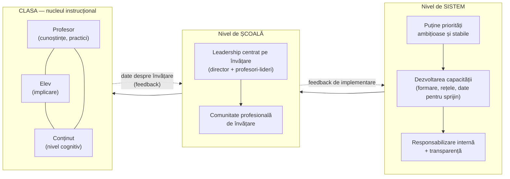

↑ [[00 Index - Analiza comparată internațională]] · Conspect-sursă: [[8.6 Managementul educației și reforma]] · Modul: [[Modulul 08 - Sistemul de educație și managementul educației]]

> [!abstract] Pe scurt
> - **Întrebarea**: de ce eșuează cele mai multe reforme educaționale și ce anume face ca unele să schimbe **practica din clasă**, la scară și durabil?
> - **Teza centrală** (Fullan, Elmore): o reformă contează doar dacă modifică **nucleul instrucțional** (*instructional core*) — relația profesor–elev–conținut. Legile, structurile și stimulentele sunt doar mijloace.
> - Schimbarea e un **proces** (inițiere → implementare → instituționalizare), cu o **dimensiune subiectivă**: profesorii trebuie să-i înțeleagă sensul. Schimbarea reală cere noi **materiale**, noi **practici** și noi **convingeri**.
> - La nivel de sistem, reformele reușite combină **presiunea cu sprijinul**, **puține priorități** menținute ani la rând, **dezvoltarea capacității** și **coerența** (Fullan & Quinn, 2016). Pârghiile „greșite” sunt responsabilizarea punitivă, soluțiile individuale, tehnologia ca scop și politicile fragmentate.
> - **Leadershipul școlar** e al doilea factor școlar ca influență asupra învățării, după predare (Leithwood et al., 2004). Cel **centrat pe predare și învățare** are efecte de câteva ori mai mari decât cel „transformațional” (Robinson, Lloyd & Rowe, 2008).
> - Cazurile clasice sunt **Ontario 2003–2013**, **London Challenge**, **Singapore** („școli care gândesc”), **Estonia 1987** și **Finlanda** (reformă lentă și consensuală). Contraexemplele sunt **NCLB** și **Race to the Top** (conformare fără îmbunătățire).
> - **Critici**: multe dovezi provin de la **arhitecții reformelor**; rapoartele McKinsey confundă corelația cu cauzalitatea; „lecțiile” se transferă greu între contexte.
> - Pentru **R. Moldova**: manualul tratează reforma ca schimbare de **structură** (după S. Cristea). Teoria schimbării adaugă întrebarea decisivă: **ce se schimbă efectiv în clasă** și cine construiește capacitatea pentru asta?

---

## 1. Explicația teoriei

### 1.1 Întrebarea la care răspunde

Teoria schimbării educaționale (*educational change theory*) s-a născut dintr-o constatare repetată în anii 1960–1970: marile programe de inovare curriculară (noua matematică, curriculumurile de științe post-Sputnik, educația compensatorie) **au fost adoptate formal, dar nu au schimbat predarea**. Întrebările ei sunt trei:

1. **De ce** reformele au efecte atât de mici în raport cu investiția?
2. **Cum** trece o idee bună de la minister (sau de la cercetător) în **mii de clase**?
3. **Cine** conduce schimbarea — statul, directorul, profesorii, rețelele de școli — și **cu ce instrumente**?

Teoria are două planuri legate. **Planul sistemului** vizează reforma „întregului sistem” (*whole-system reform*), politicile și coerența. **Planul școlii** vizează ameliorarea școlii (*school improvement*), leadershipul și comunitățile profesionale.

### 1.2 Ideile centrale

1. **Școlile sunt „sisteme slab cuplate”** (Weick, 1976). Deciziile de la vârf nu se transmit mecanic în clasă. Profesorul închide ușa și predă cum știe. De aceea politica **nu poate impune ceea ce contează cel mai mult**: voința și capacitatea locală (McLaughlin, studiul RAND *Change Agent*, anii 1970).
2. **„Gramatica școlii”** (Tyack & Cuban, 1995) — clasele pe vârste, orarul pe discipline, lecția de 45 de minute, notele — e extrem de stabilă. Reformele o „cârpesc” (*tinkering*), rareori o transformă.
3. **Nucleul instrucțional** (Elmore; City, Elmore, Fiarman & Teitel, 2009). Învățarea elevilor crește doar dacă se schimbă **nivelul conținutului**, **cunoștințele și abilitățile profesorului** și **implicarea elevului**. Dacă schimbi un element, trebuie să le schimbi și pe celelalte.
4. **Sensul subiectiv** (Fullan). Profesorii trebuie să construiască **sensul** schimbării pentru ei înșiși. Reformele impuse fără înțelegere produc **conformare de suprafață**.
5. **Presiune și sprijin**. Doar presiunea (standarde + sancțiuni) produce *gaming* și epuizare. Doar sprijinul (lași școlile să inoveze) produce inovare dispersată și inechitate. Sistemele care progresează le combină.
6. **Capacitate înaintea responsabilizării**. Oamenii nu pot fi trași la răspundere pentru ceva ce nu știu să facă. De aceea investiția în **învățarea profesională colectivă** vine prima (Elmore, 2004: „principiul reciprocității capacității”).
7. **Coerența** nu e aliniere birocratică, ci **înțelegere comună** a direcției, construită prin colaborare (Fullan & Quinn, 2016).
8. **Leadershipul contează**, dar mai ales când e **distribuit** (Spillane, 2006) și **centrat pe învățare** (Robinson, 2008; Hallinger).

### 1.3 Concepte-cheie

| Concept | Definiție |
|---|---|
| **Schimbare educațională** (*educational change*) | Modificarea practicilor, materialelor și convingerilor care guvernează predarea și învățarea, la nivel de clasă, școală sau sistem |
| **Fazele schimbării** (Fullan) | **inițiere** (decizia de adoptare) → **implementare** (primii 2–3 ani de folosire efectivă) → **instituționalizare / continuare** (schimbarea devine rutină sau dispare) |
| **Implementation dip** | Scăderea temporară a performanței și a încrederii la începutul unei inovații, când oamenii învață noi practici (Fullan) |
| **Nucleul instrucțional** (*instructional core*) | Triada profesor–elev–conținut în jurul unei sarcini de învățare. Orice reformă trebuie judecată după efectul asupra ei (Elmore) |
| **Gramatica școlii** (*grammar of schooling*) | Structurile organizatorice stabile și luate de-a gata ale școlii (Tyack & Cuban) |
| **Sistem slab cuplat** (*loosely coupled system*) | Organizație în care unitățile au autonomie mare, iar legăturile dintre decizie și execuție sunt slabe (Weick) |
| **Adaptare reciprocă** (*mutual adaptation*) | Implementarea reușită **modifică** atât inovația, cât și contextul local (McLaughlin, RAND) |
| **Reforma întregului sistem** (*whole-system reform*) | Îmbunătățirea tuturor școlilor dintr-o provincie sau țară, nu doar a unor școli-pilot (Fullan, Levin) |
| **Driveri corecți / greșiți** | Fullan (2011): corecți — dezvoltarea capacității, munca în echipă, pedagogia, gândirea sistemică; greșiți — responsabilizarea punitivă, calitatea individuală, tehnologia, politicile fragmentate |
| **Coerența** (*coherence*) | Înțelegerea comună a scopului și a naturii muncii. Cadrul Fullan & Quinn (2016) are patru componente: **focalizarea direcției**, **culturi colaborative**, **aprofundarea învățării**, **asigurarea responsabilizării** |
| **Capacitate** (*capacity building*) | Cunoștințele, abilitățile, resursele și relațiile care permit indivizilor și grupurilor să îmbunătățească practica |
| **Leadership instrucțional** | Directorul definește misiunea, gestionează programul instrucțional (curriculum, supervizarea predării, monitorizarea progresului) și creează un climat de învățare (Hallinger & Murphy, 1985) |
| **Leadership transformațional** | Construirea viziunii comune, dezvoltarea oamenilor, restructurarea organizației (Leithwood; după Burns și Bass) |
| **Leadership centrat pe elev** (*student-centred leadership*) | Dimensiunile de leadership cu efect direct asupra învățării elevilor (Robinson, 2011) |
| **Leadership distribuit** | Leadershipul ca activitate **împărțită** între director, profesori-lideri și echipe, nu ca atribut al unei singure persoane (Spillane; Harris) |
| **Organizația care învață** (*learning organization*) | Organizația care își dezvoltă continuu capacitatea de a-și crea viitorul prin cinci discipline: măiestria personală, modelele mentale, viziunea comună, învățarea în echipă, gândirea sistemică (Senge, 1990) |
| **Comunitate profesională de învățare** (PLC) | Grup de profesori care investighează împreună și continuu practica, cu responsabilitate colectivă pentru învățarea elevilor (Stoll et al., 2006; DuFour) |
| **Improvement science** | Metodă de îmbunătățire prin cicluri rapide de testare (Plan–Do–Study–Act), centrată pe o problemă precisă și pe variația rezultatelor, în **rețele** de școli (Bryk et al., 2015) |
| **Sustenabilitate** | Capacitatea schimbării de a supraviețui plecării liderilor și schimbării guvernelor, fără a epuiza resursele altora (Hargreaves & Fink, 2006) |
| **Scalare** (*scale*) | Nu doar răspândire, ci și **profunzime**, **sustenabilitate** și **transferul asumării** către practicieni (Coburn, 2003) |

### 1.4 Ce presupune teoria despre actori

| Actor | Presupoziție |
|---|---|
| **Elevul** | Beneficiarul final. Reformele se judecă după efectul asupra **învățării lui**, nu după gradul de conformare al instituțiilor. În versiunile recente (Fullan, *Deep Learning*, 2018), elevul e și **partener** al schimbării |
| **Profesorul** | Nu executant, ci **agent** al schimbării. E rațional să reziste la inovații care nu au sens pentru el sau pentru care nu are timp și sprijin. Rezistența e informație, nu doar obstacol |
| **Directorul** | Nu administrator, ci **lider al învățării**. Principala pârghie e implicarea în dezvoltarea profesională a profesorilor |
| **Cunoașterea** | Cunoașterea despre „ce funcționează” e **necesară, dar insuficientă**: implementarea e ea însăși o problemă de învățare. Contează și **cunoașterea practică** a profesorilor |
| **Școala** | Organizație socială cu cultură proprie. Poate fi **„blocată”** sau **„în mișcare”** (Rosenholtz, 1989). Unitatea de schimbare e școala și rețeaua de școli, nu profesorul izolat |
| **Statul** | Stabilește direcția, finanțează, construiește capacitate, asigură echitatea. **Nu poate „livra” învățare prin decret** |

---

## 2. Geneza și evoluția

| Perioadă | Etapă | Repere |
|---|---|---|
| **anii 1940–1960** | **Precursori** | Kurt Lewin — modelul schimbării organizaționale „dezghețare – schimbare – reînghețare” (1947) și cercetarea-acțiune; Everett Rogers, *Diffusion of Innovations* (1962) — curba în S a adoptării; Matthew Miles (ed.), *Innovation in Education* (1964) |
| **anii 1970** | **Descoperirea implementării** | Studiul RAND *Change Agent* (Berman & McLaughlin, 1973–1978): „adaptarea reciprocă”; Gross, Giacquinta & Bernstein, *Implementing Organizational Innovations* (1971) — eșecul inovațiilor adoptate formal; A. M. Huberman, *Understanding Change in Education* (UNESCO–IBE, 1973) — schimbări materiale, conceptuale, interpersonale; Weick (1976); mișcarea **școlilor eficiente** (Edmonds, 1979) |
| **anii 1980** | **Formulare** | Fullan, *The Meaning of Educational Change* (1982); Hallinger & Murphy (1985) — leadershipul instrucțional; Huberman & Miles, *Innovation Up Close* (1984); Rosenholtz, *Teachers' Workplace* (1989); primele programe de *school improvement* (ISIP, OCDE) |
| **anii 1990** | **Școala ca organizație care învață; restructurarea** | Senge, *The Fifth Discipline* (1990); Fullan, *Change Forces* (1993); Hargreaves, *Changing Teachers, Changing Times* (1994); Tyack & Cuban (1995); leadershipul transformațional (Leithwood); reforma sistemică din Kentucky (1990) |
| **1997–2010** | **Reforma la scară a sistemului** | Strategiile naționale de literație și numerație din Anglia (1998–1999, Barber); London Challenge (2003–2011); Ontario (2003–2013); NCLB (2002) ca teorie a schimbării prin responsabilizare; Elmore, *School Reform from the Inside Out* (2004); Leithwood et al. (2004); Hargreaves & Fink, *Sustainable Leadership* (2006); Barber & Mourshed (McKinsey, 2007); Robinson et al. (2008); OCDE, *Improving School Leadership* (Pont, Nusche & Moorman, 2008); Hargreaves & Shirley, *The Fourth Way* (2009) |
| **2010–2020** | **Coerență, capital profesional, improvement science** | Mourshed, Chijioke & Barber (2010); Bryk et al., *Organizing Schools for Improvement* (2010); Fullan, *All Systems Go* (2010) și *Choosing the Wrong Drivers* (2011); Hargreaves & Fullan, *Professional Capital* (2012); Bryk et al., *Learning to Improve* (2015); Fullan & Quinn, *Coherence* (2016); Leithwood, Harris & Hopkins, *Seven strong claims… revisited* (2020) |
| **2020–2026** | **Stadiul actual** | Pandemia ca șoc sistemic și test al rezilienței; Grissom, Egalite & Lindsay (Wallace, 2021) — sinteza efectelor directorilor; accent pe **bunăstare**, **învățare profundă** și **agenția elevului** (Hargreaves & Shirley, *Well-being in Schools*, 2022); critica **„policy borrowing”** (Steiner-Khamsi); reformele după PISA 2025 în multe țări, inclusiv R. Moldova |

---

## 3. Autori, reprezentanți, cercetători

| Autor | Lucrare(ări), an | Aportul concret |
|---|---|---|
| **Michael Fullan** (Canada, OISE) | *The Meaning of Educational Change* (1982; ed. a 2-a *The New Meaning…*, 1991, cu S. Stiegelbauer; ed. a 5-a, 2016); *Change Forces* (1993); *Leading in a Culture of Change* (2001); *All Systems Go* (2010); *Choosing the Wrong Drivers for Whole System Reform* (2011); cu Quinn, *Coherence* (2016); cu Hargreaves, *Professional Capital* (2012) | Fazele schimbării; sensul subiectiv; *implementation dip*; reforma întregului sistem; driveri corecți și greșiți; cadrul coerenței. Consilier special al premierului Ontario (2003/2004–2013) și evaluator al strategiilor engleze |
| **Andy Hargreaves** (Marea Britanie → Canada → SUA) | *Changing Teachers, Changing Times* (1994); cu Fink, *Sustainable Leadership* (2006); cu Shirley, *The Fourth Way* (2009) și *The Global Fourth Way* (2012) | Cele „patru căi” ale schimbării (după al Doilea Război Mondial: inovare dispersată; piață și standardizare; ținte de performanță și parteneriat; a patra cale — scop inspirațional, profesionalism, **responsabilitate înaintea responsabilizării**, rețele laterale). Sustenabilitatea leadershipului |
| **Richard Elmore** (SUA, Harvard) | *Getting to Scale with Good Educational Practice* (*Harvard Educational Review*, 1996); *School Reform from the Inside Out* (2004); cu City, Fiarman & Teitel, *Instructional Rounds in Education* (2009) | **Nucleul instrucțional**; problema scalei; „reciprocitatea capacității”; turele instrucționale (*instructional rounds*) — rețele de lideri care observă sistematic lecțiile, după modelul vizitelor medicale |
| **Milbrey McLaughlin** (SUA) | Berman & McLaughlin, *Federal Programs Supporting Educational Change* (RAND, 1973–1978); *The RAND Change Agent Study Revisited* (1990) | „Adaptarea reciprocă”; succesul depinde de voința și capacitatea locală, nu de proiectarea programului |
| **David Tyack & Larry Cuban** (SUA) | *Tinkering toward Utopia* (1995); Cuban, *How Teachers Taught* (1984) | „Gramatica școlii”; reformele trec prin clasă „ca apa prin nisip”; schimbarea incrementală a practicii |
| **Michael Barber** (Marea Britanie) | *The Learning Game* (1996); *Instruction to Deliver* (2007); cu Mourshed, *How the World's Best-Performing School Systems Come Out on Top* (McKinsey, 2007); Mourshed, Chijioke & Barber, *How the World's Most Improved School Systems Keep Getting Better* (2010) | *Deliverology* — reforma dirijată central prin ținte, date și unități de implementare. Tezele din 2007: calitatea sistemului nu poate depăși calitatea profesorilor. Raportul din 2010 (20 de sisteme): stadiile **slab → acceptabil → bun → foarte bun → excelent**. Intervențiile diferă pe stadii: **prescripție** centrală pentru sistemele slabe, **eliberarea profesionalismului** pentru cele bune. Continuitatea leadershipului e comună tuturor |
| **Mona Mourshed** (McKinsey) | Coautoare a rapoartelor din 2007 și 2010 | Tipologia stadiilor de îmbunătățire și a „intervențiilor potrivite stadiului” |
| **Frank Coffield** (Marea Britanie, critic) | *Why the McKinsey reports will not improve school systems* (*Journal of Education Policy*, 2012) | Critica metodologică: eșantion ales după rezultat, confuzie corelație–cauzalitate, ignorarea contextului social și cultural, viziune tehnocratică și de sus în jos |
| **Kenneth Leithwood** (Canada, OISE) | Leithwood, Seashore Louis, Anderson & Wahlstrom, *How Leadership Influences Student Learning* (Wallace, 2004); Leithwood, Harris & Hopkins, *Seven Strong Claims about Successful School Leadership* (2008; revizuit 2020) | Leadershipul e **al doilea factor școlar** ca influență, după predare. Practicile de bază: stabilirea direcției, dezvoltarea oamenilor, reproiectarea organizației, gestionarea programului instrucțional. Autorul *Ontario Leadership Framework* |
| **Viviane Robinson** (Noua Zeelandă) | Robinson, Lloyd & Rowe, *The Impact of Leadership on Student Outcomes* (*Educational Administration Quarterly*, 2008); *Student-Centered Leadership* (2011); BES *School Leadership and Student Outcomes* (2009) | Meta-analiză: leadershipul **instrucțional** are un efect mediu de ordinul **0,42**, cel **transformațional** de ordinul **0,11** (valori din studiu; de verificat în tabelul original). Dimensiunea cu cel mai mare efect: **promovarea și participarea directorului la învățarea profesională a profesorilor** (≈ 0,84) |
| **Philip Hallinger** (SUA → Asia) | Hallinger & Murphy, *Assessing the Instructional Management Behavior of Principals* (1985); Hallinger & Heck (1996, 1998); *Leading Educational Change: Reflections on the Practice of Instructional and Transformational Leadership* (2003) | Modelul și instrumentul **PIMRS** al leadershipului instrucțional: definirea misiunii, gestionarea programului instrucțional, climatul pozitiv. Sinteze arătând că efectul directorului e în mare parte **indirect** (prin climat și profesori). Extinderea cercetării în Asia de Est |
| **Anthony Bryk** (SUA, Chicago → Carnegie) | Bryk, Sebring, Allensworth, Luppescu & Easton, *Organizing Schools for Improvement: Lessons from Chicago* (2010); Bryk & Schneider, *Trust in Schools* (2002); Bryk, Gomez, Grunow & LeMahieu, *Learning to Improve* (2015) | **Cinci suporturi esențiale** (leadership, legătura cu părinții și comunitatea, capacitatea profesională, climatul centrat pe elev, ghidajul instrucțional), pe datele a sute de școli din Chicago. **Încrederea relațională** ca resursă. ***Improvement science*** și **rețelele de îmbunătățire** (*Networked Improvement Communities*) |
| **Peter Senge** (SUA, MIT) | *The Fifth Discipline* (1990); cu Cambron-McCabe et al., *Schools That Learn* (2000; ed. 2012) | **Organizația care învață** și cele cinci discipline. Cadrul explicit al reformei *Thinking Schools, Learning Nation* din Singapore (1997) |
| **Louise Stoll** (Marea Britanie) | Stoll & Fink, *Changing Our Schools* (1996); Stoll, Bolam, McMahon, Wallace & Thomas, *Professional Learning Communities: A Review of the Literature* (*Journal of Educational Change*, 2006) | Caracteristicile PLC: valori și viziune comune, responsabilitate colectivă, investigație reflexivă, colaborare, învățare de grup; condițiile de funcționare și sustenabilitate |
| **Richard DuFour** (SUA) | Cu Eaker, *Professional Learning Communities at Work* (1998) | Operaționalizarea PLC în școli: întrebări comune despre ce trebuie să învețe elevii și ce facem când nu învață |
| **James Spillane** (SUA) | *Distributed Leadership* (2006) | Leadershipul ca **practică** distribuită în interacțiunile dintre lideri, colegi și situații |
| **Ben Levin** (Canada) | *How to Change 5000 Schools* (2008) | Viceministru în Ontario. Strategia „pozitivă”: respect pentru profesori, puține ținte, sprijin, comunicare |
| **David Hopkins** (Marea Britanie) | *School Improvement for Real* (2001); *Every School a Great School* (2007) | Ameliorarea școlii pornind de la capacitatea internă; „segmentarea” sprijinului după nivelul școlii |
| **Mel Ainscow** (Marea Britanie) | *Towards Self-improving School Systems: Lessons from a City Challenge* (2015) | Analiza *City Challenge* (Manchester): colaborarea între școli ca motor de echitate |
| **Cynthia Coburn** (SUA) | *Rethinking Scale* (*Educational Researcher*, 2003) | Cele patru dimensiuni ale scalei: profunzime, sustenabilitate, răspândire, transferul asumării |
| **Pak Tee Ng** (Singapore, NIE) | *Learning from Singapore: The Power of Paradoxes* (2017) | Schimbarea din Singapore ca gestionare a paradoxurilor: centralizare–descentralizare, „a preda mai puțin, a învăța mai mult” |
| **Jason Grissom, Anna Egalite & Constance Lindsay** (SUA) | *How Principals Affect Students and Schools* (Wallace Foundation, 2021) | Sinteză: un director eficient are efecte comparabile cu cele ale unui profesor eficient, dar la nivelul **întregii școli**. Patru comportamente-cheie: interacțiuni instrucționale, climat productiv, colaborare și PLC, gestionarea strategică a personalului și resurselor (mărimile exacte: de verificat) |
| **Charles Payne** (SUA, critic) | *So Much Reform, So Little Change* (2008) | Școlile urbane sărace din SUA: disfuncții sociale și relaționale pe care reformele tehnice le ignoră |
| **Hannu Simola** (Finlanda, critic) | *The Finnish Education Mystery* (2015) | Succesul finlandez are rădăcini istorice și sociologice. „Lecțiile” nu se pot copia |
| **Gita Steiner-Khamsi** (critic) | *The Global Politics of Educational Borrowing and Lending* (2004) | Politicile „împrumutate” servesc adesea legitimării interne, nu rezolvării problemelor |
| **S. Cristea** (România; sursa manualului) | *Fundamentele științelor educației. Teoria generală a educației* (2003) | Reforma ca schimbare **structurală** a finalităților, structurii și conținutului; modelul managerial vs. birocratic și tehnocratic |

---

## 4. Legătura cu manualul și cu vaultul

| Unde | Ce spune manualul | Evaluare |
|---|---|---|
| [[8.6 Managementul educației și reforma]] (p. 298–306) | Managementul ca „conducere globală, optimă, strategică”; modelele birocratic → tehnocratic → managerial; schimbarea **curentă** (materiale, conceptuale, interpersonale) vs. **reforma** (finalități, structură, conținut) | **Corect, dar incomplet**. Tipologia schimbărilor vine de la **A. M. Huberman (1973)**, necitat (manualul are „Jurgen Huberman”, o contopire Habermas–Huberman; vezi [[Erori și actualizări ale manualului]]). Lipsesc **implementarea**, **leadershipul școlar**, **capacitatea**, **coerența** și dovezile despre ce reforme reușesc |
| [[8.3 Sistemul de învățământ din Republica Moldova]] | Structura sistemului și Codul Educației | Structura e doar condiția de posibilitate. Teoria schimbării întreabă cum ajunge Codul în clasă |
| [[2.2 Direcțiile modernizării sistemului educațional]] | Direcțiile de modernizare | Enumerare de direcții fără teorie a implementării |
| [[7.2.5 Educația pentru schimbare și dezvoltare]] | Educația elevilor pentru a face față schimbării | Plan diferit: schimbarea ca **conținut** educativ, nu ca proces organizațional. Punte: organizația care învață (Senge) |
| [[9.1 Profesorul școlar - roluri, competențe, stiluri]] și [[9.2 Profesorul postmodernist - facilitator al cunoașterii]] | Profesorul ca „agent al schimbării”, practician reflexiv | Formulare corectă, dar declarativă. Teoria schimbării arată **condițiile instituționale** ale agenției (timp, colaborare, leadership) |
| [[3.6 Educația permanentă și autoeducația]] și [[Autoeducația - teorii, autori și corelări]] | Societatea ca „cetate educativă” | Senge (organizația care învață) este deja legat în nota de aprofundare |
| [[Modulul 08 - Sistemul de educație și managementul educației]] | Titlul modulului promite „schimbarea în sistemul de învățământ” | Tema ocupă doar ultimele două pagini |

> [!note] Comentariu
> Manualul pleacă de la o concepție **structural-normativă**: reforma se definește prin **ce** schimbă (finalități, structură, conținut). Teoria schimbării educaționale adaugă dimensiunea **procesuală și socială**: **cum** și **prin cine** se schimbă practica. Cele două perspective sunt complementare. O reformă „structurală” completă (Codul din 2014, curriculumul pe competențe din 2018–2019) poate rămâne, în terminologia lui Cuban, o schimbare de „primul ordin” dacă nucleul instrucțional nu se modifică.

---

## 5. Implementare comparată

### 5.1 Tabel-sinteză

| Sistem | Cum a fost implementată (politică / program / instituție) | Când | Scară / intensitate | Dovezi sau rezultate |
|---|---|---|---|---|
| **Singapore** | *Thinking Schools, Learning Nation* — „fiecare școală, o organizație model care învață” (Senge); clustere de școli; relația tripartită MOE–NIE–școli; *Leaders in Education Programme* (NIE, 2001); rotația directorilor; PLC-uri cu timp în orar (2009); *Teach Less, Learn More* (2005); planificare pe decenii | 1997–prezent | **centrală** | Sistem constant în vârful PISA/TIMSS; OCDE (2011) și Mourshed et al. (2010) îl citează pentru coerență. Studii de caz, nu dovezi cauzale. Tensiunea holistic–examene rămâne (Kwek et al., 2023) |
| **Estonia** | Reforma curriculară pornită din **Congresul profesorilor** (1987): brainstorming național, concurs public de proiecte, pilotare în 20 de școli; Forumul Educației; trei curricula (1996, 2002, 2011) cu aceeași concepție; Strategia 2021–2035 | 1987–prezent | **medie–centrală** | Estonia în vârful PISA european. Ruus & Sarv: reforma reușește când coincid voința politică, sprijinul public și competența profesională. Eșecurile din 2002–2005 au apărut când consensul a lipsit |
| **Finlanda** | Implementarea **graduală** a școlii comprehensive (1972–1977, de la nord la sud) cu formare continuă masivă; consens politic peste guverne; dialog cu sindicatul OAJ; curricula-cadru (1994, 2004, 2014) elaborate cu profesorii; programul *Noua școală comprehensivă* (2016–2019) cu profesori-tutori | 1968–prezent | **medie** (reformă „lentă și constantă”, OCDE 2010) | Ascensiune 1970–2006. Declin după 2006, cu ipoteze multiple, printre care **pierderea coerenței** în anii 2010 (de verificat). Sahlgren (2015): capacitatea a fost construită în perioada centralizată |
| **Regatul Unit (Anglia)** | Strategiile naționale de literație (1998) și numerație (1999): dirijare centrală, ghiduri, formare în cascadă, ținte; ***London Challenge*** (2003–2011): consilieri, parteneriate între școli, *National Leaders of Education*; *City Challenge* (2008–2011); *Teaching Schools* (2011); „sistemul care se autoîmbunătățește” (D. Hargreaves) | 1998–2011 (strategii); 2010–prezent (MAT, rețele) | **centrală** | NLNS: creștere rapidă la KS2 1997–2000, apoi platou (Earl, Fullan, Leithwood et al., 2003). „London effect”: Londra a devenit cea mai bună regiune pentru elevii dezavantajați; cauze disputate (IFS 2014: începutul în primar; Burgess 2014: compoziția etnică; CfBT 2014: London Challenge, Teach First, academii) |
| **Japonia** | Ciclul **decenal și consensual** al curriculumului (Consiliul Central al Educației); difuzarea **orizontală** prin *lesson study* și lecții publice; școala ca **comunitate de învățare** (Satō Manabu, școala Hamanogo, 1998); „șocuri” externe (PISA 2004, pandemia, GIGA 2019) | postbelic–prezent | **medie** | Stabilitate curriculară și profesionalizare colectivă; schimbare lentă, cumulativă (Stigler & Hiebert, 1999). Limite: suprasolicitarea profesorilor ritualizează lesson study. Reforme *yutori* adoptate fără verificare empirică (Kariya, 2002) |
| **Coreea de Sud** | Reforme **de sus în jos** legate de ciclurile prezidențiale (5.31 în 1995; diversificarea liceelor în 2008; manualele cu AI în 2025); **școli de inovare** (*hyeoksin hakgyo*, Gyeonggi, 2009–) ca schimbare de jos în sus; PLC-uri | 1995–prezent | **redusă–medie** | Institute de cercetare puternice, dar oscilații politice. **Eșecul AIDT** (2025): program lansat înainte de dovezi, fără asumarea profesorilor, retrogradat prin lege după alternanța la guvernare |
| **Canada (Ontario)** | **Reforma întregului sistem** (Fullan, Levin): puține ținte (literație/numerație 75% la standard; absolvire 85%); *Literacy and Numeracy Secretariat* (2004); OFIP pentru școlile slabe; *Student Success*; pace sindicală (2005–2012); *Ontario Leadership Framework* (Leithwood, 2006/2012); Alberta — AISI (1999–2013) | 2003–2013 | **centrală** | Literație/numerație în primar: 54% → 70%; absolvire: 68% → 82% (Fullan, 2012). **Dar** PISA-Ontario a stagnat la citire și a scăzut la matematică; surse în mare parte autoraportate; sustenabilitate fragilă după 2012 și 2018 |
| **Europa (UE / Consiliul Europei)** | Metoda deschisă de coordonare (2000): ținte, indicatori, învățare între egali (*peer learning*); *European Policy Network on School Leadership*; grupurile de lucru EEA; OCDE, *Improving School Leadership* (2008); Semestrul european; fonduri (FSE+, RRF) | 2000–prezent | **redusă–medie** (competență de sprijin) | Convergența discursului (competențe, leadership pedagogic), dar implementare foarte inegală. Riscul „politicilor de vitrină” în Est (Phillips & Ochs, 2003; Steiner-Khamsi) |
| **SUA** | Teoria schimbării prin **standarde + teste + sancțiuni** (NCLB, 2002); **Race to the Top** (2009, 4,35 mld. USD) — stimulente competitive pentru state; *turnaround* școlar (School Improvement Grants); contra-modele: reforma Massachusetts (1993), rețelele Carnegie (NIC), cele cinci suporturi esențiale (Chicago), districte ca Long Beach și Union City | 1990–2016 (federal); prezent (local) | **centrală** (federal), dar variabilă pe state | Dee & Jacob (2011): NCLB — câștiguri la matematică în clasa a IV-a, fără efect la citire. Evaluarea IES a **Race to the Top** (2016): politici adoptate, **fără legătură clară** cu rezultatele elevilor. Evaluarea SIG (IES, 2017): fără efecte semnificative. Massachusetts: lider NAEP după un „mare pact” menținut decenii |
| **Republica Moldova** | Codul Educației (2014) și **Strategia „Educația-2020”**; proiectul Băncii Mondiale de reformă a educației (credit de 40 mil. USD, aprobat în 2013): **optimizarea rețelei școlare**, **finanțarea per elev** (generalizată în 2013), sistemul informațional (SIME) și **fișe de performanță ale școlilor**; reforma BAC; curriculumul pe competențe (2018–2019); **concurs pentru funcția de director** (regulament din 2015); ANACEC (2018); **„Educația 2030”** (HG nr. 114/2023); **Rețeaua Școlilor Model** (35 de școli în prima etapă din 2023, extinsă la 90); măsuri după PISA 2025 | 2012–2026 | **medie** (reforme structurale puternice; capacitatea de implementare la nivel de școală rămâne slabă) | PISA: progres 2009–2018 (printre cele mai mari din lume), apoi stagnare și scădere (citire 411 în 2022 → 404 în 2025). Banca Mondială asociază progresul cu reformele din 2012–2015, dar recunoaște lipsa dovezilor cauzale. Ministerul raportează avantaje de 60–65 de puncte PISA pentru școlile mari față de cele mici (declarații din 2026; interpretare corelațională) |

### 5.2 Studiu de caz 1 — Ontario 2003–2013: „reforma întregului sistem”

→ [[Canada - ecosistemul educațional]]

**Contextul.** Între 1995 și 2003, Ontario trecuse printr-o perioadă de **reforme conflictuale**: recentralizarea finanțării, testele EQAO, reduceri bugetare, greve. Moralul profesorilor era scăzut, iar rezultatele stagnau. Guvernul liberal ales în 2003 (premierul Dalton McGuinty) a făcut din educație prioritatea sa. L-a numit pe **Michael Fullan** consilier special și pe **Ben Levin** viceministru.

**Teoria de acțiune** (Fullan, 2010; Levin, 2008):
1. **Puține ținte ambițioase**, publice, menținute un deceniu: 75% dintre elevii de clasa a 6-a la standardul provincial la literație și numerație; 85% rata de absolvire.
2. **Construirea capacității, nu sancțiunea.** *Literacy and Numeracy Secretariat* (2004) avea echipe de specialiști care lucrau **alături** de consiliile școlare, nu ca inspectori.
3. **Datele pentru sprijin.** Rezultatele EQAO identificau școlile care primeau sprijin intensiv (OFIP), nu sancțiuni. Numărul școlilor eligibile a scăzut de la circa 800 la 87 (Fullan, 2012).
4. **Pace cu profesorii.** Acorduri-cadru pe 4 ani (2005–2012) cu sindicatele.
5. **Leadership.** *Ontario Leadership Framework* (Leithwood), formarea obligatorie a directorilor.
6. **Evitarea distractorilor**: fără inițiative paralele concurente.

**Rezultate raportate.** Literație și numerație în primar: de la **54%** la **70%**. Rata de absolvire: de la **68%** la **82%**. Ponderea elevilor foarte slabi a scăzut de la 17% la sub 6%.

> [!warning] De ce e un caz disputat
> - **Autoevaluare**: principalii autori ai datelor sunt arhitecții reformei.
> - **EQAO vs. PISA**: PISA-Ontario la matematică a scăzut de la 530 (2003) la 509 (2015). Chiar EQAO la matematică în clasa a 6-a a scăzut după 2009.
> - **Absolvirea** a crescut și prin **recuperarea creditelor**, cu suspiciuni de relaxare a standardelor.
> - **Sustenabilitatea**: Legea 115 (2012) a distrus pacea sindicală; guvernul din 2018 a schimbat priorități majore.
>
> Lecția teoretică: **coerența și încrederea** au produs progres pe indicatorii **proprii** ai reformei. Transferul spre **competențe măsurate independent** (PISA) nu a fost demonstrat.

### 5.3 Studiu de caz 2 — Anglia: de la *deliverology* la London Challenge

→ [[Regatul Unit - ecosistemul educațional]]

Anglia a testat succesiv **două teorii ale schimbării**.

**(1) Prescripția centrală: Strategiile naționale (1998–1999).** Michael Barber (șeful *Standards and Effectiveness Unit*) a introdus „ora de literație”, ghiduri detaliate de lecție, formare în cascadă și **ținte naționale** pentru KS2. În logica McKinsey (2010), aceasta e intervenția potrivită pentru un sistem „acceptabil” care trebuie să devină „bun”. Rezultatele au crescut rapid între 1997 și 2000, apoi au atins un **platou**. Echipa de evaluare de la OISE (Earl, Fullan, Leithwood, Watson et al., 2003) a concluzionat că presiunea a produs câștiguri inițiale, dar **nu profesionalism durabil**. Profesorii implementau, fără să-și asume.

**(2) Rețelele și leadershipul: London Challenge (2003–2011).** Condus de comisarul **Tim Brighouse**, programul a vizat școlile secundare din Londra, pe atunci cu cele mai slabe rezultate din Anglia. Instrumentele au fost: **consilieri experți** pentru școlile slabe (*Keys to Success*), **parteneriate** între școli puternice și slabe, directori-lideri de sistem (*National Leaders of Education*), date comparabile între școli similare („familii de școli”) și o identitate profesională comună („profesorul londonez”). Londra a trecut de la cea mai slabă la **cea mai bună regiune** pentru rezultatele GCSE ale elevilor dezavantajați.

**Explicațiile concurente** fac cazul instructiv metodologic:
- **Greaves, Macmillan & Sibieta (IFS, 2014)**: îmbunătățirea începe în **primar**, la sfârșitul anilor '90, deci înainte de London Challenge.
- **Burgess (2014)**: o mare parte se explică prin **compoziția etnică** (familii imigrante cu aspirații înalte).
- **Baars et al. (CfBT, 2014)**: combinație de London Challenge, Teach First, academii și autorități locale.

Concluzia prudentă: efectul e real, dar **multifactorial**. Rețelele de școli sunt o pârghie plauzibilă, nu singura cauză.

### 5.4 Studiu de caz 3 — Singapore și Estonia: coerență „de sus” și coerență „de jos”

→ [[Singapore - ecosistemul educațional]] · [[Estonia - ecosistemul educațional]]

**Singapore** reprezintă **coerența construită central**. Discursul *Thinking Schools, Learning Nation* (1997) a preluat explicit limbajul lui Senge: „fiecare școală, o organizație model care învață”. Au urmat instrumente coerente pe 25 de ani: un singur institut de formare (NIE), aceleași finalități (*Desired Outcomes of Education*), curriculum revizuit la 5–7 ani, formarea directorilor prin *Leaders in Education Programme*, **rotația** directorilor și PLC-uri cu timp în orar. Pak Tee Ng descrie deplasarea „de la controlul de sus în jos la inițiative de jos în sus”, **în limitele** fixate central („tight–loose”). Costurile sunt coexistența reformelor holistice cu examenele cu miză mare, stresul și volumul de muncă al profesorilor (47 h/săptămână, TALIS 2024).

**Estonia** reprezintă **coerența construită participativ**. În martie 1987, încă în URSS, un **congres al profesorilor** (circa 1.000 de participanți) a declanșat reforma curriculară. Au urmat un brainstorming național, un concurs cu 21 de proiecte evaluate public, comisii voluntare pe discipline și pilotare în 20 de școli **înainte** de legiferare. Cercetătoarele implicate (Ruus, Sarv) formulează o concluzie apropiată de Fullan: reforma reușește când coincid **voința politică, sprijinul public și competența profesională**. Continuitatea de concepție a trei curricula (1996, 2002, 2011) a dat stabilitate. Eșecul parțial al curriculumului din 2002, marcat de rivalitatea grupurilor de elaborare, arată costul pierderii consensului.

> [!tip] Comparație
> Ambele sisteme au obținut coerență, pe căi opuse: **Singapore** prin centralizare și capacitate instituțională, **Estonia** prin participare și agenția profesorilor. Pentru R. Moldova, cu trecut sovietic comun cu Estonia, varianta participativă e mai compatibilă cu principiile Codului din 2014 (descentralizare, participare). Cere însă **capacitate profesională** pe care Estonia o avea deja.

### 5.5 Studiu de caz 4 — SUA: teoria schimbării prin stimulente

→ [[SUA - ecosistemul educațional]]

NCLB (2002) și Race to the Top (2009) întruchipează teoria **principal–agent** aplicată schimbării: dacă stabilești ținte, măsori și legi consecințe de rezultate, școlile se vor îmbunătăți. Rezultatele confirmă critica lui Fullan despre „driverii greșiți”:
- **NCLB**: câștiguri reale, dar limitate la **matematică în primar** (Dee & Jacob, 2011), plus îngustarea curriculumului, *gaming* și fraude (Atlanta).
- **Race to the Top**: statele au adoptat politicile cerute (evaluarea profesorilor pe baza scorurilor, standarde comune), dar evaluarea IES (2016) nu a găsit o relație clară cu rezultatele elevilor. Proiectul Gates *Intensive Partnerships* (RAND, 2018): fără îmbunătățiri semnificative.
- **Contra-modelul Chicago** (Bryk et al., 2010): școlile care au construit cel puțin trei dintre cele cinci suporturi esențiale au avut probabilități de câteva ori mai mari de progres substanțial decât cele slabe la aceste suporturi. Schimbarea depinde de **organizarea socială** a școlii, nu doar de stimulente.
- **Massachusetts (1993)**: o reformă cu standarde și teste, dar însoțită de **finanțare compensatorie**, formarea profesorilor și **perseverență politică pe decenii**.

---

## 6. Dovezi empirice și critici

### 6.1 Studii-cheie

| Studiu | Design | Rezultat principal |
|---|---|---|
| **Berman & McLaughlin**, RAND *Change Agent* (1973–1978) | Studiu longitudinal pe 293 de proiecte federale | Succesul depinde de implementarea locală; adaptarea reciprocă depășește fidelitatea la program |
| **Robinson, Lloyd & Rowe** (2008) | Meta-analiză pe 27 de studii | Leadership instrucțional ≈ 0,42 vs. transformațional ≈ 0,11; implicarea directorului în învățarea profesorilor ≈ 0,84 (valori de verificat în articol) |
| **Leithwood et al.** (2004); **Leithwood, Harris & Hopkins** (2008, 2020) | Sinteze narative | Leadershipul explică o parte importantă a efectelor școlare; e **al doilea** după predare; acționează mai ales **indirect** |
| **Hallinger & Heck** (1996, 1998) | Sinteze ale studiilor empirice | Efectele directorului sunt în mare parte **mediate** (climat, profesori, scopuri) |
| **Bryk et al.** (2010) | Date longitudinale, circa 400 de școli primare din Chicago | Cele cinci suporturi esențiale prezic progresul la citire și matematică; încrederea relațională e o condiție |
| **Grissom, Egalite & Lindsay** (2021) | Sinteză a studiilor cvasiexperimentale | Efecte ale directorului comparabile cu ale profesorului, extinse la toată școala; efect asupra retenției profesorilor |
| **Dee & Jacob** (2011) | Diferență în diferențe, NAEP | NCLB: câștig la matematică în clasa a IV-a; fără efect la citire |
| **IES — Race to the Top** (2016) și **School Improvement Grants** (2017) | Evaluări naționale | Fără efecte clare asupra rezultatelor elevilor |
| **Vescio, Ross & Adams** (2008) | Recenzie a 11 studii | PLC-urile bine structurate, **centrate pe învățarea elevilor**, se asociază cu schimbarea practicii și a rezultatelor |
| **Mourshed, Chijioke & Barber** (2010) | 20 de sisteme, studii de caz | Tipologie a intervențiilor pe stadii. Descriptiv, nu cauzal |
| **Earl, Fullan, Leithwood et al.** (2003) | Evaluare externă NLNS | Câștiguri rapide, platou, profesionalism slab asumat |

### 6.2 Critici și controverse

> [!warning] Critică
> 1. **Problema dovezilor.** Mare parte din teorie se sprijină pe **studii de caz** și pe **sinteze narative**. Mulți autori sunt și **consultanți** ai reformelor pe care le evaluează (Fullan în Ontario și Anglia; Barber în Anglia și prin McKinsey). Validarea independentă e rară.
> 2. **Rapoartele McKinsey** (2007, 2010) aleg sistemele după rezultat și deduc „rețete” din ce au în comun. E o **eroare de selecție** clasică. Coffield (2012) le reproșează reducerea educației la livrare tehnocratică, ignorarea sărăciei și a culturii și o viziune de sus în jos. Afirmația „calitatea sistemului nu poate depăși calitatea profesorilor” e plauzibilă, dar formulată ca **truism necuantificat**.
> 3. **Transferabilitatea.** Simola (Finlanda), Steiner-Khamsi și Phillips & Ochs arată că politicile „împrumutate” își pierd sensul în alt context. Exportul lesson study (EEF, 2017: efect nul) e un exemplu.
> 4. **Măsurarea succesului.** Ontario arată riscul ca o reformă să fie validată de **propriii indicatori** (EQAO), în timp ce măsurători independente (PISA) nu confirmă.
> 5. **Tensiunea normativă.** Hargreaves și Shirley acuză **deliverology** de a trata profesorii ca executanți. Barber răspunde că sistemele slabe **nu au** capacitate de autonomie. Dovezile sugerează că **ordinea contează** (capacitate → autonomie; lecția Finlandei după Sahlgren).
> 6. **Leadershipul „eroic”.** Literatura despre directorii-salvatori ignoră condițiile structurale: sărăcia, segregarea, finanțarea (Payne, 2008; critica sociologică a lui Thrupp & Willmott, *Education Management in Managerialist Times*, 2003).
> 7. **Mărimile efectelor de leadership** din meta-analize vin în mare parte din studii corelaționale și transversale. Cauzalitatea e plauzibilă, dar nu demonstrată riguros.
> 8. **„Coerența”** poate deveni conformism dacă e impusă, adică exact opusul intenției lui Fullan.

### 6.3 Când funcționează și când nu

| Funcționează când… | Nu funcționează când… |
|---|---|
| prioritățile sunt **puține, clare și stabile** 8–10 ani | inițiativele se schimbă cu fiecare ministru („*initiativitis*”) |
| profesorii primesc **timp, formare și sprijin** în școală | formarea e punctuală, în cascadă, fără urmărire în clasă |
| datele servesc **diagnosticului și sprijinului** | datele servesc clasamentelor și sancțiunilor (legea lui Campbell) |
| directorul e **lider al învățării** și distribuie leadershipul | directorul e absorbit de administrație și raportare |
| există **încredere** între minister, școli, sindicate și părinți | reforma e percepută ca impusă „de sus” sau „de donatori” |
| schimbarea e **pilotată** și ajustată (adaptare reciprocă) | se generalizează fără pilotare (Quebec, AIDT în Coreea) |
| capacitatea precede autonomia | autonomia se acordă unor școli fără capacitate |

---

## 7. Implicații practice

> [!tip] Pentru profesor la clasă
> - Judecă orice inovație (metodă, platformă, curriculum) după **efectul asupra nucleului instrucțional**: ce învață elevii, la ce nivel cognitiv, cât de implicați sunt.
> - Așteaptă-te la ***implementation dip***. Primele luni cu o metodă nouă sunt mai slabe. Nu abandona prea devreme, dar colectează dovezi.
> - Transformă comisia metodică într-o **comunitate profesională de învățare**: o problemă de învățare concretă pe an, lecții deschise, analiza lucrărilor elevilor, nu doar a planurilor.
> - Folosește **cicluri scurte de îmbunătățire** (Plan–Do–Study–Act): o schimbare mică, testată 2–3 săptămâni, cu o măsură simplă a efectului.
> - Cultivă **încrederea relațională** cu colegii și părinții. Bryk arată că e o resursă a schimbării, nu un „plus” moral.

> [!tip] Pentru politica educațională din R. Moldova
> 1. **Puține priorități, menținute peste ciclurile electorale.** „Educația 2030” are multe obiective transversale. Teoria recomandă 2–3 ținte-far (de exemplu, **citirea cu înțelegere în primar**, **reducerea ponderii elevilor sub nivelul 2 PISA**, **retenția tinerilor profesori**), cu indicatori publici, menținute 8–10 ani, cu un acord politic larg.
> 2. **Datele pentru sprijin, nu pentru pedeapsă.** Evaluările naționale (clasele a IV-a și a IX-a) și fișele de performanță ale școlilor pot declanșa **echipe de sprijin** (după modelul OFIP din Ontario), nu doar clasamente. ANACEC și serviciile metodice locale au nevoie de un mandat explicit de **dezvoltare**, pe lângă cel de control.
> 3. **Directorul ca lider al învățării.** Concursul pentru funcția de director (regulament din 2015) și formarea managerială trebuie reorientate spre **leadership instrucțional**: observarea lecțiilor pentru dezvoltare, organizarea învățării profesionale, folosirea datelor. Dimensiunea cu cel mai mare efect în meta-analiza lui Robinson (implicarea directorului în formarea profesorilor) costă puțin.
> 4. **Rețele de școli.** Rețeaua Școlilor Model (90 de instituții anunțate) poate funcționa ca **noduri de învățare** pentru școlile din jur, în logica London Challenge, nu doar ca investiție în infrastructură. Riscul este ca școlile-model să adâncească decalajul față de școlile mici și rurale.
> 5. **Pilotare și adaptare reciprocă.** Măsurile anunțate după PISA 2025 (30 de minute de lectură zilnică în regim-pilot, adaptarea manualelor estoniene de matematică, examenele de gimnaziu revizuite) ar trebui pilotate cu **grupuri de comparație** și evaluare publică înainte de generalizare.
> 6. **Participarea profesorilor.** Lecția Estoniei din 1987: reformele concepute cu profesorii (forumuri, concursuri de proiecte, comisii voluntare) se implementează mai bine decât cele percepute ca venite „de la minister” sau „de la donatori”.
> 7. **Atenție la „împrumutul” de politici.** Modelele Singapore sau Finlanda se preiau ca **principii** (coerență, capacitate, încredere), nu ca instrumente izolate.

---

## 8. Legături cu alte teorii din catalog

- [[Profesionalismul cadrului didactic]] — capitalul profesional (Hargreaves & Fullan, 2012) e **combustibilul** teoriei schimbării. Fără profesori competenți și colaborativi, nicio strategie de sistem nu ajunge în clasă.
- [[Responsabilizare, piață și încredere în guvernarea educației]] — NCLB, *deliverology* și „a patra cale” sunt **teorii ale schimbării concurente**. Una mizează pe stimulente și presiune externă, cealaltă pe încredere și responsabilitate internă.
- Educația bazată pe dovezi — *improvement science* (Bryk) e punctul de întâlnire: dovezile despre „ce funcționează în medie” trebuie completate cu dovezi despre **cum funcționează aici**.
- [[Capitalul uman și economia educației]] — furnizează **justificarea** multor reforme (competitivitate), dar și critica eficienței cheltuielilor. Teoria schimbării explică de ce banii singuri nu schimbă practica.
- [[Tradiția Bildung-Didaktik și tradiția Curriculum]] — tradiția *Curriculum* (standarde, livrare) favorizează teoriile de sus în jos. Tradiția *Didaktik* (autonomia interpretativă a profesorului) favorizează schimbarea profesională.
- [[Evaluarea formativă]] — exemplu de inovație cu dovezi bune care a eșuat la scară când a fost transformată în procedură (Anglia, *AfL Strategy* 2008). Ilustrează problema implementării.
- [[Socioconstructivismul și teoria activității (Vygotsky)]] — teoria activității (Engeström, „învățarea expansivă”) oferă un model al schimbării organizaționale prin contradicții. Satō Manabu îl leagă de școala ca comunitate de învățare.
- [[Echitatea și școala comprehensivă]] — reforma finlandeză (1968–1977) e cazul-școală de schimbare structurală implementată gradual și consensual.
- [[Învățarea pe tot parcursul vieții și formele educației]] — organizația care învață (Senge) și „societatea care învață” (Faure, „Estonia care învață”, 1998) sunt versiuni instituționale ale aceleiași idei.
- [[Taxonomiile obiectivelor și educația centrată pe competențe]] — reformele curriculare pe competențe (Quebec, Scoția, R. Moldova) arată distanța dintre schimbarea **finalităților** și schimbarea **practicii**.

---

## 9. Întrebări de reflecție

1. Manualul definește reforma prin schimbarea **finalităților, structurii și conținutului**. Poate o reformă să le schimbe pe toate trei fără să schimbe nucleul instrucțional? Dați un exemplu din R. Moldova.
2. Comparați teoria schimbării din spatele NCLB cu cea din Ontario 2003–2013. Ce presupune fiecare despre motivația profesorilor?
3. De ce ar putea o reformă să pară reușită după indicatorii proprii (EQAO), dar nu după PISA? Ce ar trebui să facă un minister ca să evite această capcană?
4. Dacă ați fi director de școală, ce ați schimba concret în programul săptămânal ca să aplicați concluzia lui Robinson (2008) despre implicarea în învățarea profesorilor?
5. Rețelele de școli (London Challenge) și școlile-model (R. Moldova): în ce condiții reduc inechitatea și în ce condiții o adâncesc?
6. Reforma estoniană din 1987 a pornit de la profesori. Ce condiții istorice și profesionale au făcut-o posibilă și care dintre ele există azi în R. Moldova?

---

## 10. Surse

**Lucrări fundamentale**
- Berman, P., McLaughlin, M. W. (1978). *Federal Programs Supporting Educational Change, Vol. VIII: Implementing and Sustaining Innovations*. Santa Monica: RAND.
- Bryk, A. S., Sebring, P. B., Allensworth, E., Luppescu, S., Easton, J. Q. (2010). *Organizing Schools for Improvement: Lessons from Chicago*. Chicago: University of Chicago Press.
- Bryk, A. S., Gomez, L. M., Grunow, A., LeMahieu, P. G. (2015). *Learning to Improve: How America's Schools Can Get Better at Getting Better*. Cambridge, MA: Harvard Education Press.
- City, E. A., Elmore, R. F., Fiarman, S. E., Teitel, L. (2009). *Instructional Rounds in Education*. Cambridge, MA: Harvard Education Press.
- Coburn, C. E. (2003). Rethinking Scale: Moving Beyond Numbers to Deep and Lasting Change. *Educational Researcher*, 32(6), 3–12.
- Elmore, R. F. (1996). Getting to Scale with Good Educational Practice. *Harvard Educational Review*, 66(1), 1–26.
- Elmore, R. F. (2004). *School Reform from the Inside Out*. Cambridge, MA: Harvard Education Press.
- Fullan, M. (2011). *Choosing the Wrong Drivers for Whole System Reform*. Seminar Series 204. Melbourne: Centre for Strategic Education.
- Fullan, M. (2016). *The New Meaning of Educational Change* (5th ed.). New York: Teachers College Press.
- Fullan, M., Quinn, J. (2016). *Coherence: The Right Drivers in Action for Schools, Districts, and Systems*. Thousand Oaks: Corwin.
- Hallinger, P., Murphy, J. (1985). Assessing the Instructional Management Behavior of Principals. *The Elementary School Journal*, 86(2), 217–247.
- Hallinger, P., Heck, R. H. (1998). Exploring the Principal's Contribution to School Effectiveness: 1980–1995. *School Effectiveness and School Improvement*, 9(2), 157–191.
- Hargreaves, A., Fink, D. (2006). *Sustainable Leadership*. San Francisco: Jossey-Bass.
- Hargreaves, A., Shirley, D. (2009). *The Fourth Way: The Inspiring Future for Educational Change*. Thousand Oaks: Corwin.
- Hargreaves, A., Fullan, M. (2012). *Professional Capital: Transforming Teaching in Every School*. New York: Teachers College Press.
- Huberman, A. M. (1973). *Understanding Change in Education: An Introduction*. Paris: UNESCO–IBE.
- Leithwood, K., Seashore Louis, K., Anderson, S., Wahlstrom, K. (2004). *How Leadership Influences Student Learning*. New York: The Wallace Foundation.
- Leithwood, K., Harris, A., Hopkins, D. (2020). Seven Strong Claims about Successful School Leadership Revisited. *School Leadership & Management*, 40(1), 5–22.
- Levin, B. (2008). *How to Change 5000 Schools*. Cambridge, MA: Harvard Education Press.
- Robinson, V. M. J., Lloyd, C. A., Rowe, K. J. (2008). The Impact of Leadership on Student Outcomes: An Analysis of the Differential Effects of Leadership Types. *Educational Administration Quarterly*, 44(5), 635–674.
- Robinson, V. (2011). *Student-Centered Leadership*. San Francisco: Jossey-Bass.
- Senge, P. (1990). *The Fifth Discipline: The Art and Practice of the Learning Organization*. New York: Doubleday.
- Senge, P. et al. (2000/2012). *Schools That Learn*. New York: Doubleday.
- Spillane, J. P. (2006). *Distributed Leadership*. San Francisco: Jossey-Bass.
- Stoll, L., Bolam, R., McMahon, A., Wallace, M., Thomas, S. (2006). Professional Learning Communities: A Review of the Literature. *Journal of Educational Change*, 7(4), 221–258.
- Tyack, D., Cuban, L. (1995). *Tinkering toward Utopia: A Century of Public School Reform*. Cambridge, MA: Harvard University Press.
- Vescio, V., Ross, D., Adams, A. (2008). A Review of Research on the Impact of Professional Learning Communities on Teaching Practice and Student Learning. *Teaching and Teacher Education*, 24(1), 80–91.
- Weick, K. E. (1976). Educational Organizations as Loosely Coupled Systems. *Administrative Science Quarterly*, 21(1), 1–19.

**Rapoarte comparative și de politică**
- Barber, M., Mourshed, M. (2007). *How the World's Best-Performing School Systems Come Out on Top*. McKinsey & Company.
- Mourshed, M., Chijioke, C., Barber, M. (2010). *How the World's Most Improved School Systems Keep Getting Better*. McKinsey & Company.
- Coffield, F. (2012). Why the McKinsey Reports Will Not Improve School Systems. *Journal of Education Policy*, 27(1), 131–149.
- Grissom, J. A., Egalite, A. J., Lindsay, C. A. (2021). *How Principals Affect Students and Schools: A Systematic Synthesis of Two Decades of Research*. New York: The Wallace Foundation. https://www.wallacefoundation.org (URL-ul exact al raportului: de verificat)
- OECD (2011). *Lessons from PISA for the United States: Strong Performers and Successful Reformers in Education*. Paris: OECD.
- Pont, B., Nusche, D., Moorman, H. (2008). *Improving School Leadership, Volume 1: Policy and Practice*. Paris: OECD.
- Earl, L., Watson, N., Levin, B., Leithwood, K., Fullan, M., Torrance, N. (2003). *Watching and Learning 3: Final Report of the External Evaluation of England's National Literacy and Numeracy Strategies*. Toronto: OISE/UT.
- Greaves, E., Macmillan, L., Sibieta, L. (2014). *Lessons from London Schools for Attainment Gaps and Social Mobility*. London: Social Mobility and Child Poverty Commission / IFS.
- Dee, T. S., Jacob, B. (2011). The Impact of No Child Left Behind on Student Achievement. *Journal of Policy Analysis and Management*, 30(3), 418–446.
- Dragoset, L. et al. (2016). *Race to the Top: Implementation and Relationship to Student Outcomes* (NCEE 2017-4001). Washington, DC: IES.
- Ng, P. T. (2017). *Learning from Singapore: The Power of Paradoxes*. New York: Routledge.
- Simola, H. (2015). *The Finnish Education Mystery*. London: Routledge.
- Steiner-Khamsi, G. (ed.) (2004). *The Global Politics of Educational Borrowing and Lending*. New York: Teachers College Press.

**R. Moldova**
- Codul Educației al Republicii Moldova nr. 152/2014.
- Hotărârea Guvernului nr. 114 din 07.03.2023 privind Strategia de dezvoltare „Educația 2030”.
- World Bank (2013). *World Bank Supports Moldova Education Sector Reform* (comunicat, 24.01.2013). https://www.worldbank.org/en/news/press-release/2013/01/24/world-bank-supports-moldova-education--sector-reform
- World Bank Blogs. *Why students in Moldova are performing better*. https://blogs.worldbank.org/en/education/why-students-moldova-are-performing-better
- Ministerul Educației și Cercetării. *Îmbunătățirea Regulamentului cu privire la organizarea și desfășurarea concursului pentru ocuparea funcției de director* (2015). https://mec.gov.md/ro/content/imbunatatirea-regulamentului-cu-privire-la-organizarea-si-desfasurarea-concursului-pentru
- Ziarul Național (2025). *Ministerul Educației extinde Rețeaua Școlilor Model la 90 de instituții*. https://www.ziarulnational.md/ministerul-educatiei-extinde-reteaua-scolilor-model-la-90-de-institutii-in-toata-tara
- Edupedu.ro (2026). *Deciziile Republicii Moldova după rezultatele la PISA 2025*. https://www.edupedu.ro/deciziile-republicii-moldova-dupa-rezultatele-la-pisa-2025-pilotarea-a-30-de-minute-de-lectura-zilnica-in-scoli-examene-revizuite-pe-modelul-pisa-la-final-de-gimnaziu-dotarea-bibliotecilor-scolare/

**Note de țară din vault**: [[Canada - ecosistemul educațional]] (§5.1), [[Regatul Unit - ecosistemul educațional]] (§6.8), [[Singapore - ecosistemul educațional]] (§5.14), [[Estonia - ecosistemul educațional]] (§5.14), [[Finlanda - ecosistemul educațional]] (§6.17), [[Japonia - ecosistemul educațional]] (§5.6, §5.10), [[Coreea de Sud - ecosistemul educațional]] (§6.18), [[SUA - ecosistemul educațional]] (§5.22), [[Europa - spațiul european al educației]] (§6.15).
