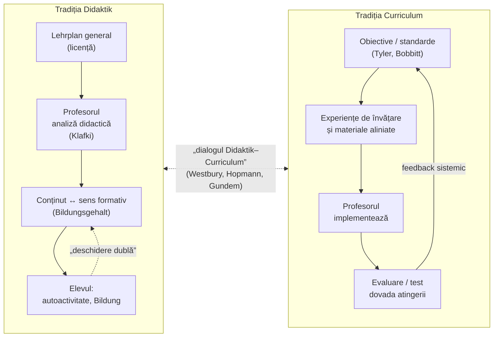
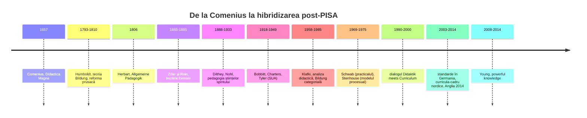

↑ [[00 Index - Analiza comparată internațională]]

> [!abstract] Pe scurt
> 1. Există **două mari limbaje** în care Occidentul gândește ce și cum se predă: tradiția germano-nordică ***Bildung*–*Didaktik*** și tradiția anglo-americană ***Curriculum***. Ele răspund diferit la întrebarea „cine decide sensul conținutului: statul/sistemul sau profesorul în fața elevului?”.
> 2. ***Bildung*** (formare, cultivare de sine) înseamnă formarea persoanei prin întâlnirea activă cu cultura; ***Didaktik*** este teoria care leagă conținutul de elev prin profesor (triunghiul didactic). Planul de învățământ (*Lehrplan*) **autorizează**, nu prescrie în detaliu; profesorul **interpretează**.
> 3. Tradiția ***Curriculum*** (Bobbitt, Charters, Tyler) pornește de la **obiective** stabilite ex ante, organizează experiențele de învățare și **verifică** atingerea lor; profesorul e, tipic, **executantul** unui plan elaborat în altă parte (Westbury, 2000).
> 4. În interiorul tradiției curriculare au existat contracurente puternice: **Stenhouse** (modelul procesual, profesorul-cercetător), **Schwab** (practicalul, deliberarea), reconceptualiștii (**Pinar**) și, recent, **M. Young** (*powerful knowledge*), care readuce cunoașterea disciplinară în centru — foarte aproape de *Bildung*.
> 5. **Dialogul Didaktik–Curriculum** (Gundem & Hopmann, 1998; Westbury, Hopmann & Riquarts, 2000; Hopmann, 2007; Uljens; Deng) a arătat că tradițiile nu sunt doar teorii, ci **arhitecturi instituționale** diferite: formarea profesorilor, manuale, inspecție, evaluare.
> 6. După PISA (2000), tradițiile s-au **hibridizat**: Germania a introdus standarde (2003–2004), Finlanda și Estonia combină curricula-cadru cu competențe și autonomia profesorului, Anglia (2014) a revenit la un curriculum „bogat în cunoaștere”.
> 7. R. Moldova moștenește **didactica sovietică** (de sorginte continentală, dar centralizată și normativă) și a adoptat după 1997 **limbajul curricular** anglo-american (obiective, competențe, „paradigma curriculumului”) — fără a importa și autonomia profesională care însoțește *Didaktik*.

---

## 1. Explicația teoriei

### 1.1 Întrebarea la care răspunde

Ambele tradiții răspund la aceeași întrebare fundamentală a școlii: **ce merită predat, de ce și cum ajunge conținutul cultural să devină formator pentru un elev concret?** Diferența stă în **locul unde se ia decizia** și în **felul în care e justificată**:

- În ***Didaktik***, decizia de sens se ia **în clasă**, de profesorul format academic, care analizează conținutul prescris în lumina *Bildung*. Statul fixează cadrul; profesorul are *Lehrfreiheit* (libertate de predare).
- În ***Curriculum***, decizia se ia **în sistem** (district, stat, agenție, editor de manuale, test), sub forma unor obiective și standarde verificabile; calitatea se asigură prin **aliniere** (obiective–materiale–evaluare) și **responsabilizare**.

### 1.2 Ideile centrale

| Dimensiune | Tradiția *Bildung*–*Didaktik* | Tradiția *Curriculum* |
|---|---|---|
| Scopul educației | formarea persoanei autonome, capabile de judecată (autodeterminare, codeterminare, solidaritate — Klafki) | pregătirea eficientă pentru rolurile adulte (Bobbitt), atingerea unor rezultate definite (Tyler) |
| Unitatea de gândire | **conținutul** și sensul său formativ (*Bildungsgehalt*) | **obiectivul** și dovada atingerii lui |
| Documentul-cheie | *Lehrplan* general, cu teme și intenții; **licență** pentru profesor | curriculum/standarde detaliate, adesea cu rezultate măsurabile |
| Rolul profesorului | profesionist reflexiv, interpret autonom | implementator; în variantele procesuale, cercetător (Stenhouse) |
| Formarea profesorului | academică, cu *Fachdidaktik* (didactica specialității) și teorie pedagogică | pregătire în metode, management, evaluare; variabilă istoric |
| Controlul calității | încredere în profesionalism, examene la final de ciclu, inspecție pedagogică | teste standardizate, rapoarte, responsabilizare |
| Știința de referință | pedagogia filosofică și hermeneutică (Dilthey, Nohl, Klafki) | psihologia comportamentală și managementul științific (Thorndike, Taylor), apoi psihometria |
| Risc tipic | elitism, lipsa dovezilor, variabilitate necontrolată între clase | îngustarea scopurilor, „predarea pentru test”, deprofesionalizare |

### 1.3 Concepte-cheie

| Concept | Definiție |
|---|---|
| ***Bildung*** | formarea omului prin propria activitate spirituală în interacțiune cu lumea și cultura; distinctă de *Erziehung* (creștere, educație ca influență) și de *Ausbildung* (pregătire profesională) |
| ***Didaktik*** | teoria generală a predării-învățării care întreabă **ce**, **de ce** și **pentru cine**, înainte de **cum**; în germană, sensul e mai larg decât „metodica” |
| **Triunghiul didactic** | relația profesor–elev–conținut; niciun vârf nu poate fi redus la celelalte |
| ***Lehrplan*** | planul de învățământ emis de stat, tradițional general și orientativ |
| ***Bildungsgehalt* vs. *Bildungsinhalt*** | **sensul formativ** al unui conținut vs. **materia** în sine; profesorul trebuie să descopere sensul (distincția *matter/meaning*, Hopmann) |
| **Bildung materială / formală** | materială: accentul pe acumularea conținuturilor valoroase; formală: accentul pe dezvoltarea facultăților (gândire, memorie, metodă) |
| ***Bildung* categorială** (Klafki) | sinteza celor două: conținutul **exemplar** deschide simultan lumea pentru elev și pe elev pentru lume („deschidere dublă”) |
| **Analiza didactică** (Klafki, 1958) | cinci întrebări prin care profesorul pregătește lecția: semnificația exemplară, semnificația pentru prezentul elevului, pentru viitorul lui, structura conținutului, accesibilitatea |
| **Probleme-cheie ale epocii** (*Schlüsselprobleme*, Klafki) | pace, mediu, inegalitate socială, tehnologie, relațiile interpersonale — teme care dau conținutului relevanță istorică |
| **Relația pedagogică** (*pädagogischer Bezug*, Nohl) | relația personală, asimetrică și orientată spre autonomia elevului, între educator și educat |
| **Instrucția educativă** (*erziehender Unterricht*, Herbart) | nu există instruire care să nu educe și nici educație fără instruire; scopul este **caracterul moral** prin **interes multilateral** |
| **Raționamentul Tyler** (*Tyler Rationale*) | patru întrebări: scopuri → experiențe de învățare → organizare → evaluare |
| **Modelul procesual** (Stenhouse) | curriculumul ca **ipoteză** testată de profesor în clasă, organizat în jurul unor principii de procedură, nu al obiectivelor comportamentale |
| **Practicalul** (*the practical*, Schwab) | curriculumul se decide prin **deliberare** asupra cazurilor concrete, cu cele patru „locuri comune”: elev, profesor, materie, mediu |
| ***Powerful knowledge*** (Young) | cunoaștere disciplinară, sistematică, independentă de context, care permite gândirea dincolo de experiența imediată; dreptul fiecărui elev |
| **Transpoziția didactică** (Chevallard, 1985) | transformarea „savoir savant” în „savoir à enseigner” și apoi în „savoir enseigné” — varianta franceză a problemei *Didaktik* |

### 1.4 Ce presupune fiecare tradiție

| Despre… | *Bildung*–*Didaktik* | *Curriculum* |
|---|---|---|
| **elev** | subiect al propriei formări (*Selbsttätigkeit*, autoactivitate), căruia îi datorăm deschiderea spre cultură | beneficiar al unor experiențe planificate; performanța sa e dovada reușitei |
| **profesor** | intelectual, „mediator” între cultură și copil, cu judecată proprie | agent al sistemului; tehnician competent sau (Stenhouse) cercetător |
| **cunoaștere** | patrimoniu cultural cu valoare formativă, selectat pentru exemplaritate | resursă pentru obiective; la Young, cunoaștere disciplinară „puternică” |
| **școală** | instituție relativ autonomă față de economie și politică (Weniger: *Lehrplan* ca compromis al forțelor sociale) | instrument public de eficiență socială și de egalizare a șanselor prin standarde |

---

## 2. Geneza și evoluția

**Precursori (sec. XVII–XVIII).** **Comenius** (*Didactica Magna*, 1657) dă numele disciplinei și ideea de a preda „totul tuturor” printr-o ordine naturală. Ratke folosise deja termenul „didactică”. Iluminismul (Kant, *Despre pedagogie*, 1803) formulează scopul **autonomiei**.

**Formularea *Bildung* (1790–1830).** **Wilhelm von Humboldt** (*Teoria formării omului*, fragment, cca 1793) definește *Bildung* ca dezvoltarea cea mai înaltă și proporționată a forțelor omului prin interacțiunea cu lumea. Ca șef al secției de cult și instrucție din Prusia (1809–1810), a reorganizat gimnaziul umanist, a introdus examenul de stat pentru profesorii de gimnaziu și a fondat Universitatea din Berlin (1810), cu unitatea cercetare–predare.

**Herbart și herbartienii (1806–1900).** **Johann Friedrich Herbart** (*Allgemeine Pädagogik*, 1806) întemeiază pedagogia pe **etică** (scopul) și **psihologie** (mijloacele) și propune treptele **claritate – asociație – sistem – metodă**. **Tuiskon Ziller** (*Grundlegung zur Lehre vom erziehenden Unterricht*, 1865) le transformă în cinci trepte formale și adaugă principiul **concentrării** și teoria **treptelor culturale**. **Wilhelm Rein** (Jena) le popularizează ca *pregătire, prezentare, asociere, generalizare, aplicare*. Herbartianismul devine **prima didactică globală**: Europa Centrală și de Est, Scandinavia, Rusia, SUA (*National Herbart Society*, 1895) și Japonia (Emil Hausknecht, Tokyo, 1887). Lecția „pe etape” din școala românească și sovietică îi este descendentă ([[8.4 Sisteme alternative de organizare a instruirii]]).

**Pedagogia științelor spiritului (1888–1960).** **Wilhelm Dilthey** (1888) contestă posibilitatea unei pedagogii universal valabile derivate din etică: educația trebuie înțeleasă **istoric și hermeneutic**. Elevii săi — **Herman Nohl** (*Die pädagogische Bewegung in Deutschland und ihre Theorie*, 1933/1935), **Eduard Spranger**, **Theodor Litt**, **Erich Weniger** (*Theorie der Bildungsinhalte und des Lehrplans*, 1930; ed. 1952) — formulează **autonomia relativă a educației**, **relația pedagogică** și ideea că *Lehrplan*-ul este un **compromis istoric** între forțe sociale, pe care profesorul îl interpretează responsabil.

**Nașterea tradiției Curriculum (1890–1950).** În SUA, după **Comitetul celor Zece** (1893), industrializarea și școlarizarea de masă cer eficiență. **Franklin Bobbitt** (*The Curriculum*, 1918) aplică managementul științific (Taylor, 1911): analiza activităților adulte → sute de obiective. **W. W. Charters** (*Curriculum Construction*, 1923) folosește analiza sarcinilor. **Ralph Tyler** (*Basic Principles of Curriculum and Instruction*, 1949), director de evaluare în Eight-Year Study, formulează raționamentul cu patru întrebări, care devine „gramatica” proiectării curriculare mondiale ([[SUA - ecosistemul educațional]]). Taxonomia lui Bloom (1956) și obiectivele operaționale ale lui Mager (1962) îl operaționalizează ([[Taxonomiile obiectivelor și educația centrată pe competențe]]).

**Reînnoirea *Didaktik* (1950–1990).** **Wolfgang Klafki** (teza despre problema elementarului și teoria *Bildung* categoriale, publicată 1959; *Didaktische Analyse als Kern der Unterrichtsvorbereitung*, 1958; *Studien zur Bildungstheorie und Didaktik*, 1963) sintetizează tradiția și o face utilizabilă de profesor. În anii 1960 apare concurența **didacticii teoriei învățării** (modelul Berlin: Heimann, Otto, Schulz, 1965) și a didacticii cibernetice. După 1968, Klafki își reformulează teoria ca **didactică critic-constructivă** (*Neue Studien*, 1985), orientată spre emancipare și spre problemele-cheie ale epocii. **Dietrich Benner** (*Allgemeine Pädagogik*, 1987) propune teoria **non-afirmativă**.

**Contracurente în tradiția Curriculum (1965–1995).** **Joseph Schwab** („The Practical: A Language for Curriculum”, 1969) declară domeniul curricular „moribund” din cauza teoriei abstracte și propune deliberarea practică. **Lawrence Stenhouse** (*An Introduction to Curriculum Research and Development*, 1975), pornind de la *Humanities Curriculum Project* (1967–1972), propune **modelul procesual** și **profesorul-cercetător**. **William Pinar** și reconceptualiștii (anii 1970) redefinesc curriculumul ca experiență trăită (*currere*). **Elliot Eisner** propune obiectivele expresive. În paralel, **tradiția franceză a didacticilor disciplinare** (Brousseau, Chevallard) construiește o a treia cale, științifică și disciplinară.

**Dialogul (1990–2010).** O serie de simpozioane „*Didaktik meets Curriculum*” (anii 1990; locurile și anii exacți — de verificat) produce volumele **Gundem & Hopmann** (*Didaktik and/or Curriculum*, 1998) și **Westbury, Hopmann & Riquarts** (*Teaching as a Reflective Practice*, 2000). Concluzia centrală a lui **Westbury**: diferența nu e metodologică, ci **instituțională** — cine are autoritatea asupra conținutului. **Hopmann** (2007) sintetizează nucleul comun al *Didaktik* ca „predare reținută” (*restrained teaching*).

**Stadiul actual (2000–2026).** Șocul PISA a împins țările *Didaktik* spre **standarde și evaluare externă** (Germania: standardele KMK, 2003–2004, expertiza Klieme, 2003). Țările curriculare au redescoperit **cunoașterea** (Anglia 2014; Young & Muller, 2013; *Curriculum and Assessment Review*, 2025). Cercetători ca **Zongyi Deng** (*Knowledge, Content, Curriculum and Didaktik*, 2020) și **Michael Uljens** propun **punți** între *Didaktik*, teoria curriculumului și leadership. **Gert Biesta** reactivează întrebarea „la ce bun educația?” (calificare, socializare, subiectivare) împotriva „educației măsurate”.

---

## 3. Autori, reprezentanți, cercetători

| Autor | Lucrare(ări), an | Aportul concret |
|---|---|---|
| **Jan Amos Comenius** | *Didactica Magna* (redactată în cehă cca 1627–1632; ed. latină 1657) | numele și programul didacticii: ordinea naturală, sistemul pe clase și lecții, manualul |
| **Wilhelm von Humboldt** | *Teoria formării omului* (cca 1793); planurile școlare din Königsberg și Lituania (1809) | conceptul modern de *Bildung*; reforma prusacă; universitatea cercetare–predare |
| **Johann Friedrich Herbart** | *Allgemeine Pädagogik* (1806); *Umriss pädagogischer Vorlesungen* (1835) | instrucția educativă, interesul multilateral, treptele formale; pedagogia ca știință |
| **Tuiskon Ziller** | *Grundlegung zur Lehre vom erziehenden Unterricht* (1865) | cinci trepte formale, concentrarea, treptele culturale; seminarul pedagogic de la Leipzig |
| **Wilhelm Rein** | *Theorie und Praxis des Volksschulunterrichts* (cu Pickel și Scheller, 1878–1885) | versiunea „școlară” a treptelor; Jena ca centru internațional de formare herbartiană |
| **Wilhelm Dilthey** | *Über die Möglichkeit einer allgemeingültigen pädagogischen Wissenschaft* (1888) | istoricitatea educației; metoda hermeneutică în pedagogie |
| **Herman Nohl** | *Die pädagogische Bewegung in Deutschland und ihre Theorie* (1933/1935) | relația pedagogică; autonomia relativă a educației; teoretizarea *Reformpädagogik* |
| **Erich Weniger** | *Theorie der Bildungsinhalte und des Lehrplans* (1930/1952) | *Lehrplan*-ul ca rezultat al luptei forțelor sociale; responsabilitatea interpretativă a profesorului |
| **Wolfgang Klafki** | *Didaktische Analyse als Kern der Unterrichtsvorbereitung* (1958); *Das pädagogische Problem des Elementaren und die Theorie der kategorialen Bildung* (1959); *Neue Studien zur Bildungstheorie und Didaktik* (1985) | analiza didactică (cinci întrebări); *Bildung* categorială; exemplaritatea; problemele-cheie ale epocii; triada autodeterminare–codeterminare–solidaritate |
| **Paul Heimann, Gunter Otto, Wolfgang Schulz** | *Unterricht – Analyse und Planung* (1965) | modelul Berlin (didactica teoriei învățării): factori de decizie (intenții, conținuturi, metode, medii) și condiții |
| **Dietrich Benner** | *Allgemeine Pädagogik* (1987) | teoria non-afirmativă; invitația la autoactivitate |
| **Franklin Bobbitt** | *The Curriculum* (1918); *How to Make a Curriculum* (1924) | curriculumul ca domeniu științific; analiza activităților adulte |
| **W. W. Charters** | *Curriculum Construction* (1923) | analiza sarcinilor și a idealurilor profesionale |
| **Ralph W. Tyler** | *Basic Principles of Curriculum and Instruction* (1949) | raționamentul Tyler; evaluarea ca parte a proiectării; contribuție la NAEP |
| **Hilda Taba** | *Curriculum Development: Theory and Practice* (1962) | proiectarea inductivă, cu profesorii |
| **Joseph J. Schwab** | „The Practical: A Language for Curriculum” (*School Review*, 1969); „The Practical 3: Translation into Curriculum” (1973) | deliberarea practică; cele patru locuri comune (elev, profesor, materie, mediu) |
| **Lawrence Stenhouse** | *An Introduction to Curriculum Research and Development* (1975); *Humanities Curriculum Project* (1967–1972) | modelul procesual; profesorul-cercetător; critica obiectivelor comportamentale pentru domeniile de înțelegere |
| **William F. Pinar** | *Curriculum Theorizing: The Reconceptualists* (1975); *Understanding Curriculum* (coord., 1995) | reconceptualizarea: *currere*, curriculumul ca text autobiografic, politic, estetic |
| **Herbert Kliebard** | „The Tyler Rationale” (1970); *The Struggle for the American Curriculum* (1986) | critica istorică: patru grupuri de interese în curriculumul american |
| **Michael F. D. Young** | *Knowledge and Control* (coord., 1971); *Bringing Knowledge Back In* (2008); cu J. Muller, „On the Powers of Powerful Knowledge” (*Review of Education*, 2013); cu D. Lambert et al., *Knowledge and the Future School* (2014) | de la sociologia critică a cunoașterii la realismul social; *powerful knowledge*; scenariile „Future 1/2/3” |
| **Yves Chevallard; Guy Brousseau** | *La transposition didactique* (1985); *Théorie des situations didactiques* (1998) | varianta franceză: didactica disciplinară ca știință a condițiilor de difuzare a cunoașterii |
| **Bjørg B. Gundem & Stefan Hopmann** | *Didaktik and/or Curriculum: An International Dialogue* (1998) | primul volum sistematic al dialogului |
| **Ian Westbury** | „Teaching as a Reflective Practice: What Might Didaktik Teach Curriculum?” (în Westbury, Hopmann & Riquarts, 2000) | distincția instituțională: *Curriculum* ca sistem de management vs. *Didaktik* ca practică profesională reflexivă |
| **Stefan Hopmann** | „Restrained Teaching: The Common Core of Didaktik” (*EERJ*, 2007); coord. *PISA According to PISA* (2007) | nucleul *Didaktik*: ordinea *Bildung*, distincția materie–sens, autonomia predării și învățării; critica logicii PISA |
| **Michael Uljens** | *School Didactics and Learning* (1997); cu R. Ylimaki, *Bridging Educational Leadership, Curriculum Theory and Didaktik* (2017) | didactica școlară nordică; teoria non-afirmativă aplicată leadershipului |
| **Pertti Kansanen** | lucrări despre didactica finlandeză și comparația cu tradiția anglo-saxonă (anii 1990–2000; titluri — de verificat) | modelul relațional al didacticii finlandeze |
| **Zongyi Deng** | *Knowledge, Content, Curriculum and Didaktik: Beyond Social Realism* (2020) | critică a „realismului social” al lui Young din perspectiva *Didaktik*; accent pe transformarea conținutului |
| **Gert Biesta** | *Good Education in an Age of Measurement* (2010); *The Beautiful Risk of Education* (2013) | cele trei funcții (calificare, socializare, subiectivare); critica „învățării” fără scop |
| **Tim Oates** | *Could do better* (Cambridge Assessment, 2010) | curriculum „rar dar dens”, coerent; baza reformei engleze din 2014 |
| **M. A. Danilov & B. P. Esipov; I. Ia. Lerner & M. N. Skatkin; Iu. K. Babanski** | *Didaktika* (1957); teoria conținutului învățământului (anii 1970–1980; titluri și ani — de verificat); *Optimizarea procesului de învățământ* (1977) | didactica sovietică: principii didactice, patru componente ale conținutului (cunoștințe, moduri de activitate, experiența creativă, atitudini emoțional-valorice), optimizarea — moștenite în R. Moldova |
| **Viive-Riina Ruus** | coordonarea fundamentelor curriculumului estonian (1992–1994) | trecerea Estoniei de la didactica sovietică la curriculum-cadru |

**Critici importanți.** Kliebard și Eisner (tehnicismul Tyler); Stenhouse (obiectivele comportamentale); criticii elitismului *Bildung* (gimnaziul umanist ca reproducere socială; Adorno, *Theorie der Halbbildung*, 1959); Deng și Biesta (ambele pentru „realismul social” redus la liste de conținut); criticii anglo-saxoni ai *Didaktik* pentru lipsa de bază empirică.

---

## 4. Legătura cu manualul și cu vaultul

| Unde | Ce spune manualul / conspectul | Evaluare |
|---|---|---|
| [[1.2 Evoluția științelor educației]] · [[1.1 Științele educației - delimitări conceptuale]] | Comenius fondatorul didacticii; Herbart consacră termenul „pedagogie” | **corect**, dar fără distincția *Bildung*/*Erziehung* și fără tradiția științelor spiritului (Dilthey, Nohl) |
| [[2.1 Clasic, modern și postmodern - delimitări conceptuale]] · [[Modulul 02 - Clasic, modern și postmodern în educație]] | „paradigma curriculumului” inițiată de **Dewey (1902)**, după Cristea; magistrocentrism = Comenius, Herbart; tehnocentrism = Tyler, Bloom | **incomplet și parțial înșelător**: Dewey folosește termenul în *The Child and the Curriculum*, dar domeniul „curriculum” se naște cu Bobbitt (1918) și Tyler (1949), față de care Dewey era critic. Manualul nu semnalează că „paradigma curriculumului” este **tradiția anglo-americană** și nu o etapă universală |
| [[5.2 Tipologia paradigmelor educaționale]] · [[Modulul 05 - Paradigmele pedagogiei și cercetarea pedagogică]] | Cristea: pedagogia postmodernă „în acord cu paradigma curriculumului” | prezentare **evoluționistă** (curriculum = superior didacticii); comparația internațională arată **coexistența** tradițiilor |
| [[3.2 Educația formală]] · [[8.4 Sisteme alternative de organizare a instruirii]] | treptele formale herbartiene; sistemul pe clase și lecții | conspectul corectează erori (prima treaptă e *claritatea*; numele Ziller, Rein) |
| [[1.3 Normativitatea activității educaționale]] | principiile didactice (Comenius, Herbart) | tipic pentru **didactica continentală/sovietică**; lipsește echivalentul curricular (aliniere, standarde) |
| [[4.5 Ierarhizarea și clasificarea obiectivelor]] · [[4.4 Finalitățile macro- și microstructurale]] · [[Modulul 04 - Finalitățile educației]] | Tyler, Bloom, Mager, operaționalizarea obiectivelor | tratare **sumară** în manual; conspectele completează. Lipsesc critica procesuală (Stenhouse) și alternativa *Didaktik* (conținutul exemplar ca punct de plecare) |
| [[2.5 Structura și funcționarea educației]] · [[10.1 Proiectarea activității educaționale]] · [[Modulul 10 - Proiectarea, realizarea și evaluarea activității educative]] | modelul liniar obiective–conținut–metode–evaluare; algoritmul proiectării (Jinga, Negreț) | manualul preia **raționamentul Tyler**; nu discută analiza didactică a lui Klafki, care ar fi un bun complement pentru profesor |
| [[Autoeducația - teorii, autori și corelări]] (§2) | Humboldt, Klafki: *Selbstbildung*, autodeterminare | legătură directă cu dimensiunea formativă a *Bildung* |
| [[Erori și actualizări ale manualului]] | preluări nesemnalate, datări greșite | aplicabil și aici (datarea *Didacticii Magna*) |

> [!note] Corelare esențială
> Manualul folosește simultan **vocabularul didacticii continentale** (principii didactice, trepte ale lecției, „tehnologie didactică”) și **vocabularul curricular** (finalități, obiective operaționale, competențe). Nu explică însă că aceste vocabulare provin din **tradiții cu logici instituționale diferite**. Cardul de față oferă cheia de lectură.

---

## 5. Implementare comparată

| Sistem | Cum a fost implementată (politică / program / instituție) | Când | Scară / intensitate | Dovezi sau rezultate |
|---|---|---|---|---|
| **Singapore** | tradiția **Curriculum** de sorginte britanică: programe centrale (*syllabi*) elaborate de MOE, aliniate la examene (PSLE, GCE, cu Cambridge), manuale aprobate; cadrul 21CC | din anii 1960; cadrul 21CC 2010–2014 | **centrală** (Curriculum); *Didaktik*: **nulă** | aliniere curriculum–manual–examen foarte ridicată, performanțe PISA/TIMSS de vârf; autonomia interpretativă a profesorului mai redusă în anii de examen ([[Singapore - ecosistemul educațional]]) |
| **Estonia** | trecerea de la didactica germano-baltică și sovietică la **curriculum-cadru național + curriculum școlar + profesor autonom**; evaluare externă din 1997 | 1987 (congresul profesorilor), 1994–1996, curricula 2002, 2010/2011, revizuiri 2014 | **centrală** (hibrid nordic) | reformă considerată pozitivă pe termen lung (Tire, 2021), dar TALIS arată practici tradiționale; legătura cauzală cu PISA nedemonstrată ([[Estonia - ecosistemul educațional]]) |
| **Finlanda** | *sivistys* (≈ *Bildung*) ca proiect național; curriculum central detaliat (1970) → **curriculum-cadru și curricula locale** (1994), abolirea aprobării manualelor și a inspecției; curricula 2004 și 2014 (competențe transversale T1–T7, module multidisciplinare) | 1970, 1994, 2004, 2014 (aplicat din 2016) | **centrală** (*Didaktik* hibridizat) | autonomia profesorului format la nivel de master e considerată factor-cheie; critica cronologică (Sahlgren, 2015) și Hakala & Kujala (2021) despre influența OCDE ([[Finlanda - ecosistemul educațional]]) |
| **Regatul Unit** | Anglia: autonomie curriculară de facto („grădina secretă”) până la **National Curriculum 1988**; revizuirea **2014** „bogată în cunoaștere” (Oates, Gove; *powerful knowledge*); Ofsted EIF 2019 centrat pe curriculum. Scoția (CfE, 2010) și Țara Galilor (CfW, 2022) pe capacități și „ce contează” | 1988, 2014, 2019; CAR 2025 | **centrală** (Curriculum); elemente *Didaktik* în CfW (școlile își construiesc curriculumul) | Anglia stabilă/relativ în creștere la PIRLS 2021, TIMSS 2023, PISA; Scoția în declin din 2012 (cauzalitate disputată); dovezi corelaționale ([[Regatul Unit - ecosistemul educațional]]) |
| **Japonia** | **herbartianism** importat (Hausknecht, 1887); după 1947, *Course of Study* național (tradiție curriculară americană) + manuale autorizate; cultura ***kyōzai kenkyū*** (studiul materialului) și *lesson study*, apropiate de *Didaktik* | 1887; 1947; revizuiri cca decenale (2017–2018 ultima majoră) | **centrală** (hibrid) | coerență ridicată a lecțiilor (TIMSS Video); profesorul interpretează conținutul colectiv ([[Japonia - ecosistemul educațional]]) |
| **Coreea de Sud** | curricula naționale succesive de tip american (obiective, standarde; influența Tyler după 1945); cultivarea de sine confucianistă (*suyang*) ca afinitate cu *Bildung* | din anii 1950 până la curriculumul 2022 | **centrală** (Curriculum) | aliniere puternică la CSAT; autonomia curriculară școlară crește din 2022 ([[Coreea de Sud - ecosistemul educațional]]) |
| **Canada** | curricula provinciale pe rezultate (*outcomes*), cadre comune WNCP și Atlantic (anii 1990); Quebec cu influențe francofone (didactica disciplinelor în formarea profesorilor) | anii 1990–2020 | **centrală** (Curriculum); *didactique*: **redusă** (Quebec) | performanțe ridicate cu echitate; oscilații progresivism – „înapoi la baze” ([[Canada - ecosistemul educațional]]) |
| **Europa (UE / Consiliul Europei)** | spațiul continental și nordic: *Lehrplan*/programe-cadru, *Fachdidaktik*; Germania: standarde KMK după PISA; Franța: didacticile disciplinare; UE: competențele-cheie (2006, 2018) ca limbaj curricular comun; Consiliul Europei: *Reference Framework of Competences for Democratic Culture* (2018) | sec. XIX–prezent; 2003–2004 (DE); 2006/2018 (UE) | **centrală** (*Didaktik* ca matrice istorică; hibridizare) | greu de evaluat empiric; convergență spre competențe și evaluare externă ([[Europa - spațiul european al educației]]) |
| **SUA** | **locul de naștere al tradiției Curriculum**: Bobbitt, Charters, Tyler; standarde de stat, *Common Core* (2010), NGSS (2013), *Understanding by Design* (Wiggins & McTighe, 1998) ca neo-tylerism; manuale adoptate la nivel de stat/district | 1918–prezent | **centrală** | aliniere standarde–teste; critici privind îngustarea curriculumului sub NCLB; NAEP stagnant/în scădere după 2013 ([[SUA - ecosistemul educațional]]) |
| **Republica Moldova** | **didactica sovietică** (principii, trepte ale lecției, conținut normativ) → curriculum național (1997–2000), modernizat (2010), *Cadrul de referință al Curriculumului Național* (2017) și curricula pe competențe (2018–2019); formarea profesorilor păstrează disciplinele „Didactica [specialității]”; manuale unice aprobate de minister | 1945–1991; 1997–2000; 2010; 2017–2019 | **centrală**, dar **hibrid nearticulat**: limbaj curricular + practică didactică normativă | lipsesc evaluări cauzale; decalaj între documente și practica de clasă; profesorul are autonomie formală redusă (manual unic, proiectare standardizată) — vezi [[8.3 Sistemul de învățământ din Republica Moldova]] |

### 5.1 Studiu de caz: Finlanda — *Didaktik* cu curriculum-cadru

Finlanda ilustrează cel mai bine **varianta nordică** a tradiției. Termenul *sivistys* (Snellman, sec. XIX) este echivalentul lui *Bildung*. După 1945, planificarea rațională de tip american a pătruns în administrație, iar primul curriculum al școlii comprehensive (1970) era detaliat și centralizat. Cotitura vine la începutul anilor 1990: **abolirea aprobării manualelor și a inspecției**, apoi **curriculumul-cadru din 1994**, care obligă municipalitățile și școlile să-și scrie **curricula locale**. Profesorii, formați la nivel de master din 1979, cu teză de cercetare și didactica specialității (Koskenniemi, Kansanen), devin **interpreții** documentului național.

Curriculumul din 2014 adaugă **competențele transversale** (T1–T7) și modulele multidisciplinare, justificate în termeni de *yleissivistys* (educație generală). Aici apare tensiunea: Hakala & Kujala (2021) văd în limbajul competențelor o influență neoliberală a OCDE; alții îl citesc ca pe o **reinterpretare a *Bildung***. Critica lui Sahlgren (2015) arată că o mare parte a creșterii rezultatelor s-a produs **sub vechiul sistem centralizat**, deci autonomia a funcționat pentru că exista deja capacitate profesională. Lecția: *Didaktik* nu este o „metodă”, ci o **arhitectură** — formare academică + încredere + documente generale — care cere **ordinea corectă** (capacitate înainte de autonomie). Vezi [[Finlanda - ecosistemul educațional]].

### 5.2 Studiu de caz: Estonia — de la didactica sovietică la curriculum-cadru

Estonia este cazul cel mai relevant pentru Moldova, pentru că pornește **din același punct**: didactica sovietică de origine continentală. Congresul profesorilor din martie 1987 a cerut un curriculum estonian, umanist, centrat pe elev. Laboratorul de studii curriculare (Universitatea Pedagogică din Tallinn, cu sprijin finlandez) și echipa **Viive-Riina Ruus** au construit fundamentele (1992–1994). Reforma 1994–1996 a introdus un curriculum **orientat spre rezultate**, iar din 1997 evaluarea externă. Sinteza finală este însă **nordică**: curriculum național-cadru + curriculum școlar obligatoriu + profesor autonom, **fără** responsabilizare cu miză mare de tip anglo-american.

Rezultatul nu e o transformare pedagogică spectaculoasă: TALIS 2018 arată profesori care preferă practici **structurate, tradiționale** (doar 28% folosesc des autoevaluarea elevilor). Paradoxul este instructiv: autonomia profesională le-a permis profesorilor să **păstreze** ce funcționa din didactica anterioară (claritate, structură, exersare), iar performanța PISA a crescut. Critici: decalajul dintre partea generală a curriculumului și programele disciplinare, efectul uniformizator al examenelor (Ruus & Sarv; Krull & Trasberg, 2006). Vezi [[Estonia - ecosistemul educațional]].

### 5.3 Studiu de caz: Anglia 2014 — tradiția Curriculum redescoperă cunoașterea

Anglia a trecut prin toate fazele. Până în 1988, profesorii și școlile decideau aproape liber conținutul („grădina secretă a curriculumului”) — o autonomie **fără** teoria *Didaktik* și fără formarea academică nordică. *Education Reform Act* (1988) a impus **National Curriculum** cu niveluri și teste (tradiția Curriculum în forma sa managerială). Revizuirea din **2014** (programe mai scurte la unele discipline, dar mai exigente și detaliate pe ani la engleză și matematică) a fost justificată de **Tim Oates** (*Could do better*, 2010) prin coerența sistemelor performante și de **Michael Gove/Nick Gibb** prin Hirsch și Young. Ofsted EIF (2019) a mutat inspecția spre „**intenție, implementare, impact**” curricular, iar *Curriculum and Assessment Review* (2025) a confirmat abordarea bogată în cunoaștere, recunoscând însă îngustarea la arte și tehnologie.

Ironia teoretică: *powerful knowledge* al lui Young este **mai aproape de *Bildung*** (acces la cunoașterea care emancipează) decât de Tyler; Young însuși a criticat reducerea conceptului la **liste de fapte**. Deng (2020) observă că lipsește tocmai componenta *Didaktik*: **transformarea conținutului** de către profesor pentru elev. Rezultatele Angliei (PIRLS 2021, TIMSS 2023) sunt compatibile cu un efect pozitiv, dar dovezile sunt **corelaționale**. Vezi [[Regatul Unit - ecosistemul educațional]].

### 5.4 Studiu de caz: Republica Moldova — didactica sovietică sub limbaj curricular

Didactica sovietică (Danilov & Esipov, Kairov, apoi Lerner, Skatkin, Babanski) a păstrat **forma** didacticii continentale — principii, trepte ale lecției, teoria conținutului — dar a eliminat **autonomia** și dimensiunea emancipatoare a *Bildung*: conținutul era fixat ideologic, manualul era unic, profesorul executa. După 1991, R. Moldova a adoptat, prin proiecte finanțate internațional, **limbajul curricular**: curriculum național (1997–2000), modernizat în 2010, cadrul de referință (2017), curricula pe competențe (2018–2019). Manualele universitare (Cristea, preluat; Guțu, *Curriculum educațional*, 2014) prezintă „paradigma curriculumului” ca pe **etapa superioară** a pedagogiei.

Rezultatul este un **hibrid nearticulat**: documente formulate în termeni de competențe și rezultate (tradiția Curriculum), dar fără instrumentele acesteia (evaluare aliniată, date, materiale diversificate), și **practică de clasă** de tip didactic-normativ, fără autonomia interpretativă și formarea academică a *Didaktik* nordice. Comparativ, Estonia a pornit din aceeași moștenire, dar a construit **ambele** componente: un document-cadru clar și profesori cu libertate reală. Vezi [[8.3 Sistemul de învățământ din Republica Moldova]] și [[Estonia - ecosistemul educațional]].

---

## 6. Dovezi empirice și critici

**Ce se poate spune empiric.**
- Tradițiile **nu sunt intervenții** testabile prin RCT; sunt configurații istorice. Comparațiile internaționale (PISA, TIMSS) arată sisteme performante în **ambele** tradiții (Finlanda, Estonia vs. Singapore, Anglia recent) — deci **tipul de tradiție nu determină singur performanța**.
- Ce pare să conteze, transversal, este **coerența** între curriculum, manuale, evaluare și formarea profesorilor (Oates, 2010; Schmidt et al. despre coerența curriculară în TIMSS). Această coerență se poate obține **prin prescriere** (Singapore) sau **prin profesionalism** (Finlanda).
- Cercetările despre autonomia profesorului (OCDE, TALIS; analize PISA) sugerează că autonomia se asociază cu rezultate mai bune **acolo unde există responsabilitate și capacitate**, și nu în sistemele cu capacitate scăzută (Hanushek, Link & Wößmann, 2013, despre autonomia școlară: efecte pozitive în țările dezvoltate, negative în cele în curs de dezvoltare).
- Curricula „bogate în cunoaștere” au sprijin indirect din știința cognitivă (rolul cunoștințelor de fond în înțelegerea textului — Hirsch; Willingham) și dovezi de program (ex. *Core Knowledge Language Arts*: studii cvasi-experimentale pozitive; Grissmer et al., 2023, pe școli charter din Colorado, cu loterie — de verificat detaliile). Nu există însă dovezi cauzale la nivel de sistem.

**Critici principale.**
- ***Didaktik***: elitism istoric (gimnaziul umanist), lipsa unei baze empirice, variabilitate mare între clase, risc de „autonomie fără competență”; teoria e greu de operaționalizat pentru profesorul începător.
- ***Curriculum***: îngustarea scopurilor la ce e măsurabil, atomizarea obiectivelor (Kliebard, Eisner), deprofesionalizare, predare pentru test (Koretz); obiectivele comportamentale nu surprind înțelegerea (Stenhouse).
- ***Powerful knowledge***: accentuează **ce** se predă, dar neglijează **cum devine sens** pentru elev (Deng) și dimensiunea de subiectivare (Biesta); acuzații de canon cultural restrâns.
- **Hibridizarea post-PISA**: Hopmann (2007) arată că standardele pot coloniza logica *Didaktik*; alții văd în competențe o **traducere** a *Bildung*.

> [!warning] Limite și condiții
> - **Nu confundați tradiția cu performanța.** Nici *Didaktik*, nici *Curriculum* nu „explică” PISA; ambele pot produce sisteme bune sau slabe.
> - **Autonomia fără capacitate eșuează.** Lecția Finlandei și a Estoniei este că autonomia a venit **după** o perioadă lungă de construire a competenței profesionale.
> - **Prescrierea fără materiale și evaluare aliniată** produce doar documente. Tradiția Curriculum funcționează numai ca **sistem** (standarde + manuale + teste + formare).
> - **Atenție la anacronisme**: afirmația că „Dewey a inițiat paradigma curriculumului” (manual, după Cristea) simplifică: Dewey a fost mai degrabă **critic** al curriculumului eficientist.
> - Mai multe datări și titluri din literatura *Didaktik* nordică (Kansanen, seria de simpozioane) sunt marcate „de verificat”.

---

## 7. Implicații practice

> [!tip] Pentru profesor la clasă
> - **Folosiți analiza didactică a lui Klafki** înainte de a scrie obiectivele operaționale: (1) Ce idee generală exemplifică acest conținut? (2) Ce înseamnă el deja pentru elevii mei? (3) De ce le va fi necesar în viitor? (4) Care e structura lui (concepte, relații, niveluri)? (5) Prin ce situații, exemple, întrebări devine accesibil? Abia apoi formulați obiectivele (Tyler) și evaluarea.
> - **Distingeți materia de sens**: aceeași lecție din manual poate fi predată ca listă de fapte sau ca „fereastră” spre o idee puternică. Alegeți conținutul **exemplar**, nu exhaustiv.
> - **Tratați curriculumul ca ipoteză** (Stenhouse): notați ce a funcționat, cu ce elevi și de ce; discutați cu colegii (comisia metodică, *lesson study*).
> - **Cunoașterea disciplinară contează**: competențele nu se formează în gol; elevii fără sprijin acasă depind de claritatea și bogăția conținutului predat.

> [!tip] Pentru politica educațională din R. Moldova
> 1. **Alegeți conștient arhitectura.** Documentele (Cadrul de referință 2017, curricula 2018–2019) vorbesc limbajul Curriculum; practica e didactică-normativă. Fie construiți **instrumentele tradiției Curriculum** (evaluare aliniată, bănci de itemi, date), fie **pe cele ale *Didaktik*** (autonomie reală, formare academică, încredere) — ideal, un hibrid **articulat** de tip estonian.
> 2. **Autonomia în etape**: extindeți libertatea de alegere a manualelor și a proiectării doar în paralel cu **formarea continuă solidă** și cu sprijin metodologic (ordinea finlandeză: capacitate → autonomie).
> 3. **Curriculum „rar dar dens”**: reduceți numărul de obiective/unități de competență și specificați mai clar **cunoașterea esențială** și secvența ei (Oates; Young), evitând atomizarea.
> 4. **Reintroduceți didactica specialității ca știință**, nu ca metodică prescriptivă: transpoziția didactică, analiza conținutului, cercetarea-acțiune a profesorului.
> 5. **Proiectarea didactică**: renunțați la formularele standardizate excesive în favoarea unei proiectări pe unități care include întrebările lui Klafki și alinierea Tyler.

---

## 8. Legături cu alte teorii din catalog

- [[Taxonomiile obiectivelor și educația centrată pe competențe]] — instrumentul central al tradiției Curriculum (Tyler → Bloom → competențe); competențele sunt și terenul hibridizării cu *Bildung*.
- [[Progresivismul și educația nouă]] — Dewey și *Reformpädagogik* au criticat atât herbartianismul, cât și eficientismul; Nohl a teoretizat mișcarea reformistă din interiorul *Didaktik*.
- [[Behaviorismul și instruirea directă]] — fundamentul psihologic al obiectivelor comportamentale (Thorndike, Mager) și al versiunii manageriale a tradiției Curriculum.
- [[Știința cognitivă a învățării]] — oferă argumente empirice pentru curricula bogate în cunoaștere (cunoștințe de fond, secvențiere).
- [[Profesionalismul cadrului didactic]] — *Didaktik* presupune profesorul ca profesionist autonom; tradiția Curriculum, adesea, ca implementator.
- [[Responsabilizare, piață și încredere în guvernarea educației]] — tradiția Curriculum se asociază cu responsabilizarea externă; *Didaktik*, cu încrederea.
- [[Pedagogia critică și educația pentru cetățenie]] — Klafki (didactica critic-constructivă) și Young (1971) au rădăcini critice; Biesta leagă *Bildung* de subiectivare democratică.
- [[Învățarea autoreglată, metacogniția și autoeducația]] — *Selbstbildung* și autoactivitatea sunt versiunea filosofică a autoreglării.
- [[Teoria schimbării educaționale și leadershipul]] — Uljens leagă *Didaktik* de leadership non-afirmativ; transferul de curricula eșuează fără schimbarea instituțiilor.
- [[Evaluarea formativă]] — puntea practică: evaluarea în timpul predării permite profesorului să ajusteze sensul conținutului, nu doar să verifice obiective.

---

## 9. Întrebări de reflecție

1. Ce înseamnă concret că *Lehrplan*-ul „autorizează” profesorul, iar curriculumul anglo-american îl „prescrie”? Unde s-ar situa curriculumul actual din R. Moldova?
2. Aplicați cele cinci întrebări ale analizei didactice (Klafki) unei lecții din manualul disciplinei voastre. Ce se schimbă față de proiectarea pornind de la obiective operaționale?
3. De ce afirmă Westbury că diferența dintre tradiții este **instituțională** și nu metodologică? Dați exemple din Finlanda și SUA.
4. Este *powerful knowledge* (Young) o reîntoarcere la *Bildung* materială sau o sinteză nouă? Argumentați cu critica lui Deng.
5. Estonia și R. Moldova au pornit în 1991 din aceeași moștenire didactică sovietică. Ce decizii instituționale explică traiectoriile diferite?
6. Manualul prezintă „paradigma curriculumului” ca etapă superioară. Este justificată această viziune evoluționistă în lumina comparației internaționale?

---

## 10. Surse

**Tradiția *Bildung*–*Didaktik***
- Humboldt, W. von (cca 1793/1903). *Theorie der Bildung des Menschen* (fragment). În *Gesammelte Schriften*, vol. I.
- Herbart, J. F. (1806). *Allgemeine Pädagogik aus dem Zweck der Erziehung abgeleitet*. Göttingen.
- Ziller, T. (1865). *Grundlegung zur Lehre vom erziehenden Unterricht*. Leipzig.
- Rein, W., Pickel, A., Scheller, E. (1878–1885). *Theorie und Praxis des Volksschulunterrichts nach Herbartischen Grundsätzen*. Dresden.
- Dilthey, W. (1888). *Über die Möglichkeit einer allgemeingültigen pädagogischen Wissenschaft*.
- Nohl, H. (1935). *Die pädagogische Bewegung in Deutschland und ihre Theorie*. Frankfurt/M.: Schulte-Bulmke.
- Weniger, E. (1952). *Didaktik als Bildungslehre. Teil 1: Theorie der Bildungsinhalte und des Lehrplans*. Weinheim: Beltz.
- Klafki, W. (1958). Didaktische Analyse als Kern der Unterrichtsvorbereitung. *Die Deutsche Schule*, 50. Trad. engl. în Westbury, Hopmann & Riquarts (2000).
- Klafki, W. (1963). *Studien zur Bildungstheorie und Didaktik*. Weinheim: Beltz.
- Klafki, W. (1985). *Neue Studien zur Bildungstheorie und Didaktik*. Weinheim: Beltz.
- Heimann, P., Otto, G., Schulz, W. (1965). *Unterricht – Analyse und Planung*. Hannover: Schroedel.
- Benner, D. (1987). *Allgemeine Pädagogik*. Weinheim: Juventa.
- Hopmann, S. (2007). Restrained Teaching: The Common Core of Didaktik. *European Educational Research Journal*, 6(2), 109–124. https://doi.org/10.2304/eerj.2007.6.2.109
- Hopmann, S., Brinek, G., Retzl, M. (coord.) (2007). *PISA zufolge PISA – PISA According to PISA*. Wien: LIT.
- Uljens, M. (1997). *School Didactics and Learning*. Hove: Psychology Press.
- Uljens, M., Ylimaki, R. (coord.) (2017). *Bridging Educational Leadership, Curriculum Theory and Didaktik*. Cham: Springer (acces deschis). https://link.springer.com/book/10.1007/978-3-319-58650-2
- Hakala, L., Kujala, T. (2021). A touchstone of Finnish curriculum thought and core curriculum for basic education: Reactivating the dimension of Bildung. *Prospects* (titlu exact — de verificat).

**Tradiția Curriculum**
- Bobbitt, F. (1918). *The Curriculum*. Boston: Houghton Mifflin.
- Charters, W. W. (1923). *Curriculum Construction*. New York: Macmillan.
- Tyler, R. W. (1949). *Basic Principles of Curriculum and Instruction*. Chicago: University of Chicago Press.
- Taba, H. (1962). *Curriculum Development: Theory and Practice*. New York: Harcourt.
- Kliebard, H. M. (1970). The Tyler Rationale. *The School Review*, 78(2), 259–272.
- Kliebard, H. M. (1986). *The Struggle for the American Curriculum, 1893–1958*. Boston: Routledge & Kegan Paul.
- Schwab, J. J. (1969). The Practical: A Language for Curriculum. *The School Review*, 78(1), 1–23.
- Schwab, J. J. (1973). The Practical 3: Translation into Curriculum. *The School Review*, 81(4), 501–522.
- Stenhouse, L. (1975). *An Introduction to Curriculum Research and Development*. London: Heinemann.
- Pinar, W. F. (coord.) (1975). *Curriculum Theorizing: The Reconceptualists*. Berkeley: McCutchan.
- Pinar, W. F., Reynolds, W., Slattery, P., Taubman, P. (1995). *Understanding Curriculum*. New York: Peter Lang.
- Young, M. F. D. (coord.) (1971). *Knowledge and Control*. London: Collier-Macmillan.
- Young, M. (2008). *Bringing Knowledge Back In*. London: Routledge.
- Young, M., Muller, J. (2013). On the Powers of Powerful Knowledge. *Review of Education*, 1(3), 229–250. https://doi.org/10.1002/rev3.3017
- Young, M., Lambert, D., Roberts, C., Roberts, M. (2014). *Knowledge and the Future School*. London: Bloomsbury.
- Wiggins, G., McTighe, J. (1998). *Understanding by Design*. Alexandria, VA: ASCD.
- Oates, T. (2010). *Could do better: Using international comparisons to refine the National Curriculum in England*. Cambridge Assessment.

**Dialogul Didaktik–Curriculum și didactica disciplinelor**
- Gundem, B. B., Hopmann, S. (coord.) (1998). *Didaktik and/or Curriculum: An International Dialogue*. New York: Peter Lang.
- Westbury, I., Hopmann, S., Riquarts, K. (coord.) (2000). *Teaching as a Reflective Practice: The German Didaktik Tradition*. Mahwah, NJ: Lawrence Erlbaum.
- Deng, Z. (2020). *Knowledge, Content, Curriculum and Didaktik: Beyond Social Realism*. London: Routledge.
- Chevallard, Y. (1985). *La transposition didactique*. Grenoble: La Pensée Sauvage.
- Brousseau, G. (1998). *Théorie des situations didactiques*. Grenoble: La Pensée Sauvage.
- Biesta, G. (2010). *Good Education in an Age of Measurement*. Boulder: Paradigm.

**Sisteme și politici**
- Klieme, E. et al. (2003). *Zur Entwicklung nationaler Bildungsstandards. Eine Expertise*. Berlin: BMBF.
- Opetushallitus (2014/2016). *Perusopetuksen opetussuunnitelman perusteet 2014* (curriculumul-nucleu finlandez).
- Sahlgren, G. H. (2015). *Real Finnish Lessons*. London: Centre for Policy Studies.
- Tire, G. (2021). Estonia: A Positive PISA Experience. În Crato, N. (coord.), *Improving a Country's Education*. Cham: Springer.
- Department for Education (2013). *The National Curriculum in England: Framework Document*. https://www.gov.uk/government/collections/national-curriculum
- Ministerul Educației, Culturii și Cercetării al RM (2017). *Cadrul de referință al Curriculumului Național*. Chișinău.
- Guțu, Vl. (2014). *Curriculum educațional*. Chișinău: CEP USM.
- Hanushek, E. A., Link, S., Woessmann, L. (2013). Does school autonomy make sense everywhere? *Journal of Development Economics*, 104, 212–232.
- Notele de țară din vault: [[Finlanda - ecosistemul educațional]], [[Estonia - ecosistemul educațional]], [[Regatul Unit - ecosistemul educațional]], [[SUA - ecosistemul educațional]], [[Japonia - ecosistemul educațional]], [[Europa - spațiul european al educației]].
