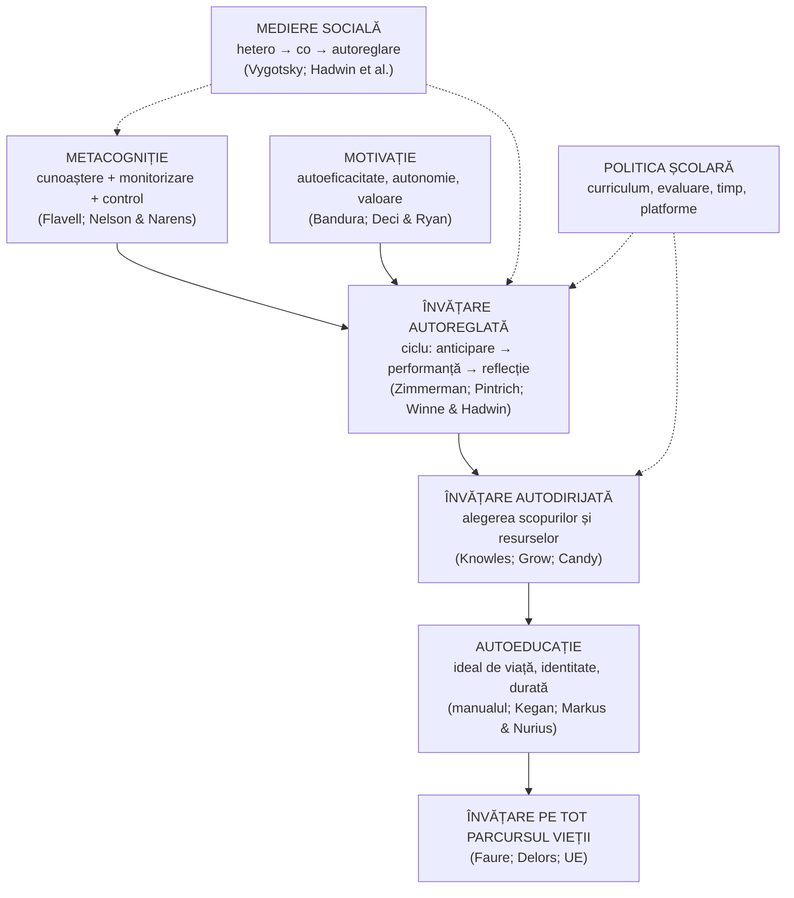

↑ [[00 Index - Analiza comparată internațională]] · Teoria în detaliu: [[Autoeducația - teorii, autori și corelări]] · Manual: [[3.6 Educația permanentă și autoeducația]]

> [!info] Cum se folosește acest card
> Nota [[Autoeducația - teorii, autori și corelări]] conține **analiza teoretică completă** (peste 80 de autori, matricea de corelare cu manualul, modelul integrator hetero → co → autoreglare, precauțiile criza replicării). Cardul de față **nu o reia**. Rezumă doar esențialul teoretic (§1–3) și se concentrează pe **implementarea comparată** (§5): cum au transformat zece sisteme educaționale ideea de autoreglare în politică, curriculum, instrumente și evaluare, și ce spun dovezile despre efect.

> [!abstract] Pe scurt
> 1. **Învățarea autoreglată** (*self-regulated learning*, SRL) este procesul prin care elevul își **stabilește scopuri**, își **monitorizează și controlează** cogniția, motivația și comportamentul și **reflectează** asupra rezultatului. **Metacogniția** (Flavell, 1976) e componenta ei de cunoaștere și control al propriei gândiri. **Autoeducația** din manual este forma ei **axiologică** și de lungă durată.
> 2. Mecanismul de formare e **social**: hetero-reglare → **coreglare** → autoreglare (Vygotsky; Hadwin, Järvelä & Miller, 2011). Autonomia nu se proclamă, se **construiește prin eșafodaj** care se retrage.
> 3. Aproape toate sistemele au inclus-o în **finalități**: „a învăța să înveți” (UE 2006/2018; art. 11 al Codului Educației din R. Moldova), *self-directed learner* (Singapore), T1 (Finlanda), competența de autogestionare (Estonia, Coreea), *shutaiteki na manabi* (Japonia), *personal awareness and responsibility* (BC).
> 4. Diferența dintre sisteme nu e în declarații, ci în **instrumente**: Anglia are cel mai clar **ghid bazat pe dovezi** pentru profesori (EEF, 2018; revizuit 2025); Singapore are **platformă și timp** (SLS, zile de învățare acasă); Canada leagă autoreglarea de **evaluare** (evaluarea „ca” învățare); Finlanda are singurul **instrument național de măsurare** a competenței „a învăța să înveți” (Hautamäki).
> 5. **Dovezile** pentru predarea explicită a strategiilor metacognitive sunt **printre cele mai solide** din educație: meta-analize cu efecte medii-mari (Dignath & Büttner, 2008; Donker et al., 2014), efecte care **cresc** la urmărire (de Boer et al., 2018: g 0,50 → 0,63), **+8 luni** de progres în *Toolkit*-ul EEF (anterior +7).
> 6. **Paradoxul comparat**: sistemele cu elevi foarte muncitori (Coreea, Japonia) pot avea autoreglare **heteronomă** (reglată de familie și meditații), iar sistemele care proclamă autonomia (Finlanda, Estonia) arată **declinul** atitudinilor față de învățare. Proclamarea autonomiei **nu produce** autoreglare fără predare explicită.
> 7. Efectele intervențiilor **motivaționale scurte** (*mindset*, *grit*) sunt mult mai mici decât cele ale predării explicite a strategiilor legate de conținut.

---

## 1. Explicația teoriei (rezumat)

### 1.1 Întrebarea la care răspunde

Cum devine elevul capabil să **învețe fără profesor** — să-și planifice studiul, să-și dea seama când nu înțelege, să aleagă o strategie potrivită, să persevereze și să-și evalueze rezultatul? Pentru manual, întrebarea e mai largă: cum devine **obiectul educației subiect** al propriei educații ([[3.6 Educația permanentă și autoeducația]], p. 109).

### 1.2 Ideile centrale

- **Ciclul autoreglării** (Zimmerman, 2000): **anticipare** (scopuri, planificare, autoeficacitate) → **performanță** (autoinstruire, automonitorizare) → **autoreflecție** (autoevaluare, atribuiri, adaptare). Metodele de autoeducație din manual (autocunoaștere, autocomandă, autocontrol, autoevaluare) se plasează exact pe aceste faze — vezi tabelul din [[Autoeducația - teorii, autori și corelări#8.1 Modelele autoreglării]].
- **Metacogniția are două fețe**: **cunoașterea** despre propria cogniție (ce știu, ce strategii există, ce cere sarcina) și **reglarea** ei (monitorizare și control; Nelson & Narens, 1990).
- **Autoreglarea e specifică domeniului**. Un elev poate fi autoreglat la sport și dependent la matematică (Candy, 1991). Strategiile metacognitive se predau **cel mai eficient legat de conținut**, nu separat.
- **Se formează social**: hetero-reglare → coreglare → autoreglare → reglare social împărtășită (Vygotsky, Luria, Meichenbaum; Hadwin, Järvelä & Miller, 2011).
- **Motivația e parte a competenței**: autoeficacitatea (Bandura), autonomia (Deci & Ryan), valoarea atribuită sarcinii. Fără ele, strategiile nu sunt folosite.
- **Autoeducația** adaugă dimensiunea **axiologică** (idealul de viață, identitatea) și de **durată** (educația permanentă).

### 1.3 Concepte-cheie

| Concept | Definiție (pe scurt) |
|---|---|
| **Metacogniție** (*metacognition*) | cunoașterea și reglarea propriilor procese cognitive (Flavell, 1976) |
| **Învățare autoreglată** (SRL) | reglarea activă, orientată spre scop, a cogniției, motivației, comportamentului și contextului în învățare (Pintrich, 2000; Zimmerman, 2000) |
| **Învățare autodirijată** (*self-directed learning*, SDL) | tradiția educației adulților: elevul decide **ce**, **când** și **cum** învață (Knowles, 1975); mai largă decât SRL |
| **„A învăța să înveți”** (*learning to learn*) | competență-cheie: capacitatea de a persevera în învățare și de a o organiza (UE, 2006/2018); în Finlanda, model cu componente cognitive și afectiv-motivaționale (Hautamäki et al., 2002) |
| **Coreglare / reglare social împărtășită** | sprijin temporar al unui partener mai competent / reglare comună a grupului (Hadwin et al., 2011) |
| **Strategii cognitive / metacognitive / motivaționale** | repetare, elaborare, organizare / planificare, monitorizare, evaluare / gestionarea efortului și a emoțiilor |
| **Eșafodaj care se retrage** (*fading*) | sprijin extern redus treptat pe măsură ce elevul preia controlul (Wood, Bruner & Ross, 1976) |
| **Modelarea metacognitivă** | profesorul **gândește cu voce tare** cum planifică, monitorizează și evaluează rezolvarea (EEF, 2018/2025) |
| **Autoevaluare** | judecata elevului asupra propriei lucrări după criterii (Boud, 1995); legată de [[Evaluarea formativă]] |
| **Autoeducație** | activitatea conștientă și de durată a persoanei de formare a propriei personalități, orientată de un ideal (manualul, după Bârna, Comănescu) |

### 1.4 Harta relațiilor

> [!note] Ce presupune teoria despre actorii educației
> - **Elevul**: poate învăța strategii de gândire despre gândire de la vârste mici. Autoreglarea e **educabilă**, nu o trăsătură fixă.
> - **Profesorul**: **modelează** explicit strategiile, oferă practică ghidată și **cedează treptat** controlul (modelul lui Grow: autoritate → ghid → facilitator → consultant).
> - **Cunoașterea**: fără cunoștințe de domeniu, elevul nu are ce monitoriza. Metacogniția se sprijină pe cunoaștere.
> - **Școala**: trebuie să ofere **timp**, **alegeri reale** și **evaluare** care cere reflecție; altfel „autonomia” e doar un slogan.

---

## 2. Geneza și evoluția (pe scurt)

| Etapă | Perioadă | Repere |
|---|---|---|
| **Precursori filosofici și pedagogici** | Antichitate – sec. XX | grija de sine (Socrate, stoicii); autonomia (Kant); *Selbstbildung* (Humboldt); Montessori (*autoeducazione*); Dewey (gândirea reflexivă, 1910) — detalii în [[Autoeducația - teorii, autori și corelări#2. Fundamente filosofice: autonomia și *Bildung*]] |
| **Psihologia cultural-istorică** | 1930–1970 | Vygotsky (stăpânirea propriului comportament), Luria (reglarea verbală), Galperin (interiorizarea pe etape) |
| **Educația adulților** | 1961–1991 | Houle (1961), Tough (1971), **Knowles**, *Self-Directed Learning* (1975); Candy (1991); **Grow** (1991) — vezi [[3.6 Educația permanentă și autoeducația#10.2 Tradiția anglo-saxonă: *self-directed learning* (SDL)]] |
| **Metacogniția** | 1971–1990 | **Flavell** (1971, 1976); Meichenbaum (autoinstruirea verbală, 1971/1977); Palincsar & Brown (predarea reciprocă, 1984); Nelson & Narens (1990) |
| **Modelele SRL** | 1986–2000 | Zimmerman (1986, 2000); Pintrich & De Groot (1990; MSLQ); Boekaerts (1999); Winne & Hadwin (1998); **Harris & Graham** — *Self-Regulated Strategy Development* (SRSD) pentru scriere (anii 1980–1990) |
| **Intrarea în politica educațională** | 1996–2006 | Raportul Delors (1996, „a învăța să știi”); cercetarea finlandeză *learning to learn* (Hautamäki et al., 2002); **competența-cheie UE „a învăța să înveți”** (2006); PISA 2000/2003 — strategii de învățare; Singapore — *Teach Less, Learn More* (2004–2005) |
| **Valul curricular** | 2010–2017 | Estonia (autogestionare, a învăța să înveți, 2011); Finlanda (T1, 2014); Coreea (autogestiune, 2015); BC (competențe personale și sociale, 2016); Japonia (învățare proactivă, 2017) |
| **Sinteze pentru practică** | 2018–2025 | **EEF, *Metacognition and Self-Regulated Learning*** (2018); OECD Learning Compass (agenția elevului, 2019); **LifeComp** (JRC, 2020); pandemia — învățarea la distanță ca test de autoreglare (2020–2021); revizuirea ghidului EEF (2025) |
| **Stadiul actual** | 2025–prezent | PISA 2025 include domeniul inovator *Learning in the Digital World* și anunță un volum despre autoreglare (2027); IA generativă ca risc de **„externalizare” a metacogniției** (Estonia, Japonia — date PISA 2025 în notele de țară) |

---

## 3. Autori, reprezentanți, cercetători

> Lista completă (filosofie, psihologie cultural-istorică, sinele, motivația, autocontrolul, reflecția, tradițiile est-europene) e în [[Autoeducația - teorii, autori și corelări]]. Tabelul de mai jos reține **autorii cu rol direct în politica și practica școlară comparată** și cercetătorii **dovezilor**.

| Autor | Lucrare(ări), an | Aportul concret |
|---|---|---|
| **John H. Flavell** | „Metacognitive aspects of problem solving” (1976) | a introdus conceptul de **metacogniție** în psihologia dezvoltării |
| **Barbara Zimmerman** (cu Dale Schunk) | „Attaining self-regulation” (2000); *Handbook of Self-Regulation of Learning and Performance* (2011) | **modelul ciclic** în trei faze și nivelurile de dezvoltare (observare → imitare → autocontrol → autoreglare); cel mai folosit model în formarea profesorilor din SUA |
| **Paul Pintrich** | „The role of goal orientation in self-regulated learning” (2000); MSLQ (cu De Groot, 1990) | cadrul 4 faze × 4 domenii; **chestionarul MSLQ** de măsurare a strategiilor și motivației |
| **Monique Boekaerts** (Leiden) | „Self-regulated learning: Where we are today” (1999) | modelul în trei straturi (sine – proces – procesare); legătura dintre emoții și autoreglare |
| **Philip Winne & Allyson Hadwin** (Canada) | „Studying as self-regulated learning” (1998) | modelul **COPES**; instrumente digitale de urmărire a învățării (nStudy, SFU) |
| **Allyson Hadwin, Sanna Järvelä, Mariel Miller** | „Self-regulated, co-regulated, and socially shared regulation of learning” (2011) | **coreglarea** și **reglarea social împărtășită**; Järvelä (Oulu) a dus cercetarea în Finlanda și în învățarea colaborativă digitală |
| **Malcolm Knowles** | *Self-Directed Learning* (1975) | definiția clasică a **SDL** și contractul de învățare |
| **Gerald Grow** | „Teaching learners to be self-directed” (*Adult Education Quarterly*, 1991) | modelul **SSDL**: potrivirea stilului profesorului cu stadiul de autonomie al elevului |
| **Annemarie Palincsar & Aurelia Sullivan Marie Brown** | „Reciprocal teaching of comprehension-fostering and comprehension-monitoring activities” (1984) | **predarea reciprocă**: elevii preiau treptat patru strategii metacognitive de lectură |
| **Karen Harris & Steve Graham** | *Making the Writing Process Work* (1996); SRSD | **Self-Regulated Strategy Development**: strategii de scriere + autoreglare, predate în șase etape; una dintre intervențiile SRL cu cele mai solide dovezi (What Works Clearinghouse) |
| **Jarkko Hautamäki** et al. (Helsinki) | *Assessing Learning-to-Learn: A Framework* (2002); studiul 2001–2012 (Hautamäki, Kupiainen, Marjanen, Vainikainen & Hotulainen, 2013) | model și **evaluare națională** a competenței „a învăța să înveți”; a documentat **declinul** competențelor și atitudinilor finlandezilor între 2001 și 2012 |
| **Bryony Hoskins & Ulf Fredriksson** (JRC) | *Learning to Learn: What is it and can it be measured?* (2008) | proiectul-pilot european de **măsurare** a competenței „a învăța să înveți”, bazat parțial pe modelul finlandez |
| **Lorna Earl** (Canada) | *Assessment as Learning* (2003) | **evaluarea ca învățare**: puntea dintre evaluarea formativă și autoreglare; preluată în politicile din Ontario și BC |
| **Stuart Shanker** (Canada) | *Calm, Alert, and Learning* (2013) | autoreglarea ca **gestionare a stresului** (distinctă de autocontrol); popularitate mare în Ontario, bază empirică mai redusă |
| **Charlotte Dignath & Gerhard Büttner** | „Components of fostering self-regulated learning among students” (*Metacognition and Learning*, 2008) | meta-analize separate pentru primar și secundar: efecte pozitive medii-mari; programele sunt mai eficiente când promovează **reflecția metacognitivă** (când, de ce și cum se folosește o strategie) |
| **Anouk Donker, Hester de Boer, Danny Kostons, Christine Dignath van Ewijk, Greetje van der Werf** | „Effectiveness of learning strategy instruction on academic performance: A meta-analysis” (*Educational Research Review*, 2014) | 58 de studii (numărul — de verificat): efect mediu în jur de g = 0,66; **strategiile metacognitive** (în special planificarea) și cunoașterea metacognitivă au cele mai mari efecte |
| **Hester de Boer, Anouk Donker, Danny Kostons, Greetje van der Werf** | „Long-term effects of metacognitive strategy instruction on student academic performance” (*Educational Research Review*, 2018) | efectul **crește** de la g = 0,50 la post-test la g = **0,63** la urmărire; elevii cu **statut socio-economic scăzut** beneficiază cel mai mult pe termen lung |
| **Education Endowment Foundation** (Alex Quigley, Daniel Muijs, Eleanor Stringer; revizuirea Muijs & Bokhove, 2020) | *Metacognition and Self-Regulated Learning* (ghid, 2018; revizuit 2025) | **șapte recomandări** pentru profesori: cunoașterea metacognitivă, predarea explicită a strategiilor, **modelarea** gândirii, nivelul potrivit de provocare, discuția metacognitivă, predarea autoreglării prin conținut, sprijinul la nivel de școală |
| **Daniel Muijs & Christian Bokhove** | *Metacognition and Self-Regulation: Evidence Review* (EEF, 2020) | fundamentarea ghidului EEF; avertizează asupra **supra-generalizării** și a strategiilor predate separat de conținut |
| **Carol Dweck; David Yeager** | *Mindset* (2006); Yeager et al. (*Nature*, 2019) | intervențiile de mentalitate de creștere: efecte **mici**, mai mari la elevii cu rezultate slabe (Sisk et al., 2018) |
| **Elena Sala, Yves Punie, Vladimir Garkov, Marcelino Cabrera Giraldez** (JRC) | *LifeComp: The European Framework for Personal, Social and Learning to Learn Key Competence* (2020) | cadrul european: trei arii (personală, socială, **a învăța să înveți**) × trei competențe; în aria învățării: **mentalitate de creștere, gândire critică, gestionarea învățării** |
| **Otilia Dandara** (R. Moldova) | coordonarea curriculumului *Dezvoltare personală* (2018) | modulele de identitate personală, calitatea vieții și proiectarea carierei — forma curriculară moldovenească a autocunoașterii și autoproiectării |
| **Vladimir Andrițchi; Nicolae Silistraru** (R. Moldova) | *Formarea capacităților de autoeducație…* (*Didactica Pro*, 2007); *Valori ale educației moderne* (2006) | tradiția moldovenească a autoeducației pe vârste (detalii în [[3.6 Educația permanentă și autoeducația#10.6 Autori români și moldoveni despre autoeducație]]) |

---

## 4. Legătura cu manualul și cu vaultul

- **[[3.6 Educația permanentă și autoeducația]]** — locul central. Manualul definește autoeducația, condițiile, gradele și metodele ei (p. 109–115) și principiul corelației heteroeducație – autoeducație (p. 36–37). Partea a II-a a conspectului adaugă SDL, SRL, modelul lui Grow și etapele de vârstă.
- **[[Autoeducația - teorii, autori și corelări]]** — aprofundarea teoretică. Secțiunile cele mai relevante pentru implementare: §1 (matricea afirmații × teorii), §8 (modelele autoreglării și metodele manualului pe fazele Zimmerman), §13 (modelul integrator), §14 (limite și criza replicării), §15 (implicații pentru profesor).
- **[[6.2.2 Educația intelectuală]]**: manualul vorbește despre „a învăța cum să înveți”, dar omite metacogniția; competența-cheie „a învăța să înveți” (art. 11, lit. f) e forma actuală a obiectivului.
- **[[4.4 Finalitățile macro- și microstructurale]]** și **[[Modulul 04 - Finalitățile educației]]**: art. 11 al Codului Educației.
- **[[9.2 Profesorul postmodernist - facilitator al cunoașterii]]**: profesorul ca facilitator al autonomiei; manualul scrie greșit „autoinsuficiență” în loc de **autoeficacitate** (vezi [[Erori și actualizări ale manualului]]).
- **[[10.2 Curriculum la dirigenție]]** §9: *Dezvoltare personală* (2018) — autocunoaștere, proiectarea carierei.
- **[[7.2.3 Educația pentru dezvoltare emoțională]]**: autoreglarea emoțională.
- **[[Evaluarea formativă]]**: autoevaluarea și evaluarea „ca” învățare sunt instrumentele școlare ale autoreglării.

> [!warning] Unde manualul e incomplet (sinteză din notele existente)
> 1. Plasează autoeducația **abia la adolescență** (p. 110). Cercetarea arată că **autoreglarea** se poate antrena de la 4–5 ani (Whitebread; *Tools of the Mind*) — vezi [[Autoeducația - teorii, autori și corelări#5. Teorii ale dezvoltării: de la heteronomie la autonomie]].
> 2. Metodele sunt descrise **moral** („lupta cu sine”), fără **operaționalizare** didactică (modelare, practică ghidată, retragerea sprijinului).
> 3. Lipsesc **dovezile** despre eficiența predării strategiilor metacognitive și precauțiile privind voința, *grit* și *mindset*.
> 4. Lipsește **dimensiunea de sistem**: cum transformă statele autoreglarea în politici. Cardul de față acoperă această lacună.

---

## 5. Implementare comparată

| Sistem | Cum a fost implementată (politică / program / instituție) | Când | Scară / intensitate | Dovezi sau rezultate |
|---|---|---|---|---|
| **Singapore** | *self-directed learner* ca una dintre cele patru finalități DOE; **metacogniția** în cadrul „pentagon” al matematicii; ***Teach Less, Learn More*** (mai puțin conținut, *white space* pentru inițiativă); ***Student Learning Space*** (SLS) pentru învățare în ritm propriu; **dispozitiv personal** (PLD) pentru toți elevii de secundar; **zile de învățare acasă** (HBL) în *blended learning*; CCE 2021 — „metacogniția și învățarea profundă” ca principiu pedagogic | 1990; 1997; 2004–2005; 2018; 2021 | **centrală** | HBL **perceput** ca stimulând autodirijarea (Kwek et al., 2023 — percepție, nu efect măsurat); nu există evaluări cauzale publice ale TLLM, SLS sau PLD; date PISA 2025 despre autoreglare anunțate pentru 2027 |
| **Estonia** | competențele generale de **autogestionare** și **a învăța să înveți** (curriculumul 2011); scopul ciclului III: folosirea **conștientă** a strategiilor de învățare și autoanaliza; **portofoliul** definit ca jurnal de învățare; **indicatorul „învățăcel autodirijat”** în Strategia 2021–2035; mediile digitale (eKool, Stuudium, teste diagnostice) | 2011; 2014; 2021 | **centrală** în documente; **medie** în practică | Strategia recunoaște că abordarea nu e aplicată sistematic; TALIS 2018: doar 28% dintre profesori folosesc des autoevaluarea; PISA 2025: 43% dintre elevi își planifică des studiul, iar ponderea celor care citesc în grabă s-a dublat din 2018 (după nota de țară) |
| **Finlanda** | competența transversală **T1 — gândire și a învăța să înveți**; autoevaluare din clasa I; discuții de evaluare cu elevul; **planuri individuale de studii** în liceu; modelul și **evaluarea națională** *learning to learn* (Hautamäki) | 2002 (model); 2014/2016 (curriculum) | **centrală** | **declin** între 2001 și 2012 atât la competențe, cât și la atitudinile față de învățare (Hautamäki et al., 2013); PISA 2025: perseverență raportată de 41% (după nota de țară) — autonomia proclamată nu produce automat autoreglare |
| **Regatul Unit** | Anglia: ghidul EEF ***Metacognition and Self-Regulated Learning*** (7 recomandări); *Toolkit* — metacogniție și autoreglare **+8 luni** (anterior +7), cost foarte redus; *Research Schools*; **ECF** (enunțuri despre modelare și practică ghidată); vechiul *independent learning* și PLTS (anii 2000) abandonate | 2018; revizuit 2025 | **medie–centrală** (prin rețeaua EEF) | trialuri EEF cu rezultate mixte pentru programe specifice (ex. programe de scriere de tip SRSD — rezultate de verificat pe proiect); ghidul avertizează asupra „mutațiilor letale” (strategii generice, fără conținut) |
| **Japonia** | pilonul 3 al curriculumului 2017 — **motivația pentru învățare**; formula ***shutaiteki, taiwateki de fukai manabi*** (învățare proactivă, interactivă și profundă); evaluarea **atitudinii proactive față de învățare**; *furikaeri* (reflecția elevilor la final de lecție); „învățarea optimizată individual” (2021) cu dispozitivele GIGA | 2017; 2019–2021 | **centrală** în documente | atitudinea proactivă și autoreglarea — **punct slab** în PISA 2025 și prioritate în următorul curriculum (după nota de țară); *juku* mută reglarea studiului spre exterior |
| **Coreea de Sud** | „învățarea autodirijată” ca obiectiv al curriculumurilor; **competența de autogestiune** (2015, 2022); ***Free Semester / Free Year*** (explorare, alegeri, proiecte); **sistemul creditelor** în liceu (alegerea traseului); persoana „autodirijată” în curriculumul 2022 | 2013–2018; 2015; 2022; 2025 | **medie** | **paradox**: studiu foarte intens, dar autoreglare **heteronomă** (orare impuse de familie și *hagwon*); PISA 2018: 53% cu mentalitate de creștere, 75% se tem de judecata celorlalți la eșec |
| **Canada** | **evaluarea „ca” învățare** (Earl) în *Growing Success* (Ontario) și WNCP; **BC**: competența esențială *Personal and Social* (inclusiv **conștiința și responsabilitatea personală** — autoreglare, scopuri) și **autoevaluarea competențelor** în raportarea K–9; *Self-Regulation Initiative* (Shanker) în Ontario; cercetarea Winne–Hadwin (SFU, UVic) | 2003–2010; 2016; 2023 | **centrală** în Ontario și BC | PISA 2025: autoreglare **peste media OCDE** (după nota de țară); modelul Shanker are bază empirică redusă |
| **Europa (UE / Consiliul Europei)** | **competența-cheie „a învăța să înveți”** (2006) → **competența personală, socială și de a învăța să înveți** (2018); **LifeComp** (2020); pilotul european de măsurare *learning to learn* (2008); Raportul Delors; RFCDC (autonomie, reflecție) | 2006; 2008; 2018; 2020 | **medie** (normă nelegislativă) | măsurarea europeană a competenței a fost abandonată după pilot (dificultăți conceptuale și de comparabilitate — de verificat motivele exacte); LifeComp e un cadru de referință, fără instrument de evaluare |
| **SUA** | tradiția de cercetare (Flavell, Zimmerman, Pintrich, Harris & Graham); **SRSD** în ghidurile WWC pentru scriere; ghidul IES *Organizing Instruction and Study to Improve Student Learning* (2007); **AVID** (strategii de studiu pentru elevii din familii fără studii superioare); intervenții de *mindset* la scară națională; KIPP și „caracterul” | 1980; 2007; 2019 | **medie**, fragmentată (district, rețea) | SRSD — dovezi puternice pentru scriere; *mindset* — efecte mici în medie, mai mari la elevii în risc (Yeager et al., 2019); *grit* — puțină valoare peste conștiinciozitate (Credé et al., 2017) |
| **Republica Moldova** | **art. 11 (2) lit. f)** al Codului Educației — competența-cheie **„a învăța să înveți”**; disciplina ***Dezvoltare personală*** (I–XII; module de identitate personală, calitatea vieții, proiectarea carierei); **autoevaluarea** planificată în evaluarea criterială prin descriptori din primar; proiectul de metodologie a evaluării (2025) își propune „intensificarea impactului evaluării pentru autonomia școlarului mic”; tradiția pedagogică a autoeducației (manualul) | 2014; 2018; 2015–2025 | **medie** în documente; **redusă** ca predare explicită a strategiilor metacognitive | nu există instrument național de măsurare a competenței „a învăța să înveți” și nici evaluări de impact (după sursele consultate); formarea profesorilor tratează autoeducația mai ales moral, nu ca predare de strategii |

### 5.1 Studiu de caz: Anglia — ghidul EEF ca model de transfer al dovezilor

→ [[Regatul Unit - ecosistemul educațional]]

- **Contextul.** *Teaching and Learning Toolkit*-ul EEF (2011) a plasat constant „metacogniția și autoreglarea” printre intervențiile cu **impact mare și cost redus**. Cifra comunicată a fost **+7 luni** de progres, iar după actualizarea din 2025 (cu peste o sută de studii noi) a devenit **+8 luni**, cu efecte similare în primar și secundar.
- **Ghidul** (2018; revizuit 2025) traduce meta-analizele în **șapte recomandări** pentru profesori. Esența:
  1. profesorii să înțeleagă **cunoașterea metacognitivă** (despre sine, sarcină, strategii);
  2. **predarea explicită** a strategiilor de planificare, monitorizare și evaluare;
  3. **modelarea** propriei gândiri, cu voce tare;
  4. **nivelul potrivit de provocare** („cel mai mic ajutor mai întâi”, ca elevul să învețe să-și construiască singur eșafodajul);
  5. **discuția metacognitivă** în clasă (revizuirea din 2025 îi dă prioritate);
  6. predarea autoreglării **prin conținutul disciplinelor**, nu separat;
  7. sprijinirea profesorilor la nivel de școală.
- **Mecanismul de difuzare**: *Research Schools*, integrarea în ECF (formarea obligatorie a debutanților), materiale gratuite.
- **Precauții interne.** Revizuirea lui Muijs & Bokhove (2020) arată că efectele mari provin mai ales din programe **legate de conținut** și bine structurate. Strategiile generice („a învăța să înveți” ca lecție separată) au efecte slabe. Cifra „+8 luni” e o **convenție de comunicare** bazată pe mărimi ale efectului eterogene.
- **Lecția.** Anglia nu a pus „autoreglarea” în curriculum ca finalitate (a abandonat PLTS). A investit însă în **cunoașterea pedagogică a profesorilor** despre **cum** se predă. Contrastul cu sistemele care au pus-o doar în documente e instructiv.

### 5.2 Studiu de caz: Singapore — autodirijarea prin timp, platformă și reducerea conținutului

→ [[Singapore - ecosistemul educațional]]

- **Etape.** (1) **Metacogniția** intră în cadrul curricular al matematicii (1990), ca una dintre cele cinci componente ale rezolvării de probleme. (2) DOE (1997) definește absolventul și ca ***self-directed learner***. (3) ***Teach Less, Learn More*** (anunțat în 2004, lansat în 2005): reducerea conținutului și timp liber pentru inițiative școlare. (4) **SLS** (2018): platformă națională cu resurse pentru învățare în ritm propriu. (5) **Dispozitiv personal** pentru fiecare elev de secundar (2021) și **zile de învățare acasă** incluse în programul regulat, după experiența pandemiei.
- **Logica sistemică.** Autodirijarea e tratată ca **infrastructură** (timp în orar, dispozitive, platformă, sarcini fără prezența profesorului), nu doar ca atitudine.
- **Dovezi și limite.** Cercetarea NIE–CRPP a documentat pentru anii 2000–2010 predominanța predării didactice orientate spre examen; tocmai de aceea a apărut TLLM. Zilele HBL sunt **percepute** ca utile pentru autodirijare, dar nu există măsurători cauzale. Cultura examenului și meditațiile reglează în continuare, din exterior, o parte mare a studiului.
- **Lecția.** Singapore arată că autodirijarea cere **timp eliberat** din programă. Sistemele cu programe supraîncărcate (Estonia, R. Moldova, după criticile din notele de țară) nu au spațiul necesar.

### 5.3 Studiu de caz: Finlanda și Estonia — autonomia proclamată și limitele ei

→ [[Finlanda - ecosistemul educațional]] · [[Estonia - ecosistemul educațional]]

- **Finlanda** a mers cel mai departe în **conceptualizare și măsurare**. Modelul lui **Hautamäki** (2002) a tratat „a învăța să înveți” ca ansamblu de competențe **cognitive** (raționament, înțelegerea textului, rezolvare de probleme) și **afectiv-motivaționale** (autoeficacitate, încredere în sprijinul altora, valoarea atribuită învățării) și a fost aplicat pe eșantioane naționale. Curriculumul 2014 a făcut din el competența **T1**.
- **Constatarea incomodă.** Studiul Universității din Helsinki (2013) a găsit un **declin între 2001 și 2012** atât al competențelor, cât și al **atitudinilor** față de școală și învățare, deci chiar înainte de curriculumul din 2014. Datele PISA 2025 despre perseverență (41%, după nota de țară) confirmă tendința.
- **Estonia** are o formulare aproape identică cu manualul: Strategia 2021–2035 descrie trecerea de la **ghidarea adultului** la **responsabilitatea crescândă a celui care învață** și introduce indicatorul **„învățăcel autodirijat”**. Practica e mai tradițională (TALIS 2018), iar strategia însăși admite că abordarea nu e aplicată sistematic.
- **Interpretare.** Ambele sisteme au **autonomie profesională mare** și **curriculum-cadru**, dar puțină predare **explicită** a strategiilor metacognitive. Dovezile (Dignath & Büttner; EEF) arată că autoreglarea crește când e **modelată și exersată prin conținut**, nu când e doar permisă.
- **Lecția pentru manual.** Principiul **heteroeducație → autoeducație** e corect, dar trecerea **nu e automată**. Ea cere o etapă de **coreglare** proiectată didactic ([[Autoeducația - teorii, autori și corelări#13. Modelul integrator: cum se naște și cum funcționează autoeducația]]).

### 5.4 Studiu de caz: Coreea de Sud și Japonia — efort intens, autoreglare heteronomă

→ [[Coreea de Sud - ecosistemul educațional]] · [[Japonia - ecosistemul educațional]]

- **Declarații.** Coreea urmărește persoana **autodirijată** și competența de **autogestiune** (2015, 2022). Japonia cere învățare **proactivă** (*shutaiteki*) și evaluează **atitudinea proactivă** ca a treia perspectivă (2017).
- **Realitatea.** În ambele țări, o parte mare a studiului e **organizată din exterior**: *hagwon* și *juku*, orare stabilite de familie, pregătirea pentru examene. Coreea: elevi foarte muncitori, dar cu frică de eșec și mentalitate de creștere relativ scăzută (PISA 2018). Japonia: atitudinea proactivă rămâne un **punct slab** în PISA 2025 și devine prioritate curriculară.
- **Instrumente de corecție.** Coreea: ***Free Semester*** (fără teste creion-hârtie, alegeri, proiecte) și **creditele** în liceu. Japonia: *furikaeri* (reflecția la final de lecție), **studiile integrate** și investigația, „învățarea optimizată individual” pe tabletă.
- **Interpretare.** Cele două sisteme ilustrează distincția din manual între **efort** și **autoeducație**. În termenii teoriei autodeterminării, reglarea e mai degrabă **externă sau introiectată** decât **identificată** ([[Autoeducația - teorii, autori și corelări#7.1 Teoria autodeterminării (SDT) — ★★★]]). Performanța înaltă nu garantează autonomie.
- **Lecția.** Autoreglarea autentică cere **spațiu fără miză** în care elevul alege și greșește. Coreea l-a creat prin *Free Semester*, dar părinții l-au compensat cu meditații (Jung, 2025, după nota de țară).

### 5.5 Studiu de caz: Republica Moldova — tradiție teoretică bogată, instrumente puține

- **Resursele existente.** (1) O **tradiție pedagogică** a autoeducației (Toma, Bârna, Comănescu, Silistraru, Andrițchi), prezentă în manual. (2) **Art. 11** al Codului Educației: „a învăța să înveți”. (3) ***Dezvoltare personală*** (2018), obligatorie în clasele I–XII, cu module de identitate, calitatea vieții și proiectarea carierei. (4) **Autoevaluarea** integrată în evaluarea criterială prin descriptori din primar. Proiectul metodologiei din 2025 prevede timp de autoevaluare după fiecare probă formativă.
- **Ce lipsește**, comparativ: (a) un **ghid bazat pe dovezi** pentru predarea strategiilor metacognitive la discipline (modelul EEF); (b) **timp eliberat** din programe pentru învățare autodirijată (modelul TLLM); (c) un **instrument de măsurare** (modelul Hautamäki sau datele PISA); (d) formarea profesorilor în **modelare și coreglare**, nu doar în „metodele autoeducației” ca listă.
- **Riscul specific.** Tradiția moldovenească tratează autoeducația mai ales **moral și volitiv** („lupta cu sine”), exact zona cu dovezile cele mai fragile (epuizarea eului, voința ca resursă). Zona cu dovezile cele mai solide — **predarea explicită a strategiilor legate de conținut** — e cea mai slab reprezentată.

---

## 6. Dovezi empirice și critici

### 6.1 Meta-analize și sinteze-cheie

| Studiu | Ce a analizat | Rezultat principal | Observații |
|---|---|---|---|
| **Dignath, Büttner & Langfeldt** (2008); **Dignath & Büttner** (2008) | programe de antrenare a SRL în primar și secundar | efecte pozitive **medii-mari** asupra performanței, strategiilor și motivației (valori generale în jur de 0,6–0,7; valorile exacte pe tipuri de rezultat — de verificat); mai eficiente când includ **reflecție metacognitivă** | efecte mai mari în studiile conduse de cercetători decât de profesori |
| **Donker et al.** (2014) | predarea strategiilor de învățare (numărul de studii — de verificat) | efect mediu în jur de **g = 0,66** | strategiile **metacognitive** (planificarea) și **cunoașterea** despre strategii — cele mai eficiente |
| **de Boer et al.** (2018) | efecte pe termen lung ale predării strategiilor metacognitive | **g = 0,50** la post-test → **0,63** la urmărire | efectul **crește** în timp; câștig maxim pentru elevii cu **statut socio-economic scăzut** |
| **EEF Toolkit** | sinteza meta-analizelor | **+8 luni** (anterior +7), cost foarte redus, dovezi extinse | efecte similare în educația timpurie, primar și secundar |
| **Graham et al.** (sinteze WWC, 2012–2016) | SRSD pentru scriere | efecte mari și consistente la calitatea textelor | una dintre intervențiile SRL cu cel mai solid design |
| **Rosenshine & Meister** (1994) | predarea reciprocă | efecte mari pe teste construite de cercetători, moderate pe teste standardizate | clasică pentru lectură |
| **Sisk et al.** (2018); **Yeager et al.** (2019) | intervenții de mentalitate de creștere | efecte **mici** în medie; mai mari la elevii cu rezultate slabe | contrast clar cu efectele predării strategiilor |
| **Credé, Tynan & Harms** (2017) | *grit* | puțină valoare peste conștiinciozitate | vezi precauțiile din nota de autoeducație §14 |
| **Hautamäki et al.** (2013) | competența „a învăța să înveți” în Finlanda, 2001–2012 | **declin** la competențe și atitudini | singura serie națională longitudinală identificată |

> [!warning] Limite, controverse, condiții
> 1. **Efectele depind de legătura cu conținutul.** Programele generice de „a învăța să înveți”, separate de discipline, au efecte slabe (Muijs & Bokhove, 2020). Metacogniția presupune **cunoaștere de domeniu** de monitorizat.
> 2. **Efecte umflate de design.** Meta-analizele arată efecte mai mari în studiile scurte, conduse de cercetători și măsurate cu teste proprii. La scară, cu profesori obișnuiți, efectele scad.
> 3. **Construct neclar.** Metacogniție, SRL, SDL, autogestiune, *learning to learn*, *agency*, *grit*: termeni suprapuși, măsurați diferit. Pilotul european de măsurare (2008) nu a devenit un instrument comun.
> 4. **Autoraportarea.** Majoritatea datelor comparative (PISA, TALIS) despre strategii și autoreglare sunt **declarative**. Elevii își supraestimează adesea strategiile (Kruger & Dunning).
> 5. **Criza replicării în autocontrol** (epuizarea eului, testul marshmallow, *grit*) — detalii în [[Autoeducația - teorii, autori și corelări#14. Limite, controverse și precauții]]. Politicile bazate pe „voință” sunt pe teren fragil.
> 6. **Individualizarea responsabilității** (Biesta): „învățăcelul autodirijat” poate transfera asupra elevului și familiei probleme structurale. Riscul e mare unde protecția socială e slabă (Singapore) și unde meditațiile compensează (Coreea).
> 7. **Autonomia fără eșafodaj** poate dezavantaja novicii și elevii din medii defavorizate (Kirschner, Sweller & Clark, 2006). Paradoxul: acești elevi beneficiază **cel mai mult** de predarea **explicită** a strategiilor (de Boer et al., 2018).
> 8. **IA generativă** creează un risc nou de **delegare a metacogniției** (planificarea, monitorizarea, evaluarea făcute de instrument). Datele PISA 2025 din Estonia și Japonia (notele de țară) sunt primele semnale comparative.
> 9. **Condiții de funcționare**: strategii predate **explicit, prin conținut**; **modelare** și **discuție metacognitivă**; practică ghidată cu sprijin care se retrage; **provocare potrivită**; evaluare care cere reflecție; **timp** în program; formare profesională susținută.

---

## 7. Implicații practice

> [!tip] Pentru profesorul de la clasă
> - **Modelează cu voce tare** cum planifici, monitorizezi și verifici rezolvarea unei sarcini din disciplina ta: „Ce cere problema? Ce știu deja? Ce strategie aleg? Cum verific?”
> - **Predă câte o strategie concretă**, legată de conținutul lecției (ex. rezumarea unui paragraf, verificarea unui calcul prin estimare, planificarea unui eseu), apoi exersați-o ghidat, apoi independent.
> - **Folosește întrebări de automonitorizare** înainte, în timpul și după sarcină. Retrage-le treptat.
> - **Aplică „cel mai mic ajutor mai întâi”**: întâi o întrebare, apoi un indiciu, apoi un model. Nu rezolva în locul elevului.
> - **Planifică timp pentru autoevaluare** după probele formative (cum prevede și metodologia moldovenească din primar), cu criterii și exemple, nu doar „cum crezi că ai lucrat?”.
> - **Folosește orele de *Dezvoltare personală*** pentru proiecte de autoeducație structurate după modelul WOOP și ciclul Zimmerman ([[Autoeducația - teorii, autori și corelări]] §15; exemplul din [[3.6 Educația permanentă și autoeducația]] §10.8).
> - **Evită** lecțiile separate despre „stiluri de învățare” (neuromit) și lozincile motivaționale fără strategii.

> [!tip] Pentru politica educațională din R. Moldova
> 1. **Un ghid național bazat pe dovezi** pentru predarea metacogniției și autoreglării la discipline, după modelul EEF, cu exemple din curricula moldovenești.
> 2. **Operaționalizarea competenței „a învăța să înveți”** în descriptori pe cicluri și includerea ei în **formarea inițială și continuă** ca predare explicită, nu doar ca temă morală.
> 3. **Timp eliberat în programe** (reducerea conținuturilor, după modelul TLLM) pentru proiecte și învățare autodirijată.
> 4. **Măsurare**: participarea la volumul PISA despre autoreglare și, eventual, un instrument național pe eșantion (modelul Hautamäki).
> 5. **Continuitatea autoevaluării** din primar în gimnaziu, legată de evaluarea formativă și nu doar de *Dezvoltare personală*.
> 6. **Ghid pentru IA generativă** care protejează etapele metacognitive (planificarea și verificarea făcute de elev).

---

## 8. Legături cu alte teorii din catalog

- [[Socioconstructivismul și teoria activității (Vygotsky)]] — mecanismul interiorizării: autoreglarea e reglare socială devenită internă; eșafodajul și zona proximei dezvoltări.
- [[Evaluarea formativă]] — autoevaluarea, evaluarea „ca” învățare și feedbackul de nivel „autoreglare” (Hattie & Timperley) sunt instrumentele școlare ale SRL.
- [[Taxonomiile obiectivelor și educația centrată pe competențe]] — „a învăța să înveți” e competență-cheie; Anderson & Krathwohl și Marzano introduc cunoașterea și sistemul metacognitiv.
- [[Învățarea pe tot parcursul vieții și formele educației]] — autoeducația și SDL sunt condiția psihologică a educației permanente (Faure, Delors).
- [[Știința cognitivă a învățării]] — oferă strategiile cu dovezi (recuperarea, repetiția spațiată) pe care elevul autoreglat trebuie să le aleagă și critica ghidajului minimal.
- [[Învățarea socio-emoțională și educația caracterului]] — autogestiunea (CASEL), autoreglarea emoțională (Shanker), LifeComp.
- [[Constructivismul cognitiv (Piaget, Bruner)]] — trecerea de la heteronomie la autonomie (Piaget) și rolul reflecției în construirea cunoașterii.
- Diferențierea, inteligențele multiple și designul universal — UDL 3.0 are ca scop explicit **agenția** elevului; neuromitul stilurilor de învățare confundă preferința cu strategia.
- [[Constructionismul și educația digitală]] — platformele (SLS, GIGA) și riscul delegării metacogniției către IA.
- [[Profesionalismul cadrului didactic]] — profesorul care se autoeducă (Blömeke, Korthagen, Timperley), vezi [[Autoeducația - teorii, autori și corelări#10. Autoeducația profesională: profesorul care învață]].
- [[Progresivismul și educația nouă]] — Montessori și Freinet, precursori ai autoeducației în școală, cu riscul autonomiei fără structură.
- [[Echitatea și școala comprehensivă]] — elevii defavorizați beneficiază cel mai mult de predarea explicită a strategiilor (de Boer et al., 2018).

---

## 9. Întrebări de reflecție

1. Prin ce diferă **metacogniția**, **învățarea autoreglată** și **autoeducația**? Construiți un exemplu de elev de clasa a VII-a care le manifestă pe toate trei.
2. De ce Finlanda și Estonia, cu finalități explicite de autonomie, arată limite ale autoreglării, iar Anglia, care nu o are ca finalitate, a construit cel mai clar ghid de practică? Ce spune asta despre relația dintre documentele curriculare și schimbarea practicii?
3. Coreea și Japonia au elevi foarte muncitori. Sunt ei autoreglați? Folosiți distincția reglare externă – introiectată – identificată din teoria autodeterminării.
4. Proiectați o secvență de trei lecții la disciplina voastră în care predați explicit o strategie metacognitivă, cu retragerea treptată a sprijinului (EEF, recomandările 2–4).
5. Cum ar arăta un indicator național al competenței „a învăța să înveți” în R. Moldova? Ce ar trebui să măsoare și ce riscuri are autoraportarea?
6. Poate IA generativă să sprijine autoreglarea sau o subminează? Ce reguli ați propune pentru elevii de liceu?

---

## 10. Surse

> Bibliografia teoretică extinsă (Vygotsky, Valsiner, SDT, autocontrol, reflecție, tradiții est-europene) e în [[Autoeducația - teorii, autori și corelări#17. Bibliografie]]. Mai jos: sursele specifice acestui card.

**Modele și sinteze**
- Boekaerts, M. (1999). Self-regulated learning: Where we are today. *International Journal of Educational Research*, 31(6), 445–457.
- Flavell, J. H. (1976). Metacognitive aspects of problem solving. În L. Resnick (ed.), *The Nature of Intelligence*. Hillsdale: Erlbaum.
- Grow, G. O. (1991). Teaching learners to be self-directed. *Adult Education Quarterly*, 41(3), 125–149.
- Hadwin, A. F., Järvelä, S., Miller, M. (2011). Self-regulated, co-regulated, and socially shared regulation of learning. În D. Schunk, J. Greene (eds.), *Handbook of Self-Regulation of Learning and Performance*. New York: Routledge.
- Harris, K. R., Graham, S. (1996). *Making the Writing Process Work: Strategies for Composition and Self-Regulation*. Cambridge, MA: Brookline.
- Knowles, M. (1975). *Self-Directed Learning: A Guide for Learners and Teachers*. New York: Association Press.
- Palincsar, A. S., Brown, A. M. (1984). Reciprocal teaching of comprehension-fostering and comprehension-monitoring activities. *Cognition and Instruction*, 1(2), 117–175.
- Pintrich, P. R. (2000). The role of goal orientation in self-regulated learning. În M. Boekaerts, P. Pintrich, M. Zeidner (eds.), *Handbook of Self-Regulation*. San Diego: Academic Press.
- Winne, P. H., Hadwin, A. F. (1998). Studying as self-regulated learning. În D. Hacker, J. Dunlosky, A. Graesser (eds.), *Metacognition in Educational Theory and Practice*. Mahwah: Erlbaum.
- Zimmerman, B. (2000). Attaining self-regulation: A social cognitive perspective. În Boekaerts, Pintrich, Zeidner (eds.), *Handbook of Self-Regulation*. San Diego: Academic Press.

**Dovezi**
- de Boer, H., Donker, A. S., Kostons, D. D. N. M., van der Werf, G. P. C. (2018). Long-term effects of metacognitive strategy instruction on student academic performance: A meta-analysis. *Educational Research Review*, 24, 98–115. https://www.sciencedirect.com/science/article/abs/pii/S1747938X18301374
- Credé, M., Tynan, M. C., Harms, P. D. (2017). Much ado about grit. *Journal of Personality and Social Psychology*, 113(3), 492–511.
- Dignath, C., Büttner, G. (2008). Components of fostering self-regulated learning among students. A meta-analysis on intervention studies at primary and secondary school level. *Metacognition and Learning*, 3(3), 231–264. https://link.springer.com/article/10.1007/s11409-008-9029-x
- Dignath, C., Buettner, G., Langfeldt, H.-P. (2008). How can primary school students learn self-regulated learning strategies most effectively? *Educational Research Review*, 3(2), 101–129.
- Donker, A. S., de Boer, H., Kostons, D., Dignath van Ewijk, C. C., van der Werf, M. P. C. (2014). Effectiveness of learning strategy instruction on academic performance: A meta-analysis. *Educational Research Review*, 11, 1–26.
- Education Endowment Foundation (2018; revizuit 2025). *Metacognition and Self-Regulated Learning: Guidance Report*. https://educationendowmentfoundation.org.uk/education-evidence/guidance-reports/metacognition
- Education Endowment Foundation. *Teaching and Learning Toolkit — Metacognition and self-regulation*. https://educationendowmentfoundation.org.uk/education-evidence/teaching-learning-toolkit/metacognition-and-self-regulation
- Muijs, D., Bokhove, C. (2020). *Metacognition and Self-Regulation: Evidence Review*. London: EEF.
- Pashler, H. et al. (2007). *Organizing Instruction and Study to Improve Student Learning* (IES Practice Guide, NCER 2007-2004). Washington, DC: IES.
- Rosenshine, B., Meister, C. (1994). Reciprocal teaching: A review of the research. *Review of Educational Research*, 64(4), 479–530.
- Sisk, V. F. et al. (2018). To what extent and under which circumstances are growth mind-sets important to academic achievement? *Psychological Science*, 29(4), 549–571.
- Yeager, D. S. et al. (2019). A national experiment reveals where a growth mindset improves achievement. *Nature*, 573, 364–369.

**Politici și cadre**
- Earl, L. (2003). *Assessment as Learning*. Thousand Oaks: Corwin.
- Hautamäki, J. et al. (2002). *Assessing Learning-to-Learn: A Framework*. Helsinki: National Board of Education.
- Hautamäki, J., Kupiainen, S., Marjanen, J., Vainikainen, M.-P., Hotulainen, R. (2013). *Oppimaan oppiminen peruskoulun päättövaiheessa 2012*. Helsinki: University of Helsinki (titlul exact al raportului — de verificat).
- Hoskins, B., Fredriksson, U. (2008). *Learning to Learn: What is it and can it be measured?* Luxembourg: JRC / CRELL.
- Sala, A., Punie, Y., Garkov, V., Cabrera Giraldez, M. (2020). *LifeComp: The European Framework for Personal, Social and Learning to Learn Key Competence*. Luxembourg: Publications Office of the EU.
- Consiliul UE (2018). Recomandarea privind competențele-cheie pentru învățarea pe tot parcursul vieții (2018/C 189/01).
- OECD (2019). *OECD Learning Compass 2030* — *Student Agency for 2030*.
- British Columbia Ministry of Education. *Core Competencies — Personal and Social*. https://curriculum.gov.bc.ca/competencies
- Codul Educației al Republicii Moldova nr. 152/2014, art. 11.
- MECC R. Moldova (2018). *Curriculum național. Disciplina Dezvoltare personală* (Ordinul nr. 1124 din 20.07.2018).
- MEC R. Moldova (2025). *Metodologia privind evaluarea rezultatelor învățării în clasele primare* (proiect). https://particip.gov.md/ru/download_attachment/27815
- Note de țară din vault: [[Singapore - ecosistemul educațional]], [[Estonia - ecosistemul educațional]], [[Finlanda - ecosistemul educațional]], [[Regatul Unit - ecosistemul educațional]], [[Japonia - ecosistemul educațional]], [[Coreea de Sud - ecosistemul educațional]], [[Canada - ecosistemul educațional]], [[Europa - spațiul european al educației]], [[SUA - ecosistemul educațional]].
