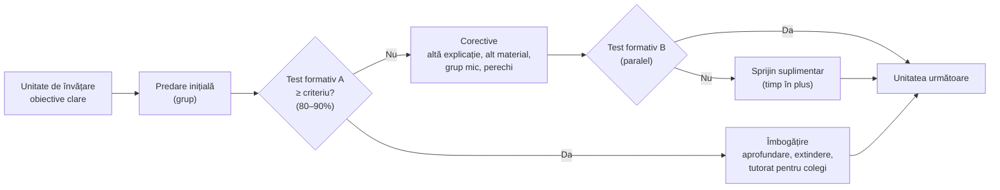

↑ [[00 Index - Analiza comparată internațională]]

> [!abstract] Pe scurt
> 1. **Ideea centrală**: aproape toți elevii pot atinge un nivel înalt de stăpânire dacă **timpul și sprijinul variază**, iar **standardul rămâne constant** — inversul școlii tradiționale, unde timpul e fix și rezultatele variază (distribuția normală).
> 2. Fundamentul teoretic: **modelul învățării școlare al lui John B. Carroll (1963)** — aptitudinea este **timpul necesar** pentru a învăța; gradul de învățare = timpul efectiv petrecut / timpul necesar.
> 3. **Benjamin Bloom** (*Learning for Mastery*, 1968) îl transformă în strategie de clasă: unități scurte → **test formativ** → **corectare** pentru cei sub criteriu (≈ 80–90%) și **îmbogățire** pentru ceilalți → al doilea test. În 1984 formulează **„problema celor 2 sigma”**: tutoratul individual depășește predarea convențională cu ≈ 2 abateri standard.
> 4. Varianta universitară, individualizată: **Personalized System of Instruction** (PSI, **Fred Keller**, 1968). Continuatorul principal al variantei bloomiene: **Thomas Guskey**.
> 5. Dovezi: meta-analize pozitive (**Kulik, Kulik & Bangert-Drowns, 1990**: 108 evaluări, efecte pozitive, mai mari la elevii slabi; **EEF**: ≈ **+5 luni** de progres, +6 la matematică și științe, +3 la citire), dar **mai mici la testele standardizate** și în programele lungi (**Slavin, 1987**). „2 sigma” **nu s-a replicat** la aceeași mărime.
> 6. ***Teaching for mastery*** la matematică (Shanghai, Singapore; exportat în Anglia prin **NCETM** și **Maths Hubs**, din 2014–2016) este o **rudă**, nu o aplicare directă a lui Bloom: clasa avansează **împreună**, cu sprijin în aceeași zi, reprezentări **concret–pictural–abstract** (CPA), **modelul cu bare**, **variație**.
> 7. Extensii contemporane: **platformele adaptive** (Khan Academy, tutori inteligenți), **tutoratul intensiv**, **notarea pe standarde** (*standards-based grading*) și **educația bazată pe competențe**. În R. Moldova, cea mai apropiată aplicare este **evaluarea criterială prin descriptori** în primar (din 2015–2016), fără însă mecanismul corectiv sistematic.

---

## 1. Explicația teoriei

### 1.1 Întrebarea la care răspunde

**De ce eșuează atât de mulți elevi într-o școală care îi tratează pe toți la fel — și ce s-ar întâmpla dacă am schimba variabila fixă?** Bloom a observat că, dacă toți elevii primesc aceeași instruire în același timp, rezultatele finale reproduc aproximativ distribuția normală a aptitudinilor. Dacă instruirea și timpul se **adaptează** fiecărui elev, corelația dintre aptitudine și rezultat ar trebui să scadă spre zero, iar majoritatea elevilor ar atinge nivelul pe care, de obicei, îl ating doar cei mai buni.

### 1.2 Ideile centrale

1. **Aptitudinea ca timp** (Carroll): diferențele dintre elevi țin mai ales de **cât timp** le trebuie, nu de **dacă** pot învăța.
2. **Standard fix, timp și sprijin variabile.**
3. **Obiective clare și criteriu de stăpânire** stabilite dinainte (tipic 80–90% la testul formativ).
4. **Unități scurte, secvențiale**: nu se trece la unitatea următoare fără stăpânirea prealabilelor (erorile se cumulează).
5. **Evaluarea formativă** după fiecare unitate, **fără miză de notare**, ca instrument de diagnostic.
6. **Corectivele** trebuie să fie **diferite** de instruirea inițială (alte explicații, alte materiale, tutorat între colegi, grupuri mici), nu o simplă repetare.
7. **Îmbogățirea** pentru cei care au atins criteriul (aprofundare, nu avans rapid).
8. **Al doilea test paralel** confirmă stăpânirea; notarea finală e **criterială**, nu normativă.
9. **Efecte afective**: succesul repetat crește încrederea și interesul (Bloom, 1976).

### 1.3 Concepte-cheie

| Concept | Definiție |
|---|---|
| **Modelul învățării școlare** (Carroll, 1963) | gradul de învățare = f(timpul efectiv petrecut / timpul necesar); timpul petrecut depinde de **ocazia de a învăța** și de **perseverență**; timpul necesar depinde de **aptitudine**, **calitatea instruirii** și **capacitatea de a înțelege instruirea** |
| ***Learning for Mastery*** (LFM, Bloom, 1968) | strategia de grup condusă de profesor: predare → test formativ → corectare/îmbogățire → al doilea test |
| **Test formativ** | test scurt, nenotat, aliniat cu obiectivele unității, care identifică exact ce nu a fost stăpânit |
| **Corective** | activități alternative pentru elevii sub criteriu: altă explicație, alt material, lucru în perechi, tutorat, exerciții țintite |
| **Îmbogățire** (*enrichment*) | sarcini de extindere pentru elevii care au atins criteriul |
| **Criteriul de stăpânire** | pragul (ex. 80–90%) de la care unitatea e considerată învățată |
| **Problema celor 2 sigma** (Bloom, 1984) | elevul mediu cu tutore individual + mastery a depășit 98% dintre elevii din clasa convențională (≈ +2 abateri standard); mastery learning în grup ≈ +1 abatere standard; provocarea: metode de grup la fel de eficiente |
| **PSI / Planul Keller** (1968) | curs universitar individualizat: materiale scrise pe unități, **ritm propriu**, cerința de „perfecțiune” pe unitate, **proctori** (studenți-tutori), prelegeri doar motivaționale |
| ***Teaching for mastery*** (matematică) | abordare de tip est-asiatic: toată clasa avansează împreună, pași mici, reprezentări și structuri, variație, fluență, gândire matematică, intervenție în aceeași zi |
| **Cele cinci idei mari** (NCETM) | coerență, reprezentare și structură, gândire matematică, fluență, variație |
| **CPA** (concret–pictural–abstract) | secvența de reprezentare derivată din Bruner (enactiv–iconic–simbolic) |
| **Modelul cu bare** (*bar model*) | reprezentarea picturală a relațiilor cantitative în probleme (Singapore, Kho Tek Hong, anii 1980) |
| **Variația** (*bianshi*) | prezentarea sistematică a exemplelor care variază un singur aspect, pentru a evidenția structura conceptuală (tradiția Shanghai, Gu Lingyuan) |
| ***Standards-based grading*** (SBG) | raportarea rezultatelor pe standarde/competențe, pe niveluri de stăpânire, separat de comportament și efort; permite reevaluarea |
| **Educația bazată pe competențe** (CBE) | avansarea pe baza demonstrării stăpânirii, nu a timpului petrecut în clasă |

### 1.4 Ce presupune despre elev, profesor, cunoaștere, școală

| Despre… | Presupoziție |
|---|---|
| **elev** | aproape oricine poate învăța orice conținut școlar dacă primește timp și ajutor potrivit; eșecul inițial nu e un verdict |
| **profesor** | diagnostician și organizator al corectivelor; responsabil de **toți** elevii, nu doar de medie |
| **cunoaștere** | ierarhică și cumulativă: unitățile se sprijină unele pe altele; poate fi descompusă în obiective clare |
| **școală** | instituție care trebuie să elimine sortarea timpurie a elevilor; notarea normativă („pe curbă”) e contraproductivă |

---

## 2. Geneza și evoluția

**Precursori (1920–1960).**
- **Carleton Washburne** (Winnetka, din 1919) — programe individualizate pe abilități de bază, cu teste de diagnostic și materiale autocorective: elevii avansau după stăpânire ([[8.4 Sisteme alternative de organizare a instruirii]]).
- **Henry C. Morrison** (Universitatea din Chicago), *The Practice of Teaching in the Secondary School* (1926) — „formula stăpânirii”: pretest, predare, test, adaptarea procedurii, reluare până la învățarea efectivă.
- **Instruirea programată** (Skinner, anii 1950) — pași mici, feedback imediat, avansare după răspuns corect ([[Behaviorismul și instruirea directă]]).
- **Taxonomia obiectivelor** (Bloom et al., 1956) — obiective clare ca bază pentru teste diagnostice.

**Formularea (1963–1976).**
- **John B. Carroll**, „A Model of School Learning” (*Teachers College Record*, 1963).
- **Benjamin Bloom**, „Learning for Mastery” (*Evaluation Comment*, UCLA, 1968), traduce modelul lui Carroll într-o strategie de grup.
- **Fred S. Keller**, „Good-bye, Teacher...” (*JABA*, 1968), descrie PSI, dezvoltat din 1963–1964 la **Universitatea din Brasília** împreună cu Carolina Bori, Rodolpho Azzi și J. Gilmour Sherman.
- **James Block** (coord.), *Mastery Learning: Theory and Practice* (1971); Bloom, *Human Characteristics and School Learning* (1976) — teoria generală: comportamentele cognitive de intrare, caracteristicile afective de intrare, calitatea instruirii.

**Expansiune și controversă (1975–1995).** Programe la scară: **Chicago Mastery Learning Reading Program** (abandonat în 1985 pe fondul criticilor privind fragmentarea și testarea excesivă), districte din SUA, Coreea de Sud (proiecte experimentale în anii 1970 — de verificat amploarea), experimente în Franța, Belgia (pédagogie de maîtrise; Huberman, 1988) și România. Meta-analize: Kulik, Kulik & Cohen (1979) pentru PSI; **Guskey & Gates** (1986); **Guskey & Pigott** (1988); **Kulik, Kulik & Bangert-Drowns** (1990). Critica sistematică: **Slavin** (1987). Bloom lansează „problema celor 2 sigma” (1984), bazată pe tezele doctoranzilor săi **Joanne Anania** și **Arthur Burke**.

**Eclipsă și reîntoarcere (1995–2014).** Mastery learning ca etichetă pierde vizibilitatea în SUA, dar ideile trăiesc în **evaluarea formativă** (Black & Wiliam, 1998), în **tutorii inteligenți** (Carnegie Learning, ASSISTments), în **Khan Academy** (fondată 2008), în **CBE** (Maine, New Hampshire) și în **notarea pe standarde** (Marzano, Guskey). În paralel, performanța est-asiatică la matematică (TIMSS, PISA) atrage atenția asupra **predării pentru stăpânire** din Shanghai și Singapore.

**Teaching for mastery și era tutoratului (2014–prezent).** Anglia creează **Maths Hubs** (2014) și schimbul de profesori **Anglia–Shanghai**, apoi programul ***Teaching for Mastery*** (2016). Pandemia COVID-19 readuce „2 sigma” în politică prin **tutoratul intensiv** (*high-dosage tutoring*; National Tutoring Programme în Anglia, 2020; ESSER în SUA). Inteligența artificială generativă (ex. Khanmigo, 2023) reactivează promisiunea unui „tutore pentru fiecare elev”.

---

## 3. Autori, reprezentanți, cercetători

| Autor | Lucrare(ări), an | Aportul concret |
|---|---|---|
| **Carleton Washburne** | sistemul Winnetka (din 1919); *Adapting the Schools to Individual Differences* (1925) | progres individual după stăpânire, cu teste diagnostice și materiale autocorective |
| **Henry C. Morrison** | *The Practice of Teaching in the Secondary School* (1926) | formula stăpânirii „pretest–predare–test–adaptare–reluare” |
| **John B. Carroll** | „A Model of School Learning” (*Teachers College Record*, 64, 1963) | aptitudinea ca timp; cele cinci variabile ale învățării școlare |
| **Benjamin S. Bloom** | „Learning for Mastery” (1968); *Human Characteristics and School Learning* (1976); „The 2 Sigma Problem” (*Educational Researcher*, 1984) | strategia LFM; teoria caracteristicilor de intrare; problema celor 2 sigma |
| **Fred S. Keller** | „Good-bye, Teacher...” (*JABA*, 1968) | PSI: ritm propriu, perfecțiune pe unitate, proctori, materiale scrise |
| **James H. Block** | *Mastery Learning: Theory and Practice* (coord., 1971); cu Burns, sinteza din *Review of Research in Education* (1976) | sistematizarea cercetării și a implementării |
| **Lorin W. Anderson** | studii despre timpul de învățare și mastery (anii 1970–1980) | timpul angajat în sarcină ca variabilă mediatoare |
| **Joanne Anania; Arthur Burke** | teze de doctorat, Universitatea din Chicago (1982–1983) | studiile experimentale pe care se sprijină „2 sigma” (tutorat vs. mastery vs. convențional) |
| **Thomas R. Guskey** | *Implementing Mastery Learning* (1985); cu Gates (1986), cu Pigott (1988); „Closing Achievement Gaps: Revisiting Benjamin S. Bloom's *Learning for Mastery*” (*Journal of Advanced Academics*, 2007); *On Your Mark* (2015) | implementarea la clasă; corectivele ca element esențial; legătura cu evaluarea formativă și reforma notării |
| **Chen-Lin Kulik, James Kulik, Robert Bangert-Drowns** | „Effectiveness of Mastery Learning Programs: A Meta-Analysis” (*RER*, 1990); Kulik, Kulik & Cohen (1979) pentru PSI | 108 evaluări controlate: efecte pozitive la examene și atitudini, mai mari la elevii slabi; costul în timp; PSI poate reduce rata de finalizare |
| **Robert E. Slavin** | „Mastery Learning Reconsidered” (*RER*, 1987) | sinteză „best-evidence”: efecte mari doar pe teste construite de experimentator și în studii scurte; efecte aproape nule pe teste standardizate în studii de durată |
| **Kurt VanLehn** | „The Relative Effectiveness of Human Tutoring, Intelligent Tutoring Systems, and Other Tutoring Systems” (*Educational Psychologist*, 2011) | tutoratul uman ≈ 0,79, nu 2,0; tutorii inteligenți pe pași apropiați de tutoratul uman |
| **Andre Nickow, Philip Oreopoulos, Vincent Quan** | meta-analiza tutoratului (NBER, 2020) | efect mediu ≈ 0,37 abateri standard; mai mare pentru tutorat realizat de profesori și paraprofesioniști, în primii ani |
| **Gu Lingyuan** | experimentul Qingpu (Shanghai, anii 1977–1992); teoria variației (*bianshi*) | predarea prin variație și reforma matematicii la Shanghai |
| **Kho Tek Hong** și echipa *Primary Mathematics Project* (CDIS, MOE) | manualele singaporeze (anii 1980) | **modelul cu bare**; CPA; curriculum în spirală cu consolidare |
| **Jerome Bruner; Zoltán Dienes; Richard Skemp** | *Toward a Theory of Instruction* (1966); *Building Up Mathematics* (1960); „Relational Understanding and Instrumental Understanding” (1976) | fundamentele reprezentărilor (CPA), variabilității și înțelegerii relaționale folosite de *teaching for mastery* |
| **Liping Ma** | *Knowing and Teaching Elementary Mathematics* (1999) | „înțelegerea profundă a matematicii fundamentale” a învățătorilor chinezi — argument pentru formarea profesorilor în *teaching for mastery* |
| **Charlie Stripp (NCETM); Helen Drury (Ark, *Mathematics Mastery*)** | NCETM (fondat 2006); Maths Hubs (2014); *Mathematics Mastery* (din 2011) | arhitecții exportului în Anglia |
| **John Jerrim & Anna Vignoles** | evaluarea EEF *Mathematics Mastery* (2015); articol în *Economics of Education Review* | efecte mici: +0,10 (primar), +0,06 (secundar), cumulat ≈ 0,073 |
| **Mark Boylan et al.** (Sheffield Hallam) | evaluarea longitudinală a schimbului Anglia–Shanghai (DfE, 2019) | schimbări importante în practica profesorilor, dovezi limitate de impact la KS2 |
| **Andrew Jaciw et al.** | RCT *Math in Focus* (*JREE*, 2016) | efecte de 0,11–0,15 SD, clasele III–V, SUA |
| **Salman Khan** | Khan Academy (2008); *The One World Schoolhouse* (2012) | platformă gratuită bazată pe stăpânire; promovarea „învățării depline” la scară globală |
| **Robert Marzano; Susan Brookhart** | *Formative Assessment and Standards-Based Grading* (2010); Brookhart et al., „A Century of Grading Research” (*RER*, 2016) | notarea pe standarde; sinteza cercetării despre notare |
| **Critici** | Slavin (1987); Arlin (1984, despre dilema timpului); criticii fragmentării (Chicago); criticii CBE (Maine, după 2012) | dilema „timp vs. conținut”: corectivele încetinesc grupul; efecte supraestimate; fragmentarea învățării |

---

## 4. Legătura cu manualul și cu vaultul

| Unde | Ce spune manualul / conspectul | Evaluare |
|---|---|---|
| [[4.5 Ierarhizarea și clasificarea obiectivelor]] · [[4.2 Problematica și funcțiile finalităților]] · [[Modulul 04 - Finalitățile educației]] | taxonomia lui Bloom (conspectul corectează anul: 1956, nu 1951) | manualul îl prezintă pe Bloom **doar** ca autor de taxonomie; **omite** complet mastery learning, deși taxonomia a fost concepută ca instrument pentru teste și obiective clare |
| [[8.4 Sisteme alternative de organizare a instruirii]] | Dalton, Winnetka, instruirea modulară, tutorială | precursorii individualizării sunt prezenți; lipsește LFM ca sistem de grup |
| [[1.5 Pedagogia în sistemul științelor socioumane]] · [[6.3 Metodele educației]] | instruirea programată (Skinner); feedbackul | legătură indirectă (PSI, instruirea programată) |
| [[10.1 Proiectarea activității educaționale]] · [[Modulul 10 - Proiectarea, realizarea și evaluarea activității educative]] | proiectarea pe obiective, evaluarea | manualul tratează evaluarea mai ales **sumativ**; ciclul „test formativ → corectare → retestare” lipsește |
| [[2.2 Direcțiile modernizării sistemului educațional]] | recompensarea performanțelor, educația de calitate pentru toți | afirmație de principiu fără mecanism; mastery learning oferă mecanismul |
| [[9.3 Personalitatea elevului și comportamentul școlar]] · [[9.4 Factorii dezvoltării personalității și factorii educativi]] | expectanțele profesorului, factorii dezvoltării | Bloom (1976): caracteristicile afective de intrare se modifică prin succes — legătură cu efectul Pygmalion |
| [[5.2 Tipologia paradigmelor educaționale]] | paradigma „tehnologică/rațională” | mastery learning aparține paradigmei tehnologice, dar cu finalitate **egalitaristă** — nuanță absentă din manual |

> [!note] Lacună majoră a manualului
> Manualul tratează **Bloom** doar prin taxonomie. Pentru Bloom însă, taxonomia și **învățarea deplină** erau două fețe ale aceluiași proiect: obiective clare → teste formative → corectare → stăpânire pentru **toți**. Omisiunea privează lectorul de unul dintre cele mai bine studiate mecanisme de reducere a eșecului școlar.

---

## 5. Implementare comparată

| Sistem | Cum a fost implementată (politică / program / instituție) | Când | Scară / intensitate | Dovezi sau rezultate |
|---|---|---|---|---|
| **Singapore** | fără program numit „mastery learning”; principiile în **curriculumul de matematică** (progresie lentă, consolidare, CPA, modelul cu bare, curriculum în spirală); **LSP** — sprijin în grup mic pentru P1–P2 (din 1992); *teaching for mastery* ca **etichetă a exportului** | anii 1980–prezent | **medie** | performanțe de vârf la TIMSS/PISA (multicauzal); RCT *Math in Focus* în SUA: 0,11–0,15 ([[Singapore - ecosistemul educațional]]) |
| **Estonia** | fără program formal; principiul sprijinului timpuriu și al evitării repetenției; clase eterogene, sprijin suplimentar | post-1991 | **redusă** | cea mai mică proporție de elevi sub nivelul 2 din Europa la PISA — asociere, nu dovadă de mecanism ([[Estonia - ecosistemul educațional]]) |
| **Finlanda** | ideea „toți pot învăța” a școlii comprehensive; **sprijinul corectiv timpuriu** pe trei niveluri (general, intensificat, special; 2011), educație specială cu normă parțială; reforma sprijinului (2025) | 1970–prezent | **redusă** (fără LFM formal); **medie** ca principiu | echitate ridicată istoric; creșterea diferențelor intra-școlare în PISA 2025 ([[Finlanda - ecosistemul educațional]]) |
| **Regatul Unit** | Anglia: **NCETM** (2006), **Maths Hubs** (2014), schimbul **Anglia–Shanghai** (2014–), programul ***Teaching for Mastery*** (2016; 41 mil. £ pe 4 ani, țintă inițială ≈ 8.000 de școli primare), manuale de tip singaporez finanțate; *Mathematics Mastery* (Ark); *Multiplication Tables Check* (2022); *National Tutoring Programme* (2020–2024) | 2014–prezent | **centrală** (matematică primar) | EEF: *Mathematics Mastery* +0,10/+0,06; Boylan et al. (2019): impact limitat la KS2; matematica engleză stabilă la PISA în timp ce Scoția și Țara Galilor scad; TIMSS 2023 Year 5: 552 ([[Regatul Unit - ecosistemul educațional]]) |
| **Japonia** | clasa avansează **împreună** (fără grupare pe niveluri), credința culturală în **efort** (Stevenson & Stigler); **Kumon** (1958) ca progresie individuală spre stăpânire; lesson study pentru prevenirea golurilor conceptuale | 1950–prezent | **medie** (cultural, nu programatic) | performanță înaltă și echitabilă în obligatoriu; efectul cauzal al Kumon/juku greu de izolat ([[Japonia - ecosistemul educațional]]) |
| **Coreea de Sud** | „**Zero Plan**” pentru elevii sub nivelul de bază; **Legea garantării competențelor academice de bază** (2021, în vigoare 2022); sprijin remedial; meditațiile ca sistem privat de „recuperare și avansare” | 2008–prezent; 2021 | **redusă–medie** (plasă de siguranță) | proporția elevilor sub nivelul de bază a crescut în anii 2010 (date naționale — de verificat); politica e recentă ([[Coreea de Sud - ecosistemul educațional]]) |
| **Canada** | evaluare criterială și raportare pe niveluri de competență: Ontario *Growing Success* (2010), **British Columbia** — scala de competență (*Emerging, Developing, Proficient, Extending*) pentru K–9 (2023); JUMP Math (pași mici, verificare continuă) | 2010–prezent | **medie** | RCT JUMP Math pozitiv (Solomon et al., 2019); efectele notării pe standarde nu sunt evaluate cauzal ([[Canada - ecosistemul educațional]]) |
| **Europa (UE / Consiliul Europei)** | *pédagogie de maîtrise* în Franța și Elveția francofonă (Huberman, 1988), experimente în Belgia și România (anii 1970–1980); astăzi evaluarea formativă și sprijinul diferențiat în politicile UE împotriva abandonului | anii 1970–1990; 2010– | **redusă** | receptare slabă; ideea supraviețuiește în evaluarea formativă și în sprijinul timpuriu ([[Europa - spațiul european al educației]]) |
| **SUA** | LFM în districte (anii 1970–1980), **Chicago Mastery Learning Reading Program** (abandonat 1985); PSI în universități; **Math in Focus** (adaptare americană a manualelor singaporeze); **Khan Academy** (2008) și tutori inteligenți (Carnegie Learning, ASSISTments); **CBE** (Maine 2012 — diploma bazată pe competențe, abrogată în 2018; New Hampshire); **notarea pe standarde**; tutorat intensiv post-COVID | 1968–prezent | **medie** | Kulik et al. (1990); Pane et al. (RAND, 2014): *Cognitive Tutor Algebra* ≈ +0,2 în anul al doilea; Roschelle et al. (2016): ASSISTments ≈ +0,18; Nickow et al. (2020): tutorat ≈ +0,37 ([[SUA - ecosistemul educațional]]) |
| **Republica Moldova** | **evaluarea criterială prin descriptori** (ECD) în primar: clasa I din 2015, obligatorie în primar din 1 septembrie 2016 (metodologii MECC, revizuite 2017–2019); curriculum pe competențe; fără program de corectare sistematică sau criteriu de stăpânire între unități; meditații private ca remediere de facto | 2015–prezent | **redusă** | lipsesc evaluări de impact ale ECD; dezbateri publice privind încărcarea profesorilor și claritatea descriptorilor — vezi [[8.3 Sistemul de învățământ din Republica Moldova]] |

### 5.1 Studiu de caz: SUA — de la Bloom la platformele adaptive

Mastery learning s-a născut la **Universitatea din Chicago** (Carroll era la Harvard, Bloom la Chicago), iar anii 1970–1980 au adus un val de programe districtuale. Cazul-limită este **Chicago Mastery Learning Reading Program**: sute de unități scurte, teste formative dese, corective — criticat de profesori și părinți pentru **fragmentarea** citirii în microabilități și pentru volumul de testare, abandonat în 1985. Lecția: mastery learning aplicat unei abilități **holistice** (citirea înțelegerii) prin atomizare excesivă produce ritualuri de testare, nu stăpânire.

A doua viață a ideii a venit prin **tehnologie**. Tutorii inteligenți (Carnegie Learning *Cognitive Tutor*) folosesc „urmărirea cunoașterii” (*knowledge tracing*) pentru a decide când o abilitate e stăpânită; RCT-ul RAND (Pane et al., 2014) a găsit efect nul în primul an și ≈ +0,2 în al doilea an la liceu — **implementarea cere timp**. ASSISTments (Maine, Roschelle et al., 2016) a obținut ≈ +0,18 cu feedback la teme. **Khan Academy** (2008) a popularizat mastery learning la scară globală, dar dovezile sale de eficacitate sunt în majoritate **corelaționale** (elevii care o folosesc mai mult progresează mai mult — efect de selecție posibil). Pandemia a mutat accentul pe **tutorat intensiv**, cea mai apropiată aplicare a „2 sigma” (Nickow et al., 2020: ≈ +0,37). Paralel, **CBE** a avut un eșec instructiv în Maine (diplomă bazată pe competențe legiferată în 2012, abrogată în 2018 după probleme de implementare și rezistență). Vezi [[SUA - ecosistemul educațional]] și [[Constructionismul și educația digitală]].

### 5.2 Studiu de caz: Shanghai și Singapore — stăpânire fără etichetă

În **Shanghai**, „stăpânirea” nu e un program, ci un **ecosistem**: curriculum coerent, manuale unice pe district, profesori specializați la matematică încă din primar, **grupuri de cercetare didactică** (*jiaoyanzu*) care pregătesc lecțiile împreună, lecții de 35–40 de minute urmate de exersare, **intervenție în aceeași zi** pentru elevii care nu au înțeles, **variația** sistematică a exemplelor (experimentul Qingpu, Gu Lingyuan). Clasa avansează **împreună**: diferențierea se face prin sprijin și aprofundare, nu prin grupe de nivel.

În **Singapore**, echipa *Primary Mathematics Project* (anii 1980, Kho Tek Hong) a construit manuale pe secvența **concret–pictural–abstract** și pe **modelul cu bare**, cu puține teme tratate în profunzime și consolidare, influențate (conform surselor secundare) de Bruner, Dienes, Skemp și Pólya. Cadrul din 1990 („pentagonul”) a pus rezolvarea problemelor și metacogniția în centru. **LSP** (1992) oferă sprijin intensiv în grup mic în P1–P2, adică acolo unde golurile se formează. Critici comune: performanța nu poate fi atribuită doar metodei — contează **formarea profesorilor**, **coerența manual–program–examen** și **meditațiile** private; calendarul examenelor limitează răbdarea față de ritmurile diferite. Vezi [[Singapore - ecosistemul educațional]].

### 5.3 Studiu de caz: Anglia — NCETM, Maths Hubs și exportul „mastery”

În 2014, DfE a creat rețeaua **Maths Hubs** (coordonată de NCETM) și a lansat **schimbul de profesori Anglia–Shanghai**: profesori englezi au observat lecții la Shanghai, profesori din Shanghai au predat în școli engleze. Din 2016, programul ***Teaching for Mastery*** (41 mil. £ pe patru ani, țintă inițială ≈ 8.000 de școli primare) a format „profesori specialiști în mastery” și grupuri de lucru locale; DfE a cofinanțat manuale de tip singaporez (*Maths — No Problem!*). NCETM a formulat **cele cinci idei mari**: coerență, reprezentare și structură, gândire matematică, fluență, variație. În paralel, rețeaua Ark a dezvoltat ***Mathematics Mastery*** (din 2011).

Dovezile sunt **modeste**: EEF (Jerrim & Vignoles, 2015) — +0,10 în primar, +0,06 în secundar, fiecare nesemnificativ separat, cumulat ≈ 0,073, semnificativ la limită, dar ieftin; evaluarea longitudinală a schimbului (Boylan et al., 2019) — schimbări importante de practică, **impact limitat** asupra rezultatelor KS2. La nivel de sistem, matematica engleză a rămas stabilă la PISA în timp ce Scoția și Țara Galilor au scăzut — **compatibil** cu un efect, nu o dovadă. *Curriculum and Assessment Review* (2025) subliniază că *teaching for mastery* englez este de inspirație **est-asiatică**, nu bloomiană. Critici: transferul cultural parțial (fără timpul colectiv de pregătire al *jiaoyanzu*), decalajul de gen crescut. Vezi [[Regatul Unit - ecosistemul educațional]].

### 5.4 Studiu de caz: Republica Moldova — evaluarea criterială fără ciclul corectiv

Din 2015 (clasa I) și obligatoriu din 1 septembrie 2016 în întregul primar, R. Moldova a înlocuit notele cu **evaluarea criterială prin descriptori** (ECD): calificative (foarte bine, bine, suficient) raportate la descriptori de performanță, cu accent declarat pe evaluarea formativă. Ca arhitectură, ECD se apropie de **notarea pe standarde**: rezultatul e raportat la criterii, nu la ceilalți elevi. Îi lipsesc însă componentele care fac mastery learning eficient: **unități scurte cu criteriu de stăpânire**, **corective diferite** de predarea inițială, **timp suplimentar** organizat și **retestare**. Fără acestea, evaluarea criterială riscă să devină doar o altă scală de clasificare.

Comparativ, Anglia (Maths Hubs), Singapore (LSP) și Coreea (legea competențelor de bază, 2021) au construit **mecanisme de sprijin**, nu doar de raportare. Recomandarea pentru Moldova este de a lega ECD de un **ciclu formativ–corectiv** la matematică și citire în clasele I–IV, cu materiale pregătite central și timp dedicat în orar. Vezi [[8.3 Sistemul de învățământ din Republica Moldova]] și [[Evaluarea formativă]].

---

## 6. Dovezi empirice și critici

**Studii și meta-analize-cheie.**
- **Bloom (1984)**, pe baza lui Anania (1982) și Burke (1983): tutorat + mastery ≈ +2 SD; mastery în grup ≈ +1 SD față de clasa convențională. **Limite**: studii scurte (câteva săptămâni), teste aliniate strâns cu unitățile, eșantioane mici. **Nu s-a replicat** la această mărime.
- **Kulik, Kulik & Cohen (1979)**: PSI în universități — efecte pozitive consistente asupra examenelor finale.
- **Guskey & Pigott (1988)**: sinteză a studiilor LFM în școli — efecte pozitive, variabile după disciplină și nivel.
- **Kulik, Kulik & Bangert-Drowns (1990)**: 108 evaluări controlate; efecte pozitive la examene în facultăți, licee și clasele mari din primar; **mai mari pentru elevii slabi**; efecte pozitive asupra atitudinilor; mai mult timp petrecut în sarcină; programele cu ritm propriu reduc adesea rata de finalizare. Efect mediu raportat în literatura secundară ≈ 0,5 SD (valoarea exactă — de verificat în articol).
- **Slavin (1987)**: în studiile de cel puțin patru săptămâni cu teste standardizate, efectul LFM de grup e **aproape nul**; efectele mari apar pe teste construite de experimentator.
- **EEF Teaching and Learning Toolkit** (mastery learning): ≈ **+5 luni** de progres pe an; **+6 luni** la matematică și științe, **+3 luni** la citire; pragul ≈ **80%** asociat cu abordări mai reușite; impactul **scade** în programele mai lungi de ≈ 12 săptămâni; elevii cu rezultate scăzute pot câștiga cu 1–2 luni mai mult.
- **Hattie** (2009): mastery learning ≈ 0,58 (de verificat în edițiile ulterioare).
- **VanLehn (2011)**: tutoratul uman ≈ 0,79; tutorii inteligenți pe pași ≈ 0,76 — mult sub „2 sigma”, dar substanțiale.
- **Nickow, Oreopoulos & Quan (2020)**: tutoratul ≈ +0,37 SD în medie.
- ***Teaching for mastery***: EEF *Mathematics Mastery* (+0,10 / +0,06); RCT *Math in Focus* (0,11–0,15); Boylan et al. (2019), impact limitat.
- **Notarea pe standarde**: sinteza lui Brookhart et al. (2016) arată că notele tradiționale amestecă achiziții, efort și comportament; dovezile cauzale despre SBG sunt **puține** (majoritar studii descriptive și corelaționale).

**Critici.**
- **Dilema timp–conținut** (Arlin, 1984): dacă grupul așteaptă corectivele, elevii rapizi pierd timp; dacă nu, cei lenți rămân în urmă. În practică, programele **reduc conținutul acoperit**.
- **Fragmentare**: unitățile scurte pot atomiza abilități holistice (citirea; cazul Chicago).
- **Supraestimare**: efectele mari provin din studii scurte și teste aliniate (Slavin).
- **Costul profesorului**: pregătirea testelor paralele și a corectivelor e laborioasă (motivul principal al abandonului).
- **Ritm propriu și abandon**: PSI/CBE pot mări procrastinarea și abandonul fără structură.
- **Transfer cultural**: *teaching for mastery* depinde de manuale coerente, formare profundă și timp colectiv de pregătire; importat parțial, dă efecte mici.

> [!warning] Condiții în care funcționează / nu funcționează
> - **Funcționează**: conținut **cumulativ și ierarhic** (matematică, științe, limbi — nivel elementar), unități **scurte**, criteriu ≈ 80%, **corective diferite** de predarea inițială, teste formative bine aliniate, sprijin intensiv pentru elevii slabi, implementare de durată moderată.
> - **Funcționează slab**: abilități holistice atomizate; corective care doar repetă explicația; ritm complet individual fără termene; lipsa timpului în orar; profesori fără materiale pregătite.
> - **„2 sigma” este o țintă euristică**, nu un rezultat robust; realist, tutoratul bine făcut aduce ≈ 0,3–0,8 SD.
> - **Etichetele înșală**: *teaching for mastery* englez ≠ LFM al lui Bloom ≠ „mastery” din platformele digitale.
> - Valorile exacte din Kulik et al. (1990) și Hattie, precum și datele coreene despre nivelul de bază, rămân de verificat.

---

## 7. Implicații practice

> [!tip] Pentru profesor la clasă
> - **Ciclul minim** la fiecare unitate de 1–2 săptămâni: obiective clare → predare → **test formativ scurt** (5–10 itemi, nenotat) → **corective** pentru cei sub ≈ 80% (altă explicație, reprezentare CPA, lucru în perechi cu un coleg care a stăpânit) și **îmbogățire** pentru ceilalți → **retestare** paralelă.
> - **Corectați în aceeași zi** când e posibil (modelul Shanghai): 10–15 minute cu grupul care a greșit, înainte ca golul să se cimenteze.
> - **CPA la matematică**: obiecte (bețișoare, cuburi) → desene și modelul cu bare → simboluri; nu săriți direct la algoritm.
> - **Variație**: construiți seturi de exemple în care se schimbă un singur element, ca elevii să vadă structura.
> - **Separați notarea achizițiilor de comportament și efort**; permiteți reevaluarea după corectare — mesajul este „încă nu”, nu „nu poți”.

> [!tip] Pentru politica educațională din R. Moldova
> 1. **Completați ECD cu ciclul corectiv**: ghiduri și bănci de teste formative + fișe corective pe unități, la matematică și limba română, clasele I–IV; timp dedicat în orar (ex. o oră săptămânal de consolidare/recuperare).
> 2. **Pilot „teaching for mastery” la matematică** în primar, cu manuale coerente CPA, formare profundă a învățătorilor și grupuri metodice care pregătesc lecții împreună (echivalent *jiaoyanzu*/lesson study); evaluare cu grup de comparație (lecția EEF: formare, nu doar manuale).
> 3. **Plasă de siguranță legală** de tip coreean: identificarea timpurie a elevilor sub nivelul de bază și sprijin obligatoriu, gratuit (reduce dependența de meditații private și inechitatea rural–urban).
> 4. **Tutorat în grupuri mici** pentru elevii rămași în urmă, cu studenți de la universitățile pedagogice ca tutori formați și supervizați (efecte ≈ 0,3 SD în meta-analize).
> 5. **Platforme digitale adaptive** doar ca **complement**, cu evaluare de impact; dovezile cauzale sunt mai slabe decât promisiunile.

---

## 8. Legături cu alte teorii din catalog

- [[Evaluarea formativă]] — Bloom a introdus termenul „evaluare formativă” în instruire; mastery learning este un sistem formativ–corectiv complet, iar Black & Wiliam au generalizat ideea.
- [[Taxonomiile obiectivelor și educația centrată pe competențe]] — taxonomia și LFM sunt proiectul unic al lui Bloom; CBE și ECD moștenesc logica „stăpânirii” competențelor.
- [[Behaviorismul și instruirea directă]] — Keller (PSI) e behaviorist; pașii mici și feedbackul imediat vin din instruirea programată; DI cere stăpânire înainte de avansare.
- Diferențierea, inteligențele multiple și designul universal — mastery learning diferențiază **timpul și sprijinul**, nu obiectivele; alternativă la gruparea pe niveluri.
- [[Echitatea și școala comprehensivă]] — premisa că aproape toți pot învăța susține clasa eterogenă și reducerea sortării timpurii.
- [[Știința cognitivă a învățării]] — explică de ce golurile se cumulează (cunoștințe prealabile), de ce funcționează recuperarea și de ce contează reprezentările (CPA).
- [[Constructivismul cognitiv (Piaget, Bruner)]] — CPA și curriculumul în spirală din *teaching for mastery* provin din Bruner.
- [[Constructionismul și educația digitală]] — platformele adaptive și tutorii inteligenți sunt versiunea tehnologică a LFM.
- [[Învățarea autoreglată, metacogniția și autoeducația]] — PSI și CBE cer autoreglare; fără ea, ritmul propriu duce la abandon.
- Educația bazată pe dovezi — cazul „2 sigma” arată cum un rezultat spectaculos din studii mici devine mit de politică.

---

## 9. Întrebări de reflecție

1. Carroll definește aptitudinea ca **timp necesar**. Ce consecințe are această definiție pentru notare, repetenție și grupare pe niveluri?
2. De ce corectivele trebuie să fie **diferite** de predarea inițială? Proiectați trei tipuri de corective pentru o unitate din disciplina voastră.
3. Comparați LFM (Bloom) cu *teaching for mastery* (Shanghai/NCETM). Ce au în comun și unde diferă (ritm individual vs. clasa împreună)?
4. De ce efectul „2 sigma” nu s-a replicat? Ce spune diferența dintre testele construite de experimentator și testele standardizate despre măsurarea impactului?
5. Evaluarea criterială prin descriptori din R. Moldova este o formă de mastery learning? Ce i-ar lipsi pentru a deveni una?
6. Cum ar putea fi rezolvată „dilema timp–conținut” într-o clasă de 30 de elevi cu o programă încărcată?

---

## 10. Surse

**Fundamente**
- Washburne, C. W. (1922). Educational measurements as a key to individualizing instruction and promotions. *Journal of Educational Research*, 5, 195–206.
- Morrison, H. C. (1926). *The Practice of Teaching in the Secondary School*. Chicago: University of Chicago Press.
- Carroll, J. B. (1963). A Model of School Learning. *Teachers College Record*, 64(8), 723–733.
- Bloom, B. S. (1968). Learning for Mastery. *Evaluation Comment*, 1(2). Los Angeles: UCLA CSEIP.
- Bloom, B. S. (1976). *Human Characteristics and School Learning*. New York: McGraw-Hill.
- Bloom, B. S. (1984). The 2 Sigma Problem: The Search for Methods of Group Instruction as Effective as One-to-One Tutoring. *Educational Researcher*, 13(6), 4–16.
- Keller, F. S. (1968). „Good-bye, Teacher...”. *Journal of Applied Behavior Analysis*, 1(1), 79–89.
- Block, J. H. (coord.) (1971). *Mastery Learning: Theory and Practice*. New York: Holt, Rinehart & Winston.
- Guskey, T. R. (1985). *Implementing Mastery Learning*. Belmont, CA: Wadsworth.
- Guskey, T. R. (2007). Closing Achievement Gaps: Revisiting Benjamin S. Bloom's „Learning for Mastery”. *Journal of Advanced Academics*, 19(1), 8–31.
- Huberman, M. (coord.) (1988). *Assurer la réussite des apprentissages scolaires? Les propositions de la pédagogie de maîtrise*. Neuchâtel: Delachaux & Niestlé.

**Meta-analize și evaluări**
- Kulik, J. A., Kulik, C.-L. C., Cohen, P. A. (1979). A meta-analysis of outcome studies of Keller's personalized system of instruction. *American Psychologist*, 34(4), 307–318.
- Guskey, T. R., Gates, S. L. (1986). Synthesis of research on the effects of mastery learning in elementary and secondary classrooms. *Educational Leadership*, 43(8), 73–80.
- Guskey, T. R., Pigott, T. D. (1988). Research on group-based mastery learning programs: A meta-analysis. *Journal of Educational Research*, 81(4), 197–216.
- Slavin, R. E. (1987). Mastery Learning Reconsidered. *Review of Educational Research*, 57(2), 175–213.
- Kulik, C.-L. C., Kulik, J. A., Bangert-Drowns, R. L. (1990). Effectiveness of Mastery Learning Programs: A Meta-Analysis. *Review of Educational Research*, 60(2), 265–299. https://doi.org/10.3102/00346543060002265
- Arlin, M. (1984). Time, equality, and mastery learning. *Review of Educational Research*, 54(1), 65–86.
- VanLehn, K. (2011). The Relative Effectiveness of Human Tutoring, Intelligent Tutoring Systems, and Other Tutoring Systems. *Educational Psychologist*, 46(4), 197–221.
- Nickow, A., Oreopoulos, P., Quan, V. (2020). *The Impressive Effects of Tutoring on PreK-12 Learning* (NBER Working Paper 27476).
- Education Endowment Foundation. *Teaching and Learning Toolkit: Mastery learning* (și anexa tehnică). https://educationendowmentfoundation.org.uk/education-evidence/teaching-learning-toolkit/mastery-learning
- Hattie, J. (2009). *Visible Learning*. London: Routledge.
- Pane, J. F., Griffin, B. A., McCaffrey, D. F., Karam, R. (2014). Effectiveness of Cognitive Tutor Algebra I at Scale. *Educational Evaluation and Policy Analysis*, 36(2), 127–144.
- Roschelle, J., Feng, M., Murphy, R. F., Mason, C. A. (2016). Online Mathematics Homework Increases Student Achievement. *AERA Open*, 2(4).
- Brookhart, S. M. et al. (2016). A Century of Grading Research. *Review of Educational Research*, 86(4), 803–848.

**Teaching for mastery**
- Ma, L. (1999). *Knowing and Teaching Elementary Mathematics*. Mahwah, NJ: Lawrence Erlbaum.
- Skemp, R. R. (1976). Relational Understanding and Instrumental Understanding. *Mathematics Teaching*, 77, 20–26.
- Bruner, J. S. (1966). *Toward a Theory of Instruction*. Cambridge, MA: Harvard University Press.
- NCETM (2017). *The Essence of Maths Teaching for Mastery* / *Five Big Ideas in Teaching for Mastery*. https://www.ncetm.org.uk/teaching-for-mastery/
- Jerrim, J., Vignoles, A. (2015). *Mathematics Mastery: Overarching Summary Report*. London: EEF. https://files.eric.ed.gov/fulltext/ED581180.pdf
- Boylan, M., Wolstenholme, C., Demack, S., Maxwell, B., Jay, T., Adams, G., Reaney, S. (2019). *Longitudinal Evaluation of the Mathematics Teacher Exchange: China–England. Final Report*. London: DfE.
- Jaciw, A. P., Hegseth, W. M., Lin, L., Toby, M., Newman, D., Ma, B., Zacamy, J. (2016). Assessing Impacts of Math in Focus, a „Singapore Math” Program. *Journal of Research on Educational Effectiveness*, 9(4), 473–502.
- Khan, S. (2012). *The One World Schoolhouse: Education Reimagined*. New York: Twelve.
- Marzano, R. J. (2010). *Formative Assessment and Standards-Based Grading*. Bloomington, IN: Marzano Research.
- Guskey, T. R. (2015). *On Your Mark: Challenging the Conventions of Grading and Reporting*. Bloomington, IN: Solution Tree.

**R. Moldova**
- Ministerul Educației al RM (2015). *Metodologia privind implementarea evaluării criteriale prin descriptori. Clasa I* (Ordinul nr. 862 din 07.09.2015; ed. a II-a 2017). https://www.edu.gov.md/sites/default/files/metodologia_privind_implementarea_evaluarii_criteriale_prin_descriptori._clasele_i-ii.pdf
- Ministerul Educației, Culturii și Cercetării al RM (2019). *Metodologia privind evaluarea criterială prin descriptori în clasele I–IV*. https://mecc.gov.md/sites/default/files/mecd_1-4_15.11.2019_site.pdf
- Notele de țară din vault: [[Regatul Unit - ecosistemul educațional]], [[Singapore - ecosistemul educațional]], [[SUA - ecosistemul educațional]], [[Coreea de Sud - ecosistemul educațional]], [[Japonia - ecosistemul educațional]], [[Canada - ecosistemul educațional]].
