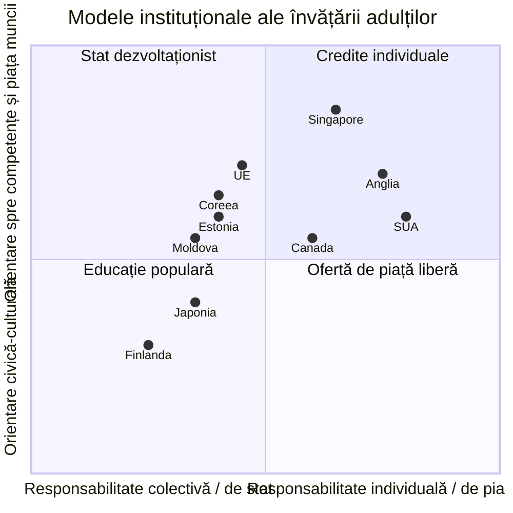

↑ [[00 Index - Analiza comparată internațională]]

> [!info] Cum se folosește acest card
> Teoria formelor educației și a educației permanente este tratată pe larg în conspectele manualului: [[3.1 Formele generale ale educației - delimitări conceptuale]] (triada formal–nonformal–informal, Coombs, definițiile din Codul Educației), [[3.5 Relația dintre formele educației]] (complementaritate, matricea Mocker & Spear, La Belle, Colley) și [[3.6 Educația permanentă și autoeducația]] (Lengrand, Faure, Dave, Delors, Knowles, Biesta, art. 123–127 din Cod). **Cardul de față nu le repetă**: rezumă nucleul teoretic în §1–3 și se concentrează pe **implementarea comparată** (§5) și pe dovezi (§6).

> [!abstract] Pe scurt
> - **Învățarea pe tot parcursul vieții** (*lifelong learning*, LLL) a trecut de la un **proiect umanist UNESCO** (educația permanentă, anii 1960–1970) la o **politică economică OCDE–UE** (competențe, angajabilitate, anii 1990–2020). Trecerea „de la educație la învățare” a mutat responsabilitatea spre individ.
> - Țările au construit **patru modele instituționale** diferite: **educația populară nordică** (Finlanda), **legea și agenția de stat** (Coreea, Japonia), **conturile și creditele individuale** (Singapore, Franța, Anglia), **colegiile comunitare** (SUA, Canada).
> - Instrumentul central care leagă formele educației este **validarea învățării nonformale și informale** (Recomandarea UE, 2012; ACBS în Coreea; Ordinul 885/2022 în R. Moldova).
> - **PIAAC 2023** arată rezultatele: **Finlanda** (locul 1) și **Japonia** (locul 2) au adulții cei mai competenți; **Coreea** și **Singapore**, campioni PISA la 15 ani, au adulți **la sau sub media OCDE**. Competențele de la școală **nu se păstrează automat**.
> - Constanta universală a dovezilor: **efectul Matei** — învață cel mai mult cei care au deja cea mai multă educație. Creditele individuale, fără țintire, tind să amplifice inegalitatea.
> - **R. Moldova** are un cadru legal modern (Codul Educației, Titlul VII; regulamentul de certificare a competențelor profesionale, 2022), dar **participare scăzută**, **nicio măsurare PIAAC** și o provocare specifică: **recunoașterea competențelor migranților** care revin.

---

## 1. Explicația teoriei (sinteză)

### 1.1 Întrebarea la care răspunde

*Cum trebuie organizată educația într-o lume în care cunoașterea se schimbă mai repede decât durata unei cariere și în care cea mai mare parte a învățării are loc în afara școlii?* Pentru politica comparată, întrebarea devine: *ce instituții, drepturi și stimulente fac posibilă învățarea adulților pentru toți, nu doar pentru cei deja educați?*

### 1.2 Nucleul teoretic (pe scurt, cu trimiteri)

1. **Integrarea verticală și orizontală** a formelor educației pe toată durata vieții (Lengrand, Dave) → detaliat în [[3.6 Educația permanentă și autoeducația]], §9.
2. **Triada formal / nonformal / informal** (Coombs, 1968–1974), azi înțeleasă ca **continuum** (La Belle, 1982; Colley et al., 2003) → [[3.1 Formele generale ale educației - delimitări conceptuale]] și [[3.5 Relația dintre formele educației]].
3. ***Lifelong* și *lifewide***: pe axa timpului și pe axa contextelor (Memorandumul UE, 2000).
4. **Educația recurentă** (OCDE/CERI, 1973): alternarea studiului cu munca, cu drept la reîntoarcere în educație.
5. **Andragogia** (Knowles): adultul învață autodirijat, pornind din experiență și probleme reale.
6. **Societatea învățării** (Jarvis) și **critica „învățificării”** (Biesta; Field): LLL ca obligație individuală de adaptare economică.

### 1.3 Concepte-cheie pentru analiza comparată

| Concept | Definiție operațională |
|---|---|
| **Educația adulților** (*adult learning and education*, ALE) | toate formele de educație pentru adulți: alfabetizare, educație generală, formare profesională continuă, educație civică și culturală (UNESCO, RALE 2015) |
| **Formare profesională continuă** (*continuing vocational training*) | formare după intrarea pe piața muncii, adesea finanțată de angajator |
| **Rata de participare a adulților** | procentul adulților (25–64 de ani) care au participat la învățare formală sau nonformală în ultimele 12 luni (Adult Education Survey) sau în ultimele 4 săptămâni (Labour Force Survey) |
| **Validare** (*validation / RPL — recognition of prior learning*) | identificarea, documentarea, evaluarea și certificarea rezultatelor învățării dobândite în afara educației formale |
| **Cadru național al calificărilor** (NQF) | clasificare a calificărilor pe niveluri definite prin rezultate ale învățării, legată de EQF |
| **Cont individual de învățare** (*individual learning account*, ILA) | drept de formare cu valoare monetară sau în ore, atașat persoanei, portabil |
| **Micro-certificat** (*micro-credential*) | atestarea unei unități mici de învățare, evaluată după standarde transparente |
| **Bancă de credite** | sistem de acumulare a creditelor din surse diverse până la o diplomă (ACBS, Coreea) |
| **Efectul Matei** | participarea la învățare crește odată cu nivelul educației inițiale, al calificării și al veniturilor |
| **PIAAC** | *Survey of Adult Skills* (OCDE): literație, numerație, rezolvare de probleme la adulții de 16–65 de ani; ciclul 1 (2011–2017), ciclul 2 (2022–2023, publicat în decembrie 2024) |
| **Educație populară** (*folkbildning*, *vapaa sivistystyö*) | educație liberă pentru adulți, fără examene obligatorii, tradiție grundtvigiană nordică |
| **Educație socială** (*shakai kyōiku*) | educația comunitară pentru adulți și tineri din afara școlii, instituționalizată prin *kōminkan* (Japonia) |

### 1.4 Ce presupune abordarea despre actorii educației

| Actor | Educația permanentă (UNESCO, anii 1970) | Lifelong learning (OCDE–UE, după 1990) |
|---|---|---|
| **Cel care învață** | om complet, cetățean, „a învăța să fii” | antreprenor al propriilor competențe, responsabil de angajabilitate |
| **Profesorul / formatorul** | animator al comunității educative | facilitator, evaluator, consilier de carieră |
| **Cunoașterea** | culturală, civică, emancipatoare | competențe certificabile, relevante pentru piața muncii |
| **Școala** | una dintre instituțiile „cetății educative” | punct de plecare al unui parcurs modular și portabil |
| **Statul** | garant al dreptului la educație pentru toți | reglementator al pieței de formare, co-finanțator, validator |

*Poziționarea în diagramă este o **interpretare** a autorului cardului, pe baza notelor de țară, nu un indicator măsurat.*

---

## 2. Geneza și evoluția (cronologie orientată spre politici)

| Perioadă | Etapă | Repere de politică |
|---|---|---|
| sec. XIX – 1945 | **Precursori instituționali** | liceele populare daneze (Grundtvig, Rødding, 1844); primul liceu popular finlandez (1889); *Workers' Educational Association* (1903); raportul britanic despre educația adulților (1919); *kōminkan* (Japonia, 1946) |
| 1949–1972 | **UNESCO: educația adulților → educația permanentă** | **CONFINTEA I** (Elsinore, 1949); II (Montréal, 1960); raportul Lengrand (1965); **CONFINTEA III** (Tokyo, 1972); **Raportul Faure** (1972) |
| 1973–1990 | **OCDE: educația recurentă** | *Recurrent Education: A Strategy for Lifelong Learning* (CERI, 1973); Dave, *Foundations of Lifelong Education* (1976); Recomandarea UNESCO privind dezvoltarea educației adulților (Nairobi, 1976); CONFINTEA IV (Paris, 1985); Coreea: Legea educației sociale (1982); Japonia: Legea promovării învățării pe tot parcursul vieții (1990) |
| 1990–2000 | **Cotitura „învățării”** | Anul european al învățării pe tot parcursul vieții (1996); **Raportul Delors** (1996); OCDE, *Lifelong Learning for All* (1996); **CONFINTEA V** (Hamburg, 1997); Coreea: ACBS (1998) și *Lifelong Education Act* (1999); **Memorandumul UE** (2000) |
| 2000–2015 | **Instrumente de sistem** | Rezoluția Consiliului UE (2002); EQF (2008); **CONFINTEA VI** (Belém, 2009); PIAAC ciclul 1 (2011–2017); **Recomandarea UE privind validarea** (2012); strategia LLL a Estoniei (2014); Singapore: SkillsFuture (2015); Recomandarea UNESCO privind învățarea și educația adulților (**RALE**, 2015); ODD 4 (2015) |
| 2016–2026 | **Recalificare, credite, micro-certificate** | *Upskilling Pathways* (2016); Franța: *Compte personnel de formation* monetizat (2019); planul de acțiune pentru Pilonul social european: **60% dintre adulți în formare anual până în 2030** (2021); Recomandările UE privind **conturile individuale de învățare** și **micro-certificatele** (2022); **CONFINTEA VII** (Marrakech, 2022); R. Moldova: **Ordinul 885/2022**; PIAAC ciclul 2 (2024); Finlanda: abolirea alocației pentru educația adulților (2024); Anglia: ***Lifelong Learning Entitlement*** (cursuri din ianuarie 2027) |

---

## 3. Autori, reprezentanți, cercetători

> [!note] Autorii clasici (Lengrand, Faure, Dave, Delors, Coombs, Knowles, Jarvis, Field, Biesta, Houle, Tough, Candy) sunt prezentați în detaliu în [[3.6 Educația permanentă și autoeducația]], §9–10. Tabelul de mai jos îi rezumă și adaugă cercetătorii **politicilor comparate**.

| Autor / instituție | Lucrare(ări), an | Aportul concret |
|---|---|---|
| **Philip H. Coombs** (cu Manzoor Ahmed) | *The World Educational Crisis* (1968); *Attacking Rural Poverty* (1974) | triada formal / nonformal / informal ca instrument de planificare a educației în țările în dezvoltare |
| **Paul Lengrand** | raportul UNESCO din 1965; *Introduction à l'éducation permanente* (1970) | educația permanentă ca principiu de reorganizare a sistemelor |
| **Edgar Faure et al.** (UNESCO) | *Learning to Be* (1972) | educația permanentă ca „principiu director”; „cetatea educativă” |
| **Ravindra H. Dave** (UIE Hamburg) | *Foundations of Lifelong Education* (1976) | caracteristicile și condițiile educației permanente (oportunitate, motivație, educabilitate) |
| **Jacques Delors et al.** (UNESCO) | *Learning: The Treasure Within* (1996) | cei patru piloni; LLL ca „cheie de acces în secolul XXI” |
| **OCDE / CERI** | *Recurrent Education* (1973); *Lifelong Learning for All* (1996); PIAAC (2013, 2024) | educația recurentă; LLL ca strategie economică; măsurarea comparativă a competențelor adulților |
| **Comisia Europeană** | *Memorandum on Lifelong Learning* (2000) | șase mesaje-cheie; definițiile formal/nonformal/informal preluate în legislațiile naționale (inclusiv Codul Educației al R. Moldova, art. 123) |
| **UNESCO Institute for Lifelong Learning** (UIL, Hamburg; fost UIE, 1952; redenumit 2006) | rapoartele **GRALE** (*Global Report on Adult Learning and Education*, 2009–2022); Marrakech Framework for Action (2022) | monitorizarea globală a educației adulților; baza de date a politicilor LLL; ghiduri de validare |
| **Malcolm Knowles** | *The Modern Practice of Adult Education* (1970); *The Adult Learner* (1973) | andragogia; contractul de învățare; baza didactică a educației adulților din SUA |
| **Peter Jarvis** | *Adult Learning in the Social Context* (1987); trilogia *Lifelong Learning and the Learning Society* (2006–2008) | învățarea ca proces existențial și social; critica societății învățării ca piață |
| **John Field** | *Lifelong Learning and the New Educational Order* (2000) | analiza trecerii de la „educație” la „învățare” în politici; noile inegalități |
| **Gert Biesta** | „What's the point of lifelong learning if lifelong learning has no point?”, *European Educational Research Journal*, 5(3–4) (2006) | critica **„învățificării”**: LLL redus la adaptare economică, fără întrebarea „pentru ce?” |
| **Kjell Rubenson** | modelul „recunoașterii și așteptărilor”; *Adult Learning and Education* (2011) | explicarea participării inegale; rolul statului bunăstării nordic în reducerea efectului Matei |
| **Ellen Boeren** | *Lifelong Learning Participation in a Changing Policy Context* (2016) | modelul participării pe trei niveluri (individ, furnizor, stat); analiza datelor europene AES |
| **Richard Desjardins** | *Political Economy of Adult Learning Systems* (2017) | tipologia sistemelor de educație a adulților; mecanismele de coordonare stat–piață |
| **Tom Schuller & David Watson** | *Learning Through Life* (NIACE, 2009) | raportul britanic despre viitorul LLL: realocarea resurselor pe patru etape de vârstă |
| **Jan Masschelein & Maarten Simons** | *Educational Theory* (2008); *In Defence of the School* (2013) | LLL ca „aparat” de guvernare a subiectului antreprenorial |
| **Mark Bray** | *The Shadow Education System* (UNESCO IIEP, 1999) | nonformalul comercial (meditațiile) ca formă dominantă de nonformal în Asia de Est |

---

## 4. Legătura cu manualul și cu vaultul

- **[[3.1 Formele generale ale educației - delimitări conceptuale]]** — triada formelor; definițiile din art. 3 și 123 ale Codului Educației (două tradiții conceptuale în același act normativ). Cardul arată cum această triadă devine **politică de validare**.
- **[[3.2 Educația formală]]**, **[[3.3 Educația nonformală]]**, **[[3.4 Educația informală]]** — manualul descrie formele ca realități pedagogice; implementările comparate arată **infrastructura** fiecăreia (colegii, *kōminkan*, biblioteci, educație populară).
- **[[3.5 Relația dintre formele educației]]** — interpretarea **postmodernă** (acreditarea nonformalului, instituționalizarea informalului) este exact ceea ce fac ACBS (Coreea), Recomandarea UE din 2012 și Ordinul 885/2022.
- **[[3.6 Educația permanentă și autoeducația]]** — cadrul teoretic complet și contextul R. Moldova (Titlul VII din Cod). **Manualul prezintă corect principiile**, dar: (1) nu distinge *lifelong education* de *lifelong learning* (distincție completată în conspect); (2) nu discută **participarea inegală** și dovezile PIAAC; (3) documentele moldovenești citate (strategia de tineret 2014–2020, proiectul de concepție de validare) sunt **depășite** de Ordinul 885/2022 și de Strategia „Educația 2030”.
- **[[Modulul 03 - Formele generale ale educației]]** — modulul întreg.
- **[[9.4 Factorii dezvoltării personalității și factorii educativi]]** — teza „cetății educative” (Faure) apare în concluziile manualului.
- **[[Autoeducația - teorii, autori și corelări]]** — dimensiunea individuală (autodirijare, autoreglare) a LLL și riscul ca autonomia să devină obligație.
- **[[6.2.3 Educația tehnologică]]** — pregătirea profesională inițială și continuă.

---

## 5. Implementare comparată

### 5.1 Tabel

| Sistem | Cum a fost implementată | Când | Scară / intensitate | Dovezi sau rezultate |
|---|---|---|---|---|
| **Singapore** | **SkillsFuture**: credit de 500 S$ pentru cetățenii de peste 25 de ani; *Level-Up* (4 000 S$ pentru cei de peste 40 de ani); calificări WSQ; ITE și politehnici ca trasee pentru adulți; *SkillsFuture for Educators*; agenție comună SSG–WSG (2026) | anunțat 2015, credit din 2016; Level-Up 2024 | **centrală** | **PIAAC 2023: literație 255, numerație 274, rezolvare adaptivă 252** (OCDE: 260/263/251) — adulți sub media OCDE la literație, în contrast cu elevii din topul PISA; utilizarea creditelor mai mare la cei deja educați (efectul Matei; date publice pe grupuri sociale: de verificat) |
| **Estonia** | *Estonia care învață* (1998); **Strategia LLL 2020** (5 obiective); **Strategia educației 2021–2035** (continuare explicită); concediu de studii legal (până la 30 de zile/an, 20 plătite); cursuri gratuite comandate de stat; Legea educației adulților cu micro-calificări (2025); OSKA | 1998; 2014; 2021; 2025 | **centrală** | participarea adulților **41,8%** (2022; UE 39,5%); **PIAAC 2023: 276/281/263** (peste media OCDE); participare inegală: 49,5% la 25–34 de ani față de 31,2% la 55–64 de ani; bărbații, vorbitorii de rusă și cei slab educați participă mai puțin |
| **Finlanda** | ***vapaa sivistystyö*** (educația liberă: circa 290 de instituții — institute civice, licee populare, universități de vară, centre de studii); universitatea deschisă; licee pentru adulți; **reforma învățării continue** (JOTPA); bibliotecile publice (Oodi) | liceele populare din 1889; Legea 632/1998; JOTPA 2021; abolirea alocației pentru educația adulților 2024 | **centrală** | **PIAAC 2023: locul 1 (296/294/276)**; aproape jumătate dintre adulții de 18–64 de ani au participat la educație în 2022; efect Matei prezent; austeritatea din 2024 amenință exact punctul forte |
| **Regatul Unit** | **Open University** (1969/1971); colegii de *further education* (FE); ucenicii (taxa din 2017); *Skills England* (2024); ***Lifelong Learning Entitlement***: împrumut pentru echivalentul a 4 ani de studii post-18, până la 60 de ani, pentru module sau cursuri întregi | OU 1971; LLE: cereri din sept. 2026, cursuri din **1 ian. 2027** | **medie** | **PIAAC 2023 (Anglia): 272/268/259**; participarea adulților a scăzut după tăierile de finanțare din anii 2010 (IFS, *Learning and Work Institute*; cifrele: de verificat); LLE înlocuiește împrumuturile clasice și *Advanced Learner Loans* la nivelurile 4–6 — efectele sunt încă necunoscute |
| **Japonia** | ***shakai kyōiku*** (educația socială) și ***kōminkan*** (centre comunitare, peste 13 000 — cifră aproximativă); Legea educației sociale (1949); *Rinkyōshin* (1984–1987); Legea promovării învățării pe tot parcursul vieții (1990); art. 3 din Legea fundamentală a educației (2006); Open University of Japan; școli de noapte | 1946–1949; 1990; 2006 | **centrală** (comunitar), **medie** (profesional) | **PIAAC 2023: locul 2 (289/291/276)**; formarea profesională se face tradițional **în firmă** (angajare pe termen lung); *kōminkan* îmbătrânite și în declin de finanțare (de verificat) |
| **Coreea de Sud** | Legea educației sociale (1982) → **Lifelong Education Act** (1999, revizuită 2007); **Academic Credit Bank System** (ACBS, 1998); diploma prin autoinstruire (1990); **NILE** (2008); **K-MOOC** (2015); voucher pentru educația adulților (2018); planuri cincinale până în 2027 | 1982–2018 | **centrală** (legal-instituțional) | UIL citează ACBS ca model de **validare și acreditare**; dar **PIAAC 2023: 249/253/238**, **sub media OCDE**, cu scădere de 23 de puncte la literație față de ciclul anterior; nonformalul dominant este comercial (*hagwon*), în sens opus idealului lui Faure |
| **Canada** | **colegii comunitare** și **CEGEP** (Quebec); educația cooperativă (*co-op*); ucenicia *Red Seal*; *Learn Canada 2020* (CMEC) cu patru piloni LLL; *Canada Training Benefit* (credit fiscal pentru formare, 2019 — detaliile: de verificat) | 1965–1967; 2008; 2019 | **medie spre centrală** | **PIAAC 2023: 271/271/259**; una dintre cele mai mari rate de absolvire terțiară din OCDE, prin colegii; adulții imigranți au scoruri mai mici la literație (posibil efect de limbă) |
| **Europa** (UE; Consiliul Europei) | **Memorandumul** (2000); EQF (2008); **Recomandarea privind validarea** (2012; mecanisme naționale până în 2018); *Upskilling Pathways* (2016); **conturi individuale de învățare** și **micro-certificate** (recomandări, iunie 2022); ținte: **47% participare în ultimele 12 luni până în 2025** (EEA) și **60% dintre adulți în formare anual până în 2030** (Pilonul social); EPALE; Europass; Franța: CPF | 2000–2022 | **medie** (competență de sprijin, influență normativă mare) | participare **39,5%** (2022), sub ținta de 47%; circa **21,8%** dintre adulții din UE sub nivelul de bază atât la literație, cât și la numerație (PIAAC 2023, *ET Monitor 2025*); efect Matei constant; implementarea validării foarte inegală între țări (inventarul Cedefop) |
| **SUA** | **community colleges** (Joliet, 1901; Comisia Truman, 1947); *GI Bill* (1944); extensiunea universitară (1914); *Adult Education Act* (1966); ***Workforce Innovation and Opportunity Act*** (2014); granturi Pell; MOOC și micro-certificate | 1901–2014 | **mare**, dar fragmentată, de piață | **PIAAC 2023: 258/249/247**, sub media OCDE la numerație; rate de finalizare modeste în *community colleges*; **CUNY ASAP** (RCT, MDRC): aproape dublarea absolvirii în 3 ani — dovadă că **structura și sprijinul** contează |
| **Republica Moldova** | **Codul Educației, Titlul VII** (art. 123 — definiții, forme; art. 124 — contexte; art. 125 — finanțare; art. 126–127 — formarea continuă a adulților); **Regulamentul privind certificarea competențelor profesionale** (**Ordinul MEC nr. 885 din 01.09.2022**; calificări de nivel 3–5 prin centre de validare sectoriale); ANOFM (recalificarea șomerilor); Strategia „Educația 2030”; Cadrul Național al Calificărilor aliniat la EQF | 2014; 2022; 2023 | **redusă** (cadru legal bun, implementare incipientă) | R. Moldova **nu a participat la PIAAC**; participarea adulților la învățare (anchetele BNS): foarte scăzută (cifra: de verificat); numărul de persoane certificate prin Ordinul 885/2022: de verificat; PISA 2025 (39% dintre elevii de 15 ani sub nivelul 2 la toate domeniile) indică o bază fragilă pentru învățarea ulterioară |

*Surse*: notele de țară din vault; OCDE/CSO Irlanda pentru PIAAC 2023; GOV.UK și House of Commons Library pentru LLE; conspectul [[3.6 Educația permanentă și autoeducația]] pentru cadrul moldovenesc.

### 5.2 Studiu de caz: Finlanda — educația populară și paradoxul PIAAC–PISA

→ [[Finlanda - ecosistemul educațional]]

**Arhitectura.** Finlanda are trei straturi care se sprijină reciproc:
1. **Educația liberă** (*vapaa sivistystyö*, Legea 632/1998): circa 174 de institute civice municipale (cursuri serale pentru toate vârstele), 74 de licee populare de tradiție grundtvigiană, 19 universități de vară, 12 centre de studii ale organizațiilor civice și 11 centre de formare sportivă. Finanțare publică parțială, **fără examene obligatorii**: învățare liberă, civică și culturală, în sensul lui Faure.
2. **Educația formală deschisă**: universitatea deschisă, licee pentru adulți, VET personalizat (reforma din 2018), trasee fără „fundături”.
3. **Infrastructura informală**: bibliotecile publice, cu rol legal în literație și cetățenie (Legea 1492/2016; Oodi, 2018).

**Rezultatul.** În **PIAAC 2023**, adulții finlandezi sunt **primii din lume** la literație (296) și numerație (294), deși elevii de 15 ani au pierdut aproape 70 de puncte la citire în PISA între 2006 și 2025. Contrastul sugerează că **o cultură a învățării adulților** poate menține și dezvolta competențele după școală. **Prudență**: adulții testați în 2023 au fost școlarizați în mare parte în perioada de vârf a școlii finlandeze; efectul declinului PISA se va vedea abia în ciclurile următoare.

**Riscul actual.** Abolirea **alocației pentru educația adulților** (iunie 2024) și reducerile de finanțare pentru educația liberă (amploarea: de verificat) lovesc exact componenta care distinge Finlanda. Efectul Matei rămâne prezent și în Finlanda, dar este atenuat de oferta publică largă (argumentul lui Rubenson despre modelul nordic).

### 5.3 Studiu de caz: Coreea de Sud — legea, banca de credite și paradoxul adulților

→ [[Coreea de Sud - ecosistemul educațional]]

**Arhitectura legală** este probabil cea mai completă din lume: Legea educației sociale (1982) → reforma 5.31 („societatea învățării deschise”, 1995) → **ACBS** (1998) → ***Lifelong Education Act*** (1999) → **NILE** (2008) → **K-MOOC** (2015) → voucher pentru grupurile cu venituri mici (2018) → planuri cincinale (2002–2027).

**ACBS** este traducerea directă a interpretării „postmoderne” a relației dintre forme (manual, 3.5): creditele obținute la cursuri pentru adulți, certificări, examene de autoinstruire și instituții nonuniversitare se **acumulează** până la o diplomă de licență sau de colegiu. Este un instrument de **acreditare a nonformalului**, citat de UIL ca bună practică.

**Paradoxul.** Coreea are elevi de top în PISA și TIMSS, dar **PIAAC 2023** plasează adulții coreeni **sub media OCDE** (literație 249, numerație 253, rezolvare adaptivă 238), cu o scădere mare la literație. Explicații posibile (ipoteze de verificat în raportul OCDE): competențe formate pentru examen, care se depreciază; lipsa practicii de lectură și de învățare după intrarea pe piața muncii; ore de muncă foarte lungi; diferențe mari între generații. În plus, cel mai mare sector nonformal al țării, **meditațiile** (27,5 trilioane woni în 2025), funcționează ca **anexă competitivă a formalului**, nu ca învățare liber aleasă. **Lecția**: o arhitectură legală perfectă nu produce automat o **cultură** a învățării adulților.

### 5.4 Studiu de caz: Singapore și Anglia — învățarea adulților prin conturi individuale

→ [[Singapore - ecosistemul educațional]] · [[Regatul Unit - ecosistemul educațional]]

**Singapore** a ales **creditul individual subvenționat** (SkillsFuture, credit din 2016): statul dă fiecărui cetățean o sumă utilizabilă pentru cursuri dintr-un catalog aprobat și suplimentează pentru recalificarea la mijlocul carierei (*Level-Up*, 2024). Logica este cea a capitalului uman (vezi [[Capitalul uman și economia educației]]): individul investește, statul reduce costul și garantează calitatea. Avantaje: simplitate, vizibilitate, legătură cu nevoile economiei. Limite: literatura internațională despre conturi individuale arată că sunt folosite mai ales de **cei deja educați**; PIAAC 2023 plasează adulții singaporezi la literație sub media OCDE, în ciuda politicii.

**Anglia** a ales **împrumutul** (*Lifelong Learning Entitlement*): din ianuarie 2027, fiecare persoană va avea un drept de împrumut pentru taxe echivalent cu patru ani de studii post-18, utilizabil până la 60 de ani, inclusiv pentru **module** și cursuri scurte. E un sistem de tip **educație recurentă** (OCDE, 1973), dar finanțat prin datorie individuală. Riscul: adulții cu venituri mici și aversiune față de datorie participă puțin (efectele secundare ale lui Boudon, transferate la vârsta adultă). Anglia are și o tradiție puternică de educație deschisă (**Open University**, 1971) și de educație muncitorească (WEA), afectate de tăierile de finanțare din anii 2010.

**Comparația cu UE**: Recomandarea privind **conturile individuale de învățare** (2022) cere țintirea grupurilor slab calificate, consiliere și validare, tocmai pentru a evita efectul Matei. Franța (CPF) e cazul-pilot european; evaluările arată utilizare crescută, dar și fraude și cursuri de calitate slabă (de verificat în rapoartele Curții de Conturi franceze).

### 5.5 Studiu de caz: R. Moldova — un cadru legal european fără date și cu diaspora

→ [[Europa - spațiul european al educației]] · [[3.6 Educația permanentă și autoeducația]]

**Ce există.** Codul Educației (2014) preia în art. 123 definițiile europene ale învățării formale, nonformale și informale și prevede că competențele nonformale și informale **pot fi certificate**. **Ordinul MEC nr. 885/2022** a reglementat certificarea competențelor profesionale pentru calificările de nivel 3–5 prin centre de validare sectoriale. Strategia „Educația 2030” include învățarea pe tot parcursul vieții, iar R. Moldova, țară candidată la UE, aliniază Cadrul Național al Calificărilor la EQF.

**Ce lipsește (comparativ).**
1. **Măsurarea**: fără PIAAC și fără o anchetă comparabilă, nu se știe care sunt competențele adulților. Estonia, Finlanda, Coreea își construiesc politica pe aceste date.
2. **Infrastructura**: nu există o rețea publică de tipul institutelor civice finlandeze, *kōminkan* japoneze sau colegiilor comunitare nord-americane; nonformalul pentru adulți depinde de ANOFM, de ONG-uri și de proiecte finanțate de donatori.
3. **Stimulente**: nu există concediu de studii plătit de tipul celui estonian, nici credite individuale.
4. **Diaspora**: o parte importantă a populației active a învățat și a lucrat în străinătate. **Validarea competențelor migranților care revin** e, pentru Moldova, o funcție specifică a LLL, fără echivalent direct în țările comparate (cele mai apropiate: politicile Estoniei pentru estonienii reveniți după 1991 și recunoașterea calificărilor imigranților în Canada).

---

## 6. Dovezi empirice și critici

### 6.1 Dovezi-cheie

| Întrebare | Dovezi | Concluzie prudentă |
|---|---|---|
| **Cine participă?** | AES (Eurostat); PIAAC; Boeren (2016); Rubenson | **efectul Matei** e universal: studiile superioare, locurile de muncă calificate și firmele mari cresc participarea; decalajul e mai mic în țările nordice |
| **Se păstrează competențele după școală?** | PIAAC 2023 vs. PISA: Finlanda și Japonia (adulți în top) vs. Coreea și Singapore (elevi în top, adulți la sau sub medie) | competențele **se depreciază sau cresc** în funcție de practica la muncă și în viață; școala nu e suficientă |
| **Funcționează conturile individuale?** | literatura OCDE despre ILA; experiența franceză CPF; SkillsFuture | cresc participarea totală, dar fără țintire **favorizează pe cei educați**; calitatea ofertei trebuie controlată |
| **Funcționează validarea?** | inventarul european Cedefop; ACBS; UIL | utilă pentru mobilitate și reintrarea în educație; implementare adesea **birocratică și puțin folosită** |
| **Funcționează programele structurate pentru adulți?** | CUNY ASAP (MDRC, RCT) | sprijinul intensiv (consiliere, finanțare, program fix) dublează finalizarea |
| **Randamentul formării adulților** | studii OCDE despre câștigurile salariale ale formării la locul de muncă | pozitiv pentru formarea legată de muncă; efecte mici sau neclare pentru cursuri scurte fără certificare recunoscută |
| **MOOC-uri** | analize ale platformelor (rate de finalizare foarte mici); participanți majoritar cu studii superioare | extind accesul formal, dar **reproduc** efectul Matei |

> [!warning] Critică — limite, controverse, condiții
> 1. **„Învățificarea”** (Biesta) și **responsabilizarea individului** (Masschelein & Simons, Field): LLL poate transfera riscul șomajului de la stat și angajatori la persoană. Modelele de credite și împrumuturi (Singapore, Anglia) sunt cele mai expuse acestei critici.
> 2. **Efectul Matei**: fără țintire explicită (consiliere, gratuitate pentru cei slab calificați, timp plătit), politicile LLL **cresc** inegalitatea în loc să o reducă.
> 3. **Nonformalul comercial**: în Asia de Est, cel mai mare sector „nonformal” este meditația competitivă, opusul educației libere imaginate de UNESCO.
> 4. **Validarea „de vitrină”**: multe țări, inclusiv din Est, au preluat formal instrumentele europene (EQF, validare) fără utilizare reală (critica *policy borrowing*, vezi nota Europa).
> 5. **Măsurarea îngustă**: PIAAC măsoară literație, numerație și rezolvare de probleme, nu dimensiunile civice, culturale și morale ale educației permanente pe care le accentuează manualul.
> 6. **Austeritatea**: educația adulților e prima tăiată în crize (Anglia în anii 2010, Finlanda în 2024).
> 7. **Condiții în care funcționează**: bază solidă de competențe din școală, ofertă publică diversă și apropiată de casă, timp liber plătit pentru studii, validare simplă, recunoaștere de către angajatori, consiliere pentru cei slab educați. **Nu funcționează**: drepturi pe hârtie fără finanțare, credite fără consiliere, cursuri fără legătură cu viața și munca participanților.

---

## 7. Implicații practice

> [!tip] Pentru profesor la clasă
> - Școala pune bazele LLL prin **competențe de bază solide** (citire, matematică) și prin **a învăța să înveți**: PIAAC arată că adulții fără aceste baze nu participă și nu progresează.
> - Legați explicit învățarea formală de cea nonformală și informală: recunoașteți în portofoliu proiectele, voluntariatul, cercurile, învățarea online a elevilor ([[3.5 Relația dintre formele educației]]).
> - Formați **obiceiuri de învățare** care supraviețuiesc școlii: lectura din plăcere, folosirea bibliotecii, proiecte personale, reflecția asupra propriei învățări ([[Autoeducația - teorii, autori și corelări]]).
> - Pentru profesor ca adult care învață: folosiți oferta de formare continuă ca proiect personal de dezvoltare, nu doar ca obligație de acumulare de credite (vezi [[Profesionalismul cadrului didactic]]).
> - La orele de dirigenție și „Dezvoltare personală”, discutați traseele flexibile (colegiu după liceu, validarea competențelor, reîntoarcerea în educație) mai ales cu elevii care riscă abandonul.

> [!tip] Pentru politica educațională din R. Moldova
> 1. **Măsurați competențele adulților**: participarea la PIAAC (ciclul 3) sau o anchetă compatibilă; fără date, politica LLL rămâne declarativă.
> 2. **Operaționalizați art. 123–127 și Ordinul 885/2022**: centre de validare accesibile regional, proceduri simple, costuri mici, **recunoaștere de către angajatori**; publicarea anuală a numărului de persoane certificate.
> 3. **Validarea pentru migranții care revin** ca prioritate specifică: recunoașterea calificărilor și a competențelor dobândite în străinătate, cu legătură la ANOFM și la programele pentru diaspora.
> 4. **Rețea publică de educație a adulților** pornind de la instituțiile existente: colegii (modelul colegiilor comunitare canadiene), școli ca centre comunitare seara (idee apropiată de *kōminkan*), biblioteci publice modernizate.
> 5. **Țintire anti-efect Matei**: gratuitate și consiliere pentru adulții slab calificați și din mediul rural; nu credite universale fără sprijin.
> 6. **Concediu de studii** și parteneriate cu angajatorii (modelul estonian), inclusiv prin învățământul dual.
> 7. **Păstrați dimensiunea civică și culturală** a educației permanente (Faure, manualul), nu doar recalificarea economică.

---

## 8. Legături cu alte teorii din catalog

- [[Învățarea autoreglată, metacogniția și autoeducația]] — capacitatea individuală fără de care oferta LLL rămâne nefolosită; autoeducația ca premisă și rezultat al educației permanente.
- [[Capitalul uman și economia educației]] — justificarea economică a recalificării; conturile individuale ca investiție în capital uman.
- [[Echitatea și școala comprehensivă]] — efectul Matei prelungește inegalitățile școlare la vârsta adultă.
- [[Constructionismul și educația digitală]] — MOOC-uri, platforme și IA ca infrastructură a învățării adulților; conectivismul.
- [[Pedagogia critică și educația pentru cetățenie]] — educația populară (Grundtvig, Freire) ca educație a adulților pentru emancipare și democrație.
- [[Taxonomiile obiectivelor și educația centrată pe competențe]] — EQF, rezultatele învățării și competențele-cheie ca limbaj comun al formelor educației.
- Educația timpurie — capătul inițial al LLL; curba Heckman ca argument pentru investiție la începutul vieții.
- [[Profesionalismul cadrului didactic]] — dezvoltarea profesională continuă a profesorilor ca formă de LLL.
- [[Progresivismul și educația nouă]] — Dewey (educația ca reconstrucție continuă a experienței) și Lindeman, precursorii andragogiei.
- [[Socioconstructivismul și teoria activității (Vygotsky)]] — învățarea la locul de muncă și învățarea expansivă (Engeström).
- [[Responsabilizare, piață și încredere în guvernarea educației]] — piețele de formare, voucherele și guvernarea prin ținte (EEA 2025, 2030).

---

## 9. Întrebări de reflecție

1. Finlanda și Japonia au adulții cei mai competenți din PIAAC 2023, iar Coreea și Singapore au elevi de top, dar adulți la sau sub media OCDE. Ce ipoteze explică acest contrast și ce implicații au pentru R. Moldova?
2. Comparați trei instrumente de finanțare a învățării adulților: **educația populară** finanțată public (Finlanda), **creditul individual** (Singapore) și **împrumutul** (Anglia, LLE). Care reduce cel mai bine efectul Matei? Argumentați.
3. Academic Credit Bank System (Coreea) și Ordinul 885/2022 (R. Moldova) acreditează învățarea nonformală. În ce sens sunt ele aplicarea „interpretării postmoderne” a relației dintre formele educației din [[3.5 Relația dintre formele educației]]?
4. Este critica lui Biesta la adresa „învățificării” compatibilă cu nevoia reală de recalificare a adulților într-o economie în schimbare? Formulați o poziție echilibrată.
5. Proiectați un serviciu de validare a competențelor pentru migranții moldoveni care revin din UE: ce etape (identificare, documentare, evaluare, certificare), ce instituții, ce stimulente?
6. Ce ar putea face o școală gimnazială dintr-un sat moldovenesc pentru a deveni un centru de învățare pe tot parcursul vieții pentru comunitate? Folosiți modelele *kōminkan* și institutelor civice finlandeze.

---

## 10. Surse

### Documente internaționale fundamentale
- Coombs, P. H. (1968). *The World Educational Crisis: A Systems Analysis*. Oxford University Press.
- Lengrand, P. (1970). *An Introduction to Lifelong Education*. Paris: UNESCO (rom. *Introducere în educația permanentă*, EDP, 1973).
- Faure, E., et al. (1972). *Learning to Be: The World of Education Today and Tomorrow*. Paris: UNESCO (rom. *A învăța să fii*, EDP, 1974).
- OECD/CERI (1973). *Recurrent Education: A Strategy for Lifelong Learning*. Paris: OECD.
- Dave, R. H. (ed.) (1976). *Foundations of Lifelong Education*. Oxford: Pergamon / UIE (rom. *Fundamentele educației permanente*, EDP, 1991).
- Delors, J., et al. (1996). *Learning: The Treasure Within*. Paris: UNESCO (rom. *Comoara lăuntrică*, Polirom, 2000).
- OECD (1996). *Lifelong Learning for All*. Paris: OECD.
- Commission of the European Communities (2000). *A Memorandum on Lifelong Learning*. SEC(2000) 1832.
- Council of the EU (2012). *Council Recommendation of 20 December 2012 on the validation of non-formal and informal learning* (2012/C 398/01).
- Council of the EU (2022). *Council Recommendation of 16 June 2022 on individual learning accounts* (2022/C 243/03); *on a European approach to micro-credentials* (2022/C 243/02).
- UNESCO (2015). *Recommendation on Adult Learning and Education* (RALE). Paris / Hamburg: UNESCO / UIL.
- UNESCO Institute for Lifelong Learning (2022). *Marrakech Framework for Action* (CONFINTEA VII); *5th Global Report on Adult Learning and Education* (GRALE 5). https://www.uil.unesco.org/en/adult-education/confintea

### Lucrări teoretice și critice
- Knowles, M. S. (1970). *The Modern Practice of Adult Education: Andragogy versus Pedagogy*. New York: Association Press.
- Jarvis, P. (1987). *Adult Learning in the Social Context*. Croom Helm; (2007). *Globalisation, Lifelong Learning and the Learning Society*. Routledge.
- Field, J. (2000). *Lifelong Learning and the New Educational Order*. Trentham Books.
- Biesta, G. (2006). What's the point of lifelong learning if lifelong learning has no point? *European Educational Research Journal*, 5(3–4), 169–180.
- Masschelein, J., & Simons, M. (2008). The governmentalization of learning and the assemblage of a learning apparatus. *Educational Theory*, 58(4), 391–415.
- Rubenson, K. (ed.) (2011). *Adult Learning and Education*. Elsevier.
- Boeren, E. (2016). *Lifelong Learning Participation in a Changing Policy Context*. Palgrave Macmillan.
- Desjardins, R. (2017). *Political Economy of Adult Learning Systems*. Bloomsbury.
- Schuller, T., & Watson, D. (2009). *Learning Through Life: Inquiry into the Future for Lifelong Learning*. Leicester: NIACE.
- Mocker, D. W., & Spear, G. E. (1982). *Lifelong Learning: Formal, Nonformal, Informal, and Self-Directed*. ERIC Information Series No. 241.
- Bray, M. (1999). *The Shadow Education System: Private Tutoring and Its Implications for Planners*. Paris: UNESCO IIEP.

### Date comparative
- OECD (2024). *Do Adults Have the Skills They Need to Thrive in a Changing World? Survey of Adult Skills 2023*. https://www.oecd.org/en/publications/2024/12/do-adults-have-the-skills-they-need-to-thrive-in-a-changing-world_4396f1f1.html
- OECD (2024). *Survey of Adult Skills 2023: Country Notes* (Korea, Estonia etc.). https://www.oecd.org/en/publications/survey-of-adults-skills-2023-country-notes_ab4f6b8c-en.html
- Central Statistics Office (Irlanda) (2024). *PIAAC 2023 — International Comparison*. https://www.cso.ie/en/releasesandpublications/ep/p-piaac/programmefortheinternationalassessmentofadultcompetenciespiaac2023/internationalcomparison
- Finnish Government (2024). *Finland a leading country in PIAAC adult population survey*. https://valtioneuvosto.fi/en/-/1410845/finland-a-leading-country-in-piaac-adult-population-survey
- European Commission (2025). *Education and Training Monitor 2025*. https://op.europa.eu/webpub/eac/education-and-training-monitor/
- Cedefop (2023). *European Inventory on Validation of Non-formal and Informal Learning*. https://www.cedefop.europa.eu/en/projects/validation-non-formal-and-informal-learning/european-inventory
- Weiss, M. J., Ratledge, A., Sommo, C., & Gupta, H. (2019). Supporting community college students from start to degree completion: Long-term evidence from a randomized trial of CUNY's ASAP. *AEJ: Applied Economics*, 11(3), 253–297.

### Surse de țară
- Notele din vault: [[Finlanda - ecosistemul educațional]], [[Coreea de Sud - ecosistemul educațional]], [[Singapore - ecosistemul educațional]], [[Estonia - ecosistemul educațional]], [[Japonia - ecosistemul educațional]], [[Regatul Unit - ecosistemul educațional]], [[Canada - ecosistemul educațional]], [[SUA - ecosistemul educațional]], [[Europa - spațiul european al educației]].
- Department for Education (UK) (2025). *Lifelong Learning Entitlement (LLE): guidance for providers*. https://www.gov.uk/government/publications/lifelong-learning-entitlement-lle-guidance-for-providers/lifelong-learning-entitlement-lle-guidance-for-providers
- House of Commons Library. *The Lifelong Learning Entitlement* (CBP-9756). https://commonslibrary.parliament.uk/research-briefings/cbp-9756/
- Ministry of Education and Research of Estonia (2014). *The Estonian Lifelong Learning Strategy 2020*; (2021). *Education Strategy 2021–2035*.
- National Institute for Lifelong Education (NILE, Coreea). *Academic Credit Bank System*. https://www.cb.or.kr (versiunea engleză: de verificat)
- Codul Educației al Republicii Moldova nr. 152/2014, Titlul VII (art. 123–127). https://www.legis.md/cautare/getResults?doc_id=110112&lang=ro
- Ministerul Educației și Cercetării al R. Moldova (2022). *Regulamentul privind certificarea competențelor profesionale* (Ordinul nr. 885 din 01.09.2022).
- Guvernul R. Moldova (2023). *Strategia de dezvoltare „Educația 2030”* (HG nr. 114 din 07.03.2023).
