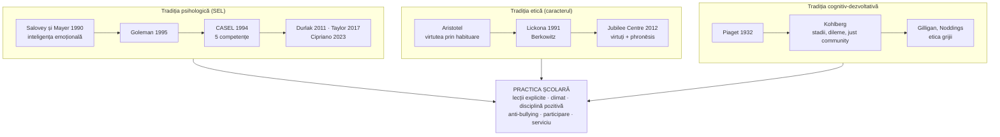

↑ [[00 Index - Analiza comparată internațională]] · [[00 MOC - Fundamentele științelor educației]] · Conspecte-sursă: [[7.2.3 Educația pentru dezvoltare emoțională]] · [[6.2.1 Educația morală]]

> [!abstract] Pe scurt
> 1. **Învățarea socio-emoțională** (*social and emotional learning*, SEL) susține că **competențele emoționale și sociale** se pot **preda explicit**. Ele susțin bunăstarea, comportamentul și rezultatele școlare. Modelul de referință este **CASEL** (1994), cu **5 competențe**: conștiința de sine, autogestiunea, conștiința socială, abilitățile relaționale, luarea responsabilă a deciziilor.
> 2. **Educația caracterului** (*character education*) are o rădăcină mai veche, **aristotelică**: școala formează **virtuți** (onestitate, curaj, dreptate, grijă) prin **exercițiu, exemplu și reflecție** (Lickona, 1991; Jubilee Centre, Birmingham).
> 3. Cele două tradiții se suprapun, dar diferă: **SEL** e psihologică, centrată pe **abilități** și măsurare; **educația caracterului** e etică, centrată pe **valori** și pe întrebarea „ce fel de om să devii?”. A treia sursă este **educația morală cognitiv-dezvoltativă** (Piaget, Kohlberg, *just community*).
> 4. **Dovezile pentru SEL** sunt printre cele mai solide din „noile educații”: Durlak et al. (2011, 213 programe, **+11 puncte percentile** la rezultate), Taylor et al. (2017, efecte persistente), Cipriano et al. (2023, 424 de studii). Efectele sunt **mai mici** în evaluări independente, în afara SUA și la implementare slabă.
> 5. **Nu tot ce e „bunăstare” funcționează**: studiul **MYRIAD** (2022, 8.376 de elevi, 84 de școli) nu a găsit un avantaj al lecțiilor de mindfulness față de predarea obișnuită.
> 6. **Implementările** sunt foarte diferite: **Singapore** (CCE și 5 competențe CASEL în 21CC), **Japonia** (*tokkatsu* și morala ca disciplină specială din 2018/2019), **Coreea** (prima lege a educației caracterului, 2015), **Finlanda** (KiVa, Salmivalli), **Anglia** (PSHE, RSHE statutară din 2020), **SUA** (CASEL, standarde statale, atacuri politice după 2021), **UE** (LifeComp, 2020).
> 7. SEL este **politică**: criticii o văd fie ca **ideologie** progresistă (dreapta americană), fie ca **instrument de conformare** și de individualizare a problemelor sociale (critica de stânga).
> 8. În **R. Moldova**, disciplina **Dezvoltare personală** (din 2018) este forma curriculară a SEL. Manualul (7.2.3) folosește, fără să-l citeze, modelul **Bar-On**.

---

## 1. Explicația teoriei

### 1.1 Întrebarea la care răspunde

**Poate și trebuie școala să formeze emoțiile, relațiile și caracterul, nu doar intelectul? Dacă da, cum?** Tradiția SEL răspunde că aceste competențe sunt **învățabile**, **măsurabile** și **condiții ale învățării academice**. Tradiția caracterului răspunde că educația are ca finalitate **omul bun**, nu doar omul competent. Întrebările derivate:
- Se predau competențele socio-emoționale ca **disciplină separată**, integrat în discipline sau prin **climatul întregii școli**?
- Cine decide **ce valori** se promovează într-o societate pluralistă?
- Se pot și trebuie **evaluate** emoțiile și caracterul?

### 1.2 Ideile centrale

1. **Unitatea dintre cogniție și emoție**: emoțiile influențează atenția, memoria și motivația. Nu există învățare „pur intelectuală”.
2. **Educabilitatea competențelor non-cognitive** (autocontrol, empatie, perseverență), cu efecte pe termen lung asupra sănătății, veniturilor și criminalității (Moffitt et al., 2011; Heckman și Kautz, 2012).
3. **Predare explicită + practică + climat**: programele eficiente respectă principiile **SAFE** (Durlak et al., 2011): **S**ecvențiate, **A**ctive, **F**ocalizate, **E**xplicite.
4. **Abordarea întregii școli** (*whole-school approach*): lecțiile dau rezultate mai bune când sunt susținute de reguli, relații, disciplină pozitivă și implicarea familiei.
5. **Virtutea ca obișnuință** (Aristotel): devii drept făcând fapte drepte. Cunoașterea binelui nu garantează fapta (Hartshorne și May, 1928–1930).
6. **Judecata morală autonomă** (Piaget, Kohlberg): scopul nu este doar conformarea la norme, ci construirea principiilor prin **dialog** și participare.

### 1.3 Concepte-cheie

| Concept | Definiție |
|---|---|
| **Inteligența emoțională** (Salovey și Mayer, 1990) | capacitatea de a **percepe**, **folosi**, **înțelege** și **gestiona** emoțiile (modelul abilităților, 4 ramuri) |
| **Modelul mixt** (Goleman, 1995; Bar-On, 1997) | combinație de abilități emoționale, trăsături de personalitate și competențe sociale |
| **Competențe socio-emoționale** (CASEL) | conștiința de sine; autogestiunea; conștiința socială; abilitățile relaționale; luarea responsabilă a deciziilor |
| **Autoreglarea** | capacitatea de a-ți monitoriza și regla emoțiile, atenția și comportamentul pentru a atinge scopuri → [[Învățarea autoreglată, metacogniția și autoeducația]] |
| **Caracter** (în educația caracterului) | ansamblul **virtuților** stabile: morale (onestitate, dreptate, compasiune), civice (serviciu, cetățenie), intelectuale (curiozitate, gândire critică), de performanță (perseverență, reziliență) — tipologia Jubilee Centre |
| **Virtute** (*aretē*) | dispoziție stabilă de a simți și acționa corect, formată prin **habituare** și ghidată de **înțelepciunea practică** (*phronēsis*) |
| **Cele trei componente ale caracterului** (Lickona) | **a cunoaște** binele, **a dori** binele, **a face** binele (*knowing, desiring, doing the good*) |
| **Dilema morală** și **comunitatea justă** (Kohlberg) | discuția dilemelor stimulează avansul în stadiile judecății morale; școala condusă democratic prin adunări generale |
| **Psihologia pozitivă** (Seligman) | studiul științific al **bunăstării**, al punctelor tari și al virtuților; în școală: *positive education* |
| **Bunăstarea elevului** (*well-being*) | stare cu dimensiuni psihologice, sociale, cognitive, fizice; OCDE o măsoară în PISA |
| **Climatul școlar** | calitatea relațiilor, a siguranței, a regulilor și a sentimentului de apartenență |
| **SEL transformativă** (Jagers, Rivas-Drake, Williams, 2019) | variantă care leagă SEL de **echitate**, identitate și acțiune colectivă |
| ***Tokkatsu*** | activitățile speciale ale școlii japoneze (consiliul clasei, servicii, evenimente) — formare socio-morală prin viața colectivă |

### 1.4 Ce presupune despre elev, profesor, cunoaștere și școală

| Dimensiune | SEL | Educația caracterului |
|---|---|---|
| **Elevul** | persoană în dezvoltare, cu competențe emoționale și sociale educabile | ființă morală în formare, capabilă de virtute prin exercițiu |
| **Profesorul** | model, facilitator al competențelor, creator de climat; are nevoie de **propria competență emoțională** (Jennings și Greenberg, 2009, „clasa prosocială”) | **model moral** (*role model*) și prieten virtuos; exemplul contează mai mult decât lecția |
| **Cunoașterea** | procedurală (abilități), practicată în situații | etică, practică (*phronēsis*) |
| **Școala** | mediu care învață și exersează competențe; programe structurate | comunitate morală cu valori explicite, ritualuri, serviciu |

---

## 2. Geneza și evoluția

### 2.1 Precursori

- **Aristotel**, *Etica nicomahică* (sec. IV î.Hr.): virtutea etică se dobândește prin **obișnuință**, iar cea intelectuală prin învățătură; *phronēsis* face legătura dintre ele.
- **Confucius** și tradiția **cultivării de sine**, esențială pentru Coreea, Japonia și Singapore.
- **Herbart**: formarea caracterului moral ca scop suprem al educației. **Durkheim**, *L'éducation morale* (curs 1902–1903, publicat în 1925): disciplină, atașament față de grup, autonomia voinței (→ [[6.2.1 Educația morală]]).
- **Hartshorne și May**, *Studies in the Nature of Character* (1928–1930): comportamentul moral e **situațional**; lecțiile verbale de morală au efecte slabe. Studiul a descurajat pentru decenii educația caracterului în SUA.
- **Dewey**, *Moral Principles in Education* (1909): morala se formează prin **viața socială a școlii**, nu prin lecții de morală.
- **Makarenko** (colectivul) în tradiția sovietică, relevant pentru spațiul moldovenesc.

### 2.2 Anii 1960–1980: educația morală cognitiv-dezvoltativă și clarificarea valorilor

- **Kohlberg** (teza din 1958; *Essays on Moral Development*, 1981, 1984): 6 stadii ale judecății morale. **Efectul Blatt–Kohlberg** (1975): discutarea dilemelor produce avans de stadiu. **Comunitățile juste**: Cluster School, Cambridge, Massachusetts (1974); Power, Higgins și Kohlberg, *Lawrence Kohlberg's Approach to Moral Education* (1989).
- **Clarificarea valorilor** (Raths, Harmin, Simon, *Values and Teaching*, 1966) — criticată pentru **relativism**.
- **Gilligan**, *In a Different Voice* (1982), și **Noddings**, *Caring* (1984): **etica grijii**.
- **James Comer**, *School Development Program* (Yale, 1968): climatul relațional și parteneriatul cu familiile în școlile sărace — precursor direct al SEL.

### 2.3 Anii 1990: formularea SEL și renașterea educației caracterului

- **Gardner** (1983): inteligențele **intrapersonală** și **interpersonală**.
- **Salovey și Mayer** (1990): articolul fondator despre inteligența emoțională.
- **Lickona**, *Educating for Character* (1991); **Declarația de la Aspen** (1992) despre valorile de bază; *Character Education Partnership* (1993, azi *Character.org*); programul federal *Partnerships in Character Education* (din 1995).
- **CASEL** fondat în **1994** (Roger Weissberg, Timothy Shriver, Daniel Goleman ș.a.; inițial *Collaborative for the Advancement of Social and Emotional Learning*, redenumit ulterior *Collaborative for Academic, Social, and Emotional Learning*).
- **Goleman**, *Emotional Intelligence* (1995), bestseller mondial. **Elias et al.**, *Promoting Social and Emotional Learning: Guidelines for Educators* (ASCD, 1997).
- **Seligman**: psihologia pozitivă (președinția APA, 1998).

### 2.4 Anii 2000–2010: dovezi și politici

- **Anglia**: **SEAL** (*Social and Emotional Aspects of Learning*), primar 2005, secundar 2007. Evaluarea secundarului (Humphrey, Lendrum și Wigelsworth, 2010) **nu a găsit impact semnificativ**; programul a fost abandonat.
- **Singapore**: cadrul SEL (2005).
- **Finlanda**: **KiVa** (dezvoltat în 2006–2009 la Universitatea din Turku, generalizat din 2009).
- **Durlak et al.** (2011): meta-analiza de referință. **Heckman și Kautz** (2012): argumentul economic pentru „abilitățile non-cognitive”.
- **Jubilee Centre for Character and Virtues** (Universitatea din Birmingham, **2012**; James Arthur, Kristján Kristjánsson). *A Framework for Character Education in Schools* (2017; revizuit 2022).
- **Duckworth**, *grit* (2007; *Grit*, 2016), și **Dweck**, *mindset* (2006) — popularitate uriașă, dovezi contestate ulterior.
- **Coreea**: *Legea promovării educației caracterului* (adoptată în decembrie 2014, promulgată în ianuarie 2015, în vigoare din iulie 2015).

### 2.5 Stadiul actual (2017–2026)

- **Taylor et al.** (2017): efecte persistente. **OCDE**: *Survey on Social and Emotional Skills* (SSES, 2019 și 2023), bazat pe modelul Big Five.
- **UE**: **LifeComp** (2020) — competența-cheie „personală, socială și a învăța să înveți”.
- **Pandemia**: SEL și sănătatea mintală devin priorități (fonduri ESSER în SUA, CCE 2021 în Singapore, planul COCOLO în Japonia, 2023).
- **SUA, după 2021**: SEL atacat politic ca vehicul al „teoriei critice a rasei”. Unele state și districte elimină termenul (ex. Florida a respins în 2022 manuale de matematică invocând, printre altele, SEL).
- **MYRIAD** (2022): mindfulness-ul universal în școli nu depășește predarea obișnuită.
- **Cipriano et al.** (2023): cea mai amplă meta-analiză — 424 de studii din 53 de țări, 575.361 de elevi, efecte pozitive, cu eterogenitate mare.
- **Dezbaterea ecranelor**: restricționarea telefoanelor în școli (Franța, Țările de Jos, Anglia — ghid 2024, numeroase state din SUA) e prezentată ca măsură de bunăstare, cu dovezi încă disputate.

---

## 3. Autori, reprezentanți, cercetători

| Autor | Lucrare(ări), an | Aportul concret |
|---|---|---|
| **Aristotel** | *Etica nicomahică* | virtutea prin **habituare**; *phronēsis*; „calea de mijloc” — fundamentul educației caracterului |
| **Hugh Hartshorne și Mark A. May** | *Studies in the Nature of Character* (3 vol., 1928–1930) | copiii care cunosc regulile nu sunt neapărat mai cinstiți; **specificitatea situațională** a comportamentului moral |
| **Lawrence Kohlberg** | *Essays on Moral Development* (1981, 1984); cu Power și Higgins (1989) | stadiile judecății morale; **dilemele morale**; **comunitatea justă** |
| **Carol Gilligan** / **Nel Noddings** | *In a Different Voice* (1982) / *Caring* (1984) | **etica grijii** ca alternativă sau completare a eticii dreptății |
| **James P. Comer** | *School Power* (1980); *School Development Program* (1968) | legătura dintre dezvoltarea relațională și reușita școlară a copiilor săraci |
| **Peter Salovey și John D. Mayer** | „Emotional Intelligence”, *Imagination, Cognition and Personality* (1990); modelul revizuit (1997); testul MSCEIT | **modelul abilităților** — cea mai riguroasă conceptualizare științifică a IE |
| **Daniel Goleman** | *Emotional Intelligence* (1995) | popularizarea IE; co-fondator CASEL; modelul mixt (conștiința de sine, autocontrol, motivație, empatie, abilități sociale) |
| **Reuven Bar-On** | *EQ-i* (1997) | inventarul **EQ-i** (5 scale, 15 subscale) — sursa necitată a obiectivelor din manual (→ [[7.2.3 Educația pentru dezvoltare emoțională]]) |
| **Roger P. Weissberg** (1951–2021) | co-fondator și *Chief Knowledge Officer* CASEL; coautor Durlak et al. (2011) | arhitectul științific al mișcării SEL |
| **Joseph A. Durlak et al.** | „The impact of enhancing students' social and emotional learning”, *Child Development*, 82(1), 405–432 (2011) | **213 programe**, **270.034 de elevi**; efecte: competențe SEL (≈ 0,57), comportament prosocial (≈ 0,24), probleme de conduită (≈ 0,22), distres emoțional (≈ 0,24), rezultate academice (**≈ 0,27**, adică **+11 puncte percentile**); principiile **SAFE** |
| **Rebecca D. Taylor, Eva Oberle, Durlak, Weissberg** | „Promoting positive youth development through school-based SEL interventions”, *Child Development*, 88(4) (2017) | **82 de intervenții**, ≈ **97.000** de elevi; efectele se **mențin** la urmăriri între 6 luni și 18 ani |
| **Christina Cipriano, Michael Strambler et al.** | „The state of evidence for social and emotional learning”, *Child Development*, 94(5) (2023) | **424 de studii**, 53 de țări, 575.361 de elevi; efecte pozitive pe competențe, comportament, climat, rezultate; eterogenitate după calitatea implementării |
| **Michael Wigelsworth et al.** | meta-analiză în *Cambridge Journal of Education* (2016) | efectele sunt **mai mici** în evaluările **independente** (nu ale autorilor programului) și la transferul programelor între țări |
| **Thomas Lickona** | *Educating for Character* (1991); *Character Matters* (2004) | cele trei componente ale caracterului; strategii pentru clasă și școală (12 puncte) |
| **Marvin W. Berkowitz** (Univ. Missouri–St. Louis) | Berkowitz și Bier, *What Works in Character Education* (2005); *PRIMED for Character Education* (2021) | sinteza dovezilor; cele șase principii **PRIMED** (prioritate, relații, motivație intrinsecă, modelare, împuternicire, dezvoltare) |
| **James Arthur, Kristján Kristjánsson** (Jubilee Centre) | Kristjánsson, *Aristotelian Character Education* (2015); *A Framework for Character Education in Schools* (2017/2022) | educația caracterului **neo-aristotelică**: virtuți morale, intelectuale, civice, de performanță, integrate de *phronēsis* |
| **Martin Seligman** | *Authentic Happiness* (2002); Seligman et al., „Positive education”, *Oxford Review of Education* (2009) | **psihologia pozitivă** și *positive education* (ex. Geelong Grammar, Australia); *Penn Resiliency Program* |
| **Christopher Peterson și Seligman** | *Character Strengths and Virtues* (2004) | clasificarea VIA: **6 virtuți, 24 de puncte tari** |
| **Christina Salmivalli** (Univ. Turku) | Salmivalli et al., „Bullying as a group process” (*Aggressive Behavior*, 1996); Kärnä et al., RCT KiVa (*Child Development*, 2011) | **rolurile participanților** la bullying (agresor, asistenți, susținători, apărători, spectatori); programul **KiVa** |
| **Kimberly Schonert-Reichl** (UBC) | evaluări *Roots of Empathy* (2012) și *MindUP* (2015) | dovezi controlate pentru empatie, funcții executive și comportament prosocial |
| **Stuart Shanker** (York Univ., Canada) | *Calm, Alert, and Learning* (2013); *Self-Reg* (2016) | autoreglarea ca **gestionare a stresului**, distinctă de autocontrol |
| **Patricia Jennings și Mark Greenberg** | „The prosocial classroom”, *Review of Educational Research* (2009) | competența socio-emoțională a **profesorului** ca bază a climatului și a eficienței SEL |
| **Willem Kuyken et al.** | MYRIAD, *Evidence-Based Mental Health* (2022) | RCT în 84 de școli britanice (8.376 de elevi): **fără superioritate** a mindfulness-ului față de predarea obișnuită |
| **Catherine Lewis** | *Educating Hearts and Minds* (1995) | performanța academică japoneză se sprijină pe dezvoltarea socio-emoțională și pe viața colectivă a clasei |
| **Tsuneyoshi Ryoko** | *Tokkatsu: The Japanese Educational Model of Holistic Education* (coord., 2020 — de verificat anul) | conceptualizarea *tokkatsu* ca model exportabil (Egipt) |
| **Critici**: **Alfie Kohn**; **Kathryn Ecclestone și Dennis Hayes**; **Ben Kisby și Lee Jerome** | Kohn, „How not to teach values” (*Phi Delta Kappan*, 1997); Ecclestone și Hayes, *The Dangerous Rise of Therapeutic Education* (2008); Jerome și Kisby, *The Rise of Character Education in Britain* (2019) | educația caracterului ca **moralizare** și conformism; SEL ca **„educație terapeutică”** care fragilizează elevii; caracterul ca soluție individuală la probleme structurale |

---

## 4. Legătura cu manualul și cu vaultul

| Unde | Ce spune manualul / conspectul | Evaluare |
|---|---|---|
| [[7.2.3 Educația pentru dezvoltare emoțională]] | educația pentru dezvoltare emoțională și sănătate mintală; cele **5 obiective** specifice; Pactul european (2008); stresul ocupațional al profesorilor | obiectivele reproduc **modelul Bar-On (EQ-i)** fără citare; lipsesc **CASEL** și dovezile Durlak (completate în conspect); inconsecvență QE/EQ; confuzie IQ = performanță academică |
| [[6.2.1 Educația morală]] | morala ca transmitere de valori și norme; metodele după Macavei și Cristea; educația moral-civică | lipsesc **Piaget, Kohlberg, Lickona** (completați în conspect); Hartshorne și May relativizează metodele verbale; „caracterul de clasă al moralei” — reziduu marxist |
| [[9.3 Personalitatea elevului și comportamentul școlar]] | caracterul ca latură a personalității | eroarea „dinamico-energetică” (= temperament, nu caracter) — vezi [[Erori și actualizări ale manualului]] |
| [[10.2 Curriculum la dirigenție]] · [[10.3 Activitatea educativă a dirigintelui]] | ora de dirigenție ca spațiu educativ | din 2018 disciplina obligatorie **Dezvoltare personală**; raportul exact cu diriginția — de verificat |
| [[7.2.4 Educația pentru pace și cooperare]] | toleranța, cooperarea | legătură cu programele anti-bullying și cu empatia |
| [[6.3 Metodele educației]] | metodele educației morale (exemplul, exercițiul, aprobarea/dezaprobarea) | corespund parțial „habituării” aristotelice; metodele terapeutice depășesc competența profesorului |
| [[Modulul 06 - Dimensiunile generale ale educației]] · [[Modulul 07 - Noile educații]] | educația morală ca dimensiune; dezvoltarea emoțională ca „nouă educație” | SEL traversează ambele module |
| [[Învățarea autoreglată, metacogniția și autoeducația]] · [[Autoeducația - teorii, autori și corelări]] | autocontrolul, autocunoașterea, autostimularea | competența „autogestiune” din CASEL e nucleul psihologic al autoeducației |

> [!note] Corelare esențială
> Manualul tratează **separat** educația morală (M06) și educația emoțională (M07). Cercetarea actuală le **apropie**: judecata morală e în mare parte **intuitivă și emoțională** (Haidt), iar competențele socio-emoționale (empatie, autoreglare) sunt **condiții** ale conduitei morale. Educația caracterului neo-aristotelică (emoții educate + virtute + *phronēsis*) e puntea dintre cele două capitole.

---

## 5. Implementare comparată

### 5.1 Tabel-sinteză

| Sistem | Cum a fost implementată (politică / program / instituție) | Când | Scară / intensitate | Dovezi sau rezultate |
|---|---|---|---|---|
| **Singapore** | cadrul **SEL** (2005); **cele 5 competențe CASEL** integrate în cadrul **21CC** (valori-nucleu R3ICH: respect, responsabilitate, reziliență, integritate, grijă, armonie); ***Character and Citizenship Education*** (**CCE 2014**, **CCE 2021**, cu educație explicită pentru sănătate mintală); ore CCE, ore cu dirigintele (*Form Teacher Guidance Periods*), *Values in Action*; consilieri școlari | 2005–prezent | **centrală** (predare explicită, timp dedicat, finalitate declarată a sistemului) | nu există o evaluare de impact riguroasă publică a CCE; critici: sănătatea mintală „modelată” ca responsabilitate individuală și SEL ca **instrument de conformare** |
| **Estonia** | competențele de autogestionare, socială și a valorilor în curriculum; tema transversală „valori și morală”; **sondaje naționale de bunăstare** cu rapoarte pe școală (din 2018); programe anti-bullying (KiVa, *Kiusamisest vaba lasteaed*, VEPA — ani și amploare de verificat) | 2011/2018–prezent | **medie** | bullying peste media OCDE (PISA 2025: 27% vs. 20%); măsurarea bunăstării e sistemică, dar **efectul intervențiilor nu e documentat** |
| **Finlanda** | **KiVa** (Salmivalli), folosit în majoritatea școlilor de bază; **Legea bunăstării elevilor** (2014) și grupuri multiprofesionale; competența transversală **T3** („a avea grijă de sine, abilități pentru viața de zi cu zi”); disciplina *terveystieto* (educație pentru sănătate) | 2009–prezent | **medie–centrală** (prin climat și anti-bullying, nu prin lecții SEL separate) | RCT-ul KiVa (Kärnä et al., 2011) arată **reducerea victimizării**, mai ales în clasele mici; bullying raportat sub media OCDE (PISA 2022) |
| **Regatul Unit (Anglia)** | **PSHE** (în mare parte nestatutar); **SEAL** (2005–2010, abandonat); **RSE/RSHE statutară** din septembrie 2020 (*Relationships Education*, *RSE*, *Health Education*, inclusiv sănătatea mintală); **educația caracterului** promovată de DfE din 2014–2015 (granturi, *Character Awards*, ghidul *Character Education Framework*, 2019); **Jubilee Centre**; *Mental Health Support Teams*; **Scoția**: *Health and wellbeing* ca responsabilitate a tuturor profesorilor (CfE) | 2005–prezent | **medie** | SEAL secundar fără impact semnificativ (Humphrey et al., 2010); MYRIAD (2022) — mindfulness fără avantaj; evaluările EEF ale programelor SEL arată rezultate **mixte** |
| **Japonia** | ***tokkatsu*** (activități speciale: consiliul clasei, servicii, evenimente, curățenia, prânzul servit de elevi); **ora de morală** (din 1958), devenită **disciplină specială** (*tokubetsu no kyōka dōtoku*) în primar (2018) și gimnaziu (2019), cu **evaluare descriptivă, fără note**; consilieri și asistenți sociali școlari; planul COCOLO (2023) | 1958/1968–prezent | **centrală** (integrată în întreaga viață școlară) | dovezi calitative bogate (Lewis, Tsuneyoshi); dovezi cauzale rare; critici: **conformism**, presiune de grup, continuitate ideologică cu *shūshin* și patriotismul (2006); bullying și sinucideri în creștere (413 elevi în anul școlar 2024, MEXT) |
| **Coreea de Sud** | disciplina **Etică / morală** obligatorie; **Legea promovării educației caracterului** (**2015**) — prima lege care impune educația caracterului în școli, cu planuri cincinale și formarea profesorilor; tema transversală „caracter” (curriculum 2022); **proiectul Wee** (2008) — consiliere în trei niveluri; legea prevenirii violenței școlare (2004); discursul „educației fericirii” (*Free Year*) | 2004/2015–prezent | **centrală ca discurs și lege**, **redusă** ca timp real în liceu | criticată ca abordare **de sus în jos**, moralizatoare, care tratează simptomele (violență, sinucideri) fără a schimba cauza structurală (competiția pentru CSAT); Kim și Kim (2020) critică discursul „educației fericirii” |
| **Canada** | **British Columbia**: competența de bază **„personală și socială”** în curriculumul din 2016 (identitate personală și culturală pozitivă; conștiință și responsabilitate personală; conștiință și responsabilitate socială); **Ontario**: *Self-Regulation Initiative*, *Well-Being Strategy* (2016), expectative SEL în matematica 1–8 (2020); ***Roots of Empathy*** (Mary Gordon, 1996); *MindUP* | 1996–prezent | **medie** | Schonert-Reichl et al. (2012, 2015): scăderea agresivității, îmbunătățirea funcțiilor executive; critici: modelul Shanker are bază empirică redusă; SEL în matematică criticat ca „diluare”; PISA 2025: bullying și absenteism în creștere |
| **Europa (UE / Consiliul Europei)** | competența-cheie **„personală, socială și a învăța să înveți”** (Recomandarea din 2018); **LifeComp** (JRC, 2020): 3 arii (personală, socială, a învăța să înveți), 9 competențe; grupul de lucru *Wellbeing at school*; Carmel Cefai (Malta) — curriculumul european *RESCUR* | 2018–prezent | **redusă–medie** (cadre opționale; statele decid) | fără date de impact la nivel UE; tradițiile naționale diferă: etică laică (Franța), religie confesională (Italia, Polonia, România, R. Moldova), educație pentru valori (țările nordice) |
| **SUA** | **CASEL** (1994); programe (*PATHS*, *Second Step*, *Responsive Classroom*, *RULER*); **standarde SEL preșcolare în toate statele** și standarde K–12 în multe state; fonduri ESSER după 2020; programe federale de educație a caracterului (din 1995); școli KIPP cu „carduri de caracter” | 1994–prezent | **medie**, foarte variabilă între state și districte | **Durlak** (2011), **Taylor** (2017), **Cipriano** (2023) — cea mai mare bază de dovezi din lume; după 2021, **atacuri politice**: SEL asociat cu „teoria critică a rasei” și eliminat din unele politici statale |
| **Republica Moldova** | disciplina obligatorie ***Dezvoltare personală*** (clasele I–XII; curriculum 2018, aria „Consiliere și dezvoltare personală”): autocunoaștere, relații armonioase, sănătate și bunăstare, carieră, siguranță personală (lista exactă a modulelor — de verificat); **Educație moral-spirituală** (clasele I–IV); **Religia** (opțională); Codul Educației: **„formarea unui caracter integru”** (art. 11) și obligația cadrelor didactice de a promova valorile morale (art. 135) | 2018–prezent | **medie** (o oră pe săptămână; în formare) | nu există evaluări de impact publicate (de verificat); PISA arată bullying ridicat (cifre de verificat în nota OCDE pentru R. Moldova); resurse didactice și formare inegale; risc de „oră de dirigenție redenumită” |

### 5.2 Studiu de caz 1 — Singapore: SEL de stat, între bunăstare și conformare

→ [[Singapore - ecosistemul educațional]]

**Politica.** Singapore este probabil sistemul care a adoptat **cel mai explicit** modelul CASEL. Cadrul SEL (2005) a preluat cele cinci competențe (conștiința de sine, autogestiunea, conștiința socială, gestionarea relațiilor, luarea responsabilă a deciziilor) și le-a plasat, în cadrul **21CC** (*21st Century Competencies*), într-un inel între **valorile-nucleu** din centru și competențele emergente din exterior. **CCE 2014** a unificat educația morală, civică și socio-emoțională. **CCE 2021** a adăugat **educația explicită pentru sănătate mintală**, generalizată în toate clasele până în 2023, și discuții despre probleme contemporane.

**Mecanisme.** Timp curricular dedicat (ore CCE, ore cu dirigintele, CCE în limba maternă); ***Values in Action*** (învățare prin serviciu în comunitate); consilieri școlari; *Peer Support Leaders*; *Cyber Wellness*.

**Evaluare.** Coerența e remarcabilă: SEL e **finalitate declarată** (DOE), are timp, formare (NIE) și materiale. Lipsesc însă **evaluările cauzale publice**. Criticii notează că programul se desfășoară **în paralel** cu un sistem cu miză mare la examene și meditații intense. În acest context, riscul e ca „reziliența” să însemne a suporta mai bine presiunea, nu a o reduce. SEL devine astfel **instrument de adaptare** a individului la sistem.

### 5.3 Studiu de caz 2 — Japonia: caracterul prin viața colectivă (*tokkatsu*)

→ [[Japonia - ecosistemul educațional]]

**Logica.** Japonia nu are „lecții SEL” în sens american. Formarea socio-emoțională și morală se face prin **organizarea vieții școlare**: grupuri mici (*han*), **roluri rotative**, **consiliul clasei**, elevii care fac **curățenie** și **servesc prânzul**, evenimente pregătite colectiv (ziua sportului, festivalul școlar). Catherine Lewis a arătat că această „educație a inimii” precede și susține performanța academică. Educatoarele practică *mimamoru* (supraveghere protectivă): lasă copiii să-și rezolve singuri conflictele mărunte.

**Educația morală.** Ora de morală (din 1958) a devenit **disciplină specială** în 2018 (primar) și 2019 (gimnaziu), cu manuale aprobate și **evaluare descriptivă, fără note**. Reforma a fost motivată public și de cazurile grave de *ijime* (bullying). Orientarea declarată este spre „morală de gândire și discuție” (*kangaeru dōtoku*), nu doar spre lecturi moralizatoare.

**Export.** Parteneriatul Egipt–Japonia a creat **școlile egipteano-japoneze** (din 2018), cu *tokkatsu* ca element central.

**Critici.** Colectivismul poate genera **conformism** și poate fi chiar teren pentru *ijime*. Disciplina morală a readus disputa despre **patriotism** și moștenirea *shūshin* (morala imperială). Cluburile și *tokkatsu* contribuie la **supraîncărcarea profesorilor**.

**Lecția.** SEL poate fi **structural**, nu doar curricular. Rutinele de responsabilitate, cooperare și reflecție (*furikaeri*) pot face mai mult decât o oră pe săptămână.

### 5.4 Studiu de caz 3 — Finlanda: KiVa, de la cercetare la program național

→ [[Finlanda - ecosistemul educațional]]

**Baza teoretică.** Salmivalli et al. (1996) au arătat că bullyingul e un **proces de grup**: agresorul are nevoie de **public** și de **statut**. Rolurile participanților (asistenți, susținători, spectatori pasivi, apărători) pot fi schimbate. Deci intervenția nu trebuie să vizeze doar agresorul și victima, ci **întreaga clasă**.

**Programul.** KiVa (*Kiusaamista Vastaan*, „împotriva bullyingului”) combină: lecții universale pentru clase (empatie, rolul martorilor), un joc online, echipe școlare care intervin în cazurile concrete prin discuții structurate, implicarea colegilor cu statut ridicat ca apărători, vestele vizibile ale supraveghetorilor în pauze și materiale pentru părinți. Guvernul a finanțat dezvoltarea (2006–2009), apoi generalizarea.

**Dovezi.** RCT-ul (Kärnä et al., 2011, clasele 4–6) a arătat **reduceri semnificative** ale victimizării și bullyingului, mai mari în clasele mici. Evaluările ulterioare arată efecte **mai modeste** la nivel național și la adolescenți. Efectele în alte țări (Țările de Jos, Italia, Țara Galilor ș.a.) sunt **variabile**, în funcție de implementare.

**Lecția.** Un program bazat pe o **teorie clară**, testat randomizat **înainte** de generalizare și susținut de o universitate e modelul de dezvoltare pe care R. Moldova l-ar putea urma.

### 5.5 Studiu de caz 4 — Coreea de Sud: caracterul prin lege

→ [[Coreea de Sud - ecosistemul educațional]]

După tragedii publice (violență școlară, sinucideri, dezastrul feribotului *Sewol* din 2014, în care au murit mulți elevi), Coreea a adoptat **Legea promovării educației caracterului** (în vigoare din iulie 2015). Legea obligă statul la **planuri cincinale**, școlile la programe de educație a caracterului, iar formarea profesorilor la module dedicate. Definește valori precum politețea, filialitatea, onestitatea, responsabilitatea, respectul, grija, comunicarea și cooperarea (listă de verificat în textul legii).

**Critica.** Legea e un exemplu de **răspuns legislativ la o criză socială** fără schimbarea cauzelor: competiția pentru CSAT, meditațiile (*hagwon*) și somnul insuficient rămân neschimbate. Orele de caracter concurează pentru timp cu pregătirea pentru examen. Criticii coreeni vorbesc despre **moralizare de sus în jos** și despre „caracterul evaluat” transformat în încă un criteriu de dosar.

**Lecția pentru manual.** Cazul confirmă critica lui Hartshorne și May și a lui Dewey: **caracterul nu se decretează**. Se formează prin structura vieții școlare, inclusiv prin presiunile ei.

---

## 6. Dovezi empirice și critici

### 6.1 Ce arată cercetarea

| Întrebare | Studii | Rezultat |
|---|---|---|
| Funcționează programele SEL universale? | **Durlak et al. (2011)**; **Taylor et al. (2017)**; **Cipriano et al. (2023)** | **da, în medie**: efecte mari asupra competențelor SEL, mici–moderate asupra comportamentului și distresului, mici–moderate asupra rezultatelor (≈ **0,27** în Durlak; +11 puncte percentile) |
| Rezistă efectele în timp? | **Taylor et al. (2017)** | efectele persistă, deși mai reduse, la urmăriri de până la 18 ani |
| Efectele sunt la fel de mari peste tot? | **Wigelsworth et al. (2016)**; evaluări EEF | **nu**: mai mici în evaluările independente și în afara SUA; programele „importate” pierd din efect |
| Ce face un program eficient? | Durlak et al. (2011) — **SAFE**; Durlak și DuPre (2008) — calitatea implementării | secvențiere, învățare activă, timp dedicat, obiective explicite; **implementarea fidelă** poate dubla sau tripla efectul |
| Funcționează mindfulness-ul universal? | **MYRIAD** (Kuyken et al., 2022) | **nu** mai bine decât predarea obișnuită, la 1 an; posibile efecte **negative** la elevii cu risc (analize secundare — de verificat) |
| Funcționează programele anti-bullying? | Gaffney, Ttofi și Farrington (meta-analiză, 2019 — de verificat referința exactă); KiVa | reduceri medii de ordinul **15–20%** ale perpetrării și victimizării (valori de verificat) |
| Funcționează educația caracterului? | Berkowitz și Bier (2005); Jubilee Centre (studii de caz) | dovezi **mai slabe** și mai eterogene decât pentru SEL; puține RCT-uri; efectele depind de climatul întregii școli |
| Funcționează *grit* și *growth mindset*? | Credé, Tynan și Harms (2017, *JPSP*) despre grit; Sisk et al. (2018, *Psychological Science*) și Yeager et al. (2019, *Nature*) despre mindset | grit ≈ conștiinciozitate reambalată, cu putere predictivă modestă; mindset: efecte medii **foarte mici**, ceva mai mari la elevii dezavantajați |
| Contează competențele non-cognitive pe termen lung? | Moffitt et al. (2011, *PNAS*, cohorta Dunedin); Heckman și Kautz (2012) | autocontrolul în copilărie prezice sănătatea, veniturile și criminalitatea adultă (**corelație** robustă, controlată pentru IQ și statut social) |
| Discuția dilemelor morale | Blatt și Kohlberg (1975); meta-analize ulterioare (anii 1980–1990) | produce avansuri **modeste** ale judecății morale; legătura cu comportamentul e **slabă** |

### 6.2 Critici

> [!warning] Critici, limite, controverse
> 1. **Problema măsurării**: majoritatea rezultatelor SEL se bazează pe **autoevaluări** și pe evaluările profesorilor care știu că programul a fost aplicat. Există **efecte de referință** (elevii învață vocabularul emoțional și se evaluează mai sever) și riscul de „a preda pentru chestionar”. Duckworth și Yeager (2015) avertizează împotriva folosirii acestor măsuri în **responsabilizarea** școlilor.
> 2. **Umbrela conceptuală**: „SEL” include de toate — empatie, grit, mindfulness, anti-bullying, educație sexuală, carieră. **Lipsa unei teorii unitare** face dificilă cumularea dovezilor. Inteligența emoțională în modelul mixt e criticată ca **redenumire** a trăsăturilor de personalitate.
> 3. **Critica terapeutică** (Ecclestone și Hayes, 2008): școala care se ocupă obsesiv de emoții produce elevi **mai fragili**, care se percep vulnerabili, și îndepărtează școala de misiunea ei intelectuală.
> 4. **Critica politică de dreapta** (SUA, 2021–): SEL ca vehicul al ideologiei progresiste, al „teoriei critice a rasei” și al subminării autorității părinților.
> 5. **Critica politică de stânga**: SEL și caracterul **individualizează** probleme structurale (sărăcie, rasism, presiunea examenelor). „Reziliența” și *grit* le cer copiilor săraci să suporte condiții pe care societatea ar trebui să le schimbe. Programe ca SEL „transformativă” încearcă să răspundă acestei critici.
> 6. **Critica educației caracterului** (Kohn, 1997; Jerome și Kisby, 2019): îndoctrinare, conformism, **lista de virtuți** aleasă de stat; confuzia între morală și disciplină („caracterul” ca ascultare). Hartshorne și May: virtuțile se transferă slab între situații.
> 7. **Critica „situaționistă”** (Doris, Harman): psihologia socială arată că situația explică comportamentul mai mult decât trăsăturile, deci „caracterul” ca trăsătură stabilă e o iluzie parțială. Neo-aristotelicii răspund că virtutea autentică e **rară** și se dezvoltă lent.
> 8. **Transferabilitatea culturală**: modelul CASEL e **american** și individualist. Tradițiile asiatice (armonie, datorie față de grup) și est-europene (colectivul lui Makarenko) formulează altfel competențele.
> 9. **Costul de oportunitate**: timpul SEL concurează cu disciplinele. Nu toate programele justifică timpul (SEAL, MYRIAD).
>
> **Condiții în care funcționează**: program **structurat și secvențiat**, cu timp dedicat; implementat de **profesorii clasei** (nu doar de specialiști externi); susținut de climatul întregii școli; profesori formați și ei înșiși sprijiniți (burnout); evaluare **formativă**, nu cu miză mare.
> **Condiții în care nu funcționează**: activități izolate, „zile tematice”; lecții moralizatoare; programe importate fără adaptare; implementare formală; contradicție între discursul SEL și practica școlii (umilire, clasamente, pedepse).

---

## 7. Implicații practice

> [!tip] Pentru profesorul de la clasă (inclusiv la *Dezvoltare personală* și la dirigenție)
> - **Predă explicit, apoi exersează**: numirea emoțiilor, tehnici de calmare (respirație, pauză), pași de rezolvare a conflictului, cu jocuri de rol și aplicare în situații reale ale clasei.
> - **SAFE**: planifică lecțiile secvențial (nu teme disparate), activ (nu prelegeri), cu obiective clare de comportament.
> - **Climatul contează mai mult decât lecția**: reguli construite împreună (vezi *comunitatea justă* și consiliul clasei din *tokkatsu*), roluri rotative de responsabilitate, feedback respectuos, zero umilire.
> - **Discută dileme morale reale** ale vârstei (copiatul, loialitatea față de prieten vs. corectitudine, cyberbullying), nu doar povești moralizatoare. Pune accent pe **argumentare**, nu pe răspunsul „corect”.
> - **Tratează bullyingul ca proces de grup** (Salmivalli): lucrează cu martorii, nu doar cu agresorul și victima.
> - **Evită „terapia de amator”**: nu cere dezvăluiri intime în fața clasei; trimite cazurile serioase la psiholog.
> - **Nu nota emoțiile**: evaluarea la *Dezvoltare personală* să fie formativă și descriptivă (ca în Japonia).
> - **Îngrijește-ți propria competență emoțională** (Jennings și Greenberg): profesorul epuizat nu poate crea un climat prosocial (→ stresul ocupațional din [[7.2.3 Educația pentru dezvoltare emoțională]]).

> [!tip] Pentru politica educațională din R. Moldova
> 1. **Evaluarea disciplinei *Dezvoltare personală*** (2018–2026): studiu independent despre timp real, calitatea predării, percepția elevilor, efecte asupra climatului și bullyingului.
> 2. **Program anti-bullying bazat pe dovezi**, pilotat randomizat în câteva raioane înainte de generalizare (modelul KiVa), cu adaptare culturală și cu o universitate parteneră.
> 3. **Formarea profesorilor**: module practice de SEL și management al clasei în formarea inițială (UPS „Ion Creangă”, USARB, USM) și în formarea continuă obligatorie.
> 4. **Abordarea întregii școli**: indicatori de climat și bunăstare în autoevaluarea instituțională și în evaluarea externă ANACEC — **formativ**, nu punitiv.
> 5. **Psihologi școlari**: acoperire reală, mai ales în rural și pentru copiii ai căror părinți au emigrat (fenomen specific R. Moldova).
> 6. **Prudență față de mode**: mindfulness, *grit* și „mentalitatea de creștere” nu trebuie introduse ca politici naționale fără dovezi locale.
> 7. **Neutralitate axiologică responsabilă**: valorile promovate să fie cele constituționale și ale Codului (demnitate, toleranță, integritate, nediscriminare), iar educația religioasă să rămână **opțională** și distinctă de educația caracterului.

---

## 8. Legături cu alte teorii din catalog

- [[Învățarea autoreglată, metacogniția și autoeducația]] — autogestiunea din CASEL și autocontrolul sunt baza psihologică a autoreglării; cele două tradiții folosesc adesea aceleași constructe (funcții executive).
- [[Pedagogia critică și educația pentru cetățenie]] — educația caracterului accentuează **virtuțile personale**, educația pentru cetățenie **participarea și critica**; Westheimer și Kahne disting cetățeanul „personal responsabil” de cel „orientat spre justiție”. SEL transformativă încearcă să le unească.
- [[Progresivismul și educația nouă]] — Dewey: morala prin viața socială a școlii; școala ca mică democrație.
- [[Socioconstructivismul și teoria activității (Vygotsky)]] — reglarea emoțională trece de la **hetero-** la **autoreglare** prin mediere socială; jocul de rol (Elkonin) ca școală a autocontrolului.
- Educația timpurie — cele mai solide efecte pe termen lung ale programelor Perry și Abecedarian trec prin **competențele non-cognitive**, nu prin IQ.
- [[Educația incluzivă]] — climatul de acceptare și anti-bullyingul sunt condiții ale participării elevilor cu CES.
- Educația bazată pe dovezi — SEL are o bază de meta-analize rară printre „noile educații”, dar și probleme tipice (autoevaluări, evaluări făcute de autorii programelor).
- [[Capitalul uman și economia educației]] — Heckman și „abilitățile non-cognitive” ca formă de capital uman.
- [[Taxonomiile obiectivelor și educația centrată pe competențe]] — taxonomia afectivă (Krathwohl, 1964) și competențele-cheie europene (LifeComp) sunt formele curriculare ale SEL.
- [[Tradiția Bildung-Didaktik și tradiția Curriculum]] — *Bildung* ca formare integrală a persoanei e mai aproape de educația caracterului decât de modelul american al competențelor.

---

## 9. Întrebări de reflecție

1. Comparați modelele inteligenței emoționale **Salovey–Mayer**, **Goleman** și **Bar-On** cu cele 5 competențe CASEL. Pe care se sprijină manualul și de ce contează alegerea?
2. Durlak et al. (2011) găsesc **+11 puncte percentile** la rezultatele școlare, iar MYRIAD (2022) nu găsește efecte ale mindfulness-ului. Cum explicați diferența? Ce concluzii ați trage pentru orele de *Dezvoltare personală*?
3. **Caracterul** se poate forma printr-o lege (Coreea, 2015) sau prin organizarea vieții școlare (Japonia, *tokkatsu*)? Argumentați folosind Aristotel, Dewey și Hartshorne și May.
4. Este SEL **neutru valoric**? Analizați criticile de dreapta (SUA, 2021–) și de stânga (individualizarea problemelor sociale). Cum ar trebui formulate valorile într-o școală publică din R. Moldova?
5. Proiectați o intervenție anti-bullying pentru o școală gimnazială din R. Moldova, pornind de la teoria **rolurilor participanților** (Salmivalli). Cum ați evalua efectul?
6. Cum se leagă stresul ocupațional al profesorului (M07) de eficiența SEL la clasă? Ce ar trebui să conțină formarea profesorilor?

---

## 10. Surse

### Documente și cadre
- CASEL. *What Is the CASEL Framework?* https://casel.org/fundamentals-of-sel/what-is-the-casel-framework/
- Jubilee Centre for Character and Virtues (2022). *The Jubilee Centre Framework for Character Education in Schools* (ed. a III-a). University of Birmingham. https://www.jubileecentre.ac.uk
- Sala, A., Punie, Y., Garkov, V. și Cabrera Giraldez, M. (2020). *LifeComp: The European Framework for Personal, Social and Learning to Learn Key Competence*. Luxembourg: Publications Office of the EU (JRC).
- Consiliul UE (2018). *Recomandarea privind competențele-cheie pentru învățarea pe tot parcursul vieții* (22 mai 2018).
- OECD (2021, 2024). *Survey on Social and Emotional Skills* — rapoarte *Beyond Academic Learning* (2021) și rezultatele SSES 2023.
- DfE (2019, actualizat). *Relationships Education, Relationships and Sex Education (RSE) and Health Education — statutory guidance*; DfE (2019). *Character Education Framework Guidance*.
- MOE Singapore (1.08.2022). *Strengthening students' mental well-being… refreshed CCE curriculum*. https://www.moe.gov.sg/news/parliamentary-replies/20220801-strengthening-students-mental-well-being-and-improving-their-mental-health-literacy-through-the-refreshed-character-and-citizenship-education-curriculum
- MEXT (2017). *Ghidurile curriculare pentru disciplina specială „morală”* (primar și gimnaziu).
- Republica Coreea (2015). *Legea promovării educației caracterului* (인성교육진흥법).
- Codul Educației al Republicii Moldova, Legea nr. 152/2014, art. 11 și art. 135.
- MECC (2018). *Curriculum la disciplina Dezvoltare personală, clasele I–XII* (Ordinul MECC nr. 1124/2018 — de verificat).

### Lucrări academice
- Berkowitz, M. W. și Bier, M. C. (2005). *What Works in Character Education: A Research-Driven Guide for Educators*. Washington, DC: Character Education Partnership.
- Berkowitz, M. W. (2021). *PRIMED for Character Education: Six Design Principles for School Improvement*. New York: Routledge.
- Cipriano, C., Strambler, M. J., Naples, L. H. et al. (2023). The state of evidence for social and emotional learning: A contemporary meta-analysis of universal school-based SEL interventions. *Child Development*, 94(5), 1181–1204. https://onlinelibrary.wiley.com/doi/abs/10.1111/cdev.13968
- Credé, M., Tynan, M. C. și Harms, P. D. (2017). Much ado about grit. *Journal of Personality and Social Psychology*, 113(3), 492–511.
- Duckworth, A. L. și Yeager, D. S. (2015). Measurement matters. *Educational Researcher*, 44(4), 237–251.
- Durlak, J. A., Weissberg, R. P., Dymnicki, A. B., Taylor, R. D. și Schellinger, K. B. (2011). The impact of enhancing students' social and emotional learning: A meta-analysis of school-based universal interventions. *Child Development*, 82(1), 405–432.
- Ecclestone, K. și Hayes, D. (2008). *The Dangerous Rise of Therapeutic Education*. London: Routledge.
- Goleman, D. (1995). *Emotional Intelligence*. New York: Bantam.
- Hartshorne, H. și May, M. A. (1928–1930). *Studies in the Nature of Character* (3 vol.). New York: Macmillan.
- Heckman, J. J. și Kautz, T. (2012). Hard evidence on soft skills. *Labour Economics*, 19(4), 451–464.
- Humphrey, N., Lendrum, A. și Wigelsworth, M. (2010). *Social and Emotional Aspects of Learning (SEAL) Programme in Secondary Schools: National Evaluation*. DfE Research Report RR049.
- Jagers, R. J., Rivas-Drake, D. și Williams, B. (2019). Transformative social and emotional learning (SEL). *Educational Psychologist*, 54(3), 162–184.
- Jennings, P. A. și Greenberg, M. T. (2009). The prosocial classroom. *Review of Educational Research*, 79(1), 491–525.
- Jerome, L. și Kisby, B. (2019). *The Rise of Character Education in Britain: Heroes, Dragons and the Myths of Character*. Cham: Palgrave Macmillan.
- Kärnä, A., Voeten, M., Little, T. D., Poskiparta, E., Kaljonen, A. și Salmivalli, C. (2011). A large-scale evaluation of the KiVa antibullying program: Grades 4–6. *Child Development*, 82(1), 311–330.
- Kohlberg, L. (1981). *Essays on Moral Development*, vol. I: *The Philosophy of Moral Development*. San Francisco: Harper & Row.
- Kohn, A. (1997). How not to teach values: A critical look at character education. *Phi Delta Kappan*, 78(6), 428–439.
- Kristjánsson, K. (2015). *Aristotelian Character Education*. London: Routledge.
- Kuyken, W. et al. (2022). Effectiveness and cost-effectiveness of universal school-based mindfulness training compared with normal school provision in reducing risk of mental health problems and promoting well-being in adolescence: the MYRIAD cluster randomised controlled trial. *Evidence-Based Mental Health*, 25(3), 99–109. https://pubmed.ncbi.nlm.nih.gov/35820992/
- Lewis, C. C. (1995). *Educating Hearts and Minds: Reflections on Japanese Preschool and Elementary Education*. Cambridge: Cambridge University Press.
- Lickona, T. (1991). *Educating for Character: How Our Schools Can Teach Respect and Responsibility*. New York: Bantam.
- Moffitt, T. E. et al. (2011). A gradient of childhood self-control predicts health, wealth, and public safety. *PNAS*, 108(7), 2693–2698.
- Peterson, C. și Seligman, M. E. P. (2004). *Character Strengths and Virtues: A Handbook and Classification*. Oxford University Press / APA.
- Power, F. C., Higgins, A. și Kohlberg, L. (1989). *Lawrence Kohlberg's Approach to Moral Education*. New York: Columbia University Press.
- Salmivalli, C., Lagerspetz, K., Björkqvist, K., Österman, K. și Kaukiainen, A. (1996). Bullying as a group process. *Aggressive Behavior*, 22(1), 1–15.
- Salovey, P. și Mayer, J. D. (1990). Emotional intelligence. *Imagination, Cognition and Personality*, 9(3), 185–211.
- Schonert-Reichl, K. A. et al. (2015). Enhancing cognitive and social–emotional development through a simple-to-administer mindfulness-based school program for elementary school children. *Developmental Psychology*, 51(1), 52–66.
- Seligman, M. E. P., Ernst, R. M., Gillham, J., Reivich, K. și Linkins, M. (2009). Positive education. *Oxford Review of Education*, 35(3), 293–311.
- Taylor, R. D., Oberle, E., Durlak, J. A. și Weissberg, R. P. (2017). Promoting positive youth development through school-based social and emotional learning interventions: A meta-analysis of follow-up effects. *Child Development*, 88(4), 1156–1171.
- Wigelsworth, M. et al. (2016). The impact of trial stage, developer involvement and international transferability on universal social and emotional learning programme outcomes: a meta-analysis. *Cambridge Journal of Education*, 46(3), 347–376.
- Note de țară din vault: [[Singapore - ecosistemul educațional]] (§5.11), [[Japonia - ecosistemul educațional]] (§5.3), [[Coreea de Sud - ecosistemul educațional]] (§6.11), [[Finlanda - ecosistemul educațional]] (§6.20), [[Canada - ecosistemul educațional]] (§5.11), [[SUA - ecosistemul educațional]] (§5.14), [[Estonia - ecosistemul educațional]] (§5.19), [[Regatul Unit - ecosistemul educațional]] (§5.5–5.6), [[Europa - spațiul european al educației]] (§5.5–5.6).
