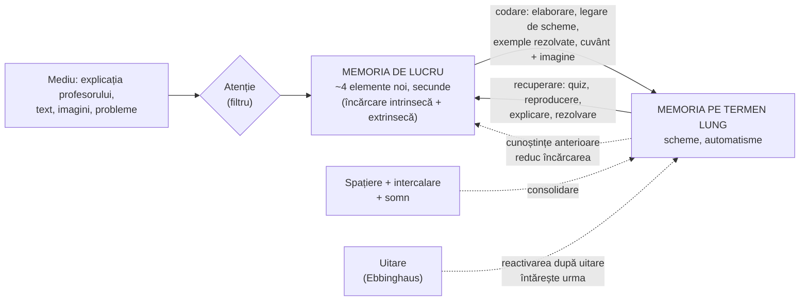

↑ [[00 Index - Analiza comparată internațională]]

> [!abstract] Pe scurt
> 1. **Ideea de bază**: învățarea înseamnă **schimbări durabile în memoria pe termen lung**. Pentru a ajunge acolo, informația trece prin **memoria de lucru**, care are capacitate foarte mică (câteva elemente) și durată scurtă. Predarea eficientă **gestionează această strâmtoare** și construiește **scheme** bogate.
> 2. Principiile cu cele mai solide dovezi: **practica recuperării** (a scoate din memorie, nu a reciti), **repetiția spațiată**, **intercalarea** (*interleaving*), **exemplele rezolvate** pentru novici, **combinarea cuvintelor cu imagini** fără redundanță, **explicarea explicită** a noului, urmată de practică ghidată.
> 3. **Dificultățile dezirabile** (*desirable difficulties*, Robert L. Bjork și Elizabeth L. Bjork): ce pare mai greu și mai lent în timpul învățării (testarea, spațierea, intercalarea) produce **retenție și transfer** mai bune. Performanța imediată **nu** este același lucru cu învățarea.
> 4. **Neuromiturile** (stilurile de învățare VAK, emisfera stângă/dreaptă, „folosim 10% din creier”) sunt larg răspândite printre profesori: peste 90% dintre profesorii din Regatul Unit și Țările de Jos credeau în stilurile de învățare (Dekker et al., 2012). Manualul moldovenesc conține și el un neuromit (tabelul Wurtz).
> 5. **Implementarea cea mai consecventă**: **Anglia** după 2019 (cadrul de inspecție Ofsted, *Early Career Framework*, researchED, Rosenshine), urmată de **Australia** (NSW — CESE 2017; Victoria — VTLM 2.0 din 2025) și de **SUA** (ghidul IES 2007, „știința citirii”). Franța are un consiliu științific condus de Dehaene (2018).
> 6. **Dovezi**: foarte puternice în laborator (testare: g ≈ 0,50; intercalare într-un RCT în clasă: d = 0,83). **Dovezile de transfer la scara clasei sunt mai slabe și mai variabile** (EEF, 2021). Riscul principal: „mutații letale” (quiz-uri mecanice, lecții rigide).
> 7. În **R. Moldova**, influența este **aproape nulă** ca politică. Totuși, tradiția școlii (repetare, exercițiu, verificare orală) conține intuitiv câteva principii, nesistematizate și amestecate cu neuromituri.

---

## 1. Ce explică teoria

### 1.1 Întrebarea la care răspunde

**Ce se întâmplă în mintea elevului când învață și cum trebuie organizate predarea și studiul ca informația să fie înțeleasă, păstrată și folosită mai târziu, în situații noi?** Spre deosebire de constructivism (întrebare epistemologică) sau de socioconstructivism (întrebare culturală), știința cognitivă pune o întrebare **mecanicistă și experimentală**: care sunt constrângerile arhitecturii cognitive și ce intervenții, testate prin experimente controlate, le exploatează?

### 1.2 Ideile centrale

1. **Arhitectura minții.** Memoria senzorială → **memoria de lucru** (limitată: aproximativ 4 ± 1 elemente noi, după Cowan, 2001; câteva secunde fără repetare) → **memoria pe termen lung** (capacitate practic nelimitată, organizată în **scheme**).
2. **Cunoștințele anterioare schimbă totul.** Expertul „vede” structuri (*chunks*) acolo unde novicele vede elemente izolate (Chase & Simon, 1973, la șah). Gândirea critică și rezolvarea de probleme depind de cunoștințe de domeniu (Willingham).
3. **Încărcarea cognitivă** (Sweller). Sarcina impune memoriei de lucru o încărcare **intrinsecă** (complexitatea materialului, adică interactivitatea elementelor) și una **extrinsecă** (cauzată de modul de prezentare). Predarea bună reduce încărcarea extrinsecă și dozează încărcarea intrinsecă.
4. **Novicii au nevoie de ghidaj explicit.** Pentru ei, exemplele rezolvate sunt superioare rezolvării libere de probleme. Pe măsură ce expertiza crește, ghidajul devine redundant (**efectul inversării expertizei**).
5. **Uitarea este normală și utilă.** Ebbinghaus (1885) a descris **curba uitării**. Reactivarea unei amintiri aproape uitate o consolidează mai mult decât repetarea imediată.
6. **Recuperarea este un act de învățare**, nu doar de măsurare. Fiecare extragere din memorie întărește și reorganizează urma mnezică (**efectul de testare**).
7. **Iluziile metacognitive.** Elevii (și profesorii) preferă strategiile care dau senzația de fluență (recitirea, sublinierea, practica blocată), deși acestea produc mai puțină învățare pe termen lung.
8. **Creierul învață prin atenție, angajare activă, feedback la eroare și consolidare** (cei „patru piloni” ai lui Dehaene). Somnul contribuie la consolidare.

### 1.3 Concepte-cheie

| Concept | Definiție |
|---|---|
| **Memoria de lucru** (*working memory*) | sistem cu capacitate limitată care menține și prelucrează activ informația; modelul Baddeley & Hitch (1974): executivul central, bucla fonologică, agenda vizuo-spațială, plus bufferul episodic (Baddeley, 2000) |
| **Memoria pe termen lung** | depozit durabil al cunoștințelor și deprinderilor; practic nelimitat |
| **Schemă** | structură de cunoaștere care grupează multe elemente într-o unitate; reduce încărcarea memoriei de lucru |
| **Automatizare** | procesarea unei scheme fără efort conștient (ex. decodarea fluentă, faptele numerice) |
| **Încărcare intrinsecă / extrinsecă** | dificultatea inerentă materialului / dificultatea adăugată de prezentarea proastă (în versiunile vechi se adăuga încărcarea „germane”, reformulată ulterior) |
| **Efectul exemplului rezolvat** (*worked example effect*) | novicii care studiază exemple rezolvate învață mai mult decât cei care rezolvă aceleași probleme |
| **Efectul atenției divizate** (*split-attention*) | integrarea fizică a textului și a imaginii ajută, separarea lor încarcă memoria de lucru |
| **Efectul redundanței** | aceeași informație prezentată simultan în două forme (ex. text citit identic cu textul scris pe slide) poate dăuna |
| **Efectul inversării expertizei** | tehnicile utile novicilor devin inutile sau dăunătoare pentru experți |
| **Practica recuperării** (*retrieval practice*) / **efectul de testare** | extragerea activă a informației din memorie (quiz, reproducere liberă, flashcards) îmbunătățește retenția mai mult decât restudierea |
| **Repetiția spațiată** (*spaced practice*) | distribuirea studiului în sesiuni separate în timp, în loc de „tocire” comasată |
| **Intercalarea** (*interleaving*) | amestecarea tipurilor de probleme în exersare, în loc de practica blocată (toate problemele de același tip) |
| **Dificultăți dezirabile** (*desirable difficulties*) | condiții care încetinesc învățarea aparentă, dar îmbunătățesc retenția și transferul (Bjork, 1994) |
| **Puterea de stocare / puterea de recuperare** | distincția din „noua teorie a nefolosirii” (Bjork & Bjork, 1992): o amintire poate fi bine stocată, dar greu accesibilă momentan |
| **Învățare vs. performanță** | performanța în timpul instruirii este un indicator nesigur al învățării durabile (Soderstrom & Bjork, 2015) |
| **Codare duală / învățare multimedia** | procesarea verbală și cea vizuală folosesc canale parțial separate; combinarea lor, fără supraîncărcare, ajută (Paivio; Mayer) |
| **Efectul de generare** | informația produsă de elev (completare, predicție) se reține mai bine decât cea citită |
| **Neuromit** | idee greșită despre creier, derivată dintr-o simplificare sau distorsionare a neuroștiințelor (OCDE, 2002) |
| **Cunoaștere biologic primară / secundară** (Geary) | abilități pe care evoluția ne-a pregătit să le învățăm spontan (vorbirea) / cunoștințe culturale care cer instruire explicită (citit, algebră) |

### 1.4 Ce presupune despre actorii educației

| Element | Presupoziția științei cognitive |
|---|---|
| **Elevul** | un sistem cognitiv cu constrângeri universale (memoria de lucru), dar cu **cunoștințe anterioare** foarte diferite; novicele și expertul au nevoie de instruire diferită |
| **Profesorul** | expert care **explică, secvențiază, verifică înțelegerea și organizează practica**; cunoașterea cercetării despre memorie face parte din profesionalism |
| **Cunoașterea** | cunoștințele de domeniu sunt **condiția** abilităților de nivel superior, nu opusul lor |
| **Școala / curriculumul** | curriculum secvențiat și cumulativ (*knowledge-rich*), cu reveniri planificate și evaluare frecventă cu miză mică |

---

## 2. Geneza și evoluția

| Perioadă | Moment | Semnificație |
|---|---|---|
| **Precursori** | **Hermann Ebbinghaus**, *Über das Gedächtnis* (1885): curba uitării, efectul spațierii; **William James** (1890); **Edward Thorndike** (legea exercițiului); **Arthur Gates** (1917, recitarea activă); studiile timpurii despre testare | experimentul riguros asupra memoriei |
| **1950–1970: revoluția cognitivă** | **George Miller**, „The Magical Number Seven, Plus or Minus Two” (1956); Newell & Simon (procesarea informației); **Atkinson & Shiffrin** (1968), modelul modal; **Baddeley & Hitch** (1974), memoria de lucru; de Groot și **Chase & Simon** (1973), expertiza la șah | mintea ca sistem de procesare a informației, cu limite măsurabile |
| **1980–1995: teorii instrucționale** | **Sweller & Cooper** (1985), exemplele rezolvate; **Sweller** (1988), teoria încărcării cognitive; **Bjork & Bjork** (1992), noua teorie a nefolosirii; **Bjork** (1994), „dificultăți dezirabile”; **Bruer**, „Education and the Brain: A Bridge Too Far” (1997) | trecerea de la laborator la proiectarea instruirii |
| **1999–2010: sinteze pentru educație** | NRC, ***How People Learn*** (1999/2000); **Mayer**, *Multimedia Learning* (2001); OCDE, *Understanding the Brain* (2002, 2007); **Roediger & Karpicke** (2006); **Cepeda et al.** (2006, 2008); **Kirschner, Sweller & Clark** (2006); ghidul **IES** *Organizing Instruction and Study to Improve Student Learning* (2007); **Willingham**, *Why Don't Students Like School?* (2009); **Rosenshine**, *Principles of Instruction* (IAE/UNESCO-BIE, 2010; *American Educator*, 2012) | știința învățării devine limbaj pentru profesori |
| **2011–2019: mișcarea profesorilor și instituționalizarea** | Karpicke & Blunt (*Science*, 2011); Dekker et al. (2012), neuromiturile; **researchED** (2013); Brown, Roediger & McDaniel, *Make It Stick* (2014); Howard-Jones (2014); **Deans for Impact**, *The Science of Learning* (2015); **CESE NSW** (2017); *How People Learn II* (2018); **Dehaene**, *Apprendre!* (2018) și **Consiliul științific al Educației Naționale** (Franța, 2018); **Ofsted EIF** și *overview of research* (2019); ECF publicat (2019) | politici naționale explicite în Anglia, Australia, Franța |
| **2020–azi: maturizare și critică** | Kirschner & Hendrick, *How Learning Happens* (2020); **Rohrer et al.** (2020), RCT cu intercalare; ECF național (2021); **EEF** — Perry et al., *Cognitive Science Approaches in the Classroom* (2021); Yang et al. (2021), meta-analiza testării în clasă; **ITTECF** (2024, aplicat din septembrie 2025); **VTLM 2.0** în Victoria (din 2025) | dovezi de clasă, nuanțe despre transfer, riscul „mutațiilor letale” |

---

## 3. Autori, reprezentanți, cercetători

| Autor | Lucrare(ări), an | Aportul concret |
|---|---|---|
| **Hermann Ebbinghaus** (1850–1909) | *Über das Gedächtnis* (1885) | curba uitării; primul experiment sistematic asupra spațierii repetițiilor |
| **George A. Miller** | „The Magical Number Seven, Plus or Minus Two”, *Psychological Review* (1956) | limitele memoriei imediate; conceptul de *chunk* |
| **Richard Atkinson & Richard Shiffrin** | „Human Memory: A Proposed System and Its Control Processes” (1968) | modelul modal: memorie senzorială – de scurtă durată – de lungă durată |
| **Alan Baddeley & Graham Hitch** | „Working Memory” (1974); Baddeley, „The Episodic Buffer” (2000) | modelul **memoriei de lucru** cu componente multiple |
| **Nelson Cowan** | „The Magical Number 4 in Short-Term Memory”, *Behavioral and Brain Sciences* (2001) | capacitatea reală ≈ 4 ± 1 unități |
| **William Chase & Herbert Simon** | „Perception in Chess”, *Cognitive Psychology* (1973) | expertiza = scheme stocate în memoria pe termen lung |
| **John Sweller** | „Cognitive Load During Problem Solving”, *Cognitive Science* (1988); cu van Merriënboer & Paas (1998, 2019) | **teoria încărcării cognitive**; efectele exemplului rezolvat, atenției divizate, redundanței, modalității, inversării expertizei |
| **Slava Kalyuga** et al. | „The Expertise Reversal Effect”, *Educational Psychologist* (2003) | ghidajul trebuie adaptat nivelului de expertiză |
| **David C. Geary** | *Educating the Evolved Mind* (2008) | cunoașterea biologic primară vs. secundară; argument pentru instruirea explicită a celei secundare |
| **Richard E. Mayer** | *Multimedia Learning* (2001; ed. 3, 2020); cu Clark, *e-Learning and the Science of Instruction* | **teoria cognitivă a învățării multimedia**: canal dual, capacitate limitată, procesare activă; principii (coerență, semnalizare, contiguitate spațială și temporală, modalitate, segmentare, pre-antrenare) |
| **Sadoski & Paivio** | *Imagery and Text: A Dual Coding Theory* (2001); Paivio, *Mental Representations: A Dual Coding Approach* (1986) | teoria **codării duale** (verbal/imagistic) |
| **Robert L. Bjork & Elizabeth L. Bjork** | Bjork & Bjork, „A New Theory of Disuse” (1992); Bjork, „Memory and Metamemory Considerations in the Training of Human Beings” (1994); Bjork & Bjork, „Making Things Hard on Yourself, But in a Good Way” (2011) | conceptul de **dificultăți dezirabile**; distincția putere de stocare / putere de recuperare; (numele corect este **Bjork**, nu „Bjorkman”) |
| **Nicholas Soderstrom & Robert Bjork** | „Learning Versus Performance”, *Perspectives on Psychological Science* (2015) | performanța de moment nu arată învățarea durabilă |
| **Nicholas (Nate) Kornell & Robert Bjork** | „Learning Concepts and Categories: Is Spacing the ‘Enemy of Induction’?”, *Psychological Science* (2008) | intercalarea stilurilor de pictură ajută la învățarea categoriilor, deși participanții cred contrariul |
| **Nicholas Cepeda, Harold Pashler et al.** | meta-analiză, *Psychological Bulletin* (2006); „Spacing Effects in Learning: A Temporal Ridgeline of Optimal Retention”, *Psychological Science* (2008) | la peste 1 350 de participanți, intervalul optim dintre sesiuni crește cu durata retenției: ≈ 20–40% din intervalul de test la o săptămână, ≈ 5–10% la un an |
| **Harold Pashler et al.** (IES) | *Organizing Instruction and Study to Improve Student Learning* (2007) | ghid practic cu 7 recomandări: spațiere; alternarea exemplelor rezolvate cu probleme; grafice + text; legarea abstractului de concret; quiz-uri; gestionarea studiului (judecăți de învățare întârziate); întrebări explicative profunde |
| **Douglas Rohrer** | Rohrer, Dedrick, Hartwig & Cheung, *Journal of Educational Psychology* (2020) | RCT în 54 de clase de a VII-a (787 de elevi): după o lună, intercalare **61%** vs. blocat **38%**, **d = 0,83** |
| **Matthias Brunmair & Tobias Richter** | „Similarity Matters: A Meta-Analysis of Interleaved Learning”, *Psychological Bulletin* (2019) | 59 de studii: intercalarea funcționează mai ales pentru materiale **similare, greu de discriminat** (picturi, probleme de matematică), mai slab pentru cuvinte și texte expozitive (mărimea globală a efectului: de verificat) |
| **Daniel Roediger & Mark McDaniel** | Roediger & Karpicke, „Test-Enhanced Learning”, *Psychological Science* (2006); Brown, Roediger & McDaniel, *Make It Stick* (2014) | efectul de testare în contexte educaționale; popularizare |
| **Karpicke & Blunt** | Karpicke & Blunt, „Retrieval Practice Produces More Learning than Elaborative Studying with Concept Mapping”, *Science* (2011) | practica recuperării a depășit hărțile conceptuale, inclusiv la itemi de inferență |
| **Christopher Rowland** | „The Effect of Testing Versus Restudy on Retention”, *Psychological Bulletin* (2014) | meta-analiză: efect mediu **≈ 0,50** DS |
| **Olusola Adesope et al.** | „Rethinking the Use of Tests”, *Review of Educational Research* (2017) | 188 de experimente: testare vs. restudiere **≈ +0,51** |
| **Chunliang Yang et al.** | „Testing (Quizzing) Boosts Classroom Learning”, *Psychological Bulletin* (2021) | 222 de studii în clasă, peste 48 000 de elevi: **g = 0,499** |
| **Tamara van Gog & John Sweller** | număr special *Educational Psychology Review* (2015) | efectul de testare poate scădea la materiale cu **interactivitate mare a elementelor** (dezbatere cu Karpicke & Aue, 2015) |
| **Daniel T. Willingham** | *Why Don't Students Like School?* (2009; ed. 2, 2021) | nouă principii pentru profesori („memoria e reziduul gândirii”, „gândirea critică cere cunoștințe”); critica stilurilor de învățare |
| **Paul A. Kirschner** | cu Sweller & Clark (2006); cu van Merriënboer, „Do Learners Really Know Best? Urban Legends in Education” (2013); cu Hendrick, *How Learning Happens* (2020) | critica ghidajului minim, a „nativilor digitali” și a stilurilor de învățare; puntea spre profesori |
| **Barak Rosenshine** (1930–2017) | *Principles of Instruction* (IAE / UNESCO-BIE, *Educational Practices* 21, 2010; *American Educator*, 2012) | 10 principii din trei surse (știința cognitivă, profesorii eficienți, eșafodajul cognitiv): recapitulare zilnică, pași mici, multe întrebări, modelare, practică ghidată, verificarea înțelegerii, rată mare de succes, eșafodaje, practică independentă, recapitulări săptămânale și lunare |
| **Stanislas Dehaene** | *Apprendre! Les talents du cerveau, le défi des machines* (2018; engl. *How We Learn*, 2020) | **cei patru piloni**: atenția, angajarea activă, feedbackul la eroare, consolidarea; președinte al CSEN (Franța) |
| **Paul Howard-Jones** | „Neuroscience and Education: Myths and Messages”, *Nature Reviews Neuroscience* (2014) | originea și persistența neuromiturilor |
| **Sanne Dekker, Nikki Lee, Paul Howard-Jones, Jelle Jolles** | „Neuromyths in Education”, *Frontiers in Psychology* (2012) | profesorii din Regatul Unit și Țările de Jos acceptau aproape jumătate dintre neuromituri; > 90% credeau în stilurile de învățare; mai multe cunoștințe despre creier nu protejau automat |
| **John T. Bruer** (critic) | „Education and the Brain: A Bridge Too Far”, *Educational Researcher* (1997) | neuroștiința nu poate informa direct predarea; puntea trebuie să treacă prin **psihologia cognitivă** |
| **Deans for Impact** | *The Science of Learning* (2015) | șase întrebări pentru formarea profesorilor (cum înțeleg elevii idei noi, cum rețin, cum rezolvă probleme, cum transferă, ce îi motivează, concepții greșite frecvente) |
| **Rob Coe et al.** | *What Makes Great Teaching?* (Sutton Trust, 2014); *Great Teaching Toolkit* (2020) | sinteză pentru profesori: cunoștințele disciplinei și calitatea instruirii au cele mai solide dovezi |
| **Thomas Perry et al.** (EEF) | *Cognitive Science Approaches in the Classroom: A Review of the Evidence* (2021) | dovezi de laborator puternice, **dovezi de clasă mai slabe și variabile**; importanța implementării |
| **Tom Bennett** | fondatorul **researchED** (2013) | mișcarea profesorilor pentru cercetare; campanii împotriva neuromiturilor |
| **Ichikawa Shin'ichi** (Japonia) | *Oshiete kangaesaseru jugyō* (anii 2000) | corecție cognitivistă la descoperirea pură: „predă întâi, apoi pune-i să gândească” |
| **Gert Biesta** (critic) | „Why ‘What Works’ Won't Work”, *Educational Theory* (2007) | educația e normativă: „ce funcționează?” nu spune „pentru ce?” |

---

## 4. Legătura cu manualul și cu vaultul

| Unde | Ce spune / ce face manualul | Evaluare |
|---|---|---|
| [[5.2 Tipologia paradigmelor educaționale]] | tabelul lui B. Wurtz, paradigma clasică vs. modernă, inclusiv emisfera stângă analitică / dreaptă intuitivă și „educația întregului creier” | **neuromit** (OCDE 2002, 2007; Howard-Jones 2014); tabelul seamănă cu cel din Ferguson, *The Aquarian Conspiracy* (1980). Vezi [[Erori și actualizări ale manualului]] |
| [[1.5 Pedagogia în sistemul științelor socioumane]] | avertismentul că datele altor științe nu pot fi transferate direct în pedagogie | **foarte actual**: neuromiturile au intrat în școli exact prin transfer necritic; conspectul adaugă neuroeducația (OCDE) |
| [[6.2.2 Educația intelectuală]] | memoria, atenția, gândirea ca premise și produse ale învățării; exercițiul | lipsesc modelele memoriei și principiile de consolidare |
| [[6.3 Metodele educației]] | exercițiul, repetarea, expunerea, explicația | metodele „clasice” sunt descrise fără temeiul lor cognitiv (de ce explicația + exersarea distribuită funcționează) |
| [[9.2 Profesorul postmodernist - facilitator al cunoașterii]] | profesorul facilitator; „greșelile creative mai importante decât răspunsurile corecte” | conspectul adaugă critica lui Mayer (2004) și Kirschner, Sweller & Clark (2006); greșeala e utilă **doar urmată de feedback** |
| [[3.2 Educația formală]] | inteligențele multiple | lista manualului e greșită; stilurile de învățare derivate din Gardner sunt respinse empiric |
| [[3.6 Educația permanentă și autoeducația]] · [[Autoeducația - teorii, autori și corelări]] | metodele de autoinstruire | practica recuperării și spațierea sunt cele mai eficiente tehnici de **autoinstruire** dovedite |
| [[Modulul 05 - Paradigmele pedagogiei și cercetarea pedagogică]] | cercetarea experimentală în pedagogie | știința cognitivă este cel mai clar exemplu de program de cercetare experimentală cu aplicații educaționale |

> [!note] Ce lipsește din manual
> Manualul (2014) **nu prezintă deloc** știința cognitivă a învățării ca paradigmă, deși ea este, după 2010, cadrul dominant al politicilor de formare a profesorilor în Anglia și Australia. Singura intersecție este un **neuromit** preluat necritic.

---

## 5. Implementare comparată

| Sistem | Cum a fost implementată (politică / program / instituție) | Când | Scară / intensitate | Dovezi sau rezultate |
|---|---|---|---|---|
| **Singapore** | **Science of Learning in Education Centre** la NIE (legarea cercetării de laborator de cercetarea „în sălbăticie”); metoda modelului ca reprezentare externă care descarcă memoria de lucru; curriculum „puține teme, în profunzime”; exersare distribuită în manuale | anii 1980 (implicit); centrul NIE: anii 2010 (anul exact: de verificat) | **medie** (implicită în didactică, explicită în cercetare) | legătura cu Sweller este o **interpretare** ulterioară; studii NIE despre metoda modelului (Ng & Lee, 2009) |
| **Estonia** | nu am identificat o politică națională explicită; cercetare universitară (Tartu, Tallinn) despre învățare și tehnologie | — | **redusă** (de verificat) | nu există evaluări |
| **Finlanda** | prezentă mai ales ca **perspectivă critică** (Sahlgren, 2015; dezbaterea din 2026); reformele din 2023–2025 (competențe de bază, mai multe ore, restricția telefoanelor) indică o reorientare pragmatică | 2015– | **redusă**, în creștere | ipoteza că abandonul predării conduse de profesor a contribuit la declin este **plauzibilă, dar necuantificată** |
| **Regatul Unit (Anglia)** | **Ofsted EIF** (2019) cu *overview of research* care citează teoria încărcării cognitive; **ECF** (publicat 2019, național din 2021) cu enunțuri „*learn that…*” derivate din știința cognitivă; **ITTECF** (2024, din 2025); **researchED** (2013); ghidurile EEF; Rosenshine în școli; *Oak National Academy*; *Curriculum and Assessment Review* (2025) | 2013–azi | **centrală** | Perry et al. (EEF, 2021): principii solide, efecte de clasă variabile; Anglia stabilă în PISA/PIRLS/TIMSS în timp ce alte națiuni ale Regatului Unit scad (corelație, nu cauzalitate) |
| **Japonia** | tradiția exersării (*drill*), recapitulările, *juku*; corecția „predă întâi, apoi pune-i să gândească” (Ichikawa) după *yutori*; *bansho* ca reprezentare care reduce încărcarea | anii 2000– | **medie** (implicită) | fără politică explicită; coerența lecției e documentată (TIMSS Video) |
| **Coreea de Sud** | exersare intensă și testare frecventă (școală + *hagwon*); nu există politică explicită de „știință a învățării” | — | **medie implicită** | practica recuperării e prezentă, dar **supraîncărcarea și lipsa somnului** lucrează împotriva consolidării |
| **Canada** | Ontario: curriculumul de matematică (2020) cu fluența faptelor numerice; raportul ***Right to Read*** (Comisia pentru drepturile omului din Ontario, 2022) → curriculum de limbă cu fonetică explicită (2023); Alberta: curriculum K–6 revizuit (2022–2023) | 2020–azi | **medie**, în creștere | efecte încă neevaluate |
| **Europa (UE / Consiliul Europei)** | **Franța**: CSEN (2018, președinte Dehaene), ghiduri pentru citirea în clasa I; **Țările de Jos**: Kirschner, *Wijze Lessen* (2019, de verificat); OCDE, *Understanding the Brain* (2002, 2007) și *The Nature of Learning* (2010); seria UNESCO-BIE/IAE *Educational Practices* | 2002–azi | **medie**, eterogenă | nu există politică UE dedicată |
| **SUA** | NRC *How People Learn* (1999/2000; II, 2018); **ghidul IES** (2007); **National Mathematics Advisory Panel** (2008); ***science of reading*** (Mississippi, 2013 →; legi statale după 2019); Deans for Impact (2015) | 1999–azi | **centrală** la citire, **medie** în rest | Mississippi: creștere NAEP la citire (clasa a IV-a); ghidurile IES: dovezi puternice pentru spațiere și testare |
| **Australia** (reper suplimentar) | **CESE NSW**, *Cognitive Load Theory: Research that Teachers Really Need to Understand* (2017), *What Works Best* (2014, actualizat 2020); **AERO** (organizația națională pentru cercetare educațională); **Victoria**: **VTLM 2.0**, cu predarea explicită în centru, implementat progresiv 2025–2027, obligatoriu integral din 2028 | 2017–azi | **centrală** | evaluări în curs |
| **Republica Moldova** | nicio politică explicită; manualul universitar conține un neuromit; stilurile de învățare apar frecvent în materialele de formare (observație, de verificat sistematic); tradiția școlară include exercițiul și verificarea orală, dar nu spațierea sau testarea cu miză mică sistematică | — | **nulă / redusă** | nu există date |

### 5.1 Studiu de caz: Anglia — o pedagogie națională derivată din știința cognitivă

→ [[Regatul Unit - ecosistemul educațional]]

- **De jos în sus.** După 2010, profesori-bloggeri și **researchED** (Tom Bennett, 2013) au popularizat Willingham, Kirschner, Sweller și Rosenshine, în opoziție cu „mituri” precum stilurile de învățare și *Brain Gym*. Daisy Christodoulou (*Seven Myths about Education*, 2013) a legat știința cognitivă de curriculumul bogat în cunoaștere.
- **De sus în jos.** Ofsted a publicat în ianuarie 2019 o sinteză a cercetării care fundamentează noul cadru de inspecție. Aceasta citează explicit memoria de lucru și încărcarea cognitivă și definește progresul ca „a ști mai mult și a-ți aminti mai mult”. **ECF** (publicat 2019, aplicat național din 2021) obligă toți profesorii debutanți la doi ani de formare cu enunțuri precum „*learn that* memoria de lucru are capacitate limitată”. Din septembrie 2025, **ITTECF** unifică formarea inițială cu cea din primii ani.
- **Practica.** Quiz-uri de recapitulare la începutul lecției, *knowledge organisers*, modelare cu „eu fac – noi facem – tu faci”, exersare intercalată la matematică, platforme de practică a recuperării (Seneca, Sparx).
- **Dovezi și critici.** Revizuirea EEF (Perry et al., 2021) a constatat că baza de laborator e solidă, dar studiile de clasă sunt puține, iar efectele **depind de implementare**. Criticii vorbesc de „**mutații letale**” (quiz-uri ca rutină mecanică), de o pedagogie impusă de facto prin inspecție și de neglijarea motivației și a dimensiunii sociale. Stabilitatea relativă a Angliei în evaluările internaționale este **compatibilă** cu un efect, dar nu îl dovedește.

### 5.2 Studiu de caz: Australia — de la NSW la Victoria

- **NSW.** Centrul pentru Statistică și Evaluare Educațională (**CESE**) a publicat în septembrie 2017 raportul despre teoria încărcării cognitive. Raportul reia fraza atribuită lui Dylan Wiliam („cel mai important lucru pe care trebuie să-l știe profesorii”) și concluzionează că profesorii sunt mai eficienți când oferă **ghidaj explicit, practică și feedback** decât când cer elevilor să descopere singuri. Au urmat ghiduri practice pentru clasă și seria *What Works Best*.
- **Victoria.** Modelul de predare și învățare **VTLM 2.0**, anunțat de ministrul Ben Carroll, pune **predarea explicită** în centru: planificare, activarea învățării, predare explicită, aplicare sprijinită. Include fonetică sintetică sistematică minimum 25 de minute pe zi în clasele Prep–2. Implementarea e progresivă în 2025–2027, iar din 2028 modelul trebuie integrat complet în toate școlile publice.
- **Lecția comparativă.** Australia este al doilea sistem anglofon care transformă știința cognitivă în **model obligatoriu de lecție**. Dezbaterea locală (școlile alternative, flexibilitatea) repetă criticile engleze despre uniformizare.

### 5.3 Studiu de caz: SUA — ghidul IES (2007) și „știința citirii”

→ [[SUA - ecosistemul educațional]]

- **Ghidul IES** *Organizing Instruction and Study to Improve Student Learning* (Pashler, Bain, Bottge, Graesser, Koedinger, McDaniel & Metcalfe, 2007) a fost primul document federal care a tradus cercetarea cognitivă în 7 recomandări, fiecare cu nivel de dovezi declarat. Dovezile cele mai puternice erau pentru **quiz-uri** și **întrebările explicative profunde**, dovezi moderate pentru **spațiere**.
- **Știința citirii.** Modelul „*simple view of reading*” (Gough & Tunmer, 1986) și *National Reading Panel* (2000) au dus, după un deceniu de *whole language*, la fonetică sistematică. **Mississippi** (Legea din 2013: formarea profesorilor + „poarta” clasei a III-a) a devenit exemplul național, iar podcastul *Sold a Story* (2022) a accelerat legile statale. Aici știința cognitivă este **cea mai consecventă**, pentru că dovezile sunt cele mai clare.
- **Limita.** În afara citirii, adoptarea rămâne la nivel de districte și de formatori, fără un cadru federal obligatoriu.

### 5.4 Studiu de caz: neuromiturile — o problemă comună, inclusiv în Moldova

- **OCDE** (*Understanding the Brain*, 2002; *The Birth of a Learning Science*, 2007) a lansat termenul și lista neuromiturilor: perioade critice rigide, „folosim 10% din creier”, dominanța emisferică, stilurile de învățare, *Brain Gym*.
- **Dekker et al. (2012)**: profesorii din Regatul Unit și Țările de Jos, deși interesați de neuroștiințe, acceptau aproape jumătate dintre neuromituri. Peste 90% credeau în predarea după stilul de învățare preferat. **Interesul pentru creier nu protejează**; uneori chiar crește vulnerabilitatea.
- **Moldova.** Manualul prezintă tabelul lui Wurtz (emisfera stângă / dreaptă) ca paradigmă modernă. Pentru un sistem fără infrastructură de educație bazată pe dovezi, **igiena conceptuală** (eliminarea neuromiturilor din formarea profesorilor) este cea mai ieftină intervenție posibilă.

---

## 6. Dovezi empirice și critici

| Principiu | Studiu-cheie | Mărimea efectului / rezultat |
|---|---|---|
| **Practica recuperării** | Rowland (2014); Adesope et al. (2017); Yang et al. (2021, în clasă) | ≈ 0,50 (Rowland); ≈ +0,51 vs. restudiere (Adesope); **g = 0,499** în 222 de studii de clasă (Yang) |
| idem | Karpicke & Blunt (*Science*, 2011) | recuperarea > hărți conceptuale, inclusiv la inferențe |
| **Spațierea** | Cepeda et al. (2006, 2008) | efect robust; intervalul optim depinde de durata retenției dorite (20–40% la o săptămână; 5–10% la un an) |
| **Intercalarea** | Rohrer et al. (2020), RCT, clasa a VII-a | **d = 0,83** la testul surpriză după o lună (61% vs. 38%) |
| idem | Brunmair & Richter (2019) | beneficiu clar pentru categorii similare; slab sau negativ pentru cuvinte și texte |
| **Exemple rezolvate / încărcare cognitivă** | Sweller & Cooper (1985); literatura CLT | efect replicat pentru novici; se inversează la experți (Kalyuga et al., 2003) |
| **Ghidaj explicit vs. descoperire neasistată** | Alfieri et al. (2011) | d = −0,38 pentru descoperirea neasistată (vezi [[Constructivismul cognitiv (Piaget, Bruner)]]) |
| **Multimedia** | Mayer (2001/2020) | efecte mediane mari în experimente de laborator pentru coerență, semnalizare, contiguitate (valori pe principiu: de verificat în Mayer, 2020) |
| **Programe de clasă „știința învățării”** | EEF, Perry et al. (2021) | dovezi de transfer în clasă **limitate și variabile** |
| **Stilurile de învățare** | Pashler et al.; Kirschner (2017); Dekker et al. (2012) | **nicio dovadă** că adaptarea la stilul VAK îmbunătățește învățarea |

> [!warning] Critici, limite, controverse
> 1. **Transferul din laborator în clasă.** Multe experimente folosesc materiale simple (liste de cuvinte, perechi), participanți studenți și intervale scurte. Clasa reală are materiale complexe, motivație variabilă, timp limitat și profesori diferiți. Revizuirea EEF (2021) insistă că **implementarea** decide efectul.
> 2. **Complexitatea materialului.** Van Gog & Sweller (2015) au argumentat că efectul de testare poate scădea la materiale cu interactivitate mare a elementelor. Karpicke & Aue (2015) au contestat concluzia. Dezbaterea arată că principiile au **condiții de aplicare**.
> 3. **Măsurarea încărcării cognitive.** Teoria încărcării cognitive a fost criticată pentru concepte greu de măsurat independent (de Jong, 2010). Tipologia intrinsec / extrinsec / „germane” a fost reformulată de autori.
> 4. **„Mutații letale”.** Principii bune pot deveni rutine goale: quiz-uri de 5 minute fără legătură cu obiectivul, *knowledge organisers* memorate ca liste, lecții identice impuse prin inspecție.
> 5. **Reducționism.** Criticii (Biesta; tradiția socioculturală) reproșează reducerea educației la gestionarea memoriei și neglijarea **scopurilor**, a emoțiilor, a relațiilor și a agenției elevului. Immordino-Yang și cercetarea afectivă arată că emoția și sensul modulează atenția și consolidarea.
> 6. **Neuroștiința vs. psihologia cognitivă.** Bruer (1997) avertiza că neuroștiința nu spune direct profesorului ce să facă. Majoritatea principiilor utile vin din **psihologia cognitivă comportamentală**, nu din imagistica cerebrală. Prefixul „neuro” e adesea marketing.
> 7. **Politizarea.** În Anglia și Australia, știința cognitivă a fost asociată cu agenda „tradiționalistă” (curriculum bogat în cunoaștere, disciplină). Dezbaterea a devenit identitară („trad vs. prog”), ceea ce distorsionează lectura dovezilor în ambele tabere.
>
> **Condiții de succes**: principiile sunt legate de un **curriculum clar** (ce anume trebuie reținut); profesorii înțeleg **de ce** funcționează o tehnică, nu doar tehnica; testarea are **miză mică** și feedback; spațierea este planificată la nivel de unitate și an; ghidajul se adaptează expertizei.

---

## 7. Implicații practice

> [!tip] Pentru profesor, la clasă
> 1. **Începe lecția cu 3–5 întrebări de recuperare** din lecțiile de acum o zi, o săptămână și o lună. Fără notă sau cu miză minimă, dar cu feedback imediat.
> 2. **Planifică revenirile** (spațiere): la ce concepte revii peste 1, 3 și 8 săptămâni? Temele pentru acasă pot fi de recapitulare cumulativă.
> 3. **Amestecă tipurile de probleme** după ce elevii au înțeles fiecare tip. Elevul trebuie să aleagă **ce strategie** se aplică, nu doar să o execute.
> 4. **Pentru un conținut nou: explicație clară, exemplu rezolvat, apoi exemplu parțial rezolvat, apoi problemă independentă.** Descoperirea deschisă vine după ce există o bază.
> 5. **Reduce încărcarea extrinsecă**: textul lângă imaginea la care se referă; nu citi cu voce tare textul identic de pe slide; elimină decorațiunile irelevante.
> 6. **Verifică înțelegerea tuturor**, nu doar a celor care ridică mâna (tăblițe, carduri, întrebări la întâmplare).
> 7. **Învață-i pe elevi cum să învețe**: autotestare în loc de recitire, studiu distribuit în loc de tocire în ultima noapte. Explică-le că senzația de ușurință înșală.
> 8. **Elimină neuromiturile**: nu mai clasifica elevii în „vizuali / auditivi / kinestezici”; folosește reprezentări multiple **pentru toți**, pentru că materialul o cere.

> [!tip] Pentru politica educațională din R. Moldova
> 1. **Revizuirea formării inițiale și continue**: un modul obligatoriu despre memorie, încărcare cognitivă, recuperare și spațiere, inclusiv despre neuromituri. Model: *Deans for Impact* (2015) și conținutul ITTECF.
> 2. **Corectarea materialelor universitare**: eliminarea tabelului Wurtz și a stilurilor de învățare din suporturile de curs (vezi [[Erori și actualizări ale manualului]]).
> 3. **Evaluare cu miză mică, frecventă, în curriculum**: descriptori care cer recapitulare cumulativă, nu doar evaluări sumative pe unități.
> 4. **Curricula și manuale cu spirală reală de recapitulare**: fiecare unitate reia explicit elemente din unitățile anterioare.
> 5. **Citirea timpurie**: evaluarea practicilor de alfabetizare din clasa I după principiile științei citirii (decodare sistematică, fluență). Româna are o ortografie transparentă, deci decodarea se automatizează repede, dar **înțelegerea** depinde de vocabular și de cunoștințe.
> 6. **Pilotare evaluată** (după modelul EEF) înainte de orice generalizare a unui „model de lecție”, pentru a evita uniformizarea de tip inspecție.

---

## 8. Legături cu alte teorii din catalog

- [[Constructivismul cognitiv (Piaget, Bruner)]] — critica principală a descoperirii neghidate vine de aici. Ambele acceptă însă rolul **cunoștințelor anterioare** și al schemelor.
- [[Behaviorismul și instruirea directă]] — împart preferința pentru instruirea explicită, pașii mici și practica. Știința cognitivă explică **de ce** funcționează (memoria de lucru), nu doar că funcționează.
- [[Învățarea deplină (mastery learning)]] — secvențierea, verificarea înțelegerii și corectarea înainte de a merge mai departe; *teaching for mastery* folosește aceleași principii.
- [[Evaluarea formativă]] — testarea cu miză mică este simultan evaluare formativă și practică a recuperării.
- [[Învățarea autoreglată, metacogniția și autoeducația]] — iluziile metacognitive (fluența) explică de ce elevii aleg strategii ineficiente; predarea explicită a strategiilor de studiu e o intervenție de autoreglare.
- Educația bazată pe dovezi — știința cognitivă este principalul conținut al mișcării *evidence-based* din Anglia (EEF, researchED).
- [[Socioconstructivismul și teoria activității (Vygotsky)]] — tensiune (lucru în grup vs. instruire explicită), dar și complementaritate: dialogul este o formă de **elaborare și recuperare**.
- Învățarea prin proiecte, investigație și fenomene — critica „ghidajului minim” se aplică proiectelor slab structurate; meta-analizele despre ghidaj în investigație (Lazonder & Harmsen, 2016) fac legătura.
- Diferențierea, inteligențele multiple și designul universal — știința cognitivă respinge stilurile de învățare, dar susține diferențierea după **cunoștințe anterioare** (inversarea expertizei).
- [[Tradiția Bildung-Didaktik și tradiția Curriculum]] — curriculumul „bogat în cunoaștere” (Young, Hirsch) se sprijină pe argumentul cognitiv al cunoștințelor de fond.
- Educația timpurie — funcțiile executive și memoria de lucru ca predictori; limitele neuromiturilor despre „perioadele critice”.

---

## 9. Întrebări de reflecție

1. De ce spun cercetătorii că **performanța din timpul lecției** poate fi un indicator înșelător al **învățării**? Dați un exemplu din propria experiență de elev sau student.
2. Comparați recitirea notițelor cu autotestarea. De ce preferă elevii prima strategie, deși a doua este mai eficientă?
3. Anglia a transformat știința cognitivă în standard de inspecție și formare. Care sunt avantajele și riscurile unei pedagogii „oficiale” bazate pe psihologie?
4. Identificați în manualul de pedagogie două afirmații care contrazic știința cognitivă (neuromituri, descoperire pură) și reformulați-le corect.
5. Cum ar putea fi combinată practica recuperării cu învățarea prin proiecte sau cu discuția dialogică, fără ca una să o anuleze pe cealaltă?
6. Ce ar trebui să conțină un modul de 30 de ore despre știința învățării pentru profesorii din Moldova? Ce ați elimina din formarea actuală?

---

## 10. Surse

**Lucrări fundamentale**
- Ebbinghaus, H. (1885). *Über das Gedächtnis*. Leipzig: Duncker & Humblot.
- Miller, G. A. (1956). The magical number seven, plus or minus two. *Psychological Review*, 63(2), 81–97.
- Atkinson, R. C., Shiffrin, R. M. (1968). Human memory: A proposed system and its control processes. În Spence & Spence (eds.), *The Psychology of Learning and Motivation*, vol. 2. New York: Academic Press.
- Baddeley, A. D., Hitch, G. (1974). Working memory. În Bower (ed.), *Advances in Psychology*, vol. 8. New York: Academic Press.
- Baddeley, A. D. (2000). The episodic buffer: A new component of working memory? *Trends in Cognitive Sciences*, 4(11), 417–423.
- Cowan, N. (2001). The magical number 4 in short-term memory. *Behavioral and Brain Sciences*, 24(1), 87–114.
- Chase, W. G., Simon, H. A. (1973). Perception in chess. *Cognitive Psychology*, 4(1), 55–81.
- Sweller, J. (1988). Cognitive load during problem solving: Effects on learning. *Cognitive Science*, 12(2), 257–285.
- Sweller, J., van Merriënboer, J. J. G., Paas, F. (2019). Cognitive architecture and instructional design: 20 years later. *Educational Psychology Review*, 31, 261–292.
- Kalyuga, S., Ayres, P., Chandler, P., Sweller, J. (2003). The expertise reversal effect. *Educational Psychologist*, 38(1), 23–31.
- Mayer, R. E. (2020). *Multimedia Learning* (3rd ed.). Cambridge: Cambridge University Press.
- Bjork, E. L., Bjork, R. L. (2011). Making things hard on yourself, but in a good way: Creating desirable difficulties to enhance learning. În Gernsbacher et al. (eds.), *Psychology and the Real World*. New York: Worth.
- Bjork, R. L. (1994). Memory and metamemory considerations in the training of human beings. În Metcalfe & Nelson (eds.), *Metacognition: Knowing about Knowing*. Cambridge, MA: MIT Press.
- Soderstrom, N. C., Bjork, R. L. (2015). Learning versus performance: An integrative review. *Perspectives on Psychological Science*, 10(2), 176–199.
- Geary, D. C. (2008). An evolutionarily informed education science. *Educational Psychologist*, 43(4), 179–195.
- Willingham, D. T. (2021). *Why Don't Students Like School?* (2nd ed.). Hoboken, NJ: Jossey-Bass.
- Kirschner, P. A., Hendrick, C. (2020). *How Learning Happens: Seminal Works in Educational Psychology and What They Mean in Practice*. London: Routledge.
- Dehaene, S. (2018). *Apprendre! Les talents du cerveau, le défi des machines*. Paris: Odile Jacob; engl. *How We Learn* (2020).
- Brown, J. S., Roediger, D. A., McDaniel, M. A. (2014). *Make It Stick*. Cambridge, MA: Belknap Press.
- National Research Council (2000). *How People Learn: Brain, Mind, Experience, and School* (expanded ed.). Washington, DC: National Academies Press.

**Dovezi empirice**
- Roediger, D. A., Karpicke, M. A. (2006). Test-enhanced learning. *Psychological Science*, 17(3), 249–255.
- Karpicke, M. A., Blunt, J. R. (2011). Retrieval practice produces more learning than elaborative studying with concept mapping. *Science*, 331, 772–775.
- Rowland, C. A. (2014). The effect of testing versus restudy on retention. *Psychological Bulletin*, 140(6), 1432–1463. https://pubmed.ncbi.nlm.nih.gov/25150680/
- Adesope, O. O., Trevisan, D. A., Sundararajan, N. (2017). Rethinking the use of tests: A meta-analysis of practice testing. *Review of Educational Research*, 87(3), 659–701. https://eric.ed.gov/?id=EJ1141817
- Yang, C., Luo, L., Vadillo, M. A., Yu, R., Shanks, D. R. (2021). Testing (quizzing) boosts classroom learning. *Psychological Bulletin*, 147(4), 399–435. https://pubmed.ncbi.nlm.nih.gov/33683913/
- Cepeda, N. J. et al. (2006). Distributed practice in verbal recall tasks. *Psychological Bulletin*, 132(3), 354–380.
- Cepeda, N. J., Vul, E., Rohrer, D., Wixted, J. T., Pashler, H. (2008). Spacing effects in learning: A temporal ridgeline of optimal retention. *Psychological Science*, 19(11), 1095–1102.
- Rohrer, D., Dedrick, R. F., Hartwig, M. K., Cheung, C.-N. (2020). A randomized controlled trial of interleaved mathematics practice. *Journal of Educational Psychology*, 112(1), 40–52.
- Brunmair, M., Richter, T. (2019). Similarity matters: A meta-analysis of interleaved learning and its moderators. *Psychological Bulletin*, 145(11), 1029–1052.
- Kornell, N., Bjork, R. L. (2008). Learning concepts and categories: Is spacing the "enemy of induction"? *Psychological Science*, 19(6), 585–592.
- van Gog, T., Sweller, J. (2015). Not new, but nearly forgotten: The testing effect decreases or even disappears as the complexity of learning materials increases. *Educational Psychology Review*, 27, 247–264.
- de Jong, T. (2010). Cognitive load theory, educational research, and instructional design: Some food for thought. *Instructional Science*, 38, 105–134.
- Dekker, S., Lee, N. C., Howard-Jones, P., Jolles, J. (2012). Neuromyths in education: Prevalence and predictors of misconceptions among teachers. *Frontiers in Psychology*, 3, 429. https://www.frontiersin.org/journals/psychology/articles/10.3389/fpsyg.2012.00429/full
- Howard-Jones, P. A. (2014). Neuroscience and education: Myths and messages. *Nature Reviews Neuroscience*, 15, 817–824.
- Bruer, J. T. (1997). Education and the brain: A bridge too far. *Educational Researcher*, 26(8), 4–16.
- Perry, T. et al. (2021). *Cognitive Science Approaches in the Classroom: A Review of the Evidence*. London: Education Endowment Foundation.

**Politici și documente de implementare**
- Pashler, H. et al. (2007). *Organizing Instruction and Study to Improve Student Learning* (NCER 2007-2004). Washington, DC: IES.
- Rosenshine, B. (2012). Principles of instruction. *American Educator*, 36(1), 12–19, 39.
- Deans for Impact (2015). *The Science of Learning*. Austin, TX.
- OECD (2002). *Understanding the Brain: Towards a New Learning Science*. Paris; OECD (2007). *Understanding the Brain: The Birth of a Learning Science*. Paris.
- Ofsted (2019). *Education Inspection Framework: Overview of Research*. London.
- Department for Education (2024). *Initial Teacher Training and Early Career Framework*. https://assets.publishing.service.gov.uk/media/661d24ac08c3be25cfbd3e61/Initial_Teacher_Training_and_Early_Career_Framework.pdf
- CESE NSW (2017). *Cognitive Load Theory: Research that Teachers Really Need to Understand*. https://education.nsw.gov.au/about-us/education-data-and-research/cese/publications/literature-reviews/cognitive-load-theory
- Department of Education Victoria. *Victorian Teaching and Learning Model 2.0: Policy*. https://www2.education.vic.gov.au/pal/victorian-teaching-learning-model/policy
- NIE Singapore. *Science of Learning in Education Centre*. https://www.ntu.edu.sg/nie/science-of-learning-in-education-centre
- Biesta, G. (2007). Why "what works" won't work. *Educational Theory*, 57(1), 1–22.
- Notele de țară din vault: [[Regatul Unit - ecosistemul educațional]], [[SUA - ecosistemul educațional]], [[Singapore - ecosistemul educațional]], [[Finlanda - ecosistemul educațional]], [[Japonia - ecosistemul educațional]], [[Coreea de Sud - ecosistemul educațional]], [[Canada - ecosistemul educațional]], [[Estonia - ecosistemul educațional]], [[Europa - spațiul european al educației]].
