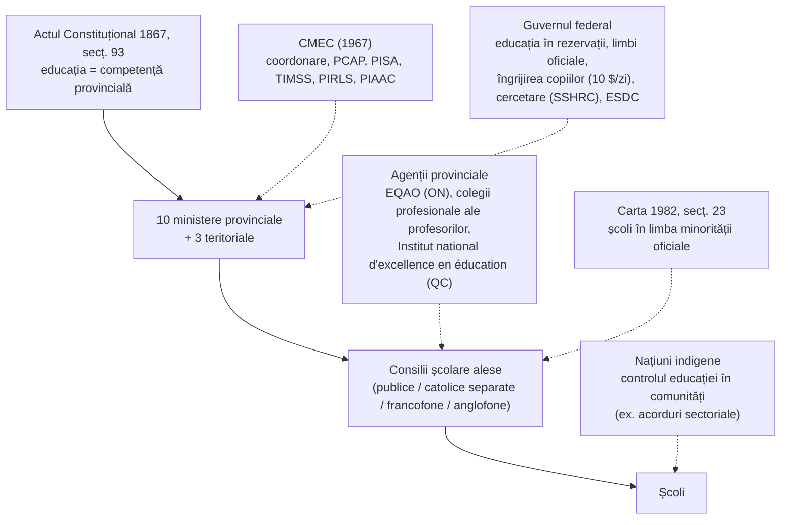
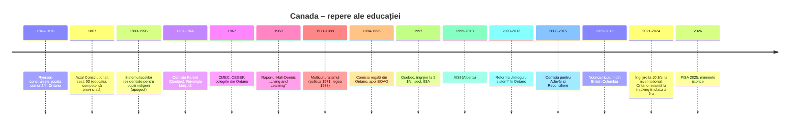

↑ [[00 Index - Analiza comparată internațională]] · [[00 MOC - Fundamentele științelor educației]]

> [!abstract] Pe scurt
> 1. **Un caz-limită de descentralizare.** Canada nu are minister federal al educației. Prin Actul Constituțional din 1867 (secț. 93), educația este **competență exclusivă a provinciilor**. Există deci **13 sisteme** (10 provincii și 3 teritorii), coordonate „orizontal” prin **CMEC** (Consiliul Miniștrilor Educației, 1967).
> 2. **Performanță înaltă și echitabilă, dar în declin.** La PISA, Canada a stat constant în grupul de vârf din 2000 încoace. Statutul socio-economic explică doar **6%** din variația scorurilor la științe (media OCDE: 12%, PISA 2025). Totuși, **PISA 2025** (publicat pe 8 septembrie 2026) aduce **cele mai slabe scoruri canadiene din istorie**: citire 490, matematică 485, științe 510.
> 3. **„Paradoxul imigrației”.** 39% dintre elevii de 15 ani au origine imigrantă (OCDE: 17%). Totuși, **nu există decalaj** între elevii imigranți și nativi (PISA 2025). Elevii din a doua generație îi depășesc chiar pe cei nativi. O parte importantă a explicației ține de **selecția imigranților** (sistemul pe puncte), nu doar de școală.
> 4. **Laboratorul reformei „întregului sistem”.** În Ontario, între 2003 și 2013, guvernul McGuinty, cu **Michael Fullan** consilier și **Ben Levin** viceministru, a aplicat o strategie cu puține ținte, **dezvoltarea capacității** profesorilor și parteneriat cu sindicatele. Este una dintre cele mai citate aplicații ale [[Teoria schimbării educaționale și leadershipul|teoriei schimbării educaționale]].
> 5. **Patru „filosofii” provinciale.** **Ontario**: ținte, date (EQAO) și capacitate. **Alberta**: alegerea școlii (singura provincie cu *charter schools*), examene provinciale și inovație de jos în sus (AISI, 1999–2013). **British Columbia**: curriculum pe competențe (*Know–Do–Understand*) și raportare formativă. **Quebec**: moștenirea **Raportului Parent** (1963–1966) și reforma pe competențe transversale din anii 2000.
> 6. **Educația timpurie ca politică socială.** Quebec a introdus servicii de îngrijire la cost redus în 1997, iar Ontario grădinița cu program complet în 2010–2014. Ambele se sprijină pe cercetarea canadiană despre dezvoltarea timpurie (Mustard, Hertzman).
> 7. **Rana istorică: școlile rezidențiale.** Circa 150.000 de copii indigeni au trecut prin sistemul școlilor rezidențiale. **Comisia pentru Adevăr și Reconciliere** (2015) l-a numit „genocid cultural”. Cele 94 de „Apeluri la acțiune” au reorientat curriculumul spre **reconciliere** și perspective indigene.
> 8. **Contribuții teoretice majore.** Canada a dat autori de referință: **Fullan și Hargreaves** (schimbarea educațională, capitalul profesional), **Leithwood** (leadership), **Cummins** (bilingvism, BICS/CALP), **Scardamalia și Bereiter** (construirea cunoașterii) și **Lorna Earl** (*assessment as learning*).
> 9. **Fundamente aplicate** (în termenii manualului): descentralizarea sistemului și managementul prin coerență, [[Evaluarea formativă|evaluarea formativă]], curriculumul pe competențe, [[Educația incluzivă|incluziunea]] și multiculturalismul, educația timpurie, precum și [[Învățarea pe tot parcursul vieții și formele educației|învățarea pe tot parcursul vieții]] (Canada are una dintre cele mai ridicate rate de absolvire terțiară din OCDE, prin colegii).
> 10. **Lecția pentru R. Moldova**: nu se pot copia bogăția sau imigrația selectivă. Se pot prelua însă **coerența** (puține priorități, menținute ani la rând), **evaluarea formativă**, **datele folosite pentru sprijin, nu pentru pedeapsă**, **parteneriatul cu profesorii** și investiția în educația timpurie.

---

## 1. Profil și date-cheie

| Indicator | Valoare | Sursă / observații |
|---|---|---|
| Populație | ≈ 41,5 milioane (2025) | Statistics Canada; creștere dominată de imigrație |
| Limbi oficiale | engleză și franceză (Legea limbilor oficiale, 1969) | peste 200 de limbi vorbite, dintre care peste 70 indigene (CMEC, *Measuring Up* PISA 2025) |
| Populație imigrantă | aproape 25% (recensământul 2021: peste 8,3 mil. imigranți actuali sau foști) | CMEC 2025, după Statistics Canada |
| Guvernanță | 10 ministere provinciale și 3 teritoriale; **fără minister federal** | Actul Constituțional 1867, secț. 93 |
| Coordonare pan-canadiană | **CMEC** (1967), secretariat la Toronto, președinție prin rotație | cmec.ca |
| Rol federal | educația din rezervațiile Primelor Națiuni (prin Indigenous Services Canada), limbile oficiale, finanțarea cercetării, transferuri pentru îngrijirea copiilor, colegiile militare | — |
| Autorități locale | consilii școlare (*school boards/districts*) alese; în Quebec, **centre de servicii școlare** din 2020 (Legea 40) | Ontario: 72 de consilii (31 publice anglofone, 29 catolice anglofone, 8 catolice francofone, 4 publice francofone) plus o autoritate protestantă separată |
| Educație timpurie (ISCED 0) | grădiniță de la 4–5 ani; Ontario: *Junior* și *Senior Kindergarten* cu program complet (4 și 5 ani); Quebec: *maternelle 4 ans* extinsă în anii 2020 | vârsta de intrare variază pe provincii |
| Primar (ISCED 1) | clasele 1–6 (în unele provincii, *elementary* ține până în clasa a 8-a) | — |
| Gimnazial (ISCED 2) | clasele 7–9 (*junior high/middle school*); în Quebec, *secondaire* I–III | — |
| Liceal (ISCED 3) | clasele 10–12; în Quebec, *secondaire* IV–V (clasele 10–11), apoi **CEGEP** | în Quebec: 11 ani de școală + CEGEP |
| Obligativitate | de regulă de la 5–7 ani până la **16 ani**; **până la 18 ani** în Ontario (din 2006), Manitoba și New Brunswick | variază pe provincii |
| Postliceal / terțiar | **colegii comunitare** (ISCED 5) și politehnici; **CEGEP** în Quebec (2 ani preuniversitar sau 3 ani tehnic); universități (ISCED 6–8) | — |
| Cheltuieli publice | ≈ 5–6% din PIB pentru instituțiile de educație (primar–terțiar), cu o pondere mare a terțiarului | *Education at a Glance* (OCDE), diverse ediții; valoare exactă de verificat în EAG 2025 |
| Adulți (PIAAC 2023) | literație **271** (OCDE: 259); numerație **271** (262); rezolvare adaptivă de probleme **259** (250) | Statistics Canada, *The Daily*, 10.12.2024 |
| Școli private | ≈ 6–8% din elevi la nivel național; în Quebec ≈ 17% la liceu (≈ 30% în Montreal), cu subvenții publice | *Education in Quebec*; valorile naționale variază după sursă |

> [!note] Comentariu: cele patru sisteme religios-lingvistice
> Secțiunea 93 a Actului din 1867 a **protejat drepturile școlilor confesionale** existente la unire. De aceea, în **Ontario, Alberta și Saskatchewan** școlile **catolice „separate”** sunt până azi **finanțate integral din bani publici**. Ontario a extins finanțarea integrală până la finalul liceului prin decizia premierului Bill Davis (anunțată în 1984, aplicată din 1985). Curtea Supremă a confirmat măsura în 1987 (*Reference re Bill 30*). Comitetul ONU pentru Drepturile Omului a considerat în 1999 (*Waldman v. Canada*) că finanțarea exclusivă a școlilor catolice este discriminatorie. Ontario nu și-a schimbat politica.
> - **Quebec** a obținut în 1997 un amendament constituțional (secț. 93A) care scoate provincia de sub incidența secț. 93. În 1998 a trecut de la consilii **confesionale** (catolice/protestante) la consilii **lingvistice** (francofone/anglofone).
> - **Newfoundland și Labrador** și-a desființat sistemul confesional în 1997–1998, printr-un amendament la *Termenul 17* al unirii.
> - **Secțiunea 23 a Cartei drepturilor și libertăților** (1982) garantează învățământ public în **limba minorității oficiale** (franceză în afara Quebecului, engleză în Quebec), acolo unde numărul elevilor o justifică. Curtea Supremă a extins-o la dreptul de a **gestiona** școlile (*Mahe v. Alberta*, 1990).

---

## 2. Traiectoria PISA 2000–2025

### 2.1 Scorurile medii ale Canadei (media OCDE în paranteză)

| Ciclu | Domeniu major | Citire | Matematică | Științe | Poziția aproximativă a Canadei |
|---|---|---|---|---|---|
| 2000 | citire | **534** (500) | 533 (500)¹ | 529 (500)¹ | la citire, a doua după Finlanda; în grupul de vârf la toate domeniile |
| 2003 | matematică | 528 (494) | **532** (500) | 519 (500)¹ | grupul de vârf (top 10) |
| 2006 | științe | 527 (492) | 527 (498) | **534** (500) | grupul de vârf; la științe, între primele ≈ 3–5 |
| 2009 | citire | **524** (493) | 527 (496) | 529 (501) | top 10 |
| 2012 | matematică | 523 (496) | **518** (494) | 525 (496) | top 10–15 (declin la matematică) |
| 2015 | științe | 527 (493) | 516 (490) | **528** (493) | top 10; la citire, printre primele ≈ 3 |
| 2018 | citire | **520** (487) | 512 (489) | 518 (489) | top 10 |
| 2022 | matematică | 507 (477) | **497** (472) | 515 (487) | la matematică, depășită de 8 sisteme; la citire, de 5 țări; la științe, de 6 țări (CMEC) |
| **2025** | **științe** | **490** (461) | **485** (463) | **510** (482) | la științe, depășită de 7 sisteme (Singapore, Japonia, Estonia, Coreea, B-S-J-Z, Macao, Taipei); la citire, de 9; la matematică, de 9. **Rezolvare computațională de probleme: 525** (OCDE: 500) |

*Surse:* CMEC, *Measuring Up: Canadian Results of the OECD PISA 2025 Study* (2026), tabelele B.1.15a, B.3.21a–d și B.3.22a–d, pentru scorurile 2000–2025 ale Canadei și mediile OCDE. Aceste medii OCDE sunt recalculate de CMEC pe compoziția actuală a OCDE, deci pot diferi cu 1–2 puncte de rapoartele originale (de ex. raportul OCDE din 2023 dă pentru 2022 mediile 476, 472 și 485). OCDE, *PISA 2025 Results (Volume I)* și *Country Note: Canada* (2026). ¹ Valori din rapoartele OCDE PISA 2000/2003, fără legătură statistică de trend cu ciclurile ulterioare (**de verificat** dacă se citează la zecimală). Pozițiile pentru 2000–2018 sunt **aproximative** (clasamentul depinde de semnificația statistică) și sunt indicate doar ca ordin de mărime.

> [!warning] Calitatea datelor în PISA 2022 și 2025
> În 2025, Canada **nu a atins ratele minime de răspuns**: 79% dintre școli înainte de înlocuire, 82% după înlocuire, 77% dintre elevi. OCDE a publicat rezultatele **cu asterisc**. La nivelul elevilor, non-răspunsul a produs o **ușoară supraestimare**, localizată în Alberta, BC, Manitoba, Newfoundland și Labrador, Nova Scotia, Ontario și Quebec. Conform analizei OCDE, această supraestimare **probabil nu depășește 15 puncte la științe**. Prin urmare, declinul real ar putea fi **cel puțin la fel de mare** ca cel raportat. Probleme similare au existat și în 2022 (OCDE, *PISA 2025 Results, Vol. I*, anexa privind datele; CMEC 2025, anexa A).

### 2.2 Ce s-a întâmplat în 2025

- **Cele mai slabe rezultate canadiene din istoria PISA** la toate cele trei domenii, semnificativ sub nivelul din 2015 (OCDE, *Country Note Canada*, 2026).
- **Citire**: −17 puncte față de 2022 și −30 față de 2018. Media OCDE a scăzut cu 15, respectiv 26 de puncte, deci declinul canadian **este comparabil cu cel internațional** (CMEC 2025).
- **Matematică**: −12 puncte față de 2022 (OCDE: −9). Declinul continuă tendința începută după 2003–2006.
- **Științe**: **stabil** față de 2022 (515 → 510, diferență nesemnificativă), dar −18 față de 2015 și −24 față de 2006.
- **Elevii slabi** (sub nivelul 2) au crescut față de 2015 cu **12 puncte procentuale la matematică**, **11 la citire** și 5 la științe (OCDE, *Country Note*).
- Profesorul **Louis Volante** (Brock University) avertizează împotriva politizării rezultatelor. El vede declinul ca parte a unui **trend global** și cere ca rezultatele cognitive să fie echilibrate cu cele noncognitive (sănătate mintală, apartenență) (*Policy Options*, IRPP, septembrie 2026).

### 2.3 Niveluri de competență și echitate

| Indicator | Canada | Media OCDE | Ciclu / sursă |
|---|---|---|---|
| Sub nivelul 2 – științe / citire / matematică | **16% / 22% / 26%** | 26% / 31% / 35% | PISA 2025, CMEC |
| Nivelurile 5–6 – științe / citire / matematică | **11% / 9% / 11%** | 7% / 6% / 8% | PISA 2025, OCDE |
| Variația la științe explicată de statutul socio-economic (ESCS) | **6%** | 12% | PISA 2025, OCDE |
| Decalajul avantajați–dezavantajați (quartila de sus vs. cea de jos, științe) | **59 p.** | 85 p. | PISA 2025 |
| Variația la matematică explicată de ESCS | 10,2% | 15,5% | PISA 2022, CMEC |
| Elevi dezavantajați „rezilienți” (în quartila de sus a performanței) | **15%** | 12% | PISA 2025 |
| Elevi cu origine imigrantă | **39%** (Ontario, Alberta, BC: peste 40%) | 17% | PISA 2025, CMEC |
| Științe: nativi / imigranți generația a II-a / generația I | **518 / 528 / 499** | 495 / 460 / 437 | PISA 2025, CMEC, tab. 2.3 |
| Științe după limba vorbită acasă: engleză / franceză / altă limbă | 518 / 514 / 501 | — | PISA 2025, CMEC |
| Școli în limba majorității vs. în limba minorității oficiale (științe) | +31 p. în favoarea majorității | — | PISA 2025, CMEC |
| Decalaj de gen la științe | băieții +5 p. | fetele +1 p. | PISA 2025 |

> [!note] Comentariu: excelență *și* echitate
> OCDE plasează Canada printre cele **șapte sisteme** care combină trei lucruri: **incluziune** (peste 75% dintre elevi la nivelul 2 sau mai sus), **echitate socio-economică** (sub 10% din variație explicată de ESCS) și **performanță peste media OCDE**. Celelalte sunt B-S-J-Z (China), Estonia, Irlanda, Japonia, Coreea și Macao (OCDE, *PISA 2025 Results, Vol. I*). **Nuanță importantă:** între 2022 și 2025, reducerea decalajelor socio-economice a venit în mare parte din **scăderea elevilor avantajați**, nu din progresul celor dezavantajați (OCDE, 2026).

### 2.4 Rezultate pe provincii (PISA 2025)

| Provincie | Științe | Citire | Matematică | Observații (CMEC 2025) |
|---|---|---|---|---|
| Newfoundland și Labrador | 489 | 471 | 458 | sub media Canadei |
| Insula Prințului Eduard | 481 | 467 | 452 | la matematică, −26 față de 2022 |
| Nova Scotia | 499 | 484 | 477 | — |
| New Brunswick | 474 | 456 | 449 | cea mai slabă provincie; sub media OCDE la științe |
| **Quebec** | **510** | 483 | **500** | **singura provincie peste media Canadei la matematică**; cele mai mici decalaje între elevi |
| **Ontario** | **513** | 494 | 484 | peste media Canadei la subscala „cercetare, evaluare și folosirea informației științifice” și la științele mediului |
| Manitoba | 494 | 477 | 467 | — |
| Saskatchewan | 500 | 482 | 471 | — |
| **Alberta** | **520** | **499** | 489 | cel mai bun scor la științe; 14% la nivelurile 5–6; **cele mai mari decalaje** (împreună cu BC) |
| **British Columbia** | 510 | 494 | 482 | cel mai mare decalaj avantajați–dezavantajați (66 p.) |
| **Canada** | **510** | **490** | **485** | — |
| Media OCDE | 482 | 461 | 463 | — |

**Evoluția pe termen lung în cele patru provincii analizate** (CMEC 2025, tabelele de trend):

| Provincie | Citire 2000 → 2025 | Matematică 2003 → 2025 | Științe 2006 → 2025 |
|---|---|---|---|
| Ontario | 533 → 494 | 530 → 484 | 537 → 513 |
| Alberta | 550 → 499 | 549 → 489 | 550 → 520 |
| British Columbia | 538 → 494 | 538 → 482 | 539 → 510 |
| Quebec | 536 → 483 | 536 → 500 | 531 → 510 |

> [!tip] Lecție: Quebec și matematica
> Quebec a condus Canada la matematică în aproape toate ciclurile (544 în 2015). În 2025 este singura provincie peste media canadiană. Explicațiile propuse în literatura canadiană sunt **ipoteze**, nu relații cauzale demonstrate: pregătirea mai specializată a profesorilor de matematică, un curriculum mai exigent și tradiția didacticii franceze a matematicii (de verificat în studii comparative provinciale).

### 2.5 Alte date PISA 2025: atitudini, climat, bunăstare

| Indicator | Canada | OCDE |
|---|---|---|
| Absenteism: cel puțin o zi de școală lipsă în ultimele 2 săptămâni | **32%** (2022: 29%; 2018: 23%) | 22% |
| Victime ale unei forme de bullying de câteva ori pe lună | 19% (în creștere față de 2022) | 20% |
| Mentalitate de creștere (*growth mindset*) | 76% | 69% |
| Își planifică des modul de studiu (autoreglare) | 45% | 37% |
| Își pun întrebări ca să verifice dacă au înțeles | 56% | 49% |
| Folosesc chatboți AI pentru învățare cel puțin săptămânal | 38% | 46% |
| Școli cu interdicția telefoanelor în incintă | **37%** (2022: 10%) | 49% |
| Părinți care întreabă cel puțin săptămânal ce a făcut copilul la școală | 69% (2022: 78%) | — |
| Directori care raportează lipsă de personal didactic | 38% | 39% |

*Sursă:* OCDE, *PISA 2025 Results (Volume I) – Country Notes: Canada* (2026). Rezultatele privind **învățarea autodirijată în mediul digital** vor fi publicate în **2027**. Următorul ciclu PISA: **2029** (domeniu major: citirea; domeniu inovativ: media și inteligența artificială).

> [!info] TIMSS, PIRLS, PCAP
> Canada participă la **PIRLS** și **TIMSS** prin provincii: Ontario și Quebec au participat constant la TIMSS, iar mai multe provincii la PIRLS. Scorurile pe provincii nu au fost verificate pentru această notă. Evaluarea proprie pan-canadiană este **PCAP** (*Pan-Canadian Assessment Program*, CMEC). A pornit în **2007**, după SAIP (1993–2004), și testează elevii de clasa a 8-a, prin rotație la citire, matematică și științe (cicluri 2019, 2023, următorul în 2027). PCAP raportează doar la nivel pan-canadian și provincial, nu pe școli sau elevi.

---

## 3. Cronologia reformelor

| An | Reformă / lege / program | Ideea centrală | Legătura cu fundamentele |
|---|---|---|---|
| 1844–1876 | **Egerton Ryerson**, superintendent-șef al educației în Canada de Vest (Ontario); *Common School Act* (1846, 1850) | școală publică comună, finanțată local, cu programe, manuale și formarea profesorilor (*Normal School*, Toronto, 1847) | sistemul de învățământ modern, clasic ([[Modulul 08 - Sistemul de educație și managementul educației\|M08]]); tradiția școlii comune |
| 1847 | Raportul lui Ryerson despre școlile industriale pentru copiii indigeni | a recomandat școli-internat separate, cu educație religioasă și prin muncă. Comisia pentru Adevăr și Reconciliere îl citează ca antecedent al școlilor rezidențiale | educația ca **asimilare**, contra-exemplu pentru finalități ([[Modulul 04 - Finalitățile educației\|M04]]) |
| 1867 | *British North America Act*, **secț. 93** | educația este competență provincială; drepturile școlilor confesionale sunt protejate | descentralizare constituțională |
| 1871 | *School Act* (Ontario) | școală elementară **gratuită și obligatorie** (până la 12 ani) | democratizarea accesului |
| 1879 → 1920 | Raportul Davin (1879); amendamente la *Indian Act* (1894, 1920) care fac obligatorie frecventarea școlilor pentru copiii indigeni | modelul școlilor-internat americane, separarea copiilor de familii | vezi §5.6 și §8 |
| 1961–1966 | **Comisia regală de anchetă asupra educației în Quebec** (Comisia Parent), condusă de Mgr Alphonse-Marie Parent; 5 volume, ≈ 500 de recomandări | laicizarea controlului, democratizarea accesului, școala comprehensivă | trecerea de la paradigma clasică la cea modernă ([[Modulul 02 - Clasic, modern și postmodern în educație\|M02]]) |
| 1964 | Legea 60: **Ministerul Educației din Quebec** (primul ministru al educației: Paul Gérin-Lajoie) și **Consiliul superior al educației** | statul preia sistemul de la Biserică | managementul sistemului |
| 1965 | Experimentul de **imersiune în franceză** de la Saint-Lambert (Quebec); studiul lui Lambert și Tucker (1972) | copiii anglofoni învață în franceză de la grădiniță | educația bilingvă, [[Socioconstructivismul și teoria activității (Vygotsky)\|învățarea limbii prin conținut]] |
| 1965 | Înființarea **OISE** (Ontario Institute for Studies in Education) | un institut dedicat cercetării educaționale | [[Modulul 01 - Statutul științelor educației\|M01]], cercetare |
| 1967 | **CEGEP** în Quebec (primele 12 au deschis în septembrie 1967); colegiile de arte aplicate și tehnologie (CAAT) în Ontario; **CMEC** | nivel postliceal de masă; coordonare pan-canadiană | [[Învățarea pe tot parcursul vieții și formele educației\|învățarea pe tot parcursul vieții]] |
| 1968 | **Raportul Hall-Dennis**, *Living and Learning* (Ontario), condus de judecătorul Emmett Hall și Lloyd Dennis | școală centrată pe copil, flexibilă, bazată pe investigație; eliminarea rigidității | [[Progresivismul și educația nouă]] |
| 1969 | Legea limbilor oficiale (după Comisia regală pentru bilingvism și biculturalism, 1963–1969) | bilingvismul instituțional | educația interculturală |
| 1971 / 1988 | **Politica multiculturalismului** (P. E. Trudeau, 8 octombrie 1971: „multiculturalism în cadru bilingv”); Carta 1982, secț. 27; **Legea multiculturalismului** (1988) | recunoașterea diversității ca valoare publică | [[Modulul 07 - Noile educații\|educația pentru toleranță și pace]] |
| 1972 | *Indian Control of Indian Education* (National Indian Brotherhood), adoptat ca politică federală în 1973 | controlul comunităților indigene asupra educației | pedagogia critică, autodeterminare |
| 1977 | *Charte de la langue française* (Legea 101, Quebec) | copiii imigranților învață în școli francofone | integrarea lingvistică |
| 1982 | Carta drepturilor și libertăților, **secț. 23** | școli în limba minorității oficiale | echitate lingvistică |
| 1984–1987 | Ontario: finanțare integrală pentru școlile catolice până la finalul liceului (Legea 30) | extinderea drepturilor confesionale | pluralism instituțional |
| 1993–1995 | Comisia regală pentru învățare din Ontario, raportul *For the Love of Learning* (1994; M. Bégin, G. Caplan) | a recomandat EQAO, Colegiul Profesorilor și grădinița pentru 4 ani | responsabilizare, profesionalizare |
| 1994 | Alberta: legislația pentru **charter schools** (primele 3 au deschis în 1995) | școli publice autonome, alese de părinți | [[Responsabilizare, piață și încredere în guvernarea educației\|piața educațională]] |
| 1995–1996 | Quebec: **États généraux sur l'éducation**; raportul Inchauspé *Réaffirmer l'école* (1997); politica *L'école, tout un programme* (1997) | reforma curriculumului pe competențe | [[Taxonomiile obiectivelor și educația centrată pe competențe]] |
| 1996 | **EQAO** (Ontario): teste în clasele 3 și 6 (literație, matematică), 9 (matematică) și OSSLT în clasa a 10-a (condiție de absolvire) | responsabilizare prin date publice | evaluare sumativă externă |
| 1997 | Quebec: **politica familială** și centrele de îngrijire la **5 $/zi** (CPE); amendamentul constituțional 93A | educație timpurie universală la cost redus | Educația timpurie |
| 1997–1998 | Ontario (guvernul Harris): **Legea 160** (centralizarea finanțării; grevă a profesorilor, 1997); comasarea consiliilor școlare; **Ontario College of Teachers** (1997); noul curriculum cu filiere *academic/applied* în clasa a 9-a (1999) | „Revoluția bunului-simț”: standarde, testare, control al costurilor | responsabilizare de tip piață/ierarhie |
| 1999–2013 | **AISI** (Alberta Initiative for School Improvement) | proiecte de îmbunătățire concepute de școli, pe cicluri de 3 ani, finanțate de provincie | inovație de jos în sus, cercetare-acțiune |
| 2000–2009 | Quebec: **Programme de formation de l'école québécoise** (primar din 2000–2001, gimnaziu din 2005) | competențe transversale, domenii generale de formare, cicluri, socioconstructivism | [[Socioconstructivismul și teoria activității (Vygotsky)]] |
| 2003–2013 | Ontario (McGuinty): reforma „întregului sistem” | ținte (75% la standard în clasa a 6-a; 85% absolvire), capacitate, parteneriat | [[Teoria schimbării educaționale și leadershipul]] |
| 2004 | **Literacy and Numeracy Secretariat** (Ontario) | echipe de sprijin pentru dezvoltarea capacității, nu inspecție punitivă | [[Profesionalismul cadrului didactic]] |
| 2005–2006 | *Student Success / Learning to 18*; vârsta obligatorie crește la 18 ani (2006); *Specialist High Skills Major* | prevenirea abandonului, rute diversificate spre muncă | echitate, orientare |
| 2007 | **PCAP** (CMEC) | evaluare pan-canadiană la clasa a 8-a | evaluare de sistem |
| 2008 | Scuzele oficiale ale guvernului federal pentru școlile rezidențiale; începutul activității **Comisiei pentru Adevăr și Reconciliere** | adevăr, reparație, reconciliere | educația pentru pace și memorie |
| 2010 | Ontario: ***Growing Success*** (politica de evaluare) | evaluare *pentru*, *ca* și *a* învățării | [[Evaluarea formativă]] |
| 2010–2014 | Ontario: **grădinița cu program complet** pentru 4–5 ani (după raportul Pascal *With Our Best Future in Mind*, 2009) | învățare prin joc și investigație; educatoare și profesor în aceeași clasă | Educația timpurie |
| 2013 | Alberta: finanțarea AISI este suspendată; New Brunswick: **Politica 322** de educație incluzivă | — ; incluziune în clasa obișnuită | [[Educația incluzivă]] |
| 2014 | Ontario: *Achieving Excellence* (excelență, echitate, **bunăstare**, încredere publică) | extinderea finalităților dincolo de literație și numerație | [[Învățarea socio-emoțională și educația caracterului]] |
| 2015 | **Raportul final al Comisiei pentru Adevăr și Reconciliere**: 94 de Apeluri la acțiune (educație: 6–12, 62–65) | curriculum obligatoriu despre școlile rezidențiale, tratate și contribuțiile indigene | [[Pedagogia critică și educația pentru cetățenie]] |
| 2015 | Ontario: formarea inițială a profesorilor devine de **2 ani** (4 semestre, cel puțin 80 de zile de practică) | profesionalizare | [[Profesionalismul cadrului didactic]] |
| 2016–2019 | **BC**: noul curriculum (K–9 în 2016/17, 10–12 până în 2019/20); competențe esențiale; modelul *Know–Do–Understand* | curriculum conceptual, bazat pe competențe | [[Taxonomiile obiectivelor și educația centrată pe competențe]] |
| 2016 | Curtea Supremă a Canadei îi dă câștig de cauză sindicatului BCTF (clauzele privind mărimea și componența claselor, eliminate prin lege în 2002) | dreptul la negociere colectivă | condițiile muncii didactice |
| 2017 | CMEC: **competențele globale pan-canadiene** (6) | cadru comun, fără a impune curriculum | finalități |
| 2019 | Quebec: **Legea 21** privind laicitatea (interzice simbolurile religioase pentru profesorii nou angajați) | laicitatea statului | dezbatere despre drepturi și neutralitate |
| 2020 | Quebec: **Legea 40**, consiliile școlare francofone devin centre de servicii școlare; Ontario: nou curriculum de matematică (1–8), cu programare și educație financiară | recentralizare administrativă; „înapoi la baze” plus competențe noi | managementul sistemului |
| 2021 | Program federal de îngrijire a copiilor: în medie **10 $/zi** până în 2025–2026 (acorduri cu toate provinciile) | educație și îngrijire timpurie universală | [[Capitalul uman și economia educației]] |
| 2021–2022 | Ontario renunță la separarea în filiere (*de-streaming*) în clasa a 9-a: întâi la matematică (2021), apoi la toate disciplinele (2022) | amânarea diferențierii pe filiere | [[Echitatea și școala comprehensivă]] |
| 2022 | Comisia pentru Drepturile Omului din Ontario, raportul ***Right to Read*** | predarea explicită și sistematică a citirii (fonetică) | [[Știința cognitivă a învățării]] |
| 2022–2024 | Alberta: noul curriculum K–6, introdus treptat și contestat; BC: **cerința de absolvire cu 4 credite pe teme indigene** și noua politică de raportare (scala de competență K–9) | — | curriculum, evaluare |
| 2023–2024 | Quebec: cursul *Éthique et culture religieuse* (2008) este înlocuit de *Culture et citoyenneté québécoise*; Legea 23 creează **Institutul național de excelență în educație** (de verificat detaliile implementării) | educație civică; politică bazată pe dovezi | Educația bazată pe dovezi |
| 2024 | Legea federală privind educația și îngrijirea timpurie (C-35); interdicții sau restricții pentru telefoane în școli în mai multe provincii | — | educația digitală |
| 2025 | Alberta: grevă provincială a profesorilor (octombrie), încheiată printr-o lege de întoarcere la muncă (detalii de verificat) | conflict privind salariile și mărimea claselor | statutul profesorului |
| 2026 | **PISA 2025**: minimele istorice ale Canadei | dezbatere națională despre cauze | — |

---

## 4. Implementarea fundamentelor

### 4.1 Statutul științelor educației, cercetarea și politica bazată pe dovezi
→ [[Modulul 01 - Statutul științelor educației]] · [[Modulul 05 - Paradigmele pedagogiei și cercetarea pedagogică]]

**O infrastructură de cercetare fără centru federal.** Canada nu are un echivalent al *Institute of Education Sciences* (SUA) sau al unei agenții naționale de evaluare. Cercetarea este **distribuită** între mai mulți actori:

| Actor | Rol | Exemplu concret |
|---|---|---|
| **OISE / University of Toronto** (1965; fuzionat cu Facultatea de Educație în 1996) | cel mai influent centru de cercetare educațională din Canada | Fullan, Hargreaves (director al Centrului internațional pentru schimbare educațională din 1987), Leithwood, Scardamalia și Bereiter, Cummins, Carol Campbell |
| **Universitățile provinciale** | facultăți de educație, formarea profesorilor | UBC (HELP: Clyde Hertzman, *Early Development Instrument*; Kimberly Schonert-Reichl, SEL); Simon Fraser (Kieran Egan, *Imaginative Education*); Université Laval, UQAM, Université de Montréal (didactica franceză, evaluarea reformei); University of Saskatchewan (Marie Battiste, *Decolonizing Education*, 2013); McMaster (Offord Centre: EDI, Janus și Offord) |
| **CMEC** | date comparative (PISA, PIAAC, TIMSS, PIRLS, TALIS), PCAP, seria *Assessment Matters!* | rapoartele *Measuring Up* |
| **Statistics Canada** | anchete longitudinale (*Youth in Transition Survey*, *National Longitudinal Survey of Children and Youth*), recensăminte | PIAAC 2023 |
| **Agenții provinciale** | EQAO (Ontario), unități de evaluare ale ministerelor; din 2023–2024 Institutul național de excelență în educație (Quebec) | rapoarte anuale EQAO pe școli |
| **Organisme independente** | *Canadian Council on Learning* (2004–2012, închis după oprirea finanțării federale); EdCan Network (fost *Canadian Education Association*, 1891); **People for Education** (Ontario, 1996); think-tank-uri (C.D. Howe, Fraser Institute, IRPP) | clasamentele Fraser ale școlilor; analize C.D. Howe despre matematică (Anna Stokke, 2015) |
| **Finanțatori** | SSHRC (consiliul federal pentru științe sociale); Apelul la acțiune 65 cere un program național de cercetare despre reconciliere | — |

**Politica bazată pe dovezi, în versiunea canadiană:**
- **Ontario 2003–2013** a folosit sistematic **datele EQAO** pentru a identifica școlile care au nevoie de sprijin (programul OFIP: *Ontario Focused Intervention Partnership*). Datele au servit la **alocarea sprijinului**, nu la sancțiuni. Levin (2008) și Fullan (2010) prezintă această diferență ca esențială.
- **Pilotare și evaluare externă**: OCDE a analizat Ontario în *Strong Performers and Successful Reformers in Education* (2011), iar McKinsey l-a inclus în *How the World's Most Improved School Systems Keep Getting Better* (Mourshed, Chijioke și Barber, 2010).
- **Contra-exemplul**: reforma din Quebec din anii 2000 a fost criticată pentru că a fost generalizată **fără pilotare riguroasă**. Evaluarea longitudinală condusă de o echipă de la Université Laval (Simon Larose și colab., publicată în 2014; titlul exact de verificat) nu a găsit efectele pozitive așteptate asupra rezultatelor.
- ***Right to Read*** (OHRC, 2022) este un caz rar în care o **comisie pentru drepturile omului** a folosit sinteze de cercetare cognitivă ca argument juridic de echitate: accesul la citire este un drept.

> [!note] Comentariu
> Canada ilustrează bine teza manualului: științele educației sunt **plurale** și **interdisciplinare** (M01). Economia educației (Mustard, Hertzman), sociologia schimbării (Fullan), psiholingvistica (Cummins), științele învățării (Scardamalia și Bereiter) și studiile indigene (Battiste) au influențat direct politicile publice.

### 4.2 Paradigme pedagogice dominante: clasic – modern – postmodern
→ [[Modulul 02 - Clasic, modern și postmodern în educație]]

| Etapă | Paradigmă | Manifestare canadiană |
|---|---|---|
| **Sec. XIX – anii 1950** | **clasică**: școala comună, disciplină, memorare, educație religioasă și morală | modelul Ryerson (inspirat de sistemele prusac și irlandez); școlile confesionale; în Quebec, colegiile clasice ale Bisericii; școlile rezidențiale ca formă extremă de „educație” asimilaționistă |
| **Anii 1960–1970** | **modernă / progresivistă**: copilul în centru, flexibilitate, democratizare | Raportul Parent (1963–1966); ***Living and Learning*** (Hall-Dennis, 1968), cu accent pe nevoile copilului, învățarea prin descoperire, clase deschise și predare în echipă; școlile „polivalente” din Quebec |
| **Anii 1980–1990** | reacție **neoliberală și de responsabilizare**: standarde, teste, alegerea școlii | Ontario sub Harris (1995–2003); charter schools în Alberta (1994); testele EQAO (1996) și examenele de diplomă din Alberta |
| **2000–2015** | **sinteză pragmatică**: responsabilizare „inteligentă” și capacitate | reforma din Ontario (ținte plus sprijin); AISI în Alberta; *Growing Success* |
| **2010–prezent** | **postmodernă / pe competențe și incluzivă**: competențe transversale, bunăstare, decolonizare, personalizare | curriculumul din BC (2016), competențele globale CMEC (2017), Apelurile la acțiune ale Comisiei (2015), educația timpurie prin joc |
| **Anii 2020** | **contrareacție cognitivistă**: „știința citirii”, explicit în matematică | *Right to Read* (2022); curriculumul de matematică din Ontario (2020); noul curriculum K–6 din Alberta (2022–2024) |

> [!warning] Critică: pendulul
> Istoria canadiană arată **oscilații** între progresivism (1968, 2016) și „înapoi la baze” (1995, 2020). Criticii Hall-Dennis au pus pe seama raportului scăderea exigenței în anii 1970. Criticii reformei din Quebec au vorbit despre „pedagogii dogmatice”, iar criticii curriculumului din BC despre „conținut subțiat”. Susținătorii au răspuns că **implementarea**, nu ideea, a fost problema. Aceasta este exact tema manualului: tensiunea **clasic–modern–postmodern** se rezolvă prin **sinteză**, nu prin înlocuire.

### 4.3 Formele educației: formal, nonformal, informal; învățarea pe tot parcursul vieții
→ [[Modulul 03 - Formele generale ale educației]] · [[3.6 Educația permanentă și autoeducația]] · [[Autoeducația - teorii, autori și corelări]]

**Educația formală extinsă după liceu.** Canada are unul dintre cele mai ridicate niveluri de absolvire terțiară din OCDE (în jur de 60% dintre adulții de 25–64 de ani; cifra exactă și clasamentul de verificat în *Education at a Glance* 2025). Motivul principal este rețeaua de **colegii comunitare** și **CEGEP**:
- **CEGEP** (Quebec, 1967) are 2 ani de program preuniversitar sau 3 ani de program tehnic și este **obligatoriu înainte de universitate**. Face trecerea spre studiile superioare aproape gratuită (taxe de câteva sute de dolari pe an).
- **Colegiile din Ontario** (CAAT, 1965–1967, sub ministrul Bill Davis) oferă diplome aplicate, ucenicie și programe pentru adulți.
- **Ucenicia** (*Red Seal*) este standardizată interprovincial pentru meserii.
- **Educația cooperativă** (*co-op*) alternează perioade de studiu cu perioade de muncă. University of Waterloo a introdus modelul în 1957 și este astăzi unul dintre cele mai mari programe co-op din lume.

**Educația nonformală.** Biblioteci publice puternice; *Let's Talk Science* (științe, 1993); ParticipACTION (activitate fizică, 1971); organizații de tineret; programe culturale ale comunităților imigrante (școli de sâmbătă de limbă-moștenire, finanțate uneori prin programele *International/Heritage Languages*); programe de **reînvățare a limbilor indigene** în comunități.

**Educația informală și media.** Radiodifuzorii publici educaționali (TVO, TFO, Télé-Québec, Knowledge Network în BC) au rădăcini în anii 1970. TVO găzduiește și *Independent Learning Centre* pentru elevi și adulți.

**Adulții** (PIAAC 2023): Canada este peste media OCDE la toate domeniile, dar adulții imigranți au scoruri mai mici decât cei născuți în Canada, mai ales la literație. Diferența poate reflecta evaluarea în limba a doua. Numerația a crescut ușor față de 2012, iar literația a rămas stabilă (Statistics Canada, 2024).

**Autoeducația.** PISA 2025 arată că elevii canadieni **își planifică studiul** (45%) și **se autochestionează** (56%) mai des decât media OCDE. De asemenea, cer ajutor profesorului (81%) și colegilor (83%), iar acest comportament este asociat pozitiv cu performanța. Canada are o tradiție explicită a **autoreglării ca finalitate** (vezi §5, Shanker și Lorna Earl), dar și a **învățării independente la distanță** (ILC, e-learning, școlile virtuale din BC și Alberta).

> [!tip] Corelare cu manualul
> Principiul **educației permanente** (M03, p. 79–121) are în Canada o bază instituțională: *Learn Canada 2020* (CMEC, 2008) a organizat politica pe **patru piloni ai învățării pe tot parcursul vieții**: educație timpurie, școală, postliceal și învățarea adulților. Modelul corespunde „cetății educative” din manual.

### 4.4 Finalități: ideal educațional, scopuri, cadre de competențe
→ [[Modulul 04 - Finalitățile educației]]

Nu există un „ideal educațional” național scris în lege, cum există în Codul Educației al R. Moldova. Finalitățile sunt **provinciale** și convergente:

| Nivel | Document | Finalități |
|---|---|---|
| Pan-canadian | CMEC, **Competențele globale** (2017) | (1) gândire critică și rezolvare de probleme; (2) inovație, creativitate și antreprenoriat; (3) a învăța să înveți, conștiință de sine și autodirijare; (4) colaborare; (5) comunicare; (6) cetățenie globală și sustenabilitate |
| Ontario | *Achieving Excellence* (2014) | **excelență, echitate, bunăstare, încrederea publicului** |
| Alberta | *Inspiring Education* (2010); ordinul ministerial privind învățarea elevilor (2013; revizuit în 2020) | cetățean „implicat intelectual, etic și cu spirit antreprenorial”; literație și numerație ca fundament |
| British Columbia | *Statement of Education Policy Order* (misiunea „educated citizen”); curriculum 2016 | **3 competențe esențiale**: *Communication*, *Thinking*, *Personal and Social*; cetățeanul educat, sănătos și capabil să contribuie la o societate democratică și pluralistă |
| Quebec | Misiunea școlii din *L'école, tout un programme* (1997) | **„instruire, socializare, calificare”** (*instruire, socialiser, qualifier*), în spiritul egalității șanselor |

> [!note] Comentariu: trei niveluri de finalitate
> Triada din Quebec (**a instrui – a socializa – a califica**) corespunde aproape exact funcțiilor educației din manual: cognitivă, socială și economică (M02). Formula lui Ontario (**excelență + echitate + bunăstare**) și cele trei competențe din BC ilustrează trecerea de la finalități de **conținut** la finalități de **competență și dezvoltare a persoanei**, adică paradigma curriculară „postmodernă” din manual (M04).

### 4.5 Dimensiunile educației
→ [[Modulul 06 - Dimensiunile generale ale educației]]

| Dimensiune | Implementare canadiană |
|---|---|
| **Intelectuală** | literație și numerație prioritare (Ontario 2004); gândire critică și creativă (BC); competențele intelectuale transversale din Quebec (a exploata informația, a rezolva probleme, a-și exercita judecata critică, a pune în practică gândirea creativă) |
| **Morală / caracter** | Ontario, *Character Development Initiative* (2006–2008); în școlile catolice, formare religioasă; Quebec, *Éthique et culture religieuse* (2008), apoi *Culture et citoyenneté québécoise*; Apelul 64 cere ca școlile confesionale finanțate public să predea religii comparate, inclusiv spiritualitățile indigene |
| **Tehnologică / digitală** | Ontario: programare în curriculumul de matematică (2020); BC: *Applied Design, Skills, and Technologies* (ADST) K–12; interdicția telefoanelor în clasă (Ontario 2019, extinsă în 2024); PISA 2025: 38% folosesc săptămânal AI pentru învățare |
| **Estetică** | arte obligatorii în primar; BC cere la absolvire un curs de arte sau de ADST; Kieran Egan (SFU): educația „imaginativă” |
| **Psihofizică** | *Daily Physical Activity* (Ontario, 20 de minute pe zi în primar, din 2005); *Physical and Health Education* obligatoriu în BC; ParticipACTION; nutriție (programe de mic-dejun/prânz școlar, iar în 2024 guvernul federal a anunțat un program național de alimentație școlară; detalii de verificat) |

### 4.6 „Noile educații”
→ [[Modulul 07 - Noile educații]]

| Noua educație | Expresia canadiană | Evaluare |
|---|---|---|
| **Educația interculturală / pentru toleranță** | multiculturalism (1971, 1988); politici antirasiste și de echitate (Ontario, *Equity and Inclusive Education Strategy* 2009; *Education Equity Action Plan* 2017) | integrarea imigranților reușește la nivel de rezultate (PISA), dar persistă decalaje pentru anumite grupuri, de exemplu elevii de culoare din Toronto, orientați istoric mai des spre filierele *applied* (date TDSB; de verificat pentru cifre) |
| **Educația pentru reconciliere** | Comisia pentru Adevăr și Reconciliere (2015). **Apelul 62**: curriculum obligatoriu, adaptat vârstei, despre școlile rezidențiale, tratate și contribuțiile popoarelor indigene; formarea profesorilor. **Apelul 63**: angajamentul CMEC pentru resurse și formare interculturală. BC: principiile de învățare ale Primelor Popoare (*First Peoples Principles of Learning*) și cerința de absolvire cu credite indigene; Ontario: revizuirea curriculumului de istorie (clasele 4–8 și 10) și cursuri despre Primele Națiuni, Métis și Inuit | schimbare **reală**, dar inegală între provincii; critici privind formarea insuficientă a profesorilor și riscul „bifării” |
| **Educația pentru mediu / sustenabilitate** | subscala PISA 2025 de științele mediului: **84%** la nivelul 2 sau peste (OCDE: 74%); 87% cred că pot avea un impact pozitiv asupra mediului | atitudini puternice, dar implicarea practică e apropiată de media OCDE |
| **Educația pentru cetățenie** | *Civics and Citizenship* obligatoriu în clasa a 10-a (Ontario); **Student Vote** (organizația CIVIX) simulează alegeri în școli | model nonformal integrat în școală |
| **Educația media** | *media literacy* integrată în curriculumul de limbă din Ontario încă din anii 1980 (pionierat, *Association for Media Literacy*); MediaSmarts (organizație națională) | tradiție veche |
| **SEL și sănătatea mintală** | Ontario: *Well-Being Strategy* (2016), expectative SEL în matematica 1–8 (2020); ***Roots of Empathy*** (Mary Gordon, Toronto, 1996); *MindUP* evaluat la UBC; Stuart Shanker, autoreglarea (*Calm, Alert, and Learning*, 2013) | vezi §5; efecte documentate, dar eterogene |
| **Educația pentru sănătate / sexualitate** | curriculumul de sănătate din Ontario (2010 retras, 2015 introdus, 2018 abrogat temporar, 2019 revizuit) | caz de **politizare** extremă (vezi §7) |
| **Educația pentru familie** | educația parentală prin centrele *EarlyON* (Ontario) și CPE (Quebec) | PISA 2025: **scade sprijinul familial raportat** de elevi |

### 4.7 Sistemul și managementul
→ [[Modulul 08 - Sistemul de educație și managementul educației]]

**Descentralizare dublă: federal → provincii → consilii școlare.** În ultimele trei decenii, tendința a fost de **recentralizare provincială a finanțării**:
- Ontario (1997) a preluat controlul asupra impozitului pe proprietate pentru școli și finanțează consiliile printr-o formulă provincială (*Grants for Student Needs*). Scopul declarat a fost **echitatea** între regiunile bogate și cele sărace.
- Alberta (1994) a centralizat și ea finanțarea din impozitul pe proprietate.
- Quebec (2020) a transformat consiliile școlare alese în **centre de servicii**, conduse administrativ.

**Responsabilizare.**

| Provincie | Instrumente | Mizele (*stakes*) |
|---|---|---|
| **Ontario** | EQAO: clasele 3, 6, 9 și testul de literație (OSSLT, clasa a 10-a) | **mize mici** pentru școli (fără sancțiuni); OSSLT este condiție de absolvire; datele sunt publice. Fraser Institute publică **clasamente**, pe care ministerul și sindicatele le critică |
| **Alberta** | *Provincial Achievement Tests* (clasele 6 și 9; testele de clasa a 3-a au fost înlocuite de evaluări diagnostice); **examenele de diplomă** din clasa a 12-a (30% din nota finală din 2015, anterior 50%) | **mize mai mari**; tradiție de testare puternică; *Accountability Pillar* pentru consilii |
| **British Columbia** | *Foundation Skills Assessment* (clasele 4 și 7); evaluări de absolvire la numerație (clasa a 10-a) și literație (clasele a 10-a și a 12-a) | mize mici; sindicatul BCTF a militat împotriva FSA |
| **Quebec** | examene ministeriale la finalul primarului și în *secondaire* IV–V (cu pondere în notă) | mize moderate |

**Alegerea școlii și piața.**
- **Alberta** are cea mai largă alegere: școli publice, catolice separate, francofone, **charter** (13 operatori și 23 de campusuri în 2015; plafonul a fost eliminat în 2020 prin *Choice in Education Act*), private finanțate parțial și educație la domiciliu finanțată. Charter-urile nu pot fi confesionale și nu pot percepe taxe de școlarizare.
- **BC**: școlile independente primesc **50%** (grupa 1) sau **35%** (grupa 2) din finanțarea per elev. În 2022/23, 13,2% dintre elevi erau la școli independente.
- **Quebec**: școli private subvenționate (≈ 17% la liceu) plus programe selective în școlile publice. Consiliul superior al educației a descris situația ca o **„școală cu trei viteze”** (*Remettre le cap sur l'équité*, 2016).

**Tracking / echitate.**
- În general, Canada are un **trunchi comun până la 15–16 ani**, cu diferențiere prin **cursuri** în liceu, nu prin **școli** separate.
- Ontario a introdus în 1999 filierele *academic/applied* în clasa a 9-a. Datele au arătat că elevii din familii sărace, elevii de culoare și cei indigeni ajungeau disproporționat în filiera *applied*, cu rezultate EQAO mult mai slabe. Provincia a renunțat la filiere în clasa a 9-a (**matematică 2021, toate disciplinele 2022**).
- **New Brunswick** (Politica 322, 2013) are unul dintre cele mai incluzive modele din lume: aproape toți elevii cu nevoi speciale învață în clase obișnuite.

**Echitatea resurselor.**
- Formulele provinciale includ granturi compensatorii: pentru dezavantaj socio-economic, pentru elevii care învață engleza sau franceza (ELL/FLS), pentru zone rurale și nordice.
- **Școlile din rezervații**, finanțate federal, au fost timp de decenii **subfinanțate** comparativ cu cele provinciale. Aceasta a fost o critică centrală a Comisiei pentru Adevăr și Reconciliere și a Auditorului General.

### 4.8 Agenții educației
→ [[Modulul 09 - Agenții educației și factorii dezvoltării]]

#### Profesorul

| Aspect | Situația canadiană |
|---|---|
| **Selecție** | admitere competitivă la programele B.Ed. universitare (medii bune, experiență cu copiii, interviu/eseu, în funcție de universitate). Profesia nu este la fel de selectivă ca în Finlanda sau Singapore, dar atrage candidați peste medie în multe provincii (de verificat pentru date comparative) |
| **Formare inițială** | **model consecutiv** (licență disciplinară, apoi B.Ed. de 1–2 ani) sau **concurent** (B.Ed. de 4–5 ani). **Ontario**: de 2 ani din 2015; **Quebec**: B.Éd. de 4 ani, cu stagii extinse (reforma din 1994) |
| **Licențiere** | **provincială**: Ontario College of Teachers (1997; organism de reglementare cu registru public și standarde etice); BC *Teacher Certification Branch*; Alberta *Teaching Quality Standard* (2018), cu cadre separate pentru directori și conducerea consiliilor |
| **Dezvoltare profesională** | **TLLP** (*Teacher Learning and Leadership Program*, Ontario, 2007–2020, cogestionat cu sindicatul OTF): profesorii propun și conduc proiecte de învățare profesională (evaluat de Carol Campbell et al.). *New Teacher Induction Program* (Ontario, 2006); **AISI** (Alberta); rețele de colaborare (*collaborative inquiry*) |
| **Statut și salariu** | salarii **peste media OCDE** și grile negociate colectiv; profesie respectată. În 2024–2026, însă, există **lipsă de personal** (38% dintre elevi sunt în școli unde directorul raportează deficit; PISA 2025) și **conflicte de muncă** |
| **Sindicate** | **foarte puternice**: ETFO, OSSTF, OECTA și AEFO în Ontario (federația OTF); **BCTF**; **ATA** în Alberta, care este simultan sindicat și asociație profesională cu apartenență obligatorie; CSQ și FAE în Quebec |

> [!note] Comentariu: sindicatele ca parteneri sau adversari
> Canada arată ambele fețe. **Ontario 2004–2012**: acorduri cadru de pace pe 4 ani (2005) și construirea încrederii. Fullan le consideră o condiție a succesului: niciun sistem nu progresează fără raporturi bune cu profesorii și directorii. **Ontario 2012**: Legea 115 (*Putting Students First Act*) a impus contracte și a suspendat dreptul la grevă, iar încrederea s-a prăbușit. În **BC**, conflictul de 14 ani privind mărimea claselor s-a încheiat cu victoria sindicatului la Curtea Supremă (2016). Lecția pentru manual: **„profesorul-agent”** depinde de **condițiile instituționale** de exercitare a profesiei.

#### Directorul
**Kenneth Leithwood** și *Institute for Education Leadership* au elaborat ***Ontario Leadership Framework*** (2006, revizuit în 2012). Cadrul definește practicile unui leadership eficient: stabilirea direcției, construirea relațiilor și dezvoltarea oamenilor, dezvoltarea organizației, îmbunătățirea programului instrucțional și asumarea responsabilității. În Ontario, directorii **nu sunt membri ai sindicatelor profesorilor** din 1997 (Legea 160). Formarea lor este obligatorie (*Principal's Qualification Program*).

#### Elevul, familia, comunitatea
- **Elevul**: *Student Voice* (Ontario, *SpeakUp*, din 2008); elevii se autoevaluează pe competențele esențiale (BC).
- **Familia**: comitete de părinți obligatorii în școli (*School Councils* în Ontario, *conseils d'établissement* în Quebec). PISA 2025 arată o **scădere accentuată** a interesului părinților raportat de elevi (78% → 69% întreabă săptămânal ce au făcut la școală).
- **Comunitatea**: parteneriate cu Primele Națiuni (acordurile locale de educație din BC; *Mi'kmaw Kina'matnewey* în Nova Scotia, o autoritate educațională autonomă mi'kmaq recunoscută prin lege federală și provincială; detalii de verificat); ONG-urile comunităților imigrante; **agenții de așezare** în școli (*Settlement Workers in Schools*, finanțat federal).

### 4.9 Proiectare, predare, evaluare
→ [[Modulul 10 - Proiectarea, realizarea și evaluarea activității educative]]

**Curriculum** (comparativ):

| Provincie | Arhitectură | Pedagogie promovată |
|---|---|---|
| **Ontario** | *expectations* generale și specifice pe discipline și clase; categoriile grilei de performanță (*Achievement Chart*): **cunoaștere și înțelegere, gândire, comunicare, aplicare**; niveluri 1–4 (nivelul 3 = standardul provincial) | literație echilibrată, cu trecere spre literație structurată după 2022; lecții în trei părți la matematică; investigație la grădiniță |
| **British Columbia** | ***Know–Do–Understand***: **Content** (a ști), **Curricular Competencies** (a face) și **Big Ideas** (a înțelege); curriculum **conceptual și bazat pe competențe**; flexibil în *cum* se organizează predarea | investigație, învățare personalizată, perspective indigene integrate |
| **Quebec** | ***Programme de formation de l'école québécoise***: **domenii generale de formare** (sănătate și bunăstare; orientare personală și profesională; mediu și consum; media; conviețuire și cetățenie), **competențe transversale** (intelectuale, metodologice, personal-sociale, de comunicare) și **domenii de învățare**; cicluri de câte 2 ani | fundament declarat **socioconstructivist**; situații de învățare și evaluare complexe |
| **Alberta** | *Programs of Study* disciplinare; noul curriculum K–6 (2022–2024) cu accent pe cunoștințe secvențiate | după 2019, orientare mai tradițională, cu mai mult conținut factual |

**Evaluarea: o contribuție canadiană distinctă.**
- **Lorna Earl** (OISE) a propus în *Assessment as Learning* (2003) triada **evaluare *a* învățării** (sumativă), **evaluare *pentru* învățare** (formativă) și **evaluare *ca* învățare**. În ultima, elevul își monitorizează singur învățarea, prin metacogniție.
- Triada a fost preluată de protocolul provinciilor vestice (WNCP), *Rethinking Classroom Assessment with Purpose in Mind* (2006), și de politica ***Growing Success*** din Ontario (2010).
- Alți autori canadieni de referință: **Anne Davies** (implicarea elevilor în evaluare), **Damian Cooper** (*Talk About Assessment*, 2007) și **Ken O'Connor** (*How to Grade for Learning*), care pledează pentru notare bazată pe standarde, fără penalizarea comportamentului.
- **BC** (politica de raportare K–12, 2023/24): scala de competență în patru trepte pentru K–9 (***Emerging – Developing – Proficient – Extending***), notele cu litere rămân în clasele 10–12, iar elevii se **autoevaluează** pe competențele esențiale.

**Examenele.** Canada **nu are un bacalaureat național**. Absolvirea (*diploma*) se bazează pe **credite** acumulate (Ontario: 30 de credite, plus OSSLT și 40 de ore de voluntariat; BC: 80 de credite) și, în unele provincii, pe examene provinciale (Alberta, Quebec). Admiterea la universitate se face pe baza **mediilor din liceu** (sau a *cote R* în Quebec, după CEGEP), nu printr-un examen național.

> [!tip] Corelare cu manualul
> Triada lui Earl detaliază funcțiile evaluării din manual (M10) și face legătura directă cu **autoevaluarea** din nota [[Autoeducația - teorii, autori și corelări]]. În formula canadiană, **evaluarea ca învățare** este instrumentul școlar al autoeducației.

---

## 5. Teorii și abordări aplicate

| # | Teorie (card) | Autori-cheie (canadieni sau aplicați în Canada) | Implementare canadiană | Dovezi / critici |
|---|---|---|---|---|
| 1 | [[Teoria schimbării educaționale și leadershipul]] | **Fullan**, **Levin**, **Hargreaves**, **Leithwood**, **Campbell** | Ontario 2003–2013; *Ontario Leadership Framework*; AISI | progres documentat (EQAO, absolvire), dar parțial autoraportat; declin la matematică |
| 2 | [[Profesionalismul cadrului didactic]] | **Hargreaves și Fullan** (*Professional Capital*, 2012); **Campbell** (*Empowering Educators: Canada*, 2017) | Ontario College of Teachers; TLLP; B.Ed. de 2 ani; ATA | profesie respectată; conflicte de muncă |
| 3 | [[Responsabilizare, piață și încredere în guvernarea educației]] | Hargreaves și Shirley (*The Fourth Way*, 2009); critici ale testării | EQAO (mize mici); PAT/examene de diplomă și charter (Alberta); clasamentele Fraser | efecte mixte; controverse sindicale |
| 4 | [[Evaluarea formativă]] | **Lorna Earl**; Anne Davies; Damian Cooper; Ken O'Connor; Black și Wiliam (preluați) | *Growing Success* (2010); WNCP (2006); raportarea din BC (2023) | bază empirică internațională solidă; implementare inegală |
| 5 | [[Taxonomiile obiectivelor și educația centrată pe competențe]] | Philippe Perrenoud, Jacques Tardif, Philippe Jonnaert (Quebec); Lynn Erickson (preluată în BC) | PFEQ Quebec (2000–2009); BC (2016); competențele globale CMEC (2017) | critici privind conținutul și evaluabilitatea; evaluarea din Quebec, fără efecte pozitive |
| 6 | [[Socioconstructivismul și teoria activității (Vygotsky)]] | **Scardamalia și Bereiter** (construirea cunoașterii); reforma din Quebec | Knowledge Forum; *Programme de formation* | efecte promițătoare în studii de caz; critici din partea științei cognitive |
| 7 | [[Progresivismul și educația nouă]] | Dewey (preluat); Hall și Dennis (1968) | *Living and Learning*; clase deschise (anii 1970); învățarea prin joc la grădiniță | acuzat de relaxarea standardelor; moștenire în centrarea pe elev |
| 8 | Educația timpurie | **Fraser Mustard** și Margaret McCain (*Early Years Study*, 1999); **Clyde Hertzman** (EDI); **Charles Pascal** (2009) | grădinița cu program complet (Ontario, 2010–2014); CPE (Quebec, 1997); 10 $/zi (2021) | efecte pozitive asupra autoreglării (Ontario); rezultate mixte asupra comportamentului în Quebec |
| 9 | [[Educația incluzivă]] / Diferențierea, inteligențele multiple și designul universal | Gordon Porter (New Brunswick); CAST/UDL (preluat) | Politica 322 (New Brunswick, 2013); *Learning for All* (Ontario, 2013) | model internațional; lipsă de resurse și de personal de sprijin |
| 10 | [[Echitatea și școala comprehensivă]] | — (tradiția școlii comune) | trunchi comun până la 15–16 ani; renunțarea la filiere (Ontario, 2021–2022) | echitate PISA foarte bună; efectele renunțării la filiere sunt încă în evaluare |
| 11 | [[Învățarea socio-emoțională și educația caracterului]] | **Stuart Shanker** (autoreglare); **Mary Gordon** (*Roots of Empathy*); **Kimberly Schonert-Reichl** (UBC) | *Well-Being Strategy* (Ontario); SEL în matematica din Ontario; programe școlare | studii randomizate pozitive pentru *Roots of Empathy* și *MindUP*; critici privind „psihologizarea” |
| 12 | [[Pedagogia critică și educația pentru cetățenie]] | **Marie Battiste** (*Decolonizing Education*, 2013); Comisia pentru Adevăr și Reconciliere; educația antirasistă (George Dei) | Apelurile 62–65; curriculumul din BC; cerința de absolvire cu credite indigene | schimbare culturală profundă; implementare inegală; tensiuni politice |
| 13 | [[Capitalul uman și economia educației]] | Mustard; Fortin (economia îngrijirii copiilor); politica de imigrație | sistemul pe puncte; colegiile; programul 10 $/zi | autofinanțarea CPE prin munca mamelor (Fortin et al., 2012) |
| 14 | [[Știința cognitivă a învățării]] | cercetătorii citați în *Right to Read*; Anna Stokke (matematică) | *Right to Read* (2022); noul curriculum de limbă din Ontario (2023); matematica (2020) | reacție la „literația echilibrată”; efectele sunt încă de evaluat |
| 15 | [[Învățarea pe tot parcursul vieții și formele educației]] | CMEC (*Learn Canada 2020*) | CEGEP, colegii, co-op, PIAAC | niveluri foarte ridicate de absolvire terțiară |
| 16 | [[Învățarea autoreglată, metacogniția și autoeducația]] | Lorna Earl (*assessment as learning*); Shanker; Philip Winne (SFU, modelul Winne–Hadwin) | autoevaluarea competențelor (BC); *Growing Success* | PISA 2025: autoreglare peste media OCDE |
| 17 | [[Constructionismul și educația digitală]] | Scardamalia și Bereiter (CSILE, 1986 → Knowledge Forum) | Knowledge Forum; D2L (EdTech canadian, 1999); e-learning obligatoriu în Ontario (anunțat în 2019) | vezi §6.2; critici privind distragerea și AI |
| 18 | Educația bazată pe dovezi | Levin (mobilizarea cunoașterii); EQAO | OFIP (Ontario); Institutul național de excelență în educație (Quebec) | sistem fragmentat; lipsa unei agenții naționale |
| 19 | Învățarea prin proiecte, investigație și fenomene | BC (*inquiry*); Alberta (*Inspiring Education*) | curriculumul din BC; Alberta 2010–2016 | dovezi mixte; depinde de structurare |

### 5.1 Teoria schimbării educaționale și reforma „întregului sistem” — Ontario 2003–2013
→ [[Teoria schimbării educaționale și leadershipul]]

**(a) Teoria.** Reforma la scară mare nu reușește prin **presiune** (standarde plus sancțiuni) și nici prin **inovație dispersată** (lași școlile să experimenteze). Reușește prin **coerență**: (1) **puține priorități ambițioase**, menținute ani la rând; (2) **dezvoltarea capacității** colective a profesorilor și directorilor (*capacity building*); (3) **responsabilizare internă** (profesorii își asumă datele), nu doar externă; (4) **parteneriat** între guvern, consilii și sindicate; (5) **evitarea „distractorilor”** (inițiative multiple, lupte ideologice). Fullan numește acești factori „driveri corecți” (colaborare, pedagogie, sistem) și îi opune „driverilor greșiți” (responsabilizare punitivă, talent individual, tehnologie, politici fragmentate).

**(b) Autori și aport.**

| Autor | Lucrare, an | Aport |
|---|---|---|
| **Michael Fullan** (n. 1940), OISE | *The New Meaning of Educational Change* (1982; ediții până la a 5-a, 2016); *All Systems Go* (2010); *Choosing the Wrong Drivers for Whole System Reform* (2011); cu Quinn, *Coherence* (2016); cu Hargreaves, *Professional Capital* (2012) | teoria schimbării ca proces (inițiere–implementare–instituționalizare); „reforma întregului sistem”; consilier special pentru educație al premierului Ontario (2003/2004–2013) |
| **Ben Levin**, OISE | *How to Change 5000 Schools: A Practical and Positive Approach for Leading Change at Every Level* (2008) | viceministru al educației în Ontario (2004–2007, 2008–2009) și anterior în Manitoba; strategie „pozitivă”: respect pentru profesori, puține ținte, sprijin, comunicare |
| **Andy Hargreaves**, OISE, apoi Boston College | *Changing Teachers, Changing Times* (1994); cu Dean Fink, *Sustainable Leadership* (2006); cu Shirley, *The Fourth Way* (2009); cu Fullan, *Professional Capital* (2012; Premiul Grawemeyer, 2015) | **„A patra cale”**: o alternativă atât la piață, cât și la standardizare, bazată pe profesionalism, încredere și scopuri inspiraționale; analiza AISI (Alberta) ca exemplu |
| **Kenneth Leithwood**, OISE | cu Seashore Louis, Anderson și Wahlstrom, *How Leadership Influences Student Learning* (2004); cu Harris și Hopkins, *Seven Strong Claims about Successful School Leadership* (2008) | leadershipul este al doilea factor școlar ca influență asupra învățării, după predare; *Ontario Leadership Framework* |
| **Carol Campbell**, OISE | cu Zeichner, Lieberman, Osmond-Johnson et al., *Empowering Educators in Canada* (2017); evaluări TLLP | învățarea profesională condusă de profesori; consilier educațional al guvernului Ontario (2016–2018) |
| **Avis Glaze** | primul director executiv al *Literacy and Numeracy Secretariat* (2004) | implementarea practică a strategiei de literație și numerație |

**(c) Implementarea în Ontario.**
1. **Ținte publice**: 75% dintre elevii de clasa a 6-a la nivelul 3 sau peste (standardul provincial EQAO) la literație și numerație; 85% rata de absolvire a liceului (ținte reafirmate în *Energizing Ontario Education*, 2008).
2. **Literacy and Numeracy Secretariat** (2004): aproximativ 100 de specialiști (ordin de mărime; de verificat) lucrau **alături** de consilii la strategii de predare, analiza datelor și formare. Nu erau inspectori.
3. **OFIP** (*Ontario Focused Intervention Partnership*): sprijin intensiv pentru școlile cu rezultate slabe. Numărul școlilor eligibile a scăzut de la ≈ 800 la 87 (Fullan, 2012).
4. ***Student Success / Learning to 18***: profesori „Student Success” în fiecare liceu, **recuperarea creditelor**, *Specialist High Skills Major*, vârsta obligatorie crescută la 18 ani.
5. **Mărimea claselor**: plafon de 20 de elevi în 90% dintre clasele primare K–3 (angajament din 2003).
6. **Pace sindicală**: acorduri-cadru pe 4 ani (2005–2008, 2008–2012); ministrul Gerard Kennedy.
7. **Grădinița cu program complet** (2010–2014) și *Growing Success* (2010).

**(d) Dovezi și critici.**
- **Rezultate raportate** (Fullan, *Great to Excellent*, 2012):
  - literație și numerație în primar de la **54% la 70%** la standardul provincial;
  - rata de absolvire de la **68% la 82%** (≈ +2 puncte procentuale pe an);
  - elevii la nivelul 1 sau sub el au scăzut de la 17% la sub 6%;
  - satisfacția publicului față de sistem de la 43% (2002) la 65%.
  - Rata de absolvire a continuat să crească după 2012, spre ≈ 85–87% la finalul anilor 2010 (date ministeriale; de verificat pe ani).
- **Validare externă**: OCDE (2011), McKinsey (2010) și NCEE (*Standing on the Shoulders of Giants*, 2011) au prezentat Ontario ca **model de reformă** reușită.

> [!warning] Critică
> 1. **Surse autoraportate.** O mare parte din dovezi provin de la **arhitecții reformei** (Fullan, Levin). Creșterea ratei de absolvire a coincis cu **recuperarea creditelor** și cu schimbări de politică, ceea ce ridică întrebări privind **inflația standardelor**. EQAO a fost acuzat de „*teaching to the test*”.
> 2. **Discrepanța dintre EQAO și PISA.** În timp ce EQAO arăta progres, **PISA-Ontario** a stagnat la citire (533 în 2000, 527 în 2015) și a **scăzut la matematică** (530 în 2003, 509 în 2015). Chiar EQAO la matematică în clasa a 6-a a scăzut de la ≈ 63% (2009) la ≈ 49% (2018). Fullan însuși recunoștea în 2012 că **matematica stagnase**.
> 3. **Dependența de lideri.** Levin a fost **condamnat penal în 2015** pentru infracțiuni fără legătură cu activitatea profesională, un episod care a afectat încrederea publică și a fost exploatat în controversa curriculumului de educație sexuală. Legea 115 (2012) a distrus pacea sindicală. După 2018, noul guvern (Ford) a schimbat priorități majore (mărimea claselor, e-learning, curriculum). **Sustenabilitatea** reformei, principiu central la Hargreaves și Fink, s-a dovedit fragilă.
> 4. **Decalajele indigene** au rămas mari; Fullan (2012) le numește explicit printre punctele slabe.

> [!tip] Lecție
> Modelul din Ontario confirmă că **coerența** și **încrederea** contează mai mult decât un singur instrument. Arată însă și limitele unei teorii a schimbării care măsoară succesul prin **propriile** indicatori.

### 5.2 Profesionalismul cadrului didactic și „A patra cale” — Alberta (AISI) și Ontario (TLLP)
→ [[Profesionalismul cadrului didactic]] · [[Responsabilizare, piață și încredere în guvernarea educației]]

**(a) Teoria.** **Capitalul profesional** (Hargreaves și Fullan, 2012) are trei componente:
- **capitalul uman**: calificarea individuală;
- **capitalul social**: colaborarea, încrederea, rețelele;
- **capitalul decizional**: judecata profesională formată prin experiență și reflecție.

Calitatea unui sistem crește mai mult prin **capitalul social** decât prin „vânarea talentelor” individuale. **A patra cale** (Hargreaves și Shirley, 2009) propune o guvernare bazată pe **scop inspirațional**, **profesionalism**, **responsabilitate înaintea responsabilizării** (*responsibility before accountability*) și **rețele laterale** între școli.

**(b) Autori**: Hargreaves și Shirley, *The Fourth Way* (2009) și *The Global Fourth Way* (2012); Hargreaves și Fullan (2012); Campbell et al. (2017).

**(c) Implementare.**
- **AISI** (Alberta, 1999–2013): școlile sau consiliile propuneau **proiecte de îmbunătățire pe 3 ani**, alese de ele (literație, evaluare formativă, tehnologie, incluziune). Proiectele erau finanțate de minister, **cu obligația de a colecta și publica date** despre efecte. Parteneri: ministerul, ATA, asociațiile consiliilor, universitățile. Finanțare de ordinul zecilor de milioane de dolari pe an (cifră exactă de verificat). Hargreaves și colab. au evaluat programul (*The Learning Mission, the Learning Mandate: What Next for AISI?*, 2009) și l-au prezentat drept exemplu rar de **inovație distribuită, condusă de profesori**.
- **Finanțarea AISI a fost suspendată în bugetul Alberta din 2013**, pe fondul constrângerilor fiscale.
- **TLLP** (Ontario, 2007–2020): granturi pentru proiecte de învățare profesională concepute de profesori experimentați, gestionate de ministru și federația sindicală. Campbell et al. au documentat efecte asupra practicii și a partajării cunoașterii.

**(d) Dovezi și critici.**
- Efectele asupra rezultatelor elevilor sunt **greu de atribuit**, pentru că proiectele erau eterogene.
- Criticii au considerat AISI prea difuz, iar susținătorii au argumentat că forța lui stătea tocmai în **cultura de investigație** creată.
- Suspendarea din 2013 arată **vulnerabilitatea politică** a programelor fără rezultate „vizibile” rapid.

### 5.3 Responsabilizarea prin testare și piață — EQAO, Alberta
→ [[Responsabilizare, piață și încredere în guvernarea educației]]

**(a) Teoria.** Standardele externe și datele publice (teoria agentului și principalului) creează **presiune** pentru îmbunătățire. **Alegerea școlii** (Chubb și Moe, 1990; tradiția Milton Friedman) creează **concurență**.

**(b)–(c) Implementare.**
- **EQAO** (1996, Ontario) este un model cu **mize mici**: fără sancțiuni, dar cu date publice pe școli.
- **Alberta** are testele PAT și examenele de diplomă, iar **charter schools** din 1994 sunt singurele din Canada, pe lângă o piață largă a școlilor publice alternative. Consiliul școlar din Edmonton a devenit cunoscut pentru **alegerea școlii în interiorul sistemului public** și pentru **bugetarea descentralizată la nivelul școlii** (*site-based decision making*, de la sfârșitul anilor 1970, sub superintendentul Mike Strembitsky).
- **Fraser Institute** publică din 1998 *School Report Cards*, clasamente pe baza testelor provinciale.

**(d) Dovezi și critici.**
- Alberta a obținut în mod constant **cele mai bune scoruri PISA** din Canada (științe 550 în 2006; 520 în 2025), dar are și **cele mai mari decalaje** (împreună cu BC).
- Nu există dovezi robuste că charter-urile explică performanța provinciei: ele reprezintă o fracțiune mică a elevilor (de ordinul a 1–2%; de verificat).
- Critici: **reducerea curriculumului** la ce se testează, stresul, clasamentele necontextualizate.
- Sindicatele din Ontario (ETFO, OSSTF) au criticat costul EQAO (≈ 30+ milioane $ pe an) și îngustimea evaluării.

### 5.4 Evaluarea formativă și „evaluarea ca învățare”
→ [[Evaluarea formativă]] · [[Învățarea autoreglată, metacogniția și autoeducația]]

**(a) Teoria.** Evaluarea folosită **în timpul învățării**, pentru feedback și ajustarea predării, are efecte mari asupra progresului (Black și Wiliam, 1998). Varianta canadiană adaugă evaluarea **ca** învățare: elevul devine **evaluator al propriei învățări**, deci dezvoltă metacogniție și autoreglare.

**(b) Autori.**
- **Lorna Earl**, *Assessment as Learning: Using Classroom Assessment to Maximize Student Learning* (2003).
- WNCP, *Rethinking Classroom Assessment with Purpose in Mind* (2006; Earl a fost autoare principală).
- **Anne Davies**, *Making Classroom Assessment Work* (2000).
- **Damian Cooper**, *Talk About Assessment* (2007).
- **Ken O'Connor**, *How to Grade for Learning* (ediții din 1999).

**(c) Implementare.**
- ***Growing Success*** (Ontario, 2010): principii de evaluare echitabilă; evaluarea *pentru* și *ca* învățare predomină în timpul unității, iar evaluarea *a* învățării vine la final; **criterii de succes** și **obiective de învățare** comunicate elevilor; autoevaluare și evaluare între colegi; separarea abilităților de învățare (responsabilitate, organizare, colaborare) de nota academică.
- **BC**: politica de raportare din 2023, scala de competență K–9 și **autoevaluarea competențelor esențiale**.
- **Manitoba** și **Alberta**: WNCP (2006), plus *Alberta Assessment Consortium*.

**(d) Dovezi și critici.** Baza empirică internațională este solidă, dar efectele reale depind de **calitatea implementării** (Wiliam avertizează că evaluarea formativă este adesea redusă la birocrație). În Canada au existat controverse despre **politicile „fără zero”** (de exemplu, un profesor din Edmonton a fost concediat în 2012 pentru că a acordat nota zero, apoi reintegrat de o comisie de apel; de verificat detaliile). Criticii au considerat că evaluarea „centrată pe învățare” poate submina responsabilitatea elevilor.

### 5.5 Competențele și socioconstructivismul — Quebec (2000) și British Columbia (2016)
→ [[Taxonomiile obiectivelor și educația centrată pe competențe]] · [[Socioconstructivismul și teoria activității (Vygotsky)]]

**(a) Teoria.** Competența este o **capacitate complexă de a mobiliza resurse** (cunoștințe, abilități, atitudini) în **familii de situații**. Învățarea este **construită** de elev în interacțiune socială (Vygotsky, Piaget). Curriculumul se organizează în jurul **competențelor transversale** și al **situațiilor complexe**, nu doar al conținuturilor.

**(b) Autori.**
- **Philippe Perrenoud** (Geneva; *Construire des compétences dès l'école*, 1997), foarte influent în Quebec.
- **Jacques Tardif** (Université de Sherbrooke; *L'évaluation des compétences*, 2006).
- **Philippe Jonnaert** (UQAM; *Compétences et socioconstructivisme*, 2002).
- **Paul Inchauspé** (raportul *Réaffirmer l'école*, 1997).
- În BC, **H. Lynn Erickson** (*Concept-Based Curriculum and Instruction*), preluată pentru „Big Ideas”, și modelul **„understanding by design”** (Wiggins și McTighe).

**(c) Implementare.**
- **Quebec**: *États généraux* (1995–1996) → *Réaffirmer l'école* (1997) → *L'école, tout un programme* (1997) → **PFEQ**, introdus în primar de la începutul anilor 2000 și în gimnaziu din 2005. Structura: 5 domenii generale de formare, competențe transversale în 4 ordine, cicluri de învățare de câte 2 ani, evaluare a competențelor.
- **BC**: consultări din 2010 (*BC's Education Plan*, 2011) → curriculum redesenat K–9 (2016/17) și 10–12 (2019/20). Structura: 3 competențe esențiale (comunicare; gândire creativă, critică și reflexivă; competențe personale și sociale: conștiință și responsabilitate personală, identitate personală și culturală pozitivă, conștiință și responsabilitate socială), modelul *Know–Do–Understand* și principiile de învățare ale Primelor Popoare.

**(d) Dovezi și critici.**
- **Quebec**:
  - Reforma a fost una dintre cele mai **contestate** din Canada. Au existat critici privind limbajul abstract, buletinele de evaluare fără note (în 2007, ministra Michelle Courchesne a reintrodus **notele numerice**), formarea insuficientă a profesorilor și generalizarea fără pilotare.
  - Evaluarea longitudinală de la Université Laval (2014; de verificat) nu a găsit efecte pozitive semnificative și a semnalat efecte negative pentru unii elevi.
  - **Paradox**: Quebec a rămas **lider canadian la matematică** în PISA după reformă (2015: 544). Cauzalitatea este neclară: poate datorită profesorilor, poate în ciuda reformei.
- **BC**:
  - Scorurile PISA ale BC au **scăzut** după 2015 (științe 539 → 517 în 2018; citire 536 → 494 în 2025). Declinul a început însă **înainte** de implementarea curriculumului în liceu și este paralel cu tendința OCDE, deci **nu se poate atribui cauzal** noului curriculum.
  - Criticii (inclusiv matematicieni și unii părinți) au invocat „subțierea” conținutului la matematică. Susținătorii au invocat competențele pentru secolul XXI.

> [!note] Comentariu pentru manual
> Cazurile Quebec și BC arată diferența dintre **paradigma curriculumului pe competențe** (M04, M10), valoroasă ca **finalitate**, și **implementarea** ei, care cere pilotare, formare, instrumente de evaluare și răbdare. Aceeași lecție se aplică și R. Moldova, cu curriculumul pe competențe din 2010 și 2019.

### 5.6 Construirea cunoașterii (*Knowledge Building*) — Scardamalia și Bereiter
→ [[Socioconstructivismul și teoria activității (Vygotsky)]] · [[Constructionismul și educația digitală]]

**(a) Teoria.** Școala ar trebui să funcționeze ca o **comunitate de cercetători**, în care elevii **produc și îmbunătățesc idei** cu valoare pentru comunitate (*idea improvement*), nu doar asimilează cunoștințe. Principii: idei reale și probleme autentice, idei **perfectibile**, diversitatea ideilor, **responsabilitate epistemică colectivă**, discurs constructiv, evaluare încorporată și transformatoare.

**(b) Autori.**
- **Marlene Scardamalia și Carl Bereiter** (OISE): *The Psychology of Written Composition* (1987; distincția *knowledge telling* / *knowledge transforming*); *Surpassing Ourselves: An Inquiry into the Nature and Implications of Expertise* (1993); „Knowledge building: Theory, pedagogy, and technology” (*Cambridge Handbook of the Learning Sciences*, 2006).
- Bereiter, *Education and Mind in the Knowledge Age* (2002).

**(c) Implementare.**
- **CSILE** (*Computer-Supported Intentional Learning Environments*, OISE, 1986): primul mediu de învățare colaborativă în rețea pentru școli.
- Succesorul lui, **Knowledge Forum** (din 1997), este folosit în rețele de școli din Canada (de exemplu, școala-laborator a Institutului de Studii ale Copilului, University of Toronto), Hong Kong, Singapore, Japonia, Spania și America Latină.
- Rețeaua internațională *Knowledge Building International*.

**(d) Dovezi și critici.**
- Studii de caz și cvasiexperimente arată progres în literația științifică, scriere și metacogniție. Scala rămâne însă **limitată la rețele de școli entuziaste**, fără adoptare sistemică în vreo provincie.
- Criticii din tradiția științei cognitive (Kirschner, Sweller, Clark, 2006) avertizează că abordările cu ghidaj minim sunt ineficiente pentru **începători**. Susținătorii răspund că construirea cunoașterii **nu** înseamnă ghidaj minim.

### 5.7 Educația bilingvă și teoria interdependenței lingvistice — Jim Cummins
→ [[Educația incluzivă]] · [[Echitatea și școala comprehensivă]]

**(a) Teoria.**
- **BICS** (*Basic Interpersonal Communicative Skills*): limbajul conversațional, dobândit în ≈ 1–2 ani.
- **CALP** (*Cognitive Academic Language Proficiency*): limbajul academic, abstract, decontextualizat, care cere **≈ 5–7 ani** pentru a ajunge la nivelul colegilor nativi.
- **Ipoteza interdependenței**: competențele academice dezvoltate într-o limbă se transferă în alta (***Common Underlying Proficiency***).
- Implicație: **limba maternă a copilului imigrant este o resursă**, nu un obstacol. Evaluarea elevilor imigranți doar după fluența conversațională duce la **plasări greșite** în educația specială.

**(b) Autori și aport.**
- **Jim Cummins** (OISE): „Linguistic interdependence and the educational development of bilingual children” (*Review of Educational Research*, 1979); lucrările despre BICS/CALP (1979–1981); *Negotiating Identities: Education for Empowerment in a Diverse Society* (2001); cu Margaret Early, *Identity Texts* (2011), despre texte create de elevi în mai multe limbi, care le afirmă identitatea.
- **Wallace Lambert și G. Richard Tucker** (McGill): *Bilingual Education of Children: The St. Lambert Experiment* (1972), fundamentul științific al **imersiunii**.
- **Fred Genesee** (McGill): evaluarea programelor de imersiune.

**(c) Implementare.**
- **Imersiunea în franceză** pentru copii anglofoni, din 1965, extinsă în toată Canada anglofonă și susținută de organizația *Canadian Parents for French* (1977).
- Programe **ELL/ESL/ALF/PANA** pentru imigranți, cu finanțare provincială specifică.
- Ontario: politica *English Language Learners* (2007) și ghidul *Many Roots, Many Voices* (2005), care încurajează valorificarea limbilor materne.
- Programe de **limbi-moștenire** și de **revitalizare a limbilor indigene** (de exemplu, imersiunea în mohawk din Kahnawake).

**(d) Dovezi și critici.**
- Imersiunea produce competență în franceză fără costuri pentru limba maternă și pentru rezultatele academice, confirmat în multe evaluări. Critica principală este **caracterul selectiv**: imersiunea atrage familii mai avantajate, iar elevii cu dificultăți abandonează programul, ceea ce creează o **„filieră elitistă” de facto**.
- Distincția BICS/CALP a fost criticată ca prea dihotomică (Edelsky et al., 1983; MacSwan). Cummins a răspuns că e un **instrument conceptual**, nu o teorie a limbajului.
- Datele PISA susțin indirect abordarea: elevii care vorbesc acasă **altă limbă** au doar **17 puncte** sub cei anglofoni la științe (PISA 2025).

### 5.8 Integrarea imigranților și multiculturalismul: școala sau selecția?
→ [[Capitalul uman și economia educației]] · [[Pedagogia critică și educația pentru cetățenie]]

**(a) Explicația populară.** Canada integrează imigranții **prin școală**: multiculturalism, sprijin lingvistic, școli comprehensive.

**(b) Datele.**
- PISA 2025: **nicio diferență** între elevii imigranți și nativi (OCDE: −44 de puncte în defavoarea imigranților); **a doua generație**: 528 față de 518 la nativi.
- PISA 2022: la matematică, imigranții i-au **depășit** pe nativi.
- **Diferențe provinciale**: în **Quebec**, nativii îi depășesc pe imigranții din ambele generații; în Alberta și New Brunswick, generația a doua îi depășește pe nativi (CMEC 2025).

**(c) Mecanisme.**
1. **Selecția**: sistemul de imigrație pe puncte favorizează adulții educați și cu competențe lingvistice. CMEC (2025) notează că mulți imigranți au diplome universitare.
2. **Politica școlară**: sprijin ELL, fără separare pe școli, dispersarea imigranților în școli obișnuite, profesori din minorități.
3. **Aspirații**: familiile imigrante au așteptări educaționale foarte ridicate.

**(d) Evaluare critică.**
- Analizele OCDE arată că **o mare parte** a avantajului dispare sau se reduce după controlul statutului socio-economic al părinților. Mai corect spus: Canada **nu produce dezavantaj**, iar **selecția** produce avantajul (formulare interpretativă, susținută de profilul educațional al imigranților).
- Nu este vorba de „școala magică”, dar nici școala nu este irelevantă. Faptul că elevii din **generația I** (499) sunt sub cei din generația a II-a (528) sugerează un **efect al școlarizării în Canada**.
- **Limită**: refugiații și anumite grupuri, de exemplu elevii de culoare din Toronto, au rezultate mai slabe. Datele pe **origine etnică** sunt colectate inegal (Ontario a început colectarea datelor demografice abia după 2017).

> [!warning] Mit de evitat
> „Canada a rezolvat integrarea imigranților prin multiculturalism.” **Fals ca formulare cauzală simplă.** Rezultatul este produsul **combinat** al unei imigrații selective, al unui sistem școlar necompetitiv în primii ani și al unor politici lingvistice incluzive.

### 5.9 Educația timpurie — Mustard, Hertzman, Pascal; Ontario și Quebec
→ Educația timpurie · [[Capitalul uman și economia educației]]

**(a) Teoria.** Primii ani sunt o **perioadă sensibilă** pentru dezvoltarea creierului, a limbajului și a autoreglării. Investiția timpurie are cel mai mare randament economic (Heckman). **Vulnerabilitatea** la intrarea în școală prezice rezultatele ulterioare și poate fi măsurată la nivel de **populație**.

**(b) Autori.**
- **J. Fraser Mustard** și **Margaret McCain**: *Early Years Study: Reversing the Real Brain Drain* (1999, pentru guvernul Ontario), cu actualizări în 2007, 2011 și 2020.
- **Clyde Hertzman** (UBC, fondator al *Human Early Learning Partnership*): utilizarea pe scară largă a **EDI** (*Early Development Instrument*, creat de **Magdalena Janus și Dan Offord**, McMaster, anii 1990–2000) pentru a cartografia vulnerabilitatea copiilor pe cartiere.
- **Charles Pascal**, *With Our Best Future in Mind* (2009), raportul consilierului premierului care a stat la baza grădiniței cu program complet.
- **Pierre Fortin** (UQAM, economist) a studiat efectul fiscal al programului din Quebec.

**(c) Implementare.**
- **Quebec (1997)**: politica familială și **centrele de la petite enfance (CPE)** cu contribuție de **5 $/zi**, crescută ulterior (7 $ în 2004, apoi modulată; astăzi în jur de 9–10 $/zi; de verificat valoarea curentă). Grădiniță cu program complet pentru 5 ani (1997) și *maternelle 4 ans*, extinsă în anii 2020.
- **Ontario (2010–2014)**: **grădinița cu program complet** pentru toți copiii de 4 și 5 ani (≈ 250.000), cu un **profesor** și o **educatoare** (*Registered Early Childhood Educator*) în aceeași clasă și curriculum bazat pe **joc și investigație** (*The Kindergarten Program*, 2016). Fullan (2012): înainte de program, **28%** dintre elevi intrau în clasa I „vulnerabili” (măsurat cu EDI).
- **Nivel federal (2021)**: acorduri cu toate provinciile pentru îngrijire la **în medie 10 $/zi** (program anunțat în bugetul federal din 2021); legea federală din 2024.

**(d) Dovezi și critici.**
- **Quebec**: efect puternic asupra **participării mamelor pe piața muncii**. Fortin, Godbout și St-Cerny (2012) au estimat că veniturile fiscale suplimentare **acoperă** costul programului.
- Pe de altă parte, **Baker, Gruber și Milligan** (*Journal of Political Economy*, 2008; urmărire în 2019) au găsit **efecte negative** asupra comportamentului și stării de sănătate a copiilor, puse pe seama **calității variabile** (mai ales în serviciile private, nu în CPE) și a orelor lungi.
- **Lecția**: **accesul fără calitate** nu produce automat beneficii de dezvoltare.
- **Ontario**: evaluările (Pelletier, OISE; studii Janmohamed et al.; de verificat referințele exacte) arată câștiguri la **autoreglare**, vocabular și pregătirea pentru școală. Efectele pe termen lung asupra EQAO/PISA sunt **greu de izolat**: cohortele cu grădiniță cu program complet au ajuns la 15 ani chiar în ciclurile PISA 2022–2025, marcate de pandemie.

### 5.10 Incluziunea — New Brunswick și Ontario
→ [[Educația incluzivă]] · Diferențierea, inteligențele multiple și designul universal

- **(a)** Toți elevii învață în clase obișnuite, iar sprijinul vine **la ei**. Designul universal pentru învățare (UDL) și **instruirea diferențiată** reduc nevoia de adaptări individuale.
- **(b)** Gordon L. Porter (New Brunswick, *Inclusive Education Canada*); raportul Porter și AuCoin, *Strengthening Inclusion, Strengthening Schools* (2012); CAST (UDL); Carol Ann Tomlinson (diferențiere, preluată).
- **(c)** New Brunswick a eliminat treptat clasele speciale separate încă din anii 1980 (Legea 85, 1986; de verificat) și a adoptat **Politica 322** (2013). Ontario: *Learning for All K–12* (2013), cu UDL și diferențiere ca abordare generală.
- **(d)** Modelul este lăudat internațional. **Dar** New Brunswick are **cele mai slabe rezultate PISA** din Canada (științe 474, citire 456, matematică 449 în 2025). Nu există dovezi că incluziunea este **cauza**: New Brunswick este și o provincie mai săracă, bilingvă și rurală. Profesorii din toate provinciile semnalează **lipsa personalului de sprijin** (PISA 2025: 44% dintre elevi sunt în școli unde lipsesc asistenții, față de 39% media OCDE) și creșterea complexității claselor.

### 5.11 SEL, autoreglare și empatie
→ [[Învățarea socio-emoțională și educația caracterului]] · [[Învățarea autoreglată, metacogniția și autoeducația]]

- **(a)** Competențele socio-emoționale (autoreglare, empatie, relații) sunt **educabile** și susțin învățarea academică.
- **(b)**
  - **Stuart Shanker** (York University; *Calm, Alert, and Learning: Classroom Strategies for Self-Regulation*, 2013; *Self-Reg*, 2016). A propus modelul autoreglării ca **gestionare a stresului** (distinct de autocontrol), inspirat de Stanley Greenspan.
  - **Mary Gordon**: ***Roots of Empathy*** (Toronto, 1996). Un bebeluș și părintele lui vizitează clasa pe parcursul unui an, iar elevii observă și discută emoțiile.
  - **Kimberly Schonert-Reichl** (UBC): evaluări ale *Roots of Empathy* și *MindUP*.
- **(c)** Ontario a finanțat proiecte de autoreglare în consiliile școlare (*Self-Regulation Initiative*, după 2012), *Well-Being Strategy* (2016) și expectative SEL în matematica 1–8 (2020). BC integrează SEL în competențele personale și sociale. *Roots of Empathy* s-a extins în mai multe țări.
- **(d)** Studii controlate (Schonert-Reichl et al., 2012) au raportat **scăderea agresivității** și creșterea comportamentelor prosociale după *Roots of Empathy*. *MindUP* (Schonert-Reichl et al., 2015) a arătat îmbunătățiri ale funcțiilor executive și ale rezultatelor la matematică. **Critici**:
  - modelul lui Shanker are o bază empirică **mai redusă** decât popularitatea sa;
  - expectativele SEL din matematica din Ontario au fost criticate ca „diluare” a disciplinei;
  - PISA 2025 arată **creșterea bullyingului** și a **absenteismului** (32%, față de 22% media OCDE), deci efectele la nivel de sistem nu sunt evidente.

### 5.12 Decolonizarea educației și reconcilierea
→ [[Pedagogia critică și educația pentru cetățenie]] · [[Echitatea și școala comprehensivă]]

**(a) Teoria.** Școala a fost **instrument al colonialismului**: a impus limba, religia și cultura dominantă și a rupt transmiterea intergenerațională. **Decolonizarea** înseamnă recunoașterea **sistemelor de cunoaștere indigene** (holistice, relaționale, legate de pământ) ca legitime, restaurarea limbilor și controlul comunităților asupra educației. Teoria are rădăcini în pedagogia critică (Freire) și în gândirea indigenă.

**(b) Autori.**
- **Marie Battiste** (mi'kmaq, University of Saskatchewan): *Decolonizing Education: Nourishing the Learning Spirit* (2013).
- **Verna J. Kirkness** (cu Ray Barnhardt, *The Four R's*: respect, relevanță, reciprocitate, responsabilitate, 1991).
- **Gregory Cajete** (nativ american, *Look to the Mountain*, 1994; preluat).
- **Jo-ann Archibald** (Q'um Q'um Xiiem, UBC; *Indigenous Storywork*, 2008).
- *First Nations Education Steering Committee* (BC, 1992), care a formulat **First Peoples Principles of Learning** (2006–2008). Exemple de principii: învățarea este holistică, reflexivă, experiențială și relațională; implică răbdare și timp; recunoaște rolul cunoașterii indigene.

**(c) Implementare.**
- **Sistemul școlilor rezidențiale** (primele instituții în anii 1830; sistem federal din anii 1880; ultimele închise în 1996–1997): ≈ **150.000 de copii**; cel puțin **4.118 decese documentate** de Comisia pentru Adevăr și Reconciliere (estimări ulterioare mai mari).
- **Acordul de reglementare** privind școlile rezidențiale (IRSSA, 2006–2007) → **scuzele oficiale** ale premierului Harper (2008) → **Comisia pentru Adevăr și Reconciliere** (2008–2015; președinte: judecătorul Murray Sinclair) → raportul final (2015) și **94 de Apeluri la acțiune**.
- În **2021**, descoperirea posibilelor morminte nemarcate de la fosta școală din Kamloops a declanșat o reevaluare publică. Au fost îndepărtate statui ale lui Ryerson, iar universitatea Ryerson a devenit **Toronto Metropolitan University** (2022).
- **Curriculum**:
  - **BC** integrează perspectivele indigene în toate disciplinele și cere 4 credite pe teme indigene pentru absolvire (cohortele din 2023/24);
  - **Ontario** a revizuit curriculumul de istorie și studii sociale (2018) și are cursuri dedicate Primelor Națiuni, Métis și Inuit;
  - **Alberta** a inclus în standardele profesionale (2018) o **competență privind fundamentele cunoașterii indigene**, obligatorie pentru toți profesorii;
  - **CMEC** (2023–2027) are educația indigenă ca prioritate strategică.

**(d) Dovezi și critici.**
- Decalajele în rezultate (absolvire, literație) dintre elevii indigeni și ceilalți rămân **mari**, mai ales în **rezervații**. Auditorul General (2018) a criticat modul în care ministerul federal măsura progresul (cifrele exacte sunt de verificat).
- PISA nu raportează sistematic rezultate pe identitate indigenă la nivel pan-canadian; doar unele provincii au inclus întrebarea ca opțiune națională.
- **Critici**: formarea profesorilor este insuficientă (riscul de **tokenism**); tensiuni între curriculumul provincial și autonomia comunităților; unele guverne provinciale au redus ulterior accentul (de exemplu, controversa din jurul curriculumului K–6 din Alberta, criticat pentru tratarea insuficientă a istoriei indigene).

> [!tip] Lecție pentru manual
> Cazul canadian arată că **finalitățile** educației (M04) pot fi **distructive** când idealul este asimilarea. „Noile educații” (M07), în special **educația pentru pace, memorie și drepturile omului**, nu sunt ornamente, ci **reparații**.

### 5.13 Știința cognitivă și „înapoi la baze”
→ [[Știința cognitivă a învățării]] · [[Behaviorismul și instruirea directă]]

- **(a)** Citirea nu este „naturală”. Cere **predare explicită și sistematică** a corespondenței dintre litere și sunete (fonetică), iar matematica cere **automatizarea faptelor numerice** (sarcina cognitivă, Sweller).
- **(b)** Raportul ***Right to Read*** (Comisia pentru Drepturile Omului din Ontario, 2022) sintetizează cercetarea (National Reading Panel, 2000; Castles, Rastle și Nation, 2018). **Anna Stokke** (University of Winnipeg), *What to Do About Canada's Declining Math Scores* (C.D. Howe, 2015), argumentează pentru instruire explicită și contra învățării prin descoperire.
- **(c)** Ontario: curriculum nou de limbă (2023) cu **abilități fundamentale** explicite; screening universal pentru citire în primii ani; renunțarea la metoda „*three-cueing*”. Matematica (2020): fapte numerice, algoritmi standard, dar și programare și SEL. Alberta K–6 (2022–2024): mai mult conținut factual. În 2023–2025, mai multe provincii au urmat, în diverse grade.
- **(d)** Dovezile pentru fonetica sistematică sunt **solide** (meta-analize). Rămâne de evaluat efectul la nivel de sistem în Canada: primele cohorte vor apărea în datele EQAO/PCAP de la mijlocul anilor 2020. **Criticii** avertizează asupra unui **nou pendul** care ar putea neglija înțelegerea textului, motivația și literatura.

---

## 6. Ecosistemul extins: actori non-statali și procese

| Actor | Rol | Exemplu concret |
|---|---|---|
| **CMEC** | coordonare interprovincială, date, reprezentare internațională | PCAP, rapoartele *Measuring Up*, competențele globale (2017) |
| **Guvernul federal** | finanțare țintită, educația indigenă, limbi oficiale, îngrijirea copiilor | *Indigenous Services Canada*; programul 10 $/zi; *Official Languages in Education Program*; ESDC (partener PISA); SSHRC |
| **Consilii / centre de servicii școlare** | administrare locală, angajarea profesorilor | Toronto District School Board (unul dintre cele mai mari din America de Nord); Edmonton Public Schools (alegerea școlii în sistemul public) |
| **Colegiile profesionale ale profesorilor** | licențiere, standarde, disciplină | Ontario College of Teachers (1997) |
| **Sindicate** | negociere, dezvoltare profesională, advocacy | ETFO, OSSTF, BCTF, ATA (sindicat și asociație profesională), FAE/CSQ; Federația canadiană a profesorilor (CTF/FCE) |
| **Universități și institute** | formare inițială, cercetare | OISE, UBC, McGill, Laval, UQAM, University of Alberta |
| **Colegii / CEGEP** | educație terțiară scurtă, formarea adulților, ucenicie | 48 de CEGEP publice; Humber, Seneca (Ontario); SAIT, NAIT (Alberta) |
| **Organizații indigene** | control comunitar, advocacy, cercetare | Assembly of First Nations; *First Nations Education Steering Committee* (BC); **National Centre for Truth and Reconciliation** (Winnipeg); *Mi'kmaw Kina'matnewey* (Nova Scotia) |
| **ONG-uri și fundații** | programe nonformale, cercetare, advocacy | **People for Education** (Ontario, 1996); *Roots of Empathy*; *Let's Talk Science*; *Canadian Parents for French*; CIVIX (*Student Vote*); MediaSmarts; *Pathways to Education* (programe împotriva abandonului în cartiere dezavantajate, fondat în Regent Park, Toronto, 2001); Fundația Margaret și Wallace McCain (educație timpurie) |
| **Think-tank-uri** | analiză de politici, clasamente | Fraser Institute (*School Report Cards*); C.D. Howe Institute; IRPP (*Policy Options*); Canadian Centre for Policy Alternatives |
| **Sectorul privat: școli private** | alternativă, adesea subvenționată | școlile private din Quebec (≈ 17% la liceu); școlile independente din BC (13%); școlile confesionale |
| **Sectorul privat: meditații** | recuperare, pregătire pentru admitere | Kumon, Sylvan Learning, Oxford Learning; platforme online. Mai puțin intense decât în Asia de Est, dar în creștere, mai ales în familiile imigrante din Asia (date sistematice limitate; de verificat) |
| **EdTech** | platforme, inovare | **D2L** (Brightspace, Kitchener, 1999); Knowledge Forum; mediul de învățare virtual (VLE) al Ontario; TVO Learn |
| **Media publice educaționale** | educație informală, resurse | TVO, TFO, Télé-Québec, Knowledge Network, CBC Kids |
| **Biblioteci** | literație, învățarea adulților, integrarea imigranților | Toronto Public Library (programe pentru nou-veniți); *Settlement Workers in Schools* și biblioteci |
| **Angajatori** | co-op, ucenicie, programe duale | University of Waterloo co-op; *Red Seal*; *Specialist High Skills Major* (Ontario) cu parteneri industriali |
| **Familii** | aspirații, sprijin, comitete | *School Councils* (Ontario); *conseils d'établissement* (Quebec); în scădere în PISA 2025 |
| **Comunități imigrante** | școli de limbă-moștenire, mentorat | școli de sâmbătă (chineză, punjabi, ucraineană etc.) |
| **Organisme de evaluare** | date și responsabilizare | EQAO; *Alberta Education Assessment Branch*; Statistics Canada |

> [!note] Comentariu: „ecosistemul” ca sumă de 13 ecosisteme
> Nu există „un” ecosistem canadian, ci o **federație de ecosisteme** legată prin CMEC, prin mobilitatea profesorilor și elevilor, prin cercetători comuni (OISE a format lideri pentru toate provinciile) și prin **presiunea comparativă**: rezultatele PISA pe provincii funcționează ca „competiție blândă” între provincii.

---

## 7. Factori explicativi ai performanței și limite

### 7.1 Ce explică performanța Canadei? (corelație vs. cauzalitate)

| Factor | Mecanism propus | Tip de dovadă | Grad de încredere |
|---|---|---|---|
| **Imigrația selectivă** | părinți educați, aspirații ridicate | corelații PISA și date despre imigrație; OCDE (analize cu control ESCS) | **ridicat** pentru o parte a performanței medii și pentru „paradoxul imigrației” |
| **Stratificare redusă** (trunchi comun până la 15–16 ani, puține școli selective în afara Quebecului) | reduce decalajele, menține așteptări înalte pentru toți | comparații internaționale (OCDE: sistemele cu diferențiere timpurie au decalaje socio-economice mai mari) | **moderat–ridicat** pentru echitate; cauzalitatea la nivel de țară este greu de probat |
| **Profesori bine plătiți, formați universitar, cu statut** | calitatea predării | corelații; lipsesc studiile cauzale canadiene | **moderat** |
| **Finanțare echitabilă** (formule provinciale centralizate) | reduce inegalitățile teritoriale | istoric: centralizarea din Ontario (1997) și Alberta (1994) | **moderat** |
| **Coerența reformelor** (Ontario 2003–2013) | focus, capacitate | studii de caz, date EQAO; **nu** se reflectă în PISA-Ontario | **scăzut–moderat** pentru rezultatele PISA; **moderat** pentru absolvire |
| **Educația timpurie** | pregătirea pentru școală | Quebec: studii cvasiexperimentale cu rezultate mixte; Ontario: evaluări pozitive pe termen scurt | **moderat**, depinde de calitate |
| **Bogăția și nivelul educațional al populației** | resurse familiale | PISA: **61%** dintre elevii canadieni sunt în quartila internațională superioară de ESCS | **ridicat**: Canada are o populație foarte avantajată socio-economic la scară internațională |
| **Cultura bilingvă / multilingvă** | flexibilitate cognitivă și lingvistică | ipoteză; dovezi limitate la nivel de sistem | **scăzut** |

> [!warning] Atenție la cauzalitate
> Faptul că **61%** dintre elevii canadieni de 15 ani se află în **quartila superioară internațională** a indicelui socio-economic PISA (OCDE, 2026) este cheia interpretării. O parte substanțială a „succesului” canadian este **compozițională**: o populație bogată și educată. Performanța **condiționată** de ESCS rămâne însă foarte bună. Elevii avantajați din Canada obțin 534 de puncte la științe, „unul dintre cele mai ridicate” scoruri pentru acest profil.

### 7.2 Declinul: ipoteze

1. **Tendința globală**: OCDE a pierdut 28 de puncte la citire și 22 la matematică între 2015 și 2025. Canada a pierdut 37, respectiv 31 (CMEC 2025), deci **ceva mai mult** decât media.
2. **Pandemia**: închiderile școlilor au fost printre cele mai lungi din țările bogate în Ontario (de verificat pentru clasamentul exact). **Absenteismul** a crescut de la 23% (2018) la 32% (2025).
3. **Tehnologia digitală și distragerea**: 32% dintre elevi raportează distragere digitală în orele de științe, deși în Canada asocierea cu performanța nu este semnificativă. Interdicția telefoanelor s-a extins doar după 2022.
4. **Schimbările curriculare și pedagogice**: literația „echilibrată”, matematica prin descoperire. **Contestat**: declinul la matematică începe după 2003–2006, înainte de multe dintre aceste reforme, și apare în toate provinciile, cu curriculumuri diferite.
5. **Compoziția și complexitatea claselor**: incluziune fără resurse, lipsa asistenților, creșterea numărului de nou-veniți după 2022.
6. **Efectul de măsurare**: ratele de răspuns sub standard; OCDE estimează o **supraestimare**, deci declinul **nu** este un artefact în sens favorabil.
7. **Conflicte de muncă și instabilitate**: Ontario după 2012 și 2018, BC 2002–2016, Alberta 2025.

### 7.3 Limite, critici, costuri

> [!warning] Critică
> - **Inegalități provinciale**: New Brunswick este cu ≈ 2 ani de școlarizare în urma Albertei la științe (Volante, IRPP, 2026).
> - **Decalajele indigene**: cea mai gravă inechitate a sistemului.
> - **Inechitatea lingvistică**: școlile francofone minoritare au rezultate mai slabe cu **31 de puncte** decât cele majoritare (PISA 2025).
> - **„Școala cu trei viteze” din Quebec**: școlile private subvenționate și programele selective „degresează” școala publică obișnuită (CSE, 2016).
> - **Bunăstarea**: UNICEF (*Report Card 16*, 2020) a plasat Canada în **a doua jumătate** a țărilor bogate la bunăstarea copiilor (în jurul locului 30 din 38; de verificat), în contrast cu rezultatele academice.
> - **Absenteismul și bullyingul** sunt în creștere; sprijinul familial raportat este în scădere (PISA 2025).
> - **Politizarea**: curriculumul de educație sexuală din Ontario (2010–2019), curriculumul K–6 din Alberta, laicitatea în Quebec (Legea 21), clasamentele Fraser.
> - **Lipsa de profesori** și conflictele de muncă (2024–2026).
> - **Fragmentarea datelor**: fără minister federal, lipsesc indicatori comparabili (de exemplu, ratele de absolvire sunt definite diferit pe provincii).

---

## 8. Lecții și transferabilitate pentru Republica Moldova

| Lecție | Ce se poate prelua | Ce nu se poate prelua / condiții |
|---|---|---|
| **1. Coerență și puține priorități** (Ontario) | 2–3 ținte naționale clare (de exemplu, literație în ciclul primar, reducerea abandonului), **menținute 8–10 ani**, cu indicatori publici | cere **consens politic** peste cicluri electorale. Moldova a schimbat frecvent prioritățile |
| **2. Datele pentru sprijin, nu pentru pedeapsă** | folosirea rezultatelor evaluărilor naționale (clasele a IV-a, a IX-a) pentru **echipe de sprijin** în școlile cu rezultate slabe, după modelul OFIP, nu doar pentru ierarhii | trebuie **capacitate** (formatori, metodiști competenți); ANACEC și centrele metodice ar trebui reorientate spre sprijin |
| **3. Capacitatea profesorilor** | proiecte de dezvoltare profesională **propuse de profesori** (TLLP, AISI), finanțate competitiv și evaluate | cere **încredere** și salarii decente; riscul formalismului („proiecte pe hârtie”) |
| **4. Evaluarea formativă și „ca învățare”** | integrarea triadei Earl în curriculumul național și în formarea inițială; criterii de succes; autoevaluare. Se leagă direct de modulul 10 și de **autoeducație** | evitarea birocratizării (fișe fără sens); formare practică, nu declarativă |
| **5. Educația timpurie de calitate** | extinderea accesului și **calității** în grădinițe (educatoare calificate, joc structurat); măsurarea vulnerabilității la intrarea în școală (tip EDI) | Quebec arată că **accesul fără calitate** poate produce efecte negative. Calitatea costă |
| **6. Curriculumul pe competențe cu pilotare** | Moldova are deja curriculum pe competențe (2010, 2019). Lecția Quebec–BC: **pilotare**, instrumente de evaluare, formarea profesorilor, **răbdare** | nu se transferă „modelul” fără infrastructura de sprijin |
| **7. Incluziunea cu resurse** | incluziunea în clasa obișnuită (Moldova a început dezinstituționalizarea după 2011) plus **personal de sprijin** real | New Brunswick arată că incluziunea fără resurse nu produce automat performanță |
| **8. Echitatea lingvistică** | teoria lui Cummins: **limba maternă ca resursă** pentru elevii alolingvi (rusofoni, găgăuzi, bulgari, romi) și pentru copiii reveniți din migrație | contextul geopolitic și istoric al limbilor în Moldova este mult mai încărcat decât în Canada |
| **9. Memoria și reconcilierea** | educația despre traumele istorice (deportări, foamete, represiuni) ca „nouă educație”, nu doar ca istorie | evitarea instrumentalizării politice |
| **10. Colegiile și învățarea pe tot parcursul vieții** | modelul **colegiilor comunitare** și al educației co-op pentru învățământul profesional tehnic din Moldova | cere implicarea **angajatorilor** |

> [!warning] Ce NU se poate transfera
> - **Imigrația selectivă**, care explică o parte din performanța canadiană. Moldova are situația **inversă**: emigrație masivă, copii rămași fără părinți.
> - **Bogăția** (61% dintre elevi în quartila superioară internațională de ESCS) și **salariile** profesorilor.
> - **Federalismul**: descentralizarea extremă funcționează în Canada datorită capacității administrative provinciale. Pentru un stat mic, **coerența națională** e mai realistă.
> - **Puterea sindicatelor**: parteneriatul cu profesorii este transferabil ca principiu, dar forma instituțională diferă.

---

## 9. Întrebări de reflecție

1. Canada nu are minister federal al educației, dar are performanțe ridicate și echitabile. Ce ne spune acest lucru despre relația dintre **centralizare** și calitate (M08)? Ar funcționa descentralizarea canadiană într-un stat mic precum R. Moldova?
2. Rezultatele EQAO din Ontario au crescut în 2003–2013, în timp ce scorurile PISA-Ontario au stagnat sau au scăzut. Cum explicați discrepanța? Ce indicatori ar trebui să folosească un minister ca să-și evalueze **propria** reformă?
3. „Paradoxul imigrației”: în ce măsură succesul elevilor imigranți din Canada este meritul **școlii** și în ce măsură al **selecției**? Ce date ar fi necesare pentru a răspunde cauzal?
4. Comparați **evaluarea *ca* învățare** (Lorna Earl) cu metodele de **autoeducație** din manual (autoobservație, autoanaliză, autoevaluare). Poate școala să „formeze” autoeducația prin evaluare?
5. Istoria școlilor rezidențiale arată că educația poate servi unor **finalități distructive**. Ce garanții (juridice, curriculare, profesionale) previn deturnarea finalităților educației?
6. Reforma pe competențe din Quebec a fost contestată, dar Quebec a rămas lider canadian la matematică. Ce ne spune acest caz despre dificultatea de a evalua **efectele** unei reforme curriculare?
7. Quebec a obținut acces universal la îngrijirea copiilor, dar cu efecte mixte asupra dezvoltării lor. Cum ați echilibra **accesul** și **calitatea** în extinderea educației timpurii în R. Moldova?
8. Canada a oscilat între progresivism (Hall-Dennis, BC 2016) și „înapoi la baze” (Harris 1995, *Right to Read* 2022). Este acest „pendul” inevitabil? Cum ar arăta o **sinteză** clasic–modern–postmodern (M02)?

---

## 10. Surse

### Date PISA și indicatori internaționali
- OCDE (2026). *PISA 2025 Results (Volume I): Future-Ready Students*. OECD Publishing, Paris. https://doi.org/10.1787/73451bc5-en
- OCDE (2026). *PISA 2025 Results (Volume I) – Country Notes: Canada*. https://www.oecd.org/en/publications/pisa-2025-results-volume-i-country-notes_2d4ff9ea-en/canada_aa03e78f-en.html (PDF: https://www.oecd.org/content/dam/oecd/en/publications/reports/2026/09/pisa-2025-results-volume-i-country-notes_88d1164e/canada_71a0d70b/aa03e78f-en.pdf)
- CMEC (2026). *Measuring Up: Canadian Results of the OECD PISA 2025 Study – The Performance of Canadian 15-Year-Olds in Science, Reading, and Mathematics* (raport complet și sinteză). https://cmec.ca/765/PISA_2025.html ; https://cmec.ca/Publications/Lists/Publications/Attachments/448/PISA_2025_Public_Report_EN.pdf ; https://cmec.ca/docs/pisa2025/PISA_2025_Highlights_EN.pdf
- CMEC (2023). *Measuring Up: Canadian Results of the OECD PISA 2022 Study*. https://www.cmec.ca/Publications/Lists/Publications/Attachments/438/PISA-2022_Canadian_Report_EN.pdf
- OCDE (2023). *PISA 2022 Results (Volume I and II) – Country Notes: Canada*. https://www.oecd.org/en/publications/pisa-2022-results-volume-i-and-ii-country-notes_ed6fbcc5-en/canada_901942bb-en.html
- Statistics Canada (2024). „Survey of Adult Skills (PIAAC), 2022/2023”, *The Daily*, 10 decembrie 2024. https://www150.statcan.gc.ca/n1/daily-quotidien/241210/dq241210a-eng.htm
- CMEC. *Pan-Canadian Assessment Program (PCAP)*. https://www.cmec.ca/240/Pan-Canadian_Assessment_Program_(PCAP).html ; *About CMEC*: https://www.cmec.ca/11/About_Us.html
- Volante, L. (2026). „Canada's PISA 2025 scores hit record lows”. *Policy Options* (IRPP), septembrie 2026. https://policyoptions.irpp.org/2026/09/pisa-school-reform/
- OCDE (2011). *Strong Performers and Successful Reformers in Education: Lessons from PISA for the United States* (capitolul despre Ontario). https://doi.org/10.1787/9789264096660-en
- OCDE. *Education at a Glance* (ediții 2022–2025), note de țară pentru Canada (cheltuieli, nivel de educație terțiară; valorile exacte sunt de verificat în ediția 2025).
- UNICEF Innocenti (2020). *Worlds of Influence: Understanding What Shapes Child Well-being in Rich Countries* (Report Card 16).

### Ontario
- Fullan, M. (2012). *Great to Excellent: Launching the Next Stage of Ontario's Education Agenda*. https://michaelfullan.ca/wp-content/uploads/2016/06/13599974110.pdf
- Fullan, M. (2010). *All Systems Go: The Change Imperative for Whole System Reform*. Corwin/Ontario Principals' Council.
- Fullan, M. (2016). *The New Meaning of Educational Change* (ed. a 5-a). Teachers College Press.
- Levin, B. (2008). *How to Change 5000 Schools: A Practical and Positive Approach for Leading Change at Every Level*. Harvard Education Press.
- Provincial Committee on Aims and Objectives of Education in the Schools of Ontario (1968). *Living and Learning* (Raportul Hall-Dennis). Toronto: Ontario Department of Education.
- Royal Commission on Learning (1994). *For the Love of Learning*. Toronto: Queen's Printer.
- Ontario Ministry of Education (2010). *Growing Success: Assessment, Evaluation, and Reporting in Ontario Schools*.
- Ontario Ministry of Education (2014). *Achieving Excellence: A Renewed Vision for Education in Ontario*.
- Pascal, C. (2009). *With Our Best Future in Mind: Implementing Early Learning in Ontario*.
- Ontario Human Rights Commission (2022). *Right to Read: Public Inquiry into Human Rights Issues Affecting Students with Reading Disabilities*.
- Leithwood, K., Seashore Louis, K., Anderson, S., Wahlstrom, K. (2004). *How Leadership Influences Student Learning*. Wallace Foundation.
- Leithwood, K., Harris, A., Hopkins, D. (2008). „Seven strong claims about successful school leadership”. *School Leadership & Management*, 28(1).
- Mourshed, M., Chijioke, C., Barber, M. (2010). *How the World's Most Improved School Systems Keep Getting Better*. McKinsey & Company.
- Wikipedia (consultat pentru date istorice de verificare): *Education in Ontario*; *Education Quality and Accountability Office*; *Hall-Dennis Report*; *Dalton McGuinty*; *Benjamin Levin (academic)*; *Michael Fullan*.

### Alberta și British Columbia
- Hargreaves, A., Crocker, R., Davis, B., McEwen, L., Sahlberg, P., Shirley, D., Sumara, D. (2009). *The Learning Mission, the Learning Mandate: What Next for the Alberta Initiative for School Improvement?* Alberta Education.
- Hargreaves, A., Shirley, D. (2009). *The Fourth Way: The Inspiring Future for Educational Change*. Corwin.
- Hargreaves, A., Fullan, M. (2012). *Professional Capital: Transforming Teaching in Every School*. Teachers College Press.
- Alberta Education (2010). *Inspiring Education: A Dialogue with Albertans*.
- British Columbia Ministry of Education. *BC's Curriculum – Curriculum Overview; Core Competencies*. https://curriculum.gov.bc.ca/curriculum/overview ; https://curriculum.gov.bc.ca/competencies
- Wikipedia: *Education in Alberta*; *Education in British Columbia*; *Charter school* (secțiunea Canada).

### Quebec
- Commission royale d'enquête sur l'enseignement dans la province de Québec (1963–1966). *Rapport Parent* (5 vol.).
- Ministère de l'Éducation du Québec (1997). *L'école, tout un programme. Énoncé de politique éducative*.
- Groupe de travail sur la réforme du curriculum (1997). *Réaffirmer l'école* (Raportul Inchauspé).
- Ministère de l'Éducation du Québec (2001/2006). *Programme de formation de l'école québécoise* (primaire; secondaire).
- Conseil supérieur de l'éducation (2016). *Remettre le cap sur l'équité. Rapport sur l'état et les besoins de l'éducation 2014–2016*.
- Baker, M., Gruber, J., Milligan, K. (2008). „Universal child care, maternal labor supply, and family well-being”. *Journal of Political Economy*, 116(4).
- Fortin, P., Godbout, L., St-Cerny, S. (2012). *Impact of Quebec's Universal Low Fee Childcare Program on Female Labour Force Participation, Domestic Income, and Government Budgets*. Université de Sherbrooke.
- Wikipedia: *Parent Commission*; *Education in Quebec*; *Système d'éducation au Québec*.

### Teorii și cercetători
- Cummins, J. (1979). „Linguistic interdependence and the educational development of bilingual children”. *Review of Educational Research*, 49(2).
- Cummins, J. (2001). *Negotiating Identities: Education for Empowerment in a Diverse Society* (ed. a 2-a). CABE.
- Cummins, J., Early, M. (2011). *Identity Texts: The Collaborative Creation of Power in Multilingual Schools*. Trentham.
- Lambert, W. E., Tucker, G. R. (1972). *Bilingual Education of Children: The St. Lambert Experiment*. Newbury House.
- Scardamalia, M., Bereiter, C. (2006). „Knowledge building: Theory, pedagogy, and technology”. În R. K. Sawyer (ed.), *The Cambridge Handbook of the Learning Sciences*. Cambridge University Press.
- Bereiter, C., Scardamalia, M. (1993). *Surpassing Ourselves*. Open Court.
- Earl, L. (2003). *Assessment as Learning: Using Classroom Assessment to Maximize Student Learning*. Corwin.
- WNCP (2006). *Rethinking Classroom Assessment with Purpose in Mind*. Manitoba Education.
- Campbell, C., Zeichner, K., Lieberman, A., Osmond-Johnson, P. et al. (2017). *Empowering Educators in Canada*. Jossey-Bass.
- McCain, M. N., Mustard, J. F. (1999). *Early Years Study: Reversing the Real Brain Drain*. Ontario Children's Secretariat.
- Shanker, S. (2013). *Calm, Alert, and Learning: Classroom Strategies for Self-Regulation*. Pearson.
- Schonert-Reichl, K. A. et al. (2012). „Promoting children's prosocial behaviors in school: Impact of the Roots of Empathy program”. *School Mental Health*, 4.
- Schonert-Reichl, K. A. et al. (2015). „Enhancing cognitive and social–emotional development through a simple-to-administer mindfulness-based school program”. *Developmental Psychology*, 51(1).
- Battiste, M. (2013). *Decolonizing Education: Nourishing the Learning Spirit*. Purich.
- Stokke, A. (2015). *What to Do About Canada's Declining Math Scores*. C.D. Howe Institute, Commentary 427.
- Kirschner, P., Sweller, J., Clark, R. (2006). „Why minimal guidance during instruction does not work”. *Educational Psychologist*, 41(2).

### Școlile rezidențiale și reconcilierea
- Truth and Reconciliation Commission of Canada (2015). *Honouring the Truth, Reconciling for the Future: Summary of the Final Report*; *Calls to Action*. National Centre for Truth and Reconciliation. https://nctr.ca
- Wikipedia: *Canadian Indian residential school system* (pentru date de verificare).

> [!info] Incertitudini rămase (marcate în text cu „de verificat”)
> - Scorurile Canadei la matematică și științe în PISA 2000/2003 (din rapoartele OCDE originale).
> - Pozițiile exacte în clasament pentru 2000–2018.
> - Valorile exacte ale cheltuielilor (% din PIB) și ale nivelului de educație terțiară din *Education at a Glance* 2025.
> - Ratele de absolvire din Ontario după 2012.
> - Detaliile financiare ale AISI.
> - Titlul exact și concluziile detaliate ale evaluării reformei din Quebec (Université Laval, 2014).
> - Tariful actual al CPE.
> - Detaliile grevei din Alberta (2025).
> - Cifrele privind decalajele educaționale indigene (Auditorul General, 2018).
> - Datele TIMSS/PIRLS pe provincii.
