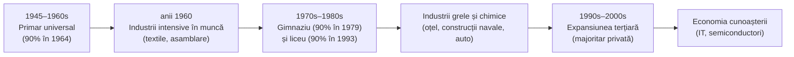
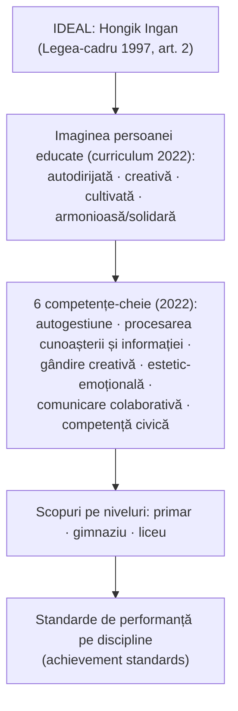
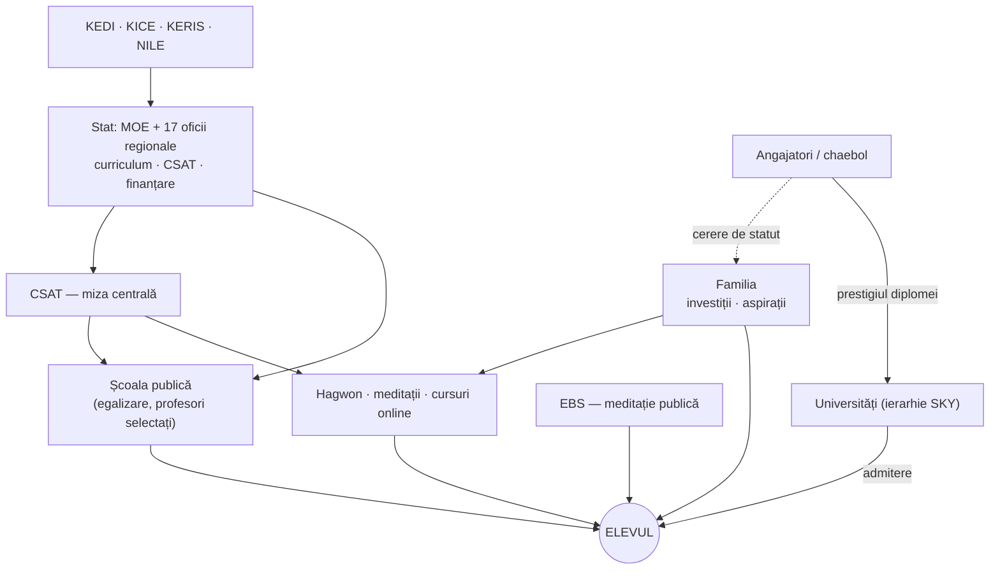

↑ [[00 Index - Analiza comparată internațională]] · [[00 MOC - Fundamentele științelor educației]]

> [!abstract] Pe scurt
> 1. **De ce contează.** Coreea de Sud este cel mai spectaculos caz de dezvoltare prin educație din secolul XX: de la o rată a alfabetizării de circa **22% în 1945** la înscriere cvasi-universală în liceu (anii '90–2000) și la cea mai mare pondere de absolvenți de studii superioare între tinerii din OCDE (OCDE, Jones 2013). Din 2000 este constant în vârful PISA.
> 2. **Formula.** O „febră a educației” (*gyoyungnyeol*, Seth 2002) moștenită din tradiția confucianistă a examenelor (*gwageo*), canalizată de un **stat dezvoltaționist** care a extins școlarizarea **secvențial** (primar → gimnaziu → liceu → universitate) în pas cu planurile economice — un caz-școală pentru teoria **capitalului uman**.
> 3. **Un sistem centralizat și normativ**: curriculum național revizuit periodic (7 revizuiri majore până în 1997, apoi 2007, 2009, 2015, 2022), un examen național de admitere (CSAT / *Suneung*), profesori selectați dintre cei mai buni absolvenți, bine plătiți și cu statut ridicat.
> 4. **Egalitate formală în școală, competiție în afara ei**: politica de egalizare a liceelor (1974) a desființat examenele de intrare, dar competiția s-a mutat în **meditații private** (*hagwon*): în 2024, 80% dintre elevi participau, iar cheltuielile totale au atins **29,2 trilioane de woni** (Statistics Korea).
> 5. **Idealul educațional** este fixat prin lege: *Hongik Ingan* („a aduce beneficii largi umanității”), în Legea educației (1949) și în Legea-cadru a educației (1997), reafirmat în curriculumul 2022.
> 6. **Fundamentele aplicate**: finalități și competențe-cheie (curriculum 2015/2022), educație permanentă prin lege (Lifelong Education Act, 1999; NILE, 2008; Academic Credit Bank System, 1998), educația caracterului prin lege (2015), educație timpurie comună (Nuri, 2012–2013), evaluare centrată pe proces și semestrul fără examene (*Free Semester*, 2013–2016).
> 7. **Costurile**: stres academic, satisfacție scăzută cu viața (57% dintre elevi satisfăcuți în PISA 2018, față de 67% media OCDE), sinuciderea — principala cauză de deces între 10 și 39 de ani (2022), inegalitate indusă de capitalul familial și **declin demografic extrem** (rata fertilității 0,72 în 2023).
> 8. **PISA 2025** (publicat pe 8 septembrie 2026): performanțe încă de top (matematică 522, științe 526), dar **scădere semnificativă la citire** (501, −14 puncte față de 2022).
> 9. **Lecția pentru Moldova**: statutul profesorului și coerența curriculum–evaluare se pot prelua; „febra examenului” și dependența de meditații sunt contra-modele. Rezultatele au la bază **condiții culturale și economice**, nu doar politici.

---

## 1. Profil și date-cheie

| Indicator                            | Valoare                                                                                                                                                                                                        | Sursa / observații                                                                                            |
| ------------------------------------ | -------------------------------------------------------------------------------------------------------------------------------------------------------------------------------------------------------------- | ------------------------------------------------------------------------------------------------------------- |
| Populație                            | ≈ 51–52 mil.                                                                                                                                                                                                   | estimări 2024; declin început în 2020                                                                         |
| Rata totală a fertilității           | 0,78 (2022) → **0,72 (2023)** → 0,75 (2024) → 0,80 (2025)                                                                                                                                                      | Statistics Korea, preluat prin Wikipedia *Demographics of South Korea*; 2025 = date provizorii (de verificat) |
| Alfabetizare în 1945                 | ≈ 22%                                                                                                                                                                                                          | Jones (OCDE, 2013), după Sorensen (1994)                                                                      |
| Rata de cuprindere de 90%            | primar 1964; gimnaziu 1979; liceu 1993                                                                                                                                                                         | Jones (OCDE, 2013), după Sorensen (1994)                                                                      |
| Structura                            | 6 ani primar (de la 6 ani) + 3 gimnaziu + 3 liceu + 2–4 ani terțiar (sistem 6-3-3-4)                                                                                                                           | Ministerul Educației (MOE)                                                                                    |
| Obligativitate                       | **9 ani** (primar + gimnaziu), gratuit; liceul gratuit din 2021 (introdus treptat 2019–2021), dar neobligatoriu                                                                                                | NCEE; Jones 2013                                                                                              |
| Educație timpurie                    | grădinițe 3–5 ani, **curriculum Nuri** comun (grădinițe + creșe); ≈ 96% dintre copiii de 3–5 ani înscriși                                                                                                      | NCEE; PISA 2022: 96% dintre elevi au urmat ≥ 1 an de preșcolar                                                |
| Niveluri ISCED                       | ISCED 0 (yuchiwon / creșe), ISCED 1 (chodeung hakgyo), ISCED 2 (jung hakgyo), ISCED 3 (godeung hakgyo: general, profesional, *Meister*, școli cu profil special), ISCED 5–8 (colegii de 2–3 ani, universități) |                                                                                                               |
| Elevi primar–liceu                   | ≈ 5,13 mil. (2024)                                                                                                                                                                                             | Statistics Korea, ancheta cheltuielilor private 2024                                                          |
| Cheltuieli pentru educație           | **8,0% din PIB total (public + privat) în 2009**, al doilea nivel din OCDE; ≈ 40% din finanțare privată                                                                                                        | Jones (OCDE, 2013)                                                                                            |
|                                      | ≈ 4,9% din PIB (2021, indicator OCDE citat de NCEE); definițiile diferă (public vs. total, cu/fără terțiar)                                                                                                    | NCEE, *Korea*                                                                                                 |
| Cheltuială cumulată pe elev 6–15 ani | ≈ 144 500 USD PPP                                                                                                                                                                                              | PISA 2022, fișa de țară                                                                                       |
| Meditații private (2025)             | 27,5 trilioane woni; participare 75,7%; 604 000 woni/lună per elev participant                                                                                                                                 | MOE & Ministerul Datelor și Statisticii, martie 2026                                                          |
| Guvernanță                           | Ministerul Educației + **17 oficii regionale ale educației**, conduse de superintendenți aleși direct (alegeri directe din 2007, simultane la nivel național din 2010)                                         | Jones 2013; NCEE                                                                                              |
| Terțiar                              | ≈ 87% din instituții/studenți în sectorul privat (2022); rata de absolvire terțiară la 25–34 ani ≈ 69–70%, cea mai mare din OCDE                                                                               | Wikipedia *Education in South Korea*, după date MOE/OCDE (de verificat pe *Education at a Glance* 2025)       |

**Guvernanța în trei niveluri.** Ministerul fixează curriculumul național, standardele, politicile de admitere și finanțarea principală; oficiile regionale ale educației (metropolitane și provinciale) administrează școlile, angajează profesorii și distribuie bugetele; fiecare școală are un **consiliu școlar** (părinți, profesori, reprezentanți ai comunității). Finanțarea învățământului preuniversitar provine în principal din **Granturile pentru finanțarea educației locale**, calculate ca o cotă fixă din veniturile fiscale interne (≈ 20,79%) — mecanism devenit controversat pe fondul scăderii numărului de elevi (cifra cotei: de verificat în legislația curentă). În PISA 2022, directorii aveau responsabilitatea principală pentru angajarea profesorilor doar în școlile a 41% dintre elevi (media OCDE: 60%) — indiciu al centralizării.

---

## 2. Traiectoria PISA 2000–2025

### 2.1 Scoruri pe cicluri

| Ciclu | Domeniu principal | Citire | Matematică | Științe | Media OCDE (C / M / Ș) | Poziție aproximativă (toți participanții) |
|---|---|---|---|---|---|---|
| 2000 | citire | 525 | 547* | 552* | 500 / 500 / 500 | citire ≈ 6; matematică ≈ 2; științe ≈ 1 |
| 2003 | matematică | 534 | 542 | 538* | 494 / 500 / 500 | citire ≈ 2; matematică ≈ 3; științe ≈ 4 |
| 2006 | științe | **556** | 547 | 522 | 492 / 498 / 500 | **citire 1**; matematică ≈ 4; științe ≈ 11 |
| 2009 | citire | 539 | 546 | 538 | 493 / 496 / 501 | citire ≈ 2; matematică ≈ 4; științe ≈ 6 |
| 2012 | matematică | 536 | **554** | 538 | 496 / 494 / 501 | matematică ≈ 5 (1 în OCDE); citire ≈ 5; științe ≈ 7 |
| 2015 | științe | 517 | 524 | 516 | 493 / 490 / 493 | ≈ 7 / 7 / 11 |
| 2018 | citire | 514 | 526 | 519 | 487 / 489 / 489 | ≈ 9 / 7 / 7 (intervale de rang) |
| 2022 | matematică | 515 | 527 | 528 | 476 / 472 / 485 | matematică 6 din 81; citire și științe în primele ≈ 5–7 |
| **2025** | științe | **501** | 522 | 526 | 461 / 463 / 482 | în OCDE: științe 1–3, matematică 1–2, citire 1–9; în total: științe și matematică 5–7, citire 3–13 |

\* Scorurile de matematică din 2000 și de științe din 2000–2003 nu sunt pe scala de trend comparabilă (cadrele de evaluare au fost stabilite ulterior). Pozițiile sunt aproximative: OCDE raportează **intervale de rang**, nu locuri fixe.

*Surse*: OCDE, *PISA 2022 Results – Factsheets: Korea* (2023) și *PISA 2018 Country Note: Korea* (2019) pentru trenduri, niveluri și echitate; rapoartele PISA 2000–2015 pentru mediile OCDE ale ciclurilor; pentru **PISA 2025** (publicat de OCDE pe **8 septembrie 2026**, volumul I; volumele II–III anunțate pentru 2027): *The Korea Herald* (9 sept. 2026) și *Seoul Economic Daily* (8–9 sept. 2026), care redau datele OCDE. Nota de țară OCDE pentru 2025 nu a putut fi accesată direct (acces blocat) — cifrele 2025 trebuie reverificate pe oecd.org.

> [!note] Comentariu — cum citim curba
> - **Vârful** Coreei a fost în 2006–2012 (citire 556 în 2006, matematică 554 în 2012). Fișa OCDE 2022 notează că rezultatele recente sunt **sub mediile din 2003–2012** la matematică și citire, dar apropiate la științe.
> - **Declinul 2012 → 2015** este real, însă 2015 a fost și primul ciclu pe computer — o parte a variației poate ține de schimbarea modului de testare (interpretare, nu fapt stabilit).
> - OCDE (2019) a observat pentru 2009–2018 o **lărgire a dispersiei**: elevii cei mai slabi (percentila 10) au pierdut peste 20 de puncte pe deceniu, iar cei mai buni au rămas stabili.
> - Între 2012 și 2022, ponderea elevilor sub nivelul 2 a crescut cu **7 puncte procentuale** la fiecare domeniu (fișa OCDE 2022).
> - **2025**: citirea a scăzut la 501 (−14 față de 2022), dar media OCDE a scăzut și ea cu 15 puncte (476 → 461), deci poziția relativă s-a menținut. Experții coreeni citați de presă leagă scăderea de consumul de conținut digital scurt (ipoteză, nu cauzalitate demonstrată).

### 2.2 Niveluri de performanță și echitate

| Indicator | Coreea | Media OCDE | Ciclu / sursă |
|---|---|---|---|
| Sub nivelul 2 — matematică / citire / științe | 16% / 15% / 14% | 31% / 26% / 24% | PISA 2022 |
| Nivel 5–6 — matematică / citire / științe | **23%** / 13% / 16% | 9% / 7% / 7% | PISA 2022 |
| Diferența avantajați–dezavantajați (ESCS, matematică) | 97 puncte | 93 puncte | PISA 2022 (stabilă față de 2012) |
| Varianța explicată de ESCS (matematică) | 13% | 15% | PISA 2022 |
| Elevi dezavantajați „reziliența academică” (în sfertul de sus) | 11% | 10% | PISA 2022 |
| Diferența ESCS la citire | 75 puncte (69 în 2009) | 89 puncte | PISA 2018 |
| Elevi în cea mai avantajată chintilă internațională ESCS | 41% (scor la matematică 564) | — | PISA 2022 |
| Diferența de gen la citire (fete − băieți) | +34 (2022); +28 (2025) | — | PISA 2022; presa despre PISA 2025 |
| Diferența de gen la matematică (băieți − fete) | nesemnificativă (2022); +11 (2025) | — | idem |
| *Learning in the Digital World* (domeniu nou 2025) | 538; 41,5% performeri de top; 13,4% sub nivelul 2 | 500; 26,1%; 22,7% | PISA 2025, după *Korea Herald* |
| Repetenție (cel puțin o dată) | 3% | 9% | PISA 2022 |
| Școli închise > 3 luni în pandemie | 21% dintre elevi | 51% | PISA 2022 |
| Lipsă de personal didactic raportată de directori | **51%** (33% în 2018) | — | PISA 2022 |

> [!warning] Critică — echitatea „medie”
> Indicatorii ESCS ai Coreei sunt **în jurul mediei OCDE**, nu excepționali (spre deosebire de reputația de sistem egalitar). Cercetarea sociologică (Byun & Kim, 2010) arată că **decalajul socio-economic s-a lărgit** în anii 2000, iar meditațiile private sunt un canal major de transmitere a avantajului familial. Echitatea măsurată în școală ascunde inegalitatea produsă în afara ei.

### 2.3 Bunăstare (well-being)

| Indicator | Coreea | Media OCDE | Sursa |
|---|---|---|---|
| Elevi satisfăcuți de viață (7–10 din 10) | **57%** | 67% | PISA 2018 |
| Elevi nesatisfăcuți (0–4 din 10) | 22% (23% în 2018) | 18% | PISA 2022 |
| „Când eșuez, mă îngrijorează ce cred alții” | **75%** | 56% | PISA 2018 |
| Elevi care declară că colegii **concurează** între ei | 73% | 50% | PISA 2018 |
| Mentalitate de creștere (*growth mindset*) | 53% | majoritate | PISA 2018 |
| Sentiment de apartenență la școală | 79% | 75% | PISA 2022 |
| Victime ale bullying-ului (de câteva ori pe lună) | 8% fete / 10% băieți | 20% / 21% | PISA 2022 |
| Climat disciplinar nefavorabil (nu pot lucra bine la ore) | 9% | 23% | PISA 2022 |

Paradoxul coreean: **clase disciplinate, apartenență și siguranță peste medie**, dar **satisfacție cu viața sub medie, frică de eșec și competiție foarte ridicate**. Presiunea nu vine din climatul de la clasă, ci din miza examenelor și din timpul petrecut la meditații.

### 2.4 TIMSS 2023 (IEA)

| | Clasa a 4-a — matematică | Clasa a 4-a — științe | Clasa a 8-a — matematică | Clasa a 8-a — științe |
|---|---|---|---|---|
| Scor Coreea | 594 | 583 | 596 | 545 |
| Loc | 3 (după Singapore 615, Taipei 607) | 2 (după Singapore 607) | 3 (după Singapore 605, Taipei 602) | 4 |

*Sursa*: IEA, TIMSS 2023 (date preluate prin sinteza Wikipedia *TIMSS*; de reverificat pe timss2023.org). TIMSS arată constant și un contrast: rezultate de top, dar **plăcere și încredere scăzute** ale elevilor coreeni față de matematică — observație recurentă în rapoartele IEA (valorile 2023 de verificat).

---

## 3. Cronologia reformelor (sec. X–XXI, accent pe XX–XXI)

```mermaid
timeline
    title Coreea de Sud — repere educaționale
    958 : Goryeo introduce examenele gwageo
    1543-1871 : Seowon (academii neoconfucianiste), închise masiv în 1871
    1910-1945 : Colonie japoneză, educație de asimilare
    1949 : Legea educației, idealul Hongik Ingan
    1950-1960 : Reconstrucție, primar universal
    1968 : Carta Națională a Educației
    1969-1974 : Desființarea examenelor de intrare în gimnaziu și liceu (egalizare)
    1980 : Interzicerea meditațiilor private
    1993 : Primul CSAT (Suneung)
    1995 : Reforma 5.31 - societatea învățării deschise
    1997-1999 : Curriculumul 7, Legea-cadru a educației, Lifelong Education Act
    2000 : Curtea Constituțională anulează interdicția meditațiilor
    2004 : Prelegerile EBS pentru CSAT
    2008 : NILE, 300 High School Diversification Project
    2011-2013 : Smart Education, Nuri, Free Semester pilot
    2015 : Curriculum pe competențe, Legea educației caracterului, K-MOOC
    2016-2018 : Free Semester generalizat, Free Year
    2022 : Curriculum revizuit 2022 (aplicat 2024-2027)
    2025 : Sistemul creditelor în liceu, manuale digitale AI (retrogradate prin lege în august 2025)
    2026 : PISA 2025 publicat, scădere la citire
```

| An | Reformă / lege / program | Ideea | Legătura cu fundamentele |
|---|---|---|---|
| 958 | Examenele *gwageo* (regele Gwangjong, dinastia Goryeo); desființate prin reformele Gabo (1894) | Recrutarea funcționarilor pe baza cunoașterii clasicilor confucianiști | Meritocrația prin examen; educația ca mobilitate de statut (M02 — tradiția) |
| 1398 / 1543–1871 | Seonggyungwan (academia regală); *seowon* (prima cu cartă regală: Sosu Seowon, 1550); ≈ 1 000 în 1741; închise în 1871 de regentul Daewongun; 9 seowon — patrimoniu UNESCO (2019) | Școli private neoconfucianiste, pregătire pentru *gwageo* | Educație formală premodernă; componenta morală |
| 1910–1945 | Ordonanțele educației coloniale (1911, 1938) | Asimilare, educație limitată pentru coreeni, marginalizarea limbii coreene | Educația ca instrument politic (M02, M04) |
| 1945–1948 | Guvernul militar american; „Mișcarea Noii Educații” (inspirată de Dewey; figură centrală: Oh Cheon-seok) | Democratizare, pedagogie centrată pe copil | [[Progresivismul și educația nouă]] |
| **1949** | **Legea educației**: idealul *Hongik Ingan* | Educația pentru cetățeanul democratic și binele umanității | Idealul educațional (M04) |
| anii '50 | Plan pentru primar universal; campanii de alfabetizare; sistem 6-3-3-4 | Expansiune cantitativă după Războiul Coreean | [[Capitalul uman și economia educației]] |
| 1968 | Carta Națională a Educației (*Gungmin Gyoyuk Heonjang*) | Educație morală naționalistă, loialitate, dezvoltare | Educația morală/civică (M06) |
| 1969 / **1974** | Desființarea examenului de intrare în gimnaziu (1969); **politica de egalizare a liceelor** (Seoul și Busan, 1974), repartizare prin loterie pe districte | Eliminarea „iadului examenelor” și a meditațiilor timpurii | [[Echitatea și școala comprehensivă]] |
| 1972 | Înființarea **KEDI** (Korean Educational Development Institute) | Cercetare și planificare educațională de stat | Educația bazată pe dovezi (M01, M05) |
| **1980** | „Măsurile din 30 iulie” (regimul Chun Doo-hwan): **interzicerea meditațiilor private**, desființarea examenelor proprii ale universităților | Egalitate, reducerea poverii financiare a familiilor | Echitate vs. libertate; educația nonformală (M03) |
| 1982 | Legea educației sociale | Primul cadru legal pentru educația adulților | [[Învățarea pe tot parcursul vieții și formele educației]] |
| 1985 | Korea National University of Education (KNUE) | Formare de elită a profesorilor | [[Profesionalismul cadrului didactic]] |
| **1993** | Primul **CSAT** (College Scholastic Ability Test, *Suneung*), pentru admiterea din 1994 | Examen de „aptitudine academică”, nu de memorare | Evaluare sumativă cu miză mare (M10) |
| **1995** | **Reforma 5.31** (Comisia Prezidențială pentru Reforma Educației) | Societatea învățării deschise și pe tot parcursul vieții („Edutopia”), autonomie, diversitate, alegere, responsabilizare | [[Responsabilizare, piață și încredere în guvernarea educației]]; M08 |
| 1997 | **Curriculumul național 7**; **Legea-cadru a educației** (art. 2: *Hongik Ingan*) | Curriculum centrat pe elev, diferențiat, 10 ani de curriculum comun de bază | Diferențierea, inteligențele multiple și designul universal |
| 1998 | **KICE** (curriculum și evaluare); **Academic Credit Bank System** | Evaluare națională; recunoașterea învățării în afara universităților | M10; educația permanentă |
| 1999 | **Lifelong Education Act**; KERIS; legalizarea sindicatului profesorilor KTU (Jeongyojo) | Educația permanentă ca drept; infrastructură digitală | M03; [[Pedagogia critică și educația pentru cetățenie]] |
| **2000** | **Curtea Constituțională** declară neconstituțională interdicția meditațiilor (27 aprilie 2000, 98Hun-Ka16) | Dreptul părinților de a-și educa copiii | Familia ca agent educativ (M09) |
| 2002–2004 | Gimnaziu gratuit obligatoriu generalizat | Extinderea obligativității | M08 |
| 2004 | Prelegerile **EBS** pentru CSAT, gratuite (TV și internet) | Reducerea meditațiilor prin „meditații publice” | Educație nonformală mediatică (M03, M07) |
| 2007–2008 | Revizia curriculumului 2007; **NILE** (2008); „300 High School Diversification Project” (licee private autonome, școli *Meister* din 2010); publicarea rezultatelor evaluării naționale (NAEA) | Diversitate, competiție, transparență | Piață și responsabilizare |
| 2008 | Proiectul **Wee** (consiliere: Wee class, Wee center) | Sprijin psihologic și prevenirea abandonului | [[Învățarea socio-emoțională și educația caracterului]] |
| 2009 | Curriculum revizuit: „Activități experiențiale creative”, conținut academic redus cu 20%; școli de inovare (*hyeoksin hakgyo*) în Gyeonggi | Creativitate și caracter | Învățarea prin proiecte, investigație și fenomene |
| 2011 | Strategia **Smart Education** (MEST) | Manuale digitale, învățare online, cloud | [[Constructionismul și educația digitală]] |
| 2012–2013 | **Curriculum Nuri** (5 ani în 2012; 3–5 ani din 2013) | Educație timpurie comună și subvenționată | Educația timpurie |
| 2013–2016 | **Free Semester Program** (pilot în 42 de școli în 2013, generalizat în toate gimnaziile în 2016) | Semestru fără examene scrise; explorarea carierei | [[Învățarea autoreglată, metacogniția și autoeducația]] |
| 2015 | **Curriculum revizuit 2015** (6 competențe-cheie, integrare, „mai puțin și mai profund”); **Legea promovării educației caracterului**; **K-MOOC** | Competențe; caracter; MOOC național | [[Taxonomiile obiectivelor și educația centrată pe competențe]] |
| 2018 | *Free Year Program* (extindere la un an); pilotarea **sistemului creditelor în liceu**; educația software obligatorie (introdusă treptat) | Personalizare, alegere | M10 |
| 2019 | Nuri revizuit — centrat pe copil și pe joc | Joc liber, autonomia educatoarei | Educația timpurie |
| 2019–2021 | Gratuitatea liceului | Echitate | M08 |
| 2021 | Legea garantării competențelor academice de bază (în vigoare 2022) | Nimeni sub pragul minim | [[Învățarea deplină (mastery learning)]] |
| 2022 | **Curriculum revizuit 2022** (proclamat la 22 decembrie 2022; aplicat 2024–2027) | Agenție, incluziune, creativitate; alfabetizare digitală; competența civică | M04, M07 |
| 2023 | Planul de inovare educațională digitală (februarie 2023); legi pentru protejarea drepturilor profesorilor după moartea unei învățătoare de la școala Seoi (Seoul, iulie 2023) | AI în clasă; autoritatea profesorului | M09 |
| **2025** | **Sistemul creditelor în liceu** generalizat; **manualele digitale cu AI (AIDT)** introduse în martie 2025, apoi **retrogradate prin lege (4 august 2025)** la statut de materiale opționale | Personalizare prin AI vs. prudență | Educația digitală; critici |
| 2026 | Publicarea PISA 2025 (8 septembrie) | Scădere la citire | M01, M05 |

---

## 4. Rădăcinile ecosistemului: de la *gwageo* la „febra educației”

### 4.1 Tradiția confucianistă

Timp de aproape un mileniu (958–1894), **examenul de stat** a fost principala cale spre funcțiile publice și spre păstrarea statutului de *yangban* (aristocrație funcționărească). Examenele erau de trei tipuri — literare, militare și „diverse” (medicină, traducere, astronomie). Instituțiile de învățământ (Seonggyungwan, *hyanggyo* — școli publice locale, *seowon* — academii private, *seodang* — școli sătești) pregăteau în primul rând pentru aceste examene. De aici s-au păstrat în Coreea modernă trei idei:

1. **Învățarea ca datorie morală și ca drum spre perfecționarea de sine** (neoconfucianism): studiul e o formă de autoeducație morală, nu doar un mijloc.
2. **Examenul ca instrument legitim și „corect” de selecție socială** — un examen impersonal e perceput ca mai drept decât recomandările sau relațiile.
3. **Statutul social depinde de nivelul educației**, iar familia investește colectiv în succesul copilului.

> [!note] Comentariu — capcana explicației culturaliste
> Explicația „e cultura confucianistă” este **necesară, dar nu suficientă**. Seth (2002) arată că „febra educației” s-a format **înainte de 1945**, dar că **politicile statului** (expansiunea rapidă, examenele naționale, legătura dintre diplomă și locul de muncă) au transformat-o într-o forță de masă. Sorensen (1994) și Lett (1998) insistă pe **mobilitatea socială** după desființarea ierarhiilor tradiționale (reforma agrară, războiul): după 1950, educația a devenit singura cale deschisă tuturor spre statutul de clasă mijlocie. Explicația e deci **culturală + structurală + politică**.

### 4.2 Perioada colonială (1910–1945)

Sistemul japonez a introdus școala modernă, dar **segregată și limitată**: Ordonanța educației din 1911 oferea mult mai puțini ani de școlarizare copiilor coreeni decât celor japonezi, iar din 1938 educația a devenit instrument de asimilare, cu marginalizarea limbii coreene. La eliberare, **doar ≈ 22% dintre adulți erau alfabetizați**, iar sub 20% dintre copii urmau școala secundară (Jones, OCDE 2013). Moștenirea colonială contează dublu: (a) o foame de educație refuzată, și (b) un model administrativ centralizat, uniform și bazat pe examene, pe care statul sud-coreean l-a păstrat în bună parte.

### 4.3 Expansiunea secvențială și capitalul uman

După 1945 și mai ales după Războiul Coreean (1950–1953), Coreea a extins educația **în trepte succesive** (Jones 2013, după Sorensen 1994):

Fiecare etapă a furnizat forța de muncă pentru o etapă a industrializării (planurile cincinale de dezvoltare economică din 1962 încolo). Raportul Băncii Mondiale *The East Asian Miracle* (1993) a numit investițiile private și **creșterea rapidă a capitalului uman** „principalele motoare ale creșterii” (citat în Jones 2013). Pe lângă efectul economic, universalizarea primarului și secundarului a sprijinit **mobilitatea socială** și o distribuție relativ egală a veniturilor în anii de creștere rapidă.

Un detaliu esențial: statul a finanțat mai ales **baza** (primarul și gimnaziul), lăsând liceul și universitatea în mare parte **pe seama familiilor și a sectorului privat**. Rezultatul a fost o expansiune rapidă cu costuri publice relativ mici — dar și o povară financiară privată mare, care explică o parte din inegalități și din anxietatea familiilor de azi.

---

## 5. Implementarea fundamentelor

### 5.1 Statutul științelor educației, cercetarea și politica bazată pe dovezi
→ [[Modulul 01 - Statutul științelor educației]], [[Modulul 05 - Paradigmele pedagogiei și cercetarea pedagogică]]

**Institute de stat care leagă cercetarea de politică.** Coreea are o rețea densă de institute naționale de cercetare educațională, finanțate public și care lucrează direct pentru minister:

| Institut | An | Funcție |
|---|---|---|
| **KEDI** — Korean Educational Development Institute | 1972 | Cercetare de politică educațională, statistici naționale, studii de prognoză; a avut un rol central în planificarea expansiunii din anii '70–'90 |
| **KICE** — Korea Institute for Curriculum and Evaluation | 1998 | Dezvoltarea curriculumului național, elaborarea **CSAT**, Evaluarea Națională a Rezultatelor Școlare (NAEA), coordonarea națională PISA/TIMSS, Centrul Național de Informații despre Curriculum (NCIC) |
| **KERIS** — Korea Education and Research Information Service | 1999 | Infrastructură digitală, EduNet, platforme online, manuale digitale |
| **KRIVET** — Korea Research Institute for Vocational Education and Training | 1997 | Educație profesională, competențe, piața muncii |
| **NILE** — National Institute for Lifelong Education | 2008 | Educația adulților, Academic Credit Bank System, K-MOOC |
| **KICCE** — Korea Institute of Child Care and Education | 2005 (de verificat) | Cercetare în educația timpurie |

**Universitățile**: facultățile de educație (Seoul National University, Korea University, Yonsei, Ewha) și universitățile de educație produc cercetare empirică foarte cantitativă, puternic influențată de știința educației americană (mulți profesori universitari coreeni și-au luat doctoratul în SUA — tendință documentată încă din „Mișcarea Noii Educații” de după 1945).

**Utilizarea datelor internaționale.** Coreea participă la PISA din 2000 și la TIMSS din 1995; rezultatele sunt folosite intens în discursul politic. Paradoxal, succesul PISA a fost folosit mai ales pentru a argumenta nevoia de **reforme calitative** (creativitate, bunăstare), nu pentru a menține status quo-ul.

> [!warning] Critică — politica „bazată pe dovezi” sau pe cicluri politice?
> Multe reforme majore s-au schimbat odată cu președinții (egalizare vs. diversificare, licee autonome desființate apoi păstrate, raportul admitere pe dosar / admitere pe CSAT, manualele AI introduse și retrogradate în același an). Institutele produc dovezi solide, dar **decizia rămâne puternic politică** și sensibilă la presiunea părinților. Episodul AIDT (2025) este exemplar: un program de ≈ 533 mld. woni în 2024 a fost lansat înainte de dovezi de eficacitate și a pierdut statutul legal după alternanța la guvernare.

### 5.2 Paradigme pedagogice dominante: clasic–modern–postmodern
→ [[Modulul 02 - Clasic, modern și postmodern în educație]]

Coreea ilustrează **coexistența straturilor** descrise în manual:

| Strat | Manifestare în Coreea |
|---|---|
| **Clasic / tradițional** | Moștenirea confucianistă: profesorul ca autoritate morală, memorare, respect pentru text, examenul ca selecție; predare frontală, clase mari în trecut (peste 60 de elevi în anii '60–'70, de verificat) |
| **Modern** | Școala de masă, statul-națiune, curriculum național uniform, standardizare, eficiență, legătura educație–dezvoltare economică; behaviorism și obiective operaționale (anii '70–'80) |
| **Postmodern / curricular** | Curriculum centrat pe elev (7, 1997), competențe-cheie (2015), autonomie curriculară școlară (2022), personalizare, credite, evaluare pentru învățare, AI; accent pe bunăstare și „fericire” |

**Teoriile care au inspirat sistemul:**
- **Pragmatismul lui Dewey**, via „Mișcarea Noii Educații” (după 1945) — rămas mai ales la nivel de discurs, pentru că realitatea claselor supraaglomerate și a examenelor a impus predarea frontală.
- **Behaviorismul și obiectivele operaționale** (Tyler, Bloom) în proiectarea curriculumului din anii '70–'80; KEDI a experimentat în anii '70 modele de instruire sistematică.
- **Constructivismul** (Piaget, Bruner, Vygotsky) și abordarea „centrată pe elev” în curriculumul 7 (1997) și în reviziile 2009–2022.
- **Educația centrată pe competențe** (DeSeCo, OECD Learning Compass 2030) în curriculumurile 2015 și 2022.

> [!note] Comentariu — „paradoxul elevului din cultura confucianistă”
> Watkins și Biggs (*The Chinese Learner*, 1996) au arătat că elevii din culturile de tradiție confucianistă obțin rezultate înalte deși predarea pare „tradițională” și bazată pe memorare. Explicația lor: **repetiția nu înseamnă învățare superficială** — memorarea poate fi un pas spre înțelegere profundă. Aceasta nuanțează opoziția simplistă „tradițional = rău, modern = bun” din manualele occidentale.

### 5.3 Formele educației: formal, nonformal, informal; învățarea pe tot parcursul vieții
→ [[Modulul 03 - Formele generale ale educației]], [[3.6 Educația permanentă și autoeducația]], [[Autoeducația - teorii, autori și corelări]]

Coreea are probabil **cel mai dezvoltat sector nonformal plătit din lume** și, în paralel, un cadru legal complet pentru educația permanentă.

**a) Educația formală** — foarte lungă ca timp: zile școlare pline, școli care oferă ore suplimentare de studiu (*yaja* — studiu de seară, practică istorică larg răspândită în licee).

**b) Educația nonformală — „școala din umbră”** (*shadow education*, termen consacrat de Stevenson & Baker, 1992, și de Bray, 1999):

| Indicator (Statistics Korea / MOE) | 2024 | 2025 |
|---|---|---|
| Cheltuieli totale cu meditațiile (primar–liceu) | **29,2 trilioane woni** (+7,7%, record) | 27,5 trilioane (−5,7%, prima scădere după 4 ani de recorduri) |
| Rata de participare | **80,0%** | 75,7% |
| Cheltuială lunară per elev (toți elevii) | 474 000 woni | 458 000 woni |
| Cheltuială lunară per elev participant | 592 000 woni | **604 000 woni** (record) |
| Pe niveluri (per participant, 2025) | — | primar 512 000; gimnaziu 632 000; liceu 793 000 woni |
| Decalaj după venit (2025) | — | gospodării ≥ 8 mil. woni/lună: 662 000 vs. < 3 mil.: 192 000 → **3,4 ori** |

*Surse*: comunicatele Statistics Korea / Ministry of Data and Statistics (martie 2025, martie 2026), relatate de *Korea JoongAng Daily*, *Korea Herald*, Xinhua. Pentru comparație istorică: în 2010 participarea era de 73,6%, iar cheltuielile reprezentau ≈ 1,8% din PIB (Jones 2013). Coreea avea aproape 74 000 de *hagwon* în 2020; în jur de 6 000 erau concentrate în districtul Gangnam din Seoul încă din 2010.

**c) Educația informală și mediatică.** **EBS** (Educational Broadcasting System) a devenit din 2004 o „meditație publică gratuită”: prelegeri TV și online pentru CSAT, iar guvernul a legat o parte din subiectele CSAT de materialele EBS (70% anunțat în jurul lui 2010, redus ulterior la 50% — procentele și anii: de verificat în documentele KICE). Bibliotecile publice și rețelele de „orașe ale învățării pe tot parcursul vieții” completează spațiul informal.

**d) Învățarea pe tot parcursul vieții — arhitectura legală și instituțională:**

| Element | An | Ce face |
|---|---|---|
| Legea educației sociale | 1982 | Primul cadru pentru educația adulților |
| Sistemul diplomei prin autoinstruire (*self-study degree*) | 1990 | Licență obținută prin examene, fără frecvență |
| Reforma 5.31 — „societatea învățării deschise” | 1995 | Educație accesibilă „oricând și oriunde” |
| **Academic Credit Bank System (ACBS)** | legea 1997, funcțional **1998** | Acumularea de credite din surse diverse (cursuri, certificări, instituții de educație a adulților) și obținerea unei diplome de licență sau de colegiu |
| **Lifelong Education Act** | **1999** (revizuită în 2007) | Educația permanentă ca politică de stat |
| Planuri naționale de promovare a educației permanente | 2002–2006; 2008–2012; 2013–2017; 2018–2022; 2023–2027 | Planificare cincinală |
| Contul personal de învățare (*Accounts for Lifelong Learning*) | 2006 (MOE) | Evidența învățării individuale |
| **NILE** | februarie **2008** | Agenția națională (art. 19 din lege) |
| Proiectul „universități ale învățării pe tot parcursul vieții” | 2008 | Deschiderea universităților către adulți |
| **K-MOOC** | octombrie **2015** | Platformă MOOC națională |
| Voucher pentru educație permanentă | 2018 | Sprijin pentru grupurile cu venituri mici |

*Surse*: MOE, pagina *Lifelong Education*; NILE / UIL-UNESCO; Wikipedia *Academic Credit Bank System*.

> [!tip] Lecție — manualul „în acțiune”
> Manualul (M03, 3.6) prezintă educația permanentă ca principiu și direcție de evoluție. Coreea a transformat-o în **instituții concrete**: lege, agenție, bancă de credite, MOOC național, planuri cincinale. ACBS este un exemplu direct de **recunoaștere a învățării nonformale** în sistemul formal — exact punctul de legătură dintre formele educației pe care manualul îl teoretizează.

**e) Autoeducația / învățarea autodirijată.** Termenul „învățare autodirijată” (*jagi-judojeok hakseup*) apare constant în curriculumurile naționale; curriculumul 2022 cere școlilor să dezvolte capacitatea elevilor „de a explora și învăța singuri”. **Realitatea este ambivalentă**: sistemul produce elevi foarte disciplinați și capabili de studiu intens, dar studiul este de multe ori **reglat din exterior** (*hagwon*, părinți, orare stricte). În PISA 2022, doar 57% dintre elevii coreeni se simțeau capabili să se motiveze singuri pentru temele școlare (media OCDE 58%), mai puțin decât ne-am aștepta de la un sistem cu performanțe atât de mari — un argument că **performanța ≠ autoreglare**.

### 5.4 Finalități: idealul educațional, scopuri, cadre de competențe
→ [[Modulul 04 - Finalitățile educației]]

**Idealul educațional — *Hongik Ingan* (홍익인간).** Provine din mitul fondator al primului regat coreean (Gojoseon) și înseamnă „a aduce beneficii largi umanității”. A fost inclus în **Legea educației (1949)** și reluat în **Legea-cadru a educației (1997), art. 2**: sub acest ideal, educația urmărește ca toți cetățenii să-și formeze caracterul, să dobândească capacitatea de a trăi independent și calitățile cetățeanului democratic, pentru o viață umană demnă, dezvoltarea statului democratic și prosperitatea comună a umanității (parafrază după textul legii).

**Ierarhia finalităților** (în termenii manualului: ideal → scopuri → obiective):

**Curriculumul 2022** (Proclamația MOE nr. 2022-33, 22 decembrie 2022) descrie patru tipuri de „persoană educată” (parafraze):
- **autodirijată** — își construiește viața și cariera cu o identitate proprie;
- **creativă** — generează valori noi pe baza unor fundamente largi;
- **cultivată** — înțelege și îmbogățește cultura umană;
- **armonioasă / solidară** — acceptă diversitatea, comunică global, cooperează.

Cele **șase competențe-cheie** din 2022 continuă setul din 2015 (în 2015, ultimele două se numeau „comunicare” și „competență comunitară”; în 2022 au devenit „comunicare colaborativă” și „competență civică”, orientată spre comunități sustenabile). Calendarul aplicării: clasele I–II din martie 2024; clasele III–IV, clasa întâi de gimnaziu și de liceu din 2025; 2026 și 2027 pentru restul claselor.

**Evoluția finalităților:** de la **naționalism și dezvoltare** (Carta Națională a Educației, 1968: loialitate, anticomunism, contribuție la dezvoltarea națiunii), la **democratizare** (după 1987), la **globalizare și informatizare** (5.31, 1995), la **competențe, creativitate și caracter** (2009–2015) și, în 2022, la **agenție, incluziune, sustenabilitate și alfabetizare digitală**.

> [!note] Comentariu
> Contrastul dintre **finalitățile declarate** (creativitate, fericire, persoană autodirijată) și **finalitățile reale** impuse de miza CSAT (clasamente, admiterea la universitățile „SKY”) este cea mai clară ilustrare din această analiză a distincției dintre **curriculumul oficial** și **curriculumul ascuns / realizat**.

### 5.5 Dimensiunile educației
→ [[Modulul 06 - Dimensiunile generale ale educației]]

| Dimensiune | Implementare în Coreea | Evaluare |
|---|---|---|
| **Morală / caracter** | Disciplina „Etică / morală” obligatorie; **Legea promovării educației caracterului** (2015) — prima lege de acest tip care impune educația caracterului în școli; valori precum respect, responsabilitate, cooperare; educația caracterului e și temă transversală în 2022 | Criticată ca moralizatoare și ca „reparație” pentru efectele competiției |
| **Intelectuală** | Dominantă; standarde înalte la matematică, științe, limba coreeană și engleză; accent pe fundamente și rigoare | Performanțe excelente; costuri mari în timp și stres |
| **Tehnologică / digitală** | Smart Education (2011); educația software obligatorie (introdusă din 2018); în curriculumul 2022, **informatică de minimum 34 de ore în primar** și **minimum 68 de ore în gimnaziu**; alfabetizarea digitală ca fundament în toate disciplinele; AIDT (2025) | Infrastructură de top; controverse privind timpul petrecut pe ecrane și AIDT. PISA 2025: 538 la domeniul digital |
| **Estetică** | Muzică și arte plastice obligatorii; competența „estetic-emoțională” printre cele șase | Marginalizată în liceu de presiunea CSAT |
| **Psihofizică** | Educație fizică; cluburi sportive școlare; programe de sănătate; **pedeapsa corporală interzisă (2011)**; restricții la telefoane mobile în timpul orelor (2023) | Somn insuficient și activitate fizică scăzută la liceeni (studii naționale; cifre precise de verificat) |
| **Profesională / carieră** | Educația pentru carieră ca temă transversală; consilieri de carieră; *Free Semester*; licee profesionale și **școli *Meister*** (din 2010) | Stigmatul educației profesionale persistă |

### 5.6 „Noile educații”
→ [[Modulul 07 - Noile educații]]

Curriculumul 2022 enumeră explicit **zece teme transversale** care trebuie integrate în toate disciplinele și în Activitățile Experiențiale Creative, în colaborare cu familia și comunitatea: **siguranță și sănătate; caracter; carieră; cetățenie democratică; drepturile omului; educație multiculturală; educație pentru unificare; educația „Dokdo” (conștiință teritorială); economie și finanțe; mediu și dezvoltare durabilă**.

| „Noua educație” (manual) | Echivalentul coreean | Instrumente |
|---|---|---|
| Educația pentru cetățenie / democrație | Cetățenie democratică; drepturile omului; ordonanțele privind drepturile elevilor (Gyeonggi 2010, Seoul 2012 — statut contestat politic după 2023, de verificat) | Consilii școlare, consilii ale elevilor |
| Educația pentru pace și toleranță | Educația pentru unificare (Coreea de Nord); educație multiculturală (≈ 4% elevi din familii multiculturale, NCEE) | Programe de sprijin pentru elevii multiculturali |
| Educația ecologică / sustenabilitate | Mediu și dezvoltare durabilă; răspunsul la „schimbările climatice și ecologice” (motivul oficial al reviziei 2022) | Integrare curriculară |
| Educația pentru sănătate mintală / SEL | Proiectul Wee (2008); consilieri școlari; programe anti-violență (legea prevenirii violenței școlare, 2004) | Wee class în școli, Wee center regionale |
| Educația economică | Economie și finanțe | — |
| Educația pentru media / digitală | Alfabetizare digitală, etică digitală; tema AI | KERIS, curriculum 2022 |
| Educația pentru familie | Rolul părinților e central, dar mai ales ca „manageri” ai carierei școlare | Parteneriate școală–părinți |

> [!warning] Critică
> „Noile educații” sunt numeroase pe hârtie, dar au **timp real limitat** în licee dominate de pregătirea pentru CSAT. Riscul semnalat de literatura coreeană este al unui **curriculum supraîncărcat de teme transversale**, fiecare adăugată ca reacție la o criză publică (violență, siguranță după dezastrul feribotului Sewol din 2014, sinucideri).

### 5.7 Sistemul și managementul
→ [[Modulul 08 - Sistemul de educație și managementul educației]]

**Structură și tracking.** Nu există orientare timpurie (tracking) până la 15 ani: primar și gimnaziu comune și nediferențiate, repartizare pe districte. La liceu există licee **generale** (majoritare), **profesionale**, **școli *Meister*** și licee cu **scop special** (științe, limbi străine, arte) sau **autonome** (private cu autonomie curriculară și taxe mai mari). Ponderea elevilor din liceele profesionale a scăzut de la 42% (1995) la 24% (2010), iar majoritatea absolvenților acestora merg totuși la facultate (Jones 2013).

**Echitate: politica de egalizare (1969 / 1974).** Examenele de intrare în gimnaziu au fost desființate în 1969, iar în licee în 1974 (Seoul și Busan, apoi extindere la alte orașe), cu **repartizare prin loterie** în cadrul districtelor — inclusiv în școlile private, care au primit finanțare publică și au pierdut controlul asupra selecției („naționalizare virtuală”, Kim & Lee, 2003, citați de Jones 2013).

> [!warning] Critică — egalizarea ca „amânare” a competiției
> OCDE (Jones 2013) observă că egalizarea **nu a eliminat competiția, ci a amânat-o** până la CSAT și a redus diversitatea și autonomia școlilor. Kim & Lee (2010) susțin că cererea de meditații a fost amplificată de **o ofertă publică de calitate uniformă și reglementată**, care nu răspundea cererii familiilor. Susținătorii egalizării răspund că fără ea stratificarea socială ar fi apărut deja la 12–15 ani.

**Oscilația „egalizare ↔ diversificare”:**
- 1995 (5.31) și 2008 („300 High School Diversification Project”): licee private autonome, școli *Meister*, alegerea școlii.
- 2019: guvernul Moon anunță transformarea liceelor autonome, a celor de limbi străine și internaționale în licee generale până în 2025.
- 2024: guvernul Yoon renunță la această transformare (menține liceele autonome) — detaliile juridice: de verificat.

**Descentralizare parțială.** Superintendenții regionali aleși (din 2007/2010) au adus conflicte cu ministerul (de ex. superintendenții progresiști au introdus școli de inovare și ordonanțe privind drepturile elevilor). Totuși, curriculumul, CSAT, standardele și cea mai mare parte a finanțării rămân centrale.

**Responsabilizare.** Evaluarea Națională a Rezultatelor Școlare (NAEA), cu rezultate publicate pe *schoolinfo.go.kr* din 2008; evaluarea școlilor și a profesorilor; publicarea informațiilor despre universități (*academyinfo.go.kr*). Evaluarea națională de tip recensământ a fost apoi restrânsă la eșantion (de verificat anul) după critici privind „predarea pentru test”.

**Finanțare și echitate.** Gratuitatea liceului (2019–2021); proiectul de sprijin prioritar pentru bunăstarea educațională (din 2003, școli în zone defavorizate); „Zero Plan” pentru elevii sub nivelul de bază; legea garantării competențelor academice de bază (2021). În PISA 2022, lipsa de personal didactic nu era mai mare în școlile defavorizate decât în cele avantajate (PISA 2018: 33% vs. 32%, spre deosebire de media OCDE: 34% vs. 18%) — rezultat al **rotației obligatorii a profesorilor** între școlile publice din aceeași regiune.

**Declinul demografic — noua problemă de management.** Cu o rată a fertilității sub 1 din 2018 (0,72 în 2023), sistemul se confruntă cu închideri de școli, mai ales rurale, universități regionale fără studenți și dezbateri privind supradimensionarea bugetelor educației locale calculate ca procent fix din impozite. Proiecțiile citate de Wikipedia indică o scădere cu 50% a populației de 9–24 de ani între 2013 și 2060 (proiecție veche, de verificat).

### 5.8 Agenții: profesorul, directorul, elevul, familia, comunitatea
→ [[Modulul 09 - Agenții educației și factorii dezvoltării]]

**Profesorul — selecție, formare, statut.**

| Aspect | Coreea |
|---|---|
| Formarea inițială — primar | Doar **13 instituții**: 11 universități naționale de educație (10 regionale + **Korea National University of Education**, 1985), o universitate publică (Universitatea Națională Jeju) și una privată (departamentul de educație primară al Universității Ewha) (NCEE). Admiterea se face din **vârful promoției** de liceu; McKinsey (Barber & Mourshed, 2007) spunea că viitorii învățători vin din primele 5% |
| Formarea inițială — secundar | Facultăți de educație, departamente de educație și programe de certificare în multe universități → **supraofertă**: după NCEE, doar aproximativ unul din cinci absolvenți cu formare pentru secundar devine profesor |
| Intrarea în profesie | **Examen de angajare** (*imyong sihum*), organizat de oficiile regionale: test scris (grilă și eseu) + interviu cu demonstrație de lecție; clasament pe baza scorurilor; foarte competitiv în secundar |
| Salariu | Maximul grilei pentru profesorii din primar ≈ 74 000 USD PPP, cu **64% peste media OCDE** (2012), deși PIB-ul pe locuitor era sub medie; **cel mai mare raport dintre maximul și începutul grilei** din OCDE → incentiv pentru a rămâne în profesie (Jones 2013) |
| Stabilitate | Funcționari publici, post pe viață; **rotație obligatorie** între școli la câțiva ani (echitate teritorială) |
| Carieră | Certificat de gradul II → gradul I (după experiență și formare); cale spre director adjunct/director pe baza unui sistem de puncte; cale de specialist (inspector, cercetător); „profesor principal” (*master teacher*, suveok gyosa) cu predare redusă și mentorat (detalii NCEE, de verificat) |
| Dezvoltare profesională | Formare obligatorie periodică; comunități profesionale de învățare; ≈ 0,74 mld. USD pentru formarea profesorilor în predarea asistată de AI în 2024–2026 (Banca Mondială, 2024) |
| Statut | Tradițional foarte ridicat (profesorul ca *seonsaengnim*, respect confucianist). TALIS 2018: o pondere mult peste media OCDE a profesorilor coreeni considera că profesia e apreciată de societate (valoarea exactă: de verificat în TALIS 2018 Vol. II) |

> [!warning] Critică — criza autorității profesorului
> În ultimul deceniu, statutul profesorului a fost erodat de **plângerile părinților** și de litigii (profesori acuzați de „abuz emoțional asupra copilului” pentru măsuri disciplinare). Moartea unei tinere învățătoare de la școala primară Seoi (Seoul, iulie 2023) a declanșat proteste masive ale profesorilor și **legi pentru protejarea drepturilor profesorilor** (toamna lui 2023). Tot în PISA 2022, **51%** dintre elevi învățau în școli unde directorii raportau lipsă de personal didactic (33% în 2018). Profesia rămâne selectivă la intrare, dar **atractivitatea și satisfacția** sunt în scădere.

**Directorul.** Numit pe baza vechimii și a punctelor acumulate, mandat de 4 ani (maximum două mandate). Rol mai degrabă administrativ; experimentul „director cu concurs deschis” (*gaebanghyeong gongmoje*) a permis și profesorilor fără gradul clasic să conducă școli de inovare (detalii de verificat).

**Elevul.** Timp de studiu foarte lung (școală + studiu de seară + *hagwon*); sondajele citate de Wikipedia indică ≈ 6 ore de somn la liceeni (2019, sursă de verificat). Drepturile elevilor au intrat în agenda publică după 2010. În PISA 2018, 73% dintre elevi percepeau competiția între colegi (media OCDE 50%).

**Familia.** Agentul-cheie și motorul „febrei educației”: mamele ca „manageri” ai carierei școlare (fenomenul „mamelor din Gangnam”, al „taților-gâscă” — *gireogi appa* — care rămân în Coreea în timp ce familia studiază în străinătate). Park, Byun și Kim (2011) arată că formele de implicare parentală, inclusiv gestionarea meditațiilor, sunt legate de rezultatele cognitive ale elevilor și diferă după statutul socio-economic. În 2000, **Curtea Constituțională** a consacrat dreptul părinților de a alege educația suplimentară a copiilor.

**Comunitatea.** Consiliile școlare; proiectele „satului educațional” (*maeul gyoyuk gongdongche*), promovate de oficiile regionale progresiste (de verificat); orașele învățării pe tot parcursul vieții; în negativ, **piața imobiliară** a cartierelor cu *hagwon* (Daechi-dong, Gangnam), ca formă de stratificare spațială.

### 5.9 Proiectare, predare, evaluare
→ [[Modulul 10 - Proiectarea, realizarea și evaluarea activității educative]]

**Curriculum național — evoluție:**

| Curriculum | An | Accente |
|---|---|---|
| Curriculumurile 1–6 | 1954/55 → 1992 | De la curriculum centrat pe discipline, la reconstrucție națională, la curriculum „academic” și apoi „umanist” |
| **Al 7-lea** | 1997 (aplicat din 2000) | Centrat pe elev; **curriculum comun de bază de 10 ani** (clasele 1–10) + 2 ani de opționale; curriculum diferențiat pe niveluri; reducerea volumului |
| Revizii 2007, 2009 | 2007; 2009 | Revizii „parțiale și continue”; 2009: Activități Experiențiale Creative, conținut academic redus cu 20%, grupuri de clase și semestre intensive |
| **2015** | 2015 (aplicat din 2017–2018) | 6 competențe-cheie; **curriculum integrat** (științe integrate, studii sociale integrate în clasa a 10-a); „mai puțin, mai profund”; evaluare centrată pe proces; *Free Semester* inclus în curriculum; educația software |
| **2022** | 2022 (aplicat 2024–2027) | Agenție; persoană incluzivă și creativă; alfabetizare lingvistică, matematică și **digitală** ca fundamente; „idei mari” ale disciplinelor și învățare profundă; **sistemul creditelor în liceu** (192 de credite: 174 pentru discipline + 18 pentru Activități Experiențiale Creative; 1 credit = 16 ore de 50 de minute); ore autonome proiectate de școală; evaluare **pentru** și **ca** învățare |

**Pedagogia la clasă.** Dominant predare frontală, eficientă, cu ritm alert și climat disciplinar foarte bun (PISA 2022: doar 7% dintre elevi nu ascultă ce spune profesorul, față de 30% media OCDE). Curriculumul cere de peste două decenii mai multă participare, discuții, proiecte, lucru în grup. Studiile de clasă din Coreea arată o schimbare **mai rapidă în primar și gimnaziu** decât în liceu, unde pregătirea pentru CSAT rămâne decisivă (interpretare frecventă în literatură).

**Evaluarea:**
- **Formativă / „centrată pe proces”** (*gwajeong jungsim pyeongga*): promovată din curriculumul 2015, cu sarcini de performanță, observații, portofolii; în curriculumul 2022, formula oficială este evaluarea „pentru învățare și ca învățare”.
- **Free Semester**: fără teste standardizate creion-hârtie; evaluare descriptivă a procesului.
- **Sumativă cu miză mare**: notele interne din liceu (clasamente relative pe școală, trecere spre sistemul pe 5 niveluri odată cu reforma admiterii 2028 — de verificat) și **CSAT**.

**CSAT (*Suneung*)** — o zi care „oprește țara”: zborurile se opresc în timpul probei de ascultare la engleză, bursa și birourile deschid mai târziu. Probele: limba coreeană, matematică, engleză (notare **absolută** din 2018), **istoria Coreei obligatorie** (din 2017), discipline de studii sociale / științe / profesionale, a doua limbă străină sau chineza clasică. În 2025 s-au înscris ≈ 554 000 de candidați, dintre care ≈ 494 000 au susținut examenul. Admiterea la universitate se face și pe dosar (*hakseangbu jonghap jeonhyeong*, succesorul sistemului „ofițerilor de admitere” din 2008): după NCEE, peste 75% dintre studenți intră prin „admitere anticipată” (dosar, activități, eseuri). După scandalurile privind dosarele (2019), guvernul a impus universităților din Seoul o pondere de ≈ 40% admitere pe baza CSAT (de verificat). În 2023, guvernul a cerut eliminarea „întrebărilor-ucigaș” (*killer questions*) din CSAT, considerate imposibil de rezolvat fără meditații.

> [!warning] Critică — „societatea examenului”
> Seth (2002) descrie o educație redusă la pregătirea pentru examen. OCDE (Jones 2013) notează că formatul predominant grilă al CSAT favorizează memorarea faptelor și nu dezvoltă gândirea independentă și flexibilă. În același timp, examenul este apărat de mulți coreeni ca **cea mai corectă** formă de selecție — admiterea pe dosar e percepută ca vulnerabilă la capitalul social al familiilor bogate. **Dilema de fond: corectitudine procedurală vs. validitate pedagogică.**

---

## 6. Teorii și abordări aplicate

### 6.1 Tabel-sinteză

| Teorie / abordare (card) | Relevanță pentru Coreea | Implementare-cheie | Evaluare |
|---|---|---|---|
| [[Capitalul uman și economia educației]] | ★★★ | Expansiune secvențială corelată cu planurile economice; școli *Meister*; 5.31 | Caz-școală; costuri private și „supracalificare” |
| [[Echitatea și școala comprehensivă]] | ★★★ | Egalizarea 1969/1974; fără tracking până la 15 ani; rotația profesorilor; liceu gratuit | ESCS la media OCDE; inegalitatea mutată în meditații |
| [[Taxonomiile obiectivelor și educația centrată pe competențe]] | ★★★ | Standarde de performanță; 6 competențe-cheie (2015, 2022) | Competențe proclamate vs. examene de cunoștințe |
| [[Profesionalismul cadrului didactic]] | ★★★ | Selecție din vârful promoției, examen de angajare, salarii mari, rotație | Model admirat; criză recentă de autoritate |
| [[Învățarea pe tot parcursul vieții și formele educației]] | ★★★ | Lifelong Education Act, NILE, ACBS, K-MOOC; *hagwon* ca nonformal de masă | Infrastructură completă; participare inegală |
| [[Responsabilizare, piață și încredere în guvernarea educației]] | ★★ | Reforma 5.31; diversificarea liceelor; NAEA publică; piața meditațiilor | Oscilații politice; tensiune egalitate–alegere |
| [[Behaviorismul și instruirea directă]] | ★★ | Predare frontală eficientă, exersare, teste, prelegeri EBS | Eficiență ridicată; critici privind creativitatea |
| [[Constructivismul cognitiv (Piaget, Bruner)]] / [[Socioconstructivismul și teoria activității (Vygotsky)]] | ★★ | Curriculumul 7 centrat pe elev; 2015–2022: idei mari, integrare, învățare profundă, participare | Implementare inegală, mai slabă în liceu |
| [[Progresivismul și educația nouă]] | ★★ | Mișcarea Noii Educații (după 1945); școli de inovare (2009–); Nuri 2019 (joc) | Discurs puternic, practică limitată de examene |
| [[Învățarea socio-emoțională și educația caracterului]] | ★★ | Legea educației caracterului (2015); Wee; educația pentru „fericire” | Răspuns la criza bunăstării; eficacitate discutabilă |
| [[Învățarea autoreglată, metacogniția și autoeducația]] | ★★ | „Învățare autodirijată” în curriculum; Free Semester; credite în liceu | Studiu intens, dar reglat din exterior |
| [[Evaluarea formativă]] | ★★ | Evaluarea centrată pe proces (2015); evaluare „pentru/ca învățare” (2022) | Presiunea notelor relative și a CSAT |
| Învățarea prin proiecte, investigație și fenomene | ★★ | Free Semester/Free Year; Activități Experiențiale Creative | Efecte pozitive asupra implicării; nemulțumirea părinților |
| [[Constructionismul și educația digitală]] | ★★ | Smart Education (2011); educația software; AIDT (2025) | Infrastructură de top; eșecul politic al AIDT |
| Educația timpurie | ★★ | Nuri (2012–2013), revizuit în 2019 (joc); integrarea grădinițelor cu creșele | Acces cvasi-universal; meditații chiar la preșcolari |
| Educația bazată pe dovezi | ★★ | KEDI, KICE, KRIVET, NILE; participarea la PISA/TIMSS | Dovezi bune, decizii puternic politizate |
| [[Învățarea deplină (mastery learning)]] | ★ | „Zero Plan”, legea competențelor de bază (2021), sprijin remedial | Politică de plasă de siguranță |
| Diferențierea, inteligențele multiple și designul universal | ★ | Curriculum diferențiat (1997); credite și opționale (2025); AIDT personalizat | Diferențierea s-a lovit de egalitarism |
| [[Educația incluzivă]] | ★ | Legea educației speciale (2007); educație multiculturală | Progres; stigmat persistent |
| [[Pedagogia critică și educația pentru cetățenie]] | ★ | Sindicatul KTU (1989, legalizat în 1999); cetățenia democratică; drepturile elevilor | Polarizare ideologică |
| [[Știința cognitivă a învățării]] | ★ | Practica exersării și repetiției; paradoxul „elevului confucianist” | Practică implicită, nu politică explicită |
| [[Teoria schimbării educaționale și leadershipul]] | ★ | Școli de inovare; reforme de sus în jos; eșecul AIDT | Reformele fără sprijinul profesorilor eșuează |
| [[Tradiția Bildung-Didaktik și tradiția Curriculum]] | ★ | Tradiția curriculumului național american + tradiția morală confucianistă a formării de sine | Hibrid specific |

### 6.2 Capitalul uman și economia educației → [[Capitalul uman și economia educației]]

**(a) Teoria.** Educația este o investiție care crește productivitatea individuală și creșterea economică. Nivelul **competențelor** (nu doar anii de școală) explică diferențele de creștere dintre țări.

**(b) Autori și aport.**
- **Theodore W. Schultz** — „Investment in Human Capital” (*American Economic Review*, 1961): educația ca investiție, nu consum.
- **Gary S. Becker** — *Human Capital* (1964): modelul randamentului educației, capital general vs. specific.
- **Banca Mondială** — *The East Asian Miracle* (1993): capitalul uman ca motor principal al creșterii din Asia de Est, cu Coreea drept exemplu.
- **Eric Hanushek & Ludger Woessmann** — *The Knowledge Capital of Nations* (2015): competențele măsurate la testele internaționale prezic creșterea mai bine decât anii de școală.
- Pentru Coreea: **Clark W. Sorensen** — „Success and Education in South Korea” (*Comparative Education Review*, 1994); **Chong Jae Lee, Yong Kim & Soo-yong Byun** — „The rise of Korean education from the ashes of the Korean War” (*Prospects*, 2012).

**(c) Implementarea.** Expansiunea secvențială (secțiunea 4.3); legarea politicii educaționale de planurile cincinale; licee profesionale masive în anii '70 (aproape jumătate dintre elevii de liceu, după NCEE); KEDI (1972) ca instrument de planificare a resurselor umane; școli *Meister* (2010) după modelul german; reforma 5.31 (1995) ca pregătire pentru economia cunoașterii.

**(d) Dovezi și critici.** Corelația dintre expansiune și creștere e puternică, dar cauzalitatea este **bidirecțională**: creșterea veniturilor a permis familiilor să plătească educația, iar cererea de educație a precedat politicile. Costurile: educația ca **bun pozițional** (contează rangul universității, nu doar diploma), **supracalificare** (Coreea ultima din 30 de țări OCDE la potrivirea competențelor cu locul de muncă, după date ILO 2020 citate de Wikipedia — de verificat) și investiții private uriașe.

### 6.3 Echitatea și școala comprehensivă → [[Echitatea și școala comprehensivă]]

**(a) Teoria.** O școală comună, fără selecție timpurie, reduce influența originii sociale asupra rezultatelor; selecția timpurie amplifică inegalitatea.

**(b) Autori.** **James S. Coleman** — *Equality of Educational Opportunity* (1966): familia contează mai mult decât resursele școlii; **Torsten Husén** — cercetările despre reforma comprehensivă suedeză (anii '60–'70); OCDE, *Equity in Education* (2018) și rapoartele PISA despre efectele tracking-ului timpuriu. Pentru Coreea: **Sunwoong Kim & Ju-Ho Lee** („The Secondary School Equalization Policy in South Korea”, 2003, manuscris; „Private Tutoring and Demand for Education in South Korea”, *Economic Development and Cultural Change*, 2010); **Soo-yong Byun & Kyung-keun Kim** — „Educational inequality in South Korea: The widening socioeconomic gap in student achievement” (*Research in the Sociology of Education*, 2010); **Byun, Kim & Park** — „School Choice and Educational Inequality in South Korea” (*Journal of School Choice*, 2012).

**(c) Implementarea.** Desființarea examenelor de intrare (1969, 1974); loteria pe districte; finanțarea publică a școlilor private cu aceleași taxe; rotația profesorilor; gimnaziu (2002–2004) și liceu (2021) gratuite; interzicerea meditațiilor (1980–2000); EBS (2004); programe de sprijin prioritar.

**(d) Dovezi / critici.** Pozitiv: repetenție de doar 3%, 84–86% dintre elevi peste nivelul 2, disparități mici în lipsa de profesori între școli. Critici: ESCS la media OCDE, nu mai jos; lărgirea decalajului în anii 2000 (Byun & Kim 2010); egalizarea a **mutat** competiția în meditații și în piața imobiliară; Kim & Lee (2010) o leagă de creșterea cererii de meditații; alegerea școlii (liceele autonome) a fost asociată cu stratificare socială (Byun, Kim & Park 2012).

### 6.4 Taxonomii și educația centrată pe competențe → [[Taxonomiile obiectivelor și educația centrată pe competențe]]

**(a) Teoria.** Finalitățile sunt formulate ca obiective observabile (taxonomii) și, mai recent, drept **competențe-cheie** — combinații de cunoștințe, abilități, atitudini și valori, mobilizate în situații complexe.

**(b) Autori.** **Ralph Tyler** — *Basic Principles of Curriculum and Instruction* (1949); **Benjamin Bloom et al.** — *Taxonomy of Educational Objectives* (1956); **Anderson & Krathwohl** — taxonomia revizuită (2001); **Rychen & Salganik** — *Key Competencies for a Successful Life* (OCDE DeSeCo, 2003); OCDE — *Learning Compass 2030* (2019); **Wiggins & McTighe** — *Understanding by Design* (1998), pentru „ideile mari” (influența asupra curriculumului 2022 e o interpretare frecventă în literatura coreeană, de verificat).

**(c) Implementarea.** Standarde de performanță pe discipline (din curriculumul 7); competențe-cheie (2015); șase competențe și patru „imagini ale persoanei educate” (2022); KICE elaborează standardele și evaluările aliniate.

**(d) Dovezi / critici.** Coerența verticală ideal → competențe → standarde e remarcabilă. Totuși, **CSAT măsoară mai ales cunoștințe și rezolvare de itemi**, astfel încât competențe precum creativitatea sau comunicarea colaborativă au miză mică pentru elevi.

### 6.5 Profesionalismul cadrului didactic → [[Profesionalismul cadrului didactic]]

**(a) Teoria.** Calitatea sistemului nu poate depăși calitatea profesorilor; profesionalismul presupune selecție, formare solidă, standarde, autonomie și dezvoltare continuă.

**(b) Autori.** **Michael Barber & Mona Mourshed** — *How the World's Best-Performing School Systems Come Out on Top* (McKinsey, 2007), cu Coreea printre exemple; **Linda Darling-Hammond** — *Empowered Educators* (2017) și studiile comparative; **Andy Hargreaves & Michael Fullan** — *Professional Capital* (2012); OCDE — TALIS (2008, 2013, 2018, 2024).

**(c) Implementarea.** Admitere selectivă în universitățile de educație; examen de angajare; salarii competitive și grilă abruptă; funcționari publici cu rotație; formare continuă obligatorie; Planul Național de Dezvoltare Profesională; investiții în formarea pentru predarea cu AI (2024–2026).

**(d) Dovezi / critici.** Asocierea dintre calitatea profesorilor și performanță e plauzibilă, dar greu de izolat cauzal de meditații și de familie. Critici: **supraoferta** pentru secundar (doar ≈ 1 din 5 absolvenți devine profesor, după NCEE); examenul de angajare favorizează memorarea; autonomie redusă; criza autorității din 2023; lipsa de personal raportată în PISA 2022.

### 6.6 Învățarea pe tot parcursul vieții și formele educației → [[Învățarea pe tot parcursul vieții și formele educației]]

**(a) Teoria.** Educația nu se încheie la școală; sistemele trebuie să recunoască învățarea formală, nonformală și informală, pe toată durata vieții.

**(b) Autori.** **Paul Lengrand** — *Introduction à l'éducation permanente* (UNESCO, 1970); **Edgar Faure et al.** — *Learning to Be* (UNESCO, 1972); **Jacques Delors et al.** — *Learning: The Treasure Within* (UNESCO, 1996); **Philip Coombs** — distincția formal/nonformal/informal (anii '70); **Malcolm Knowles** — *Self-Directed Learning* (1975); **Mark Bray** — *The Shadow Education System* (UNESCO IIEP, 1999), pentru nonformalul comercial.

**(c) Implementarea.** Vezi tabelul din 5.3: Legea din 1982 → 5.31 (1995) → ACBS (1998) → Lifelong Education Act (1999) → NILE (2008) → K-MOOC (2015) → voucherul (2018); planuri cincinale până în 2027.

**(d) Dovezi / critici.** Coreea e citată de UNESCO (UIL) ca exemplu de **recunoaștere, validare și acreditare** a învățării prin ACBS. Critica clasică: participarea la educația adulților e mai mare la cei deja educați („efectul Matei”); iar nonformalul dominant — *hagwon* — funcționează **în sensul opus** idealului lui Faure: nu învățare liber aleasă, ci pregătire suplimentară competitivă pentru formal.

### 6.7 Responsabilizare, piață și încredere → [[Responsabilizare, piață și încredere în guvernarea educației]]

**(a) Teoria.** Concurența, alegerea și informarea publică pot îmbunătăți calitatea (logica de piață / New Public Management); alternativa este guvernarea bazată pe încredere profesională.

**(b) Autori.** **Milton Friedman** — „The Role of Government in Education” (1955); **John Chubb & Terry Moe** — *Politics, Markets, and America's Schools* (1990); **Pasi Sahlberg** — critica „GERM” (*Finnish Lessons*, 2011); **Stephen Ball** — critica neoliberalismului în educație.

**(c) Implementarea.** Reforma 5.31 (1995) — „educația centrată pe consumator”, autonomie, diversitate, evaluare; publicarea NAEA (2008); diversificarea liceelor (2008); informații publice despre universități; pe de altă parte, piața privată a meditațiilor, reglementată doar parțial (limita de ore pentru *hagwon* în Seoul — ora 22:00, validată de Curtea Constituțională în 2009; publicarea taxelor).

**(d) Dovezi / critici.** Analizele din Coreea descriu 5.31 ca pe o schimbare de paradigmă (autonomie, deschidere, diversitate, responsabilizare), dar criticii o văd ca pe o introducere a logicii neoliberale care a legitimat competiția. OCDE (Jones 2013) a recomandat mai multă diversitate și autonomie școlară, dar cu protecții pentru familiile cu venituri mici.

### 6.8 Behaviorismul și instruirea directă → [[Behaviorismul și instruirea directă]]

**(a) Teoria.** Învățarea se consolidează prin prezentare clară, pași mici, exersare, feedback imediat și întărire.

**(b) Autori.** **B. F. Skinner** — instruirea programată (*The Technology of Teaching*, 1968); **Siegfried Engelmann** — *Direct Instruction* (anii '60–'70); **Barak Rosenshine** — „Principles of Instruction” (2012).

**(c) Implementarea.** Nu ca politică declarată, ci ca **practică dominantă**: predare frontală structurată, exersarea itemilor de tip CSAT, teste dese, prelegeri video EBS și cursuri online de *hagwon* (instruire directă la scară de masă).

**(d) Dovezi / critici.** Climat disciplinar excelent, eficiență în transmiterea cunoștințelor. Critica (OCDE 2013 și curriculumurile 2009–2022): gândire independentă și creativitate insuficient dezvoltate; motivație extrinsecă.

### 6.9 Constructivismul și socioconstructivismul → [[Constructivismul cognitiv (Piaget, Bruner)]] · [[Socioconstructivismul și teoria activității (Vygotsky)]]

**(a) Teoria.** Elevul își construiește activ cunoașterea (Piaget), prin structuri conceptuale și descoperire (Bruner), în interacțiune socială și cu sprijin în zona proximei dezvoltări (Vygotsky).

**(b) Autori.** **Jean Piaget** — *La psychologie de l'intelligence* (1947); **Jerome Bruner** — *The Process of Education* (1960), curriculumul în spirală; **Lev Vygotsky** — *Gândire și limbaj* (1934).

**(c) Implementarea.** Curriculumul 7 (1997): centrat pe elev, diferențiat; 2009: Activități Experiențiale Creative; 2015: integrare, învățare prin experiență, „mai puțin și mai profund”; 2022: „idei mari”, legături între discipline, **participarea elevilor**, experimente, investigații, lucru în grupuri mici (textul oficial al curriculumului 2022, cap. II.2).

**(d) Dovezi / critici.** Discurs oficial constructivist de peste 25 de ani, dar predarea reală rămâne în mare parte frontală, mai ales în liceu; examenele cu miză mare au limitat transformarea. Curba PISA nu arată o creștere după 2009–2015, iar interpretarea cauzală a relației dintre reformele constructiviste și declinul unor scoruri nu este susținută de dovezi.

### 6.10 Progresivismul și educația nouă → [[Progresivismul și educația nouă]]

**(a) Teoria.** Educație centrată pe copil, pe experiență, interes, democrație în școală.

**(b) Autori.** **John Dewey** — *Democracy and Education* (1916); **William H. Kilpatrick** — „The Project Method” (1918). În Coreea: **Oh Cheon-seok** (Oh Chon-sok), format la Columbia, figura centrală a Mișcării Noii Educații (*Sae Gyoyuk Undong*) după 1945 (detaliile biografice: de verificat).

**(c) Implementarea.** Ideile democratice ale Legii educației (1949); Mișcarea Noii Educații; școlile de inovare (Gyeonggi, 2009) și școlile alternative; Nuri revizuit (2019), centrat pe joc.

**(d) Dovezi / critici.** Lipsa resurselor (clase de 60–80 de elevi în anii '50–'60) și presiunea examenelor au transformat progresivismul într-o **retorică** mai mult decât într-o practică. Revine periodic ca reacție la „febra examenelor”.

### 6.11 Învățarea socio-emoțională și educația caracterului → [[Învățarea socio-emoțională și educația caracterului]]

**(a) Teoria.** Școala dezvoltă explicit caracterul (virtuți, valori) și competențele socio-emoționale (conștiința de sine, autocontrol, empatie, relații, decizii responsabile).

**(b) Autori.** **Thomas Lickona** — *Educating for Character* (1991); **CASEL** — cadrul SEL (din 1994); **Daniel Goleman** — *Emotional Intelligence* (1995); tradiția confucianistă a cultivării de sine.

**(c) Implementarea.** Disciplina de etică / morală; Carta Națională a Educației (1968); **Legea promovării educației caracterului (2015)**; tema transversală „educația caracterului” (2022); proiectul Wee (2008); legea prevenirii violenței școlare (2004); discursul despre „educația fericirii” (*Free Year*, anii 2010).

**(d) Dovezi / critici.** Legea din 2015 a fost criticată ca **abordare de sus în jos**, moralizatoare, care tratează simptomele (violență, sinucideri) fără a schimba cauzele structurale (competiția). Kim & Kim (2020, *Comparative Education*) analizează critic discursul „educației fericirii” asociat programului *Free Year*.

### 6.12 Învățarea autoreglată și autoeducația → [[Învățarea autoreglată, metacogniția și autoeducația]]

**(a) Teoria.** Elevul își stabilește scopuri, își monitorizează și își reglează cogniția, motivația și comportamentul.

**(b) Autori.** **Paul Pintrich** (2000) și **Monique Boekaerts** — modele ale autoreglării; **Philip Winne & Allyson Hadwin** (1998) — ciclul autoreglării; **Malcolm Knowles** (1975) — învățarea autodirijată; **Carol Dweck** — *Mindset* (2006). Relațiile cu manualul: [[Autoeducația - teorii, autori și corelări]]. Legătura *hagwon* – autoreglare: **Jongho Shin et al.** (2010, *Asian Journal of Education*) — efectul meditațiilor asupra rezultatelor, moderat de implicarea părinților și de autoreglarea elevilor.

**(c) Implementarea.** „Învățarea autodirijată” ca obiectiv explicit al curriculumurilor; *Free Semester* (explorare, alegeri, proiecte); sistemul creditelor în liceu (alegerea traseului); competența de „autogestiune” (2022); PISA 2025 anunță rezultate separate despre învățarea autoreglată în 2027.

**(d) Dovezi / critici.** **Paradox coreean**: elevi foarte muncitori, dar cu autoreglare mai degrabă **heteronomă** (orare impuse de familie și *hagwon*). În PISA 2018, doar 53% aveau o mentalitate de creștere, iar 75% se temeau de judecata celorlalți în caz de eșec. Pentru manual, Coreea ilustrează diferența dintre **efort** și **autoeducație autentică**.

### 6.13 Evaluarea formativă → [[Evaluarea formativă]]

**(a) Teoria.** Evaluarea folosită pentru a ajusta predarea și învățarea în timp real are efecte mari asupra rezultatelor.

**(b) Autori.** **Michael Scriven** (1967) — distincția formativ/sumativ; **Paul Black & Dylan Wiliam** — „Inside the Black Box” (1998); **Lorna Earl** — *Assessment as Learning* (2003).

**(c) Implementarea.** Evaluarea „centrată pe proces” (2015); evaluarea descriptivă din *Free Semester*; curriculumul 2022 prevede evaluarea „pentru învățare și ca învățare”, cu accent pe gândire și rezolvare de probleme.

**(d) Dovezi / critici.** Profesorii raportează că evaluarea formativă intră în conflict cu **notele relative** și cu nevoia de clasamente pentru admitere; părinții cer transparență numerică. Evaluarea formativă prosperă unde miza e mică (primar, *Free Semester*) și slăbește unde miza e mare (liceu).

### 6.14 Învățarea prin proiecte și investigație → Învățarea prin proiecte, investigație și fenomene

**(a) Teoria.** Elevii învață rezolvând probleme autentice, prin proiecte și investigații pe perioade extinse.

**(b) Autori.** **Kilpatrick** (1918); **John Thomas** — sinteza cercetării PBL (2000); **Joseph Krajcik & Phyllis Blumenfeld** — *Project-Based Learning* (2006).

**(c) Implementarea.** **Free Semester Program**: pilot în **42 de gimnazii în 2013**, generalizat în toate gimnaziile în **2016**, extins la *Free Year* din 2018; fără teste creion-hârtie, cu activități tematice alese, explorarea carierei, dezbateri și proiecte (inclus explicit în curriculumul 2022); Activitățile Experiențiale Creative (2009).

**(d) Dovezi / critici.** Un raport de evaluare din 2016 (citat în literatură) a raportat efecte pozitive asupra calității lecțiilor, interacțiunii, participării, rezolvării creative de probleme și fericirii elevilor. Un studiu din *Economics & Human Biology* (2021) analizează impactul asupra anxietății de examen (rezultate de verificat). **Hoyong Jung** (*International Journal of Educational Development*, 2025), „Freed students, unsatisfied parents”, sugerează, încă din titlu, beneficii pentru elevi, dar nemulțumirea părinților, care se tem de pierderi academice și compensează prin meditații (concluziile detaliate: de verificat în articol).

### 6.15 Constructionismul și educația digitală → [[Constructionismul și educația digitală]]

**(a) Teoria.** Tehnologia devine instrument de construcție a cunoașterii (programare, creare), nu doar de livrare de conținut; varianta „adaptivă” pune accent pe personalizarea prin algoritmi.

**(b) Autori.** **Seymour Papert** — *Mindstorms* (1980); **Mitchel Resnick** — *Lifelong Kindergarten* (2017); critic: **Neil Selwyn** — *Education and Technology* (2011) și lucrările despre promisiunile EdTech.

**(c) Implementarea.** KERIS (1999); Cyber Home Learning System (mijlocul anilor 2000); **Smart Education** (2011): manuale digitale și învățare în cloud (planul inițial a fost ulterior redus, de verificat); **educația software** obligatorie din 2018; informatică în curriculumul 2022 (≥ 34 ore primar, ≥ 68 ore gimnaziu); Planul de inovare educațională digitală (februarie 2023); **AIDT** — martie 2025, la engleză și matematică în clasele a III-a și a IV-a și la engleză, matematică și informatică în gimnaziu și liceu; buget de cel puțin 533,3 mld. woni în 2024; adoptare de circa 30% dintre școli; **legea din 4 august 2025** a restrâns definiția manualului la cărți tipărite și e-book-uri, iar AIDT au devenit **materiale educaționale opționale**, fără finanțare dedicată.

**(d) Dovezi / critici.** PISA 2025: 538 puncte la *Learning in the Digital World* (media OCDE 500) — dovadă de competență digitală. Episodul AIDT arată limitele unei inovații **introduse de sus în jos, rapid, fără dovezi de eficacitate și fără sprijinul profesorilor și părinților** (îngrijorări privind timpul pe ecran, protecția datelor, costurile). Ilustrează direct teoria schimbării educaționale (Fullan): reformele fără asumare locală nu rezistă.

### 6.16 Educația timpurie → Educația timpurie

**(a) Teoria.** Investițiile în primii ani au cele mai mari randamente, mai ales pentru copiii dezavantajați; calitatea contează mai mult decât simplul acces.

**(b) Autori.** **James Heckman** — „Skill Formation and the Economics of Investing in Disadvantaged Children” (*Science*, 2006); **Jack Shonkoff & Deborah Phillips** — *From Neurons to Neighborhoods* (2000); OCDE — *Starting Strong* (2001–2017).

**(c) Implementarea.** Curriculum comun pentru copiii de 5 ani (anunțat în 2011, aplicat în 2012) → **curriculum Nuri pentru 3–5 ani** (iulie 2012, aplicat din 2013), comun pentru grădinițe (MOE) și creșe (Ministerul Sănătății); subvenții universale; **revizuirea din 2019**, centrată pe copil și pe joc, cu autonomie pentru educatoare; integrarea administrativă a creșelor și grădinițelor sub MOE (*yubo tonghap*, începută în 2024 — de verificat).

**(d) Dovezi / critici.** Acces cvasi-universal (≈ 96%). Critici: diferența de calitate public–privat (în 2009, 76,6% dintre copiii din grădinițe erau în instituții private — Jones 2013); „academizarea” timpurie prin *hagwon* de engleză pentru preșcolari; decalajul dintre teoria jocului și practica din clase (literatura despre „theory to practice gap”, 2023).

### 6.17 Educația bazată pe dovezi → Educația bazată pe dovezi

**(a) Teoria.** Deciziile educaționale ar trebui să se bazeze pe cercetare riguroasă (studii experimentale, meta-analize, date de sistem).

**(b) Autori.** **David Hargreaves** — prelegerea TTA (1996); **John Hattie** — *Visible Learning* (2009); **Robert Slavin** — *Educational Researcher* (2002).

**(c) Implementarea.** Rețeaua KEDI–KICE–KERIS–KRIVET–NILE; Studiul Longitudinal Coreean al Educației (KELS, KEDI — de verificat); evaluări naționale; participarea la PISA, TIMSS, PIRLS (2011), TALIS, PIAAC.

**(d) Dovezi / critici.** Capacitate analitică foarte mare, dar ciclurile politice și presiunea opiniei publice (părinți, presă) dictează adesea politicile (vezi AIDT, liceele autonome, raportul dintre admiterea pe dosar și pe CSAT).

### 6.18 Alte abordări, pe scurt

- [[Învățarea deplină (mastery learning)]] — **Bloom** (*Learning for Mastery*, 1968): toți elevii pot atinge standardele cu timp și sprijin suficiente. În Coreea: „Zero Plan” pentru elevii sub nivelul de bază și legea competențelor de bază (2021). Discuție: meditațiile funcționează de facto ca un sistem privat de „recuperare și avansare”.
- Diferențierea, inteligențele multiple și designul universal — **Carol Ann Tomlinson** (*The Differentiated Classroom*, 1999); **Howard Gardner** (*Frames of Mind*, 1983). În Coreea: curriculumul diferențiat pe niveluri (1997), creditele din liceu și personalizarea prin AI. Diferențierea pe niveluri a intrat în conflict cu egalitarismul și cu teama de stigmatizare.
- [[Educația incluzivă]] — **Declarația de la Salamanca** (UNESCO, 1994); **Mel Ainscow**. În Coreea: Legea educației speciale pentru persoanele cu dizabilități (2007); integrarea elevilor multiculturali; principiul „oportunităților egale pentru toți elevii” (curriculum 2022, cap. II.4).
- [[Pedagogia critică și educația pentru cetățenie]] — **Paulo Freire** (*Pedagogia oprimaților*, 1968/1970). În Coreea: sindicatul profesorilor KTU (*Jeongyojo*), fondat în 1989 pentru o „educație adevărată” (*chamgyoyuk*), cu profesori concediați în masă, legalizat în 1999; cetățenia democratică și drepturile elevilor. Educația civică e politic polarizată.
- [[Știința cognitivă a învățării]] — **John Sweller** (sarcina cognitivă, 1988); efectele de testare și de repetiție spațiată. Practicile coreene de exersare intensă se potrivesc parțial cu aceste principii (practică implicită), dar supraîncărcarea și lipsa somnului lucrează împotriva consolidării memoriei.
- [[Teoria schimbării educaționale și leadershipul]] — **Michael Fullan** (*The New Meaning of Educational Change*, 1982/2001); **Hargreaves & Shirley** (*The Fourth Way*, 2009). În Coreea: școlile de inovare (2009–) ca schimbare de jos în sus; eșecul AIDT ca exemplu de schimbare de sus în jos fără asumarea profesorilor.
- [[Tradiția Bildung-Didaktik și tradiția Curriculum]] — Coreea preia **tradiția anglo-americană a curriculumului** (Tyler, obiective, standarde) după 1945, dar ideea confucianistă a **cultivării de sine** (*suyang*) are afinități cu *Bildung* (formarea integrală a persoanei) — o apropiere interpretativă, nu o filiație istorică.

---

## 7. Ecosistemul extins: actori non-statali și procese

| Actor | Rol | Exemplu concret |
|---|---|---|
| **Hagwon** (centre private de meditații) | Educație nonformală de masă: recuperare, avansare, pregătire pentru CSAT, engleză, arte | ≈ 74 000 în 2020; concentrare în Daechi-dong (Gangnam); ora limită 22:00 în Seoul |
| Meditatori individuali și platforme online | Meditații personalizate, cursuri video ale „profesorilor-vedetă” | Industria cursurilor online pentru CSAT (Megastudy etc. — exemplu de verificat) |
| **EBS** (Educational Broadcasting System) | Televiziune și platformă publică: „meditații publice” | Prelegerile CSAT gratuite din 2004 |
| **Familia** | Investitor, manager al carierei școlare, motor al cererii | 3,4 ori mai multe cheltuieli în familiile cu venituri mari (2025) |
| **Universitățile** (87% private) | Selecție prin admitere; ierarhie a prestigiului („SKY”: Seoul National, Korea, Yonsei) | Admitere pe dosar vs. CSAT; formarea profesorilor |
| Universitățile de educație / KNUE | Formarea inițială a învățătorilor | 13 instituții pentru primar |
| **KEDI, KICE, KERIS, KRIVET, NILE, KICCE** | Cercetare, curriculum, evaluare, digital, VET, educația adulților | CSAT (KICE); ACBS și K-MOOC (NILE) |
| **Oficiile regionale ale educației** (17) | Administrare, angajări, inovare locală | Școlile de inovare (Gyeonggi) |
| **Sindicatele profesorilor** (KTU; Federația Coreeană a Asociațiilor Profesorilor — KFTA) | Negociere, advocacy, poziții politice | Protestele din 2023 pentru drepturile profesorilor |
| **Asociațiile de părinți** | Presiune asupra politicilor (admitere, AIDT, drepturile elevilor) | Poziții divergente, progresiste și conservatoare |
| **Angajatorii (chaebol)** | Recrutare pe baza prestigiului universitar; parteneriate *Meister* | Acorduri școli *Meister*–companii |
| **EdTech** (edituri, companii AI) | Manuale digitale, platforme adaptive | Editurile implicate în AIDT au dat statul în judecată (aprilie 2025) |
| **Biblioteci și orașe ale învățării** | Educație informală și nonformală pentru adulți | Rețeaua națională a orașelor învățării pe tot parcursul vieții |
| **Instituțiile religioase** | Școli private (multe fondate de misionari creștini) | Universitatea Ewha (1886), Yonsei (rădăcini din 1885) |
| **Curtea Constituțională** | Arbitraj între drepturi și politici | 2000 (meditații), 2009 (ora limită pentru *hagwon*) |
| **Media** | Amplifică „febra examenului” și crizele (sinucideri, violență, AIDT) | Ziua CSAT ca eveniment național |
| **Organizațiile internaționale** | Referențiale, date, legitimare | OCDE (PISA, TALIS, Economic Surveys), UNESCO (UIL), Banca Mondială |

---

## 8. Factori explicativi ai performanței și limite

### 8.1 Ce spune cercetarea (distingând corelația de cauzalitate)

| Factor | Mecanism propus | Tipul dovezilor | Grad de certitudine |
|---|---|---|---|
| **Valorizarea culturală a educației** („febra educației”) | Motivație, efort, investiție familială | Istorice, calitative (Seth 2002; Sorensen 1994) | Larg acceptat; greu de cuantificat |
| **Legătura diplomă–statut** (piața muncii și a căsătoriei) | Randament privat mare al rangului educațional | Sociologice (Lett 1998; Jones 2013) | Solid |
| **Timp de învățare foarte mare** (școală + meditații) | Mai multă practică | PISA: participarea la cursuri suplimentare > dublul mediei OCDE (Jones 2013) | Corelație clară; efectul cauzal marginal al meditațiilor e mai mic și eterogen |
| **Profesori selectați și bine plătiți** | Calitatea predării | Comparative (McKinsey 2007; OCDE) | Plauzibil; greu de izolat |
| **Coerența curriculum–standarde–evaluare** | Aliniere, claritate | Analize de sistem | Plauzibil |
| **Climat disciplinar excelent** | Timp efectiv de învățare | PISA 2018 și 2022 | Corelație solidă la nivel de elev |
| **Lipsa selecției timpurii + repetenție rară** | Nivel minim ridicat pentru toți | PISA; literatura despre tracking | Moderat |
| **Nivel socio-economic ridicat în creștere** | Resurse familiale | PISA 2022: 41% dintre elevi în chintila internațională de top ESCS | Solid; explică parțial avantajul actual |
| **Meditațiile private** | Recuperare și avansare | Byun (2013); Kim & Lee (2010); Park, Byun & Kim (2011) | Efecte pozitive dar modeste și inegale; costuri mari |

> [!note] Comentariu — ce NU se poate concluziona
> - Nu se poate atribui performanța **doar școlii publice**: o parte importantă a timpului de învățare are loc în sectorul privat.
> - Nu se poate spune că **reformele „progresiste”** (Free Semester, curriculum pe competențe) au produs declinul PISA: cronologiile coincid doar parțial, iar declinul e prezent în multe țări (media OCDE a scăzut cu 15 puncte la citire între 2022 și 2025).
> - Nu se poate spune că **meditațiile explică** performanța: Finlanda și Estonia au performanțe ridicate cu puține meditații (comparație făcută și de OCDE, Jones 2013, după Lee 2010).

### 8.2 Limite, critici, costuri

1. **Stres și bunăstare.** Satisfacție cu viața sub media OCDE (57% vs. 67%, PISA 2018); frică de eșec foarte mare (75%); competiție percepută (73%).
2. **Sănătate mintală și sinucideri.** Coreea are cea mai mare rată a sinuciderilor din OCDE; sinuciderea este **principala cauză de deces între 10 și 39 de ani** (date Statistics Korea pentru 2022, preluate prin Wikipedia). Legătura cu presiunea academică este susținută de studii, dar cauzalitatea e multifactorială (sărăcia vârstnicilor, piața muncii, stigmatul bolilor mintale).
3. **Somn și sănătate.** Somn insuficient la liceeni (≈ 6 ore, cifră de verificat); limita de ore pentru *hagwon* motivată explicit de Curtea Constituțională (2009) prin nevoia de somn a elevilor.
4. **Povara financiară și inegalitatea.** 29,2 trilioane woni în 2024; decalaj de 3,4 ori după venit (2025); segregare imobiliară. Cheltuielile cu educația sunt citate frecvent printre cauzele natalității scăzute (asociere plauzibilă, cauzalitate discutată).
5. **Declin demografic extrem.** Rata fertilității 0,72 (2023), 0,75 (2024); închideri de școli și universități; paradoxul unor bugete de educație care cresc în timp ce numărul de elevi scade.
6. **Supracalificare și nepotrivire** între studii și locul de muncă; stigmatul educației profesionale.
7. **Creativitate și autonomie** considerate insuficiente de înseși documentele oficiale (motivul reviziilor 2009–2022).
8. **Instabilitatea politicilor**: admiterea, liceele autonome, AIDT — schimbate odată cu guvernele.
9. **Declinul la citire** (PISA 2025: 501, −14) și creșterea ponderii elevilor slabi între 2012 și 2022 (+7 p.p. la fiecare domeniu).
10. **Criza profesiei didactice**: autoritate erodată, lipsă de personal (51% în PISA 2022), plângeri ale părinților.

> [!warning] Critică — costul de oportunitate al performanței
> Jones (OCDE, 2013) formulează direct: realizările educaționale excepționale ale Coreei au venit **cu un cost ridicat** — stres, anxietate, povară financiară, preocupări privind distribuția echitabilă a oportunităților. Întrebarea pentru orice importator de „model” este dacă poate obține beneficiile **fără** aceste costuri.

---

## 9. Lecții și transferabilitate pentru Republica Moldova

| Ce se poate prelua (cu condiții) | De ce | Condiții |
|---|---|---|
| **Atractivitatea profesiei didactice**: selecție la intrare, salarii competitive, grilă care recompensează rămânerea în profesie | Coreea arată că statutul profesorului poate fi construit prin politici, nu doar prin cultură | Finanțare susținută; o reformă a salarizării înaintea creșterii exigenței la admitere; evitarea supraofertei (lecția secundarului coreean) |
| **Rotația / distribuția echitabilă a profesorilor** | Școlile defavorizate din Coreea nu au mai puțini profesori calificați | Stimulente (spor, locuință) în loc de constrângere, în contextul rural moldovenesc |
| **Coerența curriculum–standarde–evaluare** (KICE ca instituție unică pentru curriculum și examene) | Aliniere clară între Codul Educației (2014), curriculumul pe competențe și BAC | Capacitate instituțională (ANCE, IȘE / ANACEC); evitarea transformării BAC în „CSAT moldovenesc” |
| **Educația permanentă instituționalizată**: bancă de credite, recunoașterea învățării nonformale, MOOC național | Codul Educației prevede educația pe tot parcursul vieții; Coreea arată instrumentele | Mecanism de validare a învățării nonformale (VNFIL), bază de date națională |
| **„Meditația publică” (tip EBS)** | Reduce avantajul familiilor care plătesc meditații | Platforme gratuite de calitate pentru BAC și evaluările naționale, cu profesori buni |
| **Semestru de explorare fără note (tip *Free Semester*)** în gimnaziu | Motivație, orientare profesională, proiecte | Pregătirea profesorilor, parteneriate cu comunitatea, comunicare cu părinții (lecția nemulțumirii părinților) |
| **Curriculum comun pentru educația timpurie** (tip Nuri) | Moldova are acces ridicat la grădiniță; accentul pe joc e compatibil | Calitatea personalului și a spațiilor |

| Ce NU trebuie preluat | De ce |
|---|---|
| **Examenul unic cu miză maximă ca determinant al destinului social** | Generează meditații, stres și îngustarea curriculumului |
| **Toleranța față de o piață a meditațiilor nereglementată** | Moldova are deja meditații informale larg răspândite; fără reglementare, inegalitatea crește |
| **Inovații digitale introduse rapid, de sus în jos** (lecția AIDT) | Pierderi financiare și de încredere; nevoia de pilotare, evaluare și asumarea profesorilor |
| **Interdicția totală a meditațiilor** (1980) | Ineficientă (a mutat fenomenul în economia subterană) și, în Coreea, declarată neconstituțională |
| **Moralizarea prin lege** fără schimbarea structurii stimulentelor | Educația caracterului nu compensează o competiție toxică |

> [!tip] Lecție — contextul contează
> Performanța coreeană se sprijină pe **condiții greu de copiat**: o cultură a învățării veche de secole, o creștere economică rapidă care a dat randament diplomelor, familii dispuse să investească masiv. Moldova împărtășește cu Coreea două tendințe — **declinul demografic** și **migrația/aspirația spre mobilitate prin educație** —, dar nu și resursele. Lecția transferabilă nu este „mai multă presiune”, ci **investiția în profesori, coerența sistemului și instituționalizarea educației permanente**, evitând costurile umane ale „febrei educației”.

---

## 10. Întrebări de reflecție

1. În ce măsură performanța PISA a Coreei aparține **sistemului de stat** și în ce măsură **ecosistemului privat și familial**? Cum ar trebui să citim clasamentele internaționale în lumina acestei distincții (M08, M09)?
2. Politica de egalizare (1974) și interzicerea meditațiilor (1980) urmăreau echitatea. De ce au produs efecte neintenționate? Ce spune acest caz despre limitele reglementării educației nonformale (M03)?
3. Idealul *Hongik Ingan* și competențele din 2022 promovează creativitatea și persoana autodirijată. Cum explicați decalajul dintre **finalitățile declarate** și **finalitățile reale** impuse de CSAT (M04, M10)?
4. Este studiul intens, organizat de părinți și *hagwon*, o formă de **autoeducație** sau opusul ei? Argumentați cu ajutorul teoriilor autoreglării (3.6; [[Autoeducația - teorii, autori și corelări]]).
5. Ce condiții ar fi fost necesare pentru ca manualele digitale cu AI (2025) să reușească? Aplicați teoria schimbării educaționale (M08; Fullan).
6. Statutul profesorului coreean a fost construit prin selecție, salarii și tradiție — dar este acum în criză. Ce elemente sunt transferabile în Republica Moldova și ce riscuri apar (M09)?
7. Cum se leagă **declinul demografic** de politicile educaționale (costul educației, închiderea școlilor, finanțarea per elev)? Ce scenarii sunt relevante pentru Moldova?
8. Poate un sistem să aibă simultan rezultate de top și bunăstare ridicată? Comparați Coreea cu [[Finlanda - ecosistemul educațional]], [[Estonia - ecosistemul educațional]] și [[Japonia - ecosistemul educațional]].

---

## 11. Surse

### Rapoarte OCDE / IEA / UNESCO / Banca Mondială
- OCDE (2023). *PISA 2022 Results – Factsheets: Korea*. Avvisati, F. & Ilizaliturri, R. — https://www.oecd.org/en/publications/pisa-2022-results-volume-i-and-ii-country-notes_ed6fbcc5-en/korea_4e0cc43a-en.html (PDF: https://www.oecd.org/content/dam/oecd/en/publications/reports/2023/11/pisa-2022-results-volume-i-and-ii-country-notes_2fca04b9/korea_a9400339/4e0cc43a-en.pdf)
- OCDE (2019). *PISA 2018 Results – Country Note: Korea* (Volumele I–III) — https://www.oecd.org/content/dam/oecd/en/about/programmes/edu/pisa/publications/national-reports/pisa-2018/featured-country-specific-overviews/PISA2018_CN_KOR.pdf
- OCDE (2026). *PISA 2025 Results (Volume I)*, publicat pe 8 septembrie 2026 — https://www.oecd.org/en/publications/pisa-2025-results-volume-i_73451bc5-en.html ; anunț: https://www.oecd.org/en/about/news/media-advisories/2026/09/oecd-to-launch-pisa-2025-on-8-september-2026.html
- OCDE (2023, 2019); OCDE, rapoartele PISA 2000–2015 (pentru mediile OCDE ale ciclurilor anterioare).
- Jones, R. S. (2013). *Education Reform in Korea*. OECD Economics Department Working Papers, No. 1067 — https://www.oecd.org/content/dam/oecd/en/publications/reports/2013/06/education-reform-in-korea_g17a231b/5k43nxs1t9vh-en.pdf
- IEA, TIMSS 2023 International Results — https://timss2023.org/results/
- World Bank (1993). *The East Asian Miracle: Economic Growth and Public Policy*. Oxford University Press.
- Asim, S., Kim, H. & Aedo, C. (2024, 30 octombrie). „Teachers are leading an AI revolution in Korean classrooms”. World Bank Blogs — https://blogs.worldbank.org/en/education/teachers-are-leading-an-ai-revolution-in-korean-classrooms
- UNESCO UIL — NILE și studiul de caz ACBS — https://uil.unesco.org/partner/lifelong-learning/national-institute-lifelong-education-nile ; https://uil.unesco.org/case-study/rva/republic-korea-rva-case-study-education
- Barber, M. & Mourshed, M. (2007). *How the World's Best-Performing School Systems Come Out on Top*. McKinsey & Company.

### Surse guvernamentale coreene
- Ministry of Education (2022). *Proclamation nr. 2022-33 [Annex 1]: The National Framework for the Elementary and Secondary Curriculum* (versiunea în engleză) — http://koreaneducentreinuk.org/wp-content/uploads/2025/04/2022%EA%B0%9C%EC%A0%95%EA%B5%90%EC%9C%A1%EA%B3%BC%EC%A0%95%EC%B4%9D%EB%A1%A0%EC%98%81%EB%AC%B8%ED%8C%90TheNationalFrameworkfortheElementaryandSecondaryCu.pdf
- Ministry of Education — anunțul curriculumului revizuit 2022 — https://english.moe.go.kr/boardCnts/viewRenewal.do?boardID=265&boardSeq=93810&lev=0&statusYN=W&s=english&m=0201&opType=N
- Ministry of Education — *Lifelong Education* — https://english.moe.go.kr/sub/infoRenewal.do?m=0307&page=0307&s=english
- Ministry of Data and Statistics (fost Statistics Korea) — *Private Education Expenditures Survey 2024* — https://mods.go.kr/board.es?mid=a20111020000&bid=11758&act=view&list_no=436035
- *Framework Act on Education* (1997, amendată) — UNESCO Observatory on the Right to Education — https://www.unesco.org/fr/right-education/observatory/framework-act-education-1997-amended-2018
- Curtea Constituțională a Coreei, decizia 98Hun-Ka16, 98Hun-Ma429 (27 aprilie 2000) — *Extracurricular Lesson Ban Case*.

### Lucrări academice
- Seth, M. J. (2002). *Education Fever: Society, Politics, and the Pursuit of Schooling in South Korea*. University of Hawai'i Press (Hawai'i Studies on Korea).
- Lett, D. P. (1998). *In Pursuit of Status: The Making of South Korea's "New" Urban Middle Class*. Harvard University Asia Center.
- Sorensen, C. W. (1994). „Success and Education in South Korea”. *Comparative Education Review*, 38(1). DOI: 10.1086/447223
- Lee, C. J., Kim, Y. & Byun, S. (2012). „The rise of Korean education from the ashes of the Korean War”. *Prospects*, 42. DOI: 10.1007/s11125-012-9239-5
- Byun, S. & Kim, K. (2010). „Educational inequality in South Korea: The widening socioeconomic gap in student achievement”. *Research in the Sociology of Education*, 17. DOI: 10.1108/S1479-3539(2010)0000017008
- Byun, S., Kim, K. & Park, H. (2012). „School Choice and Educational Inequality in South Korea”. *Journal of School Choice*, 6(2). DOI: 10.1080/15582159.2012.673854
- Park, H., Byun, S. & Kim, K. (2011). „Parental Involvement and Students' Cognitive Outcomes in Korea”. *Sociology of Education*, 84(1). DOI: 10.1177/0038040710392719
- Byun, S. (2013/2014). „Shadow Education and Academic Success in Republic of Korea”. Capitol în volumul Springer din seria *Education in the Asia-Pacific Region: Issues, Concerns and Prospects* (titlul volumului și editorii: de verificat). DOI: 10.1007/978-981-4451-27-7_3
- Kim, S. & Lee, J.-H. (2010). „Private Tutoring and Demand for Education in South Korea”. *Economic Development and Cultural Change*, 58(2). DOI: 10.1086/648186
- Bray, M. (1999). *The Shadow Education System: Private Tutoring and Its Implications for Planners*. UNESCO IIEP.
- Stevenson, D. L. & Baker, D. P. (1992). „Shadow Education and Allocation in Formal Schooling: Transition to University in Japan”. *American Journal of Sociology*, 97(6).
- Kim, S. W. & Kim, L. Y. (2020). „Happiness education and the Free Year Program in South Korea”. *Comparative Education*, 57(2). DOI: 10.1080/03050068.2020.1812233
- Jung, H. (2025). „Freed students, unsatisfied parents: Evidence from the Free Semester Program in South Korea”. *International Journal of Educational Development*. DOI: 10.1016/j.ijedudev.2025.103266
- Watkins, D. A. & Biggs, J. B. (eds.) (1996). *The Chinese Learner: Cultural, Psychological and Contextual Influences*. CERC / ACER.
- Schultz, T. W. (1961). „Investment in Human Capital”. *American Economic Review*, 51(1); Becker, G. S. (1964). *Human Capital*. NBER.
- Hanushek, E. A. & Woessmann, L. (2015). *The Knowledge Capital of Nations*. MIT Press.

### Surse secundare și presă (folosite pentru date recente; de reverificat la sursa primară)
- NCEE — *Korea* (profil de sistem) — https://ncee.org/korea/
- *The Korea Herald* (2026, 9 septembrie). „Korean students rank near top globally in PISA despite reading decline” — https://www.koreaherald.com/article/10866493
- *Seoul Economic Daily* (2026, 8–9 septembrie) — https://en.sedaily.com/society/2026/09/08/korean-students-reading-scores-fall-14-points-in-three-years
- *The Korea Herald* (2025, august). „South Korea pulls plug on AI textbooks” — https://www.koreaherald.com/article/10546695
- *Korea JoongAng Daily* (2026, martie). „Private education spending for grade school students hits record high in 2025” — https://www.koreajoongangdaily.com/korea/private-education-spending-for-grade-school-students-hits-record-high-in-2025/12560246
- Xinhua (2026, 12 martie). „S. Korea's private education expenses turn downward in 2025” — https://english.news.cn/asiapacific/20260312/c4fd2999bc9d4a0aa07864d0ed2af26d/c.html
- Wikipedia: *Education in South Korea*, *College Scholastic Ability Test*, *Gwageo*, *Seowon*, *Hagwon*, *Hongik Ingan*, *Suicide in South Korea*, *Demographics of South Korea*, *National Institute for Lifelong Education*, *Academic Credit Bank System*, *Korean Educational Development Institute* (consultate în septembrie 2026; folosite doar pentru orientare și marcate „de verificat” acolo unde nu există sursă primară).

---

> [!info] Legături încrucișate
> Țări: [[Singapore - ecosistemul educațional]] · [[Estonia - ecosistemul educațional]] · [[Finlanda - ecosistemul educațional]] · [[Regatul Unit - ecosistemul educațional]] · [[Japonia - ecosistemul educațional]] · [[Canada - ecosistemul educațional]] · [[Europa - spațiul european al educației]] · [[SUA - ecosistemul educațional]]
