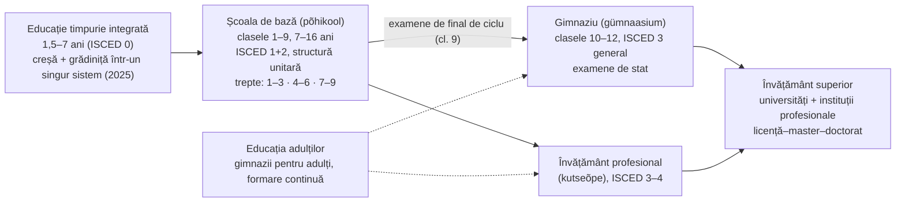
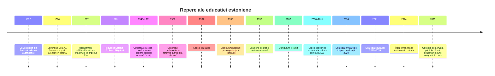

↑ [[00 Index - Analiza comparată internațională]] · [[00 MOC - Fundamentele științelor educației]]

> [!abstract] Pe scurt
> 1. **De ce contează**: Estonia (1,36 mil. locuitori) este, în PISA 2025, pe locul 1 în Europa la științe, matematică și rezolvarea computațională de probleme și pe locul 2 la citire; în OCDE este depășită doar de Japonia și Coreea. Rezultatele sunt obținute cu **echitate** ridicată: statutul socio-economic explică o parte mai mică din variația rezultatelor decât media OCDE.
> 2. **Formula, pe scurt**: **școală de bază unitară de 9 ani** (clasele 1–9, fără tracking timpuriu) + **educație timpurie** cu participare foarte mare + **autonomie** largă a școlilor, profesorilor și municipalităților + **curriculum național pe competențe** (1996 → 2002 → 2011) completat de **curriculumul fiecărei școli** + **profesori cu master obligatoriu** + **evaluare externă** la final de ciclu (din 1997) + **digitalizare** timpurie (*Tiigrihüpe*, 1996).
> 3. **Rădăcini istorice lungi**: alfabetizare luterană (sec. XVII, seminarul lui Forselius, 1684), Universitatea din Tartu (1632), rata de alfabetizare de ~80% în 1897 (cea mai mare din Imperiul Rus), școala obligatorie de 6 ani în republica interbelică (1920) și pedagogia reformatoare a lui **Johannes Käis**.
> 4. **Momentul fondator modern**: **Congresul profesorilor din martie 1987**, în plină perioadă sovietică, a cerut un curriculum estonian, umanist și centrat pe elev — o reformă pornită „de jos”, de la profesori și cercetători, cu patru ani înainte de independență.
> 5. **Fundamente aplicate**: trecerea de la paradigma sovietică centrată pe materie la **paradigma curriculumului** și a **competențelor** (M02, M04, M10); **educația permanentă** ca principiu de strategie (Strategia LLL 2020; Strategia 2021–2035, cu indicatorul „învățăcel autodirijat”) (M03); **evaluarea formativă**, autoevaluarea și portofoliul ca „jurnal de învățare” scrise explicit în curriculumul național (M10); descentralizare și autoevaluarea școlii (M08).
> 6. **Tradiția cultural-istorică** nu este decorativă: psihologia vygotskiană a circulat în Estonia sovietică, iar estonieni precum **Peeter Tulviste** (elev al lui Luria) și **Jaan Valsiner** au devenit interpreți de referință ai lui Vygotsky; semiotica de la Tartu (**Iuri Lotman**) a influențat concepția culturală a educației.
> 7. **Influență nordică**: modelul finlandez al școlii comprehensive și al curriculumului-cadru (colaborare directă cu agenția finlandeză din 1993) a fost un reper explicit.
> 8. **Probleme reale**: scăderea la citire și matematică după 2018, decalajul dintre școlile cu predare în estonă și rusă (31–40 de puncte în PISA 2025), profesori îmbătrâniți și deficit de personal, bullying peste media OCDE, practici de predare încă tradiționale (TALIS 2018) și o tranziție controversată la instruirea exclusiv în estonă (2024–2033).
> 9. **Pentru R. Moldova**: Estonia este cel mai relevant caz comparativ — același punct de plecare sovietic, o minoritate rusofonă numeroasă, resurse limitate. Diferențele de rezultat țin mai puțin de „rețete” și mai mult de consecvența politicilor, calitatea profesorilor și încrederea acordată școlilor.

---

## 1. Profil și date-cheie

| Indicator | Valoare | Sursa |
|---|---|---|
| Populație | **1 360 745** (1 ian. 2026); estonieni 68,5%, ruși 20,2%, alte etnii 10,8% | Statistics Estonia |
| Limbă oficială | estona (familia fino-ugrică); rusa este a doua limbă ca număr de vorbitori | Statistics Estonia; Ryabova (2025) |
| Cheltuieli publice cu educația | **6,3% din PIB** (2024), printre cele mai mari din UE (media UE: 4,8%) | Eurostat, COFOG |
| Cheltuieli pe instituții (primar–terțiar) | 4,8% din PIB (2020; media OCDE 5,1%); 11 088 USD PPP/student (OCDE: 12 647) | OECD, *Education at a Glance 2023* |
| Surse ale finanțării publice (preuniversitar) | 32% guvern central, 68% nivel local (după transferuri) | EAG 2023 |
| Finanțare privată (primar–postliceal) | 3% | EAG 2023 |
| Instruire obligatorie (ore, cl. 1–9) | 6 431 ore (media OCDE: 7 634) | EAG 2023 |
| Participare la educația timpurie (3 ani – vârsta școlară) | 91,2% (2023; media UE 94,6%) | *Education and Training Monitor 2025* |
| Părăsirea timpurie a educației (18–24 ani) | 11% (2024; UE 9,3%); băieți 13,3%, fete 8,6% | *Education and Training Monitor 2025* |
| Absolvenți de terțiar (25–34 ani) | 42,7% (2024) | *Education and Training Monitor 2025* |
| Participarea adulților la învățare (25–64 ani, ultimele 12 luni) | 41,8% (2022; UE 39,5%) | *Education and Training Monitor 2025* |
| Profesori de 55+ ani | 37,8% (UE: 25,1%) | *Education and Training Monitor 2025* |

### 1.1 Structura sistemului

- **Obligativitatea**: începe la 7 ani; din anul școlar **2025/2026** a fost înlocuită cu **„obligația de a învăța” până la 18 ani** (sau până la obținerea unei calificări de nivel secundar). Absolvenții de clasa a 9-a trebuie să continue în liceu, învățământ profesional sau programe pregătitoare. Motivația oficială: aproape 800 de absolvenți de școală de bază nu își continuau studiile în fiecare an, iar circa 1 din 10 tineri rămânea doar cu educație de bază (Ministerul Educației și Cercetării — HTM; Riigikogu a adoptat modificarea în decembrie 2024).
- **Nu există tracking până la 15–16 ani**: prima separare între parcursul academic și cel profesional apare după clasa a 9-a (Tire, 2021). Repetenția este rară și permisă doar în cazuri excepționale (curriculumul național, § 22).
- **Guvernanța** este pe trei niveluri: **statul** (Ministerul Educației și Cercetării — *Haridus- ja Teadusministeerium*, HTM) stabilește standardele, curriculumul național, examenele și supravegherea; **autoritățile locale** administrează grădinițele, școlile de bază și majoritatea liceelor; **școlile** își elaborează propriul curriculum. Agenția executivă este **Haridus- ja Noorteamet (Harno)** — *Education and Youth Board*, înființată la **1 august 2020** prin comasarea fundațiilor Innove, Archimedes, HITSA și a Centrului Estonian pentru Munca de Tineret.
- **Finanțarea**: statul acoperă salariile profesorilor și directorilor, formarea continuă, manualele și **prânzul școlar gratuit**, atât în școlile municipale, cât și în cele private. Circa 90% dintre elevi învață în școli municipale (Eurydice). Prânzul gratuit există pentru școala de bază din 2006 și pentru liceu din 2014 (Lees, 2016). În 2008, finanțarea a trecut de la criteriul „per elev” la „per clasă”, pentru a proteja școlile rurale mici (Lees, 2016).
- **Reforma rețelei școlare**: din 2015, statul preia treptat liceele (**gimnazii de stat** în centrele de județ), iar municipalitățile rămân responsabile de școala de bază. Programul Rețeaua Școlară 2015–2020 a avut investiții de 241 mil. EUR (Lees, 2016).

> [!note] Comentariu
> Estonia combină două lucruri care în R. Moldova sunt adesea percepute ca opuse: un **stat puternic în standarde și evaluare** (curriculum național, examene centralizate, sisteme informaționale) și o **autonomie mare în practică** (școala își face curriculumul, directorul angajează, profesorul alege manualul și metoda). Tire (2021) rezumă: practic nu există inspectori școlari; intervenția statului este punctuală, de regulă după o sesizare.

---

## 2. Traiectoria PISA 2006–2025

Estonia nu a participat la PISA 2000 și 2003; **prima participare este în 2006**. Singura participare la TIMSS a fost în 2003 (clasa a 8-a), cu rezultate peste așteptări (Tire, 2021). Estonia nu participă la PIRLS.

### 2.1 Scoruri medii

| Ciclu (domeniu principal) | Citire | Matematică | Științe | Poziție aproximativă (citire / mat. / șt.) | Media OCDE (citire / mat. / șt.) |
|---|---|---|---|---|---|
| **2006** (științe) | 501 | 515 | 531 | ~13 / ~14 / 5 | 492 / 498 / 500 |
| **2009** (citire) | 501 | 512 | 528 | ~13 / ~17 / ~9 | 493 / 496 / 501 |
| **2012** (matematică) | 516 | 521 | **541** | ~11 / 11 / 6 | 496 / 494 / 501 |
| **2015** (științe) | 519 | 520 | 534 | 6 / 9 / **3** | 493 / 490 / 493 |
| **2018** (citire) | **523** | **523** | 530 | 5 / 8 / 4 (**1 în Europa** la toate) | 487 / 489 / 489 |
| **2022** (matematică) | 511 | 510 | 526 | 6 / 7 / 6 | 476 / 472 / 485 |
| **2025** (științe) | 499 | 508 | 527 | 8 / 8 / 6 (din 91 de sisteme) | 461 / 463 / 482 |

*Surse*: rapoartele OCDE pe cicluri; NCSL/NCEE (2020) pentru seria 2006–2018; *PISA 2022 Factsheets: Estonia* (OECD, 2023); HTM și Education Estonia pentru PISA 2025 (lansat de OCDE pe **8 septembrie 2026**). Pozițiile pentru 2006–2015 sunt aproximative (depind de intervalele de încredere); pentru 2018 și 2025 sunt cele comunicate oficial. Mediile OCDE sunt cele din raportul fiecărui ciclu; mediile „de trend” recalculate pe un set constant de țări diferă cu câteva puncte.

> [!warning] PISA 2025 a fost publicat
> Rezultatele PISA 2025 (Volumul I) au fost lansate de OCDE pe 8 septembrie 2026. Domeniul principal a fost științele, iar domeniul inovator a fost rezolvarea computațională de probleme (*computational problem solving*): Estonia a obținut **541 de puncte** (locul 7 global, primul în Europa). Volumele următoare, inclusiv *Learning in the Digital World*, sunt anunțate pentru 2027. Au participat 6 304 elevi din 204 școli, reprezentând circa 89% dintre tinerii de 15 ani.

### 2.2 Distribuția rezultatelor: sub nivelul 2 și performeri de top

| Indicator | 2009 | 2018 | 2022 | 2025 | Media OCDE (ultimul ciclu) |
|---|---|---|---|---|---|
| Citire: sub nivelul 2 | 13,3% | 11,1% | 14% | **17%** | 31% (2025) |
| Citire: nivelurile 5–6 | 6,0% | 13,9% | 11% | 9% | 6% (2025) |
| Matematică: sub nivelul 2 | — | 10,2% | 15% | ~17% (+6 p.p. față de 2015; de verificat în raport) | 35% (2025) |
| Matematică: nivelurile 5–6 | — | 15,5% | 13% | (de verificat) | 8% (2025) |
| Științe: sub nivelul 2 | — | 8,8% | 10% | **10%** | 26% (2025) |
| Științe: nivelurile 5–6 | — | 12,2% | 12% | 11% | 7% (2025) |

*Surse*: Tire (2021) pentru 2009 și 2018; *PISA 2022 Factsheets: Estonia*; Estonian World și HTM (septembrie 2026) pentru 2025; nota de țară PISA 2025 pentru Germania (OECD, 2026) pentru mediile OCDE ale nivelurilor de competență în 2025.

**Tendința**: OCDE descrie pentru Estonia un **arc** — creștere până în 2012–2018, apoi scădere. La științe declinul începe în jurul lui 2012. În 2022 rezultatele erau apropiate de cele din 2006–2009 (OECD, 2023). În 2025, citirea scade din nou (−24 de puncte față de 2018), iar ponderea elevilor sub nivelul 2 la citire și matematică este cu 6 puncte procentuale mai mare decât în 2015 (HTM, 2026). Declinul este însă **mai mic decât media OCDE**: media OCDE la citire a scăzut cu 28 de puncte între 2015 și 2025, iar 2025 este cel mai slab ciclu al OCDE la toate cele trei domenii (comunicatul OCDE din septembrie 2026).

### 2.3 Echitate

| Indicator | Estonia | Media OCDE | Sursa |
|---|---|---|---|
| Variația la citire explicată de ESCS (2018) | **6,2%** | 12% | PISA 2018 (NCSL/NCEE, 2020; Tire, 2021) |
| Elevi dezavantajați „rezilienți” (citire, 2018) | 15,6–16% | 11% | Tire (2021) |
| Diferența avantajați–dezavantajați la matematică (2022) | 81 de puncte | 93 | PISA 2022 Factsheets |
| Variația la matematică explicată de ESCS (2022) | 13% | 15% | idem |
| Evoluția decalajului socio-economic la matematică, 2012–2022 | **s-a mărit** | stabil | idem |
| Diferența avantajați–dezavantajați la științe (2025) | **68 de puncte** | ~85–86 | HTM; Estonian World (2026) |
| Variația la științe explicată de mediul socio-economic (2025) | 10% | 12% | Estonian World (2026) |
| Decalajul dintre școlile cu predare în estonă și în rusă (2025) | **40** (șt.) / **32** (mat.) / **31** (cit.) | — | HTM (2026) |
| Decalajul estonă–rusă (2018) | 42 (cit., șt.) / 29 (mat.) | — | Tire (2021) |
| Diferența de gen (2025) | fetele +25 la citire; băieții +13 la matematică | — | HTM (2026) |
| Gândirea creativă (PISA 2022) | 36 vs. 33 puncte; primul loc în Europa; ESCS explică 6,9% | 11,6% | Education Estonia (2024) |

### 2.4 Bunăstare și climat școlar

- **Satisfacția față de viață**: 7,4/10 în 2025 (OCDE: 7,2) (Education Estonia, 2026). În 2022, 16% dintre elevi se declarau nemulțumiți de viață (OCDE: 18%), iar 78% simțeau că aparțin școlii (OCDE: 75%) (OECD, 2023).
- **Bullying**: 27% dintre elevi raportează că sunt victime cel puțin de câteva ori pe lună (OCDE: 20%) (Estonian World, 2026, pe baza PISA 2025). În 2022, proporțiile erau de 22% la fete și 29% la băieți (OECD, 2023). Este una dintre slăbiciunile constante ale sistemului.
- **Mentalitatea de creștere**: 83% dintre elevi cred că abilitățile se dezvoltă prin efort (OCDE: 69%); acești elevi au cu 36 de puncte mai mult la științe (HTM; Estonian World, 2026).
- **Personal didactic**: 65% dintre elevi învață în școli în care directorul raportează că lipsa de personal afectează predarea (OCDE: 39%) (Estonian World, 2026, pe baza PISA 2025).
- **Inteligența artificială**: 58% dintre elevi folosesc săptămânal chatboți AI pentru învățare (OCDE: 46%). Cei care îi folosesc pentru anumite sarcini au scoruri mai mici la științe, cu circa 20 de puncte (Estonian World, 2026). Este o **corelație**, nu o dovadă de efect cauzal.
- **Citirea „în grabă”**: ponderea elevilor care citesc superficial și răspund rapid, dar greșit, aproape s-a dublat între 2018 și 2025 (HTM, 2026).

---

## 3. Cronologia reformelor (sec. XVII–XXI)

| An | Reformă / lege / program | Ideea | Legătura cu fundamentele |
|---|---|---|---|
| 1632 | **Universitatea din Tartu**, fondată de regele Suediei Gustav al II-lea Adolf; gimnaziile academice din Tartu (1630) și Tallinn (1631) | tradiție universitară și umanistă | [[Modulul 01 - Statutul științelor educației]] — instituționalizarea cunoașterii |
| 1684 | **Seminarul lui Bengt Gottfried Forselius** lângă Tartu pentru învățători țărani | alfabetizare în limba maternă pentru citirea Bibliei (logica luterană) | educația ca drept al tuturor; limba maternă ca vehicul |
| sec. XIX | Rețea de școli țărănești, trezirea națională; rusificare după 1885 | școala ca instrument al identității naționale | funcția socială și culturală a educației (M02) |
| 1897 | Recensământul imperial: alfabetizare de **79,9%** în Estonia, cea mai mare din Imperiul Rus (Lees, 2016); în provinciile baltice, rata de citire era de circa trei ori media imperiului (Raun, 2017) | capital cultural acumulat | premisă istorică a performanței ([[Capitalul uman și economia educației]]) |
| 1905 | Prima grădiniță în limba estonă (Tartu) | educația timpurie ca rezistență culturală | Educația timpurie |
| 1920 | Republica Estonia: **educație gratuită și obligatorie de 6 clase** (Lees, 2016; Tire, 2021) | democratizare, școală în limba maternă | [[Modulul 08 - Sistemul de educație și managementul educației]] |
| 1920–1930 | **Johannes Käis**: învățare individualizată, școala activă, integrare, învățare în aer liber; un articol din 1928 a declanșat experimente cu planuri individuale de învățare | educația nouă / reformpedagogik | [[Progresivismul și educația nouă]], Diferențierea, inteligențele multiple și designul universal |
| 1940–1991 | Sistem sovietic centralizat; **școli paralele** (estonă — 11, apoi 12 ani; rusă — 10, apoi 11 ani); ponderea non-estonienilor crește de la 8,5% (1945) la 38,5% (1989) | ideologizare; totuși, instruirea în estonă, manualele de autori estonieni și un loc important pentru muzică și arte au rămas | [[Modulul 02 - Clasic, modern și postmodern în educație]] — modelul „clasic” autoritar |
| 1959 | Institutul de Cercetări Pedagogice din Tallinn | cercetare educațională (controlată ideologic) | M05 |
| 1968–1988 | Educația obligatorie urcă la 8, apoi la 9 clase (Lees, 2016) | extinderea școlarizării | M08 |
| **martie 1987** | **Congresul profesorilor din RSS Estonă** (~1000 de participanți; ministra Elsa Gretškina); brainstorming național (mai 1987); concurs cu 21 de proiecte de curriculum (iunie 1987) | centrarea pe elev, descentralizare, reducerea ideologiei, eliminarea „instruirii în producție”, mai multe limbi occidentale | [[Teoria schimbării educaționale și leadershipul]]; paradigma curriculumului (M02, M10) |
| 1988 | Estonia prezintă la conferința unională de la Moscova o platformă proprie: democrație, umanism, educația ca valoare în sine | autonomie educațională | [[Pedagogia critică și educația pentru cetățenie]] |
| 1989 | *Principiile de bază ale reorganizării învățământului public din Estonia*; primul curriculum estonian pentru școlile cu predare în estonă (1989/90) | de la memorare la gândire și aplicare | [[Taxonomiile obiectivelor și educația centrată pe competențe]] |
| 1990 | Asociația Pas cu Pas (*Step by Step*, din 1994), Fundația Estonia Deschisă (Soros): seminarii „Școala independentă” (1994), rețeaua „Școli de excelență”, proiectul „Școala cu propriul chip” | inovare din societatea civilă | [[Progresivismul și educația nouă]] |
| **1992** | **Legea educației a Republicii Estonia** | curriculumul devine conceptul central al legii; obligativitate de 9 ani sau până la 17 ani | M08 |
| 1993 | Legea școlilor de bază și a gimnaziilor; Laboratorul de Studii Curriculare (Universitatea Pedagogică din Tallinn), în cooperare cu agenția școlară finlandeză | fundamentarea teoretică a curriculumului | [[Tradiția Bildung-Didaktik și tradiția Curriculum]] |
| 1994 | *Fundamentele curriculumului național* (echipa Viive-Riina Ruus): **constructivism**, competențe, obligația școlilor de a-și face propriul curriculum (idee preluată din Finlanda) | curriculum-cadru + curriculum școlar | [[Constructivismul cognitiv (Piaget, Bruner)]] |
| 1995 | Forumul Estonian al Educației (societatea civilă); primele linii directoare pentru formarea profesorilor | participare publică la politică | Educația bazată pe dovezi |
| **1996** | **Curriculumul național pentru școala de bază și liceu** (Hotărârea Guvernului nr. 228, 6 sept. 1996), introdus din 1997 | competențe generale, integrare, teme transversale, curriculum școlar | [[Taxonomiile obiectivelor și educația centrată pe competențe]] |
| **1996–1997** | **Tiigrihüpe** (*Tiger Leap*): anunțat de președintele Lennart Meri pe 21 feb. 1996, propus de Toomas Hendrik Ilves și ministrul Jaak Aaviksoo; fundația a fost creată în 1997 | calculatoare și internet în toate școlile; competență TIC pentru profesori | [[Constructionismul și educația digitală]] |
| 1997 | **Examene de stat** la finalul liceului; sistemul de evaluare externă (teste la clasele 3 și 6, examene la clasa a 9-a) | responsabilizare prin evaluare standardizată | [[Responsabilizare, piață și încredere în guvernarea educației]] |
| 1998 | Raportul *Learning Estonia* (Consiliul Academic al Președintelui); scenariile „Estonia 2015”; Legea școlilor private | educația ca principală resursă națională; societatea care învață | [[Învățarea pe tot parcursul vieții și formele educației]] |
| 1998 | Planul pentru școlile cu predare în rusă (trecere la curriculum estonian) | integrare | [[Educația incluzivă]] |
| 1999 | Primul curriculum-cadru pentru educația preșcolară; Legea muncii de tineret | educație timpurie sistematică; nonformal | Educația timpurie |
| 2002 | Curriculum național revizuit (probleme de coerență criticate) | continuitate cu 1996 | M10 |
| 2002 | **eKool** (fundația Look@World + parteneri privați) | comunicare digitală școală–familie | [[Constructionismul și educația digitală]] |
| 2006 | Prânz gratuit pentru toți elevii școlii de bază; autoevaluare internă obligatorie (în uz de peste un deceniu, după Tire, 2021); **Noored Kooli** (*Teach First*), fondat în noiembrie 2006 | echitate; rute alternative spre profesie | [[Echitatea și școala comprehensivă]] |
| 2007 | Planul de trecere a liceelor rusofone la 60% din discipline predate în estonă (termen: 2011) | integrare lingvistică | [[Educația incluzivă]] |
| 2008 | Finanțare „per clasă” | protecția școlilor rurale | M08 |
| 2010 | **Legea școlilor de bază și a liceelor** (în vigoare din 2010) | drepturi și obligații clarificate, sprijin, incluziune | [[Educația incluzivă]] |
| **2011** | **Curricula naționale separate** pentru școala de bază (Hotărârea din 6 ian. 2011, modificată în 2014) și pentru liceu | 8 competențe generale, 8 teme transversale, evaluare formativă, proiect creativ în ciclul III | [[Evaluarea formativă]], [[Învățarea autoreglată, metacogniția și autoeducația]] |
| 2012 | **ProgeTiiger** (programare și robotică); IT Academy | alfabetizare tehnologică | [[Constructionismul și educația digitală]] |
| 2013 | Standarde profesionale noi pentru profesori; **HITSA** (1 mai 2013, prin fuziunea Tiger Leap, EITSA și EENet); învățământ superior gratuit pentru studenții cu normă întreagă | profesionalizare | [[Profesionalismul cadrului didactic]] |
| **2014** | **Strategia Estonă a Învățării pe Tot Parcursul Vieții 2020** (aprobată pe 13 feb. 2014); centrele **Rajaleidja** (sprijin psihopedagogic); prânz gratuit și la liceu | 5 obiective: schimbarea abordării învățării, profesori competenți, corelarea cu piața muncii, focus digital, șanse egale | [[Învățarea pe tot parcursul vieții și formele educației]] |
| 2015 | Programul Rețeaua Școlară 2015–2020; gimnazii de stat | optimizare demografică | M08 |
| 2017 | Sprijin de stat pentru educația și activitățile de hobby (*huviharidus*) | nonformal accesibil | [[Modulul 03 - Formele generale ale educației]] |
| 2018 | Sondaj național de bunăstare (clasele 4, 8, 11), cu rapoarte pentru fiecare școală | date pentru autoevaluare și SEL | [[Învățarea socio-emoțională și educația caracterului]] |
| **2020** | **Harno** (1 aug. 2020); învățământ la distanță în pandemie | agenție integrată | Educația bazată pe dovezi |
| **2021** | **Strategia educației 2021–2035** (adoptată în noiembrie 2021) | învățare personalizată, „învățăcel autodirijat”, profesori motivați, corelarea cu societatea | [[Învățarea autoreglată, metacogniția și autoeducația]] |
| 2022 | Legea tranziției la educația în estonă (Riigikogu, 12 dec. 2022); Planul de acțiune pentru profesori | coeziune; deficitul de profesori | [[Pedagogia critică și educația pentru cetățenie]] |
| **2024** | Tranziția începe în grădinițe și în clasele 1 și 4 (sept. 2024); Legea educației timpurii; modificarea privind obligația de a învăța (dec. 2024) | coeziune lingvistică; creșterea nivelului de calificare | [[Echitatea și școala comprehensivă]] |
| **2025** | **Obligația de a învăța până la 18 ani**; sistemul integrat de educație timpurie și noul curriculum preșcolar (1 sept. 2025); **AI Leap** (*TI-Hüpe*) | calificare universală; AI în învățare | [[Capitalul uman și economia educației]], [[Constructionismul și educația digitală]] |
| 2026 | Modelul de carieră al profesorului în patru trepte; certificarea directorilor (anunțate) | carieră profesională | [[Profesionalismul cadrului didactic]] |

---

## 4. Implementarea fundamentelor

### 4.1 Statutul științelor educației, cercetarea și politica bazată pe dovezi

→ [[Modulul 01 - Statutul științelor educației]] · [[Modulul 05 - Paradigmele pedagogiei și cercetarea pedagogică]]

**Instituții de cercetare și formare**

| Instituție | Rol | Exemple de cercetători și teme |
|---|---|---|
| **Universitatea din Tartu** (Institutul de Educație) | formarea profesorilor, cercetare în educație, psihologie | **Äli Leijen** (formarea profesorilor, reflecție, agenția profesorului); **Margus Pedaste** (învățarea prin investigație, proiectele Go-Lab/Next-Lab); **Edgar Krull** și **Karmen Trasberg** (istoria reformei); **Jaan Mikk** (lizibilitatea manualelor); **Peeter Tulviste** (psihologie cultural-istorică, rector 1993–1998) |
| **Universitatea din Tallinn** (fosta Universitate Pedagogică) | formarea profesorilor, școala de științe ale educației, tehnologii digitale | **Viive-Riina Ruus** (1936–2018, fundamentele curriculumului 1994–1996); **Mart Laanpere** (tehnologie educațională, competența digitală a profesorilor, SELFIEforTEACHERS); **Eve Kikas** (psihologie școlară, strategii de învățare); **Aaro Toomela** (metodologia psihologiei cultural-istorice); **Maie Kitsing** (guvernanța și leadershipul școlar) |
| **Harno** | examene, teste naționale, PISA/TALIS, analiză, sisteme informaționale | **Gunda Tire** — managerul național PISA din 2007 |
| **HTM** — departamentul de analiză | portalul de date **Haridussilm**, monitorizarea strategiilor | rapoarte anuale despre evaluarea externă |
| **Kutsekoda** (Autoritatea Calificărilor) + **OSKA** | standarde profesionale, prognoza nevoilor de competențe | standardele profesionale ale profesorilor (2013) |

**Tradiția cercetării**. În perioada sovietică, cercetarea educațională era strategică și controlată ideologic: în 1959 a apărut Institutul de Cercetări Pedagogice din Tallinn, iar la începutul anilor 1960 un institut public de cercetare condus de profesori. Accesul la literatura occidentală era permis doar sub forma „analizei critice” (Krull & Trasberg, 2006). Ruus & Sarv notează totuși o bază intelectuală mai largă decât media URSS: continuitatea ideilor progresiste din republica interbelică, influența **școlii lui Vygotsky** și a concepției despre educație ca fenomen cultural, precum și un sistem de formare continuă prin care fiecare profesor urma cursuri la cinci ani, cu tradiții de **cercetare făcută de profesori** (școli de vară, publicații, doctorate). Pentru interpretarea acestei perioade, vezi și Rõuk, van der Walt & Wolhuter (2017), *The science of pedagogy in Soviet Estonia (1944–1991): resilience in the face of adversity* (*History of Education*).

**Politica bazată pe dovezi**. Strategia 2021–2035 enumeră printre punctele forte faptul că statul folosește o abordare bazată pe dovezi și implică tot mai mult cercetătorii în deciziile strategice. Printre slăbiciuni apar însă și calitatea neomogenă a datelor și lipsa competențelor de analiză a datelor la directori și profesori. Kitsing & Kukemelk (2020) descriu evoluția guvernanței școlare ca o trecere de la o conducere **bazată pe ordine** la una **incluzivă și bazată pe dovezi**.

> [!warning] Critică
> Krull & Trasberg (2006) avertizau că, în democrația estoniană a anilor 1990–2000, deciziile educaționale erau adesea luate pe baza opiniilor personale ale administratorilor sau ale unor persoane influente din consilii, nu pe baza cunoașterii experților. Mai multe inovații au eșuat din acest motiv. Ruus & Sarv subliniau lipsa de specialiști în curriculum: în URSS, elaborarea curriculumului fusese monopolul Moscovei.

### 4.2 Paradigme pedagogice dominante: clasic–modern–postmodern

→ [[Modulul 02 - Clasic, modern și postmodern în educație]]

| Perioadă | Paradigma dominantă | Caracteristici |
|---|---|---|
| sec. XVII–XIX | **clasică, luterană și germano-baltică** | alfabetizare pentru citirea Bibliei; școală parohială; gimnazii și universitate humboldtiene |
| 1918–1940 | **modernă — educația nouă** | școală democratică, în limba maternă; Käis: activitate proprie, individualizare, integrare, educație prin natură |
| 1940–1987 | **clasică autoritară sovietică** (cu „nișe” estoniene) | centralizare; conținut centrat pe materie; ideologie; accent pe matematică și științe din motive militare (Tire, 2021) |
| 1987–1996 | **tranziție — modernitate umanistă** | „centrarea pe individ” (gestul simbolic al ministrei, care s-a înclinat în fața unui elev la congresul din 1987); pluralism de idei, școli Waldorf; perioadă de „anarhie curriculară” (Krull & Trasberg) |
| 1996–2010 | **paradigma curriculumului pe competențe** | curriculum orientat spre rezultate (*output-oriented*); competențe generale; constructivism; curriculum școlar |
| 2011–prezent | **„abordarea contemporană a învățării”** (*õpikäsitus*) — postmodernă în sensul manualului | învățare activă, pe tot parcursul vieții; elevul își asumă responsabilitatea; profesorul sprijină și creează condiții; personalizare, digital, bunăstare |

Glosarul Strategiei 2021–2035 definește **abordarea contemporană a învățării** astfel (parafrază): învățarea este un **proces activ, pe tot parcursul vieții**, în care elevul **învață să învețe și își asumă responsabilitatea pentru propria educație**; cunoștințele, abilitățile, comportamentul și valorile se schimbă; rolul profesorului este să sprijine și să creeze condițiile în care fiecare elev își atinge potențialul maxim de dezvoltare.

> [!note] Comentariu — corelare cu manualul
> Manualul (M02) descrie trecerea de la paradigma „clasică” la cea a curriculumului. Estonia ilustrează aproape perfect această trecere. Curriculumul național din 2011 conține chiar o **teorie a învățării** explicită (§ 5), de factură socio-constructivistă: elevul construiește cunoașterea pornind de la ce știe deja, o aplică în situații noi și participă la stabilirea scopurilor. Curriculumul are și o **teorie a educației valorilor**, în care profesorul este model personal.

### 4.3 Formele educației: formal, nonformal, informal; LLL; autoeducația

→ [[Modulul 03 - Formele generale ale educației]] · [[3.6 Educația permanentă și autoeducația]] · [[Autoeducația - teorii, autori și corelări]]

- **Educația formală** este comprehensivă și gratuită, de la grădiniță (cu contribuții parentale plafonate) până la primul nivel de calificare profesională sau superioară.
- **Educația nonformală** este descrisă de Strategia 2021–2035 ca „bine dezvoltată și diversă”: **școli de hobby** (muzică, artă, sport, tehnologie), **centre de tineret**, activități extrașcolare adesea gratuite în școală (Tire, 2021). Din **2017**, statul finanțează municipalitățile pentru educația și activitățile de hobby (*huvihariduse ja huvitegevuse toetus*; suma anuală este de verificat). Legea muncii de tineret datează din 1999, iar Planul de dezvoltare pentru tineret 2021–2035 vizează tinerii de 7–26 de ani. Curriculumul permite școlii să **recunoască învățarea din afara școlii** ca parte a curriculumului școlar (§ 15 alin. 9 și § 21).
- **Educația informală**: rolul familiei, al bibliotecilor, al mass-media (în perioada sovietică, **televiziunea finlandeză**, urmărită de mulți estonieni, a funcționat ca „fereastră informală” spre Occident; Tire, 2021) și al **cântului coral** (Krull & Trasberg interpretează „Revoluția cântată” ca pe un produs al educației muzicale acasă și la școală).
- **Învățarea pe tot parcursul vieții** a devenit principiu de stat: scenariul **„Estonia care învață”** (1998), **Strategia LLL 2020** (2014) și **Strategia 2021–2035**, care continuă explicit Strategia LLL 2020. Strategia 2021–2035 pune ca prioritate reducerea barierelor dintre învățarea formală, nonformală și informală, **micro-modulele recunoscute formal** și un „mediu de învățare fără bariere” (*seamless learning environment*). Legea educației adulților din 2025 reglementează micro-calificările.
- **Adulții**: concediu de studii de până la 30 de zile pe an, dintre care până la 20 de zile plătite cu salariul mediu (Legea educației adulților, după Eurydice); gimnazii pentru adulți; cursuri gratuite comandate de stat (peste 1 500 de cursuri pentru 26 000 de persoane în 2025–2026, după *Education and Training Monitor 2025*).

> [!tip] Lecție — autoeducația în documentele oficiale
> Estonia este una dintre puținele țări care au transformat **autoeducația** într-un obiectiv de politică măsurabil:
> - Strategia 2021–2035 are ca indicator general **„învățăcel autodirijat”** (*self-directed learner*; metodologia era în curs de elaborare) și descrie viitorul profesor ca pe cineva care **sprijină dezvoltarea învățăceilor autodirijați**.
> - Curriculumul pentru școala de bază include competențele de **autogestionare** (*self-management*: să te înțelegi și să te evaluezi, să-ți analizezi comportamentul) și de **a învăța să înveți** (să planifici studiul, să urmezi planul, să-ți analizezi cunoștințele, motivația și încrederea în sine).
> - Evaluarea formativă cere **implicarea elevilor în evaluarea proprie și a colegilor** și folosirea **portofoliului** ca „jurnal al învățării” (§ 20).
>
> Este traducerea instituțională a ideii manualului: trecerea de la heteroeducație la autoeducație (p. 36–37, 109–115), cu mecanismele descrise de Zimmerman și Vygotsky (vezi [[Autoeducația - teorii, autori și corelări]]).

### 4.4 Finalități: idealul educațional, scopuri, cadre de competențe

→ [[Modulul 04 - Finalitățile educației]]

**Ideal și scop general.** Strategia 2021–2035 formulează scopul general astfel (parafrază): să le ofere oamenilor din Estonia cunoștințele, abilitățile și atitudinile care îi pregătesc să-și realizeze potențialul în viața personală, profesională și socială și să contribuie la calitatea vieții în Estonia și la dezvoltarea durabilă globală.

**Valorile școlii de bază** (curriculumul național 2011, § 2):
- **valori general-umane**: onestitate, compasiune, respect față de viață, dreptate, demnitate umană, respect față de sine și față de ceilalți;
- **valori sociale**: libertate, democrație, respect față de limba maternă și cultură, patriotism, diversitate culturală, toleranță, sustenabilitate, stat de drept, solidaritate, responsabilitate, egalitate de gen.

Sursele declarate sunt Constituția, Declarația Universală a Drepturilor Omului, Convenția ONU cu privire la drepturile copilului și documentele fundamentale ale UE.

**Cele 8 competențe generale** (curriculumul 2011; competența digitală a fost adăugată în 2014):

| # | Competența | Esența (parafrază) | Corespondent în Recomandarea UE (2006/2018) |
|---|---|---|---|
| 1 | culturală și de valori | evaluarea relațiilor și acțiunilor prin norme morale; aprecierea diversității și a moștenirii culturale | conștiință culturală |
| 2 | socială și civică | cetățean activ și responsabil; cooperare; acceptarea diferențelor | civică |
| 3 | **de autogestionare** | autocunoaștere, analiza propriului comportament, stil de viață sănătos | personală |
| 4 | **a învăța să înveți** | planificarea studiului, autoanaliza cunoștințelor și a motivației | a învăța să înveți |
| 5 | de comunicare | exprimare în limba maternă și în limbi străine; texte variate | literație, multilingvism |
| 6 | matematică, științifică și tehnologică | modele științifice, decizii bazate pe dovezi | STEM |
| 7 | antreprenorială | idei puse în practică, inițiativă, asumarea riscului rezonabil | antreprenoriat |
| 8 | digitală | folosirea tehnologiei, crearea de conținut, siguranță și etică digitală | digitală |

**Scopuri pe trepte**: ciclul I (clasele 1–3) urmărește formarea deprinderilor de învățare și a bucuriei de a învăța; ciclul III (clasele 7–9) urmărește menținerea motivației, folosirea conștientă a strategiilor de învățare, dezvoltarea autoanalizei și sprijinul în alegerea carierei (§ 12).

**Istoria finalităților**: platforma estoniană din 1988 (democrație, umanism, educația ca valoare în sine) → competențele din 1994–1996 grupate în „conversaționale, axiologice și acționale” (Ruus & Sarv) → cadrul european de competențe cheie (2011). La cererea profesorilor, versiunea finală a curriculumului din 1996 a accentuat mai mult **apartenența națională** și **dragostea de patrie** decât proiectul inițial.

> [!note] Comentariu
> Finalitățile estoniene echilibrează **identitatea națională** (păstrarea limbii și culturii este primul principiu al Strategiei 2021–2035) cu **deschiderea europeană**. Tensiunea dintre aceste două finalități devine vizibilă în politica lingvistică (§ 4.7).

### 4.5 Dimensiunile educației

→ [[Modulul 06 - Dimensiunile generale ale educației]]

| Dimensiune | Implementare în Estonia |
|---|---|
| **Morală / caracter** | tema transversală „valori și morală”; competența culturală și de valori; feedback descriptiv despre valori și comportament de cel puțin două ori pe an (§ 19); profesorul ca model personal |
| **Intelectuală** | științele ca domeniu tradițional de excelență (cel mai bun domeniu PISA în toate ciclurile); **proiect creativ** obligatoriu în ciclul III (§ 15 alin. 8: lucrare de cercetare, proiect sau lucrare artistică); **lucrare de cercetare sau lucrare practică** obligatorie în liceu |
| **Tehnologică / digitală** | Tiigrihüpe (1996), ProgeTiiger (2012), competența digitală (2014), cod și robotică din clasele primare în multe școli (Tire, 2021), AI Leap (2025); disciplina **tehnologie** (gătit, tricotat, lucru în lemn) predată băieților și fetelor împreună |
| **Estetică** | muzică și arte obligatorii pentru toți; tradiția sovietico-estoniană a unui volum mai mare de ore la muzică și arte (Ruus & Sarv); tradiția festivalurilor corale |
| **Psihofizică** | educație fizică (școala poate alege, de exemplu, dans sau schi), tema „sănătate și siguranță”, prânz școlar gratuit, sondaje de bunăstare |

### 4.6 „Noile educații”

→ [[Modulul 07 - Noile educații]]

Cele **8 teme transversale** ale curriculumului 2011 corespund aproape integral „noilor educații” UNESCO din manual:

| Tema transversală (2011) | „Noua educație” corespondentă |
|---|---|
| 1. învățarea pe tot parcursul vieții și planificarea carierei | educația permanentă, educația pentru carieră |
| 2. mediul și dezvoltarea durabilă | educația ecologică |
| 3. inițiativa civică și antreprenoriatul | educația pentru cetățenie democratică, educația economică |
| 4. identitatea culturală | educația interculturală |
| 5. mediul informațional | educația pentru media |
| 6. tehnologie și inovare | educația tehnologică |
| 7. sănătate și siguranță | educația pentru sănătate |
| 8. valori și morală | educația morală |

- **Cetățenie**: în studiul ICCS 2022, 74,9% dintre elevii de clasa a 8-a au atins un nivel adecvat de cunoștințe civice (media UE: 63,1%) (*Education and Training Monitor 2025*).
- **Sănătate mintală și SEL**: sondajul național de bunăstare (din 2018), cu rapoarte pentru fiecare școală; teste de competențe socio-emoționale dezvoltate cu universitățile (Tire, 2021); instrument de autoevaluare CASEL pentru profesori, validat în context estonian (2025).
- **Media și AI**: tema „mediul informațional”; în PISA 2025, mulți elevi raportează că evaluează la ore calitatea informațiilor generate de AI (indicatorul există în tabloul de bord OCDE; valoarea pentru Estonia este de verificat).

### 4.7 Sistemul și managementul

→ [[Modulul 08 - Sistemul de educație și managementul educației]]

**Descentralizare și autonomie.** Datele PISA arată școli **foarte autonome**: directorii angajează și concediază personalul, alocă bugetul și decid formarea continuă, iar profesorii aleg manualele și metodele (Tire, 2021; Lees, 2016). Diferențele dintre școli sunt relativ mici, iar cele din interiorul școlilor sunt mai mari.

**Responsabilizare „soft”.** Estonia are un sistem cu mai multe piloni:
1. **Evaluare externă**: teste standardizate în clasele 3 și 6 (în ultimii ani, pe calculator), examene de final de ciclu în clasa a 9-a (estonă, matematică, o disciplină la alegere) și examene de stat în clasa a 12-a (estonă, matematică, o limbă străină, cu funcție și de admitere la universitate) (Tire, 2021; Eurydice).
2. **Autoevaluarea internă obligatorie**, cu raport cel puțin o dată pe perioada planului de dezvoltare al școlii (4–6 ani), aprobată de consiliul școlii; consilierea pe tema autoevaluării este asigurată de consilieri formați (Eurydice, 2023).
3. **Supraveghere de stat** făcută de minister: tematică sau pe cazuri individuale, adesea după o plângere (Tire, 2021).
4. **Sondaje de satisfacție și bunăstare**, cu rapoarte comparative pentru fiecare școală.

**Echitate structurală.** Școală comprehensivă de 9 ani; repetenție rară (3,5% dintre elevii de 15 ani în PISA 2012, față de 12,4% media OCDE; Lees, 2016); servicii gratuite (prânz, manuale, transport, psiholog, logoped, pedagog social; centrele Rajaleidja din 2014 pentru școlile mici).

**Segregarea lingvistică — principala fractură.** Singura segregare structurală importantă a sistemului a fost cea dintre școlile cu predare în estonă și în rusă, moștenită din perioada sovietică. Etapele politicii lingvistice:

| An | Măsură |
|---|---|
| 1993 | legea stabilește estona ca limbă de instruire, dar permite rusa în școala de bază |
| 1998–2000 | școlile rusofone trec la curriculumul estonian; estona este predată în toate școlile |
| 2007–2011 | cel puțin 60% din disciplinele de liceu se predau în estonă |
| 2009 | predarea estonei devine obligatorie în grădinițele non-estoniene de la 4 ani |
| **12 dec. 2022** | Riigikogu adoptă tranziția completă |
| **sept. 2024** | grădinițele și clasele 1 și 4 trec la estonă |
| 2030 → 2033 | liceele: până la 40% din activități în altă limbă în perioada de tranziție; clasa a 10-a trece complet la estonă cel târziu în 2030/31, clasa a 11-a în 2031/32, clasa a 12-a în 2032/33 |

Măsuri de sprijin: cerința ca directorii să aibă nivelul C1 la estonă (din 1 august 2023), salarii minime mai mari pentru profesorii din județul Ida-Viru, 8,8 mil. EUR pentru învățarea estonei în grădinițe, două ore pe săptămână de limbă și cultură maternă dacă există cel puțin 10 elevi cu aceeași limbă (Education Estonia; Eurydice).

> [!warning] Critică — tranziția lingvistică
> Guvernul prezintă reforma ca pe o măsură de **calitate și coeziune**. Un sondaj citat de Education Estonia indică un sprijin de 70% printre respondenții rusofoni și de 96% printre estonieni. Experți ONU, OSCE și FUEN au exprimat îngrijorări privind drepturile minorităților, iar la CEDO există plângeri legate de închiderea unor școli rusești (Ryabova, *Eurac Research*, 2025). Juridic, documentele constituționale și legile limbii nu garantează explicit educația în limba maternă pentru minorități, de aceea politica este considerată defensabilă din punct de vedere legal, dar rămâne controversată. Riscul principal este **pedagogic**: elevi care învață într-o limbă pe care nu o stăpânesc și profesori care nu au competență lingvistică sau în predarea limbii (Strategia 2021–2035 recunoaște această problemă).

**Reforma rețelei**. Numărul elevilor a scăzut cu circa 40% în 15 ani (Lees, 2016). Răspunsul a fost optimizarea rețelei: gimnazii de stat în centrele de județ și școli de bază păstrate cât mai aproape de casă. Strategia 2021–2035 recunoaște că împărțirea responsabilităților între stat, municipalități și sectorul privat este neclară. În 2025, guvernul a alocat 2 mil. EUR pentru 27 de școli rurale mici (Eurydice).

### 4.8 Agenții educației

→ [[Modulul 09 - Agenții educației și factorii dezvoltării]]

#### Profesorul

| Aspect | Situația în Estonia | Sursa |
|---|---|---|
| **Formarea inițială** | **master** (300 ECTS în total) pentru profesorii din școala de bază și liceu; licență (180 ECTS) pentru educatori și profesorii din învățământul profesional; cel puțin 60 ECTS de studii profesionale, dintre care cel puțin 15 ECTS practică în școală | Eurydice |
| Originea cerinței | decisă în anii 1990; profesorii aveau deja în URSS diplome echivalente cu masterul | Tire (2021) |
| **Formatori** | Universitatea din Tartu și Universitatea din Tallinn (principalele) | — |
| **Standarde** | standardele profesionale ale profesorilor (2013), pe patru niveluri, folosite atât pentru formarea inițială, cât și pentru dezvoltarea profesională continuă | Pedaste, Leijen, Poom-Valickis & Eisenschmidt (2019); Lees (2016) |
| **Anul de inserție** | an de inserție cu mentor, prevăzut încă din liniile directoare din 2000 | Krull & Trasberg (2006); Eurydice |
| **Rute alternative** | **Noored Kooli** (din 2006): program de doi ani, peste 300 de participanți, cu sprijin din partea Universității din Tallinn; micro-calificări pentru persoane care se reconvertesc profesional | Eurydice |
| **Salariul** | minimum **1 749 EUR/lună** (din 1 ian. 2023; valorile ulterioare sunt de verificat); salariul real al profesorilor din primar este cu 13% sub cel al altor angajați cu studii superioare (OCDE: −17%); creștere de peste 28% între 2015 și 2023 | Eurydice; EAG 2025 |
| **Ținte salariale** | indicatorul strategiei: 120% din salariul mediu la profesorii din învățământul general; în 2019 era 112% | Strategia 2021–2035 |
| **Timp de lucru** | 35 de ore/săptămână; concediu de până la 56 de zile | Eurydice |
| **Demografie** | vârsta medie de 49 de ani (OCDE: 44); 54% au 50+ ani (OCDE: 34%); 86% femei (TALIS 2018) | Tire (2021) |
| **Ieșirea din profesie** | circa 12% pe an, la limita superioară a intervalului observat în OCDE | EAG 2025 |
| **Retenția absolvenților** | 56% dintre absolvenții programelor de formare lucrează 5 ani consecutivi ca profesori (2023); ținta pentru 2035 este 60% | *Education and Training Monitor 2025* |
| **Deficit** | cu 50% mai mulți studenți la programele de formare a profesorilor în 2023/24 decât cu cinci ani înainte; totuși, 65% dintre elevi învață în școli afectate de lipsa de personal (PISA 2025) | ETM 2025; Estonian World (2026) |
| **Cariera** | model în patru trepte (profesor debutant, profesor, profesor senior, profesor-mentor), anunțat pentru 2026; Strategia 2021–2035 constata lipsa unui astfel de model | Eurydice; Strategia 2021–2035 |
| **Statutul** | Strategia 2021–2035: încrederea societății în profesie este un punct forte; salariile sunt o prioritate națională | — |
| **Dezvoltarea profesională** | 98% dintre profesori și 100% dintre directori au participat la formare în anul anchetei; nevoi declarate: TIC, clase multilingve, cerințe educaționale speciale (TALIS 2018) | Tire (2021) |

#### Directorul

Directorii au putere reală asupra personalului și bugetului. Strategia 2021–2035 constată că nu sunt pregătiți în mod egal pentru inovare și pentru folosirea datelor. Eurydice anunță pentru 2026 un sistem de **certificare a directorilor** la fiecare cinci ani, cu discuții anuale de dezvoltare. Kitsing, Boyle, Kukemelk & Mikk (2016) leagă excelența și echitatea estoniene de **capitalul profesional** (în sensul lui Hargreaves & Fullan) al profesorilor și al conducătorilor de școli.

#### Elevul

Curriculumul îl definește ca **participant activ** care își stabilește scopurile, învață singur și cu colegii și își analizează și gestionează studiul. Asociațiile de elevi sunt implicate în construirea unei culturi școlare centrate pe elev (Strategia 2021–2035). Există un **consiliu al elevilor** și o uniune națională a elevilor (*Eesti Õpilasesinduste Liit*; detaliile sunt de verificat).

#### Familia și comunitatea

Strategia 2021–2035 atribuie roluri explicite: **părinții** îi sprijină pe minori și contribuie la viața școlii; **proprietarii școlilor** asigură resursele; **angajatorii** participă la elaborarea curriculumului profesional și oferă învățare la locul de muncă; **societatea civilă** este partener strategic. Datele PISA 2022 arată o **scădere a implicării părinților**: doar 25% dintre elevi învățau în școli în care cel puțin jumătate dintre familii discutau progresul copilului din proprie inițiativă (37% în 2018) (OECD, 2023). **Consiliile de școală** (personal, autorități locale, părinți, absolvenți, sponsori) au fost legiferate în 2004, după ani de dezbateri (Krull & Trasberg, 2006).

### 4.9 Proiectare, predare, evaluare

→ [[Modulul 10 - Proiectarea, realizarea și evaluarea activității educative]]

**Curriculum pe două niveluri.** Curriculumul național (partea generală, programele pe arii curriculare, descrierea temelor transversale) → **curriculumul școlii**, care trebuie să conțină: valorile și specificul școlii, organizarea timpului pe discipline, integrarea temelor transversale, organizarea proiectului creativ, sprijinul pentru elevii cu CES, orientarea în carieră, cooperarea profesorilor (§ 24). Ideea curriculumului școlar a fost preluată din reforma finlandeză, pentru a înlocui practica sovietică a aplicării mecanice a instrucțiunilor „de sus” (Ruus & Sarv).

**Principii de predare (§ 5 alin. 4)**: se țin cont de particularitățile de percepție și gândire ale elevului, de fondul lingvistic, cultural și familial; volumul de muncă trebuie să lase timp pentru odihnă și hobby-uri; cunoștințele se folosesc în situații reale; se integrează disciplinele cu viața cotidiană; se folosesc metode active, excursii, învățare în aer liber și la muzeu; sarcinile sunt diferențiate.

**Evaluarea** (§ 19–22):
- scopurile evaluării includ **încurajarea elevului să învețe independent** și **dezvoltarea stimei de sine**;
- **evaluarea formativă** compară dezvoltarea elevului cu propriile sale rezultate anterioare, iar feedbackul descrie punctele tari și slabe și propune pași următori;
- elevii sunt implicați în **autoevaluare și evaluarea colegilor**; **portofoliul** este definit ca jurnal de învățare;
- **evaluarea descriptivă, fără echivalent numeric**, poate fi folosită în clasele 1–6; în ciclul II trebuie convertită în note până la finalul ciclului; scala este de 5 puncte (5 — foarte bine … 1 — slab), iar la lucrările scrise nota 5 corespunde unui punctaj de 90–100%.

**Practica reală la clasă.** TALIS 2018 arată profesori care folosesc eficient timpul (86% din timpul lecției este dedicat predării-învățării; OCDE: 78%), dar care preferă **practici tradiționale și structurate**: doar **28%** folosesc des autoevaluarea elevilor (OCDE: 41%) (Tire, 2021). Tire observă că prioritatea guvernamentală pentru învățarea centrată pe elev s-a lovit de **autonomia profesorilor**, care aleg metodele pe care le consideră potrivite.

**Evaluare diagnostică digitală.** Statul a investit în **teste diagnostice pe calculator** pentru majoritatea disciplinelor, bănci de itemi și materiale digitale. Obiectivul este ca profesorii să identifice ce știu elevii și unde au lacune (Tire, 2021).

> [!warning] Critică — prăpastia dintre partea generală și programe
> De la curriculumul din 1996 încoace, criticile se repetă: partea generală este inovatoare, dar **programele pe discipline sunt supraîncărcate** și nu lasă timp pentru rezolvare de probleme sau cooperare (Ruus & Sarv; Krull & Trasberg; evaluarea agenției finlandeze din 1999). În plus, **examenele de stat** introduse în 1997 uniformizează cerințele, reduc motivația școlilor de a-și construi un curriculum propriu și favorizează reproducerea în locul rezolvării de probleme (Ruus & Sarv). Aceasta este o ilustrare clasică a efectului de „washback” al evaluării cu miză mare.

---

## 5. Teorii și abordări aplicate

### 5.1 Tabel-sinteză

| Teorie / abordare | Relevanță în Estonia | Unde se vede |
|---|---|---|
| [[Tradiția Bildung-Didaktik și tradiția Curriculum]] | ★★★ | trecerea de la didactica germano-sovietică la curriculum-cadru pe competențe |
| [[Socioconstructivismul și teoria activității (Vygotsky)]] | ★★★ | tradiția cultural-istorică (Tulviste, Valsiner, Toomela); teoria învățării din curriculumul 2011 |
| [[Constructivismul cognitiv (Piaget, Bruner)]] | ★★ | fundamentele curriculumului din 1994–1996 |
| [[Taxonomiile obiectivelor și educația centrată pe competențe]] | ★★★ | Bloom în programele din 1988; competențele din 1996; cele 8 competențe din 2011 |
| [[Evaluarea formativă]] | ★★★ | § 20 din curriculum; evaluarea descriptivă; teste diagnostice |
| [[Învățarea autoreglată, metacogniția și autoeducația]] | ★★★ | competențele de autogestionare și de a învăța să înveți; indicatorul „învățăcel autodirijat” |
| [[Echitatea și școala comprehensivă]] | ★★★ | școala de bază de 9 ani, fără tracking; serviciile gratuite |
| Educația timpurie | ★★★ | participare ridicată; sistemul integrat din 2025 |
| [[Constructionismul și educația digitală]] | ★★★ | Tiigrihüpe, ProgeTiiger, AI Leap |
| [[Profesionalismul cadrului didactic]] | ★★★ | master obligatoriu, standarde profesionale, capital profesional |
| [[Responsabilizare, piață și încredere în guvernarea educației]] | ★★★ | autonomie, autoevaluare, inspecție minimă, evaluare externă |
| [[Învățarea pe tot parcursul vieții și formele educației]] | ★★★ | strategiile LLL 2020 și 2021–2035 |
| [[Teoria schimbării educaționale și leadershipul]] | ★★ | reforma „de jos” din 1987; rolul societății civile |
| [[Progresivismul și educația nouă]] | ★★ | Käis (anii 1920–1930); mișcarea Step by Step |
| Învățarea prin proiecte, investigație și fenomene | ★★ | proiectul creativ, lucrarea de cercetare, Pedaste et al. (2015) |
| [[Capitalul uman și economia educației]] | ★★ | *Learning Estonia*; OSKA; obligația de a învăța până la 18 ani |
| [[Educația incluzivă]] | ★★ | Legea din 2010; Rajaleidja; problemele recunoscute oficial |
| [[Învățarea socio-emoțională și educația caracterului]] | ★★ | sondajele de bunăstare; teste SEL; educația valorilor |
| [[Pedagogia critică și educația pentru cetățenie]] | ★★ | tema transversală civică; ICCS; dezbaterea lingvistică |
| Educația bazată pe dovezi | ★★ | principiul strategiei; folosirea PISA; Haridussilm |
| Diferențierea, inteligențele multiple și designul universal | ★★ | sarcini diferențiate; planuri individuale |
| [[Știința cognitivă a învățării]] | ★ | cercetări despre strategiile de învățare (Kikas) |
| [[Behaviorismul și instruirea directă]] | ★ | practica de clasă structurată (TALIS) — mai degrabă fapt empiric decât politică |
| [[Învățarea deplină (mastery learning)]] | ★ | ideea de a interveni devreme, fără repetenție — doar parțial |

### 5.2 Tradiția Bildung-Didaktik și tradiția Curriculum

**(a) Explicație.** Tradiția germano-nordică ***Didaktik*** pornește de la *Bildung* (formarea omului prin întâlnirea cu conținuturi culturale) și îi lasă profesorului, ca profesionist, interpretarea unui plan de învățământ general (*Lehrplan*). Tradiția anglo-americană ***Curriculum*** pune accentul pe proiectarea sistematică a rezultatelor învățării, pe evaluare și pe responsabilizare.

**(b) Autori.** Wilhelm von Humboldt (universitatea ca unitate între cercetare și predare); Wolfgang Klafki (*Neue Studien zur Bildungstheorie und Didaktik*, 1985: autodeterminare, codeterminare, solidaritate); Ian Westbury, Stefan Hopmann și Kurt Riquarts (eds.), *Teaching as a Reflective Practice: The German Didaktik Tradition* (2000), care au comparat cele două tradiții; Ralph Tyler (*Basic Principles of Curriculum and Instruction*, 1949); pe plan estonian, **Viive-Riina Ruus**, conducătoarea echipei care a elaborat fundamentele curriculumului (1992–1994).

**(c) Implementare.** Estonia moștenește *Didaktik* prin Universitatea din Tartu și prin elita germano-baltică, apoi prin didactica sovietică (tot de origine continentală). Reforma din 1994–1996 a adus **curriculumul orientat spre rezultate**, iar evaluarea externă din 1997 a adus componenta de responsabilizare. Totuși, sinteza este tipic nordică: **curriculum-cadru + curriculum școlar + profesor autonom**, după modelul finlandez, nu după modelul anglo-american al *accountability*-ului cu miză mare.

**(d) Dovezi și critici.** Tire (2021) consideră trecerea la curriculumul pe competențe o schimbare „foarte inovatoare și pozitivă” pe termen lung, deși inițial a produs confuzie și rezistență. Criticii au arătat decalajul dintre partea generală și programe, precum și efectul uniformizator al examenelor (Ruus & Sarv; Krull & Trasberg, 2006). Legătura directă dintre tipul de curriculum și PISA nu este demonstrată cauzal.

### 5.3 Socioconstructivismul și teoria activității (Vygotsky)

**(a) Explicație.** Funcțiile psihice superioare se formează mai întâi între oameni și apoi se interiorizează prin semne și instrumente culturale; învățarea precede și conduce dezvoltarea, în zona proximei dezvoltări.

**(b) Autori — cu legătura estoniană verificată.**
- **L. S. Vygotsky** (*Gândire și limbaj*, 1934) — tradus în estonă de Peeter Tulviste (2014).
- **Peeter Tulviste** (1945–2017): a studiat cu **A. R. Luria** la Universitatea de Stat din Moscova; doctoratul său (1987) a tratat dezvoltarea cultural-istorică a gândirii verbale (traducere engleză: *The Cultural-Historical Development of Verbal Thinking*, 1991); a publicat *Mõtlemise muutumisest ajaloos* (1984) și a condus expediții de cercetare despre adulți neșcolarizați din Asia Centrală; rector al Universității din Tartu (1993–1998).
- **Jaan Valsiner** (n. 1951), psiholog estonian: *Understanding Vygotsky* (cu René van der Veer, 1991); co-constructivismul; zonele ZML/ZAP (vezi [[Autoeducația - teorii, autori și corelări#4.1 Jaan Valsiner (n. 1951) — ★★★]]).
- **Aaro Toomela** (Universitatea din Tallinn): capitole despre metodologia psihologiei cultural-istorice în *The Cambridge Handbook of Cultural-Historical Psychology* (2014).
- **Iuri Lotman** și școala semiotică Tartu–Moscova: cultura ca sistem de texte și semne. Lotman i-a îndemnat în 1987 pe reprezentanții școlilor rusofone să participe la reforma inițiată de estonieni (Ruus & Sarv).

**(c) Implementare.** Ruus & Sarv menționează explicit **„școala de gândire a lui Vygotsky”** și concepția despre educație ca fenomen cultural printre sursele intelectuale ale pedagogiei estoniene dinaintea reformei. Curriculumul din 2011 (§ 5) are o formulare de tip socio-constructivist: învățarea se bazează pe experiența dobândită în interacțiune cu mediul fizic, mintal și social; elevul învață singur și cu colegii; cunoașterea se construiește pe baza celei anterioare. Curriculumul integrează explicit mediul familial și cultural (§ 5 alin. 4) și concepe **educația valorilor** ca relație (profesorul ca model).

**(d) Dovezi și critici.** Nu există o evaluare care să izoleze efectul acestei tradiții. Legătura este **intelectuală și istorică**, nu un program de implementare. Practica reală de clasă rămâne mai tradițională (TALIS 2018). Avertisment: nu există dovezi că Vygotsky ar fi avut o legătură personală cu Estonia; legătura trece prin Luria, Tulviste și Valsiner.

### 5.4 Constructivismul cognitiv (Piaget, Bruner)

**(a)** Cunoașterea este construită activ de elev, prin reorganizarea structurilor cognitive (Piaget); curriculumul spiralat și învățarea prin descoperire (Bruner).

**(b)** Jean Piaget (*La psychologie de l'intelligence*, 1947); Jerome Bruner (*The Process of Education*, 1960).

**(c)** În fundamentele din 1994, echipa Ruus a ales **constructivismul** drept concepție a învățării, cu accent pe construirea cunoașterii, iar din această alegere a derivat standardul educațional exprimat prin competențe (Ruus & Sarv). Tot atunci, școlile alternative și ideile constructiviste s-au răspândit rapid, uneori necritic (Krull & Trasberg, 2006).

**(d)** Krull & Trasberg (2006) leagă perioada de „anarhie” a primilor ani ’90, în care curriculumul oficial era ignorat și ideile noi erau adoptate fără pregătire, de o **scădere a rezultatelor la matematică și științe** (Krull, 2000). Lecția: constructivismul fără structură curriculară, fără materiale și fără competență profesională poate dăuna.

### 5.5 Taxonomiile obiectivelor și educația centrată pe competențe

**(a)** Obiectivele educaționale sunt formulate ca rezultate observabile ierarhizate (Bloom). Competența este un ansamblu integrat de cunoștințe, abilități și atitudini mobilizate în situații.

**(b)** Benjamin Bloom et al. (*Taxonomy of Educational Objectives*, 1956); Recomandarea Parlamentului European și a Consiliului privind competențele cheie (2006, revizuită în 2018); OCDE, proiectul DeSeCo (2003).

**(c)** Profesorii de fizică și-au construit în 1988 programa pe baza **taxonomiei lui Bloom**, primul fundament teoretic al unui grup de lucru (Ruus & Sarv). Urmează competențele din curriculumul din 1996 și **cele 8 competențe generale** din curriculumul din 2011, adoptate din cadrul UE (Tire, 2021), cu definiție legală a competenței (§ 4). Liceul trebuie să ajungă la competențe descrise în concordanță cu nivelurile cadrului estonian al calificărilor.

**(d)** Tire (2021) leagă accentul curricular pe aplicarea cunoștințelor de profilul PISA (care măsoară aplicarea). Totuși, pentru elevii din școlile rusofone, PISA arată **decalaje tocmai la aplicare**: aceștia stăpânesc bine cunoștințele de bază, dar au rezultate mai slabe în sarcinile de aplicare. Asta sugerează că formularea competențelor în documente nu garantează schimbarea practicii.

### 5.6 Evaluarea formativă

**(a)** Evaluarea în timpul învățării, cu feedback care închide distanța dintre nivelul actual și cel dorit și cu implicarea elevului prin autoevaluare și evaluare între colegi.

**(b)** Michael Scriven (distincția formativ/sumativ, 1967); Paul Black & Dylan Wiliam (*Assessment and Classroom Learning*, 1998; *Inside the Black Box*, 1998); John Hattie & Helen Timperley (*The Power of Feedback*, 2007).

**(c)** Curriculumul național (2011, § 20) conține practic o definiție operațională a evaluării formative: comparație cu rezultatele anterioare ale elevului, feedback precis și la timp, implicarea elevilor în autoevaluare și evaluare reciprocă, portofoliu. Clasele 1–6 pot folosi **evaluarea descriptivă**. Strategia LLL 2020 marca trecerea de la evaluarea sumativă tradițională la cea formativă, centrată pe copil (Tire, 2021). Statul a dezvoltat **teste diagnostice digitale**.

**(d)** **Decalaj între politică și practică**: doar 28% dintre profesorii estonieni folosesc des autoevaluarea elevilor, față de 41% în OCDE (TALIS 2018). Strategia 2021–2035 recunoaște că un sistem de evaluare care sprijină învățarea nu este dezvoltat și implementat sistemic. Examenele de final de ciclu (clasele 9 și 12) păstrează o puternică presiune sumativă.

### 5.7 Învățarea autoreglată, metacogniția și autoeducația

**(a)** Elevul își stabilește scopuri, își monitorizează și își reglează cogniția, motivația și comportamentul, apoi reflectează. Capacitatea se formează prin trecerea treptată de la reglarea externă la coreglare și autoreglare.

**(b)** Barbara Zimmerman (modelul ciclic, 2000); Paul Pintrich (2000); Monique Boekaerts (1999); Allyson Hadwin, Sanna Järvelä & Mariel Miller (2011); Malcolm Knowles (*Self-Directed Learning*, 1975). În Estonia, grupul **Eve Kikas** a studiat cunoștințele profesorilor despre strategiile de învățare ale elevilor (Granström, Härma & Kikas, *Nordic Studies in Education*, 2023).

**(c)** Competențele de **autogestionare** și de **a învăța să înveți** din curriculumul 2011; obiectivul ciclului III privind folosirea conștientă a strategiilor de învățare și autoanaliza; portofoliul; indicatorul **„învățăcel autodirijat”** și definiția „abordării contemporane a învățării” din Strategia 2021–2035, în care elevul își asumă responsabilitatea educației. Strategia mai descrie o progresie: la început predomină ghidarea adultului și familia, apoi crește rolul profesorului, apoi **crește responsabilitatea învățăcelului**. Este aproape formularea din manual a principiului heteroeducație → autoeducație.

**(d)** Strategia recunoaște că abordarea nu este încă aplicată sistematic. În PISA 2025, 43% dintre elevi spun că își planifică des modul de studiu, iar ponderea celor care citesc în grabă s-a dublat din 2018, ceea ce indică limite ale autoreglării în mediul digital (Estonian World; HTM, 2026). Metodologia indicatorului „învățăcel autodirijat” nu era finalizată la adoptarea strategiei.

### 5.8 Echitatea și școala comprehensivă

**(a)** O școală comună pentru toți până la 15–16 ani, fără selecție timpurie, reduce influența originii sociale asupra rezultatelor, fără a scădea performanța medie.

**(b)** Torsten Husén (reformele comprehensive suedeze, anii 1950–1960); OCDE, *Equity and Quality in Education* (2012); Ludger Woessmann și Eric Hanushek (*Does Educational Tracking Affect Performance and Inequality?*, 2006), cu dovezi că tracking-ul timpuriu crește inegalitatea.

**(c)** Școala de bază de 9 ani (*ühtluskool*), prima orientare după clasa a 9-a, repetenție rară, prânz gratuit (2006/2014), manuale gratuite, servicii de sprijin (Rajaleidja, 2014), finanțare per clasă (2008), rute de sprijin pentru elevii care rămân în urmă (plan individual, studiu suplimentar, § 22). Modelul finlandez a fost o sursă explicită (Tire, 2021).

**(d)** **Dovezi**: impact socio-economic mic în toate ciclurile PISA (6,2% din variație în 2018; 10% în 2025); rezultatele elevilor din sfertul cel mai dezavantajat erau peste media OCDE în 2018 (497 de puncte la citire; Tire, 2021). **Limite**: (1) decalajul socio-economic la matematică **a crescut** între 2012 și 2022; (2) segregarea lingvistică estonă–rusă a produs decalaje de 30–40 de puncte; (3) băieții abandonează școala de bază de două ori mai des decât fetele (Strategia 2021–2035); (4) apar școli urbane selective la admiterea în clasa 1 sau a 7-a (fenomen raportat în presă; amploarea este de verificat).

### 5.9 Educația timpurie

**(a)** Investiția în primii ani are cele mai mari randamente cognitive și socio-emoționale; calitatea înseamnă joc, relații și un curriculum structurat, dar nu școlarizant.

**(b)** James Heckman (*Skill Formation and the Economics of Investing in Disadvantaged Children*, *Science*, 2006); Friedrich Fröbel și Maria Montessori (tradiția interbelică estoniană, prin **Carl Heinrich Niggol**, formatorul educatorilor din anii 1920); cercetare estoniană: Õun, Ugaste, Tuul & Niglas (2010), despre percepțiile educatoarelor privind activitățile centrate pe copil.

**(c)** Participare de 87% la 3 ani, 92% la 4 ani și 93% la 5 ani (EAG 2023); primul curriculum preșcolar în 1999; **Legea educației timpurii** (2024), cu **sistem integrat creșă + grădiniță** pentru copiii de 1,5–7 ani, un sistem unic de calificare a educatorilor și un nou curriculum național din 1 septembrie 2025 (Eurydice). Mulți copii știu să citească la intrarea în clasa 1, după activități făcute prin joc la grădiniță (Tire, 2021).

**(d)** Participarea este totuși sub ținta UE pentru 2030 (91,2% față de 96%). Estonia a participat la studiul OCDE IELS (2018) despre copiii de 5 ani. Tensiune posibilă: pregătirea timpurie pentru citire poate aluneca spre școlarizarea prematură, iar noul curriculum insistă pe joc tocmai pentru a evita acest lucru.

### 5.10 Constructionismul și educația digitală

**(a)** Elevii învață construind artefacte (programe, roboți, modele); tehnologia este un instrument de gândire, nu doar de distribuire a conținutului.

**(b)** Seymour Papert (*Mindstorms*, 1980); Mitchel Resnick (Scratch); UE, DigCompEdu (Redecker, 2017). În Estonia: **Mart Laanpere** (doctorat 2013 despre proiectarea mediilor virtuale de învățare pornind de la pedagogie; instrumente de evaluare a competenței digitale a profesorilor, Sillat, Tammets & Laanpere); **Margus Pedaste** (medii web de învățare).

**(c)** Programul școlar de calculatoare din 1987–1992 (circa 3 000 de calculatoare de fabricație estoniană, mai ales *Juku*, cu probleme de fiabilitate; Lees, 2016) → **Tiigrihüpe** (1996; de la 50 la 20 de elevi pe calculator între 1996 și 1998; toate școlile conectate la internet până în 2003/04) → Tiger Leap Plus (2001) → **ProgeTiiger** (2012) → HITSA (2013) → competența digitală în curriculum (2014) → Harno (2020) → **AI Leap / TI-Hüpe** (2025): inițiat de președintele Alar Karis, cu instrumente OpenAI și Anthropic, pentru 20 000 de elevi de liceu (clasele 10–11) și 3 000 de profesori în prima etapă și o extindere anunțată la 38 000 de elevi și 2 000 de profesori. **eKool** (2002) și Stuudium sunt folosite de practic toate școlile.

**(d)** **Dovezi**: Estonia este printre liderii UE la competențele digitale ale tinerilor și are 35% studenți la TIC (UE: 20%); a trecut rapid la învățarea la distanță în 2020. **Critici**: raportul OCDE *Students, Computers and Learning* (2015) arată că utilizarea intensivă a tehnologiei nu se asociază automat cu rezultate mai bune, lucru recunoscut și de Tire (2021). În PISA 2022, 28% dintre elevii estonieni spuneau că sunt distrași de dispozitive la matematică. În PISA 2025, utilizarea AI pentru anumite sarcini **se asociază** cu scoruri mai mici la științe. Runnel, Pruulmann-Vengerfeldt & Reinsalu (*Journal of Baltic Studies*, 2009) analizează decalajul dintre retorica și practica Tiger Leap. AI Leap, fiind recent și implementat în parteneriat cu companii private, nu are încă o evaluare independentă de impact.

### 5.11 Profesionalismul cadrului didactic

**(a)** Calitatea sistemului depinde de selecția, formarea și autonomia profesorilor ca profesioniști reflexivi, organizați în comunități de învățare.

**(b)** Linda Darling-Hammond (*Powerful Teacher Education*, 2006); Andy Hargreaves & Michael Fullan (*Professional Capital*, 2012); Donald Schön (*The Reflective Practitioner*, 1983). În Estonia: **Äli Leijen**, **Margus Pedaste**, **Katrin Poom-Valickis**, **Eve Eisenschmidt** (*Teacher professional standards to support teacher quality and learning in Estonia*, *European Journal of Education*, 2019); Leijen, Pedaste & Baucal (2021), despre **agenția** studenților-profesori ca predictor al angajamentului față de profesie; Kitsing et al. (2016), despre capitalul profesional.

**(c)** Master obligatoriu, standarde profesionale folosite pentru formarea inițială și continuă, an de inserție, rețele de profesori pe discipline, formare gratuită, autonomie metodologică și un model de carieră în curs de implementare.

**(d)** **Paradox**: un profesor foarte calificat și autonom, dar **îmbătrânit** (54% au 50+ ani), **relativ prost plătit** față de alte profesii cu studii superioare, cu **ieșiri de 12% pe an** și cu practici mai tradiționale decât ar vrea politicile. Deficitul de profesori a devenit problema de sustenabilitate „numărul unu” (Tire, 2021; ETM 2025).

### 5.12 Responsabilizare, piață și încredere în guvernarea educației

**(a)** Există un spectru între responsabilizarea prin piață și teste cu miză mare (Anglia, SUA) și **încrederea profesională** (Finlanda), cu sisteme hibride între ele.

**(b)** Pasi Sahlberg (*Finnish Lessons*, 2011; critica „GERM”); Onora O'Neill (conferințele BBC *A Question of Trust*, 2002); Helen Ladd (despre vouchere și piețe); pentru Estonia, Kitsing & Kukemelk (2020).

**(c)** Estonia a ales un **hibrid înclinat spre încredere**: fără inspectori de rutină, cu autoevaluarea școlii, sondaje de satisfacție, evaluare externă la clasele 3 și 6 pe eșantion (obligatorie pentru circa 10% dintre școli, dar folosită voluntar de multe altele; Tire, 2021), examene cu miză la clasele 9 și 12. Propunerea de **vouchere educaționale** din anii 2000 a fost respinsă de comunitatea educațională ca insuficient pregătită (Krull & Trasberg, 2006). Există și școli private (circa 11% din școli după Tire, 2021; circa 4% din cheltuieli, după Eurydice).

**(d)** Strategia 2021–2035 critică faptul că **evaluarea externă și cea internă nu sunt coerente** și că evaluarea calității grădinițelor și școlilor nu este sistemică. Autonomia fără sprijin „poate duce și la stagnare” (Jürimäe, 2022).

### 5.13 Învățarea pe tot parcursul vieții și formele educației

**(a)** Educația este un proces continuu, pe toată durata vieții, care integrează formele formală, nonformală și informală. Societatea devine o „cetate educativă”.

**(b)** Edgar Faure et al., *Learning to Be* (UNESCO, 1972); Jacques Delors et al., *Learning: The Treasure Within* (UNESCO, 1996); Peter Jarvis; în Estonia, **Krista Loogma**, **Viive-Riina Ruus** și **Ene-Silvia Sarv**, coautori ai scenariilor *Estonian Educational Scenarios 2015* (1998).

**(c)** Scenariul **„Estonia care învață”** (1998), ales ca viitor dezirabil în locul unor scenarii precum „școala tradițională” sau „piața educațională polarizată”; **Strategia LLL 2020** (2014) cu 5 obiective; **Strategia 2021–2035**; concediul de studii prin lege; micro-calificări (2025); recunoașterea învățării anterioare. Ruus & Sarv propuneau încă din 1999 extinderea noțiunii de curriculum și la învățarea nonformală și organizațională.

**(d)** Participarea adulților este peste media UE (41,8%), dar **inegală**: 49,5% la 25–34 de ani față de 31,2% la 55–64 de ani (ETM 2025). Strategia recunoaște că bărbații, vorbitorii altor limbi decât estona și persoanele cu educație redusă participă mai puțin, iar angajatorii sunt insuficient motivați. Recunoașterea învățării nonformale și informale este încă slabă.

### 5.14 Teoria schimbării educaționale și leadershipul

**(a)** Schimbarea durabilă cere sens împărtășit, capacitate construită, coaliții și un echilibru între presiune și sprijin; reformele impuse doar de sus eșuează la nivelul clasei.

**(b)** Michael Fullan (*The New Meaning of Educational Change*, ed. I 1982); Andy Hargreaves & Dennis Shirley (*The Fourth Way*, 2009); Everett Rogers (difuziunea inovațiilor, 1962).

**(c)** **Reforma din 1987 este un caz-școală**: coaliție între administrație (ministra Gretškina) și cercetători (H. Liimets, V.-R. Ruus, E.-S. Sarv); brainstorming național; concurs public de proiecte evaluate de circa 400 de oameni; comisii voluntare pe discipline; aplicare-pilot în 20 de școli cu un an înainte de legalizare (Ruus & Sarv). În anii 1990: Fundația Estonia Deschisă, mișcarea „Școala cu propriul chip”, Forumul Educației (circa 300 de membri) ca spațiu de învățare pentru societate.

**(d)** Ruus & Sarv trag o concluzie explicită: reforma curriculară reușește când coincid **voința politică, sprijinul public și competența profesională**. Eșecurile ulterioare (curriculumul din 2002, rivalitatea dintre grupurile de elaborare între 2004 și 2005) arată ce se întâmplă când lipsește consensul (Krull & Trasberg, 2006).

### 5.15 Progresivismul și educația nouă

**(a)** Școala activă, centrată pe copil, pe experiență și pe interese; învățarea prin activitate proprie și legată de viață.

**(b)** John Dewey (*Democracy and Education*, 1916); Georg Kerschensteiner (*Arbeitsschule*); Helen Parkhurst (planul Dalton, cu planuri individuale de lucru). În Estonia: **Johannes Käis** (1885–1950), liderul mișcării de reînnoire școlară din anii 1930, secretar științific al Uniunii Profesorilor Estonieni (1931–1940).

**(c)** Käis a promovat învățarea individualizată (metoda „fă singur”), integrarea disciplinelor, predarea științelor naturii prin observație și experiment și învățarea în aer liber. Un articol al său din 1928, în revista *Kasvatus*, a declanșat experimente la nivel național cu planuri individuale de învățare (sursă secundară: articolul despre Ziua Profesorului în *Yearbook of Balkan and Baltic Studies*). În 1994 ideile centrate pe copil au revenit prin **Step by Step**.

**(d)** Continuitatea directă dintre Käis și politica actuală este mai degrabă **o narațiune identitară** decât o linie demonstrabilă. Perioada sovietică a întrerupt-o. Totuși, Ruus & Sarv arată că ideile progresiste interbelice au supraviețuit în rândul autorilor de manuale și al cercetătorilor.

### 5.16 Învățarea prin proiecte, investigație și fenomene

**(a)** Elevii investighează întrebări autentice prin cicluri de orientare, conceptualizare, investigare, concluzie și discuție.

**(b)** William Kilpatrick (*The Project Method*, 1918); **Margus Pedaste et al.** (2015), *Phases of inquiry-based learning: Definitions and the inquiry cycle* (*Educational Research Review*), un cadru foarte citat internațional; Ton de Jong (Go-Lab).

**(c)** Proiectul creativ obligatoriu în clasele 7–9, pe teme transversale sau integrate (§ 15); lucrarea de cercetare sau lucrarea practică obligatorie în liceu; proiectele europene Go-Lab/Next-Lab conduse parțial de la Tartu; mediile web „Tiger Journey in Estonia”, „Young Natural Researcher”.

**(d)** Estonia are cel mai bun rezultat PISA la științe, iar în 2025 subscala cea mai puternică a fost **proiectarea și evaluarea investigațiilor științifice** (OECD, 2026). Nu se poate atribui cauzal acest rezultat învățării prin investigație. Meta-analizele internaționale arată că învățarea prin investigație funcționează mai bine atunci când este ghidată, nu atunci când este lăsată complet deschisă.

### 5.17 Capitalul uman și economia educației

**(a)** Educația este o investiție care crește productivitatea și creșterea economică; contează mai mult competențele efective decât anii de școlarizare.

**(b)** Gary Becker (*Human Capital*, 1964); Eric Hanushek & Ludger Woessmann (*The Knowledge Capital of Nations*, 2015).

**(c)** Raportul *Learning Estonia* (1998) considera educația **principala resursă națională** a unei țări cu resurse naturale modeste (Krull & Trasberg, 2006). Sistemul **OSKA** de prognoză a competențelor, educația finanțată la comandă de stat, **obligația de a învăța până la 18 ani** (estimată să aducă anual 1 300 de tineri calificați în plus pe piața muncii) și investițiile în TIC urmează aceeași logică.

**(d)** Contradicție: un randament salarial mic al calificărilor profesionale și un șomaj mai mare pentru absolvenții de învățământ profesional decât pentru cei de liceu (EAG 2023: 6,2% față de 3,6%). Strategia 2021–2035 recunoaște ponderea prea mare a locurilor de muncă cu valoare adăugată mică. Există și riscul de a reduce educația la funcția ei economică (critică de tip Biesta).

### 5.18 Educația incluzivă

**(a)** Toți elevii, inclusiv cei cu cerințe educaționale speciale sau cu altă limbă maternă, învață în școala comună, cu sprijin adaptat.

**(b)** Declarația de la Salamanca (UNESCO, 1994); Mel Ainscow (*Understanding the Development of Inclusive Schools*, 1999); Tony Booth & Mel Ainscow (*Index for Inclusion*, 2002).

**(c)** Legislația post-1991 a introdus dreptul la educație pentru toți copiii, inclusiv pentru cei cu dizabilități, pe care sistemul sovietic îi excludea parțial (Lees, 2016). Legea din 2010 prevede sprijin pe trepte; centrele Rajaleidja (2014); reorganizarea rețelei școlilor speciale (reducere cu o treime planificată; Lees, 2016).

**(d)** Strategia 2021–2035 este autocritică: nu există o abordare cuprinzătoare pentru cerințele educaționale speciale, iar sistemele de sprijin nu sunt suficient de eficiente pentru a pune în practică educația incluzivă. Pentru elevii rusofoni, „incluziunea” prin limbă este disputată (§ 4.7).

### 5.19 Învățarea socio-emoțională și educația caracterului

**(a)** Competențele de autoconștientizare, autogestionare, conștiință socială, relaționare și decizie responsabilă se pot învăța și susțin atât bunăstarea, cât și rezultatele.

**(b)** CASEL; Joseph Durlak et al. (meta-analiza din *Child Development*, 2011); Thomas Lickona (educația caracterului).

**(c)** Competențele de autogestionare, socială și de valori; tema transversală „valori și morală”; sondajele naționale de bunăstare, cu rapoarte comparative pentru fiecare școală (din 2018); teste SEL (Tire, 2021); validarea unui instrument CASEL de autoevaluare pentru profesori în context estonian (2025).

**(d)** Bullyingul rămâne peste media OCDE (2018: 25% față de 23%; 2025: 27% față de 20%), iar satisfacția față de școală era scăzută în clasa a 8-a (24,5% mulțumiți în 2019, după Strategia 2021–2035). Măsurarea bunăstării este sistemică, dar **efectul intervențiilor nu este încă documentat**.

### 5.20 Pedagogia critică și educația pentru cetățenie

**(a)** Educația formează cetățeni capabili să analizeze critic puterea, să participe democratic și să transforme societatea.

**(b)** Paulo Freire (*Pedagogia oprimaților*, 1968); Gert Biesta (*Beyond Learning*, 2006); IEA ICCS.

**(c)** În 1987–1991, profesorii estonieni au funcționat ca **agenți ai emancipării naționale** („vocea libertății”, după Tire, 2021). Astăzi: tema transversală „inițiativă civică și antreprenoriat”, școala organizată ca model al unei societăți democratice (§ 7 alin. 11), consiliile elevilor, ICCS 2009, 2016 și 2022 (rezultate peste media UE).

**(d)** Emanciparea majorității a coexistat cu **tensiuni pentru minoritate**: dezbaterea din jurul închiderii școlilor rusofone ridică exact întrebările pedagogiei critice despre limbă, putere și identitate. Pentru o evaluare echilibrată, trebuie ascultate atât argumentele coeziunii (acces egal la piața muncii și la universitate în estonă), cât și cele ale drepturilor culturale.

### 5.21 Educația bazată pe dovezi

**(a)** Deciziile educaționale se sprijină pe cercetări riguroase și date sistematice, nu pe tradiție sau ideologie.

**(b)** David Hargreaves (conferința TTA din 1996); John Hattie (*Visible Learning*, 2009); OCDE, *Evidence in Education* (2007).

**(c)** Participarea la PISA (din 2006), TALIS (2008, 2013, 2018, 2024), ICCS, PIAAC și IELS; portalul **Haridussilm**; indicatori PISA folosiți direct ca ținte naționale (de exemplu, 10% performeri de top la citire până în 2020 — ținta a fost depășită în 2018, cu 13,9%; Tire, 2021; noi ținte de 20–25% până în 2035); implicarea cercetătorilor în strategia 2035.

**(d)** Tire (2021) afirmă că Estonia **nu și-a schimbat politicile ca să exceleze în PISA**. Există totuși riscul ca PISA să devină ținta în sine. Folosirea datelor la nivelul școlii este încă slabă (Strategia 2021–2035).

### 5.22 Diferențierea, inteligențele multiple și designul universal

**(a)** Adaptarea conținutului, procesului, produsului și ritmului la diferențele dintre elevi.

**(b)** Carol Ann Tomlinson (*The Differentiated Classroom*, 1999); Howard Gardner (*Frames of Mind*, 1983); CAST (UDL).

**(c)** Tradiția interbelică a planurilor individuale (Käis); clasele speciale pentru elevii cu ritm mai lent în perioada sovietică, reintegrați ulterior, și clasele pentru elevi talentați la muzică, limbi și sport (Ruus & Sarv); astăzi, sarcini diferențiate și planuri individuale (§ 5 alin. 4, § 22).

**(d)** Datele PISA arată variații mari **în interiorul** școlilor, iar Strategia 2021–2035 notează că abilitățile profesorilor de a diversifica procesul de învățare sunt inegale. Inteligențele multiple nu sunt folosite explicit în politică, iar pe plan internațional baza empirică a teoriei este contestată.

---

## 6. Ecosistemul extins: actori non-statali și procese

| Actor | Rol | Exemplu concret |
|---|---|---|
| **Universitatea din Tartu** | formarea profesorilor, cercetare, curriculum | Centrul pentru Dezvoltarea Curriculumului (2000); Go-Lab; standardele profesionale |
| **Universitatea din Tallinn** | formarea profesorilor, tehnologie educațională | Laboratorul de Studii Curriculare (1993); sprijin pentru Noored Kooli |
| **Harno** | examene, PISA, sisteme informaționale, tineret | managementul PISA; bănci de itemi; teste diagnostice |
| **Kutsekoda / OSKA** | standarde profesionale, prognoza competențelor | standardele profesorilor (2013) |
| **Municipalitățile** | proprietari de grădinițe și școli de bază, hobby-education | salarii la grădinițe, investiții, sprijin financiar pentru familii |
| **Fundația Estonia Deschisă** (rețeaua Soros) | inovare în anii 1990 | seminarii „Școala independentă” (1994); managementul calității în școli (1998); co-finanțarea Tiger Leap |
| **Asociația Step by Step** | metodologii centrate pe copil (din 1994) | formarea educatorilor și învățătorilor |
| **Noored Kooli** (Heateo + Swedbank, 2006) | rută alternativă, echitate | profesori în școli cu risc de abandon |
| **Forumul Estonian al Educației** (1995) | dialog civic despre politica educațională | strategia *Learning Estonia* (1997–2001) |
| **Uniunea sindicală a personalului educațional** (EHL) | negocieri salariale | acorduri salariale (detaliile recente sunt de verificat) |
| **Asociațiile profesorilor pe discipline** | rețele profesionale | de exemplu, Asociația Profesorilor de Biologie |
| **Companii EdTech / private** | platforme și conținut | **eKool** (2002, astăzi administrat de Koolitööde AS); Stuudium; materiale digitale; ecosistemul start-up menționat în strategie |
| **Companii AI** | parteneri AI Leap | OpenAI, Anthropic; susținători: Taavet Hinrikus, Jaan Tallinn, Kaarel Kotkas |
| **Diaspora estoniană** | sprijin după 1987 | expertiză și resurse; estonieni reveniți din exil (Tire, 2021) |
| **Finlanda** (agenția națională pentru educație) | model și consultanță | cooperare pentru curriculum (1993+); evaluarea curriculumului (1999) |
| **Uniunea Europeană** | fonduri structurale, cadre de competențe | co-finanțarea Strategiei LLL 2020; competențele cheie |
| **OCDE** | evaluări și recenzii | PISA, TALIS, *Reviews of School Resources: Estonia* (2016), *Education Policy Outlook in Estonia* (2020) |
| **Familiile** | valorizarea educației, așteptări mari | tradiția de a merge la liceu; o medie de 176 de cărți în casă (Lees, 2016) |
| **Bibliotecile** | acces, digitalizare | incluse în Tiger Leap |
| **Mass-media** | dezbatere publică, PISA ca eveniment național | lansarea PISA 2018 a fost tratată aproape ca o sărbătoare națională (Tire, 2021) |
| **Meditațiile private** | complementare | amploarea în Estonia este **puțin documentată** (de verificat); nu apar ca problemă majoră în documentele strategice |
| **Școlile de hobby** | educație nonformală | muzică, artă, sport; finanțare de stat din 2017 |

---

## 7. Factori explicativi ai performanței și limite

### 7.1 Ce spune cercetarea (corelație vs. cauzalitate)

| Factor | Tip de dovadă | Evaluare |
|---|---|---|
| **Istoria lungă a alfabetizării și valorizarea culturală a educației** | istorică (Raun, 2017; Lees, 2016) | **plauzibil și profund**. Marc Tucker (NCEE, 2015) susține că performanța vine mai degrabă din secole de dezvoltare decât din politicile de după 1991. Este o interpretare, nu un test cauzal. |
| **Școala comprehensivă fără tracking timpuriu** | comparativă (Hanushek & Woessmann, 2006); corelații PISA | susținut în literatura internațională în privința **echității**; efectul asupra mediei este mai puțin clar |
| **Educația timpurie cu participare ridicată** | corelație PISA–participare; dovezi cauzale internaționale (Heckman) | plauzibil, dar nu există o evaluare cauzală estoniană |
| **Profesori cu master și autonomie** | descriptivă (TALIS); Kitsing et al. (2016) | asociere; cauzalitatea este dificil de separat de selecția socială și de tradiție |
| **Curriculum pe competențe orientat spre aplicare** | interpretare (Tire, 2021) | **ipoteză**; practica de clasă este tradițională, deci mecanismul este neclar |
| **Evaluare externă + autoevaluare** | descriptivă | posibil efect de coerență; nu există evaluare de impact |
| **Digitalizarea timpurie** | descriptivă; OCDE (2015) nuanțează | beneficii probabile pentru competențele digitale; efectul asupra PISA la citire și matematică este **incert sau chiar negativ la utilizare excesivă** |
| **Continuitatea în perioada sovietică** (instruire în limba maternă, manuale proprii, formare continuă) | istorică (Ruus & Sarv; Rõuk et al., 2017) | factor distinctiv față de alte republici sovietice |
| **Proximitatea finlandeză** (TV, limbă, cooperare) | istorică | plauzibil ca sursă de modele; efectul nu este măsurabil |
| **Resurse** | Tire (2021): în PISA 2018, Estonia cheltuia cu circa 30% mai puțin decât media OCDE; Eurostat: 6,3% din PIB în 2024 | performanța nu decurge din resurse mari; eficiență relativă |
| **Mentalitate de creștere, climat disciplinat** | corelații PISA 2018–2025 | nu sunt cauzale; climatul poate fi și efect al performanței |

> [!note] Comentariu — cum citim „succesul estonian”
> Explicația cea mai onestă este **multifactorială și istorică**: un capital cultural vechi, o reformă începută de profesori, o structură echitabilă, profesori bine pregătiți și coerență de peste 30 de ani între curriculum, evaluare și formare. Nicio politică izolată (de exemplu, digitalizarea) nu explică singură rezultatele PISA. Tire (2021) însăși spune că nu există un răspuns simplu la întrebarea „ce ați făcut diferit?”.

### 7.2 Limite, critici, costuri

> [!warning] Critică — problemele sistemului
> 1. **Declin după 2018** la citire și matematică; creșterea proporției de elevi slabi (+6 p.p. față de 2015).
> 2. **Decalajul lingvistic**: 31–40 de puncte între școlile cu predare în estonă și rusă în 2025 (aproximativ un an de școlarizare după convenția PISA citată de Tire), iar tranziția forțată creează riscuri pedagogice și dispute legate de drepturile minorităților.
> 3. **Criza de personal**: profesori îmbătrâniți, 12% ieșiri pe an, 65% dintre elevi în școli cu deficit de personal, salarii sub nivelul altor profesii cu studii superioare.
> 4. **Practici de clasă tradiționale** și autoevaluare puțin folosită, în ciuda politicilor centrate pe elev (TALIS 2018).
> 5. **Bullying** peste media OCDE; satisfacție scăzută față de școală la adolescenți.
> 6. **Decalaje de gen**: abandonul băieților din școala de bază este dublu față de al fetelor; decalaj de 25 de puncte la citire în favoarea fetelor.
> 7. **Decalaje socio-economice în creștere** la matematică (2012–2022) și presiune spre școli urbane selective.
> 8. **Neclaritatea responsabilităților** stat–municipalități în rețeaua școlară; școli rurale mici în declin demografic.
> 9. **Suprasolicitarea curriculară** și examenele care favorizează reproducerea (critică constantă din 1996 încoace).
> 10. **Învățământul profesional** puțin valorizat social, cu randament salarial redus.
> 11. **Riscuri digitale**: distragere, citire superficială, dependență de AI; parteneriate cu companii private în AI Leap, fără evaluare independentă publicată.
> 12. **Mituri de evitat**: „Estonia a reușit datorită digitalizării” (nesusținut ca explicație principală); „Estonia a copiat Finlanda” (a învățat de la Finlanda, dar are o istorie și soluții proprii, de exemplu evaluarea externă și examenele la clasa a 9-a); „Estonia nu are examene” (fals: are examene la clasele 9 și 12).

---

## 8. Lecții și transferabilitate pentru Republica Moldova

> [!tip] Lecție — de ce Estonia este comparatorul cel mai util pentru Moldova
> Punct de plecare comun (sistemul sovietic, reforma curriculară de la începutul anilor ’90, o minoritate rusofonă, emigrare, declin demografic, școli rurale mici), dar traiectorii diferite: Estonia este în topul PISA, în timp ce R. Moldova a fost sub media OCDE în ciclurile la care a participat (vezi notele [[Europa - spațiul european al educației]] și rapoartele PISA pentru Moldova).

| Ce se poate prelua | Condiții | Ce nu se poate prelua direct |
|---|---|---|
| **Coerența pe termen lung** între curriculum, evaluare, formarea profesorilor și strategie (Estonia a avut 3 curricula în 15 ani, cu continuitate de concepție) | consens politic transpartinic; un for civic permanent (tipul Forumului Educației) | ritmul estonian al transformărilor s-a sprijinit pe un stat mic, digital și cu instituții stabile |
| **Curriculum-cadru + curriculum școlar**, cu autonomie reală a școlii | formarea directorilor și profesorilor în proiectare curriculară; materiale-suport; reducerea încărcării programelor | autonomia fără capacitate poate produce „anarhie” (experiența estoniană din 1990–1993) |
| **Evaluarea formativă și autoevaluarea** scrise explicit în reglementări (portofoliu, evaluare descriptivă) | formare practică (nu doar ordine ministeriale); reducerea presiunii examenelor | chiar în Estonia, practica rămâne în urma normei (TALIS) |
| **Teste naționale diagnostice pe eșantion** la clasele 3 și 6, cu feedback pentru școli | infrastructură digitală, bănci de itemi, cultură non-punitivă a datelor | testele cu miză mare nu produc aceleași efecte |
| **Sondaje de bunăstare** cu raport pentru fiecare școală | protecția datelor; folosirea în autoevaluare, nu pentru clasamente | — |
| **Educație timpurie universală și integrată** (1,5–7 ani) | finanțare locală și de stat; educatori calificați | — |
| **Profesori cu formare de nivel master**, standarde profesionale, an de inserție, rute alternative (tip Teach First) | salarii competitive (ținta estoniană: 120% din salariul mediu); altfel cerința de master reduce oferta de candidați | cerința de master fără salarii potrivite poate agrava deficitul, care există și în Estonia |
| **Prânz gratuit, manuale gratuite, servicii de sprijin** (tip Rajaleidja) | resurse bugetare, echipe mobile regionale | — |
| **Finanțarea „per clasă”** pentru școlile rurale mici, plus optimizarea rețelei liceale | hartă școlară realistă; transport | — |
| **Digitalizare cu scop pedagogic** (tip ProgeTiiger), nu doar echipamente | formarea profesorilor; evaluare independentă; reguli pentru telefoane și AI | Tiger Leap a fost posibil într-un ecosistem IT național puternic |
| **Învățarea adulților**: concediu de studii prin lege, micro-calificări | dialog cu angajatorii | — |
| **Politica lingvistică** | orice reformă trebuie să pornească de la capacitatea pedagogică (profesori bilingvi, predarea limbii a doua, predare integrată conținut–limbă) și de la dialogul cu comunitățile | modelul estonian de trecere obligatorie la limba de stat nu este transferabil automat în contextul politic, juridic și lingvistic diferit al Moldovei (unde există comunități găgăuze, bulgare, ucrainene și rusofone, cu alt cadru legal) |

> [!note] Comentariu — lecția din 1987
> Cea mai profundă lecție estoniană nu este una tehnică, ci una despre **agenția profesorilor**: reforma a pornit dintr-un congres al profesorilor, cu cercetători și administratori aliați, cu consultare publică și cu proiecte concurente evaluate transparent. Pentru R. Moldova, unde reformele sunt adesea percepute ca impuse „de sus” sau de donatori, modelul participativ din 1987–1996 este mai important decât orice indicator PISA.

---

## 9. Întrebări de reflecție

1. Cum explicați faptul că o reformă curriculară **pornită de profesori** (1987) a produs un sistem mai stabil decât multe reforme impuse de sus? Ce condiții din modelul lui Ruus & Sarv (voință politică, sprijin public, competență profesională) lipsesc sau există în R. Moldova?
2. Curriculumul estonian cere evaluare formativă, autoevaluare și portofoliu, dar TALIS arată că doar 28% dintre profesori folosesc des autoevaluarea. Ce ne spune acest decalaj despre relația dintre **normă** și **practică** (M10)?
3. Este „învățăcelul autodirijat” un obiectiv de politică legitim și măsurabil? Cum l-ați operaționaliza, folosind modelul lui Zimmerman și principiul heteroeducație → autoeducație din manual?
4. Autonomia școlilor și absența inspecției de rutină sunt considerate factori de succes. În ce condiții autonomia duce la **stagnare** în loc de inovare?
5. Evaluați argumentele pentru și împotriva tranziției școlilor rusofone la instruirea în estonă, din perspectiva echității, a drepturilor culturale și a eficacității pedagogice.
6. Ce parte din succesul estonian ține de **istorie și cultură** (alfabetizare luterană, tradiție corală, instruire în limba maternă chiar și în URSS) și ce parte ține de **politici** transferabile?
7. Dacă utilizarea AI se asociază cu scoruri mai mici în PISA 2025, înseamnă că AI Leap este o greșeală? Cum ați proiecta o evaluare cauzală a programului?
8. Cum ar trebui să arate un sistem de formare a profesorilor care păstrează cerința de master, dar rezolvă deficitul și îmbătrânirea personalului?

---

## 10. Surse

### Rapoarte OCDE și internaționale
- OECD (2023). *PISA 2022 Results: Factsheets — Estonia*. https://www.oecd.org/content/dam/oecd/en/publications/reports/2023/11/pisa-2022-results-volume-i-and-ii-country-notes_2fca04b9/estonia_2d5cc238/dafed886-en.pdf
- OECD (2026). *PISA 2025 Results (Volume I): Future-Ready Students* și nota de țară pentru Estonia. https://www.oecd.org/en/publications/pisa-2025-results-volume-i-country-notes_2d4ff9ea-en/estonia_3b256c6a-en.html (lansare: 8 sept. 2026; mediile OCDE ale nivelurilor de competență sunt preluate din nota pentru Germania: https://www.oecd.org/content/dam/oecd/en/publications/reports/2026/09/pisa-2025-results-volume-i-country-notes_88d1164e/germany_20677961/44abd042-en.pdf)
- OECD (2026). Comunicat: *PISA 2025: Students' reading and mathematics performance declined sharply across the OECD*. https://www.oecd.org/en/about/news/press-releases/2026/09/pisa-2025-students-reading-and-mathematics-performance-declined-sharply-across-the-oecd.html
- OECD (2023). *Education at a Glance 2023 — Country Note: Estonia*. https://gpseducation.oecd.org/Content/EAGCountryNotes/EAG2023_CN_EST_pdf.pdf
- OECD (2025). *Education at a Glance 2025: Estonia*. https://www.oecd.org/en/publications/education-at-a-glance-2025_1a3543e2-en/estonia_9f1f41d3-en.html
- Santiago, P., Levitas, A., Radó, P., & Shewbridge, C. (2016). *OECD Reviews of School Resources: Estonia 2016*. OECD. https://doi.org/10.1787/9789264251731-en
- OECD (2020). *Education Policy Outlook in Estonia*. OECD Education Policy Perspectives. https://doi.org/10.1787/9d472195-en
- OECD (2019). *TALIS 2018 Results (Volume I)*. https://doi.org/10.1787/1d0bc92a-en
- OECD (2015). *Students, Computers and Learning: Making the Connection*. https://doi.org/10.1787/9789264239555-en
- Comisia Europeană (2025). *Education and Training Monitor 2025 — Estonia*. https://op.europa.eu/webpub/eac/education-and-training-monitor/en/country-reports/estonia.html
- Eurostat. *Government expenditure on education* (COFOG, date pentru 2024). https://ec.europa.eu/eurostat/statistics-explained/index.php?title=Government_expenditure_on_education
- Eurydice / Eurypedia — Estonia: prezentare generală, evaluarea în educația cu structură unitară, asigurarea calității, formarea inițială și condițiile de muncă ale profesorilor, finanțare, reforme naționale. https://eurydice.eacea.ec.europa.eu/national-education-systems/estonia/overview
- NCSL / NCEE (2020). *Estonia's PISA Score Trends: 2006–2018*. https://documents.ncsl.org/wwwncsl/Education/Study-Group/5.%20EstoniaPISATrendsNCEE.pdf
- UNESCO UIL. *Estonia: Lifelong Learning Strategy 2020*. https://uil.unesco.org/document/estonia-lifelong-learning-strategy-2020-issued-2014

### Documente naționale estoniene
- Guvernul Republicii Estonia (2011, modif. 2014). *National Curriculum for Basic Schools* (Regulamentul din 6 ian. 2011). https://www.hm.ee/sites/default/files/documents/2022-10/est_basic_school_nat_cur_2014_general_part_1.pdf
- Ministry of Education and Research (2021). *Education Strategy 2021–2035*. https://www.hm.ee/sites/default/files/documents/2022-10/haridusvaldkonna_arengukava_2035_kinnittaud_vv_eng_0.pdf
- Ministry of Education and Research (2014). *The Estonian Lifelong Learning Strategy 2020*.
- HTM. *PISA* (inclusiv rezultatele PISA 2025 pentru Estonia). https://hm.ee/en/ministry/statistics-and-analysis/pisa
- HTM. *Reform of the obligation to learn*. https://hm.ee/en/education-research-and-youth-affairs/general-education/reform-obligation-learn
- HTM. *Youth affairs*. https://hm.ee/en/education-research-and-youth-affairs/youth-affairs
- Harno — Education and Youth Board. https://harno.ee/en
- Statistics Estonia. *Population* (1 ian. 2026). https://www.stat.ee/en/find-statistics/statistics-theme/population
- Education Estonia: *PISA 2025: Estonian students remain among the world's best* (2026); *Estonian education reform 2024–2030: Uniting through language*; *Estonia launches AI Leap 2025* (2025); *Estonian students rank first in Europe… PISA creative thinking* (2024); *PISA 2018: Estonian students rank 1st in Europe*. https://www.educationestonia.org/

### Lucrări academice
- Tire, G. (2021). Estonia: A positive PISA experience. În N. Crato (ed.), *Improving a Country's Education* (pp. 101–120). Springer (acces deschis). https://doi.org/10.1007/978-3-030-59031-4_5
- Krull, E., & Trasberg, K. (2006). *Changes in Estonian General Education from the Collapse of the Soviet Union to EU Entry*. ERIC ED495353. https://files.eric.ed.gov/fulltext/ED495353.pdf
- Ruus, V., & Sarv, E.-S. (cca 1999–2000). *Changes in Estonian Curricula (1987–1999) and Thoughts about Future Curricula*. Tallinn University (arhivă). http://arhmus.tlu.ee/tlibrary/f/text/29/EPAM_0K_0047361-00002_132029.pdf
- Lees, M. (2016). *Estonian Education System 1990–2016: Reforms and Their Impact*. 4liberty.eu. https://4liberty.eu/wp-content/uploads/2016/08/Estonian-Education-System_1990-2016.pdf
- Raun, T. U. (2017). Literacy in the Russian Empire in the late 19th century: The striking case of the Baltic provinces. *Acta Historica Tallinnensia*, 23, 65–77. https://doi.org/10.3176/hist.2017.1.06
- Rõuk, V., van der Walt, J. L., & Wolhuter, C. C. (2017). The science of pedagogy in Soviet Estonia (1944–1991): resilience in the face of adversity. *History of Education*, 47(1). https://doi.org/10.1080/0046760X.2017.1373305
- Kitsing, M., & Kukemelk, H. (2020). Estonia: School governance in Estonia — Turnaround from order-oriented to inclusive and evidence-based governance. În *Educational Authorities and the Schools*. Springer. https://doi.org/10.1007/978-3-030-38759-4_8
- Kitsing, M., Boyle, A., Kukemelk, H., & Mikk, J. (2016). The impact of professional capital on educational excellence and equality in Estonia. *Journal of Professional Capital and Community*, 1(3), 237–252.
- Pedaste, M., Leijen, Ä., Poom-Valickis, K., & Eisenschmidt, E. (2019). Teacher professional standards to support teacher quality and learning in Estonia. *European Journal of Education*. https://doi.org/10.1111/ejed.12346
- Leijen, Ä., Pedaste, M., & Baucal, A. (2021). Assessing student teachers' agency and using it for predicting commitment to teaching. *European Journal of Teacher Education*. https://doi.org/10.1080/02619768.2021.1889507
- Pedaste, M., Mäeots, M., Siiman, L. A., de Jong, T., et al. (2015). Phases of inquiry-based learning: Definitions and the inquiry cycle. *Educational Research Review*, 14. https://doi.org/10.1016/j.edurev.2015.02.003
- Sillat, L. H., Tammets, K., & Laanpere, M. (2021). Digital competence assessment methods in higher education: A systematic literature review. *Education Sciences*, 11(8). https://doi.org/10.3390/educsci11080402
- Granström, M., Härma, E., & Kikas, E. (2023). Teachers' knowledge of students' learning strategies. *Nordic Studies in Education*. https://doi.org/10.23865/nse.v43.5501
- Õun, T., Ugaste, A., Tuul, M., & Niglas, K. (2010). Perceptions of Estonian pre-school teachers about the child-centred activities in different pedagogical approaches. *European Early Childhood Education Research Journal*. https://doi.org/10.1080/1350293X.2010.500079
- Runnel, P., Pruulmann-Vengerfeldt, P., & Reinsalu, K. (2009). The Estonian Tiger Leap from post-communism to the information society: From policy to practice. *Journal of Baltic Studies*. https://doi.org/10.1080/01629770902722245
- Toomela, A. (2014). Methodology of cultural-historical psychology. În *The Cambridge Handbook of Cultural-Historical Psychology*. https://doi.org/10.1017/CBO9781139028097.007
- Tucker, M. (2015). *Tucker's Lens: Estonia: Unsung Heroine of the Baltic, but…*. NCEE.
- Ryabova, K. (2025). The closure of Russian schools in Estonia: education, reform, or forced assimilation? *Eurac Research — Eureka* (blog). https://www.eurac.edu/en/blogs/eureka/the-closure-of-russian-schools-in-estonia-education-reform-or-forced-assimilation
- Jürimäe, M. (2022). Insights from the Education Nation: The Case of Estonia. *Green European Journal*. https://www.greeneuropeanjournal.eu/insights-from-the-education-nation-the-case-of-estonia/

### Presă și surse de context
- ERR News (2026). *Estonia ranks among top countries in latest PISA results*. https://news.err.ee/1610131807/estonia-ranks-among-top-countries-in-latest-pisa-results
- Estonian World (2026). *Estonia remains among the world's best education systems in PISA 2025 – but reading scores fall*. https://estonianworld.com/knowledge/estonia-remains-among-the-worlds-best-education-systems-in-pisa-2025-but-reading-scores-fall/
- Wikipedia (et/en) — articolele despre Tiigrihüpe, HITSA, eKool, Noored Kooli, Johannes Käis, Peeter Tulviste, Mart Laanpere, Äli Leijen, Margus Pedaste, Viive-Riina Ruus, Jaan Mikk (folosite doar pentru date biografice și cronologice, verificate încrucișat acolo unde a fost posibil).

> [!info] Note despre acuratețe
> - Datele PISA 2025 pentru Estonia provin din comunicările HTM, Education Estonia, ERR și Estonian World, bazate pe nota de țară a OCDE, care nu a putut fi accesată direct (acces blocat). Valorile marcate „de verificat” trebuie confirmate în tabelele OCDE.
> - Anul congresului profesorilor: martie 1987 după Ruus & Sarv și după discursul ministrei din 26 martie 1987; Krull & Trasberg (2006) îl datează în aprilie 1987.
> - Rata de alfabetizare din 1897: 79,9% după Lees (2016) și ~80% după Tire (2021); unele surse populare dau valori mai mari, nesusținute aici.
> - Nu am putut verifica: suma exactă a sprijinului pentru hobby-education, salariile minime ale profesorilor după 2023, amploarea meditațiilor private, detalii despre reforma examenelor de la clasa a 9-a după 2025. **Gunnar Polma** (1960–2014) a fost director de școală (Tallinna Reaalkool), nu cercetător în educație, de aceea nu a fost inclus printre cercetători.
