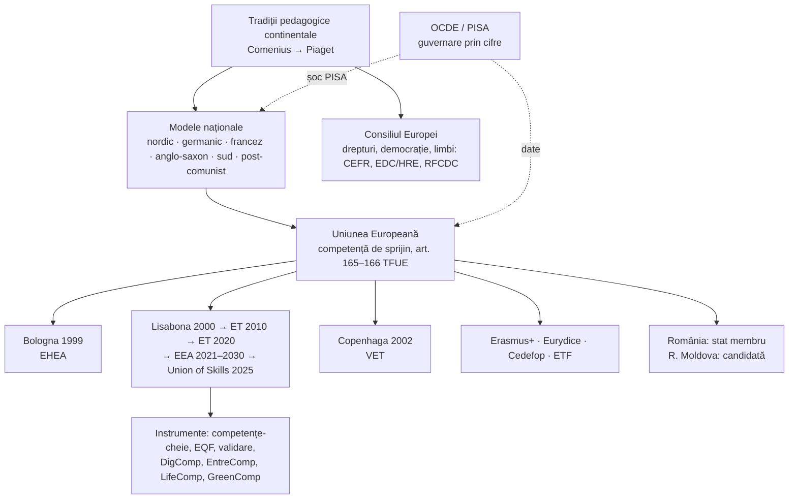
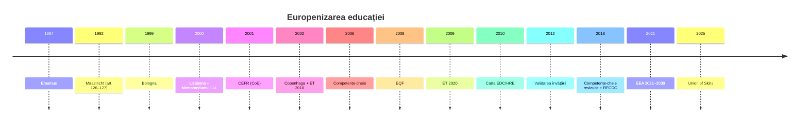
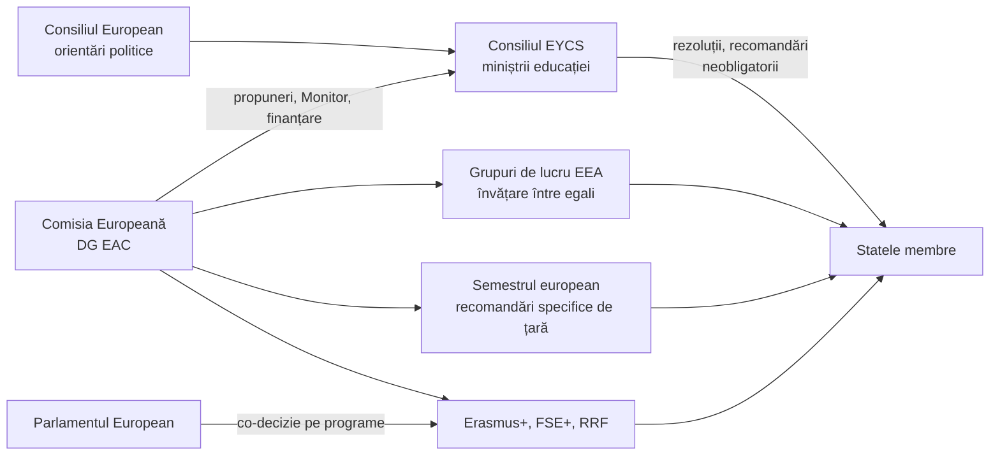

↑ [[00 Index - Analiza comparată internațională]] · [[00 MOC - Fundamentele științelor educației]]

> [!info] Cum se citește nota
> Spre deosebire de celelalte note de țară, aici „țara” este un **spațiu**: (1) **tradițiile pedagogice continentale** din care s-au născut științele educației; (2) **modelele naționale** tipice (nordic, germanic, francez, anglo-saxon, sud-european, post-comunist); (3) **construcția europeană**: UE, care are doar o competență de **sprijin** în educație, și Consiliul Europei, care lucrează pe democrație și drepturile omului. Grila comună e adaptată: secțiunea PISA compară țările europene, iar secțiunea 5 arată cum trec fundamentele din manual prin **nivelul european** și prin **modelele naționale**.
> Datele PISA 2025 provin din raportul OCDE *PISA 2025 Results (Volume I)*, publicat la **8 septembrie 2026**.

> [!abstract] Pe scurt
> 1. **Europa este locul de naștere al pedagogiei ca știință**: Comenius (didactica), Rousseau (copilul ca centru), Pestalozzi și Fröbel (educația elementară și grădinița), Herbart (pedagogia științifică, treptele formale), Humboldt (*Bildung*, universitatea de cercetare), Durkheim (sociologia educației), Claparède și Piaget (psihologia și științele educației la Geneva), Montessori, Decroly, Freinet (educația nouă). Manualul nostru, prin S. Cristea, e un descendent direct al acestei tradiții.
> 2. **Nu există un „sistem european”**. Tratatele dau UE doar o competență de **sprijin**: armonizarea legislației educaționale e exclusă (art. 165–166 TFUE). Europa lucrează prin **metoda deschisă de coordonare** (*open method of coordination*): ținte comune, indicatori, învățare între egali, finanțare (Erasmus+) și „presiunea blândă” a comparației.
> 3. **Trei mari procese** au europenizat educația: **Bologna** (1999, învățământul superior), **Lisabona** și **ET 2010/2020** (școală, învățare pe tot parcursul vieții), **Copenhaga** (formare profesională, 2002). Azi, cadrul este **Spațiul European al Educației** (*European Education Area*, EEA) pentru 2021–2030, completat în 2025 de **Uniunea competențelor** (*Union of Skills*).
> 4. **Instrumentele comune** sunt, în fond, fundamentele manualului puse în politică: **competențele-cheie** (2006, 2018) sunt finalități; **EQF** (2008/2017) este o taxonomie a rezultatelor învățării; **validarea învățării nonformale și informale** (2012) aplică educația permanentă; **DigComp, EntreComp, LifeComp, GreenComp** și cadrul **RFCDC** al Consiliului Europei dau conținut „noilor educații”.
> 5. **Modelele naționale diferă profund**: școala comprehensivă până la 16 ani (nordic), separarea timpurie pe filiere și sistemul dual (germanic), școala centralizată, republicană și laică (francez), piața și responsabilizarea (englez), modelul sud-european și modelul post-comunist, aflat în tranziție.
> 6. **PISA 2025 arată un declin general**: media OCDE a ajuns la **cel mai scăzut nivel** din istoria testului în științe, citire și matematică. În Europa, **Estonia** e singura țară în top 10 mondial la toate trei domeniile. Nordicii (cu excepția Estoniei) și Țările de Jos scad, iar **Polonia, Irlanda, Elveția, Austria și Cehia** rămân peste medie. **România (425/413/419) și Republica Moldova (422/404/410)** au rezultate aproape identice, sub media OCDE, cu circa **39%** dintre elevi sub nivelul 2 la toate cele trei domenii.
> 7. **Echitatea este marea problemă europeană**: în PISA 2025, statutul socio-economic explică **19%** din variația rezultatelor la științe în Germania și **21,7%** în România și Luxemburg, față de **9–10%** în Estonia, Finlanda și Irlanda (media OCDE: 11,6%).
> 8. **Țintele UE pentru 2030 sunt atinse doar parțial**: părăsirea timpurie a școlii a scăzut la **9,4%** (2024; ținta: sub 9%), dar sub-performanța la 15 ani (PISA 2022: **26,2%** la citire, **29,5%** la matematică, **24,2%** la științe) e departe de ținta de sub 15%.
> 9. **Critica academică europeană** e puternică: „guvernarea prin cifre” (*governing by numbers*: Grek, Ozga, Lawn), „învățificarea” (*learnification*: Biesta), apărarea școlii ca bun public (Masschelein și Simons), tradiția *Didaktik* opusă logicii *curriculum*-ului și testării (Hopmann, Uljens, Benner).
> 10. **Pentru R. Moldova** (țară candidată din 2022, cu negocieri deschise în 2024), Europa este atât **sursă de instrumente** (Bologna, EQF, competențe-cheie, validare, RFCDC), cât și **oglindă critică**: țările post-comuniste care au progresat (Estonia, Polonia) au combinat reformele structurale cu investiția în profesori și cu amânarea separării pe filiere.

---

## 0. Harta notei

---

## 1. Profil și date-cheie

| Indicator | Valoare | Sursă |
|---|---|---|
| Populația UE | **452,0 milioane** (estimare, 1 ianuarie 2026) | Eurostat, *Population and population change statistics* |
| Structura politică | UE-27; Consiliul Europei — 46 de state (Rusia exclusă în 2022); Spațiul European al Învățământului Superior (EHEA) — **49 de țări** (reprezentarea Rusiei și Belarusului suspendată la 11 aprilie 2022) | Eurostat; CoE; Bologna Process |
| Cheltuieli publice cu educația | **4,8% din PIB** în UE (circa 860 mld. €, 2024; clasificarea COFOG) | Eurostat, *Government expenditure by function – COFOG* |
| Guvernanța | educația e **competență națională**; UE sprijină, coordonează și completează (art. 6 și 165–166 TFUE); în statele federale (Germania, Belgia, Elveția, Austria, Spania) decid landurile, comunitățile, cantoanele sau regiunile | TFUE |
| Nivelurile | clasificare comună **ISCED 2011** (UNESCO), folosită de Eurostat/Eurydice: ISCED 0 (educație timpurie), 1 (primar), 2 (secundar inferior), 3 (secundar superior), 4 (postliceal), 5–8 (terțiar: scurt, licență, master, doctorat) | UNESCO-UIS; Eurydice |
| Obligativitatea | variază mult: de la **3 ani** (Franța, din 2019; Ungaria) la **6–7 ani** (majoritatea țărilor nordice și central-est europene); durata obligatorie are între aproximativ 9 și 13 ani. Unele țări impun „educație sau formare” până la 18 ani (Belgia, Germania, Portugalia, Țările de Jos — parțial) | Eurydice, *Compulsory education in Europe* (ediții anuale; valorile exacte pe țări — de verificat pe ediția 2025/2026) |
| Separarea pe filiere (*tracking*) | de la **10 ani** (majoritatea landurilor germane, Austria) la **16 ani** (țările nordice, Estonia, Spania, Portugalia) | Eurydice, *The Structure of the European Education Systems* |
| Educație timpurie (3 ani – școală) | **94,6%** participare (2023; ținta 2030: 96%) | *Education and Training Monitor 2025* |
| Absolvire terțiară (25–34 de ani) | **44,1%** (2024; ținta 2030: 45%) | idem |
| Adulți în învățare (ultimele 12 luni) | **39,5%** (2022; ținta 2025: 47%; ținta Pilonului social pentru 2030: 60%) | idem |

> [!note] Comentariu
> În Europa, „sistemul de învățământ” din manual (Modulul 08) există doar la nivel **național**. La nivel european există un **sistem de coordonare**: ținte, indicatori, cadre de referință, rețele și bani. Diferența explică și forța, și slăbiciunea politicii europene: are **legitimitate** și **date**, dar nu are **pârghii juridice** directe asupra școlii.

---

## 2. Tabloul PISA european (2000–2025)

### 2.1 Traiectorii-cheie pe cicluri (citire / matematică / științe)

| Țara | 2000 | 2006 | 2012 | 2018 | 2022 | **2025** |
|---|---|---|---|---|---|---|
| **Media OCDE** | 500 / 500 / 500 (medii de referință) | 492 / 498 / 500 | 496 / 494 / 501 | 487 / 489 / 489 | 476 / 472 / 485 | **461 / 463 / 482** |
| **Finlanda** | 546 / 536 / 538 | 547 / 548 / 563 | 524 / 519 / 545 | 520 / 507 / 522 | 490 / 484 / 511 | **474 / 469 / 504** |
| **Estonia** | — (din 2006) | 501 / 515 / 531 | 516 / 521 / 541 | 523 / 523 / 530 | 511 / 510 / 526 | **499 / 508 / 527** |
| **Polonia** | 479 / 470 / 483 | 508 / 495 / 498 | 518 / 518 / 526 | 512 / 516 / 511 | 489 / 489 / 499 | **482 / 484 / 495** |
| **Germania** | 484 / 490 / 487 | 495 / 504 / 516 | 508 / 514 / 524 | 498 / 500 / 503 | 480 / 475 / 492 | **465 / 464 / 486** |
| **Franța** | 505 / 517 / 500 | (de verificat) | 505 / 495 / 499 | 493 / 495 / 493 | 474 / 474 / 487 | **456 / 458 / 483** |
| **România** | 428 / 426 / 441 (PISA-Plus, testare 2002; de verificat) | 396 / 415 / 418 | 438 / 445 / 439 | 428 / 430 / 426 | 428 / 428 / 428 | **413 / 419 / 425** |
| **Rep. Moldova** | — | — | — (2009+, testare 2010: 388 / 397 / 413) | 424 / 421 / 428 | 411 / 414 / 417 | **404 / 410 / 422** |

*Surse*: OCDE, *PISA 2012 Results: Snapshot* (Vol. I); *PISA 2018 Country Note Moldova*; *PISA 2022 Results (Vol. I)*, Tabelul I.1; *PISA 2025 Results (Vol. I)*, Tabelul I.1; valorile pentru 2000, 2006 și 2018 sunt din rapoartele OCDE ale ciclurilor respective și sunt coerente cu coloanele de schimbare 2018–2022 din raportul din 2022. Scalele au devenit comparabile în timp de la 2000 (citire), 2003 (matematică) și 2006 (științe). Mediile OCDE nu sunt calculate pe același grup de țări în toate ciclurile.

> [!warning] Atenție la interpretare
> - Poziția în clasament depinde de câte țări participă (32 în 2000, 91 în 2025). Mai relevante sunt **scorul** și **schimbarea semnificativă statistic**.
> - Diferențele de 3–5 puncte între țări vecine în clasament sunt adesea **nesemnificative**.
> - Scăderea din 2018–2022 coincide cu pandemia, dar citirea și matematica scădeau deja în multe țări europene după 2012. PISA 2025 arată că **nu a existat recuperare**.

### 2.2 Instantaneu PISA 2025 — țări europene (științe = domeniul principal)

| Țara | Științe | Citire | Matematică | Δ 2022→2025 (Șt / Cit / Mat) | % top (niv. 5–6, cel puțin un domeniu) | % sub nivelul 2 la toate trei |
|---|---|---|---|---|---|---|
| **Media OCDE** | 482 | 461 | 463 | −3 / −14 / −9 | 11,9 | 19,7 |
| Estonia | **527** | 499 | **508** | +1 / −12 / −2 | 18,0 | **7,4** |
| Regatul Unit | 511 | 494 | 488 | +12 / 0 / −1 | 18,2 | 12,0 |
| Finlanda | 504 | 474 | 469 | −7 / −16 / −15 | 14,0 | 15,7 |
| Elveția | 501 | 470 | 499 | −1 / −13 / −9 | 18,1 | 15,0 |
| Irlanda | 500 | **500** | 480 | −4 / −16 / −12 | 12,7 | 11,2 |
| Austria | 497 | 467 | 477 | +6 / −13 / −10 | 12,6 | 16,5 |
| Polonia | 495 | 482 | 484 | −4 / −7 / −5 | 14,4 | 14,0 |
| Cehia | 490 | 468 | 477 | −7 / −20 / −10 | 12,8 | 15,4 |
| Belgia | 490 | 466 | 480 | −1 / −13 / −10 | 13,4 | 18,1 |
| Lituania | 488 | 464 | 470 | +3 / −8 / −5 | 8,7 | 15,2 |
| Germania | 486 | 465 | 464 | −7 / −15 / −11 | 14,0 | 20,7 |
| Țările de Jos* | 485 | **441** | 483 | −3 / −18 / −9 | 15,7 | 21,3 |
| Suedia | 485 | 466 | 464 | −8 / −21 / −18 | 14,1 | 19,4 |
| Slovenia | 484 | 445 | 460 | −16 / −24 / −25 | 10,1 | 18,8 |
| Franța | 483 | 456 | 458 | −4 / −18 / −16 | 9,8 | 21,3 |
| Italia | 483 | 474 | 468 | +6 / −7 / −3 | 10,1 | 15,8 |
| Portugalia | 482 | 462 | 460 | −3 / −15 / −12 | 9,0 | 18,6 |
| Ungaria | 480 | 452 | 459 | −6 / −21 / −13 | 7,6 | 19,7 |
| Danemarca | 478 | 460 | 471 | −16 / −29 / −19 | 8,9 | 16,0 |
| Spania | 477 | 451 | 457 | −7 / −23 / −16 | 7,0 | 18,4 |
| Croația | 476 | 453 | 455 | −6 / −22 / −8 | 7,8 | 20,3 |
| Slovacia | 475 | 448 | 469 | +13 / +1 / +5 | 11,0 | 21,1 |
| Norvegia* | 470 | 453 | 452 | −8 / −24 / −17 | 9,7 | 22,0 |
| Letonia | 468 | 430 | 460 | −25 / **−45** / −23 | 6,7 | 21,6 |
| Malta | 453 | 415 | 439 | −13 / −31 / −27 | 8,3 | 29,4 |
| Islanda | 441 | 422 | 450 | −6 / −14 / −9 | 5,9 | 27,6 |
| Grecia | 434 | 423 | 424 | −7 / −16 / −6 | 3,3 | 31,4 |
| Serbia | 429 | 415 | 417 | −18 / −26 / −23 | 3,4 | 34,1 |
| **România** | **425** | **413** | **419** | −3 / −16 / −9 | 4,8 | **38,5** |
| **Rep. Moldova** | **422** | **404** | **410** | +5 / −7 / −4 | 1,5 | **39,0** |
| Bulgaria | 421 | 387 | 405 | 0 / −18 / −12 | 4,1 | 41,9 |
| Cipru | 411 | 379 | 412 | 0 / −2 / −7 | 4,6 | 43,5 |

*Sursă*: OCDE, *PISA 2025 Results (Volume I)*, Tabelul I.1 (țările sunt ordonate după științe). * = standardele de eșantionare nu au fost îndeplinite integral. Schimbările nu sunt toate semnificative statistic (în raport sunt marcate cu bold). Luxemburg: 474/443/458; Spania și Luxemburg nu intră în media OCDE a schimbărilor pe termen scurt.

### 2.3 Grupuri de performanță (interpretare pe baza tabelului)

| Grup | Țări | Profil |
|---|---|---|
| **A. Performanță înaltă și echitate** | Estonia; parțial Irlanda, Finlanda | scoruri peste medie, pondere mică a elevilor slabi, gradient socio-economic sub medie. OCDE numește **Estonia și Irlanda** printre sistemele care combină echitatea cu performanța înaltă |
| **B. Peste medie, în scădere lentă** | Elveția, Polonia, Austria, Cehia, Belgia, Regatul Unit | rezistență relativă; Regatul Unit (Anglia) crește la științe |
| **C. În jurul mediei, în declin** | Germania, Franța, Italia, Spania, Portugalia, Suedia, Danemarca, Țările de Jos, Slovenia, Ungaria | scăderi mari la citire (−15 până la −29 de puncte); Țările de Jos au o problemă acută la citire (441) |
| **D. Declin sever** | Letonia, Norvegia, Islanda, Malta | Letonia: −45 de puncte la citire într-un singur ciclu |
| **E. Sub medie, cu vulnerabilitate structurală** | România, R. Moldova, Bulgaria, Grecia, Cipru, Serbia, Balcanii de Vest | 30–45% dintre elevi sub nivelul 2 la toate domeniile; foarte puțini performeri de top |

> [!note] Moment istoric: „șocul PISA” german (2001)
> În PISA 2000, Germania a obținut **484** la citire, **490** la matematică și **487** la științe, sub media OCDE. În plus, avea unul dintre cele mai puternice efecte ale originii sociale asupra rezultatelor. Pentru o țară care se considera patria *Bildung*-ului, rezultatul a produs un **șoc public**. Reacția: Conferința Miniștrilor Culturii (KMK) a adoptat în decembrie 2001 **șapte câmpuri de acțiune** (limbă în educația timpurie, sprijin pentru elevii dezavantajați și imigranți, standarde, școală cu program prelungit etc.). Au urmat **standardele educaționale naționale** (*Bildungsstandards*, 2003–2004), **Institutul pentru Dezvoltarea Calității în Educație** (IQB, 2004), testele comparative VERA și programul federal pentru **școli cu program prelungit** (*Ganztagsschulen*, IZBB 2003–2009, circa 4 miliarde €). Până în 2012, Germania a urcat la 508/514/524. După 2012 a urmat un declin puternic, iar în PISA 2025 gradientul social rămâne **19%**, printre cele mai mari din Europa.
> *Interpretare*: șocul PISA a mutat Germania de la tradiția *Didaktik*/*Bildung* (orientată spre conținut și spre autonomia profesorului) spre **orientarea după rezultate** (*Outputsteuerung*), cu standarde și testări. E exemplul clasic de guvernare prin cifre (vezi §6.14).

### 2.4 Echitate (PISA 2025, științe)

| Țara | % din variația scorului explicată de statutul socio-economic (ESCS) | Diferența avantajați–dezavantajați (puncte) | Diferența nativi–imigranți (puncte) |
|---|---|---|---|
| Media OCDE | 11,6 | 85 | −43 |
| Letonia | 5,5 | 58 | −75 |
| Lituania | 7,9 | 63 | −31 |
| Norvegia* | 8,2 | 77 | −44 |
| Regatul Unit | 8,5 | 80 | 0 |
| Finlanda | 9,0 | 78 | **−88** |
| Spania | 9,2 | 71 | −43 |
| Estonia | 9,6 | 68 | −47 |
| Irlanda | 9,6 | 72 | −7 |
| Polonia | 11,3 | 82 | −55 |
| Italia | 11,3 | 80 | −46 |
| Suedia | 12,0 | 92 | −69 |
| **Rep. Moldova** | 13,4 | 84 | −32 |
| Franța | 13,5 | 100 | −57 |
| Elveția | 13,6 | 99 | −54 |
| Țările de Jos* | 13,9 | 105 | −63 |
| Austria | 14,0 | 98 | −67 |
| Cehia | 15,0 | 96 | −58 |
| Ungaria | 17,9 | 103 | −10 |
| **Germania** | **19,0** | **125** | **−83** |
| Slovacia | 20,7 | 114 | −40 |
| Luxemburg | 21,7 | 130 | −21 |
| **România** | **21,7** | **122** | −61 |

*Sursă*: OCDE, *PISA 2025 Results (Volume I)*, Tabelul I.2.

> [!tip] Lecție: separarea timpurie și inechitatea
> Țările cu **separare timpurie pe filiere** (Germania, Austria, Slovacia, Ungaria, Luxemburg) și cele cu **segregare școlară** puternică (România) au cele mai abrupte gradiente sociale. Țările cu **trunchi comun lung** (Estonia, Finlanda, Letonia, Lituania) au gradiente mai mici. Asocierea e consistentă și are sprijin cvasi-experimental (Hanushek și Wößmann, 2006: diferențe-în-diferențe între ciclul primar și PISA), dar rămâne influențată de alți factori, cum ar fi imigrația, sărăcia regională sau limba de acasă.

### 2.5 Alte date: bunăstare, gen, digital, adulți

- **Genul (PISA 2025)**: la citire, fetele depășesc băieții cu 30 de puncte în medie OCDE; decalajul e foarte mare în Finlanda (−46), Slovenia (−52), Bulgaria (−49), Croația și Malta (−47), R. Moldova (−38). La matematică, băieții conduc cu 13 puncte în medie OCDE.
- **Implicare și bunăstare (PISA 2025)**: sentimentul de apartenență la școală s-a îmbunătățit față de 2022 în 39 de sisteme. În schimb, proporția elevilor care nu găsesc învățarea plictisitoare a scăzut în 60 de sisteme. **Sprijinul familiei** raportat de elevi a scăzut aproape peste tot. Distragerea cu dispozitive digitale e mai mică în școlile cu **reguli clare privind telefonul** (OCDE, 2026). Mai multe guverne europene au legat explicit rezultatele de consumul de rețele sociale (Euronews, 9 septembrie 2026).
- **Competențe digitale (ICILS 2023)**: **42,5%** dintre elevii de clasa a VIII-a din țările UE participante sunt sub pragul minim, față de ținta UE de sub 15% (*Education and Training Monitor 2025*).
- **Adulți (PIAAC, ciclul 2, 2023)**: în UE, circa **21,8%** dintre adulți sunt sub nivelul de bază **atât** la literație, **cât și** la numerație (*ET Monitor 2025*). Finlanda, Suedia, Norvegia și Țările de Jos sunt în frunte, dar competențele au stagnat sau au scăzut în multe țări.
- **PIRLS 2021 (citire, clasa a IV-a)**: Irlanda (577) e cea mai bună țară europeană, după Singapore (587). Pozițiile celorlalte țări europene nu sunt redate aici (de verificat în raportul IEA).

> [!warning] PISA 2025 — ce a fost publicat
> Au fost publicate **Volumul I** (performanță, implicare, echitate, digital/IA, familii, mediu) și tabelele de bază. **Volumele următoare** (inclusiv învățarea autoreglată și engleza ca limbă străină) sunt anunțate pentru **2027**. Comisia Europeană nu a actualizat încă indicatorul de sub-performanță al UE cu datele 2025; *Education and Training Monitor 2025* (noiembrie 2025) folosește PISA 2022.

---

## 3. Cronologia: de la tradițiile pedagogice la Spațiul European al Educației

### 3.1 Tradiții și modele naționale (sec. XVII–XX)

| An | Eveniment | Idee | Legătura cu fundamentele |
|---|---|---|---|
| 1657 | Comenius, *Opera didactica omnia* (inclusiv *Didactica Magna*, redactată în anii 1630) | „a-i învăța pe toți toate”; clasa-lecție, manualul, principiul intuiției | naşterea didacticii (M01, M10) |
| 1762 | Rousseau, *Emil* | educația naturală, copilul ca centru | paradigma pedocentristă (M02) |
| 1805–1825 | Pestalozzi, institutul de la Yverdon | educație elementară: cap, inimă, mână | educația integrală (M06) |
| 1806 | Herbart, *Allgemeine Pädagogik* | pedagogia ca știință (etică + psihologie), instrucția educativă | statutul pedagogiei (M01) |
| 1809–1810 | Humboldt: reforma prusacă, Universitatea din Berlin | *Bildung*, unitatea cercetare–predare, liceul umanist | idealul educațional (M04) |
| 1840 | Fröbel, primul *Kindergarten* (Bad Blankenburg) | joc, „daruri”, educația timpurie | educația preșcolară (M08) |
| 1881–1882 | Legile Jules Ferry (Franța) | școală primară gratuită, obligatorie și laică | sistemul național de stat (M08) |
| 1907 | Montessori, *Casa dei Bambini* (Roma); Decroly, *École de l'Ermitage* (Bruxelles) | mediu pregătit, autoeducație; centre de interes | educația nouă (M02) |
| 1912 | Claparède (cu Bovet), **Institutul J.-J. Rousseau** (Geneva) | primul institut european dedicat științelor educației | științele educației (M01, M05) |
| 1919 | Steiner, prima școală Waldorf (Stuttgart) | educație artistică, ritmuri de dezvoltare | alternative educaționale (M08) |
| 1921 | *New Education Fellowship* (Calais) | rețeaua internațională a educației noi | progresivism |
| 1922–1925 | Durkheim, *Éducation et sociologie* (postum, 1922); *L'éducation morale* (1925) | educația ca socializare metodică a tinerei generații | funcția socială a educației (M02) |
| 1925 | Biroul Internațional al Educației (BIE), Geneva; Piaget director 1929–1968 | educație comparată, cooperare internațională | cercetare comparată (M05) |
| 1920–1930 | Freinet: tipografia școlară, corespondența școlară | pedagogie cooperativă, munca | educația prin activitate |
| 1918–1958 | Școala sovietică: școala unică a muncii (1918), Makarenko (colectivul), reforma „politehnică” a lui Hrușciov (1958) | educația comunistă, legătura școlii cu munca | influență în Est, inclusiv în RSSM (M02, M06) |
| 1944 | *Education Act* (Anglia) | învățământ secundar gratuit; sistem tripartit | selecție la 11 ani |
| 1962–1977 | Școlile comprehensive nordice: *grundskola* (Suedia, 1962), *peruskoulu* (Finlanda, 1972–1977) | trunchi comun de 9 ani | echitate (M08) |
| 1975 | Reforma Haby — *collège unique* (Franța) | gimnaziu unic pentru toți | democratizare |
| 1977 | Legea 517/1977 (Italia) | desființarea claselor speciale; integrarea elevilor cu dizabilități | educația incluzivă |
| 1990–1999 | Tranziția post-comunistă: legi noi (România 1995; R. Moldova 1995; Estonia 1992); Polonia — reforma *gimnazjum* (1999) | depolitizare, descentralizare, curriculum nou | reforma curriculară (M10) |

### 3.2 Construcția europeană (1957–2026)

| An | Reformă / act / program | Idee | Legătura cu fundamentele |
|---|---|---|---|
| 1954 | Convenția culturală europeană (Consiliul Europei) | cooperare culturală și lingvistică | educația interculturală |
| 1957 | Tratatul de la Roma (art. 128 CEE) | doar formare profesională comună | educație = competență națională |
| 1973 | Raportul Janne (*For a Community policy on education*) | prima viziune comunitară asupra educației | — |
| 1975 | **Cedefop** (Berlin; din 1995 la Salonic) | cercetare și politici privind formarea profesională | educația profesională |
| 1976 | Primul program de acțiune în educație (rezoluția din 9 februarie) | cooperare, copiii migranților, limbi | — |
| 1980 | Rețeaua **Eurydice** | informații comparative despre sisteme | educație comparată (M05) |
| 1985 | Hotărârea *Gravier* (CJUE, cauza 293/83) | studiile universitare pot intra sub „formare profesională” | baza juridică pentru mobilitate |
| 1987 | **Erasmus** | mobilitatea studenților | educația interculturală, autoformarea |
| 1989 | ECTS (pilot) | credite transferabile | proiectare curriculară |
| 1990 | **Fundația Europeană de Formare** (ETF, Torino; activă de la mijlocul anilor '90) | sprijin pentru țările vecine (inclusiv R. Moldova) | — |
| 1992/1993 | **Tratatul de la Maastricht**: art. 126 (educație) și 127 (formare profesională); azi art. 165–166 TFUE | „dimensiunea europeană” a educației; armonizarea este exclusă | competență de sprijin |
| 1995–1996 | Cartea albă Cresson, *A preda și a învăța: spre societatea cognitivă*; Anul european al învățării pe tot parcursul vieții (1996) | societatea învățării | educația permanentă (M03) |
| 1997 | Convenția de la Lisabona privind recunoașterea calificărilor (CoE/UNESCO) | recunoaștere reciprocă | — |
| 1998–1999 | Declarația de la Sorbona (1998); **Declarația de la Bologna** (19 iunie 1999, 29 de țări) | spațiu comun al învățământului superior: trei cicluri, ECTS, calitate | sistemul de învățământ superior (M08) |
| 2000 | **Strategia de la Lisabona** (martie); metoda deschisă de coordonare; **Memorandumul privind învățarea permanentă** (octombrie) | economia bazată pe cunoaștere; șase mesaje-cheie LLL | educația permanentă și formele educației (M03) |
| 2001 | **Cadrul european comun de referință pentru limbi** (CEFR, CoE) | nivelurile A1–C2, descriptori „poate să...” | taxonomie a competențelor (M04) |
| 2002 | Programul **ET 2010**; **Declarația de la Copenhaga** (30 noiembrie, VET) | obiective comune; calitate și transparență în VET | — |
| 2003 | Cinci repere pentru 2010 (Consiliul, mai 2003) | părăsirea timpurie ≤ 10%; −20% elevi slabi la citire etc. | finalități operaționalizate |
| 2005 | ESG (standarde de asigurare a calității, Bergen); R. Moldova aderă la Bologna | — | evaluare instituțională |
| 2006 | **Recomandarea privind competențele-cheie** (8 competențe) | finalități transversale pentru învățarea permanentă | finalități (M04) |
| 2008 | **EQF** — Cadrul european al calificărilor (8 niveluri, rezultate ale învățării) | taxonomia calificărilor | taxonomii (M04) |
| 2009 | **ET 2020** (concluziile Consiliului din 12 mai) | 4 obiective strategice + 5 repere (timpuriu 95%, elevi slabi < 15%, părăsire < 10%, terțiar 40%, adulți 15%) | — |
| 2010 | **Carta CoE privind educația pentru cetățenie democratică și drepturile omului** (CM/Rec(2010)7); lansarea EHEA (Budapesta–Viena) | cetățenie democratică | noile educații (M07) |
| 2012 | **Recomandarea privind validarea învățării nonformale și informale** (20 decembrie) | recunoașterea învățării din afara școlii | forme ale educației (M03) |
| 2013 | **DigComp** (JRC); Erasmus+ (2014–2020, circa 14,7 mld. €) | competența digitală | educația tehnologică (M06) |
| 2015 | Declarația de la Paris (după atentate) | cetățenie, toleranță, gândire critică | noile educații (M07) |
| 2016 | **EntreComp**; *Upskilling Pathways*; modelul CoE al competențelor pentru cultura democratică | antreprenoriat; adulți cu competențe reduse | — |
| 2017 | **Pilonul european al drepturilor sociale** (principiul 1: dreptul la educație); summitul de la Göteborg lansează ideea EEA; **DigCompEdu**; revizuirea EQF | educația ca drept social | — |
| 2018 | **Competențele-cheie revizuite** (22 mai); recomandarea privind valorile comune și educația incluzivă; **RFCDC** (CoE) | cele 8 competențe actualizate; 20 de competențe democratice | finalități; noile educații |
| 2019 | Recomandarea privind educația timpurie de calitate; primele **Universități Europene** | ECEC; alianțe universitare | — |
| 2020 | Comunicarea privind **EEA până în 2025** (30 septembrie); Planul de acțiune pentru educația digitală 2021–2027; **LifeComp**; Declarația de la Osnabrück (VET) | șase dimensiuni EEA | — |
| 2021 | **Rezoluția Consiliului privind cadrul strategic EEA 2021–2030** (februarie); Erasmus+ 2021–2027 (circa 26,2 mld. €); Garanția europeană pentru copii | 5 priorități, 7 ținte | — |
| 2022 | **GreenComp**; recomandări privind micro-certificatele, conturile individuale de învățare, învățarea pentru tranziția verde, *Pathways to School Success*; R. Moldova primește statutul de **țară candidată** (23 iunie) | — | educația ecologică (M07) |
| 2024 | Deschiderea negocierilor de aderare cu R. Moldova (25 iunie); recomandarea *Europe on the Move* (mobilitate) | — | — |
| 2025 | **Uniunea competențelor** (*Union of Skills*, martie): Planul de acțiune privind competențele de bază, Planul strategic pentru educația STEM | competențe de bază, STEM, recalificare | — |
| 2026 | **PISA 2025** (8 septembrie): minime istorice ale mediei OCDE | — | evaluare (M10) |

---

## 4. Modelele europene de sisteme (tipologie)

> [!info] Tipologii folosite în cercetare
> - **Nathalie Mons** (*Les nouvelles politiques éducatives*, 2007) distinge patru modele de școlarizare obligatorie: **separare** (germanic), **integrare uniformă** (Franța, Europa de Sud), **integrare „à la carte”** (anglo-saxon), **integrare individualizată** (nordic).
> - **West și Nikolai** (*Journal of Social Policy*, 2013) corelează regimurile educaționale cu regimurile statului bunăstării (Esping-Andersen).
> - Categoria **post-comunistă** e o categorie istorică, nu una structurală: țările din Est au luat după 1990 modele foarte diferite (Estonia se apropie de modelul nordic, Ungaria și Slovacia de cel germanic).

| Model | Țări tipice | Structură | Guvernanță | Profesori | Forțe | Slăbiciuni (cercetare) |
|---|---|---|---|---|---|---|
| **Nordic comprehensiv** | Finlanda, Suedia, Norvegia, Danemarca; Estonia (hibrid) | școală unică 7–16 ani, fără repetenție, sprijin timpuriu | descentralizare spre municipalități, încredere, puțină inspecție | masterat, statut înalt (Finlanda) | echitate, bunăstare | declin PISA după 2012; Suedia — piața școlilor libere (1992) și inflația notelor |
| **Germanic (separare)** | Germania, Austria, Elveția, Țările de Jos (parțial), Luxemburg | filiere de la 10–12 ani (*Gymnasium* / *Realschule* / *Hauptschule* sau școli integrate); **sistem dual VET** | federalism (landuri, cantoane) | pregătire în două etape (universitate + *Referendariat*), funcționari publici | tranziție școală–muncă foarte bună, șomaj redus în rândul tinerilor | gradient social foarte mare; decalaj pentru imigranți |
| **Francez (republican, centralizat)** | Franța; influență în Belgia francofonă, Luxemburg, România | *collège unique* 11–15 ani, orientare la 15 ani, bacalaureat | minister și academii, programe naționale, inspecție pedagogică | concursuri (CAPES, agrégation), carieră națională | egalitate formală, laicitate | repetenție istoric mare, inegalități sociale mari, stres |
| **Anglo-saxon (piață și responsabilizare)** | Anglia; parțial Irlanda (dar cu specific propriu) | comprehensiv, dar cu diversitate de tipuri de școli (*academies*) | autonomie mare a școlii, Ofsted (1992), clasamente, examene externe | rute diverse de formare | inovație, date, predare explicită (în creștere) | presiunea testelor, dezbaterea asupra îngustării curriculumului |
| **Sud-european** | Italia, Spania, Portugalia, Grecia | școală unică până la 14–16 ani | centralizare, cu regionalizare (Spania) | concursuri, precaritate | incluziune (Italia), expansiune rapidă | părăsire timpurie istoric mare (Spania, Portugalia au redus-o masiv), repetenție |
| **Post-comunist** | Polonia, Estonia, Cehia, Ungaria, România, Bulgaria; R. Moldova, Ucraina (non-UE) | moștenire sovietică sau central-europeană; reforme după 1990 | descentralizare formală, finanțare per elev | feminizare, salarii mici, îmbătrânire | tradiție matematică, alfabetizare universală | inechitate teritorială (urban–rural), meditații, instabilitate legislativă |

---

## 5. Implementarea fundamentelor la nivel european și prin modelele naționale

### 5.1 Statutul științelor educației, cercetarea și politica bazată pe dovezi
→ [[Modulul 01 - Statutul științelor educației]] · [[Modulul 05 - Paradigmele pedagogiei și cercetarea pedagogică]]

**Două tradiții epistemologice europene** au modelat felul în care e înțeleasă „știința educației”:

| Tradiție | Nume | Origine | Caracteristici | Urme azi |
|---|---|---|---|---|
| **Germanică** | *Pädagogik* / *Erziehungswissenschaft* | Herbart (1806) → pedagogia spiritual-științifică (*geisteswissenschaftliche Pädagogik*: Dilthey, Nohl, Spranger) → Klafki, Benner | o **disciplină unitară**, cu teorie proprie a *Bildung*-ului; hermeneutică și normativă | *Allgemeine Didaktik*, *Fachdidaktik*; Europa nordică și centrală |
| **Francofonă** | *sciences de l'éducation* (la plural) | Durkheim (sociologia educației), Claparède (Geneva 1912), Piaget; licențele în științele educației din Franța (1967) | un **ansamblu de discipline** (psihologie, sociologie, istorie, filosofie a educației) | și modelul românesc (Cristea, Cucoș), și cel moldovenesc; manualul nostru pornește de aici |
| **Anglo-saxonă** | *educational research* / *education studies* | Dewey, psihologia experimentală, cercetarea în științe sociale | empirică, orientată spre politici publice | educația bazată pe dovezi, studii randomizate, meta-analize |

**Infrastructura europeană a cunoașterii**:
- **Eurydice** (din 1980; azi coordonată de Agenția Executivă EACEA): descrieri ale sistemelor naționale și rapoarte comparative (structură, obligativitate, salarii ale profesorilor, evaluare).
- **Cedefop** (1975) pentru VET și competențe; **ETF** (Torino) pentru țările vecine, inclusiv R. Moldova.
- **JRC** (Centrul Comun de Cercetare) a elaborat cadrele de competențe DigComp, EntreComp, LifeComp, GreenComp.
- **NESET** și **EENEE** (rețele de experți), **Eurostat** (indicatori), *Education and Training Monitor* (anual, din 2012).
- Cercetarea europeană: programele-cadru (Horizon 2020, Horizon Europe), **EERA** (*European Educational Research Association*, 1994), conferința anuală **ECER**.
- **OCDE**, cu sediul la Paris, e de facto al doilea pilon al datelor europene: PISA, TALIS, PIAAC, *Education at a Glance*. **Andreas Schleicher** (german; conduce PISA de la început și e director pentru educație și competențe al OCDE) a devenit una dintre cele mai influente voci în politicile educaționale europene (*World Class*, 2018).

> [!note] Comentariu
> Europa practică o **politică bazată pe dovezi „slabă”**: date comparative abundente, dar puține studii experimentale (cu excepția Angliei, unde funcționează *Education Endowment Foundation*, și a unor studii din țările nordice pe registre administrative). Critica europeană a acestui model (§6.14) e la fel de influentă ca modelul însuși.

### 5.2 Paradigme pedagogice dominante: clasic–modern–postmodern
→ [[Modulul 02 - Clasic, modern și postmodern în educație]]

- **Clasic (magistrocentrism, sec. XVII–XIX)**: Comenius (clasa-lecție, manualul), Herbart și **herbartianismul** (Ziller, Rein — „treptele formale”: pregătire, prezentare, asociere, generalizare, aplicare). La sfârșitul sec. XIX, herbartianismul a devenit „pedagogia oficială” a școlilor normale din Germania, Austro-Ungaria, România, Rusia și SUA. Structura „lecției-tip” din tradiția est-europeană (inclusiv manualele sovietice și moldovenești) îi datorează mult.
- **Modern (pedocentrism, educația nouă, 1890–1960)**: Rousseau → Pestalozzi → Fröbel → Ellen Key (*Secolul copilului*, 1900), Kerschensteiner (*Arbeitsschule*), Montessori, Decroly, Claparède (*educația funcțională*), Ferrière, Freinet, Petersen (Jena-Plan), Steiner. Instituționalizare: *New Education Fellowship* (1921), BIE (1925).
- **Paradigma sovietică** (în Est): pedagogie normativă, colectivistă, cu accent pe cunoștințe sistematice. A avut însă și nuclee originale: Vygotsky (cultural-istoric), Davydov și Elkonin (instruirea dezvoltativă), Zankov, Suhomlinski (pedagogia umanistă).
- **Postmodern / curricular (după 1990)**: competențe, curriculum centrat pe elev, evaluare formativă, diferențiere, incluziune, digital. În Est, trecerea s-a produs prin **reforme curriculare finanțate internațional** (Banca Mondială, Soros, UE). În România: Curriculumul Național 1998; în R. Moldova: curriculum din 1997–2000, modernizat în 2010 și centrat pe competențe în 2018–2019.

| Model | Paradigma dominantă azi |
|---|---|
| Nordic | *Didaktik* nordic + constructivism + „școala pentru toți”; revenire recentă la cunoaștere și standarde (Suedia) |
| Germanic | *Bildung*/*Didaktik* + orientare după rezultate (după 2001) + competențe |
| Francez | tradiție republicană a transmiterii culturii (*instruction publique*) + pedagogii active (Meirieu) + recent, știința cognitivă (Consiliul Științific al Educației Naționale, 2018) |
| Anglia | revenire la curriculum „bogat în cunoștințe” (*knowledge-rich*) și știința cognitivă, după 2010 |
| Est | amestec: formalism tradițional și discurs al competențelor și al centrării pe elev |

### 5.3 Formele educației, învățarea pe tot parcursul vieții și autoeducația
→ [[Modulul 03 - Formele generale ale educației]] · [[3.6 Educația permanentă și autoeducația]] · [[Autoeducația - teorii, autori și corelări]]

Europa este spațiul în care **triada formal–nonformal–informal** a trecut din teorie (Coombs, UNESCO, anii '60–'70) în **drept și politică publică**:

1. **Memorandumul privind învățarea pe tot parcursul vieții** (Comisia, octombrie 2000) — șase mesaje-cheie: competențe de bază noi pentru toți, investiții mai mari în resursele umane, inovare în predare și învățare, valorizarea învățării, reconsiderarea orientării și consilierii, învățarea mai aproape de casă. Memorandumul definește explicit învățarea **formală**, **nonformală** și **informală**, exact ca în Modulul 03.
2. **Rezoluția Consiliului privind învățarea pe tot parcursul vieții** (2002): LLL „de la leagăn la mormânt” și în toate contextele.
3. **EQF** (2008, revizuit 2017): opt niveluri descrise prin **rezultate ale învățării** (cunoștințe, abilități, responsabilitate și autonomie), nu prin durata studiilor. Consecința: o calificare poate fi obținută **și pe căi nonformale**.
4. **Recomandarea privind validarea** (20 decembrie 2012): statele trebuie să aibă mecanisme de validare prin patru etape (identificare, documentare, evaluare, certificare). Legătura cu Europass și cu inventarul european al validării (Cedefop).
5. **Instrumente pentru adulți**: *Upskilling Pathways* (2016), conturile individuale de învățare și micro-certificatele (2022), platforma **EPALE** (2015).
6. **Tineret și nonformal**: programul *Youth in Action*, capitolul Tineret din Erasmus+, *Youthpass*, Corpul European de Solidaritate. Consiliul Europei a dezvoltat, prin centrele europene de tineret (Strasbourg, Budapesta), o **pedagogie a educației nonformale** proprie (manualul *Compass* pentru educația pentru drepturile omului).

**Tradiții naționale ale educației adulților**: **școlile superioare populare** (*folkehøjskole*) ale lui N.F.S. Grundtvig (Danemarca, prima la Rødding, 1844); **Volkshochschulen** (Germania); *studieförbund* și cercurile de studiu (Suedia); universitățile populare (Franța, Italia); în România, **Universitatea Populară „Nicolae Iorga” de la Vălenii de Munte** (1908) și mișcarea extensiunii culturale.

**Autoeducația** în politica europeană apare sub trei denumiri:
- **„a învăța să înveți”** (*learning to learn*), competență-cheie în 2006, integrată în 2018 în competența **„personală, socială și de a învăța să înveți”**;
- **LifeComp** (JRC, 2020), cu domeniul *Learning to learn* (mentalitate de creștere, gândire critică, gestionarea învățării);
- **învățarea autoreglată**, evaluată în PISA 2025 (rezultate anunțate pentru 2027).

În tradiția germanică, *Selbstbildung* (Humboldt, Klafki) rămâne fundamentul teoretic al acestor idei.

> [!warning] Critică
> - **Biesta** (*Beyond Learning*, 2006; *Good Education in an Age of Measurement*, 2010) numește **„învățificare”** (*learnification*) înlocuirea limbajului educației (scopuri, relații, valori) cu limbajul neutru al „învățării”. Se pierde întrebarea „**pentru ce** educăm?”.
> - **Simons și Masschelein** (2008, *Educational Theory*) arată cum LLL transformă cetățeanul într-un „antreprenor al propriei învățări”, responsabil individual de angajabilitatea sa. Autoeducația devine o **obligație** (vezi și rândul 14 din matricea notei [[Autoeducația - teorii, autori și corelări]]).
> - **Dovezi**: participarea adulților la învățare e puternic stratificată. Cei cu studii superioare învață de câteva ori mai des decât cei cu studii reduse (efectul Matei). Ținta de 47% pentru 2025 nu a fost atinsă (39,5% în 2022).

### 5.4 Finalități: idealul educațional, scopuri, cadre de competențe
→ [[Modulul 04 - Finalitățile educației]]

**Nivelul european nu formulează un „ideal educațional”** (asta rămâne în constituții și legi naționale), dar stabilește **finalități transversale**:

| Nivelul finalității (M04) | Echivalent european |
|---|---|
| Ideal | valorile din art. 2 TUE (demnitate, libertate, democrație, egalitate, stat de drept, drepturile omului); Carta EDC/HRE; Pilonul drepturilor sociale (principiul 1) |
| Scopuri generale | cele **5 priorități strategice EEA 2021–2030**: (1) calitate, echitate, incluziune și succes pentru toți; (2) LLL și mobilitate pentru toți; (3) competențe și motivație în profesia didactică; (4) consolidarea învățământului superior european; (5) tranzițiile verde și digitală |
| Obiective / standarde | **competențele-cheie** (2018) și cadrele de competențe JRC; nivelurile EQF și CEFR |
| Ținte măsurabile | cele **7 ținte EU-level** pentru 2025/2030 (tabelul de mai jos) |

**Cele 8 competențe-cheie (Recomandarea Consiliului din 22 mai 2018)**:
1. competența de literație;
2. competența multilingvă;
3. competența matematică și competența în științe, tehnologie și inginerie;
4. competența digitală;
5. competența personală, socială și de a învăța să înveți;
6. competența civică;
7. competența antreprenorială;
8. competența de sensibilizare și exprimare culturală.

Versiunea din 2006 avea: comunicare în limba maternă, comunicare în limbi străine, competențe matematice și competențe de bază în științe și tehnologie, competența digitală, a învăța să înveți, competențe sociale și civice, spirit de inițiativă și antreprenoriat, sensibilizare și exprimare culturală.

**Țintele EU-level ale cadrului EEA 2021–2030 și situația recentă**:

| Țintă | Valoare | Ultima valoare UE | Sursă |
|---|---|---|---|
| Elevi de 15 ani cu rezultate slabe (citire, matematică, științe) | < 15% (2030) | 26,2% / 29,5% / 24,2% (PISA 2022) | ET Monitor 2025 |
| Elevi de clasa a VIII-a cu competențe digitale slabe (ICILS) | < 15% (2030) | 42,5% (ICILS 2023) | idem |
| Participare la educația timpurie (3 ani – școală) | ≥ 96% (2030) | 94,6% (2023) | idem |
| Părăsirea timpurie a educației și formării (18–24 de ani) | < 9% (2030) | **9,4%** (2024; 16,9% în 2002) | idem |
| Absolvire terțiară (25–34 de ani) | ≥ 45% (2030) | 44,1% (2024) | idem |
| Absolvenți VET cu învățare la locul de muncă | ≥ 60% (2025) | 65,2% | idem |
| Adulți (25–64 de ani) în învățare în ultimele 12 luni | ≥ 47% (2025) | 39,5% (2022) | idem |

> [!note] Comentariu — continuitatea țintelor
> În ET 2020, ținta de sub 15% elevi slabi exista deja din 2009. În PISA 2018, UE avea circa 22–23% elevi slabi în fiecare domeniu; în 2022, 24–30%; iar PISA 2025 indică o nouă scădere în majoritatea statelor membre. E **cea mai persistentă țintă ratată** a politicii educaționale europene. În schimb, ținta privind părăsirea timpurie a școlii e un **succes relativ**: de la 16,9% în 2002 la 9,4% în 2024.

**Finalități naționale — exemple**:
- **Germania**: *Bildung* ca autodeterminare, codeterminare și solidaritate (Klafki); standarde de competențe (2003–2004); Constituția landurilor.
- **Franța**: *socle commun de connaissances, de compétences et de culture* (2005; revizuit 2015), cu cinci domenii; valorile Republicii (*laïcité*, Carta laicității afișată în școli din 2013).
- **Finlanda**: curriculum național de bază (2014) cu **șapte competențe transversale** (*laaja-alainen osaaminen*).
- **România**: Legea 198/2023 a învățământului preuniversitar păstrează idealul formulat în Legea 1/2011 (dezvoltarea liberă, integrală și armonioasă a individualității, formarea personalității autonome, asumarea unui sistem de valori) și profilul absolventului pe competențele-cheie europene.
- **R. Moldova**: Codul Educației nr. 152/2014 formulează idealul educațional și finalitățile în termeni de **competențe-cheie**, preluate aproape direct din Recomandarea europeană din 2006 (vezi [[Modulul 04 - Finalitățile educației]]).

### 5.5 Dimensiunile educației: morală, intelectuală, tehnologică/digitală, estetică, psihofizică
→ [[Modulul 06 - Dimensiunile generale ale educației]]

| Dimensiunea | Tradiția europeană | Implementare europeană actuală |
|---|---|---|
| **Morală / caracter** | Kant (autonomia morală), Herbart (formarea caracterului moral ca scop suprem), Durkheim (*L'éducation morale*: disciplină, atașament față de grup, autonomie), Makarenko (colectivul) | fără cadru UE comun; statele aleg între **religie confesională** (Italia, Polonia, România, Moldova — opțional), **etică laică** (Franța — *enseignement moral et civique*; Germania — *Ethik* ca alternativă), **educație pentru valori** (țările nordice) |
| **Intelectuală** | *Bildung* enciclopedic; liceul clasic; tradiția matematică est-europeană (olimpiade) | competențele de bază, STEM, **Planul de acțiune privind competențele de bază** și **Planul strategic STEM** (Union of Skills, 2025) |
| **Tehnologică / digitală** | Kerschensteiner (*Arbeitsschule*), învățământul politehnic sovietic, *Werken* / *slöjd* (țările nordice) | **DigComp** (2013; 2.2 în 2022), **DigCompEdu** (2017), *SELFIE* (instrument de autoevaluare digitală a școlii), Planul de acțiune pentru educația digitală 2021–2027; ICILS arată rezultate slabe; recent, tendința de a **restrânge telefoanele** în școli (Franța, Țările de Jos, Italia și altele) |
| **Estetică** | Schiller (*Scrisori despre educația estetică a omului*, 1795), Steiner/Waldorf, Montessori (educația simțurilor) | competența de „sensibilizare și exprimare culturală”; *New European Agenda for Culture* (2018); programele *Europa Creativă* |
| **Psihofizică** | gimnastica suedeză (Ling), *Turnbewegung* (Jahn), Sokol (Cehia) | Recomandarea privind promovarea activității fizice benefice pentru sănătate (2013); Săptămâna europeană a sportului; HBSC (studiu OMS Europa privind sănătatea elevilor) |

### 5.6 „Noile educații”
→ [[Modulul 07 - Noile educații]]

În Europa, „noile educații” (termenul UNESCO din manual) au fost **instituționalizate prin cadre de competențe**, mai ales de Consiliul Europei:

| Noua educație | Cadrul european | Autori / instituții | Implementare |
|---|---|---|---|
| **Educația pentru cetățenie democratică și drepturile omului** | Carta CoE EDC/HRE (2010); **RFCDC** (modelul din 2016, cadrul complet în 3 volume, 2018): **20 de competențe** — 3 valori, 6 atitudini, 8 abilități, 3 tipuri de cunoaștere și înțelegere critică („modelul fluture”) | CoE; Martyn Barrett (coordonator științific) | pilotat în numeroase state membre CoE (număr — de verificat); Rețeaua școlilor democratice; Eurydice, *Citizenship Education at School in Europe* (2017); ICCS (IEA) |
| **Educația interculturală și plurilingvă** | CEFR (2001; volumul complementar 2018/2020); politica „limba maternă + două limbi străine” (Barcelona, 2002) | CoE — Unitatea pentru politici lingvistice; ECML (Graz) | CEFR e folosit în aproape toate țările europene pentru programele de limbi străine și pentru examene |
| **Educația antreprenorială** | **EntreComp** (2016): 3 arii, 15 competențe | JRC | Eurydice, *Entrepreneurship Education at School in Europe* (2016) |
| **Educația pentru sustenabilitate** | **GreenComp** (2022): 4 arii, 12 competențe; Recomandarea privind învățarea pentru tranziția verde (2022) | JRC (Bianchi, Pisiotis, Cabrera Giraldez) | PISA 2025 include un modul despre mediu: **74%** dintre elevi ating nivelul de bază în științele mediului |
| **Educația socio-emoțională și pentru sănătate mintală** | **LifeComp** (2020): personal, social, a învăța să înveți; *Wellbeing at school* (grupul de lucru EEA) | JRC; OMS Europa | Comisia a lansat în 2024 orientări privind bunăstarea în școală (de verificat titlul exact) |
| **Educația media și digitală** | DigComp; Directiva serviciilor media audiovizuale (2018) cere promovarea educației media; Orientările UE privind combaterea dezinformării prin educație (2022) | JRC; EDMO | Finlanda — educație media din 2004 în curriculum |
| **Educația pentru pace și toleranță** | Declarația de la Paris (2015); Planul de acțiune al UE împotriva rasismului (2020) | — | proiecte Erasmus+, *eTwinning* |
| **Educația pentru familie / parentală** | Recomandarea CoE Rec(2006)19 privind parentalitatea pozitivă | CoE | Garanția europeană pentru copii (2021) |

> [!note] Comentariu
> Modulul 07 descrie „noile educații” ca **răspunsuri la problematica lumii contemporane**. Contribuția europeană e că le **operaționalizează**: fiecare are un cadru de competențe cu descriptori pe niveluri, pe care statele îl pot prelua direct în curriculum. Limita: sunt **opt-in**, nu obligatorii, și concurează pentru același timp școlar.

### 5.7 Sistemul și managementul: structură, descentralizare, autonomie, responsabilizare, finanțare, echitate
→ [[Modulul 08 - Sistemul de educație și managementul educației]]

**Guvernanța la nivel european (metoda deschisă de coordonare)**:

**Pârghiile reale ale UE**:
1. **recomandări** ale Consiliului (neobligatorii din punct de vedere juridic, dar politic angajante);
2. **indicatori și ținte** (ET Monitor, rapoarte de țară);
3. **Semestrul european**: recomandări specifice de țară privind educația;
4. **bani**: Erasmus+ (26,2 mld. € în 2021–2027), **Fondul Social European Plus** și **Mecanismul de redresare și reziliență** (după pandemie; de ex. în **PNRR-ul României**, componenta „România Educată” a finanțat digitalizare, educație timpurie și reducerea abandonului).

**Dimensiuni-cheie în modelele naționale**:

| Dimensiunea | Diversitate europeană | Ce spun dovezile |
|---|---|---|
| **Separarea pe filiere** | 10 ani (Germania, Austria) ↔ 16 ani (țările nordice, Estonia, Polonia de facto la 15) | separarea timpurie crește inegalitatea fără câștig clar de performanță medie (Hanushek și Wößmann, 2006); reforma poloneză *gimnazjum* (1999), care a amânat separarea cu un an, e asociată cu câștiguri pentru elevii care altfel ar fi mers în școli profesionale (Jakubowski, Patrinos, Porta, Wiśniewski, OECD Working Paper nr. 49, 2010). Reforma a fost desființată în 2017 |
| **Autonomia școlii** | mare (Țările de Jos, Anglia, Estonia, Cehia) ↔ mică (Grecia, Cipru, Luxemburg, Franța — în parte) | autonomia ajută **doar** în combinație cu responsabilizare și capacitate profesională (OCDE, PISA 2012, Vol. IV) |
| **Responsabilizarea** | inspecție puternică și publicarea rezultatelor (Anglia — Ofsted; Țările de Jos — Inspectoratul) ↔ încredere și autoevaluare (Finlanda) | efecte pozitive modeste ale examenelor externe standardizate asupra performanței (Wößmann și colaboratorii); efecte perverse: îngustarea curriculumului, jocul cu indicatorii |
| **Libertatea de alegere și piața** | Țările de Jos (libertatea educației, art. 23 din Constituție, 1917: finanțare egală a școlilor publice și private-confesionale); Belgia; Suedia (școli libere finanțate prin voucher, 1992) | Suedia: efecte pozitive mici asupra rezultatelor (Böhlmark și Lindahl, 2015), dar creșterea segregării și a inflației notelor |
| **Finanțarea** | 3–6% din PIB; finanțare per elev (România — „costul standard per elev”; Moldova — din 2013) | eficiența contează mai mult decât volumul: **Luxemburg** cheltuie de departe cel mai mult per elev, dar are scoruri la științe mai mici decât Irlanda, Franța și Italia (OCDE, PISA 2025) |
| **Educația incluzivă** | Italia — integrare totală din 1977; țările nordice — sprijin timpuriu în școala obișnuită; Germania, Belgia, Țările de Jos, Elveția — rețele puternice de școli speciale | Agenția Europeană pentru Nevoi Speciale și Educație Incluzivă (Odense/Bruxelles, 1996) monitorizează; Convenția ONU CRPD (2006; ratificată și de UE în 2010) obligă la sisteme incluzive |
| **Echitatea / segregarea** | romii în Europa Centrală și de Est (hotărârea CEDO *D.H. și alții c. Republicii Cehe*, 2007, privind plasarea copiilor romi în școli speciale); imigranții în Europa de Vest | Garanția pentru copii (2021); recomandarea *Pathways to School Success* (2022); inechitatea rural–urban în România e printre cele mai mari din UE (ET Monitor 2025) |

### 5.8 Agenții: profesorul, directorul, elevul, familia, comunitatea
→ [[Modulul 09 - Agenții educației și factorii dezvoltării]]

**Profesorul — modele europene**:

| Aspect | Diversitate | Exemple |
|---|---|---|
| **Formare inițială** | masterat pentru toți profesorii (Finlanda — din 1979; Portugalia; Franța — masterat MEEF prin INSPÉ, fostele IUFM din 1990) ↔ licență + modul psihopedagogic (România; R. Moldova — 60 de credite) | procesul Bologna a dus formarea profesorilor în universități peste tot |
| **Modelul consecutiv vs. simultan** | Germania: studii universitare, apoi *Vorbereitungsdienst* (stagiu de 18–24 de luni) și examen de stat | calitatea stagiului practic e un factor-cheie (Cadrul european de referință, *Supporting Teacher Competence Development*, 2013) |
| **Selecția** | selecție la intrarea în formare (Finlanda — rată de admitere redusă la programele pentru învățători) ↔ concurs la final (Franța, Italia, Spania) | selecția strictă la intrare e posibilă doar când profesia e atractivă |
| **Statutul / salariul** | Luxemburg, Germania, Elveția — salarii mari; România, Bulgaria, Letonia, Slovacia — salarii mici, dar în creștere | Eurydice, *Teachers' and School Heads' Salaries and Allowances in Europe* (anual) |
| **Criza de profesori** | lipsă de profesori în majoritatea sistemelor europene (în special STEM, zone rurale, educație specială) | Eurydice, *Teachers in Europe* (2021); *Academiile Erasmus+ ale profesorilor* (din 2022) |
| **Profilul european** | *European Framework for Teacher Competences* — în lucru la nivel EEA (de verificat); **DigCompEdu** (22 de competențe, 6 arii) | recomandările Consiliului din 2020 privind profesorii și formatorii europeni |

**Directorul**: tradiția „primului dintre egali” (Europa de Nord și Centrală) evoluează spre modelul de **leadership pedagogic** (OCDE, *Improving School Leadership*, 2008). Rețeaua **European Policy Network on School Leadership** a sprijinit această tranziție.

**Elevul**: **Convenția ONU cu privire la drepturile copilului** (1989) și Carta drepturilor fundamentale a UE (art. 14 — dreptul la educație; art. 24 — drepturile copilului). Participarea elevilor: consiliile elevilor (obligatorii în multe țări; în România — Consiliul Național al Elevilor). *Hotărârile CEDO* au construit un drept european la educație (art. 2 din Protocolul 1 la CEDO).

**Familia și comunitatea**:
- libertatea părinților de a alege educația conform convingerilor lor (art. 2, Protocolul 1 CEDO);
- **școlarizarea la domiciliu** (*homeschooling*) e interzisă sau restrânsă în Germania și Suedia, dar permisă în Anglia, Franța (restrânsă din 2022), Irlanda;
- PISA 2025 raportează **scăderea sprijinului familiei** aproape peste tot și asocieri puternice între implicarea parentală și rezultate (de exemplu, circa 35 de puncte la științe între elevii ai căror părinți întreabă săptămânal despre școală și ceilalți — date redate de Euronews; relație corelațională).

### 5.9 Proiectare, predare, evaluare
→ [[Modulul 10 - Proiectarea, realizarea și evaluarea activității educative]]

**Curriculum — două logici europene** (Hopmann, Westbury):

| | *Didaktik* (Europa continentală și nordică) | *Curriculum* (tradiția anglo-americană) |
|---|---|---|
| Documentul central | programa-cadru (*Lehrplan*), relativ scurtă, orientativă | standarde detaliate, rezultate ale învățării |
| Rolul profesorului | profesionist autonom care interpretează conținutul (*didaktische Analyse*, Klafki 1958) | executant al unui curriculum proiectat de experți |
| Controlul | prin formarea profesorilor și încredere | prin testare și responsabilizare |
| Întrebarea-cheie | ce valoare formativă (*Bildungsgehalt*) are acest conținut pentru acest elev? | ce rezultate măsurabile obține elevul? |

După 2000, **Europa continentală s-a apropiat de logica curriculumului** (standarde, competențe, evaluări naționale), păstrând însă formula programelor-cadru.

**Evaluare — modele**:

| Tip | Exemple |
|---|---|
| Examene naționale la finalul secundarului | *Abitur* (Germania; din 2017 bazin comun de itemi între landuri), *baccalauréat* (Franța, 1808), *Matura* (Austria, Polonia), *Leaving Certificate* (Irlanda), Bacalaureatul (România, R. Moldova) |
| Evaluări standardizate intermediare | VERA (Germania), *évaluations nationales* (Franța, CP–4e), testele INVALSI (Italia, generalizate la sfârșitul anilor 2000), Evaluarea Națională la clasele II, IV, VI, VIII (România), testarea la clasa a IV-a și examenele de absolvire a gimnaziului (R. Moldova) |
| Fără examene externe până la 18 ani | Finlanda (doar *ylioppilastutkinto* la final) |
| Evaluare formativă | promovată de OCDE (*Formative Assessment*, 2005) și de *Assessment for Learning* (Black și Wiliam, King's College London, 1998); evaluarea descriptivă în primar în România (din 1998) și în R. Moldova (evaluarea criterială prin descriptori, din 2015–2016) |

**Pedagogie la clasă — surse europene**:
- **metodele active** (Freinet, Decroly, Montessori);
- **pedagogia diferențiată** (*pédagogie différenciée*: Legrand, Meirieu, Perrenoud — Geneva);
- ***Didaktik* nordic** și **predarea dialogică** (Olga Dysthe, Norvegia);
- **instruirea explicită** și știința cognitivă (Anglia după 2010; Franța după 2017);
- **învățarea bazată pe fenomene** (Finlanda, curriculumul din 2014 — cel puțin un modul interdisciplinar pe an).

---

## 6. Teorii și abordări aplicate în spațiul european

### 6.0 Tabel-sinteză

| # | Teorie / abordare (card) | Autori europeni-cheie | Implementare europeană / națională | Relevanță |
|---|---|---|---|---|
| 1 | [[Tradiția Bildung-Didaktik și tradiția Curriculum]] | Humboldt, Herbart, Nohl, Klafki, Benner, Hopmann, Uljens | programele-cadru germane, nordice, est-europene; universitatea humboldtiană | ★★★ |
| 2 | [[Progresivismul și educația nouă]] | Rousseau, Pestalozzi, Fröbel, Montessori, Decroly, Claparède, Ferrière, Freinet, Steiner | școli alternative (Montessori, Waldorf, Freinet, Jena-Plan); curricula centrate pe elev | ★★★ |
| 3 | [[Constructivismul cognitiv (Piaget, Bruner)]] | Piaget, Inhelder, Aebli | reformele „centrării pe elev”; didactica științelor la Geneva | ★★★ |
| 4 | [[Socioconstructivismul și teoria activității (Vygotsky)]] | Vygotsky, Leontiev, Davydov, Engeström (Finlanda) | instruirea dezvoltativă (Est); *Change Laboratory* (Helsinki) | ★★ |
| 5 | [[Taxonomiile obiectivelor și educația centrată pe competențe]] | De Landsheere, Roegiers, Perrenoud, Weinert | competențele-cheie UE, EQF, standardele germane | ★★★ |
| 6 | [[Învățarea pe tot parcursul vieții și formele educației]] | Grundtvig, Lengrand, Faure, Delors, Jarvis | Memorandumul 2000, validarea 2012, EQF, EPALE | ★★★ |
| 7 | [[Echitatea și școala comprehensivă]] | Husén, Boudon, Bourdieu și Passeron, Dubet, Green | școala nordică, *collège unique*, reforma poloneză | ★★★ |
| 8 | [[Educația incluzivă]] | Ainscow (Anglia), Declarația de la Salamanca (1994) | Italia 1977; Agenția Europeană; CRPD | ★★★ |
| 9 | [[Pedagogia critică și educația pentru cetățenie]] | Freire (receptat în Europa), Habermas, Biesta, Masschelein | Carta EDC/HRE, RFCDC, *enseignement moral et civique* | ★★★ |
| 10 | [[Profesionalismul cadrului didactic]] | Stenhouse, Hargreaves, Korthagen (Țările de Jos), Blömeke, Baumert și Kunter | masterizarea formării (Finlanda, Franța); DigCompEdu | ★★ |
| 11 | [[Responsabilizare, piață și încredere în guvernarea educației]] | Ozga, Grek, Lawn, Lindblad, Sahlberg | OMC, ET Monitor, Ofsted, Suedia 1992, *Outputsteuerung* | ★★★ |
| 12 | [[Capitalul uman și economia educației]] | Wößmann, Hanushek (cu autori europeni), Heckman (receptat) | Lisabona 2000, Union of Skills 2025 | ★★★ |
| 13 | Educația timpurie | Fröbel, Montessori, Malaguzzi (Reggio Emilia) | Barcelona 2002, recomandarea ECEC 2019, Franța 3 ani (2019) | ★★ |
| 14 | [[Evaluarea formativă]] | Black și Wiliam, Scriven (receptat), Allal, Perrenoud | *Assessment for Learning* (Anglia, Scoția), evaluarea descriptivă (România, Moldova) | ★★ |
| 15 | Educația bazată pe dovezi | Schleicher (OCDE), EEF (Anglia), Biesta (critic) | PISA, EEF, *Clearinghouses* nordice | ★★ |
| 16 | [[Constructionismul și educația digitală]] | Papert (receptat), JRC (Punie, Redecker) | DigComp, DigCompEdu, SELFIE | ★★ |
| 17 | [[Învățarea socio-emoțională și educația caracterului]] | Durkheim, Makarenko, Cefai (Malta) | LifeComp, bunăstarea în școală | ★★ |
| 18 | Diferențierea, inteligențele multiple și designul universal | Legrand, Meirieu, Tomlinson (receptat) | *pédagogie différenciée*; sprijinul timpuriu nordic | ★★ |
| 19 | [[Învățarea autoreglată, metacogniția și autoeducația]] | Boekaerts (Țările de Jos), Järvelä (Finlanda), Klafki (*Selbstbestimmung*) | LifeComp, *learning to learn*, PISA 2025 (autoreglare) | ★★ |
| 20 | [[Știința cognitivă a învățării]] | Dehaene (Franța), Kirschner (Țările de Jos), Sweller (receptat) | CSEN Franța (2018), *Ofsted research reviews* | ★★ |
| 21 | [[Teoria schimbării educaționale și leadershipul]] | Hargreaves și Shirley, Fullan (receptat), Hopkins | *Improving School Leadership* (OCDE), London Challenge | ★ |
| 22 | Învățarea prin proiecte, investigație și fenomene | Kilpatrick (receptat), Freinet, Lonka (Finlanda) | curriculum finlandez 2014; *Inquiry-Based Science Education* (Raportul Rocard, 2007) | ★★ |
| 23 | [[Behaviorismul și instruirea directă]] | (receptat din SUA) | instruirea programată în Est în anii '60–'70; revenire prin instruirea explicită | ★ |
| 24 | [[Învățarea deplină (mastery learning)]] | Bloom (receptat) | experimente în Franța, Belgia și România în anii '70–'80 | ★ |

### 6.1 Tradiția *Bildung*–*Didaktik* vs. tradiția *Curriculum*
→ [[Tradiția Bildung-Didaktik și tradiția Curriculum]]

**(a) Explicația.** *Bildung* înseamnă formarea omului prin propria activitate spirituală, în întâlnirea cu cultura. *Didaktik* este teoria care leagă conținutul cultural de elevul concret prin profesor (**triunghiul didactic**: profesor–elev–conținut). Tradiția *curriculum* (anglo-americană) pornește, dimpotrivă, de la obiective și rezultate definite ex ante.

**(b) Autori și aport.**
- **Wilhelm von Humboldt** — *Teoria formării omului* (fragment, cca 1793); reforma prusacă (1809–1810): gimnaziul umanist, Universitatea din Berlin (1810), unitatea predare–cercetare, libertatea academică.
- **Johann Friedrich Herbart** — *Allgemeine Pädagogik* (1806): instrucția educativă, interesul multilateral; herbartienii **Tuiskon Ziller** și **Wilhelm Rein** transformă ideile în „trepte formale”, răspândite în toată Europa până la 1900.
- **Herman Nohl, Eduard Spranger, Theodor Litt** — pedagogia spiritual-științifică (1920–1960): „relația pedagogică” (*pädagogischer Bezug*).
- **Wolfgang Klafki** — *Didaktische Analyse als Kern der Unterrichtsvorbereitung* (1958); *Neue Studien zur Bildungstheorie und Didaktik* (1985): *Bildung* categorială, **problemele-cheie ale epocii** (pace, mediu, inegalitate, tehnologie), autodeterminare–codeterminare–solidaritate.
- **Dietrich Benner** — *Allgemeine Pädagogik* (1987): **teoria non-afirmativă a educației**. Educația nu trebuie să afirme nici ordinea socială existentă, nici o utopie, ci să invite elevul la autoactivitate (*Aufforderung zur Selbsttätigkeit*).
- **Stefan Hopmann** (Viena) — *Restrained Teaching: the common core of Didaktik* (*European Educational Research Journal*, 2007); cu Westbury și Riquarts, *Teaching as a Reflective Practice: The German Didaktik Tradition* (2000); coordonator al volumului *PISA zufolge PISA – PISA According to PISA* (2007), critic al logicii PISA.
- **Michael Uljens** (Åbo Akademi, Finlanda) — *School Didactics and Learning* (1997); cu Rose Ylimaki, *Bridging Educational Leadership, Curriculum Theory and Didaktik* (Springer, 2017; acces deschis), care propune o teorie non-afirmativă a leadershipului educațional.

**(c) Implementare.** Programele-cadru din Germania, Austria, Elveția, țările nordice, Cehia, Polonia și, prin filiera austro-ungară și rusă, din România și Moldova; formarea profesorilor în *Fachdidaktik* (didactica specialității); modelul humboldtian al universității, apărat în Magna Charta Universitatum (Bologna, 1988). După 2000, *Didaktik* a fost „hibridizată” cu standardele (Germania 2003–2004) și cu competențele (Finlanda 2014).

**(d) Dovezi și critici.** Tradiția e **greu de evaluat empiric**: nu produce ținte măsurabile. Criticii o acuză de elitism (gimnaziul umanist ca instrument de reproducere socială) și de lipsă de dovezi. Susținătorii (Hopmann, Biesta) arată că orientarea după rezultate îngustează scopurile educației și erodează profesionalismul. În Modulul 01, distincția manualului între pedagogie și științele educației reflectă exact această tensiune.

### 6.2 Progresivismul și educația nouă
→ [[Progresivismul și educația nouă]]

**(a)** Educația trebuie să pornească de la interesele, activitatea și ritmul copilului, nu de la programa magistrală; școala devine laborator și comunitate.

**(b) Autori.**
- **J.-J. Rousseau**, *Emil sau despre educație* (1762): educația negativă, natura.
- **J.H. Pestalozzi**, *Lienhard und Gertrud* (1781–1787), *Cum își învață Gertruda copiii* (1801): intuiția, metoda elementară, educația cap–inimă–mână; institutele de la Burgdorf și Yverdon.
- **Friedrich Fröbel**, *Die Menschenerziehung* (1826); grădinița (1840); grădinițele au fost interzise în Prusia între 1851 și 1860.
- **Ellen Key**, *Secolul copilului* (1900).
- **Georg Kerschensteiner**, școala muncii (*Arbeitsschule*), școlile de continuare din München, **rădăcina sistemului dual**.
- **Maria Montessori**, *Casa dei Bambini* (Roma, 1907); *Il metodo della pedagogia scientifica* (1909): mediul pregătit, materialele autocorective, **autoeducația**.
- **Ovide Decroly**, *École de l'Ermitage* (Bruxelles, 1907): centrele de interes, globalizarea.
- **Édouard Claparède**, *L'éducation fonctionnelle* (1931); Institutul J.-J. Rousseau (1912).
- **Adolphe Ferrière**, *L'École active* (1922); a formulat principiile *Ligii Internaționale pentru Educație Nouă*.
- **Célestin Freinet**, *L'École moderne française* (1946): tipografia școlară, textul liber, corespondența, cooperativa clasei; mișcarea **ICEM** (1947).
- **Peter Petersen**, **Jena-Plan** (1927).
- **Rudolf Steiner**, prima școală Waldorf (Stuttgart, 1919).
- În România: **„Școala activă”** interbelică (G.G. Antonescu, I. Nisipeanu; școala-laborator a lui Ion Găvănescul) — de verificat detaliile.

**(c) Implementare.** Mii de școli **Montessori** și **Waldorf** în Europa; **Jena-Plan** foarte răspândit în Țările de Jos; **Freinet** în Franța și Belgia; **Reggio Emilia** (Loris Malaguzzi, după 1945) în educația timpurie. Ideile au intrat în reformele de masă: curriculumul nordic, planurile *Plowden* (Anglia, 1967), legea Jospin (Franța, 1989: „elevul în centrul sistemului”). În R. Moldova, Codul Educației recunoaște **alternativele educaționale** (Step by Step, Waldorf, Montessori).

**(d) Dovezi și critici.** Montessori are dovezi încurajatoare: studiul prin loterie de admitere al lui Lillard și Else-Quest (*Science*, 2006) și un studiu longitudinal (Lillard et al., *Frontiers in Psychology*, 2017), cu eșantioane mici. Critici: progresivismul aplicat superficial poate **dezavantaja** elevii din medii sărace, care nu primesc acasă cunoștințele implicite (Hirsch; în Europa, dezbaterea franceză „pedagogi vs. republicani”, de exemplu J.-C. Milner, *De l'école*, 1984). Știința cognitivă (Kirschner, Sweller și Clark, 2006) critică instruirea minim ghidată.

### 6.3 Constructivismul cognitiv (Geneva) și 6.4 socioconstructivismul
→ [[Constructivismul cognitiv (Piaget, Bruner)]] · [[Socioconstructivismul și teoria activității (Vygotsky)]]

**(a)** Cunoașterea e construită activ de subiect, prin stadii (Piaget), respectiv prin mediere socială și culturală (Vygotsky).

**(b) Autori.**
- **Jean Piaget** (Geneva): *La naissance de l'intelligence chez l'enfant* (1936), *Psychologie et pédagogie* (1969); epistemologia genetică; director al BIE (1929–1968).
- **Bärbel Inhelder**; **Hans Aebli** (Elveția), *Didactique psychologique* (1951) — didactica operatorie inspirată de Piaget.
- **Willem Doise și Gabriel Mugny** (Geneva): **conflictul socio-cognitiv** (*Le développement social de l'intelligence*, 1981).
- **Lev Vygotsky**: *Gândire și limbaj* (1934), zona proximei dezvoltări.
- **A.N. Leontiev**, teoria activității; **V.V. Davydov**, instruirea dezvoltativă (generalizare teoretică); **D.B. Elkonin**.
- **Yrjö Engeström** (Helsinki): *Learning by Expanding* (1987), laboratorul schimbării.
- În tradiția românească: **Ioan Radu, Miron Ionescu** — de verificat; în R. Moldova, instruirea dezvoltativă a fost preluată prin filiera sovietică.

**(c) Implementare.** Didactica matematicii franceză (Brousseau — *teoria situațiilor didactice*, 1970–1990; Vergnaud); reformele „noii matematici” din anii '70; curriculumul finlandez; programele Davydov–Elkonin în Rusia, Ucraina și parțial în RSSM; în România și Moldova, discursul „învățării active” din reformele curriculare de după 1998.

**(d) Critici.** Stadiile piagetiene sunt revizuite (competențe mai timpurii); constructivismul pedagogic (care nu e același lucru cu cel epistemologic) a fost uneori redus la „descoperire liberă”, cu efecte slabe pentru novici.

### 6.5 Taxonomiile obiectivelor și educația centrată pe competențe
→ [[Taxonomiile obiectivelor și educația centrată pe competențe]]

**(a)** Finalitățile sunt formulate ca **competențe** (cunoștințe + abilități + atitudini mobilizate în situații), organizate pe niveluri.

**(b) Autori europeni.**
- **Gilbert De Landsheere** (Liège), *Définir les objectifs de l'éducation* (1975, cu Viviane De Landsheere).
- **Louis D'Hainaut** (Belgia), *Des fins aux objectifs de l'éducation* (1977) — sursă directă pentru tratarea finalităților în pedagogia românească.
- **Xavier Roegiers** (Louvain), *pedagogia integrării*, *Une pédagogie de l'intégration* (2000). A fost consultant pentru reforme în Africa francofonă și a influențat și reformele din Est.
- **Philippe Perrenoud** (Geneva), *Construire des compétences dès l'école* (1997).
- **Franz E. Weinert** (Germania) — definiția competenței folosită în standardele germane (2001).
- **Proiectul OCDE DeSeCo** (Rychen și Salganik, 2003) — baza conceptuală a competențelor-cheie europene.
- **Recomandarea UE privind competențele-cheie** (2006, 2018); **EQF** (2008), cu descriptori de nivel.

**(c) Implementare.** Toate curricula naționale din UE sunt formulate azi, într-o anumită măsură, pe competențe. R. Moldova: *Cadrul de referință al Curriculumului Național* (2017) și curriculum pe discipline (2019); România: *Profilul absolventului* (2023) pe cele 8 competențe-cheie. **Cadrele naționale ale calificărilor** (NQF) sunt raportate la EQF în peste 35 de țări; R. Moldova își aliniază cadrul cu sprijinul ETF (raportarea completă — de verificat).

**(d) Critici.** Pedagogia competențelor e acuzată de **utilitarism** (Laval, *L'école n'est pas une entreprise*, 2003), de **golirea conținutului** (Young — *bringing knowledge back in*, 2008) și de „inflația” listelor de competențe, greu de evaluat. În Est, se observă frecvent reforme „pe hârtie” (*decoupling*): documente pe competențe, dar predare și examene tradiționale.

### 6.6 Învățarea pe tot parcursul vieții și formele educației
→ [[Învățarea pe tot parcursul vieții și formele educației]]

**(a)** Educația e un proces continuu, în toate contextele (formal, nonformal, informal); sistemele trebuie să recunoască învățarea oriunde are loc.

**(b) Autori.**
- **N.F.S. Grundtvig** (Danemarca, sec. XIX), școala pentru viață și școlile superioare populare.
- **Paul Lengrand** (UNESCO), *Introducere în educația permanentă* (1970).
- Raportul **Edgar Faure**, *Apprendre à être* (1972).
- Raportul **Jacques Delors**, *L'éducation: un trésor est caché dedans* (1996): cei patru piloni.
- **Peter Jarvis** (Anglia); **Knud Illeris** (Danemarca), *How We Learn* (2007).
- **Kjell Rubenson** (suedez; participarea la învățarea adulților). În manual: [[3.6 Educația permanentă și autoeducația]].

**(c) Implementare.** Memorandumul 2000; Cartea albă Cresson (1995); programul *Grundtvig* (în Socrates și LLP, 2000–2013) → Erasmus+ Adulți; EPALE; validarea (2012); Europass; micro-certificatele (2022). În Franța: **contul personal de formare** (*Compte personnel de formation*, 2015/2019); în Danemarca: sistemul de formare continuă a adulților (AMU); în România: **Legea 199/2023** și strategia de educație a adulților (de verificat).

**(d) Dovezi și critici.** Participarea rămâne inegală (efectul Matei). Critica „guvernării prin învățare” (Masschelein, Simons, Biesta; §5.3) arată că LLL poate muta responsabilitatea de la stat la individ.

### 6.7 Echitatea și școala comprehensivă
→ [[Echitatea și școala comprehensivă]]

**(a)** Separarea timpurie a elevilor pe filiere reproduce inegalitățile sociale. Un trunchi comun lung, de calitate, crește echitatea fără a scădea performanța medie.

**(b) Autori.**
- **Torsten Husén** (Suedia) — evaluarea experimentelor comprehensive suedeze din anii '50; co-fondator IEA (1958).
- **Pierre Bourdieu și Jean-Claude Passeron**, *Les Héritiers* (1964), *La Reproduction* (1970): capitalul cultural.
- **Raymond Boudon**, *L'inégalité des chances* (1973): efectele primare și secundare ale originii sociale.
- **François Dubet** (Franța), *L'école des chances* (2004).
- **Andy Green** (Londra), *Education, Equality and Social Cohesion* (cu Preston și Janmaat, 2006).
- **Ludger Wößmann** (München) — cu Hanushek (2006), dovezi că separarea timpurie crește inechitatea.

**(c) Implementare.** Suedia (1962), Finlanda (1972–1977), Norvegia (1969), Anglia (circulara 10/65), Italia (*scuola media unica*, 1962), Franța (*collège unique*, 1975), Spania (LOGSE, 1990 — ESO până la 16 ani), Polonia (*gimnazjum* 1999–2017). În Germania, un compromis: fuziunea *Hauptschule* cu *Realschule* în multe landuri după 2010 (sistemul cu două piloni).

**(d) Dovezi.** PISA 2025 confirmă: gradiente mici în Estonia, Finlanda, Letonia; mari în Germania, Slovacia, Luxemburg, România. **Critică**: comprehensivitatea formală nu garantează echitatea. Franța are *collège unique* dar un gradient mare (13,5% din variație; 100 de puncte diferență), din cauza segregării rezidențiale și a traseelor informale (opțiuni, școli private). În România, separarea de facto se produce prin **segregarea teritorială** și prin admiterea competitivă la liceu.

### 6.8 Educația incluzivă
→ [[Educația incluzivă]]

**(a)** Toți copiii, inclusiv cei cu dizabilități sau cerințe educaționale speciale, învață în școala obișnuită, adaptată lor, nu în instituții separate.

**(b) Autori și repere.**
- **Declarația de la Salamanca** (UNESCO, Spania, 1994).
- **Mel Ainscow** (Manchester), *Understanding the Development of Inclusive Schools* (1999); cu Tony Booth, *Index for Inclusion* (2000).
- **Andrea Canevaro** (Italia) — pedagogia specială integrativă.
- În R. Moldova: Programul de dezvoltare a educației incluzive 2011–2020 (dezinstituționalizare, cadre didactice de sprijin, centre de resurse).

**(c) Implementare.** **Italia**: Legea 517/1977 (desființarea claselor diferențiale), Legea 104/1992 (profesor de sprijin). **Norvegia** a închis majoritatea școlilor speciale de stat în 1992. **Portugalia**: Decretul-lege 54/2018 (educație incluzivă pentru toți). **Agenția Europeană pentru Nevoi Speciale și Educație Incluzivă** (1996) colectează date comparative (EASIE). **R. Moldova**: reducerea puternică a numărului de copii în instituții rezidențiale după 2007 (cifre — de verificat).

**(d) Dovezi și critici.** Meta-analizele arată efecte neutre spre pozitive asupra colegilor fără CES și efecte pozitive asupra elevilor cu CES (Szumski, Smogorzewska și Karwowski, *Educational Research Review*, 2017 — autori polonezi). Riscul: **„incluziune fără resurse”** (profesori nepregătiți, lipsă de sprijin), semnalat frecvent în Est.

### 6.9 Pedagogia critică și educația pentru cetățenie
→ [[Pedagogia critică și educația pentru cetățenie]]

**(a)** Educația are o dimensiune politică inevitabilă; ea trebuie să formeze cetățeni capabili de judecată critică, participare democratică și respect pentru drepturile omului.

**(b) Autori.**
- **Émile Durkheim** — educația morală laică pentru Republica a III-a.
- **Jürgen Habermas** — acțiunea comunicativă (fundament pentru *Kritische Erziehungswissenschaft*: Klaus Mollenhauer, *Erziehung und Emanzipation*, 1968).
- **Paulo Freire** (brazilian, dar cu mare influență în Europa prin CMB Geneva, unde a lucrat în anii '70).
- **Gert Biesta** (olandez; Edinburgh, Maynooth): *The Beautiful Risk of Education* (2013); trei funcții ale educației — **calificare, socializare, subiectivare**.
- **Jan Masschelein și Maarten Simons** (KU Leuven): *In Defence of the School: A Public Issue* (2013) — școala ca „timp liber” (*scholé*), suspendarea ordinii sociale.
- **Philippe Meirieu** (Lyon): *Apprendre… oui, mais comment* (1987), *Frankenstein pédagogue* (1996) — educabilitatea oricui, pedagogia ca angajament etic.
- **Martyn Barrett** (Surrey) — arhitectul RFCDC.

**(c) Implementare.** **Consiliul Europei**: proiectul EDC (1997–), Anul european al cetățeniei prin educație (2005), **Carta EDC/HRE** (2010), **RFCDC** (2016/2018). **UE**: Declarația de la Paris (2015), recomandarea privind valorile comune (2018). **Național**: *enseignement moral et civique* (Franța, 2015); *politische Bildung* și Consensul de la Beutelsbach (Germania, 1976: interdicția îndoctrinării, controversă, orientarea spre elev); **R. Moldova** — disciplina „**Educație pentru societate**” (introdusă din 2018, în locul „Educației civice”; sprijin CoE — de verificat detaliile).

**(d) Dovezi și critici.** ICCS (IEA) arată asocieri între climatul deschis de discuție în clasă și cunoștințele și implicarea civică. Criticii (din dreapta și din stânga) văd în cetățenia prin competențe fie îndoctrinare, fie „depolitizarea” conflictului (Biesta: cetățenia ca **practică**, nu ca rezultat al învățării).

### 6.10 Profesionalismul cadrului didactic
→ [[Profesionalismul cadrului didactic]]

**(a)** Calitatea sistemului depinde de profesori ca **profesioniști reflexivi**, formați academic, cu autonomie și învățare continuă.

**(b) Autori.**
- **Lawrence Stenhouse** (Anglia), *An Introduction to Curriculum Research and Development* (1975): profesorul-cercetător.
- **Fred Korthagen** (Țările de Jos), *Linking Practice and Theory* (2001): modelul ALACT și reflecția de profunzime.
- **Sigrid Blömeke** (Germania/Norvegia): TEDS-M.
- **Jürgen Baumert și Mareike Kunter**: COACTIV (2006/2011) — cunoștințele pedagogice de conținut.
- **Andy Hargreaves** (britanic): *Professional Capital* (cu Fullan, 2012).
- **Pasi Sahlberg** (Finlanda): *Finnish Lessons* (2011).

**(c) Implementare.** Finlanda (masterat din 1979), Franța (IUFM 1990 → ESPE 2013 → INSPÉ 2019), Portugalia și Italia (masterat), Estonia (masterat + inducție). **Politica UE**: concluziile Consiliului privind profesorii (2007, 2014, 2020); *Academiile Erasmus+ ale profesorilor* (2022); *eTwinning* (2005; din 2022 pe *European School Education Platform*). **TALIS** (OCDE) documentează dezvoltarea profesională.

**(d) Dovezi.** COACTIV arată că **cunoștințele pedagogice de conținut** prezic calitatea predării și progresul elevilor. „Masterizarea” singură nu garantează calitatea (Franța a masterizat formarea, dar rezultatele au scăzut). **Criza de atractivitate** e generală în Europa.

### 6.11 Responsabilizare, piață și încredere în guvernarea educației
→ [[Responsabilizare, piață și încredere în guvernarea educației]]

**(a)** Trei logici de guvernare: **birocratic-profesională** (reguli și profesioniști), **de piață** (alegere, concurență, finanțare per elev) și **post-birocratică / performativă** (ținte, date, inspecție, clasamente). Un model alternativ este **responsabilizarea bazată pe încredere** (Finlanda).

**(b) Autori.**
- **Jenny Ozga** (Edinburgh/Oxford): *Governing education through data in England: from regulation to self-evaluation* (*Journal of Education Policy*, 2009); coordonator al volumului *Fabricating Quality in Education: Data and Governance in Europe* (2011).
- **Sotiria Grek** (Edinburgh): *Governing by numbers: the PISA 'effect' in Europe* (*Journal of Education Policy*, 2009).
- **Martin Lawn** (Edinburgh): cu Grek, *Europeanizing Education: Governing a New Policy Space* (2012); cu António Nóvoa, *Fabricating Europe: The Formation of an Education Space* (2002).
- **Sverker Lindblad** (Göteborg): cu Popkewitz, *Educational Restructuring: International Perspectives on Traveling Policies* (2004); cu Pettersson și Popkewitz, *Education by the Numbers and the Making of Society* (Routledge, 2018).
- **Christian Maroy** (Louvain): regimurile post-birocratice.
- **Pasi Sahlberg**: *GERM* (*Global Educational Reform Movement*).
- **Ludger Wößmann**: dovezi econometrice pentru examenele externe centralizate.

**(c) Implementare.** **UE**: metoda deschisă de coordonare (Lisabona 2000) = guvernare prin ținte și date. **Anglia**: ERA 1988, Ofsted 1992, clasamente, *academies*. **Suedia**: municipalizare (1991) și *friskolor* (1992). **Germania**: *Outputsteuerung* după 2001. **Franța**: LOLF (2001) și indicatori de performanță. **Est**: agenții de asigurare a calității (ARACIP și ARACIS în România; ANACEC în R. Moldova, din 2019).

**(d) Critici.** Grek (2009) arată cum PISA a devenit un instrument de guvernare **mai puternic decât tratatele**, prin „șocuri” și „modele” (Finlanda). Ozga descrie trecerea la **autoevaluarea permanentă** ca formă de control. Lindblad arată cum cifrele „fabrică” realitatea educațională. **Contra-critică**: fără date, inechitățile rămân invizibile (de exemplu, gradientul social german descoperit abia prin PISA).

### 6.12 Capitalul uman și economia educației
→ [[Capitalul uman și economia educației]]

**(a)** Educația e investiție care crește productivitatea, creșterea economică și coeziunea. Contează **competențele efective**, nu anii de școală.

**(b) Autori.**
- **Ludger Wößmann** (ifo, München) și **Eric Hanushek**: *The Knowledge Capital of Nations* (2015).
- **Hanushek, Schwerdt, Wößmann și Zhang** (*Journal of Human Resources*, 2017): VET oferă un avantaj la intrarea pe piața muncii, dar un **dezavantaj** de adaptabilitate la vârste înaintate.
- **Heckman** (receptat în Europa prin argumentul investiției timpurii).
- **Andreas Schleicher** (OCDE): legarea PISA de competitivitate.

**(c) Implementare.** Strategia de la **Lisabona** („cea mai competitivă economie bazată pe cunoaștere”, 2000), Europa 2020, **Union of Skills** (2025: competențe de bază, STEM, recalificare, atragerea talentelor), rapoartele Draghi (2024) despre competitivitate. **Sistemul dual** (Germania, Austria, Elveția, Danemarca) este exemplul clasic de politică de capital uman specific.

**(d) Critici.** Reducerea educației la funcția economică (Laval; Biesta). Dovezile cauzale privind creșterea economică sunt contestate metodologic. Contra-argument european: modelul nordic combină capitalul uman cu echitatea.

### 6.13 Educația timpurie
→ Educația timpurie

**(a)** Primii ani sunt decisivi pentru dezvoltare; educația timpurie de calitate reduce inegalitățile.

**(b) Autori.** Fröbel; Montessori; **Loris Malaguzzi** (Reggio Emilia); **Kathy Sylva** et al. — studiul longitudinal **EPPE** (Anglia, 1997–2014).

**(c) Implementare.** Țintele de la **Barcelona** (2002; revizuite în 2022); Recomandarea Consiliului privind sistemele ECEC de calitate (2019); ținta de 96% pentru 2030; **Franța** — obligativitate de la 3 ani (legea *Pour une école de la confiance*, 2019); modelul nordic integrat (educație + îngrijire, *educare*) cu garanție legală de loc (Danemarca, Suedia, Finlanda). **România**: grupa mare obligatorie; extinderea obligativității spre 3 ani prin Legea 198/2023 (calendar — de verificat). **R. Moldova**: participare ridicată la grădiniță, cu decalaje rural–urban.

**(d) Dovezi.** EPPE și studii norvegiene cu design cvasi-experimental (Havnes și Mogstad, 2011) arată efecte pe termen lung, mai ales pentru copiii dezavantajați. Calitatea contează: ECEC slabă poate fi neutră sau negativă.

### 6.14 Evaluarea formativă și educația bazată pe dovezi — cu critica „guvernării prin cifre”
→ [[Evaluarea formativă]] · Educația bazată pe dovezi

**(a) Evaluarea formativă**: feedback continuu care ajustează predarea și învățarea. **Educația bazată pe dovezi**: decizii fundamentate pe cercetare riguroasă (ideal: experimente, meta-analize).

**(b) Autori.**
- **Paul Black și Dylan Wiliam** (King's College London): *Inside the Black Box* (1998).
- **Linda Allal** (Geneva): reglarea învățării.
- **Philippe Perrenoud**: *L'évaluation des élèves* (1998).
- **David Hargreaves** (prelegerea TTA, 1996): cercetarea educațională ar trebui să fie ca medicina bazată pe dovezi.
- **Gert Biesta**: *Why „what works" won't work* (*Educational Theory*, 2007).

**(c) Implementare.** *Assessment for Learning* în Scoția și Țara Galilor; **Education Endowment Foundation** (Anglia, 2011) și *Teaching and Learning Toolkit*; Consiliul Științific al Educației Naționale (Franța, 2018); *Clearinghouse* danez; evaluarea descriptivă în primar (România, R. Moldova).

**(d) Dovezi și critici.** Efectele evaluării formative sunt mari în sinteze, dar mai modeste în studii recente riguroase (Kingston și Nash, 2011). Educația bazată pe dovezi e criticată pentru că ignoră judecata normativă și contextul (Biesta).

### 6.15 Alte abordări cu relevanță europeană

- **Diferențierea**: *pédagogie différenciée* (Louis Legrand, 1970–1980; Meirieu; Perrenoud), sprijinul timpuriu nordic (*erityisopetus* în Finlanda — sprijin special pe trei niveluri, din 2010/2011). → Diferențierea, inteligențele multiple și designul universal
- **Învățarea autoreglată**: Monique Boekaerts (Leiden), Sanna Järvelä (Oulu) — reglarea socială a învățării; LifeComp; PISA 2025. → [[Învățarea autoreglată, metacogniția și autoeducația]]
- **Știința cognitivă a învățării**: Stanislas Dehaene (Collège de France), *Apprendre!* (2018) — cei patru piloni ai învățării; Paul Kirschner (Țările de Jos). → [[Știința cognitivă a învățării]]
- **Educația digitală**: JRC Sevilla (Yves Punie, Christine Redecker) — DigComp, DigCompEdu, SELFIE. → [[Constructionismul și educația digitală]]
- **SEL și bunăstarea**: Carmel Cefai (Malta) — curriculumul european RESCUR pentru reziliență. → [[Învățarea socio-emoțională și educația caracterului]]
- **Învățarea prin investigație și proiecte**: **Raportul Rocard** (*Science Education Now*, Comisia, 2007) a promovat *Inquiry-Based Science Education*, cu proiectele Fibonacci și PRIMAS; curriculumul finlandez pe fenomene (2014). → Învățarea prin proiecte, investigație și fenomene
- **Schimbarea educațională**: *London Challenge* (2003–2011); Hargreaves și Shirley (*The Fourth Way*, 2009). → [[Teoria schimbării educaționale și leadershipul]]
- **Behaviorismul și învățarea deplină**: receptate mai slab; instruirea programată în anii '60–'70 (inclusiv în URSS și România); învățarea deplină testată în unele experimente franco-belgiene. → [[Behaviorismul și instruirea directă]] · [[Învățarea deplină (mastery learning)]]

---

## 7. Ecosistemul extins: actori non-statali și procese

| Actor | Rol | Exemplu |
|---|---|---|
| **Consiliul Europei** | norme privind drepturile omului, democrația, limbile | CEFR, Carta EDC/HRE, RFCDC; Centrul European pentru Limbi Moderne (Graz) |
| **OCDE** | date comparative, recenzii de politici | PISA, TALIS, PIAAC, *Education Policy Outlook*; *OECD Reviews of Evaluation and Assessment* (România, 2017) |
| **UNESCO / BIE / UIL** | norme globale, LLL | Institutul UNESCO pentru Învățarea pe Tot Parcursul Vieții (Hamburg); BIE (Geneva) |
| **IEA** (Amsterdam) | studii internaționale | TIMSS, PIRLS, ICCS, ICILS |
| **Agenții UE** | cunoaștere, implementare | Eurydice/EACEA, Cedefop, ETF, JRC, Eurostat, Agenția Europeană pentru Nevoi Speciale |
| **Agențiile naționale Erasmus+** | granturi | ANPCDEFP (România); în R. Moldova — Biroul Național Erasmus+ |
| **Sindicatele profesorilor** | negociere, profesionalism | ETUCE (Comitetul sindical european pentru educație); GEW (Germania) |
| **Asociații ale părinților** | reprezentare | EPA (*European Parents' Association*); FCPE (Franța) |
| **Organizațiile elevilor și studenților** | participare | OBESSU (elevi), ESU (studenți) |
| **Universitățile și rețelele lor** | autonomie, cercetare | EUA; alianțele *Universități Europene* (peste 60 — de verificat numărul actual) |
| **Fundații** | inovare, programe | Fundația Robert Bosch (*Deutscher Schulpreis*); Fundația Calouste Gulbenkian (Portugalia); Open Society (Est, anii '90); Fundația Jacobs (Elveția) |
| **Mișcări pedagogice** | alternative | ICEM-Freinet; Asociația Montessori Internațională (Amsterdam); Federația Waldorf; Jena-Plan |
| **Angajatorii și camerele de comerț** | sistemul dual | IHK și HWK (Germania) — examene și contracte de ucenicie |
| **Sectorul privat și meditațiile** | educație paralelă | meditațiile sunt foarte răspândite în Europa de Sud și de Est (Grecia, Cipru, România); Bray, *Shadow Education in Europe* (NESET, 2011) |
| **EdTech și platforme** | digitalizare | *European School Education Platform*; companii naționale (de ex. Estonia — eKool, Stuudium) |
| **Biblioteci, muzee, media publică** | educație informală | radiodifuzorii publici (BBC Bitesize, TV5 Monde); *Europeana* |
| **Organizații de tineret** | nonformal | Forumul European al Tineretului; mișcarea de cercetași |

---

## 8. Factori explicativi și limite

### 8.1 Ce explică diferențele de performanță în Europa (ce spune cercetarea)

| Factor | Dovezi | Corelație / cauzalitate |
|---|---|---|
| **Separarea timpurie** | crește inechitatea; efecte asupra mediei neclare (Hanushek și Wößmann, 2006; reforma poloneză) | cvasi-cauzal (diferențe-în-diferențe; experimente naturale) |
| **Calitatea profesorilor** (cunoștințe pedagogice de conținut) | COACTIV; TEDS-M | cauzalitate plauzibilă, studii longitudinale |
| **Educația timpurie de calitate** | EPPE; Havnes și Mogstad (Norvegia) | cauzalitate pentru dezavantajați |
| **Examenele externe centralizate** | asociate cu performanță mai mare (Wößmann) | corelații între țări, cu controale |
| **Autonomie + responsabilizare** | ajută în țările dezvoltate, dăunează în cele cu capacitate slabă (Hanushek, Link și Wößmann, 2013) | panel de țări |
| **Timpul pe ecrane și distragerea** | PISA 2025: asocieri negative puternice ale utilizării în scop recreativ la școală | **corelație**; cauzalitatea e dezbătută |
| **Cheltuielile** | peste un prag, corelația cu scorurile e slabă (Luxemburg) | corelație |
| **Imigrația și limba de acasă** | explică o parte din diferențele din Germania, Suedia, Finlanda | compoziție, nu doar politică |
| **Coerența reformelor pe termen lung** | Estonia (continuitate după 1991), Polonia (1999–2012) | interpretare calitativă (studii de caz OCDE) |

### 8.2 Limite, critici, costuri

> [!warning] Critică — declinul european
> - **Declinul nu e doar pandemic**: citirea scade în Europa din jurul lui 2012; digitalizarea recreativă, reducerea lecturii de cărți, schimbările demografice și criza profesorilor sunt ipoteze plauzibile, dar **nu dovedite cauzal**.
> - **„Modelele” se epuizează**: Finlanda (546 la citire în 2000 → 474 în 2025) arată pericolul transferului de politici bazat pe clasamente. Mitul „profesorilor finlandezi selectați din top 10%” și al „absenței totale a testelor” trebuie tratat critic (vezi [[Finlanda - ecosistemul educațional]]).
> - **Inechitatea teritorială** (România: gradient de 21,7%; decalaje rural–urban) și **segregarea romilor** în Europa Centrală și de Est rămân nerezolvate, deși există hotărâri CEDO.
> - **Meditațiile** în Europa de Sud și de Est subminează gratuitatea formală.
> - **Stres și bunăstare**: Franța și Europa de Est au niveluri ridicate de anxietate legată de teme și teste (PISA 2015/2022); presiunea examenelor de admitere (România — Evaluarea Națională la clasa a VIII-a).
> - **Deficitul democratic al politicii educaționale europene**: ținte stabilite prin metoda deschisă de coordonare, cu un rol redus al parlamentelor (Lawn și Grek, 2012).
> - **Politici „de vitrină”** (*policy borrowing*, Phillips și Ochs, 2003; Steiner-Khamsi): în Est, preluarea formală a instrumentelor europene (competențe, EQF, validare) fără implementare efectivă.
> - **Fragmentarea curriculumului** prin adăugarea constantă de „noi educații” și cadre de competențe.

---

## 9. Lecții și transferabilitate pentru Republica Moldova

**Contextul**: R. Moldova a aderat la procesul Bologna în 2005, participă la PISA din 2010 (ciclul 2009+), are Codul Educației nr. 152/2014 aliniat la competențele-cheie europene, este partener ETF și beneficiar Erasmus+ (ca țară parteneră), iar din 2022 este **țară candidată la UE** (negocieri deschise la 25 iunie 2024). Traiectoria PISA: 388/397/413 (2010) → 424/421/428 (2018) → 411/414/417 (2022) → **404/410/422 (2025)**. Moldova a fost una dintre țările cu cele mai mari progrese până în 2018, apoi a stagnat. Aproape **39%** dintre elevi sunt sub nivelul 2 la toate trei domeniile, iar performerii de top sunt doar **1,5%**. ETF raportează o rată a părăsirii timpurii de **16,4%** (2024), aproape dublă față de UE.

| Ce se poate prelua | Condiții | Ce NU se poate prelua mecanic |
|---|---|---|
| **Țintele și indicatorii EEA** ca oglindă (participare timpurie, părăsire timpurie, sub-performanță, adulți) | colectarea datelor comparabile (metodologie Eurostat) și raportarea anuală publică | ținta ca scop în sine („guvernare prin cifre”) |
| **Amânarea separării și un trunchi comun puternic** (lecția poloneză, estonă, nordică) | gimnaziul de 9 clase există deja; problema e **calitatea** gimnaziului rural și tranziția spre licee/VET | închiderea masivă a școlilor mici fără transport și sprijin |
| **Sistemul dual VET** (modelul germanic) | angajatori organizați, camere de comerț, contracte; Moldova are deja **3.340** de elevi în învățământul dual (2025, ETF) | copierea integrală a sistemului german, care depinde de o piață a muncii industrială puternică |
| **Validarea învățării nonformale și informale** (2012) + **NQF aliniat la EQF** | proceduri simple, centre acreditate, recunoaștere de către angajatori; relevant pentru **migranții care revin** | birocratizarea (certificare fără valoare pe piața muncii) |
| **RFCDC / educația pentru cetățenie democratică** | integrare în „Educație pentru societate”, formarea profesorilor, climat democratic real în școală | abordarea declarativă; riscul polarizării geopolitice |
| **Profesionalizarea profesorilor** (masterat, inducție, cunoștințe pedagogice de conținut) | salarii competitive, mentorat, reducerea sarcinilor administrative | ridicarea formală a cerințelor fără atractivitate (ar agrava deficitul) |
| **Educația timpurie universală de calitate** | investiție în educatori și programe pentru familiile sărace | extinderea cantitativă fără calitate |
| **Evaluare formativă + evaluări naționale diagnostice** (nu doar de selecție) | folosirea datelor pentru sprijin, nu pentru sancțiune | clasamentele școlilor publicate fără context socio-economic |
| **Instrumentele digitale europene** (SELFIE, DigCompEdu, eTwinning) | gratuite, disponibile în română; conectivitate și formare | digitalizarea ca soluție magică (PISA 2025: utilizarea recreativă e asociată negativ) |

> [!tip] Lecție — combinația estono-poloneză
> Cele două țări post-comuniste care au trecut peste media OCDE au combinat: (1) **stabilitatea** reformelor peste cicluri electorale; (2) **amânarea separării** pe filiere; (3) **standarde clare și evaluări externe** folosite diagnostic; (4) **autonomie școlară** însoțită de capacitate profesională; (5) **investiție în educația timpurie și în profesori**. Pentru R. Moldova, cu un sistem mic și o populație școlară în scădere, varianta estonă (țară mică, digitală, cu încredere în profesori) e mai relevantă decât cea germană sau franceză. Condiția-cheie rămâne **reducerea inechității rural–urban**.

> [!warning] Ce nu arată comparația
> România, stat membru UE din 2007 cu acces la fonduri europene mari, are în 2025 **aceleași rezultate PISA ca R. Moldova** și un gradient social mult mai abrupt (21,7% vs. 13,4%). **Aderarea la UE nu garantează, prin ea însăși, calitatea educației**. Contează implementarea, echitatea și profesorii.

---

## 10. Întrebări de reflecție

1. De ce UE are doar o competență de **sprijin** în educație? Ce avantaje și ce riscuri are metoda deschisă de coordonare față de o politică educațională comună obligatorie?
2. Comparați tradiția germanică a *Pädagogik* cu tradiția francofonă a *sciences de l'éducation*. De care e mai apropiat manualul nostru (Modulul 01) și ce consecințe are asta pentru formarea profesorilor din R. Moldova?
3. Cele 8 competențe-cheie europene (2018) și finalitățile din Codul Educației (2014): unde coincid, unde diferă și ce ar trebui actualizat?
4. Explicați „șocul PISA” german din 2001. A fost reacția (standarde, testări, școli cu program prelungit) o victorie a politicii bazate pe dovezi sau un exemplu de „guvernare prin cifre”?
5. Folosind tabelul de echitate PISA 2025, argumentați pentru sau împotriva separării elevilor pe filiere la 10–11 ani. Ce ar însemna asta pentru admiterea la liceu în România și R. Moldova?
6. Biesta vorbește despre „învățificare”, iar Masschelein și Simons despre „aparatul învățării”. Cum se aplică aceste critici conceptului de autoeducație din Modulul 03?
7. Alegeți un cadru de competențe european (RFCDC, GreenComp, LifeComp sau DigComp) și proiectați modul în care ar putea fi integrat într-o oră de dirigenție (Modulul 10).
8. Ce anume din traiectoria Estoniei și a Poloniei e transferabil în R. Moldova și ce ține de context (mărime, istorie, economie, diaspora)?

---

## 11. Surse

### Date și rapoarte oficiale
- OCDE (2026). *PISA 2025 Results (Volume I)*. Paris: OECD Publishing, publicat la 8 septembrie 2026 — tabelele I.1, I.2, I.3; *Executive Summary*. https://www.oecd.org/en/publications/pisa-2025-results-volume-i_73451bc5-en.html
- OCDE (2026). Comunicatul de presă *PISA 2025: Students' reading and mathematics performance declined sharply across the OECD*. https://www.oecd.org/en/about/news/press-releases/2026/09/pisa-2025-students-reading-and-mathematics-performance-declined-sharply-across-the-oecd.html
- OCDE (2023). *PISA 2022 Results (Volume I): The State of Learning and Equity in Education* — Tabelul I.1. https://www.oecd.org/en/publications/pisa-2022-results-volume-i_53f23881-en.html
- OCDE (2014). *PISA 2012 Results: What Students Know and Can Do* (Vol. I) — *Snapshot*.
- OCDE (2019). *PISA 2018 Results — Country Note: Moldova*.
- OCDE (2001). *Knowledge and Skills for Life: First Results from PISA 2000*.
- Comisia Europeană (2025). *Education and Training Monitor 2025* — raportul comparativ (sinteza, capitolul 4). https://op.europa.eu/webpub/eac/education-and-training-monitor/en/comparative-report/executive-summary.html
- Comisia Europeană. *Strategic framework — European Education Area*. https://education.ec.europa.eu/about-eea/strategic-framework
- Comisia Europeană (2025). *Union of Skills*. https://commission.europa.eu/topics/eu-competitiveness/union-skills_en
- Eurostat. *Population and population change statistics*; *Government expenditure by function – COFOG* (educația: 4,8% din PIB, 2024). https://ec.europa.eu/eurostat/statistics-explained/
- Eurydice. *The Structure of the European Education Systems*; *Compulsory Education in Europe*; *Citizenship Education at School in Europe* (2017); *Teachers in Europe* (2021). https://eurydice.eacea.ec.europa.eu/
- ETF. *Moldova — country profile* (2025). https://www.etf.europa.eu/en/regions-and-countries/countries/moldova
- Euronews (9 septembrie 2026). *Pledges for action in Europe as PISA results show drop in child reading and maths skills*.
- The Northern Voices (2026). *PISA 2025: Estonia Held. The Rest of the North Did Not.* (verificat cu Tabelul I.1 OCDE).

### Acte juridice și de politică
- Tratatul privind funcționarea Uniunii Europene, art. 6, 165, 166.
- Declarația de la Bologna (19 iunie 1999); Comunicatele EHEA (Bergen 2005 — ESG; Budapesta–Viena 2010; Tirana 2024).
- Comisia Europeană (2000). *A Memorandum on Lifelong Learning*, SEC(2000) 1832.
- Declarația de la Copenhaga (30 noiembrie 2002).
- Recomandarea Parlamentului European și a Consiliului privind competențele-cheie (18 decembrie 2006); Recomandarea Consiliului privind competențele-cheie (22 mai 2018).
- Recomandarea privind EQF (23 aprilie 2008; revizuită la 22 mai 2017).
- Recomandarea Consiliului privind validarea învățării nonformale și informale (20 decembrie 2012).
- Concluziile Consiliului privind ET 2020 (12 mai 2009).
- Rezoluția Consiliului privind cadrul strategic pentru cooperarea europeană în educație și formare în perspectiva Spațiului European al Educației și dincolo de acesta (2021–2030), JO C 66, 26.2.2021.
- Consiliul Europei (2010). *Charter on Education for Democratic Citizenship and Human Rights Education*, CM/Rec(2010)7.
- Consiliul Europei (2018). *Reference Framework of Competences for Democratic Culture*, vol. 1–3.
- Consiliul Europei (2001; volumul complementar 2020). *Common European Framework of Reference for Languages*.
- JRC: *DigComp 2.2* (2022); *DigCompEdu* (Redecker, 2017); *EntreComp* (Bacigalupo et al., 2016); *LifeComp* (Sala et al., 2020); *GreenComp* (Bianchi et al., 2022).
- Comisia Europeană (2007). *Science Education Now: A Renewed Pedagogy for the Future of Europe* (Raportul Rocard).
- Pépin, L. (2006). *The History of European Cooperation in Education and Training*. Luxemburg: OPOCE.
- Codul Educației al Republicii Moldova nr. 152/2014; Legile României nr. 198/2023 și 199/2023.

### Lucrări academice
- Benner, D. (1987/2015). *Allgemeine Pädagogik*. Weinheim: Juventa.
- Biesta, G. (2006). *Beyond Learning*; (2010). *Good Education in an Age of Measurement*; (2013). *The Beautiful Risk of Education*. Paradigm/Routledge.
- Biesta, G. (2007). Why „what works" won't work. *Educational Theory*, 57(1).
- Black, P. și Wiliam, D. (1998). *Inside the Black Box*. King's College London.
- Böhlmark, A. și Lindahl, M. (2015). Independent schools and long-run educational outcomes: Evidence from Sweden's large-scale voucher reform. *Economica*, 82.
- Bourdieu, P. și Passeron, J.-C. (1970). *La Reproduction*. Paris: Minuit.
- Bray, M. (2011). *The Challenge of Shadow Education*. NESET/Comisia Europeană.
- Grek, S. (2009). Governing by numbers: the PISA „effect" in Europe. *Journal of Education Policy*, 24(1), 23–37.
- Hanushek, E. și Wößmann, L. (2006). Does educational tracking affect performance and inequality? *Economic Journal*, 116, C63–C76.
- Hanushek, E., Schwerdt, G., Wößmann, L. și Zhang, L. (2017). General education, vocational education, and labor-market outcomes over the lifecycle. *Journal of Human Resources*, 52(1).
- Havnes, T. și Mogstad, M. (2011). No child left behind: Subsidized child care and children's long-run outcomes. *American Economic Journal: Economic Policy*, 3(2).
- Hopmann, S. (2007). Restrained teaching: the common core of Didaktik. *European Educational Research Journal*, 6(2).
- Hopmann, S., Brinek, G. și Retzl, M. (ed.) (2007). *PISA zufolge PISA – PISA According to PISA*. Viena: LIT.
- Jakubowski, M., Patrinos, H., Porta, E. și Wiśniewski, J. (2010). *The Impact of the 1999 Education Reform in Poland*. OECD Education Working Papers nr. 49.
- Klafki, W. (1985). *Neue Studien zur Bildungstheorie und Didaktik*. Weinheim: Beltz.
- Kunter, M., Baumert, J. et al. (ed.) (2013). *Cognitive Activation in the Mathematics Classroom and Professional Competence of Teachers (COACTIV)*. Springer.
- Lawn, M. și Grek, S. (2012). *Europeanizing Education: Governing a New Policy Space*. Oxford: Symposium.
- Lillard, A. și Else-Quest, N. (2006). Evaluating Montessori education. *Science*, 313.
- Lindblad, S., Pettersson, D. și Popkewitz, T. (ed.) (2018). *Education by the Numbers and the Making of Society*. Routledge.
- Masschelein, J. și Simons, M. (2013). *In Defence of the School: A Public Issue*. Leuven: E-ducation, Culture & Society.
- Meirieu, P. (1987). *Apprendre… oui, mais comment*; (1996). *Frankenstein pédagogue*. Paris: ESF.
- Mons, N. (2007). *Les nouvelles politiques éducatives: la France fait-elle les bons choix?* Paris: PUF.
- Nóvoa, A. și Lawn, M. (ed.) (2002). *Fabricating Europe: The Formation of an Education Space*. Kluwer.
- Ozga, J. (2009). Governing education through data in England: from regulation to self-evaluation. *Journal of Education Policy*, 24(2).
- Phillips, D. și Ochs, K. (2003). Processes of policy borrowing in education. *Comparative Education*, 39(4).
- Sahlberg, P. (2011). *Finnish Lessons*. Teachers College Press.
- Schleicher, A. (2018). *World Class: How to Build a 21st-Century School System*. OECD Publishing.
- Simons, M. și Masschelein, J. (2008). The governmentalization of learning and the assemblage of a learning apparatus. *Educational Theory*, 58(4).
- Szumski, G., Smogorzewska, J. și Karwowski, M. (2017). Academic achievement of students without special educational needs in inclusive classrooms: A meta-analysis. *Educational Research Review*, 21.
- Uljens, M. și Ylimaki, R. (ed.) (2017). *Bridging Educational Leadership, Curriculum Theory and Didaktik: Non-affirmative Theory of Education*. Springer (acces deschis).
- West, A. și Nikolai, R. (2013). Welfare regimes and education regimes: equality of opportunity and expenditure in the EU (and US). *Journal of Social Policy*, 42(3).
- Westbury, I., Hopmann, S. și Riquarts, K. (ed.) (2000). *Teaching as a Reflective Practice: The German Didaktik Tradition*. Mahwah: Erlbaum.

> [!info] Incertitudini marcate în notă
> Valorile exacte de obligativitate pe țări (ediția Eurydice 2025/2026); scorurile României la PISA 2000 (PISA-Plus) și ale Franței la PISA 2006; pozițiile țărilor europene în PIRLS 2021, altele decât Irlanda; detaliile privind „Educație pentru societate” și sprijinul CoE; raportarea NQF-ului moldovenesc la EQF; numărul actual al alianțelor „Universități Europene”; calendarul extinderii obligativității educației timpurii în România. Toate sunt marcate „(de verificat)” în text.
