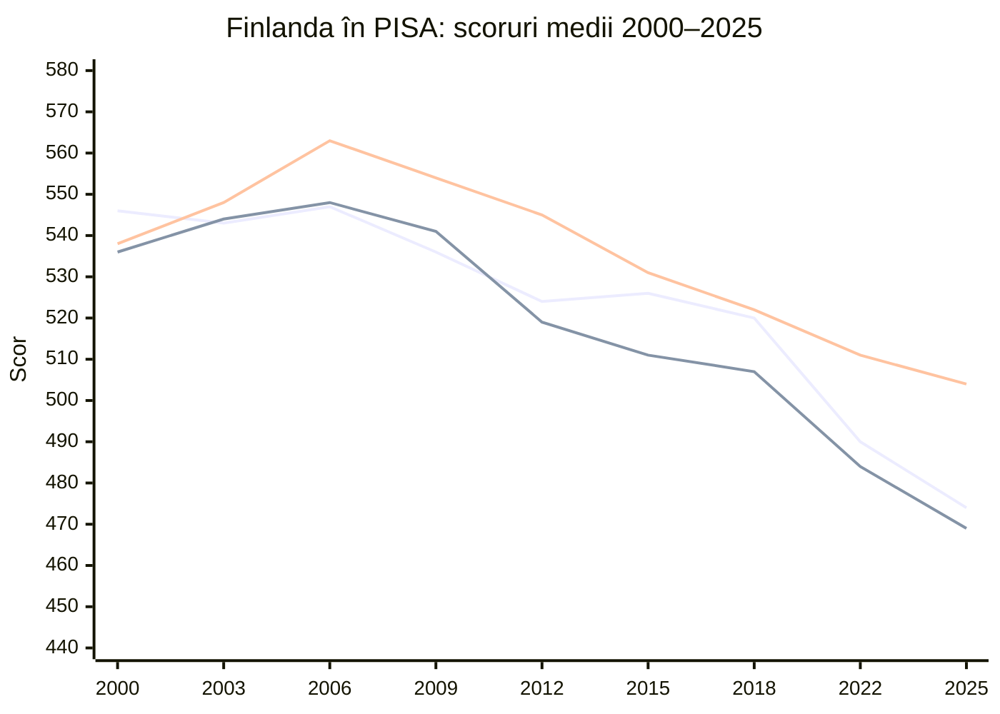
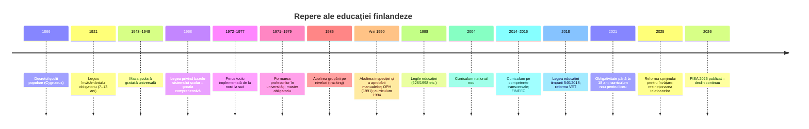
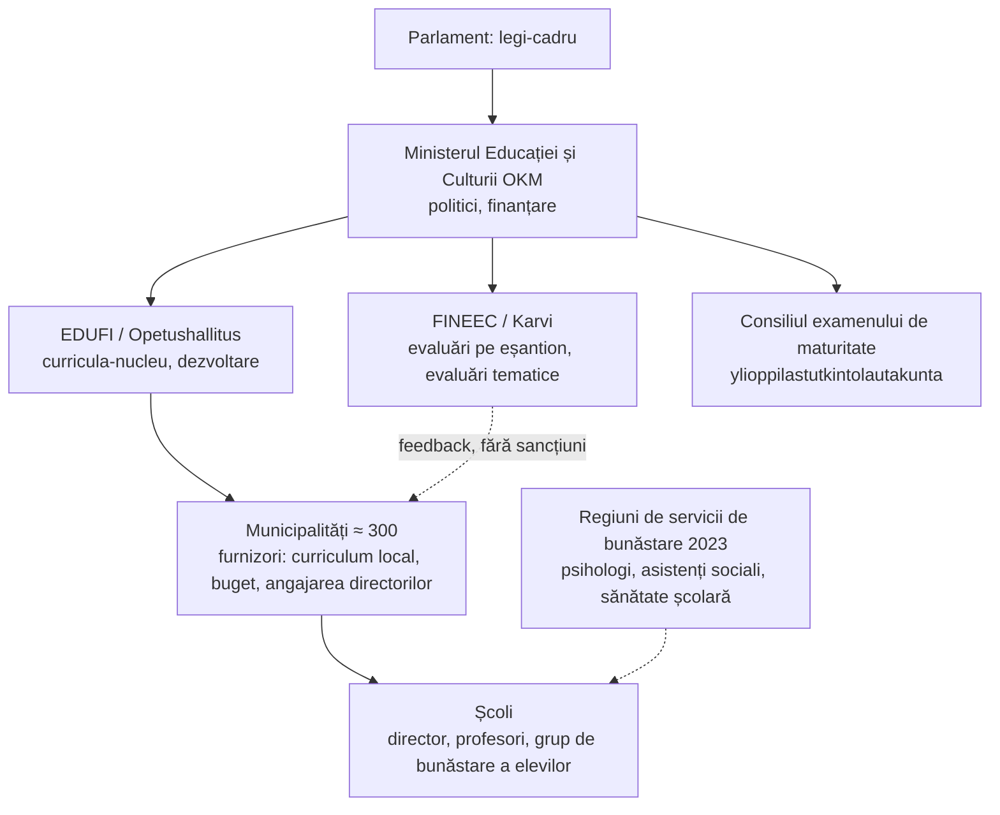

↑ [[00 Index - Analiza comparată internațională]] · [[00 MOC - Fundamentele științelor educației]]

> [!abstract] Pe scurt
> 1. **De ce contează**: Finlanda a fost „vedeta” primelor cicluri PISA (2000–2006). Scorul de **563 la științe în 2006** a rămas multă vreme cel mai mare obținut vreodată de o țară OCDE. De atunci, țara e un fel de laborator pentru dezbaterea **„ce anume explică performanța”**. Declinul de după 2006 (vezi §3) face cazul și mai instructiv.
> 2. **Formula clasică** (după OCDE, 2010 și Sahlberg, 2011): **școală comprehensivă unică** (*peruskoulu*, 1972–1977) + **profesori selectați riguros și formați la nivel de master, orientat spre cercetare** (din 1979) + **autonomie și încredere** în loc de inspecție și teste cu mize mari (anii 1990) + **sprijin timpuriu** pentru elevii cu dificultăți + **servicii universale** (masă gratuită, sănătate, consiliere).
> 3. **Fundamente aplicate**: tradiția **Bildung/Didaktik** (*sivistys*), idealul **egalității de șanse**, **profesionalismul** cadrului didactic, **evaluarea formativă la clasă**, **educația incluzivă**, **curriculumul pe competențe transversale** (2014) cu **module multidisciplinare**. În afara școlii: o puternică tradiție de **educație a adulților** (*vapaa sivistystyö*) și de **biblioteci publice**.
> 4. **Paradoxul istoric** (Simola, 2005; Sahlgren, 2015): generațiile testate în 2000–2006 s-au format într-un sistem **mai centralizat și mai tradițional** decât sugerează imaginea „progresistă” exportată în lume. Descentralizarea din anii 1990 a venit **după** creșterea rezultatelor.
> 5. **Declinul**: de la 547 la citire (2006) la 490 (2022) și **474 (PISA 2025)**; la matematică, de la 548 la **469**. Ponderea elevilor **sub nivelul 2** a crescut puternic, iar a performerilor de top a scăzut. Finlanda rămâne **peste media OCDE** la toate trei domeniile.
> 6. **Echitatea s-a erodat, dar rămâne relativ bună**. Diferențele **între școli** sunt mici, însă diferențele **în interiorul școlilor** au crescut (PISA 2025). Decalajele de **gen** (la citire) și de **statut migrant** sunt mari.
> 7. **Reacțiile politice (2020–2026)**: obligativitatea școlară extinsă **până la 18 ani** (2021), programul **„Dreptul de a învăța”**, experimentul **preșcolarității de doi ani**, **reforma sprijinului pentru învățare** (1 august 2025), **restricționarea telefoanelor** la ore (1 august 2025), accent pe citit și competențe de bază.
> 8. **Mituri de corectat**: Finlanda **nu** a „abolit materiile”, elevii **au** teme (dar puține), există un examen **cu mize mari** (examenul de maturitate), iar calitatea **nu** vine doar din „încredere”: vine dintr-un ansamblu instituțional construit în decenii.
> 9. **Pentru R. Moldova**: lecțiile transferabile țin mai ales de **statutul și formarea profesorilor**, de **sprijinul timpuriu** și de **coerența pe termen lung**. Autonomia fără capacitate profesională prealabilă nu e transferabilă (§9).

---

## Cuprins

1. [[#2. Profil și date-cheie]]
2. [[#3. Traiectoria PISA 2000–2025 și echitatea]]
3. [[#4. Cronologia reformelor (sec. XIX–XXI)]]
4. [[#5. Implementarea fundamentelor științelor educației]]
5. [[#6. Teorii și abordări aplicate]]
6. [[#7. Ecosistemul extins]]
7. [[#8. Factori explicativi ai performanței; limite și critici]]
8. [[#9. Lecții și transferabilitate pentru Republica Moldova]]
9. [[#10. Întrebări de reflecție]]
10. [[#11. Surse]]

---

## 2. Profil și date-cheie

| Indicator | Finlanda | Sursa / observații |
|---|---|---|
| **Populație** | ≈ 5,6 milioane | Statistics Finland |
| **Limbi de predare** | finlandeză, suedeză (minoritate de ≈ 5%); drepturi pentru sami | OCDE (2010), p. 128 |
| **Educație timpurie** (ISCED 0) | *varhaiskasvatus*, 0–6 ani; drept subiectiv la un loc în educația timpurie; modelul integrat **„educare”** (îngrijire + educație + predare) | Legea 540/2018; EDUFI |
| **Preșcolaritate** | **obligatorie** din 2015, cu un an înainte de școală (la 6 ani); minimum 700 de ore pe an; gratuită | Eurydice |
| **Educația de bază** (ISCED 1–2) | *perusopetus*, **9 ani, structură unică** (7–16 ani): clasele 1–6 cu **profesor de clasă** (*luokanopettaja*), 7–9 cu **profesori de specialitate** | Legea educației de bază 628/1998 |
| **Obligativitate** | **până la 18 ani** sau până la obținerea unei calificări de nivel secundar superior (din 1 august 2021) | Guvernul Finlandei; CEDEFOP |
| **Secundar superior** (ISCED 3) | două filiere: **liceul general** (*lukio*, se încheie cu **examenul de maturitate** *ylioppilastutkinto*) și **educația profesională** (*ammatillinen koulutus*, VET); ambele dau acces la studii superioare | Eurydice; OCDE (2010) |
| **Învățământ superior** (ISCED 6–8) | sistem **dual**: universități (orientare academică; doctorat) și **universități de științe aplicate** (*ammattikorkeakoulu*, orientare profesională) | Eurydice |
| **Școli private** | ≈ 2% dintre elevi; finanțate public, **fără taxe de școlarizare** | Eurydice |
| **Cheltuieli publice cu educația** | **6,3% din PIB (2024)**, față de media UE de 4,8% | Eurostat, *Government expenditure on education* (COFOG) |
| **Cheltuieli cumulate / elev (6–15 ani)** | ≈ **126.800 USD PPP** | OCDE, PISA 2022 Factsheet Finland |
| **Guvernanță** | Ministerul Educației și Culturii (**OKM**) → Agenția Națională pentru Educație (**Opetushallitus / EDUFI**: curricula naționale) → **Centrul Național de Evaluare a Educației (FINEEC / Karvi**, înființat prin Legea 1295/2013) → **municipalitățile** (≈ 300) ca principali furnizori, cu autonomie mare. Din 2023, o parte din serviciile de bunăstare a elevilor (psihologi, asistenți sociali școlari) au trecut la **regiunile de servicii de bunăstare** | Eurydice; OCDE (2010) |
| **Asigurarea calității** | **fără inspecție școlară** (abolită la începutul anilor 1990); **autoevaluare obligatorie** a furnizorilor; evaluări naționale pe **eșantion** | Eurydice, *Quality assurance* |
| **Repetenție** | 3% dintre elevii de 15 ani au repetat vreodată o clasă (media OCDE: 9%) | PISA 2022 Factsheet |

> [!note] Comentariu: ce înseamnă „descentralizat” în Finlanda
> Descentralizarea finlandeză nu înseamnă **piață**: nu există vouchere, clasamente publice ale școlilor sau inspecție punitivă. Înseamnă **delegare profesională**. Statul fixează finalitățile (curriculumul-nucleu național), iar municipalitatea, școala și profesorul decid **cum** le ating. Eurydice rezumă principiul prin preferința pentru **îndrumare și dezvoltare continuă** în locul controlului și inspecției.

---

## 3. Traiectoria PISA 2000–2025 și echitatea

> [!info] Statutul datelor
> - **PISA 2025 a fost publicat de OCDE pe 8 septembrie 2026.** Domeniul principal a fost **științele**, iar domeniul inovator **„Învățarea în lumea digitală”** (*Learning in the Digital World*). Rezultatele despre învățarea autoreglată și limba engleză ca limbă străină sunt anunțate pentru 2027.
> - Pentru 2025 folosesc cifrele raportate de **Guvernul Finlandei / OKM**, de **Yle** și de presa finlandeză pe baza raportului OCDE. Nu am putut accesa direct nota de țară OCDE 2025 (acces blocat), deci unele detalii 2025 trebuie **reverificate în raportul OCDE**.
> - **Comparabilitate**: la matematică tendința e comparabilă din 2003, iar la științe din 2006, adică din ciclurile în care domeniul a fost principal. Media OCDE variază și odată cu componența OCDE.

### 3.1 Scoruri medii pe cicluri

| Ciclu (domeniu principal) | Citire | Matematică | Științe | Media OCDE (C / M / Ș) | Poziție aproximativă (C / M / Ș) |
|---|---|---|---|---|---|
| **2000** (citire) | **546** | 536 | 538 | 500 / 500 / 500 | **1** / 4 / 3 |
| **2003** (matematică) | **543** | **544** | 548 | ≈ 494 / 500 / 500 | **1** / 2 / 1 (la egalitate cu Japonia) |
| **2006** (științe) | **547** | **548** | **563** | ≈ 492 / 498 / 500 | 2 / 2 / **1** |
| **2009** (citire) | 536 | 541 | 554 | ≈ 493 / 496 / 501 | 3 / 6 / 2 |
| **2012** (matematică) | 524 | 519 | 545 | ≈ 496 / 494 / 501 | 6 / 12 / 5 |
| **2015** (științe) | 526 | 511 | 531 | ≈ 493 / 490 / 493 | 4 / 13 / 5 |
| **2018** (citire) | 520 | 507 | 522 | ≈ 487 / 489 / 489 | ≈ 7 / 16 / 6 |
| **2022** (matematică) | **490** | **484** | **511** | **476 / 472 / 485** | ≈ 14 / 20 / 9 (aprox.) |
| **2025** (științe) | **474** | **469** | **504** | **461 / 463 / 482** | **17** (la egalitate cu Italia) / **22** / **12** din 91 |

**Surse**: 2000–2009 — OCDE (2010), *Strong Performers and Successful Reformers*, tab. 5.1; 2012–2018 — baze de date PISA (valori confirmate de mai multe compilații); 2022 — OCDE, *PISA 2022 Results: Factsheets – Finland*; 2025 — Guvernul Finlandei / OKM, Yle (8–9 septembrie 2026), NordiskPost (9 septembrie 2026). Pozițiile sunt **orientative** (clasamentele PISA au intervale de încredere), iar cele pentru 2000–2018 provin din compilații secundare.

### 3.2 Distribuția performanței

| Indicator | Date | Sursa |
|---|---|---|
| Sub nivelul 2 la **matematică** | ≈ **7%** la începutul anilor 2000 → **25%** în 2022 (media OCDE: 31%) → „aproape unul din trei” elevi în 2025 | JYU / OKM (2023); OCDE Factsheet 2022; Helsinki Times (2026) |
| Sub nivelul 2 la **citire** | **21%** în 2022 (media OCDE: 26%); **peste 25%** în 2025; la **băieți ≈ 1 din 3** | OCDE 2022; Yle / Helsinki Times 2026 |
| Creșterea ponderii sub nivelul 2 între 2012 și 2022 | +13 p.p. la matematică, +10 p.p. la citire, +10 p.p. la științe | OCDE Factsheet 2022 |
| Performeri de top (nivelul 5–6), 2022 | matematică **9%** (OCDE 9%); citire **9%** (OCDE 7%); științe **13%** (OCDE 7%) | OCDE Factsheet 2022 |
| Top la matematică: tendință lungă | **peste 23%** în 2003 → **7%** în 2025, sub media OCDE (după Helsinki Times; de reverificat în raportul OCDE) | Helsinki Times (2026) |
| Decalajul dintre elevii cei mai buni și cei mai slabi (2018–2022) | s-a **mărit** la toate domeniile; la matematică, elevii slabi au scăzut mai mult | OCDE Factsheet 2022 |

### 3.3 Echitate

| Dimensiune | PISA 2022 | PISA 2025 (ce s-a raportat) |
|---|---|---|
| **Statut socio-economic (ESCS)** | Diferența dintre elevii din sfertul favorizat și cei din sfertul defavorizat: **83 de puncte** la matematică (OCDE: 93). ESCS explică **12%** din varianța scorurilor la matematică (OCDE: 15%). Decalajul **s-a mărit** între 2012 și 2022 | Decalajele s-au **îngustat parțial pentru că au scăzut elevii din familiile favorizate**, nu pentru că au progresat cei defavorizați. Cercetătorul **Arto K. Ahonen** (JYU) a numit acest lucru o premieră |
| **Reziliență academică** | **12%** dintre elevii defavorizați ajung în sfertul de top (OCDE: 10%) | — |
| **Variația între și în interiorul școlilor** | Diferențele **între școli** sunt tradițional printre cele mai mici din lume (OCDE, 2010) | Diferențele între școli rămân mici, dar cele **în interiorul școlilor** sunt acum **considerabil peste media OCDE** |
| **Gen** | Fetele au un avantaj de **45 de puncte la citire** și de 5 puncte la matematică. Sub nivelul 2 la citire: **28% dintre băieți** față de 14% dintre fete | Fetele conduc la citire și științe; la matematică, rezultate apropiate |
| **Statut migrant** | Ponderea elevilor imigranți: **7%** (3% în 2012). Decalaj de **65 de puncte** la matematică (**42** după controlul ESCS) și de **92 de puncte** la citire (**69** după control). 82% dintre elevii imigranți vorbesc acasă altă limbă decât cea a testului | — |
| **Limba școlii** | La matematică, școlile de limbă suedeză (499) au depășit școlile de limbă finlandeză (483), diferența fiind semnificativă pentru prima dată | — |

**Surse**: OCDE, *PISA 2022 Factsheet Finland*; JYU (2023); Yle (2026).

### 3.4 Bunăstare, climat și context (PISA 2022)

- **Apartenență**: **79%** dintre elevi simt că aparțin școlii (OCDE: 75%); 13% se simt singuri la școală (OCDE: 16%).
- **Nemulțumire față de viață**: 11% (OCDE: 18%).
- **Climatul la ora de matematică**: **41%** dintre elevi sunt distrași de dispozitivele digitale (OCDE: 30%), iar 28% spun că nu pot lucra bine în majoritatea orelor (OCDE: 23%). Acest fapt a stat la baza legii telefoanelor din 2025.
- **Sprijinul profesorului**: 78% spun că profesorul ajută suplimentar când e nevoie (85% în 2012); 59% spun că profesorul se interesează de învățarea fiecărui elev (66% în 2012).
- **Penuria de profesori**: 23% dintre elevi învață în școli unde directorul raportează lipsă de personal didactic (**7% în 2018**).
- **Implicarea părinților**: doar 16% dintre elevi sunt în școli unde cel puțin jumătate dintre familii discută din proprie inițiativă cu profesorii (**38% în 2018**).
- **Perseverență (PISA 2025)**: doar **41%** dintre elevi spun că se străduiesc mai mult când sarcina e dificilă, **cea mai mică pondere** dintre țările comparate (Ahonen, citat de Yle).

### 3.5 Alte evaluări internaționale

| Studiu | Rezultat Finlanda | Observație |
|---|---|---|
| **PIRLS** (citire, clasa a 4-a) | 568 (2011) → 566 (2016) → **549 (2021)** | declin și la vârste mici |
| **TIMSS** clasa a 4-a | matematică 532 (2019) → **529 (2023)**; științe **542 (2023)** | peste media internațională de 500 |
| **TIMSS** clasa a 8-a | matematică 509 → **504**; științe 544 → **531** (2019 → 2023) | — |
| **PIAAC**, ciclul 2 (adulți, 2023; publicat în decembrie 2024) | literație **296**, numerație **294**, rezolvare adaptivă de probleme **276**: **locul 1** la literație și numerație | **contrastul-cheie**: adulții finlandezi sunt printre cei mai competenți din lume, deși elevii de 15 ani scad |
| **TALIS** | Finlanda participă la ancheta OCDE despre profesori. Cifrele TALIS 2018/2024 nu au fost verificate direct pentru această notă **(de verificat)** | — |

**Surse**: Wikipedia (compilații PIRLS/TIMSS/PIAAC după rapoartele IEA/OCDE), de verificat în rapoartele originale IEA.

> [!warning] Critică: cum citim datele
> - **Corelație ≠ cauzalitate.** Scăderea PISA a coincis cu digitalizarea, cu scăderea cititului de plăcere, cu imigrația, cu austeritatea post-2008, cu curriculumul 2014 și cu pandemia. Niciun factor nu este demonstrat singur ca **cauză**.
> - **Scăderea e generală.** Între 2022 și 2025 media OCDE a scăzut și ea (cu ≈ 14–15 puncte la citire). Danemarca, Norvegia, Suedia și Islanda au scăzut chiar mai mult decât Finlanda (NordiskPost, 2026).
> - **Declinul a început înainte de 2015.** Evaluările naționale arată, după Hautamäki et al. (2013), o scădere a competențelor de „a învăța să înveți” între 2001 și 2012 la finalul școlii de bază, echivalentă cu aproximativ 46 de puncte PISA (după calculul lui Sahlgren, 2015).

---

## 4. Cronologia reformelor (sec. XIX–XXI)

| An | Reformă / lege / program | Ideea | Legătura cu fundamentele |
|---|---|---|---|
| **1863–1866** | Seminarul pedagogic de la **Jyväskylä** (1863); **decretul școlii populare** (*kansakouluasetus*, 1866), pe baza propunerilor lui **Uno Cygnaeus** (1810–1888) | școală populară municipală; influențe **Pestalozzi** și **Fröbel**; **munca manuală** (*käsityö*, *slöjd*) obligatorie; profesori formați în seminarii | [[Progresivismul și educația nouă]] (precursori); educația tehnologică (M06) |
| **sec. XIX** | **J. V. Snellman** (1806–1881): naționalism cultural, limba finlandeză ca limbă a educației și a statului | educația ca **formare a națiunii**; *sivistys* (≈ Bildung) | [[Tradiția Bildung-Didaktik și tradiția Curriculum]]; idealul educațional (M04) |
| **1889** | **Primul liceu popular** în limba finlandeză (Kangasala, Sofia Hagman), după modelul danez al lui **Grundtvig** | educație liberă pentru adulți și tineri de la sate | [[Învățarea pe tot parcursul vieții și formele educației]] |
| **1921** | **Legea învățământului obligatoriu** (7–13 ani); fiecare municipalitate trebuie să asigure școlarizare | acces universal (târziu față de Europa) | echitate (M08) |
| **1943 / 1948** | **Masa școlară gratuită** (lege în 1943, generalizată în 1948) | școala ca serviciu social | [[Echitatea și școala comprehensivă]] |
| **1945–1946** | Comisii parlamentare: curriculumul școlii primare, cu viziune **umanistă, centrată pe copil** și studii de teren în 300 de școli; propunerea unei școli comune (respinsă atunci) | cercetarea ca bază pentru politici | Educația bazată pe dovezi; [[Progresivismul și educația nouă]] |
| **1968** | **Legea privind bazele sistemului școlar**, votată în noiembrie 1968 cu o majoritate substanțială | școală **comprehensivă de 9 ani**, municipală, pentru toți | [[Echitatea și școala comprehensivă]] |
| **1970** | Primul **curriculum național** al *peruskoulu*, elaborat în 1965–1970 cu sute de profesori | curriculum detaliat, centralizat; niveluri diferite la matematică și limbi străine | [[Tradiția Bildung-Didaktik și tradiția Curriculum]] |
| **1971 / 1974 / 1979** | **Legea formării profesorilor** (1971); mutarea formării din seminarii în **universități** (implementată la mijlocul anilor 1970); din **1979**, **masterul** devine calificarea de bază și pentru învățători | profesorul ca **profesionist cu formare academică**, capabil de cercetare | [[Profesionalismul cadrului didactic]] |
| **1972–1977** | **Implementarea *peruskoulu*** din Laponia spre sud; formare continuă obligatorie pentru toți profesorii | implementare treptată, cu mandat legal | [[Teoria schimbării educaționale și leadershipul]] |
| **1985** | Lege nouă a educației de bază; **abolirea grupării pe niveluri** în matematică și limbi străine; curriculum 1985; liceu **modular, fără clase de an** | clase eterogene; diferențiere în clasă | Diferențierea, inteligențele multiple și designul universal |
| **1991** | Fuziunea consiliilor pentru educația generală și profesională în **Opetushallitus** (Agenția/Consiliul Național pentru Educație) | agenție de dezvoltare, nu de control | M08 |
| **începutul anilor 1990** | **Abolirea inspecției școlare** și a **aprobării naționale a manualelor**; finanțare globală către municipalități; criză economică severă (șomaj de aproape 20%) | „cultura încrederii” (Sahlberg) | [[Responsabilizare, piață și încredere în guvernarea educației]] |
| **1991–1996** | **Universitățile de științe aplicate** (*ammattikorkeakoulu*): experiment din 1991, statut permanent la mijlocul anilor 1990 | cale terțiară profesională | [[Capitalul uman și economia educației]] |
| **1994** | **Curriculum-cadru național** scurt; **curricula locale** elaborate de școli și municipalități; concepție **constructivistă** asupra învățării | autonomie curriculară; profesorul ca autor de curriculum | [[Constructivismul cognitiv (Piaget, Bruner)]] |
| **1996** | Drept subiectiv la **educație timpurie** pentru toți copiii sub vârsta școlară | educația timpurie ca drept | Educația timpurie |
| **1998** | Pachet legislativ: **Legea educației de bază 628/1998**, legea liceului, **Legea educației libere 632/1998** | cadru juridic unitar | M08 |
| **2002** | Välijärvi et al., *The Finnish Success in PISA – and Some Reasons Behind It* (FIER, Jyväskylä) | prima explicație oficială a succesului | Educația bazată pe dovezi |
| **2004** | **Curriculum național nou**, mai detaliat decât cel din 1994; criterii pentru **nota 8** („bine”) la finalul școlii de bază | echilibru între autonomie și coerență națională | [[Taxonomiile obiectivelor și educația centrată pe competențe]] |
| **2007–2011** | **Strategia pentru educația specială** (2007); modificarea legii din 2010 (aplicată din 2011): **sprijin pe trei niveluri** (general, intensificat, special) | intervenție **timpurie**, preventivă | [[Educația incluzivă]] |
| **2013** | Educația timpurie trece de la Ministerul Afacerilor Sociale și Sănătății la **Ministerul Educației** | *educare*: educația timpurie ca educație | Educația timpurie |
| **2014** | **FINEEC (Karvi)** (Legea 1295/2013) unifică evaluarea pe toate nivelurile. **Curriculum-nucleu pentru educația de bază** (adoptat în decembrie 2014, în vigoare din august 2016 pentru clasele 1–6) | **7 competențe transversale**; **cel puțin un modul multidisciplinar pe an**; evaluare formativă; elevul activ | Învățarea prin proiecte, investigație și fenomene; [[Evaluarea formativă]] |
| **2015** | **Preșcolaritatea devine obligatorie** | pregătire universală pentru școală | Educația timpurie |
| **2016–2019** | Programul guvernamental **„Noua școală comprehensivă”** (*Uusi peruskoulu*): **profesori-tutori** pentru digitalizare și noua pedagogie; **Forumul pentru formarea profesorilor** | implementarea curriculumului 2014 | [[Teoria schimbării educaționale și leadershipul]] |
| **2016 / 2020** | Dreptul la educație timpurie **restrâns la 20 de ore pe săptămână** pentru anumite familii (2016), apoi **restabilit** (1 august 2020) | dezbatere despre echitate și costuri | Educația timpurie |
| **2018** | **Legea educației timpurii 540/2018**; curriculum-nucleu pentru educația timpurie (actualizat în 2022, cu **învățarea prin joc** în centru); **reforma VET** (Legea 531/2017, în vigoare din 2018): studii personalizate, învățare la locul de muncă | continuitatea educației timpurii; flexibilitate profesională | Educația timpurie; [[Capitalul uman și economia educației]] |
| **2019 / 2021** | **Curriculum nou pentru liceu** (2019, în vigoare din august 2021): module, competențe transversale, cooperare cu universitățile. Examenul de maturitate e **complet digital** din 2019 | aprofundare și orientare spre studii superioare | [[Taxonomiile obiectivelor și educația centrată pe competențe]] |
| **2020–2022** | Programul **„Dreptul de a învăța”** (*Oikeus oppia*), cu componente pentru educația timpurie și școala de bază: calitate și egalitate, sprijin după pandemie | reducerea inegalităților de învățare | [[Echitatea și școala comprehensivă]] |
| **2021** | **Extinderea obligativității până la 18 ani** (în vigoare din 1 august 2021) și **gratuitatea** secundarului superior: manuale, materiale, examene de maturitate, transport | nimeni nu rămâne doar cu educația de bază | [[Echitatea și școala comprehensivă]]; [[Capitalul uman și economia educației]] |
| **2021–2024** | **Experimentul preșcolarității de doi ani** (evaluare în curs) | începerea mai timpurie a învățării structurate | Educația timpurie |
| **2023** | Programul guvernului Orpo (*O Finlandă puternică și grijulie*): consolidarea citirii, scrierii și calculului, mai multe ore de predare, reforma sprijinului | „înapoi la competențele de bază” | [[Știința cognitivă a învățării]] |
| **2024** | Abolirea **alocației pentru educația adulților** (1 iunie 2024) | austeritate în învățarea continuă | [[Învățarea pe tot parcursul vieții și formele educației]] |
| **1 august 2025** | **Reforma sprijinului pentru învățare** (Legea 1090/2024): cele trei niveluri sunt înlocuite cu **sprijin la nivel de grup** și **sprijin individual**; tranziție până la 31 august 2026. **Restricționarea telefoanelor** în timpul orelor (modificarea Legii educației de bază); **stilul de viață activ** devine obiectiv al educației | claritate, prevenție, dreptul de a învăța în școala de cartier; atenție și concentrare | [[Educația incluzivă]]; [[Știința cognitivă a învățării]] |
| **8 septembrie 2026** | **PISA 2025**: declin continuu la citire și matematică; științele rămân mult peste media OCDE | reluarea dezbaterii naționale | Educația bazată pe dovezi |

---

## 5. Implementarea fundamentelor științelor educației

### 5.1 Statutul științelor educației, cercetarea și politica bazată pe dovezi
→ [[Modulul 01 - Statutul științelor educației]] · [[Modulul 05 - Paradigmele pedagogiei și cercetarea pedagogică]]

**Instituționalizarea academică a pedagogiei.** În Finlanda, științele educației au statut universitar solid. Formarea tuturor profesorilor are loc în **facultăți de științe ale educației** (Helsinki, Jyväskylä, Turku, Oulu, Tampere, Finlanda de Est, Laponia, Åbo Akademi pentru suedofoni). Masterul se încheie cu o **teză bazată pe cercetare** (OCDE, 2010, p. 125). Pedagogia este deci **disciplină academică și profesie** în același timp, ceea ce corespunde tezei manualului despre pedagogie ca știință cu normativitate proprie (M01).

**Infrastructura de cercetare și evaluare:**

| Instituție | Rol |
|---|---|
| **FIER — Institutul Finlandez pentru Cercetare Educațională** (Univ. Jyväskylä) | **Centrul național PISA** (director de cercetare: **Arto K. Ahonen**; pentru PISA 2025, în parteneriat cu Universitatea din Tampere); analiza oficială a PISA încă din 2000 (**Jouni Välijärvi**) |
| **Centrul pentru Evaluare Educațională**, Universitatea din Helsinki | evaluări ale competenței de **„a învăța să înveți”** (**Jarkko Hautamäki**, **Sirkku Kupiainen**) |
| **FINEEC / Karvi** (din 2014) | evaluări naționale **pe eșantion** ale rezultatelor învățării (de regulă la finalul claselor a 6-a sau a 9-a), evaluări tematice și ale sistemului, de la educația timpurie la învățământul superior |
| **EDUFI / Opetushallitus** | curriculum-nucleu, statistici (Vipunen, împreună cu OKM), dezvoltare |
| **Statistics Finland** | statistici privind sprijinul pentru învățare (ex. 26% dintre elevi au primit sprijin intensificat sau special în 2024) |

**Tipul de „politică bazată pe dovezi”.** Modelul finlandez folosește dovezile în principal pentru **monitorizarea sistemului și dezvoltare**, nu pentru **responsabilizarea școlilor** individuale. Rezultatele evaluărilor pe eșantion **nu sunt publicate pe școli** și nu există clasamente. OCDE (2010) observă că, în afara evaluărilor pe eșantion, **nu există un mecanism național** de monitorizare a performanței fiecărei școli.

> [!warning] Critică
> - **Participarea e mai limitată decât se afirmă.** Hakala & Kujala (2021, *Prospects*) arată că procesul curricular 2014, declarat participativ (inclusiv zeci de mii de răspunsuri online de la tineri), a fost în fapt dominat de EDUFI. Vocile tinerilor au avut impact redus.
> - **Dovezi slabe pentru anumite alegeri pedagogice.** Criticii (Sahlgren, 2015) susțin că reformele pedagogice de după 1994 nu au fost testate riguros înainte de generalizare.
> - **Lipsa datelor la nivel de școală** îngreunează identificarea timpurie a școlilor care rămân în urmă, mai ales în contextul segregării urbane crescânde.

### 5.2 Paradigme pedagogice dominante: clasic – modern – postmodern
→ [[Modulul 02 - Clasic, modern și postmodern în educație]]

| Etapă | Paradigma dominantă | Manifestare în Finlanda |
|---|---|---|
| **sec. XIX – 1940** | **clasică**, herbartiană și luterană; *sivistys* ca formare națională | seminariile pedagogice (Jyväskylä, 1863); școala populară cu lectură, religie și muncă manuală; alfabetizarea timpurie legată de tradiția luterană (literația era deja foarte răspândită la sfârșitul sec. XIX) |
| **1945–1970** | tranziție **modernă**: influență americană (planificare rațională, psihologie) peste tradiția germană; primele idei centrate pe copil | comisia din 1945 (școală umanistă, centrată pe copil); curriculumul din 1970, detaliat și planificat raţional (Hakala & Kujala, 2021) |
| **1970–1990** | **modernă**, cu egalitate prin structură și curriculum centralizat | *peruskoulu*; predare predominant **frontală**, condusă de profesor (Simola, 2005; Sahlgren, 2015) |
| **1994 – azi** | **postmodernă / „curriculum paradigm”**: constructivism, autonomie locală, competențe | curriculum 1994 (constructivist); 2004; 2014 (competențe transversale, fenomene, *agenția elevului*, bunăstare) |
| **după 2020** | **corecție pragmatică**: competențe de bază, atenție, citit | reformele Orpo; restricționarea telefoanelor; accent pe literație |

> [!note] Comentariu: „paradoxul Simola”
> **Hannu Simola** (Univ. Helsinki), în *The Finnish miracle of PISA* (*Comparative Education*, 41(4), 2005, p. 455–470) și *The Finnish Education Mystery* (Routledge, 2015), arată că succesul PISA **se sprijinea pe trăsături „tradiționale”**: profesori respectați, elevi care acceptau autoritatea școlii, o cultură a ascultării, consens social post-război. Discursul oficial atribuia însă succesul **reformelor progresiste**. În termenii M02: rezultatele „postmoderne” au fost obținute cu resurse culturale **clasice**. Ironia, după Simola, este că modernizarea erodează tocmai aceste resurse.

### 5.3 Formele educației: formal, nonformal, informal; învățarea permanentă și autoeducația
→ [[Modulul 03 - Formele generale ale educației]] · [[3.6 Educația permanentă și autoeducația]] · [[Autoeducația - teorii, autori și corelări]]

**Educația formală** e gratuită de la preșcolaritate la doctorat pentru cetățenii UE/SEE (taxe pentru studenții din afara SEE din 2017). Traseele sunt **permeabile**: VET dă acces la studii superioare, nu există „fundături” (*no dead ends*).

**Educația nonformală: *vapaa sivistystyö* (educația liberă).** Este un sector istoric, reglementat prin **Legea educației libere 632/1998**, finanțat parțial de stat și **fără examene sau calificări obligatorii**. Conform Wikipedia (fi), în 2024 existau aproximativ **290 de instituții finanțate**:

| Tip | Număr (2024, aprox.) | Specific |
|---|---|---|
| **Institute civice** (*kansalaisopistot*) | 174 | cursuri serale municipale pentru toate vârstele: limbi, arte, meșteșuguri, IT; rădăcini în „institutele muncitorești” de la sfârșitul sec. XIX |
| **Licee populare** (*kansanopistot*) | 74 | tradiția **grundtvigiană**, adesea cu internat; cursuri de un an, de orientare, de integrare a imigranților |
| **Universități de vară** (*kesäyliopistot*) | 19 | cursuri deschise, inclusiv module universitare |
| **Centre de studii** (*opintokeskukset*) | 12 | legate de organizații civice, sindicate, partide |
| **Centre de formare sportivă** | 11 | educație fizică și antrenori |

**Participarea adulților** e ridicată. Aproape **fiecare a doua persoană** de 18–64 de ani a participat la educația adulților în 2022 (Statistics Finland, citat de Eurydice), iar în 2017 participarea în ultimele 4 săptămâni era de **27%**, față de **11%** media UE. **PIAAC 2023**: Finlanda pe **locul 1** la literație și numerație la adulți.

**Educația informală: bibliotecile și cultura cititului.** Legea bibliotecilor publice (1492/2016) le dă un rol explicit în **educația civică, literația și învățarea pe tot parcursul vieții**. Emblema este **Oodi**, biblioteca centrală din Helsinki, deschisă în decembrie 2018 ca spațiu de învățare, creație și cetățenie. Există și rețele de biblioteci mobile. Contrastul actual e însă puternic: **cititul de plăcere al tinerilor a scăzut**, iar Ahonen indică scăderea cititului pe hârtie ca factor al declinului din 2025.

**Autoeducația / învățarea autodirijată** e explicit un scop curricular:
- preambulul curriculumului 2004 cere mediului de învățare să ghideze elevii în **stabilirea propriilor obiective și evaluarea propriei activități** (citat în OCDE, 2010);
- curriculumul 2014 are prima competență transversală „**gândire și a învăța să înveți**” (T1);
- liceul modular (din 1985) cere fiecărui elev un **plan individual de studii**.

Aceasta corespunde trecerii **heteroeducație → autoeducație** din manual (p. 36–37, 109–110).

> [!warning] Critică: autoeducația ca risc de inechitate
> PISA 2022 arată că **63%** dintre elevii finlandezi se simt capabili să se motiveze singuri pentru învățarea la distanță, deci **37% nu**. PISA 2025 raportează cea mai mică perseverență declarată dintre țările comparate. În nota [[Autoeducația - teorii, autori și corelări]] (§14) apare același avertisment: autonomia cedată prea devreme, fără **coreglare** (Hadwin, Järvelä & Miller, 2011), avantajează elevii din familii care oferă deja structură. Mai mulți cercetători finlandezi au pus în legătură pedagogiile foarte autodirijate cu creșterea diferențelor în interiorul claselor. Ipoteza e plauzibilă, dar **nu demonstrată cauzal**.

### 5.4 Finalități: ideal educațional, scopuri, cadre de competențe
→ [[Modulul 04 - Finalitățile educației]]

**Idealul educațional** în legislație și curriculum:
- **Legea educației de bază 628/1998, art. 2**: sprijinirea creșterii elevilor ca **oameni și membri responsabili din punct de vedere etic ai societății**, cu cunoștințele și abilitățile necesare vieții; promovarea **civilizației (*sivistys*) și a egalității** în societate; dreptul la învățare pe tot parcursul vieții. Formularea e parafrazată; textul oficial poate fi verificat pe Finlex.
- Curriculumul 2014 are o **bază valorică** explicită: unicitatea fiecărui elev și dreptul la o educație bună; **umanitate, educație generală (*yleissivistys*), echitate și democrație**; diversitate culturală; necesitatea unui **mod de viață sustenabil**.

**Cadrul de competențe (curriculumul 2014)**: cele **șapte competențe transversale** (*laaja-alainen osaaminen*):

| Cod | Competența | Corespondență în M04 / M06–M07 |
|---|---|---|
| **T1** | Gândire și a învăța să înveți | dimensiunea intelectuală; autoeducația |
| **T2** | Competență culturală, interacțiune și autoexprimare | estetică; interculturalitate |
| **T3** | Grija de sine și gestionarea vieții de zi cu zi | psihofizică; educația pentru sănătate |
| **T4** | Multiliterație (*monilukutaito*) | educația pentru media |
| **T5** | Competență TIC | tehnologică |
| **T6** | Competențe pentru viața profesională și antreprenoriat | tehnologică / economică |
| **T7** | Participare, implicare și construirea unui viitor sustenabil | cetățenie, mediu |

Competențele transversale se leagă de **obiectivele fiecărei materii**: fiecare obiectiv disciplinar e corelat cu T1–T7. Există și **module multidisciplinare** anuale.

> [!note] Comentariu: trei niveluri de finalități, în limbajul manualului
> - **Idealul**: *sivistys*, umanitate, egalitate și sustenabilitate (bază valorică).
> - **Scopurile**: competențele transversale și scopurile pe cicluri.
> - **Obiectivele**: obiectivele disciplinare din curriculum-nucleu, concretizate în **curricula locale**.
>
> Specificul finlandez este că **obiectivele operaționale** sunt formulate **local**, de profesori, ceea ce presupune profesori capabili de proiectare curriculară (M10).

### 5.5 Dimensiunile educației
→ [[Modulul 06 - Dimensiunile generale ale educației]]

| Dimensiune | Implementare | Observații / dovezi |
|---|---|---|
| **Intelectuală** | literație, matematică, științe; LUMA (rețeaua centrelor pentru științe și matematică); a învăța să înveți | rezultatele la 15 ani scad; competențele adulților rămân de top (PIAAC) |
| **Morală / caracter** | religie **sau** etică (*elämänkatsomustieto*) după apartenența elevului; bază valorică; programul anti-bullying **KiVa** | educația morală e **nonconfesională** pentru cei fără religie |
| **Tehnologică** | **muncă manuală** (*käsityö*) obligatorie din 1866 (Cygnaeus); T5 (TIC) și T6 (viață profesională) în 2014; programare integrată în matematică (2014) | continuitate rară: meșteșugurile școlare au **160 de ani** |
| **Estetică** | muzică, arte vizuale, meșteșuguri obligatorii; educație artistică de bază extrașcolară (*taiteen perusopetus*) în școli de muzică și artă | infrastructură culturală municipală densă |
| **Psihofizică** | educație fizică; recreații dese; **masă caldă gratuită** din 1948; asistență medicală școlară; din 2025, **stil de viață activ** ca obiectiv legal; programul *Finnish Schools on the Move* (de verificat detaliile) | abordare integrată a bunăstării |

### 5.6 „Noile educații”
→ [[Modulul 07 - Noile educații]]

| Noua educație | Formă de implementare în Finlanda |
|---|---|
| **Pentru cetățenie / democrație** | T7; educație civică (*yhteiskuntaoppi*) de la ciclul primar; **consilii ale elevilor** în școli (obligatorii prin lege; anul modificării e de verificat); implicarea elevilor în planificarea modulelor multidisciplinare (Sahlberg, 2015) |
| **Pentru media / multiliterație** | T4 *monilukutaito*; strategie națională de educație media coordonată de Institutul Național Audiovizual (**KAVI**). Finlanda e frecvent pe primul loc în *Media Literacy Index* european al Institutului pentru Societate Deschisă din Sofia (poziția pe ani e de verificat) |
| **Pentru mediu / sustenabilitate** | parte a bazei valorice („mod de viață sustenabil”) și a T7; școli și grădinițe cu programe eco |
| **Socio-emoțională / sănătate mintală** | T3; **KiVa Koulu** (Univ. Turku, **Christina Salmivalli**), extins la nivel național din 2009, evaluat într-un RCT de amploare (Kärnă et al., *Child Development*, 2011); grupuri de bunăstare a elevilor (*oppilashuolto*); legea bunăstării elevilor (2014) |
| **Interculturală / pace și toleranță** | predarea limbii materne a imigranților; finlandeza sau suedeza ca a doua limbă; clase pregătitoare pentru nou-veniți |
| **Pentru familie și parentalitate** | clinicile pentru copii (*neuvola*) și rețeaua de organizații civice (ex. MLL) |
| **Educație digitală responsabilă** | restricționarea telefoanelor (2025), ca răspuns la distragerea raportată în PISA 2022 (41%) |

> [!tip] Lecție: integrarea curriculară a noilor educații
> Finlanda **nu** a adăugat câte o materie pentru fiecare „nouă educație”. Le-a integrat prin **competențe transversale** și **module multidisciplinare**, adică exact **demersurile de integrare curriculară** discutate în M07 (infuzie, module, abordare transdisciplinară). Riscul, semnalat de cercetători, este **diluarea**: ce e „al tuturor” poate deveni „al nimănui” fără criterii de evaluare clare.

### 5.7 Sistemul și managementul educației
→ [[Modulul 08 - Sistemul de educație și managementul educației]]

**Structura** (vezi §2): școală unică de 9 ani, **fără selecție și fără grupare pe niveluri** (abolită în 1985). Diferențierea se face târziu, la 16 ani, între *lukio* și VET, dar ambele căi rămân deschise spre studii superioare.

**Guvernanța pe niveluri:**

**Autonomia școlii** (PISA 2022): 57% dintre elevi învață în școli unde directorul are principala responsabilitate pentru angajarea profesorilor (OCDE: 60%). **84%** învață în școli unde profesorii aleg materialele didactice (OCDE: 76%).

**Responsabilizare (*accountability*)**: modelul e **aproape exclusiv profesional** (OCDE, 2010, p. 129). Nu există inspecție, clasamente sau teste standardizate cu mize mari în școala de bază. Controlul vine din:
1. selecția și formarea profesorilor;
2. responsabilitatea colectivă a școlii;
3. autoevaluarea obligatorie a furnizorilor;
4. evaluările FINEEC pe eșantion;
5. **examenul de maturitate** la finalul liceului.

**Finanțarea**: transferuri de stat către municipalități, calculate pe formule (număr de elevi, factori demografici). Municipalitățile completează din bugete proprii. De aici provin **variații locale** mari, de exemplu în formarea continuă a profesorilor (critica lui Olli Luukkainen, OAJ, în OCDE 2010).

**Echitatea** e urmărită prin **servicii universale** (masă, transport, manuale și materiale gratuite în educația de bază, sănătate) și prin **sprijin timpuriu** (§5.8), nu prin selecție.

> [!warning] Critică: fisurile echității
> - **Segregarea rezidențială urbană** (Helsinki, Espoo, Vantaa) și alegerea școlii prin **clase cu profil** (muzică, limbi, științe, cu selecție la intrare) reintroduc o formă de **tracking informal**. Cercetările lui Piia Seppänen, Venla Bernelius și Mira Kalalahti despre alegerea școlii din anii 2000–2010 sunt de consultat pentru detalii.
> - **Diferențele în interiorul școlilor** au crescut (PISA 2025).
> - **Diferențele regionale**: la citire, nordul a obținut rezultate mai bune decât estul și sudul în PISA 2025 (Kuntalehti, 2026).
> - **Austeritatea** (anii 1990 și după criza din 2008): clase mai mari și reduceri ale formării continue în unele municipalități. Legătura cauzală cu declinul e **dezbătută**.

### 5.8 Agenții educației: profesorul, directorul, elevul, familia, comunitatea
→ [[Modulul 09 - Agenții educației și factorii dezvoltării]]

#### Profesorul

| Aspect | Situația în Finlanda | Sursa |
|---|---|---|
| **Selecție** | **în două etape**: (1) media la examenul de maturitate, rezultatele din liceu și realizările extrașcolare; (2) test scris, activitate de tip predare observată și **interviu** despre motivație. În 2010: **peste 6.600 de candidați pentru 660 de locuri** la formarea învățătorilor (8 universități), adică **≈ 10%** admiși. Din 2020, admiterea folosește un **examen național comun** pentru formarea profesorilor (VAKAVA); detaliile actuale sunt de verificat | OCDE (2010), p. 125 |
| **Formare inițială** | **master (5 ani)**. Învățătorii: specializare principală în științele educației și cel puțin **două discipline minore** studiate în facultățile de profil. Profesorii de specialitate: specializare principală în disciplină + **studii pedagogice** (≈ 60 ECTS). **Teză de master bazată pe cercetare** | OCDE (2010) |
| **Practică** | în **școli de aplicație universitare** (*normaalikoulu*), cu cicluri de **planificare – acțiune – reflecție** (Darling-Hammond, 2010, citată de OCDE) | OCDE (2010) |
| **Competențe accentuate** | **didactica disciplinei** (*pedagogical content knowledge*), **diagnosticarea dificultăților** de învățare, **diferențierea** | OCDE (2010) |
| **Autonomie** | aleg metodele, manualele și formele de evaluare la clasă; participă la elaborarea curriculumului local | OCDE (2010); PISA 2022 |
| **Timp de predare** | mai puține ore de predare decât în multe țări OCDE (≈ 600 de ore pe an în gimnaziu, după OCDE, 2010), cu mai mult timp pentru planificare și colaborare | OCDE (2010) |
| **Dezvoltare profesională** | minimum **3 zile pe an** obligatorii, finanțate de municipalitate; în medie ≈ 7 zile. Calitatea variază mult de la o municipalitate la alta, iar **sindicatul OAJ** o consideră un punct slab | OCDE (2010) |
| **Salariu** | **mediu** în contextul european; atractivitatea vine din **statut, autonomie și sens**, nu din salariu | OCDE (2010) |
| **Statut** | profesie cu **prestigiu comparabil** cu medicina și dreptul, după informatorii finlandezi ai OCDE (2010) | OCDE (2010) |
| **Tendințe recente** | **penurie** de profesori: 23% dintre elevi în școli cu lipsă de personal (PISA 2022, față de 7% în 2018); scăderea numărului de candidați la unele programe și creșterea stresului au fost raportate în presă **(de verificat cu date oficiale)** | OCDE, PISA 2022 |

**Directorul**: tradițional „primul între egali” (*head teacher*), care predă și el câteva ore. OCDE (2010, p. 127) și Välijärvi notează că **nu există tradiția observării lecțiilor** de către director, iar formarea pentru leadership s-a dezvoltat târziu. Raportul OCDE *Improving School Leadership* (Hargreaves, Halász & Pont, 2007) descrie **leadershipul distribuit** și cooperarea municipală în Finlanda.

**Elevul**: participă la planificarea învățării (curriculum 2014), la consiliile elevilor și la **autoevaluare**, practicată încă din clasa I în școlile descrise de OCDE (2010). Masa, sănătatea și sprijinul sunt **universale, nu condiționate de venit**.

**Grupul multiprofesional de bunăstare a elevilor** (*oppilashuoltoryhmä*) este mecanismul-cheie al **responsabilității colective**. Include directorul, profesorul de educație specială, asistenta medicală, psihologul, asistentul social și profesorii. Se întrunește periodic (descrierea OCDE, 2010, menționează de două ori pe lună într-o școală din Kerava) și analizează **clase întregi**, nu doar cazuri acute.

**Educația specială cu intervenție timpurie**:
- **Educația specială cu normă parțială** (*osa-aikainen erityisopetus*): un profesor de educație specială lucrează cu elevi în grupuri mici sau în clasă, **pentru perioade scurte**, fără etichetare formală. **Un elev din patru** a primit această formă de sprijin în anul școlar 2024–2025 (Statistics Finland, 2026).
- **Sprijinul pe trei niveluri** (2011–2025): în 2024, **26%** dintre elevi primeau sprijin intensificat sau special (Statistics Finland, 2025).
- **Reforma din 2025** trece la **sprijin de grup** (disponibil pentru toți) și **sprijin individual**, pentru claritate și prevenție.

**Familia și comunitatea**: încredere mare, dar implicare în scădere (§3.4). Rețeaua *neuvola* (clinici pentru mame și copii) sprijină familiile de la naștere. Comunitatea locală contribuie prin biblioteci, cluburi sportive, organizații de tineret și parohii.

### 5.9 Proiectare, predare, evaluare
→ [[Modulul 10 - Proiectarea, realizarea și evaluarea activității educative]]

**Proiectarea curriculară în trei trepte**: curriculum-nucleu național (EDUFI) → **curriculum local** (municipalitate / școală) → proiectarea profesorului. Modelul corespunde „paradigmei curriculumului” din manual, dar **cu profesorul ca autor**, nu doar ca executant. Este tipic tradiției *Didaktik* (Hakala & Kujala, 2021).

**Pedagogia la clasă — realitate vs. imagine:**
- Imaginea internațională (Walker, 2017; Lonka, 2018) vorbește despre **clase calme, recreații dese, învățare prin joc, proiecte și autonomie**.
- Observațiile istorice (Simola, 2005; Sahlgren, 2015) arată predare **predominant frontală și bazată pe manual** în perioada 1970–2000. **Manualele** sunt încă foarte folosite.
- După 2016: **module multidisciplinare** (cel puțin unul pe an; **Helsinki** a cerut două, cu implicarea tuturor materiilor, după Sahlberg, 2015), tutori digitali și **învățare investigativă**.

**Evaluarea:**

| Tip | Practica finlandeză |
|---|---|
| **Formativă, la clasă** | responsabilitatea **profesorului**; feedback continuu, **autoevaluare și interevaluare**; curriculum 2014: evaluarea trebuie să **ghideze și să încurajeze** învățarea |
| **Sumativă, școlară** | note pe scala **4–10**; certificat semestrial; **criterii naționale** pentru evaluarea finală (clasa a 9-a, revizuite în 2020–2021), pentru a limita inflația notelor |
| **Evaluări naționale** | **pe eșantion**, fără mize pentru elevi sau școli (FINEEC) |
| **Examen cu mize mari** | **examenul de maturitate** (*ylioppilastutkinto*), organizat din 1852 ca examen de intrare la Universitatea din Helsinki, azi **complet digital** (din 2019): minimum **5 probe**, inclusiv limba maternă. Din **2020**, majoritatea locurilor la universitate se ocupă pe baza **certificatului de maturitate**, ceea ce a **crescut mizele** examenului |
| **Admiterea în liceu** | pe baza **mediei notelor** din certificatul școlii de bază, deci notele profesorilor au mize reale |

> [!warning] Mituri despre evaluare
> - „**Finlanda nu are teste standardizate**”: fals. Are **examenul de maturitate**, cu mize mari și tot mai importante pentru admitere, plus evaluări naționale pe eșantion. E corect doar că în **școala de bază** nu există teste standardizate **cu mize mari** și nici clasamente.
> - „**Fără teme**”: fals. Elevii au teme, dar **puțin timp** dedicat lor în comparație internațională (în PISA 2012, ≈ 3 ore pe săptămână, sub media OCDE; cifra exactă e de verificat în *PISA in Focus* nr. 46, 2014).

---

## 6. Teorii și abordări aplicate

### 6.1 Tabel-sinteză

| Teorie / abordare (card) | Relevanță pentru Finlanda | Unde se vede |
|---|---|---|
| [[Echitatea și școala comprehensivă]] | ★★★ | *peruskoulu* 1968–1977; abolirea tracking-ului (1985); servicii universale; obligativitatea până la 18 ani (2021) |
| [[Profesionalismul cadrului didactic]] | ★★★ | master din 1979; selecție; autonomie; teză de cercetare |
| [[Responsabilizare, piață și încredere în guvernarea educației]] | ★★★ | abolirea inspecției; lipsa clasamentelor; conceptul GERM (Sahlberg) |
| [[Tradiția Bildung-Didaktik și tradiția Curriculum]] | ★★★ | *sivistys*; profesorul ca interpret al curriculumului; curricula locale |
| [[Educația incluzivă]] | ★★★ | educația specială cu normă parțială; 3 niveluri de sprijin (2011); reforma din 2025 |
| Învățarea prin proiecte, investigație și fenomene | ★★★ | module multidisciplinare (2016); învățarea investigativă (Hakkarainen, Lonka) |
| Educația timpurie | ★★ | *educare*; învățarea prin joc; preșcolaritate obligatorie (2015) |
| [[Învățarea pe tot parcursul vieții și formele educației]] | ★★★ | *vapaa sivistystyö*; biblioteci; PIAAC; universitatea deschisă |
| [[Taxonomiile obiectivelor și educația centrată pe competențe]] | ★★ | 7 competențe transversale (2014) |
| [[Evaluarea formativă]] | ★★ | evaluare la clasă, autoevaluare, fără teste cu mize în școala de bază |
| [[Învățarea autoreglată, metacogniția și autoeducația]] | ★★ | „a învăța să înveți” (Hautamäki); T1; planuri individuale în liceu |
| [[Socioconstructivismul și teoria activității (Vygotsky)]] | ★★ | Engeström (Helsinki); învățarea colaborativă; Hakkarainen |
| [[Constructivismul cognitiv (Piaget, Bruner)]] | ★★ | curriculum 1994 |
| [[Progresivismul și educația nouă]] | ★★ | Cygnaeus (Pestalozzi, Fröbel); comisia din 1945 |
| Diferențierea, inteligențele multiple și designul universal | ★★ | clase eterogene după 1985; formarea profesorilor pentru diferențiere |
| [[Teoria schimbării educaționale și leadershipul]] | ★★ | reformă lentă și consensuală; Hargreaves & Shirley (*The Fourth Way*); leadership distribuit |
| [[Capitalul uman și economia educației]] | ★★ | trecerea la economia cunoașterii după criza din anii 1990 (Nokia); VET; obligativitatea până la 18 ani |
| Educația bazată pe dovezi | ★★ | FIER, FINEEC; evaluări pe eșantion; critica lui Sahlgren |
| [[Învățarea socio-emoțională și educația caracterului]] | ★★ | KiVa; T3; grupurile de bunăstare |
| [[Pedagogia critică și educația pentru cetățenie]] | ★ | T7; consiliile elevilor; critici ale neoliberalizării curriculare |
| [[Constructionismul și educația digitală]] | ★ | T5; profesori-tutori digitali; examen de maturitate digital; restricționarea telefoanelor |
| [[Știința cognitivă a învățării]] | ★ (ca **critică**) | Sahlgren (2015): superioritatea instruirii ghidate; reorientarea spre competențe de bază (2023–2025) |
| [[Behaviorismul și instruirea directă]] | ★ (istoric) | predarea frontală din perioada 1970–2000 |
| [[Învățarea deplină (mastery learning)]] | ★ | ideea că „toți pot învăța” din școala comprehensivă și sprijinul corectiv timpuriu, fără programe formale de *mastery learning* |

### 6.2 Echitatea și școala comprehensivă ★★★
→ [[Echitatea și școala comprehensivă]]

**(a) Teoria.** Egalitatea de șanse cere **amânarea selecției**, **un curriculum comun ambițios** pentru toți și **servicii compensatorii**. Separarea timpurie pe filiere amplifică inegalitățile sociale fără câștig mediu de performanță (literatura economică despre *tracking*, ex. Hanushek & Wößmann, 2006).

**(b) Autori și aport:**
- **Uno Cygnaeus** (sec. XIX): ideea unei școli comune pentru toate clasele sociale, ca instrument de egalizare socială.
- **Comisia din 1946** (școala comună 1–8, respinsă) și **Comisia pentru programele școlare** (anii 1950): școala de 9 ani.
- **Jukka Sarjala** (Ministerul Educației, 1970–1995; apoi director general al Consiliului Național): planificarea implementării graduale cu mandat legal (interviu în OCDE, 2010).
- **Erkki Aho** (director general al Consiliului Național al Educației în anii 1970–1990): figură centrală a implementării; datele exacte sunt de verificat.
- **Pasi Sahlberg**, *Finnish Lessons* (Teachers College Press, 2011; ed. 2.0 2015; ed. 3.0 2021; **Premiul Grawemeyer 2013**): *peruskoulu* ca „vis” național de egalitate. Formularea sa, redată de OCDE (2010): școala comprehensivă întruchipează **o filosofie a educației**, nu doar o formă de organizare.
- **Pekkarinen, Uusitalo & Kerr** (IZA DP 2204, 2006; *Journal of Public Economics*, 2009): folosind implementarea graduală 1972–1977 ca **experiment natural**, arată că reforma a **redus corelația intergenerațională a veniturilor**. Titlul și anii sunt de verificat în versiunea publicată.

**(c) Implementare**: legea din 1968; implementarea din nord spre sud (1972–1977); formarea continuă obligatorie a tuturor profesorilor; curriculum național (1970); abolirea grupării pe niveluri (1985); masa școlară gratuită; transport gratuit; manuale gratuite în școala de bază; din 2021, gratuitatea și obligativitatea secundarului superior.

**(d) Dovezi și critici:**
- **Pentru**: variația între școli a fost printre cele mai mici din lume (OCDE, 2010). Impactul socio-economic e sub media OCDE (12% față de 15% din varianță în 2022). Reziliența academică e peste medie. Efectele asupra mobilității sociale sunt documentate prin experimentul natural.
- **Contra / nuanțe**: decalajul socio-economic la matematică **a crescut** între 2012 și 2022. Clasele cu profil și segregarea urbană erodează comprehensivitatea. Decalajul pentru elevii imigranți e mare. La **Sahlgren** (2015), creșterea rezultatelor începe **înainte** ca școala comprehensivă să-și fi putut produce toate efectele, iar cultura e un factor la fel de important.

### 6.3 Profesionalismul cadrului didactic ★★★
→ [[Profesionalismul cadrului didactic]]

**(a) Teoria.** Calitatea unui sistem nu poate depăși calitatea profesorilor săi. Profesionalismul presupune o **bază de cunoaștere academică**, **selecție**, **autonomie de judecată**, **etică și responsabilitate colectivă** (Shulman, 1987, *pedagogical content knowledge*; Darling-Hammond; Hargreaves & Fullan, *Professional Capital*, 2012).

**(b) Autori și aport:**
- **Hannele Niemi** (Univ. Helsinki): formarea profesorilor orientată spre cercetare; volumul editat **Niemi, Toom & Kallioniemi**, *Miracle of Education* (Sense, 2012; ed. a 2-a 2016).
- **Auli Toom**, **Jari Lavonen** (Univ. Helsinki): formarea profesorilor, didactica științelor. Lavonen, citat de Sahlgren (2015), consideră că primele rezultate PISA se datorează mai ales sistemului **vechi**.
- **Linda Darling-Hammond**, *The Flat World and Education* (2010): descrierea practicii clinice finlandeze.
- **Olli Luukkainen** (fost președinte OAJ): despre autonomie și statut, dar și critica inegalității formării continue (OCDE, 2010).

**(c) Implementare**: formarea în universități (Legea din 1971; master din 1979); selecția în două etape; teza de cercetare; școlile de aplicație (*normaalikoulut*); autonomia în alegerea metodelor și manualelor; programul național de formare continuă (20 mil. EUR în 2010, după OCDE); Forumul pentru formarea profesorilor (2016) și profesorii-tutori (2016–2019).

**(d) Dovezi și critici:**
- **Pentru**: consens larg în rapoartele OCDE și McKinsey (*How the world's best-performing school systems come out on top*, 2007) că selecția și formarea sunt factori centrali.
- **Critica cronologică** (Sahlgren, 2015; Hautamäki, citat acolo): profesorii formați după 1979 **nu constituiau încă majoritatea** corpului profesoral când s-au format elevii testați în 2000. Mai mult, **pensionarea generației formate în vechiul sistem coincide cu stagnarea**. Asta **nu** infirmă valoarea formării de master, dar arată că nu poate explica **singură** vârful din anii 2000.
- **Riscuri actuale**: penurie de personal, formare continuă inegală, creșterea sarcinilor (incluziune, digitalizare, bunăstare), leadership școlar subdezvoltat.

### 6.4 Responsabilizare, piață și încredere ★★★
→ [[Responsabilizare, piață și încredere în guvernarea educației]]

**(a) Teoria.** Există două logici de guvernare: **responsabilizarea externă** (teste standardizate, clasamente, inspecție, alegerea școlii, sancțiuni) și **responsabilitatea profesională** bazată pe **încredere**, capacitate și colaborare. Sahlberg numește prima logică **GERM** (*Global Educational Reform Movement*): standardizare, focalizare pe materii de bază, responsabilizare prin teste, piață și alegere.

**(b) Autori și aport:**
- **Pasi Sahlberg**: conceptul **GERM** (formulat în articole din anii 2000 și popularizat în *Finnish Lessons*, 2011). Formula „trust-based school culture”: după el, o cultură școlară bazată pe încredere a început formal la începutul anilor 1990 (citat în Sahlgren, 2015).
- **Andy Hargreaves & Dennis Shirley**, *The Fourth Way* (Corwin, 2009): Finlanda ca exemplu de „a patra cale” (profesionalism, încredere, responsabilitate colectivă).
- **Hargreaves, Halász & Pont** (OCDE, 2007): leadership sistemic în Finlanda.
- **Gabriel Heller Sahlgren**, *Real Finnish Lessons* (Centre for Policy Studies, Londra, 2015): **contraargumentul**. Până în anii 1990 sistemul a fost **centralizat, cu inspecție și aprobarea manualelor**, iar datele standardizate (Altinok et al.) arată că **cea mai mare parte a creșterii** s-a produs **sub vechiul sistem**. Aceste reforme nu pot explica deci succesul.

**(c) Implementare**: abolirea inspecției și a aprobării manualelor (începutul anilor 1990); curriculum-cadru (1994); fără clasamente; FINEEC cu rol de dezvoltare; autoevaluarea furnizorilor.

**(d) Dovezi și critici:**
- Pentru susținători, încrederea reduce costurile de control, crește atractivitatea profesiei și permite inovația.
- **Critica cronologică și cauzală**: Sahlgren (2015) arată că creșterea rezultatelor la conscrișii de 18–20 de ani s-a produs între 1988 și 1997, iar scăderea între 1997 și 2009, după descentralizare. **Atenție**: e o corelație temporală, nu o dovadă cauzală.
- **Interpretarea echilibrată**: încrederea a funcționat pentru că exista deja **capacitate profesională**, construită în **perioada centralizată**. **Ordinea contează**: întâi capacitatea, apoi autonomia.

### 6.5 Tradiția Bildung-Didaktik și tradiția Curriculum ★★★
→ [[Tradiția Bildung-Didaktik și tradiția Curriculum]]

**(a) Teoria.** Tradiția germano-nordică **Bildung/Didaktik** vede educația ca **formare a persoanei** (autodeterminare, cultură, responsabilitate). Profesorul e un **interpret autonom** al conținuturilor prescrise, care decide ce e *formativ* pentru elevi. Tradiția anglo-americană **Curriculum** accentuează **eficiența, standardizarea și rezultatele măsurabile**, iar profesorul **implementează** (Westbury, Hopmann & Riquarts, *Teaching as a Reflective Practice*, 2000).

**(b) Autori și aport:**
- **J. V. Snellman**: *sivistys* ca proiect național.
- **Matti Koskenniemi** și **Pertti Kansanen** (Univ. Helsinki): didactica finlandeză; Kansanen a comparat *Didaktik* cu tradiția anglo-saxonă (anii 1990–2000; titlurile exacte sunt de verificat).
- **Michael Uljens** (Åbo Akademi): teoria nonafirmativă a educației, Bildung în context nordic.
- **Liisa Hakala & Tiina Kujala** (*Prospects*, 2021): Finlanda a **amestecat** cele două tradiții. După război, planificarea rațională de tip american a marginalizat filosofia germană, dar **autonomia profesorului** s-a păstrat prin formarea academică. Autoarele cer **reactivarea Bildung** în fața crizelor globale.

**(c) Implementare**: curricula locale (1994–); profesori care aleg manualele și metodele; conceptul de **educație generală** (*yleissivistys*) în baza valorică a curriculumului 2014; liceul ca **educație generală**, nu doar ca pregătire pentru examen.

**(d) Dovezi și critici:** e o tradiție greu de măsurat. Hakala & Kujala critică **influența neoliberală** a competențelor de tip OCDE în curriculumul 2014. Alți autori văd în competențele transversale o **reinterpretare** a Bildung pentru secolul XXI.

### 6.6 Educația incluzivă ★★★
→ [[Educația incluzivă]]

**(a) Teoria.** Toți elevii au dreptul să învețe în școala comună. Sistemul se adaptează elevului prin **prevenție**, **sprijin gradual** și **responsabilitate colectivă** (Declarația de la Salamanca, UNESCO 1994; modelul RTI / sprijin pe niveluri).

**(b) Autori și aport:**
- **Joel Kivirauma & Kari Ruoho** (*International Review of Education*, 2007): educația specială cu normă parțială ca parte a explicației succesului PISA (titlul și anul sunt de verificat).
- **Markku Jahnukainen** (Univ. Helsinki): comparații Finlanda–Alberta privind educația specială.
- **Hannu Savolainen** (Univ. Finlanda de Est): educația incluzivă și convingerile profesorilor.

**(c) Implementare**: profesor de **educație specială în fiecare școală**, care lucrează cu grupuri mici sau în clasă. **Educația specială cu normă parțială** fără diagnostic formal (**un elev din patru** în 2024–2025). Sprijinul pe trei niveluri (2011) a fost înlocuit în **2025** cu sprijin **de grup și individual**. Există grupuri multiprofesionale de bunăstare. OCDE (2010) nota că ≈ 8% dintre copii aveau cerințe educaționale speciale, dintre care **jumătate** în școli și clase separate, cealaltă jumătate integrați.

**(d) Dovezi și critici:**
- **Pentru**: intervenția timpurie explică, plauzibil, ponderea mică a elevilor slabi în anii 2000.
- **Critici**: creșterea cererii de sprijin (26% cu sprijin intensificat sau special în 2024) și **birocratizarea** documentelor; clase cu tot mai mulți elevi cu nevoi, fără resurse proporționale; tensiunea „incluziune fără resurse”. Reforma din 2025 încearcă să răspundă (Yle a raportat angajarea de profesori suplimentari), iar implementarea e studiată de JYU.

### 6.7 Învățarea prin proiecte, investigație și fenomene ★★★
→ Învățarea prin proiecte, investigație și fenomene

**(a) Teoria.** Învățarea e mai profundă când elevii investighează **fenomene reale și complexe**, care traversează disciplinele, colaborează și construiesc cunoaștere (Dewey; Kilpatrick; *inquiry-based learning*; *knowledge building* — Scardamalia & Bereiter).

**(b) Autori și aport:**
- **Kai Hakkarainen, Kirsti Lonka & Lasse Lipponen**, *Tutkiva oppiminen* (WSOY, 1999): **învățarea investigativă progresivă** (*progressive inquiry*), adaptare finlandeză a *knowledge building*.
- **Kirsti Lonka** (Univ. Helsinki), *Phenomenal Learning from Finland* (Edita, 2018): fundamentarea învățării bazate pe fenomene, angajament și bunăstare.
- **Hakkarainen, Palonen, Paavola & Lehtinen**, *Communities of Networked Expertise* (Elsevier, 2004): comunitățile de expertiză în rețea. **Erno Lehtinen** (Univ. Turku) a contribuit și la cercetarea despre învățarea matematicii și expertiză.
- **Pasi Sahlberg** (*The Conversation*, 2015): clarificarea mitului „abolirii materiilor”.

**(c) Implementare**: curriculum 2014, în vigoare din 2016: **cel puțin un modul multidisciplinar pe an**, cu durata decisă de școală și **implicarea elevilor** în planificare și evaluare. Helsinki a cerut **două** perioade pe an. **Materiile au rămas.**

**(d) Dovezi și critici:**
- **Mitul**: un articol din *The Independent* (2015) a răspândit ideea că Finlanda „renunță la materii”. Realitatea: un modul integrat pe an, **în plus** față de materii.
- **Implementare inegală**: cercetările despre evaluarea modulelor multidisciplinare (ex. *Education 3–13*, 2024) arată incertitudinea profesorilor privind **evaluarea**.
- **Critica cognitivistă** (Sahlgren, 2015; dezbaterea din *The Economist*, 2026): pedagogiile slab ghidate pot dezavantaja elevii fără cunoștințe prealabile. **Nu există dovezi cauzale** că modulele (o mică parte din timp) ar explica declinul, care începuse înainte de 2016.

### 6.8 Educația timpurie ★★
→ Educația timpurie

**(a) Teoria.** Primii ani sunt decisivi pentru dezvoltare. Investiția timpurie are randamente mari (Heckman). Pedagogia jocului dezvoltă autoreglarea, limbajul și socializarea (Vygotsky, Elkonin).

**(b) Autori și aport:**
- **Pentti Hakkarainen** (Univ. Oulu) & **Milda Bredikytė**: pedagogia jocului narativ, de inspirație vygotskiană.
- **Friedrich Fröbel**, prin **Cygnaeus**: grădinițele finlandeze din sec. XIX. Grădinița Hanna Rothman din Helsinki (1888) este de verificat.
- **Kristiina Kumpulainen** (Univ. Helsinki): învățarea și agenția copiilor în educația timpurie.

**(c) Implementare**: modelul **„educare”**; Legea 540/2018; **curriculum-nucleu 2022** (obligatoriu și pentru furnizorii privați), cu **cinci arii de învățare** (lumea bogată a limbajelor; forme diverse de exprimare; eu și comunitatea mea; explorez și interacționez cu mediul; cresc, mă mișc și mă dezvolt). Fiecare copil are un **plan individual**. Preșcolaritatea e obligatorie din 2015, cu experimentul de doi ani în 2021–2024. Educatorii au studii universitare (licență în științele educației). **97%** dintre elevii de 15 ani au urmat cel puțin un an de preșcolaritate (PISA 2022).

**(d) Dovezi și critici:** **începutul școlii la 7 ani** este adesea invocat ca „secret”, dar nu există dovezi că ar fi cauza performanței. Participarea la educația timpurie a copiilor mici a fost **mai scăzută** decât în alte țări nordice, iar guvernul Orpo o vrea crescută, mai ales pentru imigranți. Există o penurie de educatori calificați în marile orașe.

### 6.9 Învățarea pe tot parcursul vieții și formele educației ★★★
→ [[Învățarea pe tot parcursul vieții și formele educației]]

**(a) Teoria.** Educația permanentă integrează formalul, nonformalul și informalul pe toată durata vieții (Faure, 1972; Delors, 1996). Educația populară nordică (Grundtvig) vede învățarea liberă a adulților ca temelie a democrației.

**(b) Autori și aport:** **N. F. S. Grundtvig** (liceul popular); **Sofia Hagman** (1889, primul liceu popular finlandez); mișcările muncitorești și de tineret (institutele muncitorești); **Jack Mezirow** (învățarea transformativă, influent în andragogia finlandeză).

**(c) Implementare**: *vapaa sivistystyö* (≈ 290 de instituții); **universitatea deschisă**; liceele pentru adulți; **reforma învățării continue** (Centrul de servicii pentru învățare continuă și ocupare, JOTPA / SECLE); bibliotecile (Legea 1492/2016; Oodi, 2018).

**(d) Dovezi și critici:** PIAAC 2023 plasează Finlanda pe **locul 1**. Participarea e **inegală**: adulții cu studii mai înalte participă mai mult (efectul Matei). **Austeritatea**: abolirea alocației pentru educația adulților (2024); reducerile de finanțare pentru educația liberă sunt de verificat ca amploare.

### 6.10 Taxonomii și educația centrată pe competențe ★★
→ [[Taxonomiile obiectivelor și educația centrată pe competențe]]

**(a)** Finalitățile se formulează ca **competențe**, adică integrări de cunoștințe, abilități, atitudini și voință, transferabile între contexte (DeSeCo, OCDE 2003; Cadrul european al competențelor-cheie, 2006 și 2018). **(b)** **Irmeli Halinen** (fostă șefă a dezvoltării curriculare la EDUFI) a coordonat curriculumul 2014 și **conceptul de competență transversală**; Vitikka, Krokfors & Hurmerinta (2012) au descris structura curriculumului național. **(c)** T1–T7 sunt legate de fiecare obiectiv disciplinar; criteriile de evaluare finală au fost revizuite în 2020–2021. **(d)** Riscul este **supraîncărcarea** documentelor și **evaluarea vagă** a competențelor. Există și critica neoliberalizării (Hakala & Kujala, 2021).

### 6.11 Evaluarea formativă ★★
→ [[Evaluarea formativă]]

**(a)** Evaluarea care oferă feedback folosit pentru ajustarea învățării are efecte substanțiale (Black & Wiliam, 1998). **(b)** Directoarea **Riitta Aaltio** (Kerava), citată de OCDE (2010), explică paradoxul: fără teste externe, școala dispune de **foarte multe date de evaluare diagnostică și formativă** la clasă. **Najat Ouakrim-Soivio** a cercetat evaluarea în școala finlandeză (de verificat). **(c)** Curriculumul 2014 are un capitol amplu despre **cultura evaluării**: autoevaluare din clasa I, discuții de evaluare cu elevul și părinții. **(d)** Notele stabilite de profesori variază între școli (inflația notelor), ceea ce contează pentru admiterea în liceu. De aici au apărut **criteriile naționale** de evaluare finală.

### 6.12 Învățarea autoreglată și „a învăța să înveți” ★★
→ [[Învățarea autoreglată, metacogniția și autoeducația]]

**(a)** Elevul își planifică, monitorizează și evaluează învățarea. Motivația și convingerile despre sine sunt parte a competenței. **(b)** **Jarkko Hautamäki et al.**, *Assessing Learning-to-Learn: A Framework* (Consiliul Național al Educației, 2002): un model finlandez al competenței de „a învăța să înveți”, cu componente **cognitive și afectiv-motivaționale**. Studiul **Hautamäki, Kupiainen, Marjanen, Vainikainen & Hotulainen** (Univ. Helsinki, 2013) arată un **declin între 2001 și 2012** atât la competențe, cât și la atitudinile favorabile învățării. **Sanna Järvelä** (Univ. Oulu) este o autoritate internațională în **reglarea social împărtășită** (Hadwin, Järvelä & Miller, 2011). **(c)** T1; planurile individuale de studii în liceu; autoevaluarea. **(d)** Datele despre **perseverență** din PISA 2025 (41%) și declinul atitudinilor din 2001–2012 arată că proclamarea autonomiei **nu produce automat** autoreglare. E nevoie de **eșafodaj** explicit (vezi [[Autoeducația - teorii, autori și corelări]], §8 și §15).

### 6.13 Socioconstructivismul și teoria activității ★★
→ [[Socioconstructivismul și teoria activității (Vygotsky)]]

**(a)** Învățarea e mediată social și cultural. Activitatea colectivă și contradicțiile ei produc dezvoltare. **(b)** **Yrjö Engeström** (Univ. Helsinki), *Learning by Expanding* (1987): **învățarea expansivă** și metoda **Laboratorului schimbării** (*Change Laboratory*), aplicată și în școli. **Annalisa Sannino**: agenția transformativă (2015). **Pentti Hakkarainen**: jocul în perspectivă vygotskiană. **(c)** Formarea profesorilor, dezvoltarea organizațională a școlilor, învățarea colaborativă din curriculum. **(d)** Influența academică e mare, dar impactul pe scară largă asupra practicii de clasă este **greu de cuantificat**.

### 6.14 Constructivismul cognitiv ★★
→ [[Constructivismul cognitiv (Piaget, Bruner)]]

**(a)** Elevul își construiește activ cunoașterea pe baza structurilor existente. **(b)** Curriculumul 1994 a adoptat explicit o **concepție constructivistă**. În formarea profesorilor au circulat lucrările lui Piaget și Bruner, iar în didactica științelor, schimbarea conceptuală (**Kaarina Merenluoto**, **Erno Lehtinen**). **(c)** Curriculum 1994 și 2004. **(d)** Criticii din științele cognitive (Kirschner, Sweller & Clark, 2006) avertizează asupra **ghidării minimale**. Sahlgren (2015) folosește această literatură pentru a interpreta declinul finlandez. Interpretarea rămâne **disputată**.

### 6.15 Progresivismul și educația nouă ★★
→ [[Progresivismul și educația nouă]]

**(a)** Centrarea pe copil, activitate, muncă și experiență (Pestalozzi, Fröbel, Dewey). **(b)** **Uno Cygnaeus** a introdus **munca manuală** după Pestalozzi și Fröbel. Sistemul *sloyd* nordic l-a influențat, prin intermediul unor pedagogi suedezi, pe educatorii americani ai „educației manuale”. **Comisia din 1945** a propus o școală **umanistă, centrată pe copil**, în contrast cu modelul „germanic, bazat pe programă” (OCDE, 2010). **(c)** Munca manuală obligatorie de la 1866 până azi; spiritul curriculumului din 1994 și 2014. **(d)** Discursul progresist a fost multă vreme **mai puternic decât practica** (Simola; Sahlgren).

### 6.16 Diferențierea ★★
→ Diferențierea, inteligențele multiple și designul universal

**(a)** Instruirea se adaptează nivelului, ritmului și intereselor elevilor într-o clasă eterogenă. **(b)** Formarea profesorilor pune accent pe **diagnosticarea dificultăților** și **adaptarea instruirii** (OCDE, 2010). **(c)** După abolirea grupării pe niveluri (1985), diferențierea se face în clasă, prin sprijin cu normă parțială și, din 2025, prin sprijin de grup. **(d)** PISA 2025 arată diferențe **în interiorul școlilor** mai mari decât media OCDE: diferențierea în clasele eterogene devine **tot mai dificilă**.

### 6.17 Teoria schimbării educaționale și leadershipul ★★
→ [[Teoria schimbării educaționale și leadershipul]]

**(a)** Schimbarea durabilă cere **coerență, capacitate, consens și timp** (Fullan). Transferul superficial de politici (*policy borrowing*) eșuează. **(b)** **OCDE (2010)** descrie o reformă **„lentă și constantă”** (*slow and steady*), cu consens politic menținut peste schimbările de guvern. **Hargreaves & Shirley** (2009) o numesc „a patra cale”. **Sahlberg** (2011) avertizează asupra GERM. Pentru **Simola** (2015), succesul are rădăcini istorice și sociologice care nu pot fi copiate. **(c)** Implementarea graduală (1972–1977), formarea continuă masivă, dialogul cu sindicatul **OAJ**. **(d)** Anii 2010 au adus mai multe reforme și proiecte în succesiune rapidă. Unii critici sugerează că **pierderea coerenței** poate fi un factor al declinului (de verificat).

### 6.18 Capitalul uman și economia educației ★★
→ [[Capitalul uman și economia educației]]

**(a)** Educația e o investiție care crește productivitatea și creșterea economică (Schultz, Becker; Hanushek & Wößmann). **(b)** După **recesiunea din anii 1990** (șomaj de aproape 20%, scăderea PIB-ului cu 13%), Finlanda a mizat pe cercetare și dezvoltare și pe telecomunicații (**Nokia**). Angajatorii au cerut școlilor **creativitate, lucru în echipă și rezolvare de probleme**, conform relatării lui Sahlberg din OCDE (2010). **(c)** Universitățile de științe aplicate; reforma VET (2018); obligativitatea până la 18 ani (2021), justificată explicit prin **creșterea ratei de ocupare**; ținta de 4% din PIB pentru cercetare-dezvoltare până în 2030. **(d)** Sahlgren (2015) propune un **„efect de bogăție”**: pe măsură ce țara se îmbogățește, cultura efortului școlar slăbește. Ipoteza e interesantă, dar **greu de testat**.

### 6.19 Educația bazată pe dovezi ★★
→ Educația bazată pe dovezi

**(a)** Deciziile educaționale se sprijină pe cele mai bune dovezi disponibile, ideal pe evaluări cauzale. **(b)** **Välijärvi et al.** (2002) au făcut prima analiză oficială a succesului PISA. **FIER / Ahonen** analizează PISA 2022–2025. **Pekkarinen, Uusitalo & Kerr** au evaluat cauzal efectele reformei comprehensive. **Kärnă, Salmivalli et al.** (2011) au testat KiVa printr-un RCT. **(c)** Evaluări FINEEC, statistici, experimente-pilot înainte de generalizare (preșcolaritatea de doi ani, cu evaluare). **(d)** Critica lui Sahlgren (2015): explicațiile de tip **„bune practici”** confundă caracteristicile actuale ale sistemelor performante cu **cauzele** performanței.

### 6.20 Învățarea socio-emoțională ★★
→ [[Învățarea socio-emoțională și educația caracterului]]

**(a)** Competențele socio-emoționale (conștiința de sine, autoreglarea emoțională, relațiile, deciziile responsabile) se pot învăța și susțin învățarea academică (CASEL). **(b)** **Christina Salmivalli** (Univ. Turku): programul **KiVa**, bazat pe cercetarea despre **rolurile participanților** la bullying (Salmivalli et al., 1996). **(c)** KiVa este folosit în majoritatea școlilor de bază finlandeze și exportat internațional. Au urmat Legea bunăstării elevilor (2014), competența T3 și planurile uniforme contra violenței școlare (guvernul Orpo). **(d)** RCT-ul (2011) arată efecte de reducere a victimizării, mai mari în clasele mici. În PISA 2022, bullying-ul raportat în Finlanda e sub media OCDE.

### 6.21 Pedagogia critică și educația pentru cetățenie ★
→ [[Pedagogia critică și educația pentru cetățenie]]

**(a)** Educația formează cetățeni capabili de participare democratică și de critică a structurilor de putere (Freire; Biesta). **(b)** În Finlanda, această perspectivă apare mai ales ca **critică**: Simola (2015) și Hakala & Kujala (2021) analizează influența neoliberalismului și a OCDE asupra curriculumului. **Gert Biesta** a fost prezent în dezbaterile nordice. **(c)** T7, consiliile elevilor, educație civică, *Ziua democrației* și programe de participare a tinerilor (detalii de verificat). **(d)** ICCS 2016 și 2022 (Finlanda a obținut rezultate foarte bune la cunoștințe civice; cifrele sunt de verificat).

### 6.22 Constructionismul și educația digitală ★
→ [[Constructionismul și educația digitală]]

**(a)** Elevii învață construind artefacte, inclusiv digitale (Papert). Competența digitală e o finalitate. **(b)** Politicile finlandeze de digitalizare: profesori-tutori, programare în curriculumul 2014, examen de maturitate digital. **(c)** T5; digitalizarea examenelor (2016–2019); PISA 2025, domeniul „Învățarea în lumea digitală”, cu Finlanda **peste media OCDE** (valoarea exactă e de verificat în raportul OCDE). **(d)** **Distragerea digitală** (41% în PISA 2022) a dus la **restricționarea telefoanelor** (2025). Relația dintre digitalizarea timpurie a școlii și declinul la citire este **discutată, dar nedemonstrată cauzal**.

### 6.23 Știința cognitivă a învățării și instruirea directă ★ (ca perspectivă critică)
→ [[Știința cognitivă a învățării]] · [[Behaviorismul și instruirea directă]]

**(a)** Memoria de lucru e limitată. Novicii învață mai eficient prin **instruire explicită și ghidată**, exersare distribuită și cunoștințe structurate (Sweller; Kirschner; Rosenshine). **(b)** Pentru **Sahlgren** (2015), predarea tradițională, **condusă de profesor**, a fost un ingredient al succesului, iar înlocuirea ei cu metode „centrate pe elev” e parte a declinului. Articolul din *The Economist*, discutat de Yle (septembrie 2026), susține că lumea a importat din Finlanda **lecția greșită**. **(c)** Reformele din 2023–2025 (competențe de bază, mai multe ore, restricția telefoanelor, literație) indică o **reorientare pragmatică**. **(d)** Contraargumente: declinul e **general** în țările nordice și în OCDE. Există și factori extrașcolari (citit, ecrane), iar în clasele finlandeze au coexistat mereu metode diverse. Ipoteza rămâne **plauzibilă, dar necuantificată**.

---

## 7. Ecosistemul extins

| Actor | Rol | Exemplu |
|---|---|---|
| **OKM** — Ministerul Educației și Culturii | politici, legislație, finanțare | extinderea obligativității (2021); reforma sprijinului (2025) |
| **EDUFI / Opetushallitus** | curricula-nucleu, dezvoltare, statistici | curriculum 2014; curriculum pentru educația timpurie 2022 |
| **FINEEC / Karvi** | evaluare independentă, pe eșantion | evaluări ale rezultatelor învățării; evaluarea reformelor |
| **Consiliul examenului de maturitate** (*YTL*) | examenul național de la finalul liceului | digitalizare completă (2019) |
| **Municipalitățile** (≈ 300) | furnizori ai educației timpurii și de bază | curricula locale; angajarea directorilor |
| **Regiunile de servicii de bunăstare** (din 2023) | psihologi, asistenți sociali școlari, sănătate | integrarea serviciilor pentru elevi |
| **Universitățile** (Helsinki, Jyväskylä, Turku, Oulu, Tampere, Finlanda de Est, Laponia, Åbo Akademi) | formarea profesorilor, cercetare | FIER (PISA); centrul de evaluare de la Helsinki; școlile de aplicație |
| **OAJ** — sindicatul profesorilor | negociere, voce profesională | parteneriat în formarea continuă (OCDE, 2010) |
| **Asociațiile de directori și de discipline** | dezvoltare profesională | LUMA Finlanda (științe și matematică) |
| **Instituțiile de educație liberă** (*vapaa sivistystyö*) | educație nonformală pentru adulți | 174 de institute civice, 74 de licee populare (2024) |
| **Bibliotecile publice** | literație, învățare informală, cetățenie | Oodi (Helsinki, 2018); Legea 1492/2016 |
| **ONG-uri pentru copii și familie** | parentalitate, bunăstare | Liga Mannerheim pentru bunăstarea copilului (MLL) |
| **Centrul Finlandez pentru Lectură** (*Lukukeskus*) și mișcarea pentru lectură | promovarea cititului | campanii naționale (detalii de verificat) |
| **Cercetători-comunicatori** | interpretarea sistemului pentru lume | Sahlberg, Lonka, Niemi; Tim Walker (*Teach Like Finland*, 2017) |
| **Critici externi** | contrabalans analitic | Sahlgren (CPS, 2015); *The Economist* (2026) |
| **Angajatorii / industria** | cerințe de competențe | cazul Nokia (anii 1990); ucenicii în VET |
| **Mass-media publică** (*Yle*) | dezbatere publică, educație media | acoperirea amplă a PISA |
| **Sectorul EdTech și exportul educațional** | *Education Finland* (programul de export al EDUFI), start-up-uri | exportul „brandului” educației finlandeze |
| **Sectorul privat / meditații** | **marginal** în școala de bază; mai prezent la pregătirea pentru examenul de maturitate și admitere (**cursuri private de pregătire**, *valmennuskurssit*) | creșterea mizelor după reforma admiterii din 2020 (amploarea e de verificat) |
| **Familiile** | încredere mare în școală | implicare în scădere (PISA 2022) |
| **Organizațiile internaționale** | OCDE, UE, IEA | PISA, TALIS, PIRLS, TIMSS, PIAAC |

---

## 8. Factori explicativi ai performanței; limite și critici

### 8.1 Explicații pentru ascensiunea din 1965–2006

| Factor | Ce susține cercetarea | Tip de dovadă |
|---|---|---|
| **Școala comprehensivă și echitatea** | reducerea inegalităților și creșterea mobilității (Pekkarinen et al.); variație mică între școli | **cauzală** pentru mobilitate (experiment natural); **corelațională** pentru PISA |
| **Profesori selectați și formați academic** | consens OCDE, McKinsey, Darling-Hammond | **corelațională**, cu problemă de **cronologie** (Sahlgren) |
| **Sprijinul timpuriu** (educația specială cu normă parțială) | plauzibil pentru ponderea mică a elevilor slabi (Kivirauma & Ruoho) | **corelațională** |
| **Cultura și istoria** (luteranism și alfabetizare, naționalism cultural, statutul profesorului ca „luminător al națiunii”, dezvoltare „târzie”) | Simola (2005, 2015); Sahlgren (2015) | **interpretativ-istorică** |
| **Omogenitatea socială** (în anii 2000: < 3% imigranți) | reduce variația | **demografică**; nu explică scăderea din interiorul grupurilor |
| **Limba finlandeză** (ortografie transparentă, decodare rapidă) | argument invocat pentru succesul timpuriu la citire | ipoteză **(de verificat)** |
| **Cultura cititului** (biblioteci, subtitrare TV) | cititul de plăcere a fost ridicat în PISA 2000 | **corelațională** |
| **Alinierea cu PISA** | PISA măsoară competențe aplicate, apropiate de filosofia curriculumului finlandez (OCDE, 2010) | posibil **efect de instrument** |
| **Consensul politic pe termen lung** | OCDE (2010) | **calitativă** |

### 8.2 Explicații pentru declin (după 2006)

| Ipoteză | Argumente pentru | Argumente contra / nuanțe |
|---|---|---|
| **Scăderea cititului și ecranele** | 41% distrași digital la ore (2022); Ahonen (2025): mai puțin citit pe hârtie | declin similar sau mai mare în alte țări nordice |
| **Imigrația** | 7% elevi imigranți în 2022, cu decalaje mari | scăderea e **generală**, și la elevii non-imigranți. Fordham (2024) consideră ipoteza „puțin probabilă” ca explicație principală |
| **Genul** (declinul băieților la citire) | 28% dintre băieți sub nivelul 2 (2022), ≈ 1 din 3 în 2025 | și fetele au scăzut |
| **Schimbări pedagogice / curriculare** | Sahlgren (2015); *The Economist* (2026) | declinul începe înainte de curriculumul 2014; nu există dovezi cauzale |
| **Descentralizarea și austeritatea** | variație locală mai mare; reduceri în anii 1990 și după 2008 | datele cronologice sunt compatibile, dar nu demonstrative |
| **Pensionarea profesorilor formați în sistemul vechi** | coincidență temporală (Sahlgren, după Hautamäki) | speculativ |
| **Motivația și atitudinile** | declinul atitudinilor (Hautamäki et al., 2013); perseverența cea mai scăzută (PISA 2025) | poate fi simptom, nu doar cauză |
| **Pandemia** | a accentuat scăderea în 2018–2022 | Finlanda a avut închideri mai scurte (31% dintre elevi cu peste 3 luni, față de 51% în OCDE) |
| **„Efectul de bogăție” și schimbarea culturală** | Sahlgren (2015); Kupiainen: acceptarea instituției școlare s-a schimbat | greu de testat |
| **Penuria de profesori și creșterea sarcinilor** | 23% (2022) față de 7% (2018) | recentă, nu explică declinul din 2006–2018 |

> [!warning] Critică: limite și costuri ale modelului
> 1. **Declinul absolut**: pierderea a ≈ 70 de puncte la citire și ≈ 80 la matematică între 2006 și 2025. **Aproape o treime** dintre elevi sunt sub nivelul de bază la matematică.
> 2. **Inechități noi**: diferențele în interiorul școlilor, decalajele pentru imigranți și băieți, segregarea urbană.
> 3. **Mitologizarea** („turismul educațional”, exportul de brand) a blocat o vreme autocritica. Susținătorii explicațiilor tradiționale fie au ignorat declinul, fie au găsit argumente *ad-hoc* (critica lui Sahlgren și a lui Julian Le Grand în prefața din 2015).
> 4. **Bunăstarea profesorilor**: creșterea sarcinilor și penuria (PISA 2022).
> 5. **Presiunea la final**: examenul de maturitate a devenit mai important pentru admitere (2020), iar pregătirea privată a crescut (amploarea e de verificat).
> 6. **Austeritatea în educația adulților** (2024) amenință tocmai punctul forte confirmat de PIAAC.
> 7. **Fragilitatea încrederii**: încrederea funcționează cât timp există capacitate profesională și acceptare socială a școlii. Ambele sunt acum sub presiune.

> [!note] Comentariu: sinteză interpretativă (nu fapt)
> O lectură echilibrată a literaturii: succesul finlandez din anii 2000 a fost un **produs istoric compus**. Au contribuit (1) o cultură a alfabetizării și a respectului pentru școală și profesor, (2) școala comprehensivă și servicii universale, (3) profesori formați tot mai bine și (4) sprijinul timpuriu. Autonomia și încrederea de după 1990 au fost **o consecință a capacității deja construite**, nu cauza primară a creșterii. Declinul pare **multifactorial**, cu factori sociali, culturali și tehnologici **comuni țărilor nordice**, amplificați local de erodarea resurselor „tradiționale” (lectură, perseverență, acceptarea autorității școlare) și de presiuni noi (diversitate, incluziune fără resurse suficiente).

---

## 9. Lecții și transferabilitate pentru Republica Moldova

| Lecție finlandeză | Ce se poate prelua | Ce NU se poate prelua direct | Condiții |
|---|---|---|---|
| **Statutul și formarea profesorilor** | selecție la intrarea în formarea inițială (probe de aptitudini și motivație); practică clinică solidă în **școli de aplicație** afiliate UPS „Ion Creangă” și altor universități; didactica disciplinei; formarea în **diagnosticarea dificultăților** | masterul obligatoriu pentru toți, imediat, în condiții de deficit de cadre | salarii competitive; reducerea deficitului înainte de ridicarea barierelor; cercetare pedagogică finanțată |
| **Sprijinul timpuriu** | un **profesor de sprijin / cadru didactic de sprijin** eficient în fiecare școală; lucru în grupuri mici, **fără etichetare**; grupuri multiprofesionale de bunăstare | un sistem finlandez complet de servicii de sănătate școlară | cadre formate; finanțare pe elev ajustată pentru nevoi; colaborarea educație–sănătate–asistență socială |
| **Școala comprehensivă și echitatea** | evitarea selecției timpurii; servicii universale (masă, transport) pentru școlile rurale | — | rețea școlară optimizată fără a sacrifica accesul |
| **Autonomie și încredere** | reducerea **controlului formal și birocratic** (rapoarte, planuri redundante); evaluarea **ca dezvoltare** | **abolirea bruscă** a inspecției și a evaluărilor externe **fără** capacitate profesională prealabilă | **întâi capacitatea, apoi autonomia** (lecția cronologică a lui Sahlgren și Simola); monitorizare pe eșantion, fără clasamente punitive |
| **Curriculum pe competențe și module integrate** | un modul **interdisciplinar anual** bine delimitat, cu criterii de evaluare | „abolirea materiilor” (un mit) | ghiduri de evaluare; formarea profesorilor pentru proiectare curriculară (M10) |
| **Evaluarea formativă** | cultura feedbackului; autoevaluarea din clasele mici (legătura cu autoeducația din manual, M03) | eliminarea examenelor naționale de absolvire | **echilibru**: evaluare formativă la clasă și examene sumative de încredere |
| **Educația adulților și bibliotecile** | bibliotecile ca centre comunitare de învățare; educație nonformală pentru adulți (licee populare, institute civice) | rețeaua finlandeză de ≈ 290 de instituții finanțate | parteneriate cu autoritățile locale și ONG-uri; programe de a doua șansă |
| **Reforma lentă și consensuală** | continuitate strategică peste cicluri electorale; implementare graduală (modelul 1972–1977) | — | consens politic și sindical; pilotare și evaluare |
| **Lecțiile declinului** | protejarea **cititului** și a **atenției** (politici privind telefoanele); **instruire explicită** pentru competențele de bază în ciclul primar; monitorizarea băieților și a elevilor vulnerabili | — | date de monitorizare anuale; intervenție rapidă |

> [!tip] Lecție principală pentru R. Moldova
> Nu există „secretul finlandez” ca rețetă. Există o **ordine a construcției**: echitate structurală → profesori competenți → sprijin timpuriu → **abia apoi** autonomie și încredere. Moldova, cu un corp didactic îmbătrânit, deficit de cadre, migrație și rezultate PISA sub media OCDE, poate prelua **principiile** (statutul profesorului, sprijinul timpuriu, reducerea birocrației, evaluarea formativă). Ar trebui însă să evite **transferul superficial** al simbolurilor („fără teme”, „fără teste”, „fără materii”), pe care nici Finlanda nu le practică în forma mitică.

---

## 10. Întrebări de reflecție

1. **Paradoxul cronologic**: dacă cea mai mare parte a creșterii rezultatelor a avut loc sub sistemul centralizat (Sahlgren, 2015), ce rol real le rămâne autonomiei și încrederii? Poate fi încrederea **rezultat** al calității, nu cauză?
2. Folosind tipologia **clasic–modern–postmodern** (M02), argumentați dacă sistemul finlandez al anilor 1990–2000 era „postmodern” în documente, dar „clasic” în practica de clasă (Simola, 2005).
3. Cum ar arăta în Republica Moldova un **„grup multiprofesional de bunăstare a elevilor”**? Ce actori există deja și ce lipsește?
4. Sunt **competențele transversale** (T1–T7) o reinterpretare a tradiției **Bildung** sau o expresie a influenței OCDE? Argumentați folosind Hakala & Kujala (2021).
5. Ce ne spune **contrastul PIAAC–PISA** (adulți pe locul 1, elevi în scădere) despre relația dintre **educația formală** și **învățarea pe tot parcursul vieții** (M03)?
6. Declinul perseverenței și al cititului sugerează că **autoeducația** nu apare spontan. Ce **instrumente de coreglare** (vezi [[Autoeducația - teorii, autori și corelări]]) ar fi putut preveni această evoluție?
7. Este **restricționarea telefoanelor** (2025) o politică bazată pe dovezi? Ce tip de dovadă ar fi necesar pentru a o evalua (M05)?
8. Care dintre miturile despre Finlanda („fără teme”, „fără teste”, „fără materii”, „începe școala la 7 ani, deci performează”) ați întâlnit în discursul public din Moldova și cum le-ați corecta cu date?

---

## 11. Surse

### Rapoarte OCDE, UE și statistici oficiale
- OECD (2010). *Finland: Slow and Steady Reform for Consistently High Results*. În: *Strong Performers and Successful Reformers in Education: Lessons from PISA for the United States*, cap. 5, p. 117–135. https://www.oecd.org/content/dam/oecd/en/about/programmes/edu/pisa/publications/national-reports/pisa-2009/profiles-by-country-economy/Finland%20PISA%202009.pdf
- OECD (2023). *PISA 2022 Results: Factsheets – Finland* (Avvisati & Ilizaliturri). https://www.oecd.org/en/publications/pisa-2022-results-volume-i-and-ii-country-notes_ed6fbcc5-en/finland_6991e849-en.html
- OECD (2023). *PISA 2022 Results (Volume I și II)*. https://doi.org/10.1787/53f23881-en ; https://doi.org/10.1787/a97db61c-en
- OECD (2026). *PISA 2025 Results (Volume I)* (publicat pe 8 septembrie 2026). https://www.oecd.org/en/publications/pisa-2025-results-volume-i_73451bc5-en.html ; anunț: https://www.oecd.org/en/about/news/media-advisories/2026/09/oecd-to-launch-pisa-2025-on-8-september-2026.html
- OECD. *Education GPS – Finland*. https://gpseducation.oecd.org/CountryProfile?primaryCountry=FIN&topic=PI
- Hargreaves, A., Halász, G. & Pont, B. (2007). *School leadership for systemic improvement in Finland*. OECD, *Improving School Leadership*.
- Eurydice – Finland: *Overview*, *Quality assurance*, *Adult education and training*, *Ongoing reforms and policy developments*. https://eurydice.eacea.ec.europa.eu/national-education-systems/finland/overview ; https://eurydice.eacea.ec.europa.eu/eurypedia/finland/quality-assurance ; https://eurydice.eacea.ec.europa.eu/national-education-systems/finland/adult-education-and-training ; https://eurydice.eacea.ec.europa.eu/national-education-systems/finland/ongoing-reforms-and-policy-developments
- Eurostat. *Government expenditure on education* (COFOG, date 2024). https://ec.europa.eu/eurostat/statistics-explained/index.php?title=Government_expenditure_on_education
- CEDEFOP (2021). *Finland: compulsory education extended to upper secondary education, including VET*. https://www.cedefop.europa.eu/en/news/finland-compulsory-education-extended-upper-secondary-education-including-vet
- Statistics Finland. *Support for learning* (erop). https://stat.fi/en/statistics/erop

### Guvernul și agențiile finlandeze
- Guvernul Finlandei / OKM (2020–2021). *Compulsory education to be extended in August 2021*. https://valtioneuvosto.fi/en/-/1410845/compulsory-education-to-be-extended-in-august-2021-reform-aims-to-improve-conditions-for-learning-and-wellbeing-among-young-people-and-to-increase-employment-rate
- OKM. *FAQ about the extension of compulsory education*. https://okm.fi/en/faq-about-the-extension-of-compulsory-education
- Guvernul Finlandei (2023). *PISA 2022: Performance fell both in Finland and in nearly all other OECD countries*. https://valtioneuvosto.fi/en/-/1410845/pisa-2022-performance-fell-both-in-finland-and-in-nearly-all-other-oecd-countries
- Guvernul Finlandei / OKM (2026). *PISA 2025: Students in Finland still perform well above OECD average in science*. https://valtioneuvosto.fi/en/-/1410845/pisa-2025-students-in-finland-still-perform-well-above-oecd-average-in-science ; https://okm.fi/en/pisa-2025-en
- Guvernul Finlandei / OKM (2025). *Restrictions to be placed on the use of phones and mobile devices in schools*. https://okm.fi/en/-/restrictions-to-be-placed-on-the-use-of-phones-and-mobile-devices-in-schools
- OKM. *Support for learning and school attendance* (reforma din 2025). https://okm.fi/en/support-for-learning-and-school-attendance
- EDUFI / Opetushallitus. *National core curriculum for basic education*; *Early childhood education and care in Finland*; *National core curriculum for ECEC 2022*. https://www.oph.fi/en/education-and-qualifications/national-core-curriculum-primary-and-lower-secondary-basic-education ; https://www.oph.fi/en/education-system/early-childhood-education-and-care-finland
- Universitatea din Jyväskylä (FIER). *PISA*. https://www.jyu.fi/en/fier/research-at-fier/pisa ; *PISA 2022: Performance fell…* https://www.jyu.fi/en/news/pisa-2022-performance-fell-both-in-finland-and-in-nearly-all-other-oecd-countries

### Lucrări academice și analize
- Välijärvi, J., Linnakylä, P., Kupari, P., Reinikainen, P. & Arffman, I. (2002). *The Finnish Success in PISA – and Some Reasons Behind It*. Jyväskylä: Institute for Educational Research.
- Simola, H. (2005). The Finnish miracle of PISA: historical and sociological remarks on teaching and teacher education. *Comparative Education*, 41(4), 455–470. https://doi.org/10.1080/03050060500317810
- Simola, H. (2015). *The Finnish Education Mystery: Historical and Sociological Essays on Schooling in Finland*. Routledge.
- Sahlberg, P. (2011; 2015; 2021). *Finnish Lessons: What Can the World Learn from Educational Change in Finland?* (ed. 1, 2.0, 3.0). Teachers College Press.
- Sahlberg, P. (2015). Finland's school reforms won't scrap subjects altogether. *The Conversation*. https://theconversation.com/finlands-school-reforms-wont-scrap-subjects-altogether-39328
- Heller Sahlgren, G. (2015). *Real Finnish Lessons: The True Story of an Education Superpower*. Londra: Centre for Policy Studies. https://cps.org.uk/research/real-finnish-lessons-the-true-story-of-an-education-superpower/
- Hautamäki, J., Kupiainen, S., Marjanen, J., Vainikainen, M.-P. & Hotulainen, R. (2013). *Oppimaan oppiminen peruskoulun päättövaiheessa: Tilanne vuonna 2012 ja muutos vuodesta 2001*. Univ. Helsinki, Research Report 347.
- Hautamäki, J. et al. (2002). *Assessing Learning-to-Learn: A Framework*. Helsinki: National Board of Education.
- Hakala, L. & Kujala, T. (2021). A touchstone of Finnish curriculum thought and core curriculum for basic education. *Prospects*. https://pmc.ncbi.nlm.nih.gov/articles/PMC7931494/
- Niemi, H., Toom, A. & Kallioniemi, A. (eds.) (2012; ed. a 2-a 2016). *Miracle of Education: The Principles and Practices of Teaching and Learning in Finnish Schools*. Sense Publishers.
- Hakkarainen, K., Lonka, K. & Lipponen, L. (1999). *Tutkiva oppiminen*. WSOY.
- Hakkarainen, K., Palonen, T., Paavola, S. & Lehtinen, E. (2004). *Communities of Networked Expertise*. Elsevier.
- Lonka, K. (2018). *Phenomenal Learning from Finland*. Edita.
- Walker, T. D. (2017). *Teach Like Finland: 33 Simple Strategies for Joyful Classrooms*. W. W. Norton.
- Engeström, Y. (1987). *Learning by Expanding*. Helsinki: Orienta-Konsultit.
- Hargreaves, A. & Shirley, D. (2009). *The Fourth Way*. Corwin.
- Darling-Hammond, L. (2010). *The Flat World and Education*. Teachers College Press.
- Pekkarinen, T., Uusitalo, R. & Kerr, S. (2006/2009). School tracking and intergenerational income mobility: Evidence from the Finnish comprehensive school reform. IZA DP 2204; *Journal of Public Economics* (de verificat detaliile publicării). https://docs.iza.org/dp2204.pdf
- Kärnă, A., Voeten, M., Little, T. D., Poskiparta, E., Kaljonen, A. & Salmivalli, C. (2011). A large-scale evaluation of the KiVa antibullying program: Grades 4–6. *Child Development*, 82(1).
- Hadwin, A., Järvelä, S. & Miller, M. (2011). Self-regulated, co-regulated, and socially shared regulation of learning. În *Handbook of Self-Regulation of Learning and Performance*.
- Fordham Institute (2024). *The rise and fall of Finland mania, part two: Why did scores plummet?* https://fordhaminstitute.org/national/commentary/rise-and-fall-finland-mania-part-two-why-did-scores-plummet

### Presă (pentru PISA 2025 și reformele recente)
- Yle News (2026). *Finnish pupils' Pisa results nosedive, but still above OECD average*. https://yle.fi/a/74-20245132
- Yle (2026). *Tuoreet Pisa-tulokset: Osaamisen lasku nyt suurinta hyväosaisten perheiden lapsilla*. https://yle.fi/a/74-20245073
- Yle News (2026). *Is Finland to blame for the world's falling Pisa scores? Some think so*. https://yle.fi/a/74-20245640
- Helsinki Times (2026). *Finland's PISA scores fall again in reading and maths*. https://www.helsinkitimes.fi/themes/themes/education/29247-finland-s-pisa-scores-fall-again-in-reading-and-maths.html
- NordiskPost (2026). *PISA 2025 shows a broad decline across Nordic schools*. https://www.nordiskpost.com/2026/09/09/pisa-2025-nordic-school-decline/
- Yle News (2023). *PISA 2022: Performance in Finland collapses, but remains above average*. https://yle.fi/a/74-20063678

### Compilații secundare (de reverificat în sursa primară)
- Wikipedia: *Uno Cygnaeus*; *Folk high school*; *Vapaa sivistystyö* (fi); *PIRLS*; *TIMSS*; *PIAAC*.
- TheGlobalEconomy.com: seriile PISA pentru Finlanda (matematică, științe, citire).

---

**Note conexe**: [[Estonia - ecosistemul educațional]] (comparație nordic-baltică: echitate și performanță menținută) · [[Singapore - ecosistemul educațional]] (contrast: centralizare și responsabilizare) · [[Regatul Unit - ecosistemul educațional]] (contrast GERM: inspecție, teste) · [[Europa - spațiul european al educației]] · [[Japonia - ecosistemul educațional]] · [[Coreea de Sud - ecosistemul educațional]] · [[Canada - ecosistemul educațional]] · [[SUA - ecosistemul educațional]]
