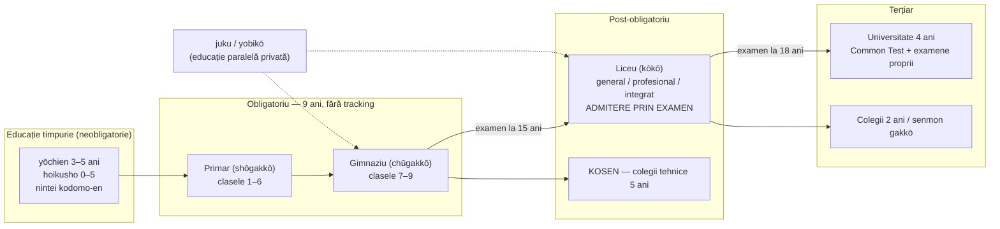

↑ [[00 Index - Analiza comparată internațională]] · [[00 MOC - Fundamentele științelor educației]]

> [!abstract] Pe scurt
> 1. **De ce contează**: Japonia este singurul sistem mare din OCDE care, timp de 25 de ani, a rămas constant în grupul de vârf la PISA și TIMSS. În **PISA 2025** (publicat pe 8 septembrie 2026) a fost **pe locul 1 în OCDE la toate cele trei domenii**, pentru prima dată de la începutul programului (științe 538, matematică 525, citire 503). Pe lângă performanță, are și **echitate socio-economică ridicată**: statutul socio-economic explică doar 8% din variația scorurilor la științe, față de 12% în OCDE.
> 2. **Formula**: un **curriculum național** detaliat (*Gakushū Shidō Yōryō*), revizuit cam o dată la 10 ani, plus o **profesie didactică ce se perfecționează colectiv** prin **lesson study** (*jugyō kenkyū*), plus o **educație holistă** (*tokkatsu*: consiliul clasei, curățenia școlii, prânzul servit de elevi), totul într-o **școală obligatorie de 9 ani fără repartizare pe niveluri**, finanțată egal.
> 3. **Tensiunea de fond**: între **conținut și examene** (moștenirea Meiji și „iadul examenelor”) și **„puterea de a trăi”** (*ikiru chikara*), adică educația centrată pe copil (Taishō, 1947, *yutori*). Politica a oscilat între cele două: *yutori* (1977–2002) → „șocul PISA” (2004) → revenirea la conținut (2008) → sinteza din 2017: învățare **proactivă, interactivă și profundă**.
> 4. **Fundamentele manualului puse în practică**: **idealul educațional** este codificat în lege (Legea fundamentală a educației, 1947/2006); **educația integrală** este instituționalizată (morală, intelectuală, fizică, estetică, prin *tokkatsu* și *kyūshoku*); învățarea pe tot parcursul vieții are infrastructură proprie (*kōminkan*, 1946); **proiectarea curriculară** e ierarhizată (stat → școală → lecție).
> 5. **Contribuția globală**: **lesson study**, popularizat în Occident de Stigler & Hernandez (*The Teaching Gap*, 1999), este azi unul dintre cele mai răspândite modele de dezvoltare profesională din lume. **Tokkatsu** a fost exportat în Egipt (școlile EJS, din 2018).
> 6. **Umbra sistemului**: educația paralelă (*juku*, *yobikō*), presiunea examenelor la 15 și la 18 ani, **absenteismul școlar record** (*futōkō*: 353.970 de elevi în primar și gimnaziu în anul școlar 2024), **bullying** (769.022 de cazuri identificate în 2024), **cele mai lungi ore de lucru ale profesorilor** din TALIS și un **deficit de cadre** (80% dintre elevi învață în școli unde directorul semnalează lipsă de profesori, față de 39% în OCDE, PISA 2025).
> 7. **Semnale noi**: în PISA 2025 **ponderea elevilor slabi a crescut** la toate cele trei domenii (la citire, de la 13,8% la 18,6%), iar elevii japonezi raportează **autoreglare slabă**: doar 21% își planifică des modul de a învăța, față de o medie OCDE de 37%.
> 8. **Pentru Republica Moldova**: se pot prelua **mecanismele** (lesson study, *tokkatsu*, standardele egale de finanțare și de personal, curriculumul revizuit pe baza datelor). **Nu** se poate prelua **contextul** (omogenitatea culturală, statutul social al profesorului, bugetul, rețeaua de meditații).

---

## 1. Profil și date-cheie

| Indicator | Valoare | Sursă / observații |
|---|---|---|
| **Populație** | ≈123,4 mil. (2025), în scădere din 2008 | Banca Mondială (SP.POP.TOTL) |
| **Nașteri** | 686.061 în 2024, prima dată sub 700.000 | Ministerul Sănătății, Muncii și Bunăstării (MHLW), statistica vitală (de verificat cifra finală) |
| **Minister** | MEXT (*Monbu Kagakushō*): Ministerul Educației, Culturii, Sportului, Științei și Tehnologiei, format în 2001 | Pentru educația timpurie, rolul e împărțit cu **Agenția pentru Copii și Familii** (*Kodomo Katei-chō*, 2023) |
| **Structura** | **6-3-3-4**: primar 6 ani (6–12), gimnaziu 3 ani (12–15), liceu 3 ani (15–18), universitate 4 ani | Introdusă prin Legea educației școlare (1947) |
| **Obligativitate** | **9 ani** (6–15 ani), ISCED 1–2 | Există și școli integrate de 9 ani (*gimu kyōiku gakkō*, din 2016) și școli secundare de 6 ani (*chūtō kyōiku gakkō*, din 1999) |
| **Educația timpurie** | *yōchien* (grădinițe, MEXT), *hoikusho* (creșe/centre de îngrijire), *nintei kodomo-en* (centre integrate, din 2006) | Gratuitate pentru 3–5 ani din **octombrie 2019** |
| **Liceu** | Neobligatoriu, dar urmat de circa 98–99% din generație; admitere prin **examen** | Taxa de școlarizare la liceele publice e acoperită de stat din 2010, cu extinderi ulterioare |
| **Terțiar** | Rata brută de înscriere ≈64,5% (2023); peste 80% dacă se includ colegiile profesionale (*senmon gakkō*) | Banca Mondială/UIS; MEXT (a doua cifră e aproximativă) |
| **Cheltuieli publice** | ≈**3,3% din PIB** (2021), sub media OCDE; pondere mare a finanțării private, mai ales în terțiar și în meditații | UIS via Banca Mondială (SE.XPD.TOTL.GD.ZS). Cifra EAG pentru cheltuiala totală (publică+privată): de verificat |
| **Guvernanță** | **Centralizare curriculară** (MEXT fixează curriculumul și aprobă manualele) + **administrare prefecturală/municipală** (consilii școlare, *kyōiku iinkai*) | Salariile profesorilor din învățământul obligatoriu: 1/3 de la stat (1/2 până în 2006), 2/3 de la prefecturi |
| **Personalul** | Profesorii publici sunt angajați de **prefectură** și **rotiți** între școli la câțiva ani | Norme naționale de personal (Legea standardelor, 1958) |
| **Mărimea clasei** | Maximum 35 de elevi în primar (introdus treptat 2021–2025) și în gimnaziu (din anul fiscal 2026) | MEXT, 2025 |

---

## 2. Traiectoria PISA 2000–2025

### 2.1 Scorurile medii și poziția în OCDE

> [!info] Sursele datelor
> Scorurile și pozițiile Japoniei în OCDE provin din seria oficială MEXT/NIER (*PISA2025のポイント*, 8 septembrie 2026, p. 5), construită pe baza rapoartelor OCDE. Pentru 2000–2003, pozițiile marcate cu „~” sunt aproximative. Media OCDE este media țărilor membre participante în acel ciclu. **Comparabilitate**: citirea e comparabilă din 2000, matematica din 2003, științele din 2006. În 2015 testul a trecut pe calculator.

| Ciclu | Citire: JP / OCDE | Matematică: JP / OCDE | Științe: JP / OCDE | Loc în OCDE (C / M / Ș) | Context |
|---|---|---|---|---|---|
| **2000** | 522 / 500 | 557 / 500 | 550 / 500 | 8 / ~1 / ~2 | Înainte de reforma *yutori* din 2002 |
| **2003** | **498** / 494 | 534 / 500 | 548 / 500 | 12 / 4 / ~2 | Publicat în decembrie 2004: **„șocul PISA”** |
| **2006** | 498 / 492 | 523 / 498 | 531 / 500 | 12 / 6 / 3 | Minimul istoric; se decide revizuirea curriculumului |
| **2009** | 520 / 493 | 529 / 496 | 539 / 501 | 5 / 4 / 2 | Curriculumul 2008 se introduce treptat din 2009 |
| **2012** | **538** / 496 | 536 / 494 | 547 / 501 | **1** / 2 / **1** | Vârf la citire |
| **2015** | 516 / 493 | 532 / 490 | 538 / 493 | 6 / **1** / **1** | Trecerea la test pe calculator |
| **2018** | 504 / 487 | 527 / 489 | 529 / 489 | 11 / **1** / 2 | Scădere la citire; utilizare digitală școlară minimă în OCDE → **GIGA** |
| **2022** | 516 / 476 | 536 / 472 | 547 / 485 | 2 / **1** / **1** | După pandemie, Japonia crește în timp ce OCDE scade. Pe total participanți: M 5, C 3, Ș 2 |
| **2025** | 503 / 461 | 525 / 463 | 538 / 482 | **1 / 1 / 1** | Primul „triplu 1” în OCDE. Pe total (91 de participanți): C 4, M 5, Ș 5. **Citirea scade semnificativ (–13)** |

> [!note] PISA 2025: ce e nou (OECD, *Country Note Japan*; MEXT/NIER, 2026)
> - **Tendința**: față de 2022, Japonia rămâne stabilă la matematică și științe (scăderile nu sunt semnificative statistic) și scade semnificativ la citire. Pe termen lung **nu există o direcție clară**: rezultatele fluctuează în jurul mediei istorice, în timp ce media OCDE atinge **cel mai scăzut nivel înregistrat** la toate domeniile.
> - **Nivelurile de competență 2025** (în paranteză, media OCDE): ≥ nivelul 2 la științe **89%** (74%), la matematică **84%** (65%), la citire **81%** (69%). Performeri de top (nivel 5–6): matematică **22%** (8%), științe **17%** (7%), citire **11%** (6%).
> - **Semnal de alarmă**: ponderea elevilor la nivelul 1 sau mai jos **a crescut semnificativ la toate cele trei domenii** între 2022 și 2025: științe 8,0 → 11,3%, matematică 12,0 → 16,1%, citire 13,8 → 18,6% (MEXT/NIER). Ponderea celor de top a rămas stabilă, deci **distribuția s-a lărgit**.
> - **Rezolvarea computațională a problemelor** (domeniul inovator *Learning in the Digital World*): Japonia e **pe locul 1 în OCDE** și 4 pe total, cu 557 de puncte.
> - La citire, NIER observă o scădere la itemii de **fluență** (citire rapidă și corectă) și, în schimb, o **creștere** la itemii de „evaluare și reflecție”.

### 2.2 Echitatea (PISA 2025)

| Indicator | Japonia | Media OCDE |
|---|---|---|
| Variația la științe explicată de statutul socio-economic (ESCS) | **8%** | 12% |
| Diferența la științe între elevii avantajați (quartila de sus) și cei dezavantajați | **71 de puncte** | 85 de puncte |
| **Elevi reziliență** (dezavantajați care ajung în quartila de top a țării) | 13% | 12% |
| Evoluția decalajului socio-economic 2015–2025 | **stabil** | în scădere, dar pentru că elevii avantajați au pierdut puncte |

OCDE plasează Japonia printre cele opt sisteme care combină **incluziune ridicată** (peste 75% dintre elevi la nivelul 2 sau mai sus la științe), **echitate** (sub 10% din variație explicată de ESCS) și scoruri peste media OCDE, alături de B-S-J-Z (China), Canada, Estonia, Irlanda, Coreea, Lituania și Macao (*PISA 2025 Results, Vol. I*, cap. 2). Elevii japonezi aflați în quartila internațională 3 de ESCS (46% dintre elevi) au obținut 537 de puncte la științe, **unul dintre cele mai bune scoruri** pentru acest nivel socio-economic.

> [!warning] Nuanțare
> Echitatea măsurată **între școli** la 15 ani e ridicată pentru că școala obligatorie este comprehensivă. **Diferențierea puternică începe la 15 ani**, prin examenul de admitere la liceu, care ierarhizează liceele după scorul de selecție (*hensachi*). Pe lângă asta, accesul la *juku* depinde de venit. Cercetători precum **Kariya Takehiko** susțin că inegalitatea e „ascunsă” de mitul egalitarist (vezi §7).

### 2.3 Atitudini, bunăstare, climat (PISA 2025)

| Indicator | Japonia | OCDE |
|---|---|---|
| Curiozitate („sunt curios în legătură cu multe lucruri”) | 63% | 73% |
| Efort suplimentar când sarcina devine grea | 48% | 60% |
| „Școala a fost o pierdere de timp” | **6%** | 24% |
| Mentalitate de creștere (*growth mindset*) | 76% | 69% |
| Își planifică des sau foarte des modul de a învăța | **21%** | 37% |
| Își pun întrebări ca să verifice dacă au înțeles | 31% | 49% |
| Victime ale bullyingului de câteva ori pe lună sau mai des | 16% (în creștere față de 2022) | 20% |
| Chiul (cel puțin o zi în ultimele două săptămâni) | **3%** | 22% |
| Colegi distrași de dispozitive digitale la orele de științe | **7%** | 28% |
| Folosesc chatboți AI pentru învățare cel puțin săptămânal | 27% | 46% |
| Profesorul continuă explicația până când elevii înțeleg | 84% | 66% |
| Lipsă de profesori semnalată de director | **80%** (64% în 2022) | 39% |
| Satisfacție cu viața („mulțumit” sau „foarte mulțumit”) | 68,9% (50,2% în 2018; 61,1% în 2015) | ≈ similar |

Surse: OECD, *PISA 2025 Results (Volume I): Japan*; MEXT/NIER, *PISA2025のポイント*. Sentimentul de apartenență la școală este peste media OCDE; implicarea suportivă a familiei este sub medie (NIER).

> [!tip] Lectura corectă
> Profilul japonez arată **disciplină și climat excelent**, **încredere în școală** și **sprijin din partea profesorului**, dar și **curiozitate mai scăzută, autoreglare slabă și încredere redusă în sine**. TIMSS 2023 confirmă tiparul: scade ponderea elevilor care se consideră „buni la matematică/științe”. Este paradoxul clasic din literatura comparată: rezultate de top însoțite de autoevaluare modestă.

### 2.4 TIMSS (IEA) și PIRLS

| TIMSS 2023 | Scor | Loc |
|---|---|---|
| Matematică, clasa a IV-a | 591 | 5 / 58 |
| Științe, clasa a IV-a | 555 | 6 / 58 (scădere semnificativă față de 2019) |
| Matematică, clasa a VIII-a | 595 | 4 / 44 |
| Științe, clasa a VIII-a | 557 | 3 / 44 (scădere semnificativă față de 2019) |

Sursa: MEXT/NIER, *TIMSS2023の結果（概要）のポイント* (4 decembrie 2024). Japonia participă la TIMSS din 1995 (și la studiile IEA anterioare din anii 1960–1980) și e constant în grupul de vârf. **Japonia nu participă la PIRLS.** Există și o diferență de gen notabilă în interesul pentru matematică și științe, în favoarea băieților (TIMSS 2023).

---

## 3. Cronologia reformelor

### 3.1 Rădăcini premoderne și moderne (până în 1945)

| An | Reformă / eveniment | Ideea | Legătura cu fundamentele |
|---|---|---|---|
| sec. XVII–1868 | Școlile **terakoya** (școli populare de citit-scris-socotit), școlile feudale (*hankō*) și academiile private (*shijuku*) | Rețea densă, neetatizată. *Nihon kyōikushi shiryō* (MEXT, 1890–1892) numără **peste 16.000** de *terakoya*, cifră considerată subestimată. Ronald Dore (*Education in Tokugawa Japan*, 1965) estimează o școlarizare largă pentru epoca premodernă | **Educație nonformală** comunitară; instruire **individualizată** (fără clase pe vârste); capital cultural preexistent modernizării |
| **1872** | Legea **Gakusei** (Codul educației) | Primul sistem școlar național, după model francez (8 districte universitare, 53.760 de școli primare planificate); școlarizare pentru toți, „fără deosebire de rang sau sex” | Trecerea la **sistemul de învățământ** de stat (Modulul 08); pedagogia **clasică** importată |
| 1879 / 1886 | Ordonanța educației; **Ordonanțele școlare** ale lui Mori Arinori | Ierarhia primar–mediu–școală normală–universitate imperială | Formarea **profesorilor** în școli normale (Modulul 09) |
| 1887–1890 | Emil Hausknecht predă la Universitatea Imperială din Tokyo | Didactica **herbartiană** (treptele formale) intră în școlile normale | Rădăcina tradiției **Didaktik** și a lecției structurate |
| **1890** | **Rescriptul imperial asupra educației** (*Kyōiku Chokugo*, 30 octombrie) | 315 caractere; virtuți confucianiste (pietate filială, loialitate) subordonate împăratului. Citit la ceremonii, memorat | **Ideal educațional** naționalist-moral (Modulul 04); educația morală ca **îndoctrinare** |
| 1900–1907 | Gratuitate; obligativitatea extinsă la 6 ani (1907) | Școlarizarea primară depășește 90% în jurul anului 1900 | Democratizarea accesului |
| **1917–1930** | **Educația liberă Taishō** (*Taishō jiyū kyōiku*): școala Seijō (Sawayanagi Masatarō, 1917, Planul Dalton), Jiyū Gakuen (Hani Motoko, 1921), școala-sat Ikebukuro (1924), școli normale publice din Akashi, Nara, Chiba; conferința „Opt mari propuneri educaționale” (1921) | Educația **centrată pe copil**, individualitate, activitate. Dewey conferențiază în Japonia în 1919 | **Paradigma modernă / Educația nouă** (Modulul 02); precursor al *lesson study* în școlile-anexă |
| anii 1930 | Mișcarea **seikatsu tsuzurikata** (compunerea despre viața reală) | Elevii scriu despre propria viață și sărăcie | Precursor al **pedagogiei critice** |
| 1941–1945 | Școlile naționale (*kokumin gakkō*) și militarizarea | Educația subordonată războiului | Contraexemplu: **finalități** totalitare |

### 3.2 Epoca postbelică și contemporană

| An | Reformă / lege / program | Ideea | Legătura cu fundamentele |
|---|---|---|---|
| **1946** | Raportul **Misiunii educaționale americane** (martie); înființarea **kōminkan** (centrele comunitare de învățare) | Democratizare, descentralizare, educația adulților | **Educația permanentă** instituționalizată (Modulul 03) |
| **1947** | **Legea fundamentală a educației** (31 martie) + **Legea educației școlare** (sistemul 6-3-3-4, obligativitate 9 ani, coeducație); primul *Curriculum* (în 1947 cu titlul „proiect”, *shian*); disciplina **studii sociale** | Scopul: „desăvârșirea personalității” într-o societate democratică și pașnică | **Idealul educațional** democratic codificat; paradigma **progresivistă**, curriculum „al experienței de viață” |
| 1948 / 1956 | Consilii școlare **alese** → **numite** (1956) | „Cursul invers” (*gyaku kōsu*): recentralizare | Tensiunea descentralizare–centralizare (Modulul 08) |
| **1958** | Curriculumul devine **normativ** (publicat în Monitorul oficial al ministerului); se reintroduce **ora de educație morală** | Trecerea de la experiență la **sistematicitatea disciplinelor** | Paradigma **clasică**/disciplinară; conflict cu sindicatul Nikkyōso |
| 1968–1970 | „Modernizarea conținuturilor” (reacție la Sputnik); ia naștere categoria **tokkatsu** (activități speciale) | Conținut dens, ritm alert. Critici: „educația de tip Shinkansen”, elevi rămași în urmă (*ochikobore*) | Supraîncărcarea curriculară |
| 1977 | Curriculumul „**ținerii și împlinirii**” (*yutori to jūjitsu*) | Reducerea conținuturilor și a orelor | Începutul ***yutori*** |
| **1984–1987** | **Consiliul ad-hoc pentru educație** (*Rinkyōshin*, guvernul Nakasone) | „Principiul individualității”, **trecerea la un sistem de învățare pe tot parcursul vieții**, adaptare la internaționalizare și informatizare; propunerea de liberalizare a pieței (inclusiv legalizarea *juku*) este respinsă | **Educația permanentă** ca principiu de sistem; primele idei neoliberale |
| 1989 / 1990 | Curriculumul „**noii viziuni asupra performanței**” (*shin gakuryoku-kan*); disciplina „**viața**” (*seikatsu-ka*) în clasele 1–2; **Legea promovării învățării pe tot parcursul vieții** (1990) | Motivație, interes, atitudine | **Integrarea curriculară**; educația permanentă |
| **1996** | Raportul Consiliului Central al Educației: ***ikiru chikara*** („puterea de a trăi”, *zest for living*) | Echilibru între **performanța solidă** (*tashika na gakuryoku*), **o umanitate bogată** și **sănătate/vigoare fizică** | **Educația integrală** (Modulul 06): intelectual–moral–fizic |
| **1998 → 2002** | Curriculumul *yutori*: circa 30% conținut eliminat, **săptămâna de 5 zile**, **Timpul pentru studii integrate** (*Sōgōteki na gakushū no jikan*), evaluare criterială (*zettai hyōka*) în locul celei normative | Învățare prin investigație, pe teme transdisciplinare (mediu, internațional, informație, bunăstare) | **Noile educații** (Modulul 07); **învățarea prin proiecte**; **evaluarea criterială** |
| 2001 | Apelul „Îndemn la învățare” (*Manabi no susume*, ministrul Tōyama) | Curriculumul e un **standard minim** | Primul pas de corecție |
| **Dec. 2004 / 2007** | Publicarea PISA 2003 („șocul PISA”), apoi PISA 2006 | Dezbatere publică despre „declinul performanței” | Politica devine **sensibilă la date** |
| **2006** | **Revizuirea Legii fundamentale a educației** (22 decembrie) | Adaugă spiritul public, moralitatea, respectul pentru tradiție și „dragostea față de țară și ținutul natal”, **învățarea pe tot parcursul vieții** (art. 3), responsabilitatea **familiei** (art. 10), cooperarea școală–familie–comunitate (art. 13), **planuri naționale de promovare a educației** | **Idealul educațional** reformulat; controverse privind patriotismul |
| **2007** | **Evaluarea națională a performanței școlare** (*Zenkoku Gakuryoku Gakushū Jōkyō Chōsa*), în clasele a VI-a și a IX-a; modificarea celor „trei legi ale educației” | Monitorizare de sistem; autoevaluarea școlii devine obligatorie | **Responsabilizare** blândă (fără clasamente oficiale ale școlilor) |
| **2008 → 2011** | Curriculumul „**post-yutori**”: +10% ore la disciplinele de bază, **activități de limba engleză** în clasele V–VI, reducerea orelor de studii integrate | „Nici *yutori*, nici tocire: puterea de a trăi” | Reechilibrare conținut–competențe |
| 2009–2022 | Reînnoirea obligatorie a licenței didactice la 10 ani | Introdusă ca măsură de calitate; **abolită în 2022**, înlocuită de un sistem de **istoric al formărilor** | Lecție despre **profesionalism** vs. control |
| 2013 | Legea privind prevenirea bullyingului | Proceduri școlare obligatorii, anchete la „cazuri grave” | **Bunăstarea** ca obligație legală |
| 2014 | Ratificarea Convenției ONU privind drepturile persoanelor cu dizabilități (CRPD) | Educația incluzivă (în prealabil, *tokubetsu shien kyōiku* din 2007) | **Educația incluzivă** |
| **2015 → 2018/2019** | Educația morală devine „**disciplină specială**” (*Tokubetsu no kyōka dōtoku*): primar 2018, gimnaziu 2019, cu manuale aprobate și evaluare descriptivă | „Morală care gândește și discută” (*kangaeru, giron suru dōtoku*) | **Educația morală** (Modulul 06), între caracter și îndoctrinare |
| 2016 | Legea asigurării oportunităților educaționale (pentru elevii care nu frecventează școala) | Recunoaște **nevoia de odihnă** și căile alternative (școli libere, centre de sprijin) | Educație nonformală legitimată |
| **2017 → 2020/21/22** | Curriculumul actual: **trei piloni ai calităților și abilităților**; **învățare proactivă, interactivă și profundă** (*shutaiteki, taiwateki de fukai manabi*); **curriculum „deschis societății”**; **managementul curriculumului** la nivel de școală; engleza devine disciplină în clasele V–VI (2020); **programare** în primar (2020); la liceu, **Timpul pentru investigație integrată** și disciplina „**Kōkyō**” (Public) (2022) | Competențe pentru „Society 5.0” | **Taxonomia competențelor** (Modulul 04); **socioconstructivism**; **proiectare curriculară** (Modulul 10) |
| **2019 / 2020** | **GIGA School Program** (decembrie 2019), accelerat de pandemie: **un dispozitiv per elev** + rețele de mare viteză | Răspuns la PISA 2018 (utilizare digitală școlară minimă în OCDE) | **Educația tehnologică/digitală** |
| 2019 | Educație timpurie gratuită (3–5 ani); din 2020, sprijin pentru studii superioare pentru familiile cu venituri mici | Echitate de acces | **Educația timpurie**; **echitate** |
| **2021** | Raportul „**Educația școlară japoneză a erei Reiwa**”: **învățare optimizată individual + învățare colaborativă**; **Common Test** pentru admiterea la universitate (înlocuiește Center Test); clase de 35 de elevi în primar | Personalizare fără pierderea dimensiunii colective | **Diferențiere**; evaluare de sistem |
| 2023 | Agenția pentru Copii și Familii; Legea fundamentală a copilului; **planul COCOLO** privind absenteismul; **al 4-lea Plan de bază pentru promovarea educației** (2023–2027): „*well-being* în stil japonez” și „creatori ai unei societăți sustenabile” | Bunăstarea devine finalitate explicită | **Noile educații**: sănătate mintală, SEL |
| 2024 | Platforma națională de formare a profesorilor **Plant** | Formare continuă documentată | Dezvoltare profesională |
| **2025** | **Revizuirea legii Kyūtoku** (11 iunie): sporul salarial fix al profesorilor crește de la 4% la **10%**, cu 1% pe an între 2026 și 2031; plus țintă de reducere a orelor suplimentare la circa 30 de ore pe lună până în anul fiscal 2029 | Răspuns la criza de personal | Statutul și atractivitatea profesiei (Modulul 09) |
| 2026 | Clase de 35 în gimnaziu; PISA 2025 publicat; **următorul Curriculum** în dezbatere la Consiliul Central al Educației (ore ajustabile, autoreglarea învățării, o nouă disciplină „Informație și tehnologie” în gimnaziu, alfabetizare media) | Curriculum flexibil, autoreglare, AI | Ciclul de revizuire decenală continuă (calendarul exact: de verificat) |

```mermaid
flowchart LR
    A["1872 Gakusei<br/>stat modern"] --> B["1890 Rescriptul<br/>morală imperială"]
    B --> C["1917–30 Taishō<br/>educația nouă"]
    C --> D["1947 Legea fundamentală<br/>6-3-3-4, democrație"]
    D --> E["1958 curriculum normativ<br/>disciplinar"]
    E --> F["1977–2002 yutori<br/>ikiru chikara"]
    F --> G["2004 șocul PISA"]
    G --> H["2006 Legea revizuită<br/>2008 +conținut"]
    H --> I["2017 învățare proactivă,<br/>interactivă, profundă"]
    I --> J["2019 GIGA<br/>2021 Reiwa"]
    J --> K["2025 Kyūtoku<br/>2026 PISA 2025"]
```

---

## 4. Implementarea fundamentelor, dimensiune cu dimensiune

### 4.1 Statutul științelor educației, cercetarea și politica bazată pe dovezi
→ [[Modulul 01 - Statutul științelor educației]] · [[Modulul 05 - Paradigmele pedagogiei și cercetarea pedagogică]]

- **Infrastructura de cercetare**: **NIER** (Institutul Național pentru Cercetarea Politicilor Educaționale, fondat în 1949, cu numele actual din 2001) administrează PISA, TALIS și TIMSS în Japonia și **Evaluarea națională a performanței** și produce analize pentru MEXT. Mai contribuie: facultățile de științele educației ale universităților Tokyo, Hiroshima, Tsukuba (fosta Școală Normală Superioară din Tokyo) și Kyoto; universitățile pedagogice (ex. **Tokyo Gakugei**, cu proiectul IMPULS de lesson study); societăți științifice (Japan Educational Research Association, 1941; Japan Society of Educational Sociology); fundații private (Benesse Educational Research and Development Institute).
- **Cercetarea-acțiune a practicienilor**: specificul japonez este că **profesorii înșiși produc cunoaștere pedagogică** prin *jugyō kenkyū*. Școlile-anexă ale universităților (*fuzoku gakkō*) organizează **lecții publice** la care participă sute de profesori. În cultura lesson study, lecțiile naționale de cercetare pot influența revizuirile curriculumului. Este o epistemologie a **cunoașterii practice**, apropiată de „practicianul reflexiv” al lui Schön.
- **Politica bazată pe dovezi (EBPM)**: guvernul a adoptat oficial principiul EBPM la sfârșitul anilor 2010. Economista **Nakamuro Makiko** (*Economia performanței școlare*, 2015) a popularizat studiile cauzale, dar **studiile randomizate rămân rare**, iar deciziile majore (*yutori*, post-*yutori*) s-au luat mai degrabă pe baza **dezbaterii publice și a datelor internaționale descriptive** decât pe baza evaluărilor de impact.
- **Consiliul Central al Educației** (*Chūkyōshin*) este mecanismul consultativ prin care experți, practicieni și reprezentanți ai societății elaborează rapoartele pe baza cărora se revizuiește curriculumul. Procesul este **lent și consensual** (aproximativ doi ani pe revizuire).

> [!warning] Critică
> Kariya Takehiko (*Iluzia reformei educaționale*, 2002) a criticat faptul că reformele *yutori* s-au bazat pe **intuiții** („școala e prea stresantă”) fără verificare empirică. De cealaltă parte, „șocul PISA” din 2004 a fost la rândul lui o **suprainterpretare** a unei scăderi parțial explicate de schimbări metodologice și de mărirea eșantionului de țări. Ambele episoade arată limitele unei politici conduse de **narațiuni mediatice**.

### 4.2 Paradigme pedagogice: clasic, modern, postmodern
→ [[Modulul 02 - Clasic, modern și postmodern în educație]]

| Strat | Epoca | Ce a lăsat în sistemul actual |
|---|---|---|
| **Confucianism + terakoya** | Edo | Respectul pentru învățare și efort, **exercițiul** (caligrafie, recitare), rolul moral al profesorului (*sensei*) |
| **Clasic modern** (Herbart, Pestalozzi importat prin SUA) | Meiji | Lecția structurată, școlile normale, manualele uniforme, centralizarea |
| **Educația nouă** (Dewey, Parkhurst, Montessori) | Taishō; 1947 | Învățarea activă, școlile-anexă ca laboratoare, tradiția *lesson study* |
| **Disciplinar-sistematic** | 1958–1970 | Sistematicitatea conținuturilor, manualele aprobate |
| **Umanist-postmodern** (individualitate, *ikiru chikara*) | 1977–2008 | Studiile integrate, evaluarea criterială, educația timpurie centrată pe joc |
| **Competențe + socioconstructivism** | 2017– | Trei piloni, învățare proactivă, interactivă și profundă, managementul curriculumului |

**Specificul japonez**: noile straturi **nu le-au înlocuit pe cele vechi**, s-au **sedimentat peste ele**. O lecție tipică de matematică în primar (*structured problem solving*) combină **problema deschisă** (moștenirea progresivistă), **munca individuală** și **discuția colectivă a soluțiilor** (*neriage*, „frământarea” ideilor), **scrisul sistematic pe tablă** (*bansho*, moștenire herbartiană) și **concluzia formulată de profesor** (*matome*). Stigler & Hernandez (1999) au descris-o drept un „scenariu cultural” distinct de modelul american (demonstrație urmată de exercițiu) și de cel german (dezvoltarea ghidată a conceptului).

### 4.3 Formele educației: formal, nonformal, informal; învățarea pe tot parcursul vieții; autoeducația
→ [[Modulul 03 - Formele generale ale educației]] · [[3.6 Educația permanentă și autoeducația]] · [[Autoeducația - teorii, autori și corelări]]

| Formă | Instituții și practici japoneze |
|---|---|
| **Formală** | Școala 6-3-3-4; *kōsen* (colegii tehnice); școli de noapte (*yakan chūgakkō*) pentru adulți fără gimnaziu |
| **Nonformală** | ***Kōminkan*** (centre comunitare de învățare, create în 1946, reglementate de Legea educației sociale din 1949; peste 13.000, cifră aproximativă); biblioteci și muzee; ***juku*** și ***yobikō*** (meditații și pregătire pentru admitere); **Kumon** (metodă de exersare individualizată, Osaka, 1958); cluburi sportive și culturale (*bukatsu*, aflate în curs de transfer către comunitate); cercetași; **școli libere** și **centre de sprijin educațional** pentru elevii care nu merg la școală; **cantinele pentru copii** (*kodomo shokudō*) |
| **Informală** | Familia (*kyōiku mama*, figura mamei implicate în educație; stereotip discutabil), **NHK for School** (televiziune educațională din 1959), manga educaționale, cultura lecturii |
| **Învățarea pe tot parcursul vieții** | *Rinkyōshin* (1987) → Legea din 1990 → **art. 3** din Legea fundamentală (2006); universitățile deschise (Open University of Japan) |
| **Autoeducația** | Tradiția ***shūyō*** (autocultivare morală), caietele de reflecție zilnică ale elevilor (*seikatsu nōto*), jurnalele clasei; în curriculumul 2017, „**atitudinea proactivă față de învățare**”, inclusiv **autoreglarea**, devine obiect explicit de evaluare |

> [!note] Corelare cu manualul (autoeducația)
> Manualul (p. 109–115) plasează autoeducația la capătul unui proces de interiorizare. În Japonia, **tokkatsu** și **jurnalele de reflecție** sunt instrumente de **coreglare** (grupul clasei își stabilește scopuri, le monitorizează și le evaluează), în sensul lui Hadwin, Järvelä & Miller. **Dar** PISA 2025 arată că elevii japonezi își **planifică** și își **monitorizează** individual învățarea mai rar decât media OCDE (21% față de 37%). **Interpretare** (nu fapt stabilit): un sistem puternic structurat din exterior (curriculum, profesor, *juku*) poate **substitui** parțial autoreglarea individuală. De aceea următorul curriculum pune accent explicit pe *gakushū no jiko chōsei* (autoreglarea învățării).

### 4.4 Finalitățile: ideal, scopuri, competențe
→ [[Modulul 04 - Finalitățile educației]]

**Idealul educațional** este formulat **în lege**:
- **1947**, art. 1: educația urmărește **desăvârșirea personalității** și formarea unor oameni sănătoși fizic și psihic, iubitori de adevăr și dreptate, cu simț al responsabilității, capabili să construiască un stat și o societate pașnice și democratice.
- **2006**, art. 1–2: păstrează **desăvârșirea personalității** și adaugă **cinci obiective** (parafrazate): (1) cunoaștere, cultură, căutarea adevărului, sentimente bogate și moralitate, corp sănătos; (2) dezvoltarea abilităților individuale, creativitate, autonomie, atitudine față de muncă; (3) dreptate, responsabilitate, egalitatea de gen, cooperare, spirit public; (4) respectul pentru viață și natură, protecția mediului; (5) respectul pentru tradiție și cultură, iubirea țării și a ținutului natal, respectul pentru alte țări, contribuția la pacea internațională.

**Scopuri de nivel intermediar**:
- ***Ikiru chikara*** (1996): performanță solidă, umanitate bogată, sănătate și vigoare fizică.
- **Cei trei piloni ai calităților și abilităților** (Curriculum 2017): (1) **cunoștințe și abilități**; (2) **gândire, judecată, exprimare**; (3) **motivație pentru învățare și umanitate** (*manabi ni mukau chikara, ningensei*). Evaluarea la clasă se face pe **trei perspective** corespunzătoare: cunoștințe/abilități, gândire/judecată/exprimare, **atitudine proactivă față de învățare**.
- **Educația timpurie**: Ghidul pentru grădinițe (2017) definește **„10 imagini ale copilului la sfârșitul educației timpurii”** (autonomie, cooperare, conștiință morală, relația cu comunitatea, gândire, respect pentru natură, interes pentru numere și litere, comunicare verbală, expresivitate etc.), ca punte spre școală.
- **Pe plan internațional**: Japonia a fost partener principal în proiectul OCDE ***Future of Education and Skills 2030*** (lansat în 2015), iar conceptul de ***well-being*** din Planul de bază 2023–2027 este influențat de acest cadru.

> [!tip] Lecție
> Structura japoneză **lege → ideal → trei piloni → obiective pe discipline → evaluare pe trei perspective** este o ilustrare aproape didactică a lanțului **ideal → scop → obiective** din manual. **Coerența verticală** (aceleași trei perspective apar în curriculum, manuale, fișele de evaluare și lesson study) este un avantaj major față de sistemele în care cadrul de competențe rămâne declarativ.

### 4.5 Dimensiunile educației
→ [[Modulul 06 - Dimensiunile generale ale educației]]

| Dimensiune | Implementare |
|---|---|
| **Morală / caracter** | Ora de morală (din 1958), disciplină specială din 2018/2019; **tokkatsu**; morala e integrată în întreaga viață școlară (salutul, responsabilitățile de serviciu, curățenia). Controversă: continuitatea cu *shūshin* (morala imperială) și tema patriotismului |
| **Intelectuală** | Curriculum național dens la matematică și științe; **manuale aprobate** subțiri, dar precise; *structured problem solving*; *kyōzai kenkyū* (studiul aprofundat al materialului didactic) |
| **Tehnologică / digitală** | GIGA (un dispozitiv per elev); programare din 2020; disciplina „Informație” obligatorie la liceu și inclusă din 2025 în Common Test; ghid pentru **AI generativ** în școli (2023, revizuit ulterior); **Super Science High Schools** (din 2002) |
| **Estetică** | Muzica și artele sunt obligatorii în primar și gimnaziu; caligrafie (*shosha*); **festivaluri școlare** (*bunkasai*), coruri |
| **Psihofizică** | Educație fizică zilnică și **ziua sportului** (*undōkai*); **prânzul școlar** (*kyūshoku*, Legea din 1954) și **educația alimentară** (*shokuiku*, Legea fundamentală din 2005, cu **profesori-nutriționiști** din 2005); controale medicale anuale; drumul spre școală pe jos, în grupuri de elevi |

### 4.6 „Noile educații”
→ [[Modulul 07 - Noile educații]]

| „Nouă educație” | Implementare japoneză |
|---|---|
| **Educația pentru cetățenie** | Disciplina „Kōkyō” (liceu, 2022); **educația pentru calitatea de cetățean-suveran** (*shukensha kyōiku*) după coborârea vârstei de vot la 18 ani (2016); **consiliul clasei** și consiliul elevilor în *tokkatsu*. Critică: neutralitatea politică strictă a profesorilor limitează dezbaterea controversată |
| **Educația pentru pace** | Hiroshima și Nagasaki, excursiile școlare (*shūgaku ryokō*) la Hiroshima și Okinawa; tradiția sindicatului Nikkyōso („nu vom mai trimite copiii la război”); controversele despre manualele de istorie (procesele lui **Ienaga Saburō**, 1965–1997) |
| **Educația pentru mediu / ESD** | Japonia a propus **Deceniul ONU pentru educație pentru dezvoltare durabilă** (2005–2014); rețeaua **UNESCO ASPnet** e mare în Japonia; PISA 2025: 89% dintre elevi au competențe de bază în **științele mediului** (OCDE: 74%) |
| **Educația pentru riscuri și dezastre** | Exerciții periodice; după cutremurul și tsunami-ul din 2011, educația pentru prevenirea dezastrelor (*bōsai kyōiku*) a devenit prioritate |
| **Educația media / digitală** | Etica informației (*jōhō moraru*); următorul curriculum propune verificarea veracității și a părtinirii informației și „distanța sănătoasă” față de digital |
| **SEL / sănătate mintală** | Consilieri școlari și asistenți sociali școlari; **monitorizarea stării emoționale pe tabletă**; planul COCOLO (2023); prevenirea sinuciderii (413 elevi s-au sinucis în anul școlar 2024, după MEXT) |
| **Educația interculturală** | Predarea japonezei pentru copiii străini (număr în creștere); **JET Programme** (asistenți de limbă străină, din 1987) |
| **Educația pentru familie** | Economia casnică obligatorie pentru ambele sexe în gimnaziu (din 1993) și liceu (din 1994); rolul familiei în art. 10 al Legii fundamentale (2006) |

### 4.7 Sistemul și managementul
→ [[Modulul 08 - Sistemul de educație și managementul educației]]

- **Centralizare curriculară + descentralizare administrativă**: MEXT stabilește Curriculumul (obligatoriu din punct de vedere juridic, confirmat de Curtea Supremă) și aprobă manualele. Consiliile școlare municipale **aleg manualele** dintr-o listă aprobată; consiliile prefecturale **angajează și rotesc** profesorii.
- **Reforma din 2015 a consiliilor școlare**: primarii capătă un rol mai mare (**consiliul general al educației**), iar funcția de conducere a consiliului e unificată.
- **Finanțarea echitabilă**: **Legea standardelor de personal** (1958) fixează numărul de profesori după numărul de elevi și de clase, iar statul plătește o treime din salarii. Consecința: **aceleași condiții de bază** în Tokyo și într-un sat din Hokkaidō. Este unul dintre factorii cel mai des invocați pentru echitatea măsurată de PISA.
- **Fără tracking în școala obligatorie**: fără repetenție (promovare automată), fără grupe de nivel formale (există totuși grupe pe niveluri la matematică în unele școli). **Selecția începe la 15 ani**.
- **Responsabilizarea**: Evaluarea națională (din 2007) **nu** produce clasamente oficiale ale școlilor; unele prefecturi (ex. Osaka) au publicat totuși rezultate, cu dezbateri aprinse. **Autoevaluarea școlii** este obligatorie (din 2007), evaluarea de către părți interesate e recomandată. Inspecția de tip Ofsted **nu** există: **consilierii de curriculum** (*shidō shuji*) au rol de sprijin.
- **Piața**: rolul pieței e **redus în școala publică** (alegerea școlii introdusă experimental, de exemplu în Shinagawa, Tokyo, în 2000, apoi limitată) și **enorm în afara ei** (*juku*, școli private mai ales în gimnaziile și liceele urbane).
- **Școlile comunitare** (*community schools*, cu consilii de administrare a școlii): posibile din 2004, promovate prin „obligația de a depune eforturi” din 2017; au ajuns la peste jumătate din școlile publice (cifra exactă: de verificat).
- **Echitatea**: gratuitatea educației timpurii (2019), sprijin pentru taxele de liceu, burse universitare. În același timp, **sărăcia copiilor** e în jur de 11–12% (cifră de verificat în sondajul MHLW).
- **Incluziunea**: *tokubetsu shien kyōiku* (2007) păstrează un sistem **paralel**: școli speciale, **clase speciale** în școlile obișnuite, **camere de sprijin** (*tsūkyū*). Comitetul ONU pentru CRPD (2022) a cerut Japoniei să **renunțe la educația specială segregată** (vezi §5).

### 4.8 Agenții educației
→ [[Modulul 09 - Agenții educației și factorii dezvoltării]]

**Profesorul**
- **Formarea inițială** e un **„sistem deschis”** (*kaihōsei*): orice universitate cu program acreditat poate elibera licență didactică. Există și universități pedagogice dedicate. Practica pedagogică e **scurtă** (câteva săptămâni). Critica veche: **multă teorie, puțină practică**. Compensația: **învățarea la locul de muncă**.
- **Recrutarea** se face prin **examen prefectural** (scris, interviu, lecție demonstrativă). Raportul candidați/posturi a scăzut dramatic: în primar a coborât în jurul pragului de 2 la 1 în ultimii ani (cifra exactă pe ani: de verificat în statisticile MEXT).
- **Inducția**: **stagiul de un an pentru debutanți** (*shoninsha kenshū*, din 1989), cu mentor.
- **Dezvoltarea profesională** se face pe **trei niveluri**: (1) **în școală** (*kōnai kenshū*), prin lesson study pe o temă de cercetare anuală a școlii; (2) **în district/prefectură**, prin centre de formare; (3) **la nivel național**, prin NITS (Instituția Națională pentru Dezvoltarea Profesorilor și Personalului Școlar). Din 2024 există platforma **Plant**, iar **istoricul formărilor** a înlocuit reînnoirea licenței.
- **Cariera**: **rotația** între școli, la câțiva ani, **distribuie expertiza** și previne concentrarea profesorilor buni în școlile privilegiate. Există trepte de carieră (profesor principal, director adjunct, director).
- **Timpul de lucru** (TALIS):
  - **2013**: 53,9 ore/săptămână (gimnaziu), față de o medie de 38,3; cel mai lung dintre țările participante.
  - **2018**: 56,0 ore (gimnaziu), față de 38,3 în OCDE; 54,4 ore în primar; din nou cele mai lungi.
  - **2024**: la profesorii cu normă întreagă, timpul a scăzut cu **circa 4 ore pe săptămână** față de 2018, atât în primar, cât și în gimnaziu (cifrele MEXT: 55,1 și 52,1 ore, față de medii internaționale de 41,0 și 40,4 ore; atribuirea exactă pe niveluri: de verificat în raportul complet). Rămâne **cel mai lung din TALIS**. Timpul de **predare** e **sub** media internațională, dar timpul pentru **pregătire, administrație și activități extracurriculare** e peste medie (MEXT, *TALIS 2024 結果*).
- **Deficitul**: sondajul MEXT din 2021 a găsit **2.558 de posturi neocupate** la începutul anului școlar. În PISA 2025, **80%** dintre elevi învață în școli unde directorul semnalează lipsă de profesori. Răspunsul: legea **Kyūtoku** (2025), cu sporul de 4% → 10%, clase mai mici, personal de sprijin, transferul cluburilor sportive către comunitate.
- **Statutul**: tradițional ridicat (*sensei*), dar TALIS 2024 arată că **puțini profesori se simt apreciați de societate și de media**.

**Directorul**: vine din rândul profesorilor, prin examen sau promovare; rol de **coordonator** al temei de cercetare a școlii și al managementului curriculumului.

**Elevul**: rol activ în **conducerea vieții școlare** (serviciul de curățenie, serviciul la prânz, consiliul elevilor, organizarea evenimentelor). În grădinițe, mai ales în cele private, profesorii intervin puțin în conflictele dintre copii ca să le permită să le **rezolve singuri** (Tobin et al., *Preschool in Three Cultures*, 1989/2009).

**Familia**: investiție mare în educație (*juku*, școli private), **asociațiile părinților și profesorilor** (PTA, cu tradiție postbelică), caietul de comunicare școală–familie (*renraku-chō*). PISA 2025: **implicarea suportivă** a familiei este **sub** media OCDE.

**Comunitatea**: *kōminkan*, școlile comunitare, voluntarii (ex. „școlile viitorului local” pentru meditații gratuite, oferite de profesori pensionari și studenți), patrulele pentru siguranța drumului spre școală.

### 4.9 Proiectarea, predarea, evaluarea
→ [[Modulul 10 - Proiectarea, realizarea și evaluarea activității educative]]

**Proiectarea în cascadă**
1. **Curriculumul național** (*Gakushū Shidō Yōryō*) + **comentariile oficiale** pe discipline (*kaisetsu*), nenormative, dar foarte influente.
2. **Manualele aprobate** (*kentei*), revizuite la circa 4 ani.
3. **Planul școlii** (*gakkō kyōiku keikaku*) și tema anuală de cercetare; **managementul curriculumului** (principiu introdus în 2017).
4. **Planul unității** și **planul de lecție detaliat** (*gakushū shidōan*), foarte elaborat în lesson study: include **răspunsurile anticipate ale elevilor**.

**Predarea la clasă** (tipar documentat de TIMSS Video Study 1995 și de literatura ulterioară):
- ***hatsumon***: întrebarea-cheie, gândită atent;
- ***jiriki kaiketsu***: elevul lucrează mai întâi singur;
- ***kikan shidō***: profesorul circulă printre bănci, observă strategiile și **alege** ce soluții vor fi discutate (evaluare formativă „din mers”);
- ***neriage***: discuție colectivă, comparând soluțiile de la cea naivă la cea elegantă;
- ***bansho***: tabla ca **istorie vizuală** a lecției;
- ***matome***: sinteza finală; uneori ***furikaeri***, reflecția elevilor în caiet.

**Evaluarea**
- **Formativă**: integrată în lecție (*shidō to hyōka no ittaika*, „unitatea dintre predare și evaluare”); din 2002 **criterială** (*zettai hyōka*).
- **Sumativă la clasă**: fișa de evaluare (*shidō yōroku*) pe **trei perspective** (vezi §4.4).
- **De sistem**: Evaluarea națională (clasele VI și IX, anual, din 2007; unele componente testate pe calculator); participarea la PISA și TIMSS.
- **Examenele cu miză mare**:
  - **admiterea la liceu** (examene prefecturale, cu o pondere variabilă a notelor școlare, *naishin*);
  - **admiterea la universitate**: **Common Test** (din 2021; Center Test 1990–2020) + **examenele proprii ale universităților**, plus o pondere **în creștere** a **admiterii pe bază de dosar și recomandare** (*sōgōgata / gakkō suisen*).
  - Pregătirea pentru aceste examene alimentează ***juku*** și ***yobikō*** (ex. Kawaijuku, Sundai, Yoyogi Seminar).

---

## 5. Teorii și abordări aplicate

### 5.1 Tabel sintetic

| Teorie / abordare (card) | Relevanță pentru Japonia | Exemple de implementare |
|---|---|---|
| [[Tradiția Bildung-Didaktik și tradiția Curriculum]] | ★★★ | Didactica herbartiană (Meiji), *kyōzai kenkyū*, curriculum național + manuale aprobate |
| [[Progresivismul și educația nouă]] | ★★★ | Taishō (Seijō, Jiyū Gakuen), curriculumul 1947, *yutori*, studiile integrate |
| [[Behaviorismul și instruirea directă]] | ★★ | *Juku*, *yobikō*, **Kumon**, exercițiul repetat, *hyakumasu keisan* (grila de 100 de calcule) |
| [[Învățarea deplină (mastery learning)]] | ★★ | Clasa merge împreună; credința în **efort** mai mult decât în aptitudine (Stevenson & Stigler); Kumon ca progresie individuală spre stăpânirea materiei |
| [[Constructivismul cognitiv (Piaget, Bruner)]] | ★★★ | *Structured problem solving*; **Hatano & Inagaki** (schimbarea conceptuală, expertiza adaptivă); instruirea prin **ipoteză–experiment** (Itakura, 1963) |
| [[Socioconstructivismul și teoria activității (Vygotsky)]] | ★★★ | *Neriage*; **școala ca comunitate de învățare** (Satō Manabu); învățarea „interactivă” din 2017 |
| [[Știința cognitivă a învățării]] | ★★ | „Mai întâi predă, apoi pune-i să gândească” (**Ichikawa Shin'ichi**); variația sistematică a problemelor |
| [[Taxonomiile obiectivelor și educația centrată pe competențe]] | ★★★ | *Ikiru chikara*; trei piloni; evaluarea pe trei perspective; OCDE 2030 |
| [[Evaluarea formativă]] | ★★ | *Kikan shidō*, evaluare criterială, *furikaeri* |
| [[Învățarea autoreglată, metacogniția și autoeducația]] | ★★ | Pilonul „atitudine proactivă”, *shūyō*; **punct slab** în PISA 2025; prioritate în următorul curriculum |
| Diferențierea, inteligențele multiple și designul universal | ★★ | „Învățarea optimizată individual” (2021); designul universal al lecției (*jugyō no UD*) |
| [[Educația incluzivă]] | ★★ | *Tokubetsu shien kyōiku* (2007); critica CRPD (2022) |
| [[Învățarea socio-emoțională și educația caracterului]] | ★★★ | **Tokkatsu**; educația morală; *kyūshoku*; Catherine Lewis, *Educating Hearts and Minds* (1995) |
| [[Pedagogia critică și educația pentru cetățenie]] | ★★ | *Seikatsu tsuzurikata*; educația pentru pace; procesele Ienaga; educația cetățean-suveranului |
| [[Constructionismul și educația digitală]] | ★★ | GIGA; programare din 2020; locul 1 în OCDE la rezolvarea computațională (PISA 2025) |
| [[Capitalul uman și economia educației]] | ★★ | Meiji („țară bogată, armată puternică”); planificarea forței de muncă în anii 1960; *Society 5.0*; studii despre efectele *yutori* pe venituri |
| [[Teoria schimbării educaționale și leadershipul]] | ★★ | Rinkyōshin; ciclul decenal al curriculumului; reforma „de jos” a lui Satō |
| [[Profesionalismul cadrului didactic]] | ★★★ | **Lesson study**, rotația, formarea în școală; eșecul reînnoirii licenței |
| [[Responsabilizare, piață și încredere în guvernarea educației]] | ★★ | Evaluare națională fără clasamente; piața *juku* în afara școlii |
| Educația bazată pe dovezi | ★ | NIER, EBPM, Nakamuro; puține RCT |
| Educația timpurie | ★★ | Gratuitate din 2019; cele „10 imagini”; educația prin joc și colectiv (Tobin, Lewis) |
| [[Echitatea și școala comprehensivă]] | ★★★ | Școala obligatorie de 9 ani nediferențiată, normele egale de personal, rotația profesorilor |
| [[Învățarea pe tot parcursul vieții și formele educației]] | ★★ | *Kōminkan*; Legea din 1990; art. 3 din Legea fundamentală (2006) |
| Învățarea prin proiecte, investigație și fenomene | ★★★ | Studiile integrate (2002); investigația integrată la liceu (2022); Super Science High Schools |

### 5.2 Lesson study (*jugyō kenkyū*) și profesionalismul cadrului didactic
→ [[Profesionalismul cadrului didactic]] · [[Socioconstructivismul și teoria activității (Vygotsky)]] · [[Evaluarea formativă]]

**(a) Ce este.** Un ciclu colaborativ de dezvoltare profesională: (1) echipa stabilește un **scop pe termen lung** (tema de cercetare a școlii, ex. „elevii își explică raționamentul și ascultă ideile colegilor”); (2) studiază curriculumul și materialul didactic (*kyōzai kenkyū*); (3) scrie un **plan de lecție detaliat**, cu **răspunsurile anticipate ale elevilor**; (4) un profesor ține **lecția de cercetare** în fața colegilor, care **observă elevii, nu profesorul**; (5) urmează **discuția post-lecție**, adesea cu un **comentator extern** (*kōshi*, un profesor universitar sau un expert); (6) învățămintele sunt consemnate și difuzate. Există lesson study **la nivel de școală**, **de district** și **național** (lecțiile publice ale școlilor-anexă).

**(b) Autori și aportul lor**

| Autor | Lucrare, an | Aport |
|---|---|---|
| Tradiția Meiji a școlilor normale | anii 1870–1900 | Lecții demonstrative și **ședințe de critică** a lecțiilor, pornind de la metodele „lecției prin obiecte” (Pestalozzi) importate prin SUA; practica s-a consolidat apoi în școlile-anexă din Taishō (rădăcinile exacte: sinteze istorice, ex. Makinae, 2010) |
| **Harold Stevenson & James Stigler** | *The Learning Gap* (1992) | Comparații sistematice SUA–Japonia–Taiwan–China: elevii asiatici și părinții lor atribuie succesul **efortului**, nu aptitudinii. Clasele japoneze sunt **coerente** și bazate pe discuție, nu pe tocire. Au spulberat mitul „tocilarului asiatic” |
| **James Stigler & Harold W. Stevenson → Stigler & James Hiebert** | *The Teaching Gap* (1999) | Pe baza **TIMSS 1995 Video Study** (lecții de matematică de clasa a VIII-a filmate în Germania, Japonia și SUA): **predarea este o activitate culturală**; lecția japoneză e de tip *structured problem solving*. Recomandarea: SUA să adopte **lesson study** ca mecanism de ameliorare lentă și cumulativă. Aceasta a fost **cartea care a lansat lesson study în Occident** |
| **Catherine Lewis** (Mills College) | Lewis & Tsuchida, *A lesson is like a swiftly flowing river* (American Educator, 1998); *Lesson Study: A Handbook of Teacher-Led Instructional Change* (2002); Lewis & Perry, **RCT** în *JRME* (2017) | A documentat practica japoneză și a construit **modelul teoretic** (cunoaștere, angajament, resurse). Studiul randomizat din SUA, cu **lesson study sprijinit de materiale despre fracții**, a arătat **câștiguri semnificative** la elevi și profesori (mărimea efectului: de verificat în articol) |
| **Makoto Yoshida** | Teza de doctorat (University of Chicago, 1999); Fernandez & Yoshida, *Lesson Study: A Japanese Approach to Improving Mathematics Teaching and Learning* (2004) | Prima monografie etnografică a unui ciclu complet de lesson study într-o școală japoneză; transpunere pentru SUA |
| **Akihiko Takahashi** (DePaul) | Articole din anii 2000–2010 | Rolul **comentatorului extern** (*knowledgeable other*) și al *kyōzai kenkyū* ca „ingredient lipsă” în transferurile occidentale |
| **WALS** (World Association of Lesson Studies) | fondată în 2006–2007 (Hong Kong) | Rețea globală; variante precum *learning study* (Lo Mun Ling, cu teoria variației a lui Marton) |
| **Kusanagi Kyoko** | *Lesson Study as Pedagogic Transfer* (2022) | Studiu critic al exportului lesson study în Indonezia: forma se transferă, **sensul cultural** nu întotdeauna |

**(c) Implementare în Japonia**: practică **cvasiuniversală în primar**, mai rară în liceu. Nu e o lege, ci o **normă profesională**. Este susținută de tema de cercetare anuală a școlii, de consilierii prefecturali, de universitățile pedagogice și de lecțiile publice. **JICA** a exportat-o în zeci de țări (Egipt, Zambia, Indonezia etc.).

**(d) Dovezi și critici**
- Dovezi **pozitive**: RCT-ul Lewis & Perry (2017) în SUA; studii de caz și sinteze din Asia.
- Dovezi **nule**: evaluarea **EEF** din Anglia (2017, program de doi ani în primar) **nu a găsit efecte** asupra rezultatelor la matematică și citire. Explicația frecventă: s-a transferat **forma** (observarea colegilor), fără ***kyōzai kenkyū***, fără **comentator expert** și fără **tema de cercetare pe termen lung**.
- **În Japonia**: TALIS arată că profesorii **nu au timp** pentru formare. Lesson study riscă ritualizarea (*keishikika*) sub presiunea orelor suplimentare. TALIS 2024: mulți profesori japonezi spun că **nu au timp** pentru învățare profesională.

> [!tip] Lecție
> Lesson study **nu e o tehnică**, ci un **ecosistem**: curriculum național comun (toți profesorii discută **aceeași** lecție), manuale bune, timp în program, experți externi, cultură a „lecției publice”. Fără acestea, transferul dă efecte nule (EEF).

### 5.3 Tokkatsu, educația morală și învățarea socio-emoțională
→ [[Învățarea socio-emoțională și educația caracterului]] · [[Pedagogia critică și educația pentru cetățenie]]

**(a) Explicație.** *Tokkatsu* (*tokubetsu katsudō*, „activități speciale”) este o **zonă curriculară oficială**, distinctă de discipline și de ora de morală. Cuprinde: **activitățile clasei** (consiliul clasei, *gakkyū kaigi*, rolurile și serviciile), **consiliul elevilor**, **cluburile** (în primar), **evenimentele școlare** (ceremonii, ziua sportului, excursii, festivaluri). În practica largă a școlii japoneze intră și **curățenia făcută de elevi** (*sōji*) și **servirea prânzului** (*kyūshoku tōban*). Scopul este **autonomia colectivă**: clasa ca **micro-societate democratică**, unde elevii își stabilesc regulile, rezolvă probleme și își asumă responsabilități prin rotație.

**(b) Autori și aportul lor**

| Autor | Lucrare, an | Aport |
|---|---|---|
| **Catherine Lewis** | *Educating Hearts and Minds: Reflections on Japanese Preschool and Elementary Education* (1995) | Arată că performanța academică japoneză se sprijină pe **dezvoltarea socio-emoțională**: grupuri mici (*han*), roluri rotative, apartenență, reflecție. Disciplina e **internalizată**, nu impusă |
| **Joseph Tobin, David Wu, Dana Davidson** | *Preschool in Three Cultures* (1989); *... Revisited* (2009, cu Hsueh și Karasawa) | Metoda video multivocală: educatoarele japoneze **tolerează conflictele** ca ocazii de învățare socială (*mimamoru*, „a supraveghea protectiv”) |
| **Tsuneyoshi Ryoko** (Universitatea din Tokyo) | *The Japanese Model of Schooling: Comparisons with the United States* (2001); coord., cu Sugita, Kusanagi și Takahashi, *Tokkatsu: The Japanese Educational Model of Holistic Education* (2020, de verificat anul) | Conceptualizarea **tokkatsu** ca **model holistic** exportabil; analiza exportului în Egipt |
| **Lois Peak** | *Learning to Go to School in Japan* (1991) | Tranziția familie → grup: socializarea în rutinele colective |
| **Kariya / critici sociologi** | — | Critică: colectivismul poate genera **conformism** și presiune de grup (terenul fertil pentru *ijime*) |

**(c) Implementare**
- **În Japonia**: obligatoriu în Curriculum din 1968–1970; circa **o oră pe săptămână** pentru activitățile clasei, plus evenimente. Educația morală a devenit **disciplină specială** (2018/2019) cu **evaluare descriptivă, fără note**. Prânzul școlar este aproape universal în primarul public.
- **Export**: parteneriatul **Egipt–Japonia în educație** (*EJEP*, anunțat în 2016) → **școlile egipteano-japoneze** (*EJS*), deschise din 2018 cu **tokkatsu** ca element central (consiliul clasei, curățenie, serviciul zilnic). Numărul lor a crescut apoi la câteva zeci (cifra actuală: de verificat, JICA). JICA a promovat tokkatsu și în alte țări.

**(d) Dovezi și critici**
- Dovezi **calitative** bogate (etnografii). Dovezi **cauzale** rare: evaluările EJS sunt preliminare (de verificat).
- **Critici**: (1) moralitatea colectivă poate servi **conformismul** și **supunerea față de grup**; (2) conflictul ideologic în jurul orei de morală (continuitatea cu *shūshin*, patriotismul din 2006); (3) supraîncărcarea profesorilor, pe care *tokkatsu* și cluburile îi țin la școală după program; (4) **bullying** în creștere, în ciuda accentului pe armonia grupului.

### 5.4 *Yutori*, *ikiru chikara* și progresivismul
→ [[Progresivismul și educația nouă]] · [[Taxonomiile obiectivelor și educația centrată pe competențe]] · Învățarea prin proiecte, investigație și fenomene

**(a) Explicație.** *Yutori kyōiku* („educație cu spațiu de respirație”) a redus conținutul și orele ca să elibereze timp pentru **gândire, investigație și individualitate**, ca reacție la „educația Shinkansen” și la problemele școlii din anii 1970–1980 (violență, abandon, stres).

**(b) Autori și rădăcini**: Dewey, prin tradiția Taishō; rapoartele **Rinkyōshin** (1985–1987); Consiliul Central al Educației (1996, *ikiru chikara*); oficialul MEXT **Terawaki Ken**, susținător public; în sens larg, **Satō Manabu**. **Critici**: matematicienii Okabe Tsuneharu, Tose Nobuyuki și Nishimura Kazuo (*Studenți care nu știu fracții*, 1999), sociologul **Kariya Takehiko**.

**(c) Implementare**: curricula din 1977, 1989, 1998 (–30% conținut), săptămâna de 5 zile (2002), **Timpul pentru studii integrate** (1998/2002).

**(d) Dovezi și critici**
- Scăderea la PISA 2003/2006 a fost **atribuită** în public reformei *yutori*, dar **cauzalitatea e discutabilă**: cohortele testate în 2003 studiaseră doar parțial după curriculumul din 2002, iar schimbările de eșantion și de țări participante contează.
- Un studiu econometric (**Bai & Tanaka, 2024**) raportează că persoanele cu mai mulți ani petrecuți sub regimul *yutori* au **venituri mai mici** și șanse mai mici de angajare stabilă ca adulți (rezultat de discutat metodologic).
- **Moștenirea pozitivă**: învățarea prin investigație a supraviețuit și s-a extins la liceu (2022). OCDE apreciază profilul japonez la „explicarea științifică a fenomenelor” și la rezolvarea computațională a problemelor (2025).

> [!warning] Critică
> Episodul *yutori* e un **studiu de caz clasic** pentru [[Teoria schimbării educaționale și leadershipul]]: o reformă cu intenții progresiste, implementată **top-down** prin reducerea orelor, fără investiții proporționale în **capacitatea profesorilor** de a preda prin investigație, a produs o **reacție politică** (*datsu-yutori*). Parte din vină a revenit însă și **suprainterpretării datelor PISA**.

### 5.5 Constructivism, *structured problem solving* și știința cognitivă
→ [[Constructivismul cognitiv (Piaget, Bruner)]] · [[Știința cognitivă a învățării]]

**(a) Explicație.** Elevii construiesc concepte rezolvând o problemă **înainte** de explicația formală. Profesorul orchestrează confruntarea strategiilor.

**(b) Autori**
- **Hatano Giyoo & Inagaki Kayoko**: distincția **expertiză rutinieră vs. adaptivă** (1986) și studiile despre **schimbarea conceptuală** și **învățarea prin discuție** în clasă (metoda *Kasetsu Jikken Jugyō*).
- **Itakura Kiyonobu**: ***Kasetsu Jikken Jugyō*** (instruirea prin **ipoteză–experiment**, 1963). Elevii aleg o predicție, o argumentează în grup, apoi experimentul decide. Aplicație directă a conflictului cognitiv.
- **Ichikawa Shin'ichi** (Universitatea din Tokyo): ***Oshiete kangaesaseru jugyō*** („mai întâi predă, apoi pune-i să gândească”, anii 2000). O **corecție cognitivistă** la „descoperirea pură” a epocii *yutori*: explicație clară, verificarea înțelegerii, apoi sarcini de aprofundare.
- **Stigler & Hernandez** (1999), pentru descrierea internațională a tiparului.

**(c) Implementare**: manualele de matematică pentru primar sunt construite pe **probleme deschise** și **multiple strategii**; *neriage* și *bansho* sunt predate în formarea inițială și prin lesson study.

**(d) Dovezi și critici**: coerența lecțiilor japoneze e documentată de TIMSS Video. Relația **cauzală** cu scorurile e însă greu de separat de *juku*, familie și curriculum. Replicările internaționale nu au arătat că „stilul japonez” funcționează independent de context.

### 5.6 Școala ca comunitate de învățare (Satō Manabu)
→ [[Socioconstructivismul și teoria activității (Vygotsky)]] · [[Teoria schimbării educaționale și leadershipul]]

**(a) Explicație.** Satō Manabu (n. 1951; profesor emerit la Universitatea din Tokyo, apoi la Gakushūin) definește învățarea ca **dialog** cu lumea (activitate), cu ceilalți (colaborare) și cu sine (reflecție). Școala devine **comunitate de învățare** (*manabi no kyōdōtai*) pentru elevi, profesori și părinți, sprijinită pe trei filozofii: **publică** (clasele deschise), **democratică**, **a excelenței**.

**(b) Surse teoretice**: Dewey (democrația), Vygotsky (socioconstructivism), Noddings (etica grijii). Lucrări: *Kyōshi to iu aporia* (1997); *Gakkō kaikaku no tetsugaku* (2012).

**(c) Implementare**: școala primară **Hamanogo** (Chigasaki, deschisă în 1998) ca școală-pilot; mii de școli din Japonia și rețele în **China, Coreea, Indonezia, Vietnam, Mexic**. În practică: **învățare colaborativă în grupuri de 4**, **ascultare reciprocă**, sarcini de „săritură” (*jump tasks*, deasupra nivelului curent, în ZPD) și **lesson study centrat pe învățarea elevilor**, deschis tuturor profesorilor școlii.

**(d) Dovezi și critici**: dovezile sunt mai ales **studii de caz** și rapoarte despre ameliorarea climatului și scăderea absenteismului în școli-pilot. **Evaluări cauzale** lipsesc (de verificat). Critici: dependența de **carisma** fondatorului; poziționarea politică publică a lui Satō a polarizat receptarea.

### 5.7 Echitatea și școala comprehensivă
→ [[Echitatea și școala comprehensivă]] · [[Responsabilizare, piață și încredere în guvernarea educației]]

**(a) Explicație.** O școală comună, nediferențiată, cu resurse egale, reduce influența originii sociale.

**(b) Autori**
- **Kariya Takehiko** (Universitatea Oxford): *Taishū kyōiku shakai no yukue* (1995); *Kaisōka Nihon to kyōiku kiki* (2001), cu teza **„decalajului de motivație”** (*incentive divide*): elevii din familii defavorizate își **pierd motivația** în ciclul *yutori*; *Education Reform and Social Class in Japan* (Routledge, 2013). Susține că egalitarismul „standardizării resurselor” a **ascuns** inegalitatea de clasă.
- **Thomas Rohlen**, *Japan's High Schools* (1983): ierarhia liceelor după *hensachi*.
- **Ronald Dore**, *The Diploma Disease* (1976): credențialismul.
- **Christopher Bjork** (Vassar College), *High-Stakes Schooling: What We Can Learn from Japan's Experiences* (University of Chicago Press, 2016; de verificat anul, în unele liste apare 2015): etnografia reformelor *yutori* în școli. Arată că **examenele de admitere și *juku*** au neutralizat efectul reformelor care reduceau presiunea: presiunea s-a **mutat în afara școlii**.

**(c) Implementare**: normele de personal (1958), cofinanțarea salariilor de către stat, **rotația profesorilor**, promovarea automată, gratuitatea educației timpurii (2019) și sprijinul pentru taxele de liceu.

**(d) Dovezi**: PISA arată constant **echitate peste media OCDE** (2025: 8% din variație explicată de ESCS). **Limită**: echitatea „intra-școală obligatorie” nu se extinde la **stratificarea post-15** și nici la **educația paralelă**.

### 5.8 Behaviorism, instruire directă, învățare deplină: *juku*, *yobikō*, Kumon
→ [[Behaviorismul și instruirea directă]] · [[Învățarea deplină (mastery learning)]] · [[Capitalul uman și economia educației]]

**(a) Explicație.** Exersarea incrementală și feedbackul imediat duc la **automatizarea** abilităților de bază. Progresia se face **după stăpânirea materiei**, nu după vârstă.

**(b) Reprezentanți**: **Kumon Tōru** (metoda Kumon, 1958): fișe de lucru graduale, lucrate zilnic, progresie individuală, azi răspândită global. **Kageyama Hideo**: *hyakumasu keisan* (grila de 100 de calcule contra-cronometru). **Stevenson & Stigler** (1992): **credința culturală în efort** este motorul exersării.

**(c) Implementare**: sectorul *juku* s-a extins masiv din anii 1970. Un sondaj MEXT (2003) arăta participare la meditații de **35,6% în clasa a V-a** și **62,5% în clasa a IX-a** (anul examenului de admitere la liceu). Ancheta MEXT privind costurile educației (2006) arăta că **71,6%** dintre familiile elevilor din gimnaziile publice plăteau *juku*. Cifrele recente: de verificat în *Kodomo no gakushūhi chōsa*.

**(d) Critici**: dependența de venit (**inechitate**), stres, **„iadul examenelor”** (*juken jigoku*), timp redus pentru joc și somn. Efectul **cauzal** al *juku* asupra scorurilor PISA e **greu de izolat**. Nu toate *juku* sunt de tip „tocire”: unele sunt remediale sau de îmbogățire.

### 5.9 Educația digitală și constructionismul: GIGA
→ [[Constructionismul și educația digitală]]

**(a) Explicație.** Tehnologia ca instrument de **creație** și de **învățare personalizată**, nu doar de consum.

**(b) Surse**: Papert (constructionism), programul *Society 5.0* al guvernului, Consiliul Central al Educației (2021).

**(c) Implementare**: **GIGA School Program**, aprobat în decembrie 2019 cu buget suplimentar și accelerat în 2020 din cauza pandemiei: **un dispozitiv per elev** în primar și gimnaziu + rețea. Urmează reînnoirea dispozitivelor („a doua etapă GIGA”), echipa de sprijin GIGA StuDX, **manuale digitale**, ghiduri pentru AI generativ și programare obligatorie din 2020.

**(d) Dovezi**: PISA 2025 arată **utilizare școlară peste media OCDE** (locul 5 din 24 de țări OCDE la frecvența de utilizare în școală), **distragere minimă** (7% față de 28%), **locul 1 în OCDE la rezolvarea computațională** și **cea mai rară utilizare a AI în OCDE** (locul 38 din 38). **Legătura cauzală GIGA → performanță nu e demonstrată.** NIER leagă scăderea la citire (–13) de dificultățile de fluență. În presă, experții au invocat **timpul mare petrecut pe ecrane** (ipoteză, nu concluzie).

### 5.10 Alte teorii, pe scurt

- **[[Tradiția Bildung-Didaktik și tradiția Curriculum]]**: Japonia este un **hibrid**. Are *curriculum* național normativ (tradiția anglo-americană a standardelor), dar o cultură a ***kyōzai kenkyū*** foarte apropiată de **Didaktik**: profesorul interpretează conținutul pentru elev (moștenirea herbartiană a lui Hausknecht, 1887).
- **[[Evaluarea formativă]]**: *kikan shidō* și *neriage* sunt formative **fără** vocabularul lui Black & Wiliam. Evaluarea criterială din 2002 a creat totuși **tensiuni** cu selecția la admitere (*naishin*).
- **Diferențierea, inteligențele multiple și designul universal**: „învățarea optimizată individual și colaborativă” (2021) încearcă să îmbine personalizarea digitală cu clasa ca colectiv. Mișcarea **designului universal al lecției** (*jugyō no yunibāsaru dezain*) propune lecții clare, vizuale și structurate pentru toți elevii.
- **[[Educația incluzivă]]**: sistemul *tokubetsu shien* (2007) a crescut rapid numărul elevilor din **clasele speciale**. Comitetul ONU pentru CRPD (2022) a cerut abandonarea educației segregate. MEXT preferă un **„sistem incluziv cu mai multe opțiuni”**. Tensiune nerezolvată.
- **Educația timpurie**: cadrul curricular prin **joc** și **viață de grup** (Ghidurile din 2017, cu cele 10 imagini). Gratuitatea din 2019 a crescut accesul, dar a accentuat **lipsa de personal** în creșe.
- **[[Învățarea pe tot parcursul vieții și formele educației]]**: *kōminkan* (1946) ca **„universitate a comunității”**: cursuri, cluburi, spațiu civic. Rinkyōshin a mutat sistemul spre *shōgai gakushū* (învățarea pe tot parcursul vieții).
- **[[Capitalul uman și economia educației]]**: modernizarea Meiji și creșterea postbelică sunt exemple clasice de **investiție în capital uman**. Teza „diplomei” (Dore) avertizează asupra **credențialismului**.
- **Educația bazată pe dovezi**: vezi §4.1. Japonia are **date excelente** (evaluarea națională, participarea la toate studiile OCDE și IEA), dar **puține evaluări cauzale**.
- **[[Responsabilizare, piață și încredere în guvernarea educației]]**: modelul japonez se sprijină pe **încredere profesională** și standarde naționale, nu pe piață și clasamente. Piața există totuși în **umbra** sistemului (*juku*).
- **[[Teoria schimbării educaționale și leadershipul]]**: schimbarea combină **ciclul lent și consensual** al Curriculumului, **difuzarea orizontală** prin lesson study și **șocurile externe** (PISA 2004, pandemia 2020).

---

## 6. Ecosistemul extins: actori non-statali și procese

| Actor | Rol | Exemple |
|---|---|---|
| **MEXT** | Curriculum, manuale, standarde, finanțare parțială | Revizuirile decenale ale *Gakushū Shidō Yōryō*; GIGA |
| **Agenția pentru Copii și Familii** (2023) | Politici pentru copilărie, creșe, bunăstare | Legea fundamentală a copilului (2023) |
| **Consiliul Central al Educației** | Consultare, rapoarte de reformă | *Ikiru chikara* (1996); Reiwa (2021); următorul curriculum |
| **Consiliile școlare** prefecturale și municipale | Angajare, rotație, formare, alegerea manualelor | Centrele prefecturale de formare |
| **NIER** | Cercetare, evaluări naționale și internaționale | PISA/TIMSS/TALIS; Evaluarea națională |
| **NITS** (Tsukuba) | Formarea liderilor școlari, conținuturi naționale | Platforma Plant (2024) |
| **Universități și școli-anexă** | Formare inițială, cercetare, lecții publice | Tokyo Gakugei (IMPULS), Tsukuba, Hiroshima |
| **Asociații profesionale ale profesorilor** | Cercetare pe discipline, lesson study național | Societatea japoneză de educație matematică; asociațiile de studii sociale |
| **Sindicatele** | Condiții de muncă, educația pentru pace | **Nikkyōso** (1947), rată de sindicalizare în scădere |
| **Editurile de manuale** | Transpun curriculumul în materiale | Aprobarea manualelor (*kentei*) |
| **Sectorul *juku* / *yobikō*** | Educație paralelă: remedială, de îmbogățire, pregătire pentru examene | Kawaijuku, Sundai, Kumon, Benesse (*Shinken Zemi*) |
| **Școli private** | Gimnazii și licee private selective (mai ales urbane) | Rețele private de 6 ani |
| **Familii și PTA** | Investiție, sprijin, participare | PTA în aproape fiecare școală |
| **Comunitate** | Școli comunitare, voluntariat, siguranță | Consilii de administrare a școlii; „școlile viitorului local” |
| ***Kōminkan*, biblioteci, muzee** | Educație nonformală pentru toate vârstele | Legea educației sociale (1949) |
| **ONG-uri, școli libere** | Alternative pentru elevii care nu frecventează școala, sprijin | Rețelele de *free schools*; *kodomo shokudō* |
| **Media** | Educație informală; agendă publică | NHK for School; dezbaterile „declinului performanței” |
| **Angajatorii** | Recrutare în bloc a absolvenților (*shinsotsu ikkatsu saiyō*), formare internă | Formarea la locul de muncă compensează orientarea generalistă a studiilor |
| **EdTech** | Platforme, dispozitive, AI | Furnizorii GIGA, manualele digitale |
| **JICA și cooperarea** | Exportul modelului | EJS (Egipt); lesson study în Africa și Asia |
| **OCDE / IEA / UNESCO** | Benchmarking, cadre de referință | OCDE 2030; PISA; Deceniul ESD (propus de Japonia) |

---

## 7. Factori explicativi ai performanței și limite

### 7.1 Ce spune cercetarea (corelație vs. cauzalitate)

| Factor | Tipul dovezii | Comentariu |
|---|---|---|
| **Curriculum coerent, focalizat, stabil** | Comparativ (TIMSS: „curriculum de 1 km lărgime, 1 cm adâncime” în SUA vs. focalizare în Asia) | Plauzibil; **corelație** |
| **Profesori care învață colectiv (lesson study)** | Etnografic + RCT în SUA (pozitiv) + RCT în Anglia (nul) | Mecanism plauzibil, **dependent de context** |
| **Resurse egale între școli** | PISA (echitate), analize de politici | **Corelație** robustă |
| **Credința în efort, sprijinul familial, capitalul cultural** | Stevenson & Stigler (1992); sondaje | Factor **cultural**, greu de manipulat prin politici |
| **Climat disciplinar excelent, chiul minim** | PISA 2025 (7% zgomot față de 31% în OCDE; chiul 3% față de 22%) | Asociat cu performanța în toate țările; **nu cauzal** per se |
| **Educația paralelă (*juku*)** | Participare mare în anii examenelor | Contribuție **probabilă**, dar **confundată** cu venitul și motivația |
| **Educație socio-emoțională (*tokkatsu*)** | Etnografii | Condiție pentru climat, **nedemonstrată cauzal** asupra scorurilor |
| **Omogenitate etnică și lingvistică** | Contextual | Reduce eterogenitatea claselor; **scade treptat** (tot mai mulți copii străini) |

> [!note] Comentariu
> Explicația cea mai onestă este **sistemică**: elementele se **susțin reciproc** (curriculum comun → lesson study posibil → profesori competenți → climat → așteptări mari). **Nu există „un singur ingredient”** exportabil izolat, iar cercetarea comparată (Stigler, Tsuneyoshi, Bjork) insistă pe **dimensiunea culturală a predării**.

### 7.2 Limite, critici, costuri

> [!warning] Critică: costurile modelului japonez
> 1. **Absenteismul școlar** (*futōkō*): **353.970** de elevi în primar și gimnaziu (anul școlar 2024), **record** pentru al 12-lea an la rând, deși creșterea a încetinit (+2,2%). Cele mai frecvente semnale raportate: lipsa de motivație pentru viața școlară (30,1%), dezechilibrul ritmului de viață (25,0%), anxietate/depresie (24,3%) (MEXT, 29 octombrie 2025).
> 2. **Bullying** (*ijime*): **769.022** de cazuri identificate în 2024 (record; 61,3 la 1.000 de elevi) și **1.404 „cazuri grave”** (MEXT). Creșterea reflectă și **definiția mai largă** și identificarea activă (inclusiv prin monitorizarea emoțională pe tabletă), deci nu doar mai multă violență.
> 3. **Sinuciderile** elevilor: 413 raportate de școli în 2024 (MEXT).
> 4. **Suprasolicitarea profesorilor**: cele mai lungi ore din TALIS (2013, 2018, 2024); criza de recrutare; 80% dintre elevi în școli cu lipsă de profesori (PISA 2025).
> 5. **Presiunea examenelor și inechitatea educației paralele**: accesul la *juku* și la școlile private depinde de venit (Kariya; Bjork).
> 6. **Autoreglare și încredere în sine scăzute**, curiozitate sub media OCDE, utilizare minimă a AI (PISA 2025). Se discută dacă sistemul formează **învățăcei autonomi** sau **performeri ghidați**.
> 7. **Conformism și presiunea grupului**: regulile școlare stricte (*burakku kōsoku*, ex. reguli privind culoarea părului sau a lenjeriei, contestate public și relaxate după 2021–2022).
> 8. **Incluziunea**: educația specială separată, criticată de ONU (2022); copiii străini fără sprijin lingvistic suficient.
> 9. **Declinul demografic**: închideri și comasări de școli, clase foarte mici în zonele rurale, presiune asupra universităților private.
> 10. **Polarizarea recentă**: creșterea ponderii elevilor slabi în 2025 la toate domeniile. Echitatea nu mai poate fi considerată garantată.

---

## 8. Lecții și transferabilitate pentru Republica Moldova

| Ce se poate prelua | Condiții | Ce NU se poate prelua (sau e riscant) |
|---|---|---|
| **Lesson study în școli** (o temă de cercetare anuală, lecții deschise, discuție centrată pe elevi) | **Timp** în normă, un curriculum comun ca bază de discuție, **experți externi** (UPS „Ion Creangă”, centre metodice), **kyōzai kenkyū** pe manualele naționale. Început cu matematica în primar | Copierea **formei** (inspecții „deschise” și evaluative) → **ritualizare** și efect nul (EEF) |
| **Tokkatsu adaptat** (consiliul clasei, servicii rotative, curățenia, evenimente organizate de elevi) | Includerea în **dirigenție** (Modulul X al manualului!) cu obiective explicite: autonomie, cooperare, responsabilitate | Transplantul **ritualurilor** fără sens pedagogic; derapajul spre **conformism** |
| **Coerență verticală**: ideal → competențe → evaluare pe aceleași perspective | Codul Educației (2014) + Curriculumul național: aliniați **fișele de evaluare** la cadrul de competențe | Revizuiri **prea dese** sau **fără date** (lecția *yutori*) |
| **Revizuirea curriculară pe baza datelor** (PISA, evaluări naționale), la circa 10 ani | Un institut de tip NIER cu analize secundare publice | **Panica mediatică** („șocul PISA”) ca motor al politicii |
| **Standarde egale de personal și finanțare**; **rotația** (sau stimulente) pentru profesori în școlile rurale | Stimulente salariale, locuință, carieră | Rotația **obligatorie** fără compensații, într-un context de migrație și deficit |
| **Planul de lecție cu răspunsuri anticipate**, *kikan shidō*, *bansho* | Formare inițială practică (practică pedagogică mai lungă) | — |
| **Educația alimentară (*kyūshoku*) și rolul educativ al mesei** | Programele de alimentație școlară din Moldova există deja: adăugați dimensiunea **educativă** | Costuri; infrastructura cantinelor |
| **Monitorizarea bunăstării**, legi anti-bullying cu proceduri | Consilieri școlari, date anuale publice | Stigmatizarea prin „statistici record” fără context |

> [!tip] Lecție principală
> Japonia arată că **profesionalizarea colectivă a profesorilor**, într-un **cadru curricular comun și stabil**, poate produce calitate și echitate. Tot ea arată că **presiunea examenelor, meditațiile și suprasolicitarea profesorilor** pot **eroda** aceste câștiguri. Pentru R. Moldova (evaluări naționale cu miză mare, meditații larg răspândite, deficit de cadre), lecția este **dublă**: construiți **infrastructura învățării profesionale** și, **simultan**, **reduceți miza** examenelor și **protejați timpul** profesorilor.

---

## 9. Întrebări de reflecție

1. Cum explicați faptul că Japonia a obținut „triplul 1” în OCDE la PISA 2025 chiar în ciclul în care **ponderea elevilor slabi a crescut** la toate domeniile? Ce spune asta despre limitele clasamentelor?
2. *Yutori* a eșuat sau a fost **judecat prea repede**? Construiți un argument pro și unul contra, folosind distincția corelație–cauzalitate.
3. Lesson study a funcționat în SUA (Lewis & Perry, 2017), dar nu în Anglia (EEF, 2017). Ce **condiții de ecosistem** ar trebui create în R. Moldova ca să nu se repete eșecul?
4. *Tokkatsu* este **educație pentru democrație** sau **educație pentru conformism**? Cum ar arăta o variantă „critică” a consiliului clasei, în spiritul pedagogiei critice?
5. Comparați idealul educațional din Legea fundamentală a educației (2006) cu cel din Codul Educației al R. Moldova (2014). Ce loc au **patriotismul**, **individualitatea** și **dimensiunea publică**?
6. PISA 2025 arată elevi japonezi cu **autoreglare scăzută**, dar performanță ridicată. Se contrazice astfel teza manualului (p. 109–115) despre importanța **autoeducației**? Argumentați.
7. Suprasolicitarea profesorilor japonezi vine din **extinderea rolului** (cluburi, *tokkatsu*, familie). Unde trebuie trasată granița dintre **educația integrală** și **supraîncărcarea** profesorului?
8. Ce elemente ale ecosistemului japonez (*kōminkan*, școlile comunitare, NHK for School) ar putea inspira o **strategie de învățare pe tot parcursul vieții** în R. Moldova?

---

## 10. Surse

### Rapoarte OCDE / IEA și date oficiale (verificate)
- OECD (2026). *PISA 2025 Results (Volume I): Japan* (country note), 8 septembrie 2026. https://www.oecd.org/en/publications/pisa-2025-results-volume-i-country-notes_2d4ff9ea-en/japan_cf203dac-en.html
- OECD (2026). *PISA 2025 Results (Volume I)*, cap. „Student performance in PISA 2025”. https://www.oecd.org/en/publications/pisa-2025-results-volume-i_73451bc5-en/full-report/student-performance-in-pisa-2025_23e075c2.html
- OECD (2026). Comunicat de presă: *PISA 2025: Students' reading and mathematics performance declined sharply across the OECD*. https://www.oecd.org/en/about/news/press-releases/2026/09/pisa-2025-students-reading-and-mathematics-performance-declined-sharply-across-the-oecd.html
- MEXT & NIER (2026). *OECD生徒の学習到達度調査 PISA2025のポイント* (8 septembrie 2026), cu seria scorurilor 2000–2025 și măsurile MEXT. https://www.nier.go.jp/05_kenkyu_seika/pisa/pdf/2025/01_point.pdf
- MEXT & NIER (2024). *TIMSS2023の結果（概要）のポイント* (4 decembrie 2024). https://www.nier.go.jp/timss/2023/point.pdf
- MEXT (2025). *我が国の教員の現状と課題 – TALIS 2024結果より –*. https://www.mext.go.jp/b_menu/toukei/data/Others/20251006-ope_dev02-1.pdf (pagina TALIS: https://www.mext.go.jp/b_menu/toukei/data/Others/1349189.htm)
- MEXT (2025/2026). *令和6年度 児童生徒の問題行動・不登校等生徒指導上の諸課題に関する調査結果の概要* (29 octombrie 2025, actualizat 16 ianuarie 2026). https://www.mext.go.jp/content/20260305-mxt_jidou02-100002753_3.pdf
- UNESCO UIS / Banca Mondială. *Government expenditure on education, total (% of GDP) — Japan*. https://data.worldbank.org/indicator/SE.XPD.TOTL.GD.ZS?locations=JP
- OECD (2019). *TALIS 2018 Results (Volume I)*: Japonia, 56,0 ore/săptămână în gimnaziu.
- OECD (2018). *Education Policy in Japan: Building Bridges towards 2030* (Reviews of National Policies for Education).

### Legislație și documente de politică (Japonia)
- *Kyōiku Kihon-hō* (Legea fundamentală a educației), 1947 și 2006 (Legea nr. 120/2006).
- *Gakkō Kyōiku-hō* (Legea educației școlare), 1947.
- *Gakushū Shidō Yōryō* (Curriculum), revizuirile din 1947, 1958, 1968–70, 1977, 1989, 1998, 2008, 2017/2018.
- Consiliul Central al Educației (1996), primul raport (*ikiru chikara*); (2021), *Reiwa no Nihongata gakkō kyōiku*.
- Legea privind prevenirea bullyingului (2013); Legea asigurării oportunităților educaționale (2016); modificarea legii Kyūtoku (iunie 2025).
- *Dai 4-ki Kyōiku Shinkō Kihon Keikaku* (al 4-lea Plan de bază pentru promovarea educației, 2023–2027).

### Lucrări academice
- Bjork, C. (2016). *High-Stakes Schooling: What We Can Learn from Japan's Experiences*. University of Chicago Press. (anul: de verificat)
- Dore, R. P. (1965). *Education in Tokugawa Japan*. Routledge & Kegan Paul.
- Dore, R. P. (1976). *The Diploma Disease*. University of California Press.
- Fernandez, C., & Yoshida, M. (2004). *Lesson Study: A Japanese Approach to Improving Mathematics Teaching and Learning*. Lawrence Erlbaum.
- Hatano, G., & Inagaki, K. (1986). Two courses of expertise. În Stevenson, Azuma & Hakuta (eds.), *Child Development and Education in Japan*. Freeman.
- Kariya, T. (2001). *Kaisōka Nihon to kyōiku kiki*. Yūshindō Kōbunsha.
- Kariya, T. (2013). *Education Reform and Social Class in Japan: The Emerging Incentive Divide*. Routledge.
- Kusanagi, K. N. (2022). *Lesson Study as Pedagogic Transfer: A Sociological Analysis*. Springer.
- Lewis, C. (1995). *Educating Hearts and Minds*. Cambridge University Press.
- Lewis, C., & Tsuchida, I. (1998). A lesson is like a swiftly flowing river. *American Educator*, 22(4).
- Lewis, C., & Perry, R. (2017). Lesson study to scale up research-based knowledge: A randomized, controlled trial of fractions learning. *Journal for Research in Mathematics Education*, 48(3).
- Murphy, R., Weinhardt, F., Wyness, G., & Rolfe, H. (2017). *Lesson Study: Evaluation Report*. Education Endowment Foundation.
- Nakamuro, M. (2015). *„Gakuryoku” no keizaigaku*. Discover 21.
- Peak, L. (1991). *Learning to Go to School in Japan*. University of California Press.
- Rohlen, T. (1983). *Japan's High Schools*. University of California Press.
- Satō, M. (2012). *Gakkō kaikaku no tetsugaku*. University of Tokyo Press.
- Stevenson, H. W., & Stigler, J. W. (1992). *The Learning Gap*. Summit Books.
- Stigler, J. W., & Hiebert, J. (1999). *The Teaching Gap*. Free Press.
- Tobin, J., Wu, D., & Davidson, D. (1989). *Preschool in Three Cultures*. Yale University Press; Tobin, Hsueh & Karasawa (2009). *Preschool in Three Cultures Revisited*. University of Chicago Press.
- Tsuneyoshi, R. (2001). *The Japanese Model of Schooling: Comparisons with the United States*. RoutledgeFalmer.
- Tsuneyoshi, R., Sugita, H., Kusanagi, K. N., & Takahashi, F. (eds.) (2020). *Tokkatsu: The Japanese Educational Model of Holistic Education*. World Scientific. (anul: de verificat)

> [!info] Note despre verificare
> Au fost verificate direct din sursele primare de mai sus: **PISA 2000–2025** (scoruri, poziții în OCDE, niveluri, ESCS, atitudini), **TIMSS 2023**, **TALIS 2013/2024** (ordinul de mărime al orelor și tendința), **futōkō/ijime/sinucideri 2024**, **modificarea legii Kyūtoku 2025**, **clasele de 35 în gimnaziu din 2026**, **GIGA (decembrie 2019)**, datele Legii fundamentale (1947/2006), Gakusei (1872), Rescriptul (1890), educația liberă Taishō, *yutori* (1977/1998/2002/2008), morala ca disciplină specială (2018/2019), reînnoirea licenței (2009–2022). Sunt marcate **„(de verificat)”** cifrele care nu au putut fi confirmate din surse primare: numărul actual al școlilor EJS, ponderea școlilor comunitare, cheltuiala totală din EAG, rata de admitere la examenul pentru profesori pe ani, anul publicării unor cărți (Bjork, Tsuneyoshi et al.), mărimea efectului din Lewis & Perry (2017), atribuirea exactă pe niveluri a orelor din TALIS 2024.
