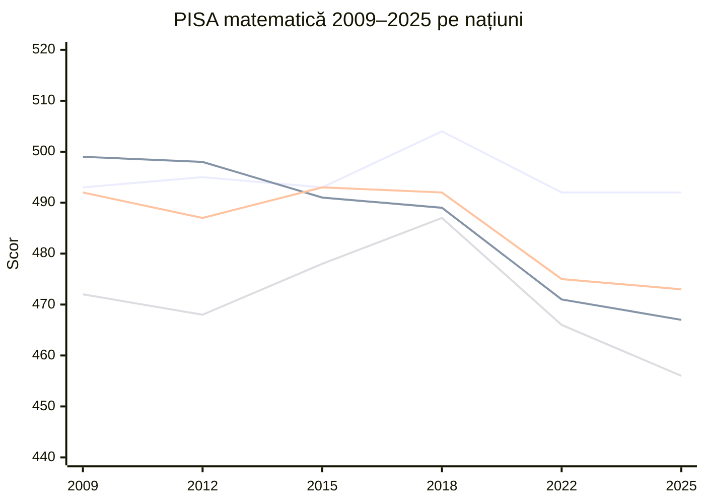
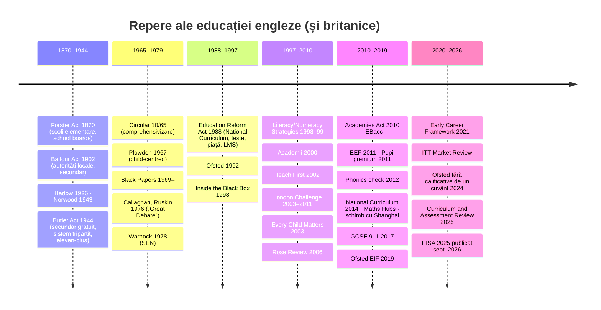

↑ [[00 Index - Analiza comparată internațională]] · [[00 MOC - Fundamentele științelor educației]]

> [!abstract] Pe scurt
> 1. **Nu există „un” sistem britanic.** Educația este *descentralizată* (devolved): Anglia, Scoția, Țara Galilor și Irlanda de Nord au legi, curricula, examene și inspectorate proprii. Regatul Unit este deci un **„experiment natural” cu patru brațe**: patru politici diferite aplicate unor populații asemănătoare, cu rezultate PISA divergente.
> 2. **Anglia** a mers, din 1988 încoace, pe formula **curriculum național + testare națională + inspecție (Ofsted) + piață școlară (alegere, autonomie, academii)**, iar după 2010 a adăugat un **curriculum „bogat în cunoaștere”** (*knowledge-rich*), **fonetică sistematică**, **matematică de tip *mastery*** (după Shanghai și Singapore) și o infrastructură densă de **educație bazată pe dovezi** (EEF, researchED, Chartered College, *Early Career Framework*).
> 3. **Scoția** (*Curriculum for Excellence*, 2004/2010) și **Țara Galilor** (*Successful Futures*, 2015 → *Curriculum for Wales*, 2022) au mers în direcția opusă: curricula **centrate pe competențe, „scopuri” și autonomia profesorului**, cu testare și clasamente reduse. **Irlanda de Nord** a păstrat **selecția academică la 11 ani**.
> 4. **PISA 2025** (publicat la 8 septembrie 2026): Anglia 492 matematică / 497 citire / 516 științe — **semnificativ peste celelalte trei națiuni** și mult peste media OCDE (463/461/482). Țara Galilor este ultima în toate domeniile și sub media OCDE la matematică și științe; Scoția și Irlanda de Nord sunt la mijloc, cu declin la matematică din 2015.
> 5. Declinul Scoției — țara care în 2000 avea scoruri de top — este cel mai invocat argument din dezbaterea **progresivism vs. tradiționalism** (*skills vs. knowledge*). Cercetarea însă **nu poate atribui cauzal** diferențele doar curriculumului.
> 6. Fundamentele manualului aplicate cel mai vizibil: **paradigma curriculumului** (curriculum național, *powerful knowledge*), **evaluarea formativă** (Black & Wiliam — contribuție britanică exportată mondial), **știința cognitivă a învățării** (introdusă chiar în cadrul de inspecție Ofsted 2019), **responsabilizarea și piața** (cazul-școală al „GERM”), **profesionalismul cadrului didactic** și **educația bazată pe dovezi**.
> 7. **Costurile** formulei engleze: presiune a testării și inspecției (*performativity*, Ball), plecarea profesorilor, îngustarea curriculumului (EBacc), bunăstare scăzută a elevilor (UK 2022: doar 64% simt că aparțin școlii vs. 75% media OCDE), fragmentare instituțională.
> 8. **Lecția pentru R. Moldova**: nu „copierea Angliei”, ci **coerența** — curriculum clar secvențiat + formare a profesorilor centrată pe practică + dovezi independente + evaluare formativă — și evitarea capcanelor (miza ridicată a testelor, clasamentele punitive, fragmentarea).

---

## 2. Profil și date-cheie

### 2.1 Context general

| Indicator | Valoare | Sursă / observații |
|---|---|---|
| Populație | ~69 mil. (Anglia ~58,6 mil.; Scoția ~5,5; Țara Galilor ~3,2; Irlanda de Nord ~1,9) | ONS, estimări mid-2024 (valori rotunjite) |
| Guvernanță | Educație *devolved* din 1999 (Scoția și Irlanda de Nord aveau oricum sisteme distincte de mult; Țara Galilor s-a separat treptat de Anglia după 1999) | Departamentul pentru Educație (DfE) acoperă **doar Anglia** |
| Cheltuieli pe instituții de învățământ (primar–terțiar) | **6,1% din PIB** (locul 3 din 40, date 2022); terțiar 2,1% | OECD, *Education at a Glance 2025*, nota de țară UK |
| Ponderea finanțării private (primar–terțiar) | **35,4%** (locul 2 din 39) — explicată mai ales de taxele universitare din Anglia | idem |
| Cheltuială cumulată/elev 6–15 ani | ~124 000 USD PPP | OECD, *PISA 2022 Factsheet UK* |
| Repetenție | 2% dintre elevii de 15 ani (OCDE: 9%) | PISA 2022 |
| Autonomie școlară | 81% dintre elevi în școli unde directorul angajează profesorii (OCDE: 60%) | PISA 2022 |

### 2.2 Anglia — structura sistemului

| Etapă | Vârstă | Ani școlari | ISCED | Evaluări naționale |
|---|---|---|---|---|
| *Early Years Foundation Stage* (EYFS) | 0–5 | grădiniță, *Reception* | 0 | *EYFS Profile* (la sfârșitul Reception) |
| *Key Stage 1* | 5–7 | Year 1–2 | 1 | **Phonics Screening Check** (Year 1); teste KS1 nestatutare din 2024 |
| *Key Stage 2* | 7–11 | Year 3–6 | 1 | **Multiplication Tables Check** (Year 4); teste KS2 („SATs”) în Year 6 |
| *Key Stage 3* | 11–14 | Year 7–9 | 2 | — (propus test diagnostic în Year 8, 2025) |
| *Key Stage 4* | 14–16 | Year 10–11 | 2/3 | **GCSE** (note 9–1) |
| *16–19* | 16–18 | Year 12–13 / colegii FE | 3 | A-level, T Level, calificări vocaționale |

- **Obligativitate**: școlarizare obligatorie 5–16 ani; din 2013/2015 (*Education and Skills Act 2008*) tinerii din Anglia trebuie să rămână în educație sau formare **până la 18 ani** (nu neapărat la școală).
- **Tipuri de școli** (2025/26): ~8,9 mil. elevi în 24 499 de școli; **83,6% dintre elevii de gimnaziu/liceu și 49,9% dintre cei din primar** învață în **academii sau *free schools*** (școli finanțate de stat, independente de autoritatea locală, grupate adesea în *Multi-Academy Trusts*); **26,5%** dintre elevi eligibili pentru mese gratuite (FSM); **6,3%** (560 300) în școli **independente** (private). — DfE, *Schools, pupils and their characteristics 2025/26* (iunie 2026).
- **Selecția**: ~163 de *grammar schools* selective (moștenire a sistemului tripartit) coexistă cu majoritatea comprehensivă (cifra: de verificat pentru 2026).
- **Actori de stat**: DfE; **Ofsted** (inspecție, 1992); **Ofqual** (reglementarea examenelor, 2010); *Standards and Testing Agency*; autorități locale (rol diminuat); *Oak National Academy* (resurse curriculare publice, 2020 → organism public 2022).

### 2.3 Celelalte trei națiuni — schemă comparativă

| | **Scoția** | **Țara Galilor** | **Irlanda de Nord** |
|---|---|---|---|
| Structură | Primar P1–P7 (~5–12), secundar S1–S6; *Broad General Education* 3–15 ani, apoi *Senior Phase* | Primar 5–11, secundar 11–16/18 | Primar P1–P7 (de la 4 ani), post-primar de la 11 ani |
| Curriculum | *Curriculum for Excellence* (CfE), 3–18 ani | *Curriculum for Wales* (2022–), 3–16 ani | *Northern Ireland Curriculum* (2007) |
| Examene | *National 4/5, Highers, Advanced Highers* (SQA → **Qualifications Scotland**) | GCSE „Made for Wales” (din 2025), A-level (WJEC) | GCSE, A-level (CCEA) |
| Inspecție | Education Scotland (în curs de reorganizare) | **Estyn** | ETI (*Education and Training Inspectorate*) |
| Selecție la 11 ani | Nu (comprehensiv din anii '60–'70) | Nu | **Da, de facto**: testul de stat abolit în 2008, dar *grammar schools* folosesc teste private (AQE, GL) |
| Clasamente școlare publice | Abolite (2003) | Abolite (2001); testele KS eliminate în 2002–2005 | Limitate |
| Particularități | Consiliul profesoral GTCS (1965); an de inducție garantat pentru debutanți | Educație în limba galeză; *Additional Learning Needs Act 2018* | Segregare confesională; școli integrate minoritare |

---

## 3. Traiectoria PISA 2000–2025

> [!warning] Probleme de comparabilitate
> - **2000 și 2003**: Regatul Unit nu a atins pragurile de participare; în 2003 OCDE l-a **exclus** din tabele. Nota OCDE pentru UK (2023) spune explicit că rezultatele sunt **comparabile doar din 2006**. John Jerrim (2013) a arătat că „declinul” englez 2000→2009 este în mare parte un artefact (eșantionare, schimbarea lunii testării, trecerea de la creion la calculator).
> - **2022**: ratele de răspuns ale școlilor și elevilor din UK sub standard; OCDE avertizează că mediile pot fi **ușor supraestimate**.
> - **2025**: Anglia a atins pragurile (răspuns ponderat școli 90% după înlocuiri; elevi 83%), dar rata de excludere în UK (fără Scoția) a fost 7,6% (țintă OCDE: 5%). OCDE a acceptat datele pentru comparații de trend.
> - OCDE raportează **Regatul Unit ca întreg**; scorurile pe națiuni provin din rapoartele naționale (eșantioane supradimensionate).

### 3.1 Anglia și Regatul Unit (citire / matematică / științe)

| Ciclu | Anglia | Regatul Unit | Media OCDE | Observații |
|---|---|---|---|---|
| 2000 | — | 523 / 529 / 532 | 500 / 500 / 500 | eșantion problematic; necomparabil |
| 2003 | — | exclus | 494 / 500 / 500 | rata de răspuns insuficientă |
| 2006 | 496 / 495 / 516 | 495 / 495 / 515 | 492 / 498 / 500 | primul ciclu comparabil |
| 2009 | 495 / 493 / 515 | 494 / 492 / 514 | 493 / 496 / 501 | Shanghai și Singapore intră în PISA |
| 2012 | 500 / 495 / 516 | 499 / 494 / 514 | 496 / 494 / 501 | Anglia ≈ media OCDE la matematică |
| 2015 | 500 / 493 / 512 | 498 / 492 / 509 | 493 / 490 / 493 | |
| 2018 | 505 / 504 / 507 | 504 / 502 / 505 | 487 / 489 / 489 | vârf la citire și matematică |
| 2022 | 496 / 492 / 503 | 494 / 489 / 500 | 476 / 472 / 485 | post-COVID; răspuns sub standard |
| **2025** | **497 / 492 / 516** | matematică 488 (restul: vezi nota OCDE) | **461 / 463 / 482** | științe = domeniu major; cel mai bun scor englez la științe din 2012 încoace |

*Surse*: DfE, *PISA 2009: results for England* (OSR29/2010); NFER/DfE, *Achievement of 15-year-olds in England: PISA 2012 National Report*; DfE/OUCEA–UCL IOE, *PISA 2025: national report for England* (sept. 2026); OECD, *PISA 2022 Results – Factsheet United Kingdom*; OECD Education GPS (UK 2025). Valorile UK 2006–2022: rapoarte OCDE (verificate indirect prin rapoartele naționale; posibile diferențe de ±1 punct).

**Poziția Angliei în 2025** (raportul național, diferențe semnificative statistic): la **științe** doar 7 sisteme sunt semnificativ peste Anglia (B-S-J-Z China, Singapore, Macao, Taiwan, Japonia, Estonia, Coreea); la **citire** doar 3 (Singapore, B-S-J-Z, Taiwan); la **matematică** 9 (cele de mai sus plus Hong Kong și Elveția). Pentru context: în 2012, 19 țări depășeau Anglia la matematică și 17 la citire.

> [!note] Comentariu — „stabilitate într-o mare care scade”
> Scorurile Angliei sunt remarcabil de **stabile** din 2006 (matematica: 495 → 492), în timp ce media OCDE a scăzut dramatic (matematică: 498 → 463; citire: 492 → 461). Poziția relativă a Angliei s-a îmbunătățit **mai ales prin declinul celorlalți**. Aceasta nu anulează meritele reformelor, dar obligă la prudență: explicația „reformele Gove au funcționat” trebuie comparată cu ipoteza „Anglia a rezistat mai bine șocurilor comune (digitalizare, pandemie)”.

### 3.2 Cele patru națiuni: citire / matematică / științe

| Ciclu | Anglia | Scoția | Țara Galilor | Irlanda de Nord |
|---|---|---|---|---|
| 2000 | — | citire ~526 (eșantion discutabil) | — | — |
| 2003 | — | matematică ~524 | — | — |
| 2006 | 496 / 495 / 516 | 499 / 506 / 515 *(de verificat)* | 481 / 484 / 505 | 495 / 494 / 508 *(de verificat)* |
| 2009 | 495 / 493 / 515 | 500 / 499 / 514 | 476 / 472 / 496 | 499 / 492 / 511 |
| 2012 | 500 / 495 / 516 | 506 / 498 / 513 | 480 / 468 / 491 | 498 / 487 / 507 |
| 2015 | 500 / 493 / 512 | 493 / 491 / 497 | 477 / 478 / 485 | 497 / 493 / 500 |
| 2018 | 505 / 504 / 507 | 504 / 489 / 490 | 483 / 487 / 488 | 501 / 492 / 491 |
| 2022 | 496 / 492 / 503 | 493 / 471 / 483 | 466 / 466 / 473 | 485 / 475 / 488 |
| **2025** | **497 / 492 / 516** | **488 / 467 / 491** | **459 / 456 / 476** | **482 / 473 / 492** |

*Surse*: DfE, *PISA 2009 results* (tabelul 13); *PISA 2012 National Report for England* (cap. 7); *PISA 2025 national report for England*, cap. 7 (tabelele de trend 2015–2025); Senedd Research, *How did Wales perform in PISA 2025?* (trend 2006–2025); gov.scot, *PISA 2025 National Report for Scotland* (8.09.2026). Valorile Scoției pentru 2000/2003 sunt deduse din declinurile raportate în presă (−38 puncte la citire din 2000, −57 la matematică din 2003) și sunt **necomparabile** strict.

**Trenduri 2015→2025** (semnificative statistic, raportul englez 2025):
- **Științe**: stabile în toate cele patru națiuni.
- **Citire**: stabilă în Anglia și Scoția; **scădere semnificativă** în Țara Galilor și Irlanda de Nord.
- **Matematică**: stabilă doar în Anglia; **scădere semnificativă** în Scoția, Țara Galilor și Irlanda de Nord.

### 3.3 Distribuție: performeri de top și sub nivelul 2 (PISA 2025)

| | Științe: niv. 5–6 / sub 2 | Citire: niv. 5–6 / sub 2 | Matematică: niv. 5–6 / sub 2 |
|---|---|---|---|
| Anglia | 14% / 16% | 10% / 19% | 14% / 25% |
| Irlanda de Nord | 8% / 22% | 6% / 23% | 9% / 30% |
| Scoția | 8% / 21% | 7% / 20% | 7% / 32% |
| Țara Galilor | 6% / 27% | 4% / 31% | 6% / 36% |
| Media OCDE | 7% / 26% | 6% / 31% | 8% / 35% |

*Sursa*: *PISA 2025: national report for England*, fig. 7.2–7.4 și rezumat. Pe ansamblul OCDE, un elev din cinci este acum *low performer* în toate cele trei domenii (comunicatul OCDE, 8.09.2026).

### 3.4 Echitate

- **UK 2022**: statutul socio-economic (ESCS) explică **11%** din variația la matematică (OCDE: 15%); diferența între sfertul avantajat și cel dezavantajat: **86 de puncte** (OCDE: 93), stabilă 2012–2022; **15%** dintre elevii dezavantajați sunt „rezilienți academic” (în sfertul superior), față de 10% media OCDE. OCDE plasează UK printre sistemele **„foarte echitabile”** după standardul PISA (incluziune + corectitudine). — *PISA 2022 Factsheet UK*.
- **Anglia 2025**: decalajul între sferturile ESCS extreme — **81** puncte la științe (OCDE 85), **66** la citire (OCDE 78, semnificativ mai mic), **89** la matematică (OCDE 83). **Scoția** are decalaje semnificativ mai mici decât Anglia la citire (50) și matematică (70), ca și Țara Galilor la matematică (70) — dar la niveluri medii mai joase: „echitate prin nivelare în jos” este o lectură posibilă, dar nu singura.
- **Imigrație (UK 2022)**: 20% elevi cu origine imigrantă (13% în 2012); după controlul ESCS, imigranții au **+12 puncte** la matematică. În Anglia 2025, elevii de a doua generație depășesc nonimigranții la citire și matematică.
- **Gen (Anglia 2025)**: decalajul în favoarea băieților la matematică s-a **dublat** (−12 în 2015 → −26 în 2025); a apărut un decalaj la științe (−13); decalajul la citire în favoarea fetelor s-a redus (23 → 11).

### 3.5 Bunăstare

- **UK 2022**: **64%** dintre elevi simt că aparțin școlii (OCDE 75%); **25%** nemulțumiți de viață (OCDE 18%); 27–28% victime ale bullying-ului de câteva ori pe lună (OCDE 20–21%); 63% au avut școala închisă peste 3 luni în pandemie (OCDE 51%); **54%** dintre elevi în școli cu lipsă de profesori raportată de director (28% în 2018). — *PISA 2022 Factsheet UK*.
- **PISA 2025**: OCDE notează că fetele raportează un sentiment de apartenență semnificativ mai slab decât băieții, UK fiind între țările cu cel mai mare decalaj (Tes, 8.09.2026, citând raportul OCDE).

### 3.6 TIMSS și PIRLS (Anglia)

- **PIRLS 2021**: Anglia **558**, locul 4 din 43 de țări cu cohortă standard (după Singapore 587, Hong Kong 573, Rusia 567). Irlanda de Nord 566, dar în afara clasamentului (testare decalată din cauza pandemiei). — DfE, *PIRLS 2021 National Report for England* (2023/2024).
- **TIMSS 2023**: Year 5 — matematică 552, științe 556 (creștere semnificativă de la 537); Year 9 — matematică 525, științe 531 (de la 517). Doar 7 din 57 de țări depășesc semnificativ Anglia în Year 5 și 5 din 43 în Year 9. — DfE, *TIMSS 2023 national report for England* (dec. 2024).
- **Scoția** s-a retras din TIMSS și PIRLS după ciclurile 2006/2007, pierzând date comparative pentru primar — o critică recurentă (inclusiv în raportul OCDE 2021).

> [!info] PISA 2025 — status
> Rezultatele PISA 2025 (Volumul I: științe, matematică, citire, *computational problem solving*) **au fost publicate la 8 septembrie 2026**; volumele despre învățarea autodirijată în lumea digitală sunt anunțate pentru 2027. Scoția a fost peste media OCDE la *computational problem solving*; UK ca întreg la fel (Education GPS). Scorurile detaliate pentru acest domeniu nou nu sunt incluse aici (de completat).

---

## 4. Cronologia reformelor (sec. XIX–XXI)

| An | Reformă / lege / program | Ideea | Legătura cu fundamentele |
|---|---|---|---|
| 1870 | *Elementary Education Act* (W. E. Forster) | Școli elementare administrate de *school boards* acolo unde bisericile nu acopereau nevoia; obligativitate generalizată în 1880, gratuitate în 1891 | Sistem de învățământ național; dreptul la educație ([[Modulul 08 - Sistemul de educație și managementul educației]]) |
| 1902 | *Education Act* (Balfour) | Abolirea *school boards*, crearea autorităților locale (LEA) responsabile și de secundar | Descentralizare administrativă |
| 1918 | *Fisher Act* | Vârsta de părăsire a școlii: 14 ani | Extinderea educației formale |
| 1944 | *Education Act* (R. A. Butler) | Secundar gratuit pentru toți; **sistem tripartit** (grammar / secondary technical / secondary modern) cu **examenul eleven-plus**; ministerul educației; educație religioasă obligatorie | Teoria „aptitudinilor” (Norwood 1943) → **tracking** timpuriu; [[Echitatea și școala comprehensivă]] |
| 1965 | **Circular 10/65** (A. Crosland) | Autoritățile locale invitate să planifice școli **comprehensive** | Egalitatea de șanse; critica selecției |
| 1967 | **Plowden Report** (*Children and their Primary Schools*) | Copilul „în centrul procesului educațional”; învățare prin descoperire; *Educational Priority Areas* | [[Progresivismul și educația nouă]]; paradigma modernă ([[Modulul 02 - Clasic, modern și postmodern în educație]]) |
| 1969–1977 | *Black Papers* (Cox, Dyson) | Contraofensivă conservatoare împotriva progresivismului și comprehensivelor | Începutul „războaielor educaționale” |
| 1972–73 | ROSLA | Vârsta de părăsire a școlii: 16 ani | |
| 1976 | Discursul lui **James Callaghan** la Ruskin College (18 oct.) | „Great Debate”: curriculum de bază, standarde, legătura școală–economie, responsabilitate publică | [[Capitalul uman și economia educației]]; [[Responsabilizare, piață și încredere în guvernarea educației]] |
| 1978 / 1981 | **Warnock Report** / *Education Act 1981* | Conceptul de **special educational needs** în locul categoriilor medicale; integrare în școli obișnuite; „statements” | [[Educația incluzivă]] |
| 1988 | **Education Reform Act** (K. Baker) | **National Curriculum** pe *key stages*; **teste naționale** la 7, 11, 14 ani; *Local Management of Schools* (buget la școală); *open enrolment* (alegere parentală); școli *grant-maintained* | Paradigma curriculumului; evaluare sumativă; cvasi-piață |
| 1988 | Primele examene GCSE | Examen unic la 16 ani (în locul O-level/CSE) | |
| 1992 | *Education (Schools) Act* → **Ofsted** | Inspecție independentă, rapoarte publice, calificative | Responsabilizare externă |
| 1997 | *Excellence in Schools* (New Labour) | „Standards not structures” | Teoria schimbării de sus în jos |
| 1998–99 | **National Literacy Strategy** („literacy hour”) și **National Numeracy Strategy** | Lecții structurate, ghiduri detaliate, formare în cascadă, ținte naționale | [[Teoria schimbării educaționale și leadershipul]] (Barber, Fullan) |
| 1998–99 | **Sure Start** | Centre integrate pentru copii 0–4 ani din zone defavorizate | Educația timpurie |
| 1998 | *Inside the Black Box* (Black & Wiliam) | Evaluarea formativă ridică performanța | [[Evaluarea formativă]] |
| 2000 / 2002 | **City academies** (anunț 2000, primele 2002) | Școli eșuate preluate de sponsori, autonome față de LEA | Autonomie + responsabilizare |
| 2002 | Cetățenia devine disciplină statutară în secundar (după *Crick Report*, 1998) | Educație pentru cetățenie democratică | [[Pedagogia critică și educația pentru cetățenie]] |
| 2002/03 | **Teach First** | Absolvenți de top în școli defavorizate, formare la locul de muncă | [[Profesionalismul cadrului didactic]] |
| 2003–2011 | **London Challenge** (comisar T. Brighouse) | Parteneriate între școli, consilieri experți, date, leadership | Îmbunătățire la nivel de sistem |
| 2003 / 2004 | **Every Child Matters** / *Children Act 2004* | Cinci rezultate pentru copii; integrarea serviciilor | Educație integrală; bunăstare |
| 2005/2007 | SEAL (*Social and Emotional Aspects of Learning*) | Program național de învățare socio-emoțională | [[Învățarea socio-emoțională și educația caracterului]] |
| 2006 | **Rose Review** (*Independent Review of the Teaching of Early Reading*) | Fonetică sintetică sistematică, „prima și rapid” | [[Știința cognitivă a învățării]]; [[Behaviorismul și instruirea directă]] |
| 2008 | EYFS statutar | Cadru unic 0–5 ani | Educația timpurie |
| 2010 | *Academies Act*; *free schools*; **EBacc** (în tabelele de performanță din 2011) | Academizare în masă; nucleu academic la 16 ani | Piață + curriculum academic |
| 2010 | T. Oates, *Could do better* (Cambridge Assessment) | Curriculum „rar dar dens”, coerent, după modelele sistemelor performante | [[Tradiția Bildung-Didaktik și tradiția Curriculum]] |
| 2011 | **Pupil premium**; **Education Endowment Foundation** | Finanțare suplimentară per elev dezavantajat; fond de „ce funcționează” | Educația bazată pe dovezi |
| 2012 | **Phonics Screening Check** (Year 1); *Teachers' Standards* | | |
| 2013 | researchED (T. Bennett) | Mișcare *grassroots* a profesorilor pentru cercetare | |
| 2014 | **Noul National Curriculum** (predare din sept. 2014); eliminarea „nivelurilor”; **Computing** în loc de ICT; *Children and Families Act* (EHCP pentru SEND) | *Knowledge-rich*, așteptări mai înalte | [[Constructionismul și educația digitală]] |
| 2014– | **Maths Hubs**, schimbul de profesori **Anglia–Shanghai**; din 2016 programul *Teaching for Mastery* | Predare „mastery” de tip est-asiatic | [[Învățarea deplină (mastery learning)]] |
| 2015–2017 | Reforma **GCSE (9–1)** și **A-level** (decuplarea AS); **Progress 8** (2016) | Examene mai exigente, liniare | Evaluare sumativă, responsabilizare |
| 2017 | **Chartered College of Teaching** | Organism profesional al profesorilor | Profesionalism |
| 2017/2018 | Green Paper sănătate mintală; *Mental Health Support Teams* (2019–) | | [[Modulul 07 - Noile educații]] |
| 2019 | **Ofsted Education Inspection Framework** (intent–implementation–impact) + *overview of research* | Curriculumul și știința cognitivă intră în inspecție | [[Știința cognitivă a învățării]] |
| 2019 / 2021 | *ITT Core Content Framework*; **Early Career Framework** (național din sept. 2021) | Formare inițială + 2 ani de inducție structurată | [[Profesionalismul cadrului didactic]] |
| 2020 | RSE/RSHE statutară | Educație pentru relații, sexualitate, sănătate | Noile educații |
| 2021–2024 | **ITT Market Review** (re-acreditarea furnizorilor) | Standardizarea formării inițiale | |
| 2024 | Ofsted renunță la calificativele de un cuvânt (sept.) după moartea directoarei Ruth Perry (2023) | Critica mizei ridicate a inspecției | |
| 2025 | TVA pe taxele școlilor private (ian.); **Curriculum and Assessment Review** (B. Francis, 5 nov.); noile inspecții Ofsted cu *report cards* (din 10 nov.) | Ajustare, nu ruptură: se păstrează *knowledge-rich*, se propune eliminarea EBacc | |

**Scoția, Țara Galilor, Irlanda de Nord — repere proprii**

| An | Națiune | Reformă | Idee |
|---|---|---|---|
| 1965 | Scoția | *General Teaching Council for Scotland* | Autoreglementarea profesiei |
| 2001–2002 | Scoția | Acordul McCrone; schema de inducție (an garantat de stagiu) | Salarii, statut, dezvoltare profesională |
| 2001–2005 | Țara Galilor | Abolirea clasamentelor (2001) și a testelor KS | Încredere în profesori, anti-testare |
| 2004 / 2010 | Scoția | ***A Curriculum for Excellence*** (2004), implementat din aug. 2010 | Patru „capacități”: *successful learners, confident individuals, responsible citizens, effective contributors* |
| 2007 / 2008 | Irlanda de Nord | Curriculum revizuit (2007); abolirea testului de transfer de stat (ultimul în 2008) | Competențe transversale; selecția continuă prin teste private |
| 2008 | Țara Galilor | *Foundation Phase* (3–7 ani) | Învățare prin joc, experiențială |
| 2010/2011 | Scoția | G. Donaldson, *Teaching Scotland's Future* | Formarea profesorilor ca parteneriat universitate–școală |
| 2014 / 2017 | Țara Galilor | Rapoartele OCDE *Improving Schools in Wales* și *The Welsh Education Reform Journey* | |
| 2015 | Scoția | *Scottish Attainment Challenge*; 2016 *National Improvement Framework*; 2017 *Pupil Equity Funding*, teste standardizate naționale (SNSA) | Reducerea decalajului de atainment |
| 2015 | Țara Galilor | G. Donaldson, ***Successful Futures*** | Patru scopuri, șase arii de învățare și experiență |
| 2021 | Țara Galilor | *Curriculum and Assessment (Wales) Act 2021* | Bază legală pentru CfW |
| 2021 | Scoția | Raport OCDE ***Scotland's Curriculum for Excellence: Into the Future*** (iunie) | CfE are viziune bună, dar implementare incoerentă și evaluare nealiniată |
| 2022 | Scoția | Raportul K. Muir, *Putting Learners at the Centre* | Înlocuirea SQA și reformarea Education Scotland |
| 2022– | Țara Galilor | ***Curriculum for Wales*** introdus progresiv din sept. 2022 | Curriculum-cadru construit de școli |
| 2023 | Scoția | L. Hayward, *It's Our Future* (iunie) | Diplomă scoțiană a realizărilor, mai puține examene |
| 2023 | Irlanda de Nord | *Independent Review of Education* (*Investing in a Better Future*, dec.) | Sistem fragmentat, subfinanțat, prea multe organisme |
| 2025 | Scoția | *Education (Scotland) Act 2025*: SQA înlocuită de **Qualifications Scotland** (calendarul operaționalizării: de verificat) | |
| 2026 | Scoția / Țara Galilor | După PISA 2025: guvernul scoțian anunță cea mai amplă revizuire a CfE de la lansare; guvernul galez anunță un plan pentru *literație și numerație fundamentală* | Reorientare spre bazele citirii și matematicii |

---

## 5. Implementarea fundamentelor pe dimensiunile manualului

### 5.1 Statutul științelor educației, cercetarea și politica bazată pe dovezi
→ [[Modulul 01 - Statutul științelor educației]] · [[Modulul 05 - Paradigmele pedagogiei și cercetarea pedagogică]]

**Tradiția academică.** Regatul Unit are una dintre cele mai puternice comunități de cercetare educațională din lume:
- **UCL Institute of Education** (fondat în 1902 ca *London Day Training College*, parte a UCL din 2014) — „London line” în filosofia educației (**R. S. Peters**, *Ethics and Education*, 1966; **Paul Hirst**, „formele de cunoaștere”, 1965), sociologia lui **Basil Bernstein** (coduri lingvistice, „clasificare și încadrare”), **Michael Young**, **Dylan Wiliam**, **Becky Francis**.
- **Cambridge** (Faculty of Education; *Cambridge Assessment*/Tim Oates; **Robin Alexander** — *Cambridge Primary Review*, 2009/2010, pedagogie dialogică), **Oxford** (OUCEA — analizează PISA pentru Anglia), **King's College London** (Paul Black, grupul de evaluare formativă), **Durham** (Rob Coe, CEM), **Birmingham** (*Jubilee Centre for Character and Virtues*, 2012), **Edinburgh**, **Glasgow**, **Stirling** (Mark Priestley — curriculum, agentivitatea profesorului), **UEA** — CARE (Lawrence **Stenhouse**, *An Introduction to Curriculum Research and Development*, 1975: „profesorul ca cercetător”; John Elliott, cercetarea-acțiune).
- **Organizații**: NFER (1946), BERA (1974), Nuffield Foundation, **Sutton Trust** (1997), **Education Policy Institute**, **Institute for Fiscal Studies** (economia educației).

**Cotitura „evidence-based”.** În 1996, **David Hargreaves** (lecția TTA *Teaching as a research-based profession*) a acuzat cercetarea educațională de irelevanță și a cerut un model inspirat din medicină. Rapoartele Hillage și Tooley (1998) au urmat. **Ben Goldacre** (*Building Evidence into Education*, 2013) a pledat pentru trialuri randomizate. Instituționalizarea:
- **Education Endowment Foundation (EEF)** — înființată în **2011** de Sutton Trust (cu Impetus) printr-un grant DfE de ~125 mil. £; a finanțat sute de trialuri randomizate (ordinul sutelor, cel mai mare portofoliu de RCT-uri educaționale din lume) și întreține **Teaching and Learning Toolkit** (sinteză a metaanalizelor exprimată în „luni de progres”; ex. metacogniție și feedback — impact mare, cost redus). Din 2016, *Research Schools Network*.
- **researchED** (2013, Tom Bennett) — conferințe organizate de profesori, adesea critice față de „mituri” (stiluri de învățare, *Brain Gym*).
- **Chartered College of Teaching** (2017) — jurnalul *Impact*, statut de *Chartered Teacher*.
- **Ofsted** publică în 2019 o *overview of research* pe care își bazează noul cadru de inspecție.
- **What Works Centres** (EEF este unul dintre ele), *Early Intervention Foundation*.

> [!warning] Critică
> **Gert Biesta** (*Why "what works" won't work*, 2007; *Good Education in an Age of Measurement*, 2010) argumentează că educația este o practică **normativă**, nu tehnică: întrebarea „ce funcționează?” presupune că știm deja *pentru ce* educăm. Alți critici notează că multe trialuri EEF au dat **efecte nule** (ceea ce e informativ, dar arată limitele transferului), că „lunile de progres” simplifică metaanalize eterogene și că dovezile sunt uneori folosite **selectiv** de guvern (ex. *mastery* sau *phonics* extinse înainte de evaluări concludente).

**Scoția și Țara Galilor** au o relație diferită cu cercetarea: au preferat **consultarea OCDE** și modelele de „*co-construction*” cu profesorii. Raportul OCDE 2021 a criticat Scoția pentru **lipsa datelor** (retragerea din TIMSS/PIRLS, abandonarea *Scottish Survey of Literacy and Numeracy* în 2016), ceea ce a făcut aproape imposibilă evaluarea CfE.

### 5.2 Paradigme pedagogice dominante: clasic – modern – postmodern
→ [[Modulul 02 - Clasic, modern și postmodern în educație]]

Istoria educației engleze poate fi citită ca un **pendul** între trei poziții:

| Perioadă | Paradigmă dominantă | Manifestări |
|---|---|---|
| 1870–1944 | **Clasică**, elitistă, dublă rețea (elementar pentru mase, *public schools* pentru elite) | Curriculum clasic, disciplină, *payment by results* (1862–1897) |
| 1944–1965 | **Meritocratică-psihometrică** | Eleven-plus bazat pe teoria inteligenței fixe (Cyril Burt — ulterior discreditat) |
| 1965–1988 | **Modernă, progresivistă** (în primar) și comprehensivă (în secundar) | Plowden; învățare prin descoperire; autonomia curriculară a profesorului („secret garden of the curriculum”) |
| 1988–2010 | **Tehnocratic-managerială** (*New Public Management*) | Curriculum național, ținte, strategii naționale, inspecție |
| 2010–prezent | **Neo-tradiționalism informat de știința cognitivă** + piață | *Knowledge-rich*, instruire explicită, *mastery*, phonics |

**Rădăcinile progresiviste britanice** sunt vechi: **A. S. Neill** (Summerhill, 1921), **Susan Isaacs** (Malting House, Cambridge, 1924–1927), influența **Froebel** și a lui **Dewey**. Plowden (1967) le-a oficializat, dar studii ulterioare (ORACLE, Galton, Simon & Croll, 1980) au arătat că **puține clase** erau cu adevărat „progresiviste”. Raportul „celor trei înțelepți” (Alexander, Rose, Woodhead, 1992) a criticat predarea pe „teme” și lucrul individual excesiv.

**Contrapolul „modern-postmodern” în Scoția și Țara Galilor.** CfE și *Successful Futures* se înscriu în ceea ce OCDE și literatura numesc „*new curriculum*” (Priestley & Biesta, *Reinventing the Curriculum*, 2013): curriculum-cadru, scopuri largi („capacități”/„purposes”), competențe transversale, profesorul ca „*curriculum maker*”. Aceasta corespunde paradigmei **postmoderne/curriculare** a manualului (centrare pe elev, flexibilitate, integrare).

> [!note] Comentariu — cum citim pendulul prin manual
> Manualul tratează paradigma curriculumului drept reperul „postmodern”. Cazul britanic arată că **aceeași etichetă acoperă proiecte opuse**: Anglia a construit un *curriculum* puternic centrat pe **conținut secvențiat** (moștenire *Didaktik*/Young), Scoția un *curriculum* centrat pe **competențe și experiențe**. Distincția relevantă nu este clasic/modern, ci **„ce anume e specificat central și cât de precis”**.

### 5.3 Formele educației și învățarea pe tot parcursul vieții
→ [[Modulul 03 - Formele generale ale educației]] · [[3.6 Educația permanentă și autoeducația]] · [[Autoeducația - teorii, autori și corelări]] · [[Învățarea pe tot parcursul vieții și formele educației]]

- **Formal**: sistemul descris mai sus; participare obligatorie în educație/formare până la 18 ani în Anglia.
- **Nonformal**: tradiție britanică foarte puternică — **cercetașii** (Baden-Powell, 1907–1908), *Duke of Edinburgh's Award* (1956), *National Citizen Service* (2011), cluburi sportive, muzică extrașcolară, biblioteci publice, muzee cu intrare gratuită (din 2001), BBC ca instituție educațională (BBC Bitesize).
- **Informal și medii**: BBC (misiunea „*inform, educate and entertain*”), *BBC micro:bit* (2016) distribuit elevilor de Year 7.
- **Învățarea pe tot parcursul vieții**: **Open University** (cartă 1969, primii studenți 1971) — inovație britanică emblematică a educației deschise la distanță; *University for Industry/learndirect* (2000); ucenicii (*apprenticeship levy* 2017), **T Levels** (2020), *Skills England* (2024), *Lifelong Learning Entitlement* (împrumuturi modulare pentru adulți, anunțat pentru 2027 — de verificat calendarul). Tradiția **educației muncitorești** (*Workers' Educational Association*, 1903; *Ruskin College*, 1899).
- **Critică**: participarea adulților la educație a scăzut semnificativ după tăierile bugetare din anii 2010 în educația adulților (analize IFS și *Learning and Work Institute*; cifre: de verificat).

**Autoeducația / învățarea autodirijată.** În Anglia, discursul „*independent learning*” din anii 2000 (SEAL, PLTS — *Personal, Learning and Thinking Skills*) a fost înlocuit după 2010 cu ideea că **autonomia e rezultatul cunoașterii, nu punctul de plecare** (novicii nu învață eficient prin descoperire — Kirschner, Sweller & Clark, 2006). Metacogniția a revenit însă prin EEF (*Metacognition and Self-regulated Learning*, ghid 2018/2021), ca strategie **predată explicit**. În PISA 2022, doar **47%** dintre elevii UK se simțeau încrezători că se pot motiva singuri pentru învățarea la distanță (OCDE: 58%) — indicator slab al autoreglării. PISA 2025 include un domeniu despre învățarea autodirijată în lumea digitală, cu rezultate anunțate pentru 2027.

### 5.4 Finalitățile: idealul educațional și scopurile
→ [[Modulul 04 - Finalitățile educației]]

| | Formularea finalităților | Tip |
|---|---|---|
| **Anglia** (National Curriculum 2014) | Curriculumul oferă elevilor „o introducere în **cunoașterea esențială** de care au nevoie pentru a fi cetățeni educați”, inclusiv „ce s-a gândit și s-a spus mai bine” (formulă preluată de la Matthew Arnold) | Finalitate **culturală / epistemică** (*Bildung* prin cunoaștere) |
| **Anglia** (legea) | Școlile trebuie să ofere un curriculum „echilibrat și larg” care promovează dezvoltarea „spirituală, morală, culturală, mentală și fizică” (formulare din *Education Act 2002*, preluată din 1988) | Educație integrală |
| **Anglia** (2014–) | **Fundamental British values**: democrație, statul de drept, libertate individuală, respect și toleranță reciprocă | Valori civice (context: strategia *Prevent*) |
| **Scoția** (CfE) | Patru capacități: *successful learners, confident individuals, responsible citizens, effective contributors* | Finalități **ale persoanei** (competențe/dispoziții) |
| **Țara Galilor** (CfW) | Patru scopuri: *ambitious, capable learners; enterprising, creative contributors; ethical, informed citizens; healthy, confident individuals* | idem |
| **Irlanda de Nord** | Dezvoltarea tânărului ca individ, contribuabil la societate și la economie/mediu | Mixt |

> [!note] Comentariu
> Contrastul este direct legat de nivelurile manualului (ideal → scopuri → obiective). Scoția și Țara Galilor au formulat **scopuri generale** foarte atractive, dar raportul OCDE 2021 și criticii (Paterson; Priestley) au arătat că trecerea la **obiective și conținuturi** a fost lăsată școlilor, rezultând **variație mare** și suprasolicitarea profesorilor. Anglia a specificat **conținuturile** (programe de studiu pe ani), lăsând finalitățile persoanei mai implicite. *Curriculum and Assessment Review* (2025) a încercat un echilibru: păstrarea abordării *knowledge-rich* cu „abilitățile dezvoltate împreună cu cunoașterea”.

### 5.5 Dimensiunile educației
→ [[Modulul 06 - Dimensiunile generale ale educației]]

- **Intelectuală**: centrul reformelor post-2010 (curriculum, *mastery*, phonics). Tradiția engleză a **specializării timpurii** la 16 ani (3 A-level-uri) — criticată pentru îngustime; propunerile de baccalaureat larg (raportul Tomlinson, 2004) au fost respinse.
- **Morală / caracter**: educația religioasă (RE) obligatorie din 1944 (conținut stabilit local prin *agreed syllabus*); **educația caracterului** promovată de DfE din 2014–2015 (granturi, premii), fundamentată de *Jubilee Centre* (Birmingham, etica virtuții neo-aristotelică — James Arthur, Kristján Kristjánsson); tradiția *public schools* (sport, internat, „caracter”).
- **Tehnologică / digitală**: Anglia a fost printre primele țări care au introdus **informatica (Computing)** obligatorie de la 5 ani (2014), după raportul Royal Society *Shut down or restart?* (2012); *National Centre for Computing Education* (2018). Dar CAR 2025 constată că ~80% dintre profesorii din școlile de stat raportează că Computing e predat în KS4 doar elevilor care dau GCSE — decalaj politică–practică. Declinul **Design & Technology** (37% dintre școli fără înscrieri la GCSE D&T în 2024/25).
- **Estetică**: declinul înscrierilor la muzică, artă, teatru la GCSE, atribuit parțial EBacc (CAR 2025: cel mai mare decalaj de dezavantaj la GCSE Music; 61% dintre școlile cele mai defavorizate fără înscrieri la muzică).
- **Psihofizică**: educație fizică obligatorie în toate *key stages*; *PE and Sport Premium* în primar (2013); obezitatea infantilă ca problemă de sănătate publică.

### 5.6 „Noile educații”
→ [[Modulul 07 - Noile educații]]

| „Nouă educație” | Anglia | Scoția / Țara Galilor / IN |
|---|---|---|
| Cetățenie | Statutară în KS3–4 din 2002 (Crick); CAR 2025 recomandă **cetățenia statutară din KS1**, incluzând literație financiară și media | CfE: „responsible citizens”; CfW: „ethical, informed citizens” |
| Media / digitală | Parte din Computing și RSHE; CAR 2025: literație media, inclusiv despre AI | Competență digitală transversală în CfW |
| Mediu / sustenabilitate | Absentă explicit din curriculumul primar (CAR 2025 o semnalează); *Sustainability and Climate Change Strategy* DfE (2022) | *Learning for Sustainability* integrat în CfE |
| SEL / sănătate mintală | SEAL (2005–2010, abandonat); RSHE statutară (2020); *Mental Health Support Teams*; *senior mental health lead* | *Health and wellbeing* — responsabilitatea tuturor profesorilor în CfE; arie de învățare în CfW |
| Pace / toleranță | *Fundamental British values*; educație împotriva radicalizării (*Prevent*, criticat pentru securitizare) | **Irlanda de Nord**: *integrated education* (școli mixte catolice–protestante, din 1981) — educație pentru reconciliere |
| Familie | *Relationships Education* statutară | |
| Oratorie (*oracy*) | *Oracy Education Commission* (2024); CAR 2025 recomandă un **cadru național de oracy** | |

### 5.7 Sistemul și managementul educației
→ [[Modulul 08 - Sistemul de educație și managementul educației]] · [[Responsabilizare, piață și încredere în guvernarea educației]]

**Modelul englez: „autonomie înaltă + responsabilizare înaltă”**
- **Descentralizare către școală, centralizare a controlului**: autoritățile locale au pierdut majoritatea funcțiilor; academiile (contracte directe cu ministrul) și *Multi-Academy Trusts* (lanțuri de școli) sunt noul „nivel mijlociu”. Paradoxal, sistemul e mai **centralizat** (ministrul contractează direct mii de școli).
- **Piață**: alegerea școlii de către părinți (1988), finanțare per elev, tabele de performanță publice (din 1992), competiție.
- **Responsabilizare**: teste KS2, GCSE, **Progress 8** (valoare adăugată între KS2 și GCSE), inspecții Ofsted. Din 2024 fără calificative de un cuvânt („Outstanding/Good/Requires improvement/Inadequate”); din 10 noiembrie 2025 **report cards** cu evaluări pe mai multe arii, pe o scală de cinci trepte (de la *urgent improvement* la *exceptional*; denumirile exacte: de verificat în *School inspection toolkit*).
- **Echitate**: **pupil premium** (2011) — finanțare suplimentară per elev eligibil FSM, cu obligația de a raporta utilizarea; formula națională de finanțare (*National Funding Formula*, 2018).
- **Tracking**: *setting* (grupare pe niveluri pe discipline) este frecvent în secundar; EEF îl evaluează ca având impact redus și potențial negativ pentru elevii slabi. *Grammar schools* în ~⅓ din autoritățile locale selectează.

**Dovezi despre academii**: Eyles & Machin (2019, *Journal of the European Economic Association*) — primele academii sponsorizate (era Labour, 2002–2009) au crescut rezultatele elevilor; pentru academiile *converter* post-2010 și MAT-uri, dovezile sunt **mixte/neutre** (analize EPI, Andrews 2018). **Grammar schools**: studiile EPI (Andrews, Hutchinson & Johnes, 2016) și Burgess, Crawford & Macmillan (2017) arată **niciun câștig agregat** și efecte negative pentru elevii din zonele selective care nu intră; elevii FSM sunt subreprezentați.

**Scoția**: sistem administrat de 32 de consilii locale, comprehensiv, fără piață școlară sau tabele de clasament; responsabilizare prin *National Improvement Framework* și Education Scotland. **Țara Galilor**: 22 de autorități locale, consorții regionale (în curs de desființare), Estyn. **Irlanda de Nord**: *Education Authority* (2015), sectoare multiple (controlat, catolic, integrat, irlandofon, *grammar*), considerat de *Independent Review* (2023) ineficient prin fragmentare.

> [!warning] Critică — „GERM” și performativitatea
> **Pasi Sahlberg** a descris Anglia ca exemplu tipic al **Global Education Reform Movement** (standardizare, testare, competiție, responsabilizare). **Stephen Ball** (*The teacher's soul and the terrors of performativity*, 2003; *The Education Debate*) arată cum măsurătorile transformă identitatea profesională în „a produce cifre”. **Andy Hargreaves și Dennis Shirley** (*The Fourth Way*, 2009) critică atât „a doua cale” (piața Thatcher) cât și „a treia cale” (țintele New Labour). Moartea directoarei Ruth Perry (2023), după o inspecție care i-a retrogradat școala, a fost catalizatorul renunțării la calificativele de un cuvânt.

### 5.8 Agenții educației: profesorul, directorul, elevul, familia
→ [[Modulul 09 - Agenții educației și factorii dezvoltării]] · [[Profesionalismul cadrului didactic]]

**Profesorul în Anglia**
- **Căi de formare**: licență + PGCE universitar (1 an), *School Direct*, **SCITT** (formare condusă de școli), **Teach First** (din 2002/2003, absolvenți plasați în școli defavorizate), ucenicie postuniversitară (2018). Statut: *Qualified Teacher Status* (QTS); academiile pot angaja și profesori fără QTS (politică restrânsă după 2024 — de verificat stadiul legislativ din *Children's Wellbeing and Schools Bill*).
- **Standarde**: *Teachers' Standards* (2012); **ITT Core Content Framework** (2019) și **Early Career Framework** (ECF, național din sept. 2021) — inducție de **2 ani** cu mentor și curriculum bazat pe dovezi (managementul comportamentului, predare, evaluare, instruire adaptivă), unificate din 2025 în *ITTECF*. **National Institute of Teaching** (2022). Calificări profesionale naționale (NPQ) pentru leadership și specialiști.
- **ITT Market Review** (2021): re-acreditarea tuturor furnizorilor; unele universități prestigioase au pierdut acreditarea în primă fază, generând controverse despre centralizarea conținutului formării.
- **Criză de personal**: țintele de recrutare pentru secundar sunt ratate aproape anual; PISA 2022 — 54% dintre elevii UK în școli cu lipsă de profesori raportată. Salariul de început a fost ridicat la 30 000 £ (2023) (valoarea actuală: de verificat).
- **Comportament**: *Behaviour in schools* (T. Bennett, 2017), *Behaviour Hubs* (2021); școli „stricte” emblematice (Michaela Community School, 2014) — controversate.

**Scoția**: profesie **integral universitară**, înregistrare obligatorie la **GTCS**, an de inducție garantat (*Teacher Induction Scheme*, 2002) — un model apreciat internațional; totuși, criza de posturi permanente pentru debutanți și timp de predare foarte ridicat.

**Directorul**: autonomie extinsă (angajări, buget); leadershipul este tratat ca pârghia principală (NPQH; *National College for School Leadership*, 2000–2018). **London Challenge** a folosit *National Leaders of Education* — directori de succes care sprijină alte școli.

**Elevul**: *pupil voice*, consilii școlare; SEND — ~1,7 mil. elevi cu nevoi speciale în Anglia și creștere explozivă a planurilor EHC după 2014, cu deficite ale autorităților locale (cifre exacte: de verificat).

**Familia și comunitatea**: alegerea școlii; *home-school agreements*; PISA 2022 arată o **scădere accentuată a implicării părinților** (25% dintre elevi în școli unde cel puțin jumătate dintre părinți discută progresul din inițiativă proprie, față de 37% în 2018). **Sure Start** (1998–) și *family hubs* (2021–) pentru familiile cu copii mici.

### 5.9 Proiectare, predare, evaluare
→ [[Modulul 10 - Proiectarea, realizarea și evaluarea activității educative]]

**Curriculum.** National Curriculum 2014 (programe de studiu anuale la engleză, matematică, științe în primar; pe *key stage* în rest). Academiile **nu sunt obligate** să-l urmeze, dar Ofsted evaluează dacă au un curriculum de „amploare și ambiție” similare. Oak National Academy oferă unități complete.

**Predare.** Practica engleză post-2019 este dominată de: instruire explicită și *modelling* (Rosenshine), practică de recuperare (*retrieval practice*, *low-stakes quizzing*), *knowledge organisers*, predare de vocabular, *mastery* la matematică (reprezentări concret–pictural–abstract, variație, lecție întreagă a clasei), fonetică sintetică cu programe validate de DfE. În paralel, pedagogia **dialogică** (Alexander) și *oracy* (Voice 21) ca alternativă/complement.

**Evaluare formativă.** *Assessment for Learning* (AfL) — contribuție britanică emblematică (Black & Wiliam 1998; Assessment Reform Group, 10 principii, 2002). Strategia națională AfL (2008) a primit ~150 mil. £, dar implementarea a fost adesea birocratică („litera, nu spiritul” — Marshall & Drummond, 2006). După eliminarea „nivelurilor” (2014), școlile și-au construit sisteme proprii; **Daisy Christodoulou** (*Making Good Progress?*, 2017) a propus separarea clară a evaluării formative de cea sumativă și **judecata comparativă** (*No More Marking*).

**Evaluare sumativă și examene.** Teste KS2; GCSE 9–1 (primele note în 2017); A-level liniar; notare prin examinatori externi (comisii *AQA, OCR, Pearson Edexcel, WJEC/Eduqas*) sub reglementarea Ofqual, cu „*comparable outcomes*” (menținerea standardelor între ani). **CAR 2025** recomandă **reducerea volumului examenelor GCSE cu cel puțin 10%**, **teste diagnostice în Year 8** la engleză și matematică, eliminarea măsurii **EBacc** (păstrând un „coș” *Academic Breadth* în Progress 8) și un al treilea traseu 16–19, **V Levels**.

**Scoția**: CfE a lăsat evaluarea în mare parte școlilor; examenele *National 4/5* au fost aliniate târziu (2014), iar raportul OCDE (2021) și Hayward (2023) au constatat că **„senior phase”-ul dominat de examene** contrazicea filozofia CfE din anii 3–15 — un decalaj între curriculum și evaluare.

---

## 6. Teorii și abordări aplicate

| Teorie / abordare | Card | Relevanță în UK | Unde se vede |
|---|---|---|---|
| Tradiția Curriculum vs. Didaktik; *powerful knowledge* | [[Tradiția Bildung-Didaktik și tradiția Curriculum]] | ★★★ | National Curriculum 1988/2014; M. Young; Oates |
| Progresivismul / educația nouă | [[Progresivismul și educația nouă]] | ★★★ | Plowden 1967; CfE; CfW; Summerhill |
| Instruirea directă / explicită | [[Behaviorismul și instruirea directă]] | ★★ | Strategiile naționale 1998; phonics; Rosenshine |
| Știința cognitivă a învățării | [[Știința cognitivă a învățării]] | ★★★ | Ofsted EIF 2019; ECF; researchED |
| Evaluarea formativă | [[Evaluarea formativă]] | ★★★ | Black & Wiliam; ARG; AfL Strategy 2008 |
| Mastery learning / *teaching for mastery* | [[Învățarea deplină (mastery learning)]] | ★★★ | NCETM, Maths Hubs, Shanghai, Singapore |
| Responsabilizare și piață | [[Responsabilizare, piață și încredere în guvernarea educației]] | ★★★ | ERA 1988, Ofsted, academii |
| Educația bazată pe dovezi | Educația bazată pe dovezi | ★★★ | EEF 2011, Toolkit |
| Profesionalismul cadrului didactic | [[Profesionalismul cadrului didactic]] | ★★★ | Teach First, ECF, Chartered College, GTCS |
| Teoria schimbării și leadership | [[Teoria schimbării educaționale și leadershipul]] | ★★ | NLNS (Barber), London Challenge, Fullan, Hargreaves |
| Echitatea și școala comprehensivă | [[Echitatea și școala comprehensivă]] | ★★★ | Circular 10/65; grammar schools; pupil premium |
| Educația incluzivă | [[Educația incluzivă]] | ★★ | Warnock 1978; SEND 2014 |
| Educația timpurie | Educația timpurie | ★★ | EPPE, Sure Start, EYFS |
| SEL și educația caracterului | [[Învățarea socio-emoțională și educația caracterului]] | ★★ | SEAL, Jubilee Centre |
| Pedagogia critică și cetățenia | [[Pedagogia critică și educația pentru cetățenie]] | ★★ | Crick 1998; Biesta, Ball (critici) |
| Educația centrată pe competențe | [[Taxonomiile obiectivelor și educația centrată pe competențe]] | ★★ | CfE, CfW, PLTS |
| Învățarea autoreglată și metacogniția | [[Învățarea autoreglată, metacogniția și autoeducația]] | ★★ | Ghidul EEF; *independent learning* |
| Socioconstructivism (Vygotsky) | [[Socioconstructivismul și teoria activității (Vygotsky)]] | ★ | Pedagogia dialogică (Alexander, Mercer) |
| Constructivism cognitiv (Piaget, Bruner) | [[Constructivismul cognitiv (Piaget, Bruner)]] | ★★ | Plowden; *discovery learning*; CPA în *mastery* (Bruner) |
| Diferențierea / inteligențe multiple | Diferențierea, inteligențele multiple și designul universal | ★ | „*Learning styles*” anii 2000 → abandonate; *adaptive teaching* în ECF |
| Constructionism și educația digitală | [[Constructionismul și educația digitală]] | ★ | Computing 2014, micro:bit, Raspberry Pi |
| Capitalul uman | [[Capitalul uman și economia educației]] | ★★ | Callaghan 1976; IFS; T Levels |
| Învățarea pe tot parcursul vieții | [[Învățarea pe tot parcursul vieții și formele educației]] | ★★ | Open University |
| Învățarea prin proiecte / investigație | Învățarea prin proiecte, investigație și fenomene | ★ | *Opening Minds* (RSA), CfW, *Welsh Baccalaureate* |

### 6.1 *Powerful knowledge* și curriculumul bogat în cunoaștere

**(a) Ideea.** Școala există pentru a da tuturor elevilor acces la cunoașterea pe care nu o pot dobândi acasă — cunoaștere **disciplinară, sistematică, independentă de context**, care permite gândirea „dincolo de experiența proprie”. Curriculumul trebuie să specifice această cunoaștere și să o **secvențieze coerent**; abilitățile (gândire critică, creativitate) sunt dependente de cunoașterea domeniului.

**(b) Autori și aport.**
- **Michael Young** (UCL IOE): după ce în *Knowledge and Control* (1971) susținuse că cunoașterea școlară este construită social de grupurile dominante, face o cotitură „social-realistă” în ***Bringing Knowledge Back In*** (2008) și introduce conceptul de **„powerful knowledge”** (cu Johan Muller, *On the Powers of Powerful Knowledge*, 2013/2014; *Knowledge and the Future School*, 2014, cu Lambert, Roberts & Roberts). Distinge „cunoașterea celor puternici” (argument critic) de „cunoașterea puternică” (argument emancipator).
- **E. D. Hirsch Jr.** (SUA): *Cultural Literacy* (1987), *The Knowledge Deficit* (2006) — înțelegerea textului depinde de cunoștințele de fond; decalajul social de citire e un decalaj de cunoștințe. Citat frecvent de Michael Gove și Nick Gibb.
- **Tim Oates** (Cambridge Assessment): ***Could do better*** (2010) — analiza curricula sistemelor performante: puține concepte, abordate în profunzime, coerență între curriculum, manuale și evaluare. A condus panelul de experți pentru revizuirea din 2011–2013.
- **Daisy Christodoulou**: ***Seven Myths about Education*** (2013/2014) — critică a „mitului” că faptele împiedică înțelegerea sau că abilitățile transferabile pot fi predate direct.
- **Lindsay Paterson** (Edinburgh): critic al CfE; *Lessons from Scottish Schools: Why Knowledge Matters*.

**(c) Implementare.** National Curriculum 2014 (programe detaliate pe ani la disciplinele de bază); EBacc (2010) și Progress 8 (2016) ca stimulente pentru discipline academice; reforma GCSE/A-level; Ofsted EIF 2019 (întrebarea centrală: „ce vrea școala să știe elevii și în ce ordine?”); **Oak National Academy**; lanțuri de academii cu curricula comune (ex. *Ark*, *Inspiration Trust*); *Curriculum and Assessment Review* 2025 confirmă explicit abordarea *knowledge-rich* și citează *powerful knowledge* (Young & Muller) și Willingham.

**(d) Dovezi și critici.**
- *Pentru*: stabilitatea/creșterea relativă a Angliei în PISA, PIRLS 2021 (locul 4), TIMSS 2023; CAR 2025 afirmă că aranjamentele actuale au avut „un impact pozitiv asupra atainment-ului”. Contrastul cu Scoția și Țara Galilor este invocat ca dovadă (Paterson).
- *Împotrivă / nuanțe*: dovezile sunt **corelaționale**; cohortele PISA 2018–2025 au fost expuse unui amestec de reforme (phonics, academii, examene), iar declinul altor sisteme are cauze multiple. Critici: îngustarea curriculumului (arte, D&T, limbi — CAR 2025), „*knowledge*” redus la liste de fapte în practică (Young însuși a criticat interpretările guvernamentale), selecția culturală „anglocentrică” la istorie și literatură; **Biesta** și **Priestley** — neglijarea dimensiunilor de subiectivare și socializare ale educației.

### 6.2 Progresivismul și curricula centrate pe competențe (Plowden, CfE, CfW)

**(a) Ideea.** Educația pornește de la interesele, experiența și dezvoltarea copilului; învățarea activă, prin descoperire, integrată tematic; scopul este dezvoltarea capacităților persoanei (încredere, creativitate, cetățenie), cu profesorul ca facilitator și creator de curriculum.

**(b) Autori.** **Dewey**, **Froebel**, **Susan Isaacs** (observația copiilor, Malting House), **A. S. Neill**; comitetul **Plowden** (Lady Bridget Plowden, 1967); pentru Scoția, grupul de revizuire a curriculumului (2004) și teoreticieni ai „*new curriculum*” (Priestley & Biesta, 2013 — critici constructivi); **Graham Donaldson** (fost inspector-șef al Scoției) — *Successful Futures* (2015) pentru Țara Galilor.

**(c) Implementare.** Plowden → școli primare engleze anii '60–'80 (în proporții reale limitate). **CfE** în Scoția (implementat 2010, 3–18 ani): „*experiences and outcomes*”, responsabilitatea tuturor profesorilor pentru literație, numerație, sănătate și bunăstare. **CfW** (2022–): patru scopuri, **șase arii de învățare și experiență** (*Areas of Learning and Experience*), „*what matters statements*”, progresie descrisă ca „*principles of progression*”, școlile își construiesc propriul curriculum.

**(d) Dovezi și critici.**
- **Scoția**: raportul OCDE 2021 — CfE rămâne o viziune „ambițioasă și apreciată”, dar cu **implementare incoerentă**, încărcare administrativă, lipsă de claritate asupra cunoașterii, evaluare nealiniată, date insuficiente. Declinul PISA (matematica −31 de puncte 2012→2025; citire −18) coincide temporal cu CfE, dar **cauzalitatea nu e stabilită** (austeritate, sărăcie, pandemie, schimbări demografice).
- **Țara Galilor**: scoruri sub media OCDE; cohorta PISA 2025 este **ultima care nu a studiat CfW** — deci CfW **nu poate fi judecat** încă prin PISA. Declinul Țării Galilor precede CfW (cea mai slabă națiune din 2006).
- **Critica „knowledge-blind”** (Paterson, Christodoulou): curricula formulate în termeni de competențe generice dezavantajează elevii fără capital cultural acasă. **Contra-critica**: Anglia confundă măsurabilul cu valorosul; bunăstarea scăzută a elevilor englezi (PISA 2022) arată costuri.

> [!note] Comentariu — acuratețe
> A pune declinul scoțian integral pe seama CfE este **o interpretare**, nu un fapt. Faptele sunt: (1) declinul la matematică și științe din 2012; (2) CfE implementat din 2010; (3) OCDE a identificat probleme de implementare. Legătura cauzală rămâne disputată între cercetători (Paterson vs. Priestley, de exemplu).

### 6.3 Știința cognitivă a învățării

**(a) Ideea.** Memoria de lucru este limitată, memoria pe termen lung practic nelimitată; învățarea = schimbări în memoria pe termen lung. Novicii au nevoie de ghidaj explicit; recuperarea din memorie, repetiția spațiată, intercalarea și exemplele rezolvate consolidează învățarea.

**(b) Autori.**
- **John Sweller** — *cognitive load theory* (1988).
- **Kirschner, Sweller & Clark** (2006) — *Why minimal guidance during instruction does not work*.
- **Barak Rosenshine** — *Principles of Instruction* (2010, IAE; *American Educator*, 2012): 10/17 principii (revizuire zilnică, pași mici, verificarea înțelegerii, practică ghidată etc.) — probabil cel mai citit text în școlile engleze în anii 2010.
- **Daniel Willingham** — *Why Don't Students Like School?* (2009).
- **Rob Coe** et al. — *What makes great teaching?* (Sutton Trust, 2014); *Great Teaching Toolkit* (Evidence Based Education, 2020).
- **Dylan Wiliam** — a declarat pe Twitter/X (2017) că teoria încărcării cognitive este „cel mai important lucru pe care trebuie să-l știe profesorii” (formulare parafrazată, de verificat sursa exactă).

**(c) Implementare.** Ofsted, *Education inspection framework: overview of research* (ian. 2019) citează teoria încărcării cognitive; **ECF** (2019/2021) include enunțuri de tipul „*learn that…*” derivate din aceste cercetări, predate obligatoriu tuturor debutanților; ghidurile EEF (*Cognitive science approaches in the classroom*, 2021 — revizuire care constată dovezi de laborator puternice dar **dovezi mai slabe de transfer în clasă**); researchED; cărți populare (*Rosenshine's Principles in Action*, Sherrington, 2019).

**(d) Dovezi și critici.** Revizuirea EEF (Perry et al., 2021): principiile au bază solidă, dar **efectele în clasă variază** și depind de implementare. Critici: transformarea în „*lethal mutations*” (quiz-uri mecanice), reducerea predării la gestionarea memoriei, neglijarea motivației și dimensiunii sociale; riscul ca un cadru de inspecție să impună de facto o pedagogie.

### 6.4 Evaluarea formativă (*Assessment for Learning*)

**(a) Ideea.** Evaluarea care furnizează informații folosite pentru a ajusta predarea și învățarea: clarificarea scopurilor și criteriilor, dovezi ale înțelegerii obținute în timpul lecției, feedback care face elevul să avanseze, elevii ca resurse unii pentru alții și ca „proprietari” ai propriei învățări.

**(b) Autori.**
- **Paul Black & Dylan Wiliam** (King's College London): *Assessment and Classroom Learning* (*Assessment in Education*, 1998 — revizuire a ~250 de studii) și broșura ***Inside the Black Box*** (1998). Proiectul KMOFAP → *Assessment for Learning: Putting it into practice* (Black, Harrison, Lee, Marshall & Wiliam, 2003). Wiliam, *Embedded Formative Assessment* (2011, ed. 2 2018) — cinci strategii-cheie.
- **Assessment Reform Group** (1989–2010; Black, Harlen, James, Gipps, Stobart ș.a.) — *Assessment for Learning: 10 principles* (2002).
- **Paul Black** a condus și **TGAT** (*Task Group on Assessment and Testing*, 1987–88), care a proiectat evaluarea pentru National Curriculum.
- **Critici**: Randy Bennett (2011), Kingston & Nash (2011) — mărimi ale efectului mai mici decât se afirma (0,2 față de 0,4–0,7).

**(c) Implementare.** Anglia: *Assessing Pupils' Progress* și *AfL Strategy* (2008, ~150 mil. £); Scoția: programul *Assessment is for Learning* (2002–) — foarte apreciat; Țara Galilor și IN: integrat în curricula. EEF: feedback evaluat cu impact ridicat în *Toolkit*; trialul EEF *Embedding Formative Assessment* (Wiliam & Leahy, pachet SSAT) — efect pozitiv mic la GCSE (Speckesser et al., 2018).

**(d) Dovezi și critici.** Transformarea AfL în „tehnici” (bețișoare cu nume, semafoare, obiective scrise pe tablă) și conectarea sa cu **urmărirea datelor pentru management** („*levels*” de 6 ori pe an) i-au denaturat spiritul — Wiliam însuși a regretat termenul „assessment”. Lecția: o teorie bună poate fi compromisă de o implementare de tip conformitate.

### 6.5 *Teaching for mastery* la matematică (Shanghai, Singapore)

**(a) Ideea.** Toți elevii (nu doar cei „dotați”) pot atinge o înțelegere profundă; clasa avansează **împreună**, cu sprijin imediat pentru cei care rămân în urmă (în loc de grupare pe niveluri); pași mici, reprezentări concret–pictural–abstract, **variație** conceptuală și procedurală, fluență în fapte numerice, limbaj matematic precis. Legătura cu **mastery learning** (Bloom, 1968) este parțială: *teaching for mastery* englez este mai degrabă de inspirație est-asiatică decât bloomiană (CAR 2025 face explicit această distincție).

**(b) Autori/surse.** **Benjamin Bloom** (1968, *Learning for Mastery*); **Jerome Bruner** (reprezentări enactive–iconice–simbolice, baza CPA singaporeză); **Zoltán Dienes** și **Richard Skemp** (*relational vs instrumental understanding*, 1976); **Liping Ma** (*Knowing and Teaching Elementary Mathematics*, 1999); **Gu Lingyuan** (variația, Shanghai); **NCETM** (Charlie Stripp, director); **Mark McCourt**, **Helen Drury** (*Mathematics Mastery*, Ark).

**(c) Implementare.** **2014**: **Maths Hubs** (rețea națională, coordonată de NCETM) și **schimbul de profesori Anglia–China (Shanghai)** — profesori englezi observă lecții în Shanghai, profesori din Shanghai predau în școli engleze. **2016**: programul *Teaching for Mastery*, 41 mil. £ pe 4 ani, țintă inițială ~8 000 de școli primare; manuale de tip singaporez (*Maths — No Problem!*) aprobate pentru finanțare; **Multiplication Tables Check** (Year 4, din 2022). Programul *Mathematics Mastery* (Ark) evaluat de EEF.

**(d) Dovezi.** EEF *Mathematics Mastery* (Jerrim & Vignoles, 2015): efecte mici pozitive (~+0,10 în primar, +0,06 în secundar). Evaluarea longitudinală a schimbului cu Shanghai (Boylan et al., Sheffield Hallam, 2019): schimbări importante în practica profesorilor, dar **dovezi limitate de impact** asupra rezultatelor la KS2. TIMSS 2023: Year 5 matematică 552 (stabil), Year 9 525. PISA: matematică stabilă în Anglia în timp ce celelalte națiuni scad — **compatibil** cu un efect, dar nu îl dovedește. Critici: transferul cultural (manuale, timp de pregătire colectivă — *teaching research groups* — absente în Anglia); decalajul de gen crescut la matematică.

### 6.6 Fonetica sistematică sintetică

**(a) Ideea.** Citirea este o abilitate **biologic secundară** (Geary) care trebuie predată explicit: corespondențe grafem–fonem în ordine planificată, sinteza (*blending*) sunetelor pentru citire, texte decodabile; nu ghicit din context sau din imagini („*searchlights*”).

**(b) Autori.** **Rhona Johnston & Joyce Watson** — studiul **Clackmannanshire** (Scoția, publicat 2005): copiii învățați prin fonetică sintetică au fost semnificativ înaintea colegilor la citire; **Jim Rose** — *Independent Review of the Teaching of Early Reading* (2006); **National Reading Panel** (SUA, 2000); **Kate Nation**, **Charles Hulme & Maggie Snowling** (dislexie, psihologia citirii). Critici: **Dominic Wyse & Usha Goswami** (2008); **Wyse & Bradbury** (2022, *Review of Education*) — pledează pentru abordări mai echilibrate, contextualizate.

**(c) Implementare.** *Letters and Sounds* (2007); *match-funding* pentru programe de phonics (2011–2013); **Phonics Screening Check** în Year 1 (din iunie 2012; 40 de cuvinte, inclusiv pseudo-cuvinte); listă DfE de programe **validate** (2021–); *English Hubs* (2018); *Reading framework* (2021, actualizat 2023). Rata de promovare a check-ului: **58% (2012) → 82% (2019)** (DfE, statistici naționale).

**(d) Dovezi.** **Machin, McNally & Viarengo** (2018, *American Economic Journal: Economic Policy*): pilotul phonics a îmbunătățit citirea la 5 și 7 ani; la 11 ani efectul mediu dispare, dar **persistă pentru elevii dezavantajați și cei cu engleza limbă nematernă**. PIRLS 2021 (Anglia locul 4). Critici: creșterea ratelor la check poate reflecta și „*teaching to the test*” (pseudo-cuvinte); riscul neglijării înțelegerii și plăcerii lecturii; preocupări privind scăderea lecturii de plăcere (*National Literacy Trust*).

### 6.7 Responsabilizare, piață și autonomie

**(a) Ideea.** Competiția pentru elevi (finanțare per capita), informația publică (teste, inspecții) și autonomia managerială vor stimula școlile să se îmbunătățească; statul stabilește standardele și măsoară rezultatele (*New Public Management*).

**(b) Autori/susținători și critici.** **Milton Friedman** (vouchere, 1955) și **Chubb & Moe** (*Politics, Markets and America's Schools*, 1990) ca surse intelectuale; **Keith Joseph** și **Kenneth Baker** (politic); **Michael Barber** (*deliverology*; *How the world's best-performing school systems come out on top*, McKinsey 2007, cu Mourshed); **Andrew Adonis** (academiile). Critici: **Stephen Ball**, **Geoff Whitty** (*Devolution and Choice in Education*, 1998, cu Power & Halpin), **Sally Tomlinson**, **Pasi Sahlberg** (GERM), **Andy Hargreaves**.

**(c) Implementare.** ERA 1988 (LMS, open enrolment); tabele de performanță (1992); Ofsted (1992); ținte naționale New Labour; academii (2000/2010); Progress 8; *Multi-Academy Trusts*; *Regional Schools Commissioners* (2014).

**(d) Dovezi.** Burgess, Wilson & Worth (2013): abolirea tabelelor de clasament în Țara Galilor (2001) a **redus** performanța școlilor galeze la GCSE comparativ cu Anglia (efect ~2 note GCSE per elev pe școală, concentrat în școlile slabe) — una dintre cele mai citate dovezi că responsabilizarea publică are efecte. Academiile sponsorizate timpurii: pozitiv (Eyles & Machin, 2019). Costuri: *gaming* (intrări la calificări „echivalente” înainte de 2014, *off-rolling*), stres, plecarea profesorilor, segregare prin alegere (Burgess, Allen).

### 6.8 Teoria schimbării la nivel de sistem: Strategiile naționale și London Challenge

**(a) Ideea.** Îmbunătățirea la scară cere combinarea **presiunii și sprijinului**, ținte clare, capacitate construită în rețea, leadership distribuit și date.

**(b) Autori.** **Michael Fullan** (a condus evaluarea internațională a NLNS, OISE Toronto; *The New Meaning of Educational Change*); **Michael Barber** (șeful *Standards and Effectiveness Unit*, apoi al *Prime Minister's Delivery Unit*); **Tim Brighouse** (comisarul London Challenge); **David Hopkins**; **Mel Ainscow** (*Towards Self-improving School Systems*, 2015); **David Hargreaves** (*self-improving school system*, 2010–2012, NCSL).

**(c) Implementare.** NLS (1998) și NNS (1999) — cea mai amplă reformă pedagogică dirijată central din lume la acel moment; **London Challenge** (2003–2011, extins în 2008 la *City Challenge* în Greater Manchester și Black Country): *Keys to Success* pentru școlile slabe, consilieri, parteneriate, *Teaching and Leadership Innovation Fund*; *Teaching Schools* (2011).

**(d) Dovezi.** NLNS: creșteri rapide ale rezultatelor KS2 1997–2000, apoi platou; evaluatorii (Earl, Fullan, Leithwood, Watson, 2003) au notat că presiunea a produs câștiguri inițiale, dar nu profesionalism durabil. **„London effect”**: Londra a trecut de la cele mai slabe la cele mai bune rezultate GCSE pentru elevii dezavantajați. Explicații disputate: **Greaves, Macmillan & Sibieta** (IFS, 2014) — îmbunătățirea a început în **primar** la sfârșitul anilor '90 (posibil NLNS); **Burgess** (2014) — compoziția etnică (imigranți motivați) explică mare parte; **Baars et al.** (CfBT, 2014) — London Challenge, Teach First, academii, autorități locale. Concluzie prudentă: **mai mulți factori**, efect real.

### 6.9 Educația bazată pe dovezi (EEF)

**(a) Ideea.** Deciziile de practică și politică trebuie să se sprijine pe cele mai bune dovezi disponibile (ideal RCT-uri și metaanalize), mediate către practicieni prin sinteze accesibile.

**(b) Autori.** **David Hargreaves** (1996); **Ben Goldacre** (2013); **Steve Higgins**, **Dimitra Kokotsaki**, **Rob Coe** (Durham — *Toolkit*-ul original pentru Sutton Trust, 2011); **Kevan Collins** și **Becky Francis** (directori EEF); **Jonathan Sharples** (mobilizarea cunoașterii, *Evidence for the frontline*, 2013). Critici: **Gert Biesta**, **Adrian Simpson** (critica mărimilor efectului comparate între studii, 2017).

**(c) Implementare.** EEF (2011) — trialuri, *Toolkit*, ghiduri (*guidance reports*), *Research Schools*; *Pupil premium* condiționat de utilizarea „abordărilor bazate pe dovezi” (menu DfE, 2022); *National Tutoring Programme* (2020–2024) după COVID, construit pe dovezile EEF privind tutoratul.

**(d) Dovezi.** Anglia este considerată internațional un **lider** în infrastructura dovezilor (EEF a fost replicată în Australia — *Evidence for Learning*, și în alte țări). Mare parte dintre trialuri au găsit efecte mici sau nule; **mindset** (Dweck) — trialul EEF *Changing Mindsets* (2019) fără efect semnificativ — un exemplu de mit popular testat și nesusținut la scară. Critica rămâne: dovezile despre *medii* nu decid ce e *bine* pentru un anumit context.

### 6.10 Profesionalismul cadrului didactic

**(a) Ideea.** Calitatea sistemului nu poate depăși calitatea profesorilor (Barber & Mourshed, 2007); profesionalismul implică cunoaștere specializată, formare riguroasă, dezvoltare continuă, autonomie și etică profesională.

**(b) Autori.** **Andy Hargreaves & Michael Fullan** — *Professional Capital* (2012): capital uman + social + decizional; **Lawrence Stenhouse** (profesorul-cercetător); **Donald Schön** (*The Reflective Practitioner*, 1983, cu impact mare în formarea britanică); **Lee Shulman** (*pedagogical content knowledge*); **Graham Donaldson** (Scoția 2010); **Sam Sims & Harry Fletcher-Wood** (critica ECF și dezvoltare profesională eficientă, EPI/Ambition 2020 — *mecanisme* ale DP eficiente).

**(c) Implementare.** Anglia: **Teach First** (2002), ECF (2021), NPQ-uri, *Chartered College* (2017), *National Institute of Teaching* (2022), eliminarea (apoi reintroducerea parțială) a cerinței QTS; Scoția: GTCS (1965), McCrone (2001), *Standards for Registration*; Țara Galilor: *Education Workforce Council*, formare inițială reacreditată după raportul Furlong (*Teaching Tomorrow's Teachers*, 2015).

**(d) Dovezi și critici.** Allen & Allnutt (2013/2017): școlile care au primit participanți Teach First au avut creșteri mici ale rezultatelor GCSE; dar retenția pe termen lung e mai redusă. ECF: evaluări inițiale indică volum de muncă și încărcare ridicate pentru mentori și debutanți (de verificat evaluările finale). Critici la **ITT Market Review** (universități precum Cambridge și Oxford au amenințat inițial că se retrag): standardizarea riscă să transforme formarea în „*delivery*” al unui curriculum central. Criza de retenție rămâne principala slăbiciune a sistemului englez.

### 6.11 Echitate: de la comprehensive la pupil premium

**(a) Ideea.** Selecția timpurie reproduce inegalitățile sociale; școala comprehensivă și finanțarea compensatorie reduc decalajele fără a scădea nivelul mediu.

**(b) Autori.** **A. H. Halsey**, **Brian Simon** (critica testelor de inteligență și a eleven-plus), **Basil Bernstein**, **Diane Reay** (*Miseducation*, 2017), **Stephen Gorard**, **Simon Burgess**; **Sutton Trust** (*mobilitate socială*).

**(c) Implementare.** Circular 10/65; ROSLA 1972; *Educational Priority Areas* (Plowden); *Excellence in Cities* (1999); EMA (2004–2011 în Anglia); **pupil premium** (aprilie 2011); **Scottish Attainment Challenge** (2015) și **Pupil Equity Funding** (2017); *Pupil Development Grant* în Țara Galilor.

**(d) Dovezi.** Decalajul de dezavantaj la GCSE s-a redus modest 2011–2019, apoi s-a lărgit după pandemie (EPI, *Annual Report* 2023/2024 — valori exacte de verificat). PISA: UK are o legătură ESCS–performanță **sub media OCDE** (11% vs 15% din varianță, 2022). Irlanda de Nord: selecția coexistă cu scoruri medii bune la PIRLS/TIMSS, dar cu decalaje sociale mari între *grammar* și non-*grammar*. **Școlile private** (6,3% din elevi în Anglia) produc o suprareprezentare puternică în elitele profesionale (*Elitist Britain*, Sutton Trust & Social Mobility Commission, 2019) — o limită structurală a echității britanice.

### 6.12 Educația timpurie (EPPE, Sure Start)

**(a) Ideea.** Educația de calitate înainte de școală are efecte durabile, mai ales pentru copiii dezavantajați; calitatea interacțiunii („*sustained shared thinking*”) contează.

**(b) Autori.** **Kathy Sylva, Edward Melhuish, Pam Sammons, Iram Siraj(-Blatchford), Brenda Taggart** — studiul **EPPE/EPPSE** (1997–2014), primul studiu longitudinal european major despre efectele preșcolarului; **Naomi Eisenstadt** (primul director Sure Start).

**(c) Implementare.** *Sure Start Local Programmes* (1998/1999) → *Children's Centres* (2004–); **EYFS** (2008); 15 ore gratuite pentru toți copiii de 3–4 ani; 30 de ore pentru părinți care lucrează (2017); extindere la copiii de la 9 luni (2024–2025).

**(d) Dovezi.** EPPE: preșcolarul de calitate îmbunătățește rezultatele cognitive și socio-comportamentale până la 11 ani și dincolo. IFS (2019, 2021, 2024): Sure Start a redus spitalizările copiilor și a îmbunătățit rezultatele la GCSE pentru copiii din zonele defavorizate (de verificat mărimea efectelor). Centrele au fost închise masiv după 2010 (austeritate).

---

## 7. Ecosistemul extins: actori non-statali și procese

| Actor | Rol | Exemplu |
|---|---|---|
| **Education Endowment Foundation** | Dovezi, trialuri, sinteze | *Teaching and Learning Toolkit*; *Research Schools* |
| **Sutton Trust** | Mobilitate socială, advocacy, cercetare | *Elitist Britain*; *What makes great teaching?* (2014) |
| **Education Policy Institute / IFS / NFER** | Analiză independentă de politici | Rapoarte anuale despre decalajul de dezavantaj; analize de finanțare |
| **Universități** (UCL IOE, Cambridge, Oxford, KCL, Durham, Edinburgh, Stirling) | Cercetare, formare inițială | OUCEA/UCL — raportul PISA 2025 pentru Anglia |
| **Multi-Academy Trusts** (Ark, Harris, United Learning, Oasis) | Operatori de lanțuri de școli, curriculum comun, formare internă | Ark: *Mathematics Mastery* |
| **Teach First**, **Ambition Institute**, **National Institute of Teaching** | Formare și dezvoltare profesională | ECF, NPQ |
| **Chartered College of Teaching** | Organism profesional | *Chartered Teacher* |
| **researchED**, *EduTwitter*, bloguri de profesori | Mișcare *grassroots*, dezbatere publică | Conferințe naționale anuale din 2013 |
| **Sindicate** (NEU, NASUWT, NAHT, ASCL; EIS în Scoția) | Negociere, opoziție la testare și inspecție | Boicotul testelor KS2 propus de NEU |
| **Comisii de examinare** (AQA, OCR, Pearson Edexcel, WJEC, SQA, CCEA) | Proiectarea și notarea examenelor | GCSE, A-level |
| **Pearson** | Contractor PISA pentru Anglia; comisie de examinare | PISA 2025 |
| **Oak National Academy** | Resurse curriculare publice gratuite | Lecții complete KS1–KS4 |
| **BBC** | Educație informală și formală (Bitesize) | Lecții în pandemie |
| **Școli independente** (ISC) și **meditații private** | Sector privat; *tutoring* în creștere | Sutton Trust: aproximativ un sfert–o treime dintre elevii de gimnaziu/liceu au avut meditații (cifra exactă: de verificat); **TVA la taxele școlare** din ian. 2025 |
| **Biserici** (Church of England, Biserica Catolică) | ~⅓ din școlile de stat sunt confesionale (de verificat proporția) | *Voluntary aided/controlled schools* |
| **Fundații** (Nuffield, Gatsby, Paul Hamlyn) | Finanțare de cercetare și inovație | *Gatsby Benchmarks* pentru orientare în carieră (2014) |
| **Platforme EdTech** | Resurse, evaluare, practica recuperării | Sparx Maths, Seneca, *No More Marking* (judecată comparativă) |
| **Voice 21** | Oratorie (*oracy*) | *Oracy Education Commission* (2024) |
| **Raspberry Pi Foundation** | Educație în informatică | Cluburi *Code Club*, NCCE |
| **OCDE** | Evaluări externe | Rapoartele pentru Scoția (2015, 2021) și Țara Galilor (2014, 2017) |
| **Familii** | Alegere școlară, sprijin acasă, meditații | Scăderea implicării 2018–2022 (PISA) |

---

## 8. Factori explicativi ai performanței și limite

### 8.1 Ce ar putea explica avansul relativ al Angliei

| Factor | Dovezi | Natură |
|---|---|---|
| **Fonetica sistematică timpurie** | Machin et al. (2018) — cauzal (design cvasi-experimental) pentru 5–7 ani; efecte persistente la dezavantajați; PIRLS 2021 | Cauzal parțial |
| **Responsabilizarea publică** | Burgess, Wilson & Worth (2013) — experimentul natural Țara Galilor/Anglia | Cauzal (pentru GCSE) |
| **Academiile sponsorizate timpurii** | Eyles & Machin (2019) | Cauzal pentru acel subset |
| **Curriculum coerent, bogat în cunoaștere** | Plauzibil teoretic (Hirsch, Young); coincidență temporală cu stabilitatea PISA; CAR 2025 | Corelațional |
| ***Mastery* la matematică** | Efecte mici în trialuri; stabilitate PISA/TIMSS | Corelațional / efecte mici |
| **Compoziția demografică** (imigrație cu aspirații înalte, mai ales în Londra) | Burgess (2014); PISA: imigranții de generația a doua depășesc nonimigranții | Factor de compoziție |
| **Finanțarea** — cheltuieli mari per elev în 2000–2010 | OECD; IFS — creștere reală puternică până în 2010, apoi scădere | Contextual |
| **Rezistența la șocurile comune** (pandemie, digital) | Mai puțin clar; școli închise mult în UK (63% > 3 luni) | Neexplicat |

### 8.2 De ce Scoția și Țara Galilor au rămas în urmă — ipoteze concurente

1. **Curriculum centrat pe competențe** cu specificare slabă a cunoașterii (Paterson; OCDE 2021 despre claritate) — *interpretare dominantă în mass-media, disputată de cercetători*.
2. **Lipsa responsabilizării publice** (Țara Galilor 2001: dovezi cauzale Burgess et al.).
3. **Lipsa datelor** și a buclelor de feedback (Scoția).
4. **Finanțare și sărăcie**: Țara Galilor are sărăcie infantilă mai mare și finanțare per elev mai mică decât Anglia în anii 2010 (analize IFS/Wales Governance Centre).
5. **Capacitatea de implementare**: reforme ambițioase lăsate școlilor fără sprijin suficient (OCDE 2021; OCDE 2014 pentru Țara Galilor).
6. **Artefacte de eșantionare** (Jerrim, 2021 — reprezentativitatea eșantioanelor PISA 2018 pe națiuni).

> [!warning] Critică — limite și costuri ale modelului englez
> - **Bunăstare**: UK are unul dintre cele mai scăzute niveluri de apartenență la școală și satisfacție cu viața din OCDE (PISA 2022). Legătura cauzală cu presiunea testelor nu este demonstrată, dar e plauzibilă și des invocată.
> - **Profesorii**: plecări masive în primii 5 ani, lipsă de personal (54% dintre elevi în școli afectate, 2022), volum de muncă (sondajele *Teacher Tapp*, TALIS 2018).
> - **Îngustarea curriculumului**: declinul artelor, D&T, limbilor străine (CAR 2025).
> - **SEND**: sistemul EHCP în criză financiară; absenteism persistent crescut post-pandemie (cifre: de verificat).
> - **Inechitate structurală**: școli private, *grammar schools*, segregare prin alegerea școlii și prețul locuințelor.
> - **Decalaj de gen** crescând la matematică și științe în favoarea băieților (2015→2025).
> - **Fragmentare instituțională**: peste 2 000 de *trusts*, rol diminuat al autorităților locale, dificultăți de planificare a locurilor.
> - **Stagnare absolută**: DfE însuși a recunoscut (sept. 2026) că scorurile la citire și matematică ale Angliei nu s-au îmbunătățit în 10 ani.

---

## 9. Lecții și transferabilitate pentru Republica Moldova

> [!tip] Lecție 1 — Patru sisteme, un singur test: coerența bate ideologia
> Cea mai utilă lecție britanică pentru Moldova este comparația internă: **aceeași limbă, aceeași cultură largă, politici diferite**. Nu pleacă de aici o rețetă „tradiționalistă”, ci ideea că **curriculumul, formarea profesorilor, manualele și evaluarea trebuie aliniate**. Scoția a avut o viziune bună (similară retoricii competențelor din Codul Educației al R. Moldova, 2014), dar a lăsat golurile de implementare nerezolvate.

> [!tip] Lecție 2 — Specificați ce trebuie știut, nu doar competențele
> Curriculumul moldovenesc centrat pe competențe poate prelua din *Could do better* (Oates) ideea de **puține concepte, profund, bine secvențiate**, cu manuale coerente cu curriculumul. Condiție: expertiză disciplinară și didactică în elaborarea curriculumului.

> [!tip] Lecție 3 — Fonetica și matematica timpurie ca prioritate de echitate
> Dovezile engleze (Machin et al., 2018) sugerează că predarea sistematică a citirii ajută mai ales copiii dezavantajați. Pentru limba română (ortografie mult mai transparentă decât engleza) problema e diferită: **fluența și înțelegerea** contează mai mult decât decodarea — deci se preia *principiul* (predare explicită, evaluare diagnostică timpurie), nu instrumentul.

> [!tip] Lecție 4 — Evaluarea formativă e ieftină și transferabilă, dacă nu devine birocrație
> AfL (Black & Wiliam) poate fi introdusă prin formare continuă practică și comunități de învățare ale profesorilor; eșecul englez din 2008 arată că **nu trebuie transformată în raportare**.

> [!tip] Lecție 5 — O „mică EEF” și inducție structurată
> Moldova poate crea, cu parteneri externi, o **unitate independentă de sinteză a dovezilor** (traducerea și adaptarea ghidurilor EEF) și un **program de inducție de 1–2 ani** pentru debutanți (modelul scoțian al anului garantat sau ECF englez), vizând criza de retenție a tinerilor profesori.

> [!warning] Ce NU se transferă (sau doar cu mare grijă)
> - **Piața școlară și academizarea**: presupun capacitate administrativă, densitate de școli, finanțare per elev sustenabilă și reglementare puternică; în mediul rural moldovenesc cu școli mici, competiția e iluzorie și poate accelera închideri.
> - **Inspecții și clasamente cu miză ridicată**: Moldova are deja examene cu miză mare (BAC, examenele de absolvire a gimnaziului); a adăuga clasamente punitive riscă *gaming*, fraudă și stres (Ball, cazul Ruth Perry).
> - **Selecția la 11 ani**: dovezile britanice (EPI 2016; Irlanda de Nord) nu arată câștig agregat.
> - **Schimbul cu Shanghai** fără timp de pregătire colectivă și manuale aliniate produce schimbări de suprafață.

**Condiții de transfer**: stabilitate politică a reformelor pe 10+ ani (Anglia: continuitate relativă 2010–2026, inclusiv după schimbarea guvernului în 2024); date de calitate (participare constantă la PISA, TIMSS, PIRLS — Moldova participă la PISA); implicarea profesorilor ca co-autori, nu executanți; finanțare predictibilă.

---

## 10. Întrebări de reflecție

1. Anglia și Scoția au pornit în 2000 de la niveluri similare; în 2025 Anglia depășește Scoția cu ~25 de puncte la matematică. Ce tip de dovezi ar fi necesare pentru a atribui această diferență **curriculumului**, și nu altor factori?
2. Folosind distincția manualului **ideal → scopuri → obiective**, explicați de ce „cele patru capacități” ale CfE sunt dificil de operaționalizat. Cum ar arăta o variantă mai reușită?
3. *Powerful knowledge* (Young) este o idee de stânga despre justiția socială, adoptată de un guvern conservator. Ce spune aceasta despre relația dintre **teoria pedagogică** și **ideologia politică**?
4. Evaluarea formativă este o idee britanică care a devenit, în practică, adesea birocratică. Ce condiții de implementare ar preveni această „mutație letală” în școlile din R. Moldova?
5. Este legitim ca un **inspectorat** (Ofsted 2019) să promoveze o anumită teorie a învățării (știința cognitivă)? Unde se termină responsabilizarea și începe prescrierea pedagogică?
6. PISA 2022 arată că elevii britanici au scoruri peste medie, dar un sentiment de apartenență și o satisfacție cu viața sub medie. Cum ar trebui cântărite aceste rezultate în evaluarea „succesului” unui sistem, în lumina finalităților educației integrale?
7. Ce elemente ale modelului scoțian de **profesionalizare** (GTCS, an de inducție garantat) ar putea funcționa în R. Moldova independent de alegerea curriculară?
8. Declinul mediei OCDE (citire −28 puncte, 2015–2025) face ca stabilitatea să pară succes. Cum interpretați „progresul relativ” vs. „progresul absolut”?

---

## 11. Surse

### Date PISA, TIMSS, PIRLS, OCDE
- OECD (2023). *PISA 2022 Results – Factsheets: United Kingdom*. https://www.oecd.org/en/publications/pisa-2022-results-volume-i-and-ii-country-notes_ed6fbcc5-en/united-kingdom_9c15db47-en.html
- OECD (2026). *PISA 2025 Results (Volume I)* și nota de țară UK. https://www.oecd.org/en/publications/pisa-2025-results-volume-i_73451bc5-en.html · https://www.oecd.org/en/publications/pisa-2025-results-volume-i-country-notes_2d4ff9ea-en/united-kingdom_9e46f2f7-en.html
- OECD (8.09.2026). Comunicat: *PISA 2025: Students' reading and mathematics performance declined sharply across the OECD*. https://www.oecd.org/en/about/news/press-releases/2026/09/pisa-2025-students-reading-and-mathematics-performance-declined-sharply-across-the-oecd.html
- OECD Education GPS — United Kingdom. https://gpseducation.oecd.org/CountryProfile?primaryCountry=GBR
- DfE / Oxford University Centre for Educational Assessment & UCL IOE (2026). *PISA 2025: national report for England*. https://assets.publishing.service.gov.uk/media/6aa0073962ec7fe7bedf5160/pisa-2025-national-report-for-england.pdf
- DfE (2010). *PISA 2009: Results for England* (OSR29/2010). https://assets.publishing.service.gov.uk/media/5a74ab0ced915d7ab83b5930/osr29-2010.pdf
- Wheater, R. et al. / NFER (2013). *Achievement of 15-Year-Olds in England: PISA 2012 National Report*. https://assets.publishing.service.gov.uk/media/5a7cdd87e5274a2c9a48496f/programme-for-international-student-assessment-pisa-2012-national-report-for-england.pdf
- Scottish Government (2026). *PISA 2025 – National Report for Scotland*. https://www.gov.scot/news/programme-for-international-student-assessment-2025-national-report-for-scotland/
- Senedd Research (2026). *How did Wales perform in PISA 2025?* https://research.senedd.wales/research-articles/how-did-wales-perform-in-pisa-2025/
- Welsh Government (2023). *PISA 2022: National Report for Wales*. https://www.gov.wales/sites/default/files/statistics-and-research/2023-12/pisa-2022-national-report-wales-059.pdf
- DfE (2023/2024). *PIRLS 2021: National Report for England*. https://assets.publishing.service.gov.uk/media/661667a756df202ca4ac0538/PIRLS_2021_national_report_for_england.pdf
- DfE (2024). *TIMSS 2023: national report for England*. https://www.gov.uk/government/publications/trends-in-international-mathematics-and-science-study-2023-england
- OECD (2025). *Education at a Glance 2025: United Kingdom*. https://www.oecd.org/en/publications/education-at-a-glance-2025_1a3543e2-en/united-kingdom_c93708b1-en.html
- OECD (2021). *Scotland's Curriculum for Excellence: Into the Future*. https://www.oecd.org/en/publications/scotland-s-curriculum-for-excellence_bf624417-en.html
- OECD (2014). *Improving Schools in Wales: An OECD Perspective*; OECD (2017). *The Welsh Education Reform Journey*.
- Jerrim, J. (2013). The reliability of trends over time in international education test scores. *Journal of Social Policy*, 42(2). · Jerrim, J. (2021). PISA 2018 in England, Northern Ireland, Scotland and Wales: Is the data really representative? *Review of Education*. https://bera-journals.onlinelibrary.wiley.com/doi/10.1002/rev3.3270

### Documente de politică (Anglia și națiunile)
- DfE (2026). *Schools, pupils and their characteristics 2025/26*. https://explore-education-statistics.service.gov.uk/find-statistics/school-pupils-and-their-characteristics
- DfE (2025). *Curriculum and Assessment Review Final Report: Building a world-class curriculum for all* (B. Francis) și răspunsul guvernului. https://www.gov.uk/government/publications/curriculum-and-assessment-review-final-report
- Ofsted (2019). *Education inspection framework* și *Overview of research*; Ofsted (2025). *School inspection toolkit*. https://www.gov.uk/government/publications/school-inspection-toolkit-operating-guide-and-information
- DfE (2019). *Early Career Framework*; *ITT Core Content Framework*.
- Central Advisory Council for Education (1967). *Children and their Primary Schools* (Plowden Report).
- Warnock, M. (1978). *Special Educational Needs* (Cmnd 7212).
- Rose, J. (2006). *Independent Review of the Teaching of Early Reading*. DfES.
- Oates, T. (2010). *Could do better: Using international comparisons to refine the National Curriculum in England*. Cambridge Assessment.
- Scottish Executive (2004). *A Curriculum for Excellence*; Muir, K. (2022). *Putting Learners at the Centre*; Hayward, L. (2023). *It's Our Future*.
- Donaldson, G. (2011). *Teaching Scotland's Future*; Donaldson, G. (2015). *Successful Futures*. Welsh Government.
- Department of Education NI / Independent Review of Education (2023). *Investing in a Better Future*.

### Lucrări academice
- Black, P. & Wiliam, D. (1998). Assessment and classroom learning. *Assessment in Education*, 5(1); *Inside the Black Box*. King's College London.
- Black, P., Harrison, C., Lee, C., Marshall, B. & Wiliam, D. (2003). *Assessment for Learning: Putting it into practice*. Open University Press.
- Wiliam, D. (2011/2018). *Embedded Formative Assessment*. Solution Tree.
- Assessment Reform Group (2002). *Assessment for Learning: 10 Principles*.
- Young, M. (2008). *Bringing Knowledge Back In*. Routledge. · Young, M. & Muller, J. (2013). On the powers of powerful knowledge. *Review of Education*, 1(3).
- Hirsch, E. D. (1987). *Cultural Literacy*; (2006). *The Knowledge Deficit*.
- Christodoulou, D. (2014). *Seven Myths about Education*; (2017). *Making Good Progress?* Oxford UP.
- Sweller, J. (1988). Cognitive load during problem solving. *Cognitive Science*, 12. · Kirschner, P., Sweller, J. & Clark, R. (2006). *Educational Psychologist*, 41(2). · Rosenshine, B. (2012). Principles of Instruction. *American Educator*. · Willingham, D. (2009). *Why Don't Students Like School?*
- Perry, T. et al. (2021). *Cognitive Science Approaches in the Classroom: A Review of the Evidence*. EEF.
- Coe, R., Aloisi, C., Higgins, S. & Major, L. E. (2014). *What makes great teaching?* Sutton Trust.
- Machin, S., McNally, S. & Viarengo, M. (2018). Changing how literacy is taught: Evidence on synthetic phonics. *American Economic Journal: Economic Policy*, 10(2).
- Johnston, R. & Watson, J. (2005). *The Effects of Synthetic Phonics Teaching on Reading and Spelling Attainment* (Clackmannanshire). Scottish Executive.
- Wyse, D. & Bradbury, A. (2022). Reading wars or reading reconciliation? *Review of Education*, 10(1).
- Eyles, A. & Machin, S. (2019). The introduction of academy schools to England's education. *Journal of the European Economic Association*, 17(4).
- Burgess, S., Wilson, D. & Worth, J. (2013). A natural experiment in school accountability: the impact of school performance information on pupil progress. *Journal of Public Economics*, 106.
- Greaves, E., Macmillan, L. & Sibieta, L. (2014). *Lessons from London schools for attainment gaps and social mobility*. IFS/Social Mobility and Child Poverty Commission. · Burgess, S. (2014). *Understanding the success of London's schools*. CMPO. · Baars, S. et al. (2014). *Lessons from London Schools*. CfBT.
- Andrews, J., Hutchinson, J. & Johnes, R. (2016). *Grammar schools and social mobility*. EPI.
- Jerrim, J. & Vignoles, A. (2015). *Mathematics Mastery: Evaluation report*. EEF. · Boylan, M. et al. (2019). *Longitudinal evaluation of the Mathematics Teacher Exchange: China–England. Final report*. DfE.
- Sylva, K., Melhuish, E., Sammons, P., Siraj-Blatchford, I. & Taggart, B. (2004/2010). *The Effective Provision of Pre-School Education (EPPE) Project*. DfES/Routledge.
- Hargreaves, D. (1996). *Teaching as a research-based profession*. TTA Annual Lecture. · Goldacre, B. (2013). *Building Evidence into Education*. DfE.
- Biesta, G. (2007). Why "what works" won't work. *Educational Theory*, 57(1); (2010). *Good Education in an Age of Measurement*. Paradigm.
- Ball, S. J. (2003). The teacher's soul and the terrors of performativity. *Journal of Education Policy*, 18(2); (2017). *The Education Debate* (ed. 3). Policy Press.
- Hargreaves, A. & Shirley, D. (2009). *The Fourth Way*. Corwin. · Hargreaves, A. & Fullan, M. (2012). *Professional Capital*. Teachers College Press.
- Sahlberg, P. (2011). *Finnish Lessons* (conceptul GERM).
- Priestley, M. & Biesta, G. (eds.) (2013). *Reinventing the Curriculum*. Bloomsbury.
- Paterson, L. (2026). *Scotland and the 2025 PISA results*. Enlighten. https://www.enlighten.scot/scotland-and-the-2025-pisa-results/
- Alexander, R. (ed.) (2010). *Children, their World, their Education: Final report of the Cambridge Primary Review*. Routledge.
- Stenhouse, L. (1975). *An Introduction to Curriculum Research and Development*. Heinemann.
- Barber, M. & Mourshed, M. (2007). *How the world's best-performing school systems come out on top*. McKinsey.

### Presă de specialitate (pentru reacții la PISA 2025)
- Tes (8.09.2026). *Pisa: scores rise in science but flatten in maths and reading*. https://www.tes.com/magazine/news/general/pisa-2025-scores-revealed-england-uk-ranking

---

**Vezi și**: [[Singapore - ecosistemul educațional]] (sursa manualelor *mastery*) · [[Finlanda - ecosistemul educațional]] (contrapolul „încredere vs. responsabilizare”) · [[Estonia - ecosistemul educațional]] · [[Canada - ecosistemul educațional]] (alt sistem federal descentralizat) · [[SUA - ecosistemul educațional]] (Hirsch, *Core Knowledge*, piață) · [[Japonia - ecosistemul educațional]] · [[Coreea de Sud - ecosistemul educațional]] · [[Europa - spațiul european al educației]]
