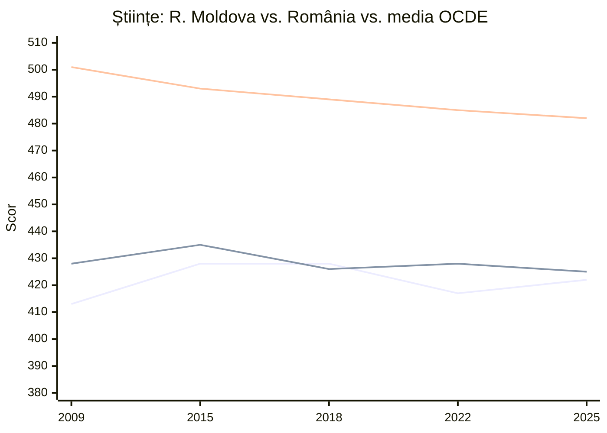

↑ [[00 Index - Analiza comparată internațională]] · Context european: [[Europa - spațiul european al educației]] · Reper: [[Estonia - ecosistemul educațional]]

> [!check] Verificat cu publicațiile oficiale (15.09.2026)
> - **OCDE**: *PISA 2025 Results (Volume I): Future-Ready Students* (377 p.) — tabelele I.1–I.6, I.2.4, I.2.9, I.2.10, figura I.2.4 — și *Country Note: Romania* (12 p.). Fișierele sunt în `input/`.
> - **R. Moldova**: ANCE, *Republica Moldova în Programul pentru Evaluarea Internațională a Elevilor PISA 2025* — raportul național (115 p.), în `input/raport_pisa_2025_mda.pdf`.
> - **România**: MEC, comunicatul *Sistemul educațional românesc în oglinda evaluărilor naționale și internaționale: Focus PISA 2025* (edu.ro).
> - Scorurile, schimbările 2022–2025, ponderile de performeri de top / slabi, gradientul socio-economic și decalajele de gen din această notă corespund **tabelelor OCDE I.1–I.3**.
> - **Corecturi față de prima versiune a notei**:
>   - (1) 422 **nu** este cel mai bun scor la științe al Moldovei — maximul rămâne **428** (2015, 2018). Record sunt **decalajele** față de OCDE, cele mai mici din istorie.
>   - (2) Procentele sub nivelul 2 pe domenii au fost înlocuite cu valorile exacte din raport.
>   - (3) **57%** dintre elevii români sunt **sub Nivelul 3** la rezolvarea computațională. În text, OCDE spune că scala nu are un prag formal de bază, dar în tabloul de bord al notelor de țară folosește Nivelul 3 ca „nivel de bază” pentru acest domeniu.
>   - (4) Circa **două treimi** din reducerea decalajului Moldovei față de OCDE se explică prin **scăderea mediei OCDE**, nu prin progres propriu.
>   - (5) Au fost adăugate **regiunile Ucrainei participante** (17 din 27; reper în raportul moldovenesc, peste Moldova la toate domeniile, inclusiv cel digital), decalajele rural–urban ale României (94–109 puncte), variația dintre școli și datele despre resursele digitale.
>   - (6) **Autoreglarea autodeclarată nu diferențiază** Moldova de România: 45% dintre elevii români își planifică des învățarea (Moldova: 46%; OCDE: 37%). Nu poate explica diferența la domeniul digital.
>   - (7) Indicele OCDE al **capacității școlilor de a folosi dispozitivele digitale** e **mai mic** în Moldova (−0,27) decât în România (−0,06). Nici infrastructura școlară nu explică avantajul digital al Moldovei.
>   - (8) Clasamentul OCDE al **performanței relative** la rezolvarea computațională (figura I.2.4) **confirmă** analiza „surplusului digital”: Moldova e peste media OCDE, România sub.

> [!abstract] Pe scurt
> 1. **Aproape la egalitate în 2025.** La cele trei domenii clasice, România e ușor înainte: științe **425 vs. 422** (diferență nesemnificativă statistic), matematică **419 vs. 410**, citire **413 vs. 404**. Ambele țări sunt la 44–60 de puncte sub media OCDE (482 / 463 / 461). Circa **39%** dintre elevi, în ambele țări, sunt sub nivelul 2 **la toate cele trei domenii** (OCDE: 19,7%).
> 2. **Convergență față de OCDE, dar mai ales prin declinul OCDE.** Decalajele Moldovei sunt în 2025 cele mai mici din istorie (științe 88 → 60, matematică 99 → 53, citire 105 → 57). Raportul ANCE arată însă că **doar circa o treime** din reducere e progres propriu; **două treimi** vin din scăderea mediei OCDE. Scorurile Moldovei au urcat până în 2015–2018 și au scăzut apoi. Excepție face științele în 2025 (+5), dar maximul rămâne 428 (2015 și 2018). România stagnează din 2012 și scade în 2025 (citire −16). **Tendința decenală 2015–2025** (OCDE, tabelul I.2.9), în puncte pe deceniu, la științe / citire / matematică: Moldova **−9 / −15 / −10**, România **−8 / −18 / −22**, OCDE −7 / −27 / −24. Ambele țări scad, România mai accentuat la matematică.
> 3. **Echitate: avantaj clar Moldova.**
>    - Statutul socio-economic explică **13,4%** din variația la științe în Moldova (OCDE: 11,6%), față de **21,7%** în România. La matematică: **13,2% vs. 24,1%**.
>    - Variația **dintre școli**: **26,2%** în Moldova vs. **50,2%** în România — România are un sistem puternic segmentat.
>    - Decalajul **rural–urban**: **51–56** de puncte în Moldova vs. **94–109** în România.
> 4. **Excelență: avantaj România.** Performeri de top la matematică: **4,3%** vs. **1,0%**; la științe: 1,8% vs. 0,9%; la citire: 1,2% vs. 0,4% (OCDE: 7,8% / 7,2% / 5,6%). Distribuția moldovenească e „comprimată”, cu puțini elevi la ambele extreme.
> 5. **Domeniul digital — Moldova înaintea României.** *Rezolvarea computațională a problemelor* (componenta-cheie a evaluării *Învățarea în lumea digitală*): Moldova **452**, România **442**, Bulgaria 425, Georgia 413, regiunile Ucrainei **478**, media UE 492, media OCDE 500. Conform OCDE (figura I.2.4), elevii moldoveni obțin la domeniul digital rezultate **peste cele așteptate** pe baza scorului la științe, într-o proporție **mai mare decât media OCDE**. România se află în jumătatea inferioară a clasamentului, **sub** media OCDE (vezi §8).
> 6. **Lecția centrală.** Aderarea la UE (2007) și fondurile europene nu au adus României rezultate mai bune decât ale unui stat mai sărac, cu un sistem mai puțin selectiv. Implementarea, echitatea și consecvența contează mai mult decât resursele brute.

---

## 1. Profil și date-cheie

| Indicator | Republica Moldova | România | Sursă / observații |
|---|---|---|---|
| Populație | ~2,4 mil. (recensământul 2024) | ~19 mil. | BNS; INS |
| Participare PISA | 2009 (testare 2010), 2015, 2018, 2022, 2025 — a cincea participare | din 2000 (testare 2002), toate ciclurile din 2006 | ANCE; OCDE |
| Eșantion PISA 2025 | **6.640** de elevi, **273** de instituții | **7.725** de elevi, **322** de școli (~172.000 de tineri de 15 ani, 76% din cohortă) | ANCE; MEC România |
| Mod de administrare | pe hârtie în 2009–2018; **pe calculator în 2022 și 2025** — comparația 2018 → 2022 e afectată de schimbarea modului | pe calculator | ANCE (raport, §75) |
| Cadrul legal | **Codul Educației** nr. 152/2014; Strategia **„Educația 2030”** (HG 114/2023) | **Legea învățământului preuniversitar** nr. 198/2023 | [[8.3 Sistemul de învățământ din Republica Moldova]]; [[Europa - spațiul european al educației]] |
| Relația cu UE | țară candidată (2022), negocieri deschise (2024) | stat membru (2007) | — |
| Trunchi comun | școală de 9 clase; liceu de 3 ani | 8 clase + clasa pregătitoare; admitere la liceu după Evaluarea Națională la clasa a VIII-a | în România, admiterea competitivă și segregarea teritorială produc o separare mai puternică între școli (§3.3) |
| Particularitate structurală | multe **școli mici** (sub 400 de elevi) în sate; școli cu predare în rusă; reorganizarea rețelei (stimulent de 1.000 lei/lună pentru familiile care mută copiii din școli cu sub 50 de elevi) | segregare școlară și teritorială; comunități rome; meditații răspândite | ANCE; MEC Moldova (2026); ET Monitor 2025 |

---

## 2. Traiectoria PISA 2009–2025

### 2.1 Scoruri pe cicluri (citire / matematică / științe)

| Ciclu | **R. Moldova** | **România** | Media OCDE | Diferența MD − RO |
|---|---|---|---|---|
| 2009 (MD: testare 2010) | 388 / 397 / 413 ✔ | 424 / 427 / 428 *(de verificat)* | 493 / 496 / 501 | −36 / −30 / −15 |
| 2012 | — (nu a participat) | 438 / 445 / 439 | 496 / 494 / 501 | — |
| 2015 | 416 / 420 / 428 ✔ | 434 / 444 / 435 *(de verificat)* | 493 / 490 / 493 | −18 / −24 / −7 |
| 2018 | 424 / 421 / 428 ✔ | 428 / 430 / 426 | 487 / 489 / 489 | −4 / −9 / +2 |
| 2022 | 411 / 414 / 417 ✔ | 428 / 428 / 428 | 476 / 472 / 485 | −17 / −14 / −11 |
| **2025** | **404 / 410 / 422** ✔ | **413 / 419 / 425** ✔ | **461 / 463 / 482** ✔ | **−9 / −9 / −3** |

✔ = confirmat în raportul național ANCE PISA 2025 (diagramele 2.1–2.3 și 2.9–2.14) și, pentru România 2025, în comunicatul MEC România.

*Linii (de sus în jos): media OCDE, România, R. Moldova. Valorile României pentru 2009 și 2015 sunt „de verificat”.*

### 2.2 Ce arată tendința — după raportul ANCE

| Domeniu | Evoluția Moldovei 2009 → 2025 | Maximul Moldovei | Evoluția din 2018 |
|---|---|---|---|
| **Științe** | +9 (413 → 422) | **428** (2015, 2018) | −11 (2022), apoi +5 (2025): recuperare parțială |
| **Matematică** | +13 (397 → 410); toată creșterea s-a produs până în 2015 | 421 (2018) | −7 (2022), −4 (2025, nesemnificativ) |
| **Citire** | +16 (388 → 404) | 424 (2018) | −20 în două cicluri — **cel mai accentuat declin** |

> [!warning] Cum se citește „convergența” Moldovei
> Raportul ANCE descompune reducerea decalajelor față de OCDE în perioada 2009–2025:
>
> | Domeniu | Reducerea decalajului | din care progres propriu | din care scăderea OCDE |
> |---|---|---|---|
> | Științe | 28 de puncte | 9 (~32%) | 19 (~68%) |
> | Matematică | 46 de puncte | 13 (~28%) | 33 (~72%) |
> | Citire | 48 de puncte | 16 (~33%) | 32 (~67%) |
>
> - În **2009–2018**, convergența a venit în principal din **progresul Moldovei**.
> - În **2018–2025**, la matematică și citire, decalajul s-a redus **exclusiv** pentru că OCDE a scăzut mai mult decât Moldova. Singura excepție: științele în 2025.
> - La elevii **sub nivelul 2**, apropierea de OCDE vine în proporție de **~89%** (științe) din creșterea ponderii elevilor slabi în OCDE, nu dintr-o scădere în Moldova.
> - Scorurile moldovenești reprezintă azi circa **88%** din media OCDE (2009: 79–82%).

> [!note] Comentariu
> - **România: platou, apoi declin.** Vârful a fost în 2012 (438 / 445 / 439). În 2025 pierde 16 puncte la citire (media OCDE: −14), 9 la matematică și 3 la științe. Poziția în UE: antepenultima, înaintea Bulgariei și Ciprului.
> - **Convergența dintre cele două țări** e reală: de la 30–36 de puncte diferență la citire și matematică (2009) la **9 puncte** (2025), adică sub jumătate de an școlar (circa 20 de puncte).

---

## 3. PISA 2025 în detaliu

### 3.1 Niveluri de competență

| Indicator (PISA 2025) | R. Moldova | România | Media OCDE | Media UE |
|---|---|---|---|---|
| Sub nivelul 2 — **științe** | **46,1%** | **45,8%** | 25,7% | 27,2% |
| Sub nivelul 2 — **matematică** | **55,8%** (identic cu 2022) | **51,8%** | 34,8% | 34,8% |
| Sub nivelul 2 — **citire** | **51,7%** | **47,7%** | 31,0% | 33,9% |
| Nivelul 1b sau mai jos — științe / matematică / citire | 16,6% / 27,0% / 22,2% | 20,2% / 30,1% / 23,7% | 8,1% / 15,3% / 12,4% | — |
| Performeri de top (niv. 5–6) — științe / matematică / citire | **0,9% / 1,0% / 0,4%** | **1,8% / 4,3% / 1,2%** | 7,2% / 7,8% / 5,6% | 6,1% / 6,6% / 4,3% |
| Sub nivelul 2 la **toate trei** domeniile | **39,0%** | **38,5%** (2022: 33,2%) | 19,7% | — |
| Performeri de top în ≥ 1 domeniu | **1,5%** | **4,8%** | 11,9% | — |
| Elevul „mediu” | Nivelul 2 la științe; **Nivelul 1a** la matematică și citire | Nivelul 2 la științe; sub Nivelul 2 la matematică și citire | — | — |

*Surse*: ANCE, raportul național PISA 2025, tabelele 2.4–2.6 (MD, RO, OCDE, UE); MEC România (RO: 46% / 52% / 48%); OCDE, *PISA 2025 Results (Vol. I)* (indicatorii combinați). Unele medii UE sunt calculate din tabelele ANCE.

> [!tip] Două profiluri distributive diferite (ANCE, §47)
> Deși mediile diferă cu doar 9 puncte, **România este polarizată**: mai mulți performeri de top **și** mai mulți elevi foarte slabi (Nivelul 1b sau mai jos). **Moldova este comprimată**: puțini elevi la ambele extreme. Intervalul dintre percentilele 10 și 90 la științe: **226** de puncte în Moldova vs. **263** în România (OCDE: 259). La citire: **222** vs. **262**.

### 3.2 Echitate: statut socio-economic, mediu, gen

| Dimensiune | R. Moldova | România | Media OCDE |
|---|---|---|---|
| Variația explicată de statutul socio-economic — științe / matematică | **13,4% / 13,2%** (2022: 14,1% / 15,6%) | **21,7% / 24,1%** | 11,6% / 12,0% |
| Variația explicată — citire | **11,4%** | 18,8% *(aliniere tabelară de verificat)* | 9,2% |
| Panta gradientului (puncte / unitate ESCS) — științe / matematică | **32 / 30** | **44 / 48** | 36 / 35 |
| Elevi dezavantajați **rezilienți** — științe / matematică | **11,2% / 11,3%** (în creștere față de 2022) | **7,0% / 6,1%** | 11,9% / 11,8% |
| Diferența avantajați − dezavantajați (științe / matematică / citire) | **84** (OCDE) / 85 (ANCE) / 78 / 75 de puncte (științe: 73 în 2009 → 85 în 2025, după ANCE) | **122** (științe); decalaj **lărgit** între 2015 și 2025, prin **scăderea** elevilor dezavantajați (nota OCDE) | 85 |
| **Rural vs. urban** — științe / matematică / citire | **391 vs. 447 (−56) / 382 vs. 433 (−51) / 373 vs. 428 (−55)** | **−98 / −109 / −94** de puncte | — |
| Școli mici (≤ 400 de elevi) vs. mari (> 900) — sub nivelul 2 la științe / matematică / citire | **58,6% vs. 28,0% / 68,0% vs. 37,4% / 65,0% vs. 32,3%** | — | — |
| Gen — citire (fete − băieți) | **+38** (423 vs. 385); sub nivelul 2: fete 41,9%, băieți **61,2%** | **+30** (429 vs. 399); sub nivelul 2: fete 41,2%, băieți 53,5% | +30 (476 vs. 446); sub nivelul 2: fete 25,4%, băieți 36,6% |
| Gen — științe (fete − băieți) | +10–11 (427 vs. 417) | +2 (426 vs. 424) | +2 |
| Gen — matematică (băieți − fete) | +4 (nesemnificativ) | +7 (422 vs. 416) | +13 |

*Surse*: ANCE, raportul național PISA 2025 (§§100–148, tabelele 2.8–2.12); OCDE, *PISA 2025 Results (Vol. I)*, tabelele I.2 și I.3; OCDE, *Country Note: Romania*; MEC România (decalajele rural–urban).

> [!warning] Nuanțe din raportul ANCE despre echitatea Moldovei
> - La științe, creșterea națională de 9 puncte în 2009–2025 se datorează **aproape exclusiv elevilor avantajați** (+19). Elevii dezavantajați au stagnat (+7), iar decalajul social s-a **lărgit** de la 73 la 85 de puncte.
> - Elevul „mediu” **dezavantajat**, **rural** sau dintr-o **școală mică** nu atinge nivelul 2 **la niciun domeniu**.
> - Excelența e concentrată aproape exclusiv la elevii **avantajați** și **urbani**. Performerii de top la citire: 0% la elevii dezavantajați, 0,04% în mediul rural.
> - Echitatea „bună” a Moldovei e deci **relativă**: e rezultatul unei distribuții comprimate la un nivel scăzut, nu al unui sistem care ridică elevii dezavantajați.

### 3.3 Variația dintre școli și din interiorul școlilor (științe)

| | R. Moldova | România | Bulgaria | Media OCDE | Media UE |
|---|---|---|---|---|---|
| Variația **între** școli | **26,2%** | **50,2%** | 57,1% | 31,3% | 35,3% |
| Variația **în interiorul** școlilor | 73,8% | 49,8% | 42,9% | 68,7% | 64,7% |

> [!note] Comentariu
> Cu scoruri medii la științe care diferă cu doar 3 puncte, România și Moldova au o diferență de **24 de puncte procentuale** la acest indicator (ANCE, §60). În România, performanța depinde în mare măsură de **școala** frecventată: colegii naționale de elită față de școli rurale sau segregate. În Moldova, diferențele sunt mai ales **în aceeași școală**. Aceasta e expresia statistică a **selecției și segregării** românești → [[Echitatea și școala comprehensivă]].

---

## 4. Cronologia reformelor (1990–2026)

| An | R. Moldova | România | Legătura cu fundamentele manualului |
|---|---|---|---|
| 1995 | Legea învățământului nr. 547 | Legea învățământului nr. 84 | idealul educațional (M04) — vezi [[Erori și actualizări ale manualului]] |
| 1997–2000 | primul curriculum național modernizat | Curriculumul Național (1998), evaluarea descriptivă în primar | paradigma curriculumului (M02, M10) |
| 2010 | curriculum centrat pe competențe (ediția 2010) | — | competențe (M04) |
| 2011 | — | Legea educației naționale nr. 1/2011 | sistem și management (M08) |
| 2013 | finanțarea per elev; optimizarea rețelei școlare | — | management (M08) |
| 2014 | **Codul Educației** nr. 152 | — | finalități, formele educației, LLL (M03–M04) |
| 2015–2016 | evaluarea criterială prin descriptori în primar (fără note) | — | evaluarea formativă (M10) |
| 2017 | — | **„Informatică și TIC”** în trunchiul comun, clasele V–VIII (din 2017–2018) | dimensiunea tehnologică (M06) |
| 2018 | **„Educație digitală”** — obligatorie în clasa I, opțională în II–VI; *Educație pentru societate*, *Dezvoltare personală* | proiectul „România Educată” (2018–2021) | noile educații (M07) |
| 2019 | curriculum pe competențe (ediția 2018–2019); **„Tekwill în Fiecare Școală”** | — | nonformal + formal (M03) |
| 2020–2021 | învățământ la distanță (pandemie) | învățământ la distanță; PNRR, componenta Educație | formele educației (M03) |
| 2022 | primul ciclu PISA pe calculator | — | — |
| 2023 | Strategia **„Educația 2030”** (HG 114/2023) | **Legile 198 și 199/2023** (preuniversitar, superior) | reformă (M08) |
| 2024–2026 | școli-model; laboratoare STEM și de robotică (proiectul EQIP, Banca Mondială); manuale estoniene la matematică | Smart Lab-uri PNRR (~117,5 mil. €) în licee; programe școlare noi pentru liceu; restricții pentru telefoane în școli (49% dintre elevi în școli cu interdicții în 2025, față de 22% în 2022) | dimensiunea tehnologică și științifică (M06) |
| 2026 (după PISA 2025) | lectura zilnică de 30 de minute (pilot), examenele de la clasa a IX-a revizuite pe model PISA, 60.000 de cărți noi pentru biblioteci, programul „Citește-mi 100 de povești” în grădinițe | dezbatere publică despre „analfabetismul funcțional”; prioritate declarată: alfabetizarea în IA independentă de resursele familiei | proiectare și evaluare (M10) |

---

## 5. Implementarea fundamentelor — comparație pe dimensiunile manualului

| Fundament (modul) | R. Moldova | România | Evaluare comparativă |
|---|---|---|---|
| **Finalități, competențe** (M04) | Codul Educației art. 11 — 9 competențe-cheie aliniate la UE; ținta „Educația 2030”: 100% dintre absolvenți la nivelul B1 de competențe digitale | profilul absolventului, competențele-cheie europene în programele școlare | cadre similare, derivate din recomandările UE (2006, 2018). Diferența ține de **implementare** |
| **Formele educației, LLL** (M03) | nonformal digital puternic, susținut de industria IT și de donatori (Tekwill); validarea competențelor prin Ordinul 885/2022 | palatele și cluburile copiilor (dotate cu Smart Lab-uri), ONG-uri; meditațiile ca educație paralelă | Moldova a folosit **nonformalul** ca pârghie națională. România a investit în **infrastructura formală** |
| **Dimensiunea tehnologică/digitală** (M06) | Educație digitală (2018), Informatică din clasa a VII-a (1 oră/săpt.), laboratoare de robotică, cursuri Tekwill | Informatică și TIC în clasele V–VIII (din 2017), Smart Lab-uri PNRR | România are **mai multe ore formale**, dar rezultate digitale mai slabe → §8 |
| **Sistemul, echitatea** (M08) | variație mică între școli (26%); rețea de școli mici; școli-model | variație mare între școli (50%); selecție la liceu; decalaj rural–urban de ~100 de puncte | Moldova — problemă de **rețea** și de nivel general scăzut; România — problemă de **selecție și segregare** |
| **Profesorii** (M09) | deficit, îmbătrânire, salarii mici; formare digitală masivă prin programe | salarii mici, dar în creștere; formare prin CCD-uri; titularizare competitivă | probleme similare de statut |
| **Evaluarea** (M10) | evaluare criterială fără note în primar; examenele de la clasa a IX-a revizuite pe model PISA (2026) | Evaluarea Națională la clasele II, IV, VI, VIII; examene cu miză mare pentru admitere | România are un sistem de examene **cu miză mai mare** |
| **Educația bazată pe dovezi** (M01, M05) | ANCE publică un **raport național detaliat** (115 p.), cu analiza tendințelor, a echității, a atitudinilor și a resurselor | CNPEE; comunicat detaliat al MEC | raportul ANCE e un instrument de diagnostic de bună calitate, **autocritic** (ex. descompunerea convergenței) |

---

## 6. Factori explicativi ai asemănărilor și diferențelor

| Factor | Efect probabil | Tărie a dovezilor |
|---|---|---|
| **Moștenirea post-comunistă comună** (curriculum încărcat, predare transmisivă, tradiție olimpică) | nivel similar, sistem slab adaptat la competențele PISA | medie |
| **PIB și cheltuieli** | România e mult mai bogată, dar nu obține rezultate proporțional mai bune | puternică pentru „banii nu sunt suficienți” |
| **Selecția și segregarea** (România) | variație între școli de 50%, mai mulți performeri de top, gradient social abrupt, decalaj rural–urban de ~100 de puncte | puternică (ANCE, tabelul 2.10 și diagrama 2.7; MEC România) |
| **Școlile mici și satele** (Moldova) | 60–65 de puncte între școlile mari și cele mici | puternică ca asociere; cauzalitatea implică profesori, resurse, compoziție socială |
| **Declinul general OCDE** | explică ~2/3 din „convergența” Moldovei | puternică (descompunerea ANCE) |
| **Schimbarea modului de testare** (hârtie → calculator, Moldova 2022) | posibil efect asupra scăderii 2018 → 2022 | medie (semnalat de ANCE) |
| **Migrația** | copii rămași în grija rudelor, deficit de profesori | plauzibilă, necuantificată în PISA |
| **Scăderea citirii** (utilizarea digitală, pandemie) | declin în ambele țări, în linie cu OCDE | medie |

---

## 7. Comparație sintetică

| | R. Moldova | România |
|---|---|---|
| **Punct forte** | distribuție comprimată, variație mică între școli, rezultat digital peste așteptări, raport național de diagnostic de calitate | performeri de top; resurse mai mari |
| **Punct slab** | 0,4–1% performeri de top; **55,8%** sub nivelul 2 la matematică; băieții la citire (61% sub nivelul 2); elevii dezavantajați stagnează | școli segregate (50% variație între școli); decalaj rural–urban de ~100 de puncte; declin la citire |
| **Tendință** | ↗ până în 2015–2018; ↘ la citire și matematică după 2018; ↗ la științe în 2025 | → platou din 2012, ↘ în 2025 |
| **Riscul principal** | stagnarea elevilor dezavantajați și a celor din școlile mici; lipsa excelenței | segregarea și „analfabetismul funcțional” de masă |

---

## 8. NOTĂ SPECIALĂ — Competența digitală: PISA 2025 *Învățarea în lumea digitală*

### 8.1 Ce a măsurat PISA 2025 (după raportul ANCE, §§61–65)

- PISA 2025 a inclus o evaluare inovativă, ***Învățarea în lumea digitală*** (*Learning in the Digital World*). Componenta-cheie raportată este **rezolvarea computațională a problemelor**.
- Evaluarea măsoară capacitatea elevilor de a se angaja într-un **proces iterativ și autoreglat de construire a cunoștințelor și de soluționare a problemelor**, cu instrumente și practici computaționale:
  - instrumente de **modelare** și de **programare**;
  - practici: **realizarea experimentelor**, **analiza datelor**, **construirea și optimizarea modelelor computaționale**;
  - elevii au parcurs **unități extinse de testare**, cu sarcini de complexitate crescândă și acces la **resurse de învățare** (tutoriale, feedback, exemple) — deci testul măsoară și cât de bine **învață** elevii în timpul sarcinii;
  - performanța e susținută de **învățarea autoreglată**: menținerea motivației, monitorizarea progresului, adaptarea strategiilor, autoevaluarea.
- **Scala** are media OCDE de **500**. **Nu există un prag formal al nivelului de bază**; **Nivelul 3** (468 de puncte) e reperul la care elevii au competențe suficient de solide pentru a progresa rapid.

| Nivel | Scor minim | Ce pot face elevii |
|---|---|---|
| 5–6 | 566 / 622 | programare și modelare sofisticată; programe optime, fără erori (niv. 6) |
| 4 | 512 | programe și modele de complexitate moderată; valorifică tiparele repetitive din cod |
| **3** (reper) | **468** | combină mai multe comenzi în programe funcționale; experimente controlate simple într-un model |
| **2** | **427** | operații simple (ex. instruirea unui program să repete o acțiune); încep să testeze idei |
| 1 | 330 | modificări minore în programe simple; ajustarea unei singure variabile |
| sub 1 | — | explorare rudimentară a interfeței, fără obiectiv |

- Legătura cu vaultul: [[Învățarea autoreglată, metacogniția și autoeducația]], [[3.6 Educația permanentă și autoeducația]], [[Constructionismul și educația digitală]].

### 8.2 Rezultatele

| Sistem | Rezolvarea computațională a problemelor | Nivelul elevului „mediu” | Observații |
|---|---|---|---|
| **Media OCDE** | **500** | Nivelul 3 | — |
| Estonia | 541 | Nivelul 4 | primul loc în Europa ([[Estonia - ecosistemul educațional]]) |
| **Media UE** | **492** | Nivelul 3 | — |
| **Regiunile Ucrainei** (17 din 27) | **478** | Nivelul 3 | cel mai bun rezultat din grupul de referință al raportului ANCE |
| **R. Moldova** | **452** | **Nivelul 2** (16 puncte sub Nivelul 3) | −48 față de OCDE, −40 față de UE; în clasamentul OCDE (tabelul I.2.4), nediferențiat statistic de Qatar, Costa Rica și Kazahstan |
| **România** | **442** | Nivelul 2 | locul 51 din 91; **57% dintre elevi sub Nivelul 3** (MEC România). Nivelul 3 e pragul folosit de OCDE ca „nivel de bază” în tabloul de bord al notei de țară |
| Bulgaria | 425 | Nivelul 1 | — |
| Georgia | 413 | Nivelul 1 | — |

*Surse*: OCDE, *PISA 2025 Results (Vol. I)*, tabelele I.1 și I.2.4; ANCE, raportul național PISA 2025, tabelul 2.7 și diagrama 2.8; MEC România. Procentul elevilor moldoveni sub Nivelul 3 **nu apare** nici în raportul ANCE, nici în textul Volumului I (se află în tabelul online I.B1.2a.13).

> [!info] Context OCDE (Volumul I, cap. 2)
> - În OCDE: **26%** performeri de top (nivelurile 5–6), 21% la Nivelul 4, 17% la Nivelul 3, 13% la Nivelul 2, 17% la Nivelul 1, 5% sub Nivelul 1.
> - Corelația din interiorul țărilor între rezolvarea computațională și celelalte domenii e de **0,76** cu științele, **0,75** cu matematica și **0,69** cu citirea. Între domeniile clasice, corelațiile sunt mai mari (științe–matematică: 0,88). Domeniul digital măsoară deci **competențe distincte**.
> - În medie, doar circa **43%** din variația la rezolvarea computațională se asociază în mod unic cu performanța la științe.
> - Particularitate: elevii pot folosi **feedback și resurse** în timpul testului. Scorul reflectă și **cât de bine învață** elevii în timpul sarcinii, nu doar ce știu deja.

### 8.3 Analiza: „surplusul digital”

Comparăm scorul digital cu **media scorurilor de bază** (citire, matematică, științe) a fiecărei țări. Indicatorul e euristic, nu o statistică OCDE: scalele sunt construite separat.

| Sistem | Media celor 3 domenii de bază | Scor digital | Diferența digital − bază | Decalaj față de OCDE: bază → digital |
|---|---|---|---|---|
| Media OCDE | 469 | 500 | **+31** | — |
| **R. Moldova** | **412** | **452** | **+40** | −57 → **−48** (se reduce) |
| **Regiunile Ucrainei** | 432 | 478 | +46 | −37 → −22 (se reduce) |
| **România** | **419** | **442** | **+23** | −50 → **−58** (se mărește) |
| Georgia | 407 | 413 | +6 | −62 → −87 |
| Bulgaria | 404 | 425 | +21 | −65 → −75 |

> [!tip] Ce arată tabelul
> - În grupul de referință, doar **Moldova și regiunile Ucrainei participante** au un „surplus digital” mai mare decât media OCDE. Ambele sunt state post-sovietice cu sectoare IT dinamice. Regiunile Ucrainei au un avantaj și mai mare, **în condiții de război**. Ordinea e confirmată de indicatorul OCDE al performanței relative (figura I.2.4).
> - România are un scor de bază **mai bun** decât Moldova (+7), dar un scor digital **mai slab** (−10). Diferența relativă e de circa **17 puncte** în favoarea Moldovei.
> - Elevii moldoveni **transformă mai bine** cunoștințele de bază (modeste) în rezolvare de probleme cu instrumente digitale. Rămân însă la Nivelul 2.

> [!check] Confirmare prin indicatorul OCDE
> OCDE calculează **performanța relativă**: ponderea elevilor care obțin la rezolvarea computațională un scor peste cel așteptat, comparativ cu elevii din toate țările care au același scor la științe (figura I.2.4, tabelul I.B1.2a.20). În clasamentul descrescător al acestui indicator:
> - **R. Moldova** apare **înaintea mediei OCDE**: … Coreea, Spania, Belgia, **Moldova**, Suedia, SUA, *media OCDE*, Regatul Unit …;
> - **România** apare **mult sub media OCDE**: … Germania, Uruguay, Qatar, **România**, Italia, Finlanda …;
> - Bulgaria și Georgia sunt și mai jos.
>
> Deci, **la același nivel de competență la științe**, un elev moldovean are șanse mai mari decât media OCDE să rezolve mai bine problemele computaționale, iar unul român, șanse mai mici. Valorile exacte sunt în tabelul online (stat.link/xgs41b), neinclus în PDF.

### 8.4 Ce face bine R. Moldova — factori care pot explica rezultatul

> [!warning] Precauție metodologică
> PISA **nu poate stabili cauzalitatea**. Mai jos sunt **ipoteze**, construite din politicile documentate, din datele chestionarelor PISA 2025 (raportul ANCE) și din **momentul** în care cohorta testată a fost expusă la politici. Elevii testați s-au născut în jurul anilor **2009–2010**: clasa I în 2016–2017, clasa a VII-a în 2022–2023. Raportul ANCE **nu** oferă o explicație oficială a rezultatului digital.

#### Ce diferențiază datele Moldova de România — și ce nu

| Indicator PISA 2025 | R. Moldova | România | Media OCDE | Diferențiază MD de RO? |
|---|---|---|---|---|
| Performanța relativă la rezolvarea computațională, față de științe | peste media OCDE | sub media OCDE | — | ✅ **da** (rezultatul de explicat) |
| Variația dintre școli (științe) | 26,2% | 50,2% | 31,3% | ✅ **da** |
| Elevi care folosesc chatboți IA cel puțin săptămânal pentru a învăța | **47,8%** | 39,9% | 45,5% | ✅ **da** (+8 pp) |
| Elevi care evaluează la ore informații generate de IA | 74,2% | 72,6% | 62,6% | ❌ nu (ambele mult peste OCDE) |
| Își planifică des învățarea (autoreglare) | 46% | 45% | 37% | ❌ nu |
| Își pun des întrebări ca să verifice înțelegerea | 49,8% | 53% | 49% | ❌ nu (România ușor peste) |
| Indicele capacității școlii de a folosi dispozitivele digitale | **−0,27** | −0,06 | −0,03 | ❌ **invers** (România mai bine) |
| Elevi fără distragere digitală la ore | 38,3% | 37,9% | 39,2% | ❌ nu |
| Școli cu interdicția telefoanelor | 51,4% | 49,3% | 49,5% | ❌ nu |
| Ghiduri pe discipline pentru dispozitivele digitale | 67,3% | 72,8% | 71,2% | ❌ invers |
| Efectul distragerii digitale asupra scorului la științe | −11 | **−18** | −11 | ✅ da (efect mai slab în MD) |

*Surse*: OCDE, *PISA 2025 Results (Vol. I)*, tabelul I.6 și figura I.2.4; OCDE, *Country Note: Romania*; ANCE, tabelele 3.8 și 4.1.

> [!warning] Ce rezultă
> - Avantajul digital al Moldovei **nu** vine din școli mai bine dotate: indicele capacității digitale e **mai mic** decât în România.
> - **Nu** vine nici din practici de autoreglare declarate mai des: niveluri similare în ambele țări.
> - Rămân ca factori plauzibili cei care țin de **tipul de experiență** (programare și investigație, prin programe nonformale), de **structura sistemului** (segmentare scăzută) și de **utilizarea digitalului pentru învățare** (IA folosită mai des pentru a învăța, efect mai slab al distragerii).

#### (1) Autoreglarea: o condiție comună, nu un avantaj distinctiv

Domeniul digital măsoară explicit **învățarea autoreglată**. Chestionarul PISA 2025 (ANCE, tabelele 3.7–3.8; nota OCDE pentru România):

| Practică de autoreglare (des / foarte des sau acord) | R. Moldova | România | Media OCDE |
|---|---|---|---|
| Îmi planific modul de abordare a învățării | **46,0%** | **45%** | 37% |
| Rezum ideile principale fără notițe, ca să-mi aflu lacunele | 44,0% | — | 35% |
| Îmi schimb modul de lucru dacă nu e eficient | 51,2% | — | 44% |
| Îmi pun întrebări ca să verific dacă am înțeles | 49,8% | **53%** | 49% |
| Le cer ajutorul profesorilor când am nevoie | 78,7% | 75% | 77% |
| Îi întreb pe colegi când nu înțeleg ceva | 80,9% | 82% | 82% |

- În Moldova toate practicile se asociază **pozitiv** cu scorul la științe. Încercarea individuală înainte de a cere ajutor: **+18 puncte**. În România, o unitate a indicelui de stabilire a obiectivelor: +5 puncte (OCDE: +3).
- **Concluzie**: ambele țări au elevi care își declară practici de autoreglare **peste media OCDE**, deci autoreglarea **nu explică diferența** dintre ele. **Limită**: sunt **autodeclarații**, iar OCDE avertizează explicit că diferențele între țări pot reflecta **stiluri de răspuns** diferite. Contrast: în Japonia, doar 21% dintre elevi își planifică des învățarea, dar Japonia e în vârful OCDE. Analiza OCDE a învățării autodirijate e anunțată pentru **2027**.
- Legătura cu manualul: autocontrol, automonitorizare, autoevaluare → [[Autoeducația - teorii, autori și corelări]].

#### (2) Un ecosistem nonformal digital de acoperire națională, construit cu industria IT

- **„Tekwill în Fiecare Școală”** (lansat în **2019**) e un program național inițiat de **ATIC** (Asociația Națională a Companiilor din domeniul TIC) împreună cu MEC. E finanțat de **USAID, UE, Guvernul Suediei**, cu parteneri **PNUD, UNICEF, UN Women, Japonia**.
- Rezultate raportate după 5 ani (ianuarie 2025):
  - **102.517 elevi** au urmat cursuri IT gratuite (programare, dezvoltare web, grafică, inteligență artificială) pe *tekwill.online*, pentru clasele **VII–XII**;
  - **3.641** de profesori formați; **489** de instituții implicate;
  - **35** de laboratoare digitale (circa **18.000** de elevi deserviți); **780** de profesori dotați cu laptopuri.
- **Legătura cu cohorta PISA 2025**: elevii testați erau în clasele VII–IX exact în perioada de vârf a programului.
- **Potrivirea cu testul**: cursurile sunt de **programare și rezolvare de probleme**, adică gândire computațională, și sunt **autodirijate online**. Exersează tocmai componentele măsurate de PISA.
- Relevanță pentru manual: **integrare formal–nonformal** ([[3.5 Relația dintre formele educației]]).

#### (3) Echipamente orientate spre investigație: calitate îmbunătățită, dar capacitate generală încă scăzută

> [!warning] Nuanță importantă (OCDE, tabelul I.6)
> Indicele sintetic al **capacității școlilor de a îmbunătăți predarea cu dispozitive digitale** e în Moldova **−0,27**, sub România (−0,06) și sub media OCDE (−0,03). Explicația plauzibilă nu e deci „mai multă tehnologie în școli”, ci **tipul** de echipamente și de activități (investigație, robotică, programare), concentrate într-un număr limitat de școli și programe.

- **Proiectul EQIP** (MEC + Banca Mondială + Parteneriatul Global pentru Educație): **108 școli** dotate cu platforme pentru experimente cu senzori digitali, **seturi de robotică**, circuite electronice, microscoape digitale și imprimante 3D. Cel puțin **110** instituții au primit seturi de robotică („Clasa Viitorului”). Profesorii au fost formați în robotică educațională, modelare 3D și drone în STEM.
- **Datele PISA 2025 confirmă îmbunătățirea** (ANCE, diagrama 4.1): ponderea elevilor în școli unde **calitatea slabă a resurselor digitale** afectează instruirea a scăzut de la **40,5%** (2022) la **29,4%** (2025), o reducere **mai mare decât în OCDE**. Lipsa propriu-zisă a resurselor a scăzut de la 31% la 27,8%.
- **Capacitatea școlilor** (ANCE, tabelul 4.1): **84,4%** dintre elevi învață în școli ai căror directori consideră că profesorii au abilitățile tehnice și pedagogice pentru a integra dispozitivele digitale. **78,3%** au acces la resurse eficiente de formare. **Constrângerea principală este timpul**: 46,4% dintre elevi sunt în școli unde profesorii nu au suficient timp să pregătească lecții digitale.
- **Potrivirea cu testul**: echipamentele sunt de **investigație** (senzori, simulări, programare de roboți), iar domeniul PISA măsoară **modelare, experimente și programare**.

#### (4) Utilizare digitală pentru învățare predominant moderată

- În școală, **43,8%** dintre elevi folosesc dispozitivele pentru învățare până la o oră pe zi, iar doar 8,3% peste cinci ore (ANCE, tabelul 4.2).
- Performanța la științe urmează un **„U inversat”**: maximul (**436–437** de puncte) apare la **1–3 ore** de utilizare pentru învățare, minimul (**395**) la 5–7 ore.
- **Distragerea digitală** la orele de științe: **28,5%** în Moldova (OCDE: 28,4%), asociată cu **−11 puncte**. În **România** asocierea este mai puternică: **−18 puncte** (OCDE: −11).
- **Riscuri**: în zilele libere, circa **28%** dintre elevi petrec peste cinci ore pe zi pe dispozitive pentru divertisment. Utilizarea pentru timp liber peste o oră la școală se asociază cu scoruri tot mai mici (443 → 381–384).
- **IA**: **47,8%** dintre elevii moldoveni folosesc chatboți IA cel puțin săptămânal pentru a învăța (OCDE: 45,5%), față de **39,9%** în România. Zilnic: 22% în Moldova (ANCE). Mai mult, **74,2%** învață la ore să evalueze informațiile generate de IA (România: 72,6%; OCDE: 62,6%). PISA 2025 e primul ciclu care măsoară acest aspect.
- **România — utilizarea pentru timp liber la școală**: **1,7 ore/zi** (OCDE: 1,1), aproape cât pentru învățare (1,6 ore/zi; OCDE: 1,7). Datele moldovenești sunt raportate pe intervale și nu permit o comparație directă în ore.

#### (5) Introducerea timpurie a „Educației digitale” și o strategie cu ținte digitale

- **Educație digitală** (2018–2019): obligatorie în clasa I, opțională în clasele II–VI, cu **34.642** de elevi înscriși în primul an și **1.850 de tablete** pentru învățători. Ulterior a devenit un modul obligatoriu în clasele I–IV (15 ore în *Educație tehnologică*).
- **Nuanță de cohortă**: generația testată în 2025 era în clasele II–III în 2018, deci a avut acces doar **opțional**. Efectul direct e probabil limitat. Efectul **indirect** — formarea învățătorilor, normalizarea digitalului — poate conta mai mult.
- **„Educația 2030”** (HG 114/2023): certificarea competențelor digitale ale profesorilor după **DigCompEdu**, **3.000** de unități de conținut digital, ținta ca **100% dintre absolvenți** să atingă **nivelul B1** de competențe digitale până în 2030, un **program național privind IA** în educație. E aliniată la **Strategia de transformare digitală 2023–2030**.

#### (6) Un sector IT care trage educația după el și o distribuție comprimată

- Sectorul IT (*Moldova IT Park*, din 2018) are interes direct în formarea viitoarei forțe de muncă: aduce conținut actual, mentori și un **model de carieră** atractiv. Legătura cu manualul: **idealul de viață** ca motor al autoeducației.
- **Distribuția comprimată** (variație mică între școli, puțini elevi foarte slabi comparativ cu România și Bulgaria — ANCE, §43) înseamnă mai puțini elevi **complet excluși** de la competențele necesare pentru domeniul digital.

> [!note] Contrast cu România
> - România are **mai multe ore formale** de informatică în gimnaziu: *Informatică și TIC* în clasele V–VIII, din 2017–2018, deci patru ani pentru cohorta testată. Moldova are *Informatică* doar din clasa a VII-a, o oră pe săptămână.
> - **Smart Lab-urile PNRR** (circa **117,5 mil. €**) devin complet funcționale abia în anul școlar **2026–2027**, deci **după** testarea PISA 2025.
> - La nivelul populației, România are cea mai mică pondere din UE de persoane cu **competențe digitale de bază**: **27,7%** (2023; UE: 55,6%). La 16–24 de ani: 47% (UE: 70%).
> - Sistemul românesc e **puternic segmentat** (50% variație între școli, decalaj rural–urban de ~100 de puncte), iar distragerea digitală are un efect negativ mai mare (−18 puncte).
> - **Concluzie**: **orele din orar și echipamentele nu sunt suficiente**. Diferența pare să vină din **tipul de activitate** (programare și investigație, nu utilizarea TIC), din **ecosistemul nonformal**, din **structura mai puțin segmentată** a sistemului și din **folosirea digitalului (inclusiv a IA) pentru învățare**. Autoreglarea declarată și dotarea școlilor **nu** diferențiază cele două țări.

### 8.5 Ce trebuie corectat și ce rămâne incert

> [!warning] Limite ale rezultatului digital al Moldovei
> 1. **452 = Nivelul 2**, cu 48 de puncte sub OCDE și 40 sub UE: un succes **relativ**, nu absolut. **Regiunile Ucrainei participante** (478) arată că în regiune se poate mai mult.
> 2. **Fundamentele slabe** (55,8% sub nivelul 2 la matematică, 51,7% la citire) limitează plafonul.
> 3. **Dependența de donatori**: Tekwill, EQIP și echipamentele depind în mare parte de finanțare externă (USAID și-a redus drastic programele internaționale în 2025). **Sustenabilitatea** e un risc real (impactul concret asupra Tekwill — de verificat).
> 4. **Nu există o evaluare de impact** riguroasă a Tekwill sau a Educației digitale. Cifrele sunt de **participare**, nu de **efect**.
> 5. **Timpul profesorilor** e principala constrângere declarată de directori (46,4% dintre elevi în școli cu timp insuficient).
> 6. Datele pe **gen, mediu și autoreglare pentru domeniul digital** vor apărea abia în volumul OCDE din 2027.

### 8.6 Implicații

| Pentru R. Moldova | Pentru România |
|---|---|
| **Instituționalizarea** a ceea ce funcționează: integrarea cursurilor de tip Tekwill în curriculumul opțional finanțat de stat | **Pedagogia, nu doar echipamentele**: Smart Lab-urile trebuie folosite pentru programare, modelare și proiecte |
| **Extinderea Informaticii** în clasele V–VI, pe gândire computațională | **Parteneriate cu industria IT** pentru programe nonformale gratuite, cu acoperire națională și focus pe școlile rurale |
| **Timp pentru profesori** (reducerea birocrației, banca de lecții digitale din „Educația 2030”) | **Reducerea segregării**: competența digitală nu poate crește la nivel de sistem cu 50% variație între școli |
| **Evaluarea impactului** (școli cu/fără Tekwill, cu/fără laboratoare EQIP) | Formarea profesorilor pe **DigCompEdu** și pe **gândire computațională** |
| **Cultivarea autoreglării** și a folosirii IA pentru învățare, nu pentru a înlocui gândirea | Politici pentru **distragerea digitală** (efect −18 puncte) |

---

## 9. Lecții și transferabilitate reciprocă

> [!tip] Ce poate învăța România de la Moldova
> - Un sistem **mai puțin segmentat** obține scoruri medii aproape egale cu mult mai puține resurse.
> - **Ecosistemul nonformal digital** construit cu industria și orientat spre rezolvare de probleme.
> - Un **raport național PISA** detaliat și autocritic, folosit ca instrument de diagnostic.

> [!tip] Ce poate învăța Moldova de la România
> - **Cultivarea excelenței** fără selecție socială: centre de excelență, olimpiade, programe pentru elevii capabili de performanță (ANCE semnalează explicit lipsa mecanismelor de identificare a elevilor cu potențial înalt).
> - **Evaluările naționale periodice** ca instrument de **diagnostic**, fără miza admiterii.
> - **Absorbția fondurilor europene** pentru infrastructură, cu condiția ca pedagogia să vină odată cu echipamentele.

> [!tip] Reper comun: Estonia (și regiunile Ucrainei ca reper regional)
> Estonia: același punct de plecare post-sovietic, digitalizare timpurie (*Tiigrihüpe*, 1996; *ProgeTiiger*, 2012), școală de bază unitară și echitate → **541** la rezolvarea computațională a problemelor. Vezi [[Estonia - ecosistemul educațional]] și [[Constructionismul și educația digitală]]. Regiunile Ucrainei participante (**478**), în condiții de război, arată că decalajul regional nu e inevitabil.

---

## 10. Întrebări de reflecție

1. De ce România, cu PIB și fonduri europene mult mai mari, nu obține rezultate PISA mai bune decât Moldova?
2. Explicați cum pot coexista, în România, mai mulți performeri de top **și** mai mulți elevi foarte slabi decât în Moldova.
3. De ce „convergența” Moldovei față de OCDE trebuie interpretată cu prudență? Folosiți descompunerea ANCE.
4. Ce anume măsoară *Învățarea în lumea digitală* și de ce autoreglarea face parte din construct?
5. Care dintre factorii din §8.4 vi se par cei mai convingători? Cum ați testa empiric unul dintre ei?
6. De ce mai multe ore de informatică în orar (România) nu s-au tradus într-un scor digital mai bun?
7. Cum ar trebui reorganizată rețeaua de școli mici din Moldova fără a pierde legătura cu comunitatea?

---

## 11. Surse

**Publicații oficiale (verificate)**
- OCDE (2026). *PISA 2025 Results (Volume I): Future-Ready Students*. OECD Publishing, Paris, https://doi.org/10.1787/73451bc5-en — `input/PTliY2Q0YWMxM2I2YjhlMTEyYjZjZWIzNTlhM2VjNDA3.pdf` (tabelele I.1–I.6, I.2.4, I.2.5, I.2.9, I.2.10; figura I.2.4).
- OCDE (2026). *PISA 2025 Results (Volume I) – Country Notes: Romania* — `input/2b6e8684-en.pdf`.
- ANCE (2026). *Republica Moldova în Programul pentru Evaluarea Internațională a Elevilor PISA 2025* — raport național. [PDF](https://ance.gov.md/sites/default/files/raport_pisa_2025_mda.pdf); [pagina PISA a ANCE](https://ance.gov.md/content/programul-interna%C8%9Bional-de-evaluare-elevilor-pisa)
- MEC Moldova / ANCE (8.09.2026). [PISA 2025: Elevii din Republica Moldova au făcut progrese la științe...](https://mec.gov.md/ro/content/pisa-2025-elevii-din-republica-moldova-au-facut-progrese-la-stiinte-iar-decalajul-la); [ANCE](https://ance.gov.md/content/pisa-2025-elevii-din-republica-moldova-au-f%C4%83cut-progrese-la-%C8%99tiin%C8%9Be-iar-decalajul-la)
- MEC România (2026). [Sistemul educațional românesc în oglinda evaluărilor naționale și internaționale: Focus PISA 2025](https://www.edu.ro/press_rel_64_26_PISA_2025_rezultate_RO)
- OCDE (2026). *PISA 2025 Results (Volume I)* — Tabelele I.1–I.2 (preluate în [[Europa - spațiul european al educației]]); [pagina publicației](https://www.oecd.org/en/publications/pisa-2025-results-volume-i_73451bc5-en.html)
- ANCE — rapoartele naționale anterioare: [PISA 2022](https://ance.gov.md/sites/default/files/raport_pisa_2022_1.pdf), [PISA 2018](https://ance.gov.md/sites/default/files/raport_pisa2018.pdf), [PISA 2015](https://ance.gov.md/sites/default/files/raport_pisa_2015_ance.pdf)

**Presă**
- Edupedu (8.09.2026). [Rezultate PISA 2025. România scade abrupt cu 16 puncte la Citire...](https://www.edupedu.ro/breaking-rezultate-pisa-2025-romania-scade-abrupt-cu-16-puncte-la-evaluarea-competentelor-elevilor-la-citire-scadere-si-la-matematica-si-stiinte-pe-ultimele-locuri-in-ue-si-pe-locurile-48-55-din-9/)
- Spotmedia. [Functional illiteracy reaches around 50% in Romania...](https://spotmedia.ro/en/news/education/functional-illiteracy-reaches-around-50-in-romania-more-than-half-of-students-lack-basic-maths-skills-what-pisa-2025-results-show)
- Edupedu. [Deciziile Republicii Moldova, după rezultatele la PISA 2025...](https://www.edupedu.ro/deciziile-republicii-moldova-dupa-rezultatele-la-pisa-2025-pilotarea-a-30-de-minute-de-lectura-zilnica-in-scoli-examene-revizuite-pe-modelul-pisa-la-final-de-gimnaziu-dotarea-bibliotecilor-scolare/)
- Moldova Live. [Moldova's Education Minister Acknowledges Serious Math and Reading Gaps...](https://moldovalive.md/moldovas-education-minister-acknowledges-serious-math-and-reading-gaps-after-pisa-2025-results/)
- News.ro. [Rezultatele PISA 2025: Elevii din România, scoruri cu mult sub media OCDE...](https://www.news.ro/edu-news/rezultatele-pisa-2025-elevii-romania-scoruri-mult-media-ocde-matematica-lectura-stiinte-rezultate-scazute-lectura-fata-2022-putin-jumatate-dintre-elevi-ating-nivelul-minim-competenta-matematica-1922401408002026091222708844)

**Politici digitale**
- MECC Moldova (2018). [1850 de tablete pentru profesorii care vor preda modulul Educația digitală](https://mecc.gov.md/ro/content/1850-de-tablete-pentru-profesorii-care-vor-preda-modulul-educatia-digitala)
- Unda Liberă (2025). [Tekwill în Fiecare Școală: 5 ani de transformare a educației digitale](https://undalibera.md/pagina-principala/tekwill-in-fiecare-scoala-5-ani-de-transformare-a-educatiei-digitale-in-republica-moldova/); [ict.md](https://ict.md/tekwill-in-fiecare-scoala-transforma-educatia-digitala-in-moldova-3-500-de-profesori-formeaza-noile-talente-it/)
- MEC Moldova. [108 școli vor primi echipamente pentru experimente, robotică și proiectare 3D](https://www.edu.gov.md/ro/content/108-scoli-vor-primi-echipamente-pentru-experimente-robotica-si-proiectare-3d); [Clasa Viitorului — seturi de robotică](https://www.clasaviitorului.md/110-institutii-de-invatamant-din-tara-au-fost-dotate-cu-seturi-de-robotica-de-ultima-generatie/)
- MEC Moldova. [Programul de implementare a Strategiei „Educația 2030”](https://www.mec.gov.md/ro/content/guvernul-aprobat-programul-de-implementare-strategiei-de-dezvoltare-educatia-2030-investitii); [Strategia de transformare digitală 2023–2030](https://www.egov.md/sites/default/files/document/attachments/strategia_de_transformare_digitala_2023-2030.pdf)
- Eurydice. [Moldova — învățământul gimnazial](https://eurydice.eacea.ec.europa.eu/ro/eurypedia/moldova/predarea-si-invatarea-invatamantul-general-secundar-ciclul-i-invatamant-gimnazial)
- ISE România (2017). [Programa școlară Informatică și TIC, clasele V–VIII](https://www.ise.ro/wp-content/uploads/2017/01/Informatica-si-TIC.pdf); [MEC România — apelul Smart Lab](https://www.edu.ro/apel_pnrr_dotari_smart_labs); [Edupedu — Smart Lab-uri](https://www.edupedu.ro/primul-an-scolar-in-care-romania-va-avea-reteaua-completa-de-smart-lab-uri-in-scoli-dupa-investitiile-pnrr-incepe-adevaratul-test-cum-pot-deveni-laboratoarele-digitale-cu-cele-mai-valoroase-dotari/)
- Comisia Europeană (2025). *Digital Decade Country Report – Romania* (via [Romania Insider](https://www.romania-insider.com/romanians-basic-digital-skills-2023-report)); [Eurostat — competențe digitale de bază 2023](https://ec.europa.eu/eurostat/web/products-eurostat-news/w/ddn-20231215-3)

> [!todo] Rămâne de verificat
> - Scorurile României pentru 2009 și 2015 (tabelul 2.1). Nota OCDE confirmă doar că în 2025 România are rezultate mai mici decât în 2015 la matematică și citire și o tendință plată la științe.
> - Procentul elevilor moldoveni și români la fiecare nivel al rezolvării computaționale (tabelul online OCDE I.B1.2a.13) și valorile exacte ale performanței relative (tabelul I.B1.2a.20).
> - Valorile României pentru citire în tabelul 2.10 al ANCE (aliniere tabelară neclară în extragerea textului).
> - Statutul finanțării Tekwill după reducerea programelor USAID (2025).
