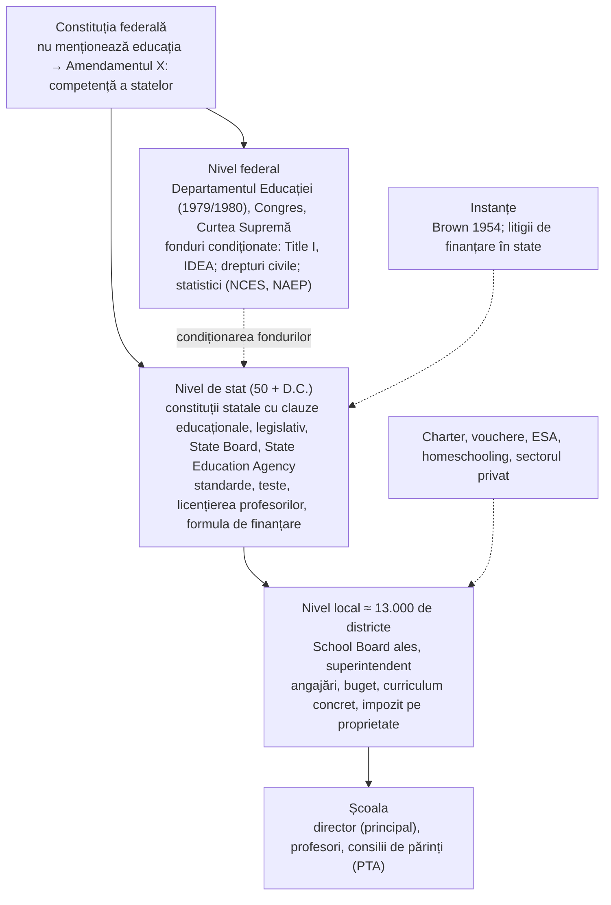
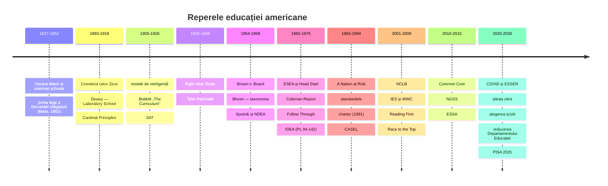
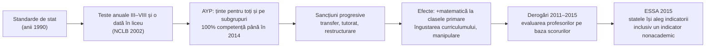
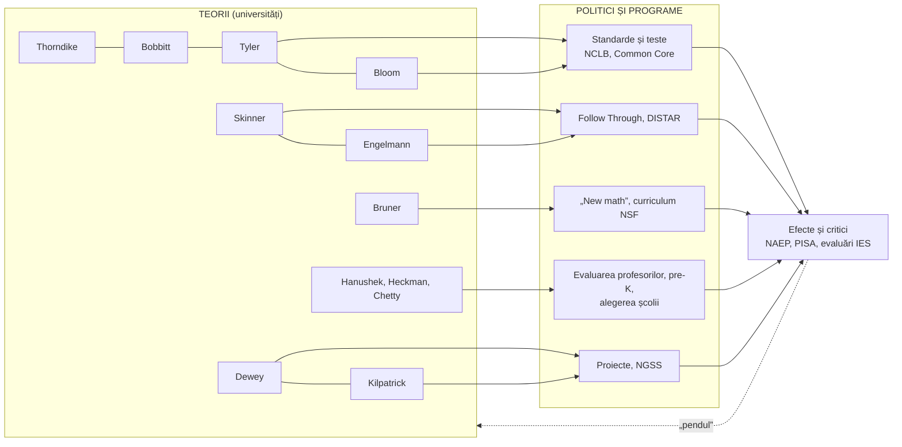

↑ [[00 Index - Analiza comparată internațională]] · [[00 MOC - Fundamentele științelor educației]]

> [!abstract] Pe scurt
> 1. **De ce contează SUA**: nu sunt un performer de vârf la PISA (peste medie la citire și științe, la medie sau sub medie la matematică), dar sunt **cel mai mare „laborator” și exportator de teorii educaționale din sec. XX**: progresivismul lui Dewey, curriculumul „științific” (Bobbitt, Tyler), psihometria (Thorndike, Terman), behaviorismul (Skinner), taxonomia lui Bloom și învățarea deplină, spirala lui Bruner, instruirea directă (Engelmann), SEL (CASEL), UDL (CAST), economia educației (Hanushek, Heckman, Chetty).
> 2. **Formula sistemului**: federalism radical. Educația e responsabilitatea **statelor** (50 + D.C.), administrată de circa **13.000 de districte școlare** cu consilii alese și finanțate în mare parte **local (impozitul pe proprietate)** și de stat; guvernul federal contribuie cu circa o zecime din bani, dar influențează prin **condiționarea fondurilor** (ESEA 1965 → NCLB 2002 → ESSA 2015).
> 3. **Paradoxul american**: cheltuieli per elev printre cele mai mari din OCDE (15.500 USD vs. 11.300 USD media OCDE în învățământul preuniversitar, 2019), dar rezultate medii și **inechitate mare**: diferența dintre elevii din vârful și baza distribuției la citire în PISA 2025 este una dintre cele mai mari din lume.
> 4. **Teoriile nu se aplică „național”, ci concurează**: istoria curriculumului american e o luptă permanentă între patru grupuri de interese — umaniști, adepții dezvoltării copilului, eficientiști și melioriști sociali (Kliebard, 1986). Pendulul oscilează: progresivism ↔ „înapoi la esențial”, whole language ↔ fonetică, „new math” ↔ calcul, standarde ↔ autonomie locală.
> 5. **Variația între state e mai mare decât cea dintre multe țări**: **Massachusetts** (reforma din 1993: finanțare compensatorie + standarde + teste + licențierea profesorilor) are rezultate NAEP de top, comparabile cu sistemele performante; **Mississippi**, stat printre cele mai sărace, a urcat la citire în clasa a IV-a de pe penultimele locuri (2013) peste media națională (2024), după *Literacy-Based Promotion Act* și reforma bazată pe **știința citirii**.
> 6. **Politica bazată pe dovezi** are aici instituții unice: NAEP (1969), Institute of Education Sciences și What Works Clearinghouse (2002), niveluri de dovezi în ESSA (2015), experimente pe scară mare (Follow Through, Tennessee STAR, Perry Preschool). În 2025, administrația federală a redus drastic Departamentul Educației și IES — o ruptură majoră încă în desfășurare.
> 7. **Responsabilizarea prin teste** (NCLB) a produs câștiguri modeste la matematică și efecte secundare semnificative (îngustarea curriculumului, „teaching to the test”, manipularea rezultatelor) — o lecție globală.
> 8. **Piața educațională**: școli charter (din 1991, ~3,7 mil. elevi), vouchere și conturi de economii educaționale în extindere rapidă după 2022, educație la domiciliu — o ilustrare vie a tensiunii dintre **educația ca bun public** și **educația ca alegere privată**.
> 9. **După COVID**: scăderi istorice la NAEP (2022), fără recuperare în 2024, cu **polarizare** (elevii slabi scad mai mult); la PISA 2025 citirea a scăzut cu 14 puncte, deși poziția relativă a SUA a urcat pentru că media OCDE a scăzut și mai mult.
> 10. **Pentru R. Moldova**: cele mai transferabile sunt modelul Mississippi al alfabetizării timpurii (antrenarea profesorilor, mentori, depistare, materiale de calitate), formulele de finanțare cu ponderi pentru elevii dezavantajați (Massachusetts), infrastructura de dovezi (tip WWC), educația timpurie de calitate; netransferabile: finanțarea pe baza impozitului local pe proprietate și responsabilizarea cu miză mare prin teste.

---

## 1. Profil și date-cheie

| Indicator | Valoare | Sursă / observații |
|---|---|---|
| Populație | ≈ 340 mil. (2024) | estimări US Census Bureau |
| Elevi în școli publice K–12 | ≈ 49,6 mil. (toamna 2022) | NCES, *Digest of Education Statistics* (valoare rotunjită, de verificat pentru ultimul an) |
| Elevi în școli private | ≈ 4,7 mil. (2021–2022) | NCES (de verificat) |
| Școli charter | ≈ 8.000 de școli, ≈ 3,7 mil. elevi (7,4% din elevii publici, 2021) | National Alliance for Public Charter Schools, preluat de Wikipedia |
| Educație la domiciliu (*homeschooling*) | ≈ 3% din elevi înainte de pandemie, în creștere după 2020 | NCES (de verificat valoarea actuală); legală în toate statele |
| Districte școlare | ≈ 13.000 | NCES (de verificat valoarea exactă) |
| Elevi cu dizabilități deserviți prin IDEA | ≈ 7,5 mil. (≈ 15% din elevii publici, 2022–2023) | NCES, *Condition of Education* |
| Cheltuieli preuniversitar (ISCED 1–4) | **15.500 USD** per elev echivalent normă întreagă vs. **11.300 USD** media OCDE; **3,5% din PIB** vs. 3,4% OCDE (2019) | NCES, indicatorul „Education Expenditures by Country” (date *Education at a Glance* 2023) |
| Cheltuieli învățământ terțiar | **37.400 USD** per student vs. 18.400 USD OCDE; **2,5% din PIB** vs. 1,5% OCDE (2019) | idem |
| Structura finanțării K–12 | orientativ: ~45% stat, ~45% local, ~8–10% federal (înainte de pandemie; federalul a crescut temporar prin fondurile ESSER) | NCES (proporții orientative, variază mult între state) |

### 1.1 Structura sistemului (ISCED)

| Nivel | Denumire americană | Vârste tipice | ISCED |
|---|---|---|---|
| Educație timpurie | *Head Start*, *Pre-K* (public în multe state, adesea neuniversal), grădinițe private | 3–5 ani | 0 |
| Grădiniță pregătitoare | *Kindergarten* (K) — obligatorie doar în unele state | 5–6 ani | 0/1 (clasificat de obicei ca parte a școlii elementare) |
| Școala elementară | *Elementary school* (K–5 sau K–6) | 6–11 ani | 1 |
| Gimnaziu | *Middle school* / *junior high* (6–8 sau 7–9) | 11–14 ani | 2 |
| Liceu | *High school* (9–12), liceu **comprehensiv** unic, cu cursuri opționale și *tracking* intern | 14–18 ani | 3 |
| Terțiar scurt | *Community college* (diplomă *associate*, 2 ani), certificate profesionale | 18+ | 5 |
| Licență | *Bachelor's* (4 ani, *college*/universitate) | 18+ | 6 |
| Master, doctorat | *Master's*, *PhD*, doctorate profesionale (*EdD*, *MD*, *JD*) | — | 7–8 |

- **Obligativitatea** este stabilită de fiecare stat: începe între 5 și 8 ani și se încheie între 16 și 18 ani. Massachusetts a adoptat prima lege a frecvenței obligatorii (1852), Mississippi ultima (1918).
- **Nu există bacalaureat național**: diploma de liceu e acordată de district/stat pe baza creditelor (unitatea Carnegie, din 1906) și, în unele state, a unor teste de absolvire. Admiterea la facultate se face holistic (note, SAT/ACT, eseuri, activități extracurriculare).

### 1.2 Guvernanța

> [!note] Comentariu
> În termenii [[Modulul 08 - Sistemul de educație și managementul educației]], SUA reprezintă cazul-limită al **descentralizării**: nu există un „sistem de învățământ național” în sensul Codului Educației din R. Moldova, ci **51 de sisteme** și mii de subsisteme. Unificarea a venit „de jos” (asociații profesionale, edituri, teste comune, universități) și „de sus” doar indirect (bani federali, hotărâri judecătorești).

---

## 2. Traiectoria PISA 2000–2025

### 2.1 Scorurile medii

| Ciclu | Citire SUA (media OCDE) | Matematică SUA (media OCDE) | Științe SUA (media OCDE) | Poziție / observații |
|---|---|---|---|---|
| **2000** | 504 (500) | 493 (500) | 499 (500) | citirea = domeniu principal; matematică și științe **necomparabile** cu ciclurile ulterioare |
| **2003** | 495 (494) | 483 (500) | 491 (500) | matematică = domeniu principal; primul punct de trend comparabil la matematică |
| **2006** | *neraportat* | 474 (498) | 489 (500) | citirea SUA invalidată de o eroare de tipărire a caietelor; primul punct de trend la științe |
| **2009** | 500 (493) | 487 (496) | 502 (501) | la matematică, 17 țări OCDE peste SUA (NCES) |
| **2012** | 498 (496) | 481 (494) | 497 (501) | Massachusetts, Connecticut și Florida participă separat |
| **2015** | 497 (493) | 470 (490) | 496 (493) | minim la matematică până atunci |
| **2018** | 505 (487) | 478 (489) | 502 (489) | citire peste medie; matematică sub medie |
| **2022** | 504 (476) | 465 (472) | 499 (485) | sisteme peste SUA: **5** la citire, **25** la matematică, **9** la științe (NCES) |
| **2025** | **490 (461)** | **463 (463)** | **502 (482)** | locul ≈ **13** la citire și științe, ≈ **27** la matematică; rezolvarea computațională a problemelor: 513 (500) |

*Surse*: NCES, rapoartele *Highlights* PISA 2009, 2012, 2018 și *Fast Facts* (2022); pentru 2000–2006, rapoartele OCDE inițiale (mediile OCDE calculate pe țările membre din acel ciclu; valorile din 2000–2006 sunt citate după rapoartele inițiale și pot diferi ușor în bazele de date revizuite — de verificat la nevoie). Pentru 2025: nota de țară OCDE *PISA 2025 Results (Volume I): United States* (publicată la **8 septembrie 2026**), relatată de NCES, K-12 Dive și Chalkbeat.

> [!info] PISA 2025 a fost publicat
> Rezultatele PISA 2025 (Volumul I) au fost lansate de OCDE la **8 septembrie 2026**. Volumele despre **învățarea autoreglată** și **engleza ca limbă străină** sunt anunțate pentru 2027. Pentru SUA:
> - **Citire 490** (OCDE 461): scădere de **14 puncte** față de 2022 — cel mai scăzut nivel din istoria participării SUA; totuși peste media OCDE, care a scăzut la fel de mult (≈ 14 puncte în medie pe 35 de țări OCDE comparabile).
> - **Matematică 463** (OCDE 463): nicio schimbare semnificativă față de 2022 sau 2015; la nivelul mediei OCDE, pentru că media OCDE a coborât (–9 puncte).
> - **Științe 502** (OCDE 482): stabil (+2 față de 2022, nesemnificativ).
> - **Poziția relativă a urcat** fiindcă alte țări au scăzut mai repede, nu pentru că elevii americani au progresat.
> - **Avertisment metodologic**: peste **40%** dintre elevii americani testați nu au completat chestionarul de context, iar în primăvara lui 2025 activitatea PISA a fost suspendată aproximativ o lună. De aceea rezultatele pe rasă și sărăcie nu au fost raportate, iar OCDE notează că **nu se poate exclude o distorsiune**.

### 2.2 Echitate: performeri slabi și de top, statut socio-economic

| Indicator | SUA | Media OCDE | Ciclu, sursă |
|---|---|---|---|
| Performeri slabi (sub nivelul 2) — citire | 19% | 23% | 2018, NCES |
| Performeri slabi — matematică | 27% | 24% | 2018, NCES |
| Performeri slabi — științe | 19% | 22% | 2018, NCES |
| Performeri de top (nivel 5–6) — citire | 14% | 9% | 2018, NCES |
| Performeri de top — matematică | 8% | 11% | 2018, NCES |
| Performeri de top — științe | 9% | 7% | 2018, NCES |
| Diferența între percentilele 90 și 10 la citire | 282 puncte | 260 | 2018, NCES |
| Diferența între sfertul cel mai avantajat și cel mai dezavantajat (ESCS) la citire | **99 puncte** | 89 | 2018, NCES |
| Scoruri la citire pe grupuri rasiale/etnice | asiatici 556, albi 531, hispanici 481, afro-americani 448 | — | 2018, NCES |
| Performeri slabi — citire | 26% | — | 2025, OCDE, după K-12 Dive |
| Performeri slabi — științe | 22% | 26% | 2025, idem |
| Performeri de top — citire | 13% | 6% | 2025, OCDE |
| Performeri de top — științe | 13% | 7% | 2025, idem |
| Performeri de top — matematică | 8% | 8% | 2025, OCDE |
| Diferența vârf–bază la citire | în creștere cu ≈ 50 de puncte din 2015; printre cele mai mari din lume | — | 2025, OCDE, după K-12 Dive |

> [!warning] Critică
> Profilul american e **bimodal**: un procent mare de elevi de top (peste media OCDE la citire și științe) coexistă cu un procent ridicat de elevi sub nivelul funcțional. Media ascunde **două sisteme**: școlile din suburbiile bogate concurează cu cele mai bune sisteme din lume, iar școlile cu sărăcie concentrată au rezultate comparabile cu țări cu venituri medii. Berliner (2013) și alții au arătat că, pe școli cu sub 10% elevi săraci, scorurile PISA americane sunt foarte ridicate — argument folosit pentru a muta discuția de la „școlile eșuate” la **sărăcia copiilor** (interpretare contestată de Hanushek, care susține că și elevii avantajați americani sunt sub omologii lor din țările de top).

### 2.3 Bunăstare

- **Sănătatea mintală a adolescenților**: sondajul CDC *Youth Risk Behavior Survey* 2021 a raportat că **42%** dintre elevii de liceu au trăit sentimente persistente de tristețe sau lipsă de speranță (40% în 2023) — date CDC (de verificat pentru ediția 2025).
- **Absenteismul**: la NAEP Long-Term Trend (vârsta de 13 ani), procentul elevilor care au lipsit **5 zile sau mai mult** în luna anterioară s-a **dublat** de la 5% (2020) la 10% (2023). Absenteismul cronic (≥10% din zile) a crescut de la circa 15% înainte de pandemie la aproape 30% în 2021–2022 (estimări AEI/Malkus, de verificat).
- **Cititul din plăcere**: doar **14%** dintre elevii de 13 ani citeau „aproape zilnic” din plăcere în 2023, față de 27% în 2012 (NAEP LTT 2023).
- **Timpul petrecut pe ecrane** (PISA 2025): elevii americani raportează în medie 1,7 ore/zi de utilizare a dispozitivelor pentru învățare și circa o oră/zi de utilizare recreativă la școală; peste 3 ore pe zi se asociază cu performanțe mai slabe (relatat de K-12 Dive; relație corelațională).

### 2.4 Alte evaluări: TIMSS, PIRLS, NAEP

| Evaluare | Rezultat SUA | Observații |
|---|---|---|
| **PIRLS 2021** (clasa a IV-a, citire) | 548 | doar Irlanda, Hong Kong și Irlanda de Nord semnificativ peste (NCES). Colectare întârziată și participare slabă din cauza pandemiei |
| **TIMSS 2019** | mat. IV: 535; mat. VIII: 515; șt. IV: 539; șt. VIII: 522 | NCES |
| **TIMSS 2023** | mat. IV: **517** (–18); mat. VIII: **488** (–27); șt. IV: 532; șt. VIII: 513 (–9) | cea mai mare scădere a SUA în istoria TIMSS la matematică clasa a VIII-a |
| **NAEP 2022** (principal) | mat. VIII: **–8 puncte** față de 2019 (cea mai mare scădere din istorie); citire: –3 la ambele clase | *Nation's Report Card* |
| **NAEP 2024** | citire IV și VIII: –2 față de 2022, –5 față de 2019; mat. IV: +2 față de 2022, –3 față de 2019; mat. VIII: stagnare (–8 față de 2019) | NAGB, ian. 2025 |
| **NAEP 2024 — sub nivelul Basic** | citire VIII: **33%** (maximul istoric); citire IV: ≈ 40% (maximul din 2002); mat. VIII: ≈ 40% | NAGB |
| **NAEP 2024 clasa a XII-a** | citire: –3 față de 2019, **–10 față de 1992** | *Nation's Report Card*, publicat în 2025 |
| **NAEP Long-Term Trend 2023** (13 ani) | mat. –9 față de 2020, –14 față de 2012; citire –4 față de 2020, –7 față de 2012; scăderi duble la percentilele 10–25 | NAEP LTT |

> [!note] Comentariu — PISA vs. NAEP
> Americanii se ghidează mai mult după **NAEP** decât după PISA: NAEP este aliniat la curriculum, permite comparații între **state** și **districte urbane** (TUDA) și are serii din 1969–1971. PISA măsoară **aplicarea** cunoștințelor la 15 ani. Ambele converg însă spre același diagnostic: stagnare pe termen lung la matematică, declin după 2013–2015 (înainte de pandemie), prăbușire post-COVID și **creșterea decalajului dintre elevii buni și cei slabi**.

---

## 3. Cronologia reformelor (sec. XIX–XXI)

| An | Reformă / lege / program | Ideea | Legătura cu fundamentele |
|---|---|---|---|
| 1837–1848 | **Horace Mann**, secretar al Consiliului Educației din Massachusetts; 12 rapoarte anuale; prima școală normală publică (Lexington, 1839) | școala comună (*common school*), gratuită, finanțată public, nesectară, ca „mare egalizator” și formator de cetățeni | [[Echitatea și școala comprehensivă]]; funcția socială a educației (M02); formarea profesorilor (M09) |
| 1852 | Massachusetts: frecvența școlară obligatorie | obligativitate | sistemul de învățământ (M08) |
| 1862 | *Morrill Act* — universitățile *land-grant* | învățământ superior aplicat (agricultură, inginerie) pentru clasele de mijloc | educația tehnologică (M06); capitalul uman |
| 1893 | **Comitetul celor Zece** (NEA, președinte Charles W. Eliot, Harvard) | liceu academic cu discipline standardizate, **aceeași instruire** pentru toți, indiferent dacă merg la facultate | tradiția umanistă; [[Tradiția Bildung-Didaktik și tradiția Curriculum]] |
| 1896 | **Dewey** — Laboratory School (Universitatea din Chicago) | școala ca comunitate democratică, învățare prin experiență | [[Progresivismul și educația nouă]] |
| 1906 | Unitatea Carnegie | măsurarea standardizată a creditelor liceale (timp la clasă) | managementul sistemului (M08) |
| 1916–1917 | **Terman** — Stanford-Binet (1916); testele Army Alpha/Beta (1917) | măsurarea „inteligenței” și clasificarea elevilor | psihometrie; tracking; factorii dezvoltării — ereditate vs. mediu (M09) |
| 1917 | *Smith-Hughes Act* | finanțare federală pentru educația profesională | educația tehnologică (M06) |
| 1918 | **Cardinal Principles of Secondary Education** (NEA); **Bobbitt**, *The Curriculum*; **Kilpatrick**, *The Project Method* | liceul comprehensiv cu 7 obiective (sănătate, stăpânirea proceselor fundamentale, viața de familie, profesie, cetățenie, timp liber, caracter etic); curriculum derivat din activitățile adulților; învățarea prin proiecte | finalitățile educației (M04); dimensiunile educației (M06) |
| 1926 | Primul **SAT** (Carl Brigham, College Board) | selecție „meritocratică” la admitere | evaluarea sumativă (M10) |
| 1933–1941 | **Eight-Year Study** (Progressive Education Association) | 30 de licee experimentale eliberate de cerințele de admitere; absolvenții lor au avut rezultate universitare cel puțin la fel de bune ca grupul de control | cercetarea pedagogică (M05) |
| 1944 | *GI Bill* | acces la facultate pentru veterani | [[Învățarea pe tot parcursul vieții și formele educației]] |
| 1949 | **Tyler**, *Basic Principles of Curriculum and Instruction* | 4 întrebări: obiective → experiențe → organizare → evaluare | proiectarea curriculară (M10) |
| 1954 | ***Brown v. Board of Education*** | segregarea școlară „separată, dar egală” e neconstituțională | echitatea (M08) |
| 1956 | **Bloom** et al., *Taxonomy of Educational Objectives. Handbook I* | ierarhia obiectivelor cognitive | [[Taxonomiile obiectivelor și educația centrată pe competențe]]; M04 |
| 1957–1958 | **Sputnik** (4 oct. 1957) → *National Defense Education Act* (1958) | investiții federale în matematică, științe, limbi străine | educația intelectuală; politica educațională ca securitate națională |
| 1959–1960 | Conferința de la **Woods Hole**; **Bruner**, *The Process of Education* | structura disciplinei; curriculum în spirală | [[Constructivismul cognitiv (Piaget, Bruner)]] |
| 1965 | ***Elementary and Secondary Education Act*** (Title I); **Head Start** | „Războiul împotriva sărăciei”: bani federali pentru școlile sărace; educație timpurie compensatorie | Educația timpurie; [[Echitatea și școala comprehensivă]] |
| 1966 | **Raportul Coleman** (*Equality of Educational Opportunity*) | diferențele de rezultate țin mai mult de familie și de compoziția socială a școlii decât de resursele școlii | factorii dezvoltării (M09); cercetarea (M05) |
| 1968–1977 | **Project Follow Through** | cel mai mare experiment educațional: ≈ 20 de modele pedagogice comparate | [[Behaviorismul și instruirea directă]] |
| 1969 | **NAEP** | evaluare națională prin eșantion | evaluarea sistemului (M08, M10) |
| 1972 | *Title IX* | interzicerea discriminării pe criterii de sex | noile educații: egalitatea de gen (M07) |
| 1973 | *San Antonio ISD v. Rodriguez* | educația nu e drept fundamental în Constituția federală → litigiile de finanțare se mută în instanțele statale | echitatea finanțării |
| 1975 | *Education for All Handicapped Children Act* (PL 94-142) → **IDEA** (1990) | educație publică gratuită și adecvată, plan individualizat (IEP), mediul cel mai puțin restrictiv | [[Educația incluzivă]] |
| 1979/1980 | Înființarea **Departamentului Educației** | agenție federală de rang ministerial | managementul (M08) |
| 1983 | ***A Nation at Risk*** | discurs de criză: mediocritate, pierderea competitivității | reforma educațională (M08) |
| 1987 | **NBPTS** (certificarea națională voluntară a profesorilor) | standarde profesionale avansate | [[Profesionalismul cadrului didactic]] |
| 1989–1994 | Summitul de la Charlottesville (1989); standardele NCTM (1989); *Goals 2000* (1994) | mișcarea standardelor | finalități (M04) |
| 1990 | *Kentucky Education Reform Act*; **Teach For America**; programul de vouchere din **Milwaukee** | reforma sistemică; recrutare alternativă; alegerea școlii | M08, M09 |
| 1991 | Prima lege a școlilor **charter** (Minnesota) | autonomie în schimbul responsabilizării | [[Responsabilizare, piață și încredere în guvernarea educației]] |
| 1993 | ***Massachusetts Education Reform Act*** | finanțare compensatorie + standarde + teste MCAS + charter | M08 |
| 1994 | **CASEL** | învățarea socio-emoțională | [[Învățarea socio-emoțională și educația caracterului]] |
| 2000 | Raportul **National Reading Panel** | cele „cinci componente” ale citirii, bazate pe dovezi | [[Știința cognitivă a învățării]] |
| 2002 | ***No Child Left Behind*** (adoptată în dec. 2001, semnată în ian. 2002); **Education Sciences Reform Act** → IES, WWC; **Reading First** | teste anuale III–VIII, „progres anual adecvat”, 100% competență până în 2014 | Educația bazată pe dovezi; responsabilizarea |
| 2009 | **Race to the Top** (4,35 mld. USD, pachetul de stimulare ARRA) | competiție între state: standarde, evaluarea profesorilor pe baza rezultatelor elevilor, charter, date | [[Teoria schimbării educaționale și leadershipul]] |
| 2010 | **Common Core State Standards** (NGA + CCSSO) | standarde comune de engleză și matematică, adoptate inițial de 46 de state + D.C. | M04, M10 |
| 2013 | **NGSS**; *Literacy-Based Promotion Act* (Mississippi) | științe 3D, bazate pe fenomene; alfabetizare + „poarta” clasei a III-a | Învățarea prin proiecte, investigație și fenomene; știința citirii |
| 2015 | ***Every Student Succeeds Act*** | revine flexibilitatea statelor; niveluri de dovezi pentru intervenții | Educația bazată pe dovezi |
| 2020–2024 | COVID-19; ≈ 190 mld. USD fonduri **ESSER** | recuperarea pierderilor de învățare: tutorat intensiv, programe de vară | M08 |
| 2019–2025 | Legi ale **științei citirii** în majoritatea statelor (≈ 40, de verificat) | fonetică sistematică; interzicerea metodei „cueing” în unele state | [[Știința cognitivă a învățării]] |
| 2022–2025 | Extinderea **conturilor de economii educaționale** universale (Arizona 2022, apoi alte state; Texas 2025); credit fiscal federal pentru burse școlare în legea fiscală din iulie 2025 (de verificat detaliile) | alegerea școlii finanțată public | [[Responsabilizare, piață și încredere în guvernarea educației]] |
| 2025 | Ordin executiv (20 martie 2025) pentru „facilitarea închiderii” Departamentului Educației; reducerea personalului de la ≈ 4.100 la ≈ 2.100; Curtea Supremă permite concedierile (14 iulie 2025); contracte IES anulate; transferul unor programe către alte agenții | „returnarea educației către state” | M01, M08: cine produce cunoașterea și statisticile? |
| 2026 | **PISA 2025** (publicat 8 sept. 2026) | citire –14 puncte; poziție relativă mai bună | — |

---

## 4. Implementarea fundamentelor pe dimensiunile manualului

### 4.1 Statutul științelor educației, cercetarea și politica bazată pe dovezi
→ [[Modulul 01 - Statutul științelor educației]] · [[Modulul 05 - Paradigmele pedagogiei și cercetarea pedagogică]]

**Cum s-a construit „știința educației” în SUA.** În tradiția germană și franceză, pedagogia s-a născut din filosofie. În SUA, științele educației s-au instituționalizat la începutul sec. XX în jurul **psihologiei experimentale** și **statisticii**:
- **Teachers College, Columbia University** (Thorndike, Kilpatrick, mai târziu Dewey ca profesor de filosofie la Columbia), **Universitatea din Chicago** (Dewey, Judd, Tyler, Bloom) și **Stanford** (Cubberley, Terman) au fost primele „fabrici” de cercetare educațională. Istoricul Ellen Condliffe Lagemann (*An Elusive Science*, 2000) rezumă disputa: „Thorndike a câștigat, Dewey a pierdut” — cercetarea americană a devenit **cantitativă, behavioristă și orientată spre măsurare**, iar viziunea filosofică și democratică a lui Dewey a rămas influentă mai ales în discurs și în formarea profesorilor.
- **American Educational Research Association (AERA)**, fondată în 1916, e cea mai mare asociație de cercetare educațională din lume.
- **Marile experimente sociale**: Coleman Report (1966), Follow Through (1968–1977), Perry Preschool (1962–1967), Abecedarian (1972), Tennessee STAR (1985–1989, clase mici de 13–17 elevi) — au dat metodologia pentru politica bazată pe dovezi la nivel mondial.
- **Institute of Education Sciences** (2002) a mutat accentul spre **studii randomizate** (modelul medical). **What Works Clearinghouse** evaluează intervențiile după standarde metodologice explicite; **ESSA** (2015) a introdus patru **niveluri de dovezi** (puternice, moderate, promițătoare, cu rațiune logică), iar pentru unele fonduri (școlile cu cele mai slabe rezultate) sunt cerute intervenții din primele trei niveluri.
- **National Academies** (NRC) au produs sinteze de referință: *How People Learn* (1999/2000; ediția II, 2018), *Adding It Up* (2001, matematică), *A Framework for K-12 Science Education* (2012, baza NGSS).

> [!warning] Critică
> - **„Dovezile” nu se transferă automat**: Cartwright și Hardie (*Evidence-Based Policy*, 2012) arată că un program care „a funcționat acolo” nu va funcționa neapărat „aici”. Multe RCT-uri IES au găsit **efecte nule** la scară mare (ex. evaluarea *Reading First*, 2008).
> - **Ruptura din 2025**: anularea contractelor IES, reducerea NCES și a personalului Departamentului au pus în discuție continuitatea unor serii statistice. NAEP și PISA 2025 au continuat, dar cu întârzieri și probleme de colectare (pauza PISA din primăvara lui 2025). Consecințele pe termen lung sunt **încă incerte** (septembrie 2026).

### 4.2 Paradigme pedagogice: clasic–modern–postmodern
→ [[Modulul 02 - Clasic, modern și postmodern în educație]]

Herbert Kliebard (*The Struggle for the American Curriculum, 1893–1958*, 1986) descrie patru grupuri care și-au disputat curriculumul american:

| Grup | Idee | Reprezentanți | Paradigmă (în termenii manualului) |
|---|---|---|---|
| **Umaniștii** | transmiterea moștenirii culturale prin discipline academice | Charles W. Eliot, William T. Harris; mai târziu Mortimer Adler (*Paideia Proposal*, 1982), E. D. Hirsch (*Cultural Literacy*, 1987) | **clasică** (magistrocentrism, conținut) |
| **Adepții dezvoltării copilului** | curriculumul urmează natura și interesele copilului | G. Stanley Hall, Francis W. Parker, Kilpatrick | **modernă** (pedocentrism, educația nouă) |
| **Eficientiștii sociali** | școala pregătește eficient pentru rolurile adulte, măsurabil | Bobbitt, Charters, Thorndike, Snedden | **modernă tehnocratică** (obiective, măsurare) |
| **Melioriștii sociali** | școala ca instrument de reconstrucție socială | Lester Ward, George Counts (*Dare the School Build a New Social Order?*, 1932), Harold Rugg | **modern-critică** → precursori ai pedagogiei critice |

**Dewey** nu aparține integral niciunui grup: a criticat atât „educația tradițională”, cât și excesele pedocentrismului (*Experience and Education*, 1938).

David Labaree (1997) propune un alt model util: educația americană urmărește simultan trei scopuri contradictorii — **egalitatea democratică** (cetățeni), **eficiența socială** (lucrători) și **mobilitatea socială** (avantaj competitiv individual). Ultimul scop, dominant, transformă diploma în **bun privat** și explică presiunea pentru tracking, școli „bune” în cartiere scumpe și alegerea școlii.

**Postmodernul american** apare pe trei direcții: (1) **reconceptualiștii** curriculumului (William Pinar, anii 1970: curriculumul ca *currere*, experiență trăită); (2) **pedagogia critică** și multiculturală (Apple, Giroux, bell hooks, Ladson-Billings); (3) paradoxal, **neoliberalismul educațional** (piață, alegere, date, teste), care a dominat politica reală după 1990.

> [!note] Comentariu
> Tyack și Cuban (*Tinkering toward Utopia*, 1995) numesc „**gramatica școlii**” structurile care rezistă reformelor: clasa pe vârste, ora de 50 de minute, disciplinele separate, notele. Larry Cuban (*How Teachers Taught*, 1984/1993) a arătat că, în ciuda retoricii progresiviste, predarea frontală a rămas dominantă în liceele americane pe tot parcursul sec. XX, cu un **„hibrid”** progresiv mai răspândit în școala elementară. Distincția **discurs pedagogic vs. practică la clasă** e esențială pentru analiza paradigmelor din M02.

### 4.3 Formele educației: formal, nonformal, informal; învățarea pe tot parcursul vieții
→ [[Modulul 03 - Formele generale ale educației]] · [[3.6 Educația permanentă și autoeducația]] · [[Autoeducația - teorii, autori și corelări]]

| Formă | Manifestări specifice SUA |
|---|---|
| **Formală** | școli publice, charter, private (majoritatea religioase); *community colleges* (≈ 1.000 de instituții, de verificat), universități de cercetare; cursuri *Advanced Placement* (College Board) |
| **Nonformală** | educația extracurriculară: sport școlar, cluburi, dezbateri, *4-H* (tineret rural), cercetași, YMCA; **21st Century Community Learning Centers** (programe after-school cu finanțare federală); educația adulților (*adult basic education*, GED); **extensiunea universitară** (*cooperative extension*, din 1914); tabere de vară; muzee și **biblioteci publice** (≈ 1.689 de biblioteci Carnegie construite în SUA la începutul sec. XX) |
| **Informală** | televiziunea educațională (***Sesame Street***, 1969 — Kearney și Levine, 2019, au găsit efecte pozitive asupra progresului școlar pentru copiii cu acces la emisie); *Khan Academy* (2008), MOOC-uri (Coursera, edX, 2012), YouTube, podcasturi; familia și biserica |
| **Educație la domiciliu** | legală în toate statele; mișcare cu rădăcini religioase și pedagogice (John Holt, *unschooling*, anii 1970) — o formă-limită între formal și informal |

**Învățarea pe tot parcursul vieții**:
- **Community colleges**: primul colegiu public, Joliet Junior College (1901); *Truman Commission* (1947) a popularizat termenul „community college”. Au rol dublu: pregătire pentru transferul la licență și formare profesională pentru adulți.
- **Andragogia**: **Malcolm Knowles** (*The Modern Practice of Adult Education*, 1970) a sistematizat principiile învățării adulților (autodirijare, experiență, orientare spre probleme); **Eduard Lindeman** (*The Meaning of Adult Education*, 1926) a fost precursorul său, influențat de Dewey.
- **Autoeducația / învățarea autodirijată**: tradiție culturală americană puternică (idealul *self-made man*, bibliotecile publice ca „universități ale poporului”). În cercetare: Knowles (*Self-Directed Learning*, 1975), Gerald Grow (modelul SSDL, 1991); în psihologie: Zimmerman, Pintrich, Dweck.

> [!tip] Lecție
> În SUA, granița formal–nonformal e **permeabilă**: creditele se transferă între *community college* și universitate, cursurile online pot fi recunoscute, iar *after-school*-ul e finanțat public. Pentru manual (M03), cazul arată că **educația permanentă** depinde de **instituții de trecere** (colegii comunitare, recunoașterea creditelor), nu doar de declarații de principiu.

### 4.4 Finalități: idealul educațional, scopuri, cadre de competențe
→ [[Modulul 04 - Finalitățile educației]]

- **Nu există un ideal educațional național legiferat** (spre deosebire de Codul Educației din R. Moldova). Finalitățile sunt formulate în constituțiile statale (ex. clauza „educație temeinică și eficientă”), în standardele de stat și în documente-program.
- **Istoric**:
  - **Mann**: cetățenia republicană, moralitatea, egalizarea șanselor.
  - **Cardinal Principles** (1918): 7 obiective ale liceului — o finalitate „integrală”, aproape de dimensiunile educației din M06.
  - **Dewey**: educația ca **creștere** continuă, fără scop exterior ei; democrația ca mod de viață.
  - ***A Nation at Risk*** (1983) și ***Goals 2000*** (1994): competitivitate economică, excelență academică.
  - **NCLB** (2002): **„competență” măsurabilă** la citire și matematică pentru toți elevii.
  - **Common Core** (2010): **„college and career readiness”** — pregătirea pentru facultate și carieră, derivată invers (*backward design*) din cerințele primului an de facultate.
- **Cadrele de competențe**: *Partnership for 21st Century Skills* (P21, 2002; „cei 4 C”: gândire critică, comunicare, colaborare, creativitate); **Deeper Learning** (Fundația Hewlett, 2010, cu 6 competențe); NRC, *Education for Life and Work* (2012) — trei domenii: cognitiv, intrapersonal, interpersonal.
- **Backward design**: Grant Wiggins și Jay McTighe, *Understanding by Design* (1998) — pornești de la rezultatele dorite, apoi dovezile de evaluare, apoi activitățile. E o reformulare a raționamentului lui Tyler, foarte folosită în formarea profesorilor din întreaga lume.

> [!note] Comentariu
> Evoluția americană ilustrează trecerea descrisă de manual de la **ideal** la **obiective operaționale** (M04): de la idealul republican al lui Mann, prin taxonomia lui Bloom și obiectivele comportamentale ale lui Mager (*Preparing Instructional Objectives*, 1962), la „standardele” și „țintele de competență” măsurate prin teste. Critica recurentă (Eisner, Noddings, Ravitch) e că **finalitățile nemăsurabile** (caracter, artă, cetățenie) dispar din practică atunci când responsabilizarea se face doar prin teste.

### 4.5 Dimensiunile educației
→ [[Modulul 06 - Dimensiunile generale ale educației]]

| Dimensiune | Implementare în SUA | Observații critice |
|---|---|---|
| **Morală / caracter** | în sec. XIX, *McGuffey Readers* (moralitate protestantă); după secularizarea școlii publice (hotărârile Curții Supreme din 1962–1963 privind rugăciunea școlară), educația morală a devenit „educația caracterului” (Thomas Lickona, *Educating for Character*, 1991; *Character Education Partnership*, 1993) și apoi SEL; rețele charter precum KIPP (1994) au pus accent pe „forța caracterului” | disputa **indoctrinare vs. clarificarea valorilor** (Raths, Harmin și Simon, *Values and Teaching*, 1966) vs. dezvoltarea judecății morale (Kohlberg, *Just Community Schools*, anii 1970) |
| **Intelectuală** | domină prin standarde (engleză, matematică, științe), teste de stat, AP, NAEP | îngustarea curriculumului după NCLB: mai mult timp pentru citire și matematică, mai puțin pentru științe sociale, artă și educație fizică (studiile *Center on Education Policy*, 2007–2008) |
| **Tehnologică / digitală** | *Smith-Hughes* (1917) și *Perkins Act* (1984, reautorizat 2006, 2018) pentru educația tehnică și profesională (*Career and Technical Education*); programe *CS for All* (2016); Code.org (2013); dispozitive 1:1 generalizate în pandemie | decalajul digital (*digital divide*); critica EdTech (vezi §6) |
| **Estetică** | educația muzicală și artistică inegal distribuită; *National Core Arts Standards* (2014) | primele tăiate în crizele bugetare |
| **Psihofizică** | educația fizică și sportul școlar (NCAA și sportul universitar ca industrie); programe federale de masă școlară (*National School Lunch Program*, 1946) | obezitate infantilă; timp de recreație redus în unele districte |

### 4.6 „Noile educații”
→ [[Modulul 07 - Noile educații]]

| „Nouă educație” | Implementare | Stare actuală (2026) |
|---|---|---|
| **Educația pentru cetățenie** | *civics* obligatorii în majoritatea statelor; testul de cetățenie ca cerință de absolvire în mai multe state (după 2015, de verificat numărul); **C3 Framework** (2013) pentru științe sociale | NAEP Civics 2022: prima scădere din istorie la clasa a VIII-a; ≈ 22% la nivel *Proficient* |
| **Educația multiculturală / antirasistă** | James Banks (dimensiunile educației multiculturale); Gloria Ladson-Billings, **pedagogia relevantă cultural** (1995); Geneva Gay | după 2021, peste o treime dintre state au adoptat restricții privind predarea „conceptelor divizive” despre rasă și gen (de verificat numărul exact) — cea mai intensă polarizare curriculară din ultimele decenii |
| **Educația media / informațională** | New Jersey (2023) — prima lege care cere alfabetizarea informațională K–12 (de verificat); organizații ca *News Literacy Project* (2008) | în extindere; lucrările Stanford History Education Group (Wineburg, *lateral reading*) |
| **Educația pentru mediu** | *Environmental Education Act* (1970); NGSS include schimbările climatice; New Jersey (2020) — standarde de educație climatică în toate disciplinele | puternic polarizată politic |
| **SEL și sănătatea mintală** | CASEL (1994); standarde SEL preșcolare în toate statele; *Surgeon General's Advisory* privind sănătatea mintală a tinerilor (2021) și rețelele sociale (2023); restricții sau interdicții de telefoane mobile în școli adoptate de numeroase state în 2024–2025 (de verificat numărul) | contestarea politică a SEL după 2021 |
| **Educația pentru sănătate / sexuală** | variază radical: de la educație comprehensivă la programe „doar abstinența” | conflict între state |
| **Educația pentru familie** | *Family and Consumer Sciences* (fosta *home economics*); implicarea părinților în Title I | „drepturile părinților” ca temă politică după 2021 |

### 4.7 Sistemul și managementul: descentralizare, responsabilizare, finanțare, echitate
→ [[Modulul 08 - Sistemul de educație și managementul educației]]

**a) Descentralizarea.** Controlul local e principiu constitutiv (Tocqueville l-a observat deja în anii 1830). Consiliile școlare alese decid bugete și angajări. Avantaje: inovație locală, „laboratoare ale democrației” (formula judecătorului Brandeis). Dezavantaje: **fragmentare**, inechitate, standarde inegale, capacitate administrativă slabă în districtele mici.

**b) Finanțarea și inechitatea.** Dependența de **impozitul local pe proprietate** leagă resursele școlii de valoarea imobiliară a cartierului. Jonathan Kozol (*Savage Inequalities*, 1991) a descris contrastele dintre districte vecine. După *Serrano v. Priest* (California, 1971) și *Rodriguez* (1973), **litigiile de finanțare** au trecut în instanțele statale: *Rose v. Council for Better Education* (Kentucky, 1989), *McDuffy* (Massachusetts, 1993), *Abbott v. Burke* (New Jersey, din 1985). Statele au adoptat **formule de finanțare** cu ponderi pentru elevii săraci, cu limba engleză ca a doua limbă sau cu dizabilități.

> [!note] Ce spune cercetarea despre bani
> Eric Hanushek (1986, 2003) a susținut decenii la rând că **nu există o relație consecventă** între cheltuieli și rezultate („contează cum, nu cât”). **Jackson, Johnson și Persico** (*Quarterly Journal of Economics*, 2016) au folosit reformele de finanțare impuse de instanțe ca experiment natural: o creștere cu **10%** a cheltuielilor per elev pe toți cei 12 ani de școală a dus, la copiii din familii cu venituri mici, la circa **0,3 ani** de școlarizare în plus și salarii cu ≈ **7%** mai mari la vârsta adultă. **Lafortune, Rothstein și Schanzenbach** (2018) au găsit efecte pozitive ale reformelor asupra scorurilor NAEP ale districtelor sărace. Consensul actual: **banii contează, dacă sunt direcționați și cheltuiți pe factori eficienți** (profesori, timp de instruire, clase mai mici în primii ani).

**c) Segregarea.** După *Brown* (1954), desegregarea a avansat mai ales între 1968 și 1988, în special în Sud, sub presiunea instanțelor. *Milliken v. Bradley* (1974) a interzis soluțiile care treceau granițele districtelor, iar „*white flight*” spre suburbii a readus segregarea rezidențială și școlară. Rucker Johnson (*Children of the Dream*, 2019) a arătat efecte pozitive pe termen lung ale desegregării asupra copiilor afro-americani (educație, venituri, sănătate), fără efecte negative pentru copiii albi.

**d) Responsabilizarea (*accountability*).**

- **Dee și Jacob** (2011) au găsit efecte pozitive ale NCLB asupra matematicii în clasa a IV-a (mai mici în clasa a VIII-a) și **niciun efect** la citire.
- **Legea lui Campbell** (1976): cu cât un indicator cantitativ e folosit mai mult pentru decizii sociale, cu atât e mai expus coruperii. Exemplu extrem: scandalul de fraudă la teste din **Atlanta** (2009–2015), cu condamnări penale ale unor educatori.
- „**Miracolul din Texas**” din anii 1990, model pentru NCLB, a fost criticat pentru excluderea elevilor din statistici (Haney, 2000).

**e) Tracking și liceul comprehensiv.** James B. Conant (*The American High School Today*, 1959) a apărat liceul comprehensiv unic, cu diferențiere internă pe niveluri. Jeannie Oakes (*Keeping Track*, 1985) a arătat că *tracking*-ul reproduce inegalitățile rasiale și de clasă. Dezbaterea continuă: de exemplu, eliminarea algebrei de clasa a VIII-a pentru toți elevii din San Francisco (2014) și revenirea la ea (2024) — de verificat detaliile.

### 4.8 Agenții: profesorul, directorul, elevul, familia, comunitatea
→ [[Modulul 09 - Agenții educației și factorii dezvoltării]]

**Profesorul.**
- **Selecție și formare inițială**: licențierea se face **pe stat**. Calea tradițională: licență în educație sau licență de specialitate + program de formare aprobat de stat + teste (ex. Praxis; în Massachusetts, testele MTEL, din 1998) + practică (*student teaching*). Căile **alternative** (inclusiv *Teach For America*, fondată de Wendy Kopp în 1990, și programele de tip *residency* urban) formează o parte importantă din noii profesori, mai ales în districtele sărace și la disciplinele deficitare. **edTPA** (2013) a introdus o evaluare bazată pe portofoliu, adoptată și apoi abandonată de mai multe state.
- **Standarde profesionale**: **InTASC** (standarde model pentru profesorii debutanți, 1992, revizuite în 2011); **NBPTS** (certificare avansată voluntară, 1987), născută din raportul Carnegie *A Nation Prepared* (1986) și din Holmes Group (1986).
- **Salariu și statut**: salarii modeste față de alte profesii cu studii superioare; Economic Policy Institute estimează o „penalizare salarială” de peste 20% față de absolvenții comparabili (de verificat valoarea exactă și anul). Mulți profesori au un al doilea job. Drepturile sindicale variază mult (NEA și AFT sunt cele mai mari sindicate).
- **Deficit și fluctuație**: Richard Ingersoll arată că problema principală e **„ușa rotativă”** (plecarea din profesie, mai ales în primii 5 ani și din școlile sărace), nu insuficiența absolvenților.
- **Evaluarea profesorilor**: în perioada 2009–2016 (Race to the Top, derogările de la NCLB), majoritatea statelor au legat evaluarea profesorilor de **valoarea adăugată** la teste. Proiectul **Intensive Partnerships for Effective Teaching** (Fundația Gates și districte, ≈ 575 mil. USD) a fost evaluat de RAND (2018): **nu a îmbunătățit** semnificativ rezultatele elevilor.

**Directorul**: de la administrator la **„lider instrucțional”**. Bryk et al. (*Organizing Schools for Improvement*, 2010, Chicago) au identificat **cinci suporturi esențiale**: leadership, legătura cu părinții și comunitatea, capacitatea profesională, climatul orientat spre învățare, ghidajul instrucțional. Școlile puternice pe cel puțin trei suporturi au avut probabilități mult mai mari de progres.

**Elevul**: diversitate foarte mare. Majoritatea elevilor din școlile publice sunt, din 2014, **din grupuri minoritare** (de verificat anul); ≈ 10% învață engleza ca a doua limbă (*English learners*; *Lau v. Nichols*, 1974, obligă școlile să îi sprijine); *Plyler v. Doe* (1982) garantează accesul copiilor imigranți fără documente.

**Familia și comunitatea**: *Parent Teacher Association* (1897); implicarea părinților obligatorie în Title I; **școlile comunitare** (*community schools*, ex. Harlem Children's Zone, Geoffrey Canada, anii 1990–2000; *Promise Neighborhoods*, 2010). Annette Lareau (*Unequal Childhoods*, 2003) a descris diferența dintre **„cultivarea concertată”** în familiile de clasă mijlocie și **„creșterea naturală”** în familiile muncitorești — un mecanism al reproducerii sociale prin familie.

> [!note] Ereditate–mediu–educație (M09)
> SUA au fost scena celor mai aprinse dispute despre ereditate: testarea IQ din anii 1910–1920 (legată de eugenie și de legea restrictivă a imigrației din 1924), Arthur Jensen (1969), *The Bell Curve* (Murray și Herrnstein, 1994). Contraargumentele empirice: **efectul Flynn** (creșterea scorurilor IQ de la o generație la alta, prea rapidă pentru a fi genetică), studiile de adopție și intervențiile timpurii (Abecedarian). Ecologia dezvoltării a lui **Urie Bronfenbrenner** (*The Ecology of Human Development*, 1979), cofondator al Head Start, oferă cadrul teoretic al ecosistemului educațional analizat în această notă.

### 4.9 Proiectare, predare, evaluare
→ [[Modulul 10 - Proiectarea, realizarea și evaluarea activității educative]]

- **Curriculum**: standardele de stat (Common Core sau derivate, NGSS sau derivate) + **manualele și programele de curriculum** alese de districte sau școli. Industria editorială (Pearson, McGraw Hill, Houghton Mifflin Harcourt) și materialele online (Teachers Pay Teachers) influențează practica mai mult decât standardele. **EdReports** (2015) evaluează independent materialele curriculare; mișcarea pentru **„materiale curriculare de înaltă calitate”** (*high-quality instructional materials*) a devenit un vector central de reformă după 2015 (Louisiana, Tennessee, Massachusetts).
- **Proiectarea**: modelul Tyler → Understanding by Design (Wiggins și McTighe) → *Madeline Hunter's lesson design* (anii 1970–1980; cei 7 pași ai lecției, foarte răspândiți în formarea profesorilor).
- **Pedagogia la clasă**: pendul între predarea frontală și abordările centrate pe elev; *workshop model* la citire (Lucy Calkins, Teachers College, anii 1980–2020, criticat dur după 2020); instruirea explicită (Rosenshine, *Principles of Instruction*, 2012).
- **Evaluarea**:
  - **sumativă cu miză mare**: teste de stat, examene de absolvire în unele state, SAT/ACT, AP;
  - **formativă**: Lorrie Shepard (*The Role of Assessment in a Learning Culture*, 2000), Rick Stiggins (*assessment for learning*), Margaret Heritage; biblioteca digitală formativă Smarter Balanced;
  - **sistemul de note**: A–F și GPA; **grading for equity** (Joe Feldman, 2018) și notarea bazată pe standarde — reforme controversate;
  - **interim/benchmark**: teste de tip MAP (NWEA), i-Ready — date intermediare folosite pe scară largă.

---

## 5. Teorii și abordări aplicate

### 5.1 Tabel sintetic

| Teorie / abordare (card) | Autori americani principali | Implementare emblematică în SUA | Verdictul dovezilor |
|---|---|---|---|
| [[Progresivismul și educația nouă]] | Parker, Dewey, Kilpatrick, Counts | Laboratory School (1896), Eight-Year Study (1933–1941), școlile elementare „child-centered” | influență mare asupra discursului, mai slabă asupra practicii; dovezi mixte |
| Învățarea prin proiecte, investigație și fenomene | Kilpatrick, Buck Institute, High Tech High, NGSS | NGSS (2013), rețelele PBL | RCT-uri recente pozitive când proiectele sunt bine structurate |
| [[Tradiția Bildung-Didaktik și tradiția Curriculum]] | Bobbitt, Charters, Tyler, Taba | curriculumul pe obiective, standardele | SUA = locul de naștere al tradiției *Curriculum* |
| [[Taxonomiile obiectivelor și educația centrată pe competențe]] | Bloom, Krathwohl, Mager, Anderson | taxonomia în formarea profesorilor, standarde, teste | instrument de proiectare universal; critici privind ierarhia rigidă |
| [[Behaviorismul și instruirea directă]] | Thorndike, Skinner, Engelmann, Becker, Rosenshine | instruirea programată, Follow Through, DISTAR | dovezi puternice pentru abilitățile de bază; rezistență ideologică |
| [[Învățarea deplină (mastery learning)]] | Carroll, Bloom, Keller, Guskey | proiectul Chicago Mastery Learning (anii 1970–1980), PSI, platformele adaptive | efecte pozitive în meta-analize; „2 sigma” rar atins la scară |
| [[Constructivismul cognitiv (Piaget, Bruner)]] | Bruner, Duckworth, standardele NCTM | Woods Hole, „new math”, MACOS, standardele NCTM (1989) | „războaiele matematicii”; critica ghidajului minimal |
| [[Socioconstructivismul și teoria activității (Vygotsky)]] | Cole, Wertsch, Rogoff, Lave și Wenger, Palincsar | predarea reciprocă, *Tools of the Mind* | predarea reciprocă — dovezi solide; *Tools of the Mind* — rezultate mixte la scară |
| [[Știința cognitivă a învățării]] | NRC *How People Learn*, Willingham, Mayer, National Reading Panel | știința citirii, practica IES (2007), Mississippi | dovezi puternice pentru fonetica sistematică și practica recuperării |
| [[Evaluarea formativă]] | Shepard, Stiggins, Heritage | resursele formative ale consorțiilor, feedbackul la clasă | efecte pozitive, dar mai mici decât se susținea (Kingston și Nash, 2011) |
| [[Învățarea autoreglată, metacogniția și autoeducația]] | Flavell, Zimmerman, Pintrich, Dweck, Duckworth | AVID, intervențiile de *mindset* | efecte mici, mai mari la elevii în risc |
| Diferențierea, inteligențele multiple și designul universal | Gardner, Tomlinson, Rose și Meyer (CAST) | UDL în HEOA (2008) și ESSA | inteligențele multiple — slab susținute empiric; UDL — dovezi în curs |
| [[Educația incluzivă]] | Burton Blatt, legiuitorii PL 94-142 | IDEA, IEP, mediul cel mai puțin restrictiv | acces universal obținut; calitate inegală |
| [[Învățarea socio-emoțională și educația caracterului]] | Weissberg, Goleman, Durlak, Lickona | CASEL, standarde SEL, KIPP | meta-analize pozitive; contestare politică |
| [[Pedagogia critică și educația pentru cetățenie]] | Apple, Giroux, hooks, Ladson-Billings, Kozol | pedagogia relevantă cultural, *ethnic studies* | dovezi punctuale pozitive (ex. San Francisco); polarizare |
| [[Constructionismul și educația digitală]] | Papert, Resnick, Khan | Logo, Scratch, CS for All, Khan Academy, AI | potențial mare, dovezi mixte; decalaj digital |
| [[Capitalul uman și economia educației]] | Schultz, Becker, Hanushek, Chetty, Heckman | valoarea adăugată a profesorilor, analiza cost-beneficiu | influență politică mare; limite ale metricilor |
| Educația timpurie | Zigler, Bronfenbrenner, Schweinhart, Heckman, Barnett | Head Start, Perry Preschool, pre-K de stat | beneficii pe termen lung pentru programele intensive; rezultate negative în Tennessee |
| [[Responsabilizare, piață și încredere în guvernarea educației]] | Friedman, Chubb și Moe, Hanushek; critici: Ravitch, Koretz | NCLB, charter, vouchere, ESA | efecte mixte; charter-urile urbane cu cele mai bune rezultate |
| Educația bazată pe dovezi | Grover Whitehurst, Slavin, Bryk | IES, WWC, niveluri de dovezi ESSA | infrastructură globală de referință, fragilizată în 2025 |
| [[Profesionalismul cadrului didactic]] | Shulman, Darling-Hammond, Ingersoll, Lortie | NBPTS, InTASC, edTPA, TFA | calitatea profesorului e factorul școlar principal; politici incoerente |
| [[Teoria schimbării educaționale și leadershipul]] | Elmore, Tyack și Cuban, Bryk, Fullan (canadian, activ în SUA) | Race to the Top, *improvement science* (Carnegie Foundation) | reformele de sus în jos au impact limitat asupra „nucleului instrucțional” |
| [[Echitatea și școala comprehensivă]] | Mann, Coleman, Conant, Oakes, Kozol, R. Johnson | common schools, *Brown*, Title I, liceul comprehensiv | progres istoric, regres prin resegregare |
| [[Învățarea pe tot parcursul vieții și formele educației]] | Lindeman, Knowles, Houle | community colleges, GI Bill, extensiunea universitară | acces larg; rate modeste de finalizare în *community colleges* |

---

### 5.2 Progresivismul și educația nouă → [[Progresivismul și educația nouă]]

**(a) Teoria.** Educația trebuie să pornească de la **experiența și interesele copilului**, să integreze disciplinele în jurul **problemelor reale** și să fie o formă de **viață democratică**, nu o pregătire pentru viață. Învățarea are loc prin **gândire reflexivă** declanșată de situații problematice.

**(b) Autori și aport.**

| Autor | Lucrare, an | Aport |
|---|---|---|
| **Francis W. Parker** (1837–1902) | reforma școlilor din Quincy, Massachusetts (1875–1880); Cook County Normal School (Chicago) | abandonarea memorării în favoarea observației, a lucrului manual și a integrării disciplinelor; numit de Dewey „părintele educației progresiste” |
| **John Dewey** (1859–1952) | *My Pedagogic Creed* (1897); *The School and Society* (1899); *The Child and the Curriculum* (1902); *How We Think* (1910); ***Democracy and Education*** (1916); *Experience and Education* (1938) | Laboratory School (Chicago, 1896–1904): școala ca microsocietate cu ocupații (gătit, țesut, grădinărit) prin care se învață știință, istorie și matematică; educația = reconstrucția continuă a experienței; critica atât a școlii tradiționale, cât și a pedocentrismului fără structură |
| **William H. Kilpatrick** (1871–1965) | ***The Project Method*** (Teachers College Record, 1918) | „actul intenționat, făcut din tot sufletul” (*wholehearted purposeful act*) ca unitate a instruirii; a format zeci de mii de profesori la Teachers College — principalul vector al progresivismului în practică |
| **Carleton Washburne** | *Winnetka Plan* (anii 1920) | individualizare prin materiale autocorective + activități de grup |
| **Helen Parkhurst** | *Dalton Plan* (1919–1920) | contracte de învățare lunare, laboratoare pe discipline |
| **George S. Counts** | *Dare the School Build a New Social Order?* (1932) | aripa reconstrucționistă: școala ca agent al transformării sociale |

**(c) Implementare.** Progressive Education Association (1919–1955); **Eight-Year Study** (1933–1941): 30 de licee au primit libertate curriculară, iar absolvenții lor (1.475 de perechi potrivite) au avut la facultate rezultate similare sau mai bune decât grupul de control, cu avantaje la curiozitate și inițiativă. Rezultatele au fost publicate în 1942 (Wilford Aikin, *The Story of the Eight-Year Study*), dar războiul le-a eclipsat. În anii 1930–1950, curriculumul „**life adjustment**” (adaptarea la viață) a fost o versiune diluată, antiintelectuală, criticată de Arthur Bestor (*Educational Wastelands*, 1953). Renașteri: *open classrooms* (anii 1960–1970), *Coalition of Essential Schools* (Ted Sizer, 1984), *Deeper Learning*, școlile Big Picture și High Tech High.

**(d) Dovezi și critici.**
- Cuban (1984/1993): practica la clasă s-a schimbat mult mai puțin decât retorica.
- Ravitch (*Left Back*, 2000): progresivismul a subminat curriculumul academic, mai ales pentru copiii săraci.
- E. D. Hirsch (*The Schools We Need*, 1996): formalismul „deprinderilor” fără cunoștințe dăunează înțelegerii textelor.
- Replica progresiviștilor: problema e **implementarea superficială**, nu ideea.
- Eight-Year Study rămâne una dintre puținele evaluări longitudinale riguroase ale unei reforme progresiste — cu rezultate **favorabile**.

> [!note] Comentariu
> Dewey e mai citat decât aplicat. Moștenirea sa reală în SUA: **ideea că școala e o instituție democratică** (consilii de elevi, învățarea serviciului în comunitate — *service learning*), **proiectele** și **formarea reflexivă** a profesorilor. În R. Moldova, Dewey e cunoscut mai ales prin „educația nouă” și prin manualele de pedagogie (M02).

### 5.3 Eficientismul, curriculumul „științific” și raționamentul Tyler → [[Tradiția Bildung-Didaktik și tradiția Curriculum]] · [[Taxonomiile obiectivelor și educația centrată pe competențe]]

**(a) Teoria.** Curriculumul se construiește **științific**, pornind de la **analiza activităților** pe care adulții le desfășoară în viață și în profesie. Aceste activități se transformă în **obiective** precise, iar școala e organizată ca o întreprindere eficientă (influența lui F. W. Taylor, *The Principles of Scientific Management*, 1911).

**(b) Autori și aport.**

| Autor | Lucrare, an | Aport |
|---|---|---|
| **Franklin Bobbitt** | *The Curriculum* (1918); *How to Make a Curriculum* (1924) | analiza activităților umane → sute de obiective specifice; nașterea „curriculumului” ca domeniu |
| **W. W. Charters** | *Curriculum Construction* (1923) | analiza sarcinilor profesionale (*job analysis*) |
| **Ellwood Cubberley** | *Public School Administration* (1916) | școala ca fabrică, elevii ca „materie primă”; administrația științifică (Raymond Callahan, *Education and the Cult of Efficiency*, 1962, a criticat această perspectivă) |
| **Ralph W. Tyler** | *Basic Principles of Curriculum and Instruction* (1949); director de evaluare în Eight-Year Study; primul director NAEP | **„Tyler Rationale”**: (1) ce scopuri educaționale urmărește școala? (2) ce experiențe de învățare le pot atinge? (3) cum le organizăm eficient? (4) cum determinăm dacă scopurile au fost atinse? |
| **Hilda Taba** | *Curriculum Development: Theory and Practice* (1962) | modelul inductiv, „de jos în sus”, cu implicarea profesorilor |
| **Robert Mager** | *Preparing Instructional Objectives* (1962) | obiectivul operațional: comportament observabil + condiții + criteriu de performanță |

**(c) Implementare.** Toată arhitectura americană a **standardelor, testelor și a proiectării pe obiective** derivă din această tradiție; Tyler a contribuit direct la conceperea NAEP. Ian Westbury (2000) a descris SUA ca patria tradiției ***Curriculum*** (curriculumul ca instrument de control administrativ al sistemului, profesorul ca **executant** al unui plan elaborat în altă parte), în contrast cu tradiția germano-nordică ***Didaktik***, în care profesorul e un profesionist autonom care interpretează *Lehrplan*-ul în lumina *Bildung*. Manualul de la Chișinău, prin „paradigma curriculumului” (Cristea), preia tocmai **tradiția americană**, adaptată.

**(d) Critici.** Kliebard (1970, *The Tyler Rationale*) a criticat caracterul tehnicist; reconceptualiștii (Pinar) au respins reducerea curriculumului la obiective; Elliot Eisner a propus „**obiectivele expresive**” și „ochiul iluminat” al evaluatorului-critic. Critica cea mai practică: **obiectivele atomizate** fragmentează învățarea.

### 5.4 Psihometria și testarea standardizată → [[Responsabilizare, piață și încredere în guvernarea educației]] · [[Evaluarea formativă]]

**(a) Teoria.** Aptitudinile și achizițiile pot fi **măsurate obiectiv**, pe scale standardizate, iar deciziile educaționale (plasare, selecție, responsabilizare) trebuie să se sprijine pe astfel de măsurători.

**(b) Autori.**
- **Alfred Binet și Théodore Simon** (Franța, 1905): primul test de inteligență, conceput pentru a identifica elevii care au nevoie de sprijin.
- **Lewis Terman** (Stanford-Binet, 1916): introducerea IQ-ului în SUA și folosirea lui pentru **clasificare și tracking**; studiul longitudinal al copiilor supradotați (din 1921).
- **Robert Yerkes**: testele Army Alpha/Beta (1917), aplicate la ≈ 1,75 mil. recruți.
- **Carl Brigham**: SAT (1926); a renunțat ulterior la interpretările rasiale din lucrarea sa din 1923.
- **E. L. Thorndike**: afirmația că tot ce există, există într-o anumită cantitate și poate fi măsurat (parafrazată); scale de scriere și aritmetică.
- **E. F. Lindquist** (Iowa Tests, cititorul optic, 1955); **ETS** (1947).
- **Daniel Koretz** (*The Testing Charade*, 2017) — cel mai important critic tehnic contemporan.

**(c) Implementare.** SAT/ACT la admitere; testele de stat; NAEP; testele „*interim*”; testele de plasare în educația specială și programele pentru supradotați.

**(d) Critici.** Walter Lippmann (1922) a polemizat cu Terman; Stephen Jay Gould (*The Mismeasure of Man*, 1981) a criticat istoria reificării inteligenței. Koretz: **inflația scorurilor** atunci când testele au miză mare; **legea lui Campbell**. În același timp, testele standardizate au făcut vizibile **inechitățile ascunse** (raportarea pe subgrupuri din NCLB) — argumentul organizațiilor pentru drepturi civile precum The Education Trust.

### 5.5 Behaviorismul, instruirea programată și instruirea directă → [[Behaviorismul și instruirea directă]]

**(a) Teoria.** Învățarea = modificarea comportamentului prin **asocieri stimul–răspuns** și **întărire**. Materia se împarte în pași mici, cu răspuns activ, feedback imediat și progres în ritm propriu. **Instruirea directă** (DI) adaugă **design curricular riguros** (secvențe fără ambiguități, exemple și contraexemple) și **predare scriptată** în grupuri mici, cu răspunsuri la unison.

**(b) Autori și aport.**

| Autor | Lucrare, an | Aport |
|---|---|---|
| **Edward L. Thorndike** | *Animal Intelligence* (1898/1911); *Educational Psychology* (1903; 3 vol. 1913–1914); Thorndike și Woodworth (1901) | **legea efectului**, legea exercițiului; studiile despre transfer au subminat doctrina „disciplinei formale” (latina nu „antrenează mintea” în general) |
| **B. F. Skinner** | *The Science of Learning and the Art of Teaching* (1954); *The Technology of Teaching* (1968) | mașini de predat, **instruirea programată** liniară |
| **Fred Keller** | *Goodbye, Teacher...* (1968) | **Personalized System of Instruction** (PSI) în universități |
| **Siegfried Engelmann și Carl Bereiter** (apoi Wesley Becker) | *Teaching Disadvantaged Children in the Preschool* (1966); DISTAR; *Theory of Instruction* (Engelmann și Carnine, 1982) | Direct Instruction |
| **Barak Rosenshine** | *Principles of Instruction* (2012) | sinteza cercetărilor proces–produs (anii 1970–1980) și a științei cognitive: revizuire zilnică, pași mici, verificarea înțelegerii, practică ghidată |

**(c) Implementare.**
- Instruirea programată și mașinile de predat au avut un val de entuziasm în anii 1960, apoi au decăzut, iar ideile au reapărut în **software-ul educațional adaptiv**.
- **Project Follow Through** (1968–1977; programul a continuat până în 1995): la vârf, ≈ **352.000 de copii** (Follow Through și grupuri de comparație) în **178 de proiecte**, cu ≈ **20 de modele** sponsorizate: de bază (DI, analiza comportamentală), cognitiv-conceptuale (High/Scope, Tucson), afectiv-cognitive (Bank Street, *open education*). Evaluarea **Abt Associates** (1977): modelele centrate pe abilități de bază au avut rezultate mai bune, iar **DI a obținut cele mai mari câștiguri** în toate cele trei domenii măsurate — abilități de bază, cognitive **și afective** (stima de sine).
- **Aplicare actuală**: programele DI (*Reading Mastery*, *Corrective Reading*) în școli cu elevi dezavantajați; rețele charter (ex. în Baltimore, anii 1990).

**(d) Dovezi și critici.** House et al. (1978) au criticat metodologia Abt și validitatea obiectivelor centrate pe abilități de bază. Nici guvernul federal, nici comunitatea pedagogică nu au promovat DI după Follow Through — un caz clasic de **rezistență ideologică** la dovezi (Carnine, 2000, *Why Education Experts Resist Effective Practices*). **Stockard et al.** (*Review of Educational Research*, 2018): meta-analiză pe **328 de studii** în peste jumătate de secol, cu efecte pozitive consistente, moderate spre mari. Critici: predarea scriptată deprofesionalizează profesorul; efectele la gândirea de ordin superior sunt mai puțin documentate.

### 5.6 Taxonomia lui Bloom și învățarea deplină → [[Învățarea deplină (mastery learning)]] · [[Taxonomiile obiectivelor și educația centrată pe competențe]]

**(a) Teoria.** Dacă elevii primesc **timpul și ajutorul** de care au nevoie, **majoritatea** pot atinge un nivel ridicat de stăpânire. Materia se împarte în unități; după fiecare urmează un **test formativ**, activități **corective** pentru cei care nu au atins criteriul și **îmbogățire** pentru ceilalți.

**(b) Autori.**

| Autor | Lucrare, an | Aport |
|---|---|---|
| **John B. Carroll** | *A Model of School Learning* (1963) | aptitudinea = **timpul necesar** pentru a învăța; gradul de învățare = timp petrecut / timp necesar |
| **Benjamin S. Bloom** | *Taxonomy of Educational Objectives, Handbook I: Cognitive Domain* (1956, coord.); *Learning for Mastery* (1968); *Human Characteristics and School Learning* (1976); ***The 2 Sigma Problem*** (1984) | taxonomia în 6 niveluri (cunoaștere, înțelegere, aplicare, analiză, sinteză, evaluare); mastery learning; tutoratul individual produce un avantaj de ≈ 2 abateri standard, iar provocarea e găsirea unor metode de grup la fel de eficiente |
| **David Krathwohl, Bloom, Masia** | *Handbook II: Affective Domain* (1964) | domeniul afectiv (receptare → caracterizare prin valori) |
| **Lorin Anderson și David Krathwohl** (coord.) | *A Taxonomy for Learning, Teaching, and Assessing* (2001) | taxonomia revizuită: verbe (a-și aminti → a crea) × tipuri de cunoștințe (factuale, conceptuale, procedurale, metacognitive) |
| **Thomas Guskey** | *Implementing Mastery Learning* (1985) | sprijinirea implementării la clasă |

**(c) Implementare.** Chicago Mastery Learning Reading Program (anii 1970–1980, abandonat pe fondul criticilor privind fragmentarea); PSI în universități; mai recent **„competency-based education”** (New Hampshire, 2012–2015 — de verificat), **platformele adaptive** (Khan Academy, ALEKS) și tutoratul intensiv post-COVID (*high-dosage tutoring*), care încearcă să rezolve „problema 2 sigma”.

**(d) Dovezi.** Kulik, Kulik și Bangert-Drowns (1990): efecte pozitive medii ale programelor de mastery learning (≈ 0,5 abateri standard, mai mici la testele standardizate). Slavin (1987) a argumentat că efectele scad mult la testele standardizate și în studiile de durată. Efectul de „2 sigma” al lui Bloom provine din câteva teze de doctorat și **nu a fost reprodus** la aceeași mărime; tutoratul intensiv are totuși efecte substanțiale în meta-analize (Nickow, Oreopoulos și Quan, 2020). Taxonomia e omniprezentă în proiectarea didactică (inclusiv în R. Moldova), dar e criticată pentru **ierarhia rigidă** și pentru confuzia dintre dificultate și complexitate.

### 5.7 Constructivismul cognitiv: Bruner, Woods Hole, „new math” → [[Constructivismul cognitiv (Piaget, Bruner)]]

**(a) Teoria.** Elevul **construiește** cunoașterea; curriculumul trebuie organizat în jurul **structurii fundamentale a disciplinei** (ideile-cheie), predate în **spirală**, cu grad crescând de formalizare (reprezentare enactivă → iconică → simbolică), prin **descoperire**.

**(b) Autori.**
- **Jerome Bruner**: ***The Process of Education*** (1960), raportul conferinței de la **Woods Hole** (septembrie 1959, organizată de National Academy of Sciences). Ipoteza sa celebră: orice disciplină poate fi predată într-o formă onestă intelectual oricărui copil, la orice vârstă (parafrază). *Toward a Theory of Instruction* (1966).
- **Jean Piaget**: receptarea americană a fost marcată de „**întrebarea americană**” — se pot accelera stadiile? Piaget considera această întrebare greșit pusă.
- **Eleanor Duckworth** (*The Having of Wonderful Ideas*, 1987); **Constance Kamii**; **Catherine Fosnot**.
- **NCTM**: *Curriculum and Evaluation Standards for School Mathematics* (1989) — primele standarde disciplinare naționale, cu accent pe rezolvarea problemelor și înțelegere.

**(c) Implementare.**
- Curriculumurile finanțate de **National Science Foundation** după Sputnik: PSSC Physics (1956), BSCS Biology, Chem Study, **SMSG** (*School Mathematics Study Group*, 1958) → **„new math”** (teoria mulțimilor, baze de numerație).
- **MACOS** (*Man: A Course of Study*, Bruner, anii 1960–1970), un curriculum de științe sociale bazat pe antropologie. În 1975 a devenit ținta unei campanii conservatoare în Congres, iar NSF s-a retras din dezvoltarea curriculară.
- Standardele NCTM (1989) au inspirat programe precum *Everyday Mathematics* și *Investigations*, iar reacția a declanșat **„math wars”** (California, anii 1990).

**(d) Critici și dovezi.**
- „New math” a eșuat în implementare: profesorii nu au fost formați, părinții nu au înțeles materia (Morris Kline, *Why Johnny Can't Add*, 1973) → mișcarea „**back to basics**” din anii 1970.
- **Kirschner, Sweller și Clark** (2006): instruirea cu **ghidaj minimal** e mai puțin eficientă pentru începători decât instruirea explicită (efectul exemplelor rezolvate, încărcarea cognitivă).
- National Mathematics Advisory Panel (2008): a recomandat echilibru, fluență la calcul și algebră pregătită temeinic.
- **Nuanță**: constructivismul e o teorie a **învățării**, nu o prescripție pedagogică — o distincție adesea pierdută în „războaie”.

### 5.8 Socioconstructivismul și teoria activității în SUA → [[Socioconstructivismul și teoria activității (Vygotsky)]]

**(a) Teoria.** Învățarea e **mediată social și cultural**; se produce în **zona proximei dezvoltări** (ZPD), prin **eșafodaj** și participare la comunități de practică.

**(b) Autori americani.**
- **Michael Cole** și colaboratorii: editori ai *Mind in Society* (1978), culegerea care l-a făcut cunoscut pe Vygotsky în Occident; Laboratory of Comparative Human Cognition (San Diego); proiectul *Fifth Dimension* (after-school).
- **James Wertsch** (*Vygotsky and the Social Formation of Mind*, 1985).
- **Barbara Rogoff** (*Apprenticeship in Thinking*, 1990).
- **Jean Lave și Etienne Wenger** (*Situated Learning*, 1991): participarea periferică legitimă.
- **Wood, Bruner și Ross** (1976): conceptul de eșafodaj.
- **Annemarie Palincsar și Aurelia Sullivan Marie Brown** (1984): ***reciprocal teaching*** (predarea reciprocă) — elevii preiau treptat rolul profesorului în patru strategii de înțelegere a textului (rezumare, formulare de întrebări, clarificare, predicție).
- **Elena Bodrova și Deborah Leong**: *Tools of the Mind* (programul preșcolar din anii 1990).

**(c) Implementare.** Predarea reciprocă a intrat în ghidurile de înțelegere a textului; *Tools of the Mind* s-a extins în districte; „comunitățile de învățare” și *learning communities* profesionale.

**(d) Dovezi.** Rosenshine și Meister (1994): efecte pozitive ale predării reciproce (mari pe teste construite de cercetători, mai modeste pe teste standardizate). *Tools of the Mind*: studiul Diamond et al. (*Science*, 2007) a găsit îmbunătățiri ale funcțiilor executive, dar un RCT mare (Farran et al., Tennessee, 2015 — de verificat) nu a găsit efecte superioare curriculumului obișnuit.

### 5.9 Știința cognitivă a învățării și „știința citirii” → [[Știința cognitivă a învățării]]

**(a) Teoria.** Principii derivate din psihologia cognitivă: memoria de lucru are **capacitate limitată**; cunoștințele anterioare și schemele din memoria de lungă durată determină înțelegerea; **practica recuperării**, **repetiția espațiată**, alternarea problemelor, exemplele rezolvate. Pentru citire: **„simple view of reading”** (Gough și Tunmer, 1986) — înțelegerea textului = **decodare × înțelegerea limbajului**. Decodarea în engleză (ortografie opacă) cere predarea **sistematică și explicită a corespondențelor fonem–grafem**.

**(b) Autori și aport.**

| Autor / instituție | Lucrare, an | Aport |
|---|---|---|
| **National Research Council** (Bransford, Brown, Cocking) | *How People Learn* (1999/2000) | sinteza științei învățării pentru educație |
| **Jeanne Chall** | *Learning to Read: The Great Debate* (1967) | primele dovezi sistematice în favoarea codului fonetic |
| **Marilyn Jager Adams** | *Beginning to Read* (1990) | sinteză despre rolul fonologiei |
| **National Reading Panel** | *Teaching Children to Read* (2000) | cele cinci componente: conștiința fonologică, fonetica (*phonics*), fluența, vocabularul, înțelegerea |
| **Hollis Scarborough** | „frânghia citirii” (*reading rope*, 2001) | firele recunoașterii cuvintelor și ale înțelegerii limbajului |
| **Louisa Moats** | *Teaching Reading Is Rocket Science* (1999); cursul LETRS | cunoștințele lingvistice necesare profesorilor |
| **Mark Seidenberg** | *Language at the Speed of Sight* (2017) | critica „culturii educaționale” care ignoră știința citirii |
| **Daniel Willingham** | *Why Don't Students Like School?* (2009) | popularizarea științei cognitive pentru profesori |
| **IES** (Pashler et al.) | ghidul *Organizing Instruction and Study to Improve Student Learning* (2007) | recomandări bazate pe dovezi: espațiere, testare, exemple rezolvate |
| **Emily Hanford** | seria audio *Sold a Story* (APM Reports, 2022) | a mediatizat eșecul metodei „*three-cueing*” și al programelor *balanced literacy* (Lucy Calkins, Fountas și Pinnell) |

**(c) Implementare — „reading wars” și pendulul.**
- Anii 1980–1990: ***whole language*** (Kenneth Goodman; citirea ca „joc de ghicire psiholingvistic”) domină, inclusiv în California (cadrul din 1987). După căderea scorurilor NAEP ale Californiei (1994), statul revine la fonetică.
- **Reading First** (NCLB, ≈ 1 mld. USD/an): evaluarea federală (Gamse et al., 2008) a constatat **creșterea timpului** alocat celor cinci componente, dar **niciun impact semnificativ asupra înțelegerii textului**. Programul a fost afectat și de un scandal privind conflictele de interese.
- **2019–2025**: val legislativ în favoarea științei citirii în majoritatea statelor (ecranarea dislexiei, formarea profesorilor, interzicerea „cueing”-ului în unele state precum Arkansas, Ohio și Indiana — de verificat lista); Teachers College a desființat în 2023 proiectul Calkins (*Reading and Writing Project*).

> [!example] Studiu de caz: „miracolul din Mississippi”
> **Context**: Mississippi — unul dintre cele mai sărace state, cu ≈ 75% dintre elevii de clasa a IV-a considerați dezavantajați economic (NAEP 2024).
>
> **Reforma** (din 2013): *Literacy-Based Promotion Act* (2013) — depistarea timpurie a dificultăților de citire din grădiniță, planuri individuale de citire, informarea părinților, **„poarta” clasei a III-a** (elevii care nu trec testul de citire sunt reținuți, cu excepții; criteriul a devenit mai strict din 2018–2019); **formarea** a mii de profesori în știința citirii (LETRS); **mentori de alfabetizare** (*literacy coaches*) trimiși de stat în școlile cu cele mai slabe rezultate; standarde noi (*Mississippi College and Career Readiness Standards*, derivate din Common Core); teste și note A–F pentru școli; materiale curriculare de calitate; reformarea programelor de formare a profesorilor; colaborative de educație timpurie (*Early Learning Collaborative Act*, 2013).
>
> **Rezultate NAEP (clasa a IV-a, citire, școli publice)**: **203** în 1998 → **217** în 2022 → **219** în 2024, **peste media națională de 214**. Doar 2 state/jurisdicții au avut scoruri semnificativ mai mari (NCES, *State Snapshot* 2024). Între 2013 și 2024, statul a urcat de pe locul 49 în primele 10 (clasament după scorul brut). Ajustate demografic (Urban Institute), rezultatele Mississippi sunt **cele mai bune din țară** la citire și matematică în clasa a IV-a. Retenția în clasa a III-a a ajuns la ≈ 10% în 2018–2019 și ≈ 6% în 2024–2025.
>
> **Critici și precauții**:
> - **efectul de selecție**: reținerea elevilor slabi în clasa a III-a scoate temporar din eșantionul de clasa a IV-a elevii cu cele mai slabe rezultate și îi face pe cei reținuți mai mari cu un an la testare. Discuția metodologică a fost reluată public în 2025 (ex. blogul *Statistical Modeling, Causal Inference, and Social Science*, Columbia, decembrie 2025);
> - câștigurile **se diminuează în clasa a VIII-a** (progres minim la citire);
> - reforma e un **pachet**, nu o singură măsură (organizația Mississippi First respinge explicit narațiunea „soluției magice”).
>
> **Concluzie echilibrată**: selecția explică probabil o parte din câștig, dar nu pe tot; creșterea s-a produs la toate nivelurile de performanță, iar Louisiana, Alabama și alte state din Sud (așa-numita „**Southern Surge**”) au progrese similare cu politici similare.

**(d) Dovezi și critici generale.** Dovezile pentru fonetica sistematică la începători sunt printre cele mai solide din educație (NRP 2000; meta-analize ulterioare). Critici: accentul exclusiv pe decodare poate neglija **cunoștințele de fond și vocabularul** (*knowledge-building curricula*, Natalie Wexler, *The Knowledge Gap*, 2019); unele legi au interzis practici fără nuanțe; efectele pe termen lung depind de calitatea implementării.

### 5.10 Evaluarea formativă → [[Evaluarea formativă]]

- **(a)** Evaluarea folosită **în timpul** învățării pentru a ajusta predarea și a ghida elevul (criterii de succes clare, feedback, autoevaluare, evaluare între colegi).
- **(b)** Michael Scriven (1967) a introdus distincția formativ/sumativ (inițial pentru evaluarea programelor), iar Bloom a aplicat-o învățării; sinteza de referință e britanică (Black și Wiliam, 1998), însă în SUA au contribuit **Lorrie Shepard** (2000), **Rick Stiggins** (*assessment for learning*, 2002), **Margaret Heritage** (*Formative Assessment*, 2010), **W. James Popham**.
- **(c)** Resursele formative ale consorțiilor Smarter Balanced; testele *interim* folosite (adesea eronat) ca „formative”; formarea profesorilor prin rețele de state (CCSSO, grupul FAST SCASS).
- **(d)** **Kingston și Nash** (2011): efect mediu ≈ 0,20, mult sub cifrele de 0,4–0,7 citate frecvent; **Randy Bennett** (2011) a criticat confuzia conceptuală. Riscul american: formativul **„comercializat”** ca produs-test, nu ca practică la clasă.

### 5.11 Învățarea autoreglată, metacogniția și autoeducația → [[Învățarea autoreglată, metacogniția și autoeducația]]

- **(a)** Elevul își **planifică, monitorizează și evaluează** propria învățare; convingerile motivaționale (autoeficacitatea, *mindset*-ul) susțin efortul.
- **(b)** Mulți dintre autorii din [[Autoeducația - teorii, autori și corelări]] sunt americani: **John Flavell** (metacogniția, 1976), **Barbara Zimmerman** (modelul ciclic, 2000), **Paul Pintrich** (2000), **Albert Bandura** (autoeficacitatea, 1977), **Carol Dweck** (*Mindset*, 2006), **Angela Duckworth** (*grit*, 2007), **Walter Mischel** (amânarea gratificației).
- **(c)** **AVID** (*Advancement Via Individual Determination*, San Diego, 1980, fondat de Mary Catherine Swanson): program de pregătire pentru facultate pentru elevii din familii fără studii superioare, centrat pe strategii de studiu, luarea de notițe, tutorat. Intervențiile scurte de *mindset* au fost testate la scară națională (Yeager et al., *Nature*, 2019, ≈ 12.000 de elevi de clasa a IX-a). Rețele charter precum KIPP au integrat „caracterul” și autocontrolul în cultura școlii.
- **(d)** Sisk et al. (2018): efecte **mici** în medie ale *mindset*-ului; Yeager et al. (2019): efecte pozitive mici, concentrate la elevii cu rezultate slabe și în școlile cu climat favorabil. *Grit*: critica lui Credé et al. (2017) — puțină valoare adăugată peste conștiinciozitate. PISA 2025 va publica în **2027** un volum dedicat învățării autoreglate, cu date comparative și pentru SUA.

### 5.12 Diferențierea, inteligențele multiple și designul universal → Diferențierea, inteligențele multiple și designul universal

| Abordare | Autori, an | Implementare în SUA | Dovezi / critici |
|---|---|---|---|
| **Inteligențele multiple** | **Howard Gardner**, *Frames of Mind* (1983) | școli „MI” (ex. Key Learning Community, Indianapolis, 1987); popularitate uriașă în formarea profesorilor | Gardner însuși a criticat traducerea în „stiluri de învățare”; susținere empirică slabă pentru constructele separate (Waterhouse, 2006). **Stilurile de învățare** (VAK) sunt un **mit** fără dovezi (Pashler et al.; Kirschner, 2017) |
| **Instruirea diferențiată** | **Carol Ann Tomlinson**, *The Differentiated Classroom* (1999) | cerință aproape universală în evaluarea profesorilor | dovezi experimentale limitate; greu de implementat în clase mari |
| **Universal Design for Learning (UDL)** | **CAST** (fondat 1984); **David Rose și Anne Meyer**, *Teaching Every Student in the Digital Age* (2002) | definit în *Higher Education Opportunity Act* (2008); menționat în ESSA (2015) pentru evaluări și tehnologie; ghiduri UDL 3.0 (2024) | principiu inspirat din arhitectură (Ron Mace): **mijloace multiple** de reprezentare, acțiune/expresie și implicare. Meta-analizele găsesc efecte pozitive, dar studiile sunt eterogene; critica: construct prea larg pentru a fi testat |

### 5.13 Educația incluzivă → [[Educația incluzivă]]

- **(a)** Dreptul fiecărui copil la educație în **mediul cel mai puțin restrictiv**, cu sprijin individualizat.
- **(b)** Mișcarea părinților (*The Arc*, anii 1950); Burton Blatt (*Christmas in Purgatory*, 1966, despre instituții); cazurile *PARC v. Pennsylvania* (1971) și *Mills v. Board of Education* (1972).
- **(c)** **PL 94-142** (1975, semnată de Gerald Ford): *FAPE* (educație publică gratuită și adecvată), **IEP** (plan educațional individualizat), **LRE** (mediul cel mai puțin restrictiv), garanții procedurale pentru părinți; redenumită **IDEA** (1990), reautorizată în 2004 (include **Response to Intervention**). **Secțiunea 504** (1973) și ADA (1990). *Endrew F. v. Douglas County* (2017): Curtea Supremă cere programe care permit progres „adecvat” în lumina circumstanțelor copilului, nu doar minimal. ≈ **7,5 mil.** elevi deserviți (≈ 15%).
- **(d)** Accesul e universal, dar: federalul nu a finanțat niciodată cele **40%** din costuri promise în 1975 (de verificat nivelul actual, sub 15%); **supra-reprezentarea** elevilor afro-americani în unele categorii; litigii costisitoare care avantajează familiile bogate; deficit de profesori de educație specială.

### 5.14 Învățarea socio-emoțională și educația caracterului → [[Învățarea socio-emoțională și educația caracterului]]

- **(a)** Competențele socio-emoționale (conștiința de sine, autogestionarea, conștiința socială, abilitățile relaționale, luarea deciziilor responsabile — **modelul CASEL**) pot fi predate explicit și susțin atât bunăstarea, cât și învățarea.
- **(b)** **CASEL**, fondat în **1994** (Roger Weissberg, Timothy Shriver, Daniel Goleman); Goleman, *Emotional Intelligence* (1995); **James Comer** (*School Development Program*, Yale, 1968); **Thomas Lickona** (educația caracterului, 1991); **Martin Seligman** (psihologia pozitivă).
- **(c)** Programe precum *PATHS*, *Second Step*, *Responsive Classroom*, *RULER* (Yale); standarde SEL preșcolare în toate statele și standarde K–12 în multe state; fonduri ESSER folosite pentru SEL și sănătate mintală după 2020.
- **(d)** **Durlak et al.** (2011): meta-analiză pe **213 programe** și **270.034 de elevi** — îmbunătățirea competențelor, atitudinilor și comportamentului, plus un câștig de **11 puncte percentile** la rezultatele școlare. Taylor et al. (2017): efecte persistente la urmărire. **Critici**: variabilitatea implementării; după 2021, SEL a fost atacat politic ca „ideologie” (asociat cu CRT), iar mai multe state au eliminat termenul — o ilustrare a faptului că „noile educații” (M07) sunt **politice** prin natura lor.

### 5.15 Pedagogia critică, multiculturalismul și educația pentru cetățenie → [[Pedagogia critică și educația pentru cetățenie]]

- **(a)** Școala reproduce sau contestă relațiile de putere; curriculumul nu e neutru („*curriculum ascuns*”); educația trebuie să dezvolte conștiința critică și capacitatea de acțiune democratică.
- **(b)**

| Autor | Lucrare, an | Aport |
|---|---|---|
| **Paulo Freire** (brazilian; ediția engleză la New York, 1970) | *Pedagogy of the Oppressed* | receptare masivă în facultățile americane de educație |
| **Samuel Bowles și Herbert Gintis** | *Schooling in Capitalist America* (1976) | teoria corespondenței: școala reproduce ierarhiile muncii |
| **Michael Apple** | *Ideology and Curriculum* (1979); *Official Knowledge* (1993) | cine decide ce cunoaștere e „oficială” |
| **Henry Giroux** | *Theory and Resistance in Education* (1983) | profesorii ca „intelectuali transformativi” |
| **bell hooks** | *Teaching to Transgress* (1994) | pedagogia angajată, intersecția rasă–gen–clasă |
| **Gloria Ladson-Billings** | *Toward a Theory of Culturally Relevant Pedagogy* (1995) | succes academic + competență culturală + conștiință critică |
| **Jonathan Kozol** | *Death at an Early Age* (1967); *Savage Inequalities* (1991); *The Shame of the Nation* (2005) | jurnalism pedagogic despre inechitate și segregare |
| **Diane Ravitch** (critică din alt unghi) | *The Death and Life of the Great American School System* (2010); *Reign of Error* (2013) | fost susținătoare a standardelor și a alegerii școlii, devenită cea mai vocală critică a testării și a privatizării |

- **(c)** *Ethnic studies* (California a adoptat un curriculum model în 2021 și o cerință de absolvire, cu implementarea amânată — de verificat); școlile *Freedom Schools* (1964); *service learning*; proiectul *Facing History and Ourselves* (1976).
- **(d)** Dee și Penner (2017): cursurile de *ethnic studies* din San Francisco au crescut prezența, creditele și nota medie la elevii în risc (design de discontinuitate). Critica conservatoare: politizare, relativism. Critica empirică: multe abordări critice rămân **teoretice**, cu puține evaluări. **Contextul 2021–2026**: legi restrictive în numeroase state și conflicte asupra cărților din biblioteci — educația pentru cetățenie ca **front al războaielor culturale**.

### 5.16 Constructionismul și educația digitală → [[Constructionismul și educația digitală]]

- **(a)** Se învață cel mai bine **construind artefacte** care au sens personal și pot fi împărtășite (Papert); tehnologia ca „material de construcție” pentru gândire, nu ca mașină de predat.
- **(b)** **Seymour Papert** (MIT; *Mindstorms*, 1980; limbajul **Logo**, 1967, cu Wally Feurzeig și Cynthia Solomon); **Mitchel Resnick** (MIT Media Lab, **Scratch**, 2007; *Lifelong Kindergarten*, 2017); **Sal Khan** (Khan Academy, 2008; tutorele AI **Khanmigo**, 2023); **Larry Cuban** (*Oversold and Underused*, 2001) — criticul.
- **(c)** Logo în școli (anii 1980); *One Laptop per Child* (2005, Negroponte — eșec notoriu); Code.org (2013), *CS for All* (2016); dispozitive 1:1 generalizate în pandemie; AI generativ după 2022, cu politici statale și districtuale disparate.
- **(d)** Pea și Kurland (1984): transferul Logo la gândirea generală a fost **slab**. OCDE (*Students, Computers and Learning*, 2015): utilizarea intensă a computerelor la școală nu corelează cu rezultate mai bune. Evaluările Khan Academy arată asocieri pozitive între timpul de utilizare și câștiguri, dar puțini elevi ating „doza” recomandată. PISA 2025: utilizarea recreativă a ecranelor de peste 3 ore/zi se asociază cu rezultate mai slabe (corelație).

### 5.17 Capitalul uman și economia educației → [[Capitalul uman și economia educației]]

**(a) Teoria.** Educația e o **investiție** care crește productivitatea și veniturile; politicile pot fi evaluate prin **randament** și **cost-beneficiu**.

**(b) Autori și aport.**

| Autor | Lucrare, an | Aport |
|---|---|---|
| **Theodore Schultz** | *Investment in Human Capital* (1961) | fundamentarea conceptului (Nobel 1979) |
| **Gary Becker** | *Human Capital* (1964) | teoria investiției individuale în educație (Nobel 1992) |
| **Milton Friedman** | *The Role of Government in Education* (1955) | distincția dintre **finanțarea publică** și **furnizarea publică**; propunerea voucherelor |
| **Eric Hanushek** (Stanford, Hoover) | *The Economics of Schooling* (1986); *The Knowledge Capital of Nations* (cu L. Woessmann, 2015) | **calitatea** (scorurile la teste), nu cantitatea școlarizării, explică creșterea economică; scepticism față de „mai mulți bani” |
| **Raj Chetty, John Friedman, Jonah Rockoff** | două articole în *American Economic Review* (2014) | profesorii cu **valoare adăugată** mare cresc probabilitatea de a merge la facultate și veniturile adulte; înlocuirea unui profesor din ultimii 5% cu unul mediu ar crește veniturile cumulate ale unei clase cu ≈ **250.000 USD** (valoare actualizată) |
| **Raj Chetty et al.** | *Opportunity Insights*; studiile despre mobilitate (2014–) și despre grădinița din Tennessee STAR (2011) | geografia mobilității sociale; efectele pe termen lung ale calității clasei |
| **James Heckman** | Heckman et al. (2010), *The rate of return to the HighScope Perry Preschool Program*; „curba Heckman” | randamentele investiției sunt cele mai mari în **primii ani de viață** |

**(c) Implementare.** Evaluarea profesorilor pe baza valorii adăugate (2009–2016); argumentul economic pentru pre-K; politicile „*college for all*” și, recent, „*skills-based hiring*”; analiza cost-beneficiu cerută în evaluările federale.

**(d) Critici.** Modelele de valoare adăugată sunt **instabile** la nivel individual (Asociația Americană de Statistică, 2014, a avertizat împotriva deciziilor cu miză mare pe baza lor); problema **„sortării”** elevilor (Rothstein, 2010). Critica umanistă (Ravitch, Nussbaum, Biesta): reducerea educației la **funcția economică** ignoră finalitățile democratice și morale (M04). La scara unei clase, efectele profesorului sunt însă printre cele mai robuste constatări ale economiei educației.

### 5.18 Educația timpurie → Educația timpurie

**(a) Teoria.** Primii ani sunt o **perioadă sensibilă** pentru dezvoltarea cognitivă și non-cognitivă; intervențiile timpurii de calitate **compensează dezavantajele** și au randamente sociale mari.

**(b) Autori și programe.**

| Program / autor | Detalii | Rezultate |
|---|---|---|
| **HighScope Perry Preschool** (Ypsilanti, Michigan, 1962–1967; David Weikart, Lawrence Schweinhart) | 123 de copii afro-americani săraci, repartizați aleatoriu; curriculum „plan–do–review” (inspirat de Piaget) + vizite la domiciliu | la 40 de ani: venituri mai mari, criminalitate mai redusă; Heckman et al. (2010): **randament anual de ≈ 7–10%** |
| **Carolina Abecedarian** (1972; Craig Ramey) | intervenție intensivă de la câteva luni până la 5 ani | câștiguri cognitive și de sănătate pe termen lung; García, Heckman et al. (2020) estimează randamente ridicate (≈ 13% anual pentru ABC/CARE, de verificat valoarea exactă) |
| **Head Start** (1965; Edward Zigler, Urie Bronfenbrenner în comitetul de planificare) | federal, pentru copiii săraci de 3–5 ani; ≈ 1 mil. copii/an (de verificat numărul actual) | *Head Start Impact Study* (2010, 2012): câștiguri inițiale care **se estompează** până în clasa a III-a (*fade-out*); Deming (2009) și alții găsesc totuși **efecte pe termen lung** (absolvire, facultate) |
| **Pre-K de stat** | Oklahoma și Georgia (universal, anii 1990); Boston; Washington D.C. | Boston (Gray-Lobe, Pathak și Walters, 2021): mai mulți absolvenți de liceu și de facultate |
| **Tennessee Voluntary Pre-K** | RCT: Durkin, Lipsey, Farran și Wiesen (*Developmental Psychology*, 2022) | în clasa a VI-a, copiii din grupul pre-K aveau **rezultate mai slabe** și mai multe probleme disciplinare — avertisment că **calitatea** e decisivă |

**(c) Implementare.** Head Start federal; programe pre-K de stat în majoritatea statelor (NIEER — Steven Barnett — publică anual *State of Preschool*); *Child Care and Development Block Grant*; propunerile de pre-K universal federal (2021) nu au fost adoptate.

**(d) Critici.** Programele-model mici și intensive nu se reproduc automat la scară; *fade-out*; calitatea inegală a personalului slab plătit.

### 5.19 Responsabilizare, piață și alegerea școlii → [[Responsabilizare, piață și încredere în guvernarea educației]]

**(a) Teoria.** Două variante înrudite: (1) **responsabilizarea administrativă** — standarde, teste, consecințe; (2) **responsabilizarea de piață** — familiile aleg, banii urmează elevul, școlile concurează. Contrapunctul: **responsabilizarea profesională** și **încrederea** (modelul finlandez).

**(b) Autori.** **Milton Friedman** (1955, voucherele); **John Chubb și Terry Moe** (*Politics, Markets, and America's Schools*, 1990: birocrația democratică sufocă școlile); **Ray Budde** și **Albert Shanker** (liderul sindicatului AFT, 1988) — ideea școlilor **charter** ca spații de inovație conduse de profesori; **Paul Hill** (*portfolio districts*); critici: **Diane Ravitch**, **Daniel Koretz**, **David Berliner** (*The Manufactured Crisis*, cu Bruce Biddle, 1995 — a contestat narațiunea de criză din *A Nation at Risk*), **Linda Darling-Hammond**.

**(c) Implementare.**
- **Charter**: Minnesota (1991) → majoritatea statelor; ≈ 3,7 mil. elevi (2021); **New Orleans** după uraganul Katrina (2005) a devenit primul district aproape integral charter (2014).
- **Vouchere**: Milwaukee (1990), Cleveland (*Zelman v. Simmons-Harris*, 2002, Curtea Supremă le-a declarat constituționale), Washington D.C., Louisiana, Indiana.
- **Conturi de economii educaționale (ESA)**: Arizona (2011, universal din 2022); val de programe universale în 2023–2025 (Florida, Iowa, Utah, Arkansas, Texas etc. — de verificat lista); credit fiscal federal pentru donațiile către organizații de burse școlare, prevăzut de legea fiscală din iulie 2025, aplicabil din 2027 în statele care optează (de verificat detaliile).
- **NCLB/ESSA**: vezi §4.7.

**(d) Dovezi.**
- **CREDO** (Stanford): studiul național din 2009 — rezultate mixte; studiile din 2013 și 2023 — tendință pozitivă; în studiul din 2023, elevii charter au câștigat în medie ≈ **16 zile** de învățare la citire și ≈ **6 zile** la matematică pe an față de colegii din școlile tradiționale, cu efecte mult mai mari în **rețelele urbane** (KIPP, Success Academy etc.). Studiile bazate pe loterii (Boston: Abdulkadiroğlu, Angrist et al.) arată efecte mari ale charter-urilor urbane „no excuses”.
- **Voucherele**: rezultate mixte spre negative la scoruri în programele mari recente (Louisiana, Indiana, Ohio — efecte negative inițiale la matematică), dar efecte pozitive la absolvire și înscrierea la facultate în unele studii (Washington D.C., Milwaukee). Pentru ESA universale, dovezile sunt **insuficiente**: o mare parte din fonduri ajung la familii ai căror copii erau deja în școli private (de verificat pe state).
- **Critici structurale**: Ravitch — privatizare, drenarea resurselor școlii publice, segregare prin alegere; Koretz — inflația scorurilor.

### 5.20 Educația bazată pe dovezi → Educația bazată pe dovezi

- **(a)** Deciziile educaționale trebuie să se sprijine pe **cele mai bune dovezi disponibile**, ideal experimentale.
- **(b)** **Grover „Russ” Whitehurst** (primul director IES, 2002–2008); **Robert Slavin** (*Success for All*, 1987; *Best Evidence Encyclopedia*); **Anthony Bryk** (Carnegie Foundation, *improvement science*, *Learning to Improve*, 2015); **Thomas Cook** (metodologia cvasi-experimentală).
- **(c)** IES și WWC (2002); ghiduri de practică; **Regional Educational Laboratories**; niveluri de dovezi ESSA (2015); **Investing in Innovation (i3)** / EIR — granturi pe niveluri de dovezi (2010–); **National Center for Education Evaluation**. *Success for All*: una dintre puținele reforme de școală întreagă validate prin RCT la scară (Borman et al., 2007).
- **(d)** Critici: RCT-urile răspund la „ce funcționează în medie”, nu la „pentru cine și în ce condiții” (Bryk); decalajul cercetare–practică rămâne mare; rezultate nule frecvente la scară. **2025**: reducerea IES și anularea a zeci de contracte de evaluare au pus în pericol această infrastructură (situația reorganizării e **în curs**, septembrie 2026).

### 5.21 Profesionalismul cadrului didactic → [[Profesionalismul cadrului didactic]]

**(a) Teoria.** Predarea e o **profesie** bazată pe un corp specific de cunoștințe (inclusiv cunoștințele pedagogice ale conținutului), care cere formare îndelungată, standarde, practică supervizată și autonomie responsabilă.

**(b) Autori.**

| Autor | Lucrare, an | Aport |
|---|---|---|
| **Dan Lortie** | *Schoolteacher* (1975) | „ucenicia prin observație” — viitorii profesori au petrecut mii de ore privind profesori, ceea ce le conservă practicile |
| **Lee Shulman** | ***Those Who Understand: Knowledge Growth in Teaching*** (1986); *Knowledge and Teaching* (1987) | **PCK** (*pedagogical content knowledge*): cunoașterea modului în care un conținut anume devine înțeles de elevi (reprezentări, analogii, concepții greșite tipice); inspirația pentru NBPTS |
| **Deborah Ball** et al. | *Content Knowledge for Teaching* (2008) | **cunoștințele matematice pentru predare**, măsurabile și predictive pentru câștigurile elevilor |
| **Linda Darling-Hammond** | *The Right to Learn* (1997); *The Flat World and Education* (2010); fondatoarea Learning Policy Institute (2015) | argumentul pentru investiția în formarea profesorilor după modelul țărilor performante; critica căilor alternative scurte; președinta Consiliului Educației din California |
| **Richard Ingersoll** | *Teacher Turnover and Teacher Shortages* (2001) | fluctuația, nu recrutarea, e problema principală |
| **Doug Lemov** | *Teach Like a Champion* (2010) | tehnici concrete de clasă, practica deliberată în formare |

**(c) Implementare.** NBPTS (≈ 130.000 de profesori certificați de-a lungul timpului — de verificat); InTASC; edTPA; *teacher residencies*; TFA; evaluarea profesorilor prin observare (*Danielson Framework for Teaching*, 1996) și valoare adăugată; *Measures of Effective Teaching* (Gates, 2009–2013).

**(d) Dovezi și critici.** Profesorul e **factorul școlar cu cel mai mare efect** (Chetty et al., 2014; Rivkin, Hanushek și Kain, 2005). Certificarea formală prezice slab eficiența; profesorii certificați NBPTS au efecte ușor pozitive. Evaluările TFA (Mathematica, 2004 și 2013) au găsit efecte egale sau ușor pozitive la matematică față de profesorii din aceleași școli — critica lui Darling-Hammond: comparația se face cu profesori slabi, iar fluctuația mare a membrilor TFA costă sistemul. **Paradoxul american**: discursul despre „profesorii ca factor decisiv” coexistă cu salarii mici, statut scăzut și formare fragmentată.

### 5.22 Teoria schimbării educaționale și leadershipul → [[Teoria schimbării educaționale și leadershipul]]

- **(a)** Reformele reușesc doar dacă schimbă **nucleul instrucțional** (relația profesor–elev–conținut) și construiesc **capacitate**, nu doar reguli și stimulente.
- **(b)** **Richard Elmore** (*Instructional Rounds*, 2009; *School Reform from the Inside Out*, 2004): „nucleul instrucțional”; **Tyack și Cuban** (1995): „gramatica școlii”; **Anthony Bryk** (cele cinci suporturi esențiale, 2010; *improvement science*); **Michael Fullan** (canadian, *The New Meaning of Educational Change*, ed. I 1982) — foarte influent în SUA; **Milbrey McLaughlin** (studiul RAND *Change Agent*, 1973–1978: **„adaptarea reciprocă”**, politica nu poate impune ceea ce contează — voința și capacitatea locală).
- **(c)** Race to the Top ca teorie a schimbării bazată pe stimulente competitive; **Networked Improvement Communities** (Carnegie); reformele de district (Long Beach, Union City — New Jersey, Montgomery County); reforma din Massachusetts.
- **(d)** Evaluarea Race to the Top (IES, 2016): statele au adoptat politicile cerute, dar **fără legătură clară** cu rezultatele elevilor. Lecția recurentă: politicile federale produc **conformare**, nu neapărat îmbunătățire.

> [!example] Studiu de caz: reforma din Massachusetts (1993)
> **Declanșator**: hotărârea *McDuffy v. Secretary of the Executive Office of Education* (Curtea Supremă Judiciară a Massachusetts, 1993), care a constatat că statul nu își îndeplinea obligația constituțională de a educa toți copiii, urmată la câteva zile de ***Massachusetts Education Reform Act*** (MERA, 1993, guvernatorul William Weld, cu sprijin bipartizan).
>
> **„Marele pact”** (*grand bargain*): **mai mulți bani** în schimbul **standardelor înalte și al responsabilizării**:
> 1. **Buget de fundamentare** (*foundation budget*): nivelul minim de cheltuieli per elev calculat pentru fiecare district, cu ponderi pentru elevii săraci și cei care învață engleza; statul acoperă diferența față de capacitatea fiscală locală. Ajutorul de stat a crescut substanțial în anii 1990 (de verificat suma exactă).
> 2. **Cadre curriculare** (*curriculum frameworks*) statale riguroase (revizuite la sfârșitul anilor 1990, cu contribuția unor critici ai reformelor constructiviste, precum Sandra Stotsky).
> 3. **MCAS** (din 1998): teste de stat, cu **cerință de absolvire** (din promoția 2003).
> 4. **Teste pentru profesori** (MTEL, din 1998) și standarde pentru licențiere.
> 5. **Școli charter** (inclusiv charter-urile urbane din Boston, evaluate prin loterii cu efecte mari pozitive).
> 6. Intervenția statului în școlile și districtele cu rezultate cronic slabe (Lawrence, 2011 — de verificat).
>
> **Rezultate**: Massachusetts a devenit, de la mijlocul anilor 2000, **liderul constant** al statelor la NAEP; la PISA 2012 (eșantion separat) a obținut rezultate peste media SUA și OCDE, la matematică nediferențiat statistic de sisteme ca Olanda, Estonia sau Finlanda (NCES). Decalajele pe rasă și venit rămân totuși **mari**.
>
> **Evoluții**: *Student Opportunity Act* (2019) a actualizat bugetul de fundamentare pentru elevii săraci și cei care învață engleza (≈ 1,5 mld. USD pe 7 ani, de verificat). În **2024**, alegătorii au aprobat prin referendum (*Question 2*) **eliminarea MCAS ca cerință de absolvire** — un semnal politic împotriva testelor cu miză mare, criticat de liderii mediului de afaceri și de unii reformatori.
>
> **Lecția**: combinația **echitate financiară + standarde coerente + calitatea profesorilor + perseverență politică pe decenii** e mai importantă decât orice instrument izolat.

### 5.23 Echitatea și școala comprehensivă → [[Echitatea și școala comprehensivă]]

- **(a)** Școala publică unică, accesibilă tuturor, egalizează șansele și construiește coeziunea socială.
- **(b)** **Horace Mann** (educația, „marele egalizator al condițiilor oamenilor” — idee din Raportul al XII-lea, 1848); **James Coleman** (1966); **Christopher Jencks** (*Inequality*, 1972); **James Conant** (1959); **Jeannie Oakes** (1985); **Rucker Johnson** (2019); **Sean Reardon** (Stanford: decalajul de venit s-a mărit mai mult decât cel rasial după 1970; *Stanford Education Data Archive*).
- **(c)** Common schools; *Brown* și desegregarea; Title I; liceul comprehensiv; formulele de finanțare cu ponderi; programe de integrare socio-economică (Cambridge, Massachusetts — de verificat).
- **(d)** **Raportul Coleman** (≈ 600.000 de elevi, ≈ 4.000 de școli): variația resurselor școlare explica puțin din rezultate față de mediul familial și compoziția socială a școlii. A fost interpretat (greșit) ca „școala nu contează” și, corect, ca argument pentru **integrare**. Coleman însuși a studiat ulterior școlile catolice și capitalul social. Reardon (2011): decalajul dintre copiii din familiile cu venituri la percentilele 90 și 10 e cu ≈ 30–40% mai mare pentru cohortele născute în 2001 decât pentru cele din 1975. Progresul echității a fost real până în anii 1980, apoi a urmat **resegregarea** (Orfield, *Civil Rights Project*).

### 5.24 Învățarea pe tot parcursul vieții → [[Învățarea pe tot parcursul vieții și formele educației]]

- **(a)** Educația continuă după școală, prin instituții flexibile și recunoașterea învățării nonformale.
- **(b)** **Eduard Lindeman** (1926); **Cyril Houle** (*The Inquiring Mind*, 1961 — tipologia adulților care învață: orientați spre scop, spre activitate, spre învățare); **Malcolm Knowles** (andragogia, 1970); **K. Patricia Cross** (*Adults as Learners*, 1981).
- **(c)** *Community colleges*; GI Bill (1944); extensiunea universitară; *Adult Education Act* (1966) și *Workforce Innovation and Opportunity Act* (2014); bibliotecile publice; MOOC-uri și certificatele „micro” (*micro-credentials*).
- **(d)** Accesul e larg, dar **ratele de finalizare** din *community colleges* sunt modeste (mai puțin de jumătate dintre studenți obțin o calificare în 6 ani — de verificat), iar datoriile studențești (peste 1.600 mld. USD — de verificat) sunt o problemă majoră. Programele structurate (ex. **CUNY ASAP**, evaluat prin RCT de MDRC: aproape dublarea ratei de absolvire în 3 ani) arată ce funcționează.

### 5.25 Învățarea prin proiecte, investigație și fenomene → Învățarea prin proiecte, investigație și fenomene

- **(a)** Elevii învață conținut și competențe investigând **întrebări autentice** și realizând produse publice; în științe, pornesc de la **fenomene** observabile pe care încearcă să le explice.
- **(b)** Kilpatrick (1918); **Buck Institute for Education** (acum *PBLWorks*, anii 1990: „*Gold Standard PBL*”); **High Tech High** (San Diego, 2000; Larry Rosenstock); **NRC** (*A Framework for K-12 Science Education*, 2012; Helen Quinn); **Joseph Krajcik** (*project-based science*).
- **(c)** **NGSS** (aprilie 2013): trei dimensiuni — practici științifice și inginerești, concepte transversale, idei disciplinare de bază — adoptate integral de circa 20 de state + D.C., iar multe altele au standarde bazate pe același cadru (de verificat numărul actual); materiale precum *OpenSciEd*; rețelele *New Tech Network*, *EL Education* (fostul *Expeditionary Learning*, 1992).
- **(d)** Studiile **Lucas Education Research** (2021, RCT-uri): proiectele bine structurate au îmbunătățit rezultatele la științe în clasa a III-a și la cursurile AP de guvernare și științe ale mediului (de verificat mărimea efectelor). Critici: consum de timp; riscul de „activism fără învățare” când ghidajul lipsește (Kirschner et al., 2006); dependența de calitatea profesorului.

---

## 6. Ecosistemul extins: actori non-statali

| Actor | Rol | Exemple |
|---|---|---|
| **Universități și facultăți de educație** | cercetare, formarea profesorilor, dezvoltarea teoriilor | Teachers College (Columbia), Harvard GSE, Stanford GSE, Chicago; *Consortium on School Research* (Chicago, 1990) |
| **Agenții federale de statistică și evaluare** | date, cercetare, evaluare | NCES, NAEP (NAGB), IES/WWC, NSF (curriculumul la științe) |
| **Instanțele de judecată** | drepturi civile, finanțare, religie și școală | *Brown* (1954), *Rodriguez* (1973), *Plyler* (1982), *Zelman* (2002), *Endrew F.* (2017); *McMahon v. New York* (2025, concedierile din Departament) |
| **Fundații filantropice** | finanțarea reformelor și a cercetării — cu influență politică mare | **Carnegie** (unitatea Carnegie, bibliotecile, NBPTS, *A Nation Prepared*); **Ford** (anii 1950–1970); **Gates** (liceele mici, 2000–2008; Common Core; evaluarea profesorilor — rezultate modeste, recunoscute de fundație); **Walton** (charter, alegerea școlii); **Chan Zuckerberg**; **Hewlett** (*Deeper Learning*); **Wallace** (leadership) |
| **Organizații de testare și standardizare** | teste, admitere, curriculum AP | College Board (SAT, AP), ETS, NWEA, Pearson |
| **Edituri și industria EdTech** | manuale, platforme, date | McGraw Hill, HMH, Amplify, Google Classroom, Khan Academy, Instructure (Canvas), Clever |
| **Sindicatele profesorilor** | negocieri colective, politică, dezvoltare profesională | NEA (fondată 1857), AFT (1916; Albert Shanker, Randi Weingarten) |
| **Organizații de state și guvernatori** | coordonare fără federalizare | NGA, CCSSO (Common Core), *Education Commission of the States*, SREB |
| **Think tank-uri** | analiză și advocacy | Brookings (Brown Center), Thomas B. Fordham Institute, AEI, Hoover (Koret Task Force), Learning Policy Institute, Economic Policy Institute, Urban Institute, RAND, MDRC, Mathematica, Opportunity Insights |
| **ONG-uri și rețele** | inovare, recrutare, școli | TFA, KIPP, Success Academy, AVID, CASEL, CAST, PBLWorks, *Harlem Children's Zone*, *Boys & Girls Clubs* |
| **Organizații pentru drepturi civile** | echitate, litigii | NAACP Legal Defense Fund (*Brown*), The Education Trust, UnidosUS |
| **Grupuri de părinți** | implicare, advocacy | PTA (1897); după 2021: *Moms for Liberty* (drepturile părinților, restricții curriculare), *Parents Defending Education*; organizații progresiste de părinți |
| **Instituții religioase** | școli private (majoritatea private sunt religioase, în special catolice), homeschooling | rețeaua catolică (declin din anii 1960) |
| **Media publică și informală** | educație informală | PBS, *Sesame Street* (1969), NPR/APM (*Sold a Story*) |
| **Bibliotecile publice** | acces, alfabetizare, învățare pe tot parcursul vieții | *Free Library* tradiție; Carnegie; *summer reading* |
| **Angajatorii și camerele de comerț** | cerințe de competențe, parteneriate CTE | *Business Roundtable* (sprijin pentru standarde și NCLB), programe de ucenicie (*Registered Apprenticeship*) |
| **Tutorat privat și pregătire pentru teste** | „educația din umbră” (mai redusă decât în Asia de Est, dar în creștere) | Kaplan, Princeton Review, Kumon; firme de tutorat online; consultanți de admitere |
| **Familia** | capital cultural, alegerea cartierului | „cultivarea concertată” (Lareau); piața imobiliară ca piață școlară |

> [!warning] Critică — filantropia
> Megan Tompkins-Stange (*Policy Patrons*, 2016) și Sarah Reckhow (*Follow the Money*, 2013) documentează influența fundațiilor mari asupra politicii publice, fără responsabilizare democratică. Gates a recunoscut public că liceele mici și evaluarea profesorilor nu au produs rezultatele scontate — un exemplu rar de autocritică, dar după ce reforme costisitoare au fost deja impuse districtelor.

---

## 7. Factori explicativi ai performanței și limite

### 7.1 Ce explică nivelul și variația rezultatelor

| Factor | Ce spune cercetarea | Tip de dovadă |
|---|---|---|
| **Sărăcia și inechitatea socială** | rata sărăciei copiilor mai mare decât în majoritatea țărilor OCDE; gradient socio-economic peste media OCDE (99 vs. 89 puncte la citire, PISA 2018) | corelațional, robust |
| **Segregarea rezidențială și finanțarea locală** | concentrarea sărăciei în anumite școli; efecte cauzale ale reformelor de finanțare (Jackson et al., 2016) și ale desegregării (Johnson, 2019) | cvasi-experimental |
| **Calitatea profesorilor** | efecte mari și durabile ale profesorului (Chetty et al., 2014); distribuție inegală a profesorilor experimentați | cvasi-experimental |
| **Coerența curriculară** | lipsa unui curriculum comun detaliat; „un curriculum lat de o milă și adânc de un inch” (constatarea TIMSS din anii 1990, Schmidt et al.) | comparativ |
| **Politici de alfabetizare timpurie** | progresul statelor din Sud (Mississippi, Louisiana, Alabama) după reforme de tip „știința citirii” | cvasi-experimental, cu problema selecției |
| **Educația timpurie** | acces inegal, calitate variabilă | experimental (Perry, Abecedarian) și mixt (Head Start, Tennessee) |
| **Timpul și implicarea elevilor** | absenteism dublat după pandemie; scăderea cititului din plăcere; răspunsuri „grăbite” în creștere la PISA 2025 în întreaga OCDE | corelațional |
| **Pandemia** | școlile care au rămas mai mult timp la distanță în 2020–2021 au avut pierderi mai mari, mai ales în districtele sărace (*Education Recovery Scorecard*, Kane și Reardon) | cvasi-experimental |
| **Smartphone-urile și rețelele sociale** | declinul a început în jurul lui 2013–2015, înainte de pandemie; ipoteza (Haidt, *The Anxious Generation*, 2024) e intens dezbătută | corelațional; cauzalitate contestată |

> [!warning] Corelație vs. cauzalitate
> - Cheltuielile per elev mari **nu** „cauzează” rezultate slabe; SUA cheltuie mult și pentru servicii pe care alte țări le finanțează din alte bugete (educație specială, transport, sănătate școlară, sport) și plătesc salarii mai mari întregii economii.
> - Rezultatele PISA 2025 ale SUA sunt afectate de **nerăspunsul la chestionare** (> 40%); orice explicație pe grupuri sociale e fragilă.
> - Progresul Mississippi e **real, dar parțial supraestimat** de efectul de selecție al retenției; nu poate fi atribuit unei singure politici.

### 7.2 Limite, critici și costuri

1. **Inechitatea structurală**: cel mai larg decalaj de citire între vârful și baza distribuției dintre sistemele PISA 2025; decalaj în creștere și la NAEP 2024 (≈ 100 de puncte între elevii buni și cei slabi).
2. **Cultura testelor**: îngustarea curriculumului, stresul, inflația scorurilor, fraude (Atlanta); reacția: mișcarea *opt-out* (New York, 2015: ≈ 20% refuzuri — de verificat) și eliminarea examenului MCAS de absolvire (Massachusetts, 2024).
3. **Pendulul reformelor** („*policy churn*”): fiecare administrație federală sau de stat schimbă direcția (NCLB → Race to the Top → ESSA → retragerea federală din 2025). Profesorii dezvoltă „oboseala reformelor”.
4. **Politizarea curriculumului**: conflicte asupra rasei, genului, cărților, SEL, istoriei — după 2021, cea mai intensă din istoria recentă.
5. **Deficitul și fluctuația profesorilor**, mai ales în educația specială, științe, matematică și în zonele rurale și sărace.
6. **Costul învățământului superior** și datoria studențească; rate modeste de finalizare.
7. **Sănătatea mintală** a adolescenților și absenteismul cronic.
8. **Fragilizarea infrastructurii federale de date și cercetare** (2025), cu efecte încă incerte asupra NAEP, NCES și evaluărilor.
9. **Fragmentarea pieței școlare**: extinderea ESA universale fără dovezi solide și cu risc de subfinanțare a școlilor publice din zonele rurale.
10. **Contraargumentul**: SUA rămân un sistem cu **excelență la vârf** (universitățile de cercetare, procentul ridicat de elevi de top la citire și științe), cu **inovație** și **pluralism** remarcabile, care produc o parte importantă din cercetarea educațională mondială.

---

## 8. Lecții și transferabilitate pentru Republica Moldova

| Ce se poate prelua | De ce | Condiții |
|---|---|---|
| **Modelul Mississippi de alfabetizare timpurie** (depistare, intervenție, formarea profesorilor în știința citirii, mentori în școlile slabe, materiale de calitate) | R. Moldova are procente mari de elevi sub nivelul 2 la citire în PISA; mecanismele sunt ieftine față de impact | adaptare la ortografia **transparentă** a limbii române (decodarea se învață mai repede decât în engleză, deci accentul trebuie pus pe **fluență, vocabular și înțelegere**); mentori formați; evaluare independentă; **fără** retenție automată înainte de a exista sprijin real |
| **Formula de finanțare cu ponderi** (tip *foundation budget* din Massachusetts) | finanțarea per elev din R. Moldova (din 2013) poate include ponderi mai puternice pentru elevii dezavantajați, cu dizabilități, din școli mici rurale | date fiabile despre statutul socio-economic; transparență bugetară |
| **Infrastructură de dovezi** (tip WWC, NAEP) | ANACEC și Ministerul pot publica sinteze de dovezi și evaluări prin eșantion independente de examenele cu miză | capacitate de cercetare universitară (UPS „Ion Creangă”, IȘE), finanțare stabilă, protecție față de ciclurile politice (lecția 2025) |
| **Educația timpurie de calitate** | randamente mari documentate (Perry, Abecedarian, Boston) | **calitatea** contează mai mult decât extinderea (avertismentul Tennessee) |
| **UDL și IEP-urile** în educația incluzivă | R. Moldova are deja PEI-uri și servicii de asistență psihopedagogică; UDL reduce nevoia de adaptări individuale | formarea profesorilor, cadre didactice de sprijin |
| **Standardele profesionale și PCK** în formarea inițială | reorientarea formării profesorilor de la pedagogia generală spre **didactica specifică** și practica deliberată | parteneriate universitate–școală, stagii supervizate |
| **Programe de mentorat și *residency*** pentru debutanți | reducerea abandonului profesiei în primii ani (Ingersoll) | mentori remunerați, sarcină didactică redusă pentru debutanți |
| **SEL bazat pe programe evaluate** | se leagă de dirigenție (M10) și de „noile educații” (M07) | programe cu dovezi, adaptate cultural; evitarea politizării |

| Ce **nu** se recomandă sau necesită mare prudență | De ce |
|---|---|
| Finanțarea pe baza **impozitului local pe proprietate** | amplifică inechitățile teritoriale; R. Moldova are disparități rural–urban deja mari |
| **Responsabilizarea cu miză mare** prin teste (sancțiuni, salarii legate de scoruri) | efecte secundare documentate (Koretz, NCLB); risc de fraudă în examene; bacalaureatul are deja miză mare |
| **Evaluarea individuală a profesorilor prin valoare adăugată** | instabilitate statistică, efective mici de elevi; fără efecte în Intensive Partnerships (RAND, 2018) |
| **Vouchere / ESA universale** | în context de școli mici, rurale, cu populație în scădere, piața nu produce alternative, ci drenează resursele |
| **Căi alternative scurte de tip TFA** ca soluție de masă | pot fi utile punctual pentru deficit, dar nu înlocuiesc formarea temeinică |
| **Importul „modelor” pedagogice fără dovezi** (stiluri de învățare, inteligențe multiple ca metodă) | populare și în formarea profesorilor din R. Moldova, dar slab susținute |

> [!tip] Lecție principală
> SUA arată că **teoriile bune nu garantează sisteme bune**: diferența o fac **implementarea, coerența și perseverența**. Statele care au progresat (Massachusetts după 1993, Mississippi după 2013) au combinat **resurse direcționate**, **standarde clare**, **investiții în profesori** și **răbdare politică pe mai bine de un deceniu**. Pentru R. Moldova, lecția e mai puțin despre ce instrument se alege și mai mult despre **stabilitatea direcției** și **evaluarea onestă a rezultatelor**.

---

## 9. Întrebări de reflecție

1. Kliebard descrie patru grupuri care și-au disputat curriculumul american. Identificați echivalentele lor în dezbaterile despre curriculumul din R. Moldova (1990–2025). Care grup domină astăzi?
2. De ce „Thorndike a câștigat, Dewey a pierdut” (Lagemann)? Ce consecințe a avut această victorie pentru statutul științelor educației (M01) și pentru paradigma curriculumului preluată de manual?
3. Project Follow Through a arătat superioritatea instruirii directe pentru abilitățile de bază, dar comunitatea pedagogică a ignorat rezultatele. Ce ne spune acest caz despre relația dintre **dovezi**, **valori** și **paradigme** (Kuhn, M05)?
4. Comparați responsabilizarea prin teste (NCLB) cu evaluarea prin eșantion (NAEP). Care dintre ele e mai potrivită pentru un sistem mic, cum e cel din R. Moldova, și de ce?
5. Analizați „miracolul din Mississippi”: ce parte a progresului poate fi atribuită reformei și ce parte selecției prin retenție? Ce date ar fi necesare pentru a răspunde convingător?
6. Raportul Coleman a fost interpretat ca „școala nu contează”. Argumentați, folosind cercetările lui Chetty, Jackson și Heckman, de ce această interpretare e greșită, dar și ce rămâne valabil din Coleman.
7. SEL și educația pentru cetățenie au devenit în SUA teme de conflict politic. Cum ar trebui formulate „noile educații” (M07) într-o școală publică pluralistă pentru a evita atât indoctrinarea, cât și neutralitatea goală?
8. Ce elemente ale reformei din Massachusetts ar putea fi adaptate în R. Moldova fără a importa și costurile ei (testarea cu miză mare)?

---

## 10. Surse

### Date internaționale și naționale
- OECD (2026). *PISA 2025 Results (Volume I)* și nota de țară *United States*. https://www.oecd.org/en/publications/pisa-2025-results-volume-i_73451bc5-en.html ; https://www.oecd.org/en/publications/pisa-2025-results-volume-i-country-notes_2d4ff9ea-en/united-states_0c8cbc7c-en.html
- OECD (2026). Comunicat: *PISA 2025: Students' reading and mathematics performance declined sharply across the OECD*. https://www.oecd.org/en/about/news/press-releases/2026/09/pisa-2025-students-reading-and-mathematics-performance-declined-sharply-across-the-oecd.html
- OECD (2026). *OECD to launch PISA 2025 on 8 September 2026*. https://www.oecd.org/en/about/news/media-advisories/2026/09/oecd-to-launch-pisa-2025-on-8-september-2026.html
- NCES. *PISA 2025 U.S. Results* și *Methodology and Technical Notes*. https://nces.ed.gov/surveys/pisa/pisa2025/index.asp ; https://nces.ed.gov/surveys/pisa/pisa2025/technical-notes/index.asp
- NCES (2019/2020). *Highlights of U.S. PISA 2018 Results Web Report* (NCES 2020-166). https://nces.ed.gov/surveys/pisa/pisa2018/pdf/2020166.pdf
- NCES. *Highlights from PISA 2009* (NCES 2011-004). https://nces.ed.gov/pubs2011/2011004.pdf
- NCES. *Performance of U.S. 15-Year-Old Students… First Look at PISA 2012* (NCES 2014-024). https://nces.ed.gov/pubs2014/2014024rev.pdf ; rezultate Massachusetts: https://nces.ed.gov/surveys/pisa/pisa2012/pisa2012highlights_8b.asp
- NCES. *Fast Facts: International comparisons of achievement* (PISA 2022, PIRLS 2021, TIMSS 2019). https://nces.ed.gov/fastfacts/display.asp?id=1
- NCES. *Condition of Education — Education Expenditures by Country*. https://nces.ed.gov/programs/coe/indicator/cmd
- OECD. *Education at a Glance* (edițiile 2023–2025). https://www.oecd.org/en/topics/education.html
- IEA / NCES. TIMSS 2023 — rezultatele SUA (preluate prin Wikipedia, *Trends in International Mathematics and Science Study*). https://en.wikipedia.org/wiki/Trends_in_International_Mathematics_and_Science_Study
- NAGB (2025). *The Nation's Report Card Shows Declines in Reading, Some Progress in 4th Grade Math*. https://www.nagb.gov/news-and-events/news-releases/2025/nations-report-card-decline-in-reading-progress-in-math.html
- NAGB. *10 Takeaways from the 2024 NAEP Results*. https://www.nagb.gov/powered-by-naep/the-2024-nations-report-card/10-takeaways-from-2024-naep-results.html
- NCES. *2024 Reading State Snapshot Report — Mississippi, Grade 4*. https://nces.ed.gov/nationsreportcard/subject/publications/stt2024/pdf/2024220MS4.pdf
- *The Nation's Report Card*: NAEP 2024 matematică, citire clasa a XII-a, Long-Term Trend 2023. https://www.nationsreportcard.gov/reports/mathematics/2024/g4_8/national-trends/?grade=4 ; https://www.nationsreportcard.gov/reports/reading/2024/g12/ ; https://www.nationsreportcard.gov/highlights/ltt/2023/

### Presă de specialitate și analize (PISA 2025, Mississippi)
- K-12 Dive (2026). *From science to screen time: 4 key takeaways from the latest PISA results*. https://www.k12dive.com/news/from-science-to-screen-time-4-key-takeaways-from-the-latest-pisa-results/829867/
- Chalkbeat (8 sept. 2026). *U.S. ranking on PISA international test improves as other countries decline*. https://www.chalkbeat.org/2026/09/08/pisa-results-2025-show-us-gaining-as-other-countries-decline/
- Mississippi First. *Contextualizing Mississippi's 2024 NAEP Scores*. https://www.mississippifirst.org/contextualizing-mississippis-2024-naep-scores/
- *Statistical Modeling, Causal Inference, and Social Science* (dec. 2025). *How much of "Mississippi's education miracle" is an artifact of selection bias?* https://statmodeling.stat.columbia.edu/2025/12/01/how-much-of-mississippis-education-miracle-is-an-artifact-of-selection-bias/
- Mississippi Department of Education. *Mississippi Success Story*. https://mdek12.org/superintendent/success/

### Politică și istorie (surse enciclopedice verificate)
- Wikipedia: *United States Department of Education* (evenimentele din 2025). https://en.wikipedia.org/wiki/United_States_Department_of_Education
- Wikipedia: *Project Follow Through*. https://en.wikipedia.org/wiki/Project_Follow_Through
- Wikipedia: *Common Core*. https://en.wikipedia.org/wiki/Common_Core
- Wikipedia: *Charter school* (secțiunea SUA). https://en.wikipedia.org/wiki/Charter_school
- Wikipedia: *Massachusetts Education Reform Act of 1993*. https://en.wikipedia.org/wiki/Massachusetts_Education_Reform_Act_of_1993

### Lucrări academice și clasice
- Anderson, L. W., Krathwohl, D. R. (eds.) (2001). *A Taxonomy for Learning, Teaching, and Assessing*. New York: Longman.
- Apple, M. (1979). *Ideology and Curriculum*. London: Routledge.
- Berliner, D. C., Biddle, B. J. (1995). *The Manufactured Crisis*. Reading, MA: Addison-Wesley.
- Bloom, B. S. (ed.) (1956). *Taxonomy of Educational Objectives. Handbook I: Cognitive Domain*. New York: McKay.
- Bloom, B. S. (1984). The 2 sigma problem. *Educational Researcher*, 13(6), 4–16.
- Bobbitt, F. (1918). *The Curriculum*. Boston: Houghton Mifflin.
- Bronfenbrenner, U. (1979). *The Ecology of Human Development*. Cambridge, MA: Harvard University Press.
- Bruner, J. S. (1960). *The Process of Education*. Cambridge, MA: Harvard University Press.
- Bryk, A. S., Sebring, P. B., Allensworth, E., Luppescu, S., Easton, J. Q. (2010). *Organizing Schools for Improvement*. Chicago: University of Chicago Press.
- Chetty, R., Friedman, J. N., Rockoff, J. E. (2014). Measuring the impacts of teachers I & II. *American Economic Review*, 104(9), 2593–2679.
- Chubb, J. E., Moe, T. M. (1990). *Politics, Markets, and America's Schools*. Washington, DC: Brookings.
- Coleman, J. S. et al. (1966). *Equality of Educational Opportunity*. Washington, DC: U.S. Government Printing Office.
- Cuban, L. (1993). *How Teachers Taught: Constancy and Change in American Classrooms, 1890–1990* (ed. a II-a). New York: Teachers College Press.
- Darling-Hammond, L. (2010). *The Flat World and Education*. New York: Teachers College Press.
- Dee, T. S., Jacob, B. (2011). The impact of No Child Left Behind on student achievement. *Journal of Policy Analysis and Management*, 30(3), 418–446.
- Dee, T. S., Penner, E. K. (2017). The causal effects of cultural relevance: Evidence from an ethnic studies curriculum. *American Educational Research Journal*, 54(1), 127–166.
- Dewey, J. (1916). *Democracy and Education*. New York: Macmillan.
- Dewey, J. (1938). *Experience and Education*. New York: Kappa Delta Pi/Macmillan.
- Durkin, K., Lipsey, M. W., Farran, D. C., Wiesen, S. E. (2022). Effects of a statewide pre-kindergarten program on children's achievement and behavior through sixth grade. *Developmental Psychology*, 58(3), 470–484.
- Durlak, J. A., Weissberg, R. P., Dymnicki, A. B., Taylor, R. D., Schellinger, K. B. (2011). The impact of enhancing students' social and emotional learning. *Child Development*, 82(1), 405–432.
- Friedman, M. (1955). The role of government in education. În R. A. Solo (ed.), *Economics and the Public Interest*. New Brunswick: Rutgers University Press.
- Gamse, B. C. et al. (2008). *Reading First Impact Study: Final Report* (NCEE 2009-4038). Washington, DC: IES.
- Gardner, H. (1983). *Frames of Mind*. New York: Basic Books.
- Gough, P. B., Tunmer, W. E. (1986). Decoding, reading, and reading disability. *Remedial and Special Education*, 7(1), 6–10.
- Hanushek, E. A., Woessmann, L. (2015). *The Knowledge Capital of Nations*. Cambridge, MA: MIT Press.
- Heckman, J. J., Moon, S. H., Pinto, R., Savelyev, P. A., Yavitz, A. (2010). The rate of return to the HighScope Perry Preschool Program. *Journal of Public Economics*, 94(1–2), 114–128.
- Jackson, C. K., Johnson, R. C., Persico, C. (2016). The effects of school spending on educational and economic outcomes. *Quarterly Journal of Economics*, 131(1), 157–218.
- Johnson, R. C. (2019). *Children of the Dream: Why School Integration Works*. New York: Basic Books.
- Kilpatrick, W. H. (1918). The project method. *Teachers College Record*, 19(4), 319–335.
- Kingston, N., Nash, B. (2011). Formative assessment: A meta-analysis and a call for research. *Educational Measurement: Issues and Practice*, 30(4), 28–37.
- Kirschner, P. A., Sweller, J., Clark, R. E. (2006). Why minimal guidance during instruction does not work. *Educational Psychologist*, 41(2), 75–86.
- Kliebard, H. M. (1986). *The Struggle for the American Curriculum, 1893–1958*. Boston: Routledge & Kegan Paul.
- Koretz, D. (2017). *The Testing Charade*. Chicago: University of Chicago Press.
- Kozol, J. (1991). *Savage Inequalities*. New York: Crown.
- Labaree, D. F. (1997). Public goods, private goods: The American struggle over educational goals. *American Educational Research Journal*, 34(1), 39–81.
- Ladson-Billings, G. (1995). Toward a theory of culturally relevant pedagogy. *American Educational Research Journal*, 32(3), 465–491.
- Lagemann, E. C. (2000). *An Elusive Science: The Troubling History of Education Research*. Chicago: University of Chicago Press.
- Lareau, A. (2003). *Unequal Childhoods*. Berkeley: University of California Press.
- National Commission on Excellence in Education (1983). *A Nation at Risk*. Washington, DC.
- National Reading Panel (2000). *Teaching Children to Read*. Washington, DC: NICHD.
- National Research Council (2000). *How People Learn* (ed. extinsă). Washington, DC: National Academies Press.
- Oakes, J. (1985). *Keeping Track*. New Haven: Yale University Press.
- Palincsar, A. S., Brown, A. M. (1984). Reciprocal teaching of comprehension-fostering and comprehension-monitoring activities. *Cognition and Instruction*, 1(2), 117–175.
- Ravitch, D. (2000). *Left Back: A Century of Failed School Reforms*. New York: Simon & Schuster.
- Ravitch, D. (2010). *The Death and Life of the Great American School System*. New York: Basic Books.
- Reardon, S. F. (2011). The widening academic achievement gap between the rich and the poor. În G. Duncan, R. Murnane (eds.), *Whither Opportunity?* New York: Russell Sage.
- Rose, D. H., Meyer, A. (2002). *Teaching Every Student in the Digital Age*. Alexandria, VA: ASCD.
- Rosenshine, B. (2012). Principles of instruction. *American Educator*, 36(1), 12–19.
- Shulman, L. S. (1986). Those who understand: Knowledge growth in teaching. *Educational Researcher*, 15(2), 4–14.
- Skinner, B. F. (1954). The science of learning and the art of teaching. *Harvard Educational Review*, 24, 86–97.
- Stockard, J., Wood, T. W., Coughlin, C., Rasplica Khoury, C. (2018). The effectiveness of Direct Instruction curricula: A meta-analysis of a half century of research. *Review of Educational Research*, 88(4), 479–507.
- Stecher, B. M. et al. (2018). *Improving Teaching Effectiveness: Final Report* (Intensive Partnerships). Santa Monica: RAND.
- Tyack, D., Cuban, L. (1995). *Tinkering toward Utopia*. Cambridge, MA: Harvard University Press.
- Tyler, R. W. (1949). *Basic Principles of Curriculum and Instruction*. Chicago: University of Chicago Press.
- Westbury, I. (2000). Teaching as a reflective practice: What might Didaktik teach curriculum? În I. Westbury, S. Hopmann, K. Riquarts (eds.), *Teaching as a Reflective Practice: The German Didaktik Tradition*. Mahwah, NJ: Erlbaum.
- Yeager, D. S. et al. (2019). A national experiment reveals where a growth mindset improves achievement. *Nature*, 573, 364–369.

---

> [!info] Note de verificare (septembrie 2026)
> - Cifrele PISA 2025 provin din nota de țară OCDE și din relatările NCES/presei de specialitate din 8–10 septembrie 2026; tabelele complete OCDE (ESCS, bunăstare) nu au putut fi consultate direct — de completat.
> - Valorile marcate „(de verificat)” sunt estimări din literatura de specialitate care nu au putut fi confirmate cu sursa primară în timpul redactării.
> - Situația Departamentului Educației și a IES după 2025 e în schimbare rapidă; informațiile reflectă stadiul cunoscut la data actualizării.
