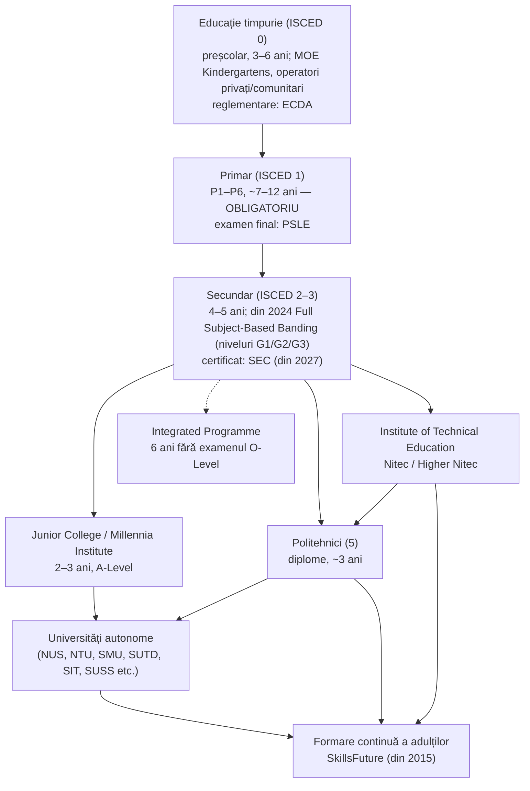
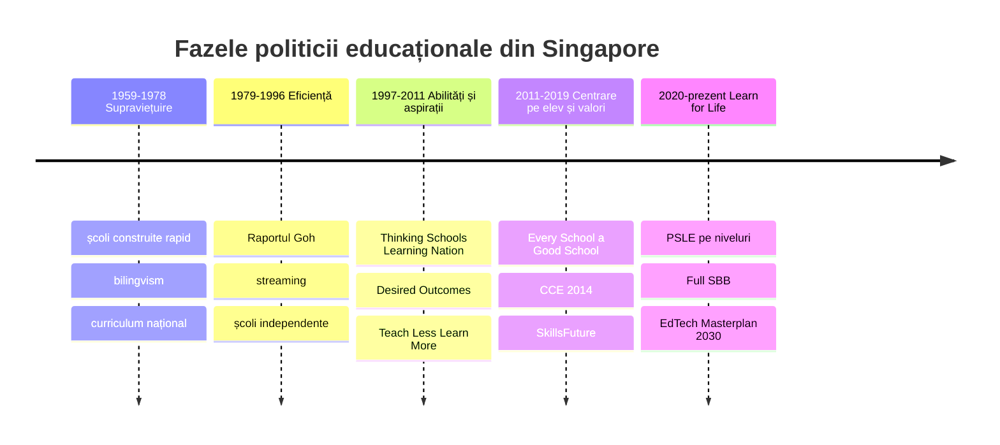
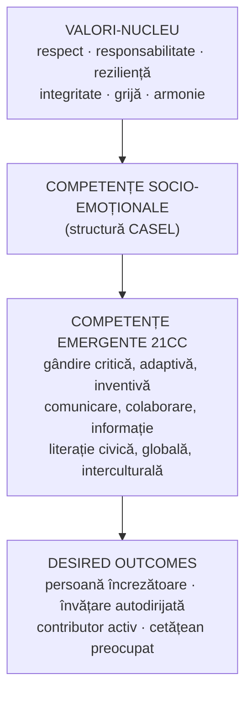
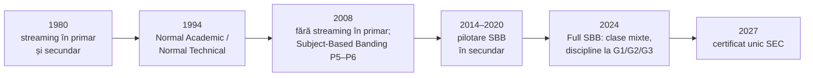
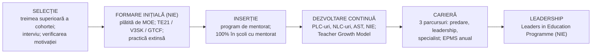

↑ [[00 Index - Analiza comparată internațională]] · [[00 MOC - Fundamentele științelor educației]]

> [!abstract] Pe scurt
> 1. **De ce contează**: un oraș-stat fără resurse naturale, cu 85% dintre copii nevorbitori de engleză acasă la sfârșitul anilor 1970, a ajuns în 2015 și 2022 **pe locul 1 în toate cele trei domenii PISA**, iar în PISA 2025 pe **locul 1 la citire și 2 la matematică și științe** (după B-S-J-Z, China). La TIMSS 2023 a condus în toate cele patru domenii.
> 2. **Formula de bază**: educația ca **investiție în capital uman** și instrument de construcție națională, condusă de un stat puternic, stabil și planificator, pe termen lung.
> 3. **Coerența sistemică** este marca distinctivă: relația **tripartită MOE – NIE – școli**. Un singur minister, **o singură instituție de formare a profesorilor** (NIE) și o rețea de școli publice aliniate la aceleași finalități.
> 4. **Profesorul este pârghia centrală**: selecție din treimea superioară a absolvenților, salariu în timpul formării, trei parcursuri de carieră, dezvoltare profesională încorporată în program (PLC-uri, Academy of Singapore Teachers).
> 5. **Evoluția paradigmei**: de la o școală **eficientistă, bazată pe examene și segregare pe niveluri** (streaming, 1980) la retorica **„școlilor care gândesc”** (1997), **„predă mai puțin, învață mai mult”** (2005) și educația **centrată pe elev și pe valori** (din 2011–2012).
> 6. **Finalități explicite și stabile**: *Desired Outcomes of Education* (1997) și cadrul *21st Century Competencies* (2010, actualizat 2023), cu valori, competențe socio-emoționale și competențe ale secolului XXI.
> 7. **Fundamente aplicate vizibil**: constructivismul lui Bruner (abordarea **concret–pictural–abstract**, curriculumul în spirală), înțelegerea relațională (Skemp), rezolvarea de probleme (Pólya), metacogniția, SEL (modelul CASEL), organizația care învață (Senge), învățarea pe tot parcursul vieții (**SkillsFuture**, 2015).
> 8. **Reforme recente de echitate**: eliminarea streamingului în secundar prin **Full Subject-Based Banding** (2024), noul scor PSLE pe niveluri de performanță (2021), eliminarea examenelor de mijloc de an (2023), un certificat secundar unic (SEC, din 2027).
> 9. **Costurile**: stres academic ridicat (PISA 2015: 86% dintre elevi îngrijorați de note slabe), o **industrie a meditațiilor** de circa **1,8 miliarde S$** (2023), „parentocrație” și un decalaj socio-economic mai mare decât media OCDE (112 puncte la matematică în PISA 2022).
> 10. **Transferabilitate**: nu modelul politic sau dimensiunea de oraș-stat, ci **coerența dintre finalități, curriculum, formarea profesorilor și evaluare** este lecția principală pentru Republica Moldova.

---

## 1. Profil și date-cheie

### 1.1 Context

| Indicator | Valoare | Sursă |
|---|---|---|
| Populație totală (iunie 2025) | **6,11 milioane**, din care 4,20 mil. rezidenți (3,66 mil. cetățeni, 0,54 mil. rezidenți permanenți) și 1,91 mil. nerezidenți | *Population in Brief 2025* |
| Suprafață | aprox. 710 km² | Kwek, Ho & Wong (Brookings, 2023) |
| Compoziție etnică | chinezi, malaiezi, indieni, eurasiatici; patru limbi oficiale | idem |
| Guvernare | stat unitar, oraș-stat; același partid (PAP) la guvernare din 1959; politici pe termen lung | idem |
| Elevi de 15 ani cu origine imigrantă (PISA 2022) | **29%** (18% în 2012) | OCDE, *PISA 2022 Factsheet Singapore* |

### 1.2 Structura sistemului

- **Obligativitate**: *Compulsory Education Act* (adoptat în 2000) face obligatoriu **învățământul primar de 6 ani** pentru copiii cetățeni. Practic, aproape toată cohorta continuă în secundar: 93% dintre elevii de 15 ani erau în clasa a 10-a la testarea PISA 2022, 99% frecventaseră cel puțin un an de preșcolar, iar doar 4% repetaseră o clasă (OCDE, *PISA 2022 Factsheet*).
- **Examene naționale cu miză mare**: PSLE (finalul primarului, decide admiterea în secundar); O-Level/N-Level (până în 2026) înlocuite de **Singapore-Cambridge Secondary Education Certificate (SEC)** din 2027; A-Level la finalul Junior College. Examenele sunt administrate de **SEAB** (Singapore Examinations and Assessment Board) în parteneriat cu Cambridge.
- **Tipuri de școli**: școli guvernamentale, școli „aided” (cu tradiție confesională sau de clan, finanțate public), școli independente și autonome (cu mai multă libertate curriculară), școli specializate (ex. NorthLight School, 2007, pentru elevii care nu au promovat PSLE; școli de arte, sport, matematică și științe), școli de educație specială.

### 1.3 Finanțare

| Indicator | Valoare | Sursă / observație |
|---|---|---|
| Buget MOE, FY2025 (estimare) | **15,30 miliarde S$** (94,4% operațional) | *Revenue and Expenditure Estimates FY2025*, Ministerul Finanțelor |
| Buget MOE, FY2026 (estimare) | **16,45 miliarde S$** (+8,8% față de FY2025 revizuit) | idem, FY2026 |
| Cheltuieli publice pentru educație, % din PIB | **~2,2%** (2024) | Banca Mondială (indicatorul SE.XPD.TOTL.GD.ZS). ⚠️ Procentul e scăzut față de OCDE (~5%) pentru că PIB-ul e foarte mare și populația de vârstă școlară mică |
| Educația, % din cheltuielile guvernamentale | ~12% (2025, Banca Mondială); a doua mare categorie după apărare | Banca Mondială; Kwek et al. (2023) |
| Cheltuieli cumulate pe elev, 6–15 ani | **~166 100 USD PPP** | OCDE, *PISA 2022 Factsheet* |
| Finanțare pentru cercetare în educație | peste 120 milioane S$ (2018–2022) | Kwek et al. (2023) |

> [!note] Comentariu
> Singapore cheltuie **mult pe elev în termeni absoluți**, dar **puțin ca procent din PIB**. OCDE observă că, peste pragul de ~75 000 USD cumulat pe elev, **modul în care se folosesc banii** contează mai mult decât volumul lor. Singapore e un exemplu de cheltuire **țintită**: salarii competitive pentru profesori, formare, infrastructură digitală și sprijin pentru elevii defavorizați.

### 1.4 Guvernanță

- **Centralizare strategică**: MOE stabilește curriculumul național, examenele, recrutarea și repartizarea profesorilor (profesorii sunt angajați ai ministerului, nu ai școlii). În PISA 2022, doar **20%** dintre elevi erau în școli unde directorul avea responsabilitatea principală pentru angajarea profesorilor (media OCDE: 60%). Totuși, **77%** erau în școli unde profesorii aleg materialele didactice (media OCDE: 76%).
- **Descentralizare operațională**: **clustere de școli** (din 1997), fiecare cu un superintendent pentru 11–13 școli; autonomie pentru programe distinctive (ALP, LLP), autoevaluare instituțională prin *School Excellence Model*.
- **Paradoxul „descentralizării centralizate”** (*centralized decentralization*) — formula lui **Pak Tee Ng** (*Learning from Singapore*, 2017): sistemul centralizează pentru a obține **sinergie**, dar descentralizează pentru **diversitate și inovare** la nivelul școlii.
- **Alte agenții**: ECDA (educație timpurie, sub MSF și MOE), SEAB (examene), SkillsFuture Singapore (formarea adulților; în 2026 reorganizată împreună cu Workforce Singapore într-un nou organism statutar coordonat de MOM și MOE), Academy of Singapore Teachers (în MOE).

---

## 2. Traiectoria PISA și alte evaluări internaționale

> [!info] Participare
> Singapore **nu a participat** la PISA 2000, 2003 și 2006. A intrat în **PISA 2009** (testarea a avut loc în 2010, în cadrul „PISA 2009+”). **Rezultatele PISA 2025 au fost publicate de OCDE la 8 septembrie 2026** (Volumul I; volumele despre învățarea autodirijată urmează în 2027) și sunt incluse mai jos.

### 2.1 Scoruri medii pe cicluri

| Ciclu | Citire | Matematică | Științe | Poziție aproximativă (C / M / Ș) | Media OCDE (C / M / Ș) |
|---|---|---|---|---|---|
| 2000–2006 | — | — | — | nu a participat | — |
| 2009 | 526 | 562 | 542 | ~5 / 2 / 4 | 493 / 496 / 501 |
| 2012 | 542 | 573 | 551 | ~3 / 2 / 3 | 496 / 494 / 501 |
| 2015 | 535 | 564 | 556 | **1 / 1 / 1** | 493 / 490 / 493 |
| 2018 | 549 | 569 | 551 | 2 / 2 / 2 (după B-S-J-Z) | 487 / 489 / 489 |
| 2022 | **543** | **575** | **561** | **1 / 1 / 1** (singurul sistem pe locul 1 în toate) | 476 / 472 / 485 |
| 2025 | **535** | **563** | **560** | **1 / 2 / 2** (B-S-J-Z: M 612, Ș 597, C 527) | ~461 / ~463 / ~482 *(de verificat în Volumul I)* |

*Surse*: OCDE, *PISA 2009–2022 Results* (Volumul I din fiecare ciclu); OCDE, *PISA 2022 Results — Factsheets: Singapore* (2023); MOE Singapore, comunicatul din 8.09.2026 despre PISA 2025; scorurile 2025 pe domenii și mediile OCDE 2025 sunt preluate din relatări de presă și sinteze care citează Volumul I (site-ul OCDE nu a putut fi accesat direct) — **de confirmat în nota de țară OCDE**. Pozițiile sunt aproximative (clasamentul PISA operează cu intervale de încredere).

> [!note] Comentariu — ce spune OCDE despre trend (PISA 2022)
> - În toate cele trei domenii, media din 2022 a fost **mai mare decât în 2009**. OCDE numește Singapore unul dintre **foarte puținele sisteme cu îmbunătățire constantă**, remarcabil pentru un sistem aflat deja în vârf.
> - 2018 → 2022: stabil la matematică, scădere la citire, creștere la științe.
> - 2018 → 2022: la matematică, **decalajul dintre cei mai buni 10% și cei mai slabi 10% s-a mărit**, fiindcă elevii foarte buni au progresat, iar cei slabi nu.
> - PISA 2025: ușoară scădere la citire (−8) și matematică (−12), stabil la științe, **în contextul unui declin puternic al mediei OCDE**. MOE semnalează că **decalajul pentru elevii slabi s-a adâncit** între 2022 și 2025.

### 2.2 Performanță de vârf și elevi sub nivelul de bază

| Indicator | Singapore 2022 | Media OCDE 2022 | Singapore 2025 |
|---|---|---|---|
| Sub nivelul 2 — matematică | **8%** (cel mai mic procent) | 31% | ~11% *(de verificat)* |
| Sub nivelul 2 — citire | **11%** (cel mai mic procent) | 26% | ~14% *(de verificat)* |
| Sub nivelul 2 — științe | **8%** (al doilea cel mai mic) | 24% | ~10% *(de verificat)* |
| Nivelurile 5–6 — matematică | **41%** (cel mai mare procent) | 9% | ~37% *(de verificat)* |
| Nivelurile 5–6 — citire | **23%** | 7% | ~22% *(de verificat)* |
| Nivelurile 5–6 — științe | **24%** | 7% | ~26% *(de verificat)* |
| Performeri de top în toate trei domeniile („all-rounders”) | — | — | **15%** (media OCDE: 3%) — MOE |
| Performeri de top în rezolvarea computațională de probleme (nou în 2025) | — | — | **peste 50%** (media OCDE: 25%) — MOE |

*Surse 2022*: OCDE, *PISA 2022 Factsheet Singapore*. *Surse 2025*: MOE (8.09.2026) pentru indicatorii marcați MOE; celelalte valori din sinteze secundare.

### 2.3 Echitate (PISA 2022, matematică)

| Indicator | Singapore | Media OCDE | Interpretare |
|---|---|---|---|
| Diferența elevi avantajați vs. defavorizați (quartila de sus vs. jos ESCS) | **112 puncte** | 93 puncte | decalaj **mai mare** decât media, stabil între 2012 și 2022 |
| Variația performanței explicată de ESCS | **17%** | 15% | legătură puțin mai puternică decât media |
| Elevi „rezilienți” (defavorizați ajunși în quartila de sus) | 10% | 10% | la medie |
| Elevi în quintila internațională de top ESCS | **50%** | — | populație foarte avantajată în termeni internaționali; aceștia au obținut în medie **613 puncte** |
| Elevi imigranți vs. nativi | +30 puncte în favoarea imigranților (+15 după controlul ESCS) | — | imigrația selectivă e un factor de compoziție |
| Diferența de gen | băieții +12 la matematică; fetele +20 la citire | — | — |

> [!warning] Critică — „excelență cu inechitate?”
> Singapore are **media cea mai ridicată** și **procentul cel mai mic de elevi slabi**, dar **nu** este un sistem cu decalaj socio-economic mic. Chiar elevii **defavorizați** din Singapore depășesc media OCDE (MOE, răspuns parlamentar, 2025), dar distanța față de colegii avantajați e mare. Aceasta este tensiunea centrală a sistemului: **meritocrația** produce performanță înaltă, dar și **reproducere socială** prin familii care pot investi în meditații și în accesul la școli de elită (vezi §8).

### 2.4 Bunăstare și viața școlară

| Indicator | Singapore | Media OCDE | Sursă |
|---|---|---|---|
| Foarte anxioși înaintea unui test chiar dacă sunt pregătiți | **76%** | 55% | PISA 2015, Vol. III |
| Îngrijorați că vor lua note slabe | **86%** | 66% | PISA 2015, Vol. III |
| Simt că aparțin școlii | 73% | 75% | PISA 2022 |
| Se simt singuri la școală | 19% | 16% | PISA 2022 |
| Victime ale bullyingului de câteva ori pe lună | 15% fete / 26% băieți | 20% / 21% | PISA 2022 |
| Profesorul oferă ajutor suplimentar la matematică | **86%** | 70% | PISA 2022 |
| Nu pot lucra bine în majoritatea orelor | 11% | 23% | PISA 2022 |
| Discuții săptămânale cu familia despre școală | 49% (în scădere față de 2022) | 60% | PISA 2025, MOE |
| Zero exercițiu fizic în afara școlii | 23% | 17% | PISA 2025, MOE |
| Se simt în siguranță în clasă | 96% | 93% | PISA 2025, MOE |
| Le place să rezolve probleme | 88% | 80% | PISA 2025, MOE |

- Fenomen de sănătate publică mai larg: *National Youth Mental Health Study* (IMH, 2022–2023, tineri de 15–35 de ani) a găsit că aproximativ **1 din 3** tineri raporta simptome **severe sau extrem de severe** de depresie, anxietate și/sau stres (anxietate severă: 27,0%; depresie severă: 14,9%). Studiul nu atribuie cauzal aceste cifre școlii.

### 2.5 TIMSS, PIRLS și alte domenii PISA

| Studiu | Rezultat Singapore | Sursă |
|---|---|---|
| **TIMSS 2023**, clasa a 4-a | matematică **615**, științe **607** — locul 1 | MOE, 4.12.2024; IEA |
| **TIMSS 2023**, clasa a 8-a | matematică **605**, științe **606** — locul 1 | idem |
| TIMSS 2015, 2019, 2023 | al treilea ciclu consecutiv de lider în toate cele patru domenii | MOE |
| **PIRLS 2021** (citire, clasa a 4-a) | **587** — cel mai mare scor (576 în PIRLS 2016) | MOE, 16.05.2023; IEA |
| PISA 2015, rezolvare colaborativă de probleme | printre primele locuri (MOE, 2017) | MOE |
| PISA 2022, gândire creativă | printre primele locuri (MOE, 2024) | MOE |
| PISA 2025, rezolvare computațională de probleme | **563**, locul 2 (media OCDE: 500) | MOE; presă |

---

## 3. Cronologia reformelor (1959–2026)

*Periodizarea*: Goh & Gopinathan (2008), Gopinathan (2015), preluată de Kwek, Ho & Wong (Brookings, 2023); a cincea fază („Learn for Life”) este denumirea MOE din 2020. Unii autori datează prima fază din **1959** (autoguvernare), alții din **1965** (independență).

| An | Reformă / lege / program | Ideea | Legătura cu fundamentele |
|---|---|---|---|
| 1959–1965 | Expansiune masivă a școlarizării; curriculum național; politica bilingvă (engleză + limba maternă) | acces universal, coeziune națională într-o societate multietnică | educația ca **factor de integrare socială**; funcția socială a educației (Modulul 02) |
| 1968–1970 | Accent pe educație tehnică și profesională | forță de muncă pentru industrializare | [[Capitalul uman și economia educației]] |
| **1979** | ***Report on the Ministry of Education 1978*** (**Raportul Goh**, coordonat de vicepremierul Goh Keng Swee, prezentat la 9.02.1979) | diagnostic: **abandon școlar ridicat, alfabetizare scăzută, bilingvism ineficient**; 85% dintre copii nu vorbeau engleza acasă | politică publică bazată pe **diagnostic sistemic** (proto-Educația bazată pe dovezi) |
| 1980–1981 | ***New Education System***: **streaming** în primar și secundar (fluxuri Express, Normal) | fiecare copil să învețe în ritmul „potrivit abilității” | **tracking**; logica diferențierii structurale; ulterior criticată (Oakes) |
| 1980–1990 | *Primary Mathematics Project* (CDIS): **metoda modelului** (bare), manuale noi | înțelegere conceptuală și rezolvare de probleme | [[Constructivismul cognitiv (Piaget, Bruner)]] |
| 1988 / 1994 | Școli **independente** (1988) și **autonome** (1994) | diversificare și autonomie pentru școlile performante | cvasi-piață, competiție între școli |
| 1990 | **Cadrul curricular pentru matematică** („pentagonul”), cu rezolvarea de probleme în centru | concepte, deprinderi, procese, metacogniție, atitudini | metacogniție; Pólya; Skemp |
| 1991 | Înființarea **National Institute of Education** (NIE) în cadrul NTU | un singur furnizor de formare inițială, legat de universitate și cercetare | [[Profesionalismul cadrului didactic]] |
| 1992 | *Learning Support Programme* (sprijin la citire în P1–P2) | intervenție timpurie pentru elevii slabi | echitate; intervenție țintită |
| 1994 | Separarea fluxului Normal în **Normal (Academic)** și **Normal (Technical)** | trasee diferențiate | tracking |
| **1997** | ***Thinking Schools, Learning Nation*** (TSLN), discursul premierului Goh Chok Tong, 2.06.1997 | școala ca **„organizație model care învață”**; gândire, curiozitate | Senge; [[Teoria schimbării educaționale și leadershipul]] |
| 1997 | ***Desired Outcomes of Education*** (DOE); ***National Education***; **clustere de școli**; primul *Masterplan for ICT in Education* (1997–2002) | finalități comune; identitate națională; rețele de învățare; digitalizare | [[Taxonomiile obiectivelor și educația centrată pe competențe]]; [[Pedagogia critică și educația pentru cetățenie]]; [[Constructionismul și educația digitală]] |
| 1998 | Pachet pentru profesori: concediu pentru dezvoltare profesională, *President's Award for Teachers*; dreptul la **100 de ore** de formare pe an (de verificat formularea actuală) | profesionalizare | [[Profesionalismul cadrului didactic]] |
| 2000 | *Compulsory Education Act*; ***School Excellence Model*** (autoevaluare în locul inspecției clasice) | obligativitate; responsabilizare prin autoevaluare | [[Responsabilizare, piață și încredere în guvernarea educației]] |
| începutul anilor 2000 | Trei **parcursuri de carieră** (predare, leadership, specialist); sistem de evaluare a performanței (EPMS) | carieră diferențiată, meritocratică | [[Profesionalismul cadrului didactic]] |
| 2003 | Înființarea **Centre for Research in Pedagogy and Practice** (CRPP) la NIE | cercetare sistematică a practicii la clasă | Educația bazată pe dovezi |
| 2004 | *Integrated Programme*; *Direct School Admission* (DSA) | trasee fără O-Level pentru elevii puternici; admitere pe baza talentelor | diferențiere; inteligențe multiple (în retorică) |
| **2005** | ***Teach Less, Learn More*** (TLLM), ministrul Tharman Shanmugaratnam; cadrul **SEL** | de la cantitate la calitate; „obiceiul investigației” | [[Progresivismul și educația nouă]]; [[Învățarea socio-emoțională și educația caracterului]] |
| 2007 | *Holistic Health Framework*; NorthLight School | sănătate; parcursuri alternative | dimensiunea psihofizică |
| 2008 | Eliminarea streamingului în primar; **Subject-Based Banding** la P5–P6 | nivel diferit pe discipline | Diferențierea, inteligențele multiple și designul universal |
| 2009 | *Primary Education Review and Implementation* (PERI) — **evaluare holistică** în primele clase; **PLC-uri** în școli; revizuirea DOE; raportul NIE ***TE21*** | evaluare formativă; învățare colaborativă a profesorilor; model nou de formare | [[Evaluarea formativă]]; [[Socioconstructivismul și teoria activității (Vygotsky)]] |
| **2010** | Cadrul ***21st Century Competencies and Student Outcomes***; **Academy of Singapore Teachers** | competențe, valori, SEL integrate; cultură profesională condusă de profesori | competențe; profesionalism |
| 2012 | ***Every School a Good School*** (ministrul Heng Swee Keat); abandonarea **„banding-ului”** școlilor secundare după rezultate; *Teacher Growth Model* | reducerea competiției dintre școli; fiecare elev implicat, fiecare profesor grijuliu, fiecare părinte partener | [[Echitatea și școala comprehensivă]] |
| 2013 | ECDA (agenția pentru educație timpurie); anunțarea programelor **ALP** și **LLP** în toate școlile secundare până în 2017 | calitate în preșcolar; învățare aplicată | Educația timpurie; Învățarea prin proiecte, investigație și fenomene |
| **2014** | Programa ***Character and Citizenship Education*** (CCE 2014); pilotarea SBB în secundar | valori și cetățenie predate explicit | educația caracterului |
| **2015** | ***SkillsFuture*** — credit de 500 S$ pentru toți cetățenii de peste 25 de ani | învățare pe tot parcursul vieții | [[Învățarea pe tot parcursul vieții și formele educației]] |
| 2016 | **KidSTART** (sprijin pentru familii defavorizate, de la naștere) | intervenție ecologică timpurie | Educația timpurie |
| 2018 | ***Learn for Life***: eliminarea examenelor în P1–P2 și a clasamentelor din carnete; *Student Learning Space* (SLS); DSA extins la toate școlile secundare; *UPLIFT* | mai puțin accent pe note; platformă digitală națională | evaluare formativă; educație digitală |
| 2019 | Anunțarea **Full SBB** pentru 2024; extinderea obligativității la copiii cu CES moderate–severe | eliminarea streamingului; incluziune | [[Educația incluzivă]] |
| 2020–2021 | COVID-19: *Home-Based Learning*; **dispozitiv personal de învățare** (PLD) pentru toți elevii de secundar (accelerat până la sfârșitul lui 2021); *SkillsFuture for Educators* | reziliență; învățare autodirijată | [[Învățarea autoreglată, metacogniția și autoeducația]] |
| **2021** | Noul **PSLE pe niveluri de performanță** (AL1–AL8, scor total 4–32) în locul T-score; **CCE 2021** (inclusiv educație pentru sănătate mintală) | evaluare criterială, nu normativă; bunăstare | [[Evaluarea formativă]]; SEL |
| 2023 | Eliminarea **examenelor de mijloc de an** în toate clasele; ***EdTech Masterplan 2030*** (septembrie 2023); actualizarea cadrului 21CC; *Enhanced TE21* | mai mult timp pentru învățare profundă; IA și tehnologie | educație digitală; competențe |
| **2024** | ***Full Subject-Based Banding*** în (aproape) toate școlile secundare; *SkillsFuture Level-Up Programme* (credit suplimentar de 4 000 S$ pentru cei de peste 40 de ani) | clase mixte, discipline la niveluri G1/G2/G3 | [[Echitatea și școala comprehensivă]]; învățare pe tot parcursul vieții |
| 2026 | CoS 2026 (ministrul Desmond Lee): GEP înlocuit de programe școlare (acces extins de la 7% la 10% din cohortă); sprijin extins de la 100 la 157 de școli cu elevi defavorizați; revizuirea înscrierii în P1; noua agenție comună SSG–WSG | echitate, lărgirea accesului la educația pentru elevii dotați | echitate; diferențiere |
| 2027 (planificat) | Primul **SEC** (certificat secundar unic) | un singur certificat în locul O-/N-Level | reducerea etichetării |

---

## 4. Implementarea fundamentelor pe dimensiunile manualului

### 4.1 Statutul științelor educației, cercetarea și politica bazată pe dovezi

→ [[Modulul 01 - Statutul științelor educației]] · [[Modulul 05 - Paradigmele pedagogiei și cercetarea pedagogică]]

**Instituții**
- **NIE (National Institute of Education)**, instituție autonomă în cadrul **Nanyang Technological University** (din 1991; predecesori: *Teachers' Training College*, 1950, și *Institute of Education*, 1973). NIE unește **formarea inițială, formarea continuă, programele de leadership și cercetarea**. Este unul dintre puținele cazuri în care o singură instituție universitară acoperă întreaga formare a profesorilor unei țări.
- **Centre for Research in Pedagogy and Practice (CRPP)**, înființat la NIE în 2003, cu programul de cercetare *Core* (observarea sistematică a lecțiilor la scară națională). Revista *SingTeach* transpune cercetarea pentru profesori.
- **MOE**: diviziile de planificare și cercetare, SEAB, *Academy of Singapore Teachers*; parteneriate cu **Institute of Policy Studies** (NUS) pentru sondaje despre părinți și școală.

**Cum circulă dovezile**: relația **tripartită** MOE–NIE–școli. MOE comandă și finanțează cercetarea (peste 120 mil. S$ în 2018–2022), NIE produce studii și formează profesorii în noile curricule, iar școlile oferă feedback. Curriculumul este revizuit **la fiecare 5–7 ani** (Kwek et al., 2023).

**Exemple de politici informate de cercetare**
- Raportul Goh (1979) — diagnostic statistic al abandonului și al bilingvismului.
- Datele CRPP despre **predominanța predării didactice, orientate spre examen** (Hogan et al., anii 2000–2010) au alimentat justificarea pentru TLLM și pentru reformele evaluării.
- Benchmarkingul internațional sistematic: PISA, TIMSS, PIRLS, TALIS sunt folosite ca **oglindă**, iar MOE publică analize proprii la fiecare ciclu.

> [!warning] Critică
> Relația strânsă dintre cercetare și minister oferă **viteză de implementare**, dar ridică întrebări despre **independența critică** a cercetării. Kwek, Ho & Wong (2023, cercetători NIE) arată că **adoptarea cercetării-acțiune și a *lesson study* de către profesori e încă „incipientă”**: multe echipe tratează ciclul de investigație ca listă de etape de bifat, nu ca reflecție reală.

### 4.2 Paradigme pedagogice: clasic – modern – postmodern

→ [[Modulul 02 - Clasic, modern și postmodern în educație]]

| Etapă | Paradigma dominantă | Manifestare în Singapore |
|---|---|---|
| 1959–1996 | **Clasică / tehnocratică**: transmitere de cunoștințe, disciplină, eficiență, selecție | curriculum național uniform, examene cu miză mare, streaming, manuale unice, predare frontală |
| 1997–2011 | **Modernă**: gândire, învățare activă, competențe, școala ca organizație care învață | TSLN, TLLM, pentagonul matematicii, Project Work, ICT Masterplans |
| 2011–prezent | **Elemente postmoderne**: centrare pe elev, valori, bunăstare, trasee flexibile, personalizare, IA | *student-centric, values-driven*, CCE, Full SBB, SLS, *Learn for Life* |

**Pak Tee Ng** (2017) descrie sistemul prin **paradoxuri** în care vechiul și noul coexistă: „predă mai puțin, învață mai mult”, „descentralizare centralizată”, excelență și echitate. Kwek et al. (2023) vorbesc de **„stratificarea politicilor”** (*policy layering*, după Thelen): politicile noi **se adaugă** peste cele vechi fără a le înlocui complet. De exemplu, reformele holistice coexistă cu PSLE, un examen cu miză mare.

> [!note] Comentariu — o pedagogie „în două viteze”
> Cercetările NIE arată că în **clasele mici de primar și secundar** predarea e mai centrată pe elev, iar în **anii de examen** (P5–P6, Sec 3–4) revine la **instruirea directă** și exersarea pentru test (Kwek et al., 2018, citat în Kwek et al., 2023). Tranziția paradigmatică descrisă de manual (clasic → modern → postmodern) este, în Singapore, **simultană și stratificată**, nu succesivă.

### 4.3 Formele educației și învățarea pe tot parcursul vieții

→ [[Modulul 03 - Formele generale ale educației]] · [[3.6 Educația permanentă și autoeducația]] · [[Autoeducația - teorii, autori și corelări]]

**Educația formală** e dominantă și foarte structurată. **Educația nonformală** este însă instituționalizată în jurul școlii:
- **Activitățile cocurriculare (CCA)** sunt parte obligatorie a experienței din secundar și sunt recunoscute la admitere (DSA).
- **ALP** (*Applied Learning Programme*, neevaluat prin examen, orientat spre aplicarea cunoștințelor în contexte reale) și **LLP** (*Learning for Life Programme*, experiențe pentru competențe socio-emoționale și valori), în toate școlile secundare din 2017.
- **Values in Action** (învățare prin serviciu în comunitate), în cadrul CCE.

**Educația informală** e puternic modelată de **familie** (aspirații înalte, investiții în meditații), de **grupurile etnice de sprijin** (Mendaki, SINDA, CDAC, Eurasian Association) și de **bibliotecile publice** (National Library Board).

**Educația permanentă** a devenit politică de stat prin **SkillsFuture** (2015):
- credit de **500 S$** pentru fiecare cetățean de peste 25 de ani, utilizabil pentru cursuri aprobate;
- **SkillsFuture Level-Up Programme** (Buget 2024): credit suplimentar de **4 000 S$** pentru cei de peste 40 de ani (din 1 mai 2024), pentru recalificare la mijlocul carierei;
- *SkillsFuture for Educators* (2020): foaie de parcurs pentru dezvoltarea profesională a profesorilor în șase domenii (literația evaluării, învățarea prin investigație, predarea diferențiată, sprijinul pentru CES, e-pedagogia, CCE).

**Autoeducația / învățarea autodirijată**: *self-directed learner* este **una dintre cele patru finalități** DOE. Instrumentele concrete sunt metacogniția (componentă a cadrului de matematică din 1990), **zilele de învățare acasă** (*Home-Based Learning*), dispozitivul personal (PLD) și platforma SLS. PISA 2025 va publica în 2027 un volum dedicat învățării autodirijate.

> [!tip] Lecție
> Singapore transformă ideea manualului despre **„cetatea educativă”** (Faure) în **instrumente financiare individuale** (credite SkillsFuture) și **infrastructură** (SLS, biblioteci, ITE, politehnici). Riscul, semnalat de Biesta, este ca **responsabilitatea învățării** să fie transferată asupra individului. În Singapore, nivelul scăzut de protecție socială („responsabilitate personală, familia și comunitatea mai întâi”, discursul bugetar din 2005 citat de Kwek et al.) amplifică acest risc.

### 4.4 Finalitățile educației

→ [[Modulul 04 - Finalitățile educației]]

**Ideal și scopuri** (nivelul manualului: ideal → scop → obiective):

| Nivel | Document | Conținut |
|---|---|---|
| **Ideal / finalități generale** | ***Desired Outcomes of Education*** (1997, revizuit 2009) | persoana **încrezătoare** (*confident person*), cel care **învață autodirijat** (*self-directed learner*), **contributorul activ** (*active contributor*), **cetățeanul preocupat** (*concerned citizen*) |
| **Scopuri pe etape** | *Key Stage Outcomes* (primar, secundar, postsecundar) | obiective progresive: în primar, conștientizarea propriilor puncte forte; în secundar, reziliență și adaptabilitate; în postsecundar, reziliență în adversitate |
| **Cadru de competențe** | ***Framework for 21st Century Competencies and Student Outcomes*** (2010; actualizat 2023) | **valori-nucleu** (respect, responsabilitate, reziliență, integritate, grijă, armonie) → **competențe socio-emoționale** (conștiința de sine, autogestiune, luarea responsabilă a deciziilor, conștiința socială, gestionarea relațiilor) → **competențe emergente ale secolului XXI** (gândire critică, adaptivă și inventivă; comunicare, colaborare și competențe informaționale; literație civică, globală și interculturală) |
| **Obiective disciplinare** | programele MOE (revizuite la 5–7 ani) | ex. cadrul de matematică: rezolvarea de probleme în centru |

> [!note] Comentariu — corelare cu manualul
> - Structura corespunde **ierarhiei finalităților** din manual (ideal → scopuri → obiective), cu o particularitate: **valorile** sunt plasate **în centru**, nu la periferie. E un exemplu de **„educație integrală”** declarată explicit.
> - Formula DOE combină **individualul** (încredere, autodirijare) cu **socialul** (contribuție, cetățenie), apropiată de triada lui Klafki (autodeterminare, codeterminare, solidaritate) discutată în [[Autoeducația - teorii, autori și corelări]]. Diferența: accentul singaporez cade pe **armonie și loialitate națională**, nu pe emancipare critică.

> [!warning] Critică
> Există o distanță între finalitățile holistice și **mecanismele de selecție** (PSLE, admiterea în școli de elită). Kwek et al. (2023) numesc aceasta **„paradoxul”** sistemului: finalitățile oficiale sunt holistice, dar **stimulentele reale** (examene, credențiale) rămân academice. Mulți părinți urmăresc, prin urmare, obiective înguste.

### 4.5 Dimensiunile educației

→ [[Modulul 06 - Dimensiunile generale ale educației]]

| Dimensiune (manual) | Implementare în Singapore |
|---|---|
| **Morală / caracter** | CCE (2014, 2021) predată explicit: ore CCE, ore cu dirigintele (*Form Teacher Guidance Periods*), CCE în limba maternă, *Values in Action*; valorile-nucleu 21CC |
| **Intelectuală** | curriculum riguros la matematică, științe, limbi; bilingvism obligatoriu (engleză + limba maternă: chineză, malaeză, tamilă); rezolvarea de probleme; *Project Work* |
| **Tehnologică / digitală** | patru *ICT Masterplans* (1997–2020); SLS (2018); dispozitiv personal pentru toți elevii de secundar (până la sfârșitul lui 2021); *EdTech Masterplan 2030*; abordarea MOE față de IA: **a învăța despre IA, a folosi IA, a învăța cu IA și „a învăța dincolo de IA”** (CoS 2026) |
| **Estetică** | arte și muzică în curriculum; școli specializate (School of the Arts); **University of the Arts Singapore** |
| **Psihofizică** | educație fizică obligatorie; *Holistic Health Framework* (2007); *Programme for Active Learning* (PAL) în primar. Proporția elevilor supraponderali a rămas stabilă la **11–13%** timp de 10 ani (MOE, 2022) |

> [!note] Comentariu
> PISA 2025 arată că **23%** dintre elevi nu fac **deloc** exercițiu fizic în afara școlii (media OCDE: 17%). Ceea ce școala face bine în interiorul programului (educație fizică, CCA) nu compensează **stilul de viață** determinat de timpul lung de studiu și de meditații.

### 4.6 „Noile educații”

→ [[Modulul 07 - Noile educații]]

| „Nouă educație” (UNESCO, manual) | Formă în Singapore |
|---|---|
| **Educația pentru cetățenie / democrație** | *National Education* (1997); CCE; *Total Defence*; în CCE 2021, **discuții despre probleme contemporane** la clasă |
| **Educația pentru pace și toleranță** | armonie rasială și religioasă ca **valoare-nucleu**; *Racial Harmony Day*; literație interculturală (21CC) |
| **Educația media / digitală** | *Cyber Wellness* (în CCE); literație digitală (NDLP, 2020) |
| **Educația pentru mediu / sustenabilitate** | temă în științe și geografie; programul *Eco Stewardship* (de verificat denumirea actuală). PISA 2025: Singapore locul 2 la literația de mediu, 27% la nivelurile 5–6 (MOE) |
| **SEL și sănătate mintală** | cadrul SEL (2005); **educație pentru sănătate mintală explicită în CCE 2021**; consilieri școlari; *Peer Support Leaders* |
| **Educația pentru familie** | *Family Education* și *Sexuality Education* în CCE |
| **Educația pentru carieră** | *Education and Career Guidance* (ECG), consilieri ECG în școli |

> [!warning] Critică — cetățenie fără critică?
> Analiza comparată a programelor CCE 2014 și 2021 identifică trei deplasări: de la o etică **deterministă** la una **relațională**, de la **cunoașterea morală** la **analiza reflexivă** și de la **interiorizarea** valorilor la **contextualizarea** lor (literatura publicată în *Asia Pacific Journal of Education*, 2025). Rămâne însă o tensiune, discutată în cercetarea academică, între **armonia socială** și **gândirea critică**. Cetățenia promovată e mai degrabă **responsabilă și loială** decât **participativ-critică** (în sensul lui Freire sau Westheimer & Kahne).

### 4.7 Sistemul și managementul educației

→ [[Modulul 08 - Sistemul de educație și managementul educației]]

**Structură și tracking — de la streaming la Full SBB**

- **Full SBB (2024)**: fluxurile Express, Normal (Academic) și Normal (Technical) au fost eliminate. Elevii sunt repartizați prin **Posting Groups 1–3** (în funcție de PSLE), dar învață în **clase mixte** (formă, CCE, arte, sport) și pot urma **fiecare disciplină la un nivel diferit** (G1, G2, G3), cu posibilitatea de a urca nivelul pe parcurs.
- **Evaluare și responsabilizare**: *School Excellence Model* (din 2000) — **autoevaluare** pe baza unor rubrici, validată extern. Renunțarea la „banding-ul” public al școlilor (anunțată în 2012) a vizat reducerea competiției dintre școli.
- **Echitate — instrumente**: *Financial Assistance Scheme* (în 2026 extinsă la încă **31 000** de elevi; **133 000** de beneficiari anual); *Edusave* (cont educațional pentru fiecare copil, din 1993); **UPLIFT** (2018); centre de îngrijire după școală în toate școlile primare (din 2020); sprijin suplimentar pentru **157 de școli** cu elevi defavorizați (din 2026); *Learning Support Programme* (din 1992) și sprijin la matematică; *Collaborative Tuition Programme* (meditații subvenționate).
- **Profesori pe elev și resurse**: PISA 2022 arată o creștere a lipsei de personal raportate de directori (26% dintre elevi în școli afectate, față de 5% în 2018). MOE a anunțat în 2026 creșterea recrutării de la ~700 la **peste 1 000 de profesori pe an** și dublarea educatorilor auxiliari (*allied educators*) de la 800 la 1 600.

> [!warning] Critică — tracking și echitate
> Streamingul a **redus abandonul** după 1980 (obiectivul Raportului Goh), dar a produs **etichetare** și **stratificare socială**. Elevii din fluxul Normal (Technical) proveneau disproporționat din familii cu venituri mici și din anumite grupuri etnice. Literatura clasică (Jeannie **Oakes**, *Keeping Track*, 1985/2005) a documentat efecte similare în SUA. Full SBB este răspunsul Singaporelui, dar **selecția la 12 ani prin PSLE** rămâne. Ministrul Desmond Lee a recunoscut în 2026 că unele școli primare sunt încă **suprareprezentate de elevi din familii cu statut socio-economic ridicat** și că MOE **revizuiește înscrierea în P1**.

### 4.8 Agenții educației: profesorul, directorul, elevul, familia, comunitatea

→ [[Modulul 09 - Agenții educației și factorii dezvoltării]]

#### 4.8.1 Profesorul — lanțul complet al profesionalizării

| Element | Descriere | Sursă |
|---|---|---|
| **Selecție** | candidați recrutați în mod obișnuit din **treimea superioară** a cohortei academice; interviuri și evaluarea motivației | Barber & Mourshed (McKinsey, 2007); NCEE; Asia Society |
| **Salariu în timpul formării** | viitorii profesori sunt angajați MOE și primesc salariu în timpul programului NIE | NCEE; MOE |
| **Model de formare** | ***TE21*** (*A Teacher Education Model for the 21st Century*, NIE, 2009; aplicat din 2012; *Enhanced TE21*, 2023). Modelul **V³SK**: trei valori (**angajament față de elev, față de profesie, față de comunitate**) + deprinderi + cunoștințe | NIE |
| **Standarde la absolvire** | ***Graduand Teacher Competencies Framework*** (GTCF), cu trei dimensiuni: **practică profesională; creștere și dezvoltare personală; leadership și agenție** | NIE |
| **Legătura teorie–practică** | practică pedagogică extinsă; **e-portofolii** | NIE |
| **Model de practică** | ***Singapore Teaching Practice*** (AST) — descrie explicit cum se realizează predarea eficientă; *Ethos of the Teaching Profession* și *Code of Professional Conduct* | AST |
| **Dezvoltare profesională** | dreptul (introdus la sfârșitul anilor 1990) la **până la 100 de ore** de formare pe an, citat pe larg în literatură. ⚠️ Paginile actuale ale MOE **nu mai menționează explicit** cifra: formularea curentă e de verificat | literatură secundară (TIMSS 2015 Encyclopedia; Bautista et al., 2015) |
| **Structuri de învățare** | **PLC-uri** în școli (din 2009, cu timp alocat în orar); **NLC-uri** între școli (circa 221); **Academy of Singapore Teachers** (2010), cu *Master Teachers*; *Centres for Teaching and Learning Excellence* (2015 pentru secundar, 2021 pentru primar); *School Staff Developer* în fiecare școală (din 2006) | Kwek et al. (2023) |
| **Carieră** | trei parcursuri (**Teaching Track**, **School Leadership Track**, **Senior Specialist Track**), cu mobilitate laterală; evaluare anuală a performanței și a potențialului (EPMS) | MOE |
| **Timp de lucru (TALIS 2024)** | **47 h/săptămână** (media OCDE: 41); doar **18 h** de predare efectivă (OCDE: 23) | MOE / OCDE, TALIS 2024 |
| **Statut perceput (TALIS 2024)** | **71%** consideră că profesia e valorizată de societate (media OCDE: **22%**); 57% simt că decidenții le prețuiesc opiniile (OCDE: 16%) | idem |
| **Mentorat și feedback** | 42% dintre profesorii debutanți au mentor desemnat (OCDE: 26%); 87% raportează schimbări pozitive după feedbackul colegilor (OCDE: 71%) | idem |
| **Tehnologie** | **75%** folosesc IA în predare (OCDE: 36%) | idem |
| **Stres și retenție** | **27%** raportează mult stres (OCDE: 19%); 29% intenționează să plece în 5 ani; rata reală de demisie rămâne de 2–3% pe an | TALIS 2024, relatat de presă |

> [!note] Comentariu — corelare cu manualul
> Manualul descrie **profesorul postmodern** ca practician reflexiv și agent al schimbării (Modulul 09). Singapore instituționalizează această imagine prin **dimensiunea „leadership și agenție”** din GTCF și prin parcursurile de carieră. Totuși, cercetătorii NIE notează că agenția e exercitată **în limitele stabilite central** („tight–loose balance”, Ho, Ong & Tan, 2020). Profesorii au 18 ore de predare, dar 47 de ore de lucru: timpul „necontact” e în mare parte ocupat de planificare colaborativă, CCA, consiliere și comunicarea cu părinții.

#### 4.8.2 Directorul
- Selecție din parcursul de leadership, formare prin ***Leaders in Education Programme*** (NIE, din 2001), rotația directorilor între școli, rolul de „lider al organizației care învață” (TSLN). Directorii sunt evaluați și rotiți de MOE, ceea ce favorizează circulația practicilor.

#### 4.8.3 Elevul
- Elevul e definit prin DOE drept **subiect** al propriei învățări (*self-directed learner*). Instrumentele concrete sunt DSA (recunoașterea talentelor), SBB (niveluri diferite pe discipline), CCA și, din 2026, programe școlare pentru elevii dotați (în locul GEP centralizat).

#### 4.8.4 Familia și comunitatea
- **COMPASS** (*Community and Parents in Support of Schools*, 1998) și grupuri de sprijin ale părinților în toate școlile.
- Institute of Policy Studies (Mathews, Lim & Teng, 2017) a identificat **trei profiluri de părinți**: 29% „old school” (note), 34% „new school” (dezvoltare holistică), 30% „loving lion” (ambele).
- **Grupuri etnice de sprijin** (Mendaki, SINDA, CDAC, Eurasian Association) cu meditații cu cost redus, finanțate parțial de stat.
- Implicarea părinților la inițiativa proprie a scăzut: 24% dintre elevi erau în școli unde cel puțin jumătate dintre familii au discutat progresul copilului din proprie inițiativă (2022), față de 42% în 2018 (PISA 2022).

### 4.9 Proiectare, predare, evaluare

→ [[Modulul 10 - Proiectarea, realizarea și evaluarea activității educative]]

**Curriculum**
- Curriculum **național**, revizuit la 5–7 ani; filozofia curriculară (*Singapore Curriculum Philosophy*) plasează elevul „în centrul deciziilor educaționale”.
- **Matematica** — cadrul „pentagon” (1990): **rezolvarea de probleme** în centru, susținută de **concepte, deprinderi, procese, metacogniție și atitudini**; **metoda modelului** (bare) în manualele de primar din anii 1980; **abordarea concret–pictural–abstract**; curriculum în spirală; **puține teme tratate în profunzime**.
- *Project Work* (în Junior College), ALP, învățare interdisciplinară.

**Predare**
- **TLLM** (2005) a cerut „mai puțin conținut, mai multă profunzime”: reducerea programelor cu până la 10–20% (cifră citată frecvent, de verificat pentru fiecare disciplină) și timp pentru inițiative școlare (*white space*).
- Datele CRPP și concluziile Brookings (2023): predarea **didactică** rămâne puternică în anii de examen.
- Climatul la clasă e unul dintre cele mai bune din PISA: doar 11% dintre elevi nu pot lucra bine în majoritatea orelor de matematică (media OCDE: 23%).

**Evaluare**

| Reformă | Idee | Legătură teoretică |
|---|---|---|
| PERI (2009): evaluare holistică în P1–P2; **fără examene în P1–P2** (din 2019) | feedback descriptiv în locul notelor la vârste mici | [[Evaluarea formativă]] |
| Eliminarea clasamentelor din carnete (2019) | reducerea comparației sociale | teoria motivației (Dweck; SDT) |
| **PSLE pe AL1–AL8** (2021) | evaluare **criterială**: nota depinde de performanța proprie, nu de cohortă; scor total 4–32 | criterial vs. normativ (docimologie, Modulul 10) |
| Eliminarea examenelor de **mijloc de an** (2023) | mai mult timp pentru învățare profundă și evaluare continuă | evaluare formativă |
| **SEC** (2027) | un certificat unic cu discipline la G1–G3 | reducerea etichetării |

> [!warning] Critică
> PSLE pe benzi a redus **micro-comparațiile**, dar nu a eliminat **competiția pentru școlile de elită**. Forumurile de părinți (ex. *kiasuparents*) discută intens strategiile de alegere a școlii pe baza benzilor AL (Kwek et al., 2023). Kwek, Wong & Tan (2020) arată că reformele de evaluare se lovesc de o **„cultură a examenului”** adânc înrădăcinată.

---

## 5. Teorii și abordări aplicate

### 5.1 Tabel-sinteză

| Teorie / abordare (card) | Relevanță | Implementare-cheie în Singapore |
|---|---|---|
| [[Capitalul uman și economia educației]] | ★★★ | logica fondatoare: educația ca „investiție socială”; SkillsFuture; planificare pe nevoile economiei |
| [[Constructivismul cognitiv (Piaget, Bruner)]] | ★★★ | Singapore Math: CPA, curriculum în spirală, metoda modelului |
| [[Știința cognitivă a învățării]] | ★★ | înțelegere relațională (Skemp); metoda modelului ca reprezentare; puține teme în profunzime |
| [[Învățarea deplină (mastery learning)]] | ★★ | predarea pentru stăpânire (exportată în Anglia); sprijin pentru elevii rămași în urmă (LSP) |
| [[Behaviorismul și instruirea directă]] | ★★ | tradiția didactică, exersare intensă, pregătire pentru examen, mai ales în anii terminali |
| [[Taxonomiile obiectivelor și educația centrată pe competențe]] | ★★★ | DOE, 21CC, Key Stage Outcomes |
| [[Evaluarea formativă]] | ★★ | PERI, PSLE pe benzi, eliminarea examenelor |
| [[Învățarea autoreglată, metacogniția și autoeducația]] | ★★ | *self-directed learner*; metacogniția în pentagonul matematicii; HBL, SLS |
| Diferențierea, inteligențele multiple și designul universal | ★★ | SBB/Full SBB, DSA; predarea diferențiată ca domeniu de practică |
| [[Educația incluzivă]] | ★ | obligativitate extinsă la copiii cu CES (2019); educatori auxiliari; școli de educație specială |
| [[Învățarea socio-emoțională și educația caracterului]] | ★★★ | SEL (2005), competențe CASEL în 21CC, CCE 2014/2021 |
| [[Pedagogia critică și educația pentru cetățenie]] | ★★ | National Education (1997), CCE; critica limitelor gândirii critice |
| [[Constructionismul și educația digitală]] | ★★ | ICT Masterplans, SLS, PLD, EdTech Masterplan 2030, IA |
| [[Teoria schimbării educaționale și leadershipul]] | ★★★ | TSLN („organizația care învață”), clustere, Leaders in Education, descentralizarea centralizată |
| [[Profesionalismul cadrului didactic]] | ★★★ | NIE, TE21, V³SK, GTCF, AST, PLC-uri, parcursuri de carieră |
| [[Responsabilizare, piață și încredere în guvernarea educației]] | ★★ | școli independente/autonome, banding, SEM; trecerea de la inspecție la autoevaluare |
| Educația bazată pe dovezi | ★★ | CRPP, finanțare de cercetare, benchmarking internațional |
| Educația timpurie | ★★ | ECDA, MOE Kindergartens, KidSTART, *Nurturing Early Learners* |
| [[Echitatea și școala comprehensivă]] | ★★★ | de la streaming la Full SBB; FAS, UPLIFT, sprijin pentru școli |
| [[Învățarea pe tot parcursul vieții și formele educației]] | ★★★ | SkillsFuture, ITE/politehnici, SkillsFuture for Educators |
| Învățarea prin proiecte, investigație și fenomene | ★★ | TLLM, Project Work, ALP, învățarea prin investigație |
| [[Progresivismul și educația nouă]] | ★ | retorica TSLN/TLLM (curiozitate, investigație); aplicare parțială |
| [[Socioconstructivismul și teoria activității (Vygotsky)]] | ★★ | PLC-uri, *lesson study*, predare colaborativă; eșafodaj în CPA |
| [[Tradiția Bildung-Didaktik și tradiția Curriculum]] | ★ | Singapore aparține **tradiției anglo-saxone a curriculumului** (examene Cambridge, obiective, standarde) |

### 5.2 Capitalul uman și economia educației

- **(a) Teoria**: educația crește productivitatea individuală și creșterea economică; cheltuiala educațională e **investiție**, nu consum.
- **(b) Autori**: **Theodore W. Schultz** (*Investment in Human Capital*, 1961); **Gary S. Becker** (*Human Capital*, 1964); **Eric Hanushek & Ludger Woessmann** (*The Knowledge Capital of Nations*, 2015 — **calitatea** învățării, măsurată prin teste internaționale, explică creșterea mai bine decât anii de școlarizare).
- **(c) Implementare**: faza „supraviețuirii” (1959–1978) a legat explicit școala de industrializare; Raportul Goh (1979) a tratat abandonul drept **risipă** (*education wastage*); SkillsFuture (2015) extinde logica la adulți. Educația e numită „cheia de boltă a statului investiției sociale” (Ho, 2021, citat de Kwek et al., 2023).
- **(d) Dovezi / critici**: Singapore e citat frecvent drept exemplu de țară în care calitatea capitalului uman a însoțit creșterea rapidă, dar **cauzalitatea** e greu de izolat (deschiderea comercială, investițiile străine, stabilitatea politică contează la fel de mult). Critica umanistă: educația redusă la **funcție economică** marginalizează dimensiunile personale. De aici reorientarea declarată spre valori (2011–).

### 5.3 Constructivismul cognitiv (Bruner, Piaget) — Singapore Math

- **(a) Teoria**: elevul își **construiește** înțelegerea; **Bruner** propune trei moduri de reprezentare — **enactiv** (prin acțiune), **iconic** (prin imagini), **simbolic** — și **curriculumul în spirală** (reluarea ideilor la niveluri crescânde de abstractizare). Piaget: trecerea de la operații concrete la formale.
- **(b) Autori și aport**:
  - **Jerome Bruner** — *The Process of Education* (1960; curriculum în spirală); *Toward a Theory of Instruction* (1966; cele trei moduri de reprezentare) → baza abordării **concret–pictural–abstract** (CPA).
  - **Zoltan P. Dienes** — *Building Up Mathematics* (1960); principiul **variabilității perceptive și matematice**, materiale structurate (blocuri multibază), explorarea înainte de formalizare.
  - **Richard R. Skemp** — *Relational Understanding and Instrumental Understanding* (1976): **înțelegerea relațională** (a ști *de ce*) vs. **instrumentală** (a ști *cum*).
  - **George Pólya** — *How to Solve It* (1945): **euristicile** rezolvării de probleme, preluate explicit în curriculumul singaporez.
  - **Kho Tek Hong** și echipa *Primary Mathematics Project* (CDIS, MOE, anii 1980) — **metoda modelului** (bare), reprezentarea picturală a relațiilor cantitative.
- **(c) Implementare**: literatura despre istoria curriculumului (inclusiv sinteze NIE și surse secundare) arată că echipa curriculară din anii 1980 s-a inspirat din Bruner, Skemp, Dienes și Pólya, precum și din *An Agenda for Action* (NCTM, SUA, 1980) și *Raportul Cockcroft* (Regatul Unit, 1982). ⚠️ Influența **directă, documentată** a lui Dienes și Skemp asupra echipei lui Kho este afirmată în principal în **surse secundare și comerciale** (ex. *Maths — No Problem!*); **de verificat** în documentele de arhivă ale CDIS. Cadrul de matematică din 1990 a pus **rezolvarea de probleme** și **metacogniția** în centru.
- **(d) Dovezi / critici**:
  - SUA: studiul randomizat pe clustere al programului ***Math in Focus*** (bazat pe Singapore Math), clasele III–V: efecte de **0,11–0,15 abateri standard** asupra performanței la matematică, fără diferențe după nivelul inițial sau statutul minoritar (Jaciw et al., *Journal of Research on Educational Effectiveness*, 2016).
  - Anglia: ***Mathematics Mastery*** (inspirat din Singapore), evaluat de EEF (Jerrim & Vignoles): efecte de **0,10** (primar) și **0,06** (secundar), fiecare nesemnificativ statistic separat, dar cu efect cumulat de **0,073**, semnificativ la limită — **mic, dar potențial eficient ca raport cost–beneficiu**.
  - Exportul: manualele *Primary Mathematics* au fost distribuite în SUA de la sfârșitul anilor 1990 de editori privați; în Anglia, **NCETM** și rețeaua de **Maths Hubs** au promovat „predarea pentru stăpânire” (inspirată din Shanghai și Singapore), iar DfE a aprobat manuale de tip Singapore.
  - Critică: rezultatele Singaporelui nu pot fi atribuite doar metodei. **Profesorii bine formați, coerența manual–program–examen și meditațiile** sunt factori concomitenți. Transferul manualelor fără formarea profesorilor produce efecte mult mai mici.

### 5.4 Știința cognitivă a învățării

- **(a) Teoria**: învățarea depinde de arhitectura memoriei de lucru și a memoriei de lungă durată; **reprezentările vizuale**, **exemplele rezolvate**, **exersarea distribuită** și **reducerea încărcăturii cognitive** sprijină înțelegerea.
- **(b) Autori**: **John Sweller** (teoria încărcării cognitive, 1988); **Richard Mayer** (învățarea multimedia, 2001); **Skemp** (1976; schemele conceptuale).
- **(c) Implementare**: metoda modelului funcționează ca **reprezentare externă** care descarcă memoria de lucru în problemele verbale; curriculumul „puține teme, în profunzime” și coerența verticală a manualelor. ⚠️ Legătura cu Sweller e o **interpretare** a cercetătorilor ulteriori, nu o sursă declarată a proiectului din anii 1980.
- **(d) Dovezi**: studii NIE despre metoda modelului (ex. Ng Swee Fong & Lee, 2009, *Journal for Research in Mathematics Education*) arată eficiența ei în rezolvarea problemelor aritmetice, dar și **dificultăți la trecerea spre algebră** pentru o parte dintre elevi.

### 5.5 Învățarea deplină (mastery learning)

- **(a) Teoria**: aproape toți elevii pot atinge standarde înalte dacă primesc **timp**, **feedback formativ** și **corectare** înainte de a trece mai departe.
- **(b) Autori**: **Benjamin Bloom** (*Learning for Mastery*, 1968); **John B. Carroll** (modelul învățării școlare, 1963); **Thomas Guskey** (implementarea evaluării formative și a corectărilor).
- **(c) Implementare**: în Singapore nu există un program numit „mastery learning”, dar principiile apar în **structura curriculumului de matematică** (progresie lentă, consolidare), în **LSP** (sprijin în grup mic pentru P1–P2, din 1992) și în sprijinul pentru matematică. Termenul „teaching for mastery” este mai degrabă o **etichetă a exportului** în Anglia.
- **(d) Dovezi**: evaluările EEF (vezi §5.3). Critica: stăpânirea presupune timp, iar calendarul determinat de examene naționale limitează răbdarea față de ritmurile diferite.

### 5.6 Behaviorismul și instruirea directă

- **(a) Teoria**: învățarea ca formare de asocieri prin exersare, feedback și întărire; **instruirea directă** explicită, secvențială.
- **(b) Autori**: **B. F. Skinner** (*The Technology of Teaching*, 1968); **Siegfried Engelmann** (*Direct Instruction*); **Barak Rosenshine** (*Principles of Instruction*, 2012).
- **(c) Implementare**: nu ca doctrină declarată, ci ca **practică dominantă istoric**: predare frontală, fișe de exersare, exersarea subiectelor de examen, industria cărților cu **teste din școlile de elită** (Kwek et al., 2023).
- **(d) Dovezi / critici**: CRPP (programul *Core*) a documentat predominanța predării didactice. Tocmai această constatare a motivat TLLM. Paradoxal, **instruirea explicită bine structurată** poate explica o parte din performanța ridicată la testele standardizate, în timp ce reformele încearcă să o echilibreze cu investigația.

### 5.7 Taxonomiile obiectivelor și educația centrată pe competențe

- **(a) Teoria**: definirea explicită a rezultatelor învățării (cunoștințe, deprinderi, atitudini) și alinierea curriculumului, predării și evaluării la ele.
- **(b) Autori**: **Bloom et al.** (*Taxonomy of Educational Objectives*, 1956); **Anderson & Krathwohl** (revizuire, 2001); **OCDE DeSeCo** (2003–2005); **Partnership for 21st Century Skills** (SUA, anii 2000); **OECD Learning Compass 2030** (2019).
- **(c) Implementare**: DOE (1997) → 21CC (2010, actualizat 2023) → Key Stage Outcomes → programe disciplinare; MOE a construit și **indicatori de monitorizare** a sistemului pe baza DOE.
- **(d) Dovezi / critici**: Raportul Asia Society (2017, *Advancing 21st Century Competencies in Singapore*) arată o **implementare avansată la nivel de politică**, dar **evaluarea** competențelor rămâne dificilă. Examenele măsoară încă preponderent cunoașterea disciplinară. Rezultatele PISA la gândire creativă (2022) și rezolvare colaborativă (2015) sugerează totuși că elevii nu sunt doar „buni la teste”.

### 5.8 Evaluarea formativă

- **(a) Teoria**: evaluarea folosită **pentru învățare**: clarificarea criteriilor, feedback, autoevaluare și evaluare între colegi.
- **(b) Autori**: **Paul Black & Dylan Wiliam** (*Inside the Black Box*, 1998); **D. Royce Sadler** (1989); **John Hattie & Helen Timperley** (*The Power of Feedback*, 2007).
- **(c) Implementare**: PERI (2009) — evaluare holistică în primele clase; renunțarea la examene în P1–P2 (2019) și la examenele de mijloc de an (2023); PSLE criterial (2021); *assessment literacy* ca domeniu prioritar în *SkillsFuture for Educators*.
- **(d) Dovezi / critici**: Wong, Kwek & Tan (2020, *Asia Pacific Journal of Education*) arată că schimbările au fost reale, dar **cultura examenului** persistă. Profesorii practică evaluarea formativă **în umbra** examenelor sumative.

### 5.9 Învățarea autoreglată, metacogniția și autoeducația

- **(a) Teoria**: elevul își planifică, monitorizează și evaluează propria învățare.
- **(b) Autori**: **John Flavell** (metacogniția, 1976); **Barbara Zimmerman** (modelul ciclic, 2000); **Paul Pintrich** (2000); **Philip Winne & Allyson Hadwin** (1998). Detalii în [[Autoeducația - teorii, autori și corelări]].
- **(c) Implementare**: *self-directed learner* (DOE); **metacogniția** ca unul dintre cele cinci componente ale cadrului de matematică (1990); CCE 2021: „metacogniția și învățarea profundă” ca principiu pedagogic; **HBL** și PLD după pandemie; SLS pentru învățarea în ritm propriu.
- **(d) Dovezi**: Kwek et al. (2023) notează că HBL a fost **perceput** ca stimulând autodirijarea (percepție, nu efect măsurat). PISA 2025 va publica în 2027 date comparative despre învățarea autodirijată — **de urmărit**.

### 5.10 Diferențierea și inteligențele multiple

- **(a) Teoria**: adaptarea conținutului, procesului și produsului la nevoile diferite ale elevilor; recunoașterea tipurilor diferite de talent.
- **(b) Autori**: **Carol Ann Tomlinson** (*The Differentiated Classroom*, 1999); **Howard Gardner** (*Frames of Mind*, 1983).
- **(c) Implementare**: Singapore a ales istoric **diferențierea structurală** (streaming, școli diferite), apoi **diferențierea pe discipline** (SBB 2008 în primar, Full SBB 2024 în secundar) și **diferențierea în clasă** (domeniu prioritar pentru profesori). DSA recunoaște talente sportive, artistice și de leadership.
- **(d) Critici**: literatura despre tracking (Oakes; meta-analizele despre grupare pe abilități) arată efecte negative pentru elevii plasați în grupe inferioare. Full SBB e o corecție, dar gruparea pe discipline rămâne o formă de **grupare pe abilități**. Efectele reformei din 2024 **nu au fost încă evaluate independent**.

### 5.11 Învățarea socio-emoțională și educația caracterului

- **(a) Teoria**: competențele socio-emoționale (conștiință de sine, autogestiune, conștiință socială, relații, decizie responsabilă) pot fi predate și influențează bunăstarea și rezultatele școlare.
- **(b) Autori**: **CASEL** (fondat în 1994; **Daniel Goleman**, *Emotional Intelligence*, 1995); **Durlak et al.** (meta-analiză, *Child Development*, 2011: +11 puncte percentile la performanța academică); **Thomas Lickona** (*Educating for Character*, 1991).
- **(c) Implementare**: cadrul SEL (2005), cu **cele cinci competențe CASEL** preluate în 21CC; CCE 2014 și 2021; educația pentru sănătate mintală explicită din 2021 (implementată în toate clasele până în 2023).
- **(d) Dovezi / critici**: nu există, din sursele consultate, o **evaluare de impact** riguroasă a CCE la nivel național. Critici academice: **„modelarea” sănătății mintale** ca responsabilitate individuală a elevului (analiză în *Pedagogy, Culture & Society*, 2023) și riscul ca SEL să devină **instrument de conformare**.

### 5.12 Pedagogia critică și educația pentru cetățenie

- **(a) Teoria**: educația pentru cetățenie poate forma cetățeni **personal responsabili**, **participativi** sau **orientați spre justiție** (Westheimer & Kahne, 2004); pedagogia critică (Freire, *Pedagogia oprimaților*, 1968/1970) cere conștientizarea structurilor de putere.
- **(b) Autori**: **Paulo Freire**; **Joel Westheimer & Joseph Kahne** (*What Kind of Citizen?*, 2004); **Bernard Crick** (raportul britanic din 1998).
- **(c) Implementare**: *National Education* (1997), CCE, *Values in Action*, discuții despre probleme contemporane (CCE 2021).
- **(d) Critici**: Singapore favorizează modelul **„personal responsabil”** și al **armoniei**; spațiul pentru dezbatere critică a politicii publice e limitat. Pentru cursul de fundamente, Singapore ilustrează **tensiunea dintre educația pentru coeziune și educația pentru emancipare**.

### 5.13 Constructionismul și educația digitală

- **(a) Teoria**: elevii învață construind artefacte semnificative (Papert); tehnologia ca mediu de gândire, nu doar de livrare.
- **(b) Autori**: **Seymour Papert** (*Mindstorms*, 1980); **Mitchel Resnick** (*Lifelong Kindergarten*, 2017); **Punya Mishra & Judith Koehler** (TPACK, 2006).
- **(c) Implementare**: patru *ICT Masterplans* (1997–2020); SLS (2018); PLD pentru toți elevii de secundar (2021); *Code for Fun* (programare în primar, de verificat anul extinderii); *EdTech Masterplan 2030* (2023): „învățare transformată de tehnologie, pentru o lume transformată de tehnologie”; strategia IA în patru componente (2026).
- **(d) Dovezi / critici**: TALIS 2024 — 75% dintre profesori folosesc IA (OCDE: 36%); 81% sunt în școli cu predare online sau hibridă. PISA 2022: **27%** dintre elevi distrași de dispozitive digitale (OCDE: 30%). Dezbaterea despre **timpul petrecut în fața ecranelor** și eficiența reală a dispozitivelor personale e deschisă; nu există încă evaluări cauzale publicate ale PLD.

### 5.14 Teoria schimbării educaționale și leadershipul

- **(a) Teoria**: schimbarea sistemică cere **coerență**, capacitate construită la toate nivelurile, leadership distribuit și organizații care învață.
- **(b) Autori**: **Peter Senge** (*The Fifth Discipline*, 1990 — organizația care învață; *Schools That Learn*, 2000); **Michael Fullan** (*The New Meaning of Educational Change*; *Coherence*, 2016, cu Quinn); **Andy Hargreaves & Dennis Shirley** (*The Fourth Way*, 2009); **Michael Barber & Mona Mourshed** (McKinsey, 2007; Mourshed, Chijioke & Barber, 2010, care plasează Singapore în etapa „de la bun la excelent”); **Pak Tee Ng** (*Learning from Singapore: The Power of Paradoxes*, Routledge, 2017).
- **(c) Implementare**: TSLN (1997) a cerut explicit ca **„fiecare școală să fie o organizație model care învață”**; clustere (1997); *Leaders in Education Programme*; relația tripartită; stabilitatea politică permite reforme pe **decenii**. Ng (2008) descrie deplasările: de la controlul de sus în jos la inițiative de jos în sus, de la strategii „rezistente la profesor” la pedagogii centrate pe elev, de la acces la calitate.
- **(d) Dovezi / critici**: literatura comparată (OCDE, *Strong Performers and Successful Reformers*, 2011; Tucker, *Surpassing Shanghai*, 2011; Darling-Hammond et al., *Empowered Educators*, 2017) consideră coerența și capacitatea profesorilor factori-cheie, dar acestea sunt **analize de caz**, nu dovezi cauzale. ⚠️ Nu am putut verifica o colaborare directă Fullan–Ng; conceptele lui Fullan sunt folosite frecvent în analiza cazului singaporez.

### 5.15 Profesionalismul cadrului didactic

- **(a) Teoria**: calitatea sistemului depinde de calitatea profesorilor; profesionalismul implică selecție, formare pe baze științifice, autonomie responsabilă, dezvoltare continuă și comunități profesionale.
- **(b) Autori**: **Linda Darling-Hammond** (*Empowered Educators*, 2017, cu studiu de caz Singapore); **Andy Hargreaves & Michael Fullan** (*Professional Capital*, 2012); **Richard DuFour** (PLC-uri, 1998); **Lee Sing Kong, Goh Chor Boon et al.** (*Toward a Better Future*, Banca Mondială și NIE, 2008).
- **(c) Implementare**: vezi §4.8.1 — NIE, TE21, V³SK, GTCF, AST, PLC-uri, NLC-uri, trei parcursuri, *Teacher Growth Model*, *Singapore Teaching Practice*.
- **(d) Dovezi / critici**: TALIS 2024 — statut social perceput excepțional (71% vs. 22%), mentorat puternic; **dar** și volum mare de muncă (47 h) și stres peste medie. Studiile despre „**performativitate**” (ex. articolul *Perform or else: The performative enhancement of teacher professionalism*, *Asia Pacific Journal of Education*, 32(3), 2012, depus în repozitoriul NIE) arată că evaluarea anuală legată de bonusuri poate transforma profesionalismul în **conformare cu indicatorii**.

### 5.16 Responsabilizare, piață și încredere

- **(a) Teoria**: guvernarea educației oscilează între **responsabilizare prin rezultate**, **mecanisme de piață** (alegere, competiție) și **încredere profesională**.
- **(b) Autori**: **Pasi Sahlberg** (critica GERM, 2011); **Stephen Ball** (performativitatea, 2003); **Melanie Ehren** (inspecție și încredere).
- **(c) Implementare**: școli independente (1988) și autonome (1994), clasamente și banding publicate (abandonate), DSA, **alegerea școlii** după PSLE → cvasi-piață; în paralel, trecerea de la **inspecție** la **autoevaluare** prin SEM (2000) și *Every School a Good School* (2012).
- **(d) Critici**: Singapore nu se încadrează în dihotomia „Finlanda (încredere) vs. SUA/Anglia (responsabilizare)”. Este un **hibrid**: control central puternic, examene cu miză mare, dar încredere ridicată în profesori și **fără** sancțiuni punitive publice pentru școli.

### 5.17 Educația bazată pe dovezi

- **(a) Teoria**: deciziile educaționale ar trebui să se bazeze pe cele mai bune dovezi disponibile (studii randomizate, sinteze, date de sistem).
- **(b) Autori**: **David Hargreaves** (1996); **Robert Coe**; **John Hattie** (*Visible Learning*, 2009); EEF (Anglia).
- **(c) Implementare**: CRPP, finanțare de cercetare, participare la toate marile evaluări internaționale, analize MOE proprii ale fiecărui ciclu PISA/TIMSS/TALIS.
- **(d) Critici**: puține **evaluări cauzale publice** ale marilor reforme (TLLM, CCE, Full SBB, PLD). Politica e mai degrabă **„informată de dovezi”** și de benchmarking decât evaluată experimental.

### 5.18 Educația timpurie

- **(a) Teoria**: investiția timpurie are cele mai mari randamente; calitatea interacțiunilor contează.
- **(b) Autori**: **James Heckman** (curba Heckman, 2006); **Perry Preschool** (Schweinhart et al.); **Urie Bronfenbrenner** (modelul ecologic, 1979).
- **(c) Implementare**: ECDA (2013); cadrul curricular *Nurturing Early Learners* (NEL); MOE Kindergartens; **KidSTART** (2016) — vizite la domiciliu și monitorizarea dezvoltării de la naștere, abordare ecologică; 99% dintre elevii de 15 ani au frecventat cel puțin un an de preșcolar (PISA 2022).
- **(d) Dovezi**: OCDE asociază frecventarea preșcolarului cu scoruri mai bune la 15 ani, chiar după controlul ESCS. Evaluări publice ale KidSTART: de verificat.

### 5.19 Echitatea și școala comprehensivă

- **(a) Teoria**: amânarea selecției și clasele eterogene reduc influența originii sociale asupra rezultatelor.
- **(b) Autori**: **James Coleman** (*Equality of Educational Opportunity*, 1966); **Jeannie Oakes** (*Keeping Track*, 1985); **Ludger Woessmann & Eric Hanushek** (2006: tracking-ul timpuriu crește inechitatea, analiză comparată); **Pasi Sahlberg** (modelul finlandez).
- **(c) Implementare**: Singapore **nu** a devenit comprehensiv în sens nordic, dar a **redus treptat** selecția: fără streaming în primar (2008), Full SBB (2024), SEC (2027), GEP descentralizat (2026); instrumente de sprijin țintit.
- **(d) Dovezi / critici**: decalajul ESCS de 112 puncte (PISA 2022) a rămas **stabil** între 2012 și 2022; PISA 2025 arată o adâncire a decalajului pentru elevii slabi. Cercetătorii vorbesc de trecerea de la **meritocrație** la **„parentocrație”** (Tan, 2019; Chiong, 2022).

### 5.20 Învățarea pe tot parcursul vieții

- **(a) Teoria**: educația nu se încheie la școală; sistemele trebuie să ofere oportunități continue de învățare.
- **(b) Autori**: **Edgar Faure** (*A învăța să fii*, UNESCO, 1972); **Jacques Delors** (*Comoara lăuntrică*, 1996); **Paul Lengrand** (1970).
- **(c) Implementare**: SkillsFuture (2015; credit 500 S$; Level-Up 4 000 S$ din 2024; extinderea catalogului cu ~200 de calificări WSQ din T4 2026); ITE și politehnici ca trasee tehnice de calitate; *SkillsFuture for Educators* (2020).
- **(d) Critici**: creditele individuale sunt folosite mai mult de persoanele deja educate (efectul Matei, documentat în literatura internațională despre conturi individuale de învățare); evaluări publice detaliate ale utilizării pe grupuri sociale: de verificat.

### 5.21 Învățarea prin proiecte și investigație

- **(a) Teoria**: învățarea prin probleme autentice, investigație și proiecte dezvoltă înțelegerea profundă și transferul.
- **(b) Autori**: **John Dewey** (*Democracy and Education*, 1916); **William H. Kilpatrick** (*The Project Method*, 1918); **John Larmer & John Mergendoller** (PBLWorks).
- **(c) Implementare**: TLLM (2005: trecerea de la conținut la „obiceiul investigației”); *Project Work* în Junior College; ALP în toate școlile secundare (2017); învățarea prin investigație ca domeniu prioritar de practică.
- **(d) Critici**: Kwek et al. (2023) arată că investigația e mai prezentă în clasele fără examen; pe măsură ce examenul se apropie, predarea revine la instruire directă.

---

## 6. Ecosistemul extins: actori non-statali și procese

| Actor | Rol | Exemplu |
|---|---|---|
| **NIE / NTU** | formare, cercetare, leadership | TE21, CRPP, *Leaders in Education Programme*, *SingTeach* |
| **Academy of Singapore Teachers** (în MOE) | cultură profesională condusă de profesori | *Master Teachers*, CTLE, *Singapore Teaching Practice* |
| **SEAB** și **Cambridge Assessment** | examene naționale | PSLE, SEC, A-Level |
| **SkillsFuture Singapore / Workforce Singapore** | formarea adulților, legătura cu piața muncii | credite SkillsFuture; noua agenție comună (2026) |
| **ECDA** și operatori preșcolari (PCF Sparkletots, NTUC My First Skool etc.) | educație timpurie | *Anchor Operator Scheme* (de verificat detaliile) |
| **Universități autonome** | cercetare, formare, admitere | NUS, NTU, SMU, SUTD, SIT, SUSS, UAS |
| **Politehnici și ITE** | educație tehnică și profesională de calitate | parteneriate cu industria, stagii |
| **Industria meditațiilor** (*tuition centres*) | educație-umbră | ~**1,8 mld. S$** cheltuiți de gospodării în 2023 (*Household Expenditure Survey*) |
| **Editori privați** | culegeri de teste, manuale suplimentare | culegeri cu subiecte din școlile de top |
| **Grupuri etnice de sprijin** | meditații ieftine, mentorat, burse | Mendaki, SINDA, CDAC, Eurasian Association |
| **Organizații comunitare și ONG-uri** | sprijin pentru familii defavorizate | *Family Service Centres*, *Student Care Centres* |
| **Familiile** | investiție în educație, alegerea școlii | trei profiluri de părinți (IPS, 2017); „parentocrație” |
| **COMPASS** și grupuri de părinți | parteneriat școală–familie–comunitate | din 1998 |
| **Angajatori** | stagii, formare, recunoașterea calificărilor | parteneriate cu ITE și politehnici; SkillsFuture |
| **National Library Board** | biblioteci publice, programe de lectură | educație informală |
| **Media** (*The Straits Times*, *Schoolbag* al MOE) | dezbatere publică, comunicarea politicilor | TALIS: 64% dintre profesori se simt valorizați de media (OCDE: 20%) |
| **Platforme EdTech** | învățare digitală | SLS (de stat); instrumente comerciale integrate (Google Workspace, Kahoot etc.) |
| **Comunități online ale profesorilor** | învățare între colegi | *SG Learning Designers Circle* (grup Facebook, peste 20 000 de membri) |
| **Organizații internaționale** | benchmarking, legitimitate | OCDE (PISA, TALIS), IEA (TIMSS, PIRLS), Banca Mondială |

> [!note] Comentariu — educația-umbră ca „al doilea sistem”
> **Mark Bray** (*Shadow Education*, UNESCO-IIEP) a introdus conceptul de educație-umbră: meditațiile private care **imită** curriculumul școlar. În Singapore, cheltuielile gospodăriilor pentru meditații au crescut de la **88,40 S$** pe lună (2018) la **104,80 S$** (2023). Gospodăriile din quintila de sus cheltuie **162,60 S$** pe lună, iar cele din quintila de jos **36,30 S$** — **de peste patru ori mai puțin**. MOE declară că **nu poate interveni** în aceste decizii private și răspunde prin meditații subvenționate și prin reforme care reduc accentul pe examene (MOE, răspuns parlamentar, 5.02.2025).

---

## 7. Factori explicativi ai performanței, limite și critici

### 7.1 Ce spune cercetarea

| Factor | Mecanism | Tip de dovadă | Grad de certitudine |
|---|---|---|---|
| **Coerență sistemică** (finalități–curriculum–manuale–examene–formare) | toate componentele trag în aceeași direcție | analize comparative (OCDE 2011; Tucker 2011; Darling-Hammond 2017) | **corelație / plauzibil**, nu cauzalitate demonstrată |
| **Calitatea profesorilor** (selecție, formare, carieră) | predare de calitate constantă între școli | studii de caz, TALIS | puternic plauzibil; consens larg |
| **Curriculum de matematică de calitate** | profunzime, CPA, rezolvare de probleme | RCT-uri **în alte țări** (efecte mici–moderate) | parțial cauzal, dar transfer limitat |
| **Stabilitate politică și planificare pe termen lung** | reforme pe decenii, implementare consecventă | analiză istorică | plauzibil |
| **Valorizarea socială a educației** și aspirațiile familiilor | efort, timp de studiu | sondaje, PISA | corelație; greu de separat de meditații |
| **Educația-umbră** | timp de instruire suplimentar | HES, Bray | contribuie la scoruri, dar și la inechitate |
| **Compoziția populației** | 50% dintre elevi în quintila internațională de top ESCS; imigrație selectivă (imigranții +15 puncte după ESCS) | PISA 2022 | **efect de compoziție real** — o parte din avans e explicată de profilul socio-economic |
| **Bilingvism cu engleza ca limbă de predare** | acces la resurse globale; testare în engleză | istoric | ambiguu: 28% dintre elevii non-imigranți vorbesc acasă altă limbă decât cea a testului |
| **Oraș-stat, dimensiune mică** | implementare rapidă, omogenitate administrativă | comparativ | plauzibil; limitează transferabilitatea |
| **Climat disciplinar bun, sprijin din partea profesorului** | timp efectiv de învățare | PISA 2022 | corelație |

> [!warning] Critică — corelație vs. cauzalitate
> Niciun studiu nu poate izola **„rețeta”** singaporeză. Scorurile PISA reflectă **tot ecosistemul**: școală, familie, meditații, cultură, compoziție socială. Chiar la 613 puncte, elevii din quintila de sus ESCS au rezultate **printre cele mai ridicate pentru profilul lor**, deci școala adaugă valoare, dar **cât anume din avans vine din școala publică și cât din investiția privată nu se știe**.

### 7.2 Limite, costuri și critici

1. **Stres și anxietate**: PISA 2015 — 76% anxioși înaintea testelor, 86% îngrijorați de note; 1 din 3 tineri cu simptome severe de depresie, anxietate sau stres (NYMHS, 2022–2023).
2. **Educația-umbră și parentocrația**: 1,8 mld. S$ pe meditații (2023); raport de peste 4:1 între cheltuielile quintilelor extreme; strategii de mutare lângă școlile dorite și de voluntariat pentru admitere (Kwek et al., 2023).
3. **Inechitate socio-economică**: decalaj ESCS de 112 puncte (PISA 2022), peste media OCDE; adâncirea decalajului elevilor slabi (PISA 2025, MOE).
4. **Paradoxul holistic–academic**: reformele holistice coexistă cu examene cu miză mare → **incoerență** percepută de elevi și profesori (Kwek et al., 2023).
5. **Volumul de muncă al profesorilor**: 47 h/săptămână, 27% cu mult stres (TALIS 2024); lipsă de personal raportată de directori (PISA 2022).
6. **Limitele gândirii critice și ale participării civice** în educația pentru cetățenie.
7. **Declin recent**: scoruri PISA 2025 ușor mai mici la matematică și citire (totuși în contextul unui declin global).
8. **Implicarea familiei în scădere**: discuții săptămânale despre școală doar la 49% (PISA 2025); implicare din proprie inițiativă în scădere (PISA 2022).
9. **Sedentarism**: 23% fără exercițiu fizic în afara școlii (PISA 2025).
10. **Mituri de evitat**:
    - ❌ „Singapore a reușit doar prin memorare și exersare” — PISA măsoară aplicarea în situații noi; Singapore e în vârf și la gândire creativă (2022) și la rezolvare computațională de probleme (2025).
    - ❌ „Singapore Math e o metodă-minune care poate fi importată” — RCT-urile arată efecte **mici** fără ecosistemul de formare.
    - ❌ „Streamingul a fost abolit, deci selecția a dispărut” — PSLE, alegerea școlii și grupele pe discipline rămân.
    - ❌ „Profesorii din Singapore sunt printre cei mai bine plătiți din lume” — salariile sunt **competitive** cu alte profesii din Singapore (principiul-cheie), dar comparațiile internaționale directe trebuie făcute cu grijă (de verificat în *Education at a Glance*; Singapore nu e membru OCDE).

---

## 8. Lecții și transferabilitate pentru Republica Moldova

| Lecție singaporeză | Se poate prelua? | Condiții / adaptare pentru R. Moldova |
|---|---|---|
| **Coerența finalități – curriculum – manuale – evaluare – formare** | **DA**, e lecția principală | Codul Educației (2014) și Cadrul de referință al curriculumului au deja finalități pe competențe; lipsesc **alinierea** examenelor și a formării inițiale la ele |
| **Un parteneriat strâns minister – instituție de formare – școli** | **PARȚIAL** | R. Moldova are mai multe universități pedagogice (UPS „Ion Creangă”, universități regionale). Se poate construi un **consorțiu** cu standarde comune de absolvire (echivalent GTCF) și practică extinsă, fără centralizare într-o singură instituție |
| **Selecția și atractivitatea profesiei** | **PARȚIAL** | Fără salarii competitive față de alte profesii, selecția „din treimea superioară” e imposibilă. Pași realiști: burse condiționate, salariu în perioada de practică, parcursuri de carieră cu creștere salarială |
| **Parcursuri de carieră diferențiate** (predare / leadership / specialist) | **DA** | se leagă de gradele didactice existente; ar trebui să recompenseze **mentoratul** și **leadershipul pedagogic**, nu doar vechimea |
| **Comunități profesionale de învățare cu timp alocat în orar** | **DA** | cost redus; necesită timp protejat, facilitatori formați și încredere, nu raportare birocratică |
| **Mentorat obligatoriu pentru debutanți** | **DA** | ar reduce abandonul profesiei în primii ani |
| **Metoda modelului / abordarea CPA la matematică** | **DA, cu formare** | manuale coerente + formare aprofundată a învățătorilor; fără formare, efectele sunt mici (Jerrim & Vignoles; Jaciw et al.) |
| **Evaluare criterială pe benzi largi, reducerea examenelor la vârste mici** | **DA** | relevant pentru evaluările naționale din clasa a IV-a și a IX-a; atenție la miza admiterii |
| **Streaming timpuriu** | **NU** | Singapore însuși a renunțat treptat; R. Moldova ar trebui să evite segregarea timpurie a elevilor |
| **Examene cu miză foarte mare la 12 ani** | **NU** | costuri de stres și inechitate documentate |
| **Sprijin țintit pentru școlile și elevii defavorizați** | **DA** | finanțare suplimentară pe formulă pentru școlile rurale și elevii vulnerabili; profesori de sprijin |
| **Învățare pe tot parcursul vieții prin credite individuale** | **PARȚIAL** | credit simbolic legat de oferta acreditată; atenție la efectul Matei și la calitatea furnizorilor |
| **Planificare pe termen lung, independentă de ciclul electoral** | **DA, ca principiu** | acord politic larg asupra strategiei „Educația 2030”; stabilitate în conducerea reformelor |
| **Centralizarea puternică și modelul politic** | **NU** | contextul politic și administrativ e diferit; descentralizarea și autonomia școlii rămân obiective europene |
| **Controlul educației-umbră** | **atenție** | și R. Moldova are meditații extinse înaintea examenelor; reforma evaluării trebuie să reducă **cererea**, nu doar să reglementeze oferta |

> [!tip] Lecție
> Singapore arată că **fundamentele din manual** (finalități clare, profesor profesionist, proiectare curriculară coerentă, evaluare formativă) produc efecte **doar când sunt aplicate simultan și consecvent timp de decenii**. Singapore arată și **prețul** unui sistem centrat pe competiție: stres, meditații, inechitate. Pentru R. Moldova, lecția e **coerența fără hiperselectivitate**.

---

## 9. Întrebări de reflecție

1. Cum explicați faptul că Singapore are **cel mai mic procent de elevi slabi** din PISA, dar un **decalaj socio-economic mai mare decât media OCDE**? Ce spune acest lucru despre relația dintre **excelență** și **echitate**?
2. Plasați fazele politicii educaționale din Singapore (1959–2026) pe axa **clasic – modern – postmodern** din Modulul 02. Este tranziția succesivă sau „stratificată”?
3. Comparați *Desired Outcomes of Education* cu **idealul educațional** din Codul Educației al R. Moldova. Ce e comun, ce lipsește fiecăruia?
4. Abordarea **concret – pictural – abstract** derivă din Bruner. De ce aceeași metodă produce efecte mari în Singapore și efecte mici în SUA și Anglia?
5. **Educația-umbră** este o formă de educație **nonformală** sau **formală paralelă**? Cum ar trebui să o trateze teoria formelor educației?
6. Este **Full Subject-Based Banding** o formă de școală comprehensivă sau o formă mai fină de tracking? Argumentați folosind Oakes și datele PISA.
7. Ce ar însemna, concret, un **„Graduand Teacher Competencies Framework”** pentru absolvenții UPS „Ion Creangă”? Ce ar trebui să conțină?
8. Poate un sistem să formeze simultan **cetățeni loiali, armonioși** și **gânditori critici**? Discutați cazul CCE în raport cu Freire și Westheimer & Kahne.

---

## 10. Surse

### Rapoarte OCDE și IEA
- OCDE (2023). *PISA 2022 Results (Volume I): The State of Learning and Equity in Education*. https://doi.org/10.1787/53f23881-en
- OCDE (2023). *PISA 2022 Results: Factsheets — Singapore* (F. Avvisati, R. Ilizaliturri). https://www.oecd.org/en/publications/pisa-2022-results-volume-i-and-ii-country-notes_ed6fbcc5-en/singapore_2f72624e-en.html
- OCDE (2026). *PISA 2025 Results (Volume I)* și nota de țară Singapore (lansare 8.09.2026). https://www.oecd.org/en/publications/pisa-2025-results-volume-i-country-notes_2d4ff9ea-en/singapore_80497e2f-en.html *(pagina nu a putut fi accesată direct; cifrele 2025 provin din MOE și presă — de confirmat)*
- OCDE (2026). *OECD to launch PISA 2025 on 8 September 2026* (anunț). https://www.oecd.org/en/about/news/media-advisories/2026/09/oecd-to-launch-pisa-2025-on-8-september-2026.html
- OCDE (2017). *PISA 2015 Results (Volume III): Students' Well-Being*.
- OCDE (2025). *Results from TALIS 2024 — Country notes: Singapore*. https://www.oecd.org/en/publications/results-from-talis-2024-country-notes_e127f9e2-en/singapore_8e88e29a-en.html
- OCDE (2011). *Strong Performers and Successful Reformers in Education: Lessons from PISA for the United States*.
- IEA / TIMSS & PIRLS International Study Center. *TIMSS 2023 International Results*. https://timss2023.org/results/ ; *PIRLS 2021 International Results*. https://pirls2021.org/results/
- MOE Singapore (2021). *Singapore — PIRLS 2021 Encyclopedia*. https://pirls2021.org/wp-content/uploads/2022/files/Singapore.pdf

### Ministerul Educației din Singapore (MOE) și alte agenții
- MOE (8.09.2026). *PISA 2025: Singapore Students Demonstrate Strong Real-World Problem-Solving Skills in Computational Thinking Domain*. https://www.moe.gov.sg/news/press-releases/20260908-pisa-2025-singapore-students-demonstrate-strong-real-world-problem-solving-skills-in-computational-thinking-domain
- MOE (5.12.2023). *Singapore's Strong Showing in PISA 2022*. https://www.moe.gov.sg/news/press-releases/20231205-singapore-strong-showing-in-pisa-2022-affirms-resilience-of-education-system-through-covid-19-pandemic
- MOE (4.12.2024). *TIMSS 2023: Singapore Students Demonstrate Strong Foundations*. https://www.moe.gov.sg/news/press-releases/20241204-timss-2023-singapore-students-demonstrate-strong-foundations-and-consistent-good-performance-in-mathematics-and-science
- MOE (16.05.2023). *Strong Performance by Singapore Students in Reading Literacy (PIRLS 2021)*. https://www.moe.gov.sg/news/press-releases/20230516-strong-performance-by-singapore-students-in-reading-literacy-despite-covid-19-pandemic-international-study
- MOE (7.10.2025). *Singapore Teachers Embrace Digital Technologies… OECD TALIS 2024 Study*. https://www.moe.gov.sg/news/press-releases/20251007-singapore-teachers-embrace-digital-technologies-and-benefit-from-strong-professional-development-oecd-talis-2024-study
- MOE. *Desired Outcomes of Education*. https://www.moe.gov.sg/education-in-sg/desired-outcomes
- MOE. *21st Century Competencies*. https://www.moe.gov.sg/education-in-sg/21st-century-competencies
- MOE (2.07.2024). *Updating framework for 21st Century Competencies and Student Outcomes* (răspuns parlamentar). https://www.moe.gov.sg/news/parliamentary-replies/20240702-updating-framework-for-21st-century-competencies-and-student-outcomes
- MOE (2021). *Character & Citizenship Education Syllabus — Primary / Secondary*. https://www.moe.gov.sg/api/media/8d605f5c-1812-4439-827d-18033eba1356/2021-Character-and-Citizenship-Education-Syllabus-Secondary.pdf
- MOE (1.08.2022). *Strengthening students' mental well-being… refreshed CCE curriculum*. https://www.moe.gov.sg/news/parliamentary-replies/20220801-strengthening-students-mental-well-being-and-improving-their-mental-health-literacy-through-the-refreshed-character-and-citizenship-education-curriculum
- MOE. *Full Subject-Based Banding — Secondary school experience*. https://www.moe.gov.sg/psle-fsbb/full-subject-based-banding/secondary-school-experience
- MOE. *Applied Learning Programme (ALP)*. https://www.moe.gov.sg/secondary/schools-offering-full-sbb/school-specific-opportunities/applied-learning-programme
- MOE. *EdTech Masterplan 2030*. https://www.moe.gov.sg/education-in-sg/educational-technology-journey/edtech-masterplan
- MOE. *Professional Development and Career Tracks*. https://www.moe.gov.sg/careers/become-teachers/pri-sec-jc-ci/professional-development
- MOE (5.02.2025). *Private Tuition* (răspuns parlamentar). https://www.moe.gov.sg/news/parliamentary-replies/20250205-private-tuition
- MOE (7.03.2022). *Correlation between SES and PSLE performance* (răspuns parlamentar). https://www.moe.gov.sg/news/parliamentary-replies/20220307-correlation-between-ses-and-psle-performance
- MOE (3.03.2026). *MOE Committee of Supply Debate 2026 — Response by Minister for Education Desmond Lee*. https://www.moe.gov.sg/news/speeches/20260303-moe-committee-of-supply-debate-2026-response-by-minister-for-education-desmond-lee
- Academy of Singapore Teachers. *The Singapore Teaching Practice*; *Teacher Growth Model*. https://academyofsingaporeteachers.moe.edu.sg/professional-excellence/the-singapore-teaching-practice/
- NIE / NTU. *TE21 — Empowering Teachers for the Future*; *Three Competency Dimensions (GTCF)*. https://www.ntu.edu.sg/nie/about-us/programme-offices/office-of-teacher-education-and-undergraduate-programmes/te21
- NIE (2009). *A Teacher Education Model for the 21st Century (TE21)*. https://repository.nie.edu.sg/server/api/core/bitstreams/106e3f99-5c91-419f-937e-9b09fcffb475/content
- National Library Board. *Report on the Ministry of Education (Goh Report)*. https://www.nlb.gov.sg/main/article-detail?cmsuuid=8f0a445f-bbd1-4e5c-8ebe-9461ea61f5de
- Strategy Group, Prime Minister's Office (2025). *Population in Brief 2025*. https://www.population.gov.sg/files/media-centre/publications/Population_in_Brief_2025.pdf
- Ministerul Finanțelor (2025, 2026). *Revenue and Expenditure Estimates* (Head K — Ministry of Education).
- Singapore Department of Statistics. *Household Expenditure Survey 2023*; comentariul *Parents seem persuaded that tuition is necessary and not optional*. https://www.singstat.gov.sg/news/parents-seem-persuaded-that-tuition-is-necessary-and-not-optional
- Banca Mondială. *Government expenditure on education, total (% of GDP) — Singapore*. https://data.worldbank.org/indicator/SE.XPD.TOTL.GD.ZS?locations=SG

### Lucrări academice și analize
- Kwek, D., Ho, J., & Wong, H. M. (2023). *Singapore's Educational Reforms Toward Holistic Outcomes: (Un)intended Consequences of Policy Layering*. Brookings, Center for Universal Education. https://www.brookings.edu/wp-content/uploads/2023/03/Brief_Singapores-educational-reforms-toward-holistic-outcomes_FINAL.pdf
- Ng, P. T. (2017). *Learning from Singapore: The Power of Paradoxes*. Routledge.
- Ng, P. T. (2008). Educational reform in Singapore: From quantity to quality. *Educational Research for Policy and Practice*, 7(1), 5–15.
- Goh, C. B., & Gopinathan, S. (2008). Education in Singapore: Development since 1965. În B. Fredriksen & J. P. Tan (ed.), *An African Exploration of the East Asian Education Experience*. Banca Mondială.
- Gopinathan, S. (2015). *Singapore Chronicles: Education*. Straits Times Press.
- Lee, S. K., Goh, C. B., Fredriksen, B., & Tan, J. P. (ed.) (2008). *Toward a Better Future: Education and Training for Economic Development in Singapore since 1965*. Banca Mondială / NIE.
- Wong, H. M., Kwek, D., & Tan, K. (2020). Changing assessments and the examination culture in Singapore. *Asia Pacific Journal of Education*, 40(4), 433–457.
- Ho, J., Ong, M., & Tan, L. S. (2020). Leadership of professional learning communities in Singapore schools: The tight–loose balance. *Educational Management Administration & Leadership*, 48(4), 635–650.
- Tan, J. (2019). Equity and meritocracy in Singapore. În S. S. Teng, M. Manzon & K. K. Poon (ed.), *Equity in Excellence*. Springer.
- Chiong, C. (2022). *Families, the State and Educational Inequality in the Singapore City-State*. Routledge.
- Mathews, M., Lim, L., & Teng, S. S. (2017). *Parents' Perceptions of the Singapore Primary School System*. IPS Working Papers No. 27.
- Asia Society (2017). *Advancing 21st Century Competencies in Singapore* (autori NIE). Asia Society. https://asiasociety.org/sites/default/files/2017-10/advancing-21st-century-competencies-in-singapore.pdf
- Jaciw, A. P. et al. (2016). Assessing Impacts of *Math in Focus*, a "Singapore Math" Program. *Journal of Research on Educational Effectiveness*, 9(4). https://eric.ed.gov/?id=EJ1115242
- Jerrim, J., & Vignoles, A. (2015/2016). *Mathematics Mastery: Overarching Summary Report* (EEF); The link between East Asian "mastery" teaching methods and English children's mathematics skills. *Economics of Education Review*. https://files.eric.ed.gov/fulltext/ED581180.pdf
- Ng, S. F. (2022). The model method: Crown jewel in Singapore mathematics. https://journals.sagepub.com/doi/10.1177/27527263221107526
- Barber, M., & Mourshed, M. (2007). *How the World's Best-Performing School Systems Come Out on Top*. McKinsey & Company.
- Mourshed, M., Chijioke, C., & Barber, M. (2010). *How the World's Most Improved School Systems Keep Getting Better*. McKinsey & Company.
- Darling-Hammond, L. et al. (2017). *Empowered Educators: How High-Performing Systems Shape Teaching Quality Around the World*. Jossey-Bass.
- Tucker, M. (ed.) (2011). *Surpassing Shanghai*. Harvard Education Press.
- Bray, M. (2013). Shadow education: Comparative perspectives. *Procedia — Social and Behavioral Sciences*, 77, 412–420.
- Oakes, J. (2005). *Keeping Track: How Schools Structure Inequality* (ed. a 2-a). Yale University Press.
- Institute of Mental Health (2025). *Examining psychological distress among youth in Singapore: Insights from the National Youth Mental Health Study*. *Asian Journal of Psychiatry*. https://www.sciencedirect.com/science/article/pii/S1876201825000486
- Integrating the values of social harmony and criticality: perspectives from Singapore's approach to character and citizenship education (2025). *Asia Pacific Journal of Education*. https://www.tandfonline.com/doi/full/10.1080/02188791.2025.2511749
- Stanford Center for Opportunity Policy in Education. *Singapore: A Teaching Model for the 21st Century* (country brief). https://edpolicy.stanford.edu/sites/default/files/SingaporeCountryBrief.pdf
- TIMSS & PIRLS International Study Center. *TIMSS 2015 Encyclopedia — Singapore: Teachers, Teacher Education, and Professional Development*. https://timssandpirls.bc.edu/timss2015/encyclopedia/countries/singapore/teachers-teacher-education-and-professional-development/

### Surse secundare (folosite cu prudență, pentru date încă neverificate în sursa primară)
- SGSchoolKaki (2026). *PISA 2025 Results Singapore: Rankings & Scores*. https://sgschoolkaki.com/blog/pisa-2025-results-singapore
- The Independent Singapore (2026). *Singapore secondary students remain among world's best…* https://theindependent.sg/singapore-secondary-students-remain-among-world-s-best-in-reading-maths-and-science/
- Mothership (2025). *S'pore teachers work about 6 more hours a week than international average: OECD survey*. https://mothership.sg/2025/10/talis-2024-survey-teachers-work-hours-ai/
- Maths — No Problem! *What is Singapore Maths?* https://mathsnoproblem.com/en/approach/what-is-singapore-maths *(sursă comercială)*

> [!info] Incertitudini rămase
> - Cifrele PISA 2025 pe domenii, procentele pe niveluri și mediile OCDE 2025 — preluate din MOE și surse secundare; **de confirmat** în nota de țară OCDE.
> - Pozițiile exacte în clasamentele PISA 2009 și 2012 (intervale de încredere).
> - Formularea actuală a dreptului la **100 de ore** de dezvoltare profesională anuală.
> - Anul introducerii EPMS și al celor trei parcursuri de carieră.
> - Influența **directă, documentată** a lui Dienes și Skemp asupra echipei *Primary Mathematics Project*.
> - Existența unor evaluări de impact publice pentru CCE, KidSTART, PLD și Full SBB.
