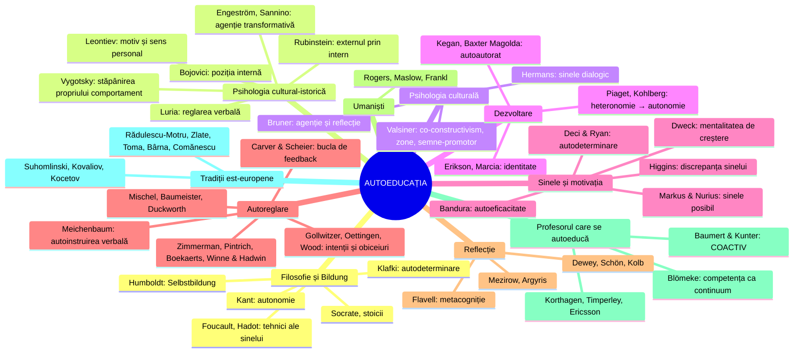
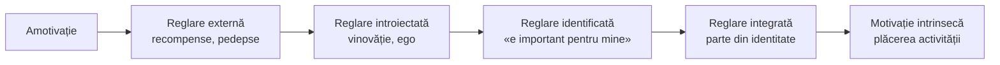
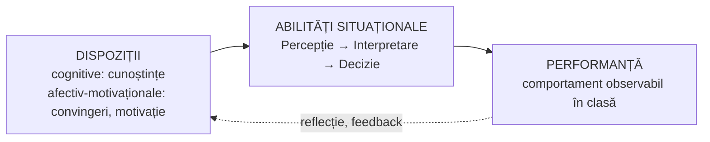
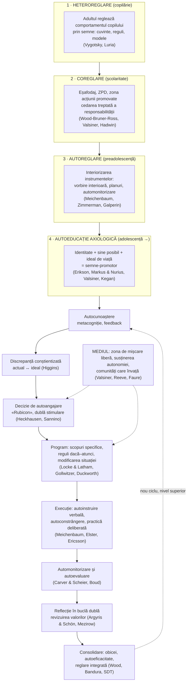

↑ [[3.6 Educația permanentă și autoeducația]] · [[00 MOC - Fundamentele științelor educației]]

> [!abstract] Scopul notei
> Conspectul [[3.6 Educația permanentă și autoeducația]] redă **ce spune manualul** despre autoeducație. Nota de față **corelează** afirmațiile manualului cu **teoriile științifice** care le explică, le susțin, le nuanțează sau le contrazic. Pentru fiecare familie de teorii: **ideea**, **autorii și aportul lor**, **corelarea cu manualul** (cu pagini), **implicații practice** și **gradul de relevanță**.

> [!info] Legenda relevanței pentru autoeducație
> - ★★★ **directă** — teoria explică chiar mecanismul autoeducației (trecerea de la „a fi educat” la „a te educa”)
> - ★★ **puternică** — explică o componentă-cheie (motivație, ideal, autocontrol, reflecție)
> - ★ **indirectă** — relevantă pentru un context anume (ex. autoeducația profesională a profesorului)

---

## 0. Harta teoriilor

---

## 1. Matricea de corelare: afirmațiile manualului × teorii

| # | Afirmația manualului (p.) | Teorii care o **explică / susțin** | Teorii care o **nuanțează / corectează** |
|---|---|---|---|
| 1 | Obiectul educației devine **subiect** al propriei educații (p. 109) | Vygotsky (stăpânirea propriului comportament), Valsiner (agenție, co-construcție), Klafki (autodeterminare), SDT (internalizare) | Freire, Vygotsky: nu te educi **singur**, ci prin mediere socială |
| 2 | Factorii externi **nu sunt suficienți**; e nevoie de **condiții interne** (p. 110) | Rubinstein („externul acționează prin intern”), Valsiner (transmitere **bidirecțională**), Piaget (construcție activă) | Bronfenbrenner, Vygotsky: condițiile interne sunt **ele însele** produse social |
| 3 | Autoeducația autentică apare la **sfârșitul preadolescenței** (p. 110–111) | Vygotsky (pedologia adolescentului), Bojovici (autodeterminare), Erikson (identitate), Piaget (operații formale), Steinberg (maturizarea controlului cognitiv) | Zimmerman, Whitebread: **forme timpurii** de autoreglare există de la preșcolaritate — „pregătirea” e reală și educabilă |
| 4 | Motorul: **modelul și idealul de viață** (p. 111) | Markus & Nurius (sinele posibil), Higgins (sinele ideal), Leontiev (motiv conducător), Valsiner (semne-promotor), Erikson | Oettingen: fantezia pozitivă despre ideal **scade** efortul dacă nu e contrastată cu obstacolele |
| 5 | **Autocunoașterea** e condiție prealabilă (p. 111–112) | Flavell, Nelson & Narens (metacogniție), Shavelson (conceptul de sine), Harter, McAdams (identitate narativă) | Wilson, Dunning (limitele introspecției): autocunoașterea are nevoie de **feedback extern** |
| 6 | **Program ferm** de lucru cu sine (p. 112, 113) | Locke & Latham (stabilirea scopurilor), Gollwitzer (intenții de implementare), Wood, Lally (formarea obiceiurilor) | Duckworth, Gendler & Gross: **modificarea situației** e mai eficientă decât voința pură |
| 7 | Metode de **autocontrol** (autoobservație, autoanaliză) (p. 114) | Carver & Scheier (bucla de feedback), Zimmerman (automonitorizare), Winne & Hadwin | — |
| 8 | Metode de **autostimulare** (autocomandă, autosugestie, autoconvingere) (p. 114) | Vygotsky, Luria (vorbirea interioară reglatoare), Meichenbaum (autoinstruirea verbală), Bandura (autoîntărire) | Coué (autosugestia) — istoric; eficiența sugestiei „pure” e **slab susținută empiric** |
| 9 | **Autoconstrângere**, autorenunțare, „luptă cu sine” (p. 112, 114) | Mischel (amânarea gratificației), Elster (angajamentul prealabil) | Criza replicării: **„epuizarea eului”** (Baumeister) nu s-a replicat (Hagger et al., 2016); Watts et al. (2018) reduc forța predictivă a testului marshmallow |
| 10 | **Autoevaluare**, jurnal intim, autoanaliză (p. 114–115) | Schön, Dewey (reflecție), Boud (autoevaluare), Black & Wiliam (evaluare formativă), Pennebaker (scriere expresivă), Moon (jurnale de învățare) | — |
| 11 | **Grade** ale autoeducației → **autodepășire** (p. 112) | Grow (SSDL), Kegan (ordinele conștiinței), Dreyfus (stadiile expertizei), Maslow, Frankl (autotranscendență) | — |
| 12 | Autoeducația ca **echilibru** între factorii externi și interni (p. 115) | Valsiner (zona de mișcare liberă / zona acțiunii promovate), Hadwin, Järvelä & Miller (hetero → co → autoreglare), Reeve (predare care susține autonomia) | — |
| 13 | Profesorul care nu învață el însuși e o absurditate (Noica, p. 104) | Blömeke (competența profesională ca continuum), Baumert & Kunter (autoreglarea ca fațetă a competenței, COACTIV), Korthagen, Timperley, Ericsson | — |
| 14 | Societatea ca **„cetate educativă”** (p. 113, 119) | Faure (1972), Senge (organizația care învață, „măiestria personală”), UNESCO (orașele care învață) | Biesta: riscul **„învățării ca obligație”** individuală |

---

## 2. Fundamente filosofice: autonomia și *Bildung*

**Ideea**: autoeducația are rădăcini în filosofia **grijii de sine** și în conceptul german ***Bildung*** — formarea omului prin propria activitate spirituală. ***Selbstbildung*** este, literal, **autoformare**.

| Autor | Lucrare, an | Aport | Relevanță |
|---|---|---|---|
| **Socrate** (prin Platon) | *Apologia*, *Alcibiade I* | „Cunoaște-te pe tine însuți”; viața neexaminată nu merită trăită; **grija de sine** | ★★ |
| **Stoicii** (Seneca, Epictet, Marc Aureliu) | *Scrisori către Lucilius*; *Manualul*; *Către sine* | **exerciții spirituale** zilnice: examenul de conștiință, pregătirea pentru adversitate, distincția între ce depinde și ce nu depinde de noi | ★★ |
| **Immanuel Kant** | *Ce este luminarea?* (1784); *Despre pedagogie* (1803) | ieșirea din **minorat** prin curajul de a gândi singur; educația trebuie să ducă la **autonomie morală** (legea morală dată sieși) | ★★ |
| **Wilhelm von Humboldt** | *Teoria formării omului* (fragment, cca 1793) | *Bildung* = dezvoltarea **cea mai înaltă și proporționată** a forțelor omului prin interacțiunea liberă cu lumea. Stă la baza **universității humboldtiene** (autonomie, unitatea cercetare–predare) | ★★★ |
| **Friedrich Nietzsche** | *Schopenhauer ca educator* (1874) | adevărații educatori te ajută să **devii ceea ce ești**; modelul ca eliberator, nu ca șablon | ★★ |
| **Wolfgang Klafki** | *Neue Studien zur Bildungstheorie und Didaktik* (1985) | *Bildung* ca dezvoltarea a trei capacități: **autodeterminare** (*Selbstbestimmung*), **codeterminare** (*Mitbestimmung*), **solidaritate**. Autonomia personală e legată de responsabilitatea socială | ★★★ |
| **Pierre Hadot** | *Exerciții spirituale și filosofie antică* (1981) | filosofia antică nu era teorie, ci **mod de viață** — un program de transformare de sine | ★★ |
| **Michel Foucault** | *Hermeneutica subiectului* (curs 1981–1982); *Technologies of the Self* (1988) | **„tehnologiile sinelui”**: practicile prin care individul acționează asupra propriului corp, gânduri și conduită ca să se transforme | ★★ |

> [!note] Corelare cu manualul
> - Lista metodelor de autoeducație (jurnal intim, meditație, examen de sine, autocritică, rugăciune — p. 113–115, după Comănescu) este practic un inventar al **„tehnologiilor sinelui”** din tradiția antică și creștină descrisă de Hadot și Foucault.
> - Formula lui Klafki (autodeterminare + codeterminare + solidaritate) răspunde celei mai importante lacune a manualului: legătura dintre **autoeducația individuală** și **dimensiunea socială** (p. 118: decizie „socială și/sau personală”).

---

## 3. Psihologia cultural-istorică (școala Vygotsky)

**Ideea centrală**: funcțiile psihice superioare (atenția voluntară, memoria logică, voința) apar **mai întâi între oameni** (plan interpsihic) și abia apoi **în interiorul persoanei** (plan intrapsihic), prin **interiorizarea semnelor** — în primul rând a limbajului. **Autoeducația este heteroeducație interiorizată**: copilul ajunge să-și aplice sieși instrumentele de reglare pe care adulții le-au folosit asupra lui.

### 3.1 Lev S. Vygotsky (1896–1934) — ★★★

| Concept | Lucrare | Explicație | Corelare cu manualul |
|---|---|---|---|
| **Legea genetică generală a dezvoltării culturale** | *Istoria dezvoltării funcțiilor psihice superioare* (scrisă 1931, publ. 1960) | orice funcție apare de două ori: întâi social, apoi individual | principiul corelației **heteroeducație → autoeducație** (p. 36–37) |
| **Semnul ca „instrument psihologic”** | idem | așa cum unealta acționează asupra naturii, semnul acționează **asupra propriei minți**. Ex.: nodul făcut la batistă ca să-ți amintești | metodele de autostimulare (autocomandă, maxime de viață, portretul-model — p. 114–115) sunt **semne folosite asupra propriei persoane** |
| **Stăpânirea propriului comportament** (*овладение своим поведением*) | idem | voința nu e o forță misterioasă, ci capacitatea de a te controla **indirect, prin mijloace culturale** (ex.: tragi la sorți ca să ieși din indecizie) | explică științific ce manualul numește „efort voluntar autoimpus” (p. 112) |
| **Vorbirea interioară** | *Gândire și limbaj* (1934) | vorbirea egocentrică a copilului devine vorbire interioară, cu **funcție de planificare și reglare** | baza **autocomenzii** și **autoconvingerii** |
| **Zona proximei dezvoltări** (ZPD) | *Gândire și limbaj*; lucrări din 1933–1934 | distanța dintre ce poate face copilul singur și ce poate face **cu ajutor**; ce face azi cu ajutor, mâine va face singur | justifică rolul profesorului ca **ajutor pentru autonomizare** (p. 107–108) |
| **Pedologia adolescentului** | *Pedologia adolescentului* (1929–1931) | în adolescență se formează **conștiința de sine**, gândirea în concepte și **interesele** ca motivație internă | susține plasarea autoeducației propriu-zise la **adolescență** (p. 110–111) |

> [!tip] De reținut
> Vygotsky oferă **mecanismul** care lipsește din manual: nu e suficient să spui că elevul „trebuie să devină subiect”. Trebuie să îi dai **instrumentele semiotice** (întrebări de automonitorizare, planuri, jurnale, criterii de autoevaluare), să le **folosiți împreună** și apoi să i le **cedezi treptat**.

### 3.2 Continuatorii

| Autor | Lucrare, an | Aport | Corelare | Relevanță |
|---|---|---|---|---|
| **Aleksandr R. Luria** | *The Role of Speech in the Regulation of Normal and Abnormal Behavior* (1961) | **reglarea verbală a comportamentului**: copilul mic urmează instrucțiunea adultului; apoi își dă singur instrucțiuni cu voce tare; apoi în gând | etapizarea **autocomenzii** și **autosugestiei** | ★★★ |
| **Aleksei N. Leontiev** | *Activitate, conștiință, personalitate* (1975) | teoria activității: activitate ← **motiv**, acțiune ← **scop**, operație ← condiții. Personalitatea = **ierarhia motivelor**; **sensul personal** al acțiunilor | **idealul de viață** funcționează ca **motiv conducător** care ierarhizează celelalte motive (p. 111) | ★★ |
| **Serghei L. Rubinstein** | *Ființă și conștiință* (1957) | **principiul determinismului**: cauzele externe acționează **prin intermediul condițiilor interne** | exact teza manualului: factorii externi nu declanșează singuri autoeducația (p. 110) | ★★★ |
| **Lidia I. Bojovici** | *Personalitatea și formarea ei în copilărie* (1968) | **poziția internă** a copilului; în adolescență apare **autodeterminarea** (planul de viață, alegerea profesiei, concepția despre lume) | vârsta apariției autoeducației și rolul **planului de viață** | ★★ |
| **Piotr I. Galperin** | lucrări din anii 1950–1970 | **formarea pe etape a acțiunilor mintale**: de la acțiunea materială, prin vorbirea cu voce tare, la acțiunea mintală automatizată | model didactic pentru **interiorizarea** metodelor de autocontrol | ★★ |
| **Yrjö Engeström** | *Learning by Expanding* (1987) | **învățarea expansivă**: oamenii își transformă **activ** propriile activități și contexte | autoeducația nu înseamnă doar adaptare, ci și **transformarea mediului** (lupta „cu lumea exterioară”, p. 112) | ★★ |
| **Annalisa Sannino** | *The emergence of transformative agency and double stimulation* (2015) | **agenția transformativă** apare prin **dubla stimulare** (Vygotsky): în fața unui conflict de motive, persoana creează un **al doilea stimul** (un artefact, o regulă, un plan) prin care își rezolvă singură impasul | cel mai precis model contemporan al **momentului de declanșare** a autoeducației: decizia de autoangajare (p. 110) | ★★★ |

---

## 4. Psihologia culturală contemporană

### 4.1 Jaan Valsiner (n. 1951) — ★★★

Psiholog estonian, a lucrat în SUA (Clark University), Danemarca (Aalborg) și Germania. Unul dintre principalii interpreți ai lui Vygotsky (**Valsiner & van der Veer**, *Understanding Vygotsky*, 1991) și fondator al **psihologiei culturale semiotice**.

| Concept | Lucrare | Explicație | Corelare cu autoeducația |
|---|---|---|---|
| **Co-constructivismul** și **transmiterea culturală bidirecțională** | *Human Development and Culture* (1989); *Culture and Human Development* (2000) | cultura **nu se copiază** în mintea individului: persoana **reconstruiește activ** mesajele sociale (**internalizare**) și le **reexprimă transformate** în lume (**externalizare**) | explică de ce aceeași educație produce oameni diferiți și de ce autoeducația e **creativă**, nu doar reproductivă. Oferă mecanismul „noului echilibru între factorii externi și interni” (p. 115) |
| **Cultura personală vs. cultura colectivă** | idem | fiecare om își construiește un sistem **unic** de sensuri și valori din resursele colective | **idealul de viață** e un produs al culturii personale, construit din modele colective (p. 111) |
| **Zona de mișcare liberă** (ZML) și **zona acțiunii promovate** (ZAP) | *Culture and the Development of Children's Action* (1987) | **ZML** = ce i se **permite** persoanei (limitele mediului); **ZAP** = ce i se **încurajează** activ. Împreună cu **ZPD** (Vygotsky) formează un sistem de trei zone. Dezvoltarea are loc când ZAP se află în ZPD și în interiorul ZML | model precis pentru **rolul profesorului**: autoeducația crește când adultul **lărgește treptat zona de libertate** și **promovează** (nu impune) acțiuni aflate la limita posibilităților elevului |
| **Semne-promotor** (*promoter signs*) | *Culture in Minds and Societies* (2007); *An Invitation to Cultural Psychology* (2014) | semne **generalizate** (valori, idealuri, principii de viață) care **orientează spre viitor** și reglează comportamentul în situații încă neîntâlnite | **idealul de viață**, **maxima de viață** și **modelul** (p. 111, 114) sunt semne-promotor: nu spun ce să faci acum, ci **orientează** alegerile viitoare |
| **Autoreglare semiotică** și **nedeterminare delimitată** | *Forms of dialogical relations and semiotic autoregulation within the self* (2002) | persoana își reglează sinele prin **dialogul** între poziții interne, mediat de semne; dezvoltarea e **deschisă**, dar în **limite** | „lupta cu sine” (p. 112) poate fi înțeleasă ca **dialog între poziții ale sinelui** (eul actual vs. eul dorit), nu ca simplă constrângere |
| **The Guided Mind** | *The Guided Mind: A Sociogenetic Approach to Personality* (1998) | personalitatea se formează sociogenetic, prin **ghidare socială** și **rezistență** personală la ghidare | autonomia include și **rezistența** la influențe (frontul exterior: modele negative, p. 112) |

> [!note] De ce e relevant Valsiner
> Manualul oscilează între „educația determină” și „individul se autodetermină”. Valsiner rezolvă tensiunea: dezvoltarea e **co-construită**. Mediul **delimitează și promovează**, persoana **selectează, transformă, rezistă și creează**. Autoeducația este **forma matură a acestei co-construcții**, când persoana își folosește intenționat propriile semne-promotor.

### 4.2 Alți autori ai perspectivei culturale

| Autor | Lucrare, an | Aport | Relevanță |
|---|---|---|---|
| **Hubert Hermans** (cu H. Kempen, R. van Loon) | *The dialogical self* (1992); *The Dialogical Self* (1993) | **sinele dialogic**: sinele e o „societate” de **poziții ale eului** (eu-elevul, eu-fiul, eu-sportivul) care dialoghează; dezvoltarea = reorganizarea acestor poziții | ★★ |
| **Jerome Bruner** | *Acts of Meaning* (1990); *The Culture of Education* (1996) | educația trebuie să cultive **agenția** (sentimentul că poți iniția și duce la capăt acțiuni), **reflecția**, **colaborarea**, **cultura**; conceptul de **„eșafodaj”** (Wood, Bruner & Ross, 1976) | ★★ |
| **Barbara Rogoff** | *Apprenticeship in Thinking* (1990) | **participarea ghidată** și **ucenicia în gândire** | ★ |

---

## 5. Teorii ale dezvoltării: de la heteronomie la autonomie

| Autor | Lucrare, an | Aport | Corelare | Relevanță |
|---|---|---|---|---|
| **Jean Piaget** | *Judecata morală la copil* (1932) | trecerea de la **morala heteronomă** (regula e sacră, impusă de adult; până pe la 7–8 ani) la **morala autonomă** (regula e acord reciproc), prin **cooperarea între egali**. Operațiile **formale** (de la ~11–12 ani) permit gândirea despre posibil și ideal | autoeducația axiologică cere **autonomie morală** (p. 112) și **gândire despre ideal** — posibilă abia la adolescență | ★★★ |
| **Lawrence Kohlberg** | teza (1958); *Essays on Moral Development* (1981, 1984) | 3 niveluri, 6 stadii: **preconvențional → convențional → postconvențional** (principii proprii) | „nivelul de responsabilitate și autonomie morală” (p. 112) ≈ tranziția spre **postconvențional** | ★★ |
| **Carol Gilligan** | *In a Different Voice* (1982) | etica **grijii** ca alternativă la etica justiției a lui Kohlberg | ★ |
| **Erik H. Erikson** | *Childhood and Society* (1950); *Identity: Youth and Crisis* (1968) | adolescența = criza **identitate vs. confuzie de rol**; identitatea presupune angajamente față de valori, profesie, concepție despre lume | „găsirea unei identități autentice” înainte de alegerea modelului (p. 112) | ★★★ |
| **James Marcia** | *Development and validation of ego-identity status* (1966) | 4 statusuri: **difuzie, preluare (foreclosure), moratoriu, identitate realizată** — după **explorare** și **angajament** | idealul preluat fără explorare (*foreclosure*) ≠ ideal asumat. Manualul cere **alegere conștientă** (p. 111) | ★★ |
| **Robert Kegan** | *The Evolving Self* (1982); *In Over Our Heads* (1994) | **ordinele conștiinței**: de la mintea „socializată” (definită de așteptările altora) la mintea **„autoautoare”** (*self-authoring*), care își construiește propriul sistem de valori | ★★★ |
| **Marcia Baxter Magolda** | *Making Their Own Way* (2001) | **autoautoratul** (*self-authorship*) la tineri: capacitatea de a-ți defini credințele, identitatea și relațiile — scop al educației universitare | ★★ |
| **Laurence Steinberg** | *A social neuroscience perspective on adolescent risk-taking* (2008) | **modelul sistemelor duale**: sistemul socio-emoțional (recompensă) se activează la pubertate, iar controlul cognitiv (cortexul prefrontal) se maturizează **până după 20 de ani** | nuanțează manualul: adolescența e perioada **nevoii maxime** de autoeducație, dar și a **vulnerabilității** controlului de sine | ★★ |

> [!warning] Nuanțare
> Manualul (p. 110) spune că înainte de adolescență nu există autoeducație propriu-zisă. Cercetările despre **autoreglarea timpurie** (ex. **David Whitebread**, studiile despre metacogniția și autoreglarea copiilor mici; programul preșcolar ***Tools of the Mind*** al Elenei Bodrova și Deborei Leong, inspirat de Vygotsky, evaluat de **Adele Diamond** et al. în *Science*, 2007) arată că **fundamentele** autoreglării se pot antrena **de la 4–5 ani**. Mai corect: **autoeducația axiologică** apare la adolescență, dar **autoreglarea** — premisa ei — se formează din copilăria timpurie.

---

## 6. Sinele: idealul, discrepanța, identitatea

| Autor | Lucrare, an | Teoria | Corelare cu manualul | Relevanță |
|---|---|---|---|---|
| **Hazel Markus & Paula Nurius** | *Possible selves* (1986) | **sinele posibil**: reprezentările despre cine ai putea deveni — **dorit** și **temut**. Funcționează ca **stimulente** și ca **standarde** de evaluare | **modelul și idealul de viață** (p. 111) = sinele posibil dorit; lupta cu slăbiciunile (p. 112) = evitarea sinelui temut. **Daphna Oyserman** a arătat experimental că sinele posibil școlar, legat de **strategii concrete**, îmbunătățește rezultatele elevilor (*School-to-Jobs*, anii 2000) | ★★★ |
| **E. Tory Higgins** | *Self-discrepancy: A theory relating self and affect* (1987) | **sinele actual** vs. **sinele ideal** (ce ți-ai dori) vs. **sinele datorat** (ce crezi că trebuie). Discrepanța actual–ideal produce **tristețe/descurajare**, cea actual–datorat produce **anxietate/vinovăție** | „conștiința clară a insuficiențelor personale” (p. 115) = **discrepanța conștientizată**, motor al schimbării. Dar prea mare → **descurajare** | ★★★ |
| **Richard Shavelson, J. Hubner, G. Stanton** | *Self-concept: Validation of construct interpretations* (1976) | **conceptul de sine ierarhic și multidimensional**: general → academic / social / emoțional / fizic → domenii specifice | autocunoașterea „la toate nivelurile personalității” (p. 111) are o structură **măsurabilă** | ★★ |
| **Susan Harter** | *The Construction of the Self* (1999) | dezvoltarea conceptului de sine și a stimei de sine pe vârste; în adolescență apar **„sinele multiple”** și conflictul dintre ele | ★★ |
| **Dan P. McAdams** | *The psychology of life stories* (2001) | **identitatea narativă**: ne construim sinele ca **poveste de viață**, cu sens și direcție | **jurnalul intim** (p. 113–115) e un instrument de **construcție narativă** a identității | ★★ |
| **Joseph Luft & Harrington Ingham** | **Fereastra Johari** (1955) | patru zone: deschisă, oarbă, ascunsă, necunoscută; zona oarbă se reduce prin **feedback** de la alții | autocunoașterea nu e doar introspecție: are nevoie de **ceilalți** | ★ |
| **Mielu Zlate** | *Eul și personalitatea* (1997) | tratare românească a **eului**: eul corporal, psihic, social, spiritual; **eul ideal** și **eul real** | sursă românească pentru „conștiința de sine” | ★★ |

---

## 7. Motivația: de ce se declanșează autoeducația

### 7.1 Teoria autodeterminării (SDT) — ★★★

- **Autori**: **Edward Deci & Richard Ryan** — *Intrinsic Motivation and Self-Determination in Human Behavior* (1985); *Self-Determination Theory* (2017).
- **Trei nevoi psihologice de bază**: **autonomie**, **competență**, **relaționare**. Când sunt satisfăcute, motivația devine mai autonomă și mai stabilă.
- **Continuumul internalizării** (subteoria integrării organismice):

> [!note] Corelare
> - Manualul spune că scopurile autoeducației sunt **alese de subiect și trăite ca proprii** (p. 111), spre deosebire de scopurile educației. În SDT: autoeducația cere **reglare identificată sau integrată**.
> - Condiția manualului — **„interiorizarea necesității”** de a-ți valorifica personalitatea (p. 112, după Nicola) — este **exact** procesul de internalizare descris de SDT.
> - **Johnmarshall Reeve** (*Why teachers adopt a controlling motivating style toward students and how they can become more autonomy supportive*, 2009) a arătat că profesorii pot fi formați să adopte un **stil care susține autonomia** (oferă alegeri, explică rațiunea sarcinilor, recunosc emoțiile negative), cu efecte pozitive asupra motivației și implicării elevilor.

### 7.2 Alte teorii motivaționale

| Autor | Lucrare, an | Teoria | Corelare | Relevanță |
|---|---|---|---|---|
| **Albert Bandura** | *Self-efficacy* (1977); *Self-Efficacy: The Exercise of Control* (1997) | **autoeficacitatea** = încrederea că poți realiza o acțiune. Surse: **experiențe de reușită**, modele, persuasiune verbală, stări fiziologice | „victoriile asupra sa” (p. 112) construiesc autoeficacitatea; **modelul** (p. 111) acționează prin învățare vicariantă | ★★★ |
| **Carol Dweck** | *Mindset* (2006) | **mentalitatea de creștere** (abilitățile se dezvoltă prin efort și strategii) vs. **fixă** | fără credința că te poți schimba, autoeducația nu are sens | ★★ |
| **Edwin Locke & Gary Latham** | *Building a practically useful theory of goal setting* (2002) | scopurile **specifice, dificile dar accesibile**, cu **feedback** și **angajament**, cresc performanța | idealul (general) trebuie tradus în **scopuri concrete** — cerința manualului de ideal „tangibil” (p. 111) | ★★ |
| **Gabriele Oettingen** | *Rethinking Positive Thinking* (2014) | **contrastarea mentală** și metoda **WOOP** (*Wish, Outcome, Obstacle, Plan*): simpla visare la ideal reduce efortul; contrastul cu obstacolele și planul „dacă–atunci” îl cresc | corectează o lectură naivă a „idealului de viață” | ★★ |
| **Abraham Maslow** | *Motivation and Personality* (1954); *Toward a Psychology of Being* (1962) | **autoactualizarea**; mai târziu, **autotranscendența** | „năzuința spre realizare de sine și autodepășire” (p. 111) | ★★ |
| **Viktor Frankl** | *Omul în căutarea sensului* (1946) | **voința de sens**; omul se realizează prin **autotranscendență** (o cauză, o persoană), nu prin preocuparea pentru sine | dimensiunea **morală și spirituală** prioritară în programul de autoformare (p. 112) | ★★ |

---

## 8. Autoreglarea și autocontrolul: cum funcționează „programul de lucru cu sine”

### 8.1 Modelele autoreglării

| Autor | Lucrare, an | Modelul | Relevanță |
|---|---|---|---|
| **G. Miller, E. Galanter, K. Pribram** | *Plans and the Structure of Behavior* (1960) | unitatea **TOTE** (*Test–Operate–Test–Exit*): comparare cu standardul → acțiune → recomparare | ★★ |
| **Charles Carver & Michael Scheier** | *Attention and Self-Regulation* (1981); *On the Self-Regulation of Behavior* (1998) | **teoria controlului**: comportamentul e o **buclă de feedback** — standard (scop), percepția stării actuale, comparare, reducerea discrepanței. Scopurile sunt **ierarhice** (de la „a fi un om bun” la „a mă trezi la 7”) | ★★★ |
| **Barbara Zimmerman** | *Attaining self-regulation: A social cognitive perspective* (2000) | **modelul ciclic** în 3 faze: **anticipare** (scopuri, planificare, autoeficacitate) → **performanță** (autoinstruire, automonitorizare) → **autoreflecție** (autoevaluare, atribuiri, reacții). Plus nivelurile de dezvoltare: **observare → imitare → autocontrol → autoreglare** | ★★★ |
| **Paul Pintrich** | *The role of goal orientation in self-regulated learning* (2000) | 4 faze × 4 domenii (**cognitiv, motivațional-afectiv, comportamental, contextual**) | ★★ |
| **Monique Boekaerts** | *Self-regulated learning: Where we are today* (1999) | **modelul în trei straturi**: reglarea **sinelui** (scopuri, resurse) → reglarea **procesului de învățare** (metacogniție) → reglarea **modului de procesare** (strategii cognitive) | ★★ |
| **Philip Winne & Allyson Hadwin** | *Studying as self-regulated learning* (1998) | modelul **COPES** (*Conditions, Operations, Products, Evaluations, Standards*), în 4 etape: definirea sarcinii → scopuri și plan → aplicarea strategiilor → **adaptare** | ★★ |
| **A. Hadwin, S. Järvelä, M. Miller** | *Self-regulated, co-regulated, and socially shared regulation of learning* (2011) | **coreglare** (un partener mai competent sprijină temporar) și **reglare social împărtășită** (grupul își reglează împreună învățarea) | ★★★ |

> [!tip] Corelare: metodele manualului = fazele autoreglării (Zimmerman)
> | Faza (Zimmerman) | Metodele manualului (p. 113–115) |
> |---|---|
> | **Anticipare** | autocunoaștere, alegerea modelului, program, autoconvingere |
> | **Performanță** | autocomandă, autosugestie, autoconstrângere, autoexersare, **autocontrol** (autoobservație) |
> | **Autoreflecție** | autoanaliză, **autoevaluare**, autoaprobare, autodezaprobare, jurnal intim |
>
> Iar succesiunea **hetero → co → autoreglare** (Hadwin et al.) corespunde principiului corelației **heteroeducație → autoeducație** (p. 36–37).

### 8.2 Autocontrolul, voința și obiceiurile

| Autor | Lucrare, an | Aport | Corelare / nuanțare | Relevanță |
|---|---|---|---|---|
| **Walter Mischel** | studiile despre amânarea gratificației (din anii 1960–1970); *The Marshmallow Test* (2014) | copiii care amână recompensa folosesc **strategii cognitive** (distragere, reprezentare „rece”), nu voință pură | **autoconstrângerea** e o **strategie învățabilă**. ⚠️ **Watts, Duncan & Quan (2018)**: legătura cu succesul ulterior e **mult mai slabă** după controlul factorilor familiali | ★★ |
| **Roy Baumeister** | *Ego depletion* (1998); *Willpower* (2011, cu J. Tierney) | voința ca **resursă limitată** care se epuizează | ⚠️ **Hagger et al. (2016)**: studiu multi-laborator **fără efect** de epuizare → nu trata voința ca „baterie”. Rămâne valabilă ideea că autocontrolul **se antrenează** | ★ |
| **Angela Duckworth, Tamar Gendler, James Gross** | *Situational strategies for self-control* (2016) | cele mai eficiente strategii de autocontrol acționează **înainte** de tentație: **selectarea și modificarea situației** (ex.: telefonul în altă cameră) | completează „lupta cu sine” (p. 112) cu **arhitectura mediului**. ⚠️ Conceptul de **grit** (Duckworth, 2007) e criticat: meta-analiza **Credé et al. (2017)** arată că aduce puțin peste conștiinciozitate | ★★★ |
| **Jon Elster** | *Ulysses and the Sirens* (1979) | **angajamentul prealabil**: Ulise se leagă de catarg ca să nu cedeze cântecului sirenelor | tehnica **autoconstrângerii anticipate** | ★★ |
| **Heinz Heckhausen & Peter Gollwitzer**; **Julius Kuhl** | **modelul Rubicon** al fazelor acțiunii (1987); **teoria controlului acțiunii** (Kuhl, anii 1980) | distincția dintre **deliberare** (a alege) și **implementare** (a face): după „trecerea Rubiconului” intervin mecanisme de **protecție a intenției** | momentul **„deciziei de autoangajare”** (p. 110) | ★★ |
| **Peter Gollwitzer** | *Goal achievement: The role of intentions* (1993); lucrări despre intențiile de implementare (1997–1999) | **intențiile de implementare** („dacă apare situația X, atunci fac Y”) cresc puternic probabilitatea acțiunii | transformă programul de autoeducație în **reguli dacă–atunci** | ★★★ |
| **Wendy Wood & David Neal** | *A new look at habits and the habit–goal interface* (2007) | obiceiurile sunt **asocieri context–răspuns**, declanșate automat | autoeducația durabilă mută comportamentul de la voință la **obicei** | ★★ |
| **Benjamin Lally et al.** | *How are habits formed* (2010) | automatizarea unui obicei nou a durat în medie **66 de zile** (interval foarte larg: 18–254) | realism privind durata unui program de autoeducație | ★ |
| **Donald Meichenbaum** (& J. Goodman) | *Training impulsive children to talk to themselves* (1971); *Cognitive-Behavior Modification* (1977) | **antrenamentul prin autoinstruire**: modelare de către adult → copilul spune cu voce tare → în șoaptă → în gând (aplicație directă a lui Vygotsky și Luria) | fundament empiric pentru **autocomandă** și **autoconvingere** | ★★★ |
| **Émile Coué** | *Stăpânirea de sine prin autosugestie conștientă* (1920–1922) | **autosugestia** repetitivă | origine istorică a „autosugestiei” din manual; eficiența ei independentă e **slab dovedită** | ★ |

---

## 9. Reflecția și metacogniția: autocunoașterea ca proces

| Autor | Lucrare, an | Aport | Corelare | Relevanță |
|---|---|---|---|---|
| **John Dewey** | *How We Think* (1910, ed. rev. 1933) | **gândirea reflexivă**: examinarea activă, persistentă și atentă a credințelor, pornind de la o situație problematică | autoanaliza ca **metodă**, nu ca introspecție pasivă | ★★ |
| **John H. Flavell** | *Metacognitive aspects of problem solving* (1976) | **metacogniția** = cunoașterea și reglarea propriilor procese cognitive | ★★★ |
| **Thomas Nelson & Louis Narens** | *Metamemory* (1990) | nivel **obiect** și nivel **meta**, legate prin **monitorizare** (meta ← obiect) și **control** (meta → obiect) | modelul cognitiv al **autocontrolului** și **autoanalizei** | ★★ |
| **Chris Argyris & Donald Schön** | *Theory in Practice* (1974) | **învățare în buclă simplă** (corectezi acțiunea) vs. **în buclă dublă** (îți revizuiești **valorile și presupozițiile**) | autoeducația axiologică (p. 110) = **buclă dublă** | ★★ |
| **Donald Schön** | *The Reflective Practitioner* (1983) | **reflecția în acțiune** și **reflecția asupra acțiunii** | autoeducația profesională | ★★ |
| **David Kolb** | *Experiential Learning* (1984) | ciclul experiență → reflecție → conceptualizare → experimentare | structura unui ciclu de autoeducație | ★★ |
| **Jack Mezirow** | *Transformative Dimensions of Adult Learning* (1991) | **învățarea transformativă** prin reflecție critică asupra **perspectivelor de sens** | „schimbarea stereotipurilor cognitive” (p. 107–108) | ★★ |
| **David Boud** | *Enhancing Learning through Self Assessment* (1995) | autoevaluarea ca **competență** care se învață: stabilirea criteriilor + judecata asupra propriei munci | ★★ |
| **Paul Black & Dylan Wiliam** | *Assessment and classroom learning* (1998) | evaluarea **formativă**, inclusiv **autoevaluarea** și **evaluarea între colegi**, are efecte substanțiale asupra învățării | școala poate **antrena** autoevaluarea (manualul: profesorul îi pune pe elevi în situații de autoevaluare, p. 108) | ★★ |
| **James Pennebaker** (& S. Beall) | *Confronting a traumatic event* (1986) | **scrierea expresivă** despre experiențe dificile are efecte pozitive asupra sănătății și bunăstării | fundament empiric pentru **jurnalul intim** (p. 113–115) | ★★ |
| **Jennifer Moon** | *Learning Journals* (1999) | **jurnalele de învățare** ca instrument de reflecție | ★ |

---

## 10. Autoeducația profesională: profesorul care învață

> [!quote] Punctul de pornire din manual
> O școală în care profesorul nu învață el însuși este o absurditate (C. Noica, citat la p. 104).

### 10.1 Sigrid Blömeke — ★ (indirectă, dar importantă)

- Cercetătoare germană (Humboldt-Universität zu Berlin, apoi Universitetet i Oslo — Centre for Educational Measurement), coordonatoare a componentei germane a studiului internațional **TEDS-M** (*Teacher Education and Development Study in Mathematics*, IEA, 2008), care a comparat formarea inițială a profesorilor de matematică în **17 țări**.
- **Blömeke, Gustafsson & Shavelson**, *Beyond dichotomies: Competence viewed as a continuum* (*Zeitschrift für Psychologie*, 2015):
  - competența nu e o dihotomie (fie cunoștințe, fie performanță), ci un **continuum**;
  - **dispoziții** — **cognitive** (cunoștințe profesionale) și **afectiv-motivaționale** (convingeri, motivație) → **abilități specifice situației** — modelul **PID**: **Percepția** evenimentelor din clasă, **Interpretarea** lor, **Decizia** de acțiune → **performanță** observabilă.

> [!note] De ce e relevantă pentru autoeducație
> Blömeke **nu** scrie despre autoeducație ca atare. Modelul ei arată însă **ce anume** trebuie să-și dezvolte un profesor prin autoeducație profesională și **de ce cunoștințele nu sunt suficiente**: ele trebuie transformate în **percepție și decizie în situație**. Se învață prin **reflecție sistematică asupra practicii** (analiza propriilor lecții înregistrate video, discuții cu colegii). În modelul înrudit **COACTIV** (Baumert & Kunter, mai jos), **autoreglarea profesională** apare explicit ca **fațetă a competenței**.

### 10.2 Alți autori

| Autor | Lucrare, an | Aport | Relevanță |
|---|---|---|---|
| **Jürgen Baumert & Mareike Kunter** | *Stichwort: Professionelle Kompetenz von Lehrkräften* (2006); proiectul **COACTIV** | modelul competenței profesionale a profesorului: **cunoștințe profesionale + convingeri/valori + orientări motivaționale + autoreglare profesională** (angajament echilibrat cu distanțarea, pentru a preveni epuizarea) | ★★ |
| **Miriam Sherin & Elizabeth van Es** | *Effects of video club participation on teachers' professional vision* (2009) | **„vederea profesională”** (*noticing*) se dezvoltă prin analiza **video** a propriilor lecții în grupuri de colegi | ★★ |
| **Fred Korthagen** | *In search of the essence of a good teacher* (2004) | **modelul „ceapă”** (niveluri: mediu → comportament → competențe → convingeri → identitate → **misiune**); **reflecția de profunzime** (*core reflection*) | ★★★ |
| **Helen Timperley** (et al.) | *Teacher Professional Learning and Development: Best Evidence Synthesis* (2007); *Teacher professional learning and development* (IAE, 2008) | **ciclul de cercetare și construire a cunoașterii**: ce au nevoie elevii mei? → ce trebuie să învăț eu? → acțiune → evaluarea impactului asupra elevilor | ★★ |
| **Christopher Day** | *Developing Teachers: The Challenges of Lifelong Learning* (1999) | dezvoltarea profesională ca **învățare pe tot parcursul vieții**; rolul **pasiunii** și al **identității** | ★★ |
| **K. Anders Ericsson** (cu R. Krampe, C. Tesch-Römer) | *The role of deliberate practice in the acquisition of expert performance* (1993) | **practica deliberată**: exersare intenționată a punctelor slabe, cu **feedback** și **scopuri precise**. ⚠️ **Macnamara et al. (2014)**: explică doar o parte din variația performanței, diferită pe domenii | ★★ |
| **Hubert & Stuart Dreyfus** | *Mind over Machine* (1986) | **5 stadii ale expertizei**: novice → începător avansat → competent → performant → expert | ★ |

> [!tip] Corelare
> „**Autoexersarea**” și „**programul riguros de lucru**” din manual (p. 112, 114) sunt, în limbajul cercetării despre expertiză, **practică deliberată**. Diferența: Ericsson insistă pe **feedback extern** și pe **antrenor**, adică autoeducația eficientă nu exclude heteroeducația.

---

## 11. Perspective umaniste

| Autor | Lucrare, an | Aport | Relevanță |
|---|---|---|---|
| **Carl Rogers** | *On Becoming a Person* (1961); *Freedom to Learn* (1969) | **tendința de actualizare**; învățarea semnificativă e **autoinițiată**; profesorul ca **facilitator**, cu trei condiții: **autenticitate, acceptare necondiționată, empatie** | ★★★ |
| **Abraham Maslow** | vezi §7.2 | autoactualizarea; experiențele de vârf | ★★ |
| **Viktor Frankl** | vezi §7.2 | sens, responsabilitate, autotranscendență | ★★ |

---

## 12. Tradiții est-europene: pedagogia autoeducației

### 12.1 Tradiția sovietică (sursă a terminologiei metodelor din manual)

| Autor | Lucrare, an | Aport | Relevanță |
|---|---|---|---|
| **Vasili Suhomlinski** | *Cum să educăm un om adevărat* (publ. postum, 1979) și alte lucrări | autoeducația ca **scop suprem al educației**; școala de la Pavlîș: educație prin muncă, natură, frumos, **„a te educa singur”** | ★★ |
| **A. G. Kovaliov** | *Autoeducația școlarilor* (1967) | etapele autoeducației la școlari; formarea calităților **moral-volitive** | ★★ |
| **A. I. Kocetov** | lucrări despre organizarea autoeducației școlarilor (anii 1970–1980) | **organizarea pedagogică** a autoeducației; rolul profesorului | ★★ |
| **L. I. Ruvinski** | *Autoeducația personalității* (1984) | metodele **autoinfluențării**: autoconvingere, autoangajare, autocomandă, autosugestie, autoîntărire | ★★ |

### 12.2 Tradiția românească și moldovenească

| Autor | Lucrare, an | Aport | Relevanță |
|---|---|---|---|
| **Constantin Rădulescu-Motru** | *Personalismul energetic* (1927); *Vocația* (1932) | personalitatea ca **energie** orientată de **vocație**; omul de vocație își realizează sinele prin muncă | ★★ |
| **Steliana Toma** | *Autoeducația. Sens și devenire* (1983) | educatul devine educator al său | ★★★ |
| **Andrei Bârna** | *Autoeducația* (1995) | clasificarea metodelor după **procesele psihice** | ★★★ |
| **Ioan Comănescu** | *Autoeducația azi și mâine* (1996) | clasificarea **psiho-pedagogică** a metodelor | ★★★ |
| **Mielu Zlate** | *Eul și personalitatea* (1997) | teoria **eului** | ★★ |
| **Ioan Nicola** | *Tratat de pedagogie școlară* | **condițiile** autoeducației | ★★ |
| **Nicolae Silistraru**, **Vladimir Andrițchi** (R. Moldova) | *Valori ale educației moderne* (2006); *Formarea capacităților de autoeducație…* (2007) | valorile autoeducației; perspectiva vârstelor | ★★ |

→ Detalii în [[3.6 Educația permanentă și autoeducația#10.5 Tradiția sovietică/rusă (context pentru bibliografia din R. Moldova)]] și [[3.6 Educația permanentă și autoeducația#10.6 Autori români și moldoveni despre autoeducație]].

---

## 13. Modelul integrator: cum se naște și cum funcționează autoeducația

Sinteză proprie, construită din teoriile de mai sus și din manual:

---

## 14. Limite, controverse și precauții

> [!warning] Ce trebuie citit cu spirit critic
> 1. **Criza replicării** în psihologia autocontrolului: **epuizarea eului** (Hagger et al., 2016), **testul marshmallow** (Watts et al., 2018), **grit** (Credé et al., 2017), **mentalitatea de creștere** — efecte **mici** în medie (Sisk et al., 2018), dar pozitive la elevii în risc într-un studiu național amplu (Yeager et al., 2019, *Nature*). **Concluzie**: intervențiile de „autoeducație” trebuie evaluate **empiric**, nu doar argumentate moral.
> 2. **Individualizarea excesivă**: accentul pe „lupta cu sine” poate transforma problemele **structurale** (sărăcie, lipsa accesului) în **vini individuale**. Critici: **Freire**, **Biesta**; Vygotsky și Valsiner arată că autonomia e **social construită**.
> 3. **Limitele introspecției**: oamenii își cunosc greu cauzele propriului comportament (**Nisbett & Wilson**, *Telling more than we can know*, 1977) și își supraestimează competența (**Kruger & Dunning**, 1999). **Autocunoașterea** are nevoie de **date și feedback extern**.
> 4. **Adolescența** nu e doar vârsta autoeducației, ci și a **vulnerabilității** controlului de sine (Steinberg). De aici nevoia de **coreglare** și de medii protectoare.
> 5. **Dimensiunea spirituală și religioasă** a metodelor (rugăciune, meditație) e legitimă cultural, dar în școala publică trebuie tratată **opțional și nonconfesional**; **mindfulness**-ul are o bază empirică mixtă în școli (ex. studiul MYRIAD, Kuyken et al., 2022, fără efecte superioare față de programul obișnuit).

---

## 15. Implicații pentru profesor: cum formezi capacitatea de autoeducație

| Principiu | Practică concretă | Fundament |
|---|---|---|
| **Cedarea treptată a responsabilității** | „Eu fac – facem împreună – faci tu cu ajutor – faci singur” | Pearson & Gallagher (1983); Vygotsky; Grow (1991) |
| **Eșafodaj care se retrage** | fișe de planificare, liste de verificare, întrebări de automonitorizare, retrase pe măsură ce elevul progresează | Wood, Bruner & Ross (1976) |
| **Lărgirea zonei de libertate** | alegeri reale (teme, produse, ritm), în limite clare | Valsiner (ZML/ZAP); Reeve (2009) |
| **Instrumente semiotice explicite** | jurnal de învățare, portofoliu, rubrici de autoevaluare, planuri WOOP | Vygotsky; Boud; Oettingen |
| **Autoinstruire verbală modelată** | profesorul **gândește cu voce tare** rezolvarea unei probleme; elevii imită | Meichenbaum; Luria |
| **Sine posibil + strategii** | activități despre „cine vreau să fiu peste 5 ani”, legate de pași concreți | Markus & Nurius; Oyserman |
| **Susținerea autonomiei** | explicarea rațiunii sarcinilor, recunoașterea emoțiilor, limbaj neimperativ | Deci & Ryan; Reeve |
| **Evaluare formativă și autoevaluare** | criterii de succes clare, autoevaluare înainte de feedback, evaluare între colegi | Black & Wiliam; Boud |
| **Profesorul ca model de autoeducație** | profesorul își analizează propriile lecții, învață vizibil, recunoaște greșeli | Noica; Korthagen; Timperley; Blömeke |

---

## 16. Întrebări și teme de aprofundare

1. Explicați de ce, pentru Vygotsky, autoeducația este **heteroeducație interiorizată**. Ce rol joacă semnele?
2. Cum explică principiul lui Rubinstein afirmația manualului că factorii externi nu declanșează singuri autoeducația?
3. Explicați zonele lui Valsiner (ZML, ZAP) în raport cu ZPD și propuneți o activitate care le folosește.
4. Ce sunt semnele-promotor? De ce idealul de viață este un semn-promotor?
5. Corelați „conștiința insuficiențelor personale” cu teoria discrepanței sinelui (Higgins). Când devine discrepanța demotivantă?
6. Plasați metodele de autoeducație ale lui Comănescu în fazele modelului lui Zimmerman.
7. Ce ne învață criza replicării despre „voință” și „autoconstrângere”?
8. Explicați modelul competenței ca continuum (Blömeke et al., 2015). Cum ar arăta un plan de autoeducație profesională pentru un profesor debutant, construit pe modelul PID?
9. Elaborați un plan de autoeducație (tema manualului) care folosește cel puțin cinci teorii din această notă.

---

## 17. Bibliografie

**Filosofie și Bildung**
- Foucault, M. (1988). Technologies of the self. În L. H. Martin, H. Gutman, P. H. Hutton (eds.), *Technologies of the Self*. Amherst: University of Massachusetts Press.
- Hadot, P. (1981). *Exercices spirituels et philosophie antique*. Paris: Études Augustiniennes.
- Kant, I. (1784). *Beantwortung der Frage: Was ist Aufklärung?*; (1803). *Über Pädagogik*.
- Klafki, W. (1985). *Neue Studien zur Bildungstheorie und Didaktik*. Weinheim: Beltz.
- Nietzsche, F. (1874). *Schopenhauer als Erzieher*.

**Psihologia cultural-istorică și culturală**
- Bojovici, L. I. (1968). *Личность и её формирование в детском возрасте*. Moscova: Prosveșcenie.
- Bruner, J. (1996). *The Culture of Education*. Cambridge, MA: Harvard University Press.
- Engeström, Y. (1987). *Learning by Expanding*. Helsinki: Orienta-Konsultit.
- Hermans, H. J. M., Kempen, H. J. G., van Loon, R. J. P. (1992). The dialogical self. *American Psychologist*, 47(1), 23–33.
- Leontiev, A. N. (1975). *Деятельность. Сознание. Личность*. Moscova.
- Luria, A. R. (1961). *The Role of Speech in the Regulation of Normal and Abnormal Behavior*. Oxford: Pergamon.
- Rubinstein, S. L. (1957). *Бытие и сознание*. Moscova.
- Sannino, A. (2015). The emergence of transformative agency and double stimulation. *Learning, Culture and Social Interaction*, 4, 1–3.
- Valsiner, J. (1987). *Culture and the Development of Children's Action*. Chichester: Wiley.
- Valsiner, J. (1998). *The Guided Mind: A Sociogenetic Approach to Personality*. Cambridge, MA: Harvard University Press.
- Valsiner, J. (2000). *Culture and Human Development*. London: Sage.
- Valsiner, J. (2002). Forms of dialogical relations and semiotic autoregulation within the self. *Theory & Psychology*, 12(2), 251–265.
- Valsiner, J. (2014). *An Invitation to Cultural Psychology*. London: Sage.
- Van der Veer, R., Valsiner, J. (1991). *Understanding Vygotsky: A Quest for Synthesis*. Oxford: Blackwell.
- Vygotsky, L. S. (1934). *Мышление и речь* (*Gândire și limbaj*); (1931/1960). *История развития высших психических функций*.
- Wood, D., Bruner, J. S., Ross, G. (1976). The role of tutoring in problem solving. *Journal of Child Psychology and Psychiatry*, 17(2), 89–100.

**Dezvoltare, sine, identitate**
- Baxter Magolda, M. B. (2001). *Making Their Own Way*. Sterling, VA: Stylus.
- Erikson, E. H. (1968). *Identity: Youth and Crisis*. New York: Norton.
- Harter, S. (1999). *The Construction of the Self*. New York: Guilford.
- Higgins, E. T. (1987). Self-discrepancy: A theory relating self and affect. *Psychological Review*, 94(3), 319–340.
- Kegan, R. (1994). *In Over Our Heads*. Cambridge, MA: Harvard University Press.
- Marcia, J. E. (1966). Development and validation of ego-identity status. *Journal of Personality and Social Psychology*, 3(5), 551–558.
- Markus, H., Nurius, P. (1986). Possible selves. *American Psychologist*, 41(9), 954–969.
- McAdams, D. P. (2001). The psychology of life stories. *Review of General Psychology*, 5(2), 100–122.
- Piaget, J. (1932). *Le jugement moral chez l'enfant*. Paris: Alcan.
- Shavelson, R. J., Hubner, J. J., Stanton, G. C. (1976). Self-concept: Validation of construct interpretations. *Review of Educational Research*, 46(3), 407–441.
- Steinberg, L. (2008). A social neuroscience perspective on adolescent risk-taking. *Developmental Review*, 28(1), 78–106.
- Zlate, M. (1997). *Eul și personalitatea*. București: Trei.

**Motivație și autoreglare**
- Bandura, A. (1997). *Self-Efficacy: The Exercise of Control*. New York: Freeman.
- Boekaerts, M. (1999). Self-regulated learning: Where we are today. *International Journal of Educational Research*, 31(6), 445–457.
- Carver, C. S., Scheier, M. F. (1998). *On the Self-Regulation of Behavior*. Cambridge University Press.
- Credé, M., Tynan, M. C., Harms, P. D. (2017). Much ado about grit. *Journal of Personality and Social Psychology*, 113(3), 492–511.
- Deci, E. L., Ryan, R. M. (1985). *Intrinsic Motivation and Self-Determination in Human Behavior*. New York: Plenum.
- Duckworth, A. L., Gendler, T. S., Gross, J. J. (2016). Situational strategies for self-control. *Perspectives on Psychological Science*, 11(1), 35–55.
- Elster, J. (1979). *Ulysses and the Sirens*. Cambridge University Press.
- Gollwitzer, P. M., Brandstätter, V. (1997). Implementation intentions and effective goal pursuit. *Journal of Personality and Social Psychology*, 73(1), 186–199.
- Hadwin, A. F., Järvelä, S., Miller, M. (2011). Self-regulated, co-regulated, and socially shared regulation of learning. În D. Schunk, J. Greene (eds.), *Handbook of Self-Regulation of Learning and Performance*. New York: Routledge.
- Hagger, M. S. et al. (2016). A multilab preregistered replication of the ego-depletion effect. *Perspectives on Psychological Science*, 11(4), 546–573.
- Lally, P., van Jaarsveld, C., Potts, H., Wardle, J. (2010). How are habits formed. *European Journal of Social Psychology*, 40(6), 998–1009.
- Locke, E. A., Latham, G. P. (2002). Building a practically useful theory of goal setting and task motivation. *American Psychologist*, 57(9), 705–717.
- Meichenbaum, D., Goodman, J. (1971). Training impulsive children to talk to themselves. *Journal of Abnormal Psychology*, 77(2), 115–126.
- Oettingen, G. (2014). *Rethinking Positive Thinking*. New York: Current.
- Reeve, J. (2009). Why teachers adopt a controlling motivating style toward students and how they can become more autonomy supportive. *Educational Psychologist*, 44(3), 159–175.
- Ryan, R. M., Deci, E. L. (2017). *Self-Determination Theory*. New York: Guilford.
- Sisk, V. F. et al. (2018). To what extent and under which circumstances are growth mind-sets important to academic achievement? *Psychological Science*, 29(4), 549–571.
- Watts, T. W., Duncan, G. J., Quan, H. (2018). Revisiting the marshmallow test. *Psychological Science*, 29(7), 1159–1177.
- Winne, P. H., Hadwin, A. F. (1998). Studying as self-regulated learning. În D. Hacker, J. Dunlosky, A. Graesser (eds.), *Metacognition in Educational Theory and Practice*. Mahwah: Erlbaum.
- Wood, W., Neal, D. T. (2007). A new look at habits and the habit–goal interface. *Psychological Review*, 114(4), 843–863.
- Yeager, D. S. et al. (2019). A national experiment reveals where a growth mindset improves achievement. *Nature*, 573, 364–369.
- Zimmerman, B. (2000). Attaining self-regulation: A social cognitive perspective. În M. Boekaerts, P. Pintrich, M. Zeidner (eds.), *Handbook of Self-Regulation*. San Diego: Academic Press.

**Reflecție, metacogniție, evaluare**
- Argyris, C., Schön, D. (1974). *Theory in Practice*. San Francisco: Jossey-Bass.
- Black, P., Wiliam, D. (1998). Assessment and classroom learning. *Assessment in Education*, 5(1), 7–74.
- Boud, D. (1995). *Enhancing Learning through Self Assessment*. London: Kogan Page.
- Flavell, J. H. (1976). Metacognitive aspects of problem solving. În L. Resnick (ed.), *The Nature of Intelligence*. Hillsdale: Erlbaum.
- Nelson, T. O., Narens, L. (1990). Metamemory: A theoretical framework and new findings. *Advances in Experimental Social Psychology*, 26, 125–173.
- Nisbett, R. E., Wilson, T. D. (1977). Telling more than we can know. *Psychological Review*, 84(3), 231–259.
- Pennebaker, J. W., Beall, S. K. (1986). Confronting a traumatic event. *Journal of Abnormal Psychology*, 95(3), 274–281.
- Schön, D. A. (1983). *The Reflective Practitioner*. New York: Basic Books.

**Profesorul și expertiza**
- Baumert, J., Kunter, M. (2006). Stichwort: Professionelle Kompetenz von Lehrkräften. *Zeitschrift für Erziehungswissenschaft*, 9(4), 469–520.
- Blömeke, S., Gustafsson, J.-E., Shavelson, R. J. (2015). Beyond dichotomies: Competence viewed as a continuum. *Zeitschrift für Psychologie*, 223(1), 3–13.
- Day, C. (1999). *Developing Teachers: The Challenges of Lifelong Learning*. London: Falmer.
- Ericsson, K. A., Krampe, R. T., Tesch-Römer, C. (1993). The role of deliberate practice in the acquisition of expert performance. *Psychological Review*, 100(3), 363–406.
- Korthagen, F. A. J. (2004). In search of the essence of a good teacher. *Teaching and Teacher Education*, 20(1), 77–97.
- Macnamara, B. N., Hambrick, D. Z., Oswald, F. L. (2014). Deliberate practice and performance in music, games, sports, education, and professions. *Psychological Science*, 25(8), 1608–1618.
- Pearson, P. D., Gallagher, M. C. (1983). The instruction of reading comprehension. *Contemporary Educational Psychology*, 8(3), 317–344.
- Sherin, M. G., van Es, E. A. (2009). Effects of video club participation on teachers' professional vision. *Journal of Teacher Education*, 60(1), 20–37.
- Timperley, H., Wilson, A., Barrar, H., Fung, I. (2007). *Teacher Professional Learning and Development: Best Evidence Synthesis Iteration*. Wellington: Ministry of Education.

**Umaniști și alții**
- Frankl, V. E. (1946). *…trotzdem Ja zum Leben sagen* (*Omul în căutarea sensului*).
- Maslow, A. H. (1962). *Toward a Psychology of Being*. Princeton: Van Nostrand.
- Rogers, C. R. (1961). *On Becoming a Person*. Boston: Houghton Mifflin.
- Senge, P. (1990). *The Fifth Discipline*. New York: Doubleday.

**Surse online consultate**
- [Blömeke, Gustafsson & Shavelson (2015) — Semantic Scholar](https://www.semanticscholar.org/paper/Beyond-dichotomies:-Competence-viewed-as-a-Bl%C3%B6meke-Gustafsson/0098d80a5130ac53b8cbd1d9926ce29b55d2045f)
- [Valsiner (2002), *Forms of Dialogical Relations and Semiotic Autoregulation within the Self* — SAGE](https://journals.sagepub.com/doi/abs/10.1177/0959354302012002633)
- [Aplicarea teoriei zonelor lui Valsiner în clasele de matematică — Springer](https://link.springer.com/article/10.1007/s10649-012-9426-6)
